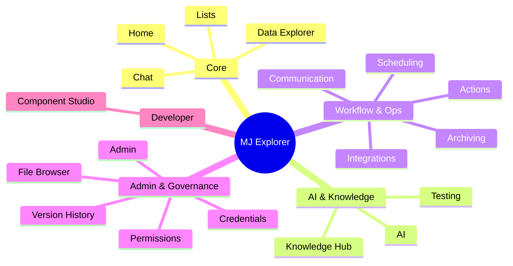

# MJ Explorer · Application Sitemap

> **Source:** generated from `metadata/applications/*.json` on 2026-05-08.
> **Companion to:** [`plans/explorer-layout-templates.md`](explorer-layout-templates.md) (structural inventory), [`plans/explorer-ia-progress.md`](explorer-ia-progress.md) (current consolidation work).
>
> **Reading order:** start with the at-a-glance map below, then the table, then drill into any group that matters for your task. Cross-cutting paths (record viewer, settings, search) live at the bottom because they don't appear in nav metadata.

## At a glance

**20 apps · ~60 nav-item resources** (plus the universal record-viewer route and Settings, which aren't enumerated in app metadata).

## Quick reference

Sorted by user-facing display order (`DefaultSequence`). Sub-page counts are nav items only — they don't count drill-downs, record viewers, or modals.

| # | App | Icon | Sub-pages | Default user app? | Brief |
|---|---|---|---|---|---|
| -1 | **Home** | 🏠 fa-home | 1 | ✅ | Personalized landing — quick access, pinned items, app launcher |
| 1 | **Chat** | 💬 fa-comments | 3 | ✅ | Agent conversations, artifact collections, tasks |
| 2 | **Data Explorer** | 🧭 fa-compass | 3 | ✅ | Card/grid/relationship views across entities; query + dashboard browsers |
| 50 | **Lists** | ✅ fa-list-check | 3 | ✅ | User-defined collections of records, with bulk operations |
| 999 | **Admin** | 🔧 fa-screwdriver-wrench | 4 | — | Identity, schema, monitoring, dev tools — aggregate admin |
| 1000 | **Actions** | ⚡ fa-bolt | 3 | ✅ | Workflow actions; overview, hierarchical explorer, run monitor |
| 1001 | **AI** | 🤖 fa-robot | 8 | — | Agents, prompts, models, requests, MCP, analytics, config |
| 1002 | **Component Studio** | 🧩 fa-puzzle-piece | 0 (no nav) | — | Authoring shell for reusable UI components |
| 1003 | **Scheduling** | 📅 fa-calendar-check | 3 | ✅ | Scheduled jobs — dashboard, jobs grid, activity log |
| 1004 | **Communication** | 📡 fa-satellite-dish | 5 | — | Outbound comms — monitor, logs, providers, templates, runs |
| 1004 | **Testing** | ✓ fa-vial-circle-check | 5 | ✅ | AI agent test framework — overview, explorer, runs, analytics, review |
| 1005 | **Credentials** | 🔑 fa-key | 5 | — | API keys & secrets — overview, list, types, categories, audit |
| 1006 | **Integrations** | 🔌 fa-plug-circle-bolt | 4 | — | External system sync — overview, connections, activity, schedules |
| 1010 | **File Browser** | 📁 fa-folder-tree | 1 | — | Browse files across storage providers |
| 1010 | **Knowledge Hub** | 🧠 fa-brain | 7 | — | Classify, tags, clusters, duplicates, analytics, vectors, config |
| 1010 | **Version History** | 🌿 fa-code-branch | 4 | — | Labels, diff viewer, restore history, dependency graph |
| 1050 | **Archiving** | 📦 fa-box-archive | 2 | — | Archive configs + run history |
| 1100 | **Permissions** | 🛡 fa-shield-halved | 3 | — | User access, resource access, audit log |

## Detailed tree

Format: `Nav label` *(driver class)* — pages with *(default)* are what loads when you click the app from the launcher.

### Core (the 4 default user apps)

#### 🏠 Home
> Personalized home screen with quick access to all applications.

- `Home` *(HomeDashboard)* — **(default)**

#### 💬 Chat
> Agent conversations, artifact collections, and tasks.

- `Conversations` *(ChatConversationsResource)* — **(default)**
- `Collections` *(ChatCollectionsResource)*
- `Tasks` *(ChatTasksResource)*

#### 🧭 Data Explorer
> Power user interface for exploring data across entities with card-based browsing, grid views, and relationship visualization.

- `Data` *(DataExplorerResource)* — **(default)**
- `Queries` *(QueryBrowserResource)*
- `Dashboards` *(DashboardBrowserResource)*

#### ✅ Lists
> Manage user-defined collections of records across the system.

- `Lists` *(ListsBrowseResource)* — **(default)**
- `Operations` *(ListsOperationsResource)*
- `Categories` *(ListsCategoriesResource)*

### AI & Knowledge

#### 🤖 AI
> AI Administration.

- `Overview` *(AIMonitorResource)* — **(default)** · hero-landing layout, not a standard header
- `Agents` *(AIAgentsResource)* · Template A (left filter sidebar)
- `Agent Requests` *(AIAgentRequestsResource)* · header with search + pending badge
- `Prompts` *(AIPromptsResource)* · Template A
- `Models` *(AIModelsResource)* · Template A
- `MCP` *(MCPResource)* · Template B (tabs in header)
- `Analytics` *(AIAnalyticsResource)* · Template A — uses the new **mj-filter-popover** prototype
- `Configuration` *(AIConfigResource)* · Template A

#### 🧠 Knowledge Hub
> Unified knowledge management: semantic search, vector management, duplicate detection, content classification, and AI assistant.

- `Classify` *(AutotaggingPipelineResource)* — **(default)**
- `Tags` *(Tags)*
- `Clusters` *(ClusterVisualizationResource)*
- `Duplicates` *(DuplicateDetectionResource)*
- `Analytics` *(AnalyticsResource)* — note: different from AI/Analytics
- `Vectors` *(VectorManagementResource)*
- `Configuration` *(KnowledgeConfigResource)*

#### ✓ Testing
> Testing framework for evaluating AI agents, workflows, and system components through automated test suites with multi-oracle evaluation.

- `Overview` *(TestingDashboardTabResource)* — **(default)**
- `Explorer` *(TestingExplorerResource)*
- `Runs` *(TestingRunsResource)*
- `Analytics` *(TestingAnalyticsResource)*
- `Review` *(TestingReviewResource)*

### Workflow & Ops

#### ⚡ Actions
> Manage and monitor all system actions and workflows.

- `Overview` *(ActionsOverviewResource)* — **(default)**
- `Explorer` *(ActionExplorerResource)*
- `Monitor` *(ActionsMonitorResource)*

#### 📡 Communication
> Manage and monitor system communications, providers, and logs.

- `Monitor` *(CommunicationMonitorResource)* — **(default)**
- `Logs` *(CommunicationLogsResource)*
- `Providers` *(CommunicationProvidersResource)*
- `Templates` *(CommunicationTemplatesResource)*
- `Runs` *(CommunicationRunsResource)*

#### 📅 Scheduling
> Manage and monitor scheduled jobs and tasks.

- `Dashboard` *(SchedulingDashboardResource)* — **(default)**
- `Jobs` *(SchedulingJobsResource)*
- `Activity` *(SchedulingActivityResource)*

#### 🔌 Integrations
> Manage external system integrations, data sync pipelines, field mappings, and sync activity monitoring.

- `Overview` *(IntegrationOverview)* — **(default)**
- `Integrations` *(IntegrationConnections)*
- `Activity` *(IntegrationActivity)*
- `Schedules` *(IntegrationSchedules)*

#### 📦 Archiving
> Manage database archiving configurations, view run history, and restore archived records.

- `Configuration` *(ArchiveConfigResource)* — **(default)**
- `Run History` *(ArchiveRunsResource)*

### Admin & Governance

#### 🔧 Admin
> MemberJunction Administration. Each nav item is an aggregate page with its own internal sub-tabs (not enumerated in metadata).

- `Identity & Access` *(AdminIdentityAccess)* — **(default)**
- `Data & Schema` *(AdminDataSchema)*
- `Monitoring` *(AdminMonitoring)*
- `Developer Tools` *(AdminDeveloperTools)*

#### 🛡 Permissions
> Unified permissions administration — view who can access what, audit changes, and inspect grants across every MJ permission domain.

- `User Access` *(PermissionsUserAccessResource)* — **(default)**
- `Resource Access` *(PermissionsResourceAccessResource)*
- `Audit Log` *(PermissionsAuditLogResource)*

#### 🔑 Credentials
> Secure credential management for API keys, authentication tokens, and service connections.

- `Overview` *(CredentialsOverviewResource)* — **(default)**
- `Credentials` *(CredentialsListResource)*
- `Types` *(CredentialsTypesResource)*
- `Categories` *(CredentialsCategoriesResource)*
- `Audit Log` *(CredentialsAuditResource)*

#### 🌿 Version History
> System-wide versioning, diffing, and restore management for MemberJunction records.

- `Labels` *(VersionHistoryLabelsResource)* — **(default)**
- `Diff Viewer` *(VersionHistoryDiffResource)*
- `Restore History` *(VersionHistoryRestoreResource)*
- `Dependency Graph` *(VersionHistoryGraphResource)*

#### 📁 File Browser
> Browse and manage files across multiple storage providers.

- `Browse Files` *(FileBrowserResource)* — **(default)**

### Developer

#### 🧩 Component Studio
> Build and manage reusable UI components.

- *(no DefaultNavItems — single-page authoring shell with internal toolbar nav)*

## Cross-cutting paths (not in nav metadata)

These pages are reachable from anywhere in the app and don't appear in any app's nav. They have their own chrome that's distinct from the dashboards.

| Path | Purpose | Where it comes from |
|---|---|---|
| `/app/{any}/record/{Entity}/{key}` | Universal entity record viewer — every entity surface uses this same form when you click a record | Generated by CodeGen + custom forms in `core-entity-forms` |
| `/settings` | User & system settings panel | `@memberjunction/ng-explorer-settings` |
| Global search (`Ctrl+K`) | Cross-entity search overlay | Built into the shell |
| App switcher / sidebar nav | Top-level app selection | Shell chrome — same on every page |
| Notification bell / user menu | Top-right shell controls | Shell chrome |

## Notes for the audit

When you look at the screenshot run side-by-side with this sitemap:

1. **Sequence ≠ importance.** Apps with `DefaultSequence > 1000` are admin/internal; the four defaults (Home/Chat/Data Explorer/Lists/Testing/Actions/Scheduling) are what most users actually live in.
2. **Each app has its own color** (per `metadata.Color`), but the **page-header icon color is unified to `--mj-brand-primary`** — that's intentional, per the IA work.
3. **The 4 documented layout exceptions** (Home / Component Studio / Data Explorer / Query Browser) are deliberately structurally different — see [`plans/explorer-layout-templates.md`](explorer-layout-templates.md). Don't try to force them into Template A/B.
4. **Admin's 4 nav items aggregate further sub-tabs internally** — when we audit Admin, each landing screen will show its own internal navigation. Drilling in would yield more screenshots than what the metadata suggests.
5. **MCP appears under AI** in this metadata, but its actual code lives in `dashboards/src/MCP/` (separate from the rest of AI under `dashboards/src/AI/`). The audit will show them visually adjacent because they share the AI app shell.

## Counting summary

- **Apps**: 20
- **Nav-item resources** (sub-pages): 60 unique driver classes across the 20 apps
- **Apps marked `DefaultForNewUser: true`**: 8 (Home, Chat, Data Explorer, Lists, Actions, Scheduling, Testing, AI)
- **Apps with NO nav items** (special shells): 1 (Component Studio)
- **Apps with 1 nav item** (single-page apps): 2 (Home, File Browser)
- **Apps with 2–4 nav items**: 9
- **Apps with 5+ nav items**: 8 (Communication 5, Testing 5, Credentials 5, AI 8, Knowledge Hub 7, Version History 4… AI is the densest)
