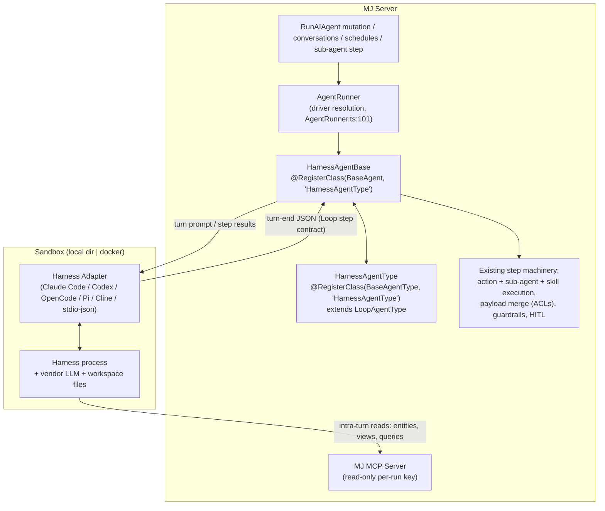

# External Agent Harness Integration — Design Plan

**Status**: Draft v2 (targeted at 6.0) — revised after design review; the four open questions from v1 are now **resolved decisions** (§13)
**Audience**: MJ core contributors
**Companion reading**: [guides/AGENT_FRAMEWORK_COMPARISON.md](../guides/AGENT_FRAMEWORK_COMPARISON.md), [guides/UNIFIED_PERMISSIONS_GUIDE.md](../guides/UNIFIED_PERMISSIONS_GUIDE.md), `packages/AI/Agents/README.md`, `packages/AI/MCPServer/README.md`

> **Documentation mandate for the implementing agent**: this plan records not just *what* to build but *why* each seam was chosen (turn protocol vs. MCP-everything, new credentials junction vs. reusing `MJ: AI Credential Bindings`, dual-registry driver resolution). Carry that reasoning forward — the package README, the eventual `guides/AGENT_HARNESS_GUIDE.md`, and code comments at each seam must explain the *why*, not merely the API. Sections flagged **[DOC-CARRY]** below are the ones whose rationale must survive into post-implementation docs.

---

## 1. Motivation

MJ agents today are executed by MJ's own loop (`BaseAgent` + `LoopAgentType` / `FlowAgentType` / `RealtimeAgentType`). That gives us declarative agents-as-metadata, payload path ACLs, permissioned actions, model failover, and relational observability — but the *reasoning loop* is always ours.

A parallel ecosystem of **agent harnesses** has matured around coding agents: Claude Code (and the Claude Agent SDK), OpenAI Codex CLI, OpenCode, Pi, and Cline. These harnesses bring capabilities MJ's loop does not have natively: durable filesystem workspaces, shell/tool execution, long autonomous multi-hour runs, repo-scale code manipulation, and vendor-tuned agentic scaffolding. Platforms like qm (`yc-software/qm`) have demonstrated that harnesses are swappable substrates: one core can drive Pi, OpenCode, Codex, or Claude Code behind a single interface.

This plan defines how MJ launches **any external harness as the reasoning substrate for an MJ agent**, while MJ keeps what it is uniquely good at: identity, permissions, governed data access, payload contracts, HITL, cost controls, and run-level audit.

**Design principle**: *the harness is a substrate, not a peer.* MJ owns the run record, the credentials, the tool surface, and the approval flow. The harness owns the reasoning inside each turn. And critically (v2): **a harness turn is protocol-identical to a Loop agent's prompt iteration**, so the harness plugs into MJ's existing step machinery rather than around it.

### 1.1 Why the type is named "Harness" **[DOC-CARRY]**

The agent type name follows the existing convention of naming the *paradigm* (Loop, Flow, Realtime): the defining characteristic of this type is that an external harness supplies the reasoning inside each iteration. "Harness" is also the industry's term for exactly this category of software. Alternatives considered and rejected: "External" (external what?), "Delegated" (collides with sub-agent delegation), "Coding Agent" (too narrow — harnesses do research and ops work too), "CLI Agent" (implementation detail). Docs should define the term once: *an external agent runtime with its own reasoning loop and tool sandbox* — distinguishing it from MJ's own loop, which is a harness in the broad sense but not in this plan's sense.

## 2. Goals and non-goals

**Goals**

1. Run an MJ agent whose reasoning substrate is an external harness, selected per-agent via metadata — no code deploy to switch harnesses.
2. **Turn protocol**: the harness participates in the agent loop exactly like a Loop prompt does — each harness turn ends by emitting the Loop agent type's next-step JSON, and MJ executes actions/sub-agents/skills through its existing validated machinery, then resumes the harness with results.
3. Give harness runs **read access** to MJ data intra-turn through MJ's own MCP server with a per-run, scope-limited, read-only credential. All authority-transferring operations flow through the turn protocol, never MCP.
4. Map harness activity onto existing observability (`MJ: AI Agent Runs` / `MJ: AI Agent Run Steps`), including token/cost accounting and per-turn guardrail enforcement.
5. Route permission requests through existing HITL (`MJ: AI Agent Requests` + `RespondToAgentRequest`); inherit plan mode for free via the Loop step vocabulary.
6. Honor the payload contract: `StartingPayloadValidation` in; incremental `payloadChangeRequest` per turn under `PayloadManager` ACLs; `FinalPayloadValidation` out.
7. Full composability: a Harness agent is invocable everywhere any agent is — as a sub-agent, via `ExposeAsAction`, scheduled, in conversations.
8. Support at least: Claude Code (Agent SDK and headless CLI), Codex CLI, OpenCode, Pi, Cline. Adding a harness must not require core changes.

**Non-goals (this iteration)**

- Rich end-user conversational interaction with a live harness session (deferred — but see §13.3: the turn protocol shrinks this from "big lift" to "session-lifetime-across-conversation-turns problem").
- Multi-tenant sandbox orchestration at fleet scale (provider interface specified; k8s implementation is future work).
- Replacing `LoopAgentType` for any existing agent. This is additive.

## 3. Architecture overview



The load-bearing insight (v2, replacing v1's "one long session" model): **`BaseAgent` already runs an iterate → decide → execute-steps → iterate loop where the "decide" input is a prompt execution.** We substitute the prompt execution with a harness turn and change nothing else. Everything downstream of the decision — `validateActionsNextStep`, `validateSubAgentNextStep`, per-action `MaxExecutionsPerRun`, skill activation gates, plan-mode blocking, `PayloadManager` path ACLs, `checkExecutionGuardrails` between iterations, run-step recording — applies to harness agents with **zero new enforcement code**.

## 4. The turn protocol **[DOC-CARRY]**

### 4.1 Two channels, one authority

| Channel | Used for | Why |
|---|---|---|
| **MCP loopback** (intra-turn) | Reads: entity gets, RunView, queries, metadata, search | High-frequency, low-risk; round-tripping a turn for every row read would be absurd |
| **Turn-end JSON** (Loop step contract) | Actions, sub-agents, skill activation, payload writes, `Chat`/`MoreInfo`, terminal steps | Authority-transferring operations run under MJ's existing validation, HITL, accounting — one authority channel, no parallel enforcement path to audit |

The per-run MCP key is **read-only by default** (`entity:read`, `query:*` — no `action:execute`, no `Run_Agent`). This is deliberate: routing action/sub-agent execution through MCP would create a second authority channel with its own authorization story and double-counted accounting. A config escape hatch for demonstrably benign intra-turn actions may come later; default closed.

### 4.2 Turn lifecycle

```mermaid
sequenceDiagram
    participant C as Caller (GraphQL / conversation / parent agent)
    participant BA as BaseAgent loop<br/>(HarnessAgentBase)
    participant AT as HarnessAgentType<br/>(extends LoopAgentType)
    participant AD as Adapter
    participant H as Harness (sandbox)
    participant MCP as MJ MCP Server

    C->>BA: Execute(params)
    BA->>BA: Create AIAgentRun, StartingPayloadValidation
    BA->>AD: Turn 1: task prompt (system prompt + payload + tool/skill/sub-agent catalog + MCP config)
    AD->>H: launch session (per-run read-only key, creds env-injected)
    loop intra-turn
        H->>MCP: read entities / views / queries
        MCP-->>H: data (RLS + field permissions as run user)
    end
    H-->>AD: turn ends: Loop next-step JSON
    AD-->>BA: HarnessTurnResult
    BA->>AT: DetermineNextStep (inherited Loop JSON parse + validation)
    alt step = Actions / SubAgents / Skill
        BA->>BA: execute via existing machinery (validation, HITL, payload ACLs)
        BA->>BA: checkExecutionGuardrails (cost / tokens / iterations / time)
        BA->>AD: Turn N+1: resume session with formatted step results
        AD->>H: resume (or context-replay if harness lacks resume)
    else step = Chat / MoreInfo
        BA-->>C: surface to user (existing semantics, ChatHandlingOption honored)
    else step = Success / Failed
        BA->>BA: FinalPayloadValidation (Retry re-enters harness with feedback)
        AD->>H: teardown; revoke key; finalize sandbox
        BA-->>C: ExecuteAgentResult
    end
```

### 4.3 Getting the harness to speak the protocol

- The harness task prompt is assembled from the **same agent-type system prompt template the Loop type uses** (the existing `AgentPromptPlaceholder` pipeline), so the turn-end JSON contract, the action/sub-agent/skill catalogs, and the payload rules are described to the harness exactly as they are to a Loop model — plus a harness appendix covering the MCP loopback endpoint and workspace conventions. Rich upfront context comes from the same metadata the Loop path already renders (`formatActionDetails`, sub-agent lists, skill catalog with progressive disclosure).
- Structured output enforcement uses the harness's native mechanism where available (Claude Code structured output / `--output-format`), with `BaseAgent`'s existing malformed-response retry machinery as the backstop.
- **The opaque super-step caveat**: a harness turn may contain many internal tool calls (file edits, shell commands) before it ends its turn. MJ records what crosses the boundary — MCP loopback calls and the turn-end step — as the run's audit trail; inside-the-sandbox activity is governed by posture policy (§10), not run steps. This granularity is intentional and must be documented.

## 5. Class architecture and driver resolution **[DOC-CARRY]**

### 5.1 The three-layer resolution already exists — verified

`AgentRunner.RunAgent` ([AgentRunner.ts:101](../packages/AI/Agents/src/AgentRunner.ts)) already implements the exact priority chain this feature needs:

```typescript
const driverClass = params.agent.DriverClass || agentType.DriverClass;
const agentInstance = MJGlobal.Instance.ClassFactory.CreateInstance<BaseAgent>(BaseAgent, driverClass);
```

1. **Agent-specific `AIAgent.DriverClass`** wins — preserving the established per-agent customization pattern (e.g. Skip-style specialized subclasses with deterministic overrides).
2. Else **`AIAgentType.DriverClass`** — the column exists today (`entity_subclasses.ts`, `MJAIAgentTypeEntity.DriverClass`); no migration needed.
3. Else — and when the key is unregistered in the `BaseAgent` registry — **ClassFactory falls back to `new BaseAgent(...)`** (documented contract: `CreateInstance` "has NEVER returned null for an unregistered key — it falls back to `new BaseClass(...)`").

### 5.2 One string, two registries

ClassFactory registrations are namespaced **per base class**. Today the string `'LoopAgentType'` is registered only under the `BaseAgentType` root (resolved by `BaseAgentType.GetAgentTypeInstance` from `agentType.DriverClass`), so the `BaseAgent`-registry lookup in `AgentRunner` finds nothing and falls back to plain `BaseAgent` — which is why all Loop agents get the base execution class.

The Harness type registers **two classes under the same key**:

```typescript
@RegisterClass(BaseAgentType, 'HarnessAgentType')   // the type: extends LoopAgentType
export class HarnessAgentType extends LoopAgentType { ... }

@RegisterClass(BaseAgent, 'HarnessAgentType')       // the driver: extends BaseAgent
export class HarnessAgentBase extends BaseAgent { ... }
```

With the `Harness` agent-type row's `DriverClass = 'HarnessAgentType'`, `AgentRunner.ts:101` resolves `HarnessAgentBase` for **every** agent of the type, while `GetAgentTypeInstance` independently resolves `HarnessAgentType` — and a per-agent `DriverClass` (necessarily a `HarnessAgentBase` subclass) still overrides for specialized agents. **No core changes, no migration.** The dual-registry semantics of the `DriverClass` string are subtle and MUST be called out with a code comment at both registrations and in the package README. (A separate `AIAgentType` column naming the execution driver explicitly was considered and rejected as unnecessary — the runner already treats the type's `DriverClass` as a `BaseAgent` key; we are using the mechanism as designed, not overloading it.)

### 5.3 Division of labor between the two classes

- **`HarnessAgentType extends LoopAgentType`** — inherits `DetermineNextStep` (turn-end JSON parsing + validation) wholesale. Overrides: `InitializeAgentTypeState` (resolve harness row/adapter/sandbox, mint the per-run credential), the system-prompt assembly hook (harness appendix), and step post-processing where results must be routed back into a live session rather than a fresh prompt.
- **`HarnessAgentBase extends BaseAgent`** — overrides the single seam where a Loop iteration executes an `AIPrompt` via `AIPromptRunner`, substituting a harness turn via the adapter, plus session lifecycle (launch on first turn, resume on subsequent turns, teardown on terminal step / cancellation / crash — key revocation and sandbox finalization must run on all exit paths). Everything else — the loop, validation, step execution, payload merging, run records — is untouched `BaseAgent`.

This split gets both things the design review wanted: **separation of concerns** (Harness is a distinct, discoverable, permission-able agent type) and **maximal reuse** (the protocol is Loop's protocol; the loop is BaseAgent's loop).

## 6. Metadata model (additive only)

Per the [Publish-Then-No-Breaking-Changes policy](../packages/OpenApp/PUBLISH_NO_BREAK_POLICY.md), everything here is additive.

### 6.1 New agent type row

| Field | Value |
|---|---|
| Name | `Harness` |
| DriverClass | `HarnessAgentType` (resolves in both registries — §5.2) |
| ConfigSchema | JSON schema for §6.3 |
| DefaultConfiguration | local sandbox, `agent-user` workspace scope, `strict` posture |

### 6.2 New entity: `MJ: AI Agent Harnesses`

The harness registry — which harnesses this installation can launch.

| Column | Type | Notes |
|---|---|---|
| ID | uniqueidentifier | PK |
| Name | nvarchar(100) | `Claude Code`, `Codex CLI`, `OpenCode`, `Pi`, `Cline` |
| Description | nvarchar(max) | |
| DriverClass | nvarchar(255) | ClassFactory key for the adapter (`ClaudeCodeAdapter`, …) |
| ExecutablePath | nvarchar(500) NULL | CLI binary/entry point; NULL when the adapter embeds an SDK |
| AIVendorID | uniqueidentifier NULL | FK → `MJ: AI Vendors` — the harness's LLM vendor, used for the credential fallback chain (§7) |
| DefaultModel | nvarchar(255) NULL | passed through where supported |
| CapabilityFlags | nvarchar(max) NULL | JSON: `{ "sessionResume": true, "structuredOutput": true, "permissionHooks": true, "mcpClient": true }` |
| Status | nvarchar(20) | `Active` / `Inactive` (CHECK) |

### 6.3 New entity: `MJ: AI Agent Credentials` **[DOC-CARRY]**

The credential grant edge — which credentials a given agent carries into its sandbox.

| Column | Type | Notes |
|---|---|---|
| ID | uniqueidentifier | PK |
| AgentID | uniqueidentifier | FK → `MJ: AI Agents` |
| CredentialID | uniqueidentifier | FK → `MJ: Credentials` |
| Purpose | nvarchar(50) | `HarnessLLM` / `Integration` (CHECK; extensible) |
| EnvVariableName | nvarchar(100) NULL | how the adapter surfaces it in the sandbox (e.g. `ANTHROPIC_API_KEY`, `GITHUB_TOKEN`) |
| Priority | int | failover ordering within a Purpose |
| Status | nvarchar(20) | `Active` / `Revoked` / `Pending` (CHECK) |

**Why a new junction instead of reusing `MJ: AI Credential Bindings`** (this reasoning must be carried into the README/guide after implementation): AI Credential Bindings is *inference-selection* plumbing — its `BindingType` CHECK constraint admits exactly `Vendor` / `ModelVendor` / `PromptModel`, each requiring the matching FK, and it exists so `AIPromptRunner` can fail over credentials when MJ itself executes prompts against model vendors. An agent carrying credentials into a sandbox is a different concern: grants are per-*agent*, frequently non-LLM (a repo-steward agent needs a GitHub token), and consumed by env-var injection at session creation rather than by the prompt-execution failover path. Overloading the bindings table with a fourth type would tangle two lifecycles behind one CHECK constraint. Custody stays where it belongs — `MJ: Credentials` + `CredentialEngine` (encryption, expiry, last-used auditing); this junction adds only the grant edge, in the same reviewable style as `MJ: AI Agent Actions`.

**Resolution order for the harness's LLM key**: agent-level `MJ: AI Agent Credentials` row with `Purpose='HarnessLLM'` if present → else fall back to vendor-scoped `MJ: AI Credential Bindings` for `AIAgentHarness.AIVendorID` (the Anthropic/OpenAI vendor rows already exist). Zero-config default for the common case; explicit per-agent override when needed. Injection happens **once, at harness session creation**, scoped to exactly what that agent has been granted.

### 6.4 Agent configuration (existing config plumbing; validated by ConfigSchema)

```jsonc
{
  "harnessName": "Claude Code",            // lookup into MJ: AI Agent Harnesses
  "sandbox": {
    "provider": "local | docker | remote",
    "image": "ghcr.io/memberjunction/harness-sandbox:latest",   // docker/remote only
    "workspaceScope": "run | agent | agent-user",               // default agent-user (§13.5)
    "workspaceConcurrency": "queue | fail | fork",              // durable scopes only
    "networkPolicy": "none | mcp-only | allowlist | open"
  },
  "posture": "strict | auto | dangerous",  // §10
  "mcpLoopback": {
    "toolIncludePatterns": ["Get_*", "RunView_*"],   // read tools only by default
    "toolExcludePatterns": []
  },
  "limits": { "maxTurns": 50, "maxWallClockSeconds": 3600 },   // defense in depth atop AIAgent.Max*
  "promptAppendix": null                   // optional extra template content for the harness system prompt
}
```

### 6.5 Runtime override: `ExecuteAgentParams.configOverride`

A generic addition (CorePlus), not harness-specific: `configOverride?: Record<string, unknown>`, deep-merged over the agent's stored configuration and **validated against the agent type's `ConfigSchema`** before the run starts. Mirrors the existing `override: { modelId, vendorId }` pattern and benefits any configurable agent type. Primary harness use: switching `workspaceScope`/sandbox provider per invocation (e.g. CI runs use `run`-scoped ephemeral workspaces while interactive use keeps `agent-user`).

## 7. Runtime components

### 7.1 `IHarnessAdapter` (turn-oriented, v2)

```typescript
export interface HarnessSessionConfig {
    workspacePath: string;
    mcpServerUrl: string;
    mcpCredential: string;                  // per-run, read-only scoped
    environment: Record<string, string>;    // injected credentials (§6.3), harness settings
    model?: string;
    cancellationToken?: AbortSignal;
}

export type HarnessTurnEvent =
    | { type: 'assistant-text'; text: string }                                   // streamed narration
    | { type: 'sandbox-activity'; description: string }                          // informational (file edit, shell cmd)
    | { type: 'permission-request'; requestId: string; description: string; command?: string }
    | { type: 'usage'; inputTokens: number; outputTokens: number; costUsd?: number }
    | { type: 'turn-complete'; rawText: string }                                 // rawText parsed by HarnessAgentType (Loop JSON)
    | { type: 'session-error'; error: string };

export abstract class BaseHarnessAdapter {
    abstract StartSession(config: HarnessSessionConfig): Promise<void>;
    abstract RunTurn(input: string): AsyncIterable<HarnessTurnEvent>;   // first call = task prompt; later calls = step results
    abstract RespondToPermission(requestId: string, approved: boolean, note?: string): Promise<void>;
    abstract EndSession(): Promise<void>;                                // idempotent; must run on every exit path
    abstract get Capabilities(): HarnessCapabilities;                    // sessionResume, structuredOutput, permissionHooks, …
}
```

Adapters register via `@RegisterClass(BaseHarnessAdapter, '<DriverClass>')` and resolve from `AIAgentHarness.DriverClass` — a customer can ship a proprietary adapter without forking core. Where a harness lacks native session resume, the adapter emulates `RunTurn` continuity by replaying prior context into a fresh invocation (capability-flagged, so `HarnessAgentBase` can budget for the extra tokens).

### 7.2 Per-vendor adapters (phased)

| Adapter | Mechanism | Notes |
|---|---|---|
| `ClaudeCodeAdapter` | Claude Agent SDK (reference implementation); CLI `claude -p --output-format stream-json` as documented alternative | Richest fit: session resume, permission hooks, structured output, native MCP client |
| `CodexAdapter` | `codex exec --json` | JSONL event stream; MCP via config |
| `OpenCodeAdapter` | `opencode run` JSON mode / server mode | |
| `PiAdapter` | Pi programmatic/CLI interface | |
| `ClineAdapter` | Cline CLI / headless host | Lands last; interactive-first design |
| `StdioJsonAdapter` | Spawn any command speaking a documented JSONL event contract | Escape hatch: any harness works with zero MJ code |

Vendor SDK dependencies live in thin per-adapter packages (`@memberjunction/ai-agent-harness-claude`, …), keeping the core package dependency-light — the `packages/AI/Providers/*` layout.

### 7.3 `ISandboxProvider`

```typescript
export interface ISandboxProvider {
    Provision(key: WorkspaceKey, config: SandboxConfig): Promise<SandboxHandle>;   // key encodes workspaceScope (§13.5)
    Finalize(handle: SandboxHandle, outcome: 'success' | 'failure' | 'cancelled'): Promise<void>;
}
```

Phase 1: `LocalDirectorySandboxProvider` (scoped workspace dir + spawned process; `networkPolicy` best-effort). Phase 2: `DockerSandboxProvider` (real network policy; builds on the existing `docker/` workbench configurations). Durable scopes retain the workspace between runs under the same `WorkspaceKey`; `workspaceConcurrency` governs collisions (`queue` default).

## 8. Security model: MCP loopback with per-run credentials **[DOC-CARRY]**

The harness process receives exactly two kinds of secrets, both injected at session creation and scoped to the agent's grants:

1. **The per-run MJ MCP key** — minted via `@memberjunction/api-keys` with **read-only scopes** derived from the agent's granted surface, narrowed by `mcpLoopback` patterns; expiry = `MaxTimePerRun` + grace; revoked at teardown. Every loopback call executes and is logged **as the run's context user**, so RLS and field permissions apply exactly as if MJ's own loop were reading.
2. **Purpose-scoped external credentials** from `MJ: AI Agent Credentials` (§6.3) as env vars — the LLM key (with the bindings fallback) and any granted integration tokens. Never DB credentials, never user tokens, never a general MJ API key.

Action/sub-agent/skill authority never enters the sandbox at all — it lives in the turn protocol on the MJ side (§4.1). `networkPolicy: mcp-only` (Docker provider) is the recommended production posture: sandbox reaches the MJ MCP endpoint and the LLM vendor API, nothing else. Third-party MCP tools synced into MJ as actions (via `MCPClientManager.syncActionsForServer`) are available to harness agents **through turn-end action execution**, keeping one authority channel even for external tools.

## 9. Observability

- Each **harness turn** records like a prompt iteration; each executed step (action, sub-agent, skill) records through the machinery that already writes `AIAgentRunStep` rows — nothing new.
- `usage` events accumulate into `AIAgentRun` token/cost fields per turn, so `MaxCostPerRun` / `MaxTokensPerRun` / `MaxIterationsPerRun` (= max turns) / `MaxTimePerRun` interrupt a runaway harness **between turns** via existing `checkExecutionGuardrails`.
- `sandbox-activity` events stream to `onProgress` (Explorer live view) but are not persisted as steps — the audit boundary is §4.3's caveat, by design.
- New nullable `MJ: AI Agent Runs.ExternalSessionID` column (additive) stores the harness session ID for resume + vendor-side log correlation.
- Existing diagnostics (`mj ai audit agent-run`, the agent-run MCP tools) work unchanged — same tables.

## 10. Postures and HITL

| Posture | Behavior |
|---|---|
| `strict` | Every mutating sandbox operation (writes outside workspace conventions, shell commands, network) pauses: adapter surfaces `permission-request` → `MJ: AI Agent Requests` row → existing `RespondToAgentRequest` mutation / Explorer UI → answer flows back via `RespondToPermission`. |
| `auto` (default) | Reads and allowlisted commands proceed; a predeclared deny/ask command list (recursive deletes, DDL, credential-file access) escalates to a request. |
| `dangerous` | No pauses. Requires a dedicated grant on the agent (`MJ: AI Agent Permissions`); refused when `networkPolicy` is `open`. |

Enforced adapter-side where the harness supports permission hooks (Claude Code does), provider-side as backstop. **Plan mode comes free**: because turn-end decisions run through Loop validation, `AIAgent.RequirePlanMode` / `ExecuteAgentParams.planMode` block Actions/Sub-Agents until an approved `Plan` step — identically for harness agents.

## 11. Package plan

```
packages/AI/AgentHarness/                 @memberjunction/ai-agent-harness
  src/HarnessAgentType.ts                 extends LoopAgentType; @RegisterClass(BaseAgentType, 'HarnessAgentType')
  src/HarnessAgentBase.ts                 extends BaseAgent;     @RegisterClass(BaseAgent, 'HarnessAgentType')
  src/BaseHarnessAdapter.ts               contract + event types
  src/adapters/StdioJsonAdapter.ts        generic fallback
  src/sandbox/…                           ISandboxProvider + local + docker providers
  src/HarnessCredentialResolver.ts        §6.3 junction + bindings fallback; env-var assembly
  src/RunCredentialManager.ts             mint/revoke per-run MCP keys
packages/AI/AgentHarness-Claude/          @memberjunction/ai-agent-harness-claude (Agent SDK)
packages/AI/AgentHarness-Codex/           @memberjunction/ai-agent-harness-codex
…one thin package per vendor as they land
```

Migration (highest-numbered `migrations/v*/` folder current at implementation time), all additive: `MJ: AI Agent Harnesses`, `MJ: AI Agent Credentials`, the `Harness` agent type row, `AIAgentRun.ExternalSessionID`. CodeGen + `mj sync push` ordering per `migrations/CLAUDE.md`.

## 12. Phasing

| Phase | Scope | Exit criteria |
|---|---|---|
| 1 | `HarnessAgentType` + `HarnessAgentBase` (turn protocol on the Loop contract), adapter contract, local sandbox, `ClaudeCodeAdapter` (Agent SDK), per-run read-only MCP keys, `MJ: AI Agent Credentials` + fallback resolution, `strict` posture | A `Harness` agent completes a task that requires (a) intra-turn MCP reads, (b) a turn-end action execution, and (c) a turn-end sub-agent call; run fully audited; deterministic integration-test bundle green |
| 2 | Docker sandbox + network policy, `auto` posture + deny/ask list, `CodexAdapter`, `StdioJsonAdapter`, `configOverride` | Same task passes on Claude Code and Codex by flipping one metadata field |
| 3 | Durable workspaces (`agent-user` / `agent` scopes + concurrency), session resume for `FinalPayloadValidation` retries, `OpenCodeAdapter`, `PiAdapter` | |
| 4 | `ClineAdapter`, remote sandbox provider, Explorer authoring UX, conversation-mode session lifetime (§13.3) | |

## 13. Resolved design decisions **[DOC-CARRY]**

Recorded from the design review so the reasoning survives into implementation docs.

1. **Turn protocol over MCP-everything.** The harness ends each turn by emitting the Loop next-step JSON; MJ executes actions/sub-agents/skills through existing validated machinery and resumes the session with results. MCP loopback is read-only and intra-turn. Rationale: one authority channel; the entire Loop enforcement/validation/HITL/accounting stack applies with zero new code; `payloadChangeRequest` gives incremental, ACL-governed payload writes; guardrails interrupt between turns. Full composability follows — a Harness agent is a first-class sub-agent and sub-agent budgets aggregate through the machinery it now runs inside.
2. **Credentials: new `MJ: AI Agent Credentials` junction; do not overload `MJ: AI Credential Bindings`.** Bindings are inference-selection (Vendor/ModelVendor/PromptModel CHECK) for `AIPromptRunner` failover; agent-carried sandbox credentials are a different concern and lifecycle. Custody stays in `MJ: Credentials`/`CredentialEngine`; injection at session creation only; agent-level rows override, vendor-scoped bindings are the zero-config fallback for the LLM key.
3. **Conversation-mode deferred, but shrunk.** Because the type subclasses `LoopAgentType` and Loop agents already run in `RunAgentInConversation`, rich conversational use reduces to a session-lifetime-across-conversation-turns problem (phase 4), not a new integration.
4. **Class architecture: dual-registry `'HarnessAgentType'` key.** `HarnessAgentType extends LoopAgentType` (BaseAgentType registry) + `HarnessAgentBase extends BaseAgent` (BaseAgent registry). The 3-layer driver resolution (agent → type → BaseAgent) already exists at `AgentRunner.ts:101` with `AIAgentType.DriverClass` as a real column — verified; no migration. Per-agent `DriverClass` overrides remain the top priority, preserving the Skip-style customization pattern.
5. **Workspace scope is agent metadata, overridable at runtime.** `sandbox.workspaceScope: 'run' | 'agent' | 'agent-user'` (default `agent-user`; `agent` is the opt-in shared-workspace mode) in the agent config, overridable per invocation via the new generic `ExecuteAgentParams.configOverride` (ConfigSchema-validated). Durable scopes carry a `workspaceConcurrency` policy (`queue` default).
6. **Name: `Harness`.** Names the paradigm like Loop/Flow/Realtime; industry-standard term; alternatives lose information (§1.1).

## 14. Remaining open questions

1. **Deny/ask command list placement** — per-agent config vs. a shared org-level policy entity with per-agent narrowing. qm's predeclared-command-policy experience suggests org-level; decide during phase 2 when the `auto` posture lands.
2. **Turn-boundary tuning** — harnesses vary in how naturally they yield; per-harness guidance in the prompt appendix vs. adapter-enforced turn limits. Evaluate with phase 1 telemetry.

---

*Informed by an architectural comparison with qm (`yc-software/qm`) — pluggable harness substrates, per-scope durable sandboxes, Strict/Auto/Dangerous postures — adapted here to MJ's metadata-driven, permission-governed architecture, with the turn protocol as the MJ-native twist that qm-style designs lack.*
