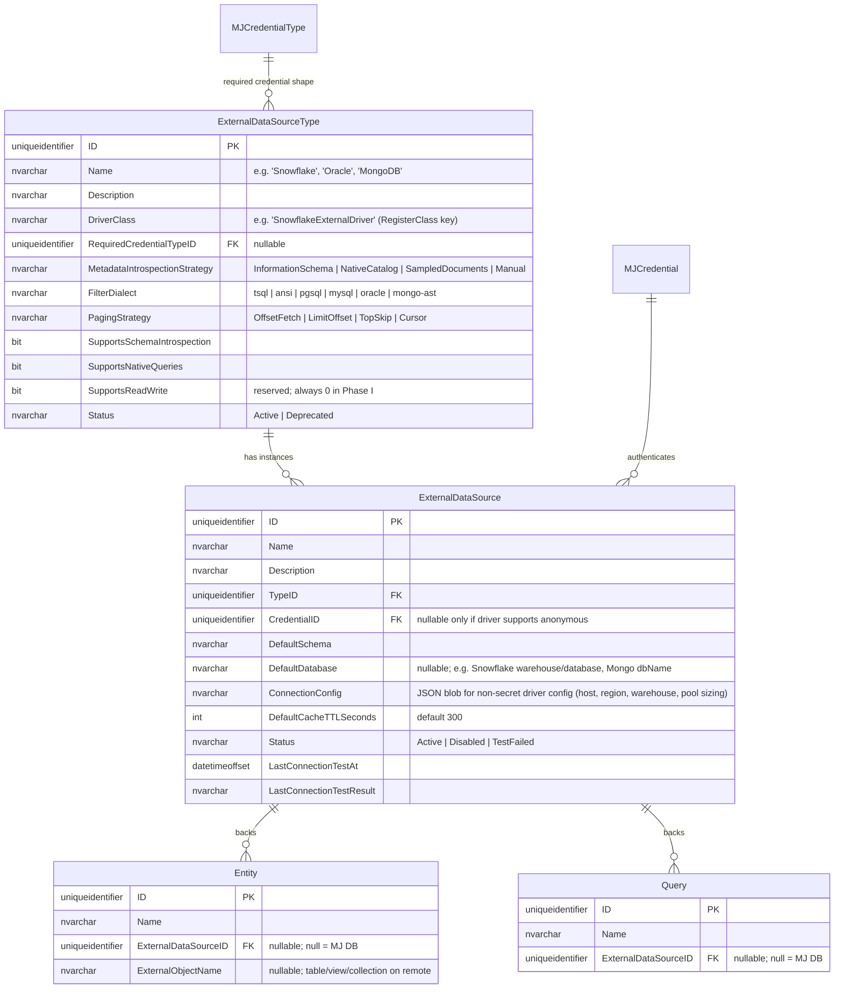
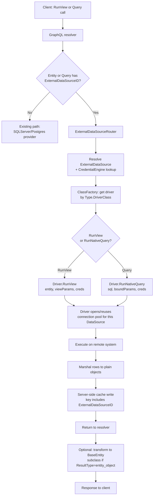
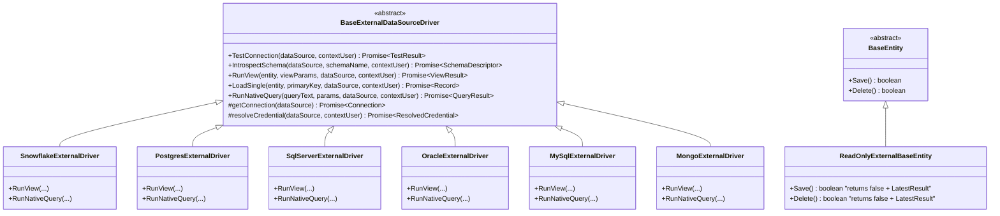

# External Data Sources: Runtime-Proxied Entities & Queries

## Status
- **Status**: Draft
- **Created**: 2026-04-21
- **Author**: Amith Nagarajan + Claude
- **Branch**: `amith-nagarajan/external-data-sources`

## Overview

MemberJunction today reads and writes all entity data from a single MJ database (SQL Server or PostgreSQL). The existing `Entity.VirtualEntity` flag supports views inside that same database, and the Integrations subsystem supports **scheduled pull-sync** from external systems into MJ tables, but neither mechanism supports **live, runtime-proxied access** to data that lives elsewhere.

This plan introduces a new primitive — **External Data Sources** — that allows an MJ Entity (and an MJ Query) to be backed by **any supported remote data system** (Snowflake, Oracle, MongoDB, external PostgreSQL, external SQL Server, MySQL, etc.) and queried live from MJAPI. The model is conceptually similar to SQL Server Linked Servers: metadata declares where an entity or query actually lives, and MJAPI proxies reads at request time through a pluggable driver.

The design is **additive** — no existing entity behavior changes when `ExternalDataSourceID` is null (the default). It composes cleanly with the existing `VirtualEntity` flag and with MJ's existing `Credential` / `CredentialType` subsystem. The scope is intentionally **read-only** — writes across heterogeneous systems break too many MJ guarantees (transactions, Record Changes, RLS) and are explicitly out of scope.

## Goals & Non-Goals

### Goals
- Define two new entities — `ExternalDataSourceType` (driver catalog) and `ExternalDataSource` (configured instances) — and wire them to `MJ: Credentials` for secret management.
- Add nullable `ExternalDataSourceID` to `Entity` and `Query` to mark entities/queries as externally-sourced.
- Define an abstract `BaseExternalDataSourceDriver` registered via `@RegisterClass`, with capabilities for connection management, schema introspection, `RunView`-equivalent paginated reads, single-record loads, and **native-dialect query execution** (for `MJ: Queries`).
- Define a `ReadOnlyExternalBaseEntity` base that overrides `Save()` and `Delete()` to short-circuit and populate `LatestResult` (per MJ's boolean-return convention).
- Extend CodeGen so that external entities emit the correct base class and so that providers dispatch to drivers at runtime.
- Seed a starter catalog of `ExternalDataSourceType` records covering Snowflake, Oracle, SQL Server, PostgreSQL, MySQL, and MongoDB (metadata only — driver implementations ship separately).
- Extend `QueryRunner` so that Queries with `ExternalDataSourceID` set execute via their driver's native-query method, enabling full multi-entity/cross-table joins authored in native dialect.
- Wire external reads through MJ's existing server-side RunView cache, keyed by `ExternalDataSourceID`.

### Non-Goals
- **Writes to external systems** (Save/Update/Delete on external entities). Read-only is the intended end-state, not a phase limitation. Any future write support would be via dedicated Actions, not generic entity writes.
- **Cross-source joins inside MJ.** A single RunView or Query hits exactly one source. Federation across sources is the responsibility of the agent/orchestration layer (Skip, Actions).
- **Per-end-user identity passthrough** to the remote system. Drivers use the credential bound to the `ExternalDataSource` (shared service account). Row-level passthrough is a later concern.
- **A query-translation layer** for arbitrary MJ filter AST → arbitrary non-SQL dialects. SQL drivers pass filters through with light dialect handling; MongoDB will need a filter-AST translator in its own driver, contained to that driver.
- **Migration of the existing `VirtualEntity` concept.** `VirtualEntity` keeps its meaning (view-backed, same MJ DB). External entities can independently be virtual if they are view-backed on the remote side.
- **UI for managing external sources** (admin forms). CodeGen produces the generic forms for free once metadata lands. Any bespoke UX beyond that is a follow-up.

## Background & Context

### Existing concepts this plan builds on

- **`Entity.VirtualEntity`** ([entity_subclasses.ts:13255-13260](packages/MJCoreEntities/src/generated/entity_subclasses.ts)): boolean flag indicating a same-DB view-backed entity. CodeGen skips `sp_Create/Update/Delete` generation and optionally runs an LLM-assisted field decorator. Does **not** imply external data.
- **MJ Credentials system** ([packages/Credentials/Engine/src/CredentialEngine.ts](packages/Credentials/Engine/src/CredentialEngine.ts)): singleton `CredentialEngine` resolves a credential name or ID to a typed, decrypted values object. Field-level encryption at-rest via MJ's `EncryptionEngine`. Already used by Integrations connectors, Communication providers (SendGrid, Twilio, Gmail), and AI vendors. Entities: `MJ: Credentials`, `MJ: Credential Types`, `MJ: Credential Categories`.
- **`@RegisterClass` + manifest system** ([packages/CodeGenLib/CLASS_MANIFEST_GUIDE.md](packages/CodeGenLib/CLASS_MANIFEST_GUIDE.md)): MJ's existing pattern for pluggable class registration. Used by AI vendors, Action classes, custom entity forms, etc. External drivers will register the same way — zero new infrastructure.
- **Server-side RunView cache** ([guides/CACHING_AND_PUBSUB_GUIDE.md](guides/CACHING_AND_PUBSUB_GUIDE.md)): multi-tier cache with event-driven invalidation. External reads will plug in here with time-based TTL (no event observation possible on remote systems).
- **`MJ: Queries`** (existing): parameterized, metadata-managed queries with declared output columns, permission model, and parameter binding. Today all Queries run against the MJ database; we extend with an optional `ExternalDataSourceID` to run against a driver instead.
- **`BaseEntity` return convention**: `Save()` and `Delete()` return `boolean` and populate `entity.LatestResult.CompleteMessage` on failure — they do **not** throw. This is the convention the read-only external base class will use to signal write rejections.

### What this plan explicitly does not disturb

- Any entity where `ExternalDataSourceID IS NULL` (all existing entities): zero runtime change, zero migration cost beyond adding a nullable column.
- Existing VirtualEntity behavior.
- Integrations (pull-sync) — a completely orthogonal feature with different use cases.
- CodeGen output for non-external entities.

## Architecture / Design

### Data Model Changes

**Key decisions embedded in the model:**
- **Type/Instance split** mirrors the Credentials subsystem exactly (`CredentialType` + `Credential`). Catalog metadata that references code (driver class) is separated from runtime-configurable instances that reference secrets.
- **No `IsExternal` boolean** on `Entity` or `Query` — the presence of `ExternalDataSourceID` is the flag. Information-dense, mirrors how `VirtualEntity` is already handled.
- **No raw connection string** on `ExternalDataSource`. All secrets flow through `CredentialID → MJ: Credentials → CredentialEngine`. Non-secret driver config lives in `ConnectionConfig` JSON (host, region, Snowflake warehouse, Mongo replica-set name, etc.).
- **`MetadataIntrospectionStrategy`** on the Type catalog tells the metadata-import command how to hydrate `Entity`/`EntityField` rows from the remote source per driver family.
- **`RequiredCredentialTypeID`** on the Type catalog lets the admin UI filter the Credential dropdown to valid credential shapes when configuring an instance.

### Component / Flow Design

### API Changes

- **GraphQL resolvers**: CodeGen-generated resolvers for external entities dispatch through `ExternalDataSourceRouter` instead of calling `sp_*` procedures. This is a single template fork in CodeGen keyed on `Entity.ExternalDataSourceID != null`.
- **RunView call shape**: unchanged for consumers. `RunView({ EntityName: 'Sales Facts (Snowflake)', ExtraFilter: '...', ... })` works identically whether the entity is local or external.
- **Query execution**: `QueryRunner.RunQuery(queryName, params, user)` dispatches on `Query.ExternalDataSourceID`. Callers see no API change.
- **No new GraphQL mutations.** External entities are read-only; `Save` / `Delete` resolvers are not generated for them (or are generated to short-circuit with a clear error message — decision point noted below).

## Implementation Plan

### Phase 1: Metadata foundation

1. **Migration `V2026MMDDHHMM__v2.x_external_data_sources.sql`** — creates `ExternalDataSourceType` and `ExternalDataSource` tables in `${flyway:defaultSchema}`, adds `ExternalDataSourceID UNIQUEIDENTIFIER NULL` to `Entity` (with FK), adds `ExternalObjectName NVARCHAR(255) NULL` to `Entity`, adds `ExternalDataSourceID UNIQUEIDENTIFIER NULL` to `Query` (with FK). Follows repo migration conventions (no `__mj_*` columns, no FK indexes — CodeGen handles those; `sp_addextendedproperty` for every new column).
2. **CodeGen run** — generates `ExternalDataSourceTypeEntity`, `ExternalDataSourceEntity` subclasses, spCreate/Update/Delete, views, Zod schemas, GraphQL resolvers, and Angular forms. No special handling needed; these are ordinary MJ entities.
3. **Seed metadata for starter `ExternalDataSourceType` catalog** via `mj sync push` — create `/metadata/external-data-source-types/` with one JSON record per starter type: Snowflake, Oracle, SQL Server, PostgreSQL, MySQL, MongoDB. Driver class names referenced but drivers not yet implemented (`Status: 'Draft'` on each row until matching driver ships). Follows the `/metadata/resource-types/` precedent.

### Phase 2: Driver infrastructure

1. **New package `@memberjunction/external-data-sources-base`** — exports:
   - `BaseExternalDataSourceDriver` abstract class with the six methods shown in the class diagram above
   - `ExternalDataSourceRouter` singleton (`BaseSingleton<T>` pattern, per repo convention) that: resolves an `ExternalDataSourceID` to its `ExternalDataSource` + `ExternalDataSourceType` rows, calls `CredentialEngine.Instance.getCredential(...)` for auth, looks up the driver class via `MJGlobal.ClassFactory`, instantiates/caches per-source driver + connection pool
   - `ReadOnlyExternalBaseEntity` extending `BaseEntity` and overriding `Save()`, `Delete()` to set `LatestResult` with `"Entity is sourced from external system '<Name>' and is read-only"` and return `false`. Matches MJ's existing boolean-return convention for these methods.
   - Type interfaces: `SchemaDescriptor`, `ResolvedCredential<T>` generics, `ViewResult`, `QueryResult`, `TestResult`.
2. **Provider dispatch hook in `BaseEntity` / `Metadata.GetEntityObject`** — when the resolved entity's `ExternalDataSourceID` is non-null, instantiate the class via `ClassFactory` as normal (CodeGen emits the external subclass extending `ReadOnlyExternalBaseEntity`). No runtime branching in `BaseEntity` itself — the class hierarchy carries the behavior.
3. **RunView integration** — in `ProviderBase.RunView` (or the SQL Server / PG provider's `RunViewInternal`, depending on where the cleanest seam is), check `entity.ExternalDataSourceID`. If non-null, delegate to `ExternalDataSourceRouter.Instance.RunView(...)`. If null, existing behavior. Single `if` at the dispatch point. Cache check happens **before** the external call; cache key includes `ExternalDataSourceID`, `ExtraFilter`, `OrderBy`, `Fields`, paging params.
4. **QueryRunner integration** — in the `MJ: Queries` execution path, check `query.ExternalDataSourceID`. If set, resolve driver and call `driver.RunNativeQuery(query.SQL, boundParams, dataSource, contextUser)`. Output column shape is enforced against `Query.Fields` metadata post-execution; log a warning on mismatch.

### Phase 3: CodeGen adjustments

1. **Generated entity base class selection** — modify the entity-subclass template so that when `Entity.ExternalDataSourceID != null`, the generated class extends `ReadOnlyExternalBaseEntity` instead of `BaseEntity`. Single conditional in the template.
2. **Skip sp generation for external entities** — same branch as the existing `VirtualEntity` skip. External entities never get `spCreate/Update/Delete`.
3. **Skip view generation for external entities** — they have no corresponding object in the MJ database.
4. **GraphQL resolver template fork** — for external entities, emit a resolver whose `RunView` routes through `ExternalDataSourceRouter`; emit no `Create`/`Update`/`Delete` mutations (or emit stubs that throw a clear GraphQL error).
5. **Angular form generation** — proceeds normally; forms display correctly, Save button in forms hits `entity.Save()` which short-circuits with the read-only message. Consider a visual indicator on external entity forms ("This entity is read-only — sourced from <DataSourceName>"). Follow-up polish, not blocking.

### Phase 4: Metadata introspection command

1. **New CLI command `mj codegen external-metadata --source <dataSourceName> [--schema <schema>] [--include <pattern>]`** — reads the target `ExternalDataSource`, resolves its driver, calls `driver.IntrospectSchema(...)`, and emits (or updates) `Entity` + `EntityField` metadata records via `mj sync`-compatible JSON files in `/metadata/external-entities/<source-name>/`. Does not push automatically; leaves review to the developer.
2. **Per-driver introspection logic** — SQL drivers query `INFORMATION_SCHEMA`; Snowflake has a similar catalog; MongoDB samples documents from each collection to infer field shapes (document flagged for manual review).
3. **LLM-assisted field decoration** — reuse the existing `codegen-virtual-entity-field-decoration` prompt pattern for external entities too. It's the same problem (infer PK/FK/descriptions from raw schema metadata) and already has infrastructure.

### Phase 5: Reference driver (proof of pattern)

1. **`@memberjunction/external-data-source-postgres`** — first driver implementation. Postgres chosen because local testing is trivial and dialect is well-known. Implements all six `BaseExternalDataSourceDriver` methods. Uses `pg` Node client, connection pool per `ExternalDataSource.ID`.
2. **Integration test harness** — spin up a test Postgres in Docker (follows the `docker/workbench` pattern), seed sample schema, configure an `ExternalDataSource` pointing at it, run `RunView` and a `MJ: Queries` native-query and verify results. Deterministic enough to run in CI.
3. **Documentation under `/guides/EXTERNAL_DATA_SOURCES_GUIDE.md`** — covers: when to use external sources vs. Integrations, how to register a new driver, credential configuration, caching implications, read-only constraints, known limitations.

### Phase 6 (follow-ups, not in this plan's scope but noted)

- Snowflake, SQL Server, Oracle, MySQL, MongoDB drivers (each its own package + PR).
- Angular admin UX for `ExternalDataSource` (beyond what auto-generated forms give).
- Per-entity cache TTL override.
- Connection test button on the `ExternalDataSource` form.
- Write support, if/when a compelling use case surfaces — via dedicated Actions, not generic entity writes.

## Migration & Data

### New tables

- **`${flyway:defaultSchema}.ExternalDataSourceType`** — columns per ERD above. PK on `ID`. Unique constraint on `Name`. FK to `MJ: Credential Types` on `RequiredCredentialTypeID`. Check constraints on `MetadataIntrospectionStrategy`, `FilterDialect`, `PagingStrategy`, `Status` (use MJ's convention: `CHECK` constraint with the allowed value set, which CodeGen turns into a union type + dropdown in forms).
- **`${flyway:defaultSchema}.ExternalDataSource`** — columns per ERD above. PK on `ID`. FK to `ExternalDataSourceType` on `TypeID`. FK to `MJ: Credentials` on `CredentialID`. Unique constraint on `Name`.

### Existing tables altered

- **`${flyway:defaultSchema}.Entity`** — single `ALTER TABLE` adding `ExternalDataSourceID UNIQUEIDENTIFIER NULL` and `ExternalObjectName NVARCHAR(255) NULL`. FK on `ExternalDataSourceID`. Per repo rules, consolidate into one `ALTER TABLE` statement.
- **`${flyway:defaultSchema}.Query`** — `ALTER TABLE` adding `ExternalDataSourceID UNIQUEIDENTIFIER NULL`. FK.

### Seed data

- Starter `ExternalDataSourceType` rows via `mj sync push` from `/metadata/external-data-source-types/`. Records for: Snowflake, Oracle, SQL Server (external), PostgreSQL (external), MySQL, MongoDB. Each references a `RequiredCredentialTypeID` — we may need to also seed a few new `MJ: Credential Type` records (e.g. "Snowflake Key-Pair", "MongoDB URI") if the existing catalog doesn't cover them; check `/metadata/credential-types/` before adding.

### CodeGen implications

- After the migration runs, CodeGen will:
  - Generate `ExternalDataSourceTypeEntity`, `ExternalDataSourceEntity` subclasses
  - Generate `spCreate/Update/Delete` + views for the new tables
  - Regenerate `EntityEntity` with the new `ExternalDataSourceID` / `ExternalObjectName` fields (plus the corresponding getters/setters that downstream code depends on)
  - Regenerate `QueryEntity` with the new `ExternalDataSourceID` field
- No manual sp writes; everything follows normal MJ CodeGen.

### Ordering

1. Migration lands
2. CodeGen runs (adds new entity classes + updates `EntityEntity` / `QueryEntity`)
3. Driver-base package published
4. Metadata sync seeds the `ExternalDataSourceType` catalog
5. Runtime router + RunView / QueryRunner dispatch hooks land (depends on updated `EntityEntity` types)
6. Reference Postgres driver + integration tests
7. CodeGen template forks for external resolvers / base class selection (can land in parallel with step 6)

## Testing Strategy

### Unit tests

- `ExternalDataSourceRouter` — mocks a driver via `@RegisterClass`, asserts correct dispatch on `ExternalDataSourceID` presence, correct credential resolution call, correct cache key composition.
- `ReadOnlyExternalBaseEntity` — `Save()` and `Delete()` return `false` and populate `LatestResult.CompleteMessage` with the expected message; `Validate()` still works; field setters still mark the entity dirty.
- CodeGen template output — snapshot test showing that when `ExternalDataSourceID` is set on a fixture `Entity`, the generated class extends `ReadOnlyExternalBaseEntity` and no `sp_*` objects are emitted.

### Integration tests (Postgres reference driver)

- Dockerized Postgres with a seed schema (a few tables, a view, FK relationships).
- Configure `ExternalDataSource` + `MJ: Credential` records pointing at it.
- Run `RunView` over an external entity — assert correct row count, filtering, paging, ordering.
- Run a `MJ: Query` with `ExternalDataSourceID` set and native SQL containing a join — assert result shape matches declared `Query.Fields`.
- Cache behavior: two identical RunView calls result in one driver invocation; changing `ExtraFilter` results in two.
- Credential resolution failure: expired credential → driver surfaces a clear error, not a crash.
- `Save()` on an external entity returns `false` with `LatestResult.CompleteMessage` populated.

### Regression tests

- Confirm that entities without `ExternalDataSourceID` show **zero behavioral change** — take the existing core-entities test suite and run it unchanged post-migration.
- Confirm `VirtualEntity` behavior is unchanged when `ExternalDataSourceID` is null.

### Edge cases to cover

- `ExternalDataSourceID` set but `ExternalDataSource.Status = 'Disabled'` → RunView fails fast with a clear error.
- `CredentialID` on the source is null but the driver requires auth → router surfaces error before calling driver.
- `ExternalDataSource.LastConnectionTestResult` is stale — doesn't block queries but should be surfaced in admin UI.
- Native query references a column not in `Query.Fields` metadata → warning logged, rows still returned.
- Cache TTL expires mid-session → next read hits driver, no stale data leaks.

## Risks & Open Questions

### Risks

- **Per-query cost on warehouses (Snowflake).** Uncached chatty access to Snowflake is expensive. Mitigation: lean heavily on existing RunView cache; documented guidance to set generous `DefaultCacheTTLSeconds` on warehouse data sources.
- **Connection pool exhaustion.** If hundreds of `ExternalDataSource` rows each open a pool, MJAPI memory/socket pressure climbs. Mitigation: pools are lazily instantiated on first use; idle pools can be evicted by a background sweeper (follow-up, not in Phase I).
- **Credential expiration during a request.** A long-running batch could see the token expire mid-run. Mitigation: `CredentialEngine` already tracks `ExpiresAt`; driver base class re-resolves on auth failure and retries once.
- **CodeGen template divergence.** Every conditional added to CodeGen increases the test matrix. Mitigation: the external-entity fork is deliberately narrow (base class + skip sp/view + resolver dispatch). Snapshot tests to catch template regressions.
- **Read-only enforcement at every layer.** Save/Delete must be blocked in BaseEntity, in GraphQL resolvers, and in any bulk-op paths. Miss any one and we've leaked writes. Mitigation: centralize in `ReadOnlyExternalBaseEntity`; audit all sp-invocation sites during implementation.

### Open questions

1. **Should external-entity GraphQL resolvers emit no mutations at all, or emit stubs that return a structured error?** Argument for stubs: consistent resolver shape, better client-side DX. Argument for none: smaller bundle, mistakes fail at compile time. Lean toward stubs for DX; decide during Phase 3.
2. **Should `Query.ExternalDataSourceID` being set force `Query.UsesTemplate = true`** (or some equivalent) so that the `SQL` field is treated as dialect-specific text rather than T-SQL? Or do we leave it as freeform and trust the author? Lean toward freeform with a label in the UI; revisit if ambiguity causes user errors.
3. **Caching invalidation for `MJ: Queries` against external sources** — time-based only, or also on explicit cache-clear Action? Worth adding the Action for admin ergonomics.
4. **Should we add a new `CredentialType` for "Generic DB Connection String" as a fallback** for drivers that don't justify a typed credential shape, or always require a typed one per driver? Lean toward always typed — the schema validation is worth the small upfront cost per driver.
5. **Observability** — do we want an `ExternalDataSourceQueryLog` entity to audit every external call, beyond the existing Credential audit? Probably yes eventually; out of scope for Phase I.

## Files to Modify

| File | Change |
|------|--------|
| `migrations/v5/V<timestamp>__v2.x_external_data_sources.sql` | New migration creating `ExternalDataSourceType`, `ExternalDataSource`, altering `Entity` and `Query` |
| `packages/MJCoreEntities/src/generated/entity_subclasses.ts` | CodeGen regenerates — adds entity subclasses + updates `EntityEntity` / `QueryEntity` fields |
| `packages/MJServer/src/generated/generated.ts` | CodeGen regenerates GraphQL resolvers |
| `packages/Angular/Explorer/core-entity-forms/src/lib/generated/` | CodeGen regenerates forms for new entities + updated Entity/Query forms |
| `packages/external-data-sources-base/` (new package) | `BaseExternalDataSourceDriver`, `ExternalDataSourceRouter`, `ReadOnlyExternalBaseEntity`, type interfaces |
| `packages/external-data-source-postgres/` (new package) | Reference driver implementation |
| `packages/MJCore/src/generic/providerBase.ts` or equivalent | Dispatch hook in RunView to route external entities to `ExternalDataSourceRouter` |
| `packages/MJServer/src/` (QueryRunner location) | Dispatch hook in `MJ: Queries` execution for `Query.ExternalDataSourceID` |
| `packages/CodeGenLib/src/Database/providers/sqlserver/SQLServerCodeGenProvider.ts` | Skip sp/view generation for entities with `ExternalDataSourceID != null` |
| `packages/CodeGenLib/src/Database/providers/postgresql/PostgreSQLCodeGenProvider.ts` | Same |
| `packages/CodeGenLib/src/` (entity-subclass template) | Fork base class selection: `ReadOnlyExternalBaseEntity` vs `BaseEntity` |
| `packages/CodeGenLib/src/` (resolver template) | Fork for external entities: route through router, skip create/update/delete mutations |
| `packages/CodeGenLib/src/` (new `external-metadata` command) | CLI command for metadata introspection from a configured `ExternalDataSource` |
| `metadata/external-data-source-types/` (new directory) | Seed catalog: Snowflake, Oracle, SQL Server, PostgreSQL, MySQL, MongoDB |
| `metadata/external-data-source-types/.mj-sync.json` | mj-sync config for the new directory |
| `metadata/credential-types/` | Possibly new credential types (e.g. Snowflake Key-Pair, MongoDB URI) if not already seeded |
| `guides/EXTERNAL_DATA_SOURCES_GUIDE.md` (new) | Developer-facing guide |
| `CLAUDE.md` | Brief pointer to the new guide |
| `packages/MJCoreEntities/CLAUDE.md` or equivalent | Note on the new entities |
| `packages/CodeGenLib/CLASS_MANIFEST_GUIDE.md` | Note that external drivers register via `@RegisterClass` and are captured by the normal manifest |

## References

- Existing virtual entity plan: `plans/complete/entity-system-enhancements-virtual-and-supertype.md`
- MJ Credentials architecture: [packages/Credentials/Engine/src/CredentialEngine.ts](packages/Credentials/Engine/src/CredentialEngine.ts)
- Integrations subsystem (distinct pattern — pull-sync, not live proxy): [packages/Integration/](packages/Integration/)
- Caching & pub-sub guide: [guides/CACHING_AND_PUBSUB_GUIDE.md](guides/CACHING_AND_PUBSUB_GUIDE.md)
- Class manifest system: [packages/CodeGenLib/CLASS_MANIFEST_GUIDE.md](packages/CodeGenLib/CLASS_MANIFEST_GUIDE.md)
- BaseSingleton pattern: `CLAUDE.md` → "USE BaseSingleton FOR ALL SINGLETONS"
- `BaseEntity` return convention: `CLAUDE.md` → "BaseEntity Save/Delete Error Handling"
