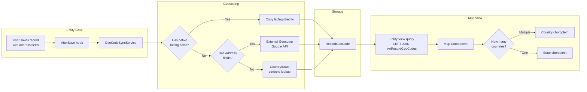
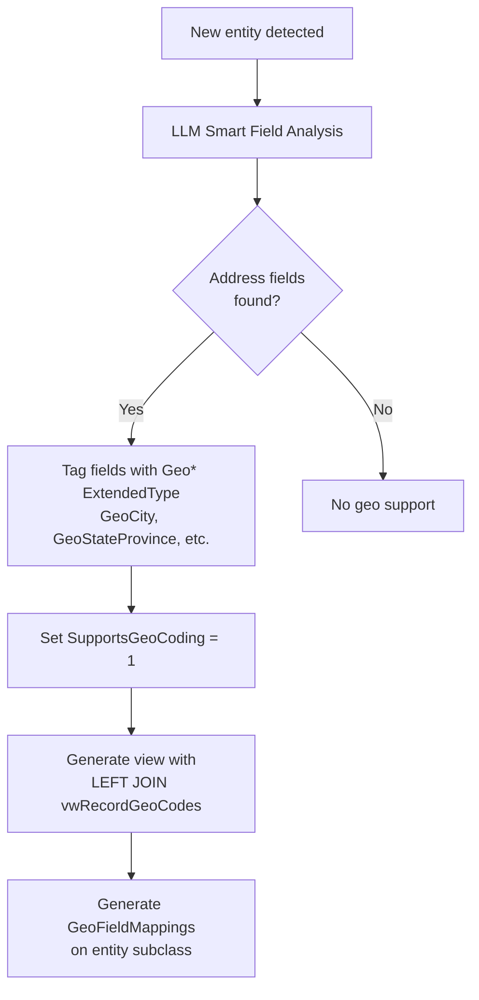
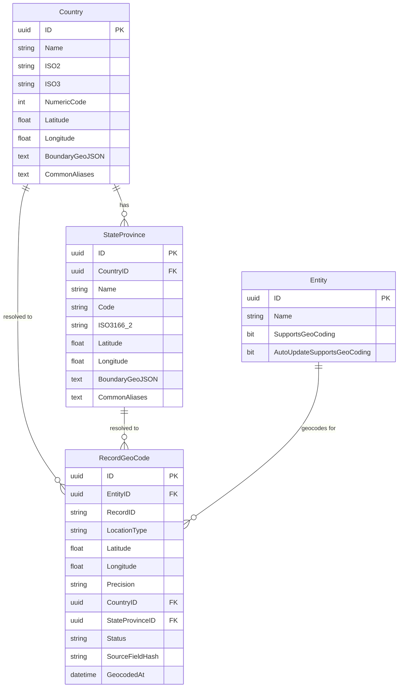
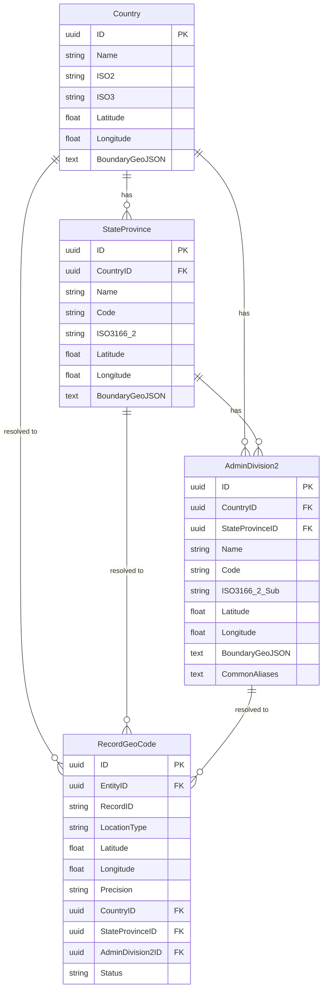
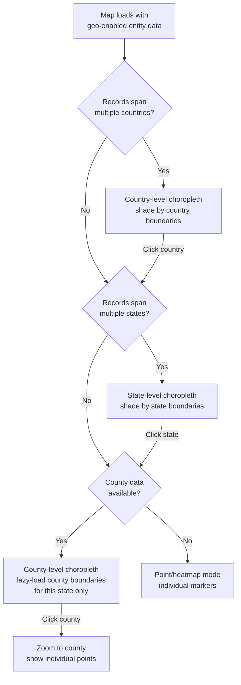

# MemberJunction Geo Architecture & Admin-2 Expansion Plan

## How Geo Works Today

MemberJunction's geo system provides automatic geocoding and map visualization for any entity. The architecture was built in [PR #2325](https://github.com/MemberJunction/MJ/pull/2325) and spans the full stack from database to UI.

### Key Concepts

- **Any entity** can be geo-enabled by setting `SupportsGeoCoding = 1` (auto-detected by CodeGen when address fields are present)
- **Geocoding is polymorphic** — the `RecordGeoCode` table stores lat/lng for records from *any* entity, linked by EntityID + RecordID
- **Map visualization** auto-detects the right level: countries when data spans globally, states when zoomed to one country
- **Reference data** provides centroids and GeoJSON boundaries for countries and states/provinces worldwide

### Data Flow



### CodeGen Integration



### Current ERD



### Reference Data Coverage

| Level | Records | With Boundaries | With Lat/Lng | Source |
|-------|---------|----------------|--------------|--------|
| Countries | 250 | 233 (93%) | 250 (100%) | Natural Earth 50m |
| States/Provinces | 3,761 | 2,883 (76%) | 3,007 (79%) | ISO 3166-2 + Natural Earth 10m |

### Key Packages

| Package | Purpose |
|---------|---------|
| `@memberjunction/geo-core` | GeoCodeSyncService, geocoding strategies, hash-based change detection |
| `@memberjunction/ng-map-view` | Leaflet map component: points, heatmap, choropleth rendering |
| `@memberjunction/server` (GeoResolver) | Text-to-reference resolution (country/state string → ID) |
| `@memberjunction/codegen-lib` | Auto-detects geo fields, generates view JOINs, GeoFieldMappings |

---

## Admin-2 / County Expansion Plan

### Goal

Extend from 2 levels (Country + State/Province) to 3 levels (Country + State/Province + County/District/Admin-2) to enable county-level geocoding, map visualization, and data filtering.

### Proposed ERD



### Proposed Map View Drill-Down



### Phase 1: Database + Reference Data (US-only first)

**New Table: `AdminDivision2`**
```
ID                  UNIQUEIDENTIFIER PK
CountryID           UNIQUEIDENTIFIER FK -> Country
StateProvinceID     UNIQUEIDENTIFIER FK -> StateProvince
Name                NVARCHAR(200) NOT NULL
Code                NVARCHAR(50) NULL         -- FIPS code for US, varies by country
ISO3166_2_Sub       NVARCHAR(20) NULL         -- Sub-code if standardized
Latitude            FLOAT NULL
Longitude           FLOAT NULL
BoundaryGeoJSON     NVARCHAR(MAX) NULL
CommonAliases       NVARCHAR(MAX) NULL        -- JSON array
```

**RecordGeoCode Addition:**
```sql
ALTER TABLE __mj.RecordGeoCode ADD
    AdminDivision2ID UNIQUEIDENTIFIER NULL
    CONSTRAINT FK_RecordGeoCode_AdminDivision2
        FOREIGN KEY REFERENCES __mj.AdminDivision2(ID);
```

**Reference Data Source:**
- **US Counties**: Census Bureau TIGER/Line (3,243 counties, precise boundaries)
  - Download: `https://www2.census.gov/geo/tiger/TIGER2023/COUNTY/`
  - Or simplified GeoJSON from `https://github.com/topojson/us-atlas`
  - FIPS codes as the `Code` column
- **Global (future)**: GADM Level 2 data (~200k divisions)
  - Start with major countries: UK, Canada, Germany, France, Australia
  - Boundary GeoJSON must be simplified (dp 10-15%) to keep sizes manageable

**Data Size Estimates:**
- US counties simplified: ~15-30MB GeoJSON total
- Global admin-2 simplified: ~300-500MB (do this incrementally)

### Phase 2: Server-Side Changes

**GeoCodeSyncService** (`@memberjunction/geo-core`)
- Add `AdminDivision2ID: string | null` to `GeocodeResult` interface
- Update `UpdateSuccess()` to write `AdminDivision2ID` to RecordGeoCode
- Strategy 2 (external geocoder): Extract county from Google Geocode API response
  - Google returns `administrative_area_level_2` -> match to AdminDivision2 by name + state context
- Strategy 3 (reference lookup): Add county centroid fallback

**GeoResolver** (`@memberjunction/server`)
- Add `ResolveAdminDivision2(county, state, country)` GraphQL query
- Match by Name, Code (FIPS), CommonAliases within state+country context
- Add `AdminDivision2ID` / `AdminDivision2Name` to `GeoResolveResult` type
- Cache admin-2 records in memory (lazy-load by country to avoid loading 200k records)

**CodeGen** (`@memberjunction/codegen-lib`)
- Extend geo SELECT fields: add `__mj_rgc.AdminDivision2ID AS __mj_AdminDivision2ID`
- No JOIN changes needed — RecordGeoCode already joined, just expose the new column

**SearchEngineBase** (`@memberjunction/core-entities`)
- Optionally cache AdminDivision2 records (or lazy-load by country on demand)

### Phase 3: Map View Choropleth

**3-Level Auto-Detection Logic:**
```
Records span multiple countries       -> Country-level shading
Records in single country, multi-state -> State-level shading
Records in single state, multi-county  -> County-level shading (NEW)
```

**Implementation:**
- Add `RenderCountyLevelRegions()` method (parallel to existing `RenderStateLevelRegions()`)
- Lazy-load county boundary GeoJSON only when drilling into a single state
  - Don't load all 3,243 US county boundaries at once
  - GraphQL query: `GetAdminDivision2Boundaries(stateProvinceId)` -> returns GeoJSON for ~50-100 counties
- Color palette: handle 100+ regions per state (use continuous gradient, not discrete colors)
- Click-to-drill: clicking a state in state view -> zooms to county view within that state

**Performance Considerations:**
- County boundary GeoJSON per state: ~500KB-2MB
- Use TopoJSON for ~70% size reduction if needed
- Consider tile-based rendering (Mapbox vector tiles) for very dense county displays
- Cache loaded boundaries per state in memory to avoid re-fetching on back navigation

### Phase 4: UI Integration

**Entity Forms:**
- Add county/admin-2 field to geo-enabled entity forms (cascading: Country -> State -> County)
- Only show county picker when country is set and has admin-2 data available

**Data Explorer:**
- County filter in grid view
- Group-by county in aggregations

**Search:**
- County as an additional facet in search filters (when geo data available)

### Phase 5: Global Expansion

Once US counties are solid, expand to other countries:
1. UK: Ceremonial counties (~48) + Districts (~300+)
2. Canada: Census divisions (~293)
3. Germany: Landkreise (~401)
4. France: Departments (~101)
5. Australia: Local government areas (~500+)
6. India: Districts (~780)

Each country can be added incrementally via metadata sync files following the same pattern as state-provinces.

## Decisions to Make Before Starting

1. **Table name**: `AdminDivision2` (generic) vs `County` (US-centric)?
   - Recommendation: `AdminDivision2` — works globally
2. **US-only first or global?**
   - Recommendation: US-only first, global data incrementally
3. **Boundary storage**: Inline GeoJSON column vs external file references?
   - Recommendation: `@file:` references like state-provinces (keeps DB lean)
4. **Geocoding provider**: Google Geocode API extracts county — is that sufficient?
   - Yes, `administrative_area_level_2` in Google's response maps to counties
5. **Map performance**: Leaflet with GeoJSON or upgrade to Mapbox GL for vector tiles?
   - Recommendation: Stay with Leaflet + lazy-load for now; evaluate Mapbox if performance issues arise

## Estimated Effort

| Phase | Scope | Estimate |
|-------|-------|----------|
| Phase 1: Database + US Data | Migration, entity, 3,243 county records + boundaries | 2-3 days |
| Phase 2: Server-Side | GeoCodeSyncService, GeoResolver, CodeGen | 2-3 days |
| Phase 3: Map View | 3-level choropleth, lazy-load boundaries | 2-3 days |
| Phase 4: UI Integration | Forms, filters, search | 1-2 days |
| Phase 5: Global (per country) | Data sourcing + metadata sync | 1 day each |
| **Total (US-only)** | | **7-11 days** |

## Dependencies

- Google Geocode API integration (currently stubbed in GeoCodeSyncService)
- Census TIGER data download and GeoJSON conversion pipeline
- Map view performance testing with 100+ county polygons
