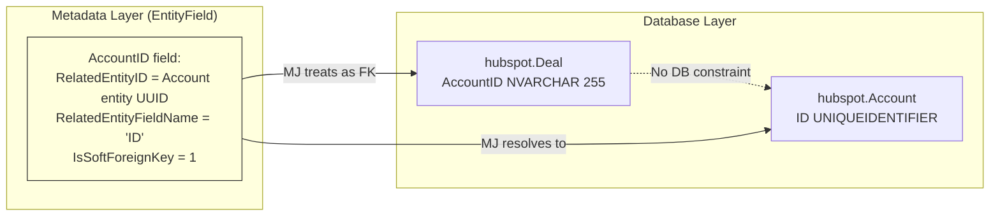
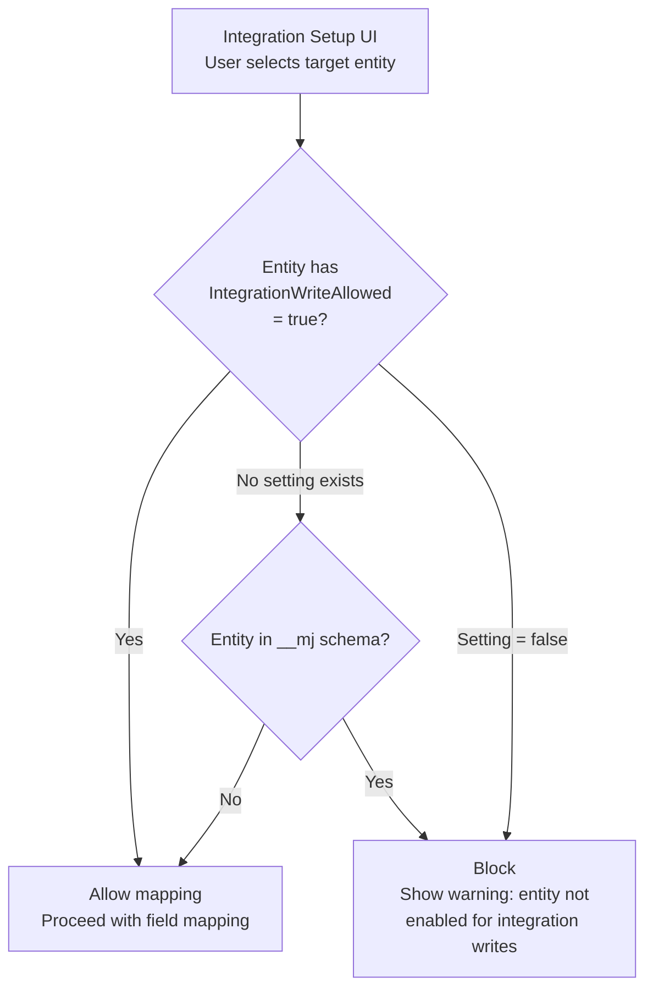
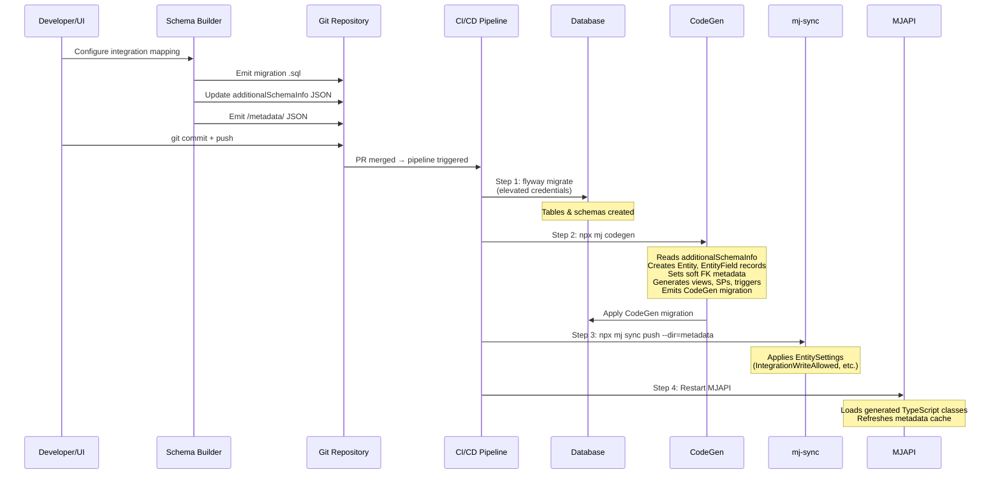
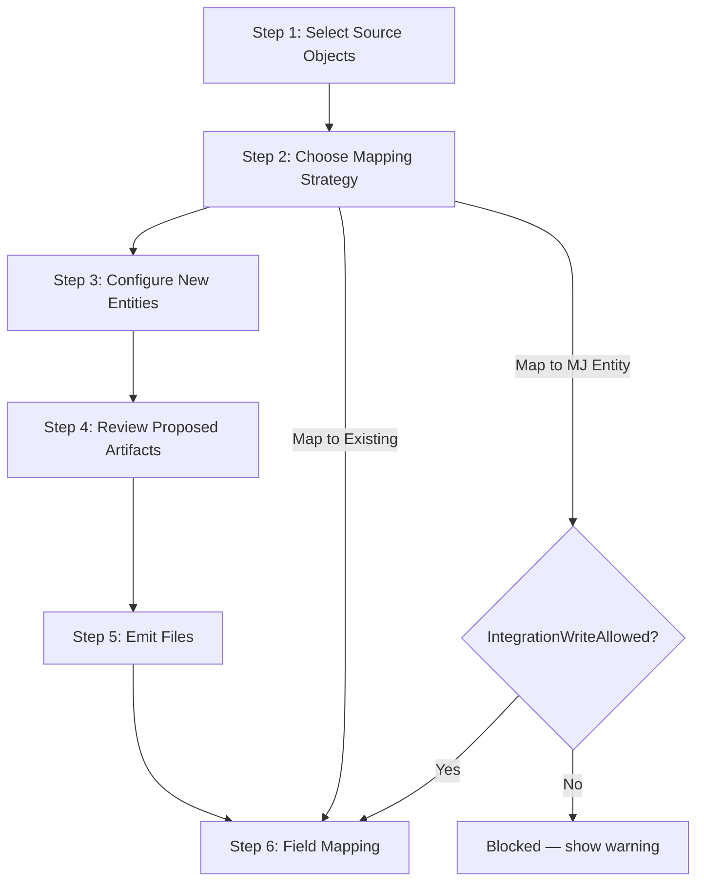
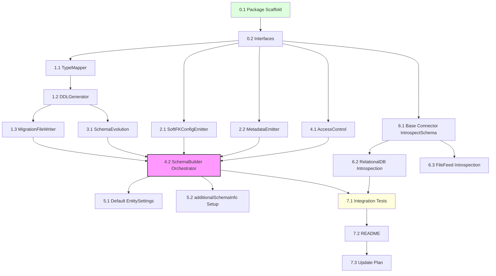

# Integration DDL & Schema Management Plan

> **Status**: Draft v2 — Reviewed & Refined
> **Date**: March 4, 2026
> **Depends On**: [Integration Engine Architecture](integration-engine-architecture.md) *(companion plan — being restored)*
> **Branch**: `claude/study-integration-architecture-qW5p1`

---

## Table of Contents

1. [Problem Statement](#1-problem-statement)
2. [Two Integration Scenarios](#2-two-integration-scenarios)
3. [Design Principles](#3-design-principles)
4. [Architecture Overview](#4-architecture-overview)
5. [Artifact Emission Strategy](#5-artifact-emission-strategy)
6. [Source Schema Introspection](#6-source-schema-introspection)
7. [DDL Generation Engine](#7-ddl-generation-engine)
8. [Soft Foreign Keys](#8-soft-foreign-keys)
9. [Integration Access Control (EntitySettings)](#9-integration-access-control-entitysettings)
10. [Migration File Generation](#10-migration-file-generation)
11. [CI/CD Pipeline — From Artifacts to Running System](#11-cicd-pipeline--from-artifacts-to-running-system)
12. [Post-Deploy: MJAPI Runtime Considerations](#12-post-deploy-mjapi-runtime-considerations)
13. [Schema Evolution (Modify Integration)](#13-schema-evolution-modify-integration)
14. [UI Workflow](#14-ui-workflow)
15. [Safety & Schema Reversal](#15-safety--schema-reversal)
16. [Package Structure](#16-package-structure)
17. [Resolved Design Decisions](#17-resolved-design-decisions)
18. [Open Questions](#18-open-questions)
19. [Detailed Implementation Task List](#19-detailed-implementation-task-list)

---

## 1. Problem Statement

When a user creates or modifies an integration, two scenarios exist:

**Scenario A — "Map to Existing"**: The destination MJ entities already exist. The user maps source objects/fields to existing MJ entities/fields. This is fully handled by `CompanyIntegrationEntityMap` and `CompanyIntegrationFieldMap`.

**Scenario B — "Create from Source"**: The external source has objects (tables, API entities) that have **no corresponding MJ entity**. The system must:
1. Introspect the source system's schema
2. Generate DDL to create local tables
3. Produce migration files, metadata JSON, and soft FK config — **all as files, never executed at runtime**
4. CI/CD applies migrations (Flyway), runs CodeGen, pushes metadata (mj-sync), and restarts MJAPI

Scenario B is the focus of this document. It must be:
- **File-emission-only** — the Schema Builder never executes DDL against the database
- **Forward-migration-only** — reversal is done by writing a new forward migration, never by rollback scripts
- **Versioned** — all DDL lives in migration files under source control
- **CI/CD-friendly** — migrations, CodeGen, and metadata sync apply cleanly in other environments
- **Safe** — never drops data without explicit user confirmation

---

## 2. Two Integration Scenarios

### Scenario A: Map to Existing Entities

```
Source: HubSpot Contacts  →  MJ: Contacts (already exists)
       HubSpot Companies  →  MJ: Companies (already exists)
```

- User selects existing MJ entities in the Mapping Workspace
- EntityMap + FieldMap records are created
- No DDL needed — sync engine uses existing entity infrastructure

### Scenario B: Create from Source (THIS PLAN)

```
Source: HubSpot Deals         →  MJ: ??? (no entity exists)
       HubSpot Line Items     →  MJ: ??? (no entity exists)
       Custom CRM Pipeline    →  MJ: ??? (no entity exists)
```

- User selects source objects that have no MJ counterpart
- System introspects source schema, proposes table structure
- User reviews/customizes proposed schema (including target schema name)
- Schema Builder **emits files only** — migration SQL, `additionalSchemaInfo` JSON, metadata JSON
- CI/CD pipeline applies everything and restarts MJAPI

### Scenario C: Map to Existing MJ Entity (with Integration Access Control)

```
Source: HubSpot Contacts  →  MJ: __mj.List (core MJ entity, allowed via EntitySetting)
       HubSpot Tags       →  MJ: __mj.ListDetail (core MJ entity, allowed via EntitySetting)
```

- Some source objects should write into **existing MJ core entities** (e.g., `List`, `ListDetail`, `Contacts`)
- An `IntegrationWriteAllowed` EntitySetting controls which `__mj` entities permit integration writes
- Entities without this setting are blocked by default (e.g., `Entity`, `EntityField`, `User`)
- See [Section 9](#9-integration-access-control-entitysettings) for details

### Hybrid: Some objects map, others create

Most real integrations are hybrid — some source objects map to existing MJ entities, others need new ones, and some may write into allowed MJ core entities. The UI must support mixing all approaches per-object within a single integration setup.

---

## 3. Design Principles

| Principle | Rationale |
|-----------|-----------|
| **File-emission-only** | Schema Builder produces files (SQL, JSON, metadata) — **never executes DDL at runtime**. MJAPI runs as a lower-privilege DB user that cannot CREATE SCHEMA/TABLE. |
| **Migration-first** | Every DDL change produces a Flyway migration file |
| **CodeGen owns metadata** | Entity, EntityField, views, SPs, triggers, timestamps, and FK indexes are **all created by CodeGen** after migration. Schema Builder never manually creates metadata records. |
| **User-controlled schemas** | Target schema is user-selectable per source object, defaulting from source type but fully overridable. `__mj` is valid when EntitySetting allows it. |
| **Soft FKs via `additionalSchemaInfo`** | All integration relationships use MJ's soft FK system — metadata-defined, no DB constraints, no sync order fragility |
| **Metadata via mj-sync** | EntitySettings, entity field decorations, and other metadata are emitted as `/metadata/` JSON files and applied via `mj-sync push` in CI/CD |
| **Incremental** | Adding fields later produces ALTER TABLE migrations, not recreating tables |
| **User-reviewable** | User always sees proposed DDL and metadata before committing |
| **Idempotent** | Migrations use IF NOT EXISTS guards |

---

## 4. Architecture Overview

### End-to-End Flow

```mermaid
flowchart TD
    A[Source System<br/>HubSpot, Salesforce, DB, CSV...] -->|IntrospectSchema| B[Schema Builder<br/>Orchestrator]

    B -->|1| C[Migration .sql Files<br/>CREATE SCHEMA / TABLE]
    B -->|2| D[additionalSchemaInfo JSON<br/>Soft FK definitions]
    B -->|3| E[/metadata/ JSON Files<br/>EntitySettings, field decorations]
    C --> G[Git Commit<br/>Feature Branch]
    D --> G
    E --> G

    G --> H[PR Review & Merge]

    H --> I[CI/CD Pipeline]

    I -->|Step 1| J[Flyway migrate<br/>Creates schemas & tables]
    I -->|Step 2| K[CodeGen<br/>Views, SPs, entity classes,<br/>soft FKs from additionalSchemaInfo,<br/>__mj timestamps, FK indexes]
    I -->|Step 3| L[mj-sync push<br/>EntitySettings, field decorations]
    I -->|Step 4| M[MJAPI restart<br/>Picks up generated classes]

    style B fill:#f9f,stroke:#333,stroke-width:2px
    style I fill:#bbf,stroke:#333,stroke-width:2px
```

### Key Insight: Schema Builder is a File Generator

The Schema Builder **never touches the database**. It is a pure function:

```
Input:  SourceSchemaInfo (from connector) + User customizations
Output: Files (migration SQL, additionalSchemaInfo JSON, metadata JSON)
```

This is critical because:
- **Security**: MJAPI runs as a low-privilege DB user — it cannot `CREATE SCHEMA` or `CREATE TABLE`
- **Correctness**: Tables alone are useless without CodeGen's views, SPs, triggers, and timestamp columns
- **Reproducibility**: Files in git are the source of truth, not runtime state
- **Multi-environment**: The same files apply identically in dev, staging, and production

### Key Components

1. **SourceSchemaIntrospector** — Queries source system for its schema (tables, columns, types, PKs, FKs)
2. **TypeMapper** — Converts source types to SQL Server/PostgreSQL types
3. **DDLGenerator** — Produces CREATE TABLE/ALTER TABLE SQL migration files
4. **SoftFKConfigEmitter** — Updates `additionalSchemaInfo` JSON with soft FK definitions
5. **MetadataEmitter** — Produces `/metadata/` JSON files for EntitySettings and field decorations
6. **MigrationFileWriter** — Writes properly named Flyway migration files
7. **SchemaBuilder** (orchestrator) — Coordinates the full flow, emits all files

---

## 5. Artifact Emission Strategy

The Schema Builder emits **three categories of artifacts**. Each flows through a different CI/CD step.

```mermaid
flowchart LR
    subgraph "Schema Builder Output"
        A1[Migration .sql]
        A2[additionalSchemaInfo JSON]
        A3[/metadata/ JSON]
    end

    subgraph "CI/CD Consumers"
        B1[Flyway migrate]
        B2[CodeGen]
        B3[mj-sync push]
    end

    A1 --> B1
    A2 --> B2
    A3 --> B3

    B1 -->|"Tables exist"| B2
    B2 -->|"Entity metadata,<br/>views, SPs,<br/>soft FKs exist"| B3
    B3 -->|"EntitySettings<br/>applied"| C[MJAPI Restart]
```

### Artifact 1: Migration SQL Files

**Purpose**: CREATE SCHEMA, CREATE TABLE, ALTER TABLE DDL
**Location**: `migrations/v2/V{YYYYMMDDHHMM}__v{VERSION}.x_Integration_{Source}_{Action}.sql`
**Applied by**: Flyway (CI/CD step 1)
**Permissions**: Flyway runs with elevated DB credentials (can CREATE SCHEMA/TABLE)

### Artifact 2: `additionalSchemaInfo` JSON

**Purpose**: Soft foreign key definitions between integration tables and to existing MJ entities
**Location**: Updated in `config/database-metadata-config.json` (or path configured in `mj.config.cjs` → `codeGen.additionalSchemaInfo`)
**Applied by**: CodeGen (CI/CD step 2) — reads this file and sets `RelatedEntityID` + `RelatedEntityFieldName` + `IsSoftForeignKey=1` on EntityField records
**Why this path**: CodeGen already has full support for this config. It handles validation, conflict detection, and migration file emission for the metadata changes.

### Artifact 3: `/metadata/` JSON Files

**Purpose**: EntitySettings (like `IntegrationWriteAllowed`), entity field decorations, and other metadata that doesn't go through CodeGen
**Location**: `metadata/entities/` and `metadata/entity-settings/` (new folder)
**Applied by**: `mj-sync push` (CI/CD step 3)
**Format**: Same JSON format used throughout MJ's metadata system, with `@lookup:` references for IDs

---

## 6. Source Schema Introspection

Each connector must implement a schema introspection interface:

```typescript
interface SourceSchemaInfo {
  Objects: SourceObjectInfo[];
}

interface SourceObjectInfo {
  /** Name in the source system (e.g., "deals", "line_items") */
  ExternalName: string;
  /** Human-readable label */
  ExternalLabel: string;
  /** Fields/columns in the source object */
  Fields: SourceFieldInfo[];
  /** Primary key field(s) */
  PrimaryKeyFields: string[];
  /** Foreign key relationships to other source objects */
  Relationships: SourceRelationshipInfo[];
}

interface SourceFieldInfo {
  /** Field name in the source */
  Name: string;
  /** Human-readable label */
  Label: string;
  /** Source system type (e.g., "string", "number", "datetime", "boolean") */
  SourceType: string;
  /** Whether the field is required */
  IsRequired: boolean;
  /** Maximum length for string types */
  MaxLength: number | null;
  /** Precision for numeric types */
  Precision: number | null;
  /** Scale for numeric types */
  Scale: number | null;
  /** Default value expression */
  DefaultValue: string | null;
  /** Whether this is a primary key */
  IsPrimaryKey: boolean;
  /** Whether this is a foreign key */
  IsForeignKey: boolean;
  /** If FK, which source object it references */
  ForeignKeyTarget: string | null;
}

interface SourceRelationshipInfo {
  /** Field in this object that references another object */
  FieldName: string;
  /** Target source object name */
  TargetObject: string;
  /** Target field name (usually the PK) */
  TargetField: string;
}
```

### Connector Contract

All connectors are new — `IntrospectSchema()` is a required method:

```typescript
abstract class BaseIntegrationConnector {
  /**
   * Introspect the source system's schema.
   * Returns metadata about available objects and their fields.
   * Used by the Schema Builder to generate local DDL.
   */
  abstract IntrospectSchema(): Promise<SourceSchemaInfo>;
}
```

### Per-Connector Implementations

| Connector | Introspection Strategy |
|-----------|----------------------|
| **RelationalDB** | `INFORMATION_SCHEMA.TABLES` + `INFORMATION_SCHEMA.COLUMNS` — straightforward |
| **HubSpot** | `GET /crm/v3/schemas` API — returns object definitions |
| **Salesforce** | `describe` SOAP/REST API — returns SObject metadata |
| **YourMembership** | API docs + hardcoded schema (API doesn't expose metadata) |
| **FileFeed (CSV)** | Read header row + sample rows to infer types |
| **FileFeed (JSON)** | Parse sample records to infer schema |

---

## 7. DDL Generation Engine

### Type Mapping

The DDL generator maps source types to MJ-compatible SQL types:

```typescript
interface TypeMapping {
  SourceType: string;
  SqlServerType: string;
  PostgresType: string;
  MJFieldType: string;  // For EntityField.Type (set by CodeGen, not by us)
}

const TYPE_MAP: TypeMapping[] = [
  { SourceType: 'string',    SqlServerType: 'NVARCHAR',          PostgresType: 'VARCHAR',       MJFieldType: 'nvarchar' },
  { SourceType: 'text',      SqlServerType: 'NVARCHAR(MAX)',     PostgresType: 'TEXT',           MJFieldType: 'nvarchar' },
  { SourceType: 'integer',   SqlServerType: 'INT',               PostgresType: 'INTEGER',        MJFieldType: 'int' },
  { SourceType: 'bigint',    SqlServerType: 'BIGINT',            PostgresType: 'BIGINT',         MJFieldType: 'bigint' },
  { SourceType: 'decimal',   SqlServerType: 'DECIMAL(p,s)',      PostgresType: 'NUMERIC(p,s)',   MJFieldType: 'decimal' },
  { SourceType: 'boolean',   SqlServerType: 'BIT',               PostgresType: 'BOOLEAN',        MJFieldType: 'bit' },
  { SourceType: 'datetime',  SqlServerType: 'DATETIMEOFFSET',    PostgresType: 'TIMESTAMPTZ',    MJFieldType: 'datetimeoffset' },
  { SourceType: 'date',      SqlServerType: 'DATE',              PostgresType: 'DATE',           MJFieldType: 'date' },
  { SourceType: 'uuid',      SqlServerType: 'UNIQUEIDENTIFIER',  PostgresType: 'UUID',           MJFieldType: 'uniqueidentifier' },
  { SourceType: 'json',      SqlServerType: 'NVARCHAR(MAX)',     PostgresType: 'JSONB',          MJFieldType: 'nvarchar' },
];
```

### Table & Schema Naming

Target schema and table names are **user-controlled**, with smart defaults:

| Property | Default | Override |
|----------|---------|----------|
| **Schema** | Lowercase source type name (e.g., `hubspot`) | User can change to any valid schema name |
| **Table** | PascalCase singular of source object name (e.g., `Deal`) | User can rename |
| **Entity Name** | `{Schema} {TableLabel}` (e.g., `HubSpot Deal`) | User can rename |

**Important**: Different source objects from the same integration can target **different schemas**. For example, HubSpot Contacts → `crm.Contact`, HubSpot Invoices → `billing.Invoice`.

**MJ core schema (`__mj`)** is a valid target *only* when the target entity has an `IntegrationWriteAllowed` EntitySetting (see [Section 9](#9-integration-access-control-entitysettings)).

### Generated DDL Template

```sql
-- Auto-generated by MJ Integration Schema Builder
-- Source: HubSpot | Object: deals
-- Generated: 2026-03-04T20:30:00Z

IF NOT EXISTS (SELECT 1 FROM sys.schemas WHERE name = 'hubspot')
    EXEC('CREATE SCHEMA [hubspot]');

CREATE TABLE [hubspot].[Deal] (
    ID UNIQUEIDENTIFIER NOT NULL DEFAULT NEWSEQUENTIALID(),
    SourceRecordID NVARCHAR(255) NOT NULL,  -- External system's ID
    Name NVARCHAR(500) NULL,
    Amount DECIMAL(18,2) NULL,
    Stage NVARCHAR(255) NULL,
    CloseDate DATE NULL,
    OwnerEmail NVARCHAR(500) NULL,
    AccountID NVARCHAR(255) NULL,           -- Soft FK to hubspot.Account (via additionalSchemaInfo)
    SourceJSON NVARCHAR(MAX) NULL,          -- Raw source record for debugging
    SyncStatus NVARCHAR(50) NOT NULL DEFAULT 'Active',
    LastSyncedAt DATETIMEOFFSET NULL,
    CONSTRAINT PK_HubSpot_Deal PRIMARY KEY (ID),
    CONSTRAINT UQ_HubSpot_Deal_SourceRecordID UNIQUE (SourceRecordID)
);
-- NOTE: __mj_CreatedAt, __mj_UpdatedAt, FK indexes, views, and SPs are created by CodeGen
-- NOTE: Soft FK for AccountID is defined in additionalSchemaInfo, applied by CodeGen
```

### Standard Columns Added Automatically

Every generated table includes these columns in addition to source-mapped columns:

| Column | Type | Purpose |
|--------|------|---------|
| `ID` | `UNIQUEIDENTIFIER DEFAULT NEWSEQUENTIALID()` | MJ primary key |
| `SourceRecordID` | `NVARCHAR(255) NOT NULL UNIQUE` | External system's identifier for deduplication |
| `SourceJSON` | `NVARCHAR(MAX) NULL` | Raw source record for debugging/auditing |
| `SyncStatus` | `NVARCHAR(50) DEFAULT 'Active'` | Track soft-deleted/archived records |
| `LastSyncedAt` | `DATETIMEOFFSET NULL` | When this record was last synced |

These standard columns ensure:
- Every record can be traced back to its source
- Soft deletes are supported
- Deduplication can match on `SourceRecordID`
- The raw source data is preserved for troubleshooting

---

## 8. Soft Foreign Keys

### Why Soft FKs for Integrations

Integration data is **notoriously unreliable** for referential integrity:

- Source systems may not enforce FKs even when they "should"
- Sync timing means child records may arrive before parents
- Source IDs may reference records that were deleted in the source
- Cross-source relationships (HubSpot Deal → Salesforce Account) can't be guaranteed

MemberJunction's **soft FK system** solves all of these problems while still giving the framework full relationship awareness.

### How Soft FKs Work in MJ

Soft FKs are defined purely in metadata — no database constraint exists:



**Key properties on `EntityField`**:

| Property | Value | Effect |
|----------|-------|--------|
| `RelatedEntityID` | UUID of the target entity | Tells MJ which entity this field references |
| `RelatedEntityFieldName` | Target field name (usually `ID`) | Tells MJ which field in the target entity |
| `IsSoftForeignKey` | `1` | Protects from CodeGen schema sync overwriting; marks as metadata-only |

**Framework behavior**: Soft FKs behave **identically** to hard FKs throughout MJ:
- GraphQL resolvers generate relationship fields
- Angular forms show dropdown lookups
- Record dependency detection works (for delete warnings)
- Record merging updates soft-FK-linked records
- Views include JOINs for denormalized field access

**The only difference**: The database doesn't enforce the constraint, so inserts/updates never fail due to FK violations.

### Configuration via `additionalSchemaInfo`

The Schema Builder updates the `additionalSchemaInfo` JSON file (path configured in `mj.config.cjs`):

```json
{
  "hubspot": [
    {
      "TableName": "Deal",
      "ForeignKeys": [
        {
          "FieldName": "AccountID",
          "SchemaName": "hubspot",
          "RelatedTable": "Account",
          "RelatedField": "ID"
        }
      ]
    },
    {
      "TableName": "Contact",
      "ForeignKeys": [
        {
          "FieldName": "AccountID",
          "SchemaName": "hubspot",
          "RelatedTable": "Account",
          "RelatedField": "ID"
        },
        {
          "FieldName": "OwnerUserID",
          "SchemaName": "__mj",
          "RelatedTable": "User",
          "RelatedField": "ID"
        }
      ]
    }
  ]
}
```

When CodeGen runs, it:
1. Reads `additionalSchemaInfo`
2. For each FK entry, sets `RelatedEntityID`, `RelatedEntityFieldName`, and `IsSoftForeignKey=1` on the corresponding `EntityField`
3. Emits the metadata changes to a CodeGen migration file for CI/CD traceability
4. Validates for conflicts (e.g., if a hard FK already exists on the same field)

### Cross-Source Relationships

For relationships between integration schemas (e.g., HubSpot Deal → Salesforce Account), soft FKs are the **only** viable option. The Schema Builder should still allow users to define these, but warn that sync timing may cause temporary broken references.

---

## 9. Integration Access Control (EntitySettings)

### Problem

Some integrations need to write data into **existing MJ core entities** (e.g., `List`, `ListDetail`, `Contacts`). But we must prevent integrations from writing into **system entities** (e.g., `Entity`, `EntityField`, `User`, `Role`) that would corrupt the MJ framework.

### Solution: `IntegrationWriteAllowed` EntitySetting

An EntitySetting named `IntegrationWriteAllowed` controls which entities in the `__mj` schema (and potentially other shared schemas) permit integration writes.



### EntitySetting Record Format

Stored as a record in the `EntitySetting` table:

| Field | Value |
|-------|-------|
| `EntityID` | UUID of the target entity (e.g., List entity) |
| `Name` | `IntegrationWriteAllowed` |
| `Value` | `true` or `false` |
| `Comments` | `Controls whether integration sync can write to this entity` |

### Metadata JSON for mj-sync

The Schema Builder emits (or a base set ships with MJ) metadata files like:

```json
[
  {
    "_comments": ["Allow integration writes to the List entity"],
    "fields": {
      "Name": "Lists",
      "BaseView": "vwLists"
    },
    "relatedEntities": {
      "MJ: Entity Settings": [
        {
          "fields": {
            "Name": "IntegrationWriteAllowed",
            "Value": "true",
            "Comments": "Allows integration sync to write records to this entity"
          }
        }
      ]
    },
    "primaryKey": {
      "ID": "@lookup:MJ: Entities.Name=Lists"
    }
  }
]
```

### Default Allowlist (Ships with MJ)

These `__mj` entities should have `IntegrationWriteAllowed = true` by default:

| Entity | Rationale |
|--------|-----------|
| `Lists` | Common integration target for marketing/CRM lists |
| `List Details` | Child records of Lists |
| `Contacts` | Core CRM data frequently synced from external sources |
| `Companies` | Core CRM data frequently synced from external sources |
| `Tags` | Categorization data from external systems |

### Blocklist (Never Allow)

These entities should **never** be writable by integrations, regardless of settings:

- `MJ: Entities`, `MJ: Entity Fields`, `MJ: Entity Relationships` — schema metadata
- `Users`, `Roles`, `User Roles` — security infrastructure
- `Applications`, `Application Entities` — app configuration
- `MJ: Entity Settings` — recursive self-modification

The Schema Builder should enforce this blocklist in code, independent of EntitySettings.

---

## 10. Migration File Generation

### File Naming

Generated migrations follow the Flyway convention:

```
migrations/v2/V{YYYYMMDDHHMM}__v{MJ_VERSION}.x_Integration_{SourceType}_{Action}.sql
```

Examples:
```
V202603041530__v5.7.x_Integration_HubSpot_CreateSchema.sql
V202603041531__v5.7.x_Integration_HubSpot_CreateDealTable.sql
V202603041532__v5.7.x_Integration_HubSpot_CreateContactTable.sql
V202603050900__v5.7.x_Integration_HubSpot_AddDealPriorityColumn.sql
```

### Migration Content

Each migration file includes:
1. Header comment with source, generation timestamp, and user who initiated
2. Schema creation with `IF NOT EXISTS` guard (first migration only)
3. Table creation DDL (columns, PKs, UNIQUE constraints)
4. Check constraints for enum-like fields
5. **No FK constraints** — relationships are soft FKs via `additionalSchemaInfo`
6. **No `__mj_CreatedAt`/`__mj_UpdatedAt`** — CodeGen adds these
7. **No FK indexes** — CodeGen creates these with `IDX_AUTO_MJ_FKEY_*` naming
8. Comments/extended properties for documentation

### What the Migration Does NOT Contain

| Excluded Item | Reason |
|---------------|--------|
| `__mj_CreatedAt` / `__mj_UpdatedAt` columns | CodeGen adds with triggers |
| FK indexes | CodeGen creates `IDX_AUTO_MJ_FKEY_*` |
| Foreign key constraints | Soft FKs via `additionalSchemaInfo` |
| Entity/EntityField INSERT statements | CodeGen discovers from `INFORMATION_SCHEMA` |
| Views (`vw*`) | CodeGen generates |
| Stored procedures (`sp*`) | CodeGen generates |

---

## 11. CI/CD Pipeline — From Artifacts to Running System

### Pipeline Flow



### Step-by-Step Detail

**Step 1: Flyway migrate** (elevated DB credentials)
- Creates schemas (`CREATE SCHEMA IF NOT EXISTS`)
- Creates tables (`CREATE TABLE`)
- Adds ALTER TABLE for evolution scenarios
- Runs with DBA-level permissions not available to MJAPI

**Step 2: CodeGen** (`npx mj codegen`)
- Discovers new tables via `INFORMATION_SCHEMA`
- Creates `Entity` and `EntityField` records in metadata tables
- Reads `additionalSchemaInfo` → sets soft FK metadata (`RelatedEntityID`, `RelatedEntityFieldName`, `IsSoftForeignKey=1`)
- Generates views (`vwHubSpotDeal`), stored procedures (`spCreate*`, `spUpdate*`, `spDelete*`)
- Adds `__mj_CreatedAt` / `__mj_UpdatedAt` columns with triggers
- Creates FK indexes (`IDX_AUTO_MJ_FKEY_*`)
- Generates TypeScript entity classes with Zod schemas
- Generates Angular form components
- Emits a CodeGen migration file for all DB changes

**Step 3: mj-sync push** (`npx mj sync push --dir=metadata`)
- Applies EntitySettings (`IntegrationWriteAllowed`) for access control
- Applies any entity field decorations emitted by Schema Builder
- Uses `@lookup:` references — no hardcoded UUIDs

**Step 4: MJAPI restart**
- Loads newly generated TypeScript entity subclasses
- Refreshes metadata cache
- New entities become available via GraphQL API

### Environment Matrix

| Environment | Who Triggers | Notes |
|-------------|-------------|-------|
| **Local dev** | Developer manually runs steps 1-4 | Can use `flyway migrate` locally or apply SQL manually |
| **Staging** | CI/CD on merge to `next` | Fully automated |
| **Production** | CI/CD on release tag | Fully automated, same pipeline |

---

## 12. Post-Deploy: MJAPI Runtime Considerations

### Without MJAPI Restart

If an MJAPI restart is not immediately feasible (e.g., zero-downtime requirement), the integration sync engine can still operate using `BaseEntity.InnerLoad()`:

```typescript
// After CodeGen has run but before MJAPI restart:
// - Entity metadata exists in the database
// - Views and SPs exist
// - But MJAPI hasn't loaded the generated TypeScript subclass

const md = new Metadata();
// This returns a BaseEntity instance (not the generated subclass)
const entity = await md.GetEntityObject<BaseEntity>('HubSpot Deal', contextUser);

// InnerLoad works — bypasses typed getters/setters, uses generic field access
await entity.InnerLoad(recordId);

// Generic Get/Set work fine for sync operations
const name = entity.Get('Name');
entity.Set('Amount', 42000);
await entity.Save();
```

This provides **full CRUD capability** without typed properties. The sync engine doesn't need typed accessors — it maps fields dynamically from source data anyway. After the next MJAPI restart, the generated subclass loads and typed access becomes available.

### With MJAPI Restart (Preferred)

A full restart loads the generated TypeScript subclasses, enabling:
- Typed property access (`entity.Name`, `entity.Amount`)
- Zod validation on save
- Custom business logic in entity subclass overrides
- Full Angular form support

---

## 13. Schema Evolution (Modify Integration)

When an integration is modified (new fields added in source, fields removed, types changed), the Schema Builder runs a **diff** between the current source schema and the existing local schema, then emits new artifacts.

### Field Addition

Migration file:
```sql
-- Generated: V202603050900__v5.7.x_Integration_HubSpot_AddDealPriority.sql
ALTER TABLE [hubspot].[Deal]
    ADD Priority NVARCHAR(50) NULL;
```

CodeGen picks up the new column from `INFORMATION_SCHEMA` and creates the `EntityField` record.

### Field Type Change

Migration file:
```sql
-- Generated: V202603050901__v5.7.x_Integration_HubSpot_AlterDealAmount.sql
ALTER TABLE [hubspot].[Deal]
    ALTER COLUMN Amount DECIMAL(22,4);  -- Increased precision
```

CodeGen updates the `EntityField` record's type metadata.

### New Relationship

Schema Builder updates `additionalSchemaInfo` with the new soft FK entry. CodeGen applies it.

### Field Removal

Fields are **never physically dropped**. Instead:
1. The `CompanyIntegrationFieldMap` for that field is set to `Status = 'Inactive'`
2. The sync engine stops syncing the field
3. CodeGen marks the field description with `[DEPRECATED]` (via metadata JSON)
4. A future cleanup migration can drop the column after a user-defined grace period

### Object Removal

Objects are never physically dropped. The `CompanyIntegrationEntityMap` is set to `Status = 'Inactive'`, and the sync engine stops syncing it.

---

## 14. UI Workflow

### "Create from Source" Flow in Mapping Workspace



**Step 1: Select Source Objects**
- User views list of source objects (from connector's `IntrospectSchema()`)
- Each object shows: name, field count, estimated row count
- User checks objects they want to sync

**Step 2: Choose Mapping Strategy (per object)**
- **"Map to Existing Entity"** — select an existing MJ entity (Scenario A)
- **"Map to MJ Core Entity"** — select an `__mj` entity (Scenario C, checked against `IntegrationWriteAllowed`)
- **"Create New Entity"** — propose a new table (Scenario B)

**Step 3: Configure New Entities (for "Create New" objects)**
- Schema name (dropdown of existing schemas + "Create New", defaults from source type)
- Table name (editable, defaults to PascalCase singular)
- Entity name (editable, defaults to `{Schema} {Table}`)
- Column list with types (editable — user can change types, set nullable, adjust lengths)
- Standard columns shown as read-only (ID, SourceRecordID, etc.)
- Relationship configuration: for each FK field, user confirms target entity and marks as soft FK

**Step 4: Review Proposed Artifacts**
- Summary of all files to be generated:
  - N migration files (with DDL preview in collapsible panels)
  - additionalSchemaInfo changes (soft FK summary)
  - metadata JSON files (EntitySettings if targeting `__mj` entities)
- "Generate Files" button (with confirmation dialog)

**Step 5: Emit Files**
- Progress indicator showing file generation
- Files written to the local repository
- User instructed to commit, push, and let CI/CD apply

**Step 6: Field Mapping**
- For new entities: source fields pre-mapped to generated columns (1:1)
- For existing entities: standard mapping workspace
- User can adjust mappings, add transforms

---

## 15. Safety & Schema Reversal

### Pre-Flight Checks

Before generating artifacts:
1. **Schema collision check** — ensure schema name doesn't conflict with protected schemas
2. **Table collision check** — ensure table names don't exist in target schema
3. **Entity name collision check** — ensure entity names aren't already registered
4. **Integration access control** — if targeting `__mj`, verify `IntegrationWriteAllowed` EntitySetting
5. **Hard blocklist** — certain system entities are never writable (enforced in code, not metadata)
6. **Permission check** — user must have admin/integration-manager role

### Forward-Migration-Only Reversal

There are **no rollback scripts**. Rollback scripts are error-prone and dangerous — they attempt to reverse complex state changes (metadata, views, SPs, triggers, indexes) in a single shot and inevitably miss edge cases.

Instead, reversal follows the same forward-migration pattern as every other schema change in MJ:

1. **Write a new forward migration** that undoes the physical schema change (e.g., `DROP TABLE IF EXISTS`, `ALTER TABLE DROP COLUMN`)
2. **Run CodeGen** — it detects the removed tables/columns and cleans up Entity, EntityField, views, SPs, and triggers automatically
3. **Update `additionalSchemaInfo`** — remove soft FK entries for dropped tables/columns
4. **Run `mj-sync push`** — remove EntitySettings if needed
5. **Restart MJAPI** — picks up the updated metadata

This approach:
- Uses the **exact same CI/CD pipeline** as creation (no special tooling)
- Is **reviewable** — the reversal migration goes through PR review like any other change
- Is **incremental** — you can drop one table without affecting others
- Is **safe** — CodeGen handles all the metadata cleanup it originally created
- Is **testable** — can be validated in staging before production

### Data Protection

- **Soft deactivation first**: Before writing a drop migration, mark the `CompanyIntegrationEntityMap` as `Status = 'Inactive'` so syncing stops
- **Grace period**: Recommend waiting 30+ days between deactivation and physical drop to allow data export
- **UI warning**: When a user deactivates an integration object, warn that data will remain in the table until a drop migration is written and applied
- **Audit trail**: All schema changes are tracked through git history and Flyway migration records

---

## 16. Package Structure

```
packages/Integration/
├── engine/                          # Integration sync orchestrator
├── connectors/                      # Source system connectors
├── schema-builder/                  # NEW: File-emission-only schema management
│   ├── package.json
│   ├── tsconfig.json
│   ├── src/
│   │   ├── index.ts                 # Public API exports
│   │   ├── SchemaBuilder.ts         # Orchestrator — coordinates all emitters
│   │   ├── SourceSchemaIntrospector.ts  # Interface + base class
│   │   ├── TypeMapper.ts            # Source type → SQL Server / PostgreSQL type mapping
│   │   ├── DDLGenerator.ts          # CREATE TABLE / ALTER TABLE migration file generation
│   │   ├── SoftFKConfigEmitter.ts   # Updates additionalSchemaInfo JSON with soft FK defs
│   │   ├── MetadataEmitter.ts       # Produces /metadata/ JSON (EntitySettings, field decorations)
│   │   ├── MigrationFileWriter.ts   # Writes Flyway-named .sql files with proper headers
│   │   ├── SchemaEvolution.ts       # Diff engine: compare source schema vs existing table
│   │   └── __tests__/
│   │       ├── TypeMapper.test.ts
│   │       ├── DDLGenerator.test.ts
│   │       ├── SoftFKConfigEmitter.test.ts
│   │       ├── MetadataEmitter.test.ts
│   │       ├── MigrationFileWriter.test.ts
│   │       └── SchemaEvolution.test.ts
│   └── README.md
└── ui-types/                        # Shared types for UI ↔ server communication
```

---

## 17. Resolved Design Decisions

These were open questions that have been resolved through review:

| Decision | Resolution | Rationale |
|----------|-----------|-----------|
| **Runtime DDL execution** | **No** — file emission only | MJAPI has insufficient DB permissions; tables alone are useless without CodeGen; security concern |
| **Manual Entity/EntityField registration** | **No** — CodeGen handles all metadata | Manually inserting metadata is fragile, conflicts with CodeGen sync, and duplicates work |
| **FK strategy** | **Soft FKs only** via `additionalSchemaInfo` | Source systems are unreliable; soft FKs prevent sync failures while preserving full MJ relationship awareness |
| **Schema naming** | **User-controlled** per source object | Defaults from source type but fully overridable; different objects can go to different schemas |
| **MJ core entity writes** | **Controlled via `IntegrationWriteAllowed` EntitySetting** + hardcoded blocklist | Allows flexible allowlisting while protecting system entities |
| **Connector introspection** | **Required on all connectors** | All connectors are new; no backward compatibility concern |
| **Entity access via code** | **`Metadata.GetEntityObject()` + generic `Set()/Get()`** | Gets highest-priority subclass; weak typing is acceptable since recompiling per permutation is impractical |
| **Post-deploy without restart** | **`InnerLoad()` on `BaseEntity`** | Full CRUD without typed subclass; sufficient for sync operations |

---

## 18. Open Questions

1. **CodeGen triggering**: Should CodeGen run automatically as part of CI/CD after Flyway, or should the user manually trigger it?
   - **Leaning**: Automatic in CI/CD, manual option for local dev

2. **Initial bulk import**: After schema creation and full CI/CD, should the UI offer an "Initial Sync" button?
   - **Leaning**: Yes — after entities are live, offer full pull from source

3. **SaaS connector introspection**: Some APIs don't expose schema metadata. How do we handle this?
   - **Leaning**: Hardcoded schema definitions per connector, with override capability via JSON config files

4. **Multi-tenant schema collisions**: If two organizations use HubSpot, do they share the `hubspot` schema?
   - **Leaning**: Yes, for single-tenant deployments (current MJ model). Multi-tenant would need schema prefixing.

---

## 19. Detailed Implementation Task List

> **Audience**: This section is designed for an AI Agent to execute step-by-step, supervised by a human reviewer. Each task includes full context so the agent can work autonomously. Tasks are ordered by dependency — later tasks depend on earlier ones completing.

### Phase 0: Project Setup & Foundation

#### Task 0.1: Create the `schema-builder` package scaffold

**Context**: The Schema Builder is a new package in the Integration family. It needs the standard MJ package structure with TypeScript, Vitest, and proper workspace integration.

**Steps**:
1. Create directory `packages/Integration/schema-builder/`
2. Create `package.json`:
   - Name: `@memberjunction/integration-schema-builder`
   - Dependencies: `@memberjunction/global`, `@memberjunction/core` (for types only — no runtime DB access)
   - DevDependencies: `vitest`, `typescript`
   - Scripts: `build`, `test`, `test:watch`
3. Create `tsconfig.json` following the pattern from other Integration packages (e.g., `packages/Integration/engine/tsconfig.json`)
4. Create `src/index.ts` with placeholder exports
5. Create `src/__tests__/` directory
6. Run `npm install` from repo root to register the workspace package
7. Verify `npm run build` succeeds in the package directory

**Verification**: `cd packages/Integration/schema-builder && npm run build` succeeds with no errors.

#### Task 0.2: Define all shared TypeScript interfaces

**Context**: These interfaces are the contracts between the Schema Builder's components and between connectors and the Schema Builder. They must be defined first because everything else depends on them.

**Steps**:
1. Create `src/interfaces.ts` with these interfaces:
   - `SourceSchemaInfo` — top-level container for introspected schema (has `Objects: SourceObjectInfo[]`)
   - `SourceObjectInfo` — one source object/table (has `ExternalName`, `ExternalLabel`, `Fields`, `PrimaryKeyFields`, `Relationships`)
   - `SourceFieldInfo` — one field/column (has `Name`, `Label`, `SourceType`, `IsRequired`, `MaxLength`, `Precision`, `Scale`, `DefaultValue`, `IsPrimaryKey`, `IsForeignKey`, `ForeignKeyTarget`)
   - `SourceRelationshipInfo` — one FK relationship (has `FieldName`, `TargetObject`, `TargetField`)
   - `TargetTableConfig` — user's customization of a target table (has `SchemaName`, `TableName`, `EntityName`, `Columns: TargetColumnConfig[]`)
   - `TargetColumnConfig` — user's customization of a column (has `SourceFieldName`, `TargetColumnName`, `TargetSqlType`, `IsNullable`, `MaxLength`, etc.)
   - `SchemaBuilderOutput` — the complete output of the Schema Builder (has `MigrationFiles: EmittedFile[]`, `AdditionalSchemaInfoUpdate: object`, `MetadataFiles: EmittedFile[]`)
   - `EmittedFile` — a single emitted file (has `FilePath`, `Content`, `Description`)
   - `TypeMapping` — source type to SQL type mapping (has `SourceType`, `SqlServerType`, `PostgresType`, `MJFieldType`)
   - `DatabasePlatform` — union type `'sqlserver' | 'postgresql'`
2. Export all interfaces from `src/index.ts`
3. Add TSDoc comments to every interface and property (the AI agent executing later tasks will rely on these docs)

**Verification**: Build succeeds. Interfaces are importable from the package.

---

### Phase 1: Type Mapping & DDL Generation

#### Task 1.1: Implement `TypeMapper`

**Context**: The TypeMapper converts source system types (generic strings like `'string'`, `'integer'`, `'datetime'`) into SQL Server and PostgreSQL types. It must handle both platforms because MJ supports both (see the PostgreSQL 5.0 implementation). The `MJFieldType` value is informational only — CodeGen will discover the actual type from `INFORMATION_SCHEMA`.

**Steps**:
1. Create `src/TypeMapper.ts`
2. Define the `TYPE_MAP` constant array with all mappings from [Section 7](#7-ddl-generation-engine):
   - `string` → `NVARCHAR(n)` / `VARCHAR(n)`
   - `text` → `NVARCHAR(MAX)` / `TEXT`
   - `integer` → `INT` / `INTEGER`
   - `bigint` → `BIGINT` / `BIGINT`
   - `decimal` → `DECIMAL(p,s)` / `NUMERIC(p,s)`
   - `boolean` → `BIT` / `BOOLEAN`
   - `datetime` → `DATETIMEOFFSET` / `TIMESTAMPTZ`
   - `date` → `DATE` / `DATE`
   - `uuid` → `UNIQUEIDENTIFIER` / `UUID`
   - `json` → `NVARCHAR(MAX)` / `JSONB`
   - `float` → `FLOAT` / `DOUBLE PRECISION`
   - `time` → `TIME` / `TIME`
3. Implement `MapSourceType(sourceType: string, platform: DatabasePlatform, field: SourceFieldInfo): string`
   - Looks up the source type in `TYPE_MAP`
   - Substitutes `(p,s)` with actual precision/scale from `SourceFieldInfo`
   - For `string` type: uses `MaxLength` if provided, defaults to `NVARCHAR(255)` / `VARCHAR(255)`
   - For unknown types: returns `NVARCHAR(MAX)` / `TEXT` with a warning
4. Implement `GetMJFieldType(sourceType: string): string` — returns the MJ field type string
5. Export the class

**Testing** (create `src/__tests__/TypeMapper.test.ts`):
- Test each source type maps correctly for both platforms
- Test precision/scale substitution for decimal types
- Test MaxLength handling for string types
- Test unknown type fallback
- Test null/undefined MaxLength defaults

#### Task 1.2: Implement `DDLGenerator`

**Context**: The DDLGenerator produces CREATE TABLE and ALTER TABLE SQL strings. It does NOT execute SQL — it returns strings that will be written to migration files. It must support both SQL Server and PostgreSQL syntax. It must add the standard integration columns (ID, SourceRecordID, SourceJSON, SyncStatus, LastSyncedAt) and must NOT add `__mj_CreatedAt`/`__mj_UpdatedAt` (CodeGen handles those) or FK constraints (soft FKs via `additionalSchemaInfo`).

**Steps**:
1. Create `src/DDLGenerator.ts`
2. Implement `GenerateCreateSchema(schemaName: string, platform: DatabasePlatform): string`
   - SQL Server: `IF NOT EXISTS (SELECT 1 FROM sys.schemas WHERE name = '${schemaName}') EXEC('CREATE SCHEMA [${schemaName}]');`
   - PostgreSQL: `CREATE SCHEMA IF NOT EXISTS "${schemaName}";`
3. Implement `GenerateCreateTable(config: TargetTableConfig, platform: DatabasePlatform): string`
   - Generates `CREATE TABLE [{schema}].[{table}]` (SQL Server) or `CREATE TABLE "{schema}"."{table}"` (PostgreSQL)
   - Always includes standard columns: `ID`, `SourceRecordID`, `SourceJSON`, `SyncStatus`, `LastSyncedAt`
   - Adds user-configured columns from `TargetColumnConfig[]`
   - Adds `CONSTRAINT PK_{Schema}_{Table} PRIMARY KEY (ID)`
   - Adds `CONSTRAINT UQ_{Schema}_{Table}_SourceRecordID UNIQUE (SourceRecordID)`
   - Uses `TypeMapper` for column types
   - Adds header comment with source info and generation timestamp
   - Does NOT add `__mj_CreatedAt`, `__mj_UpdatedAt`, FK constraints, or FK indexes
4. Implement `GenerateAlterTableAddColumn(schemaName: string, tableName: string, column: TargetColumnConfig, platform: DatabasePlatform): string`
5. Implement `GenerateAlterTableAlterColumn(schemaName: string, tableName: string, column: TargetColumnConfig, platform: DatabasePlatform): string`
6. All methods must properly escape identifiers (bracket-quoting for SQL Server, double-quoting for PostgreSQL)
7. All methods must handle SQL injection prevention for schema/table/column names (alphanumeric + underscore only)

**Testing** (create `src/__tests__/DDLGenerator.test.ts`):
- Test CREATE SCHEMA for both platforms with IF NOT EXISTS
- Test CREATE TABLE includes all standard columns
- Test CREATE TABLE does NOT include `__mj_CreatedAt`/`__mj_UpdatedAt`
- Test CREATE TABLE does NOT include FK constraints
- Test ALTER TABLE ADD COLUMN
- Test ALTER TABLE ALTER COLUMN
- Test proper identifier escaping
- Test SQL injection prevention (reject names with special characters)
- Snapshot tests for full DDL output

#### Task 1.3: Implement `MigrationFileWriter`

**Context**: The MigrationFileWriter takes DDL strings and wraps them in properly-named Flyway migration files. The naming convention is `V{YYYYMMDDHHMM}__v{MJ_VERSION}.x_Integration_{SourceType}_{Action}.sql`. Files are written to `migrations/v2/`. The writer does NOT execute SQL — it only produces file content and paths.

**Steps**:
1. Create `src/MigrationFileWriter.ts`
2. Implement `GenerateMigrationFileName(sourceType: string, action: string, mjVersion: string): string`
   - Uses current timestamp for `YYYYMMDDHHMM`
   - Action examples: `CreateSchema`, `CreateDealTable`, `AddDealPriorityColumn`
   - Returns relative path: `migrations/v2/V{timestamp}__v{version}.x_Integration_{source}_{action}.sql`
3. Implement `WrapInMigrationFile(ddl: string, metadata: MigrationMetadata): EmittedFile`
   - `MigrationMetadata` includes: `SourceType`, `ObjectName`, `Action`, `GeneratedBy`, `Timestamp`
   - Adds header comment block with all metadata
   - Returns `EmittedFile` with `FilePath`, `Content`, `Description`
4. Implement `GenerateTimestampSequence(count: number): string[]`
   - For creating multiple migrations in sequence (e.g., schema + N tables)
   - Each timestamp is 1 minute apart to ensure correct Flyway ordering

**Testing** (create `src/__tests__/MigrationFileWriter.test.ts`):
- Test file naming convention
- Test header comment generation
- Test timestamp sequencing (N files get sequential timestamps)
- Test content wrapping

---

### Phase 2: Soft FK & Metadata Emission

#### Task 2.1: Implement `SoftFKConfigEmitter`

**Context**: This component reads the existing `additionalSchemaInfo` JSON file (path from `mj.config.cjs` → `codeGen.additionalSchemaInfo`) and merges in new soft FK definitions for integration tables. CodeGen then reads this file during its run to set `RelatedEntityID`, `RelatedEntityFieldName`, and `IsSoftForeignKey=1` on EntityField records.

The JSON format is organized by schema name, with each schema containing an array of table configs:
```json
{
  "schemaName": [
    {
      "TableName": "TableName",
      "PrimaryKey": [{"FieldName": "ID"}],
      "ForeignKeys": [
        {"FieldName": "X", "SchemaName": "Y", "RelatedTable": "Z", "RelatedField": "ID"}
      ]
    }
  ]
}
```

**Steps**:
1. Create `src/SoftFKConfigEmitter.ts`
2. Implement `ReadExistingConfig(configPath: string): Promise<Record<string, object[]>>`
   - Reads and parses the existing JSON file
   - Returns empty object if file doesn't exist
3. Implement `MergeSchemaConfig(existing: Record<string, object[]>, newEntries: SoftFKEntry[]): Record<string, object[]>`
   - `SoftFKEntry` has: `SchemaName`, `TableName`, `FieldName`, `TargetSchemaName`, `TargetTableName`, `TargetFieldName`
   - Groups entries by schema
   - For existing schemas/tables, merges FK arrays (no duplicates)
   - For new schemas/tables, adds them
4. Implement `GenerateConfigUpdate(sourceSchema: SourceSchemaInfo, targetConfigs: TargetTableConfig[]): SoftFKEntry[]`
   - Reads `SourceRelationshipInfo` from each source object
   - Maps source relationships to target table/column names
   - Returns the list of soft FK entries to add
5. Implement `EmitConfigFile(configPath: string, mergedConfig: Record<string, object[]>): EmittedFile`
   - Returns the updated JSON as an `EmittedFile`

**Testing** (create `src/__tests__/SoftFKConfigEmitter.test.ts`):
- Test merging into empty config
- Test merging into existing config with no conflicts
- Test merging with existing schema (adds to existing table's FKs)
- Test deduplication (same FK not added twice)
- Test cross-schema FK (hubspot.Contact.AccountID → hubspot.Account.ID)
- Test FK to MJ core entity (hubspot.Contact.OwnerUserID → __mj.User.ID)

#### Task 2.2: Implement `MetadataEmitter`

**Context**: This component produces `/metadata/` JSON files for mj-sync. Currently, it's used for `IntegrationWriteAllowed` EntitySettings. The JSON format follows MJ's metadata conventions — see `metadata/entities/.company-integrations-encryption-fields.json` for the pattern of decorating Entity and EntityField records via mj-sync.

Key patterns:
- Files are dot-prefixed (e.g., `.integration-entity-settings.json`)
- Use `@lookup:` references for entity/field IDs (never hardcoded UUIDs)
- `relatedEntities` key for child records (e.g., EntitySettings under an Entity)
- `primaryKey` with `@lookup:` to identify the parent record

**Steps**:
1. Create `src/MetadataEmitter.ts`
2. Implement `GenerateEntitySettingsMetadata(entityName: string, settings: Record<string, string>): object`
   - Produces a JSON object following the mj-sync pattern:
     ```json
     {
       "fields": { "Name": "{entityName}" },
       "relatedEntities": {
         "MJ: Entity Settings": [
           {
             "fields": {
               "Name": "IntegrationWriteAllowed",
               "Value": "true",
               "Comments": "Allows integration sync to write records to this entity"
             }
           }
         ]
       },
       "primaryKey": {
         "ID": "@lookup:MJ: Entities.Name={entityName}"
       }
     }
     ```
3. Implement `EmitEntitySettingsFile(entities: string[], outputDir: string): EmittedFile`
   - For the default allowlist entities (Lists, List Details, Contacts, Companies, Tags)
   - Wraps in array, sets `_comments`
   - Returns `EmittedFile` targeting `metadata/entity-settings/.integration-write-allowed.json`
4. Implement `EmitMjSyncConfig(outputDir: string): EmittedFile`
   - Creates the `.mj-sync.json` for the `entity-settings` directory:
     ```json
     {
       "entity": "MJ: Entities",
       "filePattern": "**/.*.json"
     }
     ```
5. Update the root `metadata/.mj-sync.json` `directoryOrder` array to include `"entity-settings"` (it must come after `"entities"`)

**Testing** (create `src/__tests__/MetadataEmitter.test.ts`):
- Test EntitySettings JSON generation follows mj-sync format
- Test `@lookup:` references are correctly formatted
- Test multiple entities in a single file
- Test `.mj-sync.json` generation

---

### Phase 3: Schema Evolution (Diff Engine)

#### Task 3.1: Implement `SchemaEvolution`

**Context**: When a user modifies an integration (adds new source fields, changes types), the Schema Builder must compare the current source schema against what already exists in the MJ database and produce incremental migration files (ALTER TABLE). This is a **diff engine** — it compares two `SourceSchemaInfo` snapshots and emits the delta.

Note: The SchemaEvolution component needs to know what currently exists in the target database. Since the Schema Builder doesn't connect to the database, it must receive the "current state" as input (the UI/API layer queries the database and passes the current schema info).

**Steps**:
1. Create `src/SchemaEvolution.ts`
2. Define `ExistingTableInfo` interface:
   - `SchemaName`, `TableName`, `Columns: ExistingColumnInfo[]`
   - `ExistingColumnInfo`: `Name`, `SqlType`, `IsNullable`, `MaxLength`, `Precision`, `Scale`
3. Implement `DiffSchema(source: SourceObjectInfo, existing: ExistingTableInfo, platform: DatabasePlatform): SchemaDiff`
   - `SchemaDiff` has: `AddedColumns: TargetColumnConfig[]`, `ModifiedColumns: ColumnModification[]`, `RemovedColumns: string[]` (for deprecation, not physical drop)
   - `ColumnModification` has: `ColumnName`, `OldType`, `NewType`, `OldNullable`, `NewNullable`
4. Implement `GenerateEvolutionMigration(diff: SchemaDiff, schemaName: string, tableName: string, platform: DatabasePlatform): string`
   - Produces ALTER TABLE statements for additions and modifications
   - For removed columns: produces comment-only SQL noting the deprecation (no DROP COLUMN)
5. Implement `GenerateEvolutionSoftFKUpdates(diff: SchemaDiff, existingSoftFKs: SoftFKEntry[]): SoftFKEntry[]`
   - For new FK fields, generate new soft FK entries
   - For removed FK fields, note them for cleanup

**Testing** (create `src/__tests__/SchemaEvolution.test.ts`):
- Test detecting new columns
- Test detecting type changes
- Test detecting removed columns (produces deprecation, not DROP)
- Test detecting new relationships (new soft FK entries)
- Test no-op when schemas match
- Test combined additions + modifications + removals

---

### Phase 4: Orchestrator & Integration Access Control

#### Task 4.1: Implement access control helpers

**Context**: The Schema Builder must enforce which MJ entities can be targeted by integrations. There are two layers of protection:
1. **Hardcoded blocklist** — system entities that can NEVER be integration targets (Entity, EntityField, User, Role, etc.)
2. **EntitySetting check** — for `__mj` entities not on the blocklist, check for `IntegrationWriteAllowed = true`

Since the Schema Builder doesn't connect to the database, the access control check receives entity metadata as input (passed by the UI/API layer).

**Steps**:
1. Create `src/AccessControl.ts`
2. Define `BLOCKED_ENTITIES` constant array — entities that can never be integration targets:
   - `'MJ: Entities'`, `'MJ: Entity Fields'`, `'MJ: Entity Relationships'`
   - `'Users'`, `'Roles'`, `'User Roles'`, `'Role Permissions'`
   - `'Applications'`, `'Application Entities'`
   - `'MJ: Entity Settings'`
   - `'MJ: Encryption Keys'`, `'MJ: Encryption Algorithms'`
3. Implement `IsEntityBlocked(entityName: string): boolean`
4. Implement `IsIntegrationWriteAllowed(entityName: string, schemaName: string, entitySettings: Array<{Name: string, Value: string}>): boolean`
   - If entity is in `BLOCKED_ENTITIES` → always false
   - If entity is NOT in `__mj` schema → always true (custom schemas are always writable)
   - If entity IS in `__mj` → check for `IntegrationWriteAllowed = 'true'` in settings
5. Export both functions

**Testing** (create `src/__tests__/AccessControl.test.ts`):
- Test blocked entities return false regardless of settings
- Test non-`__mj` entities always return true
- Test `__mj` entity with `IntegrationWriteAllowed = true` returns true
- Test `__mj` entity without the setting returns false
- Test `__mj` entity with `IntegrationWriteAllowed = false` returns false

#### Task 4.2: Implement `SchemaBuilder` orchestrator

**Context**: The SchemaBuilder is the main entry point. It takes introspected source schema + user customizations and orchestrates all the emitters to produce the complete set of output files. It is a pure function — no database access, no side effects beyond returning file contents.

**Steps**:
1. Create `src/SchemaBuilder.ts`
2. Implement the main orchestration method:
   ```typescript
   async BuildSchema(input: SchemaBuilderInput): Promise<SchemaBuilderOutput>
   ```
   Where `SchemaBuilderInput` includes:
   - `SourceSchema: SourceSchemaInfo` — from connector's `IntrospectSchema()`
   - `TargetConfigs: TargetTableConfig[]` — user's customizations (schema, table names, column overrides)
   - `Platform: DatabasePlatform` — `'sqlserver'` or `'postgresql'`
   - `MJVersion: string` — current MJ version for migration naming
   - `SourceType: string` — e.g., `'HubSpot'`, `'Salesforce'`
   - `AdditionalSchemaInfoPath: string` — path to existing `additionalSchemaInfo` JSON
   - `MigrationsDir: string` — path to `migrations/v2/`
   - `MetadataDir: string` — path to `metadata/`
   - `ExistingTables: ExistingTableInfo[]` — current state of target DB (for evolution scenarios)
   - `EntitySettingsForTargets: Record<string, Array<{Name: string, Value: string}>>` — EntitySettings for any `__mj` target entities
3. Orchestration flow:
   1. **Validate access control** — for each target that maps to `__mj`, check `IsIntegrationWriteAllowed()`
   2. **Run pre-flight checks** — schema collision, table collision, entity name collision
   3. **Determine new vs evolution** — compare `TargetConfigs` against `ExistingTables` to identify creates vs alters
   4. **Generate DDL** — use `DDLGenerator` for CREATE SCHEMA + CREATE TABLE (new) or ALTER TABLE (evolution)
   5. **Wrap in migration files** — use `MigrationFileWriter` with sequential timestamps
   6. **Generate soft FK config** — use `SoftFKConfigEmitter` to update `additionalSchemaInfo`
   7. **Generate metadata files** — use `MetadataEmitter` for EntitySettings if targeting `__mj` entities
   8. **Return `SchemaBuilderOutput`** with all emitted files

**Testing** (create `src/__tests__/SchemaBuilder.test.ts`):
- End-to-end test: single new table → produces migration + soft FK config
- End-to-end test: multiple new tables with relationships → correct FK entries, correct migration ordering
- End-to-end test: evolution scenario (add column) → produces ALTER TABLE migration
- Test access control rejection for blocked entities
- Test access control rejection for `__mj` entity without `IntegrationWriteAllowed`
- Test hybrid scenario: some objects create, some map to existing

---

### Phase 5: Default EntitySettings & Metadata Setup

#### Task 5.1: Create default `IntegrationWriteAllowed` metadata files

**Context**: MJ should ship with a default set of `IntegrationWriteAllowed = true` EntitySettings for common entities that integrations typically target. This is a one-time setup that goes into the `/metadata/` folder and is applied via `mj-sync push`.

**Steps**:
1. Create `metadata/entity-settings/` directory
2. Create `metadata/entity-settings/.mj-sync.json`:
   ```json
   {
     "entity": "MJ: Entities",
     "filePattern": "**/.*.json"
   }
   ```
3. Create `metadata/entity-settings/.integration-write-allowed.json` with EntitySettings for:
   - `Lists` — `IntegrationWriteAllowed = true`
   - `List Details` — `IntegrationWriteAllowed = true`
   - `Contacts` — `IntegrationWriteAllowed = true`
   - `Companies` — `IntegrationWriteAllowed = true`
   - `Tags` — `IntegrationWriteAllowed = true`
   - Each entry follows the pattern from `metadata/entities/.company-integrations-encryption-fields.json`:
     - Parent: the Entity record identified via `@lookup:MJ: Entities.Name={name}`
     - `relatedEntities` → `MJ: Entity Settings` with the setting fields
4. Update `metadata/.mj-sync.json` → add `"entity-settings"` to the `directoryOrder` array, after `"entities"`
5. Verify with `npx mj sync push --dir=metadata --include="entity-settings" --dry-run`

**Verification**: Dry run shows the expected EntitySetting records would be created.

#### Task 5.2: Create `additionalSchemaInfo` config file if it doesn't exist

**Context**: The `additionalSchemaInfo` JSON file is where soft FK definitions live. If it doesn't already exist, we need to create it and ensure `mj.config.cjs` references it.

**Steps**:
1. Check if `config/database-metadata-config.json` exists (or whatever path `mj.config.cjs` → `codeGen.additionalSchemaInfo` points to)
2. If not, create it with an empty object: `{}`
3. Verify `mj.config.cjs` has the `codeGen.additionalSchemaInfo` path configured
4. If not configured, add it (after confirming with the user — this touches a shared config file)

**Verification**: CodeGen can read the file without errors.

---

### Phase 6: Connector Introspection (First Connector)

#### Task 6.1: Add `IntrospectSchema()` to `BaseIntegrationConnector`

**Context**: All connectors must implement `IntrospectSchema()`. Since all connectors are new, this is added to the base class as an abstract method.

**Steps**:
1. Locate the `BaseIntegrationConnector` class (should be in `packages/Integration/engine/` or `packages/Integration/connectors/`)
2. Add `abstract IntrospectSchema(): Promise<SourceSchemaInfo>` method
3. Import `SourceSchemaInfo` from `@memberjunction/integration-schema-builder`
4. Add TSDoc explaining the method's purpose and expected return format
5. Verify build succeeds

#### Task 6.2: Implement `RelationalDBConnector.IntrospectSchema()`

**Context**: The RelationalDB connector is the most straightforward introspection target — it queries `INFORMATION_SCHEMA.TABLES`, `INFORMATION_SCHEMA.COLUMNS`, `INFORMATION_SCHEMA.TABLE_CONSTRAINTS`, and `INFORMATION_SCHEMA.KEY_COLUMN_USAGE` to discover the source schema. This serves as the reference implementation for other connectors.

**Steps**:
1. Locate the RelationalDB connector class
2. Implement `IntrospectSchema()`:
   - Query `INFORMATION_SCHEMA.TABLES` for table list (filter by configured schema/database)
   - Query `INFORMATION_SCHEMA.COLUMNS` for column details (type, nullable, max length, precision, scale, default)
   - Query `INFORMATION_SCHEMA.TABLE_CONSTRAINTS` + `KEY_COLUMN_USAGE` for PK info
   - Query `INFORMATION_SCHEMA.REFERENTIAL_CONSTRAINTS` + `KEY_COLUMN_USAGE` for FK info
   - Map SQL types to generic source types (reverse of TypeMapper)
   - Return properly structured `SourceSchemaInfo`
3. Handle both SQL Server and PostgreSQL `INFORMATION_SCHEMA` differences (mostly identical, but some type name differences)

**Testing**: Unit tests with mocked database results for both SQL Server and PostgreSQL type names.

#### Task 6.3: Implement `FileFeedConnector.IntrospectSchema()` (CSV/JSON)

**Context**: File-based connectors infer schema from file content. CSV uses header rows + sample data for type inference. JSON uses sample records for structure and type inference.

**Steps**:
1. Locate the FileFeed connector class
2. For CSV:
   - Read header row for field names
   - Sample N rows (e.g., 100) for type inference
   - Infer types: all-numeric → `integer`/`decimal`, date patterns → `datetime`/`date`, boolean patterns → `boolean`, else `string`
   - MaxLength = max observed length * 1.5 (buffer)
3. For JSON:
   - Parse sample records
   - Walk object structure to discover fields
   - Infer types from JSON types: `number` → `integer`/`decimal`, `boolean` → `boolean`, `string` → `string`/`datetime` (with pattern matching), arrays/objects → `json`
4. All primary keys default to row number or a user-specified ID field
5. No FK inference from files (user configures relationships manually)

**Testing**: Unit tests with sample CSV and JSON content.

---

### Phase 7: Integration Tests & Documentation

#### Task 7.1: End-to-end integration test

**Context**: Create a comprehensive integration test that simulates the full Schema Builder workflow: introspect a mock source → configure targets → generate all artifacts → verify file contents.

**Steps**:
1. Create `src/__tests__/integration.test.ts`
2. Test scenario: "HubSpot-like CRM with 3 objects"
   - Account (PK: id, fields: name, website, industry)
   - Contact (PK: id, FK: account_id → Account, fields: first_name, last_name, email)
   - Deal (PK: id, FK: account_id → Account, FK: contact_id → Contact, fields: name, amount, stage, close_date)
3. Verify output:
   - 1 CREATE SCHEMA migration (hubspot)
   - 3 CREATE TABLE migrations (Account, Contact, Deal) with correct timestamps ordering
   - `additionalSchemaInfo` has 3 soft FK entries (Contact.AccountID → Account, Deal.AccountID → Account, Deal.ContactID → Contact)
   - Standard columns present on all tables
   - No `__mj_CreatedAt` / `__mj_UpdatedAt` in any migration
   - No hard FK constraints in any migration
   - No rollback scripts generated (forward-migration-only reversal philosophy)

#### Task 7.2: Write package README

**Context**: The README should explain the Schema Builder's role, the file-emission-only philosophy, the three artifact types, and how they flow through CI/CD.

**Steps**:
1. Create `packages/Integration/schema-builder/README.md`
2. Cover:
   - What the Schema Builder does (and what it does NOT do — no runtime DDL)
   - The three artifact types (migration SQL, additionalSchemaInfo, metadata JSON)
   - CI/CD pipeline flow
   - API usage example
   - Relationship to CodeGen and mj-sync

#### Task 7.3: Update this plan with implementation notes

**Context**: After all implementation is complete, update this plan document with:
- Actual file paths and class names
- Any deviations from the plan
- Lessons learned
- Link to the PR

---

### Task Dependency Graph



**Parallelization opportunities**:
- Tasks 1.1, 2.1, 2.2, 4.1 can all start in parallel after 0.2
- Tasks 6.1-6.3 (connector work) can proceed in parallel with the schema-builder package work
- Task 5.1 (default metadata) is independent of code and can be done anytime
