# MemberJunction Integration Engine — Architecture Plan

> **Status**: Draft — awaiting review
> **Author**: Claude Code
> **Date**: 2026-02-26
> **Branch**: `claude/study-integration-architecture-qW5p1`

---

## Table of Contents

1. [Executive Summary](#1-executive-summary)
2. [Design Principles](#2-design-principles)
3. [System Architecture Overview](#3-system-architecture-overview)
4. [Entity Model](#4-entity-model)
5. [Package Structure](#5-package-structure)
6. [Core Abstractions](#6-core-abstractions)
7. [Field Mapping & Transform Engine](#7-field-mapping--transform-engine)
8. [Schema Discovery](#8-schema-discovery)
9. [Sync Flow — End to End](#9-sync-flow--end-to-end)
10. [Provider Plugin System](#10-provider-plugin-system)
11. [Data Sync Utils — Shared Extraction](#11-data-sync-utils--shared-extraction)
12. [Scheduling Integration](#12-scheduling-integration)
13. [External Change Detection Enhancement](#13-external-change-detection-enhancement)
14. [Angular Dashboard — Integration Management](#14-angular-dashboard--integration-management)
15. [Angular Dashboard — External Change Detection Tab](#15-angular-dashboard--external-change-detection-tab)
16. [Phase Plan](#16-phase-plan)
17. [Open Questions](#17-open-questions)

---

## 1. Executive Summary

The **Integration Engine** is a metadata-driven orchestration layer that synchronises data between MemberJunction and external systems (HubSpot, Salesforce, QuickBooks, etc.). It does **not** talk to APIs directly — it delegates all external communication to the existing **BizApps Action** layer, which already handles auth, pagination, retries, and rate limiting.

The engine's responsibilities are:

| Concern | Owner |
|---------|-------|
| External API communication (auth, HTTP, pagination) | BizApps Actions |
| Which entities to sync, field mappings, transforms | **Integration Engine** |
| When to sync (cron, manual trigger) | Scheduling Engine (existing) |
| Detect changes inside MJ database | External Change Detection Engine (existing, enhanced) |
| Detect changes in external systems | **Integration Engine** (via delta queries through Actions) |
| Record-level audit trail | Record Changes (existing MJ framework feature) |

### Key Architecture Decisions

1. **Actions are the connectors** — the Integration Engine never makes HTTP calls.
2. **Field mappings are metadata** — stored as JSON in the database, editable through UI.
3. **v1 is pull-only** (external → MJ) but the entity model and interfaces are fully bidirectional.
4. **CompanyIntegration** supports multi-instance — multiple HubSpot accounts for different subsidiaries unifying into one MJ instance.
5. **Providers are plugins** — each provider is a `@RegisterClass`-decorated subclass of `BaseIntegrationProvider`.
6. **Schema discovery is required** — providers must be able to interrogate external systems for available objects and fields, including custom objects/fields.

---

## 2. Design Principles

1. **Metadata-driven** — Everything configurable through entities, not code.
2. **Provider-agnostic** — The engine works the same regardless of whether it talks to HubSpot, Salesforce, or a flat file.
3. **Thin providers** — Providers call Actions; they don't contain business logic beyond mapping conventions.
4. **Composable transforms** — Field mappings support a pipeline of transform steps (regex, split, combine, lookup, format, custom).
5. **Incremental sync** — Watermark-based delta detection avoids full-table scans.
6. **Observable** — Every sync run produces a detailed audit trail (Integration Run → Run Details).
7. **Multi-tenant aware** — CompanyIntegration isolates credentials and mappings per subsidiary.
8. **Fail-safe** — Individual record failures don't abort the run; they're logged and the sync continues.

---

## 3. System Architecture Overview

### 3.1 High-Level Component Map

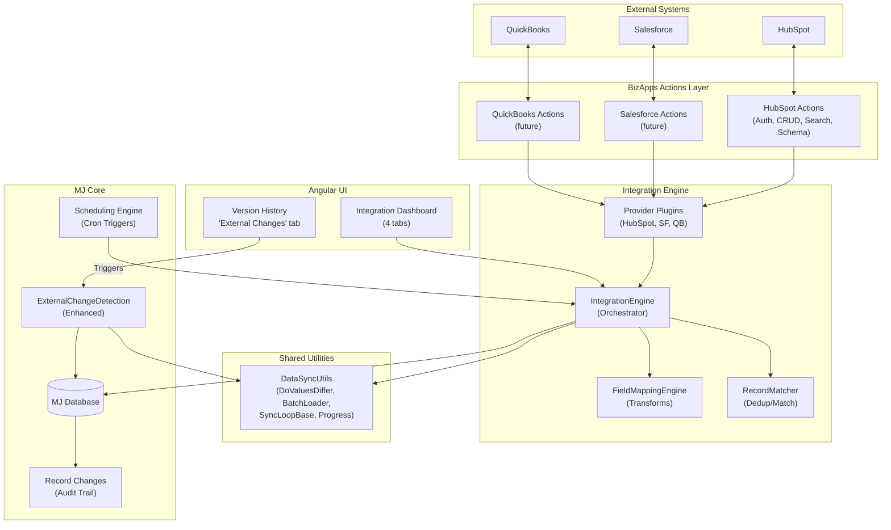

### 3.2 Data Flow — Pull Sync

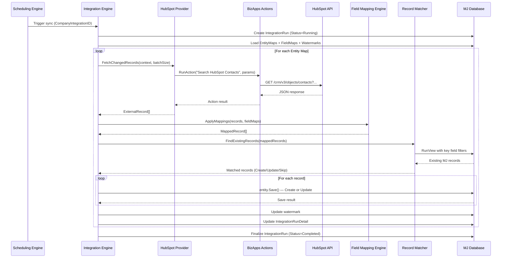

### 3.3 Layered Architecture

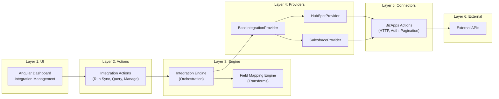

---

## 4. Entity Model

### 4.1 Entity Relationship Diagram

```mermaid
erDiagram
    INTEGRATION_PROVIDERS ||--o{ COMPANY_INTEGRATIONS : "has many"
    COMPANY_INTEGRATIONS ||--o{ INTEGRATION_ENTITY_MAPS : "has many"
    INTEGRATION_ENTITY_MAPS ||--o{ INTEGRATION_FIELD_MAPS : "has many"
    INTEGRATION_ENTITY_MAPS ||--o{ INTEGRATION_SYNC_WATERMARKS : "has many"
    COMPANY_INTEGRATIONS ||--o{ INTEGRATION_RUNS : "has many"
    INTEGRATION_RUNS ||--o{ INTEGRATION_RUN_DETAILS : "has many"
    INTEGRATION_RUN_DETAILS }o--|| INTEGRATION_ENTITY_MAPS : "references"

    INTEGRATION_PROVIDERS {
        uuid ID PK
        string Name
        string Description
        string IconClass
        string DriverClass
        boolean SupportsSchemaDiscovery
        string SupportedSyncDirections
        string Status
    }

    COMPANY_INTEGRATIONS {
        uuid ID PK
        uuid CompanyID FK
        uuid IntegrationProviderID FK
        string Name
        string Description
        string ExternalSystemURL
        json Configuration
        json AuthConfiguration
        string Status
        string SyncDirection
        datetime LastSyncAt
        datetime NextSyncAt
    }

    INTEGRATION_ENTITY_MAPS {
        uuid ID PK
        uuid CompanyIntegrationID FK
        string ExternalObjectName
        string ExternalObjectLabel
        uuid EntityID FK
        string SyncDirection
        boolean SyncEnabled
        json MatchStrategy
        string ConflictResolution
        int Priority
        string DeleteBehavior
        string Status
        json Configuration
    }

    INTEGRATION_FIELD_MAPS {
        uuid ID PK
        uuid EntityMapID FK
        string SourceFieldName
        string SourceFieldLabel
        string DestinationFieldName
        string DestinationFieldLabel
        string Direction
        json TransformPipeline
        boolean IsKeyField
        boolean IsRequired
        string DefaultValue
        int Priority
        string Status
    }

    INTEGRATION_SYNC_WATERMARKS {
        uuid ID PK
        uuid EntityMapID FK
        string Direction
        string WatermarkType
        string WatermarkValue
        datetime LastSyncAt
        int RecordsSynced
    }

    INTEGRATION_RUNS {
        uuid ID PK
        uuid CompanyIntegrationID FK
        string Direction
        string Status
        datetime StartedAt
        datetime CompletedAt
        string TriggerType
        int TotalRecordsProcessed
        int TotalRecordsCreated
        int TotalRecordsUpdated
        int TotalRecordsDeleted
        int TotalRecordsErrored
        int TotalRecordsSkipped
        string ErrorMessage
        json Configuration
        uuid ExecutedByUserID FK
        uuid ScheduledJobRunID FK
    }

    INTEGRATION_RUN_DETAILS {
        uuid ID PK
        uuid IntegrationRunID FK
        uuid EntityMapID FK
        string Status
        int RecordsProcessed
        int RecordsCreated
        int RecordsUpdated
        int RecordsDeleted
        int RecordsErrored
        int RecordsSkipped
        datetime StartedAt
        datetime CompletedAt
        string ErrorMessage
        json Details
        string WatermarkBefore
        string WatermarkAfter
    }
```

### 4.2 Entity Detail

#### MJ: Integration Providers
Represents an external system type (e.g., "HubSpot", "Salesforce").

| Field | Type | Description |
|-------|------|-------------|
| `ID` | UUID PK | |
| `Name` | nvarchar(200) | "HubSpot", "Salesforce", etc. |
| `Description` | nvarchar(max) | |
| `IconClass` | nvarchar(200) | Font Awesome class, e.g. `fa-brands fa-hubspot` |
| `DriverClass` | nvarchar(500) | `@RegisterClass` name, e.g. `HubSpotIntegrationProvider` |
| `SupportsSchemaDiscovery` | bit | Can interrogate source for objects/fields |
| `SupportedSyncDirections` | nvarchar(50) | `'Pull'` \| `'Push'` \| `'Bidirectional'` |
| `Status` | nvarchar(50) | `'Active'` \| `'Inactive'` |

#### MJ: Company Integrations
A specific instance of a provider for a company. Supports multi-instance (e.g., Acme Corp HubSpot, Beta Inc HubSpot).

| Field | Type | Description |
|-------|------|-------------|
| `ID` | UUID PK | |
| `CompanyID` | UUID FK | FK to Companies |
| `IntegrationProviderID` | UUID FK | FK to Integration Providers |
| `Name` | nvarchar(200) | "Acme Corp HubSpot" |
| `Description` | nvarchar(max) | |
| `ExternalSystemURL` | nvarchar(1000) | e.g. `https://app.hubspot.com/...` |
| `Configuration` | nvarchar(max) | JSON: provider-specific settings |
| `AuthConfiguration` | nvarchar(max) | JSON: encrypted credentials reference |
| `Status` | nvarchar(50) | `'Active'` \| `'Inactive'` \| `'Error'` |
| `SyncDirection` | nvarchar(50) | `'Pull'` \| `'Push'` \| `'Bidirectional'` |
| `LastSyncAt` | datetimeoffset | |
| `NextSyncAt` | datetimeoffset | |

#### MJ: Integration Entity Maps
Maps an external object type to an MJ entity within a specific company integration.

| Field | Type | Description |
|-------|------|-------------|
| `ID` | UUID PK | |
| `CompanyIntegrationID` | UUID FK | |
| `ExternalObjectName` | nvarchar(500) | API name: `"contacts"`, `"p_custom_123"` |
| `ExternalObjectLabel` | nvarchar(500) | Display: `"Contacts"`, `"Custom Widget"` |
| `EntityID` | UUID FK | FK to MJ Entities |
| `SyncDirection` | nvarchar(50) | Override per entity |
| `SyncEnabled` | bit | |
| `MatchStrategy` | nvarchar(max) | JSON: how to match records |
| `ConflictResolution` | nvarchar(50) | `'SourceWins'` \| `'DestWins'` \| `'MostRecent'` \| `'Manual'` |
| `Priority` | int | Processing order |
| `DeleteBehavior` | nvarchar(50) | `'SoftDelete'` \| `'DoNothing'` \| `'HardDelete'` |
| `Status` | nvarchar(50) | `'Active'` \| `'Inactive'` |
| `Configuration` | nvarchar(max) | JSON: entity-level overrides |

#### MJ: Integration Field Maps
Field-level mapping with transform pipeline.

| Field | Type | Description |
|-------|------|-------------|
| `ID` | UUID PK | |
| `EntityMapID` | UUID FK | |
| `SourceFieldName` | nvarchar(500) | `"firstname"` |
| `SourceFieldLabel` | nvarchar(500) | `"First Name"` |
| `DestinationFieldName` | nvarchar(500) | `"FirstName"` |
| `DestinationFieldLabel` | nvarchar(500) | `"First Name"` |
| `Direction` | nvarchar(50) | `'SourceToDest'` \| `'DestToSource'` \| `'Both'` |
| `TransformPipeline` | nvarchar(max) | JSON: array of transform steps |
| `IsKeyField` | bit | Used for record matching |
| `IsRequired` | bit | |
| `DefaultValue` | nvarchar(max) | When source is null |
| `Priority` | int | Processing order |
| `Status` | nvarchar(50) | `'Active'` \| `'Inactive'` |

#### MJ: Integration Sync Watermarks
Tracks last-sync position per entity map per direction.

| Field | Type | Description |
|-------|------|-------------|
| `ID` | UUID PK | |
| `EntityMapID` | UUID FK | |
| `Direction` | nvarchar(50) | `'Pull'` \| `'Push'` |
| `WatermarkType` | nvarchar(50) | `'Timestamp'` \| `'Cursor'` \| `'ChangeToken'` \| `'Version'` |
| `WatermarkValue` | nvarchar(max) | Stringified position |
| `LastSyncAt` | datetimeoffset | |
| `RecordsSynced` | int | Count from last sync |

#### MJ: Integration Runs
One record per sync execution.

| Field | Type | Description |
|-------|------|-------------|
| `ID` | UUID PK | |
| `CompanyIntegrationID` | UUID FK | |
| `Direction` | nvarchar(50) | |
| `Status` | nvarchar(50) | `'Running'` \| `'Completed'` \| `'Failed'` \| `'Cancelled'` |
| `StartedAt` | datetimeoffset | |
| `CompletedAt` | datetimeoffset | |
| `TriggerType` | nvarchar(50) | `'Scheduled'` \| `'Manual'` \| `'Webhook'` |
| `TotalRecordsProcessed` | int | |
| `TotalRecordsCreated` | int | |
| `TotalRecordsUpdated` | int | |
| `TotalRecordsDeleted` | int | |
| `TotalRecordsErrored` | int | |
| `TotalRecordsSkipped` | int | |
| `ErrorMessage` | nvarchar(max) | |
| `Configuration` | nvarchar(max) | JSON: snapshot at run time |
| `ExecutedByUserID` | UUID FK | |
| `ScheduledJobRunID` | UUID FK | nullable — links to scheduling |

#### MJ: Integration Run Details
Per-entity results within a run.

| Field | Type | Description |
|-------|------|-------------|
| `ID` | UUID PK | |
| `IntegrationRunID` | UUID FK | |
| `EntityMapID` | UUID FK | |
| `Status` | nvarchar(50) | `'Completed'` \| `'Failed'` \| `'Partial'` |
| `RecordsProcessed` | int | |
| `RecordsCreated` | int | |
| `RecordsUpdated` | int | |
| `RecordsDeleted` | int | |
| `RecordsErrored` | int | |
| `RecordsSkipped` | int | |
| `StartedAt` | datetimeoffset | |
| `CompletedAt` | datetimeoffset | |
| `ErrorMessage` | nvarchar(max) | |
| `Details` | nvarchar(max) | JSON: per-record error log |
| `WatermarkBefore` | nvarchar(max) | Position at start |
| `WatermarkAfter` | nvarchar(max) | Position at end |

### 4.3 Entity Naming

Following MJ convention, all new entities use the **"MJ: "** prefix:

| Entity Name | Table Name |
|-------------|-----------|
| `MJ: Integration Providers` | `__mj.IntegrationProvider` |
| `MJ: Company Integrations` | `__mj.CompanyIntegration` |
| `MJ: Integration Entity Maps` | `__mj.IntegrationEntityMap` |
| `MJ: Integration Field Maps` | `__mj.IntegrationFieldMap` |
| `MJ: Integration Sync Watermarks` | `__mj.IntegrationSyncWatermark` |
| `MJ: Integration Runs` | `__mj.IntegrationRun` |
| `MJ: Integration Run Details` | `__mj.IntegrationRunDetail` |

---

## 5. Package Structure

Following the Scheduling package's proven multi-package pattern:

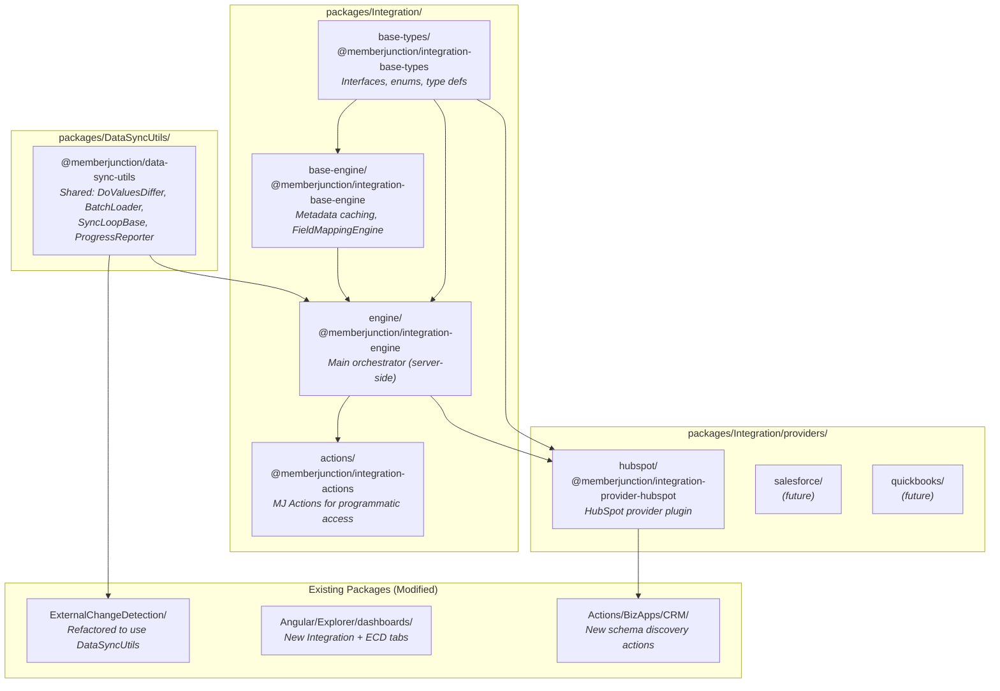

### Directory Layout

```
packages/Integration/
├── README.md
│
├── base-types/              ← @memberjunction/integration-base-types
│   ├── package.json
│   ├── tsconfig.json
│   └── src/
│       ├── index.ts
│       ├── types.ts         ← Core interfaces, enums, type definitions
│       ├── field-mapping.ts ← FieldMap, TransformPipeline interfaces
│       └── schema.ts        ← SchemaDiscovery interfaces
│
├── base-engine/             ← @memberjunction/integration-base-engine
│   ├── package.json
│   ├── tsconfig.json
│   └── src/
│       ├── index.ts
│       ├── IntegrationEngineBase.ts  ← Metadata caching, config loading
│       └── FieldMappingEngine.ts     ← Transform pipeline execution
│
├── engine/                  ← @memberjunction/integration-engine
│   ├── package.json
│   ├── tsconfig.json
│   └── src/
│       ├── index.ts
│       ├── IntegrationEngine.ts      ← Main orchestration (server-side)
│       ├── BaseIntegrationProvider.ts ← Abstract provider base class
│       ├── SyncOrchestrator.ts       ← Per-entity sync loop
│       └── RecordMatcher.ts          ← Match external → MJ records
│
├── actions/                 ← @memberjunction/integration-actions
│   ├── package.json
│   ├── tsconfig.json
│   └── src/
│       ├── index.ts
│       ├── BaseIntegrationAction.ts
│       ├── RunSyncAction.ts
│       ├── QueryIntegrationsAction.ts
│       └── ManageEntityMapsAction.ts
│
└── providers/
    └── hubspot/             ← @memberjunction/integration-provider-hubspot
        ├── package.json
        └── src/
            ├── index.ts
            ├── HubSpotProvider.ts
            ├── HubSpotSchemaDiscovery.ts
            └── HubSpotFieldDefaults.ts

packages/DataSyncUtils/      ← @memberjunction/data-sync-utils  (NEW)
├── package.json
├── tsconfig.json
└── src/
    ├── index.ts
    ├── ValueComparison.ts   ← Extracted DoValuesDiffer + type coercion
    ├── BatchRecordLoader.ts ← Extracted batch PK loading pattern
    ├── RunLifecycle.ts      ← Generic run/detail record management
    ├── ProgressReporter.ts  ← Console + event progress reporting
    └── SyncLoopBase.ts      ← Abstract "iterate changed/new/deleted" base
```

---

## 6. Core Abstractions

### 6.1 Integration Provider Interface

```typescript
// packages/Integration/base-types/src/types.ts

export type SyncDirection = 'Pull' | 'Push' | 'Bidirectional';
export type SyncTriggerType = 'Scheduled' | 'Manual' | 'Webhook';
export type WatermarkType = 'Timestamp' | 'Cursor' | 'ChangeToken' | 'Version';
export type ConflictResolution = 'SourceWins' | 'DestWins' | 'MostRecent' | 'Manual';
export type DeleteBehavior = 'SoftDelete' | 'DoNothing' | 'HardDelete';
export type RecordChangeType = 'Create' | 'Update' | 'Delete' | 'Skip';
export type IntegrationRunStatus = 'Running' | 'Completed' | 'Failed' | 'Cancelled';

export interface ExternalRecord {
    ExternalID: string;
    ObjectType: string;
    Fields: Record<string, unknown>;  // Raw field values from source
    ModifiedAt?: Date;
    IsDeleted?: boolean;
}

export interface MappedRecord {
    ExternalRecord: ExternalRecord;
    MJEntityName: string;
    MappedFields: Record<string, unknown>;  // After transform pipeline
    ChangeType: RecordChangeType;
    MatchedMJRecordID?: string;  // If matched to existing record
}

export interface SyncResult {
    Success: boolean;
    RecordsProcessed: number;
    RecordsCreated: number;
    RecordsUpdated: number;
    RecordsDeleted: number;
    RecordsErrored: number;
    RecordsSkipped: number;
    Errors: SyncRecordError[];
    WatermarkAfter?: string;
}

export interface SyncRecordError {
    ExternalID: string;
    ChangeType: RecordChangeType;
    ErrorMessage: string;
    ExternalRecord?: ExternalRecord;
}

export interface SyncContext {
    CompanyIntegration: CompanyIntegrationEntity;
    EntityMap: IntegrationEntityMapEntity;
    FieldMaps: IntegrationFieldMapEntity[];
    Direction: SyncDirection;
    Watermark?: IntegrationSyncWatermarkEntity;
    ContextUser: UserInfo;
    RunID: string;
}
```

### 6.2 Base Integration Provider

```typescript
// packages/Integration/engine/src/BaseIntegrationProvider.ts

export abstract class BaseIntegrationProvider {

    /**
     * Returns external object types available in the source system.
     * Used by the UI for entity mapping setup.
     * Calls schema discovery BizApps Actions under the hood.
     */
    abstract DiscoverObjects(
        companyIntegration: CompanyIntegrationEntity,
        contextUser: UserInfo
    ): Promise<ExternalObjectSchema[]>;

    /**
     * Returns fields/properties for a specific external object.
     * Includes custom fields. Used by the field mapping UI.
     */
    abstract DiscoverObjectFields(
        companyIntegration: CompanyIntegrationEntity,
        objectName: string,
        contextUser: UserInfo
    ): Promise<ExternalFieldSchema[]>;

    /**
     * Fetch records from the external system changed since watermark.
     * Returns raw ExternalRecords — the engine handles mapping.
     */
    abstract FetchChangedRecords(
        context: SyncContext,
        batchSize: number
    ): Promise<FetchResult>;

    /**
     * (Future v2) Push MJ record changes to the external system.
     */
    async PushRecords(
        context: SyncContext,
        records: MappedRecord[]
    ): Promise<SyncResult> {
        throw new Error('Push sync not implemented for this provider');
    }

    /**
     * Validate credentials and connectivity.
     */
    abstract TestConnection(
        companyIntegration: CompanyIntegrationEntity,
        contextUser: UserInfo
    ): Promise<ConnectionTestResult>;

    /**
     * Provider-specific default field mappings for well-known objects.
     * Returns suggested mappings that the user can customize.
     */
    abstract GetDefaultFieldMappings(
        objectName: string,
        entityName: string
    ): DefaultFieldMapping[];
}

export interface FetchResult {
    Records: ExternalRecord[];
    HasMore: boolean;
    NextWatermark?: string;      // Cursor/token for next batch
    TotalAvailable?: number;     // If known
}

export interface ConnectionTestResult {
    Success: boolean;
    Message: string;
    Details?: Record<string, unknown>;
}
```

---

## 7. Field Mapping & Transform Engine

### 7.1 Transform Pipeline Architecture

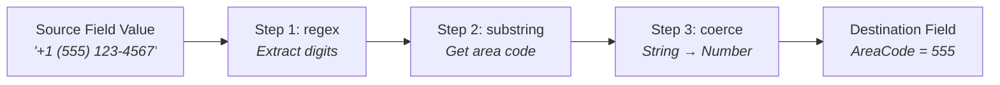

Each field mapping can have a **pipeline** of transform steps applied in order. This is stored as a JSON array in the `TransformPipeline` column.

### 7.2 Transform Types

```typescript
// packages/Integration/base-types/src/field-mapping.ts

export type TransformType =
    | 'direct'      // Pass through (no transform)
    | 'regex'       // Apply regex with capture groups
    | 'split'       // Split one field into multiple
    | 'combine'     // Combine multiple fields into one
    | 'lookup'      // Map values via a lookup table
    | 'format'      // Format string (date, number, etc.)
    | 'substring'   // Extract substring
    | 'coerce'      // Type coercion (string→number, etc.)
    | 'custom';     // Custom JS expression (sandboxed)

export interface TransformStep {
    Type: TransformType;
    Config: TransformConfig;
    OnError: 'Skip' | 'Null' | 'Fail';  // What to do if transform fails
}

// Union type for all transform configs
export type TransformConfig =
    | DirectConfig
    | RegexConfig
    | SplitConfig
    | CombineConfig
    | LookupConfig
    | FormatConfig
    | SubstringConfig
    | CoerceConfig
    | CustomConfig;
```

### 7.3 Transform Config Interfaces

```typescript
export interface RegexConfig {
    Pattern: string;          // Regex with capture groups
    Replacement: string;      // Using $1, $2, etc.
    Flags?: string;           // 'g', 'i', 'gi', etc.
}

export interface SplitConfig {
    Delimiter: string;
    Index: number;            // Which part (0-based)
    TrimWhitespace?: boolean;
}

export interface CombineConfig {
    /**
     * Field references use {{FieldName}} syntax.
     * e.g., ["{{FirstName}}", " ", "{{LastName}}"]
     */
    Parts: string[];
    Separator?: string;
}

export interface LookupConfig {
    /** e.g., { "subscriber": "Active", "unsubscribed": "Inactive" } */
    Map: Record<string, string>;
    DefaultValue?: string;
    CaseSensitive?: boolean;
}

export interface FormatConfig {
    FormatType: 'date' | 'number' | 'phone' | 'currency';
    InputFormat?: string;      // e.g., 'MM/DD/YYYY'
    OutputFormat: string;      // e.g., 'YYYY-MM-DD'
    Locale?: string;
}

export interface CoerceConfig {
    TargetType: 'string' | 'number' | 'boolean' | 'date';
    TrueValues?: string[];     // For boolean: ['yes', '1', 'true']
    FalseValues?: string[];
}

export interface CustomConfig {
    /**
     * JS expression in sandboxed context.
     * `value` = current field value, `record` = full external record.
     * e.g., "value.trim().toLowerCase()"
     */
    Expression: string;
}
```

### 7.4 Transform Examples

#### Phone Number Split (1 HubSpot field → 3 MJ fields)

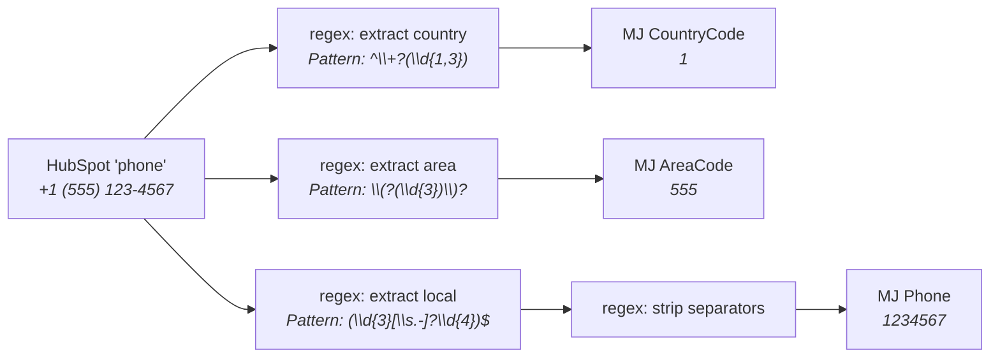

#### Status Lookup (HubSpot lifecycle → MJ status)

```json
{
    "SourceFieldName": "lifecyclestage",
    "DestinationFieldName": "Status",
    "TransformPipeline": [
        {
            "Type": "lookup",
            "Config": {
                "Map": {
                    "subscriber": "Lead",
                    "lead": "Lead",
                    "marketingqualifiedlead": "MQL",
                    "salesqualifiedlead": "SQL",
                    "opportunity": "Opportunity",
                    "customer": "Customer",
                    "evangelist": "Advocate"
                },
                "DefaultValue": "Unknown",
                "CaseSensitive": false
            },
            "OnError": "Null"
        }
    ]
}
```

#### Name Combine (2 MJ fields → 1 HubSpot field, future Push)

```json
{
    "SourceFieldName": "FullName",
    "DestinationFieldName": "FullName",
    "Direction": "DestToSource",
    "TransformPipeline": [
        {
            "Type": "combine",
            "Config": {
                "Parts": ["{{FirstName}}", " ", "{{LastName}}"]
            },
            "OnError": "Skip"
        }
    ]
}
```

### 7.5 Field Mapping Engine

```typescript
// packages/Integration/base-engine/src/FieldMappingEngine.ts

export class FieldMappingEngine {

    /**
     * Apply all field maps to an external record, producing mapped MJ field values.
     * Processes maps in Priority order. Handles multi-source-field transforms (combine).
     */
    ApplyMappings(
        externalRecord: ExternalRecord,
        fieldMaps: IntegrationFieldMapEntity[],
        direction: SyncDirection
    ): MappingResult {
        const result: MappingResult = {
            MappedFields: {},
            Errors: [],
            SkippedFields: []
        };

        const activeMaps = fieldMaps
            .filter(m => m.Status === 'Active' && this.matchesDirection(m, direction))
            .sort((a, b) => a.Priority - b.Priority);

        for (const map of activeMaps) {
            try {
                const sourceValue = externalRecord.Fields[map.SourceFieldName];
                const transformed = this.ExecuteTransformPipeline(
                    sourceValue,
                    map.TransformPipeline,
                    externalRecord
                );
                result.MappedFields[map.DestinationFieldName] = transformed;
            } catch (error) {
                result.Errors.push({
                    FieldMap: map,
                    Error: error instanceof Error ? error.message : String(error)
                });
            }
        }

        return result;
    }

    /**
     * Each step's output becomes the next step's input.
     */
    ExecuteTransformPipeline(
        value: unknown,
        pipeline: TransformStep[] | null,
        fullRecord: ExternalRecord
    ): unknown {
        if (!pipeline || pipeline.length === 0) return value;

        let current = value;
        for (const step of pipeline) {
            current = this.executeStep(step, current, fullRecord);
        }
        return current;
    }
}
```

---

## 8. Schema Discovery

### 8.1 The Problem

External systems like HubSpot and Salesforce allow users to create **custom objects** and **custom fields**. We cannot hardcode schemas. The integration engine must be able to:

1. **List available objects** — including custom objects
2. **List fields per object** — including custom fields with their types and constraints
3. **Suggest default mappings** — for well-known standard objects

### 8.2 Schema Discovery Flow

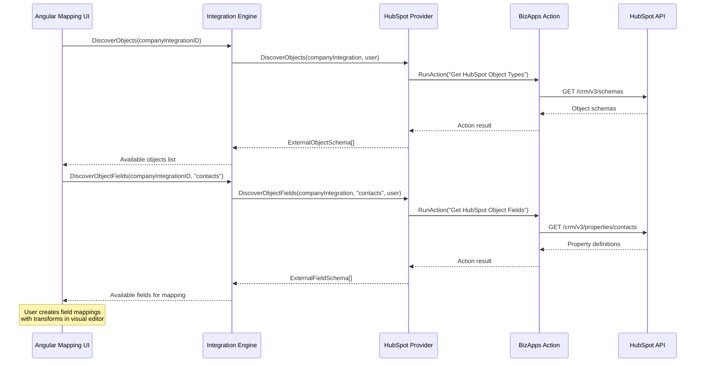

### 8.3 Schema Discovery Interfaces

```typescript
// packages/Integration/base-types/src/schema.ts

export interface ExternalObjectSchema {
    Name: string;                  // API name: "contacts", "p_custom_123"
    Label: string;                 // Display: "Contacts", "Custom Widget"
    Description?: string;
    IsCustomObject: boolean;
    SupportsSearch: boolean;
    SupportsCRUD: {
        Create: boolean;
        Read: boolean;
        Update: boolean;
        Delete: boolean;
    };
    EstimatedRecordCount?: number;
}

export interface ExternalFieldSchema {
    Name: string;                  // API name: "firstname", "hs_custom_123"
    Label: string;                 // Display: "First Name"
    Description?: string;
    FieldType: ExternalFieldType;
    IsCustomField: boolean;
    IsRequired: boolean;
    IsReadOnly: boolean;
    IsUnique: boolean;
    MaxLength?: number;
    Options?: FieldOption[];       // For enum/select fields
    DefaultValue?: unknown;
    GroupName?: string;            // Field group in source system
}

export type ExternalFieldType =
    | 'string' | 'number' | 'boolean' | 'date' | 'datetime'
    | 'email' | 'phone' | 'url' | 'currency' | 'percent'
    | 'enum' | 'multi_enum' | 'json' | 'reference' | 'file' | 'unknown';
```

### 8.4 New BizApps Actions Required

The HubSpot BizApps package needs new schema discovery actions:

| Action | HubSpot API Endpoint | Purpose |
|--------|---------------------|---------|
| `GetObjectTypesAction` | `GET /crm/v3/schemas` | List all object types (standard + custom) |
| `GetObjectFieldsAction` | `GET /crm/v3/properties/{objectType}` | List all properties for an object |
| `GetAssociationTypesAction` | `GET /crm/v3/associations/{from}/{to}/types` | List relationship types |

These follow the existing BizApps action pattern (extend `HubSpotBaseAction`, use `makeHubSpotRequest`).

---

## 9. Sync Flow — End to End

### 9.1 Pull Sync (External → MJ)

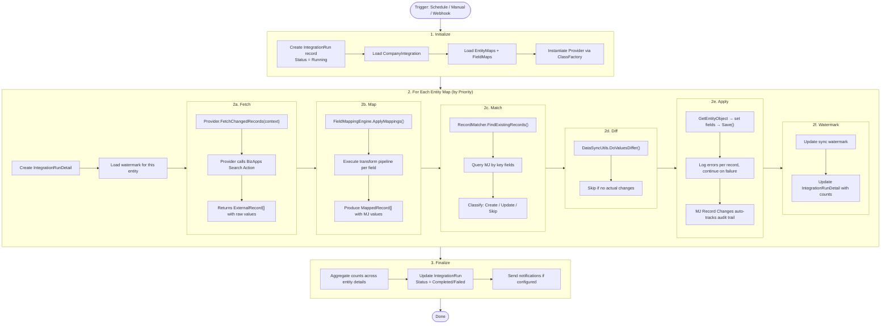

### 9.2 Record Matching Strategy

The `MatchStrategy` JSON on `Integration Entity Maps` defines how to match external records to MJ records:

```json
{
    "Strategy": "KeyFields",
    "KeyFields": ["Email"],
    "FallbackStrategy": "CreateNew",
    "DuplicateHandling": "UseFirst"
}
```

**Strategies:**
- **KeyFields** — Match on one or more mapped fields marked `IsKeyField=true`
- **ExternalID** — Store external system ID in a dedicated MJ field
- **Composite** — Multiple field match (e.g., FirstName + LastName + Company)

### 9.3 Batch Processing Model

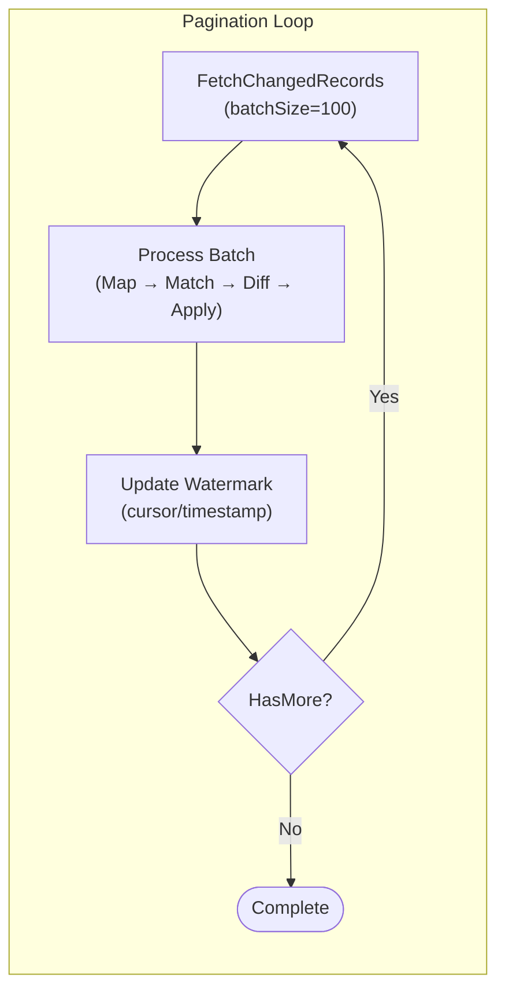

---

## 10. Provider Plugin System

### 10.1 Provider Registration

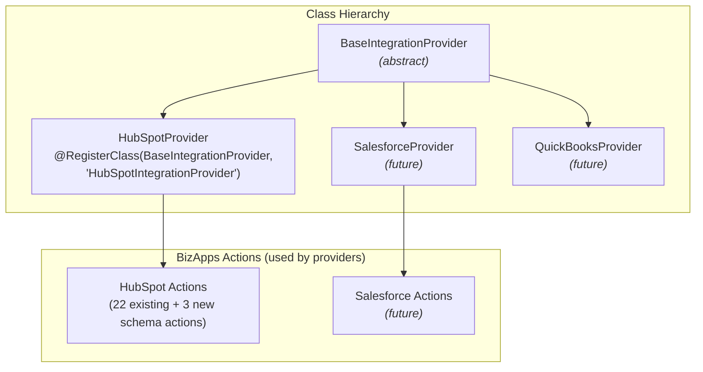

### 10.2 HubSpot Provider Implementation

```typescript
import { RegisterClass } from '@memberjunction/global';

@RegisterClass(BaseIntegrationProvider, 'HubSpotIntegrationProvider')
export class HubSpotIntegrationProvider extends BaseIntegrationProvider {

    async DiscoverObjects(
        companyIntegration: CompanyIntegrationEntity,
        contextUser: UserInfo
    ): Promise<ExternalObjectSchema[]> {
        // Calls the new GetObjectTypes BizApps Action
        const result = await ActionEngineServer.Instance.RunAction(
            'Get HubSpot Object Types',
            { CompanyID: companyIntegration.CompanyID },
            contextUser
        );
        return this.mapObjectSchemas(result);
    }

    async FetchChangedRecords(
        context: SyncContext,
        batchSize: number
    ): Promise<FetchResult> {
        const objectName = context.EntityMap.ExternalObjectName;
        const watermark = context.Watermark?.WatermarkValue;

        // Uses existing Search BizApps Actions with date filter
        const result = await ActionEngineServer.Instance.RunAction(
            `Search HubSpot ${this.capitalize(objectName)}`,
            {
                CompanyID: context.CompanyIntegration.CompanyID,
                ...(watermark ? { CreatedAfter: watermark } : {}),
                Limit: batchSize,
                IncludeProperties: context.FieldMaps.map(m => m.SourceFieldName)
            },
            context.ContextUser
        );

        return {
            Records: this.mapToExternalRecords(result, objectName),
            HasMore: result.PagingInfo?.hasMore ?? false,
            NextWatermark: result.PagingInfo?.after
        };
    }
}
```

### 10.3 Provider Registration in Metadata

Each provider gets a row in `MJ: Integration Providers`:

| Name | DriverClass | SupportsSchemaDiscovery | SupportedSyncDirections |
|------|------------|------------------------|------------------------|
| HubSpot | `HubSpotIntegrationProvider` | true | `Bidirectional` |
| Salesforce | `SalesforceIntegrationProvider` | true | `Bidirectional` |
| QuickBooks | `QuickBooksIntegrationProvider` | true | `Pull` |

---

## 11. Data Sync Utils — Shared Extraction

### 11.1 What Gets Extracted from ECDEngine

| Utility | Source in ECDEngine | Why It's Shared |
|---------|-------------------|-----------------|
| `DoValuesDiffer()` | `ChangeDetector.ts:261-291` | Both ECD and Integration need type-aware field comparison |
| `BatchRecordLoader` | `ChangeDetector.ts:330-386` | Efficient PK-based bulk loading pattern |
| `SyncLoopBase` | New abstraction | "Iterate changed/new/deleted, call abstract per-record handler" |
| `ProgressReporter` | `ChangeDetector.ts:481-544` | Console + event-based progress for any sync operation |
| `RunLifecycleManager` | `ChangeDetector.ts:594-621` | Create run → update progress → finalize pattern |
| `getPrimaryKeyString()` | `ChangeDetector.ts:389-391` | SQL PK string builder for composite keys |

### 11.2 SyncLoopBase — Abstract Change Iterator

This is the core abstraction: a base class that iterates over source changes and calls abstract methods for each change type.

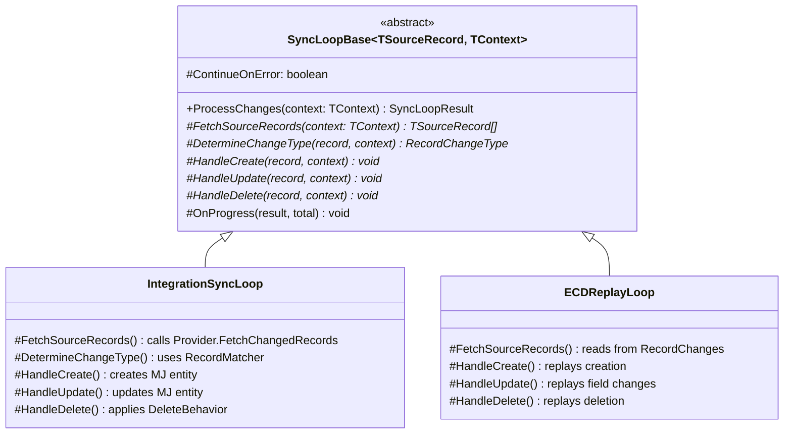

```typescript
// packages/DataSyncUtils/src/SyncLoopBase.ts

export abstract class SyncLoopBase<TSourceRecord, TContext> {

    async ProcessChanges(context: TContext): Promise<SyncLoopResult> {
        const result = new SyncLoopResult();
        const sourceRecords = await this.FetchSourceRecords(context);

        for (const record of sourceRecords) {
            const changeType = await this.DetermineChangeType(record, context);

            try {
                switch (changeType) {
                    case 'Create':
                        await this.HandleCreate(record, context);
                        result.Created++;
                        break;
                    case 'Update':
                        await this.HandleUpdate(record, context);
                        result.Updated++;
                        break;
                    case 'Delete':
                        await this.HandleDelete(record, context);
                        result.Deleted++;
                        break;
                    case 'Skip':
                        result.Skipped++;
                        break;
                }
                result.Processed++;
                this.OnProgress(result, sourceRecords.length);
            } catch (error) {
                result.Errored++;
                result.Errors.push({ Record: record, Error: error });
                if (!this.ContinueOnError) throw error;
            }
        }
        return result;
    }

    // --- Abstract methods subclasses implement ---
    abstract FetchSourceRecords(context: TContext): Promise<TSourceRecord[]>;
    abstract DetermineChangeType(record: TSourceRecord, context: TContext): Promise<RecordChangeType>;
    abstract HandleCreate(record: TSourceRecord, context: TContext): Promise<void>;
    abstract HandleUpdate(record: TSourceRecord, context: TContext): Promise<void>;
    abstract HandleDelete(record: TSourceRecord, context: TContext): Promise<void>;

    protected ContinueOnError: boolean = true;
    protected OnProgress(result: SyncLoopResult, total: number): void { /* noop */ }
}
```

### 11.3 Migration Path for ECDEngine

Non-breaking refactoring — the ECDEngine's public API stays identical:

```typescript
// After refactoring
import { DoValuesDiffer, BatchRecordLoader, ProgressReporter } from '@memberjunction/data-sync-utils';

export class ExternalChangeDetectorEngine extends BaseEngine<ExternalChangeDetectorEngine> {
    // Replace inline DoValuesDiffer with shared import
    // Replace inline batch loading with BatchRecordLoader
    // Replace inline progress with ProgressReporter
}
```

---

## 12. Scheduling Integration

### 12.1 How It Connects

The existing Scheduling Engine already has `ActionScheduledJobDriver` which can trigger any MJ Action. The Integration Engine exposes a **"Run Integration Sync"** action:

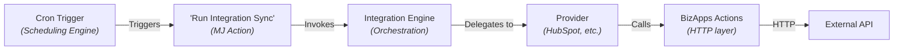

### 12.2 Action Parameters

| Param | Type | Description |
|-------|------|-------------|
| `CompanyIntegrationID` | string (UUID) | Which integration to sync |
| `Direction` | string | `'Pull'` or `'Push'` (default: `'Pull'`) |
| `EntityMapIDs` | string[] (optional) | Specific entity maps (default: all enabled) |
| `FullSync` | boolean | Ignore watermarks, sync everything (default: false) |

Users can schedule syncs using the existing **Scheduling dashboard** — no new scheduling infrastructure needed.

### 12.3 Future Enhancement: Dependency-Aware Scheduling

For complex orchestration needs (e.g., "sync HubSpot contacts first, then sync deals that reference those contacts"), a dedicated `IntegrationScheduledJobDriver` could understand entity dependencies and process entity maps in topological order.

---

## 13. External Change Detection Enhancement

### 13.1 Current State

The ECDEngine detects changes within the MJ database by comparing `__mj_UpdatedAt` timestamps against `vwRecordChanges` records. It finds Creates, Updates, and Deletes that happened outside of MJ's normal Save/Delete pipeline.

### 13.2 Enhancement: Integration Attribution

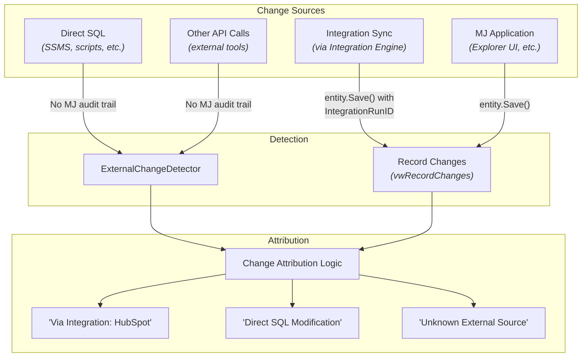

When integrations are active, the ECDEngine can:

1. **Attribute changes to integrations** — Records saved with an IntegrationRunID can be traced
2. **Detect external modifications** — Records changed by direct SQL or other systems
3. **Surface integration-related changes** in the Version History UI

---

## 14. Angular Dashboard — Integration Management

### 14.1 Application Definition

New application: **"Integrations"** in MJ Explorer.

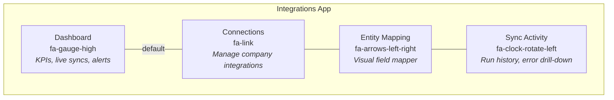

### 14.2 Tab Details

#### Dashboard Tab
- **KPIs**: Active integrations, entities synced, records synced (24h), error rate
- **Live syncs**: Currently running integration syncs with progress bars
- **Recent activity**: Last 10 sync runs with status indicators
- **Alerts**: Failed syncs, stale watermarks, connection errors
- **Quick actions**: "Run Sync Now" buttons per integration

#### Connections Tab
- **List view**: All Company Integrations with status indicators
- **Create connection wizard**:
  1. Select provider (HubSpot, Salesforce, etc.)
  2. Enter credentials / authenticate via OAuth
  3. Test connection
  4. Name the integration and assign to company
- **Connection detail panel**: Status, last sync, credential health, configuration
- **Multi-instance support**: Multiple connections of same provider type

#### Entity Mapping Tab (The Gorgeous Part)

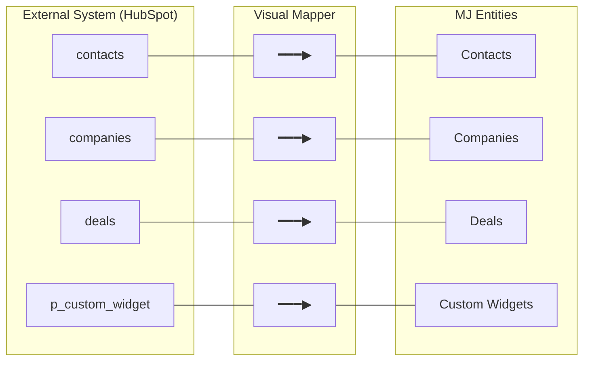

**Features:**
- **Split-panel layout**: External objects (left) ↔ MJ entities (right) with visual lines
- **Field mapping editor** (per entity pair):
  - Side-by-side field lists with drag-and-drop mapping
  - Transform pipeline builder (visual, not raw JSON)
  - Auto-suggest mappings based on field name similarity
  - Preview transform results with sample data
  - Key field designation for record matching
  - Direction indicators per field
- **Schema refresh**: Re-discover external schema for new custom fields/objects
- **Mapping templates**: Save/load mapping configurations

#### Sync Activity Tab
- **Run history**: Filterable list of all integration runs
- **Per-run detail**: Expand to see per-entity breakdown
- **Error drill-down**: View failed records with error messages
- **Watermark status**: Current sync position per entity map
- **Performance metrics**: Records/second, average run duration, trend charts

---

## 15. Angular Dashboard — External Change Detection Tab

### 15.1 New Tab in Version History App

Added as the **5th navigation item** in the existing Version History application:

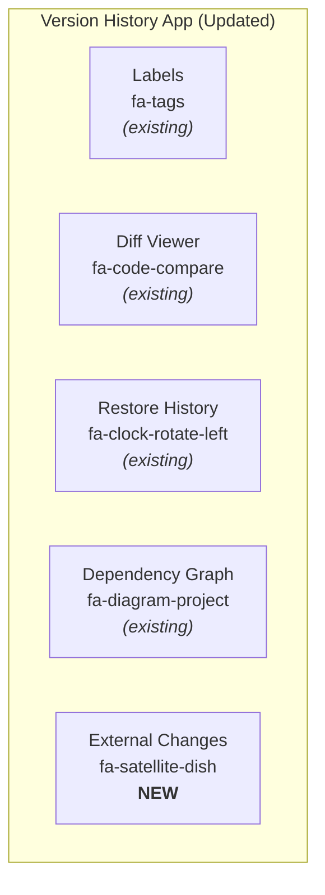

### 15.2 Component Design

#### Summary View
- **KPI cards**: Total external changes detected, by type (Create/Update/Delete), by source
- **Trend chart**: External changes over time (daily/weekly)
- **Attribution breakdown**: Pie chart of changes by source (Integration sync, Direct SQL, Unknown)

#### Detail View
- **Filterable table**: Entity, Record, Change Type, Detected At, Source, Fields Changed
- **Entity grouping**: Collapsible groups by entity with change counts
- **Field-level diff**: Expand a record change to see before/after values per field
- **Actions**: Link to record in Explorer, link to integration run (if attributed)

#### Manual Scan
- **"Run Detection Now"** button — triggers ECDEngine scan
- **Entity selection**: Choose which entities to scan
- **Progress indicator**: Real-time progress during scan

---

## 16. Phase Plan

### Phase Overview

```mermaid
gantt
    title Integration Engine Implementation Phases
    dateFormat X
    axisFormat %s

    section Phase 1: Foundation
    Database migrations           :p1a, 0, 1
    integration-base-types        :p1b, 0, 1
    data-sync-utils              :p1c, 0, 1
    ECDEngine refactor           :p1d, after p1c, 1
    CodeGen run                  :p1e, after p1a, 1
    Unit tests                   :p1f, after p1c, 1

    section Phase 2: Engine Core
    integration-base-engine       :p2a, after p1b, 1
    FieldMappingEngine           :p2b, after p2a, 1
    BaseIntegrationProvider      :p2c, after p2a, 1
    IntegrationEngine            :p2d, after p2b, 1
    RecordMatcher                :p2e, after p2d, 1
    Integration Actions          :p2f, after p2d, 1
    Engine unit tests            :p2g, after p2e, 1

    section Phase 3: HubSpot Provider
    Schema discovery actions      :p3a, after p2c, 1
    HubSpotProvider              :p3b, after p3a, 1
    Default field mappings       :p3c, after p3b, 1
    Integration tests            :p3d, after p3b, 1

    section Phase 4: Angular Dashboards
    Integration Dashboard tab     :p4a, after p2f, 1
    Connections tab              :p4b, after p4a, 1
    Entity Mapping tab           :p4c, after p4b, 1
    Sync Activity tab            :p4d, after p4a, 1
    Instrumentation service      :p4e, after p4a, 1

    section Phase 5: ECD Enhancement
    External Changes tab          :p5a, after p4a, 1
    Attribution logic            :p5b, after p5a, 1
    Manual scan trigger          :p5c, after p5b, 1

    section Phase 6: Scheduling + Polish
    Wire to scheduling           :p6a, after p3b, 1
    Notifications                :p6b, after p6a, 1
    Distributed locking          :p6c, after p6a, 1
    Documentation                :p6d, after p6c, 1
```

### Phase 1: Foundation (Entities + Types + DataSyncUtils)

**Goal**: Database schema, core TypeScript interfaces, shared utilities extracted from ECDEngine.

| Task | Package | Description |
|------|---------|-------------|
| 1.1 | migrations | Create database tables for all 7 new entities |
| 1.2 | `integration-base-types` | Define all interfaces, types, enums |
| 1.3 | `data-sync-utils` | Extract `DoValuesDiffer`, `BatchRecordLoader`, `SyncLoopBase`, `ProgressReporter` |
| 1.4 | `ExternalChangeDetection` | Refactor ECDEngine to use `data-sync-utils` (non-breaking) |
| 1.5 | Run CodeGen | Generate entity classes, stored procedures, views |
| 1.6 | Unit tests | Tests for transform pipeline, value comparison, sync loop |

### Phase 2: Integration Engine Core

**Goal**: Working orchestration engine that can pull data from a mock provider.

| Task | Package | Description |
|------|---------|-------------|
| 2.1 | `integration-base-engine` | `IntegrationEngineBase` with metadata caching |
| 2.2 | `integration-base-engine` | `FieldMappingEngine` with full transform pipeline |
| 2.3 | `integration-engine` | `BaseIntegrationProvider` abstract class |
| 2.4 | `integration-engine` | `IntegrationEngine` main orchestrator |
| 2.5 | `integration-engine` | `RecordMatcher` for matching external → MJ records |
| 2.6 | `integration-engine` | `SyncOrchestrator` for per-entity sync loop |
| 2.7 | `integration-actions` | "Run Integration Sync" MJ Action |
| 2.8 | Unit tests | Engine tests with mock provider |

### Phase 3: HubSpot Provider (First Real Provider)

**Goal**: End-to-end HubSpot → MJ sync working for Contacts, Companies, Deals.

| Task | Package | Description |
|------|---------|-------------|
| 3.1 | `BizApps/CRM` | New schema discovery actions (GetObjectTypes, GetObjectFields) |
| 3.2 | `integration-provider-hubspot` | `HubSpotProvider` implementing all abstract methods |
| 3.3 | `integration-provider-hubspot` | Default field mappings for standard HubSpot objects |
| 3.4 | `integration-provider-hubspot` | Custom object/field support |
| 3.5 | metadata | Seed data for HubSpot provider entity |
| 3.6 | Integration tests | End-to-end tests with HubSpot sandbox |

### Phase 4: Angular Dashboards — Integrations App

**Goal**: Full management UI for integration configuration and monitoring.

| Task | Package | Description |
|------|---------|-------------|
| 4.1 | `dashboards` | Integration Dashboard tab (KPIs, live syncs, alerts) |
| 4.2 | `dashboards` | Connections tab (list, create wizard, test connection) |
| 4.3 | `dashboards` | Entity Mapping tab (visual mapper, field editor, transforms) |
| 4.4 | `dashboards` | Sync Activity tab (run history, error drill-down) |
| 4.5 | metadata | Application definition JSON |
| 4.6 | `dashboards` | Instrumentation service for real-time observables |

### Phase 5: External Change Detection Enhancement

**Goal**: New tab in Version History app for external change monitoring.

| Task | Package | Description |
|------|---------|-------------|
| 5.1 | `dashboards` | External Changes tab component |
| 5.2 | `dashboards` | Attribution logic (integration vs direct SQL vs unknown) |
| 5.3 | `dashboards` | Manual scan trigger with progress |
| 5.4 | metadata | Update Version History app nav items |
| 5.5 | `ExternalChangeDetection` | Add integration attribution to change records |

### Phase 6: Scheduling + Polish

**Goal**: Automated sync via cron, notifications, production hardening.

| Task | Package | Description |
|------|---------|-------------|
| 6.1 | `integration-actions` | Wire "Run Integration Sync" action to scheduling |
| 6.2 | `integration-engine` | Notification support (success/failure) |
| 6.3 | `integration-engine` | Distributed locking for multi-server |
| 6.4 | `integration-engine` | Error retry and dead-letter handling |
| 6.5 | All | Documentation, README files |

---

## 17. Open Questions

1. **Blue Cypress CompanyIntegration code** — How much of the existing BC code can we pull in? Need to evaluate the separate repo. The entity model above is designed to be compatible.

2. **OAuth flow** — Should the "Create Connection" wizard handle OAuth redirects natively, or rely on pre-configured credentials in environment variables (as current BizApps actions do)?

3. **Conflict resolution UI** — For `ConflictResolution: 'Manual'`, do we need a review queue where users can approve/reject individual changes? Or is that a future enhancement?

4. **Custom object creation** — If a HubSpot custom object has no MJ entity equivalent, should the integration engine auto-create MJ entities? Or must they pre-exist?

5. **Webhook support** — HubSpot and Salesforce support webhooks for real-time change notification. Should the architecture include a webhook receiver endpoint in MJAPI, or is polling-based sync sufficient for v1?

6. **Rate limiting coordination** — When multiple entity maps sync against the same HubSpot instance, how do we coordinate API rate limits? The BizApps actions handle per-request limits, but should the engine manage overall concurrency?

7. **Large dataset initial sync** — For initial full syncs of millions of records, do we need a streaming/chunked approach different from the incremental batch model?

---

*End of Architecture Document*
