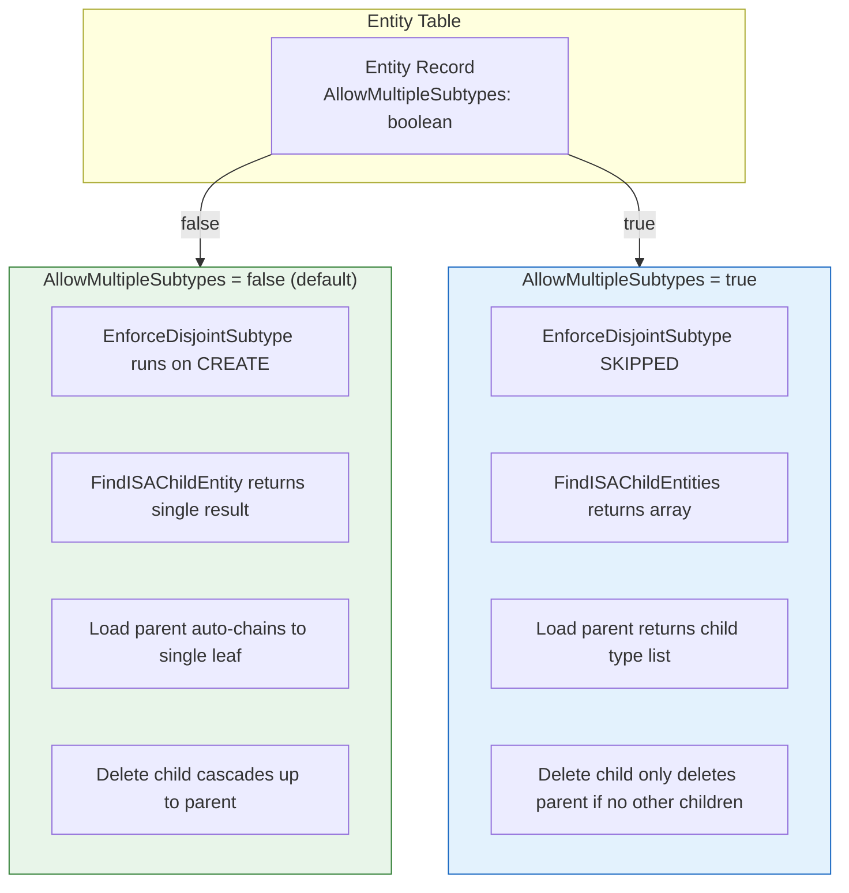
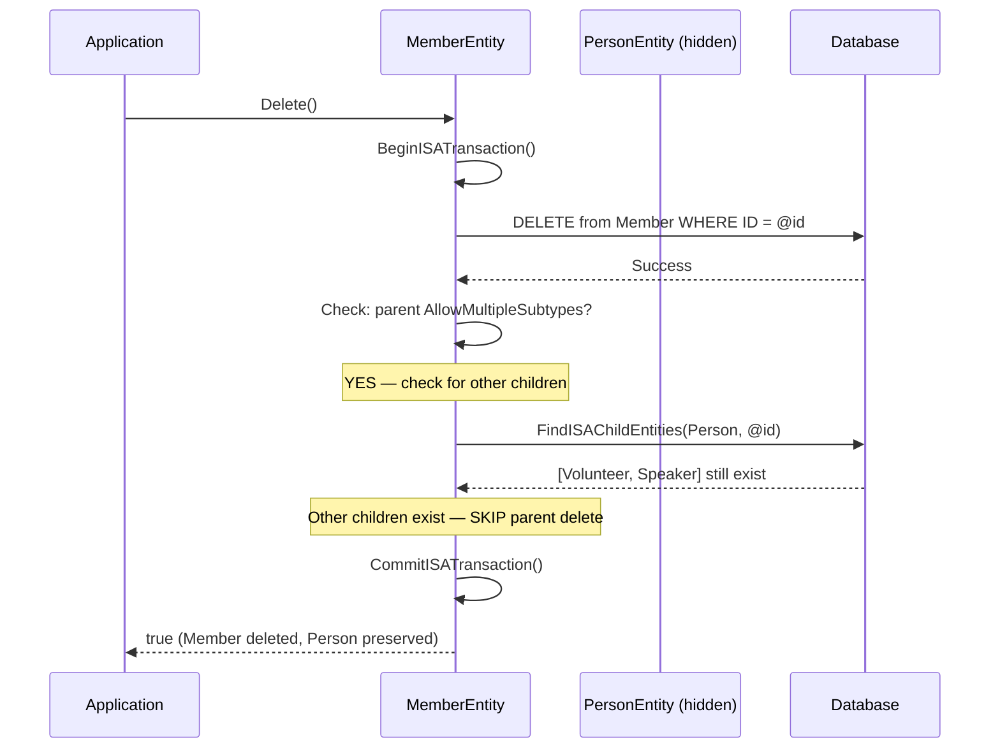

# IS-A Overlapping Subtypes — Implementation Plan

## Table of Contents
1. [Overview](#overview)
2. [Problem Statement](#problem-statement)
3. [Solution Design](#solution-design)
4. [Column Naming Decision](#column-naming-decision)
5. [Behavior Specification](#behavior-specification)
6. [Database Changes](#database-changes)
7. [Implementation Tasks](#implementation-tasks)
8. [Resolved Decisions](#resolved-decisions)
9. [Open Questions](#open-questions)
10. [Future Work](#future-work)

---

## Overview

The IS-A type system currently enforces **disjoint subtypes** — a parent record can only be ONE child type at a time. This works perfectly for hierarchies like Product → Meeting | Publication (a product is either a meeting or a publication, never both).

However, real-world domain modeling frequently requires **overlapping subtypes** — a single Person can simultaneously be a Member, a Volunteer, a Speaker, and a Reviewer. The current disjoint constraint prevents this.

This plan adds a single configurable flag on the Entity table that controls whether an entity's child types are exclusive (disjoint, current behavior) or allow multiple simultaneous subtypes. The change is minimal because the existing IS-A infrastructure (save chains, field routing, transactions, child discovery) already works correctly — the disjoint enforcement is a thin check layered on top.

**Motivation**: This enhancement directly unblocks the MJ BizApps Common initiative, which requires Person and Organization base entities with overlapping child types for association management applications (committees, mentoring, volunteering, abstract submission, awards, etc.).

---

## Problem Statement

### The Disjoint Constraint

Today, `EnforceDisjointSubtype()` in `BaseEntity._InnerSave()` runs a batch query across all sibling child tables during CREATE operations. If any sibling already has a record with the same PK, the save throws:

```
Cannot create Members record: ID 'abc-123' already exists as Volunteers.
A Persons record can only be one child type at a time.
```

This is correct for type hierarchies where subtypes are mutually exclusive:

```
Product (disjoint — a product IS one thing)
  ├── Meeting
  ├── Publication
  └── Webinar (child of Meeting)
```

But it fails for identity hierarchies where subtypes represent roles:

```
Person (overlapping — a person wears many hats)
  ├── Member          ← same person can be all of these
  ├── Volunteer       ← simultaneously
  ├── Speaker
  └── Reviewer
```

### What Works Today (No Changes Needed)

The rest of the IS-A system handles overlapping subtypes naturally:

- **Save chains**: Saving a Member saves Person → Member in a transaction. Saving a Volunteer for the same person saves Person → Volunteer in a separate transaction. These are independent operations that don't conflict.
- **Field routing**: `member.Set('Name', 'Jane')` routes to Person. `member.Set('MembershipLevel', 'Gold')` stays on Member. No ambiguity — you always work through a specific child type.
- **Transactions**: Each save chain has its own transaction scope. No cross-chain coordination needed.
- **CodeGen**: Views, SPs, GraphQL input types, TypeScript classes — all generated per child entity, unaffected by sibling subtypes.

### What Needs to Change

1. **Disjoint enforcement**: Skip the sibling check when the parent entity allows multiple types
2. **Child discovery**: Return multiple results instead of assuming at most one
3. **Loading a parent entity**: When overlapping, don't auto-chain to a single child — present the list of existing child types
4. **Delete behavior**: Don't cascade-delete the parent when other children still exist
5. **UI**: Show "also exists as: Member, Volunteer, Speaker" instead of auto-navigating to a single leaf

---

## Solution Design

### Core Principle

Add one boolean column to the Entity table. When false (default), behavior is identical to today. When true, the disjoint enforcement check is skipped and child discovery returns a list.

### Architecture Impact



### Object Model: Overlapping vs Disjoint

**Disjoint (current — unchanged):**
```
Load Meeting #abc → auto-discovers Webinar child → chains to leaf
meeting.ISAChild = WebinarEntity (single)
meeting.LeafEntity = WebinarEntity
meeting.Save() → delegates to leaf → saves full chain
```

**Overlapping (new):**
```
Load Person #abc → discovers [Member, Volunteer, Speaker] children → does NOT auto-chain
person.ISAChild = null (no single child to chain to)
person.ISAChildren = [info about Member, Volunteer, Speaker] (new: list of child type info)
person.Save() → saves Person only (no delegation — no single leaf)

Load Member #abc → chains to Person parent (upward chain works as today)
member.ISAParent = PersonEntity
member.Save() → saves Person → Member (normal IS-A save chain)
```

The key insight: **when you work through a child type, everything works exactly as today.** The only behavioral change is when you load the parent entity directly.

---

## Column Naming Decision

The new column on the Entity table needs a name. Candidates considered:

| Column Name | Default | To Enable | Style Match | Readability |
|---|---|---|---|---|
| `AllowMultipleTypes` | `0` | Set to `1` | Matches `AllowCreateAPI`, `AllowUpdateAPI` pattern | "Types" is overloaded in TypeScript codebases |
| **`AllowMultipleSubtypes`** | `0` | Set to `1` | Matches `AllowXxxAPI` pattern AND uses IS-A terminology | "Person allows multiple subtypes" (precise, clear) |
| `DisjointSubtypes` | `1` | Set to `0` | Matches code terminology (`EnforceDisjointSubtype`) | "Person disjoint subtypes = false" (double negative) |
| `ExclusiveSubtypes` | `1` | Set to `0` | More accessible than "disjoint" | Same double-negative issue |
| `OverlappingTypes` | `0` | Set to `1` | Direct intent | No existing precedent in codebase |

**Selected**: `AllowMultipleSubtypes` — follows the `AllowXxxAPI` naming convention already on Entity, default `false` preserves current behavior, `Person.AllowMultipleSubtypes = true` reads naturally, and "subtypes" directly ties to IS-A terminology used throughout the codebase.

---

## Behavior Specification

### Behavior Matrix

| Scenario | AllowMultipleSubtypes = false (disjoint) | AllowMultipleSubtypes = true (overlapping) |
|----------|:---:|:---:|
| **Create child when no siblings exist** | Allowed | Allowed |
| **Create child when sibling exists** | **BLOCKED** (disjoint violation) | Allowed |
| **Load parent → child discovery** | Returns single child, auto-chains | Returns array of children, no auto-chain |
| **Save via child entity** | Saves parent → child chain (transaction) | Same — no change |
| **Save via parent entity (with child)** | Delegates to single leaf | Saves parent only (no single leaf) |
| **Delete child entity** | Deletes child → parent (full chain) | Deletes child; deletes parent **only if no other children** |
| **Delete parent entity directly** | Blocked if children exist (unless CascadeDeletes) | Blocked if children exist (unless CascadeDeletes) |
| **Field routing (Set/Get)** | Routes through chain | Same — no change |
| **Validation** | Validates full chain | Same — no change |
| **CodeGen (views, SPs, classes)** | No change | No change |
| **Polymorphic leaf resolution** | Deterministic (single leaf) | Non-deterministic (multiple possible leaves) |

### Child Discovery: Single vs Multiple

**Current** (`FindISAChildEntity` — singular):
```typescript
// Returns { ChildEntityName: string } | null
// Assumes at most one result from UNION ALL
```

**New** (`FindISAChildEntities` — plural, new method):
```typescript
// Returns { ChildEntityName: string }[] (array, possibly empty)
// Used when parent AllowMultipleSubtypes = true
```

The existing `FindISAChildEntity` (singular) remains unchanged for disjoint parents. A new `FindISAChildEntities` (plural) method is added for overlapping parents. `InitializeChildEntity()` checks the flag and calls the appropriate method.

### Delete Safety for Overlapping Subtypes

When deleting a child in an overlapping hierarchy, the parent must NOT be deleted if other children still reference it:



If no other children exist, the delete proceeds up the chain as normal.

---

## Database Changes

### Migration: Add AllowMultipleSubtypes Column

**File**: `migrations/v2/V{timestamp}__vX.x_Add_AllowMultipleSubtypes_to_Entity.sql`

```sql
-- Add AllowMultipleSubtypes column to Entity table
-- Default false (0) preserves current disjoint behavior for all existing entities
ALTER TABLE ${flyway:defaultSchema}.Entity
ADD AllowMultipleSubtypes BIT NOT NULL
    CONSTRAINT DF_Entity_AllowMultipleSubtypes DEFAULT 0;

-- Add description
EXEC sp_addextendedproperty
    @name = N'MS_Description',
    @value = N'When false (default), child types are disjoint — a record can only be one child type at a time. When true, a record can simultaneously exist as multiple child types (e.g., a Person can be both a Member and a Volunteer).',
    @level0type = N'SCHEMA', @level0name = N'${flyway:defaultSchema}',
    @level1type = N'TABLE',  @level1name = N'Entity',
    @level2type = N'COLUMN', @level2name = N'AllowMultipleSubtypes';
```

No indexes needed — this column is read at metadata load time, not queried at runtime.

---

## Implementation Tasks

### Phase 1: Database Schema & Metadata

- [ ] **1.1** Create migration file adding `AllowMultipleSubtypes BIT NOT NULL DEFAULT 0` to Entity table
- [ ] **1.2** Run CodeGen to sync EntityField metadata and regenerate entity classes
- [ ] **1.3** Verify `MJEntityEntity` class has `AllowMultipleSubtypes` getter/setter in generated code

---

### Phase 2: EntityInfo Updates

**File**: `packages/MJCore/src/generic/entityInfo.ts`

- [ ] **2.1** Add `AllowMultipleSubtypes` property to `EntityInfo` class (read from metadata)
- [ ] **2.2** Update `ChildEntities` JSDoc to reference the new overlapping behavior
- [ ] **2.3** Add computed property `HasOverlappingSubtypes: boolean` (alias for readability in consuming code)

---

### Phase 3: Disjoint Enforcement Bypass

**File**: `packages/MJCore/src/generic/baseEntity.ts`

- [ ] **3.1** Modify `_InnerSave()` guard condition to check `AllowMultipleSubtypes`:

```typescript
// Current:
if (!this.IsSaved && this.EntityInfo.IsChildType && !_options.ReplayOnly) {
    await this.EnforceDisjointSubtype();
}

// New:
if (!this.IsSaved && this.EntityInfo.IsChildType && !_options.ReplayOnly) {
    const parentEntityInfo = this.EntityInfo.ParentEntityInfo;
    if (parentEntityInfo && !parentEntityInfo.AllowMultipleSubtypes) {
        await this.EnforceDisjointSubtype();
    }
}
```

- [ ] **3.2** Update `EnforceDisjointSubtype()` JSDoc to note it is only called for disjoint parents
- [ ] **3.3** Add unit test: create two child types (Member + Volunteer) for same Person PK when `AllowMultipleSubtypes = true` → succeeds
- [ ] **3.4** Add unit test: create two child types for same PK when `AllowMultipleSubtypes = false` → still fails (existing behavior preserved)

---

### Phase 4: Child Discovery for Overlapping Parents

**File**: `packages/SQLServerDataProvider/src/SQLServerDataProvider.ts`

- [ ] **4.1** Add `FindISAChildEntities` method (plural) that returns `{ ChildEntityName: string }[]`:

```typescript
/**
 * Discovers ALL IS-A child entities that have records with the given primary key.
 * Used for overlapping subtype parents where multiple children can coexist.
 * Same UNION ALL query as FindISAChildEntity, but returns all matches.
 */
public async FindISAChildEntities(
  entityInfo: EntityInfo,
  recordPKValue: string,
  contextUser?: UserInfo
): Promise<{ ChildEntityName: string }[]> {
  const childEntities = entityInfo.ChildEntities;
  if (childEntities.length === 0) return [];

  const unionSQL = this.buildChildDiscoverySQL(childEntities, recordPKValue);
  if (!unionSQL) return [];

  const results = await this.ExecuteSQL(unionSQL, undefined, undefined, contextUser);
  if (results && results.length > 0) {
    return results
      .filter((r: Record<string, string>) => r.EntityName)
      .map((r: Record<string, string>) => ({ ChildEntityName: r.EntityName }));
  }
  return [];
}
```

- [ ] **4.2** Add `FindISAChildEntities` to `IEntityDataProvider` interface (optional method, like `FindISAChildEntity`)

**File**: `packages/GraphQLDataProvider/src/GraphQLDataProvider.ts`

- [ ] **4.3** Add `FindISAChildEntities` to GraphQL provider (calls server resolver)

**File**: `packages/MJServer/src/resolvers/`

- [ ] **4.4** Add `FindISAChildEntities` GraphQL query resolver in `ISAEntityResolver` (or existing resolver file)

---

### Phase 5: BaseEntity — Overlapping Child Initialization

**File**: `packages/MJCore/src/generic/baseEntity.ts`

- [ ] **5.1** Add `_childEntities: { entityName: string }[] | null` field alongside existing `_childEntity`

- [ ] **5.2** Modify `InitializeChildEntity()` to branch on `AllowMultipleSubtypes`:

```typescript
protected async InitializeChildEntity(): Promise<void> {
    if (this._childEntityDiscoveryDone) return;
    this._childEntityDiscoveryDone = true;

    if (!this.EntityInfo?.IsParentType) return;

    if (this.EntityInfo.AllowMultipleSubtypes) {
        // Overlapping: discover all children, store as list, don't auto-chain
        await this.discoverOverlappingChildren();
    } else {
        // Disjoint: discover single child, auto-chain (current behavior)
        const childEntityName = await this.discoverChildEntityName();
        if (childEntityName) {
            await this.createAndLinkChildEntity(childEntityName);
        }
    }
}
```

- [ ] **5.3** Implement `discoverOverlappingChildren()`:

```typescript
private async discoverOverlappingChildren(): Promise<void> {
    const provider = this.ProviderToUse;
    if (!provider?.FindISAChildEntities) return;

    const results = await provider.FindISAChildEntities(
        this.EntityInfo,
        this.PrimaryKey.Values(),
        this._contextCurrentUser
    );
    this._childEntities = results.map(r => ({ entityName: r.ChildEntityName }));
}
```

- [ ] **5.4** Add public accessor `ISAChildren`:

```typescript
/**
 * For overlapping subtype parents (AllowMultipleSubtypes = true), returns
 * the list of child entity type names that have records for this PK.
 * For disjoint parents, returns null (use ISAChild instead).
 */
get ISAChildren(): { entityName: string }[] | null {
    return this._childEntities;
}
```

- [ ] **5.5** Update `ISAChild` getter to return null for overlapping parents (no single child to chain to)
- [ ] **5.6** Update `LeafEntity` getter: for overlapping parents, return `this` (the parent is the leaf from its own perspective)
- [ ] **5.7** Update save delegation: skip leaf delegation when `AllowMultipleSubtypes = true` on this entity (save just this entity, not a child chain downward)

---

### Phase 6: Delete Safety for Overlapping Subtypes

**File**: `packages/MJCore/src/generic/baseEntity.ts`

- [ ] **6.1** Modify delete orchestration in `_InnerDelete()`: after deleting the child record, check if parent has `AllowMultipleSubtypes = true`. If so, query for remaining children before deciding to delete parent:

```typescript
// In the IS-A delete chain, after deleting child's own record:
if (this._parentEntity) {
    const parentInfo = this._parentEntity.EntityInfo;
    if (parentInfo.AllowMultipleSubtypes) {
        // Check if other children still reference this parent
        const remainingChildren = await provider.FindISAChildEntities(
            parentInfo,
            this.PrimaryKey.Values(),
            this._contextCurrentUser
        );
        if (remainingChildren.length > 0) {
            // Other children exist — skip parent delete
            return true;
        }
    }
    // No other children (or disjoint) — proceed with parent delete
    await this._parentEntity.Delete({ IsParentEntityDelete: true });
}
```

- [ ] **6.2** Add unit test: delete Member when Volunteer exists for same Person → Person preserved
- [ ] **6.3** Add unit test: delete Member when no other children exist → Person also deleted
- [ ] **6.4** Add unit test: delete in disjoint hierarchy → unchanged behavior (full chain delete)

---

### Phase 7: UI Updates

**File**: `packages/Angular/Explorer/core-entity-forms/`

- [ ] **7.1** Update IS-A breadcrumb/badges: when entity is a parent with `AllowMultipleSubtypes = true`, show badge "Overlapping Subtypes" (or similar) instead of standard "Parent Type" badge
- [ ] **7.2** Update child types panel: for overlapping parents, show which child types have records for the current PK (loaded via `ISAChildren`)
- [ ] **7.3** When loading a parent entity record in overlapping mode, display a "Related Types" panel listing the child type records with navigation links (instead of auto-routing to a single leaf)

---

### Phase 8: Documentation Updates

- [ ] **8.1** Update `packages/MJCore/docs/isa-relationships.md`:
  - Add section on overlapping subtypes
  - Update behavior matrix
  - Update child discovery section
  - Update delete orchestration section
  - Add setup instructions for overlapping entities
- [ ] **8.2** Update the original plan doc `plans/entity-system-enhancements-virtual-and-supertype.md`:
  - Mark Future Work item 1 (overlapping subtypes) as implemented
  - Add cross-reference to this plan
- [ ] **8.3** Update `packages/MJCore/readme.md` to mention overlapping subtypes capability

---

### Phase 9: Testing & Validation

- [ ] **9.1** Create test entity hierarchy with `AllowMultipleSubtypes = true` (e.g., TestPerson → TestMember, TestVolunteer)
- [ ] **9.2** Test: create TestMember and TestVolunteer with same PK → both succeed
- [ ] **9.3** Test: load TestPerson → `ISAChildren` returns both child types
- [ ] **9.4** Test: load TestMember → `ISAParent` returns TestPerson (normal chain behavior)
- [ ] **9.5** Test: save TestMember → Person + Member saved in transaction
- [ ] **9.6** Test: delete TestMember → TestVolunteer and TestPerson preserved
- [ ] **9.7** Test: delete TestVolunteer (last child) → TestPerson also deleted
- [ ] **9.8** Test: existing disjoint hierarchies completely unaffected (regression)
- [ ] **9.9** Run full existing IS-A test suite — all passing

---

## Resolved Decisions

| # | Decision | Resolution | Rationale |
|---|----------|-----------|-----------|
| 1 | **Column type** | `BIT` (boolean), not string | Only two modes needed (disjoint vs overlapping). No foreseeable third mode. Simpler than string enum. |
| 2 | **Default value** | `0` (false = disjoint) | Preserves existing behavior for all current entities. Zero migration risk. |
| 3 | **Which entity gets the flag** | The **parent** entity | The parent defines whether its children are exclusive. Child entities don't need to know — they just exist. |
| 4 | **Load parent with overlapping children** | Return child type list, no auto-chain | Auto-chaining to one child would be arbitrary. Better to present the list and let the user/code choose. |
| 5 | **Save from parent with overlapping children** | Save parent only, no delegation | No single leaf to delegate to. Each child chain is saved independently when working through that child type. |
| 6 | **Delete child in overlapping hierarchy** | Check for remaining siblings before parent delete | Prevents orphaning or destroying data for other child types. Simple additional UNION ALL query. |
| 7 | **Existing `FindISAChildEntity` (singular)** | Keep unchanged, add new plural method | No breaking changes. Disjoint code paths untouched. New method only used for overlapping parents. |
| 8 | **Polymorphic leaf resolution** | Non-deterministic for overlapping parents | `ResolveLeafEntity()` should return all possible leaf types for overlapping parents, not just one. Callers must handle the ambiguity. |

---

## Open Questions

1. **Column name**: The plan uses `AllowMultipleSubtypes`. Alternatives considered: `DisjointSubtypes`, `ExclusiveSubtypes`, `OverlappingTypes`. Final name to be confirmed before implementation.

2. **Multi-level overlapping**: If Person (`AllowMultipleSubtypes=true`) has child Member, and Member has its own child SpecialMember — is SpecialMember's disjoint/overlapping independent of Person's setting? **Proposed answer**: Yes, each level independently controls its own children. Member could be disjoint even though Person is overlapping.

3. **Cross-type field conflicts**: If Member and Volunteer both add a field called `Status`, and you load a Person, which `Status` do you see? **Proposed answer**: You don't — you only see Person's own fields when loading Person directly. The child-specific fields are only visible when loading through that child type. CodeGen already prevents field name collisions within a single IS-A chain; overlapping siblings are independent chains.

4. **UI entity form**: When viewing a Person record, should the form show tabs for each child type? Or just navigation links? **Proposed answer**: Navigation links in a "Related Types" panel is simpler and more consistent with the current child types panel.

---

## Future Work

1. **BizApps Common OpenApp**: Use overlapping subtypes for Person → Member | Volunteer | Speaker | Reviewer | Mentor base entities. This plan directly enables that initiative.

2. **Bulk overlapping child discovery optimization**: For list views showing many parent records, batch the `FindISAChildEntities` queries to avoid N+1.

3. **GraphQL polymorphic queries**: "Give me all Person records regardless of child type, with a type discriminator." Would require a generated union type or interface in the GraphQL schema.

4. **`GetEntityObject` with type hint**: `GetEntityObject<MemberEntity>('Persons', user, { childType: 'Members' })` — load a Person and auto-chain to a specific child type in overlapping mode.
