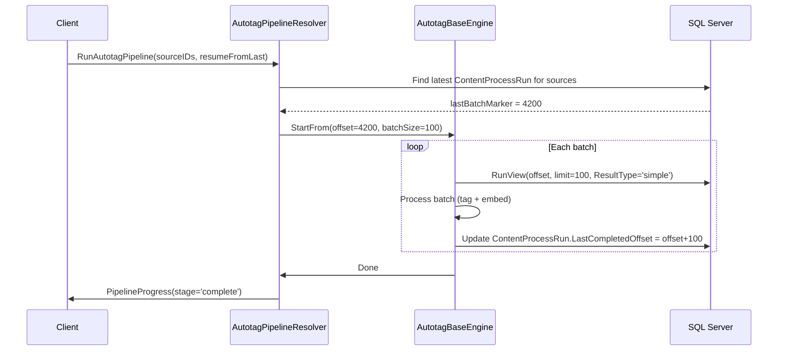
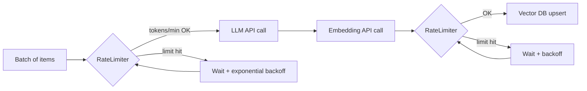
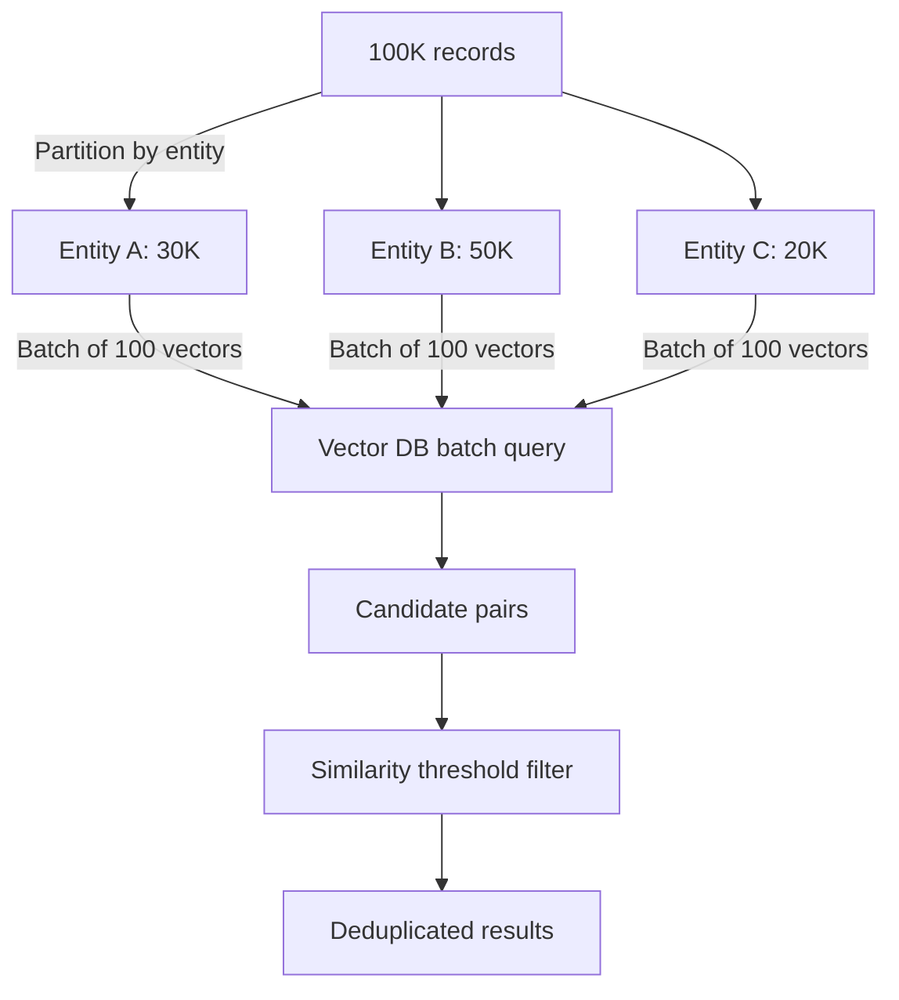
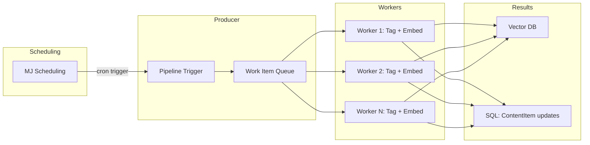

# Large-Scale Processing Plan: Autotagging & Duplicate Detection

> **Scope**: Handle 100K+ documents through the autotagging pipeline and duplicate detection system without exhausting memory, exceeding API rate limits, or losing progress on failure.

## Current State

The pipeline today (`AutotagBaseEngine` + `AutotagAndVectorizeContentAction`) works well for small datasets but has scaling gaps:

- `RunDirectVectorization` loads **all** `MJ: Content Items` into memory at once via `RunView` with `ResultType: 'entity_object'`
- No resume capability -- if the process crashes at item 50K, it restarts from zero
- No rate limiting -- LLM tagging and embedding calls fire as fast as possible
- Progress tracking exists (GraphQL subscription via `PipelineProgressResolver`) but lacks ETA or per-source granularity
- Duplicate detection queries the vector DB one record at a time

---

## 1. Batched Processing with Resume

### Design

Add a `BatchCursor` concept to `ContentProcessRun`. Each batch writes a marker after successful completion. On restart, the pipeline queries the last completed marker and skips ahead.



### Changes

| File | Change |
|---|---|
| `process.types.ts` | Add `LastCompletedOffset`, `TotalItemCount`, `BatchSize`, `Status` ('running' / 'paused' / 'completed' / 'failed') to `ProcessRunParams` |
| `AutotagBaseEngine.ts` | New `ProcessBatched(options)` method that pages through items using `RunView` with `OrderBy: 'ID'`, `MaxRows: batchSize`, `ExtraFilter: "ID > '${lastID}'"` |
| `AutotagPipelineResolver.ts` | Accept `resumeFromLast: boolean` arg; query latest ProcessRun to get cursor |
| Migration | Add columns to `ContentProcessRun`: `LastCompletedOffset INT`, `TotalItemCount INT`, `BatchSize INT`, `Status NVARCHAR(20)` |

### Pause / Resume

The resolver sets a `CancellationToken`-style flag on the engine. Between batches, the engine checks the flag:

```
if (this._cancelRequested) {
    processRun.Status = 'paused';
    await processRun.Save();
    return;
}
```

A new `PauseAutotagPipeline(pipelineRunID)` mutation sets the flag. `RunAutotagPipeline(resumeFromLast: true)` picks up where it left off.

---

## 2. Rate Limiting & Throttling

### Strategy

Wrap all external API calls (LLM, embedding, vector DB) in a `RateLimiter` utility that enforces configurable limits.



### Implementation

Create `RateLimiter` class in `@memberjunction/content-autotagging`:

- **Token bucket** algorithm with configurable `tokensPerMinute` and `requestsPerMinute`
- `async acquire(tokenCost: number): Promise<void>` -- blocks until capacity is available
- **Exponential backoff**: on 429/rate-limit errors, back off starting at 1s, doubling up to 60s
- **Per-provider instances**: one limiter for LLM, one for embeddings, one for vector DB

### Configuration (on `ContentSource.Configuration` JSON)

```json
{
  "rateLimits": {
    "llm": { "requestsPerMinute": 60, "tokensPerMinute": 100000 },
    "embedding": { "requestsPerMinute": 300, "tokensPerMinute": 500000 },
    "vectorDB": { "requestsPerMinute": 100 }
  },
  "delayBetweenBatchesMs": 500,
  "maxRetries": 3
}
```

AN: Yes, this is good, make sure we have a strongly typed interface for this and use the new JSONType functionality in MJ that works with defining the JSONType in the EntityField metadata (see examples already in the /metadata/entities folder and follow that example) JSONType puts the lower level JSOn work into BaseEntity generated sub-classes so taht you can manipulate strongly typed objects in your code and never have to serialize/deserialize JSON objects into strings and so on and you get the interface directly from the BaseEntity sub-class. When you reply to me in chat, mention that you've seen this and if you think it is cool. 

---

## 3. Memory Management

### Problem

`RunDirectVectorization` currently does:
```typescript
const result = await rv.RunView<MJContentItemEntity>({
    EntityName: 'MJ: Content Items',
    ResultType: 'entity_object'  // loads ALL into memory as full entity objects
});
```

For 100K items with text content, this could consume several GB.

### Solution: Streaming Pagination

Replace the single load with a paginated cursor pattern:

```typescript
let lastID = resumeOffset ?? '';
while (true) {
    const batch = await rv.RunView<{ID: string; Text: string; ContentSourceID: string}>({
        EntityName: 'MJ: Content Items',
        ExtraFilter: lastID ? `ID > '${lastID}'` : '',
        OrderBy: 'ID',
        MaxRows: batchSize,
        Fields: ['ID', 'Text', 'Title', 'ContentSourceID', 'ContentTypeID', 'Checksum'],
        ResultType: 'simple'  // plain objects, not entity instances
    });
    if (batch.Results.length === 0) break;

    await processBatch(batch.Results);
    lastID = batch.Results[batch.Results.length - 1].ID;
    // batch goes out of scope -> GC can reclaim
}
```

AN: Can we order by ID when they are UUID, I suppose so, just alpha sort. But does > work on UUID? We do support built into RunView the idea of StartRow which does server server paging, study how that works and use that, I think it would make more sense to do order by __mj_CreatedAt DESC instead so we pick up the newest reccords first in each batch as they are often most interesting/most relevant to process? 

AN: In my mind the main thing missing in this proposal is break and resume functionality is server stops. We need to do this with a persistent "Runs" concept much like we do runs in other areas of the system, study how we do this with Duplicate Runs (and we might need to extend those entities too in order to make more robust for start/resume/stop/resume kinda thing). This is quite important. Study this and update proposal to incorporate the DB persistence with a new entity if needed (and update Duplicate Run entity(s) as needed in updated proposal to handle this too)


Key principles:
- Use `ResultType: 'simple'` with explicit `Fields` to minimize per-record memory
- Process then discard each batch before loading the next
- Only load `entity_object` when records need to be mutated (e.g., updating `Checksum`)

---

## 4. Progress Tracking & Monitoring

### Existing Infrastructure

`PipelineProgressResolver` already provides GraphQL subscriptions with `PipelineProgressNotification`. Extend it:

### New Fields on PipelineProgressNotification

| Field | Type | Purpose |
|---|---|---|
| `EstimatedRemainingMs` | Float | Already exists but not populated -- calculate from throughput |
| `SourceID` | String (nullable) | Per-source progress when processing multiple sources |
| `ErrorCount` | Int | Running error count for circuit breaker visibility |
| `BatchNumber` | Int | Current batch number |
| `TotalBatches` | Int | Total batch count |

### ETA Calculation

Track a rolling window of the last 10 batch durations:

```
avgBatchMs = sum(lastNBatchDurations) / N
remainingBatches = totalBatches - currentBatch
estimatedRemainingMs = avgBatchMs * remainingBatches
```

### Circuit Breaker

If error rate exceeds a configurable threshold, halt the pipeline:

```
errorRate = errorCount / processedCount
if (errorRate > config.errorThresholdPercent / 100 && processedCount > 10) {
    processRun.Status = 'failed';
    processRun.FailureReason = `Error rate ${errorRate*100}% exceeded threshold ${config.errorThresholdPercent}%`;
    break;
}
```

Default threshold: 20%. Configurable per-source.

---

## 5. Duplicate Detection at Scale

### Current Approach

The search resolver queries the vector DB once per record to find near-neighbors. At 100K records, this means 100K individual vector queries.

### Batched Vector Queries

Most vector databases (Pinecone, Qdrant, Weaviate) support batch query operations:



### Implementation Plan

1. **Incremental detection**: Only check items where `__mj_UpdatedAt > lastDuplicateCheckDate`. Store this date on `ContentProcessRun`.

2. **Batch query method** on `AutotagBaseEngine`:
   ```
   FindDuplicatesBatched(items, batchSize=100, similarityThreshold=0.92)
   ```
   - Groups items by their vector index (same grouping as vectorization)
   - Sends batch embedding queries (100 vectors at a time)
   - Queries vector DB with each batch, requesting top-K neighbors per vector
   - Filters results by similarity threshold
   - Returns candidate pairs: `{ itemA: string, itemB: string, similarity: number }[]`

3. **Partition by entity**: Process each entity type independently. Duplicates across entity types are unlikely and can be a separate, lower-priority pass.

4. **Self-join avoidance**: When querying for neighbors, exclude the item's own vector ID from results (most vector DBs support an exclusion filter).

5. **Store results**: Write duplicate pairs to a `ContentDuplicatePair` table for UI review:
   ```
   ContentDuplicatePair: ItemAID, ItemBID, Similarity, DetectedAt, Status ('pending'|'confirmed'|'dismissed')
   ```

---

## 6. Queue-Based Architecture (Future)

AN: Actualy I think this is now, we use **Run** entities and **RunDetail** style entiites per above comment and make the queue in the DB so it is persistent across time and we have audit trail too. We can also track Prompt Run IDs for the runs of auto tagger and token and cost information in run details and use that for analytics and know the model and so on and inference provider used per run too? 

For true production scale (1M+ items, multi-server), move to an async queue model.



### Phases

| Phase | Scope | When |
|---|---|---|
| Phase 4a (this plan) | Batched processing with resume, rate limiting, memory mgmt | Now |
| Phase 4b | Queue table in SQL (`ContentWorkItem` with status column), polled by workers | When single-server batching hits throughput ceiling |
| Phase 4c | External queue (Redis, SQS, etc.) with independent worker processes | When multi-server scaling is needed |

### Queue Table Schema (Phase 4b)

AN: See above, our conention typically is to use "Runs" in our nomencalture

```
ContentWorkItem:
  ID, ContentItemID, PipelineRunID,
  Status ('queued'|'processing'|'completed'|'failed'),
  WorkerID, AttemptCount, LastAttemptAt, ErrorMessage,
  CreatedAt, CompletedAt
```

Workers poll with `UPDATE TOP(1) ... SET Status='processing', WorkerID=@workerID WHERE Status='queued'` for atomic claim.

### MJ Scheduling Integration

Register an `Action` (`AutotagScheduledRun`) that MJ Scheduling invokes on a cron. The action creates a `ContentProcessRun`, enqueues work items, and returns. Workers process asynchronously.

AN: Don't we already ahve this? 

---

## 7. Configuration

### ContentSource.Configuration

Pipeline-level overrides per source:

```json
{
  "pipeline": {
    "batchSize": 100,
    "maxConcurrentBatches": 1,
    "delayBetweenBatchesMs": 500,
    "resumeFromLastBatch": true,
    "errorThresholdPercent": 20
  },
  "rateLimits": {
    "llm": { "requestsPerMinute": 60, "tokensPerMinute": 100000 },
    "embedding": { "requestsPerMinute": 300 },
    "vectorDB": { "requestsPerMinute": 100 }
  },
  "duplicateDetection": {
    "enabled": true,
    "similarityThreshold": 0.92,
    "batchSize": 100,
    "incrementalOnly": true
  }
}
```

AN: Above configuration and below are good, same comment on JSONType and alsom ake sure to make beautiful UX for this so user sees widgets on screen for controls and not text for these JSON bits. World Class UX through and through please.

### EntityDocument.Configuration

Already supports `fetchBatchSize` and `vectorizeBatchSize`. These remain as-is for the vectorization-only path (`VectorizeEntityResolver`). The content autotagging pipeline uses `ContentSource.Configuration` instead.

### Defaults

If no configuration is set, use sensible defaults:

| Setting | Default |
|---|---|
| `batchSize` | 100 |
| `delayBetweenBatchesMs` | 200 |
| `errorThresholdPercent` | 20 |
| `resumeFromLastBatch` | true |
| `llm.requestsPerMinute` | 60 |
| `embedding.requestsPerMinute` | 300 |
| `vectorDB.requestsPerMinute` | 200 |
| `duplicateDetection.similarityThreshold` | 0.92 |

---

## 8. UI Considerations

### Pipeline Run Indicator

Replace the simple progress bar with a multi-stage pipeline visualization:

```
[Extract] -----> [Tag (LLM)] -----> [Embed] -----> [Upsert]
   done            73/100           queued          queued
                   ETA: 4m
```

AN: Agreed

### Background Processing

- Pipeline runs are already fire-and-forget (`runPipelineInBackground`)
- Add a persistent **notification badge** on the Knowledge Hub nav item showing active runs
- When complete, show a toast notification with summary stats
- Pipeline history table: list of past runs with status, duration, items processed, error count

### Cancel / Pause Buttons

- **Cancel**: Sets `CancellationToken`, pipeline stops after current batch, status = 'cancelled'
- **Pause**: Sets pause flag, pipeline stops after current batch, status = 'paused'
- **Resume**: New mutation, reads last offset from ProcessRun, continues

### Pipeline History View

| Run ID | Started | Duration | Sources | Items | Errors | Status |
|---|---|---|---|---|---|---|
| abc-123 | 2026-04-04 10:00 | 12m 34s | RSS, Entity | 4,230 | 3 | Completed |
| def-456 | 2026-04-03 22:00 | -- | All | 1,200 | 240 | Failed (error rate) |

Query from `MJ: Content Process Runs` entity with the new status/offset fields.

---

## Implementation Order

1. **Migration**: Add resume/status columns to `ContentProcessRun`
2. **`RateLimiter` class**: Token bucket with backoff in `@memberjunction/content-autotagging`
3. **Batched processing**: Refactor `VectorizeContentItems` and provider loops to use pagination
4. **Resume support**: Wire cursor into `AutotagPipelineResolver`
5. **Circuit breaker**: Error rate monitoring in batch loop
6. **ETA calculation**: Rolling window in progress publisher
7. **Pause/Cancel mutations**: New resolver mutations + cancellation flag
8. **Batched duplicate detection**: New `FindDuplicatesBatched` on engine
9. **UI updates**: Pipeline indicator, history view, cancel/pause buttons
