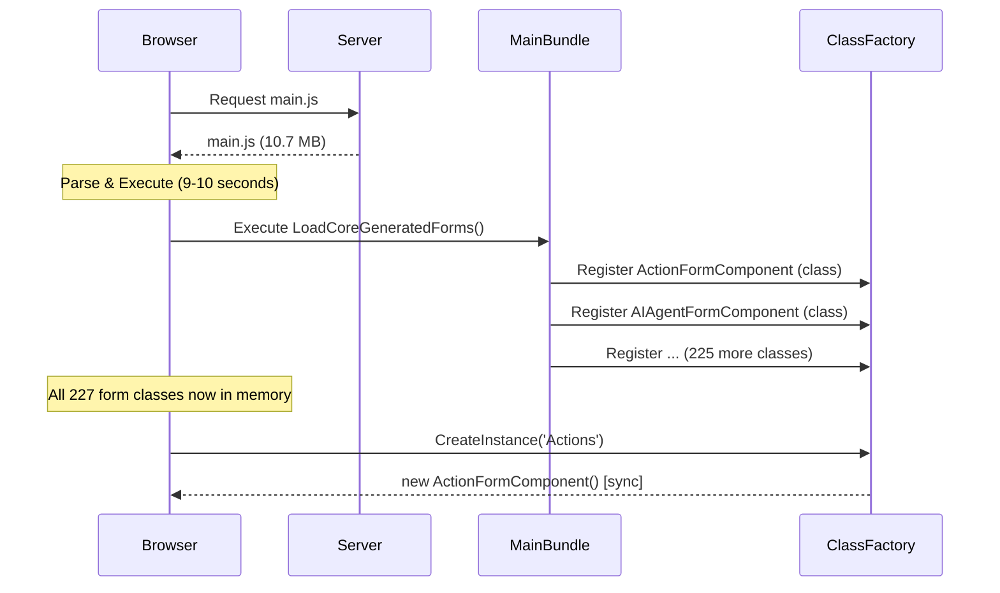
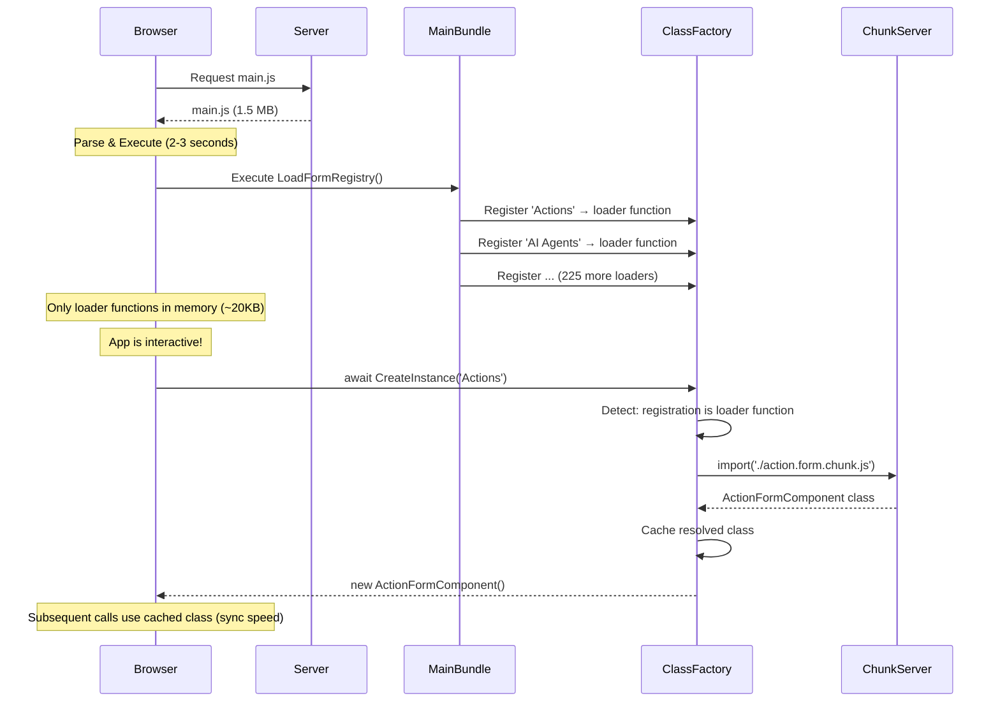
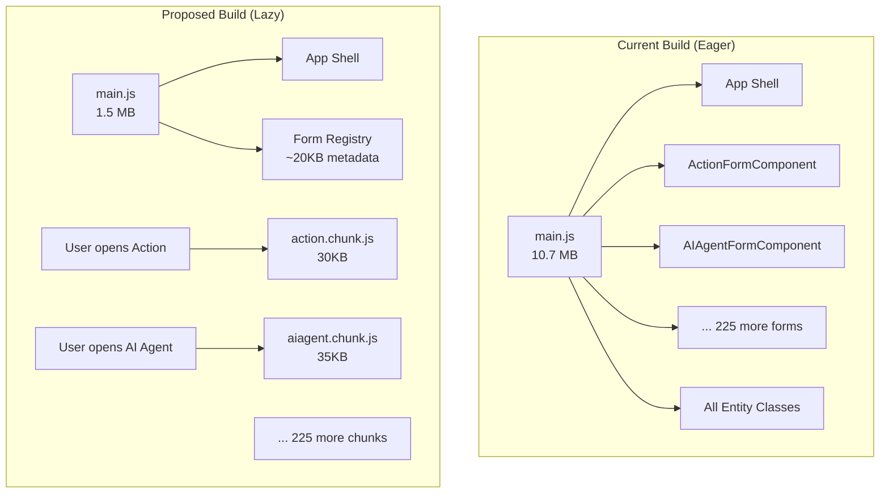
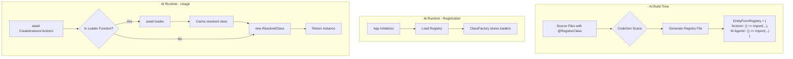

# Lazy Loading & Class Factory Async Migration Plan

## Executive Summary

MJExplorer currently takes 9-10 seconds to load due to a **10.7 MB main bundle**. The root cause is eager loading of 227 generated entity form components and 63,000+ lines of entity classes at startup. This plan proposes enabling lazy loading through the `RegisterClass` decorator and `ClassFactory` system, requiring `CreateInstance` to become async.

**Recommendation**: Make `CreateInstance` async as a breaking change in v3.0, enabling lazy loading that could reduce initial load time to 2-3 seconds.

---

## Problem Analysis

### Current Bundle Composition

```
main.js (10.7 MB)
├── App Shell & Framework (~1.5 MB)
├── 227 Generated Entity Forms (~4 MB)
├── Entity Subclasses (63K lines) (~3 MB)
├── Kendo UI Components (~1.5 MB)
└── Other Dependencies (~0.7 MB)
```

### Root Cause: Anti-Tree-Shaking Pattern

```typescript
// app.module.ts - Forces ALL forms into main bundle
LoadCoreGeneratedForms();   // References 227 components
LoadGeneratedEntities();    // References all entity classes

// Each Load function creates static code paths
export function LoadCoreGeneratedForms() {
  LoadActionFormComponent();      // Static reference → bundled
  LoadAIAgentFormComponent();     // Static reference → bundled
  // ... 225 more
}
```

The bundler cannot tree-shake code that has a static import chain, even if the code is never executed at runtime.

---

## Proposed Solution

### Core Idea: RegisterClass Supports Loader Functions

Extend `@RegisterClass` to accept either a class OR a loader function:

```typescript
// Current (eager) - class is bundled immediately
@RegisterClass(BaseFormComponent, 'Actions', 1)
export class ActionFormComponent extends BaseFormComponent { }

// New (lazy) - only loader reference bundled, class loaded on-demand
@RegisterClass(BaseFormComponent, 'Actions', 1)
export const ActionFormLoader = () =>
  import('./action.form.component').then(m => m.ActionFormComponent);
```

Both patterns use identical decorator syntax. The ClassFactory detects whether it received a class or loader function and handles accordingly.

---

## Architecture Diagrams

### Current Flow (Eager Loading)



### Proposed Flow (Lazy Loading)



### Build Output Comparison



### Class Registration Flow



---

## Implementation Details

### Modified RegisterClass Decorator

```typescript
type ClassOrLoader<T> =
  | (new (...args: any[]) => T)                           // Eager: actual class
  | (() => Promise<new (...args: any[]) => T>);           // Lazy: loader function

function RegisterClass<T>(
  baseClass: new (...args: any[]) => T,
  key: string,
  priority: number = 1
) {
  return function(target: ClassOrLoader<T>) {
    const isLoader = !isConstructor(target);

    ClassFactory.Register({
      baseClass,
      key,
      priority,
      target,
      isLoader
    });

    return target;
  };
}

function isConstructor(func: any): boolean {
  try {
    return func.prototype?.constructor === func &&
           /^class\s/.test(Function.prototype.toString.call(func));
  } catch {
    return false;
  }
}
```

### Modified ClassFactory.CreateInstance (Async)

```typescript
class ClassFactory {
  private registry = new Map<string, Registration[]>();
  private resolvedClasses = new Map<string, any>();

  async CreateInstance<T>(
    baseClass: new (...args: any[]) => T,
    key: string,
    ...constructorArgs: any[]
  ): Promise<T> {
    const fullKey = this.getKey(baseClass, key);

    // Get highest priority registration
    const registration = this.getHighestPriorityRegistration(baseClass, key);
    if (!registration) {
      throw new Error(`No registration found for ${key}`);
    }

    // Resolve loader if needed (with caching)
    let targetClass = registration.target;
    if (registration.isLoader) {
      if (!this.resolvedClasses.has(fullKey)) {
        const loadedClass = await registration.target();
        this.resolvedClasses.set(fullKey, loadedClass);
        // Update registration to avoid future async calls
        registration.target = loadedClass;
        registration.isLoader = false;
      }
      targetClass = this.resolvedClasses.get(fullKey);
    }

    // Instantiate and return
    return new targetClass(...constructorArgs);
  }

  private getHighestPriorityRegistration(baseClass: any, key: string): Registration | null {
    const registrations = this.registry.get(this.getKey(baseClass, key));
    if (!registrations || registrations.length === 0) return null;

    // Sort by priority descending, return highest
    return [...registrations].sort((a, b) => b.priority - a.priority)[0];
  }
}
```

### Customer Override Still Works

```typescript
// MJ Core (priority 1, lazy)
@RegisterClass(BaseFormComponent, 'Actions', 1)
export const ActionFormLoader = () =>
  import('./action.form.component').then(m => m.ActionFormComponent);

// Customer Code (priority 2, can be eager OR lazy)
@RegisterClass(BaseFormComponent, 'Actions', 2)
export class CustomActionFormComponent extends ActionFormComponent { }

// At runtime: Customer's class wins (priority 2 > 1)
const form = await ClassFactory.CreateInstance(BaseFormComponent, 'Actions');
// Returns: CustomActionFormComponent
```

---

## Migration Impact Analysis

### Codebase Scan Results

| Category | Files | Percentage | Migration Effort |
|----------|-------|------------|------------------|
| **EASY** - Already in async context | 36 | 71% | Add `await` keyword |
| **MODERATE** - Sync function → async | 14 | 27% | Change return type to `Promise<T>` |
| **HARD** - Property initializers | 2 | 2% | Convert to lazy getter |

**Total: 99 CreateInstance calls across 65 files**

### EASY Cases (36 files)

Already inside async functions - just add `await`:

```typescript
// Before
async function RunAgent(params) {
  const agent = MJGlobal.Instance.ClassFactory.CreateInstance<BaseAgent>(...);
  // ...
}

// After
async function RunAgent(params) {
  const agent = await MJGlobal.Instance.ClassFactory.CreateInstance<BaseAgent>(...);
  // ...
}
```

### MODERATE Cases (14 files)

Synchronous functions that need to become async:

```typescript
// Before
createProvider(config: AuthProviderConfig): IAuthProvider {
  return MJGlobal.Instance.ClassFactory.CreateInstance<IAuthProvider>(...);
}

// After
async createProvider(config: AuthProviderConfig): Promise<IAuthProvider> {
  return await MJGlobal.Instance.ClassFactory.CreateInstance<IAuthProvider>(...);
}
```

### HARD Cases (2 files)

Class property initializers - convert to lazy getter:

```typescript
// Before (packages/CodeGenLib/src/Database/sql_codegen.ts:34)
protected _sqlUtilityObject: SQLUtilityBase =
  MJGlobal.Instance.ClassFactory.CreateInstance<SQLUtilityBase>(SQLUtilityBase)!;

// After
private _sqlUtilityObject: SQLUtilityBase | null = null;

protected async getSqlUtilityObject(): Promise<SQLUtilityBase> {
  if (!this._sqlUtilityObject) {
    this._sqlUtilityObject = await MJGlobal.Instance.ClassFactory.CreateInstance<SQLUtilityBase>(SQLUtilityBase);
  }
  return this._sqlUtilityObject;
}
```

---

## Alternative Approach: CreateInstanceAsync (Non-Breaking)

Instead of making `CreateInstance` async, add a new method:

```typescript
class ClassFactory {
  // Existing - remains synchronous, throws if class not loaded
  CreateInstance<T>(baseClass, key, ...args): T {
    const registration = this.getRegistration(baseClass, key);
    if (registration.isLoader) {
      throw new Error(`Class '${key}' is lazy-loaded. Use CreateInstanceAsync() or EnsureLoaded() first.`);
    }
    return new registration.target(...args);
  }

  // New - handles both eager and lazy
  async CreateInstanceAsync<T>(baseClass, key, ...args): Promise<T> {
    await this.EnsureLoaded(baseClass, key);
    return this.CreateInstance<T>(baseClass, key, ...args);
  }

  // New - preload without instantiating
  async EnsureLoaded(baseClass, key): Promise<void> {
    const registration = this.getRegistration(baseClass, key);
    if (registration.isLoader) {
      const loadedClass = await registration.target();
      registration.target = loadedClass;
      registration.isLoader = false;
    }
  }
}
```

### Pros of Non-Breaking Approach
- No migration required for existing code
- Gradual adoption possible
- Existing eager registrations work unchanged

### Cons of Non-Breaking Approach
- Two methods to maintain
- Confusion about which to use
- Risk of runtime errors if wrong method called
- Doesn't encourage lazy loading adoption
- External developers might not know to use async version

---

## Recommendation: Breaking Change in v3.0

### Why Breaking Change is Better

1. **Single API** - One method, one mental model
2. **TypeScript Catches Issues** - Compile error if `await` missing (return type is `Promise<T>`)
3. **Encourages Best Practice** - All code naturally supports lazy loading
4. **Clean Migration** - Just add `await` in most cases (71%)
5. **v3.0 Timing** - Already planning breaking changes (ESM migration)

### External Code Migration

For customers upgrading from v2.x to v3.0:

```typescript
// v2.x
const entity = MJGlobal.Instance.ClassFactory.CreateInstance<ActionEntity>(...);

// v3.0
const entity = await MJGlobal.Instance.ClassFactory.CreateInstance<ActionEntity>(...);
```

TypeScript will flag every call site that needs updating - no silent failures.

---

## Performance Projections

| Metric | Current | After Lazy Loading | Improvement |
|--------|---------|-------------------|-------------|
| Initial bundle size | 10.7 MB | ~1.5 MB | **86% reduction** |
| Initial load time | 9-10 seconds | 2-3 seconds | **70% faster** |
| Time to interactive | 9-10 seconds | 2-3 seconds | **70% faster** |
| First form open | Instant | +100-200ms | Acceptable |
| Subsequent form opens | Instant | Instant | Cached |

### Chunk Loading Behavior

```
Initial Load:
├── main.js (1.5 MB) ──────────────── 2-3 seconds
└── App is interactive ✓

User Opens Action Record:
├── action.chunk.js (30 KB) ───────── ~100ms
└── Form renders ✓

User Opens Another Action Record:
├── (chunk cached) ────────────────── 0ms
└── Form renders instantly ✓

User Opens AI Agent Record:
├── aiagent.chunk.js (35 KB) ──────── ~100ms
└── Form renders ✓
```

---

## Implementation Plan

### Phase 1: Core Changes
1. Modify `RegisterClass` to detect loader functions
2. Make `ClassFactory.CreateInstance` async
3. Update MJGlobal interface
4. Add caching for resolved classes

### Phase 2: Internal Migration
1. Update 36 EASY files (add `await`)
2. Update 14 MODERATE files (make functions async)
3. Update 2 HARD files (lazy getter pattern)

### Phase 3: CodeGen Updates
1. Generate registry file with dynamic imports
2. Remove `LoadCoreGeneratedForms()` pattern
3. Generate loader functions instead of eager imports

### Phase 4: Documentation & Migration Guide
1. Update API documentation
2. Create v2→v3 migration guide
3. Add examples for external developers

---

## Open Questions for Team Discussion

1. **Chunk Grouping Strategy**: One chunk per entity form, or group by category/schema?
   - Individual: Maximum lazy loading, many small files
   - Grouped: Fewer files, slightly larger chunks

2. **Preloading Strategy**: Should we preload common forms after initial render?
   ```typescript
   // After app renders, preload frequently-used forms in background
   const commonEntities = ['Users', 'Actions', 'Dashboards'];
   commonEntities.forEach(e => ClassFactory.EnsureLoaded(BaseFormComponent, e));
   ```

3. **Error Handling**: What happens if a chunk fails to load?
   - Retry logic?
   - Fallback to generic form?
   - User notification?

4. **Development Experience**: How to handle HMR (Hot Module Replacement) with lazy chunks?

---

## Files to Modify

### Core Framework
- `packages/MJGlobal/src/ClassFactory.ts` - Main changes
- `packages/MJGlobal/src/decorators.ts` - RegisterClass updates

### Generated Code
- `packages/Angular/Explorer/core-entity-forms/src/lib/generated/` - All form registrations
- `packages/MJCoreEntities/src/generated/` - Entity class registrations

### CodeGen
- `packages/CodeGenLib/src/Angular/` - Form generation templates
- `packages/CodeGenLib/src/Entities/` - Entity generation templates

### Migration (99 call sites)
- See "Migration Impact Analysis" section above

---

## Conclusion

Making `CreateInstance` async is a worthwhile breaking change for v3.0:

- **86% bundle size reduction** (10.7 MB → 1.5 MB)
- **70% faster initial load** (9-10s → 2-3s)
- **Clean migration path** (mostly just add `await`)
- **Preserves extension model** (customer overrides still work)
- **TypeScript safety** (compile-time detection of missing `await`)

The alternative non-breaking approach (`CreateInstanceAsync`) is viable but adds API complexity and doesn't encourage adoption of lazy loading patterns.
