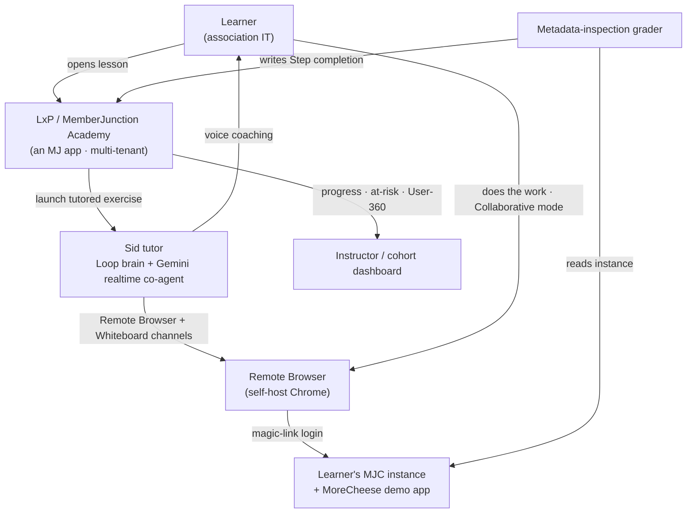
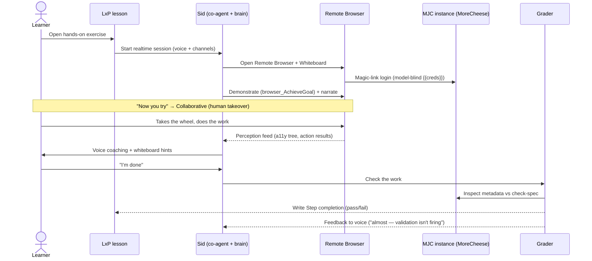
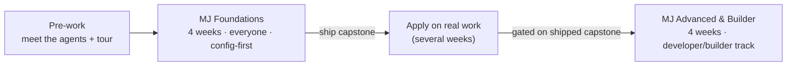
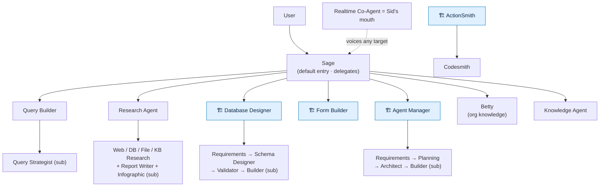
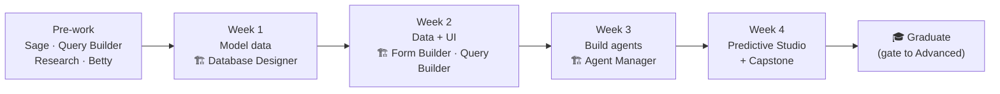

# MemberJunction Academy — Master Plan

*Definitive plan for Amith's review · 2026-06-27 · supersedes all prior drafts*

---

## 0. Vision

MemberJunction Academy is a cohort-based program that teaches MJ **on a platform built with MJ** (the LxP), in a sandbox that **is** an MJ app (MoreCheese), coached by **an MJ AI agent** (Sid), where learners get work done and build things **by talking to MJ's prebuilt expert agents.** Each learner gets their own provisioned MJC instance, reached by magic link inside a **remote-browser channel that an always-on voice tutor can see and drive**. Sid demonstrates ("let me show you…"), hands control back ("now you try"), watches the learner work, and coaches in voice continuously — while a metadata-inspection grader verifies the real work and writes completion back into the LMS. The whole stack dogfoods MJ end to end.

> Deep-dive links (repos, PRs, MJ feature guides, agent seeds, packages) are consolidated in **§17**.

### The Academy stack at a glance

---

## 1. Audience — and the principles it forces

**Who:** Association IT staff across a wide technical range — a handful of true developers, but **many are the most-technical-among-otherwise-non-technical association staff**: comfortable configuring systems, maybe some SQL, *not* TypeScript developers.

**Principle 1 — config-first.** MJ's defining property — *configuration is data, code is the engine* — is what makes it teachable to non-coders. Most value is **metadata and UI, not code.**

**Principle 2 — you operate MJ by talking to its prebuilt agents.** This is the unlock for this audience. MJ ships a roster of expert agents; learners **get work done** by asking the *everyday* agents and **build things** by describing to the *builder* agents (Database Designer builds your schema, Form Builder builds your form, Agent Manager builds your agent). The non-coder's path through MJ *is* the agents. This is baked in from Day 1 (§6).

**Principle 3 — single track with stretch.** One track for everyone; true code marked **🔧 Developer Stretch**. Foundations = everyone; Advanced = the developer/builder track. (Single track confirmed; 15–25-person cohorts are too small to split.)

**Tier legend (on every agenda):** 🔨 **Deep** (tutored, graded lab) · 👁 **Working** (guided demo) · 🗺 **Awareness** (survey) · 🔧 **Developer Stretch** (optional code-deep).

AI is threaded from day one, not siloed.

---

## 2. The signature experience — "tutored exercises in a live instance"

Built entirely on **shipped, production-wired MJ APIs** (validated against the codebase; see §12 register).

### The session, step by step

1. **Learner opens a hands-on exercise** from a lesson in the LxP.
2. **A realtime Sid session starts** — Loop "brain" + **Gemini realtime co-agent "mouth"** (already the LxP design). The co-agent voices the brain via the stable `invoke-target-agent` tool; chat turns answered by the co-agent, knowledge/grounding turns delegate to the brain.
3. **A Remote Browser channel opens**, pointed at the learner's **own MJC instance** with MoreCheese installed, authenticated by **magic link** (app-scoped, role-scoped). The browser is a **self-host Chrome** (MJAPI-baked; Browserbase swappable) the **session owns**, so everything the learner does is perceivable by Sid.
4. **A Whiteboard channel** is available in the same session for diagrams.
5. **The demonstrate → your-turn loop** (all wired):
   - **Demonstrate** (`AgentOnly` + `browser_AchieveGoal`): Sid drives the *same* browser the learner watches, narrating each step.
   - **Your turn** (`Collaborative`): learner grabs the wheel (human takeover); Sid's goal loop pauses cooperatively and **watches** via the perception feed and coaches in voice.
   - **Stuck?** Sid calls `browser_LocateElement(...)`, highlights it on the whiteboard, talks the learner through it.
6. **Model-blind credentials**: logins use `{{label}}` tokens resolved only at the CDP keystroke boundary — the model never holds the learner's secret.
7. **The grader closes the loop**: on "done," the **metadata-inspection grader** reads the learner's MJC instance and **writes pass/fail back into the LxP as Step completion** via the same `ContactStep`/`ContactAssetLog` path the course player uses.

### Coaching vs. grading — the load-bearing distinction

- **Sid's perception** is for **live coaching presence** — not the source of truth.
- **The grader's metadata inspection** is the source of truth for "did it work." MJ's inspectable metadata makes this reliable in a way screen-reading never could.

### Why it's perfect for this audience

A continuous voice tutor that watches your screen and steps in is the difference between a non-coder bouncing off a task and *succeeding* at it. The signature experience is what makes the program work for the median learner.

---

## 3. Program structure

**Two cohort-based bootcamps, spaced — never back-to-back.**

1. **MJ Foundations** (**4 weeks** + self-paced pre-work) — **everyone.** Config-first, agent-driven; zero → ships a real MoreCheese feature, tutored throughout.
2. **MJ Advanced & Builder** (**4 weeks**) — **the developer/builder track.** Taken later, **gated on shipping the Foundations capstone.** Building in code, integration & external data, Knowledge Hub & Predictive Studio deep, building apps, shipping Open Apps.

**Delivery = cohort-based / flipped, on the LxP:** async recorded lessons (Learning Paths) + tutored hands-on exercises (§2) + one live session/week (kickoff demo + office hours + group review of the cohort's common mistakes) + capstone. **Cohort size: 15–25.**

---

## 4. Anchor domain — MoreCheese

Every lesson and exercise runs on **MoreCheese** (the fictional International Cheese Federation; repo [`demo-morecheese`](https://github.com/MemberJunction/demo-morecheese) *(planned)*, plan in [MJ&nbsp;#2431](https://github.com/MemberJunction/MJ/pull/2431)) — a composable association (members, events, certifications, committees, chapters, products/competitions, orders/payments/subscriptions) built by **composing 10 BizApps open apps** (incl. Sonar), installed via the real `mj install`. Course anchor and live product demo are the same artifact.

- **Sonar** provides engagement signals; **Predictive Studio** ships **7 prebuilt models** trained on them → the Foundations Week-4 arc *signals → train → score → act*.
- **Betty** (org-knowledge agent) and **Izzy/Skip** are real AI surfaces to use and extend.

**Dependency:** MoreCheese targeted **done July 31** — feeds the August pilot; other workstreams build in parallel.

---

## 5. Delivery platform — the LxP / MemberJunction Academy

**The LxP is itself an MJ application** (Explorer shell, `@RegisterClass` surfaces, MetadataSync seeds, design tokens, MJ AI agents), **multi-tenant by design** → **Academy = a second tenant.**

### Curriculum → LxP primitives

| Bootcamp concept | LxP primitive |
|---|---|
| Week / module | **Learning Path** |
| Lesson | **Step** — Video / Activity HTML / Quiz |
| Tutored exercise | A custom step type launching the §2 Sid + Remote Browser session |
| Concept check | **Quiz** step (auto-scored) |
| Progress / completion | **ContactStep / ContactAssetLog**, % complete |
| Instructor cohort view | **LMS Admin Reports** — active learners, completion %, at-risk/stalled + User-360 |
| The AI tutor | **Sid**, re-grounded on MJ curriculum + the §2 channel layer |

**Continuous-session model:** the magic-link + remote-browser-channel approach dissolves the old "two-system bridge" — do the exercise / get coached / get graded in **one voice session.**

**LxP requirement — Learner Profile attribute bag:** per-learner store of MJC instance URL, magic-link reference, cohort, status (Workstream E, Ethan). The tutored-exercise step reads it to target + authenticate the right instance.

---

## 6. Operating MJ by conversation — the prebuilt agents (the through-line)

MJ ships ~19 seeded agents. **Using them to get work done and to build things is baked in from Day 1 and threads every week.** For this audience they're not a "topic" — they're *how you use the platform.*

### Everyday agents (use them to get work done)
- **Sage** (Loop) — the default, always-present assistant. Navigate, ask "how do I…?", find records, delegate. Every conversation starts here.
- **Query Builder** (Loop) — answer data questions and save reusable queries **without SQL** ("active members with lapsed renewals"). Delegates SQL to a Query Strategist sub-agent.
- **Research Agent** (Loop) — deep multi-source research → cited reports (orchestrates Web/Database/File/Knowledge-Base research sub-agents + a Report Writer + the Infographic agent for visuals).
- **Betty** (Flow) — direct org-knowledge lookups ("what's our policy on…?"). In MoreCheese, Betty is trained on the federation's knowledge base.
- **Knowledge Agent** (Loop) — semantic search, dedupe, knowledge navigation.

### Builder agents (describe it → they build it) — the non-coder superpower
- **Database Designer** (Loop) — *"I need to track sponsorships with tiers and renewal dates"* → it gathers requirements, designs the schema, validates, and deploys (CodeGen runs underneath). **This is how a non-coder models data.**
- **Form Builder** (Loop, under Sage) — *"design an intake form for new member chapters"* → builds the entity form (EntityFormOverride). **No-code forms.**
- **Agent Manager** (Loop) — *"create an agent that drafts renewal outreach"* → the no-code agent builder (Requirements Analyst → Planning Designer → Architect → Builder). **Build agents by describing them.**
- **ActionSmith** + **Codesmith** (Loop) — ship a new Action / run data-transform code into the catalog without a developer.
- **Infographic Agent** (Loop) — publication-quality SVG visuals (used by Research Agent, available standalone).

### Behind the scenes (learners don't drive these)
- **Memory Manager** (system, 15-min schedule) — extracts notes/examples from conversations to improve agents.
- **Sub-agents** (Web/Database/File/KB Research, Query Strategist, the builder sub-agents) — orchestrated by their parents; transparent to users.

### Realtime
- **Realtime Co-Agent** — the generic voice/channel front that voices any target agent. **This is Sid's "mouth"** and the basis of the §2 tutor.

*🏗️ = builder agents — the non-coder builds by describing.*

**How they relate:** Sage is the default entry point and delegates; agents have sub-agents (`MJ: AI Agent Relationships`, `InvocationMode: Sub-Agent`); builder agents persist real metadata you then use. **Curriculum stance:** the **agent-driven path is the primary one taught** (describe → it builds); the manual/CodeGen mechanics are taught as *what's happening underneath*; doing it by hand is the **🔧 Developer Stretch**.

---

## 7. FOUNDATIONS — 4 weeks (everyone, config-first, agent-driven)

> **Pre-work (self-paced):** get your instance; meet the agent roster — talk to **Sage** (navigate/ask), **Query Builder** (a data question, no SQL), **Research Agent** (a quick research report), **Betty** (an org-knowledge lookup); tour Data Explorer, Views, Lists, Query Browser, Search, Record Changes, Export; meet **Sid**, your tutor. First gentle tutored task: ask Query Builder for "lapsed members," save it as a **List**.
>
> Each week = a Learning Path. 🔨 = tutored, graded exercise. 🔧 = optional Developer Stretch. A **gotchas handout** runs all bootcamp.

### Week 1 — Model data, by describing it 🔨
- **Database Designer** as the primary path: describe what you want to store → it designs and deploys the schema (CodeGen runs underneath, taught as the under-the-hood mechanism). The metadata-driven thesis; how an entity becomes live in Explorer **and** available to the agents automatically.
- 🔧 Stretch: author the migration by hand; CodeGen internals, Zod schemas, the manifest system.
- **Exercise:** with **Database Designer** (Sid coaching), add a **Sponsorship** entity (tiers, renewal dates); confirm it's live in Explorer and queryable by **Query Builder**. *Grade:* entity exists with correct fields, queryable.
- **Live:** Database Designer on stage + the CodeGen it triggered; Week-1 mistakes review.

### Week 2 — Work with data & build the UI, by describing it 🔨
- **Query Builder** (build/save queries), **Field Rules** (low-code validation/calculation), the **Actions** concept ("the tools your Week-3 agents call"), MetadataSync (👁), permissions/RLS (👁). **Form Builder** to create a member form by describing it; the **dashboard scaffold**; design tokens (colors are config).
- 🔧 Stretch: custom Action in TypeScript; server entity subclass `ValidateAsync`; hand-built Angular component; Vitest.
- **Exercise:** add a **Field Rule** (auto-flag lapsed members) + an **Enroll Member in Event** capacity rule; use **Form Builder** to build a member intake form; scaffold a **Member 360** dashboard. *Grade:* rule fires, form override saved, dashboard registers + `check:ui` clean.
- **Live:** data + UI clinic.

### Week 3 — Build agents & prompts, by describing them 🔨
- **Agent Manager** as the primary path: describe the agent you want → it builds it (no-code). Prompts (`AIPromptRunner`) via UI; agent memory (Provisional→Active — extra time); Actions-as-tools; **ActionSmith/Codesmith** to ship a needed Action; intro **RAG via Knowledge Hub** + the **Knowledge Agent** (👁).
- 🔧 Stretch: custom agent DriverClass; prompt judging/parallel; memory internals.
- **Exercise:** with **Agent Manager** (Sid coaching), build a Loop agent that **drafts renewal outreach** for a member, using your Week-2 rule/Action as a tool. *Grade:* agent runs, calls the action, produces output, writes a memory note.
- **Live:** agent-building clinic.

### Week 4 — Predictive Studio + capstone 🔨
- **Predictive Studio** (UI-driven): use cases; the entity model; **why** leakage/point-in-time/train-serve-skew matter (plain language); the **Model Development Agent** (a builder agent in action); scoring via Record-Set Processing. Use **Research Agent** + **Infographic Agent** to narrate the capstone results.
- **Capstone:** a coherent feature end-to-end — typed data → dashboard → agent → predicted outcome → an Action/Field Rule that **acts** (auto-enroll high-risk members in re-engagement) — most of it assembled by talking to the builder agents, tutored by Sid.
- **Exercise/capstone:** train a **member-renewal-likelihood** model on **Sonar signals** via Predictive Studio + the Model Dev Agent; bind the score to Member; surface it on the Week-2 dashboard; wire the acting Action. *Grade:* model trained, binding created, score visible, action wired.
- **Live:** Predictive Studio walkthrough → capstone presentations → graduation. **Advanced gate = shipped capstone.**

---

## 8. ADVANCED & BUILDER — 4 weeks (developer/builder track)

For techies and those who want to build deeply. Gated on a shipped Foundations capstone. *Where Foundations used the builder agents, Advanced goes under the hood of them.*

### Week 1 — Build in code & platform internals 🔨🔧
- Custom **Actions in TypeScript** (and how **ActionSmith/Codesmith** generate them); **server entity subclasses** (`ValidateAsync`, hooks, FK cleanup); **custom Angular components**; **CodeGen extension** + the class-manifest system; providers / `generic-database-provider`; **encryption + key rotation**; dual-DB (SQL Server ↔ PostgreSQL); **security/RLS authoring**; multi-provider.
- **Exercise:** extend MoreCheese with a coded Action + a server-side invariant + a custom component, all tested.

### Week 2 — Integration & external data architecture 🔨
> **All shipped or shipping by course time.** The integration framework has been **shipped for weeks**, with a **catalog of 30+ connectors**. External Data Sources and Query/Entity Materialization land **within ~2 weeks** — live well before the pilot. Teach as **real, shipping capability**.

- The **integration engine / architecture** (connectors, field maps, watermarks, write-back) + the **30+ connector catalog** — *the killer association use case: connect MJ to your AMS and 30+ other systems.*
- **External Data Sources** ([#2449](https://github.com/MemberJunction/MJ/pull/2449)) — live, read-only proxy of PostgreSQL/SQL Server/MySQL/Oracle/Snowflake/MongoDB as **first-class MJ entities** through `RunView`/`RunQuery`/`Load`, with FK→relationship introspection. ([EDS guide](https://github.com/MemberJunction/MJ/blob/next/guides/EXTERNAL_DATA_SOURCES_GUIDE.md))
- **Query & Entity Materialization** ([#2770](https://github.com/MemberJunction/MJ/pull/2770)) — persist proven-hot query/view results into MJ tables, scheduled refresh; a materialized query becomes a read-only **VirtualEntity**.
- **The unified three-mode model** ([#2914](https://github.com/MemberJunction/MJ/pull/2914)): **Live-read** (EDS) · **Materialize** ([#2770](https://github.com/MemberJunction/MJ/pull/2770)) · **Pull-sync/ETL** (Integration + 30+ connectors). (Connector-family strategy: [#2913](https://github.com/MemberJunction/MJ/pull/2913).)
- **Scheduling engine** + custom job drivers; the **queue** system; the **communication engine**.
- **Exercise:** wire an external SQL source into MoreCheese as a live entity; pull from a connector; materialize a hot query; schedule a job that acts on it.

### Week 3 — Knowledge Hub & Predictive Studio, deep 🔨
- **Knowledge Hub deep:** content sources, **autotagging**, **tag taxonomy** (hierarchy/scoping/embeddings/governance), **search scopes + RAG+** (provider fusion, re-ranking) — and how the **Knowledge / Research agents** sit on top.
- **Predictive Studio deep:** **FeatureAssembly** + the **leakage guard** + point-in-time as-of; the **Python sidecar**; the **Model Development Agent** internals (Goal Analyst → Data Scout → Experiment Designer, experiment waves through RSP); the **experiment primitives**; custom pipelines beyond the 7 prebuilt models.
- **Exercise:** ingest a knowledge base + build a search scope; design and train a custom predictive model with a defended feature pipeline.

### Week 4 — Building apps, building agents, shipping Open Apps 🔨🔧
- **Building full apps on MJ** end-to-end.
- **Building custom agents under the hood** — the **Agent Manager** mechanics, sub-agent orchestration (`MJ: AI Agent Relationships`), prompt/tool/memory design; survey (🗺) of the **realtime / channels stack** (co-agents, Whiteboard, Remote Browser) — *how your own tutor is built.*
- **Open App authoring** end-to-end: manifest, **schema isolation**, **CodeGen entity prefixing**, **startup exports**, the `mj install` **publish/install lifecycle**, no-breaking-changes policy; **version history**.
- **Capstone:** build an app on MJ and **package it as an installable Open App** module (could include a custom agent).
- **Live:** capstone presentations → graduation.

---

## 9. The metadata grader + LxP write-back

The one genuinely net-new integration (reusable across all formats). **AI does most of the build-out**; Ethan/Matt oversight.

- **Per-exercise check specs** — declarative "what proves this is done" (entity X with fields Y; Field Rule/Action Z fires; agent A wired; model M trained + scoring binding present; `check:ui` clean; unit test passes). Most are metadata queries; a few need a dry-run.
- **The grader agent** — inspects the learner's MJC instance against the spec; returns structured, plain-language feedback Sid can voice.
- **LxP write-back** — on pass, write Step completion via `ContactStep`/`ContactAssetLog`.
- **Sid integration** — grader feedback feeds the tutor: "almost — your Action runs but the validation isn't firing; want me to show you where?"

---

## 10. Workstream D — Surfacing Sid's realtime channels in the LxP

**Not a from-scratch build.** The realtime channel stack — Remote Browser, Whiteboard, the co-agent, goal-driven control, magic-link, model-blind credentials — is **already built and working in MJ Core.** The LxP already accounts for **realtime voice**; it doesn't yet surface the *other channels*. So D is a **LxP-side surfacing/UX task**: weave the existing channels in beautifully so **Sid is both realtime and async** in one experience. **Owned by Matt (MattC-BC).**

**Scope:** (1) surface Remote Browser + Whiteboard alongside the existing voice; (2) point the browser at the learner's MJC instance + magic-link auth from the attribute bag; (3) the launch-from-lesson "tutored exercise" step type; (4) async + realtime Sid as one continuous identity; (5) the Sid tutor lesson-script contract + grader feedback.
**Defaults:** client-direct topology · **Gemini** (Grok alt) · **self-host** browser (Browserbase swap).
**De-risk:** one exercise end-to-end (Week-1 Sponsorship) first.
**Status:** core capability ✅ exists; LxP surfacing is the focused task → not the critical-path risk.

---

## 11. Instance provisioning & magic-link model

- **All learner instances are MJC instances** with MoreCheese installed via `mj install`.
- **Now (15–25):** manually create instances; tie the magic link to the learner via the §5 attribute bag.
- **Later (scale):** automate provisioning via **MCP/API** (spin instance, install MoreCheese, issue magic link, write attributes back to the LxP).
- **Magic link**: app/role-scoped, single-use, short-TTL, model-blind at the keystroke boundary.
- **Ops to budget:** instance create/reset/teardown, self-host browser minutes, magic-link issuance.

---

## 12. Risk & dependency register

### Realtime / remote-browser architecture (validated against the codebase)

| Item | Status | Implication |
|---|---|---|
| Realtime co-agents · Remote Browser channel (self-host + 4 BaaS) · Collaborative takeover · goal-driven control · Whiteboard · magic-link · model-blind creds · client-direct · Gemini/Grok | ✅ Shipped | The whole §2 experience is buildable today |
| Server-bridged client media · chat-history hydration · channel-grained perms · video channel | ⚠️ Not wired / partial | Irrelevant or mitigable; we use client-direct, audio-only, fence via app scope |

### Program / dependency risks

| Risk | Severity | Mitigation |
|---|---|---|
| **MoreCheese slips past July 31** | Med-High | Curriculum/grader/surfacing proceed on interim builds; pilot scope shrinks to finished subset |
| **LxP attribute bag + tenant/auth (Workstream E, Ethan)** | High | Required for Academy tenant + tutor targeting; tenant-isolation & learner-role hardening must be completed before external learners |
| **External-data / integration surface** | Low | Integration + **30+ connectors** shipped weeks ago; EDS + materialization ship ~2 wks out, before the Aug pilot |
| **Prebuilt agents' build quality on the association domain** | Low-Med | Database Designer/Form Builder/Agent Manager output should be vetted on MoreCheese; Sid coaches + grader verifies; keep exercises within agent strengths |
| **Workstream D (LxP channel surfacing, Matt)** | Low | Core shipped; surfacing weave-able; one-exercise slice first |
| **Perception fidelity on complex Explorer UI** | Medium | Coach w/ perception, **grade w/ metadata** |
| **Self-host browser cost/concurrency** | Medium | Cap session length; BaaS swap if needed |
| **Manual provisioning toil** | Med (now) / Low (later) | Fine at 15–25; MCP-automate as you scale |
| **Certificate issuance deferred in LxP** | Low | Fast-follow |

---

## 13. Timeline

Foundations is a **4-week cohort** (+ pre-work); Advanced is a separate **4-week cohort**, later.

| When | Milestone |
|---|---|
| **Now → Jul 31** | Build in parallel: curriculum + lesson/exercise scripts (Jason + AI content studio), lesson recording (Jason), grader + write-back (AI-built), **LxP channel surfacing one-exercise slice** (Matt), LxP Academy tenant + attribute bag + auth fix (Ethan). MoreCheese ships Jul 31. |
| **Mid/late Aug** | **Internal pilot** — Foundations, 15–25 (new hires + less-technical staff). Tutored exercises on select lessons; grader live; Zoom cohort layer. Harden Sid; gather the common-mistakes corpus. |
| **September** | **Refine** — fix coaching gaps, expand tutored coverage, polish content. |
| **Late September** | **Public launch** — first external async Foundations cohort (15–25). |
| **Oct 25–28** | **digitalNow (DC)** — in-person Foundations cohort (premium skin: lessons as pre-work, live = tutored labs + Q&A). |
| **Q4 / beyond** | Stand up **Advanced & Builder**; MCP-automated provisioning; certificates. |

---

## 14. Build workstreams & owners

| WS | Name | Owner | Notes |
|---|---|---|---|
| **A** | Curriculum + lesson/exercise scripts | **Jason** | + AI content studio (automates from outline onward) |
| **B** | Lesson recording/authoring | **Jason** | AI content studio does the grunt work |
| **C** | Metadata grader + LxP write-back | **AI-built** (Ethan/Matt oversight) | The one net-new integration |
| **D** | Surface Sid's realtime channels in the LxP (§10) | **Matt (MattC-BC)** | UX/surfacing; core already built |
| **E** | Academy LxP tenant + attribute bag + auth hardening | **Ethan** (owns LxP) | Multi-tenancy enforce + learner-role hardening + attribute bag |
| **F** | Instance provisioning + magic-link issuance | Manual now (ops/Ethan) → MCP later | Fine at 15–25 |
| **G** | Live-cohort layer (Zoom + scheduling) | **Jason** (education) | Outside the LxP for v1 |

---

## 15. Delivery skins (build once)

1. **Async cohort bootcamp** (primary) — the LxP experience.
2. **In-person cohort** (premium) — lessons as pre-work; live = tutored labs + Q&A. First outing: **digitalNow, Oct**.
3. **Self-serve reference library** (post-launch).

---

## 16. Decisions

**Resolved:** audience (association IT, config-first + agent-driven + 🔧 stretch) · **single track** · **Foundations 4 wks + pre-work; Advanced 4 wks** · **prebuilt agents baked in from Day 1 as the through-line** · Advanced = build-in-code + integration/external-data (#2449/#2770/#2913/#2914 + 30+ connectors) + Knowledge Hub deep + Predictive Studio deep + building apps/agents + Open Apps · **cohort 15–25** · voice = **Gemini** (Grok alt; not OpenAI) · browser = **self-host** (Browserbase swap) · instances = **MJC**, manual-now/MCP-later · pilot = **internal**, mid/late Aug · timeline = Aug pilot → Sept refine → late-Sept public → Oct digitalNow · certificates = fast-follow · owners per §14.

**Still open (minor):** confirm digitalNow in-person cohort + on-the-ground owner · certificate exact timing · when to greenlight the Advanced build (recommend: after the pilot informs it).

---

## 17. Positioning & pricing

- **Public-facing program**, priced at a **deliberately low fee** — the goal is **maximizing the number of people who learn MJ**, not revenue from the course itself. The course is a top-of-funnel and ecosystem-enablement play.
- **Certificate**: likely offer a **"MemberJunction Academy Certified"** credential (issuance is a fast-follow per §12; Open-Badges-capable). A recognized cert raises completion motivation and gives association IT staff something portable.
- This positioning reinforces the dogfooding story: low-cost, agent-tutored, hands-on MJ training that itself runs on the MJ stack.

---

## 18. Deep-dive links & references

**Repos**
- [MemberJunction (core)](https://github.com/MemberJunction/MJ)
- [Sonar — engagement-scoring Open App](https://github.com/MemberJunction/bizapps-sonar)
- [MoreCheese demo](https://github.com/MemberJunction/demo-morecheese) *(planned repo)*
- [Sidecar Learning Hub / LxP](https://github.com/BlueCypress/Sidecar-Learning-Hub) *(private)*

**Key PRs**
- MoreCheese / AssociationDB v2 plan — [MJ #2431](https://github.com/MemberJunction/MJ/pull/2431)
- Predictive Studio — [MJ #2940](https://github.com/MemberJunction/MJ/pull/2940)
- External Data Sources — [MJ #2449](https://github.com/MemberJunction/MJ/pull/2449)
- Query & Entity Materialization — [MJ #2770](https://github.com/MemberJunction/MJ/pull/2770)
- Integration connector strategy — [MJ #2913](https://github.com/MemberJunction/MJ/pull/2913)
- Unified external data access — [MJ #2914](https://github.com/MemberJunction/MJ/pull/2914)
- LxP implementation — [Sidecar-Learning-Hub #509](https://github.com/BlueCypress/Sidecar-Learning-Hub/pull/509) *(private)*

**MJ feature guides** (`guides/` on the `next` branch)
- [Realtime Co-Agents](https://github.com/MemberJunction/MJ/blob/next/guides/REALTIME_CO_AGENTS_GUIDE.md) · [Realtime Bridges](https://github.com/MemberJunction/MJ/blob/next/guides/REALTIME_BRIDGES_GUIDE.md) · [Remote Browser](https://github.com/MemberJunction/MJ/blob/next/guides/REMOTE_BROWSER_GUIDE.md)
- [Magic Link Access](https://github.com/MemberJunction/MJ/blob/next/guides/MAGIC_LINK_GUIDE.md) · [Agent Memory](https://github.com/MemberJunction/MJ/blob/next/guides/AGENT_MEMORY_GUIDE.md) · [Conversations UX Stack](https://github.com/MemberJunction/MJ/blob/next/guides/CONVERSATIONS_UX_STACK_GUIDE.md)
- [Forms Architecture](https://github.com/MemberJunction/MJ/blob/next/guides/FORMS_ARCHITECTURE_GUIDE.md) · [Dashboard Best Practices](https://github.com/MemberJunction/MJ/blob/next/guides/DASHBOARD_BEST_PRACTICES.md)
- [External Data Sources](https://github.com/MemberJunction/MJ/blob/next/guides/EXTERNAL_DATA_SOURCES_GUIDE.md) · [Search Scopes & RAG](https://github.com/MemberJunction/MJ/blob/next/guides/SEARCH_SCOPES_AND_RAG_GUIDE.md) · [Content Autotagging](https://github.com/MemberJunction/MJ/blob/next/guides/CONTENT_AUTOTAGGING_GUIDE.md)

**Prebuilt agents** (seed metadata in [`metadata/agents/`](https://github.com/MemberJunction/MJ/tree/next/metadata/agents))
- Sage (`.sage-agent.json`, incl. Form Builder + Workflow Planner) · Query Builder (`.query-builder-agent.json`) · Research Agent (`.research-agent.json`)
- Agent Manager (`.agent-manager.json`) · Database Designer (`.database-designer.json`) · ActionSmith / Codesmith (`.actionsmith-agent.json` / `.codesmith-agent.json`)
- Knowledge Agent (`.knowledge-agent.json`) · Betty (`.betty-agent.json`) · Infographic (`.infographic-agent.json`)
- Realtime Co-Agent (`.voice-co-agent.json`) · Memory Manager (`.memory-manager-agent.json`)

**Key packages** ([`packages/`](https://github.com/MemberJunction/MJ/tree/next/packages))
- [AI/Agents](https://github.com/MemberJunction/MJ/tree/next/packages/AI/Agents) · [AI/RemoteBrowser](https://github.com/MemberJunction/MJ/tree/next/packages/AI/RemoteBrowser) · [AI/Prompts](https://github.com/MemberJunction/MJ/tree/next/packages/AI/Prompts)
- [OpenApp/Engine](https://github.com/MemberJunction/MJ/tree/next/packages/OpenApp/Engine) · [ExternalDataSources](https://github.com/MemberJunction/MJ/tree/next/packages/ExternalDataSources) · [Angular/Explorer](https://github.com/MemberJunction/MJ/tree/next/packages/Angular/Explorer)

---

*End of master plan.*
