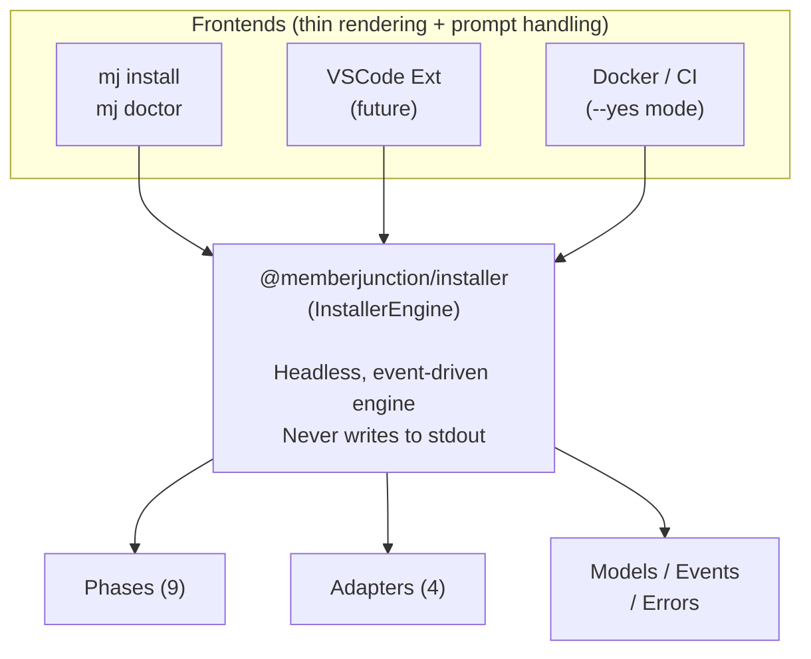
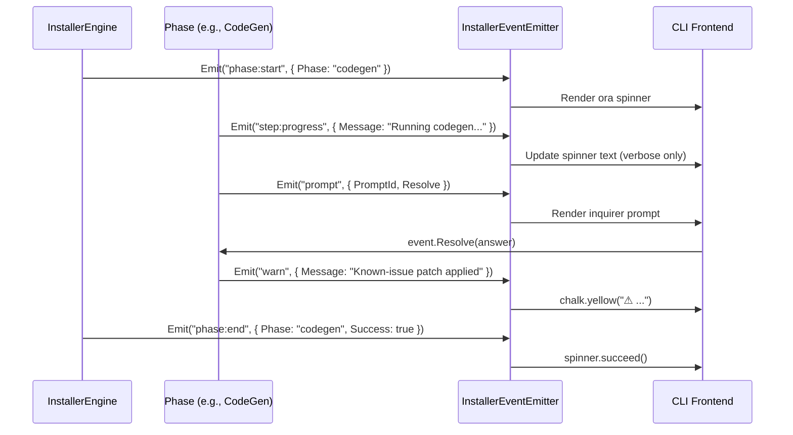
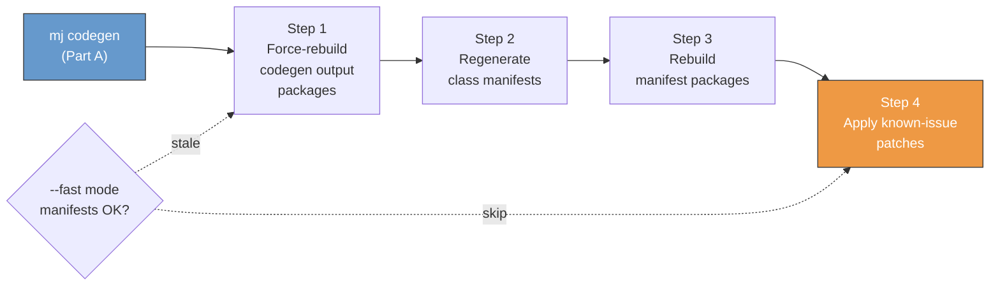
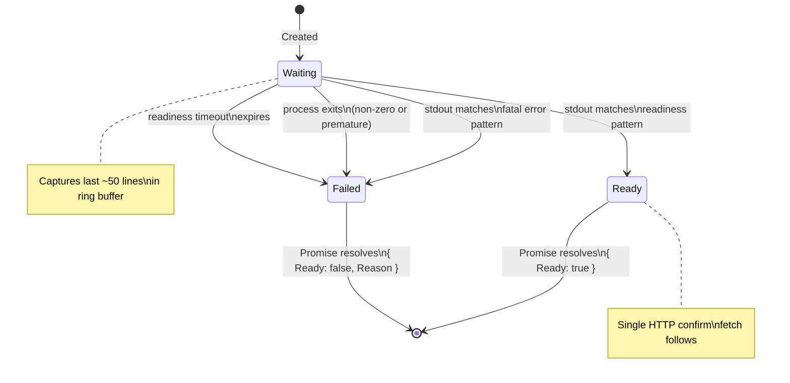
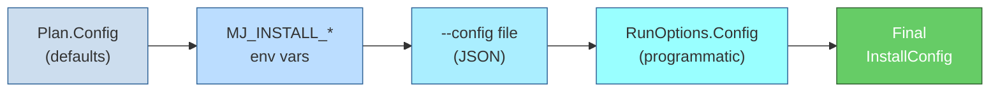
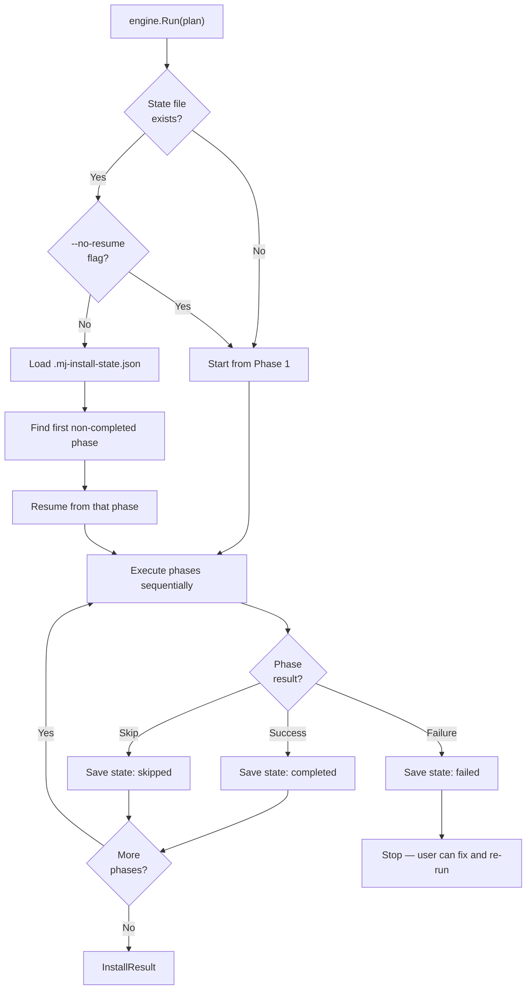

# MemberJunction Installer — Implementation Reference

> **Package:** `@memberjunction/installer` (`packages/MJInstaller/`)
>
> **Status:** Core engine implemented and functional. All 9 phases work end-to-end. CLI integration complete for `mj install` and `mj doctor`. Smoke test redesigned with stdout-based readiness detection. Platform compat phase hardened with `node -e` safety net.
>
> **Branch:** `feature/mj-install-v2` (targets `next`)
>
> **Companion docs:**
> - `member_junction_install_friction_report_draft_new.md` — friction findings that motivated this work

---

## Architecture Overview



### Design Principles

1. **Headless engine**: `InstallerEngine` communicates exclusively through typed events. No `console.log`, no `process.stdout`. This makes it usable from CLI, VSCode, Docker, or tests.
2. **Event-driven prompts**: When the engine needs user input, it emits a `prompt` event with a `Resolve` callback. The frontend handles the UI and calls `Resolve(answer)`.
3. **Checkpoint/resume**: After each phase completes, state is persisted to `.mj-install-state.json`. On re-run, completed phases are skipped automatically.
4. **Adapter pattern**: All I/O is behind adapter classes (`FileSystemAdapter`, `ProcessRunner`, `GitHubReleaseProvider`, `SqlServerAdapter`) for testability and future mocking.
5. **Fail-fast with actionable errors**: Every `InstallerError` includes a `Phase`, `Code`, and `SuggestedFix` — no cryptic stack traces for end users.

---

## Package Structure

```
packages/MJInstaller/
├── package.json
├── tsconfig.json
├── vitest.config.ts                    # Vitest configuration
├── src/
│   ├── index.ts                        # Public API exports (all types + classes)
│   │
│   ├── InstallerEngine.ts              # Orchestrator: plan, run, resume, doctor
│   │
│   ├── phases/                         # One class per install phase
│   │   ├── PreflightPhase.ts           # Node, npm, disk, ports, DB, OS
│   │   ├── ScaffoldPhase.ts            # Version selection, GitHub download, ZIP extract
│   │   ├── ConfigurePhase.ts           # .env, mj.config.cjs, environment.ts generation
│   │   ├── DatabaseProvisionPhase.ts   # SQL script generation + validation
│   │   ├── PlatformCompatPhase.ts      # cross-env fixes for Windows
│   │   ├── DependencyPhase.ts          # npm install + npm run build (workspace)
│   │   ├── MigratePhase.ts             # mj migrate orchestration
│   │   ├── CodeGenPhase.ts             # mj codegen + post-codegen pipeline + known-issue patches
│   │   └── SmokeTestPhase.ts           # Start MJAPI + Explorer, health checks
│   │
│   ├── adapters/                       # I/O boundary abstractions
│   │   ├── GitHubReleaseProvider.ts    # List releases, download ZIP assets from GitHub
│   │   ├── FileSystemAdapter.ts        # ZIP extract, file read/write, disk space, timestamps
│   │   ├── ProcessRunner.ts            # Spawn child processes, capture output, timeout
│   │   └── SqlServerAdapter.ts         # TCP connectivity, login validation, query execution
│   │
│   ├── models/                         # Data structures
│   │   ├── InstallPlan.ts              # Plan + phase sequence, CreatePlanInput, RunOptions
│   │   ├── InstallConfig.ts            # User config (DB, auth, ports) + defaults
│   │   ├── InstallState.ts             # Checkpoint persistence (.mj-install-state.json)
│   │   ├── Diagnostics.ts              # Doctor result model
│   │   └── VersionInfo.ts              # GitHub release metadata
│   │
│   ├── events/
│   │   └── InstallerEvents.ts          # 8 event types + typed emitter
│   │
│   ├── errors/
│   │   └── InstallerError.ts           # Typed errors with phase + code + suggested fix
│   │
│   └── __tests__/                      # Unit + integration tests
│       ├── mocks/                      # Shared mock utilities
│       │   ├── adapters.ts             # Mock FileSystemAdapter + ProcessRunner
│       │   ├── emitter.ts              # Mock typed event emitter
│       │   └── fixtures.ts             # Shared test fixtures (config, plan, context)
│       ├── InstallerEngine.test.ts     # Engine orchestration (41 tests)
│       ├── InstallerError.test.ts      # Error model (17 tests)
│       ├── InstallerEvents.test.ts     # Event system (19 tests)
│       ├── InstallConfig.test.ts       # Config, defaults, env vars, config file (35 tests)
│       ├── InstallPlan.test.ts         # Plan + Summarize (11 tests)
│       ├── InstallState.test.ts        # Checkpoint persistence (18 tests)
│       ├── Diagnostics.test.ts         # Diagnostics model (9 tests)
│       ├── FileSystemAdapter.test.ts   # Filesystem adapter (40 tests)
│       ├── GitHubReleaseProvider.test.ts # GitHub adapter (27 tests)
│       ├── ProcessRunner.test.ts       # Process spawning (32 tests)
│       ├── SqlServerAdapter.test.ts    # SQL Server adapter (12 tests)
│       ├── PreflightPhase.test.ts      # Preflight checks (36 tests)
│       ├── ScaffoldPhase.test.ts       # Download + extract (21 tests)
│       ├── ConfigurePhase.test.ts      # Config generation (32 tests)
│       ├── DatabaseProvisionPhase.test.ts # DB provisioning (18 tests)
│       ├── PlatformCompatPhase.test.ts # Platform fixes (38 tests)
│       ├── DependencyPhase.test.ts     # npm install/build (22 tests)
│       ├── MigratePhase.test.ts        # Migration (10 tests)
│       ├── CodeGenPhase.test.ts        # CodeGen + pipeline (33 tests)
│       ├── SmokeTestPhase.test.ts      # Smoke tests (22 tests)
│       └── integration/
│           └── cross-platform-smoke.ts # CI integration smoke (runs via npx tsx)
```

### Dependencies

- `adm-zip` — ZIP extraction
- `semver` — Version comparison
- No runtime dependency on `@memberjunction/codegen-lib` or `@memberjunction/global` — the engine spawns CodeGen as a child process via `ProcessRunner`.

---

## Public API

```typescript
export class InstallerEngine {
  /** Subscribe to installer events */
  On<K extends keyof InstallerEventMap>(event: K, handler: (...args: InstallerEventMap[K]) => void): void;

  /** Unsubscribe from installer events */
  Off<K extends keyof InstallerEventMap>(event: K, handler: (...args: InstallerEventMap[K]) => void): void;

  /** List available MJ release versions from GitHub */
  ListVersions(includePrerelease?: boolean): Promise<VersionInfo[]>;

  /** Build an install plan (dry-run friendly — no side effects) */
  CreatePlan(input: CreatePlanInput): Promise<InstallPlan>;

  /** Execute an install plan, emitting events throughout */
  Run(plan: InstallPlan, options?: RunOptions): Promise<InstallResult>;

  /** Run diagnostics on an existing or target install directory */
  Doctor(targetDir: string, options?: DoctorOptions): Promise<Diagnostics>;

  /** Resume a previously interrupted install from a state file */
  Resume(stateFileDir: string, options?: RunOptions): Promise<InstallResult>;
}
```

### Key Types

```typescript
interface CreatePlanInput {
  Tag?: string;           // Release tag, e.g. "v5.1.0". Omit for interactive selection.
  Dir: string;            // Target directory
  Config?: PartialInstallConfig;  // Pre-filled config values
  SkipDB?: boolean;       // Skip database provisioning
  SkipStart?: boolean;    // Skip MJAPI/Explorer startup
  SkipCodeGen?: boolean;  // Skip codegen phase
  Fast?: boolean;         // Fast mode: skip smoke test + optimize post-codegen
}

interface RunOptions {
  Yes?: boolean;          // Non-interactive mode
  DryRun?: boolean;       // Show plan without executing
  Verbose?: boolean;      // Verbose logging
  NoResume?: boolean;     // Ignore checkpoint, start fresh
  Config?: PartialInstallConfig;
  ConfigFile?: string;    // Path to JSON config file
  Fast?: boolean;         // Fast mode
}

interface InstallResult {
  Success: boolean;
  DurationMs: number;
  Warnings: string[];
  PhasesCompleted: PhaseId[];
  PhasesFailed: PhaseId[];
}
```

---

## Event API



The engine communicates exclusively through 8 typed events:

| Event | When | CLI Rendering |
|---|---|---|
| `phase:start` | A phase begins | Start `ora` spinner |
| `phase:end` | A phase completes (success/failure) | spinner.succeed() or spinner.fail() |
| `step:progress` | Progress within a phase | Update spinner text (verbose only in default mode) |
| `log` | Informational message (`info` or `verbose` level) | `console.log` (verbose level only with `--verbose`) |
| `warn` | Non-fatal warning (actual problem) | Always shown with `chalk.yellow("  ⚠ ...")` |
| `error` | Fatal error | Always shown with details + suggested fix |
| `prompt` | Engine needs user input | Render with `@inquirer/prompts`, call `event.Resolve(answer)` |
| `diagnostic` | Doctor check result | Print `[PASS]`/`[FAIL]`/`[WARN]`/`[INFO]` lines |

### Output Level Classification (implemented)

Messages are classified by severity to keep default output clean:

- **`warn`** (always shown): Actual problems — build failures, timeouts, stale entity names found, known-issue patches applied
- **`step:progress`** (verbose only): Progress indicators — "Post-codegen step X/4: ...", "Codegen output packages force-rebuilt", "Manifest regeneration completed", "Known-issue patches: no patches needed"
- **`log` verbose** (verbose only): Diagnostic details — "Manifest diagnostic: ... — OK"

### Prompt Event Pattern

```typescript
interface PromptEvent {
  Type: 'prompt';
  PromptId: string;
  PromptType: 'input' | 'confirm' | 'select';
  Message: string;
  Choices?: { Label: string; Value: string }[];
  Default?: string;
  Resolve: (answer: string) => void;  // Frontend calls this with the answer
}
```

---

## Error Model

```typescript
class InstallerError extends Error {
  Phase: PhaseId;        // Which phase failed
  Code: string;          // Machine-readable code (e.g., 'NODE_VERSION_LOW')
  SuggestedFix: string;  // Human-readable fix suggestion
}
```

Every error includes a suggested fix. Examples:
- `('preflight', 'NODE_VERSION_LOW', 'Node.js 20.1.0 found, >= 22 required.', 'Download Node.js 22 LTS from https://nodejs.org')`
- `('codegen', 'GENERATED_ENTITIES_MISSING', '...', 'Run "mj codegen" manually and check for errors.')`

---

## Install Phases (9 total)

Execution order: `preflight → scaffold → configure → database → platform → dependencies → migrate → codegen → smoke_test`


Each phase is checkpointed — if a phase fails (e.g., **Database** in red above), resume picks up from that phase.

### Phase 1 — Preflight

**Checks:** Node.js >= 22, npm available, disk space >= 2 GB, ports available (4000, 4200), SQL Server reachable (TCP), target DB exists, OS detection, write permissions.

Hard stops on: Node version too low, no npm, insufficient disk, can't write to target dir.
Warns on: Ports in use, DB unreachable (unless `--skip-db`), DB missing.

### Phase 2 — Scaffold

**Steps:** Resolve tag to GitHub release → download ZIP → extract to `--dir` → verify contents.

If no tag provided, lists available releases and emits a `prompt` for selection. Handles non-empty target dirs with confirmation prompt (unless `--yes`).

### Phase 3 — Configure

**Purpose:** Generate all config files from a single prompt flow.

**Files generated:** Root `.env`, `mj.config.cjs`, Explorer `environment.ts` + `environment.development.ts`.

**Prompts:** DB connection details, CodeGen/MJAPI credentials, API port (default 4000), Explorer port (default 4200), auth provider (Entra/Auth0/None), provider-specific values, optional AI API keys, optional new user creation.

Respects existing files — shows diff and prompts before overwriting (unless `--yes`).

### Phase 4 — Database Provisioning

**Generates** idempotent SQL scripts (all `IF NOT EXISTS` guarded): `mj-db-setup.sql` (logins, users, roles), `mj-db-validate.sql` (validation queries).

**Flow:** Prompt for DB credentials → generate scripts → prompt user to run in SSMS → validate by connecting as `MJ_CodeGen` and `MJ_Connect`.

Skippable with `--skip-db`.

### Phase 5 — Platform Compatibility

**Purpose:** Fix Unix-only env var syntax (`FOO=bar command`) and single-quoted arguments in `package.json` scripts for Windows.

On Windows: adds `cross-env` dependency and patches affected scripts. Also converts single-quoted glob patterns and paths (e.g., `'src/**/*.js'`) to double quotes — Windows `cmd.exe` passes single quotes literally, breaking tools like `cpy` and `rimraf`. Idempotent — already-patched scripts are skipped.

**Safety net for embedded JS code:** Scripts containing `node -e "..."` or `node -p "..."` blocks are handled specially — the embedded JavaScript is preserved verbatim during single-quote replacement. This prevents mangling of JS string literals that happen to contain `/` or `*` characters. The `NODE_EVAL_PATTERN` regex identifies these blocks, and `withEmbeddedNodeCodePreserved()` splits the script around them so only non-JS segments are transformed.

**Single-quote detection:** The `SINGLE_QUOTED_ARG_PATTERN` regex (`/'[^']*[/*][^']*'/`) targets single-quoted arguments containing `/` (paths) or `*` (globs), avoiding false positives on plain string literals like `'production'`.

Also handles `--max-old-space-size` advisory for Node >= 24.

### Phase 6 — Dependencies

**Steps:** `npm install` at repo root (workspace-aware) → `npm run build` at repo root.

Captures build output. Emits `warn` for npm audit vulnerabilities with guidance not to run `npm audit fix --force`.

### Phase 7 — Migrate

Runs `mj migrate` using the release's migration files. Validates `__mj` schema and baseline tables exist. Skips if already at expected version.

### Phase 8 — CodeGen + Post-CodeGen Pipeline

The most complex phase. Two sub-parts:

**Part A — CodeGen execution:**
1. Run `mj codegen` via `ProcessRunner`
2. Verify required artifacts exist (`mj_generatedentities`, generated TypeScript, manifests)
3. If artifacts missing, retry once. If still missing after retry, hard stop.

**Part B — Post-codegen pipeline (4 steps):**



| Step | What | Default Output |
|---|---|---|
| Step 1 | Force-rebuild codegen output packages (`.d.ts` exports) | `step:progress` (verbose only) |
| Step 2 | Regenerate class registration manifests | `step:progress` (verbose only) |
| Step 3 | Rebuild manifest packages | `step:progress` (verbose only) |
| Step 4 | Apply known-issue patches | `warn` only if patches applied |

**Known-Issue Patching System:**

An extensible registry of source-level bugs that the installer proactively fixes in fresh installs. Each patch is defined as a `KnownIssuePatch`:

```typescript
interface KnownIssuePatch {
  Id: string;                          // e.g., 'resource-permission-engine-null-safety'
  Description: string;
  RelativePath: string;                // Path to the file to patch
  PackageRelativeDir: string;          // Package to rebuild after patching
  NeedsPatch: (content: string) => boolean;  // Detection function
  Apply: (content: string) => string;        // Transformation function
}
```

Currently registered patches:
- **`resource-permission-engine-null-safety`**: Fixes null reference in `ResourcePermissionEngine.ts` where `this._ResourceTypes.ResourceTypes` and `this._Permissions` can be undefined on first access. Changes to use optional chaining (`?.`) and nullish coalescing (`?? []`).

The `mj doctor` command also checks for known issues and reports their status.

### Phase 9 — Smoke Test

Starts MJAPI and Explorer **in parallel** and uses **stdout-based readiness detection** instead of blind HTTP polling. Verifies both services start and respond to a single HTTP confirmation request.

Skippable with `--skip-start` or automatically skipped in `--fast` mode.

**Architecture (ReadinessWatcher):**



A `ReadinessWatcher` class monitors each service's stdout for readiness markers and fatal errors. It exposes `OnStdout`, `OnStderr`, `OnProcessExit`, and `OnTimeout` hooks, and a `Promise` that resolves with `{ Ready: boolean; Reason?: string; Output: string[] }`.

**Readiness patterns** (derived from source code analysis):
- **MJAPI**: `Server ready at` (from `MJServer/src/index.ts` line 402)
- **Explorer**: `Compiled successfully`, `Application bundle generation complete`, `Local:` URL (Angular CLI / Vite dev server)
- **Fatal errors** (immediate failure): `EADDRINUSE`, `Cannot find module`, `FATAL ERROR`

**Port detection from project files:**
- `detectApiPort()` — parses `.env` for `GRAPHQL_PORT=` (primary), `PORT=` (fallback), then `config.APIPort`, default 4000
- `detectExplorerPort()` — parses Explorer's `package.json` start script for `--port (\d+)`, then `config.ExplorerPort`, default 4200

**Timeout tuning:**
- API: 120s readiness + 30s buffer (150s process lifetime)
- Explorer: 240s readiness + 30s buffer (270s process lifetime)

**Verification flow per service:**
1. Create `ReadinessWatcher` with service-specific patterns and timeout
2. Start process via `ProcessRunner.Run()`, wire `OnStdout`/`OnStderr` callbacks
3. Set separate readiness timeout → `watcher.OnTimeout()`
4. Wire process exit → `watcher.OnProcessExit(code)` for early-exit detection
5. `await watcher.Promise`
6. If ready → single HTTP confirmation fetch (not a polling loop)
7. If not ready → return failure with captured output and reason

**Error reporting:** On failure, `reportServiceFailure()` emits a `warn` event with the failure reason and the last 20 lines of captured output for diagnosis.

**Parallel startup:** Both services are started concurrently via `Promise.all`, so total time = max(API startup, Explorer startup) instead of sum.

---

## `--fast` Mode

**Flag:** `mj install --fast`

**Purpose:** Optimistic approach that saves ~7-8 minutes on installs where manifests are already correct. If it causes runtime issues, the user re-runs without `--fast`.

**What `--fast` does:**

1. **Automatically skips smoke test** (saves ~5.5 min) — implies `--skip-start`
2. **Smart-skips post-codegen Steps 1-3** if manifests are already correct:
   - **Timestamp check**: Compares source file `mtime` vs compiled `.d.ts` `mtime` for key codegen output files (`entity_subclasses.ts`, `action_subclasses.ts`). If source is newer than dist, codegen regenerated files and a full rebuild is needed.
   - **Stale name check**: Reads manifest source files and searches for known stale entity class names that were renamed in recent versions.
   - If BOTH checks pass → skip Steps 1-3 entirely (saves ~2-3 min)
   - If EITHER check fails → fall back to full Steps 1-3
3. **Always applies known-issue patches (Step 4)** — fast and essential
4. **Prints a note** at the end: "Fast mode was used. If you encounter runtime errors, re-run without --fast."

**Implementation details:**

- `quickCheckManifests()` method in `CodeGenPhase.ts` performs both checks
- `CODEGEN_TIMESTAMP_CHECKS` static array defines source→dist pairs to compare
- `MANIFEST_SOURCE_PATHS` + `STALE_ENTITY_NAMES` used for name checking
- `FileSystemAdapter.GetModifiedTime()` provides timestamp comparison

---

## Non-Interactive / CI / Docker Mode

**Flag:** `mj install --yes` (optionally combined with `--config <path>`)

**Purpose:** Run the installer end-to-end in headless environments (Docker containers, GitHub Actions, other CI pipelines) without any interactive prompts. All configuration is injected via environment variables, a JSON config file, or both.

### Configuration Resolution Chain

When the engine runs, configuration is resolved in layers — each layer overrides the previous:



Each layer overrides fields from the previous layer. Missing fields fall through to earlier layers.

If `--yes` is set and a field is still unresolved after all layers, the engine uses `InstallConfigDefaults` values. Any prompt that would fire in interactive mode is auto-resolved with its default value (see Prompt Safety Net below).

### Environment Variables

Set `MJ_INSTALL_*` environment variables to inject configuration. Only variables that are set (non-empty) are used — missing variables are skipped.

| Env Var | Config Field | Type |
|---|---|---|
| `MJ_INSTALL_DB_HOST` | `DatabaseHost` | string (default: `localhost`) |
| `MJ_INSTALL_DB_PORT` | `DatabasePort` | number (default: `1433`) |
| `MJ_INSTALL_DB_NAME` | `DatabaseName` | string |
| `MJ_INSTALL_DB_TRUST_CERT` | `DatabaseTrustCert` | boolean (`true`/`1`/`yes`) |
| `MJ_INSTALL_CODEGEN_USER` | `CodeGenUser` | string |
| `MJ_INSTALL_CODEGEN_PASSWORD` | `CodeGenPassword` | string |
| `MJ_INSTALL_API_USER` | `APIUser` | string |
| `MJ_INSTALL_API_PASSWORD` | `APIPassword` | string |
| `MJ_INSTALL_API_PORT` | `APIPort` | number (default: `4000`) |
| `MJ_INSTALL_EXPLORER_PORT` | `ExplorerPort` | number (default: `4200`) |
| `MJ_INSTALL_AUTH_PROVIDER` | `AuthProvider` | `entra` / `auth0` / `none` |
| `MJ_INSTALL_OPENAI_KEY` | `OpenAIKey` | string |
| `MJ_INSTALL_ANTHROPIC_KEY` | `AnthropicKey` | string |
| `MJ_INSTALL_MISTRAL_KEY` | `MistralKey` | string |

**Auth-provider-specific variables** (populate `AuthProviderValues` record):

| Env Var | Key |
|---|---|
| `MJ_INSTALL_ENTRA_TENANT_ID` | `TenantID` |
| `MJ_INSTALL_ENTRA_CLIENT_ID` | `ClientID` |
| `MJ_INSTALL_AUTH0_DOMAIN` | `Domain` |
| `MJ_INSTALL_AUTH0_CLIENT_ID` | `ClientID` |
| `MJ_INSTALL_AUTH0_CLIENT_SECRET` | `ClientSecret` |

### JSON Config File (`--config`)

Pass a JSON file with any `InstallConfig` fields. Unknown keys are silently ignored.

```bash
mj install --yes --tag v5.2.0 --config mj-install.json
```

**Example `mj-install.json`:**
```json
{
  "DatabaseHost": "prod-sql.example.com",
  "DatabaseName": "MemberJunction",
  "CodeGenUser": "MJ_CodeGen",
  "CodeGenPassword": "secret123",
  "APIUser": "MJ_Connect",
  "APIPassword": "secret456",
  "AuthProvider": "entra",
  "AuthProviderValues": {
    "TenantID": "abc-123",
    "ClientID": "def-456"
  }
}
```

### Prompt Safety Net

In `--yes` mode, the engine installs a catch-all `prompt` event listener. If any phase emits a prompt that wasn't pre-resolved by the config chain, the safety net:

1. Logs a warning: `"Auto-resolving prompt '<PromptId>' with default '<Default>' (non-interactive mode)"`
2. Calls `event.Resolve(event.Default ?? '')` to auto-answer with the default value

This prevents indefinite hangs in headless environments. Without `--yes`, prompts are passed through to the frontend as normal.

### Usage Examples

**Docker Compose:**
```yaml
services:
  mj-install:
    image: node:24
    environment:
      MJ_INSTALL_DB_HOST: sql-server
      MJ_INSTALL_DB_NAME: MemberJunction
      MJ_INSTALL_CODEGEN_USER: MJ_CodeGen
      MJ_INSTALL_CODEGEN_PASSWORD: ${CODEGEN_PASSWORD}
      MJ_INSTALL_API_USER: MJ_Connect
      MJ_INSTALL_API_PASSWORD: ${API_PASSWORD}
      MJ_INSTALL_AUTH_PROVIDER: none
    command: npx mj install --yes --tag v5.2.0 --skip-start
```

**GitHub Actions CI:**
```yaml
- name: Install MJ
  env:
    MJ_INSTALL_DB_HOST: localhost
    MJ_INSTALL_DB_NAME: MemberJunction
    MJ_INSTALL_CODEGEN_USER: MJ_CodeGen
    MJ_INSTALL_CODEGEN_PASSWORD: ${{ secrets.CODEGEN_PASSWORD }}
    MJ_INSTALL_API_USER: MJ_Connect
    MJ_INSTALL_API_PASSWORD: ${{ secrets.API_PASSWORD }}
  run: npx mj install --yes --tag v5.2.0 --skip-start --skip-db
```

**Mixed approach (env vars for secrets, config file for everything else):**
```bash
# Secrets via env vars (never in config files)
export MJ_INSTALL_CODEGEN_PASSWORD="$CODEGEN_PASSWORD"
export MJ_INSTALL_API_PASSWORD="$API_PASSWORD"

# Everything else via config file
mj install --yes --tag v5.2.0 --config mj-install.json --skip-start
```

### Programmatic API

The engine's non-interactive mode is also available programmatically:

```typescript
import { InstallerEngine, resolveFromEnvironment, loadConfigFile, mergeConfigs } from '@memberjunction/installer';

const engine = new InstallerEngine();
const plan = await engine.CreatePlan({ Tag: 'v5.2.0', Dir: '/opt/mj' });

// Config can be built manually or loaded from sources
const config = mergeConfigs(
  resolveFromEnvironment(),                  // MJ_INSTALL_* env vars
  await loadConfigFile('./mj-install.json'), // JSON config file
  { APIPort: 4001 },                        // Programmatic overrides
);

const result = await engine.Run(plan, {
  Yes: true,           // Non-interactive mode
  Config: config,      // Merged config
  ConfigFile: './mj-install.json',  // Or let the engine load it
});
```

### Implementation Details

**Key source files:**

| File | What |
|---|---|
| `src/models/InstallConfig.ts` | `resolveFromEnvironment()`, `loadConfigFile()`, `mergeConfigs()` functions + env var mapping tables |
| `src/models/InstallPlan.ts` | `RunOptions.ConfigFile` property |
| `src/InstallerEngine.ts` | Config chain resolution in `Run()` + prompt safety net installation |
| `src/index.ts` | Exports: `resolveFromEnvironment`, `loadConfigFile`, `mergeConfigs` |
| `MJCLI/.../install/index.ts` | `--config` / `-c` CLI flag → `RunOptions.ConfigFile` |

**Test coverage (40 tests across 2 files):**

| Test File | Tests | What's Tested |
|---|---|---|
| `InstallConfig.test.ts` | 28 new | `resolveFromEnvironment` (string/numeric/boolean parsing, auth provider values, isolation), `loadConfigFile` (valid JSON, all known fields, unknown keys, error cases), `mergeConfigs` (override precedence, AuthProviderValues shallow-merge) |
| `InstallerEngine.test.ts` | 12 new | Config chain resolution (env vars, config file, priority override, log emission), prompt safety net (auto-resolve, warning log, not installed without --yes) |

---

## Checkpoint / Resume



State file: `.mj-install-state.json` in the install directory.

```json
{
  "Tag": "v5.1.0",
  "StartedAt": "2026-02-19T10:30:00Z",
  "Phases": {
    "preflight": { "Status": "completed", "CompletedAt": "..." },
    "scaffold": { "Status": "completed", "CompletedAt": "..." },
    "configure": { "Status": "completed", "CompletedAt": "..." },
    "database": { "Status": "failed", "Error": "Connection refused", "FailedAt": "..." },
    "platform": { "Status": "pending" },
    "dependencies": { "Status": "pending" },
    "migrate": { "Status": "pending" },
    "codegen": { "Status": "pending" },
    "smoke_test": { "Status": "pending" }
  }
}
```

**Behavior:**
- `Run()` auto-detects the state file and resumes from the first non-completed phase
- `--no-resume` flag forces a fresh start (ignores existing state)
- Failed phases re-run from the beginning of that phase
- Skipped phases are recorded as `"skipped"` (not re-run on resume)
- State is saved after every phase completion/failure

---

## CLI Commands

### `mj install`

**Location:** `packages/MJCLI/src/commands/install/index.ts`

| Flag | Short | Description |
|---|---|---|
| `--tag <tag>` | `-t` | Release tag (e.g., `v5.1.0`). Omit for interactive selection. |
| `--dir <path>` | | Target directory (default: `.`) |
| `--yes` | | Non-interactive mode — resolve config from env vars/config file, auto-answer remaining prompts with defaults |
| `--config <path>` | `-c` | Path to JSON config file with install settings (see Non-Interactive Mode section) |
| `--dry-run` | | Show plan without executing |
| `--verbose` | `-v` | Verbose output (show `step:progress` and `log` verbose messages) |
| `--skip-start` | | Skip MJAPI/Explorer startup (smoke test phase) |
| `--skip-db` | | Skip database provisioning phase |
| `--skip-codegen` | | Skip codegen phase entirely |
| `--no-resume` | | Ignore checkpoint, start fresh |
| `--fast` | | Fast mode: skip smoke test + optimize post-codegen steps |
| `--legacy` | | Uses the old ZIP-style interactive installer |

**Examples:**
```bash
mj install                              # Interactive: pick version, answer prompts
mj install -t v5.1.0                    # Install specific version
mj install -t v5.1.0 --yes             # Non-interactive with defaults
mj install -t v5.1.0 --fast            # Optimistic fast install
mj install --dir /opt/mj --skip-db     # Custom dir, skip DB setup
mj install --dry-run                    # Show plan only
mj install --no-resume                  # Fresh start (ignore checkpoint)
mj install -v                           # Verbose output
mj install --yes -t v5.2.0 -c config.json  # CI: config from JSON file
mj install --yes -t v5.2.0 --skip-start    # CI: config from MJ_INSTALL_* env vars
```

**Output format (default):**
```
Install Plan
────────────
  Tag:       v5.1.0
  Directory: /opt/mj
  ...

▸ Check prerequisites (Node, npm, disk, ports, DB)
  ✓ preflight completed (294ms)
▸ Download and extract release
  ✓ scaffold completed (34s)
...
▸ Run CodeGen and validate artifacts
  ⚠ Known-issue patch applied: resource-permission-engine-null-safety
  ✓ codegen completed (7m 8s)
▸ Start services and run smoke tests
  ✓ smoke_test completed (5m 34s)

MJ Install Complete
───────────────────
  Tag:      v5.1.0
  Duration: 10m 54s
  Warnings: 1
```

### Example: Full Interactive Install Walkthrough

This walks through a complete fresh install from an empty directory with verbose output.

**Prerequisites:**
- Node.js >= 22, npm available
- SQL Server instance running with an empty target database (e.g., `MemberJunction`)
- The `mj` CLI installed globally (`npm install -g @memberjunction/cli`)

**Step 1 — Run the installer:**

```bash
# Create an empty directory and run the installer into it
mkdir C:\dev\mj-testing\fresh-install
npx mj install --dir C:\dev\mj-testing\fresh-install --no-resume --verbose
```

- `--dir` points to the empty target directory
- `--no-resume` ensures a clean start (ignores any prior checkpoint state)
- `--verbose` shows `step:progress` messages and detailed diagnostics

**Step 2 — Answer prompts:**

The installer will prompt you interactively for:
1. **Release version** — pick from available tags (e.g., `v5.4.1`)
2. **Database connection** — host, port, database name, trust cert
3. **CodeGen credentials** — SQL user/password for `MJ_CodeGen` login
4. **API credentials** — SQL user/password for `MJ_Connect` login
5. **Ports** — MJAPI port (default 4000), Explorer port (default 4200)
6. **Auth provider** — Entra ID, Auth0, or None
7. **Auth-specific values** — tenant ID, client ID, etc. (depends on provider choice)
8. **AI API keys** (optional) — OpenAI, Anthropic, Mistral

**Step 3 — Database provisioning:**

The installer generates idempotent SQL scripts for creating logins, users, and roles. It will prompt you to run these in SSMS (or another SQL client), then validates by connecting as `MJ_CodeGen` and `MJ_Connect`.

**Step 4 — Review and adjust generated config files:**

After the configure phase completes, the installer has written these files into your target directory. You can review and tweak them before the remaining phases run (the installer prompts before overwriting existing files):

| File | Location | What to Check |
|---|---|---|
| `.env` | `{dir}/packages/MJAPI/.env` | `GRAPHQL_PORT`, DB credentials, auth provider settings, AI keys |
| `mj.config.cjs` | `{dir}/mj.config.cjs` | Database host/name, auth provider config |
| `environment.ts` | `{dir}/packages/MJExplorer/src/environments/environment.ts` | API URL, auth provider client config |
| `environment.development.ts` | `{dir}/packages/MJExplorer/src/environments/environment.development.ts` | Dev-mode overrides |

Common adjustments:
- Change `GRAPHQL_PORT` in `.env` if 4000 is already in use
- Update auth provider values if you entered placeholders during prompts
- Add AI API keys you skipped during the interactive flow

**Step 5 — Let the remaining phases run:**

After config, the installer continues automatically through:
- **Platform compatibility** — patches Windows-incompatible scripts
- **Dependencies** — `npm install` + `npm run build` (takes ~2-3 minutes)
- **Migrate** — runs database migrations
- **CodeGen** — generates entity classes + post-codegen pipeline (~4-5 minutes)
- **Smoke test** — starts MJAPI and Explorer in parallel, verifies they respond

**Step 6 — Verify the result:**

```bash
# Check the install health
npx mj doctor --dir C:\dev\mj-testing\fresh-install --verbose

# Or start services manually
cd C:\dev\mj-testing\fresh-install
npm run start:api       # MJAPI on configured port
npm run start:explorer  # Explorer on configured port
```

**Shortcut — re-run after fixing config:**

If you need to fix a config file and re-run, the checkpoint system picks up where it left off:

```bash
# Edit .env or environment.ts as needed, then:
npx mj install --dir C:\dev\mj-testing\fresh-install --verbose
# Resumes from the first incomplete phase (skips already-completed phases)

# Or force a completely fresh start:
npx mj install --dir C:\dev\mj-testing\fresh-install --no-resume --verbose
```

---

### `mj doctor`

**Location:** `packages/MJCLI/src/commands/doctor/index.ts`

| Flag | Short | Description |
|---|---|---|
| `--dir <path>` | | Target directory to diagnose (default: `.`) |
| `--verbose` | `-v` | Show detailed output |

**Checks performed:**
- OS, Node.js version, npm version
- DB connectivity + login validation
- Port availability
- Config file presence (`.env`, `mj.config.cjs`)
- Config filename check (warn if `mj.config.js` exists instead of `.cjs`)
- CodeGen artifacts present (`mj_generatedentities`)
- Last install state (tag + timestamp from `.mj-install-state.json`)
- Known-issue checks (scans for each registered `KnownIssuePatch`)

**Output format:**
```
MJ Doctor — Diagnosing /opt/mj
──────────────────────────────
  [PASS] Node.js 22.4.0
  [PASS] npm 10.2.0
  [PASS] SQL Server reachable
  [PASS] MJ_CodeGen login valid
  [WARN] Known issue: resource-permission-engine-null-safety
         Run "mj install" to auto-patch
  [INFO] Last install: v5.1.0 (2026-02-19T10:30:00Z)
```

---

## Adapters

### FileSystemAdapter

ZIP extraction (strips single-root GitHub folders), directory/file operations, disk space checks, write permission tests, JSON/text read/write, recursive file search, and file modification timestamp retrieval.

### ProcessRunner

Spawns child processes with configurable timeout, captures stdout/stderr, returns structured `ProcessResult` with exit code. Used for `npm install`, `npm run build`, `mj codegen`, `mj migrate`, and service startup.

### GitHubReleaseProvider

Lists releases from the MemberJunction GitHub repo, downloads ZIP assets, handles pre-release filtering.

### SqlServerAdapter

TCP connectivity check (raw socket), SQL Server login validation, query execution for database validation.

---

## Testing

### Unit Tests (425 tests, 20 files)

All unit tests use **Vitest** with full mocking of external dependencies (no database, no network, no filesystem). Tests run in ~1 second.

**Running tests:**
```bash
cd packages/MJInstaller && npm run test        # Run all 425 tests
cd packages/MJInstaller && npm run test:watch   # Watch mode
```

**Coverage by area:**

| Area | Files | Tests | What's Tested |
|---|---|---|---|
| **Models** | 6 | 110 | InstallConfig defaults/merging/env-vars/config-file-loading, InstallPlan creation/Summarize, InstallState persistence/checkpoint, Diagnostics model, InstallerError codes/suggested fixes, InstallerEvents typed emitter |
| **Adapters** | 4 | 111 | FileSystemAdapter (ZIP extract, disk space, read/write, search, timestamps), GitHubReleaseProvider (list releases, download, pre-release filtering), ProcessRunner (spawn, timeout, kill, output capture), SqlServerAdapter (TCP check, login validation, query execution) |
| **Phases** | 9 | 263 | All 9 phases tested individually — preflight checks, scaffold download/extract, configure file generation (GRAPHQL_PORT), database script generation, platform compatibility patches (single-quote + node -e safety net), dependency install/build, migration orchestration, codegen + post-codegen pipeline, smoke test (ReadinessWatcher + port detection + parallel startup + error reporting) |
| **Engine** | 1 | 41 | Full orchestration: CreatePlan, Run (success + failure + skip), DryRun early return, Doctor, Resume from checkpoint, event emission, error handling, config chain resolution (env vars + config file + priority override), prompt safety net (auto-resolve in --yes mode) |

**Mock architecture:**
- `__tests__/mocks/adapters.ts` — shared mock `FileSystemAdapter` and `ProcessRunner` with all methods stubbed
- `__tests__/mocks/emitter.ts` — mock typed event emitter for capturing engine events
- `__tests__/mocks/fixtures.ts` — reusable test fixtures (default config, plan inputs, phase context)
- `InstallerEngine.test.ts` uses `vi.hoisted()` + fake constructor pattern to mock `InstallState` (required because `vi.mock()` factories are hoisted above `const` declarations)

### Cross-Platform CI (GitHub Actions)

**Workflow:** `.github/workflows/installer-platform-test.yml`

Runs automatically on pushes to `feature/mj-install-v2` and PRs to `next`. Also supports manual trigger via `workflow_dispatch`.

**Matrix:** 3 platforms, all tested in parallel with `fail-fast: false`

| Runner | OS | Architecture |
|---|---|---|
| `ubuntu-latest` | Linux | x64 |
| `macos-14` | macOS Sonoma | arm64 (Apple Silicon) |
| `windows-latest` | Windows Server | x64 |

**What runs per platform:**
1. `npm ci` — full monorepo install (validates workspace resolution)
2. `npm run build -w packages/MJInstaller` — TypeScript compilation
3. `npm run test -w packages/MJInstaller` — all 425 unit tests
4. `npx tsx .../cross-platform-smoke.ts` — integration smoke test

**Integration smoke test** (`cross-platform-smoke.ts`):

A standalone script (not Vitest — runs via `npx tsx`) that exercises real platform APIs without downloading releases or needing a database:

| Test | What It Validates |
|---|---|
| **Doctor diagnostics** | Real `process.platform`, `os.arch()`, `node --version`, `npm --version`, port availability, write permissions |
| **CreatePlan + Summarize** | Plan generation with skip flags, phase count, summary output |
| **DryRun** | Early return with `Success=true`, empty phase arrays |
| **Path handling** | `path.join()` uses correct separators per OS (backslash on Windows, forward slash on Unix) |
| **Filesystem operations** | Real `mkdir`, `writeFile`, `readFile` round-trip in temp directory |

**What this catches per platform:**

| Code Path | Linux | macOS | Windows |
|---|---|---|---|
| `process.platform` detection | `linux` | `darwin` | `win32` |
| `path.join()` separators | `/` | `/` | `\` |
| `os.tmpdir()` paths | `/tmp` | `/var/folders/...` | `C:\Users\...\Temp` |
| `os.arch()` | `x64` | `arm64` (M1/M2) | `x64` |
| Node/npm version detection | real | real | real |
| Filesystem temp operations | real | real | real |

---

## What Has Been Implemented (Done)

- [x] Package skeleton with full directory structure
- [x] `InstallerEngine` with `CreatePlan()`, `Run()`, `Doctor()`, `Resume()`, `ListVersions()`
- [x] All 9 phases implemented and functional end-to-end
- [x] Event API with 8 typed events
- [x] `InstallerError` with phase, code, and suggested fix
- [x] Checkpoint/resume via `.mj-install-state.json`
- [x] All 4 adapters (FileSystem, ProcessRunner, GitHub, SqlServer)
- [x] `mj install` CLI command with all flags
- [x] `mj doctor` CLI command with all flags
- [x] `--fast` mode with timestamp + stale-name detection
- [x] Known-issue patching system (extensible registry)
- [x] `resource-permission-engine-null-safety` patch
- [x] Output level classification (warn vs step:progress vs log verbose)
- [x] Post-codegen 4-step pipeline (force-rebuild, manifest regen, manifest rebuild, known-issue patches)
- [x] `InstallPlan.Summarize()` for dry-run display
- [x] Full `index.ts` public API exports
- [x] MJInstaller builds clean (`npm run build`)
- [x] DryRun early return in `InstallerEngine.Run()`
- [x] 425 unit tests across 20 Vitest test files (models, adapters, phases, engine)
- [x] Cross-platform CI via GitHub Actions (Ubuntu, macOS arm64, Windows) — all passing
- [x] Integration smoke test exercising real platform APIs (Doctor, CreatePlan, DryRun, filesystem)
- [x] Non-interactive mode (`--yes`) with full config chain resolution
- [x] Environment variable support (`MJ_INSTALL_*` env vars) for CI/Docker config injection
- [x] JSON config file loading (`--config <path>`) for pre-filling install settings
- [x] `resolveFromEnvironment()`, `loadConfigFile()`, `mergeConfigs()` utility functions
- [x] Prompt safety net in `--yes` mode (auto-resolves unexpected prompts with defaults)
- [x] CLI `--config` / `-c` flag wired through to engine
- [x] ConfigurePhase `.env` fix: `PORT=` → `GRAPHQL_PORT=` (matches MJServer's `config.ts` which reads `GRAPHQL_PORT`)
- [x] SmokeTestPhase redesigned with stdout-based readiness detection (ReadinessWatcher), port detection from project files, parallel startup, error reporting with captured output
- [x] PlatformCompatPhase hardened with `node -e`/`node -p` safety net to prevent mangling embedded JS code during single-quote replacement
- [x] PlatformCompatPhase single-quote regex refined to `/'[^']*[/*][^']*'/` — targets paths and globs only, avoids false positives on plain string literals

## What Remains (Future PRs)

### High Priority

- [x] ~~**Smoke test investigation**~~: Root causes identified and fixed — port mismatch (4200 vs 4201), `.env` variable mismatch (`PORT` vs `GRAPHQL_PORT`), blind HTTP polling replaced with stdout-based readiness detection, sequential startup replaced with parallel. **Done.**
- [ ] **MJCLI build fixes**: Pre-existing build errors in unrelated MJCLI modules (`app/*`, `codegen/*`, `sync/*`, `hooks/prerun.ts`) about missing module declarations. Not caused by installer changes but prevent full MJCLI build.

### Medium Priority

- [ ] **More known-issue patches**: Add patches as new bugs are discovered in fresh installs.
- [ ] **Doctor enhancements**: Add more diagnostic checks beyond preflight + known issues (e.g., check built artifact staleness, config validity, package version consistency).
- [ ] **Dependency phase optimization**: `npm install` + `npm run build` takes ~2m 44s. Investigate if workspace-aware partial builds can speed this up.
- [ ] **CodeGen speed optimization**: CodeGen itself takes ~4.5 minutes. May benefit from parallelization or caching.

### Low Priority / Future Milestones

- [ ] **VSCode extension integration**: Extension imports `InstallerEngine` from published npm package. Event API is the interface boundary. Commands: "MJ: Install", "MJ: Run Doctor", "MJ: Resume Install".
- [ ] **Docker CI regression suite**: `docker/install-test/docker-compose.yml` with SQL Server + headless installer for automated end-to-end regression testing (non-interactive mode foundation is complete).
- [ ] **Cross-platform CI lint rule**: Fail CI if any `package.json` script uses Unix-only env var syntax.
- [ ] **`--legacy` flag removal**: The old ZIP-style interactive installer is still reachable via `--legacy` (hidden). Remove after transition period.

---

## Timing Reference (v5.1.0 fresh install, no `--fast`)

| Phase | Notes |
|---|---|
| preflight | Fast — all local checks |
| scaffold | GitHub download + ZIP extract |
| configure | Interactive prompts |
| database | Script generation + validation |
| platform | cross-env check |
| dependencies | `npm install` + `npm run build` |
| migrate | Database migrations |
| codegen | CodeGen + post-codegen pipeline |
| smoke_test | Parallel startup, stdout readiness detection, single HTTP confirm |
| **Total** | With `--fast`: (skip smoke test + optimize post-codegen) |

---

*This document reflects the actual implementation as of March 2026. Updated from the original implementation outline to serve as an ongoing reference.*
