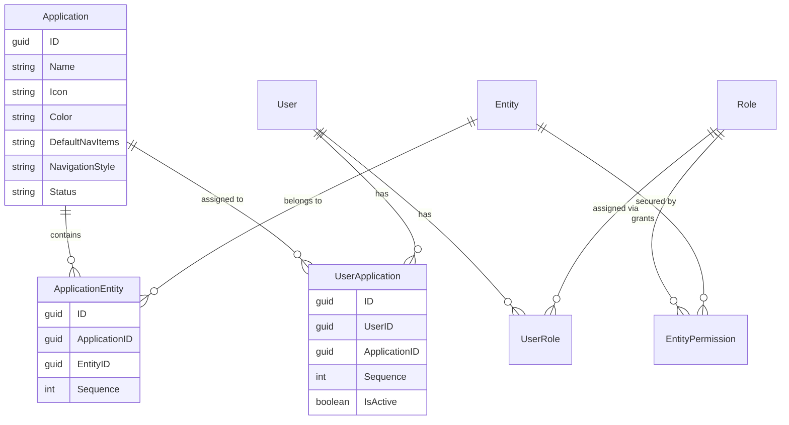
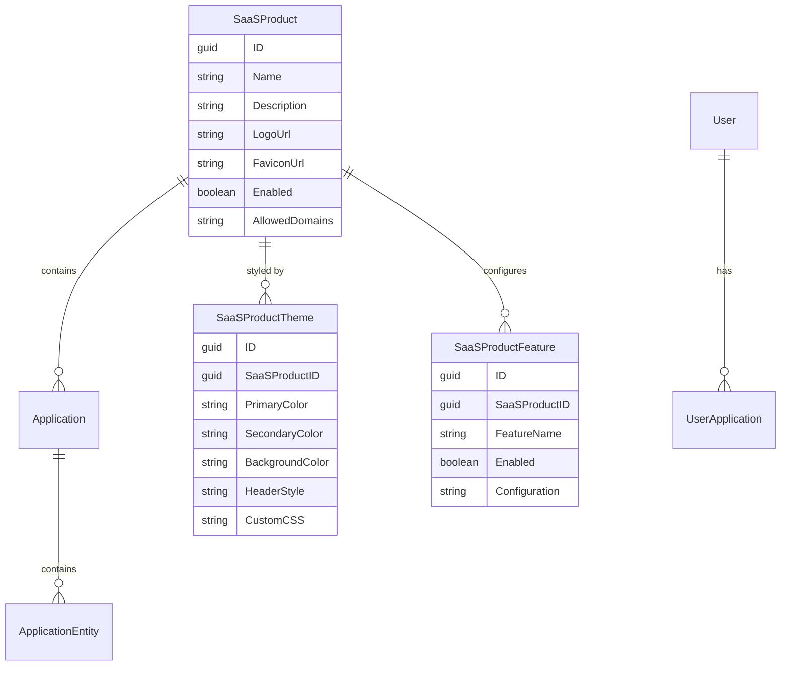
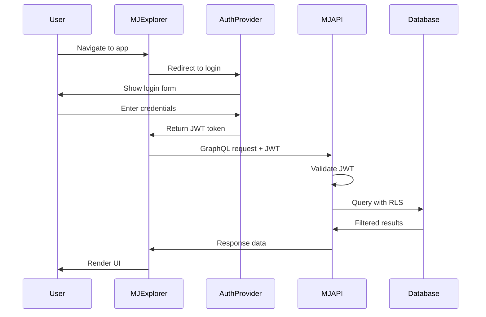
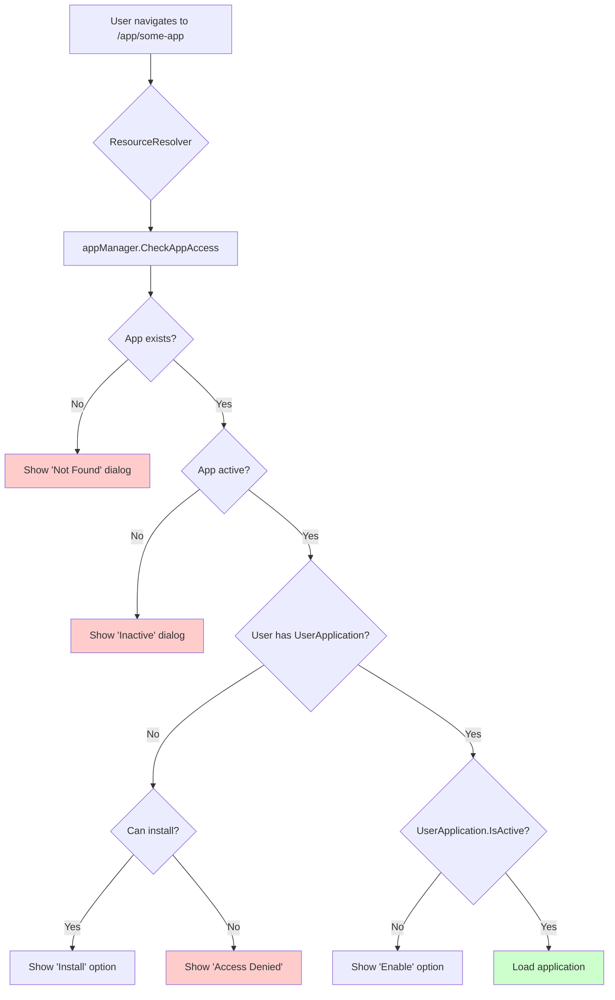
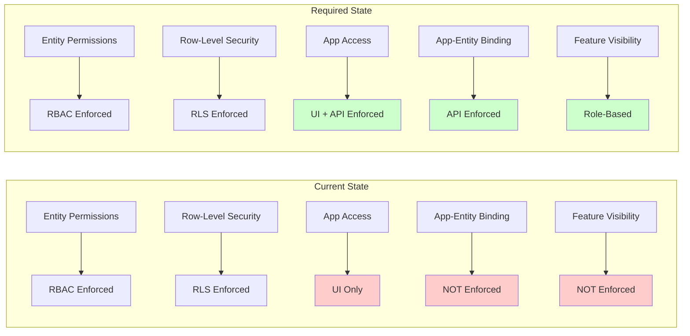
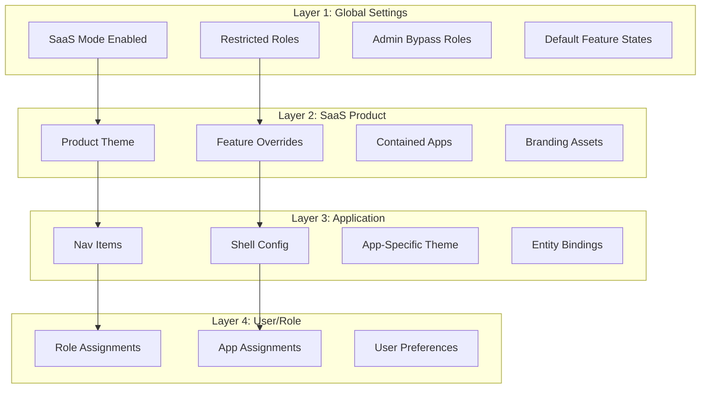
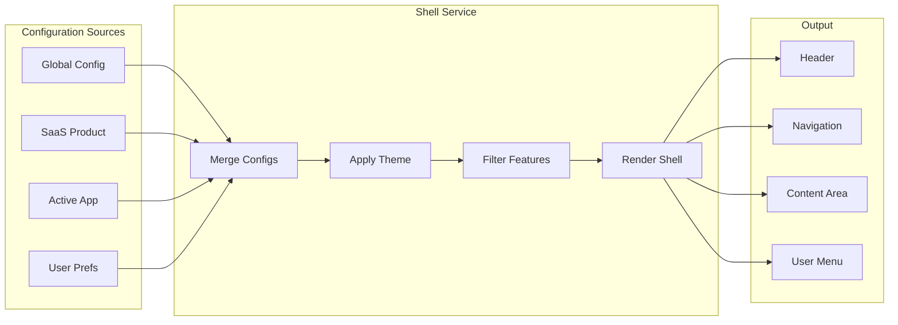

# MJExplorer SaaS Security & Customization Design

**Status:** Draft for Discussion
**Authors:** Architecture Team
**Created:** December 2024
**Last Updated:** December 2024

---

## Table of Contents

1. [Executive Summary](#executive-summary)
2. [Background: MemberJunction & SaaS Applications](#background-memberjunction--saas-applications)
3. [Current Architecture Analysis](#current-architecture-analysis)
4. [Security Gap Analysis](#security-gap-analysis)
5. [Proposed Solution Architecture](#proposed-solution-architecture)
6. [Configuration Model](#configuration-model)
7. [Theming System](#theming-system)
8. [Shell Customization](#shell-customization)
9. [Implementation Roadmap](#implementation-roadmap)
10. [Open Questions](#open-questions)
11. [Appendix: Current Code References](#appendix-current-code-references)

---

## Executive Summary

MJExplorer is a powerful, flexible application platform built on MemberJunction. While it excels for internal enterprise use cases, deploying it as the foundation for external-facing SaaS applications requires additional security controls and customization capabilities.

This document outlines:
- **Security gaps** that could allow external users to access unauthorized data or features
- **UI customization needs** to provide white-labeled, branded experiences
- **Configuration options** to lock down the platform for multi-tenant SaaS deployments

### Key Recommendations

1. **Introduce "SaaS Product" concept** - A logical grouping of MJ Applications for external-facing products
2. **Add shell customization controls** - Allow SaaS Products to control header, navigation, and chrome
3. **Implement theme system** - Centralize styling for consistent branding across deployments
4. **Restrict feature access by role** - Hide power-user features from external users
5. **Disable self-service app installation** - Admins control what external users can access

---

## Background: MemberJunction & SaaS Applications

### What is MemberJunction?

MemberJunction (MJ) is a metadata-driven application platform that provides:

- **Entity System**: Strongly-typed data access with automatic CRUD operations
- **Permissions**: Role-based access control (RBAC) with row-level security (RLS)
- **Applications**: Logical groupings of entities and functionality
- **MJExplorer**: The primary Angular-based UI for interacting with MJ data

### The MJ Application Model

```
┌─────────────────────────────────────────────────────────────────┐
│                    MemberJunction Platform                       │
├─────────────────────────────────────────────────────────────────┤
│  ┌─────────────┐  ┌─────────────┐  ┌─────────────┐              │
│  │   Admin     │  │    Data     │  │     AI      │   ...more    │
│  │    App      │  │  Explorer   │  │  Dashboard  │    apps      │
│  └─────────────┘  └─────────────┘  └─────────────┘              │
│         │                │                │                      │
│         └────────────────┼────────────────┘                      │
│                          ▼                                       │
│  ┌─────────────────────────────────────────────────────────────┐│
│  │                    Entity Layer                              ││
│  │   Customers │ Orders │ Products │ Users │ AI Prompts │ ...  ││
│  └─────────────────────────────────────────────────────────────┘│
│                          │                                       │
│  ┌─────────────────────────────────────────────────────────────┐│
│  │              Permissions (RBAC + RLS)                        ││
│  │   Entity Permissions │ Role Assignments │ RLS Filters        ││
│  └─────────────────────────────────────────────────────────────┘│
└─────────────────────────────────────────────────────────────────┘
```

### Current Application Relationships



### Internal vs. External Users

MJ was originally designed for **internal enterprise users** who:
- Have broad access to multiple applications
- Can install/uninstall apps themselves
- Need power features (global search, settings, admin tools)
- Are trusted with navigation flexibility

**External SaaS users** have different requirements:
- Limited to specific, pre-assigned applications
- Should not see or access internal tools
- Need branded, focused experiences
- Must be strictly isolated from other tenants' data

---

## The SaaS Product Concept

### Key Insight: SaaS Products ≠ MJ Applications

A **SaaS Product** (like "Izzy" - a customer service agent) may actually consist of **multiple MJ Applications**:

```
┌─────────────────────────────────────────────────────────────────┐
│                    "Izzy" SaaS Product                          │
│                                                                  │
│  ┌───────────────┐  ┌───────────────┐  ┌───────────────┐        │
│  │   Izzy Main   │  │    Izzy       │  │    Izzy       │        │
│  │   (Agent UI)  │  │   Settings    │  │   Analytics   │        │
│  │               │  │               │  │               │        │
│  │  - Chat       │  │  - Prompts    │  │  - Usage      │        │
│  │  - Tickets    │  │  - Workflows  │  │  - Reports    │        │
│  │  - Customers  │  │  - Team       │  │  - Trends     │        │
│  └───────────────┘  └───────────────┘  └───────────────┘        │
│                                                                  │
│  Shared: Branding, Theme, Permissions, Feature Restrictions     │
└─────────────────────────────────────────────────────────────────┘
```

### Why Multiple Apps Per Product?

1. **Separation of Concerns**: Different user personas need different interfaces
2. **Permission Granularity**: Admins vs. agents vs. viewers
3. **Navigation Clarity**: Focused experiences per use case
4. **Progressive Disclosure**: Users see only what they need

### Proposed Entity Model



---

## Current Architecture Analysis

### Authentication Flow



### Current Permission Enforcement

| Layer | What's Checked | Enforcement Point |
|-------|---------------|-------------------|
| **Authentication** | Valid JWT, Active User | MJServer auth middleware |
| **Entity CRUD** | CanCreate, CanRead, CanUpdate, CanDelete | GraphQL resolvers |
| **Row-Level Security** | RLS filter WHERE clauses | SQL query generation |
| **Application Access** | UserApplication records | UI only (ApplicationManager) |
| **Application Entities** | ApplicationEntity records | **NOT ENFORCED AT API** |

### Application Access Check Flow



---

## Security Gap Analysis

### Critical Gaps

#### 1. Application-Entity Binding Not Enforced at API

**Current Behavior:**
```
User assigned to: "Sales App" (contains: Customers, Orders)
User's Role grants: CanRead on ALL entities

RESULT: User can query ANY entity via GraphQL, not just Customers/Orders
```

**Required Behavior:**
```
User assigned to: "Sales App" (contains: Customers, Orders)
User's Role grants: CanRead on ALL entities
SaaS Mode: Enabled

RESULT: API rejects queries to entities not in user's assigned apps
```

#### 2. Self-Service App Installation

**Current:** Users can install any app marked with `DefaultForNewUser=false`

**Required:** For SaaS, only admins should assign apps to users

#### 3. Global Search Bypasses App Context

**Current:** Search bar searches across ALL entities user has permission to read

**Required:** Search limited to entities in user's assigned apps

#### 4. Foreign Key Navigation

**Current:** Clicking a FK link opens ANY related entity

**Required:** FK links to entities outside user's apps should be restricted

#### 5. Admin Features Visible to All

**Current:** Settings, Entity Admin, and other power features visible to all users

**Required:** Role-based visibility of administrative features

### Security Gap Summary Diagram



---

## Proposed Solution Architecture

### Layered Configuration Model



### Shell Rendering Pipeline



---

## Configuration Model

### Global SaaS Settings

These settings would be configured at the environment/deployment level:

```typescript
// mj.config.cjs or environment variables
module.exports = {
  saasMode: {
    // Master switch for SaaS restrictions
    enabled: true,

    // App installation control
    disableAppInstallation: true,      // Users cannot add apps
    disableAppUninstallation: true,    // Users cannot remove apps

    // Feature restrictions
    disableAppSwitcher: false,         // Can still switch between assigned apps
    disableGlobalSearch: true,         // No cross-app search
    disableSettings: true,             // Hide settings for non-admins
    disableNotifications: false,       // Keep notifications

    // Entity access enforcement
    enforceAppEntityBinding: true,     // API rejects queries outside app entities

    // Role configuration
    restrictedRoles: [                 // Roles subject to SaaS restrictions
      'External User',
      'Customer',
      'Partner'
    ],
    adminBypassRoles: [                // Roles exempt from restrictions
      'Administrator',
      'System Admin'
    ],

    // Branding
    defaultLogoUrl: null,              // Falls back to MJ logo
    defaultFaviconUrl: null,
  }
};
```

### SaaS Product Entity

New entity to group related applications:

```sql
CREATE TABLE __mj.SaaSProduct (
    ID UNIQUEIDENTIFIER PRIMARY KEY DEFAULT NEWSEQUENTIALID(),
    Name NVARCHAR(255) NOT NULL,
    Description NVARCHAR(MAX),

    -- Branding
    LogoUrl NVARCHAR(500),
    LogoWidth INT DEFAULT 120,
    FaviconUrl NVARCHAR(500),

    -- Domains (for multi-tenant routing)
    AllowedDomains NVARCHAR(MAX),      -- JSON array: ["app.customer.com"]

    -- Status
    Status NVARCHAR(20) DEFAULT 'Active',

    __mj_CreatedAt DATETIMEOFFSET DEFAULT GETUTCDATE(),
    __mj_UpdatedAt DATETIMEOFFSET DEFAULT GETUTCDATE()
);

CREATE TABLE __mj.SaaSProductApplication (
    ID UNIQUEIDENTIFIER PRIMARY KEY DEFAULT NEWSEQUENTIALID(),
    SaaSProductID UNIQUEIDENTIFIER NOT NULL REFERENCES __mj.SaaSProduct(ID),
    ApplicationID UNIQUEIDENTIFIER NOT NULL REFERENCES __mj.Application(ID),
    Sequence INT DEFAULT 0,
    IsDefault BIT DEFAULT 0,           -- Default app when product loads

    __mj_CreatedAt DATETIMEOFFSET DEFAULT GETUTCDATE(),
    __mj_UpdatedAt DATETIMEOFFSET DEFAULT GETUTCDATE()
);
```

### Application Shell Configuration

Extend the Application entity with shell control fields:

```sql
-- New columns on __mj.Application
ALTER TABLE __mj.Application ADD
    -- Shell display mode
    ShellMode NVARCHAR(20) DEFAULT 'standard',  -- 'standard', 'minimal', 'custom'

    -- Component visibility
    HideAppSwitcher BIT DEFAULT 0,
    HideTabBar BIT DEFAULT 0,
    HideNotifications BIT DEFAULT 0,
    HideSearch BIT DEFAULT 0,

    -- Branding overrides (override SaaS Product if set)
    CustomLogoUrl NVARCHAR(500),
    CustomLogoWidth INT,

    -- Theme overrides
    PrimaryColor NVARCHAR(20),         -- Hex color
    SecondaryColor NVARCHAR(20),
    HeaderBackground NVARCHAR(20),

    -- User menu customization
    UserMenuItems NVARCHAR(MAX),       -- JSON array of menu items

    -- Custom CSS escape hatch
    CustomCSS NVARCHAR(MAX);
```

### Feature Toggle Entity

Fine-grained control over individual features:

```sql
CREATE TABLE __mj.SaaSProductFeature (
    ID UNIQUEIDENTIFIER PRIMARY KEY DEFAULT NEWSEQUENTIALID(),
    SaaSProductID UNIQUEIDENTIFIER REFERENCES __mj.SaaSProduct(ID),
    ApplicationID UNIQUEIDENTIFIER REFERENCES __mj.Application(ID),

    FeatureName NVARCHAR(100) NOT NULL,
    Enabled BIT DEFAULT 1,
    RolesAllowed NVARCHAR(MAX),        -- JSON array of role names
    Configuration NVARCHAR(MAX),       -- Feature-specific JSON config

    __mj_CreatedAt DATETIMEOFFSET DEFAULT GETUTCDATE(),
    __mj_UpdatedAt DATETIMEOFFSET DEFAULT GETUTCDATE()
);
```

**Standard Feature Names:**
- `app-switcher`
- `global-search`
- `notifications`
- `settings`
- `tab-bar`
- `user-menu-settings`
- `user-menu-logout`
- `fk-navigation`
- `entity-admin`
- `export-data`

---

## Theming System

### Current State

Hardcoded values scattered across CSS files:

| Color | Value | Usage |
|-------|-------|-------|
| MJ Blue | `#264FAF` | Logo, loading screen |
| Material Blue | `#1976d2` | Buttons, links, focus states |
| Text Primary | `#424242` | Main text |
| Text Secondary | `#616161` | Secondary text |
| Text Muted | `#757575` | Muted text, icons |
| Background | `#fafafa` | Page background |
| Surface | `#ffffff` | Cards, panels |
| Border | `#e0e0e0` | Dividers, borders |
| Danger | `#e53935` | Errors, delete actions |
| Success | `#4caf50` | Success states |

### Proposed Theme Structure

```typescript
interface MJTheme {
  // Identification
  id: string;
  name: string;

  // Brand
  brand: {
    logoUrl: string;
    logoWidth: number;
    faviconUrl: string;
    primaryColor: string;      // Main brand color
    secondaryColor: string;    // Accent color
  };

  // Surfaces
  surfaces: {
    background: string;        // Page background
    surface: string;           // Cards, panels
    header: string;            // Header background
    headerBorder: string;      // Header bottom border
    sidebar: string;           // Sidebar background (if used)
  };

  // Text
  text: {
    primary: string;           // Main text
    secondary: string;         // Less prominent text
    muted: string;             // Disabled, hints
    inverse: string;           // Text on dark backgrounds
    link: string;              // Hyperlinks
  };

  // Interactive
  interactive: {
    hover: string;             // Hover backgrounds
    active: string;            // Active/selected backgrounds
    focus: string;             // Focus rings
    disabled: string;          // Disabled states
  };

  // Semantic
  semantic: {
    success: string;
    warning: string;
    danger: string;
    info: string;
  };

  // Borders & Shadows
  borders: {
    default: string;           // Standard borders
    subtle: string;            // Subtle dividers
    strong: string;            // Emphasized borders
  };

  shadows: {
    small: string;             // Subtle elevation
    medium: string;            // Cards, dropdowns
    large: string;             // Modals, dialogs
  };

  // Typography (optional overrides)
  typography?: {
    fontFamily?: string;
    headingFontFamily?: string;
  };
}
```

### Theme Service

```typescript
@Injectable({ providedIn: 'root' })
export class ThemeService {
  private currentTheme$ = new BehaviorSubject<MJTheme>(DEFAULT_THEME);

  // Apply theme to document
  applyTheme(theme: MJTheme): void {
    const root = document.documentElement;

    // Brand
    root.style.setProperty('--mj-brand-primary', theme.brand.primaryColor);
    root.style.setProperty('--mj-brand-secondary', theme.brand.secondaryColor);

    // Surfaces
    root.style.setProperty('--mj-surface-background', theme.surfaces.background);
    root.style.setProperty('--mj-surface-header', theme.surfaces.header);
    // ... etc

    // Update favicon
    this.updateFavicon(theme.brand.faviconUrl);

    this.currentTheme$.next(theme);
  }

  // Load theme from SaaS Product or Application
  async loadTheme(productId?: string, appId?: string): Promise<MJTheme> {
    // Merge: Default -> Product -> App
    let theme = { ...DEFAULT_THEME };

    if (productId) {
      const productTheme = await this.loadProductTheme(productId);
      theme = this.mergeThemes(theme, productTheme);
    }

    if (appId) {
      const appTheme = await this.loadAppTheme(appId);
      theme = this.mergeThemes(theme, appTheme);
    }

    return theme;
  }
}
```

### CSS Variable Usage

Convert hardcoded values to CSS variables:

```css
/* Before */
.header {
  background: white;
  border-bottom: 1px solid #e0e0e0;
}

.button-primary {
  background: #1976d2;
  color: white;
}

/* After */
.header {
  background: var(--mj-surface-header, white);
  border-bottom: 1px solid var(--mj-border-default, #e0e0e0);
}

.button-primary {
  background: var(--mj-brand-primary, #1976d2);
  color: var(--mj-text-inverse, white);
}
```

---

## Shell Customization

### Shell Modes

#### Standard Mode (Current)
Full MJExplorer experience with all features visible.

```
┌─────────────────────────────────────────────────────────────────────┐
│ [Logo] [☰] [NavApps] [AppSwitcher▼] [AppNavItems] ──── [🔍] [🔔] [👤▼] │
├─────────────────────────────────────────────────────────────────────┤
│ [Tab1] [Tab2] [Tab3] [+]                                            │
├─────────────────────────────────────────────────────────────────────┤
│                                                                      │
│                         Content Area                                 │
│                                                                      │
└─────────────────────────────────────────────────────────────────────┘
```

#### Minimal Mode
Reduced chrome for focused SaaS experiences.

```
┌─────────────────────────────────────────────────────────────────────┐
│ [CustomLogo] [AppNavItems] ─────────────────────────────────── [👤▼] │
├─────────────────────────────────────────────────────────────────────┤
│                                                                      │
│                         Content Area                                 │
│                                                                      │
└─────────────────────────────────────────────────────────────────────┘
```

- No app switcher (user only has access to this product's apps)
- No tab bar (single-focus experience)
- No global search
- No notifications
- Simplified user menu (profile, logout only)

#### Custom Mode
App provides custom header component entirely.

```
┌─────────────────────────────────────────────────────────────────────┐
│                     [Custom Header Component]                        │
├─────────────────────────────────────────────────────────────────────┤
│                                                                      │
│                         Content Area                                 │
│                                                                      │
└─────────────────────────────────────────────────────────────────────┘
```

### Shell Configuration Interface

```typescript
interface ShellConfig {
  // Mode selection
  mode: 'standard' | 'minimal' | 'custom';

  // Component visibility (for standard/minimal modes)
  components: {
    logo: boolean | { url: string; width: number };
    hamburgerMenu: boolean;
    appSwitcher: boolean;
    appNavItems: boolean;
    search: boolean;
    notifications: boolean;
    userMenu: boolean;
    tabBar: boolean;
  };

  // User menu items (when userMenu is true)
  userMenuItems: UserMenuItem[];

  // Custom header (for custom mode)
  customHeaderComponent?: Type<any>;

  // Theme overrides
  theme?: Partial<MJTheme>;
}

interface UserMenuItem {
  id: string;
  label: string;
  icon?: string;
  action: 'route' | 'function' | 'logout';
  route?: string;
  handler?: () => void;
  dividerBefore?: boolean;
  roles?: string[];  // Only show for these roles
}
```

### Example: Izzy SaaS Product Configuration

```typescript
// Izzy Main App - Agent Interface
const izzyMainShellConfig: ShellConfig = {
  mode: 'minimal',
  components: {
    logo: { url: '/assets/izzy-logo.svg', width: 100 },
    hamburgerMenu: false,
    appSwitcher: false,        // Hide - user can't switch apps
    appNavItems: true,         // Show Izzy's nav items
    search: false,             // No global search
    notifications: true,       // Show notifications
    userMenu: true,
    tabBar: false,             // Single-focus, no tabs
  },
  userMenuItems: [
    { id: 'profile', label: 'My Profile', icon: 'fa-user', action: 'route', route: '/profile' },
    { id: 'help', label: 'Help Center', icon: 'fa-question-circle', action: 'route', route: '/help' },
    { id: 'logout', label: 'Sign Out', icon: 'fa-sign-out', action: 'logout', dividerBefore: true },
  ],
  theme: {
    brand: {
      primaryColor: '#6366f1',  // Izzy purple
      secondaryColor: '#8b5cf6',
    }
  }
};

// Izzy Settings App - Admin Interface
const izzySettingsShellConfig: ShellConfig = {
  mode: 'minimal',
  components: {
    logo: { url: '/assets/izzy-logo.svg', width: 100 },
    hamburgerMenu: false,
    appSwitcher: true,         // Allow switching between Izzy apps
    appNavItems: true,
    search: false,
    notifications: true,
    userMenu: true,
    tabBar: true,              // Allow tabs for settings
  },
  userMenuItems: [
    { id: 'profile', label: 'My Profile', icon: 'fa-user', action: 'route', route: '/profile' },
    { id: 'settings', label: 'Settings', icon: 'fa-cog', action: 'route', route: '/settings', roles: ['Admin'] },
    { id: 'logout', label: 'Sign Out', icon: 'fa-sign-out', action: 'logout', dividerBefore: true },
  ]
};
```

### Multi-App Navigation Within SaaS Product

When a SaaS Product contains multiple apps, navigation between them:

```
┌─────────────────────────────────────────────────────────────────────┐
│                        "Izzy" SaaS Product                          │
│                                                                      │
│  Header: [IzzyLogo] [Agent|Settings|Analytics] ────────────── [👤▼] │
│                      ▲                                               │
│                      │                                               │
│          App switcher limited to Izzy apps only                      │
│          (not showing Admin, Data Explorer, etc.)                    │
│                                                                      │
└─────────────────────────────────────────────────────────────────────┘
```

---

## Implementation Roadmap

### Phase 1: Foundation (Security)

**Goal:** Lock down API-level access for SaaS deployments

1. **Global SaaS Mode Configuration**
   - Add `saasMode` config section to `mj.config.cjs`
   - Create `SaaSConfigService` to read and expose settings

2. **App-Entity Enforcement**
   - Add API-level check in GraphQL resolvers
   - When `enforceAppEntityBinding=true`, reject queries to entities not in user's apps

3. **Disable Self-Service App Installation**
   - When `disableAppInstallation=true`, hide "Install" button in access dialog
   - Return error from `InstallAppForUser()` API

### Phase 2: SaaS Product Entity

**Goal:** Enable grouping of apps into logical products

1. **Create SaaS Product Entities**
   - `SaaSProduct`, `SaaSProductApplication`, `SaaSProductTheme`
   - Migration scripts and CodeGen

2. **SaaS Product Service**
   - Load product configuration
   - Filter app switcher to product apps only
   - Apply product-level settings

### Phase 3: Shell Customization

**Goal:** Allow apps to control shell appearance

1. **Shell Configuration**
   - Add shell config fields to Application entity
   - Create `ShellConfigService` to merge configurations

2. **Component Visibility**
   - Conditional rendering based on config
   - Role-based feature hiding

3. **User Menu Customization**
   - Dynamic menu items from configuration
   - Role filtering for menu items

### Phase 4: Theming

**Goal:** Enable complete visual customization

1. **Theme Infrastructure**
   - Define CSS variables for all themeable properties
   - Create `ThemeService`

2. **CSS Variable Migration**
   - Convert hardcoded colors to CSS variables
   - Ensure fallback values for backwards compatibility

3. **Logo Customization**
   - Dynamic logo component
   - Favicon updates

### Phase 5: Advanced Features

**Goal:** Polish and additional capabilities

1. **Custom CSS Injection**
   - Secure CSS sanitization
   - Scoped CSS application

2. **Domain-Based Routing**
   - Route to SaaS Product based on domain
   - Multi-tenant deployment support

3. **White-Label Branding**
   - Login page customization
   - Email template customization
   - Error page customization

---

## Open Questions

### Architecture Questions

1. **Scope of Control**
   > Should apps be able to completely replace the shell, or just customize parts of it?

   Options:
   - A) Apps can only toggle/configure built-in components
   - B) Apps can provide custom header/footer components
   - C) Apps can provide entirely custom layouts

   *Recommendation: Start with (A), add (B) as needed*

2. **Theme Inheritance**
   > Should themes cascade (global → product → app → user preferences)?

   Options:
   - A) Flat: Each level completely overrides previous
   - B) Cascade: Properties merge, with later levels overriding specific values
   - C) Hybrid: Some properties cascade, others replace

   *Recommendation: (B) with deep merge*

3. **Configuration Storage**
   > Where should SaaS configurations live?

   Options:
   - A) Database entities (dynamic, requires API calls)
   - B) Configuration files (static, requires deployment)
   - C) Hybrid: Features in DB, secrets in config

   *Recommendation: (C) - DB for flexibility, config for security*

### Feature Questions

4. **User Menu**
   > What should appear in the user menu for SaaS users?

   Standard items to consider:
   - Profile / Account
   - Help / Documentation
   - Feedback
   - Settings (if allowed)
   - Sign Out

   *Should this be fully configurable per-app or product?*

5. **Branding Locations**
   > Beyond the header logo, where else should custom branding appear?

   Candidates:
   - [ ] Loading screen
   - [ ] Login page
   - [ ] Error pages (404, 500, etc.)
   - [ ] Email templates
   - [ ] PDF exports
   - [ ] Browser tab title
   - [ ] Favicon

   *Priority order?*

6. **CSS Escape Hatch**
   > Should apps/products be able to inject custom CSS?

   Risks:
   - Security (CSS injection attacks)
   - Maintenance (breaking changes)
   - Consistency (visual fragmentation)

   Mitigations:
   - CSP headers
   - CSS sanitization
   - Scoping/namespacing

   *Allow with safeguards, or disable entirely?*

7. **Multi-Tenant Considerations**
   > Should different tenants of the same SaaS product have different branding?

   Scenarios:
   - A) One brand per deployment (simpler)
   - B) Tenant-specific branding (reseller/white-label)

   *If (B), how is tenant identified? Subdomain? Login?*

### Security Questions

8. **Admin Bypass**
   > How do system admins bypass SaaS restrictions for maintenance?

   Options:
   - A) Specific bypass roles (e.g., "SaaS Admin")
   - B) Special URL parameter (security risk?)
   - C) Separate admin deployment

   *Recommendation: (A) with (C) for critical ops*

9. **FK Link Behavior**
   > When a user clicks an FK to an unauthorized entity, what should happen?

   Options:
   - A) Show "Access Denied" dialog
   - B) Hide the link entirely (can't click)
   - C) Show read-only summary (name only, no navigation)
   - D) Show link but open in "view only" mode

   *Trade-off: Usability vs. data leakage*

10. **Search Restrictions**
    > How should search behave in SaaS mode?

    Options:
    - A) Disable entirely
    - B) Search only current app's entities
    - C) Search only SaaS product's entities (across its apps)

    *Recommendation: (C) for best UX*

---

## Appendix: Current Code References

### Key Files

| Area | File | Purpose |
|------|------|---------|
| **Shell** | `packages/Angular/Explorer/explorer-core/src/lib/shell/shell.component.ts` | Main shell component |
| **Routing** | `packages/Angular/Explorer/explorer-core/src/app-routing.module.ts` | Route resolver with access checks |
| **App Manager** | `packages/Angular/Explorer/base-application/src/lib/application-manager.ts` | App loading and access control |
| **Base App** | `packages/Angular/Explorer/base-application/src/lib/base-application.ts` | App configuration interface |
| **Navigation** | `packages/Angular/Explorer/shared/src/lib/navigation.service.ts` | Tab/record navigation |
| **Resolver** | `packages/MJServer/src/generic/ResolverBase.ts` | GraphQL permission checks |
| **Entity Info** | `packages/MJCore/src/generic/entityInfo.ts` | RBAC permission logic |
| **Themes** | `packages/Angular/Explorer/explorer-core/src/lib/shell/loading-themes.ts` | Seasonal loading themes |

### Related Entities

| Entity | Table | Purpose |
|--------|-------|---------|
| Applications | `__mj.Application` | App definitions |
| Application Entities | `__mj.ApplicationEntity` | App-to-entity bindings |
| User Applications | `__mj.UserApplication` | User-to-app assignments |
| Entity Permissions | `__mj.EntityPermission` | RBAC permissions |
| Roles | `__mj.Role` | Role definitions |
| User Roles | `__mj.UserRole` | User-to-role assignments |
| Row Level Security Filters | `__mj.RowLevelSecurityFilter` | RLS filter definitions |

---

## Document History

| Date | Author | Changes |
|------|--------|---------|
| Dec 2024 | Architecture Team | Initial draft |

---

*This document is a living design specification. Please add comments and questions in the appropriate sections.*
