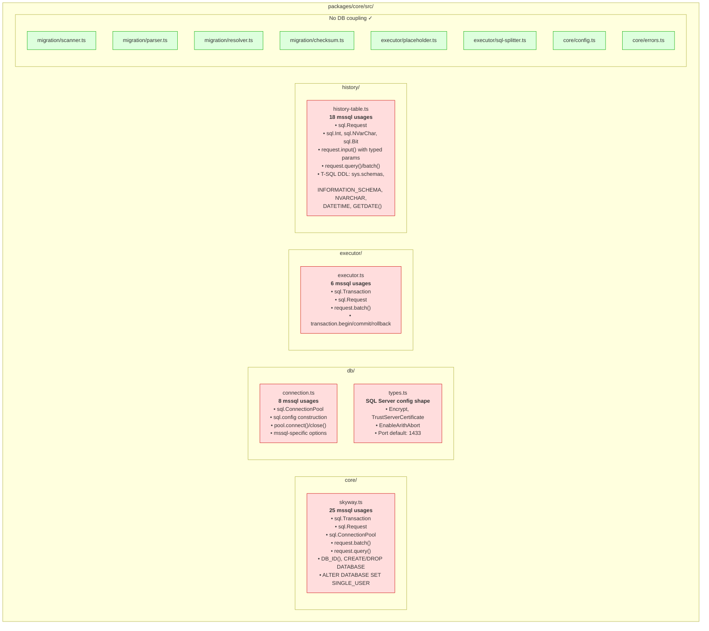
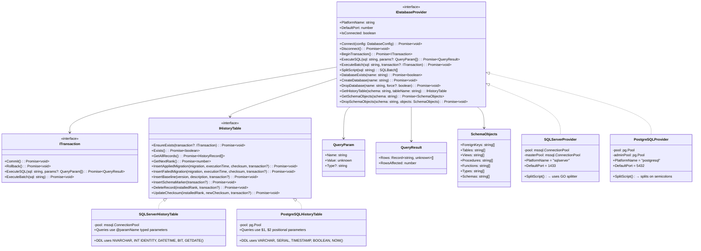
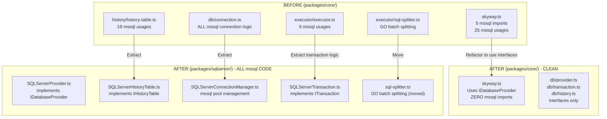
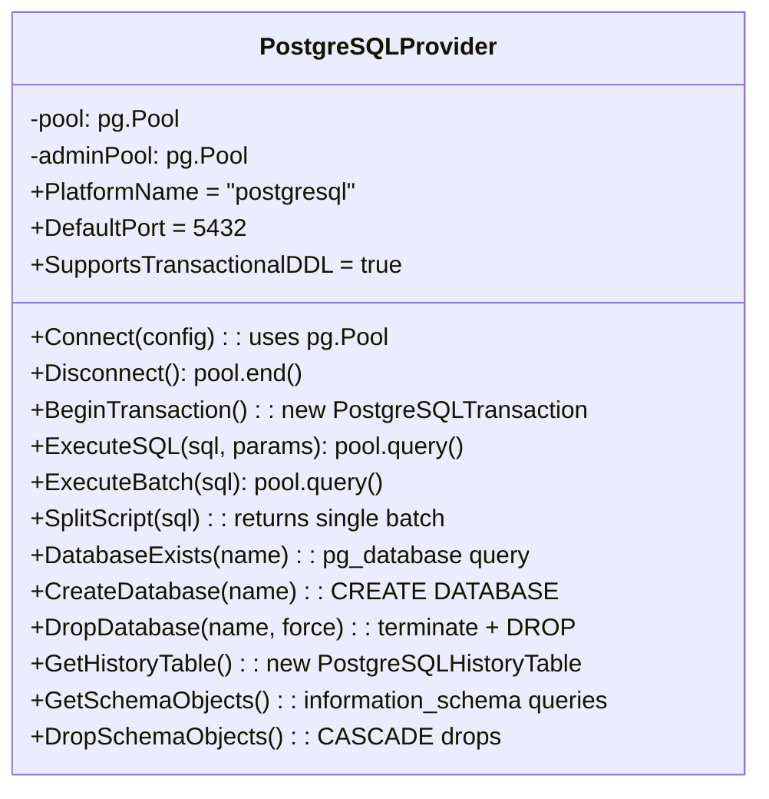
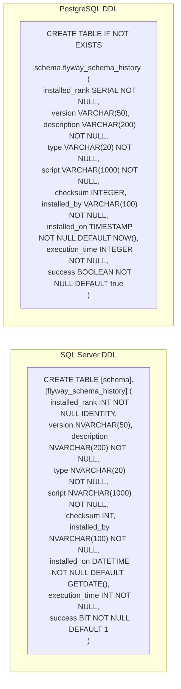
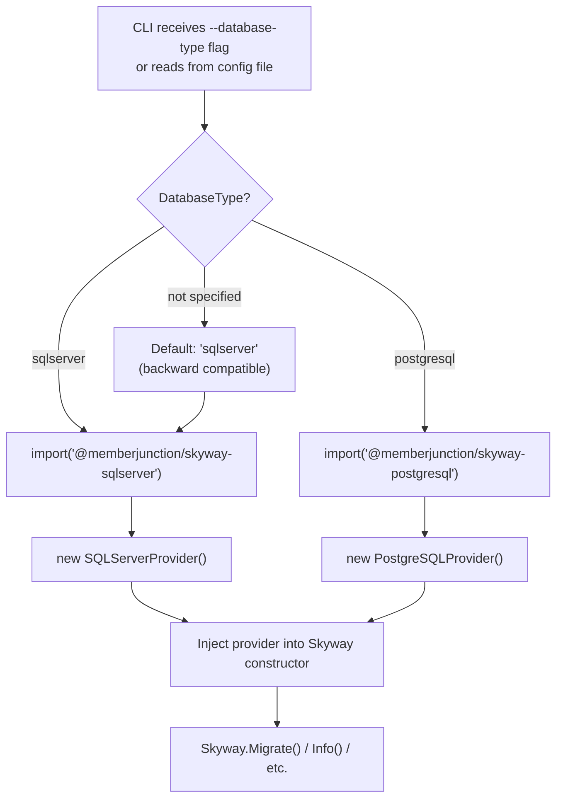
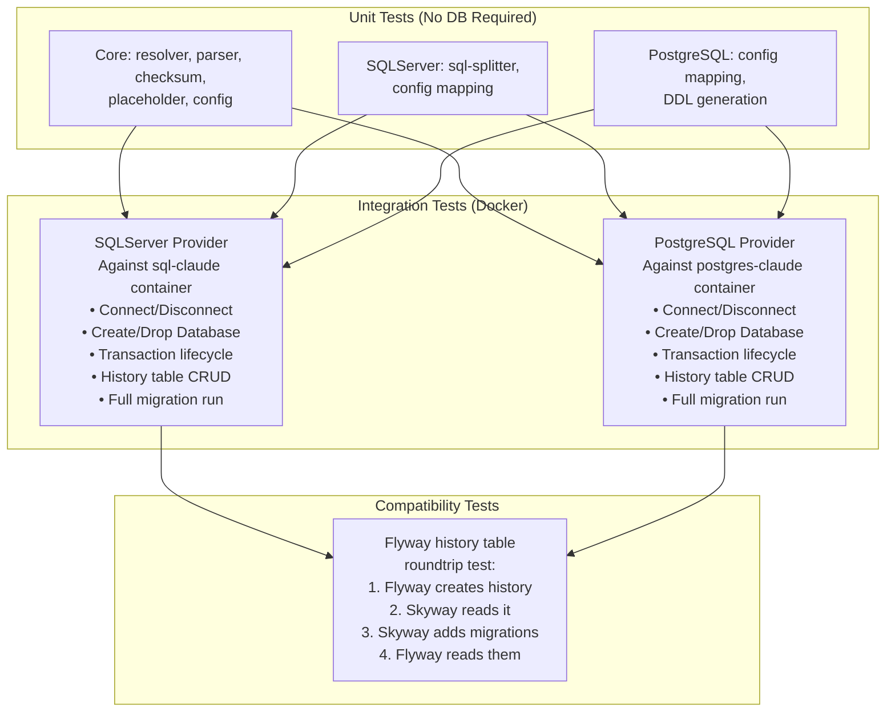
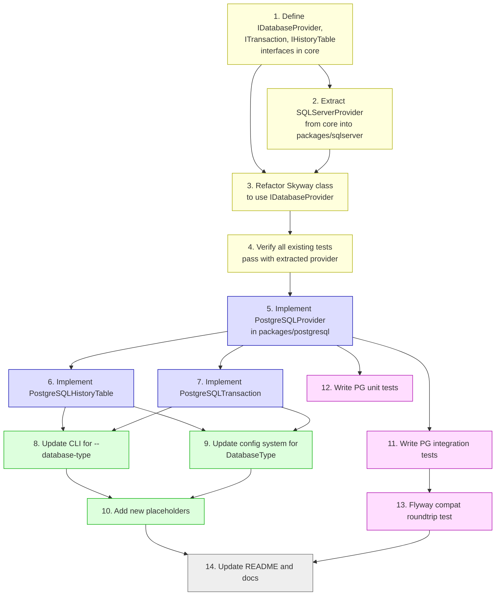

# Multi-Database Support for Skyway

**Status**: Draft
**Created**: 2026-02-16
**Author**: Architecture Team
**Target Version**: Skyway v1.0
**Repository**: https://github.com/MemberJunction/skyway
**Related**: [MJ Multi-Database Platform Support](./multi-database-platform-support.md)

---

## Table of Contents

1. [Executive Summary](#1-executive-summary)
2. [Current State Analysis](#2-current-state-analysis)
3. [Target Architecture](#3-target-architecture)
4. [Phase 1: Database Provider Interface](#4-phase-1-database-provider-interface)
5. [Phase 2: Extract SQLServerProvider](#5-phase-2-extract-sqlserverprovider)
6. [Phase 3: PostgreSQL Provider](#6-phase-3-postgresql-provider)
7. [Phase 4: CLI & Configuration Updates](#7-phase-4-cli--configuration-updates)
8. [Phase 5: Testing & Validation](#8-phase-5-testing--validation)
9. [Migration Directory Strategy](#9-migration-directory-strategy)
10. [Detailed Implementation Tasks](#10-detailed-implementation-tasks)

---

## 1. Executive Summary

Skyway is currently SQL Server-only. This plan refactors the core engine to introduce a **Database Provider** abstraction, extracts the existing SQL Server code into a provider implementation, and adds a PostgreSQL provider. The migration file format, history table schema, checksum algorithm, and Flyway compatibility are preserved exactly.

### Scope

- **In scope**: Provider interface, SQL Server provider extraction, PostgreSQL provider, CLI updates, configuration updates, testing
- **Out of scope**: New migration file formats, breaking API changes, non-SQL databases

### Key Constraint

Skyway's `per-run` transaction mode wraps ALL pending migrations in a single transaction. This relies on the database supporting **transactional DDL** (CREATE TABLE, ALTER TABLE, etc. inside transactions). Both SQL Server and PostgreSQL support this. MySQL does NOT. This means MySQL support would require `per-migration` mode only - a design consideration for the future but not a blocker for PostgreSQL.

---

## 2. Current State Analysis

### Where `mssql` Driver Is Used

Every file that touches the database directly imports `import * as sql from 'mssql'`. Here is the complete inventory:



### T-SQL Specific Patterns

| Location | T-SQL Pattern | PostgreSQL Equivalent |
|----------|--------------|----------------------|
| `connection.ts` | `encrypt`, `trustServerCertificate`, `enableArithAbort` options | `ssl`, `sslmode` options |
| `connection.ts` | Port default `1433` | Port default `5432` |
| `history-table.ts` | `NVARCHAR(50)`, `NVARCHAR(200)`, `NVARCHAR(1000)` | `VARCHAR(50)`, `VARCHAR(200)`, `VARCHAR(1000)` |
| `history-table.ts` | `INT NOT NULL IDENTITY` | `SERIAL` or `INTEGER GENERATED ALWAYS AS IDENTITY` |
| `history-table.ts` | `DATETIME DEFAULT GETDATE()` | `TIMESTAMP DEFAULT NOW()` |
| `history-table.ts` | `BIT NOT NULL DEFAULT 1` | `BOOLEAN NOT NULL DEFAULT true` |
| `history-table.ts` | `IF NOT EXISTS (SELECT 1 FROM sys.schemas WHERE name = ...)` | `CREATE SCHEMA IF NOT EXISTS ...` |
| `history-table.ts` | `EXEC('CREATE SCHEMA [...]')` | `CREATE SCHEMA IF NOT EXISTS ...` (direct DDL) |
| `history-table.ts` | `INFORMATION_SCHEMA.TABLES` | `information_schema.tables` (same but lowercase) |
| `history-table.ts` | `sql.Int`, `sql.NVarChar(n)`, `sql.Bit` typed params | `$1, $2, ...` positional params with inferred types |
| `skyway.ts` | `SELECT DB_ID('...')` | `SELECT 1 FROM pg_database WHERE datname = '...'` |
| `skyway.ts` | `CREATE DATABASE [...]` | `CREATE DATABASE ...` (no brackets) |
| `skyway.ts` | `ALTER DATABASE [...] SET SINGLE_USER WITH ROLLBACK IMMEDIATE` | `SELECT pg_terminate_backend(...) FROM pg_stat_activity` |
| `skyway.ts` | `DROP DATABASE [...]` | `DROP DATABASE ...` |
| `skyway.ts` (Clean) | `sys.foreign_keys`, `sys.tables`, `sys.views`, `sys.procedures`, `sys.objects`, `sys.types`, `sys.schemas` | `pg_catalog.pg_constraint`, `pg_catalog.pg_class`, `information_schema.routines`, `pg_catalog.pg_type`, `pg_catalog.pg_namespace` |
| `sql-splitter.ts` | `GO` batch separator | Not needed (PG executes full scripts; use `;` separation or `\gexec`) |

### Files That Need NO Changes

These modules are 100% database-agnostic and will work unchanged:

- `migration/scanner.ts` - filesystem operations only
- `migration/parser.ts` - regex filename parsing only
- `migration/resolver.ts` - pure data diffing logic
- `migration/checksum.ts` - CRC32 computation only
- `executor/placeholder.ts` - string substitution only
- `core/config.ts` - config resolution only (needs minor extension for `DatabaseType`)
- `core/errors.ts` - error class definitions only

The `executor/sql-splitter.ts` is SQL Server specific (splits on `GO`), but the provider pattern will handle this - SQL Server provider uses it, PostgreSQL provider does not need it (PG handles multi-statement scripts natively with `;` separators).

---

## 3. Target Architecture

### Package Structure

```mermaid
graph TB
    subgraph "@memberjunction/skyway-core"
        CORE_IF["Database Provider Interface<br/><i>IDatabaseProvider</i>"]
        CORE_ENGINE["Migration Engine<br/><i>Skyway class (refactored)</i>"]
        CORE_HIST_IF["History Table Interface<br/><i>IHistoryTable</i>"]
        CORE_UTIL["Shared Utilities<br/><i>scanner, parser, resolver,<br/>checksum, placeholder, config</i>"]
        CORE_ENGINE --> CORE_IF & CORE_HIST_IF
        CORE_ENGINE --> CORE_UTIL
    end

    subgraph "@memberjunction/skyway-sqlserver"
        SS_PROV["SQLServerProvider<br/><i>implements IDatabaseProvider</i>"]
        SS_HIST["SQLServerHistoryTable<br/><i>implements IHistoryTable</i>"]
        SS_CONN["SQLServerConnectionManager<br/><i>mssql pool management</i>"]
        SS_SPLIT["GO Splitter<br/><i>sql-splitter.ts (moved)</i>"]
        SS_PROV --> SS_CONN & SS_HIST & SS_SPLIT
    end

    subgraph "@memberjunction/skyway-postgresql"
        PG_PROV["PostgreSQLProvider<br/><i>implements IDatabaseProvider</i>"]
        PG_HIST["PostgreSQLHistoryTable<br/><i>implements IHistoryTable</i>"]
        PG_CONN["PostgreSQLConnectionManager<br/><i>pg pool management</i>"]
        PG_PROV --> PG_CONN & PG_HIST
    end

    subgraph "@memberjunction/skyway-cli"
        CLI["CLI Entry Point<br/><i>commander + provider loading</i>"]
    end

    CLI --> CORE_ENGINE
    CLI -->|"--database-type sqlserver"| SS_PROV
    CLI -->|"--database-type postgresql"| PG_PROV
    CORE_IF <|.. SS_PROV
    CORE_IF <|.. PG_PROV
    CORE_HIST_IF <|.. SS_HIST
    CORE_HIST_IF <|.. PG_HIST
```

### Class Diagram



---

## 4. Phase 1: Database Provider Interface

### New File: `packages/core/src/db/provider.ts`

This is the core abstraction that all database-specific code will implement.

```typescript
/**
 * Interface for database-specific operations.
 * Each supported database platform implements this interface.
 */
export interface IDatabaseProvider {
    /** Human-readable platform name (e.g., "sqlserver", "postgresql") */
    readonly PlatformName: string;

    /** Default port for this database platform */
    readonly DefaultPort: number;

    /** Whether transactions support DDL operations (CREATE TABLE, etc.) */
    readonly SupportsTransactionalDDL: boolean;

    // --- Connection Lifecycle ---
    Connect(config: DatabaseConfig): Promise<void>;
    Disconnect(): Promise<void>;
    readonly IsConnected: boolean;

    // --- Transaction Management ---
    BeginTransaction(): Promise<ITransaction>;

    // --- Query Execution (outside transaction) ---
    ExecuteSQL(sql: string, params?: QueryParam[]): Promise<QueryResult>;
    ExecuteBatch(sql: string): Promise<void>;

    // --- Script Processing ---
    /**
     * Splits a migration script into executable batches.
     * SQL Server: splits on GO separators.
     * PostgreSQL: returns script as single batch (PG handles ; internally).
     */
    SplitScript(scriptContent: string): SQLBatch[];

    // --- Database Management ---
    DatabaseExists(name: string): Promise<boolean>;
    CreateDatabase(name: string): Promise<void>;
    DropDatabase(name: string, force?: boolean): Promise<void>;

    // --- History Table ---
    GetHistoryTable(schema: string, tableName: string): IHistoryTable;

    // --- Schema Introspection (for Clean command) ---
    GetSchemaObjects(schema: string): Promise<SchemaObjects>;
    DropSchemaObjects(schema: string, objects: SchemaObjects, dryRun: boolean): Promise<string[]>;
}
```

### Transaction Interface: `packages/core/src/db/transaction.ts`

```typescript
/**
 * Represents an active database transaction.
 * Provider-specific implementations wrap the native transaction object.
 */
export interface ITransaction {
    /** Execute a SQL query within this transaction */
    ExecuteSQL(sql: string, params?: QueryParam[]): Promise<QueryResult>;

    /** Execute a batch of SQL within this transaction (no result set expected) */
    ExecuteBatch(sql: string): Promise<void>;

    /** Commit the transaction */
    Commit(): Promise<void>;

    /** Rollback the transaction */
    Rollback(): Promise<void>;
}
```

### History Table Interface: `packages/core/src/db/history.ts`

```typescript
/**
 * Interface for history table operations.
 * Abstracts the flyway_schema_history table management
 * so each database provider can use its native DDL and query syntax.
 */
export interface IHistoryTable {
    /** Ensure the history table (and schema) exists, creating if needed */
    EnsureExists(transaction?: ITransaction): Promise<void>;

    /** Check if the history table exists */
    Exists(): Promise<boolean>;

    /** Get all history records ordered by installed_rank */
    GetAllRecords(): Promise<HistoryRecord[]>;

    /** Get the next available installed_rank value */
    GetNextRank(): Promise<number>;

    /** Record a successfully applied migration */
    InsertAppliedMigration(
        migration: MigrationInfo,
        executionTimeMs: number,
        checksum: number,
        transaction?: ITransaction
    ): Promise<void>;

    /** Record a failed migration */
    InsertFailedMigration(
        migration: MigrationInfo,
        executionTimeMs: number,
        checksum: number,
        transaction?: ITransaction
    ): Promise<void>;

    /** Record a baseline entry */
    InsertBaseline(version: string, description: string, transaction?: ITransaction): Promise<void>;

    /** Record a schema creation marker */
    InsertSchemaMarker(transaction?: ITransaction): Promise<void>;

    /** Delete a specific record by installed_rank */
    DeleteRecord(installedRank: number, transaction?: ITransaction): Promise<void>;

    /** Update the checksum of a specific record */
    UpdateChecksum(installedRank: number, newChecksum: number, transaction?: ITransaction): Promise<void>;
}
```

### Deliverables

- [ ] `IDatabaseProvider` interface
- [ ] `ITransaction` interface
- [ ] `IHistoryTable` interface
- [ ] `QueryParam`, `QueryResult`, `SchemaObjects` types
- [ ] `SQLBatch` type (already exists, may need minor updates)
- [ ] Export all interfaces from core package

---

## 5. Phase 2: Extract SQLServerProvider

### Refactoring Strategy

Extract all `mssql`-specific code from the core package into a new `@memberjunction/skyway-sqlserver` package, implementing the interfaces defined in Phase 1.



### SQLServerProvider Implementation Mapping

| Current Location | Current Method/Logic | New Location |
|-----------------|---------------------|-------------|
| `connection.ts`: `ConnectionManager.Connect()` | `new sql.ConnectionPool(config).connect()` | `SQLServerProvider.Connect()` |
| `connection.ts`: `ConnectionManager.ConnectToMaster()` | Pool to `master` database | `SQLServerProvider` internal (for CreateDatabase/DropDatabase) |
| `connection.ts`: mssql config construction | `encrypt`, `trustServerCertificate`, etc. | `SQLServerProvider` internal config mapping |
| `skyway.ts`: `new sql.Transaction(pool)` | Transaction creation | `SQLServerProvider.BeginTransaction()` → returns `SQLServerTransaction` |
| `skyway.ts`: `request.batch(sql)` | Batch execution within transaction | `SQLServerTransaction.ExecuteBatch()` |
| `skyway.ts`: `request.query(sql)` | Query execution | `SQLServerProvider.ExecuteSQL()` |
| `skyway.ts`: `SELECT DB_ID('...')` | Database existence check | `SQLServerProvider.DatabaseExists()` |
| `skyway.ts`: `CREATE DATABASE [...]` | DB creation | `SQLServerProvider.CreateDatabase()` |
| `skyway.ts`: `ALTER DATABASE SET SINGLE_USER` + `DROP DATABASE` | DB deletion | `SQLServerProvider.DropDatabase()` |
| `skyway.ts`: Clean() sys.* queries | Schema introspection | `SQLServerProvider.GetSchemaObjects()` |
| `skyway.ts`: Clean() DROP statements | Object cleanup | `SQLServerProvider.DropSchemaObjects()` |
| `history-table.ts`: all methods | History CRUD with `sql.Request`, typed params | `SQLServerHistoryTable` (all methods) |
| `sql-splitter.ts`: `SplitOnGO()` | GO batch splitting | Moved to sqlserver package; `SQLServerProvider.SplitScript()` uses it |

### Refactored Skyway Class (Simplified)

After extraction, the `Skyway` class becomes database-agnostic:

```typescript
class Skyway {
    private provider: IDatabaseProvider;

    constructor(config: SkywayConfig) {
        // Provider is injected or resolved from config
        this.provider = config.provider ?? resolveProvider(config);
    }

    async Migrate(): Promise<MigrateResult> {
        await this.provider.Connect(this.config.Database);

        const historyTable = this.provider.GetHistoryTable(
            this.config.Migrations.DefaultSchema,
            this.config.Migrations.HistoryTable
        );
        await historyTable.EnsureExists();

        const discovered = await ScanAndResolveMigrations(...);
        const history = await historyTable.GetAllRecords();
        const pending = ResolveMigrations(discovered, history, ...);

        // Execute based on transaction mode
        if (this.config.Migrations.TransactionMode === 'per-run') {
            await this.executePerRun(pending, historyTable);
        } else {
            await this.executePerMigration(pending, historyTable);
        }
    }

    private async executeSingle(migration: ResolvedMigration, transaction: ITransaction): Promise<void> {
        let sql = SubstitutePlaceholders(migration.Content, this.placeholderContext);
        const batches = this.provider.SplitScript(sql);

        for (const batch of batches) {
            for (let i = 0; i < batch.RepeatCount; i++) {
                await transaction.ExecuteBatch(batch.SQL);
            }
        }
    }

    // Clean, CreateDatabase, DropDatabase all delegate to this.provider
}
```

### New Package Structure

```
packages/sqlserver/
  package.json        → @memberjunction/skyway-sqlserver
  src/
    index.ts
    SQLServerProvider.ts
    SQLServerTransaction.ts
    SQLServerHistoryTable.ts
    SQLServerConnectionManager.ts
    sql-splitter.ts       (moved from core)
    __tests__/
      sql-splitter.test.ts (moved from core)
      SQLServerHistoryTable.test.ts
```

### Deliverables

- [ ] Create `packages/sqlserver/` package
- [ ] Extract `SQLServerProvider` implementing `IDatabaseProvider`
- [ ] Extract `SQLServerTransaction` implementing `ITransaction`
- [ ] Extract `SQLServerHistoryTable` implementing `IHistoryTable`
- [ ] Extract `SQLServerConnectionManager` (pool management)
- [ ] Move `sql-splitter.ts` and its tests to sqlserver package
- [ ] Refactor `Skyway` class to use `IDatabaseProvider` interface only
- [ ] Remove `mssql` dependency from `@memberjunction/skyway-core`
- [ ] Remove `executor.ts` standalone executor (consolidate into Skyway class using provider)
- [ ] All existing tests pass unchanged
- [ ] No behavioral changes - pure refactor

---

## 6. Phase 3: PostgreSQL Provider

### New Package: `@memberjunction/skyway-postgresql`

```
packages/postgresql/
  package.json        → @memberjunction/skyway-postgresql
  src/
    index.ts
    PostgreSQLProvider.ts
    PostgreSQLTransaction.ts
    PostgreSQLHistoryTable.ts
    PostgreSQLConnectionManager.ts
    __tests__/
      PostgreSQLHistoryTable.test.ts
      PostgreSQLProvider.test.ts
```

### PostgreSQLProvider Implementation



### Key Implementation Differences

#### Script Splitting

SQL Server requires splitting on `GO` because `mssql` driver's `batch()` method executes one batch at a time. PostgreSQL's `pg` driver can execute multi-statement scripts directly (separated by `;`), so no splitting is needed:

```typescript
// SQLServerProvider
SplitScript(scriptContent: string): SQLBatch[] {
    return SplitOnGO(scriptContent); // Complex GO parsing
}

// PostgreSQLProvider
SplitScript(scriptContent: string): SQLBatch[] {
    // PG handles ; separation natively
    // Return the entire script as one batch
    return [{
        SQL: scriptContent,
        StartLine: 1,
        RepeatCount: 1
    }];
}
```

**Important caveat**: If a PostgreSQL migration file contains SQL that creates a function with `$$` delimiters, the simple "single batch" approach works because `pg` handles `$$` correctly. No special parsing needed.

#### History Table DDL



**Flyway compatibility note**: The history table schema is identical to what Flyway creates for each respective database. This means an existing Flyway-managed PostgreSQL database can be taken over by Skyway seamlessly.

#### Database Management

```typescript
// PostgreSQLProvider
async DatabaseExists(name: string): Promise<boolean> {
    const result = await this.adminPool.query(
        'SELECT 1 FROM pg_database WHERE datname = $1',
        [name]
    );
    return result.rowCount > 0;
}

async CreateDatabase(name: string): Promise<void> {
    // Note: CREATE DATABASE cannot run inside a transaction in PG
    await this.adminPool.query(`CREATE DATABASE "${name}"`);
}

async DropDatabase(name: string, force: boolean): Promise<void> {
    if (force) {
        // Terminate active connections (PG equivalent of SET SINGLE_USER)
        await this.adminPool.query(`
            SELECT pg_terminate_backend(pid)
            FROM pg_stat_activity
            WHERE datname = $1 AND pid <> pg_backend_pid()
        `, [name]);
    }
    await this.adminPool.query(`DROP DATABASE IF EXISTS "${name}"`);
}
```

#### Schema Introspection (Clean Command)

```typescript
// PostgreSQLProvider
async GetSchemaObjects(schema: string): Promise<SchemaObjects> {
    const client = await this.pool.connect();
    try {
        // Foreign keys
        const fks = await client.query(`
            SELECT conname AS name,
                   conrelid::regclass::text AS table_name
            FROM pg_catalog.pg_constraint
            WHERE connamespace = $1::regnamespace
              AND contype = 'f'
        `, [schema]);

        // Tables
        const tables = await client.query(`
            SELECT tablename AS name
            FROM pg_catalog.pg_tables
            WHERE schemaname = $1
        `, [schema]);

        // Views
        const views = await client.query(`
            SELECT viewname AS name
            FROM pg_catalog.pg_views
            WHERE schemaname = $1
        `, [schema]);

        // Functions and procedures
        const routines = await client.query(`
            SELECT routine_name AS name, routine_type
            FROM information_schema.routines
            WHERE routine_schema = $1
        `, [schema]);

        // Custom types
        const types = await client.query(`
            SELECT t.typname AS name
            FROM pg_catalog.pg_type t
            JOIN pg_catalog.pg_namespace n ON t.typnamespace = n.oid
            WHERE n.nspname = $1
              AND t.typtype IN ('c', 'e', 'd')
        `, [schema]);

        return {
            ForeignKeys: fks.rows.map(r => ({ name: r.name, tableName: r.table_name })),
            Tables: tables.rows.map(r => r.name),
            Views: views.rows.map(r => r.name),
            Procedures: routines.rows.filter(r => r.routine_type === 'PROCEDURE').map(r => r.name),
            Functions: routines.rows.filter(r => r.routine_type === 'FUNCTION').map(r => r.name),
            Types: types.rows.map(r => r.name),
            Schemas: [schema]
        };
    } finally {
        client.release();
    }
}
```

#### Parameterized Queries

SQL Server uses named parameters (`@paramName` with typed `sql.NVarChar(200)`). PostgreSQL uses positional parameters (`$1, $2, ...` with inferred types):

```typescript
// SQLServerHistoryTable
async InsertAppliedMigration(migration, execTime, checksum, transaction?) {
    const request = new sql.Request(transaction ?? this.pool);
    request.input('installed_rank', sql.Int, rank);
    request.input('version', sql.NVarChar(50), migration.Version);
    request.input('description', sql.NVarChar(200), migration.Description);
    // ... more typed inputs
    await request.query('INSERT INTO ... VALUES (@installed_rank, @version, ...)');
}

// PostgreSQLHistoryTable
async InsertAppliedMigration(migration, execTime, checksum, transaction?) {
    const sql = `INSERT INTO "${this.schema}"."${this.tableName}"
        (installed_rank, version, description, type, script, checksum,
         installed_by, execution_time, success)
        VALUES ($1, $2, $3, $4, $5, $6, $7, $8, $9)`;
    const params = [rank, migration.Version, migration.Description,
                    migration.Type, migration.ScriptPath, checksum,
                    this.installedBy, execTime, true];
    await this.execute(sql, params, transaction);
}
```

### Deliverables

- [ ] Create `packages/postgresql/` package with `pg` dependency
- [ ] `PostgreSQLProvider` implementing `IDatabaseProvider`
- [ ] `PostgreSQLTransaction` implementing `ITransaction`
- [ ] `PostgreSQLHistoryTable` implementing `IHistoryTable`
- [ ] `PostgreSQLConnectionManager` (pg.Pool management)
- [ ] Database existence check via `pg_database`
- [ ] Create/Drop database support
- [ ] Schema introspection via `pg_catalog` + `information_schema`
- [ ] Clean command support (CASCADE drops in correct order)
- [ ] Unit tests with mocked `pg` driver
- [ ] Integration tests against Docker PostgreSQL

---

## 7. Phase 4: CLI & Configuration Updates

### Configuration Extension

```typescript
// Updated DatabaseConfig in core/src/db/types.ts
interface DatabaseConfig {
    /** Database platform type */
    DatabaseType?: 'sqlserver' | 'postgresql';

    // Common fields
    Server: string;
    Port?: number;        // Defaults to platform-specific (1433 or 5432)
    Database: string;
    User: string;
    Password: string;

    // SQL Server specific
    Encrypt?: boolean;
    TrustServerCertificate?: boolean;
    EnableArithAbort?: boolean;

    // PostgreSQL specific
    SSL?: boolean | pg.ConnectionConfig['ssl'];
    ApplicationName?: string;
}
```

### Provider Resolution



### CLI Flag Updates

```
skyway migrate [options]

New options:
  --database-type <type>   Database platform: sqlserver (default) | postgresql

Updated environment variables:
  SKYWAY_DATABASE_TYPE     Database platform type
  DB_TYPE                  Alias for SKYWAY_DATABASE_TYPE

Config file (skyway.json):
{
  "Database": {
    "DatabaseType": "postgresql",
    "Server": "localhost",
    "Port": 5432,
    "Database": "my_app",
    "User": "mj_admin",
    "Password": "secret"
  }
}
```

### Placeholder Updates

Add new built-in placeholders for PostgreSQL compatibility:

| Placeholder | SQL Server Value | PostgreSQL Value |
|-------------|-----------------|-----------------|
| `${flyway:defaultSchema}` | Config schema (e.g., `__mj`) | Same |
| `${skyway:databaseType}` | `sqlserver` | `postgresql` |
| `${skyway:quoteOpen}` | `[` | `"` |
| `${skyway:quoteClose}` | `]` | `"` |

### Deliverables

- [ ] Add `DatabaseType` to `DatabaseConfig`
- [ ] Provider resolution function in CLI
- [ ] `--database-type` CLI flag
- [ ] `SKYWAY_DATABASE_TYPE` / `DB_TYPE` environment variable support
- [ ] Config file `DatabaseType` support
- [ ] New built-in placeholders (`skyway:databaseType`, `skyway:quoteOpen`, `skyway:quoteClose`)
- [ ] Default to `sqlserver` for backward compatibility
- [ ] Update CLI help text and README
- [ ] Port auto-detection based on DatabaseType

---

## 8. Phase 5: Testing & Validation

### Test Strategy



### Key Test Scenarios for PostgreSQL Provider

1. **History table lifecycle**: Create schema → Create table → Insert records → Read records → Update checksum → Delete record
2. **Transaction modes**: `per-run` (single transaction wrapping all migrations), `per-migration` (one transaction each)
3. **DDL in transactions**: Verify that CREATE TABLE, ALTER TABLE work inside PG transactions
4. **Baseline handling**: Fresh DB with baseline migration skips older versions
5. **Repeatable migrations**: Checksum change detection and re-execution
6. **Clean command**: Drop all objects in schema in correct order (FKs first, then tables, then functions, then types, then schemas)
7. **Create/Drop database**: Including force-drop with active connections
8. **Placeholder substitution**: `${flyway:defaultSchema}` works in PG context
9. **Large scripts**: Scripts > 4000 chars execute correctly (Skyway's advantage over Flyway)
10. **Error handling**: Migration failure rolls back transaction; history records failure

### Deliverables

- [ ] Unit tests for PostgreSQL provider (mocked `pg`)
- [ ] Integration test suite for PostgreSQL (Docker)
- [ ] Integration test suite for SQL Server (Docker, validate no regressions)
- [ ] Flyway compatibility roundtrip test
- [ ] CI configuration running both test suites
- [ ] Test migration files for PostgreSQL (PL/pgSQL scripts)

---

## 9. Migration Directory Strategy

### Recommended Directory Layout for MJ

```
migrations/
  sqlserver/              # SQL Server migrations
    v2/                   # Historical (frozen)
    v3/                   # v3.x migrations
    v4/                   # v4.x migrations
    R__RefreshMetadata.sql
  postgresql/             # PostgreSQL migrations
    v5/                   # Starting from v5.0 (first PG-supported version)
    R__RefreshMetadata.sql
```

### Skyway Configuration for MJ

```javascript
// skyway.json (or programmatic config via MJCLI)
{
  "Database": {
    "DatabaseType": "postgresql",
    "Server": "postgres-claude",
    "Port": 5432,
    "Database": "MJ_Workbench",
    "User": "mj_admin",
    "Password": "Claude2Pg99"
  },
  "Migrations": {
    "Locations": ["./migrations/postgresql"],
    "DefaultSchema": "__mj",
    "HistoryTable": "flyway_schema_history",
    "BaselineOnMigrate": true,
    "BaselineVersion": "202603010000",
    "TransactionMode": "per-run"
  }
}
```

The `Locations` array points to the platform-specific directory. The MJCLI sets this automatically based on `databaseType` from `mj.config.cjs`.

---

## 10. Detailed Implementation Tasks

### Task Dependency Graph



**Legend**: Yellow = refactor existing, Blue = new PostgreSQL code, Green = config/CLI, Purple = testing, Gray = docs

### Estimated Scope

| Task | Files Changed/Created | Estimated Complexity |
|------|----------------------|---------------------|
| 1. Interfaces | 3 new files in core | Low |
| 2. Extract SQLServer | 5 new files, 4 refactored | Medium-High |
| 3. Refactor Skyway | 1 major refactor (~800 lines) | High |
| 4. Verify tests | 0 files, test runs | Low |
| 5-7. PostgreSQL Provider | 5 new files | Medium |
| 8-9. CLI/Config | 3 files modified | Low |
| 10. Placeholders | 1 file modified | Low |
| 11-13. Testing | 5+ new test files | Medium |
| 14. Documentation | 2-3 files | Low |
