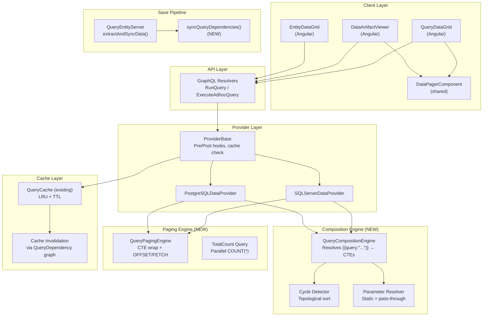
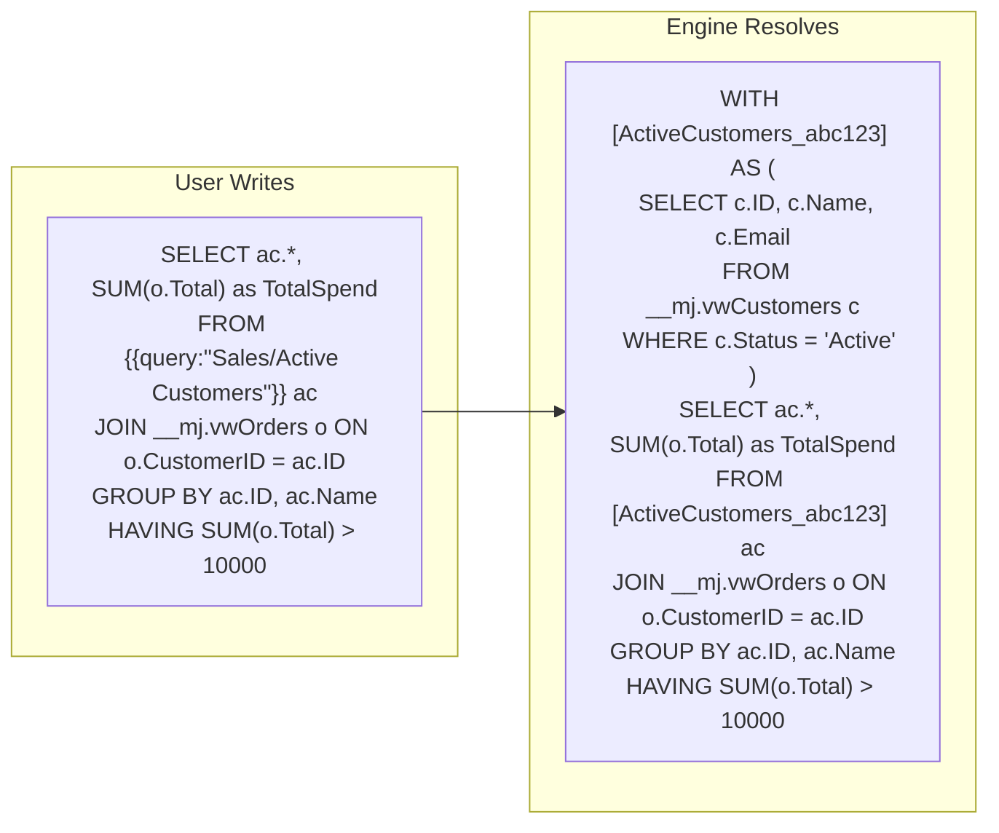
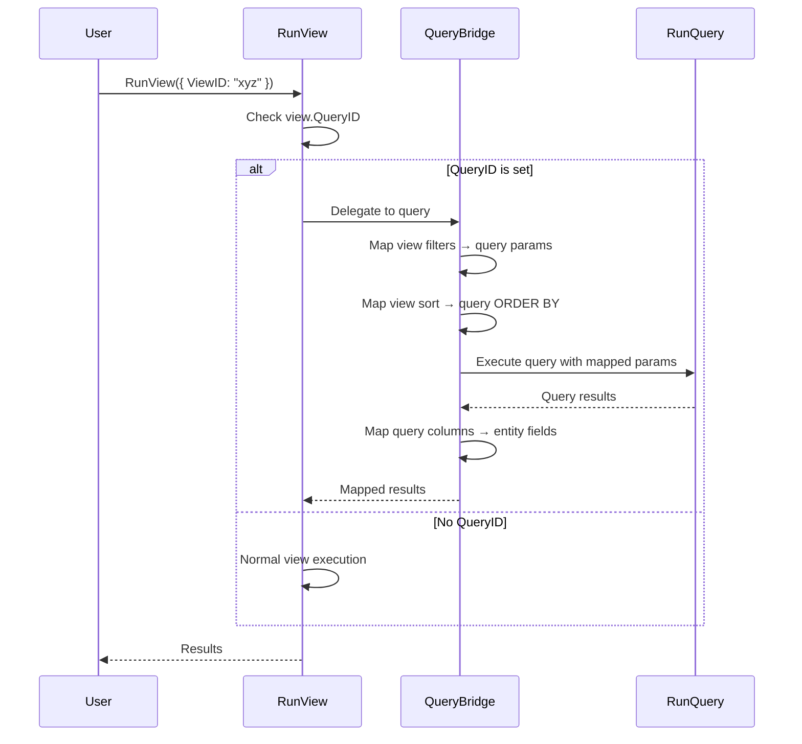

# Composable Queries, Paging & Caching — Implementation Plan

## Table of Contents

1. [Executive Summary](#1-executive-summary)
2. [What's Already Done](#2-whats-already-done)
3. [Sub-Phase A: Composable Query Engine](#3-sub-phase-a-composable-query-engine)
4. [Sub-Phase B: Server-Side Paging for Queries](#4-sub-phase-b-server-side-paging-for-queries)
5. [Sub-Phase C: Query Caching with TTL](#5-sub-phase-c-query-caching-with-ttl)
6. [Sub-Phase D: PostgreSQL Query Support](#6-sub-phase-d-postgresql-query-support)
7. [Future Phase: View-Query Bridge](#7-future-phase-view-query-bridge)
8. [Cross-Cutting Concerns](#8-cross-cutting-concerns)
9. [File Inventory](#9-file-inventory)
10. [Consolidated Task List](#10-consolidated-task-list)

---

## 1. Executive Summary

This plan consolidates and supersedes two prior plans:
- `plans/complete/query-builder-agent-plan.md` (Phases 2 & 3 complete, Phase 1 & 4 absorbed here)
- `plans/complete/query-server-paging.md` (absorbed into Sub-Phase B here)

### What's Done (from prior plan)

| Phase | Status | Notes |
|-------|--------|-------|
| **Data Artifact Type** | **COMPLETE** | `metadata/artifact-types/.data-artifact-type.json`, full Angular viewer in `artifacts` package |
| **Query Builder Agent** | **COMPLETE** | Agent + Query Strategist sub-agent, prompts, data sources, payload validation |

### What We're Building Now

| Sub-Phase | What | Why |
|-----------|------|-----|
| **A — Composable Query Engine** | `{{query:"Path/Name(params)"}}` macro syntax resolved to CTEs before execution | Reusable business-logic queries composed into higher-level queries |
| **B — Server-Side Paging** | CTE-wrapped `OFFSET/FETCH` paging for all query execution (saved + ad-hoc) | Replace `TOP 100` hack; enable full dataset browsing |
| **C — Query Caching with TTL** | Server-side result cache with configurable TTL per query, since queries lack `UpdatedAt` | Performance — avoid re-executing expensive analytical queries |
| **D — PostgreSQL Variants** | `PlatformSQL` support in composition engine + paging SQL generation | Core system queries that use composition must work on both MSSQL and PG |

### Future Phase (Design Only)

| Phase | What | Why |
|-------|------|-----|
| **View-Query Bridge** | Queries that back entity views, with entity/PK column mapping metadata | Unify the two data-access paradigms; expose complex queries via the View interface |

### Architecture Overview



---

## 2. What's Already Done

### 2.1 Data Artifact Type (Phase 2 — COMPLETE)

**Metadata:** `metadata/artifact-types/.data-artifact-type.json`
- Name: "Data", ContentType: `application/vnd.mj.data`, DriverClass: `DataArtifactViewerPlugin`

**Angular Viewer:** `packages/Angular/Generic/artifacts/src/lib/components/plugins/`
- `data-artifact-viewer.component.ts` (642 lines) — Full viewer with:
  - Dual source mode (query SQL execution + inline data fallback)
  - Query sync state management (6 states: `no-query-latest`, `synced`, `outdated-latest`, etc.)
  - Save/Update/SaveAsNew query actions
  - Plan tab (mermaid) + SQL tab
  - Live execution with refresh, row count, timing
  - Rich column config with entity link support
- `save-query-dialog.component.ts` — Tree-based category selection
- `data-requirements-viewer/` — Shows entity/query requirements for component artifacts

### 2.2 Query Builder Agent (Phase 3 — COMPLETE)

**Agent:** `metadata/agents/.query-builder-agent.json`
- Loop agent with Query Strategist sub-agent
- 3 data sources: `ALL_ENTITIES`, `ALL_QUERIES`, `QUERY_CATEGORIES`
- Actions: Get Entity Details, Execute Research Query, Create Record, Update Record
- Payload validation schema for DataArtifactSpec

**Prompts:**
- `metadata/prompts/.query-builder-agent-prompt.json` — Orchestrator prompt (230+ lines)
- `metadata/prompts/.query-builder-query-strategist-prompt.json` — Technical specialist (390+ lines)

**Implementation:** `packages/AI/Agents/src/query-builder-agent.ts`
- Custom SQL formatting post-processing via `sql-formatter`

### 2.3 Existing Query Infrastructure

**Already in place:**
- `RunQueryParams` has `StartRow` and `MaxRows` fields (but not wired for CTE paging)
- `QueryCache` class with LRU + TTL support (`packages/MJCore/src/generic/QueryCache.ts`)
- `QueryCacheConfig` interface with `enabled`, `ttlMinutes`, `maxCacheSize`, `cacheKey` strategy
- `PlatformSQL` type for cross-platform SQL variants (`packages/MJCore/src/generic/platformSQL.ts`)
- `QueryInfo.GetPlatformSQL(platformKey)` for platform-specific SQL retrieval
- PostgreSQL data provider with `InternalRunQuery` and `RunQuerySQLFilterManager` platform detection
- SQL parser utility with CTE support (`packages/MJCoreEntitiesServer/src/custom/sql-parser.ts`)
- `QueryEntityServer` with `extractAndSyncData()` pipeline (params, fields, entities)
- Smart cache validation via fingerprint (`maxUpdatedAt` + `rowCount`)
- GraphQL resolvers: `QueryResolver` (saved queries) + `AdhocQueryResolver` (raw SQL)

---

## 3. Sub-Phase A: Composable Query Engine

### 3.1 Overview

Enable queries to reference other queries via `{{query:"Category/SubCat/Name(params)"}}` syntax. References resolve to CTEs at execution time, creating a hierarchy of reusable business-logic queries.



### 3.2 Database Migration

#### 3.2.1 Add `Reusable` BIT to Query

```sql
ALTER TABLE ${flyway:defaultSchema}.Query
    ADD Reusable BIT NOT NULL DEFAULT 0;
```

- Default `false` — most queries are not reusable
- Only `Reusable = true` AND `Status = 'Approved'` queries can be referenced
- UI: checkbox on query form, visible to admins

#### 3.2.2 New Entity: `QueryDependency`

Tracks which queries reference which other queries. Auto-populated by the extraction pipeline.

```sql
CREATE TABLE ${flyway:defaultSchema}.QueryDependency (
    ID UNIQUEIDENTIFIER NOT NULL DEFAULT NEWSEQUENTIALID(),
    QueryID UNIQUEIDENTIFIER NOT NULL,
    DependsOnQueryID UNIQUEIDENTIFIER NOT NULL,
    ReferencePath NVARCHAR(500) NOT NULL,
    Alias NVARCHAR(100) NULL,
    ParameterMapping NVARCHAR(MAX) NULL,
    DetectionMethod NVARCHAR(20) NOT NULL DEFAULT 'AI',
    CONSTRAINT PK_QueryDependency PRIMARY KEY (ID),
    CONSTRAINT FK_QueryDependency_Query FOREIGN KEY (QueryID)
        REFERENCES ${flyway:defaultSchema}.Query(ID),
    CONSTRAINT FK_QueryDependency_DependsOn FOREIGN KEY (DependsOnQueryID)
        REFERENCES ${flyway:defaultSchema}.Query(ID),
    CONSTRAINT UQ_QueryDependency UNIQUE (QueryID, DependsOnQueryID)
);
```

| Field | Purpose |
|-------|---------|
| `QueryID` | The query containing the `{{query:"..."}}` reference |
| `DependsOnQueryID` | The referenced query (resolved by ID) |
| `ReferencePath` | Full category path as written in SQL — informational |
| `Alias` | SQL alias from FROM clause (e.g., `ac` in `FROM {{query:"..."}} ac`) |
| `ParameterMapping` | JSON mapping. `@`-prefixed = pass-through, else static. E.g. `{"region": "@region", "year": "2024"}` |
| `DetectionMethod` | `AI` (auto-extracted) or `Manual` |

#### 3.2.3 Add Missing Query.Status Values

Add `In-Review` and `Obsolete` to the Query.Status allowed values (currently only `Pending | Approved | Rejected | Expired`).

### 3.3 Composition Syntax

#### 3.3.1 Syntax Definition

```
{{query:"<CategoryPath>/<QueryName>"}}
{{query:"<CategoryPath>/<QueryName>(<param1>=<value1>, <param2>=<value2>)"}}
```

**Rules:**
- Path + params enclosed in `"..."` after `query:`
- `/` separators for category hierarchy
- Query name = last segment before `(` or end of string
- Parameters: optional, comma-separated `key=value` inside parentheses
- Token valid anywhere a table/subquery reference is valid (FROM, JOIN, subquery)

#### 3.3.2 Parameter Modes

| Mode | Syntax | Meaning |
|------|--------|---------|
| **Static** | `param='literal'` | Single-quoted string literal — baked into CTE |
| **Pass-through** | `param=paramName` | Bare name — resolved from parent query's params at execution time |

**Examples:**
```sql
-- No params
SELECT * FROM {{query:"Sales/Customers/Active Customers"}} ac

-- Static param
SELECT * FROM {{query:"Sales/Customers/By Region(region='Northeast')"}} c

-- Pass-through (parent receives {{region}} from caller)
SELECT * FROM {{query:"Sales/Customers/By Region(region=region)"}} c
WHERE c.TotalSpend > {{minSpend}}

-- Mixed
SELECT * FROM {{query:"Analytics/Revenue(year='2024', region=region)"}} r

-- Multiple references
SELECT ac.Name, r.Total
FROM {{query:"Sales/Active Customers"}} ac
JOIN {{query:"Sales/Revenue By Customer(year='2024')"}} r ON r.CustomerID = ac.ID
```

#### 3.3.3 Distinguishing from Nunjucks `{{param}}`

- `{{customerName}}` → Nunjucks parameter substitution (existing)
- `{{query:"Sales/Active Customers"}}` → Query composition (new)

The `{{query:"` prefix (with opening double-quote) is the discriminator. The composition engine processes `{{query:"..."}}` tokens **BEFORE** Nunjucks processes `{{param}}` tokens.

### 3.4 Composition Resolution Engine

#### 3.4.1 New Class Location

**File:** `packages/MJCore/src/generic/queryCompositionEngine.ts`

We place this in MJCore (not SQLServerDataProvider) because:
1. Both SSDP and PGDP need it
2. It operates on `QueryInfo` metadata, not raw database connections
3. The platform-specific SQL comes from `QueryInfo.GetPlatformSQL(platformKey)`

#### 3.4.2 Resolution Algorithm

```
ResolveComposition(sql: string, platformKey: string, contextUser: UserInfo, outerParams?: Record<string, any>):
  1. PARSE: Find all {{query:"Path/Name(params)"}} tokens via regex
  2. For each token:
     a. Parse category path + query name + parameters
     b. RESOLVE: Look up referenced query in Metadata.Provider.Queries
        - Must exist
        - Must have Reusable = true
        - Must have Status = 'Approved'
        - Must pass UserCanRun(contextUser)
     c. CYCLE CHECK: Add to dependency graph, check for cycles
     d. RECURSE: If referenced query's SQL also contains {{query:"..."}} tokens,
        recursively resolve those first (depth-first)
     e. RESOLVE PARAMS: For each parameter mapping:
        - Quoted value → use as static literal
        - Bare name → look up in outerParams, error if missing
     f. PROCESS NUNJUCKS: Run referenced query's SQL through Nunjucks with resolved params
     g. GENERATE CTE: Convert resolved SQL to a named CTE
        - CTE name = sanitized query name + short hash suffix for uniqueness
  3. DEDUPLICATE: If same query referenced multiple times with same params, use one CTE
  4. ASSEMBLE: Prepend all CTEs as WITH clause, replace tokens with CTE names
  5. Return CompositionResult
```

#### 3.4.3 Cycle Detection

```
DetectCycles(queryId, dependsOnIds, existingGraph):
  - Maintain in-progress set during recursive resolution
  - If we encounter a query ID already in the set → cycle detected
  - Max depth limit: 10 levels (configurable)
  - On cycle: throw descriptive error listing the cycle path
```

#### 3.4.4 CTE Generation

For a referenced query:
```sql
-- "Active Customers" query (ID: abc-123)
SELECT c.ID, c.Name, c.Email, c.Region
FROM __mj.vwCustomers c
WHERE c.Status = 'Active' AND c.DeletedAt IS NULL
```

Generated CTE:
```sql
WITH [ActiveCustomers_abc123] AS (
    SELECT c.ID, c.Name, c.Email, c.Region
    FROM __mj.vwCustomers c
    WHERE c.Status = 'Active' AND c.DeletedAt IS NULL
)
```

The token `{{query:"Sales/Customers/Active Customers"}}` is replaced with `[ActiveCustomers_abc123]`.

#### 3.4.5 Provenance Tracking

```typescript
interface CompositionResult {
    /** The fully resolved SQL with CTEs prepended */
    ResolvedSQL: string;
    /** Metadata about each CTE generated */
    CTEs: Array<{
        QueryID: string;
        QueryName: string;
        CategoryPath: string;
        CTEName: string;
        OriginalSQL: string;
        ResolvedSQL: string;
        Parameters: Record<string, string>;
        Fields: Array<{ Name: string; Type: string; SourceEntity: string; SourceField: string }>;
    }>;
    /** Directed dependency graph: queryId → [dependsOnQueryIds] */
    DependencyGraph: Map<string, string[]>;
}
```

#### 3.4.6 Integration Point

Called from both `SQLServerDataProvider.processQueryParameters()` and `PostgreSQLDataProvider.InternalRunQuery()` **before** Nunjucks template processing:

```typescript
// In processQueryParameters():
const compositionEngine = new QueryCompositionEngine();
if (compositionEngine.HasCompositionTokens(sql)) {
    const result = compositionEngine.ResolveComposition(
        sql, this.PlatformKey, contextUser, parameters
    );
    sql = result.ResolvedSQL;
    // Store provenance for audit/logging
}
// Then proceed with Nunjucks parameter substitution
```

### 3.5 Auto-Extraction of Dependencies

#### 3.5.1 Extend `QueryEntityServer.extractAndSyncData()`

**File:** `packages/MJCoreEntitiesServer/src/custom/MJQueryEntityServer.server.ts`

Add a new step after existing extraction:

```
extractAndSyncData():
  ... existing steps (params, fields, entities) ...

  // NEW: Extract and sync query dependencies
  if (sqlContainsQueryReferences(this.SQL)) {
      await this.extractAndSyncQueryDependencies();
  } else {
      await this.removeAllQueryDependencies();
  }
```

#### 3.5.2 Dependency Extraction: Deterministic + LLM Hybrid

**Step 1 — Deterministic regex parsing** (no LLM):
- Parse all `{{query:"Path/Name(params)"}}` tokens
- Resolve category path + query name to QueryID
- Extract parameter mappings
- This directly produces QueryDependency records

**Step 2 — Enhance existing LLM prompt:**
- Update "SQL Query Parameter Extraction" AI prompt to recognize `{{query:"..."}}` tokens
- Pass referenced queries' field metadata as context for accurate field type inference

#### 3.5.3 New Method: `syncQueryDependencies()`

Follows the same pattern as `syncQueryParameters()`, `syncQueryFields()`, `syncQueryEntities()`:

```typescript
private async syncQueryDependencies(
    extractedDeps: Array<{
        referencePath: string;
        dependsOnQueryID: string;
        alias: string | null;
        parameterMapping: Record<string, string> | null;
    }>
): Promise<void> {
    // 1. Load existing QueryDependency records for this query
    // 2. Diff against extracted dependencies
    // 3. Add new, update changed, remove stale
}
```

#### 3.5.4 Cycle Detection in Save Pipeline

Before syncing dependencies, validate no cycles:

```typescript
const proposedDeps = this.parseQueryReferences(this.SQL);
const cycleError = await this.detectDependencyCycles(this.ID, proposedDeps);
if (cycleError) {
    LogError(`Query "${this.Name}" creates circular dependency: ${cycleError}`);
    // Don't sync dependencies, set warning — don't fail save
}
```

### 3.6 Query Status & Approval

**Current status values:** `Pending | Approved | Rejected | Expired`
**Add:** `In-Review`, `Obsolete`

**Composition validation rules:**
- Referenced query must be `Status = 'Approved'`
- Referenced query must have `Reusable = true`
- User must pass `UserCanRun(contextUser)` on referenced query
- If referenced query status changes away from Approved, dependent queries get flagged (warning, not broken)

**Notification integration:**
- When query saved with `Status = 'Pending'`, create `MJ: User Notifications` record
- Target users with query-admin role
- Direct entity creation approach (notification system is functional)

---

## 4. Sub-Phase B: Server-Side Paging for Queries

### 4.1 Overview

Replace the `TOP 100` hack in agent-generated SQL with proper server-side pagination. Wrap the fully-resolved SQL into a CTE and apply `OFFSET/FETCH` paging, with a parallel `COUNT(*)` for total row count.

### 4.2 Current State

- `RunQueryParams` already has `StartRow` and `MaxRows` fields
- `QueryDataGrid` receives all rows and uses AG Grid DOM virtualization
- `entity-data-grid` already implements server-side paging with pager bar
- Agent prompts currently instruct `TOP 100` in generated SQL
- No CTE wrapping or `OFFSET/FETCH` for queries exists today

### 4.3 SQL Wrapping Strategy

#### 4.3.1 SQL Server

```sql
-- Original (post-composition, post-Nunjucks) SQL:
-- SELECT col1, col2 FROM ... WHERE ... ORDER BY col1

-- Step 1: Wrap in CTE (strip TOP/ORDER BY from inner query)
WITH QueryCTE AS (
    SELECT col1, col2 FROM ... WHERE ...
)
SELECT *
FROM QueryCTE
ORDER BY <original order by, or default ordering>
OFFSET @offset ROWS
FETCH NEXT @pageSize ROWS ONLY;

-- Step 2: Parallel COUNT(*) query
WITH QueryCTE AS (
    SELECT col1, col2 FROM ... WHERE ...
)
SELECT COUNT(*) AS TotalCount FROM QueryCTE;
```

#### 4.3.2 PostgreSQL

```sql
-- PostgreSQL uses LIMIT/OFFSET instead of OFFSET/FETCH
WITH QueryCTE AS (
    SELECT col1, col2 FROM ... WHERE ...
)
SELECT *
FROM QueryCTE
ORDER BY <original order by>
LIMIT @pageSize OFFSET @offset;

-- Count query identical
WITH QueryCTE AS (
    SELECT col1, col2 FROM ... WHERE ...
)
SELECT COUNT(*) AS "TotalCount" FROM QueryCTE;
```

### 4.4 Paging Engine

#### 4.4.1 New Class Location

**File:** `packages/MJCore/src/generic/queryPagingEngine.ts`

Platform-agnostic logic with platform-specific SQL generation:

```typescript
export class QueryPagingEngine {
    /**
     * Wraps resolved SQL with paging constructs.
     * Returns both the paged data SQL and the count SQL.
     */
    WrapWithPaging(
        resolvedSQL: string,
        platformKey: DatabasePlatform,
        pageNumber: number,   // 1-based
        pageSize: number      // default 100
    ): { dataSQL: string; countSQL: string; offset: number }

    /**
     * Extracts and removes ORDER BY clause from SQL for CTE wrapping.
     * ORDER BY inside CTEs is invalid in MSSQL (unless with TOP).
     */
    private extractOrderBy(sql: string): { sqlWithoutOrder: string; orderByClause: string | null }

    /**
     * Strips TOP N clause from SQL (agent-generated queries may include it).
     */
    private stripTopClause(sql: string): string
}
```

#### 4.4.2 Integration into Provider

Both `SQLServerDataProvider` and `PostgreSQLDataProvider` call the paging engine **after** composition resolution but **before** execution:

```typescript
// In InternalRunQuery():
let { finalSQL, appliedParameters } = this.processQueryParameters(query, params.Parameters);

// Apply paging if requested
if (params.MaxRows || params.StartRow) {
    const pagingEngine = new QueryPagingEngine();
    const pageNumber = params.StartRow
        ? Math.floor(params.StartRow / (params.MaxRows || 100)) + 1
        : 1;
    const pageSize = params.MaxRows || 100;

    const { dataSQL, countSQL, offset } = pagingEngine.WrapWithPaging(
        finalSQL, this.PlatformKey, pageNumber, pageSize
    );

    // Execute both in parallel
    const [dataRows, countResult] = await Promise.all([
        this.ExecuteSQL(dataSQL, ...),
        this.ExecuteSQL(countSQL, ...)
    ]);

    return {
        ...result,
        Results: dataRows,
        TotalRowCount: countResult[0]?.TotalCount,
        PageNumber: pageNumber,
        PageSize: pageSize
    };
}
```

### 4.5 API Changes

#### 4.5.1 Extend `RunQueryResult`

```typescript
// In packages/MJCore/src/generic/interfaces.ts
export type RunQueryResult = {
    // ... existing fields ...
    /** Total rows before paging (only present when paging is used) */
    TotalRowCount?: number;
    /** Current page number, 1-based (only present when paging is used) */
    PageNumber?: number;
    /** Page size used (only present when paging is used) */
    PageSize?: number;
};
```

#### 4.5.2 Extend GraphQL Types

Add `TotalRowCount`, `PageNumber`, `PageSize` to `RunQueryResultType` in `QueryResolver.ts` and `AdhocQueryResolver.ts`.

### 4.6 Shared Data Pager Component

#### 4.6.1 Extract from Entity Data Grid

Create a reusable pager component in `@memberjunction/ng-shared-generic`:

```typescript
@Component({
    selector: 'mj-data-pager',
    standalone: false,
    template: `...`
})
export class DataPagerComponent {
    @Input() TotalRows: number = 0;
    @Input() PageSize: number = 100;
    @Input() CurrentPage: number = 1;
    @Output() PageChange = new EventEmitter<number>();

    // Shows: "< 1 2 3 ... 10 > Showing 1-100 of 2,345 rows"
}
```

#### 4.6.2 Wire into Query Data Grid

Update `mj-query-data-grid` to accept paging inputs and emit page change events:

```html
<mj-query-data-grid
    [Data]="gridData"
    [TotalRowCount]="totalRowCount"
    [PageNumber]="currentPage"
    [PageSize]="pageSize"
    (PageChange)="onPageChange($event)">
</mj-query-data-grid>
<!-- Pager bar below grid -->
<mj-data-pager
    [TotalRows]="totalRowCount"
    [PageSize]="pageSize"
    [CurrentPage]="currentPage"
    (PageChange)="onPageChange($event)">
</mj-data-pager>
```

#### 4.6.3 Update Agent Prompts

Remove `TOP 100` requirement from Query Builder and Query Strategist prompts. The server handles paging transparently.

### 4.7 OFFSET/FETCH Scalability

OFFSET/FETCH has no hard limit. Performance degrades gradually at high offsets:
- **Page 1** (OFFSET 0): Fast — process 100 rows
- **Page 100** (OFFSET 9900): Process 10,000 rows, discard 9,900
- **Page 1000** (OFFSET 99,900): Process 100,000 rows, discard 99,900

**For interactive analytical queries this is fine.** Users rarely page past the first few hundred rows. If needed in the future, keyset/cursor pagination (`WHERE ID > @lastSeenId`) can be added as an optional strategy.

---

## 5. Sub-Phase C: Query Caching with TTL

### 5.1 Overview

Queries don't have a reliable `UpdatedAt` column on their underlying data (unlike views which read from entity tables with `__mj_UpdatedAt`). We need TTL-based caching to avoid re-executing expensive analytical queries on every page load/navigation.

### 5.2 Current State

The infrastructure is **mostly built** but needs activation and wiring:

| Component | Status | Location |
|-----------|--------|----------|
| `QueryCache` class (LRU + TTL) | **Exists** | `packages/MJCore/src/generic/QueryCache.ts` |
| `QueryCacheConfig` interface | **Exists** | `packages/MJCore/src/generic/QueryCacheConfig.ts` |
| `CachedRunQueryResult` type | **Exists** | `packages/MJCore/src/generic/QueryCacheConfig.ts` |
| `checkQueryCache()` method | **Exists in SSDP** | `SQLServerDataProvider.ts:735` |
| `QueryInfo.CacheConfig` property | **Exists** | `queryInfo.ts` |
| Client-side smart cache validation | **Exists** | Via `RunQueryWithCacheCheckParams` |
| Cache invalidation via dependency graph | **Not built** | Need QueryDependency (Sub-Phase A) |
| PG provider cache integration | **Not built** | Need to add to PostgreSQLDataProvider |

### 5.3 What Needs to Be Done

#### 5.3.1 Ensure Cache is Used in Both Providers

**SQLServerDataProvider** — already has `checkQueryCache()`. Verify it's called in the `InternalRunQuery` flow and that cache hits skip execution.

**PostgreSQLDataProvider** — add cache check/store logic to `InternalRunQuery()`:

```typescript
protected async InternalRunQuery(params: RunQueryParams, contextUser?: UserInfo): Promise<RunQueryResult> {
    // ... find and validate query ...

    // Check cache
    const cachedResult = this.checkQueryCache(queryInfo, params, appliedParameters);
    if (cachedResult) return cachedResult;

    // ... execute query ...

    // Store in cache
    this.storeQueryCache(queryInfo, params, appliedParameters, results);

    return result;
}
```

#### 5.3.2 Cache Invalidation via QueryDependency Graph

When a query's cache is invalidated (e.g., TTL expires, manual clear), also invalidate caches of all queries that depend on it:

```typescript
// In QueryCache.clear(queryId):
// 1. Clear this query's cache entries
// 2. Find all QueryDependency records where DependsOnQueryID = queryId
// 3. Recursively clear those parent queries' caches
```

This leverages the `QueryDependency` entity from Sub-Phase A.

#### 5.3.3 Cache-Aware Paging

When paging is active, the cache key must include page number and page size:

```typescript
// Cache key = queryId + params + pageNumber + pageSize
private getCacheKey(queryId: string, params: Record<string, any>, page?: number, pageSize?: number): string {
    const sortedParams = ...;
    const pageSuffix = page != null ? `:p${page}x${pageSize}` : '';
    return `${queryId}:${JSON.stringify(sortedParams)}${pageSuffix}`;
}
```

The `TotalRowCount` should be cached separately (or with page 1) so it doesn't require re-execution on every page.

#### 5.3.4 Ad-Hoc Query Caching

For ad-hoc SQL queries (no saved query), cache using a hash of the SQL + parameters as the key:

```typescript
// For ad-hoc queries without a queryId:
const sqlHash = createHash('sha256').update(sql).digest('hex').substring(0, 16);
const key = `adhoc:${sqlHash}:${JSON.stringify(sortedParams)}`;
```

Default TTL for ad-hoc: 5 minutes (configurable).

### 5.4 Cache Configuration per Query

The `QueryCacheConfig` already supports per-query TTL. Queries can configure:

```json
{
    "enabled": true,
    "ttlMinutes": 30,
    "maxCacheSize": 100,
    "cacheKey": "exact"
}
```

This is stored in the Query entity's `CacheConfig` field (JSON). The UI form should expose these settings to admins.

---

## 6. Sub-Phase D: PostgreSQL Query Support

### 6.1 Overview

For core system queries that use composition, we need both SQL Server and PostgreSQL variants. The `PlatformSQL` type already supports this pattern.

### 6.2 Query SQL Variants

#### 6.2.1 `QueryInfo.GetPlatformSQL(platformKey)`

This method already exists and returns the appropriate SQL variant. The composition engine calls it when resolving referenced queries:

```typescript
// In QueryCompositionEngine.resolveReferencedQuery():
const referencedQuery = ... // look up query
const sql = referencedQuery.GetPlatformSQL(platformKey);
// Use this SQL for the CTE body
```

#### 6.2.2 Platform-Specific Differences

| Feature | SQL Server | PostgreSQL |
|---------|-----------|------------|
| CTE syntax | `WITH [Name] AS (...)` | `WITH "Name" AS (...)` |
| Identifier quoting | `[brackets]` | `"double quotes"` |
| Paging | `OFFSET n ROWS FETCH NEXT m ROWS ONLY` | `LIMIT m OFFSET n` |
| Boolean literals | `1`/`0` | `true`/`false` |
| String concatenation | `+` | `||` |
| TOP clause | `SELECT TOP 100 ...` | `SELECT ... LIMIT 100` |

#### 6.2.3 Composition Engine Platform Awareness

The `QueryCompositionEngine` accepts a `platformKey` parameter and:
1. Uses `GetPlatformSQL(platformKey)` to get the right SQL for each referenced query
2. Generates CTE names with the correct quoting style
3. The paging engine uses the correct paging syntax

```typescript
class QueryCompositionEngine {
    ResolveComposition(
        sql: string,
        platformKey: DatabasePlatform,  // 'sqlserver' | 'postgresql'
        contextUser: UserInfo,
        outerParams?: Record<string, any>
    ): CompositionResult

    private quoteCTEName(name: string, platform: DatabasePlatform): string {
        return platform === 'postgresql' ? `"${name}"` : `[${name}]`;
    }
}
```

### 6.3 Migration Support

Database migrations need dual support:

```sql
-- SQL Server migration
ALTER TABLE ${flyway:defaultSchema}.Query ADD Reusable BIT NOT NULL DEFAULT 0;

-- PostgreSQL migration
ALTER TABLE ${flyway:defaultSchema}."Query" ADD COLUMN "Reusable" BOOLEAN NOT NULL DEFAULT FALSE;
```

Follow existing MJ patterns for dual-platform migrations.

---

## 7. Future Phase: View-Query Bridge

> **This section is design-only — not part of the current implementation.**

### 7.1 Concept: Queries That Back Views

Allow a User View to be backed by a Query's logic instead of a simple entity + WHERE clause.

**Required metadata on Query table:**

```sql
ALTER TABLE ${flyway:defaultSchema}.Query
    ADD EntityID UNIQUEIDENTIFIER NULL,     -- Entity this query is most closely coupled to
    ADD PrimaryKeyColumnMapping NVARCHAR(500) NULL;  -- JSON mapping query columns → entity PKs
```

**PrimaryKeyColumnMapping example:**
```json
{
    "queryColumn": "CustomerID",
    "entityPrimaryKey": "ID"
}
```

For composite keys:
```json
[
    { "queryColumn": "OrgID", "entityPrimaryKey": "OrganizationID" },
    { "queryColumn": "UserID", "entityPrimaryKey": "UserID" }
]
```

### 7.2 How It Would Work



### 7.3 Key Design Considerations

1. **Entity coupling:** The `EntityID` field identifies which entity's records the query returns. This enables the view UI to render entity-specific features (record links, CRUD actions, etc.)

2. **PK mapping:** The `PrimaryKeyColumnMapping` tells the bridge which query output column(s) map to the entity's primary key(s). This enables:
   - Record-level actions (edit, delete, navigate)
   - Entity link rendering in grids
   - Row selection and detail views

3. **Filter translation:** When a view has extra filters, the bridge needs to translate entity field filters into query WHERE clauses. The `PrimaryKeyColumnMapping` and `QueryField` metadata make this possible.

4. **Permissions:** Need to reconcile query permissions with entity permissions. The view respects entity-level permissions; the query adds an additional permission check.

5. **Performance:** CTEs from composition can't be indexed. Query-backed views may be slower than direct entity views for large datasets.

### 7.4 Virtual Entities from Queries

A further extension: wrap a query as a SQL view and register it as a read-only MJ entity.
- Query with `Status=Approved` + `Reusable=true` can be "promoted" to a virtual entity
- CodeGen creates a SQL view from the query's SQL
- Entity fields derived from `QueryField` metadata
- Full CRUD not available — read-only

This is a significant architectural decision requiring more design work.

---

## 8. Cross-Cutting Concerns

### 8.1 Security

| Concern | Mitigation |
|---------|------------|
| SQL injection in composed queries | Composition resolves to CTEs with pre-validated SQL from approved queries. Params go through Nunjucks escaping. |
| Unauthorized query access | `UserCanRun()` check on every referenced query in composition chain |
| Agent creating malicious queries | Agent only saves as Pending — human approval required |
| Data exposure through artifacts | Data artifacts execute with current user's permissions |
| Cache poisoning | Cache key includes user context where relevant |

### 8.2 Performance

| Concern | Mitigation |
|---------|------------|
| Deep composition chains | Max depth 10 (configurable) |
| Large CTE chains | SQL Server/PG handle CTEs efficiently; monitor execution plans |
| Cache invalidation cascades | QueryDependency graph enables targeted invalidation |
| Duplicate CTE references | Deduplicate — same query+params → one CTE |
| Count query overhead | Run count in parallel with data query; cache separately |
| High-offset paging | OFFSET/FETCH is fine for interactive use; keyset pagination future option |

### 8.3 Error Handling

| Scenario | Behavior |
|----------|----------|
| Referenced query not found | `"Query 'Sales/Active Customers' not found"` |
| Referenced query not approved | `"Query 'X' is not approved (status: Pending)"` |
| Referenced query not reusable | `"Query 'X' is not marked as reusable"` |
| Circular dependency | Error listing cycle path |
| Parameter mismatch | `"Parameter 'region' expected by 'X' but not provided"` |
| Composition depth exceeded | `"Composition depth limit (10) exceeded"` |
| Paging with no ORDER BY | Apply default ordering by first column |

---

## 9. File Inventory

### 9.1 New Files

| File | Sub-Phase | Purpose |
|------|-----------|---------|
| `migrations/v2/V{date}__v{ver}.x_QueryComposition.sql` | A | Migration: Reusable field, QueryDependency table, status values |
| `packages/MJCore/src/generic/queryCompositionEngine.ts` | A | Composition resolution engine |
| `packages/MJCore/src/generic/queryPagingEngine.ts` | B | CTE-wrap paging engine |
| `packages/MJCore/src/__tests__/queryCompositionEngine.test.ts` | A | Unit tests for composition |
| `packages/MJCore/src/__tests__/queryPagingEngine.test.ts` | B | Unit tests for paging |
| `packages/MJCoreEntitiesServer/src/__tests__/queryDependencySync.test.ts` | A | Unit tests for dependency sync |

### 9.2 Modified Files

| File | Sub-Phase | Changes |
|------|-----------|---------|
| `packages/MJCore/src/generic/queryInfo.ts` | A | Add `Reusable` field to QueryInfo |
| `packages/MJCore/src/generic/interfaces.ts` | B | Add `TotalRowCount`, `PageNumber`, `PageSize` to `RunQueryResult` |
| `packages/MJCore/src/generic/QueryCache.ts` | C | Add page-aware cache keys, dependency-graph invalidation |
| `packages/MJCore/src/index.ts` | A, B | Export new modules |
| `packages/SQLServerDataProvider/src/SQLServerDataProvider.ts` | A, B, C | Integrate composition + paging + cache |
| `packages/PostgreSQLDataProvider/src/PostgreSQLDataProvider.ts` | A, B, C, D | Integrate composition + paging + cache |
| `packages/MJCoreEntitiesServer/src/custom/MJQueryEntityServer.server.ts` | A | Add dependency extraction/sync to Save pipeline |
| `packages/MJServer/src/resolvers/QueryResolver.ts` | B | Add paging fields to GraphQL types |
| `packages/MJServer/src/resolvers/AdhocQueryResolver.ts` | B | Add paging fields to GraphQL types |
| `packages/Angular/Generic/shared-generic/src/lib/` | B | Add `DataPagerComponent` |
| `packages/Angular/Generic/query-viewer/src/lib/` | B | Wire pager into QueryDataGrid |
| `packages/Angular/Generic/artifacts/src/lib/components/plugins/data-artifact-viewer.component.ts` | B | Wire pager into artifact viewer |
| Agent prompt templates | B | Remove TOP 100 requirement |

### 9.3 Generated Files (via CodeGen)

After migrations:
- `packages/MJCoreEntities/src/generated/entity_subclasses.ts` — new `QueryDependencyEntity`, updated `QueryEntity` with `Reusable`
- `migrations/v2/CodeGen_Run_*.sql` — SPs, views, indexes
- Angular form components for QueryDependency entity

---

## 10. Consolidated Task List

### Sub-Phase A: Composable Query Engine

| # | Task | Files | Depends On | Est. Complexity |
|---|------|-------|------------|-----------------|
| A.1 | Write migration: add `Reusable` BIT to Query | `migrations/v2/V...` | — | Low |
| A.2 | Write migration: create `QueryDependency` table | `migrations/v2/V...` | — | Low |
| A.3 | Write migration: add missing Query.Status values (`In-Review`, `Obsolete`) | `migrations/v2/V...` | — | Low |
| A.4 | Run CodeGen to generate entity subclasses, views, SPs | Generated files | A.1, A.2, A.3 | Low |
| A.5 | Add `Reusable` to `QueryInfo` class | `queryInfo.ts` | — | Low |
| A.6 | Create `QueryCompositionEngine` class with `ResolveComposition()` | `queryCompositionEngine.ts` | A.5 | High |
| A.7 | Implement `{{query:"..."}}` regex parser in composition engine | Inside A.6 | A.6 | Medium |
| A.8 | Implement cycle detection (topological sort / in-progress set) | Inside A.6 | A.6 | Medium |
| A.9 | Implement CTE generation from referenced queries | Inside A.6 | A.7 | Medium |
| A.10 | Implement parameter passing (static + pass-through) | Inside A.6 | A.9 | Medium |
| A.11 | Implement CTE deduplication for same query+params | Inside A.6 | A.9 | Low |
| A.12 | Integrate composition engine into `SQLServerDataProvider.processQueryParameters()` | `SQLServerDataProvider.ts` | A.6 | Medium |
| A.13 | Integrate composition engine into `PostgreSQLDataProvider.InternalRunQuery()` | `PostgreSQLDataProvider.ts` | A.6 | Medium |
| A.14 | Add `syncQueryDependencies()` to `QueryEntityServer` | `MJQueryEntityServer.server.ts` | A.2, A.4 | Medium |
| A.15 | Add `removeAllQueryDependencies()` cleanup method | Same as A.14 | A.14 | Low |
| A.16 | Add cycle detection to Save pipeline | Same as A.14 | A.8, A.14 | Low |
| A.17 | Update AI prompt for `{{query:"..."}}` awareness | DB prompt + template | A.6 | Low |
| A.18 | Add composed query metadata to LLM prompt context | `MJQueryEntityServer.server.ts` | A.17 | Low |
| A.19 | Write unit tests for composition engine (parser, cycles, CTEs, params) | `queryCompositionEngine.test.ts` | A.6-A.11 | Medium |
| A.20 | Write unit tests for dependency sync | `queryDependencySync.test.ts` | A.14-A.16 | Medium |
| A.21 | Create "Query Pending Review" notification on save | `MJQueryEntityServer.server.ts` | A.4 | Low |

### Sub-Phase B: Server-Side Paging

| # | Task | Files | Depends On | Est. Complexity |
|---|------|-------|------------|-----------------|
| B.1 | Create `QueryPagingEngine` class | `queryPagingEngine.ts` | — | Medium |
| B.2 | Implement ORDER BY extraction / TOP stripping | Inside B.1 | B.1 | Medium |
| B.3 | Implement MSSQL `OFFSET/FETCH` wrapping | Inside B.1 | B.1 | Low |
| B.4 | Implement PG `LIMIT/OFFSET` wrapping | Inside B.1 | B.1 | Low |
| B.5 | Implement parallel COUNT(*) query generation | Inside B.1 | B.1 | Low |
| B.6 | Add `TotalRowCount`, `PageNumber`, `PageSize` to `RunQueryResult` | `interfaces.ts` | — | Low |
| B.7 | Add paging fields to `RunQueryResultType` GraphQL type | `QueryResolver.ts` | B.6 | Low |
| B.8 | Add paging fields to `AdhocQueryResolver` GraphQL type | `AdhocQueryResolver.ts` | B.6 | Low |
| B.9 | Wire paging engine into `SQLServerDataProvider.InternalRunQuery()` | `SQLServerDataProvider.ts` | B.1, B.6 | Medium |
| B.10 | Wire paging engine into `PostgreSQLDataProvider.InternalRunQuery()` | `PostgreSQLDataProvider.ts` | B.1, B.6 | Medium |
| B.11 | Create `DataPagerComponent` (extract from entity-data-grid) | `ng-shared-generic` | — | Medium |
| B.12 | Wire pager into `mj-query-data-grid` | `query-viewer` package | B.11, B.6 | Medium |
| B.13 | Wire pager into `DataArtifactViewer` | `artifacts` package | B.11, B.12 | Low |
| B.14 | Update Query Builder agent prompt: remove TOP 100 | Prompt template | B.9 | Low |
| B.15 | Update Query Strategist prompt: remove TOP 100, mention paging | Prompt template | B.9 | Low |
| B.16 | Write unit tests for paging engine | `queryPagingEngine.test.ts` | B.1-B.5 | Medium |
| B.17 | Migrate `entity-data-grid` to use shared `DataPagerComponent` | `entity-data-grid` package | B.11 | Medium |

### Sub-Phase C: Query Caching with TTL

| # | Task | Files | Depends On | Est. Complexity |
|---|------|-------|------------|-----------------|
| C.1 | Verify/fix cache integration in `SQLServerDataProvider.InternalRunQuery()` | `SQLServerDataProvider.ts` | — | Low |
| C.2 | Add cache check/store to `PostgreSQLDataProvider.InternalRunQuery()` | `PostgreSQLDataProvider.ts` | — | Medium |
| C.3 | Add page-aware cache keys to `QueryCache` | `QueryCache.ts` | B.1 | Low |
| C.4 | Add ad-hoc SQL cache key generation (hash-based) | `QueryCache.ts` | — | Low |
| C.5 | Implement dependency-graph cache invalidation | `QueryCache.ts` | A.2, A.4 | Medium |
| C.6 | Cache `TotalRowCount` separately from data pages | `QueryCache.ts` | B.1, C.3 | Low |
| C.7 | Add cache config UI fields to Query form | Angular form component | — | Low |
| C.8 | Write unit tests for cache with paging and invalidation | `QueryCache.test.ts` | C.1-C.6 | Medium |

### Sub-Phase D: PostgreSQL Variants

| # | Task | Files | Depends On | Est. Complexity |
|---|------|-------|------------|-----------------|
| D.1 | Add PG identifier quoting to composition engine | `queryCompositionEngine.ts` | A.6 | Low |
| D.2 | Add PG `LIMIT/OFFSET` to paging engine | `queryPagingEngine.ts` | B.1 | Low (done in B.4) |
| D.3 | Write PG-variant migration for QueryDependency | `migrations/v2/V...pg...` | A.2 | Low |
| D.4 | Verify `GetPlatformSQL()` returns correct variant in composition chain | Integration test | A.12, A.13 | Medium |
| D.5 | Integration tests: compose + page + cache on PG | Test files | All above | Medium |

### Execution Order

```mermaid
gantt
    title Implementation Timeline
    dateFormat X
    axisFormat %s

    section Sub-Phase A
    A.1-A.3 Migrations (parallel)           :a1, 0, 1
    A.4 CodeGen                             :a4, after a1, 1
    A.5 QueryInfo.Reusable                  :a5, 0, 1
    A.6-A.11 CompositionEngine              :a6, after a5, 3
    A.12-A.13 Provider integration          :a12, after a6, 1
    A.14-A.16 Dependency sync               :a14, after a4, 2
    A.17-A.18 LLM prompt updates            :a17, after a6, 1
    A.19-A.20 Unit tests                    :a19, after a12, 2
    A.21 Notifications                      :a21, after a4, 1

    section Sub-Phase B
    B.1-B.5 PagingEngine                    :b1, 0, 2
    B.6-B.8 API types                       :b6, 0, 1
    B.9-B.10 Provider integration           :b9, after b1, 1
    B.11 DataPagerComponent                 :b11, 0, 2
    B.12-B.13 Wire pager into grids         :b12, after b11, 1
    B.14-B.15 Agent prompts                 :b14, after b9, 1
    B.16 Unit tests                         :b16, after b9, 1
    B.17 Migrate entity-data-grid           :b17, after b11, 1

    section Sub-Phase C
    C.1-C.2 Cache in both providers         :c1, after b1, 1
    C.3-C.6 Page-aware + invalidation cache :c3, after c1, 2
    C.7 Cache config UI                     :c7, after c3, 1
    C.8 Unit tests                          :c8, after c3, 1

    section Sub-Phase D
    D.1 PG quoting in composition           :d1, after a6, 1
    D.3 PG migration                        :d3, 0, 1
    D.4-D.5 PG integration tests            :d4, after d1, 2
```



### Parallelization Strategy

**Can run in parallel:**
- Sub-Phase A (A.1-A.5) and Sub-Phase B (B.1-B.8, B.11) — no dependencies
- Migration writing (A.1-A.3, D.3) — independent
- Angular pager component (B.11) — independent of server work

**Sequential dependencies:**
- A.6 (CompositionEngine) must complete before A.12-A.13 (provider integration)
- A.4 (CodeGen) must complete before A.14 (dependency sync)
- B.1 (PagingEngine) must complete before B.9-B.10 (provider integration)
- C.3-C.6 depend on both A.2 (QueryDependency) and B.1 (paging)

---

## Appendix: Absorbed Plans

The following plans have been moved to `plans/complete/` and are superseded by this document:

1. **`plans/complete/query-builder-agent-plan.md`** — Original four-phase plan. Phases 2 (Data Artifact) and 3 (Query Builder Agent) are complete. Phase 1 (Composable Query Engine) is absorbed into Sub-Phase A here. Phase 4 (View-Query Bridge) is captured as the Future Phase here.

2. **`plans/complete/query-server-paging.md`** — Server-side paging plan. Absorbed into Sub-Phase B here with additional detail on CTE wrapping, parallel count queries, shared pager component, and PostgreSQL support.
