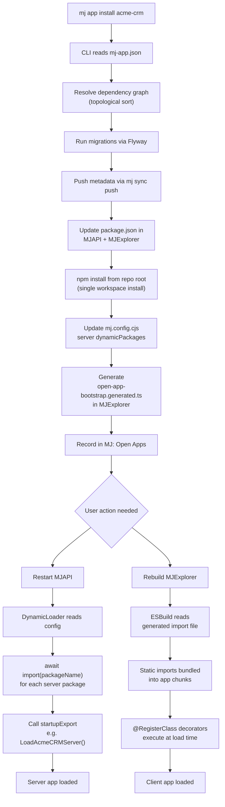

# MJ Open App Specification

## Overview

This document defines the **MJ Open App** standard — a packaging, distribution, and installation format for self-contained applications that run on the MemberJunction platform. An "app" is a deployable unit consisting of a database schema, metadata, and npm packages — published as a GitHub repository with tagged releases.

### Goals

1. **Standardized packaging** — Any developer can create and distribute an MJ app using a well-defined manifest format.
2. **Schema isolation** — Each app owns a dedicated database schema, preventing collisions with MJ core (`__mj`) or other apps.
3. **Version management** — Apps use semver via GitHub release tags. Migrations manage schema evolution across versions.
4. **Metadata portability** — App metadata (entities, actions, prompts, agents, dashboards, etc.) is packaged using the existing mj-sync format and pushed into the target MJ installation at install time.
5. **npm integration** — App code ships as npm packages (public or private registry) and integrates with MJ's dynamic package loading system.
6. **CLI-driven lifecycle** — `mj app install`, `mj app upgrade`, `mj app remove` commands handle the full lifecycle.
7. **Immutable artifacts** — App authors publish immutable, pre-built code via npm and immutable tagged migrations via GitHub. The consumer's environment never runs CodeGen on app schemas.
8. **MJ Central compatibility** — The spec enables a hosted registry (MJ Central) to wrap discovery, ratings, and UI around the open standard.

### Non-Goals (for now)

- Runtime app sandboxing or permission isolation (apps run with full MJ server privileges)
- Multi-tenancy within a single app (handled at the MJ platform level)
- Hot-swapping apps without server restart
- Paid app licensing enforcement (MJ Central / marketplace concern, not spec concern)
- Automatic rollback on failed install/upgrade (use database backups and git reversion)

---

## Terminology

| Term | Definition |
|------|-----------|
| **Open App** | A distributable unit of functionality for MemberJunction, defined by a manifest |
| **App Manifest** | A `mj-app.json` file at the repository root describing the app |
| **App Schema** | The dedicated database schema owned by the app (e.g., `acme_crm`, `oss_helpdesk`) |
| **App Version** | A semver version corresponding to a GitHub release tag |
| **App Registry** | A service (like MJ Central) that indexes available apps and their versions |
| **Core Schema** | The `__mj` schema where MemberJunction core entities live |
| **Consumer** | An MJ installation that installs and runs apps |
| **Publisher** | The developer or organization that creates and maintains an app |
| **Bootstrap Package** | An npm package that contains static imports of all `@RegisterClass`-decorated classes for tree-shaking prevention |

---

## Repository Structure

An MJ Open App is a **GitHub repository** (public or private) that conforms to the following structure:

```
my-mj-app/
├── mj-app.json                    # App manifest (REQUIRED)
├── migrations/                     # Database migrations (REQUIRED if app has schema)
│   ├── V202602010000__v1.0.x__Initial_Schema.sql
│   ├── V202603150000__v1.1.x__Add_Status_Column.sql
│   └── ...
├── metadata/                       # mj-sync metadata files (REQUIRED)
│   ├── .mj-sync.json              # Sync configuration with directoryOrder
│   ├── entities/                   # Entity metadata registrations
│   ├── actions/                    # Action definitions
│   ├── prompts/                    # AI prompt definitions
│   │   └── templates/             # Prompt template content files
│   ├── agents/                     # AI agent definitions
│   ├── applications/               # Application nav definitions
│   ├── dashboards/                 # Dashboard definitions
│   └── ...                         # Any mj-sync entity directories
├── packages/                       # Source code (OPTIONAL for closed-source)
│   ├── server-bootstrap/          # Server bootstrap package (REQUIRED)
│   ├── ng-bootstrap/              # Angular bootstrap package (REQUIRED if app has UI)
│   ├── server/                    # Server-side packages
│   ├── client/                    # Client-side packages (Angular, etc.)
│   └── types/                     # Shared TypeScript types
├── LICENSE                         # (RECOMMENDED)
├── README.md                       # (RECOMMENDED)
└── CHANGELOG.md                    # (RECOMMENDED)
```

### Versioning via GitHub Releases

- Tags MUST use the format `v{MAJOR}.{MINOR}.{PATCH}` (e.g., `v1.0.0`, `v1.2.3`)
- Pre-release tags MAY use suffixes: `v1.0.0-beta.1`, `v1.0.0-rc.1`
- The `mj-app.json` manifest MUST contain a `version` field matching the release tag
- Each tagged release represents a complete, installable snapshot of the app

### Private Repositories

Private repositories are fully supported. The consumer configures GitHub authentication via PAT, GitHub App Installation Token, or SSH key. The CLI uses the configured auth when fetching manifests from private repos.

```javascript
// mj.config.cjs — GitHub auth for private repos
module.exports = {
  openApps: {
    github: {
      // Option 1: Personal Access Token
      token: process.env.GITHUB_TOKEN,
      // Option 2: GitHub App
      appId: process.env.GH_APP_ID,
      installationId: process.env.GH_INSTALLATION_ID,
      privateKey: process.env.GH_PRIVATE_KEY
    }
  }
};
```

---

## App Manifest (`mj-app.json`)

The manifest is a JSON file at the repository root. It is the single source of truth for what the app is, what it contains, and how to install it.

### Manifest Parsing and Validation

The manifest uses **JSON format** exclusively. Internally, the CLI parses and validates the manifest using a **Zod schema**, providing precise, developer-friendly error messages when validation fails.

The architecture is designed for future extensibility via [Cosmiconfig](https://github.com/cosmiconfig/cosmiconfig), which would allow alternative formats (`mj-app.yml`, `mj-app.js`, or an `"mj-app"` key in `package.json`). However, for v1 only JSON is supported. JSON is the better format for hierarchical configuration data, and a single format simplifies tooling, indexing (MJ Central), and cross-platform compatibility.

The MJ `config` package will expose a generic config loader where you provide a module name (e.g., `mj-app`) and a Zod schema, and it returns either a validated config object or a structured error. This loader is reusable across MJ for any config-loading need.

### Full Example

```jsonc
{
  // ── Identity ──────────────────────────────────────────────
  "$schema": "https://schema.memberjunction.org/mj-app/v1.json",
  "manifestVersion": 1,                          // REQUIRED - manifest format version
  "name": "acme-crm",                            // REQUIRED - unique identifier (lowercase, hyphens)
  "displayName": "Acme CRM",                     // REQUIRED - human-readable name
  "description": "Customer relationship management for MemberJunction",  // REQUIRED
  "version": "1.2.0",                            // REQUIRED - semver, must match release tag
  "license": "MIT",                               // RECOMMENDED - SPDX identifier
  "icon": "fa-solid fa-handshake",                // RECOMMENDED - Font Awesome icon class
  "color": "#2196f3",                             // OPTIONAL - hex color for UI theming

  // ── Publisher ─────────────────────────────────────────────
  "publisher": {                                  // REQUIRED
    "name": "Acme Corporation",                   // REQUIRED
    "email": "dev@acme.com",                      // OPTIONAL
    "url": "https://acme.com"                     // OPTIONAL
  },

  // ── Repository ────────────────────────────────────────────
  "repository": "https://github.com/acme/mj-crm",  // REQUIRED - GitHub repo URL

  // ── MJ Compatibility ─────────────────────────────────────
  "mjVersionRange": ">=4.0.0 <5.0.0",            // REQUIRED - semver range of compatible MJ versions

  // ── Database Schema ───────────────────────────────────────
  "schema": {                                     // REQUIRED if app has database objects
    "name": "acme_crm",                           // REQUIRED - SQL schema name (unique per app)
    "createIfNotExists": true                     // OPTIONAL - default: true
  },

  // ── Migrations ────────────────────────────────────────────
  "migrations": {                                 // REQUIRED if app has database objects
    "directory": "migrations",                    // OPTIONAL - default: "migrations"
    "engine": "flyway"                            // OPTIONAL - default: "flyway"
  },

  // ── Metadata ──────────────────────────────────────────────
  "metadata": {                                   // REQUIRED
    "directory": "metadata"                       // OPTIONAL - default: "metadata"
  },

  // ── NPM Packages ─────────────────────────────────────────
  "packages": {                                   // REQUIRED
    "registry": "https://registry.npmjs.org",     // OPTIONAL - default: npm public registry
    "server": [                                   // Server-side packages
      {
        "name": "@acme/mj-crm-server-bootstrap",
        "role": "bootstrap",                      // bootstrap | actions | engine | provider | library
        "startupExport": "LoadAcmeCRMServer"      // Named export called at startup
      },
      {
        "name": "@acme/mj-crm-actions",
        "role": "actions"
      }
    ],
    "client": [                                   // Client-side packages (Angular)
      {
        "name": "@acme/mj-crm-ng-bootstrap",
        "role": "bootstrap",
        "startupExport": "LoadAcmeCRMClient"
      },
      {
        "name": "@acme/mj-crm-ng",
        "role": "module"                          // module | components | library
      }
    ],
    "shared": [                                   // Packages used by both server and client
      {
        "name": "@acme/mj-crm-types",
        "role": "library"
      }
    ]
  },

  // ── App Dependencies ──────────────────────────────────────
  "dependencies": {                               // OPTIONAL - other MJ apps this app requires
    "acme-billing": ">=1.0.0",                    // App name -> semver range
    "acme-contacts": "^2.0.0"
  },

  // ── Code Visibility ───────────────────────────────────────
  "code": {                                       // OPTIONAL - defaults to closed-source
    "visibility": "public",                       // public | private
    "sourceDirectory": "packages"                 // Informational only
  },

  // ── Configuration Schema ──────────────────────────────────
  "configuration": {                              // OPTIONAL - app-specific config schema
    "schema": {                                   // JSON Schema for mj.config.cjs openApps.{appName}
      "type": "object",
      "properties": {
        "apiEndpoint": {
          "type": "string",
          "description": "External CRM API endpoint"
        },
        "syncInterval": {
          "type": "integer",
          "description": "Sync interval in minutes",
          "default": 60
        }
      }
    }
  },

  // ── Hooks ─────────────────────────────────────────────────
  "hooks": {                                      // OPTIONAL - lifecycle hooks
    "postInstall": "node scripts/post-install.js",
    "postUpgrade": "node scripts/post-upgrade.js",
    "preRemove": "node scripts/pre-remove.js"
  },

  // ── Discovery (MJ Central) ───────────────────────────────
  "categories": ["CRM", "Sales"],                 // OPTIONAL - max 5
  "tags": ["contacts", "deals", "pipeline"]       // OPTIONAL - max 20, lowercase
}
```

### Field Reference

#### Identity Fields

| Field | Type | Required | Description |
|-------|------|----------|-------------|
| `$schema` | string | No | JSON Schema URL for validation |
| `manifestVersion` | integer | Yes | Manifest format version. Currently `1`. |
| `name` | string | Yes | Unique app identifier. Lowercase alphanumeric + hyphens. 3-64 chars. |
| `displayName` | string | Yes | Human-readable name for UI display |
| `description` | string | Yes | Short description (10-500 chars) |
| `version` | string | Yes | Semver version. MUST match GitHub release tag. |
| `license` | string | No | SPDX license identifier |
| `icon` | string | No | Font Awesome icon class |
| `color` | string | No | Hex color string |

#### Publisher

| Field | Type | Required | Description |
|-------|------|----------|-------------|
| `publisher.name` | string | Yes | Publisher display name |
| `publisher.email` | string | No | Contact email |
| `publisher.url` | string | No | Publisher website |

#### Compatibility

| Field | Type | Required | Description |
|-------|------|----------|-------------|
| `mjVersionRange` | string | Yes | Semver range of compatible MJ versions |
| `dependencies` | object | No | Map of app name to semver range for required peer apps. Transitive dependencies are resolved and auto-installed by the CLI. |

#### Database Schema

| Field | Type | Required | Description |
|-------|------|----------|-------------|
| `schema.name` | string | Yes (if DB) | SQL Server schema name. Convention: `{publisher}_{app}`. |
| `schema.createIfNotExists` | boolean | No | Create the schema at install time. Default: `true`. |

#### Migrations

| Field | Type | Required | Description |
|-------|------|----------|-------------|
| `migrations.directory` | string | No | Relative path to migrations. Default: `"migrations"`. |
| `migrations.engine` | string | No | Only `"flyway"` supported. Default: `"flyway"`. |

#### Packages

| Field | Type | Required | Description |
|-------|------|----------|-------------|
| `packages.registry` | string | No | npm registry URL. Default: public npm. |
| `packages.server` | array | No | Server-side npm packages |
| `packages.client` | array | No | Client-side npm packages |
| `packages.shared` | array | No | Packages used by both server and client |

Each package entry:

| Field | Type | Required | Description |
|-------|------|----------|-------------|
| `name` | string | Yes | npm package name (e.g., `@acme/mj-crm-server-bootstrap`) |
| `role` | string | Yes | `bootstrap`, `actions`, `engine`, `provider`, `module`, `components`, `library` |
| `startupExport` | string | No | Named export to call at startup. Required for `bootstrap` role packages. |

---

## JSON Schema

The formal JSON Schema for `mj-app.json` is at `schemas/mj-app.schema.json` in this plan directory. Key validation rules:

- `name`: Pattern `^[a-z][a-z0-9-]{1,62}[a-z0-9]$` (3-64 chars, lowercase + hyphens)
- `version`: Full semver regex including pre-release and build metadata
- `schema.name`: Pattern `^_{0,2}[a-z][a-z0-9_]{1,126}[a-z0-9]$` (3-128 chars, lowercase + underscores, optional __ prefix)
- `color`: Pattern `^#[0-9a-fA-F]{6}$`
- `repository`: Must match `^https://github\.com/.+/.+$`
- `tags`: Each tag lowercase alphanumeric + hyphens, max 50 chars, max 20 tags
- `categories`: Max 5
- `manifestVersion`: Must be `1`

The JSON Schema file is a standalone artifact that can be published to `schema.memberjunction.org` for editor validation. Internally, the CLI uses a Zod schema derived from these same rules for runtime validation.

---

## Database Schema Isolation

### Design Principles

Each app operates in its own SQL Server schema:

- **Namespace isolation** — No table name collisions between apps or with MJ core
- **Clear ownership** — Easy to identify which tables belong to which app
- **Clean removal** — Dropping the schema removes all app database objects
- **Independent migrations** — Each app manages its own migration history
- **CodeGen exclusion** — App schemas are excluded from consumer CodeGen runs by default

### Schema Naming Convention

```
{publisher}_{appname}
```

Examples: `acme_crm`, `acme_helpdesk`, `oss_analytics`

Rules:
- Lowercase alphanumeric + underscores only
- May start with up to two underscores (e.g., `__bcsaas`) for system-level extensions. Three or more leading underscores are reserved.
- Must not collide with SQL Server reserved schema names (`dbo`, `sys`, `guest`, etc.)
- Max 128 characters

### Entity Naming Convention

To prevent entity name collisions across apps and with MJ core, app entities MUST use a prefix based on the app name:

```
{AppDisplayName}: {EntityName}
```

Examples: `Acme CRM: Contacts`, `Acme CRM: Deals`, `Acme CRM: Pipeline Stages`

This mirrors the `MJ: ` prefix convention used by newer MJ core entities and ensures uniqueness in the global `Entity` metadata table.

### Cross-Schema References

Apps reference MJ core entities through standard foreign keys:

```sql
CREATE TABLE ${flyway:defaultSchema}.Contact (
    ID UNIQUEIDENTIFIER NOT NULL DEFAULT NEWSEQUENTIALID(),
    Name NVARCHAR(200) NOT NULL,
    OwnerUserID UNIQUEIDENTIFIER NOT NULL,
    CONSTRAINT PK_Contact PRIMARY KEY (ID),
    CONSTRAINT FK_Contact_User FOREIGN KEY (OwnerUserID)
        REFERENCES __mj.[User](ID)
);
```

Rules:
- Apps MAY reference `__mj` schema entities via foreign keys
- Apps MAY reference other installed app schemas (declared in `dependencies`)
- Apps MUST NOT modify tables in `__mj` or other app schemas (this is trust-based — the CLI does not enforce it via migration scanning, but violating this voids compatibility guarantees)
- The `__mj` reference is always literal (not a placeholder) — it's the well-known core schema
- Cross-app metadata references are supported: app A's metadata MAY use `@lookup:` to reference entities defined by app B, provided B is declared in A's `dependencies`

### Entity Registration with MJ Core

When an app creates tables in its schema, those tables are registered as MJ entities so they participate in the metadata system (RunView, entity objects, etc.):

1. App's `metadata/entities/` directory declares entity metadata
2. `mj sync push` registers entities in the MJ `Entity` and `EntityField` tables
3. The app's entities are now visible to the MJ metadata system, living in a separate schema

The app author is responsible for including **all database objects** in their migrations — tables, stored procedures, views, and any other DDL. Unlike MJ core development where CodeGen generates sprocs and views, app migrations must be self-contained because CodeGen does not run on app schemas at install time.

### CodeGen Exclusion

App schemas are excluded from the consumer's CodeGen runs by default. This means:

- The consumer's `mj codegen` will skip all schemas belonging to installed Open Apps
- App authors publish their own generated entity classes as part of their npm packages
- This prevents tight coupling between app code and the consumer's CodeGen output
- This mirrors how `__mj` core schemas are excluded from consumer CodeGen runs

To override this behavior (not recommended in most cases), the consumer can set a flag in their config:

```javascript
// mj.config.cjs — Override CodeGen exclusion (use with caution)
module.exports = {
  openApps: {
    codeGenExclusions: {
      includeAppSchemas: false,  // default: false — set true to include app schemas in CodeGen
      overrideApps: ['acme-crm'] // or list specific apps to include
    }
  }
};
```

---

## Migrations

### Flyway Integration

App migrations follow the same Flyway conventions as MJ core. The key difference: **the default schema is the app's schema**, not `__mj`.

File naming convention:
```
V{YYYYMMDDHHMM}__v{VERSION}.x_{DESCRIPTION}.sql
```

Examples:
```
V202602010000__v1.0.x__Initial_Schema.sql
V202602150000__v1.0.x__Add_Contact_Status.sql
V202603010000__v1.1.x__Add_Deal_Pipeline.sql
```

### Schema Placeholder

Migrations MUST use `${flyway:defaultSchema}` for the app schema. When the CLI runs migrations, it sets `flyway.defaultSchema` to the app's schema name from the manifest.

### Flyway History Table

Each app gets its own Flyway history table within its schema:
```
acme_crm.flyway_schema_history
```

This keeps migration history isolated per app and allows independent version tracking.

### Migration Rules

All MJ migration rules apply (see `/migrations/CLAUDE.md`), plus:

1. Use `${flyway:defaultSchema}` for app tables — never hardcode the schema name
2. Use `__mj` literally for core references
3. Never modify `__mj` objects
4. Hardcode UUIDs (not `NEWID()`)
5. No `__mj_` timestamp columns — CodeGen adds these when it processes the consumer's schemas
6. No FK indexes — CodeGen creates these when it processes the consumer's schemas

### Self-Contained Migrations

Unlike MJ core development where CodeGen auto-generates stored procedures and views, **app migrations must include all database objects**:

- **Tables** — Standard `CREATE TABLE` with constraints
- **Stored Procedures** — `spCreate*`, `spUpdate*`, `spDelete*` procedures
- **Views** — Any views the app needs (including the base entity view)
- **Indexes** — Any custom indexes beyond what CodeGen would create for FKs

The app author runs CodeGen in their own development environment to generate these objects, then includes the output in their migration files. This ensures the consumer receives a complete, self-contained migration.

### Baseline Migrations

For major version jumps, apps MAY include a baseline migration using the Flyway `B` prefix:

```
B202602010000__v2.0_Baseline.sql    # Complete schema for fresh v2.0 installs
V202602150000__v2.1.x__Add_Feature.sql
```

---

## Metadata Packaging

### mj-sync Format

App metadata uses the exact same mj-sync format as MJ core. The app's `metadata/` directory mirrors the structure used in `/metadata/` at the MJ repo root.

### Directory Structure

```
metadata/
├── .mj-sync.json                   # Root sync config with directoryOrder
├── entities/
│   ├── .mj-sync.json
│   └── .crm-entities.json
├── actions/
│   ├── .mj-sync.json
│   ├── .crm-actions.json
│   └── templates/
│       └── sync-contacts.md
├── prompts/
│   ├── .mj-sync.json
│   ├── .crm-prompts.json
│   └── templates/
│       └── contact-summary.md
├── agents/
│   ├── .mj-sync.json
│   └── .crm-agents.json
├── applications/
│   ├── .mj-sync.json
│   └── .crm-application.json
├── dashboards/
│   ├── .mj-sync.json
│   └── .crm-dashboards.json
└── scheduled-jobs/
    ├── .mj-sync.json
    └── .crm-jobs.json
```

### Root `.mj-sync.json`

```json
{
  "version": "1.0.0",
  "push": { "autoCreateMissingRecords": true },
  "directoryOrder": [
    "entities", "action-categories", "actions",
    "prompt-categories", "prompts",
    "agent-types", "agents",
    "applications", "dashboard-part-types", "dashboards",
    "scheduled-jobs"
  ]
}
```

### Entity Registration Example

```json
[
  {
    "fields": {
      "Name": "Acme CRM: Contacts",
      "SchemaName": "acme_crm",
      "BaseTable": "Contact",
      "Description": "CRM contacts tracked by Acme CRM",
      "AllowCreateAPI": true,
      "AllowUpdateAPI": true,
      "AllowDeleteAPI": true,
      "TrackRecordChanges": true,
      "IncludeInAPI": true
    }
  }
]
```

The `SchemaName` in entity metadata MUST match `schema.name` in the app manifest.

### Application Registration Example

```json
{
  "fields": {
    "Name": "Acme CRM",
    "Description": "Customer relationship management",
    "Icon": "fa-solid fa-handshake",
    "DefaultForNewUser": false,
    "Color": "#2196f3",
    "DefaultSequence": 500,
    "DefaultNavItems": [
      {
        "Label": "Contacts",
        "Icon": "fa-solid fa-address-book",
        "ResourceType": "Custom",
        "DriverClass": "AcmeCRMContactsResource",
        "isDefault": true
      },
      {
        "Label": "Deals",
        "Icon": "fa-solid fa-chart-line",
        "ResourceType": "Custom",
        "DriverClass": "AcmeCRMDealsResource",
        "isDefault": false
      }
    ]
  },
  "relatedEntities": { "Application Entities": [] }
}
```

### Metadata Merge Strategy

When metadata is pushed during install or upgrade:

- **New records** -> Created automatically
- **Existing records (by primaryKey)** -> Updated with new field values
- **Missing records** -> NOT deleted automatically (manual cleanup required)
- **@lookup references** -> Resolved against the live database at push time

Apps can safely push metadata on every upgrade — existing customizations to fields not managed by the app are preserved.

---

## NPM Package Integration

### Package Architecture

Apps follow a bootstrap package pattern similar to MJ core's `@memberjunction/server-bootstrap` and `@memberjunction/ng-bootstrap`:

```
@acme/mj-crm-server-bootstrap   # Server bootstrap — static imports + CLASS_REGISTRATIONS
@acme/mj-crm-ng-bootstrap       # Angular bootstrap — static imports + CLASS_REGISTRATIONS
@acme/mj-crm-server             # Server-side services + actions
@acme/mj-crm-types              # Shared TypeScript types + generated entity classes
@acme/mj-crm-ng                 # Angular module + components
```

### Bootstrap Package Requirement

Every app MUST publish bootstrap packages that serve as the entry point for class registration. These packages:

1. Contain static imports of all `@RegisterClass`-decorated classes across the app's packages
2. Export a `CLASS_REGISTRATIONS` array (created by running `mj codegen manifest` in the app's dev environment)
3. Export a startup function (e.g., `LoadAcmeCRMServer`) that the dynamic loader calls

This mirrors how MJ core uses `@memberjunction/server-bootstrap` and `@memberjunction/ng-bootstrap`. The app author runs `mj codegen manifest` in their own development environment and publishes the result as an immutable npm package.

**Server bootstrap example:**

```typescript
// @acme/mj-crm-server-bootstrap/src/index.ts

// Static imports ensure tree-shaking cannot eliminate these classes
import '@acme/mj-crm-server';
import '@acme/mj-crm-actions';

// Generated by mj codegen manifest — DO NOT EDIT
export const CLASS_REGISTRATIONS = [
    // ... registration entries
];

export function LoadAcmeCRMServer(): void {
    // Force module evaluation — static imports above handle registration
}
```

**Angular bootstrap example:**

```typescript
// @acme/mj-crm-ng-bootstrap/src/index.ts

import '@acme/mj-crm-ng';

export const CLASS_REGISTRATIONS = [
    // ... registration entries
];

export function LoadAcmeCRMClient(): void {
    // Force module evaluation
}
```

### Private npm Registries

For closed-source apps, configure registry auth in `.npmrc`:
```
@acme:registry=https://npm.acme.com
//npm.acme.com/:_authToken=${NPM_ACME_TOKEN}
```

---

## Dynamic Package Loading

### Problem

Today, integrating new packages into MJAPI or MJExplorer requires manually editing `package.json`, adding static imports in source code, and regenerating class registration manifests. This is error-prone and blocks CLI automation of the install process.

### Solution

MJ introduces an **automated package integration system** that eliminates manual source code changes when installing or removing apps. The CLI manages `package.json` dependencies and configuration files — the developer never edits code.

Server and client use different loading mechanisms due to fundamental platform differences, but the developer experience is identical for both: run `mj app install`, then restart/rebuild.

| | Server (MJAPI) | Client (MJExplorer) |
|---|---|---|
| **Mechanism** | Runtime `await import()` via DynamicLoader | Build-time static imports via generated file |
| **Why** | Node.js resolves packages from `node_modules` at runtime | Browsers have no module resolver; ESBuild must bundle at build time |
| **CLI manages** | `mj.config.cjs` dynamicPackages array | `open-app-bootstrap.generated.ts` import file |
| **After install** | Restart server | Rebuild + restart |

### How It Works



### Monorepo Awareness

The consumer's repo is an npm workspace monorepo. The CLI is aware of this:

1. **Server deps** are added to `packages/MJAPI/package.json`
2. **Client deps** are added to `packages/MJExplorer/package.json`
3. **Single `npm install`** runs from the repo root (npm workspaces handle resolution)
4. **Config files** are managed at the repo root (`mj.config.cjs`) and in MJExplorer (`open-app-bootstrap.generated.ts`)

### Server-Side: Runtime Dynamic Loading

#### Configuration

The consumer's `mj.config.cjs` includes a `dynamicPackages` section managed by the CLI:

```javascript
// mj.config.cjs — managed by `mj app install` / `mj app remove`
module.exports = {
  // ... existing MJ config ...

  dynamicPackages: {
    server: [
      {
        packageName: '@acme/mj-crm-server-bootstrap',
        startupExport: 'LoadAcmeCRMServer',
        appName: 'acme-crm',           // Links back to the Open App
        enabled: true                    // Can be toggled without removing
      }
    ]
  }
};
```

#### DynamicPackageLoad Type

```typescript
// @memberjunction/global — new type
interface DynamicPackageLoad {
    /** npm package name to dynamically import */
    PackageName: string;

    /** Named export to call after import (e.g., 'LoadAcmeCRMServer') */
    StartupExport: string;

    /** Open App name this package belongs to (for tracking) */
    AppName: string;

    /** Whether this package should be loaded. Allows disabling without removing. */
    Enabled: boolean;
}
```

#### DynamicLoader Utility

A utility class in `@memberjunction/global` handles the runtime import sequence:

```typescript
// @memberjunction/global — new utility
export class DynamicLoader {
    /**
     * Loads all enabled dynamic packages in order.
     * Called during MJAPI startup.
     */
    static async LoadPackages(packages: DynamicPackageLoad[]): Promise<DynamicLoadResult[]> {
        const results: DynamicLoadResult[] = [];

        for (const pkg of packages.filter(p => p.Enabled)) {
            try {
                const module = await import(pkg.PackageName);
                if (pkg.StartupExport && typeof module[pkg.StartupExport] === 'function') {
                    module[pkg.StartupExport]();
                }
                results.push({ PackageName: pkg.PackageName, Success: true });
            }
            catch (error) {
                results.push({
                    PackageName: pkg.PackageName,
                    Success: false,
                    Error: error instanceof Error ? error.message : String(error)
                });
                // Log but don't crash — other apps should still load
                LogError(`Failed to load dynamic package ${pkg.PackageName}: ${error}`);
            }
        }

        return results;
    }
}

interface DynamicLoadResult {
    PackageName: string;
    Success: boolean;
    Error?: string;
}
```

#### MJAPI Integration

```typescript
// During MJAPI initialization, after core bootstrap
import { DynamicLoader } from '@memberjunction/global';
import { configInfo } from './config';

const serverPackages = configInfo.dynamicPackages?.server ?? [];
const results = await DynamicLoader.LoadPackages(serverPackages);

for (const result of results) {
    if (!result.Success) {
        LogError(`Open App package failed to load: ${result.PackageName} — ${result.Error}`);
        // Update app status to 'Error' in MJ: Open Apps table
    }
}
```

### Client-Side: Generated Import File

#### Why Runtime Loading Doesn't Work in Angular

Browsers have no `node_modules` or runtime module resolver. Angular uses ESBuild to bundle everything at build time. A dynamic `await import(variable)` where the package name comes from a config file **cannot be resolved by ESBuild** — it doesn't know what to bundle. Only static import strings that ESBuild can analyze at build time get included in the output.

#### Solution: CLI-Generated Static Import File

The CLI generates a TypeScript file in MJExplorer that contains static import statements for each installed app's client bootstrap package. ESBuild sees these as normal imports and bundles them.

**Generated file location:**
```
packages/MJExplorer/src/app/generated/open-app-bootstrap.generated.ts
```

**Generated file contents (managed entirely by CLI):**

```typescript
/**
 * Open App Bootstrap — AUTO-GENERATED by `mj app install` / `mj app remove`
 * DO NOT EDIT — this file is overwritten on every app install/upgrade/remove
 *
 * Each import below loads an Open App's client bootstrap package, which triggers
 * @RegisterClass decorators and makes the app's components available to MJ's class factory.
 */

// acme-crm (v1.2.0)
import '@acme/mj-crm-ng-bootstrap';

// oss-helpdesk (v2.0.1)
import '@oss/mj-helpdesk-ng-bootstrap';
```

**One-time setup in MJExplorer (already done by MJ core):**

MJExplorer's `main.ts` includes a single permanent import:

```typescript
import './app/generated/open-app-bootstrap.generated';
```

This file always exists (even if empty when no apps are installed). From that point on, the CLI manages its contents — developers never touch it.

#### How It Works

1. `mj app install` adds client packages to `packages/MJExplorer/package.json`
2. `npm install` from repo root installs them into the workspace
3. CLI writes/updates `open-app-bootstrap.generated.ts` with import lines for each app's client bootstrap
4. User rebuilds MJExplorer — ESBuild sees the static imports, bundles the packages
5. At load time, the imports evaluate, `@RegisterClass` decorators fire, components are available

#### Disable/Enable Behavior

When an app is disabled via `mj app disable`, the CLI comments out the import line:

```typescript
// acme-crm (v1.2.0) [DISABLED]
// import '@acme/mj-crm-ng-bootstrap';
```

Re-enabling via `mj app enable` uncomments it. A rebuild is required for the change to take effect.

### Key Benefits

- **No manual source code changes** — CLI manages `package.json`, `mj.config.cjs`, and the generated import file
- **Graceful failure** — A broken server-side app package doesn't crash MJAPI; client-side failures are caught at build time
- **Toggleable** — Apps can be disabled without uninstalling (server: `enabled: false` in config; client: commented import)
- **Ordered loading** — The CLI writes packages in dependency order
- **Auditable** — All managed files are human-readable and version-controllable
- **Platform-appropriate** — Each side uses the mechanism that actually works for its runtime

---

## Installation Lifecycle

### Install Flow

```
mj app install https://github.com/acme/mj-crm [--version 1.2.0]
```

1. **Fetch manifest** — Download `mj-app.json` from the specified GitHub release (latest if no version)
2. **Validate manifest** — Parse with Zod schema, check `manifestVersion`
3. **Validate compatibility** — Check `mjVersionRange` against installed MJ version
4. **Resolve dependencies** — Build full dependency graph. If app A depends on B which depends on C, resolve and topologically sort the install order (C -> B -> A). Fail on circular dependencies or unresolvable version conflicts.
5. **Install dependencies** — Auto-install any missing dependency apps (recursive, depth-first)
6. **Check schema** — Verify `schema.name` doesn't already exist (and isn't claimed by another app)
7. **Create schema** — `CREATE SCHEMA [acme_crm]` if `createIfNotExists` is true
8. **Run migrations** — Execute Flyway against the app schema (sets `flyway.defaultSchema` to app schema, history table in app schema)
9. **Push metadata** — Run `mj sync push` to register entities, actions, prompts, etc.
10. **Update package.json files** — Add server packages to `packages/MJAPI/package.json`, client packages to `packages/MJExplorer/package.json`
11. **Run npm install** — Single `npm install` from repo root (npm workspaces resolve both)
12. **Update server config** — Add entries to `dynamicPackages.server` in `mj.config.cjs`
13. **Update client imports** — Regenerate `packages/MJExplorer/src/app/generated/open-app-bootstrap.generated.ts`
14. **Execute hooks** — Run `postInstall` hook if defined
15. **Record installation** — Create record in `MJ: Open Apps` table, create initial `MJ: Open App Install History` entry

### Upgrade Flow

```
mj app upgrade acme-crm [--version 1.3.0]
```

1. Fetch new manifest from target version
2. Validate manifest and compatibility
3. Check dependency compatibility with new version
4. Run migrations (Flyway applies only new ones via `flyway_schema_history` in the app's schema)
5. Push metadata (mj-sync updates existing, creates new records)
6. Update npm package versions in `packages/MJAPI/package.json` and `packages/MJExplorer/package.json`
7. Run `npm install` from repo root
8. Update `dynamicPackages.server` in `mj.config.cjs` if bootstrap packages changed
9. Regenerate `open-app-bootstrap.generated.ts` if client bootstrap packages changed
10. Execute `postUpgrade` hook
11. Update version in `MJ: Open Apps`, create `MJ: Open App Install History` entry

### Remove Flow

```
mj app remove acme-crm [--keep-data]
```

1. **Check dependents** — Verify no other installed apps depend on this one. Fail if dependents exist (user must remove them first or use `--force`).
2. **Execute `preRemove` hook**
3. **Remove server config** — Remove entries from `dynamicPackages.server` in `mj.config.cjs`
4. **Remove client imports** — Regenerate `open-app-bootstrap.generated.ts` without this app
5. **Remove npm packages** — Remove app packages from `packages/MJAPI/package.json` and `packages/MJExplorer/package.json`, run `npm install` from repo root
6. **Remove metadata** — Delete app's entity registrations, actions, prompts, etc. from MJ metadata tables. Note: this deletes metadata records only; user data in the app's schema is controlled by step 7.
7. **Drop schema** (unless `--keep-data`) — `DROP SCHEMA [acme_crm]` and all contained objects. With `--keep-data`, the schema and its tables are preserved but entity registrations are removed.
8. **Update `MJ: Open Apps`** — Set status to `Removed`, create final `MJ: Open App Install History` entry

### Rollback

Automatic rollback is **not supported**. If an install or upgrade fails partway through:

- The `MJ: Open App Install History` table records which phase failed (`ErrorPhase`)
- The consumer should use **database backups** to restore the database to its pre-operation state
- The consumer should use **git reversion** to restore `package.json` and `mj.config.cjs` to their prior state

This is a deliberate design choice. Implementing reliable multi-phase rollback (across migrations, metadata, npm packages, and config changes) adds enormous complexity for a scenario that database backups already handle well.

### List and Info

```
mj app list                    # List installed apps with versions
mj app info acme-crm           # Show detailed info about an installed app
mj app check-updates           # Check for available upgrades
mj app disable acme-crm        # Set enabled: false in dynamicPackages (no uninstall)
mj app enable acme-crm         # Set enabled: true in dynamicPackages
```

---

## Data Model

MJ tracks installed Open Apps in core `__mj` entities. These follow the `"MJ: "` prefix naming convention.

### Entity Relationship Diagram

```
                    ┌──────────────────────┐
                    │  MJ: App Registries  │
                    │──────────────────────│
                    │ ID                   │
                    │ Name                 │
                    │ URL                  │
                    │ Type                 │
                    │ Status               │
                    └──────────┬───────────┘
                               │ 1:N
                               ▼
┌──────────────────────────────────────────────────────┐
│                    MJ: Open Apps                      │
│──────────────────────────────────────────────────────│
│ ID, Name (unique), DisplayName, Description          │
│ Version, Publisher, RepositoryURL                    │
│ SchemaName (unique), MJVersionRange                  │
│ ManifestJSON, Status, RegistryID                     │
└───┬──────────────────┬───────────────────┬───────────┘
    │ 1:N              │ 1:N               │ 1:N
    ▼                  ▼                   ▼
┌────────────────┐ ┌──────────────┐ ┌──────────────────┐
│ MJ: Open App   │ │ MJ: Open App │ │ MJ: Open App     │
│ Install History│ │ Packages     │ │ Dependencies     │
│────────────────│ │──────────────│ │──────────────────│
│ Version        │ │ PackageName  │ │ DependsOnAppName │
│ PrevVersion    │ │ PackageType  │ │ DependsOnAppID   │
│ Action         │ │ Role         │ │ VersionRange     │
│ Success        │ │ StartupExport│ │ Status           │
│ ErrorMessage   │ │ Registry     │ └──────────────────┘
│ ErrorPhase     │ └──────────────┘
└────────────────┘
```

### MJ: App Registries

Tracks known app registries (MJ Central, private registries, etc.).

| Column | Type | Nullable | Default | Description |
|--------|------|----------|---------|-------------|
| ID | UNIQUEIDENTIFIER | No | NEWSEQUENTIALID() | Primary key |
| Name | NVARCHAR(200) | No | | Registry display name |
| URL | NVARCHAR(500) | No | | Base URL of the registry API |
| Type | NVARCHAR(20) | No | 'Public' | Public, Private, or Local |
| APIVersion | NVARCHAR(20) | No | 'v1' | API version string |
| Description | NVARCHAR(MAX) | Yes | | Registry description |
| AuthMethod | NVARCHAR(50) | Yes | | None, APIKey, OAuth, Token |
| Status | NVARCHAR(20) | No | 'Active' | Active, Inactive, Error |

**Constraints:** PK, UNIQUE(Name), CHECK(Type), CHECK(Status)

**Default seed:** MJ Central pre-seeded with hardcoded UUID.

### MJ: Open Apps

Primary tracking entity for all Open Apps installed in this MJ instance.

| Column | Type | Nullable | Default | Description |
|--------|------|----------|---------|-------------|
| ID | UNIQUEIDENTIFIER | No | NEWSEQUENTIALID() | Primary key |
| Name | NVARCHAR(64) | No | | Unique app identifier from manifest |
| DisplayName | NVARCHAR(200) | No | | Human-readable name |
| Description | NVARCHAR(MAX) | Yes | | App description |
| Version | NVARCHAR(50) | No | | Currently installed semver version |
| Publisher | NVARCHAR(200) | No | | Publisher name |
| PublisherEmail | NVARCHAR(255) | Yes | | Publisher contact email |
| PublisherURL | NVARCHAR(500) | Yes | | Publisher website |
| RepositoryURL | NVARCHAR(500) | No | | GitHub repository URL |
| SchemaName | NVARCHAR(128) | Yes | | Database schema name (NULL if no DB objects) |
| MJVersionRange | NVARCHAR(100) | No | | Compatible MJ version range |
| License | NVARCHAR(50) | Yes | | SPDX license identifier |
| Icon | NVARCHAR(100) | Yes | | Font Awesome icon class |
| Color | NVARCHAR(20) | Yes | | Hex color for UI |
| ManifestJSON | NVARCHAR(MAX) | No | | Complete manifest JSON at current version |
| ConfigurationSchemaJSON | NVARCHAR(MAX) | Yes | | JSON Schema for app config |
| RegistryID | UNIQUEIDENTIFIER | Yes | | FK to AppRegistry |
| InstalledByUserID | UNIQUEIDENTIFIER | No | | FK to User |
| Status | NVARCHAR(20) | No | 'Active' | Active, Disabled, Error, Installing, Upgrading, Removing |

**Constraints:** PK, UNIQUE(Name), UNIQUE(SchemaName), FK(RegistryID -> AppRegistry), FK(InstalledByUserID -> User), CHECK(Status), CHECK(Name lowercase+hyphens only)

### MJ: Open App Install History

Audit trail of every install, upgrade, and removal action.

| Column | Type | Nullable | Default | Description |
|--------|------|----------|---------|-------------|
| ID | UNIQUEIDENTIFIER | No | NEWSEQUENTIALID() | Primary key |
| OpenAppID | UNIQUEIDENTIFIER | No | | FK to Open Apps |
| Version | NVARCHAR(50) | No | | Version installed/upgraded to |
| PreviousVersion | NVARCHAR(50) | Yes | | Version before this action (NULL for initial install) |
| Action | NVARCHAR(20) | No | | Install, Upgrade, Remove |
| ManifestJSON | NVARCHAR(MAX) | No | | Manifest snapshot at this version |
| MigrationsSummary | NVARCHAR(MAX) | Yes | | Summary of migrations applied |
| MetadataSummary | NVARCHAR(MAX) | Yes | | Summary of metadata changes |
| PackagesSummary | NVARCHAR(MAX) | Yes | | Summary of npm package changes |
| ExecutedByUserID | UNIQUEIDENTIFIER | No | | FK to User |
| DurationSeconds | INT | Yes | | How long the operation took |
| Success | BIT | No | 1 | Whether it succeeded |
| ErrorMessage | NVARCHAR(MAX) | Yes | | Error details if failed |
| ErrorPhase | NVARCHAR(50) | Yes | | Schema, Migration, Metadata, Packages, Config, Hooks |

**Constraints:** PK, FK(OpenAppID), FK(ExecutedByUserID), CHECK(Action), CHECK(ErrorPhase)

### MJ: Open App Packages

Tracks npm packages associated with each installed Open App.

| Column | Type | Nullable | Default | Description |
|--------|------|----------|---------|-------------|
| ID | UNIQUEIDENTIFIER | No | NEWSEQUENTIALID() | Primary key |
| OpenAppID | UNIQUEIDENTIFIER | No | | FK to Open Apps |
| PackageName | NVARCHAR(200) | No | | npm package name |
| PackageVersion | NVARCHAR(50) | No | | Currently installed version |
| PackageType | NVARCHAR(20) | No | | Server, Client, Shared |
| Role | NVARCHAR(50) | No | | bootstrap, actions, engine, provider, module, components, library |
| StartupExport | NVARCHAR(200) | Yes | | Named export to call at startup (bootstrap packages only) |
| RegistryURL | NVARCHAR(500) | Yes | | npm registry URL (NULL = public npm) |
| Status | NVARCHAR(20) | No | 'Installed' | Installed, Error, Pending |

**Constraints:** PK, FK(OpenAppID), UNIQUE(OpenAppID, PackageName), CHECK(PackageType), CHECK(Status)

### MJ: Open App Dependencies

Tracks inter-app dependency relationships.

| Column | Type | Nullable | Default | Description |
|--------|------|----------|---------|-------------|
| ID | UNIQUEIDENTIFIER | No | NEWSEQUENTIALID() | Primary key |
| OpenAppID | UNIQUEIDENTIFIER | No | | The app that has the dependency |
| DependsOnAppName | NVARCHAR(64) | No | | Name of the required app |
| DependsOnAppID | UNIQUEIDENTIFIER | Yes | | FK to Open Apps (if installed) |
| VersionRange | NVARCHAR(100) | No | | Required semver range |
| InstalledVersion | NVARCHAR(50) | Yes | | Current version of dependency |
| Status | NVARCHAR(20) | No | 'Satisfied' | Satisfied, Missing, Incompatible |

**Constraints:** PK, FK(OpenAppID), FK(DependsOnAppID), UNIQUE(OpenAppID, DependsOnAppName), CHECK(Status)

### Relationship to Existing Entities

| Existing Entity | Relationship |
|----------------|-------------|
| **Users** | OpenApp.InstalledByUserID, OpenAppInstallHistory.ExecutedByUserID |
| **Applications** | Apps create Application records via metadata sync (not FK — these are different concepts) |
| **Entities** | App entities registered through metadata sync, SchemaName links to app schema |
| **Actions** | App actions registered through metadata sync |
| **AI Prompts** | App prompts registered through metadata sync |
| **AI Agents** | App agents registered through metadata sync |
| **Dashboards** | App dashboards registered through metadata sync |

The `MJ: Open Apps` entity tracks **installation state**, while actual app content (entities, actions, etc.) lives in their respective MJ core metadata entities, linked implicitly by schema name and metadata ownership. "Open Apps" and "Applications" are distinct concepts — an Application is a UI nav container; an Open App is a deployable unit of functionality that may *contain* one or more Applications.

### Migration SQL

This is the actual migration that would ship with MJ core to create the tracking tables. Follows all MJ migration conventions (no `__mj_` timestamps, no FK indexes — CodeGen handles those).

```sql
-- Migration: Open App tracking tables
-- These tables live in the __mj core schema and are part of MemberJunction itself,
-- not part of any individual app. They track what Open Apps are installed in this instance.

-----------------------------------------------------------------------
-- 1. App Registries
-----------------------------------------------------------------------
CREATE TABLE ${flyway:defaultSchema}.AppRegistry (
    ID UNIQUEIDENTIFIER NOT NULL DEFAULT NEWSEQUENTIALID(),
    Name NVARCHAR(200) NOT NULL,
    URL NVARCHAR(500) NOT NULL,
    Type NVARCHAR(20) NOT NULL DEFAULT 'Public',
    APIVersion NVARCHAR(20) NOT NULL DEFAULT 'v1',
    Description NVARCHAR(MAX) NULL,
    AuthMethod NVARCHAR(50) NULL,
    Status NVARCHAR(20) NOT NULL DEFAULT 'Active',
    CONSTRAINT PK_AppRegistry PRIMARY KEY (ID),
    CONSTRAINT UQ_AppRegistry_Name UNIQUE (Name),
    CONSTRAINT CK_AppRegistry_Type CHECK (Type IN ('Public', 'Private', 'Local')),
    CONSTRAINT CK_AppRegistry_Status CHECK (Status IN ('Active', 'Inactive', 'Error'))
);
GO

EXEC sp_addextendedproperty
    @name = N'MS_Description',
    @value = N'Known app registries (MJ Central, private registries, etc.)',
    @level0type = N'SCHEMA', @level0name = N'${flyway:defaultSchema}',
    @level1type = N'TABLE',  @level1name = N'AppRegistry';
GO

-- Seed MJ Central as the default public registry
INSERT INTO ${flyway:defaultSchema}.AppRegistry (ID, Name, URL, Type, APIVersion, Description, Status)
VALUES (
    'A0E1F2A3-B4C5-D6E7-F8A9-B0C1D2E3F4A5',
    'MJ Central',
    'https://central.memberjunction.org/api/v1',
    'Public',
    'v1',
    'The official MemberJunction app registry and marketplace',
    'Active'
);
GO

-----------------------------------------------------------------------
-- 2. Open Apps
-----------------------------------------------------------------------
CREATE TABLE ${flyway:defaultSchema}.OpenApp (
    ID UNIQUEIDENTIFIER NOT NULL DEFAULT NEWSEQUENTIALID(),
    Name NVARCHAR(64) NOT NULL,
    DisplayName NVARCHAR(200) NOT NULL,
    Description NVARCHAR(MAX) NULL,
    Version NVARCHAR(50) NOT NULL,
    Publisher NVARCHAR(200) NOT NULL,
    PublisherEmail NVARCHAR(255) NULL,
    PublisherURL NVARCHAR(500) NULL,
    RepositoryURL NVARCHAR(500) NOT NULL,
    SchemaName NVARCHAR(128) NULL,
    MJVersionRange NVARCHAR(100) NOT NULL,
    License NVARCHAR(50) NULL,
    Icon NVARCHAR(100) NULL,
    Color NVARCHAR(20) NULL,
    ManifestJSON NVARCHAR(MAX) NOT NULL,
    ConfigurationSchemaJSON NVARCHAR(MAX) NULL,
    RegistryID UNIQUEIDENTIFIER NULL,
    InstalledByUserID UNIQUEIDENTIFIER NOT NULL,
    Status NVARCHAR(20) NOT NULL DEFAULT 'Active',
    CONSTRAINT PK_OpenApp PRIMARY KEY (ID),
    CONSTRAINT UQ_OpenApp_Name UNIQUE (Name),
    CONSTRAINT UQ_OpenApp_Schema UNIQUE (SchemaName),
    CONSTRAINT FK_OpenApp_Registry FOREIGN KEY (RegistryID)
        REFERENCES ${flyway:defaultSchema}.AppRegistry(ID),
    CONSTRAINT FK_OpenApp_User FOREIGN KEY (InstalledByUserID)
        REFERENCES ${flyway:defaultSchema}.[User](ID),
    CONSTRAINT CK_OpenApp_Status CHECK (Status IN (
        'Active', 'Disabled', 'Error', 'Installing', 'Upgrading', 'Removing'
    )),
    CONSTRAINT CK_OpenApp_Name CHECK (Name NOT LIKE '%[^a-z0-9-]%')
);
GO

EXEC sp_addextendedproperty
    @name = N'MS_Description',
    @value = N'Tracks all MJ Open Apps installed in this instance',
    @level0type = N'SCHEMA', @level0name = N'${flyway:defaultSchema}',
    @level1type = N'TABLE',  @level1name = N'OpenApp';
GO

-----------------------------------------------------------------------
-- 3. Open App Install History (audit trail)
-----------------------------------------------------------------------
CREATE TABLE ${flyway:defaultSchema}.OpenAppInstallHistory (
    ID UNIQUEIDENTIFIER NOT NULL DEFAULT NEWSEQUENTIALID(),
    OpenAppID UNIQUEIDENTIFIER NOT NULL,
    Version NVARCHAR(50) NOT NULL,
    PreviousVersion NVARCHAR(50) NULL,
    Action NVARCHAR(20) NOT NULL,
    ManifestJSON NVARCHAR(MAX) NOT NULL,
    MigrationsSummary NVARCHAR(MAX) NULL,
    MetadataSummary NVARCHAR(MAX) NULL,
    PackagesSummary NVARCHAR(MAX) NULL,
    ExecutedByUserID UNIQUEIDENTIFIER NOT NULL,
    DurationSeconds INT NULL,
    Success BIT NOT NULL DEFAULT 1,
    ErrorMessage NVARCHAR(MAX) NULL,
    ErrorPhase NVARCHAR(50) NULL,
    CONSTRAINT PK_OpenAppInstallHistory PRIMARY KEY (ID),
    CONSTRAINT FK_OpenAppInstallHistory_App FOREIGN KEY (OpenAppID)
        REFERENCES ${flyway:defaultSchema}.OpenApp(ID),
    CONSTRAINT FK_OpenAppInstallHistory_User FOREIGN KEY (ExecutedByUserID)
        REFERENCES ${flyway:defaultSchema}.[User](ID),
    CONSTRAINT CK_OpenAppInstallHistory_Action CHECK (Action IN (
        'Install', 'Upgrade', 'Remove'
    )),
    CONSTRAINT CK_OpenAppInstallHistory_Phase CHECK (ErrorPhase IS NULL OR ErrorPhase IN (
        'Schema', 'Migration', 'Metadata', 'Packages', 'Config', 'Hooks'
    ))
);
GO

EXEC sp_addextendedproperty
    @name = N'MS_Description',
    @value = N'Audit trail of every install, upgrade, and removal for Open Apps',
    @level0type = N'SCHEMA', @level0name = N'${flyway:defaultSchema}',
    @level1type = N'TABLE',  @level1name = N'OpenAppInstallHistory';
GO

-----------------------------------------------------------------------
-- 4. Open App Packages
-----------------------------------------------------------------------
CREATE TABLE ${flyway:defaultSchema}.OpenAppPackage (
    ID UNIQUEIDENTIFIER NOT NULL DEFAULT NEWSEQUENTIALID(),
    OpenAppID UNIQUEIDENTIFIER NOT NULL,
    PackageName NVARCHAR(200) NOT NULL,
    PackageVersion NVARCHAR(50) NOT NULL,
    PackageType NVARCHAR(20) NOT NULL,
    Role NVARCHAR(50) NOT NULL,
    StartupExport NVARCHAR(200) NULL,
    RegistryURL NVARCHAR(500) NULL,
    Status NVARCHAR(20) NOT NULL DEFAULT 'Installed',
    CONSTRAINT PK_OpenAppPackage PRIMARY KEY (ID),
    CONSTRAINT FK_OpenAppPackage_App FOREIGN KEY (OpenAppID)
        REFERENCES ${flyway:defaultSchema}.OpenApp(ID),
    CONSTRAINT UQ_OpenAppPackage UNIQUE (OpenAppID, PackageName),
    CONSTRAINT CK_OpenAppPackage_Type CHECK (PackageType IN (
        'Server', 'Client', 'Shared'
    )),
    CONSTRAINT CK_OpenAppPackage_Status CHECK (Status IN (
        'Installed', 'Error', 'Pending'
    ))
);
GO

EXEC sp_addextendedproperty
    @name = N'MS_Description',
    @value = N'NPM packages associated with each installed Open App',
    @level0type = N'SCHEMA', @level0name = N'${flyway:defaultSchema}',
    @level1type = N'TABLE',  @level1name = N'OpenAppPackage';
GO

-----------------------------------------------------------------------
-- 5. Open App Dependencies
-----------------------------------------------------------------------
CREATE TABLE ${flyway:defaultSchema}.OpenAppDependency (
    ID UNIQUEIDENTIFIER NOT NULL DEFAULT NEWSEQUENTIALID(),
    OpenAppID UNIQUEIDENTIFIER NOT NULL,
    DependsOnAppName NVARCHAR(64) NOT NULL,
    DependsOnAppID UNIQUEIDENTIFIER NULL,
    VersionRange NVARCHAR(100) NOT NULL,
    InstalledVersion NVARCHAR(50) NULL,
    Status NVARCHAR(20) NOT NULL DEFAULT 'Satisfied',
    CONSTRAINT PK_OpenAppDependency PRIMARY KEY (ID),
    CONSTRAINT FK_OpenAppDep_App FOREIGN KEY (OpenAppID)
        REFERENCES ${flyway:defaultSchema}.OpenApp(ID),
    CONSTRAINT FK_OpenAppDep_DepApp FOREIGN KEY (DependsOnAppID)
        REFERENCES ${flyway:defaultSchema}.OpenApp(ID),
    CONSTRAINT UQ_OpenAppDep UNIQUE (OpenAppID, DependsOnAppName),
    CONSTRAINT CK_OpenAppDep_Status CHECK (Status IN (
        'Satisfied', 'Missing', 'Incompatible'
    ))
);
GO

EXEC sp_addextendedproperty
    @name = N'MS_Description',
    @value = N'Inter-app dependency relationships between installed Open Apps',
    @level0type = N'SCHEMA', @level0name = N'${flyway:defaultSchema}',
    @level1type = N'TABLE',  @level1name = N'OpenAppDependency';
GO
```

**Notes on the migration:**
- Uses `${flyway:defaultSchema}` throughout — this resolves to `__mj` since these are core MJ tables
- No `__mj_CreatedAt` / `__mj_UpdatedAt` columns — CodeGen adds those automatically
- No FK indexes — CodeGen creates `IDX_AUTO_MJ_FKEY_*` indexes automatically
- MJ Central is pre-seeded with a hardcoded UUID so it exists out of the box
- The `SchemaName` UNIQUE constraint on `OpenApp` prevents two apps from claiming the same database schema
- `OpenApp` timestamps (install/update times) are handled by CodeGen's `__mj_CreatedAt` / `__mj_UpdatedAt` columns — no separate business timestamp columns needed
- The `OpenAppInstallHistory` table does not have `Rollback` as an action since rollback is not supported

---

## Configuration Integration

### App Configuration in `mj.config.cjs`

Apps that need runtime configuration declare a schema in their manifest. Consumers provide values under `openApps`:

```javascript
// mj.config.cjs
module.exports = {
  // ... existing MJ config ...

  openApps: {
    // GitHub auth for private repos
    github: {
      token: process.env.GITHUB_TOKEN
    },

    // CodeGen behavior for app schemas
    codeGenExclusions: {
      includeAppSchemas: false  // default: false
    },

    // Per-app configuration (provided by consumer)
    config: {
      "acme-crm": {
        apiEndpoint: "https://api.acme.com/crm",
        syncInterval: 30
      }
    }
  }
};
```

### Environment Variables

Apps MAY reference environment variables in metadata using `@env:` directives:
```json
{ "fields": { "APIKey": "@env:ACME_CRM_API_KEY" } }
```

---

## MJ Central Integration

MJ Central is the hosted registry and marketplace. It wraps this open standard with discovery UI.

### Registry API

```
GET  /api/v1/apps                              # List all published apps
GET  /api/v1/apps/search?q=crm&category=sales  # Search
GET  /api/v1/apps/{name}                       # App details
GET  /api/v1/apps/{name}/versions              # All versions
GET  /api/v1/apps/{name}/versions/{version}    # Specific version manifest
POST /api/v1/apps/{name}/reviews               # Submit a review
```

### Publishing

Publishers register apps by providing their GitHub URL. MJ Central monitors for new tagged releases, fetches/validates manifests, and indexes for discovery.

### CLI Integration

```
mj app search "crm"                           # Search MJ Central
mj app install acme-crm                       # Install by name (resolves via MJ Central)
mj app install https://github.com/acme/mj-crm # Install by URL (bypasses MJ Central)
```

---

## Security Considerations

- **Schema isolation** — Apps own their database schema and MUST NOT modify `__mj` or other app schemas. This is trust-based — the CLI does not scan migration files for violations, but violating this convention voids compatibility guarantees. MJ Central may implement migration scanning for verified publisher badges.
- **Code trust** — Apps run with full server privileges. Installing an app is a trust decision. MJ Central may offer verified publisher badges and security scanning.
- **Metadata safety** — mj-sync validates before pushing. `@lookup` references are resolved against the live database. `@file:` references are scoped to the app's metadata directory.
- **CodeGen exclusion** — App schemas are excluded from consumer CodeGen by default, preventing apps from affecting the consumer's generated code.
- **Dynamic loading isolation** — A failed dynamic package load is caught and logged without crashing the server. The app's status is set to `Error` in the tracking table.

---

## Resolved Design Decisions

These items were originally open questions, now resolved:

1. **Schema name uniqueness** — Enforced locally via UNIQUE constraint on `OpenApp.SchemaName`. MJ Central may additionally maintain a global advisory registry, but local enforcement is sufficient.

2. **Transitive dependencies** — `mj app install A` automatically installs B if A depends on B. The CLI resolves the full dependency graph, topologically sorts, and installs in order. Circular dependencies are a fatal error.

3. **MJ major version upgrades** — Apps declare compatible MJ versions via `mjVersionRange` (semver range). When MJ releases a breaking major version, app authors publish new versions with updated ranges. The CLI refuses to install/upgrade if the range doesn't match.

4. **Cross-app metadata references** — Supported. App A's metadata MAY use `@lookup:` to reference entities defined by app B, provided B is declared in A's `dependencies`. The CLI ensures dependencies are installed before dependents.

5. **Rollback strategy** — Not supported. Use database backups and git reversion to recover from failed operations. The `MJ: Open App Install History` table records which phase failed for diagnostics.

6. **CodeGen for app entities** — Apps maintain their own generated classes. App authors run CodeGen in their own development environment and publish the output as immutable npm packages. Consumer CodeGen excludes installed app schemas by default. This prevents tight coupling and mirrors how `__mj` core is excluded from consumer CodeGen.

7. **Angular lazy loading** — App authors must publish a client bootstrap package (e.g., `@acme/mj-crm-ng-bootstrap`) containing static imports and `CLASS_REGISTRATIONS`, following the same pattern as `@memberjunction/ng-bootstrap`. The dynamic package loading system handles initialization at runtime.

8. **App permissions** — Not in v1. Existing MJ entity-level and role-based permissions apply to app entities like any other entity. App-scoped permissions may be added in a future version.

---

## Future Enhancements

- **App Templates** — `mj app create --template crm` scaffolds a new app repository
- **App Bundles** — Group multiple apps into a single installable bundle
- **Marketplace Reviews** — Ratings and reviews on MJ Central
- **Dependency Visualization** — Graph view of installed apps and dependencies
- **Hot Reload** — Metadata-only updates without server restart
- **App-Scoped Permissions** — Fine-grained access control per app
- **Alternative manifest formats** — YAML, JS, or `package.json` key via Cosmiconfig
- **Migration scanning** — CLI-level validation that app migrations don't modify `__mj` or other app schemas
