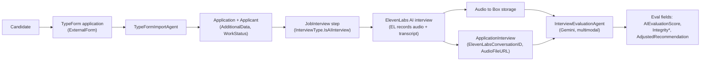
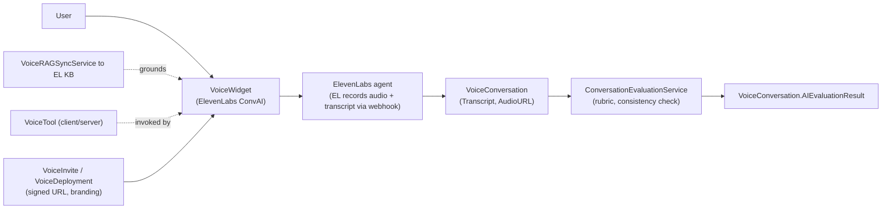
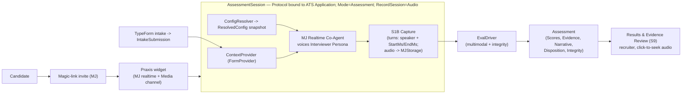
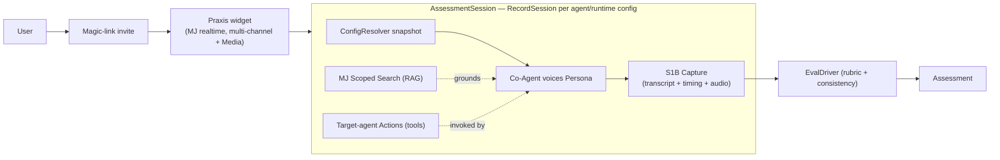
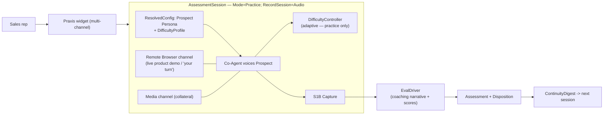
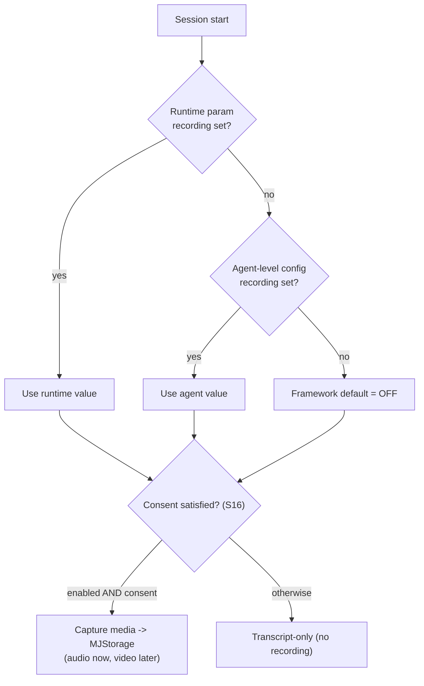

# Praxis — Conversational Assessment Platform
## Build Plan & Living Work Breakdown Structure (WBS)

> **This document is the single source of truth for building Praxis.** It is written so an implementing
> agent (or human) can execute the entire program from this file alone, with **zero dependence on prior
> chat history**. It is also the **durable task state**: the building agent MUST update statuses and notes
> here as it works, so progress survives session death and forms a permanent history.
>
> **Repository note:** This plan currently lives in the **MemberJunction (`memberjunction/mj`) repo** at
> `plans/praxis/PRAXIS_BUILD_PLAN.md` as the tracking home. **Phase 0** spins the program out into a new
> private repo **`bizapps-praxis`**, after which the in-`bizapps-praxis` copy becomes canonical. The one
> piece of framework work that stays in `memberjunction/mj` is the **Media channel (S1)**.

---

## 0. HOW TO USE THIS DOCUMENT — READ FIRST

### 0.1 This file is your task state, not your memory
- **Do NOT keep the task list in your head or in ephemeral session memory.** This file is authoritative.
- At the **start of every working session**: read §0.4 (Current Status Snapshot) and the Progress Log (§0.5),
  find the first `[~]` or `[ ]` task in dependency order, and continue.
- **Whenever you change the state of a task**, edit its checkbox and append a dated note. Then **commit this
  file** (commit message: `docs(plan): <WBS id> <short status>`). Committing the plan is part of the task.
- **Never delete a completed or descoped task** — mark it and keep it for history.

### 0.2 Status legend (edit the checkbox in place)
- `- [ ]` **Not started**
- `- [~]` **In progress** — append `<!-- @YYYY-MM-DD started; note -->`
- `- [x]` **Done** — append `<!-- @YYYY-MM-DD done; PR #/commit; note -->`
- `- [!]` **Blocked** — append `<!-- @YYYY-MM-DD blocked: reason; needs X -->`
- `- [-]` **Descoped / Won't do** — append `<!-- @YYYY-MM-DD descoped: reason -->`

### 0.3 Update protocol (do this every time)
1. Set the task to `[~]` and add a started note **before** writing code.
2. On completion: set `[x]`, record the PR/commit, tick its **Acceptance** boxes.
3. If blocked: set `[!]`, write what's blocking and what's needed; pick up the next unblocked task.
4. Update **§0.4 Current Status Snapshot** (one-paragraph "where things stand").
5. Add a one-line dated entry to **§0.5 Progress Log**.
6. Commit this file.

### 0.4 Current Status Snapshot
> **Status: MJ-CORE TRACK A — S0B.T2 schema + S1B capture + S1 Media channel IMPLEMENTED & committed.** Decisions
> locked (name = Praxis; `BasedOnID` derivation; IsA reserved for additive subtypes; v1 = 1 agent + 1 human; audio
> → MJStorage; RAG/tools/magic-links reuse existing MJ). **Done this branch (commits b424b85→):** the additive
> schema migration + CodeGen; **S1B** — `ConversationDetail` create-on-start/update-on-complete turn lifecycle
> (`In-Progress`→`Complete`+`TurnEndedAt`, speaker `UserID`, media-relative `UtteranceStart/EndMs`); the zero-dep
> `RealtimeRecordingController` (PCM16 mix→WAV, 20 tests); runner recording attach + finalize→MJStorage
> (`RecordingStorageProviderID ?? AttachmentStorageProviderID`, consent-gated, fail-closed) stamping
> `AIAgentSession.RecordingFileID/Media/StartedAt`; **S1** — `MediaChannelServer` + `RealtimeMediaChannel` client +
> tabbed media surface + `RealtimeEvidencePlaybackComponent` (time-aligned transcript+audio, click-to-seek) + the
> channel metadata row. All four touched packages build green; ai-agents realtime/recording = 78 tests pass,
> ng-conversations 616 pass. **Scope note:** server-side audio capture targets the **server-bridged** topology
> (where audio crosses the server session); **client-direct browser capture is a documented follow-up** (browser
> records mic+remote audio and uploads — schema/storage/playback all already support it). UX mockup at
> `plans/praxis/ux-mockup.html` (open in a browser). **Next:** live storage verification against Box + the guide;
> then the bizapps-praxis app (Phase 0). Decision gates §1.7 gate only their sub-phases.

### 0.5 Progress Log
- `@2026-06-25` Plan authored. All tasks `[ ]`.
- `@2026-06-25` Phase 0 (spin-out to `bizapps-praxis`) added; plan committed to `memberjunction/mj` at
  `plans/praxis/PRAXIS_BUILD_PLAN.md` and PR opened (#2941). Awaiting Phase-0 kickoff.
- `@2026-06-25` Added MJ-core sub-phase **S1B — Realtime Session Capture** (per-turn timing + diarization +
  audio recording) after verifying MJ does not persist audio or frame-level turn timing today. Wired S3/S4/S9/
  S15 + dependency graph + risk **R7**. S1B is on the critical path for audio/timing-dependent work.
- `@2026-06-25` Added **§2.4 recording configuration model** (default OFF; runtime > agent-config > default;
  consent-gated; Praxis enables via `Protocol.RecordSession`) and **§2.5 mermaid flows** (ATS-today,
  Voice-today, ATS-new, Voice-new, sales-training, recording-resolution). Expanded **S1B.T6**; added
  `Protocol.RecordSession`. Companion as-is/to-be doc added to the CDP repo.
- `@2026-06-25` **Migration model decided:** schema designed/authored **unified & up front** for both repos
  (new **§2.6** inventory + new sub-phase **S0B**); per-feature "Migration:" tasks (S2.T1/S3.T1/S4.T2/S12.T1)
  reduced to verify+CodeGen. **Cutover = hard per-vertical** (§1.3, S7.T5, S10.T6). Existing-data port is a
  **secondary one-time SQL script** (new **S-PORT**; default subset, descoped if fresh-start). Graph + R8 added.
- `@2026-06-25` **S0B.T2 + S1B + S1 IMPLEMENTED (overnight build).** Migration ran + CodeGen'd (commit
  `b424b85`). Then, server-side: `RealtimeRecordingController` (zero-dep PCM16→WAV mixer, 20 tests); the
  `persistRealtimeTranscript` create-on-start/update-on-complete lifecycle with `UserID` + utterance offsets
  (5 lifecycle tests); `RealtimeSessionRunner` recording attach (taps `OnOutput`, wraps `SendInput`) + finalize
  on close; base-agent recording resolution (runtime>agent>off, consent-gated, fail-closed) + MJStorage upload +
  `FileEntityRecordLink` + session stamping. Client side: `MediaChannelServer`, `RealtimeMediaChannel` + tabbed
  media surface, `RealtimeEvidencePlaybackComponent`, channel metadata row. Commits `2321f4f`, lifecycle tests
  follow-up. **Verified gap turned out narrower still:** the runner is the bridged path; audio only crosses the
  server session when a bridge feeds it — so **client-direct browser capture is a follow-up** (S1B addendum).
  Builds green across core-entities/ai-agents/ng-conversations/MJServer.
- `@2026-06-25` **Storage provisioned + Box fixed + client-direct recording (Path B) built.** Provisioned a
  Box account via the object model (`scripts/provision-box-storage.ts` — provider + encrypted credential via
  CredentialEngine + account, all in the local DB, nothing in metadata/git); set the Realtime Co-Agent
  `RecordingDefault=Audio`. **Fixed a real Box driver bug** (`CreateDirectory` parented subfolders to
  account-root `'0'` not the configured root → all subfolder uploads failed); verified a real upload+read
  round-trip. Extracted shared `storeRealtimeRecording` helper (both topologies). Built **Path B**: server
  resolver gains per-turn timing args + `recordingStartedAt`/consent + `UploadRealtimeRecording` mutation;
  browser gains `RealtimeAudioRecorder` (mic+remote WebRTC mix → MediaRecorder) + consent toggle + per-turn
  timing + end-of-call upload. **NOTE:** browser capture (esp. remote WebRTC track) needs live-UI verification.
- `@2026-06-25` **S1B re-scoped after code/ORM verification.** Read the realtime write path
  (`persistRealtimeTranscript`, `packages/AI/Agents/src/base-agent.ts`) + the ORM source of truth
  (`MJConversationDetailEntity` in `packages/MJCoreEntities/src/generated/entity_subclasses.ts`). **Confirmed:**
  MJ already writes one `ConversationDetail` per *final* realtime turn with a real per-turn `__mj_CreatedAt` (Z)
  timestamp, and `ConversationDetail.UserID` (FK Users) already exists for speaker attribution. So the plan's
  "MJ has nothing but coarse timestamps / collapses to User" framing was too strong. **S1B narrows to:** (1)
  **turn lifecycle** — create the row at turn START (`Status='In-Progress'`), UPDATE on completion, so
  `__mj_CreatedAt`=start and an **immutable turn-end column**=end (the timestamp marks turn *end* today — fine
  for v1, refine later); (2) **populate the existing `UserID`** on the write path (dropped the redundant
  `SpeakerUserID`); (3) **audio→MJStorage** is the one genuine net-new subsystem, and MUST depend on a
  **configured MJ Storage provider specified per agent** (fail closed if unconfigured). `UtteranceStartMs/EndMs`/
  `SequenceNumber`/`SpeakerLabel` deferred (Created/end + recording `t0` cover seek). §1.3/§2.6/S1B/§1.10 updated.

### 0.6 Where this file lives
- **Now:** `memberjunction/mj` → `plans/praxis/PRAXIS_BUILD_PLAN.md` (tracking home).
- **After Phase 0:** migrated to `bizapps-praxis` → `plans/PRAXIS_BUILD_PLAN.md`, which becomes canonical.
  A short pointer/stub may remain in `memberjunction/mj` linking to the Media-channel work (S1) only.

---

## 1. PROGRAM CONTEXT (so no chat history is needed)

### 1.1 Vision
One MemberJunction **OpenApp** that replaces CDP's ATS interview engine, Voice Agents, and ConvoEvals with a
single configurable pipeline — **Intake → Context Assembly → Conversation → Capture → Evaluation →
Disposition** — where everything that differs between use cases is **metadata, not code**. It runs on MJ's
realtime agent architecture and ships a **world-class** authoring experience and a brandable public widget.

### 1.2 The reuse engines
- **Composition** — the persona agent's prompt is assembled at session start from independent fragments via
  MJ's `AIPromptRunner` child-prompt composition.
- **Derivation** — config templates form a `base → variant → instance` chain resolved by a `ConfigResolver`
  (see §1.6 for the `BasedOnID` vs IsA decision).

### 1.3 Locked decisions (do not relitigate)
| Topic | Decision |
|---|---|
| Name / schema | **Praxis** / schema `Praxis` (final). |
| Repo | New private repo **`bizapps-praxis`** (created in Phase 0), built on OpenApp tech (bizapps-common skeleton), own DB schema `Praxis`. |
| npm scope | **`@mj-biz-apps/praxis-*`** (matching bizapps-common's `@mj-biz-apps/*`). Shorthand `@praxis/*` is used in this doc; final names use the `@mj-biz-apps/praxis-` prefix. Confirm in Phase 0. |
| Runtime | **MJ realtime, fully.** Co-agent voices a persona target-agent; realtime model selected dynamically per session. No ElevenLabs-direct path. |
| v1 party model | **1 agent + 1 human.** Multi-party deferred to S15, consuming MJ's bridge/LiveKit layer (no app-side floor control). |
| Migration approach | **Strangler, hard per-vertical cutover**: re-host **ATS first** (integrity parity), then Voice, then net-new verticals; each vertical flips to Praxis at once after parity sign-off (rollback by flag). **Schema is designed & authored up front, unified** across both repos (§2.6, sub-phase **S0B**). **Porting existing CDP data is separate** — a later **one-time SQL script** (**S-PORT**), NOT part of building the schema and NOT an ongoing sync. |
| Config inheritance | **`BasedOnID` derivation FK** for override-layering; **IsA** only for genuine additive subtypes (§1.6). |
| Knowledge/RAG | **Reuse MJ** unified + scoped search + pre-execution RAG. No provider KB sync. |
| Server-side tools | **Reuse MJ** — target async agent's Actions. No new tool abstraction. |
| Invites / entry | **Reuse MJ Magic Links** scoped to an agent. |
| Audio | **MJStorage** (`@memberjunction/storage`): `MJ: Files` + `MJ: File Entity Record Links`; transcripts in DB; session row holds only a `FileID` link. Never base64-in-DB. **Confirmed net-new (2026-06-25):** MJ does NOT persist session audio today (`OnOutput` frames are playback-only) — S1B adds it. **Recording REQUIRES a configured MJ Storage provider specified per agent** (resolved runtime > agent-config > off); enabled-but-unconfigured ⇒ capture fails closed (off) with a warning. Praxis *consumes* the recording + per-turn timing S1B produces. |
| Session capture | **Verified (2026-06-25):** MJ already persists one `ConversationDetail` per *final* realtime turn (`persistRealtimeTranscript`) with a real per-turn `__mj_CreatedAt` (Z) timestamp, and `ConversationDetail.UserID` already exists for speaker attribution. **S1B is therefore narrow:** (1) **turn lifecycle** — create at turn START (`Status='In-Progress'`), UPDATE at completion, so `__mj_CreatedAt`=start and an immutable turn-end column=end (end-marker is fine for v1; refine later); (2) **populate the existing `UserID`** on the write path (no new speaker column); (3) **persist audio** (Audio row above). Needed by integrity (S4), evidence player (S9), multimodal eval, multi-party (S15). |
| Media to users | **MC1 — Media channel** (the ONE net-new MJ-core build, stays in `memberjunction/mj`): show images/video/audio/PDF during a conversation. |
| Eval | One app-side `EvalDriver` (multimodal, evidence, integrity) absorbing Voice's category-weights + consistency check. Integrity model is generic & platform-owned. |

### 1.4 What we BUILD vs. REUSE
- **Build in MJ core (`memberjunction/mj`):** (1) the Media channel (server+client plugin pair) + multi-channel
  shell support in `@memberjunction/ng-conversations` — **sub-phase S1**; and (2) realtime **session capture**
  (per-turn speaker + frame-level start/end timestamps + persisted audio recording, video forward-compat) —
  **sub-phase S1B**. These are the two net-new framework builds; everything else reuses existing MJ.
- **Build in the `bizapps-praxis` OpenApp:** the config domain, the 4 drivers, runtime orchestration, eval,
  intake, domain binding, the authoring studio, the public widget, results review, analytics, config bundles.
- **Reuse from MJ as-is:** realtime co-agent + `invoke-target-agent`, `BaseRealtimeModel` drivers, Actions,
  scoped-search RAG, Magic Links, MJStorage, Whiteboard & Remote Browser channels, bridges (for S15),
  `AIAgentSession` capture/observability, design tokens, BaseEngine reactive caches, mj-sync.

### 1.5 Drivers (app-side, `@praxis/server`, `@RegisterClass`, server-side, always passed `contextUser`+`provider`)
1. **`ConfigResolver`** — `Resolve(entity)` walks `BasedOnID` (cycle-guarded) coalescing nullable scalars +
   key-merging JSON lists; `ResolveSession(...)` returns the full `ResolvedConfig` snapshot.
2. **`EvalDriver`** — `Evaluate(EvalInput) → EvalResult` (Scores / Evidence / Narrative / Disposition +
   Integrity + `keyedOn` audit). Optional `EvaluateWithConsistencyCheck`. Intake submission is an eval input.
3. **`DifficultyController`** — `NextParams(current, signal, policy)`; Static = passthrough; Adaptive moves
   within floor/ceiling, **refused in Assessment mode** at the engine level.
4. **`ContextProvider`** — `Provide(ctx) → StructuredContext`; impls: `FormProvider`, `SourceEntityProvider`,
   `CRMProvider`, `EngagementDigestProvider`.

### 1.6 Inheritance decision (resolved)
- **`BasedOnID`** (nullable self-FK; NOT `ParentID`, NOT IsA) on each config entity:
  - **Scalar fields** are nullable typed columns, `NULL = inherit`; resolved by COALESCE up the chain.
  - **List / text-fragment fields** use keyed JSON with **add / override-by-key / suppress (tombstone)** merge.
  - `IsAbstract` marks non-runnable templates.
- **IsA** (`Entity.ParentID`, table-per-type, shared PK, additive columns, no field shadowing) is used **only**
  where we want true additive subtypes — candidate: Persona subtypes (`SimulatedCustomerPersona`,
  `PanelInterviewerPersona`) that *add* columns. IsA and `BasedOnID` compose. **S2.T9** decides whether v1
  introduces IsA subtypes.

### 1.7 Open decision gates (block only their sub-phase; capture answers here when resolved)
- **DG-1 Media channel layout** (gates S1/S8): multi-resource as tabs, free split, or both; final media set.
- **DG-2 Integrity parity fields** (gates S4/S7): exact ATS integrity columns that define "parity."
- **DG-3 Acoustic-gating allowlist** (gates S4/S7): per-criterion policy for hiring rubrics (legal input).
- **DG-4 DifficultyWeight normalization math** (gates S4/S13): how weight adjusts cross-scenario scores.
- **DG-5 Subject identity** (gates S5/S7): confirm single polymorphic `SubjectEntityName + SubjectID` vs.
  per-bundle typed FKs. (ATS `Applicant` is not bizapps `Person` today.)

### 1.8 Cross-cutting standards (apply to EVERY task — non-negotiable)
- **MJ conventions:** follow the repo `CLAUDE.md` + relevant `/guides`. No `any`. Strong-typed generated
  entities only (no `.Get()/.Set()` substitutes). `RunViews` batching. `entity_object` only when mutating.
  `BaseSingleton` for singletons. No cross-package re-exports. No dynamic `import()` (except sanctioned cases).
  `contextUser` on all server-side data calls. Check `Save()/Delete()` booleans + `LatestResult.CompleteMessage`.
- **Migrations:** highest `migrations/` version folder; `VYYYYMMDDHHMM__v<ver>__<desc>.sql`; hardcoded UUIDs;
  no `__mj_*` timestamp cols; no FK indexes; `sp_addextendedproperty` on every business column; single
  multi-`ADD` `ALTER`s; new tables in schema `Praxis` (never `__mj`). Manually-managed views: recreate the
  view in the same migration with an explicit column list when adding columns (CDP view-ordering rule).
- **CodeGen:** never hand-edit `generated/`; run CodeGen after every schema change; write TS against generated
  types only **after** CodeGen runs.
- **Reactive data:** prefer `BaseEngine` + `ObserveProperty` caches over reload loops; check `BaseEngineRegistry`
  before bulk-loading an entity. Persist user prefs via `UserInfoEngine`, never `localStorage`.
- **Metadata/seed data:** new lookup tables + all config bundles seed via **mj-sync** metadata files
  (`metadata/bundles/...`), never SQL INSERTs. Document that a `mj sync push` is required.
- **Testing:** **Vitest**; test files in `src/__tests__`; cover validation/error paths, not just happy path;
  every new package ships `tsconfig` `strict:true` + an eslint `--max-warnings 0` script. Run a package's
  tests after changing it; report pass/fail/skip.
- **The UX Quality Bar (§1.9) is an acceptance criterion on every user-facing task.**

### 1.9 UX QUALITY BAR — "world-class" is a gate, not a vibe
Every user-facing surface MUST satisfy ALL of these before its task is `[x]`:
1. **Design tokens only** — zero hardcoded colors; semantic `--mj-*` tokens; verified in **light AND dark**.
2. **Page chrome** — Explorer surfaces use `<mj-page-layout>` + header/body trio (or `<mj-page-header-interior>`
   for sub-pages); dashboards call `NotifyLoadComplete()`.
3. **MJ UI components** — use `@memberjunction/ng-ui-components` + AG Grid + `angular-split` + `<mj-loading>`.
   No Kendo/PrimeNG/Material. Dialog buttons: confirm LEFT, cancel RIGHT.
4. **All states designed** — empty, loading (skeletons via `<mj-loading>`), error (actionable), success,
   partial/streaming. No raw spinners, no dead-ends, no silent failures.
5. **Accessibility — WCAG 2.2 AA:** full keyboard operability, visible focus rings (`--mj-border-focus`),
   correct ARIA roles/labels, screen-reader-tested flows, focus management on dialog/panel open/close,
   `prefers-reduced-motion` respected, contrast verified in both themes.
6. **Responsive + mobile** — the public widget is mobile-first; the studio is usable down to tablet.
7. **Micro-interactions & motion** — purposeful, fast (<200ms), reduced-motion aware; never blocking.
8. **Copy & IA** — plain-language labels, helpful empty-state guidance, inline validation, no jargon leaks.
9. **Performance** — batch loads (`RunViews`), reactive caches, virtualized long lists/grids; no per-row queries.
10. **Consistency** — same component vocabulary and layout grammar across studio surfaces.

### 1.10 Forward-notes for the `bizapps-praxis` repo (decide THERE, not in MJ-core)
Reviewer concerns parked for the Praxis-repo sessions — **not** MJ-core framework work. The domain lives only in
`bizapps-praxis`, which will depend on a **forthcoming pinned MJ framework release** shipping the S1 / S1B /
S0B.T2(Track A) capabilities, so there is no cross-repo task-state drift.
- **FN-1 (scope honesty):** treat **v1 = ATS-only**. Voice cutover (S10), net-new verticals (S11), multi-party
  (S15), analytics (S14) are v2+. Keep them in the WBS but out of the v1 launch gate.
- **FN-2 (eval parity is undefined):** before S7, define the numeric **parity tolerance** and **who labels** the
  integrity sample set. "Agreed tolerance" must be a number fixed up front, not negotiated during cutover.
- **FN-3 (ATS cutover safety):** prefer a **shadow/parallel run** (Praxis scores alongside legacy, compare) over
  the hard flip for the *hiring* vertical specifically, given DG-3 legal / disparate-impact exposure. Hard
  cutover stays fine for lower-risk verticals.
- **FN-4 (DG gates are external deps):** DG-2/DG-3/DG-5 block S7, and DG-3 needs legal sign-off — track them as
  owned blockers with dates, not inline "answer when resolved" notes.
- **FN-5 (housekeeping):** fix the §5 risk-register ordering (R7 is out of sequence).

---

## 2. ARCHITECTURE REFERENCE (condensed, self-contained)

### 2.1 Entity model (schema `Praxis`; CodeGen-managed bits omitted)
**Derivation mixin** (on Protocol, Persona, Rubric, DifficultyProfile): `BasedOnID UNIQUEIDENTIFIER NULL`
(self-FK), `IsAbstract BIT`, nullable typed scalar columns (`NULL`=inherit), keyed-JSON list columns.

Core tables and their load-bearing columns:
- **Protocol** — `Name, CompanyID, BasedOnID, IsAbstract, Personality(frag), Objectives(jsonList),
  TopicGuide(jsonList), Autonomy, DefaultMode, PersonaID, DifficultyProfileID, RubricID, ModelPreference,
  ContextProviderRefs(json),` **intake:** `IntakeMode(None|ExternalForm|NativeForm), ExternalFormTypeID,
  ExternalFormID, ExternalFormSchema(json), NativeFormID, SubjectEntityName, SubjectEntityConfig(json),
  ScoreIntakeSubmission(bit),` **recording:** `RecordSession(Inherit|Off|Audio|AudioVideo)` — the app-level
  knob that, at session start, supplies the **runtime recording param** to MJ's S1B capture (default for
  Assessment mode = on/Audio; Practice = configurable).
- **AssessmentSession** (recording resolution) — carries the **resolved** `RecordingEnabled`/`RecordingMedia`
  in `ResolvedConfig` (from `Protocol.RecordSession` ⇒ runtime param ⇒ overrides the agent default). See §2.4.
- **Persona** — `Name, CompanyID, BasedOnID, IsAbstract, Brief(frag), Agenda, KnowledgeScope(json),
  PreferredModel, PreferredVoice`. (Possible IsA subtypes — see S2.T9.)
- **DifficultyProfile** — `Name, CompanyID, BasedOnID, IsAbstract, ControllerMode(Static|Adaptive),
  DifficultyWeight, Resistance, ConcessionThreshold, DisclosureRate, Volatility, CurveballFrequency,
  Patience, ControllerPolicy(json)`.
- **Rubric** — `Name, CompanyID, BasedOnID, IsAbstract`.
- **RubricVersion** — `RubricID, VersionNumber, Status(Draft|Published|Retired), PublishedAt`.
- **Criterion** — `RubricVersionID, Key, Name, Description, CriterionType(binary|scalar|categorical|
  disqualifying), Weight, MaxScore, EvidenceRequired, AcousticAllowed, AppliesTo(Conversation|IntakeSubmission|Both)`.
- **Engagement** — `Name, CompanyID, SubjectEntityName, SubjectID, Status`.
- **AssessmentSession** — `EngagementID, ProtocolID, CompanyID, Mode(Practice|Assessment), Status,
  SubjectEntityName, SubjectID, ResolvedConfig(jsonSnapshot), RubricVersionID, AIAgentSessionID,
  IntakeSubmissionID, AudioFileID(→MJ:Files link), StartedAt, CompletedAt, SequenceInEngagement`.
- **IntakeSubmission** — `ProtocolID, SubjectEntityName, SubjectID, ExternalResponseID, MappedData(json),
  AdditionalData(json), SubmittedAt`.
- **Assessment** — `AssessmentSessionID, RubricVersionID, Status, OverallScore, Recommendation,
  AdjustedRecommendation, Scores(json), Evidence(json), Narrative, Disposition, Integrity(json),
  EvalKeyedOn(json), EvalMetadata(json)`.
- **ContinuityDigest** — `EngagementID, AssessmentSessionID, RelationshipState, OpenThreads, Commitments, Sentiment`.
- **Deferred (S15 multi-party):** `Seat`/`Cast` records over a session.

### 2.2 Runtime wiring (per session)
ResolveSession → snapshot `ResolvedConfig` + pin `RubricVersionID` → assemble persona target-agent prompt
(`AIPromptRunner` child-prompts) → start MJ realtime via co-agent + `invoke-target-agent`, model chosen from
snapshot → store `AIAgentSession.ID` on the session → on close: store audio to MJStorage, compile
`ContinuityDigest` (if Engagement), enqueue `EvalDriver.Evaluate`.

### 2.3 Mode gate
`Mode (Practice|Assessment)` gates hints/retries/visible-scoring/recording **and** disables adaptive
difficulty in Assessment — enforced at the engine level, not by convention.

### 2.4 Recording configuration model (MJ-core S1B + Praxis usage)
Media recording (audio now, video later) is a **capability of the MJ realtime framework (S1B)**, OFF by
default, with a 3-level resolution that the Praxis app drives:

| Level | Where | Wins? |
|---|---|---|
| **Runtime param** | passed at session start (`PrepareClientSession({ recording: {...} })`) | **highest** |
| **Agent-level config** | `AIAgent` / session `Config` JSON (`recording.enabled`, `recording.media`) | middle |
| **Framework default** | none set ⇒ **OFF** | lowest |

Effective capture = **`resolvedEnabled AND consentSatisfied`** (consent is a hard gate, §S16). **Praxis turns
it on** via `Protocol.RecordSession` (Inherit/Off/Audio/AudioVideo): at session start the app resolves that
into the **runtime param**, so an assessment Protocol records even if the underlying agent defaults to off,
and a sensitive Practice scenario can force it off. The resolved `RecordingEnabled`/`RecordingMedia` is written
into the immutable `ResolvedConfig` snapshot for audit. See diagram §2.5(F).

### 2.5 Visual flows (as-is → to-be) — mermaid

**(A) ATS interview TODAY (CDP, ElevenLabs-direct)**


**(B) Voice Agents TODAY (CDP, ElevenLabs-direct)**


**(C) ATS interview in the NEW world (Praxis on MJ realtime)**


**(D) Voice agent in the NEW world (Praxis)**


**(E) NEW use case — Sales training roleplay (Praxis)**


**(F) Recording on/off resolution (per session)**


### 2.6 Unified Data Model & Persistence Needs (full-plan scan — design up front)
Consolidates **every persistence need across S0–S17**, gathered up front so schema is designed once (not
discovered per sub-phase). **S0B** authors these as a unified migration set in both repos. "Building the
database up" = creating these new persistence mechanisms. **Porting existing CDP data is separate** — a later,
**one-time SQL script** (**S-PORT**), not a schema-building migration.

**A. MJ-core schema (`memberjunction/mj`) — additive, framework-general**
- `ConversationDetail` (existing) — speaker identity reuses the **existing `UserID`** (populate on the realtime
  write path; NO new column). ADD: `TurnEndedAt DATETIMEOFFSET NULL` (immutable turn-end; `__mj_CreatedAt` gives
  turn-*start* via the create-on-start lifecycle, S1B.T1), `UtteranceStartMs INT NULL` / `UtteranceEndMs INT NULL`
  (precise media-relative offsets from the recording `t0`, filled when the driver supplies frame timing; evidence
  player prefers these, falls back to `__mj_CreatedAt − t0`), and `MediaType NVARCHAR(20)` (forward-compat).
  `SequenceNumber` / `SpeakerLabel` still deferred (ordering via timestamps; label only if a non-`User` speaker
  needs a display name). (S1B)
- `AIAgentSession` (existing) — ADD recording state: `RecordingMedia NVARCHAR(20)` (None|Audio|AudioVideo),
  `RecordingStartedAt DATETIMEOFFSET NULL` (the `t0` alignment origin so per-turn timestamps → audio seek
  offsets), and `RecordingFileID UNIQUEIDENTIFIER NULL` (FK `MJ: Files`, the stored recording). Also linkable via
  `MJ: File Entity Record Links` (no new table). (S1B)
- **Recording config (agent level)** — explicit columns on `AIAgent`: `RecordingDefault NVARCHAR(20)`
  (None|Audio|AudioVideo) + `RecordingStorageProviderID UNIQUEIDENTIFIER NULL` FK → `MJ: File Storage Providers`.
  Resolution per session: media = **runtime > agent (`RecordingDefault`) > off**; storage =
  **`RecordingStorageProviderID` ?? the agent's existing `AttachmentStorageProviderID`** (recordings default to
  the attachments account, override only when they must live elsewhere). Capture runs ONLY when a storage provider
  is resolvable AND consent is satisfied; else fails closed. (S1B.T3/T6)
- `AIAgentResource` (NEW MJ entity) — generic media resource for the Media channel: `Type, URL/Content,
  DisplayName, ContextDescription, Priority, Preload`; + channel-registration rows in `MJ: AI Agent Channels`
  (metadata). Runtime channel state via existing `AIAgentSessionChannel.Config`. (S1)
- Code-only (no schema): `RealtimeTranscript` interface gains `StartMs`/`EndMs`.
- Reuse (no schema): `MJ: Files`, `MJ: File Entity Record Links`, Magic Links, Search Scopes, `AIAgentAction`.

**B. Praxis schema (schema `Praxis`, `bizapps-praxis`) — full entity set** (field detail in §2.1)
- Config (derivation mixin `BasedOnID`+`IsAbstract`): **Protocol, Persona, DifficultyProfile, Rubric,
  RubricVersion, Criterion** (+ optional IsA Persona subtypes — S2.T9).
- Runtime/records: **Engagement, AssessmentSession, IntakeSubmission, Assessment, ContinuityDigest**.
- Deferred (author when reached): **Seat/Cast** (multi-party, S15).
- Value-lists (CHECK / `EntityFieldValue`, no tables): modes, statuses, criterion types, recording enums.
- `ExternalFormType` — decide Praxis-local lookup vs. reference CDP's pattern (**S0B.T1**).
- Metadata (not schema): config bundles + channel registrations via mj-sync.

**C. Out of scope for "build the database up" (separate / later)**
- One-time **data PORT** from CDP (ATS + Voice config + history) → **S-PORT**: one-time SQL per vertical, run at
  hard cutover, then retired. Not a schema migration, not a sync.

---

## 3. WORK BREAKDOWN STRUCTURE — Program "Praxis v1"

> One program. **Phase 0** (repo spin-out) then sub-phases **S0–S17**. Each: **Goal · Depends · Exit · Tasks ·
> UX · Tests · Risks.** Tasks carry stable IDs (`P0.T<m>` / `S<n>.T<m>`), a status checkbox, detail, and
> **Acceptance** checkboxes. Tracks **A (MJ-core, in `memberjunction/mj`)** and **B (OpenApp, in
> `bizapps-praxis`)** run in parallel where dependencies allow (see §4 graph).

---

### Phase 0 — Spin-out to `bizapps-praxis`  · Track B
**Goal:** Stand up the new private `bizapps-praxis` repo and migrate this program into it, so all OpenApp work
(S0+) happens there. The plan presently lives in `memberjunction/mj` (`plans/praxis/`); after this phase the
`bizapps-praxis` copy is canonical.
**Depends:** — **Exit:** `bizapps-praxis` repo exists; this plan + design docs live in it; CI placeholder green;
`memberjunction/mj` retains only the Media-channel (S1) work + a pointer stub.

- [ ] **P0.T1 — Create private `bizapps-praxis` repo** (org `memberjunction`, private). Confirm npm scope
  **`@mj-biz-apps/praxis-*`** and default branch model (`next` integration → `main` release, per bizapps-common). <br>**Acceptance:** ☐ repo created private ☐ scope confirmed ☐ `next`+`main` branches exist ☐ branch-protection set.
- [ ] **P0.T2 — Seed repo from bizapps-common skeleton** (mj-app manifest, workspaces, turbo, CI scaffolding —
  detailed scaffolding is S0). <br>**Acceptance:** ☐ skeleton committed to `next` ☐ feature branch `claude/assessment-platform-architecture-cd91cg` cut from `next` and tracking same-named remote.
- [ ] **P0.T3 — Migrate this plan + design docs into `bizapps-praxis`** at `plans/PRAXIS_BUILD_PLAN.md`
  (+ the high-level design + technical design companions). Update §0.6 and the repo note. <br>**Acceptance:** ☐ plan in `bizapps-praxis` ☐ §0.6 updated ☐ canonical-copy note set.
- [ ] **P0.T4 — Leave a pointer stub in `memberjunction/mj`** — replace `plans/praxis/PRAXIS_BUILD_PLAN.md`
  with a short stub linking to `bizapps-praxis` and scoping MJ's involvement to the Media channel (S1). <br>**Acceptance:** ☐ stub committed ☐ no duplicated living plan in two repos.
- [ ] **P0.T5 — Access & secrets** — repo collaborators/teams, CI secrets (DB, AI keys) mirrored from the
  bizapps-common pattern; `.env` strategy documented. <br>**Acceptance:** ☐ contributors can clone+build ☐ secrets documented (not committed).
**UX:** none (infra). **Tests:** CI placeholder. **Risks:** org/permissions for a new private repo — confirm who owns repo creation; if `memberjunction` org access is unavailable to the building agent, escalate to a human (this is a likely `[!]` until granted).

---

### S0 — Foundations & Scaffolding  · Track B (inside `bizapps-praxis`)
**Goal:** A buildable, CI-green OpenApp shell on schema `Praxis`.
**Depends:** Phase 0. **Exit:** repo builds; CodeGen runs clean; empty MJAPI/MJExplorer boot.

- [ ] **S0.T1 — Confirm npm scope & workspace layout** (repo created in Phase 0). Scope `@mj-biz-apps/praxis-*`. <br>**Acceptance:** ☐ scope + workspaces finalized.
- [ ] **S0.T2 — Scaffold packages/apps.** `mj-app.json` (schema `Praxis`, `createIfNotExists`, mjVersionRange,
  packages, migrations engine, metadata dir); `mj.config.cjs`; packages `Entities/Actions/Server/Angular`;
  apps `MJAPI` (port 41xx) / `MJExplorer` (port 43xx); root `.env`. <br>**Acceptance:** ☐ `npm install` + `npm run build` green ☐ both apps boot ☐ ports documented.
- [ ] **S0.T3 — Confirm plan location in-repo** (moved in P0.T3) and wire README pointer. <br>**Acceptance:** ☐ README links the plan.
- [ ] **S0.T4 — CI: build + lint + Vitest gates.** GitHub Actions: build, `eslint --max-warnings 0`,
  `vitest run`. Branching model (`next`→`main`) documented. <br>**Acceptance:** ☐ CI green on an empty PR ☐ zero-warning lint enforced.
- [ ] **S0.T5 — CodeGen pipeline + manifests.** Wire CodeGen; supplemental class manifests
  (`--exclude-packages @memberjunction`); `prestart`/`prebuild`. <br>**Acceptance:** ☐ `mj codegen` clean ☐ manifests generate.
- [ ] **S0.T6 — Dev runbook.** README: start API/Explorer, run CodeGen, run migrations, push metadata, run
  tests, run the Playwright CLI profile. <br>**Acceptance:** ☐ a fresh dev can boot end-to-end from the README.
**UX:** none (infra). **Tests:** CI smoke. **Risks:** mjVersionRange drift vs. MJ realtime APIs — pin a known-good MJ version.

---

### S0B — Unified Data Model & Schema Authoring (up front)  · Tracks A + B
**Goal:** Author the **complete persistence layer once, up front** (per §2.6) so every later sub-phase builds
against generated types instead of discovering schema piecemeal. Spans MJ-core additive schema (Track A) and
the full Praxis schema (Track B).
**Depends:** Track A — none (start now); Track B — S0 (scaffold). **Exit:** all §2.6 tables/columns migrated +
CodeGen'd in both repos; the per-feature "schema" tasks (S2.T1/S3.T1/S4.T2/S12.T1) reduce to verify + wire.

- [ ] **S0B.T1 — Lock the §2.6 model.** Resolve open shapes: recording fields' home (`AIAgentSession` vs File
  links), `AIAgentResource` vs reuse `MJ: Files`, `ExternalFormType` ownership (Praxis-local vs reference). <br>**Acceptance:** ☐ §2.6 finalized ☐ open shapes decided.
- [ ] **S0B.T2 — MJ-core migrations (Track A, `memberjunction/mj`).** `ConversationDetail` capture columns +
  `AIAgentSession` recording fields + `AIAgentResource` + channel registrations; extended properties; single
  multi-`ADD` `ALTER`s; CodeGen. <br>**Acceptance:** ☐ migrates clean ☐ CodeGen ☐ conventions pass.
- [ ] **S0B.T3 — Praxis config-entity migration (Track B).** Protocol/Persona/DifficultyProfile/Rubric/
  RubricVersion/Criterion with the derivation mixin; extended properties; CodeGen. <br>**Acceptance:** ☐ migrates ☐ CodeGen.
- [ ] **S0B.T4 — Praxis runtime/record migration (Track B).** Engagement/AssessmentSession/IntakeSubmission/
  Assessment/ContinuityDigest; CodeGen. <br>**Acceptance:** ☐ migrates ☐ CodeGen.
- [ ] **S0B.T5 — Decision-gated columns.** Author or stub-with-note the fields gated by **DG-2** (integrity
  parity), **DG-4** (difficulty weight), and **S2.T9** (IsA subtypes); add a follow-up migration as each
  resolves — do NOT block S0B on them. <br>**Acceptance:** ☐ gated fields tracked ☐ S0B not blocked.
- [ ] **S0B.T6 — Convention + parity check.** Schema `Praxis` (never `__mj`); FK indexes left to CodeGen; no
  `__mj_*` timestamp cols; manually-managed views recreated with explicit column lists if any. <br>**Acceptance:** ☐ migration-convention checklist passes.
**UX:** none. **Tests:** migration applies clean on a fresh DB; CodeGen diff reviewed. **Risks:** decision gates
— author the bulk now, follow-up migration for gated columns.

---

### S1 — MJ-CORE: Media Channel + Multi-Channel Shell  · Track A (in `memberjunction/mj`, parallel, long pole) · gated by DG-1
**Goal:** A generic realtime **Media channel** (show images/video/audio/PDF during a conversation) and
multi-channel shell support, shipped in **public MJ**, consumable by any agent.
**Depends:** DG-1. **Exit:** an MJ realtime session can open the Media channel, the agent can show/clear media,
state persists + restores on resume; shell hosts ≥2 channels with split/resize.

- [ ] **S1.T1 — DG-1 resolution.** Decide multi-resource layout (tabs vs. free split vs. both) + media set
  (image/video/audio/PDF/embed). Record answer in §1.7. <br>**Acceptance:** ☐ decision recorded.
- [ ] **S1.T2 — `MediaChannelServer` (`BaseRealtimeChannelServer`).** Server tools `show-media`, `open-media`
  (additive), `play-media`(seek/autoplay), `highlight`, `close-media`; resolves access + signed URLs
  (MJStorage); `OnChannelStateSave`/restore. <br>**Acceptance:** ☐ tools registered ☐ state persists ☐ private files signed.
- [ ] **S1.T3 — `MediaChannelClient` (`BaseRealtimeChannelClient`).** Multi-pane surface (per DG-1) rendering
  image/video/audio/PDF/embed; `BindSurface/RegisterTools/RestoreState`. <br>**Acceptance:** ☐ renders all media types ☐ multi-resource ☐ restores on resume.
- [ ] **S1.T4 — `MJ: AI Agent Channels` registration** for the Media channel + a generic `AIAgentResource`
  concept (re-home of Voice's `VoiceResource`). <br>**Acceptance:** ☐ resolvable via ClassFactory ☐ seeded via metadata.
- [ ] **S1.T5 — Multi-channel shell in `@memberjunction/ng-conversations`.** Host N channel surfaces with
  `angular-split`; per-channel state; channel open/close orchestration. <br>**Acceptance:** ☐ ≥2 channels concurrently ☐ resize persists.
- [ ] **S1.T6 — MJ guide + tests.** Add a Media-channel section to the realtime channel docs; unit tests for
  server tools + state. <br>**Acceptance:** ☐ guide updated ☐ tests pass.
**UX (apply §1.9):** media viewer states (loading/poster/error/unsupported), keyboard controls for media,
captions/transcripts affordance for audio/video, focus management when a pane opens, reduced-motion. <br>**Tests:** Vitest for server tools/state; manual realtime smoke. **Risks:** PR review cadence in public MJ — open the PR early; keep the channel additive.

---

### S1B — MJ-CORE: Realtime Session Capture (per-turn timing, diarization, audio/video recording)  · Track A (in `memberjunction/mj`) · CRITICAL · gated by S16 consent hooks
**Goal:** Bring MJ's realtime capture to parity with what a turnkey voice-agent platform gives out of the box,
for *our* needs: every session yields (a) a turn record with reliable **speaker designation + media-relative
start/end timestamps + explicit sequence**, and (b) a **persisted audio recording** (video forward-compat)
linked to the session via MJStorage, time-aligned so an evidence player can seek precisely.
**Why net-new (verified 2026-06-25):** MJ already persists one `ConversationDetail` per *final* realtime turn
(`persistRealtimeTranscript`, `base-agent.ts`) carrying `__mj_CreatedAt` (a real per-turn Z timestamp ≈ turn
*end/finalization*), and the schema already has `ConversationDetail.UserID` for speaker attribution. The genuine
gaps are narrower than first framed: (a) the timestamp marks turn-*end*, not start (no start/end pair); (b) the
write path doesn't populate `UserID`, so multi-party humans collapse to `'User'` today; (c) **no audio is
persisted at all** (`OnOutput` frames are playback-only). `RealtimeTranscript` ({Role,Text,IsFinal}) carries no
timing. **Depends:** — (foundational; start early in Track A). **Exit:** a realtime session produces per-turn
start+end timestamps, per-turn speaker identity (via existing `UserID`), and a stored, time-aligned audio
recording (in a per-agent-configured MJ Storage provider) linked to the session.

- [ ] **S1B.T1 — Per-turn start+end via row lifecycle.** Change `persistRealtimeTranscript` to **create** the
  `ConversationDetail` row at turn START (first interim transcript; `Status='In-Progress'`) and **UPDATE** it on
  completion (final accumulated text; `Status='Complete'`), so `__mj_CreatedAt`=turn start and an **immutable
  turn-end column** (`TurnEndedAt`, written once on completion)=turn end. Do **NOT** rely on `__mj_UpdatedAt` for
  the end (it's mutable by later edits — ratings, pins, reflections). Runtime tracks the in-flight row id per role
  and accumulates delta text. Degrades gracefully when a provider emits no interim (create+complete near-
  simultaneously, as today). Also persist `UtteranceStartMs`/`UtteranceEndMs` (media-relative offsets from `t0`)
  when the driver supplies frame timing. **Add unit tests** for the lifecycle and the In-Progress-row regression
  surface: start-creates / completion-updates, immutable `TurnEndedAt`, no-interim degradation, and that chat
  surfaces reading `ConversationDetail` tolerate mid-turn `Status='In-Progress'` rows (`Status`/`HiddenToUser`
  already model this). <br>**Acceptance:** ☐ row created at start, completed at end ☐ start=`__mj_CreatedAt`, end=`TurnEndedAt` ☐ Utterance ms offsets set when available ☐ no reliance on `__mj_UpdatedAt` ☐ no regression when interim transcripts absent ☐ **unit tests** for In-Progress turn rows + lifecycle.
- [ ] **S1B.T2 — Per-turn speaker identity (reuse existing `UserID`).** `ConversationDetail.UserID` already
  exists — populate it on the realtime write path from the known session user (1:1 case) and, for multi-party,
  from the bridge participant roster (`AIAgentSessionBridgeParticipant` + `BridgeMediaFrame.SpeakerLabel`). **No
  new `SpeakerUserID` column.** Add a free-text `SpeakerLabel` ONLY if a non-`User` participant needs a display
  name not backed by a `User` row. <br>**Acceptance:** ☐ each turn's `UserID` set when known ☐ multi-party humans distinguished ☐ no redundant speaker column added.
- [ ] **S1B.T3 — Audio capture → MJStorage (per-agent-configured provider, REQUIRED).** Accumulate inbound+
  outbound media frames over the session, encode (compressed codec — avoid raw PCM bloat), and on close store via
  `FileStorageEngine` into the **MJ Storage provider configured for the agent** (resolution: runtime param >
  agent-level config > off). Link via `MJ: Files` + `MJ: File Entity Record Links` + `RecordingFileID` on the
  session; stamp `RecordingStartedAt` (`t0`). **Hard requirement:** recording runs only when a provider is
  configured AND consent is satisfied (S1B.T6); otherwise capture is off (warn, no crash). Provide an alternate
  path to **link a provider-side recording URL** (Zoom/Teams/LiveKit) where native recording exists. <br>**Acceptance:** ☐ recording stored to the agent's configured provider ☐ fails closed if no provider/consent ☐ signed playback URL ☐ provider-URL link path supported.
- [ ] **S1B.T4 — Time-alignment guarantee.** Define recording `t0`; ensure turn `StartMs/EndMs` are relative
  to it so an evidence player seeks correctly. <br>**Acceptance:** ☐ click-a-turn → audio seeks to the right moment within tolerance.
- [ ] **S1B.T5 — Video forward-compat.** Model recording-ref + timing as **media-type-tagged** so video reuses
  the same record when realtime models support it; no video storage in v1. <br>**Acceptance:** ☐ schema/contract is media-agnostic.
- [ ] **S1B.T6 — Recording config resolution + consent/retention gating** (ties to S16). **Recording media
  capture defaults OFF.** Resolution precedence per session: **runtime param > agent-level config > framework
  default (OFF)** — i.e., an agent (`AIAgent`/session `Config`) may set `recording.enabled` (+ `recording.media`
  = `audio` | `audio+video`), and a per-session **runtime parameter** at session start overrides it either way.
  Effective capture = `resolvedEnabled AND consentSatisfied`; recording never runs without consent
  (per-jurisdiction), honored on both client-direct and bridge paths; retention policy hook. The Praxis app
  turns recording ON via its Protocol/Mode config (see §2.4). <br>**Acceptance:** ☐ runtime>agent>default precedence ☐ no capture without consent ☐ retention hook ☐ off by default.
- [ ] **S1B.T7 — MJ guide + tests.** Document the capture model; unit tests for timing + persistence +
  alignment. <br>**Acceptance:** ☐ guide updated ☐ tests pass.
**UX:** none (framework). **Tests:** Vitest + realtime smoke; alignment verified against a recorded sample.
**Risks:** storage cost (~32 MB/hr at raw PCM — use a compressed codec); media-frame timestamp reliability
varies by provider (OpenAI vs Gemini vs bridges) — validate per driver; consent/legal — gate hard (S16).

---

### S2 — Config Domain + ConfigResolver  · Track B
**Goal:** The four config entities with derivation, and a tested `ConfigResolver`.
**Depends:** S0. **Exit:** entities CodeGen'd; resolver returns correct effective config for base/variant/instance
incl. tombstones; unit-tested.

- [ ] **S2.T1 — Config-entity schema** (Protocol/Persona/DifficultyProfile/Rubric/RubricVersion/Criterion).
  **Schema authored up front in S0B.T3 per §2.6** — here: verify migrated + CodeGen + entity-subclass wiring
  for the resolver. <br>**Acceptance:** ☐ generated types present ☐ matches §2.6.
- [ ] **S2.T2 — Run CodeGen**, then implement against generated types only. <br>**Acceptance:** ☐ generated types exist.
- [ ] **S2.T3 — `ConfigResolver.Resolve(entity)`** — walk `BasedOnID` (cycle guard, depth bound), COALESCE
  scalars, key-merge JSON lists (add/override-by-key/suppress). <br>**Acceptance:** ☐ scalar inherit/override ☐ list merge ☐ tombstone suppress ☐ cycle-guarded.
- [ ] **S2.T4 — `ConfigResolver.ResolveSession(...)`** → full `ResolvedConfig` (protocol⊕persona⊕difficulty⊕
  rubric⊕model⊕contextProviders) with optional `resolutionTrace`. <br>**Acceptance:** ☐ complete snapshot shape ☐ trace optional.
- [ ] **S2.T5 — Resolver caching** keyed by chain `(id, updatedAt)`; invalidation on save. <br>**Acceptance:** ☐ cache hit path ☐ invalidates on edit.
- [ ] **S2.T6 — `PraxisConfigEngine` (`BaseEngine`)** caching config entities with `ObserveProperty` for the
  studio UX. <br>**Acceptance:** ☐ reactive arrays ☐ lazy `Config()`.
- [ ] **S2.T7 — Field-merge-policy registry** (per-field: scalar/replace, fragment/append|replace,
  list/setMergeByKey). <br>**Acceptance:** ☐ declarative policy table ☐ resolver reads it.
- [ ] **S2.T8 — Unit tests** for resolver (deep chains, tombstones, cycles, missing parents). <br>**Acceptance:** ☐ ≥90% branch coverage on resolver.
- [ ] **S2.T9 — DECISION: IsA Persona subtypes?** Decide whether v1 introduces additive IsA subtypes
  (`SimulatedCustomerPersona`, `PanelInterviewerPersona`). If yes, model via `Entity.ParentID` (shared PK,
  additive cols) composing with `BasedOnID`. <br>**Acceptance:** ☐ decision recorded in §1.6 ☐ migration if yes.
**UX:** none (engine). **Tests:** resolver suite. **Risks:** over-deep chains — enforce a max depth + log.

---

### S3 — Runtime & Capture  · Track B
**Goal:** Start a real 1-agent-1-human session on MJ realtime from a Protocol, snapshot config, capture
transcript + audio (MJStorage).
**Depends:** S2; reuses MJ realtime. **Exit:** a trivial roleplay runs end-to-end; snapshot written; transcript
in DB; audio in MJStorage referenced by `FileID`.

- [ ] **S3.T1 — Runtime/record schema** (Engagement, AssessmentSession, IntakeSubmission). **Authored up front
  in S0B.T4 per §2.6** — here: verify + CodeGen. <br>**Acceptance:** ☐ generated types present ☐ matches §2.6.
- [ ] **S3.T2 — Session start orchestration** — ResolveSession → write `ResolvedConfig` + pin `RubricVersionID`. <br>**Acceptance:** ☐ snapshot immutable post-start.
- [ ] **S3.T3 — Persona prompt assembly** via `AIPromptRunner` child-prompts (personality/objectives/topic
  guide/persona brief/difficulty params/context). <br>**Acceptance:** ☐ deterministic from snapshot.
- [ ] **S3.T4 — Realtime launch** — co-agent + `invoke-target-agent`, dynamic model from snapshot; store
  `AIAgentSession.ID` on the session. <br>**Acceptance:** ☐ live voice session ☐ model selection honored.
- [ ] **S3.T5 — Capture wiring** — consume MJ-core capture (**S1B**): per-turn transcript with speaker +
  frame-level timestamps persisted; live signal exposed (`OnTranscript`) for later S13. **Depends on S1B.T1/T2.**
  If S1B not yet landed, degrade to transcript-only (coarse timing) and backfill. <br>**Acceptance:** ☐ turns carry speaker+timing ☐ live signal available.
- [ ] **S3.T6 — Audio → MJStorage** — link the recording produced by **S1B.T3** to the session (`MJ: Files` +
  `MJ: File Entity Record Link`, EntityID=AssessmentSession; store `AudioFileID`); playback via
  `CreatePreAuthDownloadUrl`. The app does **not** re-implement capture — it consumes S1B. **Depends on S1B.T3/T4.** <br>**Acceptance:** ☐ no blob in DB ☐ signed playback URL works ☐ timeline aligns to transcript.
- [ ] **S3.T7 — Session lifecycle/status** state machine (Pending→Active→Completed→Evaluated/Failed) + janitor. <br>**Acceptance:** ☐ statuses transition correctly.
- [ ] **S3.T8 — Tests** (mocked realtime) for start/snapshot/capture/close. <br>**Acceptance:** ☐ suite green.
**UX:** none here (runtime). **Tests:** orchestration unit + manual realtime smoke. **Risks:** model-availability fallback — implement tolerant fallback per snapshot.

---

### S4 — Evaluation & Integrity  · Track B · gated by DG-2, DG-3, DG-4
**Goal:** One `EvalDriver` producing 4 artifacts + integrity, with acoustic gating + consistency check.
**Depends:** S3; rubric from S2. **Exit:** a completed session yields an `Assessment` with scores/evidence/
narrative/disposition + integrity; acoustic gating enforced + audited.

- [ ] **S4.T1 — DG-2/DG-3/DG-4 resolution.** Record integrity-parity fields, acoustic allowlist policy, and
  difficulty-weight normalization math in §1.7. <br>**Acceptance:** ☐ three answers recorded.
- [ ] **S4.T2 — Assessment schema** (integrity & keyedOn JSON). **Authored up front in S0B.T4 per §2.6**
  (integrity-parity columns finalized once DG-2 resolves, via S0B.T5) — here: verify + CodeGen. <br>**Acceptance:** ☐ generated types present ☐ DG-2 fields included.
- [ ] **S4.T3 — `EvalDriver.Evaluate`** — multimodal input (transcript + optional audioRef + tools + context +
  intake submission) → typed criterion scores by `AppliesTo`. <br>**Acceptance:** ☐ all criterion types scored ☐ intake scored when enabled.
- [ ] **S4.T4 — Evidence extraction** — timestamped grounding segments (turn/audio), anchored to the
  S1B per-turn timing + recording timeline. **Depends on S1B.T1/T4** for seekable accuracy. <br>**Acceptance:** ☐ segments map to transcript/audio with correct offsets.
- [ ] **S4.T5 — Integrity sub-model (generic)** — verdict/confidence/evidence/summary; `AdjustedRecommendation`
  may only LOWER disposition, never raise a score. <br>**Acceptance:** ☐ adjustment never raises ☐ parity w/ DG-2.
- [ ] **S4.T6 — Acoustic gating** — criterion may key on acoustic features only if `AcousticAllowed`; write
  `EvalKeyedOn` audit (`perCriterion`). <br>**Acceptance:** ☐ gating enforced ☐ audit recorded.
- [ ] **S4.T7 — Consistency double-check** (`EvaluateWithConsistencyCheck`) — variance delta in metadata. <br>**Acceptance:** ☐ delta computed.
- [ ] **S4.T8 — Eval enqueue on session close** + retry/idempotency (no double-eval). <br>**Acceptance:** ☐ once-only ☐ retried on failure with logging.
- [ ] **S4.T9 — Tests** incl. integrity-never-raises, gating, partial-failure handling. <br>**Acceptance:** ☐ suite green.
**UX:** none (engine; review UI is S9). **Tests:** eval suite. **Risks:** disparate-impact/legal — DG-3 must be signed off before any hiring bundle ships (hard gate on S7).

---

### S5 — Intake & Domain Binding  · Track B · gated by DG-5
**Goal:** Optional intake (external/native form) and the polymorphic subject binding; ContextProviders.
**Depends:** S3. **Exit:** a Protocol can declare intake + subject entity; a submission lands as
`IntakeSubmission`; ContextProviders feed prompt assembly.

- [ ] **S5.T1 — DG-5 resolution** — confirm single polymorphic `SubjectEntityName + SubjectID`. Record in §1.7. <br>**Acceptance:** ☐ decision recorded.
- [ ] **S5.T2 — Intake config on Protocol** (modes None/ExternalForm/NativeForm) + `ExternalFormType` reuse. <br>**Acceptance:** ☐ all three modes representable.
- [ ] **S5.T3 — External form ingestion** (TypeForm-style): fetch schema snapshot, map canonical fields, store
  unmapped in `AdditionalData` → `IntakeSubmission`. <br>**Acceptance:** ☐ TypeForm response → submission row.
- [ ] **S5.T4 — Native form path** — render an MJ Interactive Form before the conversation; submission → row. <br>**Acceptance:** ☐ native intake works.
- [ ] **S5.T5 — ContextProviders** — `FormProvider` (reads submission), `SourceEntityProvider` (reads bound
  entity), `CRMProvider`, `EngagementDigestProvider` (reads latest digest, never raw transcript). <br>**Acceptance:** ☐ each provider injects structured context.
- [ ] **S5.T6 — Subject resolution service** — given `SubjectEntityName+SubjectID`, load + label safely
  (guarded, `EntityByName`). <br>**Acceptance:** ☐ resolves across entity types ☐ fails safe.
- [ ] **S5.T7 — Tests** for ingestion + providers. <br>**Acceptance:** ☐ suite green.
**UX:** native-intake form follows §1.9; clear submit/confirmation states. **Risks:** external-form schema drift — cache snapshot + detect changes.

---

### S6 — Authoring Studio UX (world-class admin)  · Track B · UX flagship
**Goal:** A best-in-class Explorer experience for authoring & managing Protocols, Personas, Rubrics,
DifficultyProfiles — with the derivation chain made legible.
**Depends:** S2 (engine). **Exit:** authors can create/derive/override all config entities with live preview;
meets §1.9 in light+dark; a11y-passed.

- [ ] **S6.T1 — Studio shell** — `<mj-page-layout>` dashboard (`BaseDashboard`, `NotifyLoadComplete`), left-nav
  to the four config domains + Bundles; reactive via `PraxisConfigEngine`. <br>**Acceptance:** ☐ chrome correct ☐ no loading hang ☐ tokens.
- [ ] **S6.T2 — Derivation-chain visualizer** — a clear base→variant→instance tree/graph showing, per field,
  which layer supplied the effective value (uses `resolutionTrace`); "overridden here" vs "inherited" badges. <br>**Acceptance:** ☐ shows provenance per field ☐ keyboard navigable.
- [ ] **S6.T3 — Protocol editor** — fragment editors (personality), keyed-list editors (objectives, topic
  guide) with add/override/suppress affordances; intake & subject-binding config; model preference. <br>**Acceptance:** ☐ sparse override UX clear ☐ inline validation.
- [ ] **S6.T4 — Persona editor** (+ subtype awareness if S2.T9 = yes) — brief/agenda/knowledge scope,
  voice/model. <br>**Acceptance:** ☐ derivation-aware ☐ preview.
- [ ] **S6.T5 — Rubric builder** — versioned; criterion rows with type/weight/evidence/acoustic/appliesTo;
  weight-sum helper; publish/retire workflow. <br>**Acceptance:** ☐ versioning ☐ weight validation ☐ publish flow.
- [ ] **S6.T6 — DifficultyProfile editor** — slider params (0–1) with human-readable explanations;
  Static/Adaptive; controller policy (band/floor/ceiling). <br>**Acceptance:** ☐ sliders + live description ☐ adaptive policy editable.
- [ ] **S6.T7 — Live resolved-config preview** — side panel showing the snapshot a session would get *now*. <br>**Acceptance:** ☐ updates as you edit ☐ matches resolver output.
- [ ] **S6.T8 — "Try it" launcher** — start a Practice session from any Protocol to dogfood it. <br>**Acceptance:** ☐ one click to a live practice run.
- [ ] **S6.T9 — Empty/loading/error states + onboarding** for each editor; first-run guidance. <br>**Acceptance:** ☐ all states present ☐ helpful copy.
- [ ] **S6.T10 — A11y + dark-mode pass** (keyboard, SR, focus, contrast) on all studio surfaces. <br>**Acceptance:** ☐ WCAG 2.2 AA ☐ dark verified.
**Tests:** component tests + Playwright CLI happy-path. **Risks:** scope creep — ship editors iteratively per entity.

---

### S7 — ATS Vertical (first bundle, parity gate)  · Track B · gated by DG-2/DG-3
**Goal:** Re-host the ATS interview on Praxis at ≥ current parity, **including integrity**.
**Depends:** S3,S4,S5,S6; DG-2,DG-3 signed off. **Exit:** an ATS interview runs live on Praxis end-to-end; eval
(incl. integrity) ≥ current ATS behavior; subject bound to `Application`; intake via TypeForm.

- [ ] **S7.T1 — ATS bundle metadata** (mj-sync `metadata/bundles/ats/`) — InterviewType→Protocol+Persona,
  criteria→Rubric/Version/Criterion, difficulty profile, model pref. <br>**Acceptance:** ☐ `mj sync push` seeds bundle.
- [ ] **S7.T2 — Subject binding to ATS** `Application` (`SubjectEntityName='Applications'`); intake via
  `ExternalForm` (TypeForm `Job.ExternalFormID`/schema → submission). <br>**Acceptance:** ☐ session bound to an Application ☐ intake lands.
- [ ] **S7.T3 — Integrity parity** — map ATS `IntegrityFlag/Verdict/Confidence/Evidence/AdjustedRecommendation`
  onto the generic integrity model; verify against sample ATS evaluations. <br>**Acceptance:** ☐ parity on a labeled sample set.
- [ ] **S7.T4 — Eval parity harness** — run N historical interviews through `EvalDriver`; diff scores/disposition
  vs. legacy; document deltas. <br>**Acceptance:** ☐ deltas within agreed tolerance ☐ report saved.
- [ ] **S7.T5 — Hard cutover (ATS)** — after parity sign-off (S7.T4), flip ATS interviews to Praxis at once;
  run the one-time **S-PORT** ATS data-port SQL at cutover; rollback by flag. <br>**Acceptance:** ☐ ATS live on Praxis ☐ S-PORT ATS script run ☐ rollback path verified.
- [ ] **S7.T6 — Recruiter-facing review** uses S9 results UI. <br>**Acceptance:** ☐ recruiter can review a Praxis interview.
- [ ] **S7.T7 — Tests + pilot** on a non-prod job. <br>**Acceptance:** ☐ pilot interview completes + evaluates.
**UX:** recruiter review = S9 quality bar. **Risks:** **DG-3 legal sign-off is a hard gate** — do not ship hiring eval without it.

---

### S8 — Public Widget + Multi-Channel Shell + Media UX  · Track B · UX flagship · needs S1
**Goal:** A brandable, embeddable, mobile-first widget on MJ realtime with the multi-channel shell and the
Media channel live.
**Depends:** S3, S1 (Media channel + shell). **Exit:** an external page can embed the widget via a magic-link
invite; voice + transcript + Media channel work; branding applied; mobile-tested.

- [ ] **S8.T1 — Widget as Angular custom element** (CDN-shipped) from `@praxis/ng`, built on
  `ng-conversations` + the multi-channel shell. <br>**Acceptance:** ☐ embeds as a web component.
- [ ] **S8.T2 — Magic-link entry** — invite scoped to the agent (reuse MJ Magic Links); anonymous session →
  auto-create `AIAgentSession`; resume support. <br>**Acceptance:** ☐ invite link starts a session ☐ resume works.
- [ ] **S8.T3 — Voice orb + live transcript** surface (speaking states, barge-in, partial transcript). <br>**Acceptance:** ☐ duplex voice ☐ readable transcript ☐ states.
- [ ] **S8.T4 — Media channel pane** wired (from S1) — agent shows images/video/audio/PDF; multi-resource per DG-1. <br>**Acceptance:** ☐ agent-driven media display ☐ user controls.
- [ ] **S8.T5 — Branding** — per-deployment logo/colors/greeting/first-message via `--mj-*` token overrides. <br>**Acceptance:** ☐ themable ☐ no hardcoded colors.
- [ ] **S8.T6 — Channel layout** — `angular-split` panes; layout state persists with session (anonymous-safe). <br>**Acceptance:** ☐ resize persists ☐ restores on resume.
- [ ] **S8.T7 — Mobile-first + a11y** — touch targets, responsive panes, keyboard, SR, reduced-motion, captions. <br>**Acceptance:** ☐ usable on phone ☐ WCAG 2.2 AA.
- [ ] **S8.T8 — Consent/recording notice** (pre-call) — see S16. <br>**Acceptance:** ☐ explicit consent captured.
- [ ] **S8.T9 — Tests** — Playwright CLI flows (invite→converse→media→end). <br>**Acceptance:** ☐ flows pass.
**Risks:** mobile realtime audio quirks — test on real devices.

---

### S9 — Results & Evidence Review UX  · Track B · UX flagship
**Goal:** A world-class review experience: scores, narrative, disposition, and **evidence playback synced to
audio + transcript**, with integrity surfaced responsibly.
**Depends:** S4 (Assessment), S3 (audio/transcript), **S1B (per-turn timing + recording — required for
click-to-seek)**. **Exit:** a reviewer can read an Assessment, click any evidence segment to jump
audio+transcript, see integrity with its caveats; meets §1.9.

- [ ] **S9.T1 — Assessment summary** — overall score, recommendation vs. adjusted, per-criterion breakdown with
  reasoning. <br>**Acceptance:** ☐ clear hierarchy ☐ adjusted-recommendation explained.
- [ ] **S9.T2 — Evidence-synced player** — transcript with timestamps; clicking evidence seeks the MJStorage
  audio + scrolls transcript; waveform/scrubber. <br>**Acceptance:** ☐ click-to-seek ☐ transcript follows audio.
- [ ] **S9.T3 — Criterion drill-down** — per-criterion evidence, type, weight, what it keyed on (`EvalKeyedOn`). <br>**Acceptance:** ☐ shows keyed-on modalities ☐ acoustic-gated criteria labeled.
- [ ] **S9.T4 — Integrity panel** — verdict/confidence/evidence with **explicit "AI-prelim, human-review-required"
  framing**; never auto-decides. <br>**Acceptance:** ☐ human-review framing ☐ evidence with alt-explanations.
- [ ] **S9.T5 — Narrative & disposition** — coaching prose; recommended actions; export/share. <br>**Acceptance:** ☐ readable ☐ exportable.
- [ ] **S9.T6 — Reviewer actions** — confirm/override disposition with audit (Record Changes). <br>**Acceptance:** ☐ human override recorded.
- [ ] **S9.T7 — States + a11y + dark.** <br>**Acceptance:** ☐ all states ☐ WCAG 2.2 AA ☐ dark.
**Risks:** evidence timestamps misaligned — validate against S4.T4 segment accuracy.

---

### S10 — Voice Vertical (second bundle)  · Track B
**Goal:** Re-host Voice Agents on Praxis; retire the ElevenLabs-direct runtime + dissolved Voice entities.
**Depends:** S7 patterns; S5 providers; S1 Media. **Exit:** Voice runs on Praxis; EL-direct path removed; RAG via
MJ scoped search; tools via target-agent Actions; resources via Media channel.

- [ ] **S10.T1 — Voice bundle metadata** (`metadata/bundles/voice/`) — personas/protocols/rubrics from Voice config. <br>**Acceptance:** ☐ bundle seeds.
- [ ] **S10.T2 — RAG migration** — Voice `VoiceRAGSyncService` → MJ **Search Scopes** + pre-execution RAG /
  `__Scoped_Search`. <br>**Acceptance:** ☐ agent grounded via MJ search, no EL KB.
- [ ] **S10.T3 — Tools migration** — Voice tools → target-agent **Actions** (+ channel tools for UI). <br>**Acceptance:** ☐ parity on tool behaviors.
- [ ] **S10.T4 — Resources migration** — `VoiceResource` → **Media channel** resources. <br>**Acceptance:** ☐ resources show via Media channel.
- [ ] **S10.T5 — Invites/branding** — `VoiceInvite`/`VoiceDeployment` → Magic Links + widget branding. <br>**Acceptance:** ☐ invite + branding parity.
- [ ] **S10.T6 — Hard cutover + decommission (Voice)** — flip Voice to Praxis after parity; run the one-time
  **S-PORT** Voice data-port SQL; remove EL-direct path behind a flag; list dissolved Voice entities/services;
  retention plan. <br>**Acceptance:** ☐ Voice live on Praxis ☐ S-PORT Voice script run ☐ EL-direct removed.
- [ ] **S10.T7 — Tests + pilot.** <br>**Acceptance:** ☐ a Voice scenario runs on Praxis.
**Risks:** behavioral parity on tools — diff against legacy transcripts.

---

### S11 — Net-New Verticals: Sales / Association / Pro-Services  · Track B
**Goal:** Ship config bundles for the new categories (no engine changes — proves the thesis).
**Depends:** S5, S6, S8, S9. **Exit:** at least one bundle per category runs; abstract-submission (intake-scored)
demonstrated.

- [ ] **S11.T1 — Sales roleplay base + variants** (objection-handling, discovery) + Remote Browser demo path. <br>**Acceptance:** ☐ a sales roleplay runs ☐ Remote Browser "your turn".
- [ ] **S11.T2 — Association: volunteer screening + abstract/speaker pipeline** — written submission (intake) +
  AI interview, **both scored** under one rubric version (`ScoreIntakeSubmission`, `AppliesTo=Both`). <br>**Acceptance:** ☐ written+conversation scored together.
- [ ] **S11.T3 — Pro-services: market-research-at-scale + new-client onboarding** — interview-guide protocol;
  theme-extraction "rubric". <br>**Acceptance:** ☐ a research interview runs + extracts themes.
- [ ] **S11.T4 — Bundle authoring docs** — how to create a new vertical purely in metadata. <br>**Acceptance:** ☐ a new bundle authored from docs by someone else.
**UX:** all per §1.9. **Risks:** rubric-as-theme-extraction may need a distinct criterion shape — validate in S11.T3.

---

### S12 — Engagement & Continuity  · Track B
**Goal:** Multi-session continuity via structured `ContinuityDigest`.
**Depends:** S3, S5. **Exit:** session N reads the prior digest (not raw transcript); world-state carries forward.

- [ ] **S12.T1 — ContinuityDigest schema.** **Authored up front in S0B.T4 per §2.6** — here: verify + CodeGen. <br>**Acceptance:** ☐ generated types present.
- [ ] **S12.T2 — Digest compiler** on session close (relationship state/open threads/commitments/sentiment). <br>**Acceptance:** ☐ digest written per session in an Engagement.
- [ ] **S12.T3 — `EngagementDigestProvider`** injects latest digest into the next session. <br>**Acceptance:** ☐ N+1 grounded on digest only.
- [ ] **S12.T4 — Engagement view UX** — timeline of sessions + digests + assessments. <br>**Acceptance:** ☐ §1.9 timeline.
**Risks:** digest quality — evaluate on a multi-session sample.

---

### S13 — Adaptive Difficulty  · Track B · gated by DG-4
**Goal:** Practice-only adaptive controller driven by a streaming signal.
**Depends:** S3 (live signal), S4 (weight math DG-4). **Exit:** difficulty adapts within band in Practice;
refused in Assessment.

- [ ] **S13.T1 — `ISignalSource`** — v1 cheap turn heuristics over `OnTranscript`. <br>**Acceptance:** ☐ emits rolling signal.
- [ ] **S13.T2 — `DifficultyController.NextParams`** — Static passthrough; Adaptive within floor/ceiling/band. <br>**Acceptance:** ☐ stays in band ☐ respects bounds.
- [ ] **S13.T3 — Engine refusal** of Adaptive in Assessment mode. <br>**Acceptance:** ☐ assessment forces Static.
- [ ] **S13.T4 — DifficultyWeight normalization** (DG-4 math) applied to assessment scoring. <br>**Acceptance:** ☐ cross-scenario comparability per DG-4.
- [ ] **S13.T5 — Tests.** <br>**Acceptance:** ☐ suite green.
**Risks:** oscillation — add smoothing per policy.

---

### S14 — Analytics & Insights UX  · Track B · UX flagship
**Goal:** Program-level analytics: aggregate outcomes, item analysis, AI-vs-human calibration, persona-drift.
**Depends:** S4, S7+. **Exit:** dashboards for cohorts/rubrics/personas; meets §1.9.

- [ ] **S14.T1 — Aggregate dashboards** (by protocol/persona/cohort) — batch `RunViews`, client aggregation. <br>**Acceptance:** ☐ no per-row queries ☐ §1.9.
- [ ] **S14.T2 — Item analysis** — per-criterion discrimination/difficulty across sessions. <br>**Acceptance:** ☐ flags weak criteria.
- [ ] **S14.T3 — AI-vs-human calibration** — compare AI dispositions to human overrides (from S9.T6). <br>**Acceptance:** ☐ calibration view.
- [ ] **S14.T4 — Persona-drift testing** — track eval drift after a model swap (agent red-teaming use case). <br>**Acceptance:** ☐ drift detectable.
- [ ] **S14.T5 — A11y + dark + states.** <br>**Acceptance:** ☐ WCAG 2.2 AA ☐ dark.
**Risks:** small-N noise — surface confidence/sample size.

---

### S15 — Multi-Party (via MJ bridges) — LATER  · Tracks A+B
**Goal:** Buying-committee / panel / debate casts + human takeover, consuming MJ's bridge/LiveKit multi-party.
**Depends:** stable v1 (S3–S11); MJ bridge multi-party. **Exit:** a multi-party session runs on MJ bridges with
correct turn-taking.

- [ ] **S15.T1 — Seat/Cast record layer** over AssessmentSession (occupant/role/persona/difficulty/precedence). <br>**Acceptance:** ☐ N seats modeled.
- [ ] **S15.T2 — Bridge integration** — each agent seat = its own `AIAgentSession` joining a shared room;
  per-turn speaker identity for multiple humans relies on **S1B.T2** diarization persistence. <br>**Acceptance:** ☐ ≥2 agents + 1 human in a room ☐ each human's turns correctly attributed.
- [ ] **S15.T3 — Floor control** — consume MJ moderator; contribute role-aware hardening to MJ core **only if
  needed** (Track A). <br>**Acceptance:** ☐ no crosstalk in target cast sizes.
- [ ] **S15.T4 — Human takeover** — coach drops into a seat mid-session. <br>**Acceptance:** ☐ takeover works.
- [ ] **S15.T5 — Multi-party UX** in widget + review. <br>**Acceptance:** ☐ §1.9.
**Risks:** 3+ agent echo (known MJ issue) — keep casts small or rely on `addressed-only`; track MJ's fix.

---

### S16 — Governance, Trust, Consent, PII  · Track B (cross-cutting)
**Goal:** A defensible trust/consent/privacy envelope across all bundles.
**Depends:** S8 (consent UI), S9 (human-review framing). **Exit:** consent captured, PII handled, retention
defined, audit complete.

- [ ] **S16.T1 — Consent & recording notice** (pre-session) with per-jurisdiction copy hooks. <br>**Acceptance:** ☐ consent logged.
- [ ] **S16.T2 — PII handling** — classification of intake/transcript/audio; access scoping via entity perms +
  Magic-Link scopes; redaction hooks. <br>**Acceptance:** ☐ access-scoped ☐ redaction path.
- [ ] **S16.T3 — Retention & deletion** — audio (MJStorage) + transcript + assessment retention policy + deletion job. <br>**Acceptance:** ☐ policy enforced ☐ deletion works.
- [ ] **S16.T4 — Fairness controls** — acoustic-gating audit (S4.T6) surfaced; human-in-loop on flags;
  documentation. <br>**Acceptance:** ☐ audit visible ☐ no auto-decision on integrity.
- [ ] **S16.T5 — Audit trail** — rely on MJ Record Changes; verify coverage on key entities. <br>**Acceptance:** ☐ changes tracked.
**Risks:** regulatory variance — keep copy/policy data-driven.

---

### S17 — Hardening, Performance, Docs, Launch  · Track B
**Goal:** Production-ready: performance, resilience, docs, runbooks, launch checklist.
**Depends:** the verticals being launched. **Exit:** load-tested; docs complete; on-call runbook; launch gate met.

- [ ] **S17.T1 — Performance pass** — `RunViews` batching, BaseEngine caches, grid virtualization, query review. <br>**Acceptance:** ☐ no N+1 ☐ targets met.
- [ ] **S17.T2 — Resilience** — realtime reconnect, eval retry/idempotency, MJStorage failure handling. <br>**Acceptance:** ☐ graceful degradation.
- [ ] **S17.T3 — Docs** — admin guide, bundle-authoring guide, embedding guide, API/driver reference. <br>**Acceptance:** ☐ docs published.
- [ ] **S17.T4 — Observability/runbook** — dashboards (sessions, evals, errors), alerts, on-call runbook. <br>**Acceptance:** ☐ runbook exists.
- [ ] **S17.T5 — Launch checklist & sign-offs** (incl. DG-3 legal for hiring). <br>**Acceptance:** ☐ all sign-offs.
**Risks:** last-mile integ — keep a staging mirror.

---

### S-PORT — One-Time Data Port from CDP (SECONDARY — one-time SQL, per vertical)  · Track B
**Goal:** Port existing CDP **config + history** into Praxis at each vertical's **hard cutover**. This is a
**one-time SQL script per vertical — NOT a schema-building migration and NOT an ongoing sync.** It runs once at
cutover, then is retired. Scope follows the **History-scope** decision (default: analytics + continuity subset).
**Depends:** S0B (target schema), S7.T4 / S10 parity. **Exit:** the vertical's required historical data exists
in Praxis entities; cutover proceeds.

- [ ] **S-PORT.T1 — ATS port script.** Map CDP `InterviewType`/`EvaluationCriterion`/`JobInterview` → Praxis
  config (or rely on re-authored bundles); `ApplicationInterview` + `ApplicationEvaluation` + integrity →
  `AssessmentSession` + `Assessment`; transcript → `ConversationDetail`; audio (Box) → reference or re-store via
  MJStorage. Plain one-time SQL/script. <br>**Acceptance:** ☐ subset ported ☐ row counts reconciled ☐ script archived.
- [ ] **S-PORT.T2 — Voice port script.** `VoiceConversation` + `AIEvaluationResult` → `AssessmentSession` +
  `Assessment`; transcript → `ConversationDetail`; audio → MJStorage; config → bundles. Plain one-time SQL. <br>**Acceptance:** ☐ subset ported ☐ reconciled ☐ archived.
- [ ] **S-PORT.T3 — Reconciliation + retire.** Verify counts/spot-checks vs CDP; document; retire the scripts
  (no ongoing sync). <br>**Acceptance:** ☐ reconciliation report ☐ scripts retired.
**Note:** if **History scope = fresh-start**, S-PORT is `[-]` descoped (legacy stays read-only in CDP). If
**full port**, expand T1/T2 to all rows + raw audio. The port writes directly into the S0B schema via SQL —
no special framework ingest capability is built (per decision). **Risks:** reconciliation gaps — row-count +
spot-check gates; audio re-hosting cost if full port.

---

## 4. Dependency Graph / Sequencing
```
P0(spin-out) ─> S0 ─> S0B(unified schema, up front) ─┬─> S2 ─> S3 ─┬─> S4 ─┬─> S7(ATS) ─> S10(Voice) ─> S11 ─> S12 ─> S13 ─> S14 ─> S15 ─> S17
                                                     │            │       │   │(cutover)    │(cutover)
                                                     ├─> S5 ──────┘       │  S-PORT·ATS    S-PORT·Voice  (one-time SQL; SECONDARY; descoped if fresh-start)
                                                     └─> S6 ──────────────┘
   (Track A, in MJ) S0B.T2(MJ-core schema) + S1(Media+shell) + S1B(session capture) ─> feed S3.T5/T6, S4.T4, S9, S15
                                                                          S8(widget) ─> S9(review) feeds S7/S10/S11
S16 (governance) spans S8..S17.   DG gates: DG-1→S1/S8 · DG-2/3→S4/S7 · DG-4→S4/S13 · DG-5→S5/S7
```
**Critical path:** P0 → S0 → **S0B** → S2 → S3 → S4 → S7, **with S1B (MJ-core capture) also on the critical
path for audio/timing-dependent work (S3.T6, S4 integrity+evidence, S9, S15).** **Parallelizable early:**
**S0B.T2** + S1 + S1B (MJ-core, start during P0/S0 — the long pole), S6 (studio), S5 (intake). **Fallbacks:**
if S1B slips, S4/S7 ship **transcript-only** eval first; **S-PORT** is secondary and may be descoped (fresh-start).

## 5. Risk Register (live — update as risks change)
- [ ] **R0** New-repo creation permissions (`bizapps-praxis`) — confirm who can create it; escalate if blocked (P0).
- [ ] **R1** MJ realtime API drift — pin mjVersionRange; integration-test on upgrades.
- [ ] **R2** DG-3 legal sign-off blocks hiring eval — escalate before S7.
- [ ] **R3** 3+ agent echo in multi-party (known MJ limitation) — keep casts small in S15; track MJ fix.
- [ ] **R4** Eval parity drift vs. legacy ATS — S7.T4 harness with agreed tolerance.
- [ ] **R5** Public MJ PR cadence for S1 — open early, keep additive.
- [ ] **R6** Evidence-timestamp accuracy for S9 player — validate against S4.T4 + S1B.T4 alignment.
- [ ] **R8** **Hard per-vertical cutover** (chosen) has no gradual fallback — mitigated by the parity harness
  (S7.T4), a rollback flag, and S0B's up-front schema (no mid-cutover schema surprises). S-PORT reconciliation
  must pass before flip.
- [ ] **R7** **MJ realtime capture gap (verified):** no persisted audio, coarse DB-write timestamps, no
  per-turn diarization. This is foundational for integrity (S4), evidence playback (S9), multimodal eval, and
  multi-party (S15). **S1B is on the critical path** and must land before ATS can use multimodal/integrity
  features (S7). Mitigation: start S1B early in Track A alongside S1; if it slips, ship transcript-only eval
  first and add audio/integrity later. Per-provider frame-timestamp reliability is the key technical unknown.

## 6. Program Definition of Done
- `bizapps-praxis` repo stood up; ATS + Voice running on Praxis (legacy EL-direct removed); ≥1 net-new vertical
  per category live.
- All user-facing surfaces pass the §1.9 UX Quality Bar in light + dark, WCAG 2.2 AA.
- Media channel shipped in MJ core; RAG/tools/invites/audio all reuse existing MJ primitives.
- Governance envelope (consent/PII/retention/fairness/audit) in place; DG-3 legal sign-off obtained.
- This WBS fully reconciled (every task `[x]`/`[-]`), committed, with a complete Progress Log history.

---
*End of plan. Remember: update statuses + Progress Log + Current Status Snapshot and COMMIT this file as you
work — it is the durable memory of this program.*
