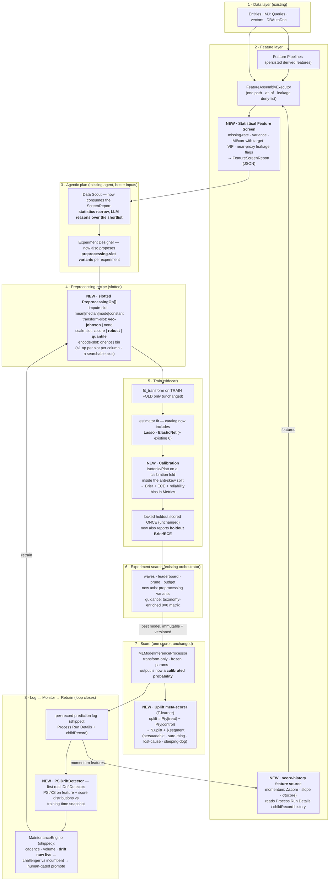
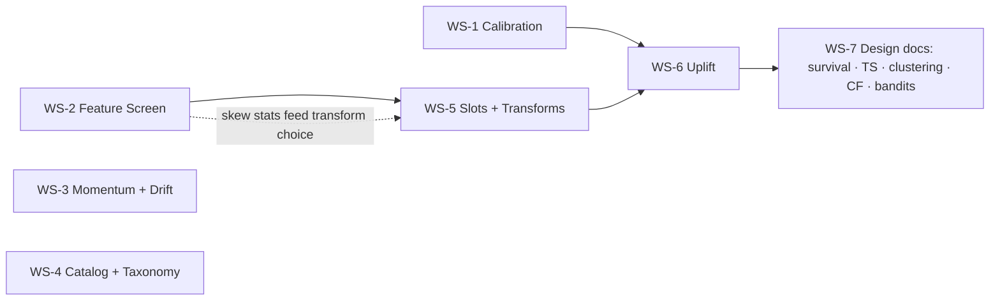

# Predictive Studio Expansion Plan — Decision-Grade Predictions

> **Status**: Proposed (2026-07-10). Synthesizes the Madhav / colleague-1 / colleague-2 idea thread against
> the shipped Phase 1 + Phase 2 system documented in [guides/PREDICTIVE_STUDIO_GUIDE.md](../guides/PREDICTIVE_STUDIO_GUIDE.md).
> **Guiding principle preserved**: PS stays *deliberately rigid about algorithms, flexible about data*. This
> plan does NOT turn PS into SageMaker. Every workstream either (a) makes the outputs **decision-grade**
> (calibrated, monitored, actionable) or (b) hands the existing agentic search a **cleaner, statistically
> grounded search space**. The algorithm catalog grows from 6 to ~8 curated entries, not 30.

---

## 0. The new pipeline, all together

The restructured end-to-end pipeline. **Bold** stages are new; everything else is shipped today and unchanged.
One assembly path, one scorer, one experiment substrate — the invariants (anti-skew, locked holdout, leakage
gate, as-of, immutability) all survive intact; new stages slot *into* them, never around them.

The loop this closes: predictions are logged (already shipped) → the log feeds **momentum features** back into
assembly and **drift** into maintenance → drift triggers retraining → the challenger trains through the same
slotted/calibrated path. Today the log is written and never read; after this plan it powers both a novel
feature family and the monitoring pillar.

---

## 1. Verified current-state gaps this plan closes

| Gap (verified in code) | Where | Closed by |
|---|---|---|
| No calibration — `main.py:421` docstring mentions it; no `CalibratedClassifierCV`, no Brier/ECE anywhere | `Sidecar/src/python/app/` | WS-1 |
| Feature selection is purely LLM-semantic — zero statistical screening in Engine/Core | `Engine/src/` (grep: no VIF/MI/corr) | WS-2 |
| Prediction log (Process Run Details + childRecord) is written but never consumed | §6.5 paths B/C | WS-3 |
| `IDriftDetector` is an empty seam — `policy.driftEnabled` delegates to nothing | `Engine/src/maintenance/` | WS-3 |
| Catalog = 6 supervised algorithms; no Lasso/ElasticNet; no taxonomy columns (family/parametric/ensemble) | `app/algorithms.py` `_REGISTRY`; `MJ: ML Algorithms` | WS-4 |
| `PreprocessingOp[]` is a flat list; z-score unconditional; no power/robust/quantile transforms | `app/preprocessing.py` | WS-5 |
| No uplift / treatment-effect capability | — | WS-6 |

---

## 2. Workstreams

### WS-1 · Calibration (colleague-2's idea — **first, everything downstream depends on it**)

The product speaks "probability of renewal" to business users; raw GBM scores are not probabilities, and
uplift (WS-6) is a *difference of probabilities* — uncalibrated inputs make it garbage.

- **Sidecar contract** (`predictive-studio-core/sidecar-contract.ts` + `app/schemas.py`):
  `TrainRequest.calibration?: { method: 'isotonic' | 'sigmoid'; fraction?: number }` (classification only).
- **Fit discipline**: the calibration fold is carved from the dev split *after* the locked holdout, and the
  calibrator is fit on out-of-fold predictions — inside the existing anti-skew split
  (`_fit_and_score` / `_anti_skew_val_metrics`), never on rows the estimator trained on. The calibrator
  serializes into the model artifact envelope alongside `fitted_preprocessing` (it is part of the model's
  identity, same rule as the frozen preprocessing).
- **Metrics** (`app/metrics.py` + Core `metrics-util.ts`): add `brier_score` + `ece` (expected calibration
  error, 10-bin) + `reliability_bins` to validation AND holdout metrics. `brier`/`ece` join the
  lower-is-better set in `isErrorMetric`.
- **Default ON** for classification pipelines built by the Pipeline Builder; opt-out flag on the pipeline spec.
- **UI**: reliability-diagram panel on the model detail view (Studio dashboard); Brier/ECE columns on the
  leaderboard (AUC is invariant under monotonic calibration, so ranking is unaffected).
- **Tests**: Python golden test (calibrated probabilities reproducible train→predict); extend
  `live-train-score.integration.test.ts` with an asserted ECE ceiling.
- **Size**: S–M. No migration (metrics are JSON columns).

### WS-2 · Statistical feature screen (Madhav #2, as a screen — NOT stepwise selection)

Statistics narrow the pool; the LLM reasons over the shortlist. Classic forward/backward stepwise is
deliberately excluded — it is a multiple-comparisons machine, and the locked-holdout discipline exists
precisely to prevent that class of search optimism.

- **New module** `Engine/src/feature-assembly/feature-screen.ts`: given the assembled train matrix + target,
  compute per-column `{ missingRate, variance, mutualInfo | pointBiserial, absCorrWithTarget, vifGroup }`
  (VIF among numeric candidates only — it gates the linear/interpretability path). Pure TS on the already
  assembled matrix; no sidecar round-trip needed for v1 (MI via binned estimator).
- **Near-proxy leakage flag**: `absCorrWithTarget > 0.95` → flagged as a *pre-train* leakage signal — the
  front-half complement to the shipped post-train single-feature-dominance detector; flagged fields are
  surfaced to the agent and suggested into `LeakageGuard.DenyFields`.
- **Persistence**: `FeatureScreenReport` JSON stored on the `MJ: ML Training Runs` row (existing JSON results
  column; no migration).
- **Agent wiring**: a new `MJ: AI Agent Data Sources` entry / tool exposes the latest screen report to
  **Data Scout**; the Experiment Designer prompt is updated to rank candidate features using it. Multi-model
  comparison stays on the leaderboard's holdout metric (general across all algorithms), with AIC/BIC noted as
  a linear-family-only follow-up if ever needed.
- **Size**: M.

### WS-3 · Score momentum + drift — make the prediction log pay rent (colleague-1)

- **Momentum features**: a new FeatureStep kind `score-history` (Core `feature-steps.ts` discriminated union →
  9 kinds) resolved by the assembly executor from path-B (`MJ: Process Run Details`) or path-C (typed
  childRecord) history for a given prior model binding: emits `score_last`, `score_delta`, `score_slope_k`,
  `score_sigma_k` per record. As-of correctness applies (history filtered to each record's cutoff — no
  future scores leak into training).
- **Drift**: `PSIDriftDetector implements IDriftDetector` (`Engine/src/maintenance/psi-drift-detector.ts`) —
  PSI (10-bin) + KS on (a) score distribution of the latest scoring run vs training-time holdout scores and
  (b) each top-K-importance feature's distribution vs its training snapshot. Requires persisting a compact
  **training distribution snapshot** (per-feature bin edges + counts) into `MJ: ML Models.Lineage` (JSON —
  no migration) at train time.
- **Wiring**: production `MaintenanceEngine` policy gets `driftEnabled: true` with PSI thresholds
  (warn 0.1 / stale 0.25 — standard PSI conventions); drift reasons already flow into the shipped
  staleness → challenger → human-gated-promotion loop.
- **UI**: drift sparkline + last-PSI on the Production tab per binding.
- **Size**: M.

### WS-4 · Catalog + taxonomy (Madhav #1 + #6, curated)

- **New algorithms** (sidecar `_REGISTRY` factories + metadata rows + hyperparameter schemas):
  - `lasso` — `Lasso` (regression) / `LogisticRegression(penalty='l1', solver='saga')` (classification).
  - `elastic_net` — `ElasticNet` / `LogisticRegression(penalty='elasticnet', l1_ratio, solver='saga')`.
  - Catalog becomes **8**. Nothing else in this pass — rigidity is a feature.
- **Taxonomy columns** on `MJ: ML Algorithms` (one migration, single ALTER TABLE, extended properties):
  `Family` (nvarchar — 'Linear' | 'Tree Ensemble' | 'Neural' | …), `LearningType` ('Supervised' |
  'Unsupervised'), `IsParametric` (bit), `EnsembleType` ('None' | 'Bagging' | 'Boosting'). Guidance
  metadata for the agent + UI grouping — explicitly **not** a combinatorial search space (per Madhav's own
  caveat: no LLM-composed ensembles).
- **Matrix**: extend use cases with **"Sparse / feature-selection desired"** (Lasso Primary) → an **8×8**
  rankings matrix (64 rows), reseeded via `mj sync push` (never SQL INSERTs).
- **Order of operations**: migration → CodeGen → typed code (CLAUDE.md rule 2b).
- **Size**: S (algorithms) + S (migration/metadata).

### WS-5 · Slotted preprocessing + distribution-aware transforms (Madhav #4 + #5, corrected)

Z-scoring does not *require* normality (it is centering/scaling, and irrelevant to the tree ensembles that
dominate the matrix) — so no Shapiro gating. The real problem is skewed/heavy-tailed columns hurting the
linear models and MLP; the fix is **substitutable transform options**, chosen from skew statistics.

- **New ops** (`app/preprocessing.py`, fit/apply pairs, golden-tested):
  `power-transform` (**Yeo-Johnson** — handles zeros/negatives, preferred over Box-Cox), `robust-scale`
  (median/IQR), `quantile-transform` (rank-gaussian).
- **Slots**: `PreprocessingOp` gains optional `slot: 'impute' | 'transform' | 'scale' | 'encode'`; a Core
  validator enforces ≤1 op per slot per column set and canonical slot order. Backward-compatible — slotless
  recipes remain valid.
- **The payoff — a search axis**: `ModelingPlanSpec.ProposedExperiments[]` gains
  `PreprocessingVariants?: SlotChoice[]`; the wave orchestrator expands variants into iterations exactly like
  hyperparameter choices (no orchestrator changes beyond plan expansion — the `IWaveStrategist` seam already
  supports it). Skew/kurtosis per column (from the WS-2 screen report) is what the Experiment Designer uses
  to propose transform choices.
- **Size**: M.

### WS-6 · Uplift modeling (colleague-1's flagship — after WS-1)

The "persuadables vs sleeping dogs" segmentation is the *lever* story association staff actually buy, and the
T-learner needs **zero new algorithms** — it is orchestration over the existing (now calibrated) classifiers.

- **Pipeline spec**: `ProblemType` union gains `'uplift'`; pipeline gains `TreatmentColumn` (the binary
  exposure flag — contacted / offered discount / sent campaign). Data availability of treatment logs is a
  per-client data-assembly problem — exactly PS's stated moat, and Data Scout's job to find.
- **Engine**: `UpliftTrainingOrchestrator` (TS, `Engine/src/uplift/`) — **T-learner v1**: split by treatment,
  train two calibrated classifiers via the existing `TrainingEngine` (two immutable `MJ: ML Models` rows +
  a composite lineage), uplift = P̂₁(x) − P̂₀(x). X-learner as a follow-up when treatment groups are
  imbalanced. Evaluation: **Qini / uplift-at-k curves** (`app/metrics.py`), which become the leaderboard
  metric for uplift experiments.
- **Scoring**: the payload gains `$.uplift` + `$.segment` (persuadable / sure-thing / lost-cause /
  sleeping-dog via configurable thresholds on P̂₁, P̂₀) — write-back-able through the existing
  `OutputMapping`, so "put `RenewalUplift` and `ContactSegment` on every member record" works day one.
- **Guardrails**: hard requirement `calibration=on` for both base models; overlap/positivity warning when
  treatment propensity is extreme (report, don't block, v1).
- **UI**: uplift quadrant view (the 2×2 segment table) on the model detail + a segment column in results.
- **Size**: L. Requires migration (ProblemType CHECK + TreatmentColumn) → CodeGen → code.

### WS-7 · Design docs only (bigger bets, deliberately deferred)

One `plans/predictive-studio/` design doc each; **no implementation in this plan's horizon**:

1. **Survival analysis** — right formalism for retention (censoring is real); breaks the contract (duration +
   event columns, C-index, `lifelines`/`scikit-survival` deps). Scope after WS-6 ships.
2. **Time-series forecasting (ARIMA et al.)** — different *shape* (per-series aggregate forecasts, not
   per-record scoring; RSP doesn't fit). A separate work stream with its own UI panel if pursued.
3. **Clustering-as-a-feature** — cheapest unsupervised entry: KMeans fit as a preprocessing op, cluster ID
   becomes an input column; sidesteps the "what metric drives the leaderboard" problem. Full unsupervised
   studio: not planned.
4. **Collaborative-filtering embeddings** — implicit-ALS person/product latent factors, consumable through the
   existing `embedding` feature step; new model family + refresh lifecycle → Phase 3.
5. **A/B + multi-armed bandits / causal DAGs** — the generic `MJ: Experiment*` entities can host bandit
   sessions someday; uplift (WS-6) delivers most of the "which lever works" value at a fraction of the
   machinery. Revisit after uplift has real-world usage.

---

## 3. Sequencing + dependencies

| Order | Workstream | Size | Migration? | Depends on |
|---|---|---|---|---|
| 1 | WS-1 Calibration | S–M | no | — |
| 2 | WS-2 Feature screen | M | no | — |
| 3 | WS-3 Momentum + drift | M | no | — |
| 4 | WS-4 Catalog + taxonomy | S | yes (columns + CHECK) | — |
| 5 | WS-5 Slots + transforms | M | no | WS-2 (soft) |
| 6 | WS-6 Uplift | L | yes (ProblemType + TreatmentColumn) | WS-1, WS-5 (soft) |
| 7 | WS-7 Design docs | S each | no | WS-6 learnings |

WS-1..WS-4 are mutually independent — parallelizable. The two migrations (WS-4, WS-6) each follow
migrate → CodeGen → typed code; all reference-data changes go through metadata files + `mj sync push`.

## 4. What this plan deliberately does NOT do

- No LLM-composed ensembles / model stacking search (Madhav's own caveat — known ensembles beat searched ones).
- No stepwise forward/backward selection (multiple-comparisons; the screen + holdout discipline replaces it).
- No Shapiro-gated standardization (wrong test for the real problem; transforms-as-options instead).
- No 30-algorithm catalog; no GPU; no training embeddings from scratch (CF embeddings deferred to a design doc).
- No weakening of the six invariants — every new stage is inside the anti-skew / locked-holdout / leakage /
  as-of / immutability / one-engine discipline.

## 5. Invariant impact review

| Invariant | Impact |
|---|---|
| Anti train/serve skew | Calibrator + new transform ops serialize into the artifact envelope and apply frozen at predict — same rule as fitted preprocessing. Momentum features flow through the one assembly path with as-of cutoffs. |
| Locked holdout | Untouched; gains Brier/ECE and (uplift) Qini reporting. Calibration fold is carved from dev only. |
| Leakage gate | Strengthened: WS-2 adds the pre-train near-proxy flag alongside the shipped post-train dominance flag. |
| Point-in-time | `score-history` features are cutoff-filtered like every other dated source. |
| Model immutability | Uplift produces two immutable base models + composite lineage; nothing mutates. |
| One engine, thin surfaces | All new capability lands in Engine/Core/sidecar; Remote Ops/Actions stay thin delegates. |
