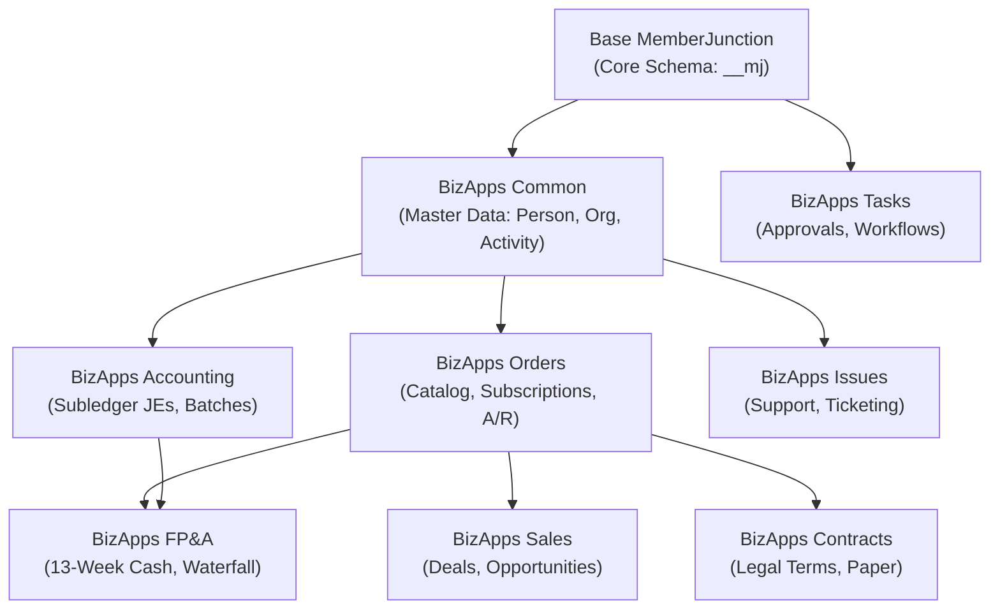

# Predictive Studio Prebuilt Models Specification
## Catalog Roadmap for Base MemberJunction & Downstream BizApps Open Apps

**Document Status:** Final Architecture & Implementation Plan  
**Target Audience:** Core Framework Developers & BizApps Engineering Team  
**Authoring Context:** MemberJunction Predictive Studio (`packages/AI/PredictiveStudio`)

---

## 1. Executive Summary & Architectural Philosophy

The **MemberJunction Predictive Studio** provides enterprise applications with automated model development, visual DAG training pipelines, tournament-based algorithm search (LightGBM, XGBoost, Random Forest, Logistic Regression, MLP), and production model lifecycle management.

To accelerate enterprise adoption, every application in the MemberJunction ecosystem—from the foundational **Base MemberJunction (`MJ`)** framework to domain-specific **BizApps Open Apps**—should ship with **prebuilt, production-grade predictive models and training pipelines** out-of-the-box.

### Strict Dependency Direction & Zero-Leakage Invariant

A fundamental tenet of the MemberJunction Open App architecture is strict separation of concerns and a unidirectional dependency graph:

#### The Golden Architectural Rules for Predictive Models:
1. **Upstream Apps Know Nothing of Downstream Apps**:
   - **`MJ Core`** models cannot reference `Common`, `Orders`, or any BizApp tables. They operate strictly on framework metadata, AI executions, audit logs, and query logs in `[__mj]`.
   - **`BizApps Common`** models cannot reference transactional, financial, billing, or sales data. A model in `Common` must **never** touch `Orders`, `Invoices`, `Deals`, or `Revenue`.
2. **Downstream Apps Leverage Upstream Data Freely**:
   - **`BizApps Orders`** can enrich transaction history with `Common` firmographics (e.g., industry, company size, country) and `Common.Person` profile details.
   - **`BizApps Sales`** can combine deal stage progression with `Common.Activity` interaction frequency and historical `Orders` spending.
   - **`BizApps FP&A`** uses both `Orders` transactional actuals and `Accounting` GL balances to forecast cash lag.
3. **Where Does LTV Belong?**:
   - Customer Lifetime Value (LTV) models require transactional revenue, invoice history, and subscription renewals. Therefore, **LTV models belong in `BizApps Orders`**, NOT in `Common`. `Common` provides firmographics; `Orders` owns the transactional billing substrate.
   - Conversely, **Activity Disengagement / Relationship Decay** belongs strictly in **`Common`**, as it measures pure multi-channel touchpoint frequency over time without regard to pricing.
4. **Mandatory Leakage Guards on Every Model**:
   - Every pipeline must declare an explicit `LeakageGuard.DenyListColumns` containing all post-outcome, timestamp-proxies, or result-dependent fields.
   - Every temporal scenario must enforce a point-in-time cutoff (`AsOfStrategy`).

---

## 2. Prebuilt Models for Base MemberJunction (`MJ`)

These models ship directly with the core framework and activate upon base installation without requiring any Open Apps.

---

### 2.1. `MJ: AI Agent Run Latency & Token Budget Forecaster`
- **Target App**: Base MemberJunction (`MJ`)
- **Business Intent**: Predicts execution latency (in milliseconds) and total token consumption before dispatching long-running autonomous agent tasks or prompt chains.
- **Problem Type**: Regression
- **Target Entity**: `[__mj].[vwAIPromptRuns]`
- **Target Variable**: `ExecutionTimeMS` (Latency in ms) or `TokensUsed`
- **Key Features**:
  - `TokensPrompt` (Input token count proxy)
  - `Model` / `Vendor` (Gemini, Claude, OpenAI)
  - `Agent` / `Prompt`
  - `EffortLevel`, `Temperature`, `TopP`, `TopK`
  - Temporal hour-of-day and day-of-week derived from `__mj_CreatedAt`
- **Leakage Guard (Deny-List)**: `ExecutionTimeMS` (when predicting tokens), `TokensCompletion`, `TokensUsed`, `TotalCost`, `RunAt`, `CompletedAt`, `Status`, `Success`, `ErrorMessage`.
- **Temporal Cutoff**: Static cross-sectional at prompt queue time.
- **Recommended Algorithm**: **LightGBM Regressor** or **Ridge Regression**
- **Evaluation Metric**: **RMSE** & **MAE** (target MAE < 1,500ms)
- **In-App Integration**: 
  - Surfaced in the Explorer Chat & Agent Studio interface: displays an immediate *"Estimated completion time: ~8 seconds"* indicator.
  - Automatically sizes worker queue timeouts to prevent premature thread killing.

---

### 2.2. `MJ: AI Agent Run Failure & Timeout Risk`
- **Target App**: Base MemberJunction (`MJ`)
- **Business Intent**: Predicts whether an AI agent execution or task graph node is at high risk of failing (context length overflow, rate limiting, or schema validation failure).
- **Problem Type**: Binary Classification
- **Target Entity**: `[__mj].[vwAIPromptRuns]`
- **Target Variable**: `Status` (`Success` vs `Failed`)
- **Key Features**:
  - Prompt length, nested tool invocation depth
  - Target model context window limit proximity
  - Rolling 1-hour error rate of the target AI Model provider
  - Payload complexity (JSON schema nesting depth)
- **Leakage Guard (Deny-List)**: `DurationMs`, `ErrorMessage`, `EndedAt`, `ResponseText`.
- **Recommended Algorithm**: **XGBoost**
- **Evaluation Metric**: **ROC-AUC** (target >= 0.88)
- **In-App Integration**:
  - Pre-flight guard in `AIEngine`: when risk exceeds 70%, the orchestrator automatically executes context compaction or routes to a fallback model with larger context headroom.

---

### 2.3. `MJ: Entity Mutation & Audit Log Anomaly Detector`
- **Target App**: Base MemberJunction (`MJ`)
- **Business Intent**: Identifies anomalous, out-of-distribution, or suspicious mass record updates across any entity in the system.
- **Problem Type**: Anomaly Detection / Binary Classification
- **Target Entity**: `[__mj].[vwRecordChanges]`
- **Target Variable**: `IsAnomalous`
- **Key Features**:
  - `EntityID` / `EntityName`
  - Number of modified fields in the transaction (`FieldCount`)
  - Timestamp attributes (weekend/holiday modifications, after-hours edits)
  - User role and user historical edit frequency on that entity
  - Z-score variance of numeric field values relative to 30-day baseline
- **Leakage Guard (Deny-List)**: `RevertedAt`, `AuditInvestigationID`, `ResolutionNotes`.
- **Recommended Algorithm**: **Isolation Forest** / **Random Forest Classifier**
- **Evaluation Metric**: **Precision@K** & **F1-Score**
- **In-App Integration**:
  - Highlights flagged rows in the Explorer Audit Log with an amber warning badge.
  - Generates automated security alerts via `UserNotification`.

---

### 2.4. `MJ: Heavy Query Execution Runtime Forecaster`
- **Target App**: Base MemberJunction (`MJ`)
- **Business Intent**: Predicts whether a dynamic view, saved query, or natural language Skip query will take > 5,000ms or time out before execution.
- **Problem Type**: Binary Classification (`Fast < 2s` vs `Heavy > 5s`)
- **Target Entity**: `[__mj].[vwAuditLogs]` (filtered to `AuditLogType = 'Run Query'`)
- **Logging Architecture Note**: In MemberJunction, saved query runs log execution latency into `[__mj].[AuditLog]` when `ForceAuditLog` is true or `AuditQueryRuns = 1` on `MJ: Queries`. Ad-hoc queries (`ExecuteAdhocQuery`) execute directly without writing audit records. Timings (`ExecutionTime`, `RowCount`, `SQL`) are stored in `AuditLog.Details` JSON.
- **Target Variable**: `IsHeavyQuery` (derived as `ExecutionTime > 5000`)
- **Key Features**:
  - SQL AST complexity: JOIN count, subquery count, aggregation count
  - Target entity metadata: table row count, index count
  - WHERE clause filter presence on indexed columns
  - Concurrent active query count on the database server
- **Leakage Guard (Deny-List)**: `ExecutionTime`, `RowCount`, `TotalRowCount`, `ErrorMessage`.
- **Recommended Algorithm**: **LightGBM**
- **Evaluation Metric**: **ROC-AUC** & **Recall** (vital to catch 95%+ of slow queries)
- **In-App Integration**:
  - Explorer View & Query Designer: triggers a helpful pre-flight prompt: *"This query is predicted to take ~20s. Add a date filter or run in background?"*

---

## 3. Prebuilt Models for BizApps Open Apps

---

### 3.1. 👥 BizApps Common (`bizapps-common`)
*Master Data Foundation: Person, Organization, Address, Activity. Zero financial or revenue knowledge.*

#### Model: `Common: Relationship Disengagement & Activity Churn Risk`
- **Business Intent**: Predicts customer or contact disengagement based purely on multi-channel touchpoint decay across the shared Activity spine.
- **Problem Type**: Binary Classification (`Engaged` vs `Disengaged / At-Risk`)
- **Target Entity**: `[__mj_BizAppsCommon].[vwOrganizations]` (or `vwPeople`)
- **Target Variable**: `RelationshipStatus` (`Active` vs `At-Risk`)
- **Key Features**:
  - 30-day vs 90-day activity slope from `vwActivities`
  - Inbound vs outbound activity ratio
  - Days since last executive interaction
  - Contact method count (verified email, direct phone)
  - Linked active people count per organization
- **Leakage Guard (Deny-List)**: Deactivation dates, post-observation window activities.
- **Temporal Cutoff**: As-Of evaluation date.
- **Recommended Algorithm**: **XGBoost** | **ROC-AUC** (target >= 0.85)
- **In-App Integration**: Embedded into `Person` and `Organization` cockpit header rails as a **Relationship Health Indicator**.

---

### 3.2. 📦 BizApps Orders (`bizapps-orders`)
*Transactional Billing Substrate: Catalog, Orders, Subscriptions, Payments, A/R.*

#### Model A: `Orders: Customer Lifetime Value (LTV) Tier Predictor`
- **Business Intent**: Predicts an account's long-term revenue tier within their first 60 days of transactional history, enriching `Orders` data with `Common` firmographics.
- **Problem Type**: Multi-Class Classification (`Enterprise`, `Growth`, `Core`, `LowTouch`)
- **Target Entity**: `[__mj_BizAppsOrders].[vwOrders]` (aggregated to customer level)
- **Target Variable**: `LTVTier`
- **Key Features**:
  - `FirstOrderAmount`, `LineItemCount`, `InitialProductCategory`
  - Customer payment method type (ACH vs Credit Card vs Wire)
  - `Common.vwOrganizations`: `Industry`, `EmployeeCount`, `Country`, `Region`
  - `Common.vwActivities`: Onboarding meeting count in first 30 days
- **Leakage Guard (Deny-List)**: `LifetimeRevenue`, `TotalOrderCount`, `AllTimeSpend`, `TenureYears`.
- **Temporal Cutoff**: `JoinDate + 60 days`.
- **Recommended Algorithm**: **Random Forest** | **Balanced Accuracy** & **Macro-F1**
- **In-App Integration**: Displays on Customer Account & Order views to prioritize VIP onboarding queues.

#### Model B: `Orders: Payment Default & Late Payment Risk`
- **Business Intent**: Predicts invoices and orders at high risk of paying past terms (Net-30/60) or defaulting.
- **Problem Type**: Binary Classification (`PaidOnTime` vs `PastDue`)
- **Target Entity**: `[__mj_BizAppsOrders].[vwOrders]`
- **Target Variable**: `PaymentStatus`
- **Key Features**:
  - `TotalAmount`, `TaxAmount`, `DiscountAmount`
  - Payment method history (past failed payment attempts from `vwPayments`)
  - Bill-to country and currency
  - Customer historical days-to-pay average
- **Leakage Guard (Deny-List)**: `PaidDate`, `DaysToPayment`, `CollectionStatus`, `WriteOffAmount`.
- **Recommended Algorithm**: **XGBoost** | **ROC-AUC** (target >= 0.86)
- **In-App Integration**: Grid badge in the Orders list and automated collections reminder trigger.

#### Model C: `Orders: Subscription Churn Propensity`
- **Business Intent**: Predicts whether a recurring subscription will renew or cancel at cycle end.
- **Problem Type**: Binary Classification (`Renewed` vs `Cancelled`)
- **Target Entity**: `[__mj_BizAppsOrders].[vwSubscriptions]`
- **Target Variable**: `Status`
- **Key Features**:
  - `BillingCadence` (Monthly, Annual), `PlanAmount`, `Tier`
  - `CurrentTenureMonths`, `PriceOverrideFlag`
  - Recent payment retry count in `vwPayments`
  - Open support issue count from `BizApps Issues`
- **Leakage Guard (Deny-List)**: `CancellationDate`, `CancellationReason`, `EndDate`.
- **Recommended Algorithm**: **LightGBM** | **ROC-AUC** (target >= 0.87)
- **In-App Integration**: Subscription detail panel with predictive risk drivers and automated retention playbooks.

---

### 3.3. 📊 BizApps Accounting (`bizapps-accounting`)
*Subsidiary Ledger of Record: Journal Entries, Account Roles, Batches.*

#### Model A: `Accounting: Journal Entry Anomaly Detector`
- **Business Intent**: Detects unusual or high-risk journal entries prior to CFO batch lock and ERP synchronization.
- **Problem Type**: Anomaly Detection / Binary Classification
- **Target Entity**: `[__mj_BizAppsAccounting].[vwJournalEntryLines]`
- **Target Variable**: `IsAnomalous`
- **Key Features**:
  - `DebitAmount`, `CreditAmount`, `GLAccountRole`
  - Dimension pairings (`DepartmentID`, `ProjectID`, `CostCenterID`)
  - Posting timestamp attributes (off-hours, month-end spikes)
  - Posting user role and historical entry distribution
- **Leakage Guard (Deny-List)**: `BatchStatus`, `ApprovedByCFOAt`, `ERPDispatchStatus`.
- **Recommended Algorithm**: **Isolation Forest** / **Random Forest** | **Precision@K**
- **In-App Integration**: CFO Batch Review dashboard, flagging high-risk lines for manual sign-off.

#### Model B: `Accounting: Transaction GL Account Role Classifier`
- **Business Intent**: Suggests the appropriate GL Account Role for unmapped transaction lines based on memo text and vendor.
- **Problem Type**: Multi-Class Classification
- **Target Entity**: `[__mj_BizAppsAccounting].[vwJournalEntryLines]`
- **Target Variable**: `GLAccountRole`
- **Key Features**:
  - `Description` / `Memo` text embedding
  - `VendorID` / `OrganizationID`
  - `Amount`, `Currency`
- **Leakage Guard (Deny-List)**: `AccountID` (target proxy).
- **Recommended Algorithm**: **Logistic Regression** or **MLP** | **Macro-F1**
- **In-App Integration**: Inline suggestion pill during manual journal entry creation.

---

### 3.4. 💼 BizApps Sales (`bizapps-sales`)
*Commercial Pipeline: Deals, Stages, Closed Won Orchestration.*

#### Model A: `Sales: Deal Win Propensity (Opportunity Scoring)`
- **Business Intent**: Computes the win probability of active deals in the sales pipeline.
- **Problem Type**: Binary Classification (`Closed Won` vs `Closed Lost`)
- **Target Entity**: `[__mj_BizAppsSales].[vwDeals]`
- **Target Variable**: `DealStatusType`
- **Key Features**:
  - `ExpectedAmount`, `DiscountPercentageRequested`, `ProductCount`
  - Stage duration days, total pipeline velocity
  - Rep historical win rate, deal source
  - Activity count from `Common.vwActivities`
- **Leakage Guard (Deny-List)**: `CloseDate`, `ActualWonAmount`, `LossReasonID`, `ContractID`.
- **Recommended Algorithm**: **XGBoost** | **ROC-AUC** (target >= 0.88)
- **In-App Integration**: Pipeline Kanban board badges and weighted forecast calculations.

#### Model B: `Sales: Close Date Slippage Risk`
- **Business Intent**: Predicts whether a deal forecast for the current quarter will slip into future quarters.
- **Problem Type**: Binary Classification (`OnTime` vs `Slipped`)
- **Target Entity**: `[__mj_BizAppsSales].[vwDeals]`
- **Target Variable**: `IsSlipped`
- **Key Features**:
  - Historical frequency of `EstimatedCloseDate` modifications
  - Stage progression velocity over the last 14 days
  - Days since last prospect email/call in `Common.vwActivities`
- **Leakage Guard (Deny-List)**: Actual close date and contract execution timestamps.
- **Recommended Algorithm**: **LightGBM** | **Precision** (target >= 0.82)
- **In-App Integration**: Revenue forecast waterfall adjustment in sales management dashboards.

---

### 3.5. ⏱️ BizApps Tasks (`bizapps-tasks`)
*Workflow, Assignment & Human Approval Engine.*

#### Model A: `Tasks: Approval SLA Breach Forecaster`
- **Business Intent**: Predicts whether a human approval gate (discount sign-off, CFO batch gate, contract deviation) will breach its turnaround SLA.
- **Problem Type**: Binary Classification (`Met` vs `Breached`)
- **Target Entity**: `[__mj_BizAppsTasks].[vwTasks]`
- **Target Variable**: `IsSLABreached`
- **Key Features**:
  - `TaskType`, `Priority`, `ContextEntity`
  - Assignee current pending queue depth
  - Day-of-week and time-of-day submitted
  - Rolling 30-day response latency of the approver role
- **Leakage Guard (Deny-List)**: `CompletedDate`, `ActualDurationMinutes`, `EscalationManagerID`.
- **Recommended Algorithm**: **Random Forest** | **ROC-AUC**
- **In-App Integration**: Proactive auto-escalation or delegation warning in the Tasks inbox.

---

### 3.6. 🎫 BizApps Issues (`bizapps-issues`)
*Support Ticketing & Incident Management.*

#### Model A: `Issues: Critical Escalation & P1 Severity Risk`
- **Business Intent**: Identifies tickets and customer bug reports likely to escalate into P1/critical incidents at initial filing.
- **Problem Type**: Binary Classification
- **Target Entity**: `[__mj_BizAppsIssues].[vwIssues]`
- **Target Variable**: `IsCriticalEscalation`
- **Key Features**:
  - Description and title text embeddings
  - `ProductComponent`, `SubmitterCustomerTier`
  - Submitter account ARR from `Orders.vwOrders`
- **Leakage Guard (Deny-List)**: `ResolvedDate`, `ResolutionDurationMinutes`, `PostMortemID`.
- **Recommended Algorithm**: **LightGBM** | **Recall@Top-10%** (target >= 0.92)
- **In-App Integration**: Immediate VIP engineer paging and high-priority badge in the support queue.

---

### 3.7. 📜 BizApps Contracts (`bizapps-contracts`)
*Legal Obligations, Clause Modifications & Paper of Record.*

#### Model A: `Contracts: Contract Expiration & Non-Renewal Risk`
- **Business Intent**: Predicts whether an active commercial agreement will fail to renew prior to the required notice window.
- **Problem Type**: Binary Classification (`Renewed` vs `Terminated`)
- **Target Entity**: `[__mj_BizAppsContracts].[vwContracts]`
- **Target Variable**: `Status`
- **Key Features**:
  - Contract term length, initial ARR, auto-renewal clause flag
  - Total number of custom negotiated clause deviations from standard provisions
  - Linked open issue count from `Issues.vwIssues`
- **Leakage Guard (Deny-List)**: `TerminationNoticeReceivedDate`, `EndDate`, `SupersededByContractID`.
- **Recommended Algorithm**: **XGBoost** | **ROC-AUC**
- **In-App Integration**: 90-day Renewal Radar view in the Contracts management dashboard.

---

### 3.8. 📈 BizApps FP&A (`bizapps-fpna`)
*13-Week Cash Liquidity Forecasting & Equity Distribution Waterfall.*

#### Model A: `FP&A: Customer-Specific Payment Lag (DSO) Forecaster`
- **Business Intent**: Replaces static payment term assumptions (Net 30) with dynamically predicted actual cash collection dates for each customer, refining the 13-week operational cash forecast.
- **Problem Type**: Regression (continuous number of days)
- **Target Entity**: `[__mj_BizAppsOrders].[vwOrders]`
- **Target Variable**: `DaysToPayment`
- **Key Features**:
  - Historical payment timing variance by customer
  - Invoice magnitude, month-of-year, holiday periods
  - Customer financial sector and geography from `Common.vwOrganizations`
- **Leakage Guard (Deny-List)**: `ActualPaymentDate`, `CashReceiptBatchID`.
- **Recommended Algorithm**: **Ridge Regression** or **LightGBM Regressor** | **MAE** (target MAE < 4.2 days)
- **In-App Integration**: Automatically shifts projected Friday cash collection buckets in the 13-week cash matrix.

---

## 4. Implementation Guidelines for the Team Member

When implementing each model in its host repository, the developer should follow this standardized workflow:

### Step 1: Migration DDL & Seed Record
Author a standard Skyway migration script (e.g., `V2026xxxx__v1.x.0_Predictive_Studio_Seed_Models.sql`) using deterministic hardcoded UUIDs for:
1. `[__mj].[MLTrainingPipeline]`: Defines the DAG, `SourceBindings`, `FeatureSteps`, `TargetVariable`, `LeakageGuard`, and `ValidationStrategy`.
2. `[__mj].[MLModel]`: Registers the model container linked to the pipeline with `FeatureSchema`, `ModelType: 'Production'`, and `Status: 'Published'`.
3. `[__mj].[MLModelVersion]`: Records the initial version, holdout performance metrics (`HoldoutAUC`, `Accuracy`, `F1Score`, `TrainingDurationSec`), and feature importances.

### Step 2: Leakage Guardrail Review
Ensure that:
- Every field created or modified after the target event is in `LeakageGuard.DenyListColumns`.
- `DominanceThreshold` is configured (default `0.80`).
- The pipeline passes `PredictiveStudioEngine.validatePipeline()`.

### Step 3: UI Consumption via Angular BaseFormPanel
Integrate the prediction into the host app's UI:
- Call `PredictiveStudioEngine.Instance` to fetch scores by primary key.
- Follow the modern Angular pattern (`@if`, standalone components, `@memberjunction/ng-ui-components` design tokens).
- Provide clear, non-technical explanations of risk tiers and driver factors.

### Step 4: Unit Test Suite
Add a dedicated test file (e.g., `<feature>-renewal-risk.test.ts`) covering:
- Correct target extraction and feature assembly.
- Leakage deny-list validation.
- Threshold mapping (`High`, `Moderate`, `Low`).
- Zero console error regressions.

---

## 5. Master Summary Catalog

| Application Layer | Model Name | Entity View | Type | Target Variable | Recommended Algorithm | Metric |
|---|---|---|---|---|---|---|
| **Base MJ** | Agent Latency & Tokens | `vwAIPromptRuns` | Reg | `ExecutionTimeMS` | LightGBM Regressor | RMSE |
| **Base MJ** | Agent Run Failure Risk | `vwAIPromptRuns` | Class | `Status` | XGBoost | ROC-AUC |
| **Base MJ** | Entity Mutation Anomaly | `vwRecordChanges` | Anom | `IsAnomalous` | Isolation Forest / RF | Precision@K |
| **Base MJ** | Heavy Query Runtime | `vwAuditLogs` | Class | `IsHeavyQuery` | LightGBM | ROC-AUC |
| **Common** | Relationship Disengagement | `vwOrganizations` | Class | `RelationshipStatus` | XGBoost | ROC-AUC |
| **Orders** | Customer LTV Tier | `vwOrders` | Multi | `LTVTier` | Random Forest | Macro-F1 |
| **Orders** | Payment Default Risk | `vwOrders` | Class | `PaymentStatus` | XGBoost | ROC-AUC |
| **Orders** | Subscription Churn | `vwSubscriptions` | Class | `Status` | LightGBM | ROC-AUC |
| **Accounting** | Journal Entry Anomaly | `vwJournalEntryLines` | Anom | `IsAnomalous` | Isolation Forest / RF | Precision@K |
| **Accounting** | GL Account Role Classifier | `vwJournalEntryLines` | Multi | `GLAccountRole` | Logistic Regression | Macro-F1 |
| **Sales** | Deal Win Propensity | `vwDeals` | Class | `DealStatusType` | XGBoost | ROC-AUC |
| **Sales** | Close Date Slippage Risk | `vwDeals` | Class | `IsSlipped` | LightGBM | Precision |
| **Tasks** | Approval SLA Breach | `vwTasks` | Class | `IsSLABreached` | Random Forest | ROC-AUC |
| **Issues** | Critical Escalation Risk | `vwIssues` | Class | `IsCriticalEscalation` | LightGBM | Recall |
| **Contracts** | Contract Non-Renewal Risk | `vwContracts` | Class | `Status` | XGBoost | ROC-AUC |
| **FP&A** | Dynamic Cash Lag (DSO) | `vwOrders` | Reg | `DaysToPayment` | LightGBM Regressor | MAE |

---

## 6. Autonomous Implementation Game Plan & Master Checklist

### Architectural Operating Principles
- **Agent-First Modeling**: Every model pipeline is designed, refined, and validated by interacting directly with the **Model Development Agent** inside the Predictive Studio UI using authenticated Playwright sessions.
- **Continuous UX & Agent Diagnostics**: As the agent interacts with us, note and address any friction in the conversational loop, prompt instructions, artifact viewer rendering, or manual workbench controls.
- **One Model at a Time with Verification**:
  1. Initiate a new session in Predictive Studio UI logged in as the developer.
  2. Direct the agent to formulate the pipeline for the target use case.
  3. Verify the generated pipeline DAG, leakage guards, feature steps, and tournament runs.
  4. Inspect the resulting `ML Experiment Results` artifact viewer and winning model registration.
  5. Commit at logical checkpoints (non-destructive git operations only).
- **Materialization & Run History Analytics**:
  - For operational use cases, score records and evaluate whether to materialize predicted scores back into natural business entities.
  - In More Cheese, simulate multi-month execution runs to build deep, realistic run history for the demo database and model monitoring analytics.

---

### Step-by-Step Implementation Sequence

#### [ ] Phase 1: Base MJ Model 1 — Agent Latency Regressor (First Interactive Build)
- [ ] Launch Playwright browser session authenticated as the user at `/app/predictive-studio`.
- [ ] Tag the **Model Development Agent** in a fresh conversation thread.
- [ ] Provide business goal: *"Build a predictive regression pipeline on `vwAIPromptRuns` to forecast `ExecutionTimeMS` from `TokensPrompt`, `Model`, `Vendor`, and `EffortLevel`, guarding against post-run leakage."*
- [ ] Observe agent plan, sub-agent coordination, and pipeline generation.
- [ ] Fix any agent prompt gaps, payload generation issues, or UI/artifact viewer friction.
- [ ] Execute tournament training; verify the winning model registers in `MJ: ML Models`.
- [ ] Inspect the `ML Experiment Results` artifact viewer in both full modal and copilot drawer.
- [ ] Stop and report findings: UI improvements, agent fixes, model accuracy/RMSE. Commit checkpoint.

#### [ ] Phase 2: Remaining Base MJ Models
- [ ] Model 2: `MJ: AI Agent Run Failure & Timeout Risk` (`vwAIPromptRuns` -> `Status`).
- [ ] Model 3: `MJ: Entity Mutation & Audit Log Anomaly Detector` (`vwRecordChanges` -> `IsAnomalous`).
- [ ] Model 4: `MJ: Heavy Query Execution Runtime Forecaster` (`vwAuditLogs` -> `IsHeavyQuery`).
- [ ] Finalize Base MJ test suite and PR.

#### [ ] Phase 3: Downstream Open Apps Pipeline Rollout
- [ ] **BizApps Common**:
  - Model: `Common: Relationship Disengagement & Activity Churn Risk` (`vwOrganizations`).
- [ ] **BizApps Orders**:
  - Model A: `Orders: Customer Lifetime Value (LTV) Tier Predictor` (`vwOrders` + `Common.vwOrganizations`).
  - Model B: `Orders: Payment Default & Late Payment Risk` (`vwOrders`).
  - Model C: `Orders: Subscription Churn Propensity` (`vwSubscriptions`).
- [ ] **BizApps Accounting**:
  - Model A: `Accounting: Journal Entry Anomaly Detector` (`vwJournalEntryLines`).
  - Model B: `Accounting: Transaction GL Account Role Classifier` (`vwJournalEntryLines`).
- [ ] **BizApps Sales**:
  - Model A: `Sales: Deal Win Propensity` (`vwDeals`).
  - Model B: `Sales: Close Date Slippage Risk` (`vwDeals`).
- [ ] **BizApps Tasks**:
  - Model A: `Tasks: Approval SLA Breach Forecaster` (`vwTasks`).
- [ ] **BizApps Issues**:
  - Model A: `Issues: Critical Escalation & P1 Severity Risk` (`vwIssues`).
- [ ] **BizApps Contracts**:
  - Model A: `Contracts: Contract Expiration & Non-Renewal Risk` (`vwContracts`).
- [ ] **BizApps FP&A**:
  - Model A: `FP&A: Customer-Specific Payment Lag (DSO) Forecaster` (`vwOrders`).

#### [ ] Phase 4: Model Run History & Predictive Analytics Simulation
- [ ] Generate monthly historical scoring runs across More Cheese and BizApps.
- [ ] Verify Model Registry performance drift tracking and run history analytics.

