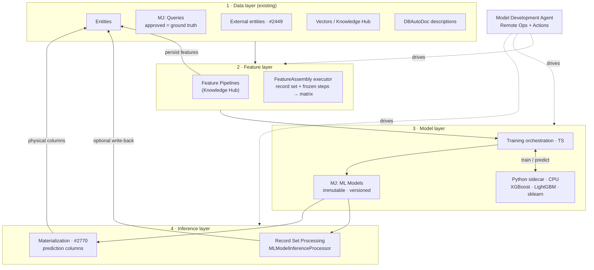
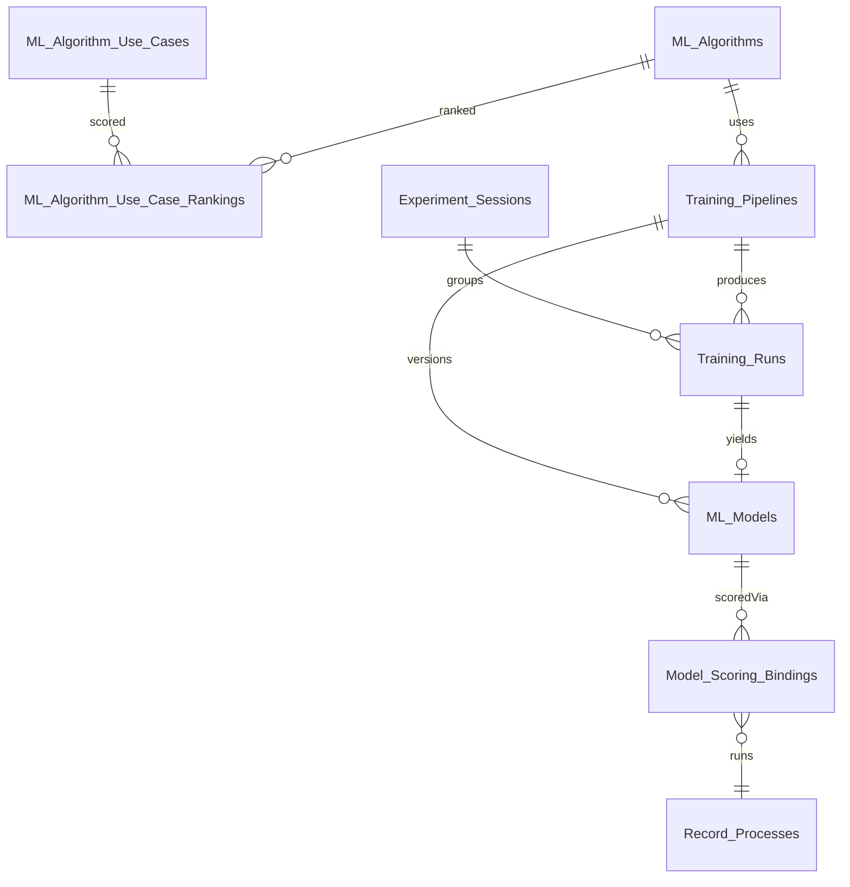
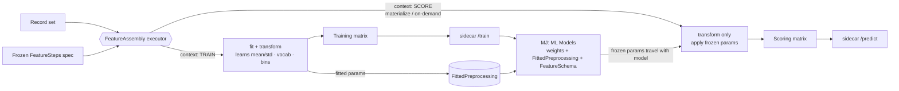
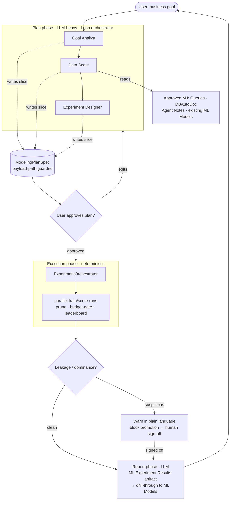
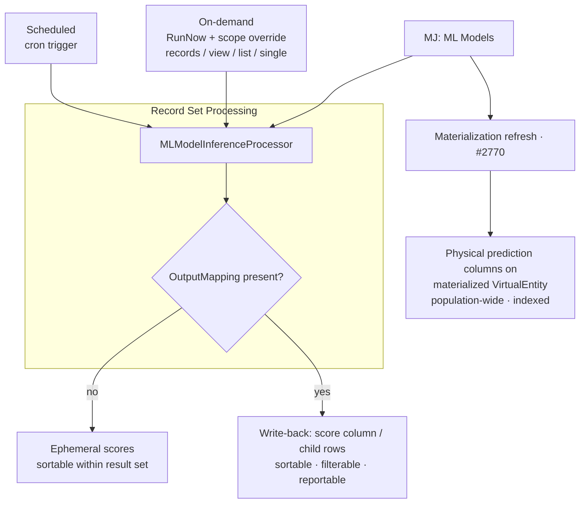

# MemberJunction — Predictive Studio
### Core platform capability for feature engineering, predictive modeling, agent-driven model development, and scoring
**Status:** Planning / Implementation Spec (RFC v2)
**Audience:** MJ engineering team + the implementing agent
**Date:** 2026-06-25
**Supersedes:** the original "Model Studio" brief; folds in the founding design conversation + a grounded codebase study (Record Set Processing, Flow Agents, Content Sources/Knowledge Hub, Remote Operations, Agent Manager, Artifacts/Conversations, PRs #2449 & #2770).

---

## 0. How to read this document

This is both a design record and an implementation spec. **Decisions** are marked **[D]**; **open questions** **[O]**. §1–§13 are the design. **§14 is the Work Breakdown Structure (WBS)** — the authoritative task list. The implementing agent should treat the WBS as its task backlog (not session state): each task has a stable ID (`PS-<area>-<n>`), dependencies, acceptance criteria, and the packages/files it touches. Build in one mega-phase with the sub-phases in §14; check tasks off in the WBS itself.

---

## 1. Vision & placement

MJ runs off-the-shelf models well (embeddings, LLMs, image/audio/video inference). It does **not** train models on a client's own data. Predictive Studio closes that gap with an **opinionated, AI-native** capability: a reasonably technical business user (not a career data scientist) can build genuinely useful predictive models through a beautiful UI — and an agent can drive the same object model end to end.

Canonical use cases: **member retention / renewal prediction**, **conference attendee return prediction**, lapse risk, lead scoring. Pull variables from many systems/tables, assemble a feature set, train, then **score** who is likely to lapse/renew/return.

**[D] This is CORE MJ, not an OpenApp.** It composes on top of substrates MJ already has (entities, queries, vectors, Record Set Processing, Remote Operations, Agents, Artifacts), so it belongs in core as a set of **objects + Remote Operations + Actions** wrapped by world-class UI and an agent.

### 1.1 Two homes, one capability

Per the design conversation, the surface splits across two app homes:

- **Knowledge Hub** gains **Feature Pipelines** — LLM/derived feature creation that writes attributes back to entities. This is a direct generalization of the existing Content Autotagging pipeline (LLM classify → persisted tags). Feature Pipelines have **standalone analytics value**, independent of any model.
- **Predictive Studio** (new app) owns **models**: the algorithm catalog, training pipelines, training/experiment runs, trained models, scoring, the experiment engine, and the **Model Development Agent** (the Loop Agent — working name; see §9). The agent is invokable from an embedded chat in the Studio *or* from any MJ chat surface.

### 1.2 Scope — Circle 2 ("opinionated simplicity")

**[D]** Rigid about algorithms (a fixed 5–8 catalog), flexible about data. We are **not** building SageMaker/Databricks. Not GPU training. Not training embeddings from scratch (we *use* pre-trained embeddings as features). The differentiation is **data assembly + agentic search over MJ's entire data surface**, not algorithmic innovation.

---

## 2. Architecture overview

Four layers; the first already exists.

1. **Data layer (existing).** Entities, stored Queries, external entities (#2449), vectors/Knowledge Hub, DBAutoDoc metadata — all become **feed-ins**.
2. **Feature layer (new + reuse).** Feature Pipelines (Knowledge Hub) that persist derived features, plus the **FeatureAssembly executor** that turns a record set + a frozen pipeline spec into a numeric feature matrix.
3. **Model layer (new).** Training orchestration (TS) → **Python sidecar** (CPU) → serialized, versioned, immutable **ML Model** artifact with full lineage.
4. **Inference layer (new).** Score single record or batch via a new **ML inference work type** in Record Set Processing — on-demand and scheduled — with optional write-back; later, materialized prediction columns via #2770.



Everything server-side capability is exposed as **Remote Operations** (Manual mode) + thin **Actions** so agents/Skip/Query Builder inherit it.

### 2.1 What composes onto existing substrates (grounded findings)

| Need | Existing substrate | What we add |
|---|---|---|
| On-demand + scheduled scoring of a view/list/selection/single record | **Record Set Processing** (`packages/RecordSetProcessor`): pluggable `IRecordProcessor`, scopes (View/List/Filter/SingleRecord + runtime `RecordProcessScopeOverride`), triggers (OnDemand/OnChange/Schedule), batching/concurrency/rate-limit/circuit-breaker/budget/pause/resume/audit, `RecordProcess.RunNow` Remote Op | a new `MLModelInferenceProcessor` work type |
| Write predictions back to rows/columns | `WriteBackProcessor` decorator + `OutputMapping` (fields or child records) | wire ML output → mapping |
| Feature pipelines (LLM → transform → persist) | **Content Autotagging** (`packages/ContentAutotagging`) is the living precedent; Record Set Processing `InferProcessor`/`ActionRecordProcessor`/`AgentRecordProcessor` + `WriteBackProcessor` | first-class **Feature Pipeline** entity + Knowledge Hub UI |
| Embedding features | `EntityVectorSyncer`, `BaseEmbeddings` (local transformers.js `all-MiniLM-L6-v2` 384-dim + cloud), pgvector/Qdrant/Pinecone/SQL Server | featurization step that pulls persisted vectors |
| External/virtual entities as feature sources | **#2449 External Data Sources (DONE)** — external DBs are first-class read-only entities via normal `RunView`/`RunQuery`/`Load` | nothing — works through RunView |
| Materialized scored columns (population-wide, indexed) | **#2770 Query/Entity Materialization (DESIGN DOC ONLY)** — materialized output = read-only `VirtualEntity`, refreshed via `ScheduledJobEngine` | run inference at refresh; write prediction columns (sequenced after #2770 lands) |
| Typed server capability invoked by browser + agent | **Remote Operations** (`BaseRemotableOperation`, Manual mode, `LongRunning` progress) | TrainModel / ScoreRecordSet / RunFeaturePipeline / experiment control ops |
| Plan-then-execute agent | **Agent Manager** pattern (Loop agent, strongly-typed `AgentSpec` payload, sub-agents refine spec, Architect validates, Builder executes deterministically) | the Model Development Agent |
| Rich result artifact in chat | **Artifacts** (`MJ: Artifact Types` + `@RegisterClass(BaseArtifactViewerPluginComponent, …)` viewer plugins, `NavigationRequest` drill-through) | a new ML-experiment-results artifact type + viewer |
| Reasoning inputs | approved **MJ: Queries**, **Agent Notes** memory, **DBAutoDoc** entity/field descriptions, existing approved ML Models | wire as agent context |

### 2.2 Key sequencing insight

**On-demand scoring + write-back has ZERO dependency on materialization (#2770).** We can ship train → score a view → write predictions back as columns → sort/filter/report end-to-end using only Record Set Processing + the sidecar. Materialization is the *later* "scheduled, population-wide, indexed" optimization. The WBS reflects this: scoring lands before materialization.

---

## 3. Compute model

**[D] CPU-bound, no GPU.** Gradient boosting / logistic regression / random forest / small MLP on tabular data train in seconds–minutes on CPU. Matches MJ's API-runtime infra (CPU, not GPU). Multi-minute (and offline multi-hour) training is acceptable; latency is not the constraint. GPU is a future door (embeddings/LLM fine-tune), not now.

### 3.1 Python sidecar

**[D] A Python sidecar does the ML; TS orchestrates.** Node is poor for training. The sidecar runs XGBoost, scikit-learn, LightGBM. CPU-only container, horizontally scalable, **stateless per request except a warm in-process LRU cache of loaded model artifacts** (this is what keeps single-record interactive scoring ~10–30 ms).

**[D] Single path for all inference (no Node-side ONNX runtime).** All inference happens server-side (Record Set Processing engine, materialization refresh, agent ops all run on the server), so the sidecar is always reachable; there is no client/edge pressure forcing a second runtime. One path = simpler. (ONNX may still be chosen as the *portable artifact format* in §11 — that's storage, not a second runtime.)

**[D] Data transport: MJ assembles the matrix and sends it to the sidecar as a simple in-memory structure** (JSON rows, or columnar arrays for compactness) over HTTP/gRPC. For very large training sets, fall back to a shared-storage handle (Parquet/Arrow written by MJ, ref passed) — **probably not needed initially**; design the contract to allow `data` inline OR `data_ref`, implement inline first.

### 3.2 Sidecar contract (illustrative)

```
POST /train
{ "algorithm":"xgboost", "problem_type":"classification",
  "hyperparameters":{...}, "validation":{"strategy":"train_test_split","test_size":0.2},
  "feature_schema":[{"name":"tenure","kind":"numeric"}, ... ,{"name":"emb_0","kind":"numeric"}],
  "preprocessing":[ {"op":"impute","col":"age","strategy":"mean"}, {"op":"standardize","cols":[...]}, {"op":"onehot","col":"city"} ],
  "target":"renewed",
  "data": { "columns":[...], "rows":[[...],[...]] }   // OR "data_ref":"<handle>"
}
→ { "artifact_b64":"...", "fitted_preprocessing":{...}, "metrics":{...},
    "feature_importance":{...}, "training_row_count":N, "duration_sec":T,
    "holdout_metrics":{...} }

POST /predict
{ "artifact_b64 | artifact_ref":"...", "fitted_preprocessing":{...},
  "feature_schema":[...], "rows":[ {features...}, ... ] }   // 1..N rows
→ { "predictions":[ {"score":0.83,"class":"renew"}, ... ] }
```

The sidecar **fits** preprocessing during `/train` and returns the fitted parameters; `/predict` only **applies** them (see §6 train/serve skew).

---

## 4. Data model (Predictive Studio entities)

New core entities. Names follow MJ "MJ: " prefix convention. CodeGen generates timestamps, FK indexes, sprocs, views, entity classes. **Do not** write code against new fields until the migration + CodeGen have run (CLAUDE.md rule 2b).


_(Entity names shown without the "MJ: " prefix for diagram clarity; `Record_Processes` is the existing Record Set Processing entity.)_

### 4.1 `MJ: ML Algorithms` (catalog)
| Field | Purpose |
|---|---|
| ID, Name, Description | Identity |
| ProblemTypes | CSV/`'classification,regression'` supported |
| DriverClass | sidecar algorithm key (e.g. `xgboost`, `lightgbm`, `logistic_regression`) |
| HyperparameterSchema | typed JSON schema (for UI form + validation) |
| DefaultHyperparameters | JSON |
| SupportsFeatureImportance | bit |
| Status | `Active`/`Deprecated` |

Seeded via metadata file `metadata/ml-algorithms/.ml-algorithms.json` (NOT SQL INSERTs — CLAUDE.md). Starting catalog: XGBoost, LightGBM, Logistic Regression, Random Forest, Linear/Ridge Regression, MLP. Reserve k-NN / Naive Bayes **[O]**.

### 4.1.1 `MJ: ML Algorithm Use Cases` (guidance lookup)
Curated, **decision-relevant** scenarios that genuinely differentiate algorithm suitability — NOT business labels (churn / renewal / attendee-return are all the same *binary classification* shape, so they don't differentiate). Seeded via metadata.
| Field | Purpose |
|---|---|
| ID, Name, Description | e.g. "Binary classification (yes/no)", "Regression (predict a number)", "Interpretability required", "Minimal tuning (business-user)", "Large/wide dataset (speed)", "Embedding/LLM-feature-heavy", "Small dataset" |
| ProblemTypeScope | `classification` \| `regression` \| `any` (filter) |
| Guidance | longer agent-readable note on when this scenario applies |
| DisplayOrder | UI ordering |

### 4.1.2 `MJ: ML Algorithm Use Case Rankings` (algorithm × use-case join)
**[D]** Codifies "which algorithm fits which scenario" so both the agent's Experiment Designer and a human in the UI get guided, evidence-based defaults instead of guessing. Seeded via metadata.
| Field | Purpose |
|---|---|
| ID | PK |
| MLAlgorithmID | FK → MJ: ML Algorithms |
| MLAlgorithmUseCaseID | FK → MJ: ML Algorithm Use Cases |
| SuitabilityScore | int 1–5 (5 = best) for ranking/sorting |
| RecommendationLevel | `Primary` \| `Strong` \| `Viable` \| `Weak` \| `NotRecommended` |
| Rationale | the **why** (agent + human readable), e.g. "Gives feature importances but not simple coefficients — if a stakeholder needs to see exactly why each prediction was made, prefer Logistic/Ridge." |
| | UNIQUE (MLAlgorithmID, MLAlgorithmUseCaseID) |

Seed matrix (RecommendationLevel) — the rationale text per cell is the real payoff:

| Use case ↓ / Algo → | XGBoost | LightGBM | Logistic Reg | Random Forest | Linear/Ridge | MLP |
|---|---|---|---|---|---|---|
| Binary classification (yes/no) | Primary | Strong | Viable | Strong | NotRec | Viable |
| Regression (predict a number) | Primary | Strong | NotRec | Strong | Strong | Viable |
| Interpretability required | Weak | Weak | **Primary** | Viable | **Primary** | NotRec |
| Minimal tuning (business-user) | Viable | Viable | Strong | **Primary** | Strong | Weak |
| Large/wide dataset (speed) | Strong | **Primary** | Strong | Viable | Strong | Viable |
| Embedding/LLM-feature-heavy | Strong | Strong | Viable | Viable | Viable | **Primary** |
| Small dataset | Viable | Viable | **Primary** | Strong | **Primary** | Weak |

### 4.2 `MJ: Training Pipelines` (declarative definition)
| Field | Purpose |
|---|---|
| ID, Name, Description, Version, Status | Identity/lifecycle (`Draft`/`Published`/`Archived`) |
| TargetEntityID | the entity whose records are the training units (e.g. Members) |
| TargetVariable | label expression/column (e.g. `Renewed`) |
| ProblemType | `classification`/`regression` |
| AlgorithmID | FK → ML Algorithms |
| Hyperparameters | typed JSON |
| SourceBindings | ordered JSON: entities / Queries / external entities / vector sets to draw features from |
| FeatureSteps | ordered DAG (JSON) of FeatureAssembly steps (§5/§6) |
| AsOfStrategy | point-in-time config (§6.3): `none` \| `column` (decision-date column) \| `offset` (N days before label event) |
| LeakageGuard | JSON: deny-list of fields/sources, single-feature-dominance threshold (§6.4) |
| ValidationStrategy | JSON: `train_test_split` (ratio) \| `kfold` (k) \| `holdout`; plus locked-holdout fraction |

### 4.3 `MJ: ML Models` (immutable, versioned)
**[D] Immutable + versioned.** Each successful run → a new row; never mutate.

> **Distinct from `MJ: AI Models`.** `MJ: AI Models` is the catalog of off-the-shelf foundation models we *call* (LLMs, embeddings, image-gen), tied to vendors + driver classes + a vendor-API inference path. `MJ: ML Models` are predictive models we *train* from client data — produced by a training run, with a serialized artifact (MJStorage), fitted preprocessing, and the **sidecar** inference path. An ML Model may *reference* an AI Model in its `Lineage` (e.g. the embedding model used to build features) — a pointer, not membership. **[O]** Future option: expose an ML Model *as* an `MJ: AI Models` row of a "Predictive" type so the unified inference layer can route to it; out of scope for v1.
| Field | Purpose |
|---|---|
| ID, PipelineID, Version | Identity + lineage |
| AlgorithmID | algorithm used |
| ArtifactID / Artifact | serialized model — **File** content category, stored in MJStorage (`MJ: Files`); see §11 |
| FittedPreprocessing | serialized fitted transform params (means/stds/vocabularies/bin edges) — **the anti-skew payload** |
| FeatureSchema | ordered feature names + kinds the model expects (the inference input contract) |
| TargetVariable, ProblemType | what it predicts |
| Metrics | train + validation metrics (AUC/F1/accuracy/RMSE…) JSON |
| HoldoutMetrics | honest score on the locked holdout (§8.2) |
| FeatureImportance | per-feature contribution JSON |
| Lineage | data version(s), pipeline version, source bindings, as-of date, sidecar version, embedding-model version(s) |
| TrainedAt, TrainingDurationSec, TrainingRowCount | provenance |
| Status | `Draft`/`Validated`/`Published`/`Archived` |

### 4.4 `MJ: Training Runs` (experiment record)
**[D] Instrument every run.** Substrate the agent loop reasons over.
| Field | Purpose |
|---|---|
| ID, PipelineID, ResultingModelID | identity + produced model (nullable — a run may be pruned/failed and produce no model) |
| ExperimentSessionID | groups runs in one agent-driven search (§8) |
| FeaturesUsed, AlgorithmID, Hyperparameters | configuration |
| ValidationResults | all metrics, per-fold |
| Status, StartedAt, CompletedAt | accounting |
| ComputeCost, TokensUsed | budget enforcement (§8.4) |
| Notes | why this run was tried (agent rationale) |

### 4.5 `MJ: Experiment Sessions`
| Field | Purpose |
|---|---|
| ID, Name, PipelineID | identity |
| Goal | natural-language objective + target metric (e.g. "maximize holdout AUC for renewal") |
| Budget | JSON: max compute-cost / max runs / max wallclock |
| Status | `Planning`/`AwaitingApproval`/`Running`/`Paused`/`Completed`/`Cancelled` |
| PlanSpec | the approved `ModelingPlanSpec` (§9.2) JSON |
| Leaderboard | JSON snapshot of best runs (also derivable from Training Runs) |
| AgentRunID | FK → MJ: AI Agent Runs (the Model Development Agent run that owns this session) |

### 4.6 `MJ: Model Scoring Bindings` (lineage for scoring/retraining)
Binds a ML Model to where it scores, so we can detect staleness and drive retraining (§10/§12 maintenance).
| Field | Purpose |
|---|---|
| ID, MLModelID | which model |
| RecordProcessID | the Record Process that runs the scoring (the ML inference work) |
| TargetEntityID / TargetColumn | where scores are written (when write-back/materialized) |
| Mode | `OnDemand`/`Scheduled`/`Materialized` |
| MaterializedResultID | FK → MJ: Materialized Results (#2770), when materialized |
| LastScoredAt, LastRowCount | monitoring |

---

## 5. Feature engineering

### 5.1 Structured features
20–30 columns from 2–3 entities (tenure, events-at-signup, recency, geography, engagement). Ordinary numeric/categorical columns assembled via RunView/RunViews and Query bindings.

### 5.2 Embedding features
**[D] Pre-trained embeddings as feature extractors; each dimension is its own feature.** A 384-dim embedding → 384 numeric columns; gradient boosting does implicit selection. Reuse `EntityVectorSyncer` + `BaseEmbeddings`. **Persisted, version-pinned** (the embedding-model id is part of model Lineage) — never regenerated at scoring time.

### 5.3 LLM-synthesized features
LLM reasons over a member's activity → text summary → embedding → features (sentiment/personality tagging are the same shape). **[D] These are produced by upstream Feature Pipelines and persisted**, not recomputed inline in the training pipeline (determinism + cost; see §6).

### 5.4 Feature Pipelines (Knowledge Hub) — first-class, standalone
**[D] Feature Pipelines are first-class** (valuable for analytics independent of any model). They generalize Content Autotagging: chain `LLM prompt / Action / Agent → transform → write attribute back to row (or create child rows)`. **Implementation: author them on the Record Set Processing substrate** (`InferProcessor`/`ActionRecordProcessor`/`AgentRecordProcessor` + `WriteBackProcessor` `OutputMapping`), surfaced as a first-class **`MJ: Feature Pipelines`** registry entity (points at a Record Process config) so they are discoverable, lineage-tracked, and reasoned over by the Model Development Agent. Flow Agents supply richer per-record branching when needed (a Feature Pipeline step can invoke a Flow Agent); Record Set Processing supplies the batch run + the **write-back that Flow Agents lack**.

> Small enabling unlock: a generic **"Write Entity Field(s)" Action** (target entity + record id + field map) usable by both Flow Agents and as a Feature Pipeline terminal step. (WBS PS-FEAT-3.)

### 5.5 Sources
Structured entities, stored Queries (incl. approved/ground-truth), **external entities (#2449)**, content-source vectors, Knowledge Hub synthesis, and (additively, later) images via vision-LLM-as-feature (§11/§5.6).

### 5.6 Images / multimodal — additive, later
No image classifier/embedding pipeline exists today. **[D] Out of initial scope.** Bridge path that reuses everything: **vision-LLM-as-feature** (run a vision prompt over an image → label/description → categorical feature or embed it). True image-classifier-as-primary-model is a later track (would need a multimodal embedding provider). Captured in WBS PS-MM-* as optional.

### 5.7 Example feature matrix (member retention)
```
[ tenure | events_at_signup | days_since_last_activity_asof | city | …~25 cols… ]  ← structured
[ emb_0 | emb_1 | … | emb_383 ]                                                    ← 384-dim member-summary embedding (persisted)
→ one matrix → algorithm → model
```

---

## 6. The FeatureAssembly executor + train/serve skew (the correctness backbone)

### 6.1 One executor, three contexts
**[D] A single `FeatureAssembly` executor** turns `(record set, frozen FeatureSteps spec) → feature matrix`. It runs in **three** contexts and MUST produce identical features:
1. **Training** — `fit + transform` (learns the fitted params).
2. **Scheduled/materialized scoring** — `transform` only.
3. **On-demand/interactive scoring** — `transform` only.

Anything else creates train/serve skew.



### 6.2 Fit vs transform (anti-skew)
**[D]** Stateful transforms (normalization mean/std, one-hot vocabulary, bin edges, imputation fill values) are **fit once on training data**; the fitted parameters are serialized into `MLModel.FittedPreprocessing` alongside the weights. At inference we **only apply** the frozen params, never re-fit. (sklearn fit/transform split, executed in the sidecar.) This is why `FeatureSchema` alone is insufficient — the fitted pipeline travels with the model.

### 6.3 Point-in-time / "as-of" assembly
**[D] First-class `AsOfStrategy` on the pipeline.** For forward prediction, features must be assembled **as they were at the decision point** (e.g. 90 days before the renewal window), not as they are today. `days_since_last_activity` computed at training time over post-decision data leaks the future. Modes: `none`, `column` (a decision-date column on the training unit), `offset` (N days before the label event). Time-relative feature logic means training "as-of-then" and scoring "as-of-now" stay consistent. This is the single biggest **new** correctness primitive — nothing in MJ provides it.

### 6.4 Leakage guard
**[D]** An automated feature-search agent will relentlessly exploit target leakage (a field that's a proxy for the label → AUC ~0.99 garbage). Guard: (a) `LeakageGuard` deny-list of fields/sources that must not enter features; (b) a **single-feature-dominance flag** — if one feature's importance exceeds a threshold (e.g. >0.6) the run is flagged; (c) the agent's data-scout phase is prompted to identify and exclude obvious post-outcome fields.

**[D] Suspicion → warn loudly + human sign-off, in business language.** When the agent suspects leakage (dominance flag, a result that looks "too good"), it does **not** silently proceed and does **not** auto-promote. It surfaces a clear, **business-person-friendly** warning ("One field is doing almost all the predicting — this often means we're accidentally peeking at the answer. A human should confirm this is legitimate before we trust this model.") and **blocks promotion** until a human signs off. The explanation is written for an advanced business user, not a hardcore data scientist.

### 6.5 LLM features are transforms too
Regenerating an LLM summary at scoring time with a newer model is train/serve skew in disguise. Hence §5.3's rule: persist + version-pin.

---

## 7. Algorithm catalog
**[D] Fixed, curated 5–8.** XGBoost (primary), LightGBM, Logistic Regression, Random Forest, Linear/Ridge Regression, MLP. Each catalog row declares problem types, hyperparameter schema, defaults, sidecar driver key. Reserve 2 slots (k-NN / Naive Bayes) **[O]**.

---

## 8. Experimentation engine + validation

### 8.1 Iteration cycle (first-class, manual AND automated)
select features → choose algorithm → split → train → evaluate on held-out data → deterministically grade → refine → repeat. Supported manually (UI) and as an automated search (§9 agent).

### 8.2 Validation discipline
**[D] Be opinionated; don't ship broken models.** Default single train/test split with overfitting detection; optional k-fold and holdout. **[D] A locked final holdout** the search never sees, scored exactly once on the promoted model → `MLModel.HoldoutMetrics` is the honest number (prevents leaderboard optimism / multiple-comparisons overfitting). Deterministic scoring (AUC/F1/accuracy/RMSE) drives the loop.

### 8.3 Experiment engine
`ExperimentSession` groups runs. The engine: maintains a **leaderboard**, **parallelizes** experiments (bounded), **prunes** unpromising branches, focuses compute on promising directions, respects **budget**. Runs minutes→hours→days per budget.

### 8.4 Budgets
**[D] Bounded autonomy.** Explicit budget (max compute-cost / max runs / max wallclock). `TrainingRun.ComputeCost` + `ExperimentSession.Budget` make it enforceable/auditable. The engine checks budget between runs and pauses cleanly.

### 8.5 DBAutoDoc as the agent's map
DBAutoDoc's entity/field descriptions give the data-scout phase a high-quality machine-readable map of the data terrain to reason about what's predictive.

---

## 9. The Model Development Agent (the Loop Agent) — capstone

> **Working name:** "Model Development Agent" (alternatives: "Predictive Modeling Agent", "Model Builder Agent"). Deliberately **not** "Copilot" — that brand now reads as Microsoft's and isn't a strong AI name. Final name TBD with the team.

Mirrors **Agent Manager**: collaborate with the user to build a strongly-typed plan, then **execute the plan mostly with deterministic code** (with some internal LLM inference for choices), then **report with an LLM-authored rich artifact**.

### 9.1 Agent topology
- **Type:** the **top-level orchestrator is a Loop agent** (`LoopAgentType`) so it stays **conversational**. Crucially, the orchestration of the three sub-agents is **enforced declaratively via metadata payload guards** — `PayloadDownstreamPaths` / `PayloadUpstreamPaths` / `PayloadSelfReadPaths` / `PayloadSelfWritePaths` on each sub-agent — rather than hardcoded control flow. Each sub-agent can only read/write its designated slice of the `ModelingPlanSpec`, which both constrains and sequences the work. A thin `validateSuccessNextStep` override remains only for **plan-validity** checks (spec completeness, leakage sign-off) before the approval gate — not for sequencing.
- **Sub-agents (planning phase, LLM-heavy):**
  - **Goal Analyst** — refines the business goal into a precise target definition + problem type + success metric (writes `payload.Goal`, `payload.TargetDefinition`).
  - **Data Scout** — studies source data using **approved MJ: Queries** (ground truth), **DBAutoDoc** descriptions, **Agent Notes** (prior learnings), and **existing approved ML Models**; proposes candidate sources/features; flags leakage risks (writes `payload.CandidateSources`, `payload.CandidateFeatures`, `payload.LeakageNotes`).
  - **Experiment Designer** — proposes a ranked set of experiments (feature combos × algorithms × hyperparameters) **with rationale**, a validation strategy, and a **proposed budget** (writes `payload.ProposedExperiments`, `payload.ValidationStrategy`, `payload.ProposedBudget`).
- **Plan approval gate:** the orchestrator emits the plan as an artifact + a `responseForm` / `Chat` step; the **user approves/edits** before execution. (Agent Manager's Requirements→Designer→Architect refinement pattern.)
- **Execution phase (deterministic-heavy):** once approved, a **deterministic `ExperimentOrchestrator`** (plain TS, like Agent Manager's Builder) executes the plan: calls the Train/Score Remote Ops/Actions, records `Training Runs`, updates the leaderboard, prunes, enforces budget. **Internal LLM inference is used only for choices** ("given these results, what feature combo to try next") — the bulk is deterministic loop/compare/prune code.
- **Reporting phase (LLM):** authors a summary → the **ML Experiment Results artifact** (§9.4) with clickable drill-through to the winning `ML Models`.
- **Memory:** writes learnings as Agent Notes scoped **largely to itself** (Agent + User), e.g. "for churn on org X, gradient boosting + engagement features beat logistic regression" — these auto-inject into future runs and harden via the Memory Manager. Org-wide propagation is not an in-flight write; it only happens through the Memory Manager's hardening cycle.
- **Semantic-layer contribution:** when the agent **authors a new MJ: Query** during data exploration, that Query is created with **`Status='Pending'`** (not Approved). It is *not* treated as ground truth until a human approves it — at which point it becomes part of the approved semantic layer for everyone. This keeps the agent productive (it can draft queries) without letting it silently expand the trusted ground-truth surface.



### 9.2 Strongly-typed payload — `ModelingPlanSpec`
Analogous to Agent Manager's `AgentSpec`. Refined incrementally via `AgentPayloadChangeRequest` (`updateElements`/`replaceElements`), validated by the orchestrator's `validateSuccessNextStep` override before execution. Shape (TypeScript interface, lives in a new `@memberjunction/predictive-studio-core`):

```typescript
export interface ModelingPlanSpec {
  Goal: string;                       // business objective, refined
  TargetDefinition: {
    EntityName: string;               // training unit entity (e.g. "Members")
    TargetVariable: string;           // label expression/column
    ProblemType: 'classification' | 'regression';
    SuccessMetric: 'AUC' | 'F1' | 'Accuracy' | 'RMSE' | string;
    AsOfStrategy?: { Mode: 'none'|'column'|'offset'; Column?: string; OffsetDays?: number };
  };
  CandidateSources: Array<{ Kind: 'Entity'|'Query'|'ExternalEntity'|'VectorSet'|'FeaturePipeline'; Ref: string; Why: string }>;
  CandidateFeatures: Array<{ Name: string; SourceRef: string; Kind: 'numeric'|'categorical'|'embedding'|'llm-derived'; Why: string }>;
  LeakageNotes: Array<{ Field: string; Risk: string; Action: 'exclude'|'allow' }>;
  ProposedExperiments: Array<{
    Label: string; AlgorithmName: string; FeatureSet: string[];
    Hyperparameters?: Record<string, unknown>; Rationale: string; Priority: number;
  }>;
  ValidationStrategy: { Strategy: 'train_test_split'|'kfold'|'holdout'; TestSize?: number; K?: number; LockedHoldoutFraction: number };
  ProposedBudget: { MaxComputeCost?: number; MaxRuns?: number; MaxWallclockMinutes?: number };
  Approved?: boolean;                 // user gate
  Leaderboard?: Array<{ TrainingRunID: string; Metric: number; ModelID?: string }>;  // execution-phase
}
```

### 9.3 Ground-truth query access
**[D] The approved-query registry already exists: `MJ: Queries` with `Status='Approved'`.** The Data Scout reads feature data **only from `MJ: Queries` where `Status='Approved'`** (plus RunView over entities) — it never hand-writes raw SQL for feature extraction. When the agent needs a query that doesn't exist, it **drafts a new `MJ: Query` as `Status='Pending'`** (§9.1 semantic-layer rule); that draft is usable for the current exploration but is **not** ground truth until a human approves it, after which it enriches the shared semantic layer. (WBS PS-AGENT-4.)

### 9.4 ML Experiment Results artifact
**[D] New artifact type** `application/vnd.mj.ml-experiment-results` (metadata-seeded in `metadata/artifact-types/`, `ParentID` → JSON, with `ExtractRules` for name/description/displayMarkdown). A new Angular viewer plugin `@RegisterClass(BaseArtifactViewerPluginComponent, 'MLExperimentResultsViewerPlugin')` renders: the goal, leaderboard, per-run metrics, feature importance, and **clickable drill-through to each ML Model** via `NavigationRequest({ appName:'Predictive Studio', navItemName:'Models', queryParams:{ modelId } })`. Produced by the agent run (`CreateArtifacts:true`) and attached to the conversation.

### 9.5 Invocation surfaces
Embedded chat in the Predictive Studio dashboard (`<mj-conversation-chat-area [defaultAgentId]="copilotAgentId" [applicationId]="studioAppId" [showAgentPicker]="false">`) **and** any MJ chat surface (default-agent resolution / @mention). Progress streams via the agent progress callback + Remote Op `LongRunning` progress.

---

## 10. Scoring & materialization

### 10.1 On-demand & scheduled (ship first)
**[D]** New `MLModelInferenceProcessor` (Record Set Processing work type). Same contract as siblings: record → `InputMapping` (assemble features via the frozen FeatureAssembly transform) → sidecar `/predict` → structured output. **On-demand** = `RecordProcess.RunNow` + runtime scope override (`records`/`view`/`list`/`filter`/single). **Scheduled** = `Schedule` trigger. **[D] Ephemeral by default; write-back when an `OutputMapping` is present** — the caller decides by attaching the mapping (writes a score column to the entity or a child record). Predictions written back become sortable/filterable/reportable like any column.

> Doc fix: the existing "Infer" work type = *run an AI Prompt per record*; it is NOT ML inference. Update `guides/RECORD_SET_PROCESSING_GUIDE.md` to disambiguate, and name the new type clearly (e.g. "ML Model" / `MLModelInferenceProcessor`). (WBS PS-SCORE-1.)



### 10.2 Materialized prediction columns (after #2770)
**[D] Defer dynamic per-query computed columns; run inference inside the offline materialization pipeline** (#2770). At refresh: join/denormalize across however many entities, assemble features, batch-score, write predictions as **physical columns** on the materialized `VirtualEntity`. Skip/Query Builder/reports/views query them like any table — fast, indexed, population-wide. Depends on #2770 landing; `MJ: Model Scoring Bindings.MaterializedResultID` links the two.

### 10.3 Single + batch
**[D]** Both supported (the sidecar doesn't care); single-record serves interactive agent needs, batch serves bulk/materialization.

---

## 11. Artifact format & storage
- **[O]→[D-lean] Model artifact format:** start with **native algorithm format** (XGBoost/LightGBM JSON, sklearn via a portable serializer) wrapped in our own envelope `{ format, version, payload_b64, fitted_preprocessing, feature_schema }`. Evaluate **ONNX** as the portable cross-deployment format (SQL Server/Postgres parity) — adopt if export is clean for the catalog; keep it as *format*, not a second runtime.
- **[D] Artifact storage:** `MJ: ML Models` artifact is `ContentCategory='File'` → stored in **MJStorage** (`MJ: Files`), referenced by `ArtifactID`. Keeps large blobs out of the row. The sidecar fetches by reference or receives inline on `/predict` (warm cache keyed by model id + version).

---

## 12. Maintenance (co-equal pillar)
**[D] Maintenance is a named pillar, not an afterthought.** Via `MJ: Model Scoring Bindings`: staleness detection, scheduled re-scoring (tie to the materialization cadence), and **retraining triggers** (cadence / data-volume / drift). The Model Development Agent can schedule retraining ("retrain weekly on new data"), compare a retrained model's holdout metrics against the incumbent, and propose promotion. Drift surface **[O]**: how much per-prediction explanation to expose.

---

## 13. UX (world-class, manual AND agent-driven)
**[D] Everything the agent does is also doable manually, beautifully.** Predictive Studio is an MJ Explorer dashboard (`BaseDashboard`, page-chrome trio, design tokens, mjButton, modern Angular, `NotifyLoadComplete`). Panels:
- **Algorithm catalog** browser.
- **Pipeline builder** — visual DAG of FeatureAssembly steps; **reuse the Foblex flow-editor** (`packages/Angular/Generic/flow-editor`) used by Flow Agents.
- **Training run comparison** — metrics, feature importance, validation/holdout.
- **Model registry** — promote `Draft → Validated → Published`; lineage view.
- **Experiment session monitor** — live leaderboard, budget burn, pause/cancel.
- **Embedded Model Development Agent chat** scoped to the agent.
- **Feature Pipelines** authoring lives in **Knowledge Hub** (generalizing the autotagging UI).

Bias to sensible defaults, deterministic + AI-assisted suggestions, progressive disclosure (powerful but not intimidating for an advanced business user).

---

## 14. Work Breakdown Structure (the task list)

**One mega-phase, sub-phases SP0–SP12.** Build order respects dependencies; many tasks parallelize. Each task: **ID — title** · _deps_ · **AC** (acceptance criteria) · packages. Treat this list as the backlog; check items off here.

### SP0 — Foundations: data model, packages, ops scaffolding
- **PS-FND-1 — Create packages.** _deps: none._ Scaffold `@memberjunction/predictive-studio-core` (types: `ModelingPlanSpec`, feature-step specs, sidecar contract types), `@memberjunction/predictive-studio` (engine/orchestration/processors/ops), `@memberjunction/predictive-studio-sidecar` (Python). **AC:** packages build, vitest scaffolded (`scripts/scaffold-tests.mjs`). 
- **PS-FND-2 — Migration: core entities.** _deps: PS-FND-1._ One migration in `migrations/v5/` creating `MJ: ML Algorithms`, `ML Algorithm Use Cases`, `ML Algorithm Use Case Rankings`, `Training Pipelines`, `ML Models`, `Training Runs`, `Experiment Sessions`, `Model Scoring Bindings` (+ `sp_addextendedproperty` on every column; consolidated ALTER/CREATE; hardcoded UUIDs; no `__mj_*`/FK indexes; UNIQUE on the rankings join). **AC:** migration runs clean on SQL Server; PG parity via pg-migrate skill.
- **PS-FND-3 — CodeGen.** _deps: PS-FND-2._ Run migration + CodeGen; generated entity subclasses + sprocs/views exist. **AC:** strongly-typed entity classes available; no `.Get()/.Set()` needed downstream.
- **PS-FND-4 — Seed algorithm catalog + guidance.** _deps: PS-FND-3._ Metadata-seed (each its own dir + `.mj-sync.json`, `@lookup:` refs, `mj sync push` — NO SQL inserts): `metadata/ml-algorithms/.ml-algorithms.json` (6 algorithms + hyperparameter schemas), `metadata/ml-algorithm-use-cases/.ml-algorithm-use-cases.json` (the 7 use cases), and `metadata/ml-algorithm-use-case-rankings/.ml-algorithm-use-case-rankings.json` (the 6×7 ranking matrix with per-cell `RecommendationLevel` + `Rationale`). **AC:** catalog + use cases + rankings present; an agent/UI query returns ranked, rationale-bearing recommendations per use case.
- **PS-FND-5 — Remote Operation metadata rows.** _deps: PS-FND-3._ Seed `MJ: Remote Operations` rows (GenerationType=`Manual`, Status=`Active`, `ExecutionMode='LongRunning'` where applicable, `RequiredScope='predictive:execute'`, typed Input/Output defs) for: `PredictiveStudio.TrainModel`, `PredictiveStudio.ScoreRecordSet`, `PredictiveStudio.RunFeaturePipeline`, `PredictiveStudio.StartExperimentSession`, `PredictiveStudio.ControlExperimentSession`, `PredictiveStudio.PromoteModel`. **AC:** CodeGen emits typed bases in `remote_operations.ts`.

### SP1 — Python sidecar
- **PS-SIDE-1 — Sidecar service.** _deps: PS-FND-1._ FastAPI (or similar) CPU-only container; `/train` + `/predict`; XGBoost/LightGBM/sklearn; warm LRU model cache; envelope artifact format (§11). **AC:** unit tests per algorithm; trains + predicts on a fixture; single-record predict < 50 ms warm.
- **PS-SIDE-2 — Preprocessing fit/transform.** _deps: PS-SIDE-1._ Impute/standardize/one-hot/bin implemented as fit (train) + apply (predict); `fitted_preprocessing` round-trips. **AC:** identical transform of the same raw row at train vs predict (golden test).
- **PS-SIDE-3 — Deployment + config.** _deps: PS-SIDE-1._ Container under `docker/`; MJAPI config for sidecar URL; health check; horizontal-scale-ready (stateless + cache). **AC:** MJAPI reaches sidecar via config; documented in `docker/CLAUDE.md`.
- **PS-SIDE-4 — TS sidecar client.** _deps: PS-SIDE-1, PS-FND-1._ Typed client in `predictive-studio` (train/predict, inline data + `data_ref` seam, inline first). **AC:** client unit-tested against a mock; errors surfaced typed.

### SP2 — FeatureAssembly executor (correctness backbone)
- **PS-FEAT-1 — FeatureAssembly executor.** _deps: PS-FND-3._ `(recordSet, FeatureSteps) → matrix`; RunView/RunViews + Query bindings + external entities + persisted vectors; emits `FeatureSchema`. **AC:** assembles the retention example; same code path callable in all 3 contexts.
- **PS-FEAT-2 — As-of / point-in-time.** _deps: PS-FEAT-1._ `AsOfStrategy` (`none`/`column`/`offset`); time-relative feature logic; training rows assembled as-of decision date. **AC:** golden test proving no future leakage for `offset` mode.
- **PS-FEAT-3 — "Write Entity Field(s)" Action.** _deps: PS-FND-3._ Generic Action (target entity + record id + field map → Save) reusable by Flow Agents + Feature Pipeline terminal. **AC:** action writes/creates rows; boolean-return checked.
- **PS-FEAT-4 — Leakage guard.** _deps: PS-FEAT-1._ deny-list enforcement + single-feature-dominance flag wired into training. **AC:** dominance > threshold flags the run; denied fields never enter the matrix.

### SP3 — Training orchestration
- **PS-TRAIN-1 — Training engine.** _deps: PS-FEAT-1, PS-SIDE-4._ `BaseEngine`-style orchestrator: load pipeline → assemble (fit) → call `/train` → store artifact in MJStorage → create `ML Model` (+ `FittedPreprocessing`, `FeatureSchema`, metrics, importance, lineage) + `Training Run`. **AC:** end-to-end trains a retention model from a pipeline def.
- **PS-TRAIN-2 — Validation + locked holdout.** _deps: PS-TRAIN-1._ split/k-fold/holdout; locked-holdout scored once → `HoldoutMetrics`. **AC:** holdout never overlaps train; metrics recorded.
- **PS-TRAIN-3 — `PredictiveStudio.TrainModel` Remote Op.** _deps: PS-TRAIN-1, PS-FND-5._ Manual-mode server subclass `@RegisterClass(BaseRemotableOperation,'PredictiveStudio.TrainModel')`; `LongRunning` progress via `context.emitProgress`. **AC:** invokable client + in-process; progress streams.
- **PS-TRAIN-4 — Train action.** _deps: PS-TRAIN-3._ Thin Action wrapping the op for agent use. **AC:** agent can train via Action.

### SP4 — Scoring (on-demand + scheduled, no #2770 dependency)
- **PS-SCORE-1 — `MLModelInferenceProcessor` work type.** _deps: PS-TRAIN-1, PS-FEAT-1._ New Record Set Processing processor: record → transform (frozen) → `/predict` → result; register in `RecordProcessExecutor.buildProcessor()`. Update guide to disambiguate from "Infer". **AC:** scores a view via Record Set Processing; per-record audit rows written.
- **PS-SCORE-2 — Write-back wiring.** _deps: PS-SCORE-1._ `WriteBackProcessor` `OutputMapping` for score→column / child record; ephemeral when absent. **AC:** scores land as a sortable/filterable column when mapping present; ephemeral otherwise.
- **PS-SCORE-3 — `PredictiveStudio.ScoreRecordSet` Remote Op + action.** _deps: PS-SCORE-1, PS-FND-5._ On-demand scoring with scope override (records/view/list/filter/single); `LongRunning` progress. **AC:** Skip/agent can score a result set; single + batch.
- **PS-SCORE-4 — Scheduled scoring + binding.** _deps: PS-SCORE-1._ `Schedule` trigger; create `Model Scoring Binding`. **AC:** a model re-scores a view on a cron; binding records lineage.

### SP5 — Materialization integration (after #2770)
- **PS-MAT-1 — Inference in materialization refresh.** _deps: #2770 landed, PS-SCORE-1._ Hook ML batch-scoring into the materialization refresh; write prediction columns on the materialized `VirtualEntity`; set `Model Scoring Binding.MaterializedResultID`. **AC:** materialized table exposes a prediction column queryable by RunView/Skip. _If #2770 not merged, this SP is parked; SP4 covers scoring._

### SP6 — Feature Pipelines (Knowledge Hub)
- **PS-PIPE-1 — `MJ: Feature Pipelines` entity + migration + CodeGen.** _deps: PS-FND-3._ Registry pointing at a Record Process config; lineage fields. **AC:** entity exists; discoverable.
- **PS-PIPE-2 — Authoring + execution.** _deps: PS-PIPE-1, PS-FEAT-3._ Generalize Content Autotagging into a Feature Pipeline that runs `Infer/Action/Agent + WriteBack`; `PredictiveStudio.RunFeaturePipeline` op + action. **AC:** an LLM-summary→embedding feature is produced + persisted + version-pinned.
- **PS-PIPE-3 — Knowledge Hub UI.** _deps: PS-PIPE-2._ Authoring/monitoring surface in the Knowledge Hub dashboard. **AC:** user builds + runs a feature pipeline manually.

### SP7 — Predictive Studio UI
- **PS-UI-1 — Dashboard shell.** _deps: PS-FND-3._ `BaseDashboard`, chrome trio, tokens, `NotifyLoadComplete`; app metadata (`metadata/applications/`). **AC:** loads via direct URL; no hung loader.
- **PS-UI-2 — Algorithm catalog + pipeline builder.** _deps: PS-UI-1, PS-FEAT-1._ Foblex DAG builder for FeatureSteps; algorithm picker + hyperparameter form from schema. **AC:** author + save a pipeline visually.
- **PS-UI-3 — Run comparison + model registry.** _deps: PS-UI-1, PS-TRAIN-1._ metrics/importance/holdout compare; promote Draft→Validated→Published; lineage view. **AC:** promote a model through lifecycle.
- **PS-UI-4 — Experiment monitor.** _deps: PS-UI-1, SP8._ live leaderboard, budget burn, pause/cancel. **AC:** observe + control a running session.

### SP8 — Experiment engine
- **PS-EXP-1 — ExperimentSession + leaderboard.** _deps: PS-TRAIN-1._ session lifecycle, run grouping, leaderboard derivation. **AC:** runs grouped; leaderboard ranks by holdout metric.
- **PS-EXP-2 — Deterministic ExperimentOrchestrator.** _deps: PS-EXP-1._ executes a `ModelingPlanSpec.ProposedExperiments` list: parallel (bounded), prune, budget-gate; optional internal LLM "what next" hook. **AC:** runs a plan to completion within budget; prunes; records rationale.
- **PS-EXP-3 — `StartExperimentSession`/`ControlExperimentSession` ops + actions.** _deps: PS-EXP-2, PS-FND-5._ start/pause/cancel/resume; `LongRunning` progress. **AC:** invokable by agent + UI.

### SP9 — Model Development Agent (capstone)
- **PS-AGENT-1 — Agent metadata + payload type.** _deps: PS-FND-1._ `ModelingPlanSpec` in `predictive-studio-core`; Loop agent + sub-agents (Goal Analyst, Data Scout, Experiment Designer) seeded via metadata. **AC:** agent runs; payload validated.
- **PS-AGENT-2 — Orchestrator (plan phase).** _deps: PS-AGENT-1._ top-level **Loop** agent (conversational); sub-agent sequencing/scoping enforced via metadata `PayloadDownstreamPaths`/`PayloadUpstreamPaths`/`PayloadSelfReadPaths`/`PayloadSelfWritePaths` (not hardcoded flow); sub-agents refine spec via `payloadChangeRequest`; thin `validateSuccessNextStep` for plan-validity (completeness + leakage sign-off) only; plan-approval gate (responseForm/Chat). **AC:** produces an approved `ModelingPlanSpec` with user in the loop; each sub-agent can only write its designated payload slice.
- **PS-AGENT-3 — Execution phase (deterministic).** _deps: PS-AGENT-2, PS-EXP-2, PS-TRAIN-4, PS-SCORE-3._ on approval, drive `ExperimentOrchestrator` via Actions/Ops; bulk deterministic, minimal internal LLM. **AC:** end-to-end goal→plan→approve→experiments→best model.
- **PS-AGENT-4 — Ground-truth + DBAutoDoc + memory inputs.** _deps: PS-AGENT-1._ Data Scout reads `MJ: Queries` `Status='Approved'` + DBAutoDoc descriptions + existing approved ML Models; reads/writes Agent Notes (learnings, Agent+User scope); agent-drafted queries created as `Status='Pending'`. **AC:** scout cites real entities/fields from approved queries only; drafted queries land Pending; learnings persist + re-inject.
- **PS-AGENT-7 — Promotion sign-off gate.** _deps: PS-AGENT-5, PS-UI-3._ leakage/dominance suspicion surfaces a business-friendly warning and **blocks** model promotion until a human signs off. **AC:** a dominance-flagged model cannot be promoted without explicit sign-off; warning is plain-language.
- **PS-AGENT-5 — ML Experiment Results artifact + viewer.** _deps: PS-AGENT-3._ artifact type (metadata) + `MLExperimentResultsViewerPlugin` with leaderboard/metrics/importance + `NavigationRequest` drill-through to models. **AC:** agent emits the artifact; clicking a model opens its record.
- **PS-AGENT-6 — Embedded chat + surfaces.** _deps: PS-UI-1, PS-AGENT-2._ `<mj-conversation-chat-area>` pinned to the Model Development Agent in the Studio; also reachable from any chat surface. **AC:** drive a full session from the embedded chat.

### SP10 — Maintenance
- **PS-MAINT-1 — Staleness + retraining triggers.** _deps: PS-SCORE-4, PS-TRAIN-1._ cadence/data-volume/drift triggers via `Model Scoring Bindings`; the Model Development Agent can schedule retrain + compare-to-incumbent + propose promotion. **AC:** a binding triggers a retrain; holdout compared.

### SP11 — Multimodal (optional/additive)
- **PS-MM-1 — Vision-LLM-as-feature.** _deps: PS-PIPE-2._ a Feature Pipeline variant that runs a vision prompt over an image → label/embedding feature. **AC:** an image-derived categorical feature trains into a model. _(True image-classifier-as-primary is a separate later track — multimodal embeddings.)_

### SP12 — Hardening, tests, docs
- **PS-DOC-1 — Guide.** _deps: most._ `guides/PREDICTIVE_STUDIO_GUIDE.md` (+ index entry in root CLAUDE.md); update `RECORD_SET_PROCESSING_GUIDE.md` ("Infer" vs "ML Model"). **AC:** guide covers the four layers + agent.
- **PS-TEST-1 — Test sweep.** _deps: all._ vitest across engine/processor/ops/feature-assembly/sidecar-client; per CLAUDE.md run + report pass/fail/skip. **AC:** green; no `any`; CI UI gates pass for any CSS.

---

## 15. Decisions log (quick reference)
1. Circle 2 — opinionated simplicity; fixed catalog, flexible data. **Core MJ.**
2. Two homes: **Feature Pipelines → Knowledge Hub**; **models/experiments/scoring/agent → Predictive Studio**.
3. CPU-bound; **Python sidecar** with warm model cache; **single inference path** (no Node ONNX runtime); **inline data transport** (storage handle as fallback).
4. 5–8 fixed algorithms.
5. Embeddings = pre-trained feature extractors, each dim a feature, persisted + version-pinned.
6. LLM-derived features = upstream persisted Feature Pipelines, not inline recompute.
7. **One FeatureAssembly executor, three contexts**; **fitted preprocessing serialized into the model** (anti-skew); **as-of/point-in-time** + **leakage guard** are first-class new primitives; **locked holdout** for honest metrics.
8. **`MJ: ML Models`** (the entity for models we train — distinct from `MJ: AI Models`, the off-the-shelf catalog) immutable + versioned + full lineage; instrument every run. Algorithm choice is guided by **`MJ: ML Algorithm Use Cases`** + the **`MJ: ML Algorithm Use Case Rankings`** join (per-scenario `RecommendationLevel` + `Rationale`) so neither the agent nor a non-expert user has to guess.
9. Scoring = new `MLModelInferenceProcessor` in Record Set Processing; on-demand + scheduled; **ephemeral by default, write-back when OutputMapping present**; **scoring ships before materialization**.
10. Materialization-first for population-wide indexed columns — **after #2770**.
11. All server capability via **Remote Operations (Manual mode)** + thin **Actions**.
12. **Model Development Agent** (Loop, conversational; sub-agents constrained via metadata payload-path guards) mirrors **Agent Manager**: collaborate→typed plan→approve→**deterministic execution**→LLM report; ground truth = `MJ: Queries` `Status='Approved'` + DBAutoDoc + Agent Notes + approved models; agent-drafted queries land `Status='Pending'` for human approval into the semantic layer; suspected leakage → loud business-friendly warning + human sign-off before promotion; budgets + leaderboard; rich drill-through artifact.
13. Maintenance is a co-equal pillar.

## 16. Open questions
- **[O]** Model serialization: native vs ONNX (portability across SQL Server/Postgres).
- **[O]** Reserve algorithm slots (k-NN / Naive Bayes) — confirm.
- **[O]** Drift detection method + how much per-prediction explainability to expose.
- **[O]** Sidecar multi-tenancy / per-session resource limits for long agentic searches.
- **[O]** Detached fire-and-forget Remote Op progress is only partial today (synchronous handle return) — fine for v1 (poll via GetRunStatus); revisit when true background execution lands.
- **[Resolved]** Ground-truth query registry = `MJ: Queries` with `Status='Approved'`; agent-drafted queries land `Status='Pending'` for human approval into the semantic layer.
