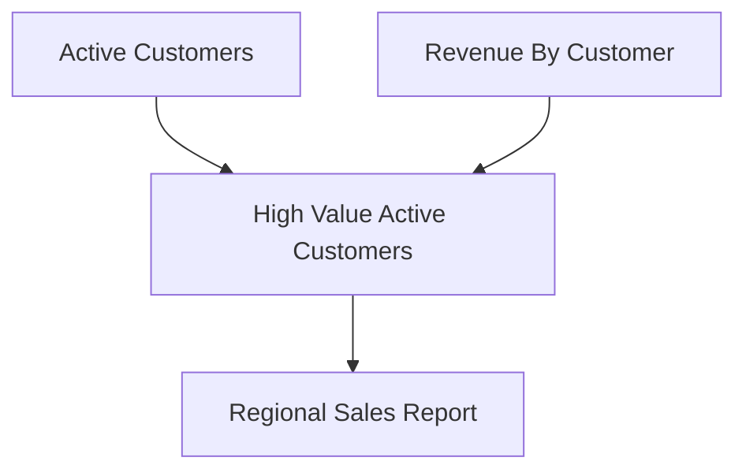
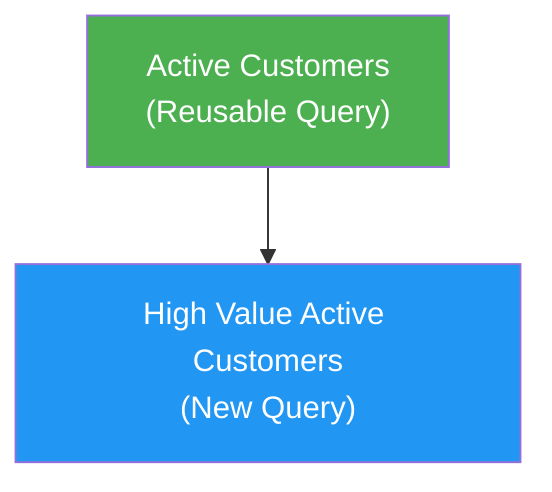

# Query Builder Agent & Composable Queries — Implementation Plan

## Table of Contents

1. [Executive Summary](#1-executive-summary)
2. [Phase 1: Composable Query Engine](#2-phase-1-composable-query-engine)
3. [Phase 2: Data Artifact Type](#3-phase-2-data-artifact-type)
4. [Phase 3: Query Builder Agent](#4-phase-3-query-builder-agent)
5. [Phase 4 (Future): View-Query Bridge](#5-phase-4-future-view-query-bridge)
6. [Cross-Cutting Concerns](#6-cross-cutting-concerns)
7. [File Inventory](#7-file-inventory)
8. [Open Items & Future Considerations](#8-open-items--future-considerations)

---

## 1. Executive Summary

This plan covers four interconnected workstreams that together create a conversational query-building experience in MemberJunction:

| Phase | What | Why |
|-------|------|-----|
| **1 — Composable Query Engine** | Allow Query A to reference Query B's results via `{{query:"Category/SubCat/Name(param=value)"}}` syntax | Enables building reusable business-logic queries (e.g. "Active Customers") that higher-level queries compose on top of |
| **2 — Data Artifact Type** | New artifact type that renders query or view results in a grid inside the conversation | Lets agents show live data results to users inline |
| **3 — Query Builder Agent** | A Loop agent that discusses business requirements, explores schemas, builds/composes queries, shows flow diagrams, and displays results | The user-facing conversational experience |
| **4 — View-Query Bridge** (future) | Allow views to be backed by query logic; virtual entities from queries | Long-term unification of the two data-access paradigms |

### Key Design Decisions (from user review)

- **Query composition = SQL-level macros** (Option A): `{{query:"..."}}` references are resolved to CTEs before SQL execution, not result-set composition
- **"Reusable" not "IsFoundational"**: New BIT field on Query entity, default `false` — marks queries available for composition
- **Full category path** in query references: `{{query:"Sales/Customers/Active Customers(status=active)"}}` — path is quoted for unambiguous parsing
- **Two parameter modes**: Static values use single quotes (`region='Northeast'`), pass-through params from the parent query use bare names (`region=region`)
- **QueryDependency entity** for linking: The SQL text uses human-readable paths, but a QueryDependency record links by ID so renames/moves are tracked
- **Auto-extraction of dependencies**: Extend the existing `QueryEntityExtended.Save()` LLM pipeline to also detect and sync query dependencies (like it already does for parameters, fields, entities)
- **Agent creates queries in Pending status**: Never auto-approves — uses MJ notification system for approval workflow
- **Reuse Database Research Agent's ACTIONS** (Get Entity Details, Execute Research Query) — not the agent itself (different goal)
- **Data artifact sources**: Query or View only for now — inline data is a future consideration
- **Mermaid diagrams**: Agent emits markdown mermaid blocks directly in chat (no special action needed)

---

## 2. Phase 1: Composable Query Engine

### 2.1 Overview

Enable queries to reference other queries in their SQL via a macro syntax that gets resolved to CTEs at execution time. This creates a hierarchy of reusable business logic queries.

**Example:**
```sql
-- "High Value Active Customers" query references "Active Customers" query
WITH ActiveCustomers AS (
  -- This CTE is auto-generated from {{query:"Sales/Customers/Active Customers"}}
  SELECT c.ID, c.Name, c.Email, c.Region
  FROM __mj.vwCustomers c
  WHERE c.Status = 'Active' AND c.DeletedAt IS NULL
)
SELECT ac.*, SUM(o.Total) as TotalSpend
FROM ActiveCustomers ac
JOIN __mj.vwOrders o ON o.CustomerID = ac.ID
GROUP BY ac.ID, ac.Name, ac.Email, ac.Region
HAVING SUM(o.Total) > 10000
```

The user writes:
```sql
SELECT ac.*, SUM(o.Total) as TotalSpend
FROM {{query:"Sales/Customers/Active Customers"}} ac
JOIN __mj.vwOrders o ON o.CustomerID = ac.ID
GROUP BY ac.ID, ac.Name, ac.Email, ac.Region
HAVING SUM(o.Total) > 10000
```

### 2.2 Database Migration: New Fields & Entities

#### 2.2.1 Add `Reusable` BIT to `MJ: Queries`

```sql
ALTER TABLE ${flyway:defaultSchema}.Query
    ADD Reusable BIT NOT NULL DEFAULT 0;
```

- Default `false` — most queries are not reusable
- Only queries marked Reusable + Status='Approved' can be referenced by other queries
- UI: checkbox on the query form, visible to admins

#### 2.2.2 New Entity: `MJ: Query Dependencies`

Tracks which queries reference which other queries. Auto-generated by the LLM extraction pipeline (like QueryFields, QueryParameters, QueryEntities).

```sql
CREATE TABLE ${flyway:defaultSchema}.QueryDependency (
    ID UNIQUEIDENTIFIER NOT NULL DEFAULT NEWSEQUENTIALID(),
    QueryID UNIQUEIDENTIFIER NOT NULL,
    DependsOnQueryID UNIQUEIDENTIFIER NOT NULL,
    ReferencePath NVARCHAR(500) NOT NULL,
    Alias NVARCHAR(100) NULL,
    ParameterMapping NVARCHAR(MAX) NULL,
    DetectionMethod NVARCHAR(20) NOT NULL DEFAULT 'AI',
    CONSTRAINT PK_QueryDependency PRIMARY KEY (ID),
    CONSTRAINT FK_QueryDependency_Query FOREIGN KEY (QueryID)
        REFERENCES ${flyway:defaultSchema}.Query(ID),
    CONSTRAINT FK_QueryDependency_DependsOn FOREIGN KEY (DependsOnQueryID)
        REFERENCES ${flyway:defaultSchema}.Query(ID),
    CONSTRAINT UQ_QueryDependency UNIQUE (QueryID, DependsOnQueryID)
);
```

**Field descriptions:**

| Field | Purpose |
|-------|---------|
| `QueryID` | The query that contains the `{{query:"..."}}` reference |
| `DependsOnQueryID` | The query being referenced (resolved by ID, not path) |
| `ReferencePath` | The full category path as written in SQL (e.g. `Sales/Customers/Active Customers`) — informational, for display |
| `Alias` | The SQL alias used in the FROM clause (e.g. `ac` in `FROM {{query:"..."}} ac`) |
| `ParameterMapping` | JSON string of parameter mappings. Values prefixed with `@` are pass-through refs, otherwise static. E.g. `{"region": "@region", "year": "2024"}` |
| `DetectionMethod` | How this dependency was detected: `AI` (auto-extracted) or `Manual` |

#### 2.2.3 Entity Metadata Registration

Standard MJ entity registration in migration:
- Register `QueryDependency` in `__mj.Entity`
- Register all fields in `__mj.EntityField`
- Set appropriate permissions (admin read/write, regular users read-only)
- CodeGen will generate the entity subclass, views, stored procedures, and Angular forms

### 2.3 Query Composition Syntax

#### 2.3.1 Syntax Definition

```
{{query:"<CategoryPath>/<QueryName>"}}
{{query:"<CategoryPath>/<QueryName>(<param1>=<value1>, <param2>=<value2>)"}}
```

The path and parameters are wrapped in double quotes for unambiguous parsing.

**Rules:**
- The entire path+params string is enclosed in `"..."` after `query:`
- Path uses `/` separators for category hierarchy
- Query name is the last segment before `(` (or end of string if no params)
- Parameters are optional, comma-separated `key=value` pairs inside parentheses
- The entire `{{query:"..."}}` token can be used anywhere a table/subquery reference is valid in SQL (FROM clause, JOIN, subquery)

#### 2.3.2 Parameter Value Modes

Parameters inside `{{query:"..."}}` support two modes:

| Mode | Syntax | Meaning |
|------|--------|---------|
| **Static value** | `param='literal'` | Single-quoted string literal — baked into the CTE at composition time |
| **Pass-through** | `param=paramName` | Bare name (no quotes) — resolved from the *parent query's* parameter set at execution time |

**Examples:**
```sql
-- Simple reference, no params
SELECT * FROM {{query:"Sales/Customers/Active Customers"}} ac

-- With static parameter value
SELECT * FROM {{query:"Sales/Customers/Customers By Region(region='Northeast')"}} c

-- With pass-through parameter (parent query receives {{region}} from caller)
SELECT * FROM {{query:"Sales/Customers/Customers By Region(region=region)"}} c
WHERE c.TotalSpend > {{minSpend}}

-- Mixed: one static, one pass-through
SELECT * FROM {{query:"Analytics/Revenue Report(year='2024', region=region)"}} r

-- Multiple references
SELECT ac.Name, r.Total
FROM {{query:"Sales/Customers/Active Customers"}} ac
JOIN {{query:"Sales/Revenue/Revenue By Customer(year='2024')"}} r ON r.CustomerID = ac.ID

-- Nested composition (query B references query C, query A references query B)
SELECT * FROM {{query:"Analytics/High Value Active Customers(minSpend='10000')"}} hvc
```

**Pass-through resolution flow:**
1. User calls outer query with params `{region: 'Northeast', minSpend: 5000}`
2. Composition engine runs first — sees `{{query:"...By Region(region=region)"}}`
3. Resolves `region=region` → looks up `region` in outer params → gets `'Northeast'`
4. Processes inner query's Nunjucks template with `{region: 'Northeast'}` → generates CTE
5. Nunjucks then processes the remaining outer SQL, resolving `{{minSpend}}` → `5000`

#### 2.3.3 Distinguishing from Nunjucks `{{param}}`

The `{{query:"` prefix (with opening double-quote) is the discriminator:
- `{{customerName}}` → Nunjucks parameter substitution (existing behavior)
- `{{query:"Sales/Active Customers"}}` → Query composition (new behavior)

The composition engine processes `{{query:"..."}}` tokens **BEFORE** Nunjucks processes `{{param}}` tokens. This ordering is critical for pass-through parameters to work correctly — the composition engine needs access to the raw parameter values before Nunjucks consumes them.

### 2.4 Composition Resolution Engine

#### 2.4.1 Location in Codebase

New class: `packages/SQLServerDataProvider/src/queryCompositionEngine.ts`

This engine is called from `SQLServerDataProvider.processQueryParameters()` (line ~914 of `SQLServerDataProvider.ts`) **before** Nunjucks template processing.

#### 2.4.2 Resolution Algorithm

```
ResolveComposition(sql: string, contextUser: UserInfo):
  1. PARSE: Find all {{query:"Path/Name(params)"}} tokens in the SQL using regex
  2. For each token:
     a. Parse the category path + query name + parameters
     b. RESOLVE: Look up the referenced query by full category path + name
        - Must exist in Metadata.Provider.Queries
        - Must have Reusable = true
        - Must have Status = 'Approved'
        - Must pass UserCanRun(contextUser)
     c. CYCLE CHECK: Add to dependency graph, check for cycles (see 2.4.3)
     d. RECURSE: If the referenced query's SQL also contains {{query:"..."}} tokens,
        recursively resolve those first (depth-first)
     e. GENERATE CTE: Convert the referenced query's resolved SQL into a CTE
        - CTE name = sanitized version of query name + unique suffix
        - If referenced query has Nunjucks parameters, process those with the
          provided parameter mapping
  3. ASSEMBLE: Prepend all CTEs as a WITH clause, replace tokens with CTE names
  4. Return the fully resolved SQL
```

#### 2.4.3 Cycle Detection

Before calling the LLM for dependency extraction, and at resolution time, detect cycles:

```
DetectCycles(queryId, dependencyGraph):
  - Build directed graph: queryId → [dependsOnQueryIds]
  - Run topological sort (Kahn's algorithm)
  - If cycle detected: throw descriptive error listing the cycle path
  - Max depth limit: 10 levels (configurable) to prevent pathological nesting
```

**Implementation:** Maintain an in-progress set during recursive resolution. If we encounter a query ID already in the set, we have a cycle.

#### 2.4.4 CTE Generation

For a referenced query like:
```sql
-- "Active Customers" query (ID: abc-123)
SELECT c.ID, c.Name, c.Email, c.Region
FROM __mj.vwCustomers c
WHERE c.Status = 'Active' AND c.DeletedAt IS NULL
```

Generated CTE:
```sql
WITH [ActiveCustomers_abc123] AS (
    SELECT c.ID, c.Name, c.Email, c.Region
    FROM __mj.vwCustomers c
    WHERE c.Status = 'Active' AND c.DeletedAt IS NULL
)
```

The original `{{query:"Sales/Customers/Active Customers"}}` token is replaced with `[ActiveCustomers_abc123]`.

If the user provided an alias (`{{query:"..."}} ac`), the alias is preserved in the outer query.

#### 2.4.5 Parameter Passing to Referenced Queries

When a referenced query uses Nunjucks parameters:
```sql
-- "Customers By Region" has parameter {{region}}
SELECT c.* FROM __mj.vwCustomers c WHERE c.Region = '{{region}}'
```

**Static parameter example** — the referencing query passes a literal:
```sql
SELECT * FROM {{query:"Sales/Customers/Customers By Region(region='Northeast')"}}
```

**Pass-through parameter example** — the referencing query forwards its own param:
```sql
-- Outer query is called with {region: 'Northeast'}
SELECT * FROM {{query:"Sales/Customers/Customers By Region(region=region)"}}
```

The composition engine:
1. Parses each parameter: quoted value → static, bare name → pass-through
2. For pass-through params, resolves the value from the outer query's parameter set
3. Runs the referenced query's SQL through Nunjucks with the resolved parameters
4. Uses the resolved SQL as the CTE body

**Error cases:**
- Pass-through param references a name not in the outer query's params → clear error
- Static value provided for a parameter that expects a different type → type coercion or error

#### 2.4.6 Provenance Tracking

The LLM (and users) need to understand field lineage through composed queries. The composition engine provides provenance metadata:

```typescript
interface CompositionResult {
    ResolvedSQL: string;
    CTEs: Array<{
        QueryID: string;
        QueryName: string;
        CategoryPath: string;
        CTEName: string;
        OriginalSQL: string;
        ResolvedSQL: string;
        Parameters: Record<string, string>;
        Fields: Array<{ Name: string; Type: string; SourceEntity: string; SourceField: string }>;
    }>;
    DependencyGraph: Map<string, string[]>;  // queryId → dependsOnQueryIds
}
```

This provenance is used by:
- The LLM prompt for dependency extraction (to understand field meanings)
- The Query Builder Agent (to explain compositions to users)
- The query detail UI (to show dependency visualization)

### 2.5 Auto-Extraction of Dependencies

#### 2.5.1 Extend `QueryEntityExtended.Save()`

**File:** `packages/MJCoreEntitiesServer/src/custom/QueryEntity.server.ts`

The existing `extractAndSyncData()` method (line 185) already:
1. Checks for Nunjucks syntax
2. Extracts entity metadata from SQL
3. Calls AI prompt for parameter + field extraction
4. Syncs parameters, fields, and entities

**Add a new step** after the existing extraction:

```
extractAndSyncData():
  ... existing steps ...

  // NEW: Extract and sync query dependencies
  if (sqlContainsQueryReferences(this.SQL)) {
      await this.extractAndSyncQueryDependencies();
  } else {
      await this.removeAllQueryDependencies();
  }
```

#### 2.5.2 Dependency Extraction: Deterministic + LLM Hybrid

**Step 1 — Deterministic regex parsing** (no LLM needed):
- Parse all `{{query:"Path/Name(params)"}}` tokens from the SQL
- For each token, resolve the category path + query name to a QueryID
- Extract parameter mappings
- This gives us the QueryDependency records directly

**Step 2 — Enhance the existing LLM prompt** to understand composition:
- Update the "SQL Query Parameter Extraction" AI prompt to recognize `{{query:"..."}}` tokens
- The LLM should understand that fields coming from a composed query originate from that query's field list
- Pass the referenced queries' field metadata as context to the LLM for accurate field type inference

#### 2.5.3 Updated LLM Prompt Context

The existing prompt data structure (`promptData` at line 216) gets extended:

```typescript
const promptData = {
    templateText: this.SQL,
    entities: entityMetadata,
    // NEW: Composed query metadata for provenance
    composedQueries: await this.getComposedQueryMetadata()
};
```

Where `getComposedQueryMetadata()` returns:
```typescript
[
    {
        referencePath: "Sales/Customers/Active Customers",
        queryName: "Active Customers",
        fields: [
            { name: "ID", type: "uniqueidentifier", sourceEntity: "Customers" },
            { name: "Name", type: "nvarchar", sourceEntity: "Customers" },
            ...
        ],
        parameters: [
            { name: "status", type: "string", defaultValue: "active" }
        ]
    }
]
```

This teaches the LLM that `ac.Name` in the outer query traces back to the `Name` field of the `Active Customers` query, which itself comes from the `Customers` entity.

#### 2.5.4 Sync Method: `syncQueryDependencies()`

New method on `QueryEntityExtended`, following the same pattern as `syncQueryParameters()`, `syncQueryFields()`, and `syncQueryEntities()`:

```typescript
private async syncQueryDependencies(
    extractedDeps: Array<{
        referencePath: string;
        dependsOnQueryID: string;
        alias: string | null;
        parameterMapping: Record<string, string> | null;
    }>
): Promise<void> {
    // 1. Load existing QueryDependency records for this query
    // 2. Diff against extracted dependencies
    // 3. Add new, update changed, remove stale
    // Pattern identical to syncQueryParameters()
}
```

#### 2.5.5 Cycle Detection in Save Pipeline

**Before** calling the LLM or syncing dependencies, check for cycles:

```typescript
// In extractAndSyncData(), before dependency sync:
const proposedDeps = this.parseQueryReferences(this.SQL);
const cycleError = await this.detectDependencyCycles(this.ID, proposedDeps);
if (cycleError) {
    LogError(`Query "${this.Name}" creates circular dependency: ${cycleError}`);
    // Don't sync dependencies, but don't fail the save
    // Set a warning field or notification
}
```

### 2.6 Query Status & Approval Workflow

#### 2.6.1 Current State

- Query status values: `Pending | Approved | Rejected | Expired` (from entity schema)
- `queryInfo.ts` interface also defines `In-Review` and `Obsolete` but these aren't in the DB value list yet
- `UserCanRun()` checks `Status === 'Approved'` before allowing execution
- **No auto-approve exists** — queries save with their current status, defaulting to `Pending` for new queries

#### 2.6.2 Required Changes

**A) Add missing status values to the DB value list:**

Migration to add `In-Review` and `Obsolete` to the Query.Status allowed values, aligning the database with the TypeScript interface.

**B) MJ Notifications for approval workflow:**

When a query is created or modified and has Status=`Pending`:
1. The server-side `QueryEntityExtended.Save()` creates a notification
2. Notification targets users with the appropriate query-admin role/permission
3. Notification includes: query name, description, who created it, link to review

**Notification entity integration:**
- Use `MJ: User Notifications` entity (exists, fields: Title, Message, ResourceTypeID, ResourceConfiguration, Unread)
- Use `MJ: User Notification Types` entity to define a "Query Pending Review" notification type
- The notification manager (`packages/Scheduling/engine/src/NotificationManager.ts`) is currently a stub — this work will either extend it or create notifications directly via entity save

**C) Composition validation:**

A query can only reference another query that is:
- `Status = 'Approved'`
- `Reusable = true`
- User has run permissions on the referenced query

If a referenced query's status changes away from Approved, all queries that depend on it should be flagged (but not automatically broken — show a warning).

### 2.7 Implementation Tasks (Phase 1)

| # | Task | Files Affected | Depends On |
|---|------|---------------|------------|
| 1.1 | Write migration: add `Reusable` BIT to Query | `migrations/v2/V...` | — |
| 1.2 | Write migration: create `QueryDependency` table | `migrations/v2/V...` | — |
| 1.3 | Write migration: add missing Query.Status values (`In-Review`, `Obsolete`) | `migrations/v2/V...` | — |
| 1.4 | Run CodeGen to generate entity subclasses, views, SPs | Generated files | 1.1, 1.2, 1.3 |
| 1.5 | Create `QueryCompositionEngine` class | `packages/SQLServerDataProvider/src/queryCompositionEngine.ts` | — |
| 1.6 | Implement `{{query:"..."}}` regex parser | Inside composition engine | 1.5 |
| 1.7 | Implement cycle detection algorithm | Inside composition engine | 1.5 |
| 1.8 | Implement CTE generation from referenced queries | Inside composition engine | 1.5, 1.6 |
| 1.9 | Implement parameter passing to referenced queries | Inside composition engine | 1.8 |
| 1.10 | Integrate composition engine into `processQueryParameters()` | `packages/SQLServerDataProvider/src/SQLServerDataProvider.ts` | 1.5-1.9 |
| 1.11 | Add `syncQueryDependencies()` to `QueryEntityExtended` | `packages/MJCoreEntitiesServer/src/custom/QueryEntity.server.ts` | 1.2, 1.4 |
| 1.12 | Add `removeAllQueryDependencies()` cleanup method | Same as 1.11 | 1.11 |
| 1.13 | Add cycle detection to Save pipeline | Same as 1.11 | 1.7, 1.11 |
| 1.14 | Update AI prompt "SQL Query Parameter Extraction" to handle `{{query:"..."}}` | Database prompt record + template file | 1.5 |
| 1.15 | Add composed query metadata to LLM prompt context | `QueryEntity.server.ts` | 1.14 |
| 1.16 | Write unit tests for composition engine | `packages/SQLServerDataProvider/src/__tests__/` | 1.5-1.9 |
| 1.17 | Write unit tests for dependency sync | `packages/MJCoreEntitiesServer/src/__tests__/` | 1.11-1.13 |
| 1.18 | Create "Query Pending Review" notification type | Metadata JSON + migration | — |
| 1.19 | Implement notification creation on query save when Status=Pending | `QueryEntity.server.ts` | 1.18 |

---

## 3. Phase 2: Data Artifact Type

### 3.1 Overview

A new artifact type called **"Data"** that renders query or view results in a grid inside the conversation. The agent emits a JSON artifact with a lightweight spec, and the artifact viewer plugin renders the appropriate grid component.

### 3.2 Artifact Type Definition

#### 3.2.1 Metadata File

New file: `metadata/artifact-types/extract-rules/data-artifact.json`

Artifact type entry in `metadata/artifact-types/.artifact-types.json`:

```json
{
    "fields": {
        "Name": "Data",
        "Description": "Displays query or view results in an interactive data grid. Content is a JSON specification pointing to a query or view data source.",
        "ContentType": "application/vnd.mj.data",
        "DriverClass": "DataArtifactViewerPlugin",
        "ExtractRules": "@file:extract-rules/data-artifact.json",
        "Icon": "fa-solid fa-table-cells"
    }
}
```

#### 3.2.2 Content Schema

The artifact's `Content` field contains JSON matching this schema:

```typescript
interface DataArtifactContent {
    /** Source type: how to fetch the data */
    sourceType: 'query' | 'view';

    /** For sourceType='query': the query identifier */
    query?: {
        /** Query ID (preferred — stable across renames) */
        id?: string;
        /** Query name (alternative lookup) */
        name?: string;
        /** Full category path (for display and alternative lookup) */
        categoryPath?: string;
        /** Parameter values to pass to the query */
        parameters?: Record<string, string | number | boolean>;
    };

    /** For sourceType='view': the view identifier */
    view?: {
        /** User View ID */
        id?: string;
        /** Entity name (for creating an ad-hoc view) */
        entityName?: string;
        /** Extra filter expression */
        extraFilter?: string;
        /** Fields to include */
        fields?: string[];
        /** Order by clause */
        orderBy?: string;
        /** Max rows */
        maxRows?: number;
    };

    /** Display configuration */
    display?: {
        /** Title shown above the grid */
        title?: string;
        /** Description shown below the title */
        description?: string;
        /** Grid height (CSS value, default '400px') */
        height?: string;
        /** Whether to show the toolbar */
        showToolbar?: boolean;
        /** Whether to show export button */
        showExport?: boolean;
        /** Selection mode */
        selectionMode?: 'none' | 'single' | 'multiple';
    };
}
```

#### 3.2.3 Extract Rules

File: `metadata/artifact-types/extract-rules/data-artifact.json`

```json
[
    {
        "name": "name",
        "description": "Extracts the display title from the data artifact",
        "type": "string",
        "standardProperty": "name",
        "extractor": "try { const c = JSON.parse(content); return c.display?.title || (c.query?.name) || (c.view?.entityName) || 'Data'; } catch { return 'Data'; }"
    },
    {
        "name": "description",
        "description": "Extracts the description from the data artifact",
        "type": "string",
        "standardProperty": "description",
        "extractor": "try { const c = JSON.parse(content); return c.display?.description || `${c.sourceType === 'query' ? 'Query' : 'View'}: ${c.query?.name || c.view?.entityName || 'Unknown'}`; } catch { return ''; }"
    }
]
```

### 3.3 Angular Artifact Viewer Plugin

#### 3.3.1 New Component: `DataArtifactViewerComponent`

**File:** `packages/Angular/Generic/artifacts/src/lib/components/plugins/data-artifact-viewer.component.ts`

```
DataArtifactViewerComponent
├── extends BaseArtifactViewerPluginComponent
├── @RegisterClass(BaseArtifactViewerPluginComponent, 'DataArtifactViewerPlugin')
├── Parses Content JSON → DataArtifactContent
├── Based on sourceType:
│   ├── 'query' → Uses RunQuery to fetch data, then renders <mj-query-data-grid>
│   └── 'view'  → Uses RunView to fetch data, then renders <mj-entity-data-grid>
├── Handles loading states with <mj-loading>
├── Handles errors gracefully
└── Supports refresh via toolbar button
```

**Key implementation details:**

1. **Query source**:
   - Look up QueryInfo from Metadata by ID or name+categoryPath
   - Call `RunQuery.RunQuery()` with the specified parameters
   - Pass result data to `<mj-query-data-grid [Data]="results" [QueryInfo]="queryInfo">`
   - The grid auto-generates columns from data if no QueryInfo metadata available

2. **View source**:
   - Call `RunView.RunView()` with the specified entity, filter, fields, orderBy
   - Pass results to `<mj-entity-data-grid>` or render via a simple AG Grid instance
   - For simple cases, use `<mj-query-data-grid [Data]="results">` since it can render plain data arrays

3. **Display configuration**:
   - Title and description rendered above the grid
   - Height, toolbar, export, selection mode passed as inputs to the grid component

#### 3.3.2 Module Registration

Add `DataArtifactViewerComponent` to the artifacts module:
- **File:** `packages/Angular/Generic/artifacts/src/lib/artifacts.module.ts`
- Add to `declarations` and `exports` arrays
- Add tree-shaking prevention function in `public-api.ts`

#### 3.3.3 Component Dependencies

The DataArtifactViewerComponent needs imports from:
- `@memberjunction/ng-query-viewer` — for `<mj-query-data-grid>`
- `@memberjunction/ng-shared-generic` — for `<mj-loading>`
- `@memberjunction/core` — for `RunQuery`, `RunView`, `Metadata`, `QueryInfo`

Check that the artifacts package's `package.json` includes these as dependencies.

### 3.4 Artifact Detection Rule (for agent-emitted artifacts)

The agent will emit Data artifacts using the standard artifact creation mechanism (conversation artifact entity). The LLM response format for creating artifacts is already handled by the agent framework — the agent just needs to specify:
- `artifactType: "Data"`
- `content: JSON.stringify(dataArtifactContent)`

No special extraction from raw markdown is needed since Data artifacts are always explicitly created by agents, not extracted from prose.

### 3.5 Implementation Tasks (Phase 2)

| # | Task | Files Affected | Depends On |
|---|------|---------------|------------|
| 2.1 | Add Data artifact type to metadata JSON | `metadata/artifact-types/.artifact-types.json` | — |
| 2.2 | Create extract rules JSON | `metadata/artifact-types/extract-rules/data-artifact.json` | — |
| 2.3 | Create `DataArtifactViewerComponent` | `packages/Angular/Generic/artifacts/src/lib/components/plugins/data-artifact-viewer.component.ts` | — |
| 2.4 | Register component in artifacts module | `packages/Angular/Generic/artifacts/src/lib/artifacts.module.ts` | 2.3 |
| 2.5 | Add tree-shaking prevention to `public-api.ts` | `packages/Angular/Generic/artifacts/src/lib/public-api.ts` | 2.3 |
| 2.6 | Add package dependencies (ng-query-viewer) | `packages/Angular/Generic/artifacts/package.json` | — |
| 2.7 | Push artifact type metadata via mj-sync | — | 2.1, 2.2 |
| 2.8 | Build and test the artifact viewer with sample data | — | 2.3-2.7 |

---

## 4. Phase 3: Query Builder Agent

### 4.1 Overview

A conversational **Loop agent** that helps users:
1. Discuss business requirements and data needs
2. Explore the database schema
3. Build queries (including composed queries using reusable queries)
4. Show query flow diagrams via mermaid in chat
5. Display query results via Data artifacts
6. Create and save queries in the MJ query system (always as Pending status)

### 4.2 Agent Metadata

#### 4.2.1 Agent Definition

New file: `metadata/agents/.query-builder-agent.json`

```json
{
    "entityName": "MJ: AI Agents",
    "fields": {
        "Name": "Query Builder Agent",
        "Description": "Conversational agent that helps users explore their database schema, understand their business data, build SQL queries (including composable queries that reference other queries), visualize query relationships with flow diagrams, and display results. Creates queries in Pending status for admin approval.",
        "TypeID": "@lookup:MJ: AI Agent Types.Name=Loop",
        "Status": "Active",
        "InvocationMode": "Top-Level",
        "Icon": "fa-solid fa-database",
        "Color": "#4A90D9"
    },
    "relatedEntities": {
        "MJ: AI Agent Prompts": [
            {
                "fields": {
                    "AgentID": "@parent:ID",
                    "PromptID": "@lookup:MJ: AI Prompts.Name=Query Builder Agent - Main Prompt",
                    "ExecutionOrder": 0,
                    "Status": "Active"
                }
            }
        ],
        "MJ: AI Agent Actions": [
            {
                "fields": {
                    "AgentID": "@parent:ID",
                    "ActionID": "@lookup:MJ: Actions.Name=Get Entity Details",
                    "Status": "Active"
                }
            },
            {
                "fields": {
                    "AgentID": "@parent:ID",
                    "ActionID": "@lookup:MJ: Actions.Name=Execute Research Query",
                    "Status": "Active"
                }
            },
            {
                "fields": {
                    "AgentID": "@parent:ID",
                    "ActionID": "@lookup:MJ: Actions.Name=Create Or Update Query",
                    "Status": "Active"
                }
            },
            {
                "fields": {
                    "AgentID": "@parent:ID",
                    "ActionID": "@lookup:MJ: Actions.Name=Get Reusable Queries",
                    "Status": "Active"
                }
            },
            {
                "fields": {
                    "AgentID": "@parent:ID",
                    "ActionID": "@lookup:MJ: Actions.Name=Validate Query Composition",
                    "Status": "Active"
                }
            }
        ],
        "MJ: AI Agent Data Sources": [
            {
                "fields": {
                    "AgentID": "@parent:ID",
                    "Name": "ALL_ENTITIES",
                    "SourceType": "RunView",
                    "EntityName": "Entities",
                    "OrderBy": "Name",
                    "Fields": ["Name", "Description", "SchemaName", "BaseTable", "BaseView"],
                    "ResultType": "simple",
                    "CachePolicy": "PerAgent",
                    "CacheTimeoutSeconds": 3600
                }
            },
            {
                "fields": {
                    "AgentID": "@parent:ID",
                    "Name": "QUERY_CATEGORIES",
                    "SourceType": "RunView",
                    "EntityName": "MJ: Query Categories",
                    "OrderBy": "Name",
                    "Fields": ["ID", "Name", "ParentID", "Description"],
                    "ResultType": "simple",
                    "CachePolicy": "PerAgent",
                    "CacheTimeoutSeconds": 3600
                }
            },
            {
                "fields": {
                    "AgentID": "@parent:ID",
                    "Name": "REUSABLE_QUERIES",
                    "SourceType": "RunView",
                    "EntityName": "MJ: Queries",
                    "ExtraFilter": "Reusable = 1 AND Status = 'Approved'",
                    "OrderBy": "Name",
                    "Fields": ["ID", "Name", "Description", "CategoryID", "SQL"],
                    "ResultType": "simple",
                    "CachePolicy": "PerAgent",
                    "CacheTimeoutSeconds": 600
                }
            }
        ]
    }
}
```

### 4.3 Agent Actions

The agent reuses two existing actions and needs three new ones:

#### 4.3.1 Reused Actions (from Database Research Agent)

1. **Get Entity Details** — Explores entity schema, fields, relationships, sample data
2. **Execute Research Query** — Runs read-only SELECT queries for exploration/testing

#### 4.3.2 New Action: Create Or Update Query

New file: `metadata/actions/.create-or-update-query.json`

**Purpose:** Creates a new query or updates an existing one in the MJ query system. Always saves with Status=`Pending`.

**Input Parameters:**
| Name | Type | Required | Description |
|------|------|----------|-------------|
| `QueryName` | string | Yes | Display name for the query |
| `Description` | string | Yes | Business-level description of what the query does |
| `SQL` | string | Yes | The SQL query text (may include `{{query:"..."}}` composition references) |
| `CategoryPath` | string | No | Full category path (e.g. "Sales/Customers"). Creates categories if they don't exist |
| `Reusable` | boolean | No | Whether this query should be marked as reusable (default false) |
| `ExistingQueryID` | string | No | If updating an existing query, its ID |
| `UserQuestion` | string | No | The original user question that led to this query |
| `TechnicalDescription` | string | No | Technical notes about the query implementation |

**Output Parameters:**
| Name | Type | Description |
|------|------|-------------|
| `QueryID` | string | The ID of the created/updated query |
| `QueryName` | string | The final name |
| `Status` | string | Always "Pending" |
| `CategoryPath` | string | The full resolved category path |
| `DependencyCount` | number | Number of query dependencies detected |
| `ParameterCount` | number | Number of parameters detected |
| `FieldCount` | number | Number of output fields detected |

**Result Codes:**
| Code | IsSuccess | Description |
|------|-----------|-------------|
| `SUCCESS` | true | Query created/updated successfully |
| `MISSING_REQUIRED_FIELDS` | false | Name, Description, or SQL not provided |
| `INVALID_SQL` | false | SQL fails basic validation |
| `CIRCULAR_DEPENDENCY` | false | The query would create a circular reference chain |
| `REFERENCED_QUERY_NOT_FOUND` | false | A `{{query:"..."}}` reference points to a non-existent query |
| `REFERENCED_QUERY_NOT_REUSABLE` | false | A referenced query exists but is not marked Reusable |
| `SAVE_FAILED` | false | Database save operation failed |

**Implementation:** `packages/Actions/CoreActions/src/custom/CreateOrUpdateQuery.ts`

Key implementation logic:
1. Validate inputs
2. If `CategoryPath` provided, ensure categories exist (create if needed)
3. Create or load the query entity via `md.GetEntityObject<MJQueryEntity>('MJ: Queries', contextUser)`
4. Set all fields, **force Status = 'Pending'** (never allow the agent to approve)
5. Save — which triggers the existing `QueryEntityExtended.Save()` pipeline (auto-extraction of params, fields, entities, dependencies)
6. Return the result with metadata

#### 4.3.3 New Action: Get Reusable Queries

New file: `metadata/actions/.get-reusable-queries.json`

**Purpose:** Returns the catalog of queries marked as Reusable + Approved, so the agent can suggest compositions.

**Input Parameters:**
| Name | Type | Required | Description |
|------|------|----------|-------------|
| `CategoryPath` | string | No | Filter to a specific category subtree |
| `SearchText` | string | No | Text search across query names and descriptions |

**Output Parameters:**
| Name | Type | Description |
|------|------|-------------|
| `Queries` | array | Array of `{ ID, Name, CategoryPath, Description, ParameterCount, FieldNames }` |
| `TotalCount` | number | Total matching queries |

**Implementation:** `packages/Actions/CoreActions/src/custom/GetReusableQueries.ts`

#### 4.3.4 New Action: Validate Query Composition

New file: `metadata/actions/.validate-query-composition.json`

**Purpose:** Validates a SQL query that uses `{{query:"..."}}` composition without saving it. Checks for valid references, cycles, parameter compatibility, and returns the resolved SQL.

**Input Parameters:**
| Name | Type | Required | Description |
|------|------|----------|-------------|
| `SQL` | string | Yes | The SQL to validate |

**Output Parameters:**
| Name | Type | Description |
|------|------|-------------|
| `IsValid` | boolean | Whether the composition is valid |
| `ResolvedSQL` | string | The fully resolved SQL with CTEs |
| `Dependencies` | array | List of referenced queries with their paths |
| `Errors` | array | Validation error messages |
| `Warnings` | array | Non-fatal warnings |

**Implementation:** `packages/Actions/CoreActions/src/custom/ValidateQueryComposition.ts`

### 4.4 Agent Prompt

New file: `metadata/prompts/templates/agents/query-builder-agent-prompt.md`

#### 4.4.1 Prompt Structure

```markdown
# Query Builder Agent

You are a Query Builder Agent for MemberJunction. You help users explore their
database, understand their business data, and build SQL queries. You can create
both simple queries and composed queries that reference other reusable queries.

## Your Capabilities

1. **Schema Exploration**: Use "Get Entity Details" to explore entities, their
   fields, relationships, and sample data
2. **Query Testing**: Use "Execute Research Query" to test SQL against the database
3. **Query Creation**: Use "Create Or Update Query" to save queries to the system
4. **Composition Catalog**: Use "Get Reusable Queries" to find existing reusable
   queries that can be composed into new ones
5. **Composition Validation**: Use "Validate Query Composition" to check composed
   queries before saving
6. **Flow Diagrams**: Show query relationships using mermaid diagrams in chat
7. **Data Display**: Create Data artifacts to show query results to the user

## Query Composition

Queries can reference other reusable queries using this syntax:
```
{{query:"Category/SubCategory/Query Name"}}
{{query:"Category/SubCategory/Query Name(param1=value1, param2=value2)"}}
```

Parameter values can be:
- **Static** (single-quoted): `param1='literal value'` — baked in at composition time
- **Pass-through** (bare name): `param1=parentParam` — resolved from the outer query's parameters

When building composed queries:
- First check what reusable queries exist using "Get Reusable Queries"
- Explain to the user what each referenced query does
- Show the composition as a mermaid flowchart
- Validate the composition before saving
- Suggest marking new queries as "Reusable" if they represent core business logic

## Mermaid Flow Diagrams

When showing query relationships, use mermaid diagrams:


## Data Artifacts

When the user wants to see query results, create a Data artifact:
- Use sourceType "query" for saved queries
- Use sourceType "view" for entity-based views
- Include a descriptive title and description
- The artifact will render as an interactive grid

## Available Data Context

You have access to:
- ALL_ENTITIES: Complete list of database entities with descriptions
- QUERY_CATEGORIES: Hierarchical query category structure
- REUSABLE_QUERIES: All approved reusable queries available for composition

## Important Rules

1. **NEVER approve queries** — always create them with Pending status
2. **NEVER modify or delete approved queries** without explicit user confirmation
3. When composing queries, validate the composition first
4. Explain your SQL logic in business terms the user can understand
5. Suggest marking core business logic queries as "Reusable"
6. Show mermaid diagrams when composition involves 2+ queries
7. Create Data artifacts to show results whenever you execute a query
8. If the user's request is ambiguous, ask clarifying questions
```

#### 4.4.2 Prompt Metadata

New entry in `metadata/prompts/.prompts.json`:

```json
{
    "fields": {
        "Name": "Query Builder Agent - Main Prompt",
        "Description": "Main agent prompt for the Query Builder Agent. Guides the agent to explore schemas, build queries, compose reusable queries, show flow diagrams, and display results.",
        "TypeID": "@lookup:MJ: AI Prompt Types.Name=Chat",
        "CategoryID": "@lookup:MJ: AI Prompt Categories.Name=MJ: Agents",
        "TemplateText": "@file:templates/agents/query-builder-agent-prompt.md",
        "Status": "Active",
        "ResponseFormat": "JSON",
        "SelectionStrategy": "Specific",
        "PowerPreference": "Standard"
    },
    "relatedEntities": {
        "MJ: AI Prompt Models": [
            {
                "fields": {
                    "PromptID": "@parent:ID",
                    "ModelID": "@lookup:MJ: AI Models.Name=Claude Sonnet 4",
                    "VendorID": "@lookup:MJ: AI Vendors.Name=Anthropic",
                    "Priority": 0
                }
            },
            {
                "fields": {
                    "PromptID": "@parent:ID",
                    "ModelID": "@lookup:MJ: AI Models.Name=GPT 4.1",
                    "VendorID": "@lookup:MJ: AI Vendors.Name=OpenAI",
                    "Priority": 1
                }
            }
        ]
    }
}
```

### 4.5 Conversation Flow Examples

#### 4.5.1 Simple Query Building

```
User: "I want to see all active customers"

Agent: Let me explore the customer data first.
  → Action: Get Entity Details (EntityName: "Customers")
  → Shows entity structure

Agent: Here's what I found. Your Customers entity has a Status field with
values Active, Inactive, Suspended. Let me build a query for active customers.
  → Action: Execute Research Query (tests the SQL)
  → Action: Create Data Artifact (shows results)

Agent: Here are your active customers [Data Artifact].
Would you like me to save this as a reusable query in the system?

User: "Yes, save it as reusable"

Agent: → Action: Create Or Update Query (
    Name: "Active Customers",
    CategoryPath: "Customers",
    SQL: "SELECT ...",
    Reusable: true,
    Status: Pending
  )

Agent: I've saved "Active Customers" as a reusable query with Pending status.
An admin will need to approve it before it can be used in composition.
```

#### 4.5.2 Composed Query Building

```
User: "I want to see high-value active customers who spent over $10k"

Agent: Let me check what reusable queries we already have.
  → Action: Get Reusable Queries (SearchText: "active customers")

Agent: Great news! We have a reusable "Active Customers" query. I can compose
a new query on top of it. Here's how the composition would work:



  → Action: Validate Query Composition (SQL with {{query:"..."}})
  → Action: Execute Research Query (resolved SQL)
  → Action: Create Data Artifact (shows results)

Agent: Here are your high-value customers [Data Artifact with 47 rows].
The query composes on top of "Active Customers" and adds a revenue filter.
Would you like me to save this query?
```

### 4.6 Action Item: Teach Database Research Agent About Queries

The Database Research Agent should be made aware of the query system so that when it's used as a sub-agent (e.g., by the Research Agent), it can leverage existing queries.

**Changes needed:**
1. Add a data source to the Database Research Agent for `REUSABLE_QUERIES` (same as Query Builder Agent's data source)
2. Update the Database Research Agent prompt to mention that reusable queries exist and can be referenced
3. This is a **separate, incremental enhancement** — not blocking Phase 3

### 4.7 Implementation Tasks (Phase 3)

| # | Task | Files Affected | Depends On |
|---|------|---------------|------------|
| 3.1 | Create "Create Or Update Query" action metadata | `metadata/actions/.create-or-update-query.json` | — |
| 3.2 | Create "Get Reusable Queries" action metadata | `metadata/actions/.get-reusable-queries.json` | — |
| 3.3 | Create "Validate Query Composition" action metadata | `metadata/actions/.validate-query-composition.json` | — |
| 3.4 | Implement `CreateOrUpdateQueryAction` class | `packages/Actions/CoreActions/src/custom/CreateOrUpdateQuery.ts` | Phase 1 |
| 3.5 | Implement `GetReusableQueriesAction` class | `packages/Actions/CoreActions/src/custom/GetReusableQueries.ts` | Phase 1 |
| 3.6 | Implement `ValidateQueryCompositionAction` class | `packages/Actions/CoreActions/src/custom/ValidateQueryComposition.ts` | Phase 1 |
| 3.7 | Create agent prompt template | `metadata/prompts/templates/agents/query-builder-agent-prompt.md` | — |
| 3.8 | Create agent prompt metadata | `metadata/prompts/.prompts.json` (add entry) | 3.7 |
| 3.9 | Create agent metadata | `metadata/agents/.query-builder-agent.json` | 3.1-3.3, 3.8 |
| 3.10 | Push all metadata via mj-sync | — | 3.1-3.9 |
| 3.11 | Test agent end-to-end: simple query building | — | 3.10 |
| 3.12 | Test agent end-to-end: composed query building | — | 3.10 |
| 3.13 | Test agent end-to-end: Data artifact display | — | Phase 2, 3.10 |
| 3.14 | Add REUSABLE_QUERIES data source to Database Research Agent | `metadata/agents/.research-agent.json` | Phase 1 |
| 3.15 | Update Database Research Agent prompt re: query awareness | Prompt template file | 3.14 |

---

## 5. Phase 4 (Future): View-Query Bridge

### 5.1 Overview

This phase is deliberately future-scoped. The ideas below need more thought before implementation.

### 5.2 Concept: Query-Backed Views

Allow a User View to be backed by a Query's logic instead of a simple entity + WHERE clause.

**Possible approach:**
- Add a `QueryID` field to the `User Views` entity
- When `QueryID` is set, `RunView` delegates to `RunQuery` internally
- The view still appears in the view list and can be used anywhere views are used
- Filter/sort from the view are applied as additional WHERE/ORDER BY on top of the query's SQL

**Benefits:**
- Unifies the two data access paradigms
- Complex business logic (JOINs, aggregations, compositions) accessible via the simpler View interface
- Existing view-based UIs automatically gain access to complex queries

### 5.3 Concept: Virtual Entities from Queries

Wrap a query as a SQL view, then register it as an MJ entity.

**Possible approach:**
- A query with `Status=Approved` and `Reusable=true` can optionally be "promoted" to a virtual entity
- CodeGen creates a SQL view from the query's SQL
- The view is registered as a read-only entity
- Entity fields are derived from the query's QueryField metadata
- Full CRUD is not available — only read operations

**Considerations:**
- Schema management: who owns the SQL view? Query changes need to cascade.
- Performance: CTEs from composition can't be indexed
- Permissions: need to reconcile query permissions with entity permissions
- This is a significant architectural decision that needs more design

### 5.4 Concept: Inline Data Artifacts (Future)

Allow Data artifacts to contain inline data (not just references to queries/views):

```json
{
    "sourceType": "inline",
    "inline": {
        "columns": [
            { "name": "Name", "type": "string" },
            { "name": "Value", "type": "number" }
        ],
        "rows": [
            { "Name": "Item A", "Value": 42 },
            { "Name": "Item B", "Value": 17 }
        ]
    }
}
```

This would be useful for:
- Agent-computed results that don't come from a query
- Aggregated/transformed data
- Comparison tables

**Not included in current scope** to keep the Data artifact focused on live data sources.

---

## 6. Cross-Cutting Concerns

### 6.1 Security

| Concern | Mitigation |
|---------|------------|
| SQL injection in composed queries | Composition resolves to CTEs with pre-validated SQL from approved queries. Parameter values go through Nunjucks escaping. |
| Unauthorized query access | `UserCanRun()` check applied to every referenced query in the composition chain |
| Agent creating malicious queries | Agent only saves queries as Pending — human approval required |
| Data exposure through artifacts | Data artifacts execute queries with the current user's permissions — no privilege escalation |

### 6.2 Performance

| Concern | Mitigation |
|---------|------------|
| Deep composition chains (10+ levels) | Max depth limit (configurable, default 10) |
| Large CTE chains | SQL Server handles CTEs efficiently; monitor with execution plan analysis |
| Cache invalidation for composed queries | If a referenced query changes, the parent query's cache should be invalidated. Track via QueryDependency. |
| Multiple identical CTE references | Deduplicate — if the same query is referenced twice (same params), generate one CTE |

### 6.3 Error Handling

| Scenario | Behavior |
|----------|----------|
| Referenced query not found | Clear error message: "Query 'Sales/Customers/Active Customers' not found" |
| Referenced query not approved | Clear error: "Query 'X' is not approved (current status: Pending)" |
| Referenced query not reusable | Clear error: "Query 'X' is not marked as reusable" |
| Circular dependency detected | Clear error listing the cycle path |
| Referenced query parameter mismatch | Clear error: "Parameter 'region' expected by query 'X' but not provided" |
| Composition depth exceeded | Clear error: "Composition depth limit (10) exceeded" |

### 6.4 Migration & Rollback Strategy

All database changes are Flyway migrations:
- Each migration is idempotent where possible
- Entity metadata is registered via standard MJ patterns
- CodeGen generates supporting objects
- Rollback: drop table + remove entity metadata (standard MJ pattern)

---

## 7. File Inventory

### 7.1 New Files

| File | Phase | Purpose |
|------|-------|---------|
| `migrations/v2/V{date}__v{ver}.x_QueryComposition.sql` | 1 | Migration: Reusable field, QueryDependency table, status values |
| `packages/SQLServerDataProvider/src/queryCompositionEngine.ts` | 1 | Composition resolution engine |
| `packages/SQLServerDataProvider/src/__tests__/queryCompositionEngine.test.ts` | 1 | Unit tests for composition |
| `packages/MJCoreEntitiesServer/src/__tests__/queryDependencySync.test.ts` | 1 | Unit tests for dependency sync |
| `metadata/artifact-types/extract-rules/data-artifact.json` | 2 | Extract rules for Data artifact |
| `packages/Angular/Generic/artifacts/src/lib/components/plugins/data-artifact-viewer.component.ts` | 2 | Data artifact viewer Angular component |
| `metadata/actions/.create-or-update-query.json` | 3 | Action metadata |
| `metadata/actions/.get-reusable-queries.json` | 3 | Action metadata |
| `metadata/actions/.validate-query-composition.json` | 3 | Action metadata |
| `packages/Actions/CoreActions/src/custom/CreateOrUpdateQuery.ts` | 3 | Action implementation |
| `packages/Actions/CoreActions/src/custom/GetReusableQueries.ts` | 3 | Action implementation |
| `packages/Actions/CoreActions/src/custom/ValidateQueryComposition.ts` | 3 | Action implementation |
| `metadata/prompts/templates/agents/query-builder-agent-prompt.md` | 3 | Agent prompt template |
| `metadata/agents/.query-builder-agent.json` | 3 | Agent metadata |

### 7.2 Modified Files

| File | Phase | Changes |
|------|-------|---------|
| `packages/MJCore/src/generic/queryInfo.ts` | 1 | Add `Reusable` field to QueryInfo class |
| `packages/SQLServerDataProvider/src/SQLServerDataProvider.ts` | 1 | Call composition engine in `processQueryParameters()` |
| `packages/MJCoreEntitiesServer/src/custom/QueryEntity.server.ts` | 1 | Add dependency extraction + sync to Save pipeline |
| `metadata/artifact-types/.artifact-types.json` | 2 | Add Data artifact type entry |
| `packages/Angular/Generic/artifacts/src/lib/artifacts.module.ts` | 2 | Register DataArtifactViewerComponent |
| `packages/Angular/Generic/artifacts/src/lib/public-api.ts` | 2 | Export + tree-shake prevention |
| `packages/Angular/Generic/artifacts/package.json` | 2 | Add ng-query-viewer dependency |
| `metadata/agents/.research-agent.json` | 3 | Add REUSABLE_QUERIES data source to Database Research Agent |
| `metadata/prompts/.prompts.json` | 3 | Add Query Builder Agent prompt entry |

### 7.3 Generated Files (via CodeGen)

After running migrations and CodeGen:
- `packages/MJCoreEntities/src/generated/entity_subclasses.ts` — new `QueryDependencyEntity` class, updated `MJQueryEntity` with `Reusable` field
- `migrations/v2/CodeGen_Run_*.sql` — generated SPs, views, indexes
- Angular form components for QueryDependency entity

---

## 8. Open Items & Future Considerations

### 8.1 Notification System Maturity

The MJ notification system entities exist (`MJ: User Notifications`, `MJ: User Notification Types`, `MJ: User Notification Preferences`) but the `NotificationManager` in `packages/Scheduling/engine/src/NotificationManager.ts` is currently a stub. Options:

1. **Minimal approach**: Create notification records directly via entity save (they'll appear in the UI if a notification viewer exists)
2. **Full approach**: Build out the NotificationManager with email/in-app delivery
3. **Interim**: Log notification intent and revisit when the notification system matures

**Recommendation:** Start with option 1 (direct entity creation) — it establishes the workflow pattern without blocking on notification infrastructure.

### 8.2 Query Approval UI

The agent creates queries as Pending. Admins need a way to:
- See pending queries (filtered view in MJ Explorer)
- Review the SQL, dependencies, parameters
- Approve or reject with comments
- See the composition graph for composed queries

This may warrant a custom query review dashboard component, but can initially be handled via the standard entity form + a filtered view.

### 8.3 Composition Visualization in Query Form

When viewing a query that uses composition, the query form could show:
- A mermaid diagram of the dependency tree
- Links to referenced queries
- The resolved SQL (expanded CTEs)

This is a UI enhancement that can be added after the core engine works.

### 8.4 Cache Invalidation for Composed Queries

When a referenced query's SQL changes:
- All parent queries' caches should be invalidated
- The QueryDependency graph enables this: walk upstream and clear caches
- Implementation: in `QueryEntityExtended.Save()`, after saving, find all queries that depend on this one and invalidate their caches

### 8.5 Query Versioning

The existing `Record Changes` system tracks all entity modifications. For queries specifically, it might be valuable to have explicit versioning (like artifact versions) so users can see query evolution and roll back.

**Not in current scope** — Record Changes provides basic audit trail.

### 8.6 Inline Data Artifacts

As noted in Phase 4, allowing Data artifacts to contain inline row data is a future consideration. The `DataArtifactContent` interface already has the extension point via `sourceType` — adding `'inline'` is additive and non-breaking.

---

## Execution Order Summary

```
Phase 1: Composable Query Engine
├── 1.1-1.3  Database migrations (parallel)
├── 1.4      Run CodeGen
├── 1.5-1.9  Build QueryCompositionEngine (can start during CodeGen)
├── 1.10     Integrate into SQLServerDataProvider
├── 1.11-1.15 Extend QueryEntityExtended for dependency sync
├── 1.16-1.17 Unit tests
└── 1.18-1.19 Notification integration

Phase 2: Data Artifact Type (can start in parallel with Phase 1)
├── 2.1-2.2  Metadata files
├── 2.3-2.6  Angular component + module registration
├── 2.7      Push metadata
└── 2.8      Testing

Phase 3: Query Builder Agent (depends on Phase 1 + 2)
├── 3.1-3.3  Action metadata (parallel)
├── 3.4-3.6  Action implementations (parallel, after Phase 1)
├── 3.7-3.9  Agent prompt + metadata
├── 3.10     Push all metadata
├── 3.11-3.13 End-to-end testing
└── 3.14-3.15 Database Research Agent enhancement

Phase 4: Future
└── Design & implement as needed
```
