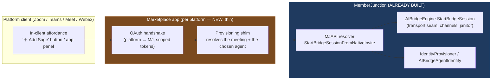

# Native Marketplace Inclusion — Design (Phase 9)

*Companion to [realtime-bridges-architecture.md](./realtime-bridges-architecture.md). This is the
design for the **fourth and last** join method (§5 of the architecture doc): a host adds the agent
**from inside the platform's own UI** — "＋ Add Sage" in the Zoom/Teams/Meet/Webex client — instead
of pasting a join URL or inviting a calendar identity.*

Status: **design + first-submission plan**. No code in this phase changes the engine — the marketplace
apps are thin per-platform shims onto the bridge stack already built in Phases 0–7.

---

## 1. Why this is the *last* join method, not the first

The architecture doc sequenced the four ways an agent gets onto a meeting deliberately
([§5](./realtime-bridges-architecture.md)):

1. **On-demand** (paste a join URL) — zero platform review, immediate.
2. **Scheduled** (a Scheduled Action joins at start) — zero review.
3. **Invite / calendar** (organizer invites `sage@org.com` like a person) — the headline UX; one
   identity model serves every platform and also inbound telephony.
4. **Native marketplace** (this doc) — a host clicks "Add Sage" inside the Zoom/Teams UI.

Native inclusion is last for one reason: **every other method is under our control; this one is
gated by each platform's marketplace review.** It is the highest-friction, longest-lead path (review
cycles of days→weeks, security questionnaires, per-platform re-certification on changes). It is worth
doing — it is the most "native-feeling" affordance and the one enterprise buyers ask for — but it must
not block the 80% of value the first three methods already deliver.

It maps to exactly one capability flag already in the schema:
`IBridgeProviderFeatures.NativeInvite` ([§4 of the architecture doc](./realtime-bridges-architecture.md)).
A provider row advertises `NativeInvite: true` **only once its marketplace app is approved and live**.
Today every provider seed leaves it set per the per-platform reality (Zoom/Teams advertise it as the
target; others omit it until an app ships).

---

## 2. The key architectural insight — the app is a *shim*, not a second engine

A marketplace app does **not** re-implement joining, media, channels, or the agent. All of that is the
bridge stack already built. The app is a thin two-part shim:



- **In-client affordance** — the platform-specific UI (a Zoom App panel, a Teams in-meeting app/bot,
  a Meet add-on side panel). This is the only genuinely new, per-platform surface.
- **Provisioning shim** — on "Add Sage," it does the platform OAuth, resolves *which meeting* (the
  platform passes a meeting/context id) and *which agent* (the host picks, or a tenant default), then
  calls a single MJAPI resolver.
- **MJAPI resolver `StartBridgeSessionFromNativeInvite`** (the one small new server seam) — validates
  the OAuth context, looks up the `AIBridgeProvider` by platform, and calls the **existing**
  `AIBridgeEngine.StartBridgeSession` with `JoinMethod = 'NativeInvite'`. Everything downstream — the
  driver connecting, the channel plane, the realtime session, the janitor — is already built and
  unchanged.

**Consequence for effort estimation:** ~90% of each platform's work is *its marketplace bureaucracy*
(app registration, OAuth scopes, security review, manifest, store listing), not MJ code. The MJ side is
one resolver + per-platform OAuth config.

---

## 3. Per-platform landscape

| Platform | App model | In-meeting surface | Bot/media path (already built) | Review burden |
|---|---|---|---|---|
| **Zoom** | Zoom App (Marketplace) + Meeting SDK | Zoom Apps panel; in-client "Apps" | Meeting SDK / RTMS bot (ZoomBridge) | App Marketplace review; security questionnaire; per-scope justification |
| **Microsoft Teams** | Teams app (Bot Framework + Graph) | In-meeting app tab / side panel; messaging extension | Teams real-time media bot / Graph cloud-communications (TeamsBridge) | Partner Center / Teams Store validation; Graph RSC consent; tenant admin approval |
| **Google Meet** | Meet Add-on (Workspace Marketplace) | Meet Add-ons SDK side/main-stage panel | Meet Media API (GoogleMeetBridge) | Google Workspace Marketplace + OAuth verification (sensitive scopes) |
| **Cisco Webex** | Webex Embedded App + Bot | Embedded App panel | Webex bot / embedded-app SDK (WebexBridge) | Webex App Hub review |
| **Slack** | Slack app | Huddle context limited | Huddle media (SlabBridge) — gated | Slack Marketplace review |

Two are the realistic **first targets** (highest enterprise demand, clearest extensibility story):

### 3a. Zoom (first submission)
- **App type:** a *Zoom App* (in-client web app surfaced in the Apps panel) paired with the **Meeting
  SDK / RTMS** bot path the `ZoomBridge` already uses.
- **Affordance:** the host opens the Apps panel, picks the MJ app, chooses an agent → "Add to this
  meeting." The Zoom App's `getMeetingContext` yields the meeting id; the app calls
  `StartBridgeSessionFromNativeInvite`.
- **OAuth scopes (minimize — each is justified in review):** `meeting:read`, the Meeting SDK/bot
  join entitlement, and the user-identity scope needed to attribute the session. No recording scope
  unless the recording channel is enabled (consent-gated).
- **Review:** Zoom App Marketplace submission + security review; publishable as an *unlisted* /
  account-level app first (admin-installed for design partners) before public listing — this lets us
  ship to real tenants without waiting on public-store review.

### 3b. Microsoft Teams (second submission)
- **App type:** a Teams app combining an **in-meeting app** (side panel) with a **real-time media
  bot** (the `TeamsBridge` path via Graph cloud communications).
- **Affordance:** in-meeting app tab → "Add Sage." Resource-Specific Consent (RSC) lets the app act
  in the meeting without tenant-wide Graph scopes.
- **Distribution:** sideload → org-wide via Teams admin center → Teams Store. Org-wide custom-app
  upload covers design partners without public-store review.

---

## 4. The one new server seam

`StartBridgeSessionFromNativeInvite` — a thin MJAPI resolver (Transport-Layer guide pattern: engine
does the work, resolver is thin):

```
input:  { providerName, externalMeetingId, agentId | agentSelector, oauthContext }
1. validate the OAuth context (platform tokens already exchanged by the app shim)
2. provider = AIBridgeEngineBase.Instance.ProviderByName(providerName)   // strong-typed, cached
3. require provider.SupportedFeaturesObject.NativeInvite === true          // capability gate
4. resolve the agent (explicit id, or tenant default per IdentityProvisioner)
5. return AIBridgeEngine.StartBridgeSession({ provider, agentId, joinMethod: 'NativeInvite',
                                              externalMeetingId, ... })   // ALREADY BUILT
```

No new entities. `AIAgentSessionBridge.JoinMethod = 'NativeInvite'` is already a permitted value in the
v5.42 schema. The resolver reuses `AIBridgeEngine`, `IdentityProvisioner`, and the channel plane verbatim.

---

## 5. Security, compliance, and consent

- **Least-privilege OAuth** — request only the scopes each affordance needs; justify each in review.
  Recording scopes are requested *only* when a recording channel is explicitly enabled, and are
  consent-gated per jurisdiction (the `Recording` capability flag already models this).
- **Tenant-owned identity** — native inclusion composes with the decided identity model
  ([architecture §5](./realtime-bridges-architecture.md)): the agent acts under an identity in the
  customer's own tenant, so audit trails and data residency stay inside the customer boundary.
- **Per-platform data-handling review** — each marketplace requires a security questionnaire / data
  map. The bridge stack's "no secrets inline; credentials via the MJ credential system" rule
  (enforced in the provider seeds and `Configuration` columns) is the answer to most line items.
- **Revocation** — uninstalling the app revokes OAuth; the janitor (`ReconcileOrphans`) reaps any
  bridge sessions whose platform authorization has died.

---

## 6. Phasing & deliverables

| Step | Deliverable | Gated on |
|---|---|---|
| 9.0 | This design doc | — |
| 9.1 | `StartBridgeSessionFromNativeInvite` resolver + OAuth-context validation + unit tests | (code phase, post-design) |
| 9.2 | Zoom App (unlisted/account-level) → design-partner tenants | Zoom Marketplace review |
| 9.3 | Teams app (org-wide custom upload) → design-partner tenants | Partner Center validation |
| 9.4 | Public store listings (Zoom, then Teams) | Full marketplace review |
| 9.5 | Flip `NativeInvite: true` on each provider seed as its app goes live | per-platform approval |

**Recommendation:** treat 9.1 (the resolver) as the only near-term *code* item — it is small and
unblocks design-partner installs the moment the first app clears review. The store listings (9.4) are a
go-to-market track that runs on the marketplace's clock, not ours, and should not block the rest of the
realtime program from shipping.

---

## 7. Why this stays cheap

Because the bridge subsystem was built media-agnostic and capability-gated from the start, native
inclusion adds **no new engine, no new entities, and no new media path** — only a per-platform OAuth
shim and one thin resolver. Each additional platform is the same shim against its own app model. The
expensive part is review bureaucracy, and that is sequenced last on purpose so it never sits on the
critical path.
