# Realtime Bridges — Unified Architecture & Implementation Plan

**Status:** Plan for review (2026-06-13). Branch `realtime-meeting-bridge`. Companion to
[REALTIME_CO_AGENTS_GUIDE](../../guides/REALTIME_CO_AGENTS_GUIDE.md),
[multi-party-and-meeting-bridge.md](multi-party-and-meeting-bridge.md), and
[ai-agent-sessions.md](../ai-agent-sessions.md).

> **The one-line thesis:** there is exactly **one** realtime agent engine. A *bridge* is a
> pluggable **media transport + channel contributor** that connects that engine to an external
> endpoint — a Zoom/Teams/Slack/Meet/Webex **meeting**, or a Twilio/VOIP **phone call**. It carries
> bidirectional **media (audio, video, screen — full duplex)** AND contributes a dynamic **tool +
> signaling vocabulary** (the platform's native surfaces: hand-raise, roster, whiteboard, …) as
> first-class MJ **channels**. We are not building a second realtime stack; we are completing the
> engine's media-transport seam and routing each bridge's surfaces through the existing channel plane.

> **Nothing in this architecture is audio-specific.** Audio is the first media track we light up
> because the models are there today, but the transport seam carries **typed media tracks** (audio /
> video / screen, each inbound *and* outbound). When realtime models gain full-duplex high-res video
> — soon — the same bridges already carry the video tracks with zero re-architecture. "Audio bridge"
> is shorthand for "the audio track of a media bridge," never a constraint.

---

## 1. Why this is one engine, not two

The realtime agent already abstracts everything that makes an agent *converse*: speech-to-speech
model drivers (OpenAI Realtime, Gemini Live, …), the co-agent resolution chain, tools via
`RealtimeToolBroker`, progress narration, interactive channels (the whiteboard), transcript relay,
and the `AIAgentSession` lifecycle/persistence. **None of that cares where the audio comes from.**

The realtime session contract `IRealtimeSession` is already media-agnostic — its `SendInput()`
takes raw media frames and `OnOutput()` emits them (the guide notes both for video and audio). What
has been **deferred three times** in the realtime work is the *server-bridged media transport*:
the guide states verbatim that "`IRealtimeSession.SendInput` / `OnOutput` have no client-facing
pipe" and tags the gap "the unified-transport track."

**A bridge IS that pipe.** This plan completes the server-bridged transport seam once, generically,
and then a bridge is just a driver that fills it from an external audio source. Meetings and
telephony are two families of the same abstraction.

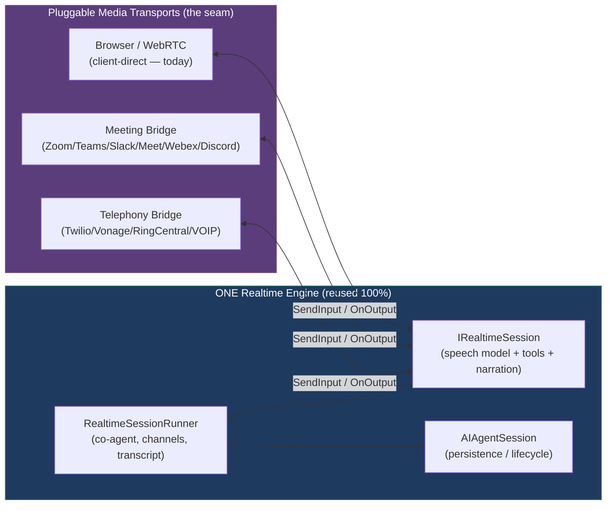

### The honest nuance: server engine vs. client console

The realtime work has **two** halves, and they reuse differently:

| Layer | Reuse for bridges | Why |
|---|---|---|
| **Server engine** — runner, co-agent resolution, tools, narration, channels, transcript relay, `AIAgentSession` persistence | **100%, zero new logic** | The brain/voice/memory of the agent are transport-agnostic. A bridge swaps only the audio plane. |
| **Client console** — progressive-disclosure overlay, orb, captions, composer, whiteboard *surface* | **Reused as an OPTIONAL observer/monitor surface, not the primary interface** | A bot in a Zoom meeting has **no human at an MJ browser tab** — the meeting (or the phone) *is* the interface. But a human *can* open MJ to watch a bridged session live (transcript, the whiteboard the agent is drawing, participants). The same console components power that read-only monitor. |

So when you asked "most of that is a server engine, right? plug it right in with zero effort?" — **for the server engine, yes, that is the literal design goal and the seam already exists in contract form.** The client console doesn't auto-apply (no browser participant in a phone call), but it isn't wasted: it becomes the bridged-session **monitor**. No second variant of anything.

---

## 2. Architecture — the layer cake

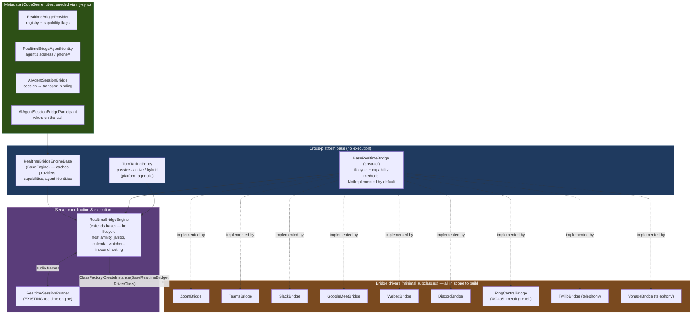

**The engine pair mirrors `AIEngineBase` / `AIEngine` exactly** (your explicit ask):

- **`RealtimeBridgeEngineBase`** (`@memberjunction/ai-bridge-base`, proposed) — `BaseEngine`
  subclass. Caches `RealtimeBridgeProvider` rows + their capability flags + `RealtimeBridgeAgentIdentity`
  rows. Pure metadata: provider resolution (by name, by join-URL pattern, by inbound number),
  capability lookups, identity resolution. **No execution.** Reactive via `BaseEngine` events.
- **`RealtimeBridgeEngine`** (`@memberjunction/ai-bridge-server`, proposed) — extends the base,
  adds **all coordination + execution**: spinning up bot connections, the per-node host registry
  (`HostInstanceID` affinity — copied from `AIAgentSession`), the janitor (reconcile orphaned bot
  sessions), calendar/invite watchers, inbound-call routing, and wiring each bridge's audio to/from
  the existing `RealtimeSessionRunner`.

---

## 3. The provider abstraction — 100% generic, capability-gated

`BaseRealtimeBridge` is the abstract driver. Two principles, both per your spec:

1. **Maximal base class.** Everything that can be done generically lives in the base (or the engine
   calling the base): session wiring, audio frame normalization (resample to the model's rate),
   turn-taking, participant bookkeeping, transcript stamping, reconnect/backoff, teardown. A concrete
   driver (`ZoomBridge`) implements only the **irreducibly platform-specific** primitives.
2. **Capability-gated optional features.** Methods that not every platform supports are **virtual,
   throwing `BridgeCapabilityNotSupportedError` by default**. The matching boolean flag on
   `RealtimeBridgeProvider` tells callers whether to call. **The engine checks the flag first; the
   throw is defense-in-depth.** Metadata says "don't call this," code refuses to pretend.

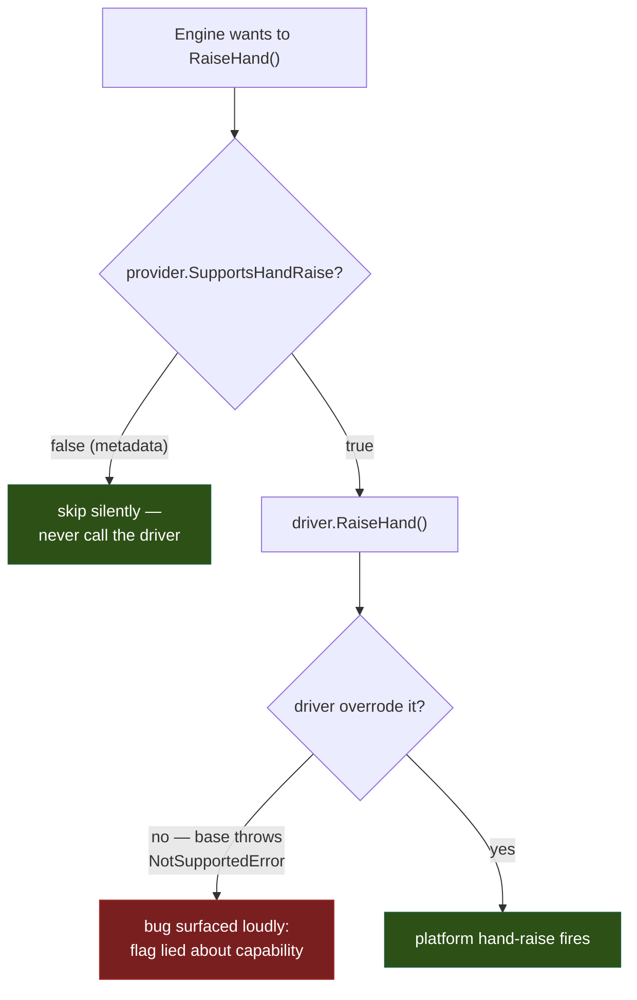

**Abstract (every bridge MUST implement):**
- `Connect(ctx)` — join the meeting / place or accept the call; return the bot participant handle.
- `Disconnect(reason)` — leave / hang up cleanly.
- `SendAudio(pcmFrame)` — the agent speaking out into the meeting/call (← `IRealtimeSession.OnOutput`).
- `OnAudio(handler)` — meeting/call audio in (→ `IRealtimeSession.SendInput`); with speaker labels
  when the platform diarizes.

**Virtual / capability-gated (throw `NotSupported` unless overridden):**
- `OnParticipantChange(handler)` / `GetParticipants()` — roster + diarization mapping.
- `PostChatMessage(text)` — for the **hybrid** turn mode (post instead of interrupt).
- `RaiseHand()` — native raise-hand signal.
- `SendDTMF(digits)` / `OnDTMF(handler)` — **telephony**.
- `TransferCall(target)` — **telephony**.
- `StartScreenShare()` / `StartVideo()` / `StartRecording()` — richer meeting features.

A driver advertises what it overrode; the **seed metadata flags must match** (validated server-side).

---

## 4. Data model

**No new "session" entity.** The session *is* the existing `AIAgentSession` — the bridge is an
**attachment** to it, exactly parallel to how `AIAgentSessionChannel` attaches the whiteboard. This
is the single biggest reuse win: one session record, one lifecycle, one persistence/transcript path,
whether the media plane is a browser, a Zoom room, or a phone line.

**Five new entities** (per open question #6, the provider-channel junction is in): `RealtimeBridgeProvider`,
`RealtimeBridgeAgentIdentity`, `RealtimeBridgeProviderChannel`, `AIAgentSessionBridge`,
`AIAgentSessionBridgeParticipant`. **The bridge's channels live in the *same* `AIAgentChannel`
registry as MJ-native channels** (open question #6 confirmed: metadata-declared *and* runtime-dynamic
both supported) — that is the "3rd-party channels understood the same basic way as MJ channels"
guarantee, in the schema. Fully runtime-dynamic channels (no registry row) use the
`AIAgentSessionChannel` escape hatch added in a later phase (nullable `ChannelID` + inline definition);
this migration does not modify the shipped `AIAgentSessionChannel`.

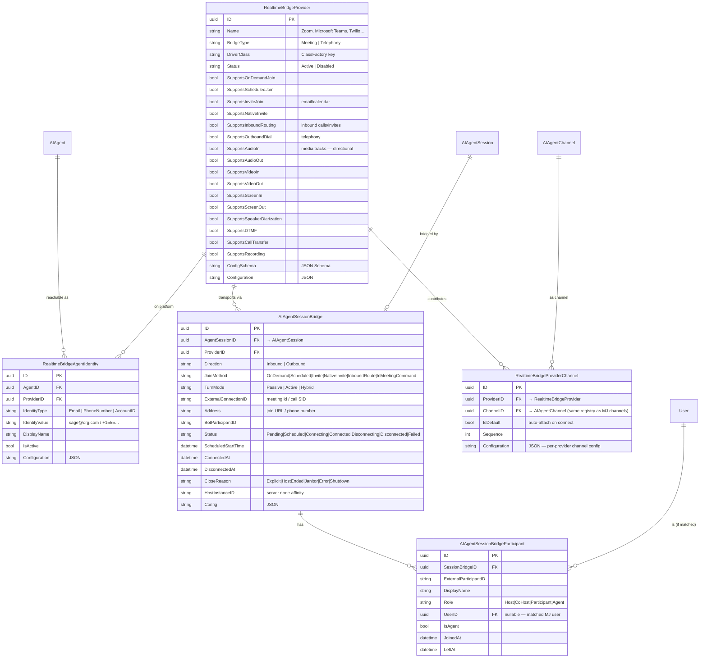

Telephony reuses **the same five tables** with no schema change: `BridgeType='Telephony'`,
`IdentityType='PhoneNumber'`, `Direction='Inbound'|'Outbound'`, capability flags `SupportsDTMF` /
`SupportsOutboundDial` / `SupportsCallTransfer` on. That is the proof the model is genuinely unified.

**Note the capability flags are *transport/media* concerns only** (join methods, directional media
tracks, diarization, DTMF/transfer, recording). The *interactive* surfaces — hand-raise, in-meeting
chat, the native whiteboard — are **not** transport flags; they are **channels the bridge
contributes** (next section), which is why they don't appear as booleans here.

**Reference data** (the Zoom/Teams/Slack/Meet/Twilio provider rows) is seeded via **mj-sync metadata,
never SQL INSERTs**, per convention. The migration creates only the four tables + their columns.

---

## 4b. Bridges contribute channels — the tool & signaling plane

A bridge is **not just a media pipe.** It is also a **channel contributor**, and this reuses MJ's
existing channel architecture (`AIAgentChannel` / `AIAgentSessionChannel` / `BaseRealtimeChannelServer`
+ the `RealtimeToolBroker` + the perception feed) wholesale. A **channel** is the unit that carries:

- a **tool vocabulary** — what the agent can *do* on a surface (draw, raise hand, call on a person,
  navigate a browser), contributed into the session's tool set; and
- a **signaling / perception feed** — what the agent *sees* happening on that surface (a stroke
  landed, a hand went up, who's speaking, the browser navigated), streamed back as perception; and
- optional **state** (the board, the roster) persisted on the session-channel row.

The crucial evolution: **channels have two origins, and a bridge can contribute any number of them —
not only the metadata-defined ones.**

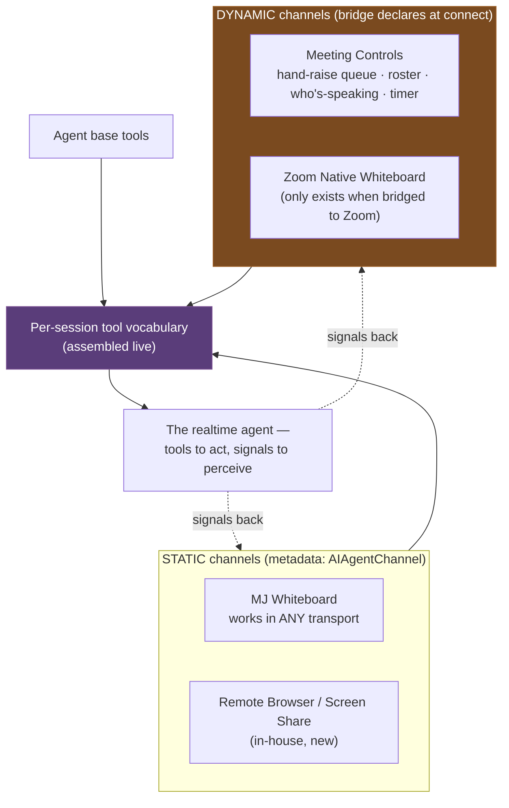

- **Static channels** are registered in `AIAgentChannel` metadata and resolved by ClassFactory exactly
  as today (the MJ Whiteboard is transport-agnostic — it renders in the browser console *or* gets
  surfaced into a meeting via a video/screen track).
- **Dynamic channels** are declared by the **bridge** at connect time and may have **no pre-seeded
  registry row** — the bridge contributes their tool vocabulary + signaling at runtime. Zoom's native
  whiteboard or a meeting-controls surface only exist *because* you're bridged to that platform.
- The **per-session tool vocabulary is assembled live**: agent base tools + every active channel's
  tools (static and bridge-contributed). This is precisely the deferred "channel tool contribution
  feeding `RealtimeSessionRunner.ExtraTools`" the realtime guide flags as a TODO — the bridge is the
  thing that finally drives it.

### Hand-raise is a tool; the hand-raise *queue* is signal intel

Raising a hand is a **tool** the agent invokes on the **Meeting Controls** channel. But the richer
value is the **signaling**: the channel feeds the agent *who else has raised hands, in what order,
who's speaking, how long they've spoken, time remaining*. With that intel an agent can take the
**facilitator** role — call on people in order, enforce time, summarize, move the agenda — entirely
through one channel's tools + perception. None of that is platform code; it's a channel.

### Screen-share / Remote Browser — an in-house channel that proves the media-agnostic point

An agent spins up a **container running a remote browser** (Playwright). That channel offers:

- a **video/screen track** out (the live browser, screen-shared into the meeting) — only possible
  because the transport carries **video, not just audio**;
- a **tool vocabulary** (navigate, click, type, scroll, highlight) the agent drives while talking;
- optional **inbound control** so a human on the call can grab the wheel (collaborative demo).

Picture a sales agent firing up a live product demo in a remote browser, narrating it, taking
questions, and changing what it shows on the fly — or handing control to the prospect. That is one
**channel** on a media bridge. It's the clearest proof that "channel" ≠ "structured whiteboard
deltas" and "transport" ≠ "audio": both must be first-class media + tool + signaling abstractions.

### Are 3rd-party channels *really* the same as MJ channels? Yes — with eyes open

A bridge-contributed (3rd-party) channel **is** an MJ channel: tool vocabulary + signaling/perception
+ optional state, routed through the existing `RealtimeToolBroker` and perception feed. The *only*
new property is that some of its tooling is **dynamic** (known at runtime / sourced from the
platform) rather than hardcoded in a plugin class. That is genuinely workable, and it's the right
model — but making it *literal* requires four evolutions of the channel contract. **Crucially, none
are new risk: all four are already on the realtime roadmap as deferred items the bridge program was
always going to build** (the guide flags the server-side channel path as a TODO):

| Evolution | What changes | Risk |
|---|---|---|
| **Dynamic tool definitions** | `GetToolDefinitions()` may return **runtime-computed** tools (per session / per platform state), not only constants. The assembly into `RealtimeSessionRunner.ExtraTools` is the deferred TODO the bridge finally drives. | Low — the method already exists; we let its return value be dynamic. |
| **Server-side channel execution** | Today channel tools execute **client-side** (browser). A bot has no browser → bridge channels execute **server-side**. This is the *same* work as Phase 0 (completing the server-bridged path); the bridge is what stands up the per-session server channel host that is currently a stub. | Medium — real work, but **already in scope as the foundation**, not extra. |
| **Optional client surface** | `BaseRealtimeChannelClient` assumes a rendered Angular surface (`GetSurfaceComponent()`). A Zoom-native whiteboard has **no MJ client surface** (it lives in Zoom). The contract must allow **server-only** channels (and *optional* observer-only client views). | Low — make the surface optional. |
| **Channel-type identity** | Known 3rd-party channels (Meeting Controls, Zoom Whiteboard) get **registry rows** (`AIAgentChannel`) for discoverability; *truly* ad-hoc ones need the **nullable-`ChannelID` + inline definition** escape hatch (open question #6). | Low — schema decision. |

Already solved, no new work: **tool-name collision** (the existing `ToolNamePrefix` namespaces each
channel's tools), and **authorization/trust** (bridge tools run through the same broker under the
session's user context + authorization, exactly like any agent tool).

**The one honest dependency to call out:** "3rd-party channel = MJ channel with dynamic tooling" is
true, but it is **not** a free plug-in to *today's* shipped code — today's channels are client-direct
(browser-executed) and the server-side channel host is a stub. The bridge program **builds** that
server-side path in Phase 0, and from then on MJ-native and 3rd-party channels share it **identically**.
So: workable and correct, with the server-side channel execution as the known foundational lift.

---

## 4c. Multi-party is an emergent property of the bridge, not a separate build

Your earlier [multi-party plan](multi-party-and-meeting-bridge.md) had two hard, deferred tracks —
**A: agent panels** (multiple co-agents + a human, with a custom FloorManager) and **B: multiple
humans in one session** (which needed us to stand up an SFU and "not rebuild Zoom"). **The bridge
collapses both into itself**, because we let the conferencing platform *be* the shared room — it
already does the SFU, the mixing, the multi-party media plane.

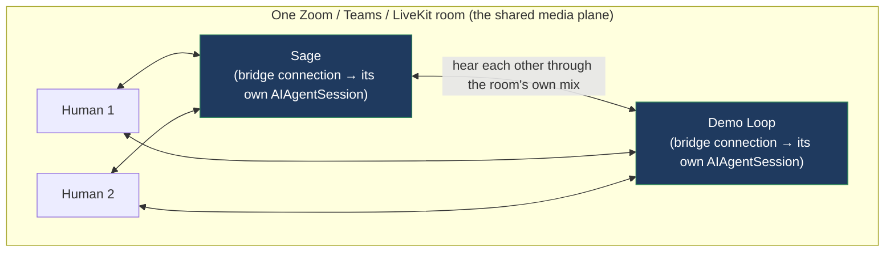

- **Multiple humans?** The platform already provides it. We build nothing.
- **Multiple agents?** Each agent is an **independent bridge connection** (its own bot, its own
  `AIAgentSession`) into the *same* meeting. **Sage and Demo Loop both joining one Zoom call literally
  hear each other** — Sage's voice is part of "everyone else" in Demo Loop's inbound mix, and vice
  versa. No transcript-relay hack; they share the room's native audio (and soon video).
- **Agent-to-agent + humans, all talking?** Yes — they're all just participants in one room.
- **The "experimental arena"** (two agents conversing, humans observing/steering) = two agents in a
  private meeting. The meeting *is* the arena.

**The one genuinely new problem is turn-taking discipline among multiple agents** so they don't talk
over each other or loop forever — and that is exactly the passive/active/hybrid policy we're already
building (§6). Two **passive** agents never loop (neither speaks unless addressed by name); a
**facilitator** agent (Meeting Controls channel) can arbitrate explicitly.

**Self-hosted rooms when you don't want to depend on Zoom:** an MJ-native multi-party experience
(e.g. embedded in Explorer) is just a **LiveKit "bridge"** providing the same multi-party room —
*another bridge, not a special build*. The architecture treats a Zoom meeting, a Teams meeting, and
an MJ-native LiveKit room **identically**: all are multi-party media transports. This is why the
earlier "A/B" tracks shouldn't be built standalone — **the entire multi-party roadmap is "put 1+
agents into a shared room, where a bridge provides the room."**

*Caveats:* per-bot-minute platform cost scales with agent count; a bot must not hear its own echo
(platforms exclude your own audio from your inbound mix — gate if a given platform doesn't); and
bot admission/permissions are per-platform.

---

## 4d. The Remote Browser channel — spec (follow-on phase)

The single most compelling channel, and the one that most demands the media-agnostic transport: an
agent **spins up a container running a real browser (Playwright), screen-shares it live, drives it
while talking, and can hand the wheel to a human** — a sales agent running an interactive product
demo, a support agent walking a user through a UI, a research agent showing what it found. This is an
**in-house MJ channel** (`RemoteBrowserChannel`), transport-agnostic: in a browser console session
its video renders in a panel; in a Zoom/Teams meeting it screen-shares into the room. It is a
**follow-on phase** (it needs the media-track plane + container orchestration), specced here so it's
built in this same program.

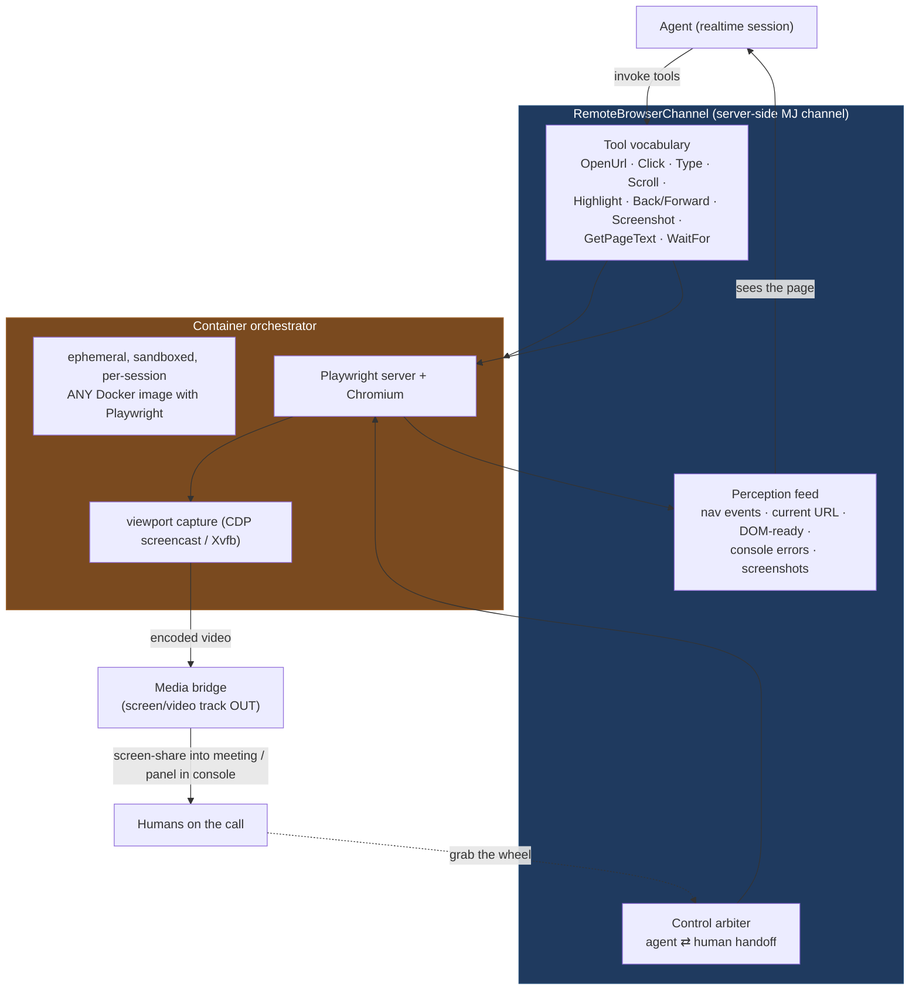

**Components:**

1. **Container orchestrator** — spins up / tears down an **ephemeral, sandboxed container per session
   from *any* Docker image that supports Playwright** (a default MJ image, or a customer-supplied one
   for a specific demo environment). Resource-limited, network-egress-controlled, no access to MJ
   internals, auto-reaped on session end or idle. Pluggable backend (local Docker API → a container
   service / K8s in production) behind a `ContainerRunner` abstraction so orchestration is itself
   swappable.
2. **Browser control** — a Playwright server inside the container; the channel's tools map to
   Playwright actions (`OpenUrl`, `Click` by selector or coordinates, `Type`, `Scroll`, `Highlight`,
   `Back`/`Forward`, `WaitFor`). Dynamic tool vocabulary (per §4b) — e.g. a demo can register
   app-specific shortcuts.
3. **Video out** — capture the page viewport (CDP `Page.startScreencast` frames, or a virtual display
   `Xvfb` + screen grab), encode to a video track, and emit through the bridge's **screen/video track**
   (the media-agnostic transport is what makes this possible at all).
4. **Perception** — navigation events, current URL, DOM-ready, console errors, and on-demand
   `Screenshot` / `GetPageText` feed back as the channel's perception so the agent *sees* the page it
   is driving and can react ("the pricing page loaded — let me walk you through the tiers").
5. **Collaborative control** — a human on the call (or in the MJ console) can **grab the wheel**:
   their pointer/keyboard events route into the container's browser. A **control arbiter** mediates
   agent-vs-human control (request/grant/yield), so demos are interactive, not one-way.

**Security & cost:** the container is ephemeral and sandboxed; credentials for any app being demoed
are handled via the credential system, never baked into images; egress is allow-listed; each session
is one container (cost is per-session compute + the realtime session). **Phase placement:** after the
media-track plane and the first meeting bridge work (it consumes both), but within this program.

---

## 5. How an agent joins / connects

This was your direct question. There are five ways in, and the right answer is *several of them,
gated by capability* — but with a clear "native-feeling" headliner.

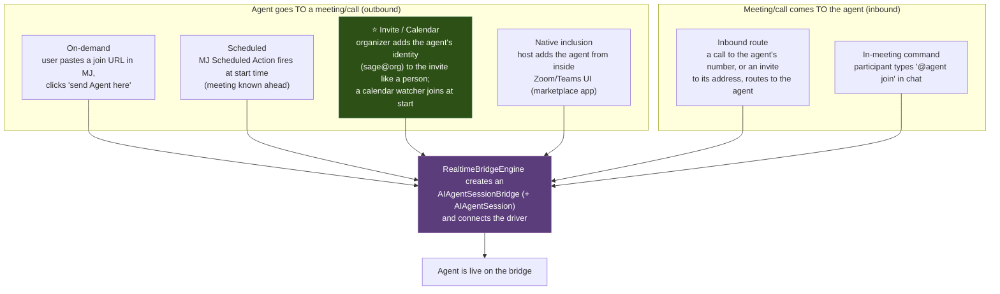

**Recommendation / sequencing of join methods:**

1. **On-demand + Scheduled first** (Zoom) — fully under our control, no marketplace review, immediate
   demo value. `JoinMethod = OnDemand | Scheduled`.
2. **Invite / Calendar second — the headline UX.** The agent gets a provisioned **identity**
   (`RealtimeBridgeAgentIdentity`: a calendar mailbox for meetings, a phone number for telephony).
   Organizers just **invite the agent like a human**. A calendar/invite watcher (Graph / Google
   Calendar webhooks or polling) matches incoming invites to agent identities, creates a `Scheduled`
   bridge, and joins at start. **This is the most generic method — every platform has calendar
   invites — and the most "native feeling."** It is also exactly how **inbound telephony** works
   (a call to the number → route to the agent), so building the identity model once serves both.
3. **Native marketplace inclusion last** (per-platform app review; `SupportsNativeInvite`).
4. **In-meeting command** opportunistically where a chat API exists (`SupportsInMeetingChat`).

The provider's capability flags declare which methods it supports; `AIAgentSessionBridge.JoinMethod`
records which was used.

### The agent as a first-class identity in the customer's tenant (decision, open question #5)

**Decided:** for invite/calendar joins, each agent gets a **real mailbox/calendar identity in the
customer's own tenant** (their Microsoft 365 / Google Workspace), not an MJ-managed throwaway. This
is the right call and it pays off well beyond meetings:

- **It makes the agent a first-class colleague.** Organizers add `sage@customer.com` to an invite
  exactly like a person; the calendar watcher (Graph / Google Calendar) sees it and the agent joins.
  No special "add a bot" UX — the agent is in the directory.
- **`RealtimeBridgeAgentIdentity` generalizes to "agent presence."** The same row that holds a
  calendar mailbox is the seam for, over time: **email** (the agent reads/sends async — a natural
  follow-on once it has an inbox), **calendar** (proposes/accepts meetings), and **telephony** (the
  phone-number identity for inbound DID). One identity model, many surfaces. The `IdentityType` enum
  (`Email | PhoneNumber | AccountID`) already anticipates this.
- **Provisioning** is delegated-admin: MJ requests (or the customer grants) a mailbox + the minimal
  Graph/Google Admin scopes to watch that calendar and, later, send mail as the agent. The credential
  lives in MJ's credential system, referenced by the identity/provider config — never inline.
- **Governance:** because the identity is in the customer's tenant, their existing retention, DLP,
  eDiscovery, and offboarding all apply to the agent automatically — a real compliance win vs. a
  shadow MJ identity.

**Open sub-question for later phases (not blocking the migration):** the exact provisioning
handshake (self-service admin-consent flow vs. customer creates the mailbox and shares credentials).
The schema is ready either way — `RealtimeBridgeAgentIdentity` + provider `Configuration` carry it.

---

## 6. Audio + turn-taking (passive / active / hybrid)

Turn-taking is **generic and platform-agnostic** — it operates on the diarized transcript stream
the bridge provides, lives in the engine layer, and is identical for Zoom or Twilio. All three modes
ship together (your ask).

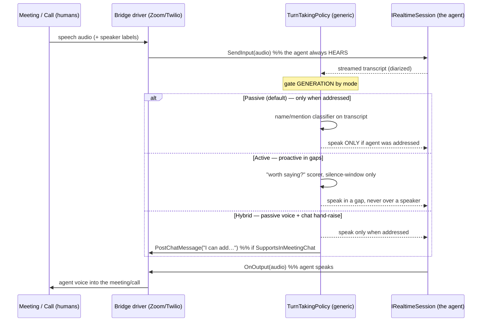

- **Passive (default).** Generation gated on the agent being **addressed** — name/mention detection
  on the diarized transcript (fast regex + an LLM fallback for indirect address like "what does our
  AI think?"). The agent always *hears* (so it has context) but only *speaks* when called on.
- **Active.** A "do I have something worth saying" scorer that fires **only in silence windows**
  (never barging over a live speaker), throttled so it can't dominate.
- **Hybrid.** Passive voice **plus** the agent posts to meeting chat when it has something to add —
  the social-cost-free "raise hand." Requires `SupportsInMeetingChat`; degrades to plain passive
  where chat isn't available.

`AIAgentSessionBridge.TurnMode` selects the mode per session; the default is `Passive`.

---

## 7. Session lifecycle (state machine)

The bridge binding's `Status` is its own small state machine; the underlying `AIAgentSession`
lifecycle (Active/Idle/Closed + the janitor) is **reused unchanged**.

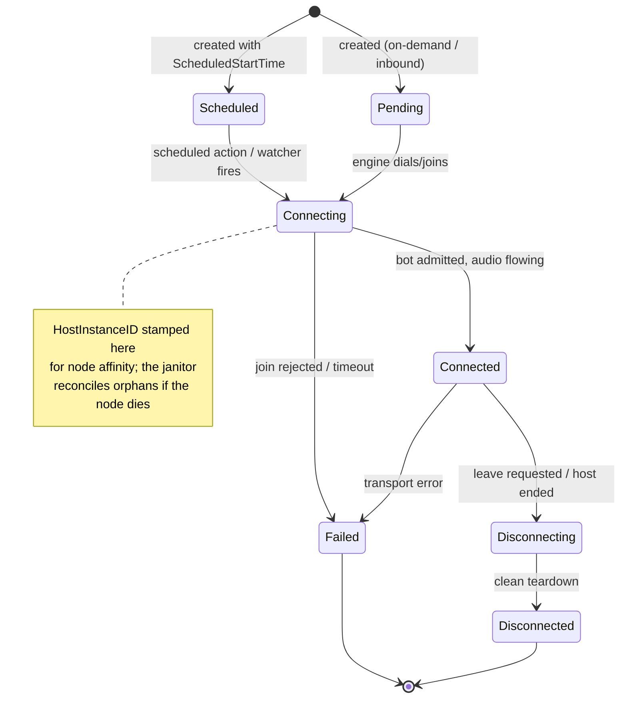

Persistence reuse: the **transcript** is the same session-stamped `Conversation Detail` rows; the
**whiteboard / channel state** rides the same `AIAgentSessionChannel` rows; **artifacts** link the
same way. A bridged session reviews in the existing console with zero new persistence code.

---

## 8. Platform rollout & capability matrix

Build **Zoom end-to-end first**; only once it works do we add the others — each a **minimal subclass**
(the generic base + engine carry the weight). Telephony (Twilio) is a first-class later phase on the
same engine, not a separate effort.

| Capability | Zoom | Teams | Slack | Meet | Webex | Discord | RingCentral | Twilio | Vonage |
|---|:--:|:--:|:--:|:--:|:--:|:--:|:--:|:--:|:--:|
| On-demand join | ✅ | ✅ | ✅ huddle | ⚠️ | ✅ | ✅ | ✅ | n/a | n/a |
| Scheduled join | ✅ | ✅ | ✅ | ⚠️ | ✅ | ⚠️ | ✅ | n/a | n/a |
| Invite / calendar | ✅ | ✅ | ⚠️ | ✅ | ✅ | ➖ | ✅ | ✅ DID | ✅ DID |
| Outbound dial | n/a | n/a | n/a | n/a | n/a | n/a | ✅ | ✅ | ✅ |
| Inbound routing | ⚠️ | ⚠️ | ⚠️ | ⚠️ | ⚠️ | ✅ | ✅ | ✅ | ✅ |
| Audio in/out | ✅ | ✅ | ✅ | ✅ | ✅ | ✅ | ✅ | ✅ | ✅ |
| Video in/out | ✅ | ✅ | ✅ | ✅ | ✅ | ✅ | ✅ | ➖ | ➖ |
| Screen in/out | ✅ | ✅ | ✅ | ✅ | ✅ | ✅ | ✅ | n/a | n/a |
| Speaker diarization | ✅ | ✅ | ⚠️ | ⚠️ | ✅ | ✅ | ⚠️ | ➖ | ➖ |
| In-meeting chat (chan.) | ✅ | ✅ | ✅ | ⚠️ | ✅ | ✅ | ⚠️ | n/a | n/a |
| Hand raise (chan.) | ✅ | ⚠️ | ⚠️ | ➖ | ⚠️ | ➖ | ⚠️ | n/a | n/a |
| DTMF / transfer | n/a | n/a | n/a | n/a | n/a | n/a | ✅ | ✅ | ✅ |

✅ supported · ⚠️ partial / needs verification · ➖ not offered · The matrix becomes the seed metadata
flags. **Slack is in scope as a FULL meeting bridge** — modern Slack huddles do full audio + video +
screen share. The one thing to **verify early** is bot/media API access to huddles (Slack huddles run
on Amazon Chime under the hood; we must confirm a public join-with-media path exists, else Slack needs
a Chime-SDK-level integration). Treat the huddle-media-API as the gating unknown, not the AV
capability itself.

### The platform landscape — **all of these are in scope to build**

Four categories — they bucket differently in this architecture, but every destination/UCaaS/CPaaS row
below is a driver we intend to ship:

- **Destination platforms** (people *meet* there → meeting bridges): **Zoom · Microsoft Teams ·
  Google Meet** (the big three), **Cisco Webex** (still a major *enterprise* player in 2026 — finance,
  healthcare, government, education, Cisco-heavy shops; actively developed Webex Suite + AI Assistant;
  real bot/embedded-app SDK), **Slack** (full-AV huddles — verify media API), **Discord** (huge for
  community/education/gaming/some business; first-class voice channels + mature bot API, easy media).
  *Skip (EOL/fading): BlueJeans (Verizon discontinued), GoTo Meeting.*
- **UCaaS — meetings *and* telephony in one** (one driver exercises both families): **RingCentral**
  (in scope). Also notable: Dialpad (AI-first), 8x8, Zoom Phone.
- **CPaaS — comms infrastructure** (telephony, Phase 5): **Twilio** (lead) + **Vonage** (in scope).
  Also: Amazon Chime SDK, Telnyx.
- **SFU / embeddable infrastructure** — **NOT a bridge destination**; the candidate for our **own**
  multi-party room (§4c): **LiveKit** (lead — open-source, self-hostable, already has OpenAI/Gemini
  realtime adapters), Daily.co, Agora. Run as the "MJ-native room" bridge, not connected *out* to.

**Confirmed build set this program:** Zoom (first) → Teams → Google Meet → Webex → Slack → Discord →
RingCentral (UCaaS) → Twilio → Vonage, plus LiveKit as the MJ-native-room bridge. *WhatsApp Business
calling* is the watch-list global add as its API matures.

---

## 9. Implementation phases

| Phase | Deliverable |
|---|---|
| **0 — Transport seam** | Complete the server-bridged realtime **media** transport: `BaseRealtimeBridge` abstract (media tracks + capability methods) + the engine wiring `SendInput`/`OnOutput` ↔ `RealtimeSessionRunner`; a loopback test bridge proves media round-trips with no platform. The unification foundation. |
| **1 — Schema + engines** | The migration (5 entities) → CodeGen → `RealtimeBridgeEngineBase` + `RealtimeBridgeEngine` + capability-gated base driver + the platform-agnostic turn-taking policy (passive/active/hybrid). |
| **2 — Server-side channel plane** | Complete the deferred server-side channel execution: dynamic tool-definition contribution into `RealtimeSessionRunner.ExtraTools`, optional client surface, the `Meeting Controls` channel (roster/hand-raise-queue/who's-speaking/timer → facilitator). Makes 3rd-party channels = MJ channels. |
| **3 — Zoom meeting bridge** | `ZoomBridge` (on-demand + scheduled join), participant diarization, all three turn modes, Zoom-native channels (chat, whiteboard), observer console reuse. First real platform, end-to-end. |
| **4 — Invite/calendar joins + agent identity** | `RealtimeBridgeAgentIdentity` (tenant mailbox) + the calendar watcher: "invite the agent like a person." Headline UX; shared with inbound telephony. |
| **5 — Teams → Google Meet → Webex → Slack → Discord** | Minimal subclasses on the proven base, one at a time, each with its capability metadata + native channels. |
| **6 — Telephony: RingCentral (UCaaS) → Twilio → Vonage** | `BaseTelephonyBridge`: **outbound** (agent places calls) + **inbound** (DID routes to the agent), DTMF, transfer. Same engine/session/turn-taking. |
| **7 — Multi-party** | 1+ agents in one shared room (emergent — §4c); multi-agent turn-taking discipline; the LiveKit MJ-native-room bridge. Kills the standalone agent-panel/multi-human tracks. |
| **8 — Remote Browser channel** | `RemoteBrowserChannel` + `ContainerRunner` (any Playwright Docker image), screen-track out, control arbiter (§4d). |
| **9 — Native marketplace inclusion** | Per-platform apps for in-UI "add the agent." App-review gated; last. |

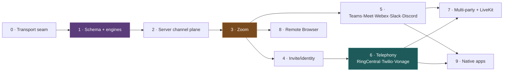

> **The migration covers Phase 1 only.** Everything from Phase 0 onward is code I build solo once
> CodeGen has run — see the Work Breakdown Structure (§13) for the resumable task list.

---

## 12. Per-phase quality bar (non-negotiable, every phase)

Every phase is "done" only when **all** of the following hold — this is baked into each WBS block:

1. **World-class docs.**
   - **JSDoc/TSDoc on every public class, method, property, and exported type** — the *why*, not just
     the *what*; document capability gating, throw conditions, and reuse seams.
   - **A `README.md` for every new package** (purpose, install, the public API, usage examples,
     how it composes with the realtime engine).
   - **A guide in `/guides`** — `REALTIME_BRIDGES_GUIDE.md` (created in Phase 0, extended each phase)
     covering the architecture, how to add a new bridge driver, capability gating, channel
     contribution, turn-taking, and the observer console. Cross-linked from the root `CLAUDE.md` index
     and the realtime co-agents guide.
2. **Naming conventions (repo rules).** PascalCase for public class members (properties, methods,
   `@Input`/`@Output`), camelCase for private/protected; PascalCase classes/interfaces; union types
   over enums; no `any`, no weak `.Get()/.Set()` (use generated typed properties post-CodeGen).
3. **Tests.**
   - **Extensive NEW unit tests for all new functionality** (vitest; `@memberjunction/test-utils`;
     injectable seams so no network/DB — mirror the realtime driver test pattern). Target the engine
     logic, capability gating, turn-taking policy, each driver's frame translation, and the channel
     tool/perception wiring.
   - **Full-repo unit tests pass** (`npx turbo run test --filter='!@memberjunction/sql-converter'`) —
     the PG-migration-parity suite is the only sanctioned exception; **everything else must be green**.
   - Report pass/fail counts at the end of each phase.
4. **Build green.** Each touched package builds (`npm run build`); the manifests regenerate if any
   `@RegisterClass` is added; the full repo build passes before a phase is marked complete.
5. **Commit at clean points.** After CodeGen, commit/push at each logical milestone with a detailed
   message; a changeset per phase (minor where a migration is added, patch otherwise).

---

## 10. Security, multi-tenancy & cost

- **Provider credentials** (Zoom SDK keys, Twilio auth) resolve through MJ's credential system
  (`GetAIAPIKey`-style), never hardcoded; referenced by `RealtimeBridgeProvider.Configuration`.
- **Authorization to bridge** — joining an external meeting / placing a call on the org's behalf is a
  privileged action; gated by a dedicated authorization (mirroring `Realtime: Advanced Session
  Controls`), and every bridge session is owned by a `UserID` and fully audited via the session +
  Record Changes.
- **Recording/consent** — `SupportsRecording` and per-jurisdiction consent handling are explicit
  capability + config concerns, not silent defaults.
- **Cost** — each bridged session is one realtime provider session (audio tokens) + the platform's
  per-minute bot/telephony cost; linear and attributable per `AIAgentSession`.
- **Host affinity + janitor** — `HostInstanceID` + the reconcile sweep (copied from the realtime
  session model) handle node death without leaking live bot connections.

---

## 11. Open questions for review

1. **Package placement** — propose `packages/AI/BridgeBase` (`@memberjunction/ai-bridge-base`) +
   `packages/AI/Bridge` (`@memberjunction/ai-bridge-server`), beside the realtime packages. Agree?
   - YES

2. **Naming** — `RealtimeBridgeProvider` / `AIAgentSessionBridge` etc. vs. a shorter prefix
   (`BridgeProvider`?). I lean on `…Bridge…` tied to `AIAgentSession` for discoverability.
   - AIAgentSessionBridget is good I think so stays in AI...

3. **Phase 0 scope** — do we land the transport seam + a loopback test bridge as its **own** small PR
   first (proves the unification with zero platform risk), then schema/engines? I recommend yes.
   - Yes

4. **Slack** — confirm we treat it as **text/hand-raise only**, not an audio bridge.
   - They have full blwon video conf,that's what I'm referering to using

5. **Identity provisioning** — for invite/calendar joins, do agent mailboxes live in the customer's
   tenant (their M365/Google) or an MJ-managed identity? Affects Phase 3.
   - I think agents get an inbox in the customer's tenant and over time that can be used for email, thoughts?

6. **Bridge-contributed channels (§4b)** — do we add a 5th entity `RealtimeBridgeProviderChannel`
   (a junction declaring which registered channels a provider contributes by default, e.g. Zoom →
   Meeting Controls + Native Whiteboard), while still allowing fully *runtime-contributed* channels
   with no registry row? I lean yes — it makes the common case discoverable in metadata without
   blocking dynamic ones. Confirms whether the migration is 4 or 5 entities.

  - metadata good but doesn't preclude dynamic (either inside MJ channels or bridge channels dyanmic option is good to have )

7. **Multi-party (§4c)** — confirm we treat multi-agent + multi-human as an **emergent property of
   the bridge** (1+ agents in a shared room) and do **not** build the standalone "agent panel" /
   "multiple humans" tracks from the earlier plan. LiveKit becomes the MJ-native-room *bridge*, not
   a special path. This supersedes [multi-party-and-meeting-bridge.md](multi-party-and-meeting-bridge.md).

   yep, exactly, that's were we do it, we kill that off and update that plan and point to this. Will be WAY better this way.

8. **Screen-share / Remote Browser channel (§4b)** — in scope as an in-house channel for this program
   (it needs the video track + container/Playwright runner), or split to its own initiative once the
   media-track plane lands? It's the strongest media-agnostic proof but carries infra (container orchestration).

   yep, in house channel and we should also build a remote browser ability that allows us to spin up any docker that suports playwright so that it can be used for remote demos, spec out how this should work in the plan - its on follow on phase, but we do it all in one overall giant session

---

## 13. Work Breakdown Structure — **SESSION STATE** (resume here)

> **This section is the live session state.** Each `- [ ]` is a unit of work; I check it off as I go
> and commit the doc, so a fresh session resumes by reading the first unchecked box. The **per-phase
> quality bar (§12)** — JSDoc, package README, the `/guides` guide, repo-wide tests + new tests,
> green build, changeset — applies to **every** phase block and its boxes must all be checked before
> the phase is "done." Skip the `sql-converter` PG suite only.

### Phase 1 — Schema + engines  ⟵ START HERE (blocked on CodeGen)
- [ ] **Migration** `V…__v5.42.x__Realtime_Bridges.sql` — 5 tables (`RealtimeBridgeProvider`,
      `RealtimeBridgeAgentIdentity`, `RealtimeBridgeProviderChannel`, `AIAgentSessionBridge`,
      `AIAgentSessionBridgeParticipant`) + extended props. **← Amith reviews + runs CodeGen.**
- [ ] After CodeGen: verify generated entity types; no drift; build `@memberjunction/core-entities`.
- [ ] `@memberjunction/ai-bridge-base` package: `RealtimeBridgeEngineBase` (BaseEngine — caches
      providers, capabilities, identities, provider-channels), provider/identity resolution.
- [ ] `BaseRealtimeBridge` abstract (media-track contract + capability-gated methods, `NotSupported`
      defaults), `BridgeCapabilityNotSupportedError`, capability types (union types).
- [ ] `TurnTakingPolicy` (passive/active/hybrid) — pure, platform-agnostic, on diarized transcript.
- [ ] `@memberjunction/ai-bridge-server` package: `RealtimeBridgeEngine` (extends base — host
      registry, janitor, lifecycle scaffold), ClassFactory driver resolution.
- [ ] Server-side `MJ…EntityServer` subclasses + `ValidateAsync` invariants (capability/flag
      coherence, one-default-per-provider-channel, identity uniqueness).
- [ ] Seed metadata (mj-sync): provider rows for every platform with capability flags; the
      `Realtime: Advanced Bridge Controls` authorization.
- [ ] **Quality bar:** JSDoc · package READMEs · create `/guides/REALTIME_BRIDGES_GUIDE.md` · new
      unit tests · repo tests green · build green · changeset · commit/push.

### Phase 0 — Transport seam  (do alongside/after Phase 1 base; it's the foundation)
- [ ] `BaseRealtimeBridge` media-track plumbing wired to `IRealtimeSession.SendInput`/`OnOutput`.
- [ ] `RealtimeBridgeEngine` ↔ `RealtimeSessionRunner` media wiring (server-bridged completion).
- [ ] `LoopbackBridge` test driver (in-memory media round-trip, no platform).
- [ ] Resampling/format normalization to the model's rate; backpressure/reconnect scaffold.
- [ ] **Quality bar** (as above) + extend the guide with the transport-seam section.

### Phase 2 — Server-side channel plane
- [ ] Dynamic `GetToolDefinitions()` contribution → `RealtimeSessionRunner.ExtraTools`.
- [ ] Optional client surface (server-only channels); per-session server channel host (de-stub).
- [ ] `MeetingControlsChannel` (roster · hand-raise queue · who's-speaking · timer; facilitator tools).
- [ ] Channel perception sourced from a bridge event stream; `ToolNamePrefix` namespacing verified.
- [ ] **Quality bar** + guide section on channel contribution.

### Phase 3 — Zoom meeting bridge
- [ ] `@memberjunction/ai-bridge-zoom` (or driver in server pkg): `ZoomBridge` join (on-demand +
      scheduled), media in/out, diarized participants, bot lifecycle.
- [ ] All three turn modes live; Zoom-native channels (chat, whiteboard) via the channel plane.
- [ ] Observer console reuse (read-only monitor of a bridged session).
- [ ] **Quality bar** + guide "adding a bridge driver" walkthrough (Zoom as the worked example).

### Phase 4 — Invite/calendar joins + agent identity
- [ ] `RealtimeBridgeAgentIdentity` provisioning flow + tenant mailbox model.
- [ ] Calendar watcher (Graph / Google) → match invite → scheduled bridge → join.
- [ ] **Quality bar** + guide section on identity & invite joins.

### Phase 5 — Teams → Google Meet → Webex → Slack → Discord  (one driver per box)
- [ ] `TeamsBridge` (+ caps metadata + native channels) · tests · guide entry.
- [ ] `GoogleMeetBridge` · tests · guide entry.
- [ ] `WebexBridge` · tests · guide entry.
- [ ] `SlackBridge` (full-AV huddle; verify media API first) · tests · guide entry.
- [ ] `DiscordBridge` · tests · guide entry.
- [ ] **Quality bar** after each driver (repo tests green before moving on).

### Phase 6 — Telephony: RingCentral → Twilio → Vonage
- [ ] `BaseTelephonyBridge` (dial/accept/DTMF/transfer capability methods).
- [ ] `RingCentralBridge` (UCaaS — meeting + telephony) · `TwilioBridge` · `VonageBridge`.
- [ ] Inbound DID routing → agent identity; outbound dial flow.
- [ ] **Quality bar** + guide telephony section.

### Phase 7 — Multi-party
- [ ] Multiple agents in one room (N bridge connections); echo/self-audio gating.
- [ ] Multi-agent turn-taking discipline (passive-default loop safety; facilitator arbitration).
- [ ] `LiveKitBridge` as the MJ-native room.
- [ ] **Update `multi-party-and-meeting-bridge.md` → stub pointing here** (done early — see below).
- [ ] **Quality bar** + guide multi-party section.

### Phase 8 — Remote Browser channel
- [ ] `ContainerRunner` abstraction (any Playwright Docker image; ephemeral, sandboxed, egress-limited).
- [ ] `RemoteBrowserChannel` (tools, perception, viewport→screen-track, control arbiter).
- [ ] **Quality bar** + guide remote-browser section.

### Phase 9 — Native marketplace inclusion
- [ ] Per-platform "add the agent" apps (Zoom/Teams marketplace) — design + first submission.
- [ ] **Quality bar** + guide.

### Cross-cutting (do once, early)
- [x] Architecture plan doc (this file) with mermaid + WBS.
- [x] Stub-out `multi-party-and-meeting-bridge.md` to point here (superseded — open question #7).
- [ ] Root `CLAUDE.md` guide-index entry for `REALTIME_BRIDGES_GUIDE.md`.

---

*Next step on this branch: **the migration** (Phase 1, five entities) — Amith reviews it and runs
CodeGen; from there every box above is solo work under the §12 quality bar, checked off and committed
as it lands.*
