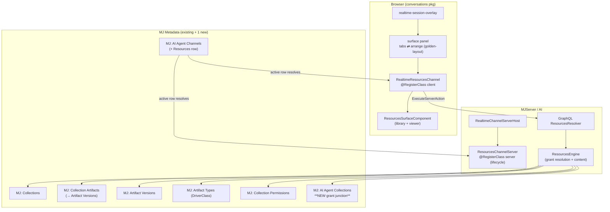

# Realtime "Resources" Channel + Multi-Channel Golden-Layout UX — Design Proposal

> Status: **Design proposal (no production code).** Branch `realtime-meeting-bridge`.
> Author: research + design pass, 2026-06.
> Scope: a new realtime co-agent **Resources** channel built on MJ's existing top-level
> Artifacts + Collections model, plus an evolution of the realtime widget to a
> user-arrangeable **multi-channel** layout (golden-layout), with a clean default for
> basic users.

---

## 0. TL;DR

1. **Artifacts and Collections are already top-level, Environment-scoped entities** in MJ
   (`MJ: Artifacts`, `MJ: Artifact Versions`, `MJ: Collections`, junction `MJ: Collection
   Artifacts`). They are **not** conversation-scoped. The deprecated `MJ: Conversation
   Artifact*` family is the old, conversation-scoped system and we build on **none** of it.
   → We can build the Resources channel almost entirely on what exists.

2. The **Resources channel** is a new interactive channel that fits the *exact* same plugin
   pattern as Whiteboard and Remote Browser: a `BaseRealtimeChannelClient` subclass + a
   `BaseRealtimeChannelServer` subclass + one `MJ: AI Agent Channels` metadata row + a
   surface component + a small set of agent-facing tools (`resources_list`,
   `resources_present`, `resources_next`/`resources_prev`, `resources_search`,
   `resources_focus_region`). The agent's allowed scope is **one or more Collections**.

3. We need **one small new construct** to scope an agent to specific collections: a junction
   entity **`MJ: AI Agent Collections`** (agent ↔ collection grant, with a read-only
   delivery flag), plus an optional per-session override (the **`ConfigSchema`** column the
   channel row already supports). Everything else reuses existing entities and the existing
   `MJ: Collection Permissions` for governance.

4. The **multi-channel UX** keeps today's clean single-tab default for basic users, and adds
   an **opt-in** golden-layout "arrange mode" for power users — reusing the same
   golden-layout VirtualLayout pattern the dashboards already use. Layout persists per-user
   via `UserInfoEngine` (never localStorage), keyed `mj.realtimeVoice.surfaceLayout.v1`.

---

## 1. Confirming the entity model (the foundation)

All entities live in the `__mj` schema. Source of truth:
`packages/MJCoreEntities/src/generated/entity_subclasses.ts`.

### 1.1 Artifacts — TOP-LEVEL, standalone

| Entity name | Class | Standalone? |
|---|---|---|
| **`MJ: Artifacts`** | `MJArtifactEntity` (line ~53453) | **Yes.** No `ConversationID`. Scoped to `EnvironmentID`. |
| **`MJ: Artifact Versions`** | `MJArtifactVersionEntity` (~53159) | Child of an artifact; holds the actual content. |
| **`MJ: Artifact Types`** | `MJArtifactTypeEntity` (~52604) | Type/category system; self-nesting via `ParentID`; carries `DriverClass` (viewer plugin), `Icon`, `ContentType` (MIME). |
| **`MJ: Artifact Permissions`** | `MJArtifactPermissionEntity` (~52416) | Per-user sharing (`CanRead`/`CanEdit`/`CanDelete`/`CanShare`). |
| **`MJ: Artifact Version Attributes`** | `MJArtifactVersionAttributeEntity` | Extracted attribute cache. |

Key `MJ: Artifacts` fields: `ID`, `EnvironmentID` (FK → Environments, default
`F51358F3-9447-4176-B313-BF8025FD8D09`), `Name`, `Description`, `TypeID` (FK → Artifact
Types), `UserID` (owner), `Visibility` (`'Always' | 'System Only'`).

Key `MJ: Artifact Versions` fields (this is where **content lives**): `ArtifactID`,
`VersionNumber`, `Content` (nvarchar MAX text), `Configuration` (JSON), `ContentMode`
(`'File' | 'Text'`), `FileID` (FK → `MJ: Files` when `ContentMode='File'`), `MimeType`,
`FileName`, `ContentSizeBytes`, `ContentHash`, `ForceToolsOnly`. The artifact row itself
holds **no** content — every render targets a **version**.

> Implication for the channel: a "resource" presented during a call is an **artifact
> version** (so a presented slide deck pins to the exact version the agent was granted),
> rendered by the viewer the artifact's `TypeID` → `DriverClass` already designates. Images,
> PDFs and binary docs are `ContentMode='File'` (`FileID` → `MJ: Files`); markdown/HTML/code
> are `ContentMode='Text'` (`Content`).

### 1.2 Collections — TOP-LEVEL, standalone, nestable

| Entity name | Class | Standalone? |
|---|---|---|
| **`MJ: Collections`** | `MJCollectionEntity` (~54961) | **Yes.** No `ConversationID`. Scoped to `EnvironmentID`. Self-nesting via `ParentID`. Has `Name`, `Description`, `Icon`, `Color`, `Sequence`. |
| **`MJ: Collection Artifacts`** | `MJCollectionArtifactEntity` (~54649) | **Junction** Collection ↔ Artifact **Version**. Fields: `CollectionID`, `ArtifactVersionID` (note: version, not artifact), `Sequence` (ordering within the collection). |
| **`MJ: Collection Permissions`** | `MJCollectionPermissionEntity` (~54773) | Per-user sharing (`CanRead`/`CanShare`/`CanEdit`/`CanDelete`). |

So Collection ↔ Artifact is **many-to-many through `MJ: Collection Artifacts`**, and the
junction targets a **specific artifact version** (the model deliberately stores
version-pinned membership "to enable proper version tracking"). Collections nest into folder
trees via `ParentID`.

### 1.3 Conversation linkage (optional, not required)

`MJ: Conversation Detail Artifacts` (`MJConversationDetailArtifactEntity`, ~62499) is a
junction between a conversation **message** (`ConversationDetailID`) and an **artifact
version** (`ArtifactVersionID`), with a `Direction` (`'Input' | 'Output'`). This is how a
top-level artifact optionally attaches to a chat turn. The Resources channel can use this to
record *"the agent presented resource X at this point in the call"* (see §4.4), but the
artifacts and collections themselves remain independent.

### 1.4 What we DO NOT touch

The `MJ: Conversation Artifact*` family (`MJ: Conversation Artifacts`,
`MJ: Conversation Artifact Versions`, `MJ: Conversation Artifact Permissions`,
`MJ: Conversation Detail Attachments`) is **deprecated** (emits console warnings, slated for
removal) and is the older, conversation-SCOPED system. The Resources channel builds on the
**new** top-level system only.

**Bottom line: the user's ~99% recollection is correct.** Artifacts and Collections are
top-level, standalone, Environment-scoped entities. The Resources channel is mostly an
*assembly* of existing parts, with one small new grant junction.

---

## 2. The realtime channel plugin pattern (what we're slotting into)

A channel has **two halves** resolved from a **single registry row** (`MJ: AI Agent
Channels`), exactly mirroring how the realtime model drivers resolve:

- **Client half** — `BaseRealtimeChannelClient<TSurface>`
  (`packages/Angular/Generic/conversations/src/lib/components/realtime/channels/base-realtime-channel-client.ts`).
  Owns the agent-facing tools (`GetToolDefinitions` + `ApplyAgentTool`), the perception feed,
  the optional Angular surface (`GetSurfaceComponent` + `BindSurface`), and optional persisted
  state (`SerializeState`/`RestoreState`). Resolved via
  `@RegisterClass(BaseRealtimeChannelClient, '<ClientPluginClass>')`.

- **Server half** — `BaseRealtimeChannelServer`
  (`packages/AI/Core/src/generic/baseRealtimeChannelServer.ts`, in `@memberjunction/ai`).
  Durable session lifecycle (`OnSessionStarted`, `OnChannelStateSave`, `OnSessionClosed`) and
  optional server-executed tools. Resolved via
  `@RegisterClass(BaseRealtimeChannelServer, '<ServerPluginClass>')`.

- **Registry row** — `MJ: AI Agent Channels` (table `AIAgentChannel`; migration
  `migrations/v5/V202606121723__v5.41.x__AI_Agent_Sessions_Channels.sql`). Columns: `Name`
  (unique), `Description`, `ServerPluginClass`, `ClientPluginClass`, `TransportType`
  (`'PubSub' | 'WebRTC' | 'WebSocket'`), `ConfigSchema` (nullable JSON), `IsActive`. Seeded
  via mj-sync at `metadata/ai-agent-channels/.ai-agent-channels.json` — **never** SQL inserts.

The **context object** the host hands the client plugin (`RealtimeChannelContext`) already
gives us *everything the Resources channel needs* without inventing new plumbing:

- `SendContextNote(text)` — perception feed (tell the model what's on screen).
- `RequestSpokenResponse?(instructions)` — ask the agent to react audibly.
- `SetFocusMode(on)` — let the surface own the screen.
- `SaveAsArtifact(name, contentJson)` — already wired to `MJ: Artifacts` + version.
- `AgentSessionID` — the live `MJ: AI Agent Sessions` id (for server-backed tools).
- `ExecuteServerAction<T>(query, variables)` — the GraphQL escape hatch the Remote Browser
  channel uses; the Resources channel uses it the same way to load collection/artifact
  content through an authenticated, session-scoped resolver.

The overlay shell auto-discovers channels: `RealtimeSessionService.startChannels()`
aggregates every active plugin's tools into the session mint; the overlay subscribes
`ActiveChannels$` and registers one surface tab per plugin that `HasSurface()`. **The shells
carry zero channel-specific wiring** — adding the Resources channel requires no edits to the
overlay or session service.

The reference channels:
- **Whiteboard** (`.../realtime/whiteboard/whiteboard-channel.ts`,
  `@RegisterClass(BaseRealtimeChannelClient, 'RealtimeWhiteboardChannel')`) — pure client-side
  state; server half is a state-of-record guard.
- **Remote Browser** (`.../realtime/remote-browser/remote-browser-channel.ts`,
  `@RegisterClass(BaseRealtimeChannelClient, 'RealtimeRemoteBrowserChannel')`) — **client-direct
  tools that relay to a server resource** via `Context.ExecuteServerAction(...)`. This is the
  closest analog for Resources (we relay to a server resolver that reads MJ collections/artifacts
  the browser can't see directly, and that enforces the grant).

---

## 3. The new grant: scoping an agent to allowed Collections

### 3.1 Requirement

A user defines collection(s) of artifacts an agent is **allowed to access**, and during a
live call the agent may present only those resources. Nothing in the current model expresses
"this agent may present these collections."

### 3.2 Recommended approach — a new junction entity `MJ: AI Agent Collections`

This mirrors the existing pattern `MJ: AI Agent Artifact Types` (an agent ↔ artifact-type
junction already in the schema, line ~31856) and the agent-pairing junction this branch just
added. It is the cleanest MJ-convention fit: a many-to-many grant table.

**New migration** (highest `migrations/v5/` folder, naming
`VYYYYMMDDHHMM__v5.4x.x__AI_Agent_Collections_Grant.sql`):

```sql
CREATE TABLE ${flyway:defaultSchema}.AIAgentCollection (
    ID UNIQUEIDENTIFIER NOT NULL DEFAULT NEWSEQUENTIALID(),
    AgentID UNIQUEIDENTIFIER NOT NULL,
    CollectionID UNIQUEIDENTIFIER NOT NULL,
    -- presentation scope
    AccessMode NVARCHAR(20) NOT NULL DEFAULT 'Present',   -- 'Present' | 'Reference'
    Sequence INT NULL,                                    -- default ordering of collections for the agent
    IsActive BIT NOT NULL DEFAULT 1,
    CONSTRAINT PK_AIAgentCollection PRIMARY KEY (ID),
    CONSTRAINT FK_AIAgentCollection_Agent
        FOREIGN KEY (AgentID) REFERENCES ${flyway:defaultSchema}.AIAgent(ID),
    CONSTRAINT FK_AIAgentCollection_Collection
        FOREIGN KEY (CollectionID) REFERENCES ${flyway:defaultSchema}.Collection(ID),
    CONSTRAINT UQ_AIAgentCollection UNIQUE (AgentID, CollectionID)
);
-- + sp_addextendedproperty for AccessMode, Sequence, IsActive (per migration rules)
-- CodeGen adds __mj timestamps + FK indexes — do NOT add them here.
```

- `AccessMode`: `'Present'` = the agent may actively display these on the Resources surface;
  `'Reference'` = the agent may read/cite content but not auto-display (useful for
  knowledge-only collections). v1 may ship `'Present'` only and add `'Reference'` later.
- `Sequence`: default collection ordering when the agent has several grants.
- We deliberately **do not** add an agent-scoped artifact-level grant table — collection
  membership (`MJ: Collection Artifacts`) is the unit of grant. If a user wants a single
  artifact available, they put it in a (possibly single-item) collection. This keeps the
  grant surface small and matches the "libraries/collections" framing in the brief.

After the migration: run CodeGen → it generates `MJAIAgentCollectionEntity`, the view, CRUD
procs, and the Angular form. **Only then** do we write TypeScript referencing the strongly
typed entity (per the no-`.Get()`/`.Set()` rule).

### 3.3 Per-session override (no new entity)

For *ad-hoc* "let the agent also show this collection just for this call," reuse the channel
row's existing **`ConfigSchema`** column + per-session config (the same mechanism this branch
added for `TypeConfiguration`). The Resources channel publishes a `ConfigSchema` like:

```jsonc
{
  "type": "object",
  "properties": {
    "AllowedCollectionIDs": { "type": "array", "items": { "type": "string", "format": "uuid" } },
    "DefaultCollectionID":  { "type": "string", "format": "uuid" },
    "AutoPresentFirst":     { "type": "boolean", "default": false }
  }
}
```

The **effective allowed set** at session start = (grants in `MJ: AI Agent Collections` for the
agent, `IsActive=1`) ∪ (per-session `AllowedCollectionIDs` override), then **intersected with
the caller's `MJ: Collection Permissions` `CanRead`** (defense-in-depth — an agent can never
present a collection the acting user can't read). This resolution lives **server-side** in
the Resources channel resolver/engine (see §4.3), never trusted from the client.

### 3.4 Why not reuse an existing mechanism instead of a new junction?

- **`MJ: Collection Permissions`** scopes a *user*, not an *agent*. An agent is not a user
  row in the general case (it runs under the session's acting user). Permissions stay as the
  governance gate; the grant junction expresses *intent* ("this agent's repertoire").
- **`MJ: AI Agent Artifact Types`** scopes by *type*, not by *specific content* — too coarse
  ("any document" vs. "these 12 onboarding slides").
- A junction is the established MJ convention for agent↔X grants and gives CodeGen'd typing,
  a form, and metadata-sync seedability for free.

---

## 4. The Resources channel — concrete design

### 4.1 Files (mirrors whiteboard/ and remote-browser/)

```
packages/Angular/Generic/conversations/src/lib/components/realtime/resources/
  resources-channel.ts            # BaseRealtimeChannelClient subclass + LoadRealtimeResourcesChannel()
  resources-tools.ts              # tool-name constants, RESOURCES_TOOL_DEFINITIONS, pure MapToolToAction
  resources-surface.component.ts  # the Angular surface (library browser + active-resource viewer)
  resources-state.ts              # framework-free state engine (active resource, deck, cursor) — unit-testable
```

Server half — because Resources reads MJ data the browser shouldn't load wholesale and must
enforce the grant, the server logic lives in a **server package** with a thin GraphQL
resolver (Transport-Layer guide pattern), and the channel server plugin is lifecycle-only:

```
packages/AI/RealtimeResources/  (new package, or fold into an existing server channel pkg)
  src/resources-channel-server.ts        # BaseRealtimeChannelServer subclass (lifecycle guard)
  src/resources-engine.ts                # framework-agnostic: resolve allowed set, list, fetch version content
  src/resources-resolver.ts              # thin TypeGraphQL resolver over the engine (per-request user)
```

### 4.2 Client plugin (`resources-channel.ts`) — key members

```typescript
@RegisterClass(BaseRealtimeChannelClient, 'RealtimeResourcesChannel')
export class RealtimeResourcesChannel extends BaseRealtimeChannelClient<ResourcesSurfaceComponent> {
  get ChannelName()    { return 'Resources'; }            // must match the registry row Name
  get ToolNamePrefix() { return 'resources_'; }
  get TabTitle()       { return 'Resources'; }
  get TabIcon()        { return 'fa-solid fa-photo-film'; }

  GetToolDefinitions(): RealtimeToolDefinition[] { return RESOURCES_TOOL_DEFINITIONS; }

  async ApplyAgentTool(name: string, argsJson: string): Promise<string> {
    // 1. parse args  2. map to a ResourcesAction (pure, in resources-tools.ts)
    // 3. for data ops, relay via this.Context.ExecuteServerAction(gql, vars) — server enforces the grant
    // 4. update the client state engine (works with NO surface bound)
    // 5. push a perception note: this.Context.SendContextNote('Now showing slide 3 of "Q3 Deck": ...')
    // 6. return { success, ... } JSON for the model
  }

  GetSurfaceComponent() { return ResourcesSurfaceComponent; }
  BindSurface(s: ResourcesSurfaceComponent) { /* wire state engine + outputs (user clicks a resource → narrate) */ }

  GetOnboardingDetails(): ChannelOnboardingDetails {
    return {
      Heading: 'Resources',
      Description: 'The agent can pull documents, slides, images and videos from its allowed libraries and show them here while it talks.',
      Tips: ['Ask "show me the pricing deck"', 'You can browse the library yourself on the left', 'The agent sees what you have open'],
      IconClass: 'fa-solid fa-photo-film'
    };
  }

  SerializeState(): string | null { /* active collection + version id + cursor — so review/resume rehydrates */ }
  RestoreState(json: string): boolean { /* tolerant restore */ }
}
export function LoadRealtimeResourcesChannel() { /* defeat tree-shaking */ }
```

**Important invariants (from the base class):** `ApplyAgentTool` must work with **no surface
bound** (apply to the state engine, skip the UI garnish); tools return `{success,error}` JSON
and never throw; `RestoreState` is tolerant (returns `false`, never throws).

### 4.3 Server engine + resolver (the grant enforcement point)

`resources-engine.ts` (framework-agnostic, per the Transport-Layer guide) exposes:

- `ResolveAllowedCollections(agentID, sessionConfig, user) → CollectionInfo[]`
  = grants (`MJ: AI Agent Collections`, active) ∪ session override, **∩** the user's
  `CanRead` collections (via `MJ: Collection Permissions`, plus owner/environment defaults).
- `ListResources(collectionID, user) → ResourceItem[]`
  reads `MJ: Collection Artifacts` (ordered by `Sequence`) joined to `MJ: Artifact Versions`
  + `MJ: Artifacts` + `MJ: Artifact Types` → returns `{ artifactVersionID, name, mimeType,
  typeIcon, driverClass, contentMode, thumbnailRef }`. **Never** returns a version outside an
  allowed collection.
- `GetResourceContent(artifactVersionID, user) → { contentMode, content?, fileUrl?, mimeType }`
  — re-checks membership in an allowed collection before returning content; for `File` mode
  returns a short-lived signed URL to `MJ: Files`, for `Text` mode returns the text.

`resources-resolver.ts` is a thin TypeGraphQL `ResolverBase` exposing
`ResourcesAllowedCollections`, `ResourcesList`, `ResourcesContent`, each taking
`agentSessionID` and using the per-request user. The client plugin calls these through
`Context.ExecuteServerAction(query, { agentSessionID, ... })`.

`resources-channel-server.ts` (`@RegisterClass(BaseRealtimeChannelServer,
'ResourcesChannelServer')`) is **lifecycle-only**: `OnChannelStateSave` validates/normalizes
the persisted "what was shown" snapshot; `OnSessionClosed` can optionally write a
`MJ: Conversation Detail Artifacts` row per presented resource (the "shown during this call"
trail, §4.4). It exposes **no server tools** (all tools are client-executed → relayed).

### 4.4 The agent-facing tools

| Tool | Args | Effect |
|---|---|---|
| `resources_list_collections` | — | Returns the agent's allowed collections (name, count, icon). Model uses this to know its repertoire. |
| `resources_list` | `collectionID?` | Lists resources in a collection (name, type, id). Defaults to the agent's default collection. |
| `resources_search` | `query`, `collectionID?` | Ranked search across allowed collections (name/description; later: artifact attributes / embeddings). |
| `resources_present` | `artifactVersionID` | Loads + displays the resource on the surface; pushes a perception note describing it; auto-requests focus mode if configured. |
| `resources_next` / `resources_prev` | — | Move through the current collection (deck/slide flow). |
| `resources_focus_region` | `region` or `page`/`anchor` | Scroll/zoom/highlight a region or jump to a page/heading of the active resource (so "look at the chart on page 3" actually moves the view). |
| `resources_clear` | — | Clears the surface (stop presenting). |

Each tool definition is a `RealtimeToolDefinition` (`Name`, `Description`, `ParametersSchema`)
in `resources-tools.ts`, aggregated into the session mint exactly like the Remote Browser
tools. Mapping tool→action is a **pure** function (unit-testable) per the Remote Browser
precedent.

### 4.5 The surface component

`resources-surface.component.ts` renders two regions (collapsible split):

1. **Library browser (left rail)** — the allowed collections as folders (nestable, using
   `MJ: Collections.ParentID`), each expanding to its ordered resources with type icons and
   thumbnails. The user can browse and click to present (which flows back to the plugin →
   narrate via `RequestSpokenResponse`). Honors `MJ: Collections.Icon`/`Color`.
2. **Active-resource viewer (main)** — renders the presented artifact version using the
   viewer designated by its `MJ: Artifact Types.DriverClass` (reusing MJ's artifact viewer
   plumbing — markdown/HTML/code/image/PDF/video). A page/slide strip and prev/next controls
   sit under it; an agent "presence" badge shows when the agent (vs. the user) drove the
   current view.

The component is a Generic component (no Router import); it accepts `Provider` and threads
`ProviderToUse` per the multi-provider Angular rule.

### 4.6 Metadata seed row

Append to `metadata/ai-agent-channels/.ai-agent-channels.json` (omit `primaryKey`/`sync`):

```json
{
  "fields": {
    "Name": "Resources",
    "Description": "Lets the agent present documents, slides, images and videos from its allowed collections during a live call.",
    "ServerPluginClass": "ResourcesChannelServer",
    "ClientPluginClass": "RealtimeResourcesChannel",
    "TransportType": "PubSub",
    "ConfigSchema": "@file:schemas/resources-channel.config.schema.json",
    "IsActive": true
  }
}
```

Push: `npx mj sync push --dir=metadata --include="ai-agent-channels"`.

### 4.7 Tree-shaking Load calls

- Client: add `LoadRealtimeResourcesChannel()` to `conversations.module.ts` (beside the
  existing `LoadRealtimeWhiteboardChannel()` / `LoadRealtimeRemoteBrowserChannel()`).
- Server: add `LoadResourcesChannelServer()` to `packages/MJServer/src/agentSessions/index.ts`
  and register the resolver where Remote Browser's resolvers are registered.

**No host/overlay/session-service edits.** The model gets the new tools automatically, the
overlay gets the surface tab automatically, the server gets the lifecycle hooks
automatically.

### 4.8 Walkthrough A — external sales agent

1. Admin creates a Collection "Acme Sales Kit" (`MJ: Collections`), adds the pitch deck,
   one-pager PDF, and a demo video (each an `MJ: Artifact` + version, joined via
   `MJ: Collection Artifacts`). Grants the "Acme Sales Co-Agent" the collection via a
   `MJ: AI Agent Collections` row (`AccessMode='Present'`).
2. A prospect joins a magic-link external voice session fronting that agent. Resources channel
   resolves: allowed = {Acme Sales Kit} ∩ the external user's `CanRead` (the external scenario
   grants read on this collection — see Magic Link guide).
3. Prospect: "Can you walk me through pricing?" → model calls `resources_search("pricing")` →
   `resources_present(<pricing-onepager version>)`. The surface shows the PDF; the agent says
   "Here's our pricing — three tiers…" while `resources_focus_region({page:1, anchor:'Tiers'})`
   scrolls to the table. The prospect can also flip the library open and click the demo video;
   the agent reacts (`RequestSpokenResponse("the user opened the demo video")`).
4. Simultaneously the **Whiteboard** channel is open in another pane — the agent sketches an
   ROI calc next to the deck (multi-channel layout, §5). On call end, the server writes a
   `MJ: Conversation Detail Artifacts` trail of what was shown.

### 4.9 Walkthrough B — tutor agent

1. Instructor builds Collection "Photosynthesis 101" (diagram image, a slide set, a short
   video). Grants the "Bio Tutor" agent.
2. Student: "I don't get the light reactions." → `resources_present(<diagram>)` +
   `resources_focus_region('thylakoid')` highlights the membrane while the tutor explains.
   → `resources_next()` advances to the slide that summarizes it.
3. The tutor opens the **Remote Browser** channel in a second pane to pull a live simulation,
   then returns to the Resources pane to compare — all three surfaces visible at once via the
   power-user layout.

---

## 5. Multi-channel UX — golden-layout, with a clean default

### 5.1 The problem with today's model (and what to keep)

Today the surface panel (`realtime-surface-tabs.component`) shows **one active tab at a time**
(`RealtimeSurfaceTabsModel.ActiveKey`), with channel tabs leading, artifact tabs next, and
Activity pinned last. This is great for basic users and on small screens. We must **not**
regress that simplicity. The evolution adds *optional* simultaneous multi-pane viewing for
power users and large screens.

### 5.2 Two modes, one model

Introduce a **layout mode** on the surface panel:

- **`tabs` (default)** — exactly today's behavior. Single active tab, no golden-layout, no
  drag handles. Basic users never see complexity. This is the default for everyone and the
  forced mode below a width breakpoint (e.g. < 900px surface width) and on touch.
- **`arrange` (opt-in)** — a golden-layout `VirtualLayout` hosts the same tab *kinds*
  (channel / artifact / activity) as draggable, splittable, stackable panes. A single
  "Arrange" toggle in the surface-panel header switches modes; an "↺ Reset layout" affordance
  returns to a sensible auto layout.

Crucially, **the channel plugins and surface components don't change** between modes — the
same `RealtimeChannelPaneComponent` that hosts a plugin's surface in a tab also hosts it in a
golden-layout pane. Mode only changes the *container*, not the panes.

### 5.3 Reuse the dashboards' golden-layout wrapper

MJ already uses golden-layout `^2.6.0` (VirtualLayout API) in three places; the cleanest
reuse is the **`GoldenLayoutWrapperService`** pattern from
`packages/Angular/Generic/dashboard-viewer/src/lib/services/golden-layout-wrapper.service.ts`:

- `VirtualLayout` with `bindComponentEventListener` / `unbindComponentEventListener`
  (no `registerComponent`); `container.state` carries the pane descriptor.
- `resizeWithContainerAutomatically = true`; subscribe `'stateChanged'` to persist.
- Save via the native `layout.saveLayout()` (`ResolvedLayoutConfig`); restore via
  `LayoutConfig.fromResolved(saved)` after structural validation.

For the realtime surface we add a small **`RealtimeSurfaceLayoutService`** that wraps a
`VirtualLayout` and registers one component type, `realtime-surface-pane`, whose
`componentState` is `{ Kind: 'channel'|'artifact'|'activity', Key: string }`. On `bind`, it
creates the same per-kind body the tabs panel renders (a `RealtimeChannelPaneComponent` for
channel panes, the artifact viewer for artifact panes, the activity rail for the activity
pane), resolving the live plugin from `RealtimeSessionService.ActiveChannels$` by `Key`.
**Panes mount/unmount on golden-layout bind/unbind** — so a channel surface is created when
its pane appears and destroyed when removed, exactly the lifecycle the plugin already expects
(`BindSurface`/`UnbindSurface`).

### 5.4 Default ("auto") arrangements — never a blank canvas

When a user first enters `arrange` mode (or hits Reset), we don't dump them into an empty
grid. We compute an **auto layout** from what's live:

- 1 channel + activity → channel pane (large) beside a slim activity rail.
- 2 channels (e.g. Resources + Whiteboard) → side-by-side split, activity as a stacked tab in
  the smaller column.
- 3+ surfaces → a primary pane + a stacked secondary column (golden-layout `stack`), with the
  user free to drag any into its own split.

This "auto" config is generated, not stored, so it always reflects the current channel set —
mirroring the dashboard-viewer rule of never restoring an empty layout.

### 5.5 Persistence (UserInfoEngine, per CLAUDE.md)

Per the project rule, layout prefs go through `UserInfoEngine`, **never** localStorage. Keys:

| Key | Value |
|---|---|
| `mj.realtimeVoice.surfaceLayoutMode.v1` | `"tabs"` \| `"arrange"` (the user's chosen mode) |
| `mj.realtimeVoice.surfaceLayout.v1` | JSON `{ "<channelSetFingerprint>": <ResolvedLayoutConfig> }` — the saved arrangement, keyed by a fingerprint of the present channel kinds so a saved 3-pane layout doesn't get force-fit onto a 1-channel session |

Written via `SetSettingDebounced` (golden-layout `stateChanged` fires on every drag — debounce
is essential), read synchronously via `GetSetting` at session start. The `v1` suffix lets the
shape evolve. This sits beside the existing realtime keys already in the codebase
(`mj.realtimeVoice.captions.v1`, `mj.realtimeVoice.surfacePanel.v1`,
`mj.realtimeChannels.onboardingSeen.v1`).

### 5.6 Interaction with the existing single-tab model & back-compat

- The surface panel keeps `RealtimeSurfaceTabsModel` as the **source of truth for which
  surfaces exist** (channel/artifact/activity registration is unchanged). `arrange` mode reads
  the same registrations; it's a different *renderer* over the same model.
- All the existing niceties survive in `tabs` mode untouched: auto-reveal a channel on first
  agent activity, the unseen glow, onboarding panels, the review→live whiteboard-tab cleanup
  (`ShouldRemoveReviewWhiteboardTab`).
- In `arrange` mode, "auto-reveal on first activity" becomes "auto-add a pane for the channel
  if it isn't already laid out" (and flash it), so the agent acting on a not-yet-placed
  channel still surfaces it.
- Default mode is `tabs` for all existing users → **zero behavior change on upgrade**. Power
  users opt in; their choice persists per-user/per-device-independent.

### 5.7 ASCII — the two modes

```
 tabs (default)                          arrange (opt-in, power users / wide screens)
┌───────────────────────────┐          ┌───────────────────────────────────────────┐
│ [Resources][WB][Browser][Activity]   │ ┌── Resources ──────┐ ┌── Whiteboard ────┐ │
│ ───────────────────────── │          │ │  (slide / doc)    │ │  (sketch)        │ │
│                           │          │ │                   │ │                  │ │
│   active pane (one)       │          │ └───────────────────┘ └──────────────────┘ │
│                           │          │ ┌── Browser ────────┐ ┌── Activity ──────┐ │
│                           │          │ │  (live page)      │ │  (transcript)    │ │
└───────────────────────────┘          │ └───────────────────┘ └──────────────────┘ │
   single ActiveKey                     │   drag handles · split · stack · reset      │
                                        └───────────────────────────────────────────┘
```

---

## 6. Architecture diagram (mermaid)



---

## 7. Phasing, effort, risks

### 7.1 Phasing

**Phase 1 — Resources channel core (v1).**
- Migration: `MJ: AI Agent Collections` grant junction (+ CodeGen).
- Server: `ResourcesEngine` (grant resolution + list + content) + resolver + lifecycle server
  plugin.
- Client: `RealtimeResourcesChannel` + `resources-tools` (`list_collections`, `list`,
  `present`, `next`/`prev`, `clear`) + `ResourcesSurfaceComponent` (library browser + viewer
  reusing artifact `DriverClass` viewers).
- Metadata: Resources channel row + ConfigSchema; agent-grant form (CodeGen'd).
- Tabs-mode only (no golden-layout yet) — Resources is just one more tab.
- *Effort: ~M (2–3 wk).* Most risk is the viewer reuse + grant resolution.

**Phase 2 — search + focus + presence polish.**
- `resources_search` (name/desc first; embeddings later), `resources_focus_region`
  (page/anchor/region), agent-vs-user presence on the viewer, "shown during call" trail via
  `MJ: Conversation Detail Artifacts`, `AccessMode='Reference'`.
- *Effort: ~S–M (1–2 wk).*

**Phase 3 — multi-channel golden-layout UX.**
- `RealtimeSurfaceLayoutService` (VirtualLayout wrapper), `arrange` mode toggle, auto-layout
  generation, per-user persistence via `UserInfoEngine`, mode/breakpoint gating, auto-add-pane
  on activity.
- *Effort: ~M (2–3 wk).* Independent of Phases 1–2; could ship before or after.

**Phase 4 (later).**
- Collection thumbnails/previews, drag-from-library to whiteboard, multi-resource compare in
  one pane, per-resource annotations saved back as artifacts, embeddings-ranked
  `resources_search`.

### 7.2 Risks / open questions

- **Viewer breadth.** Reusing `MJ: Artifact Types.DriverClass` viewers for present-mode is the
  right call, but not every type may have a polished read-only viewer (esp. video/large PDF).
  *Open:* inventory existing artifact viewers and gaps before Phase 1.
- **Content delivery for File-mode artifacts.** Need short-lived signed URLs from `MJ: Files`
  for external (magic-link) sessions; confirm the file delivery path supports scoped, expiring
  access. *Open.*
- **Grant vs. permission precedence.** Confirmed approach: grant expresses intent, permission
  is the hard gate (always intersect with `CanRead`). Needs a server unit test asserting an
  agent can't present a non-readable collection even if granted.
- **golden-layout in a generic package.** The dashboards' golden-layout lives in
  `dashboard-viewer` (Generic) and `base-application` (Explorer). The realtime surface is in
  the Generic `conversations` package — verify golden-layout can be a dependency there without
  pulling Explorer/Router (it can; golden-layout is framework-agnostic, and the existing
  Generic `dashboard-viewer` already depends on it).
- **Fingerprinted layout persistence.** Keying saved layouts by channel-set fingerprint avoids
  force-fitting; need a stable, order-independent fingerprint (sorted channel kinds).
- **Per-session override trust.** The `ConfigSchema` override must still be intersected with
  permissions server-side — never let a client widen its own allowed set.

---

## 8. Why this is the right MJ-shaped design

- **Builds on existing top-level entities** (Artifacts/Collections) — confirmed standalone,
  not conversation-scoped — so almost no new schema (one grant junction).
- **One new construct, by convention:** the agent↔collection grant mirrors the existing
  `MJ: AI Agent Artifact Types` junction and this branch's pairing junction.
- **Fits the channel plugin pattern exactly:** client + server halves, one metadata row,
  ClassFactory resolution, client-direct tools relaying to a server resolver via the existing
  `ExecuteServerAction` — identical to Remote Browser. **Zero host edits.**
- **Capability/permission-gated:** grant ∩ `CanRead`, enforced server-side; per-session
  override via the existing `ConfigSchema` mechanism.
- **Multi-channel UX reuses the dashboards' golden-layout** and respects the
  "don't burden basic users" constraint: `tabs` stays the default, `arrange` is opt-in, layout
  persists via `UserInfoEngine` (never localStorage).
- **Strong typing throughout:** all entity work waits for CodeGen on the new junction (no
  `.Get()`/`.Set()`).
```

