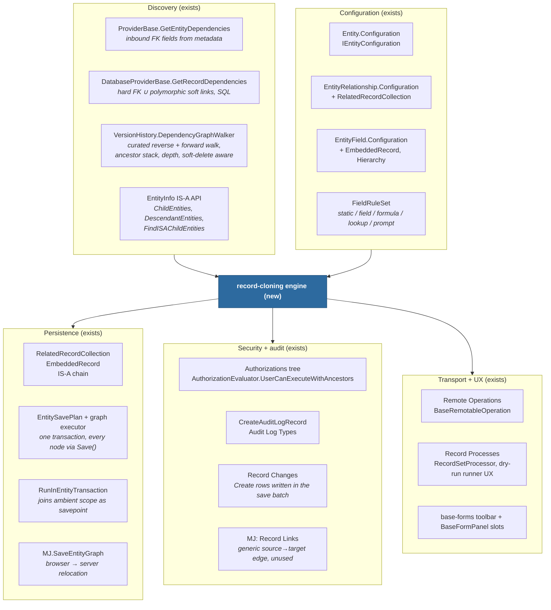
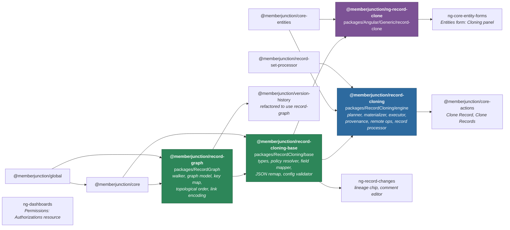
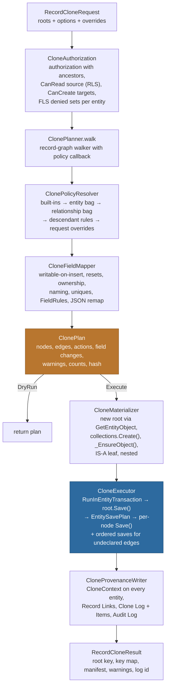
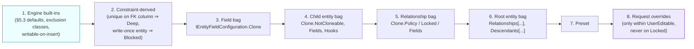
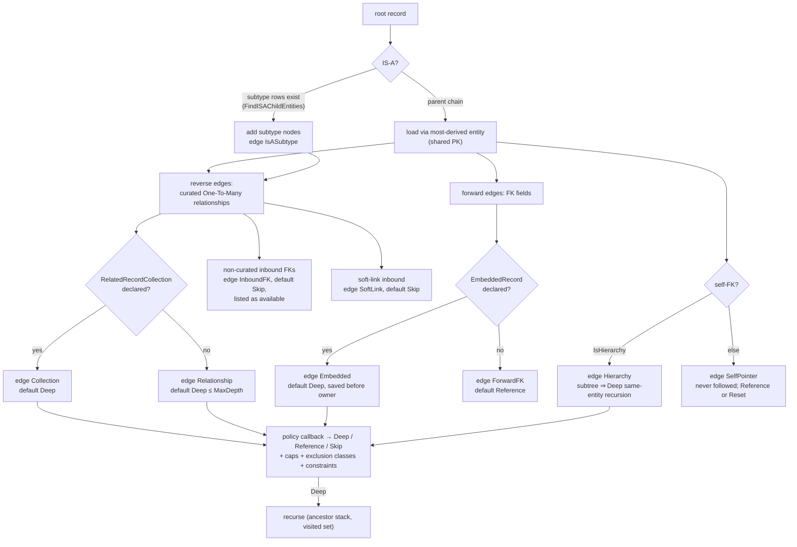
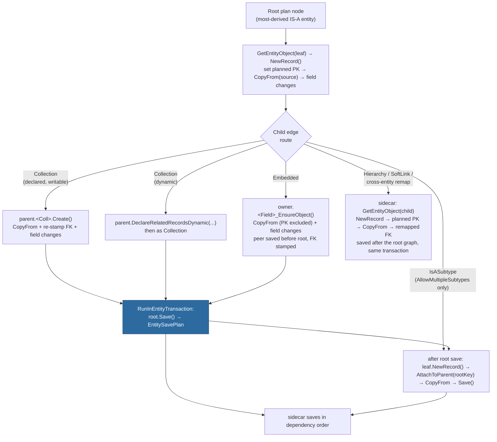
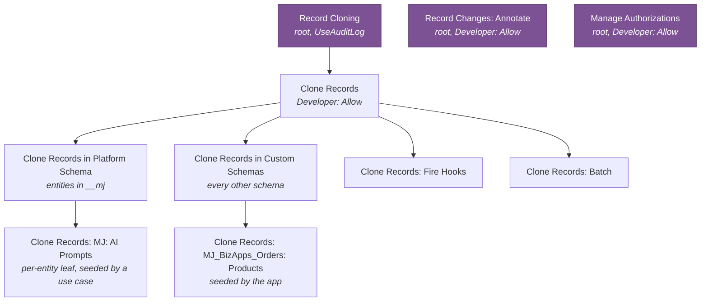
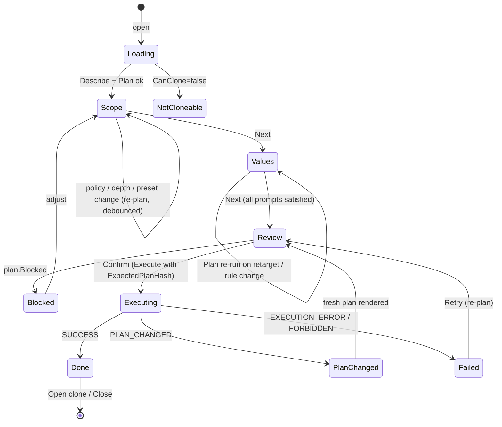
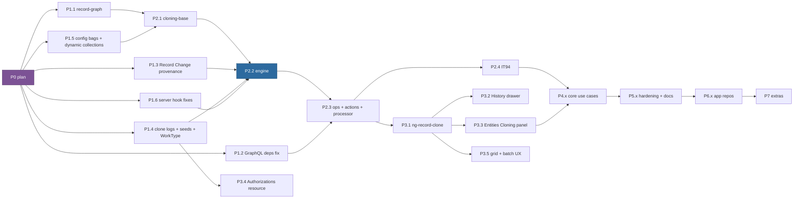

# Entity Record Cloning — Master Plan

**Branch**: `claude/entity-record-cloning-03x5g4`
**Status**: plan complete and under review; build not started. Phases and PRs are in §15
**Owner**: MJ Core
**Depends on**: Entity companions & graph save (6.2) — `RelatedRecordCollection`, `EmbeddedRecord`, `EntitySavePlan`, `MJ.SaveEntityGraph`; Version History (`DependencyGraphWalker`); Remote Operations; Record Processes; the `Configuration` JSON bags on Entity, Entity Relationship and Entity Field
**Companion document**: [`use-cases.md`](./use-cases.md) — the per-entity catalog for MJ core and every app repo, with the clone configuration each one ships

This plan is written to be executed PR by PR by a coding agent and reviewed PR by PR by a second agent. Every PR in §15 names its scope, the files it touches, the tests it must add, the docs it must update and the acceptance criteria a reviewer checks. Where a section says **decided**, the decision was taken with the product owner and is not up for re-litigation inside a PR.

---

## 0. How to read and execute this plan

1. Read §1 and §2 once. They are the why and the vocabulary.
2. §3 to §14 are the design. Each PR in §15 points back at the sections it implements. Do not implement from memory of the outline; implement from the section.
3. §15 is the spine. PRs are numbered `P<phase>.<n>`. A PR may not start until every PR it lists under *depends on* has merged to `next`.
4. Every PR carries a changeset at the level `.claude/rules/changesets.md` requires: `minor` when the PR ships a migration or touches `metadata/`, `patch` otherwise.
5. Every PR reports unit and integration results in its description, as pass/fail/skip counts, the way the root `CLAUDE.md` Definition of Done requires.
6. The use-case catalog in [`use-cases.md`](./use-cases.md) is normative for phase 4 and phase 6: the clone configuration JSON written there is what gets seeded, and the integration checks written there are what gets built.
7. Naming is fixed here so packages, entities, operations and authorizations do not drift between PRs:

| Thing | Name |
|---|---|
| Shared graph package | `@memberjunction/record-graph` at `packages/RecordGraph` |
| Client-safe clone types and pure logic | `@memberjunction/record-cloning-base` at `packages/RecordCloning/base` |
| Server engine and operations | `@memberjunction/record-cloning` at `packages/RecordCloning/engine` |
| Angular widgets | `@memberjunction/ng-record-clone` at `packages/Angular/Generic/record-clone` |
| Log entities | `MJ: Record Clone Logs`, `MJ: Record Clone Log Items` (schema `__mj`, tables `RecordCloneLog`, `RecordCloneLogItem`) |
| Record Change additions | column `ChangeContext` typed by `IRecordChangeContext`; `Source` value `Clone` |
| Remote operations | `RecordClone.Describe`, `RecordClone.Plan`, `RecordClone.Execute`, `RecordClone.GetLineage`; batch runs through `RecordProcess.RunNow` with the `Clone` work type |
| Actions | `Clone Record`, `Clone Records` |
| Record Process work type | `Clone` |
| Authorizations | `Record Cloning` (root) → `Clone Records` → `Clone Records in Platform Schema`, `Clone Records in Custom Schemas`, `Clone Records: Fire Hooks`, `Clone Records: Batch`; per-entity leaves `Clone Records: <Entity Name>`; separate roots `Record Changes: Annotate` and `Manage Authorizations` |
| Audit log type | `Record Cloned` |
| API scopes | `recordclone`, `recordclone:read`, `recordclone:execute` |
| Record Links link type | `ClonedFrom` |
| Config bag sections | `IEntityConfiguration.Clone`, `IEntityRelationshipConfiguration.Clone`, `IEntityFieldConfiguration.Clone` |
| Integration test bundle | `IT94 - Record Cloning` (bundle `record-cloning`, client transport, suite sequence 70) and `IT95 - Record Cloning Core Use Cases` (bundle `record-cloning-core-cases`, sequence 71) |

---

## 1. Vision

Any record in MemberJunction can be cloned, together with the part of its dependency graph that it owns, into a new record with new keys, with chosen values changed on the way, under one transaction, honoring every business rule the entity's classes enforce, with provenance recorded in the platform's own change history, gated by an authorization, and configured per entity by metadata so that each app ships the cloning behaviour its entities need instead of every app hand-rolling a copy routine.

Clone is merge run backwards. Merge discovers everything that points at a record, re-points it at a survivor, deletes the loser and logs it. Clone discovers the same graph, copies the owned part of it under fresh keys, re-points the copies at the new root, leaves shared references pointing at the originals and logs it. The two share their discovery machinery, their logging pattern and their gate, and they diverge only in the write.

### 1.1 Principles (decided)

| # | Principle | Consequence |
|---|---|---|
| 1 | **Metadata over code.** Which relationships are owned, which fields reset, which authorization applies, which children the server generates itself: all declared in the `Configuration` JSON bags, none in engine code. | Apps ship cloning as metadata. The engine has no entity-specific branches. |
| 2 | **Go through the entity, never around it.** Every row is created with `GetEntityObject` and persisted with `Save()`. Where an entity declares related-record collections, embedded records or an IS-A chain, the clone is materialized through those companions and persisted by one root `Save()`. | Subclass `Save`/`Validate`/`ValidateAsync` hooks, Record Changes, entity actions, cache invalidation and transaction scope all behave exactly as they do for a hand-created record. |
| 3 | **Server-side execution.** Planning may run anywhere; execution runs only on a provider that supports entity transactions. | The browser calls remote operations. The engine refuses a client provider rather than degrading to non-atomic writes. |
| 4 | **Opt-in per entity.** An entity is cloneable only when `Configuration.Clone.Enabled` is true. | Mirrors `AllowRecordMerge`, but lives in the bag, not a column. |
| 5 | **Authorization, not role names.** The gate is `Clone Records` and its scoped children, evaluated with ancestors. Nothing checks for a role called Developer. | Developers get the capability through a seeded grant. Apps widen it to business roles per entity. |
| 6 | **Provenance is first-class.** Every created row's own Create record change carries a typed context; a Record Links edge and a clone log item make lineage queryable both ways. | "Where did this come from" and "what was cloned from this" are answerable from data, not from log files. |
| 7 | **Never skip validation.** `Validate()` and `ValidateAsync()` always run. Entity Actions are suppressed by default during a clone and can be re-enabled per entity. | The Users, Roles and User Roles server classes exist to block escalation in `Validate`; a clone must not offer a way around them. |
| 8 | **Loud, not silent.** An ID that cannot be remapped is dropped and counted, never copied. A required payload that cannot be rewritten disables the row. A cap that is hit refuses the plan. Every dropped, renamed or disabled thing reaches the caller as a warning. | Copied-verbatim references are the failure the Forms engine documented and this plan inherits. |
| 9 | **Preview before write.** The plan is the dry run. It is computed without writing and it is what the UI shows and the user edits. | Same posture as the Record Process runner: dry-run, diff, confirm, apply. |
| 10 | **Retire the hand-rolled copies.** When the engine can express a copy that exists today, that copy is deleted and its tests become engine tests. | Forms, Tasks templates, User Views, Lists and Themes are named in §14. |

### 1.2 Decisions taken with the product owner

| Decision | Choice |
|---|---|
| Enablement | Opt-in via `IEntityConfiguration.Clone.Enabled`. No new Entity column. |
| Config home | `MJ: Entities.Configuration` and the sibling bags on Entity Relationship and Entity Field. Not Entity Settings. |
| Provenance | All of: a typed `ChangeContext` JSON column on Record Changes, `Source = 'Clone'`, one Record Links row per created record, and dedicated clone log tables. Record Change `Comments` stays free-text for people and gets a UI with its own authorization. |
| Record Change `Source` list | Extended with `Clone` through a migration and a CodeGen run. |
| UI gate | Authorization only. No developer-mode toggle. |
| First study case | Users, with a live integration test that runs the clone and checks the results. |
| Walker | Extracted into `@memberjunction/record-graph`; Version History is refactored to use it. |
| Entity Actions during clone | Suppressed by default; `Configuration.Clone.EntityActions` can turn them back on per entity. |
| Collections | When an entity declares related-record collections (or embedded records, or an IS-A chain), the clone MUST materialize through them and persist with one root `Save()`. Phase 4 and phase 6 add collection declarations wherever a cloneable entity owns children, so this becomes the common path. |
| Forms | The hand-rolled `FormCloneService` and `clone-remap.ts` are deleted in phase 6 and replaced by configuration; their spec files become engine acceptance tests. |

---

## 2. What exists today

The platform already owns every piece of substrate. Nothing composes them, and no generic clone exists anywhere in MJ or the seventeen app repos studied.



### 2.1 Substrate inventory

| Need | Existing piece | Location | Reuse |
|---|---|---|---|
| Inbound dependency discovery | `GetEntityDependencies` (metadata scan of `EntityFieldInfo.RelatedEntity`), `GetRecordDependencies` (hard FK `UNION ALL` soft-link SQL per dialect) | `packages/MJCore/src/generic/providerBase.ts:5472`, `databaseProviderBase.ts:868` | As-is, for the completeness listing and soft-link rows |
| Soft vs hard link encoding | `ResolveMergeLinkValue` | `databaseProviderBase.ts:914` | Lifted into record-graph as `ResolveLinkValue` |
| Curated graph walk | `DependencyGraphWalker` (reverse via `EntityRelationship` One-To-Many, forward via FK fields, ancestor stack, visited set, system-FK regex, `MaxDepth`, soft-delete filter) | `packages/VersionHistory/src/DependencyGraphWalker.ts` | Extracted and generalized (§5) |
| Cross-entity topological order | `RestoreEngine.sortByDependencyOrder` | `packages/VersionHistory/src/RestoreEngine.ts:248` | Extracted into record-graph |
| IS-A | `EntityInfo.ParentEntityInfo / ChildEntities / DescendantEntities / RootEntityInfo / AllowMultipleSubtypes`, `NewRecord()` PK adoption, `FindISAChildEntities` | `entityInfo.ts:3367-3560`, `baseEntity.ts:3880`, `databaseProviderBase.ts:705` | As-is |
| Composite persistence | `DeclareRelatedRecords`, `DeclareEmbeddedRecord`, `EntitySavePlan`, `GraphVisited`, `RunInEntityTransaction`, `MJ.SaveEntityGraph` | `packages/MJCore/src/generic/relatedRecordCollection.ts`, `entitySavePlan.ts`, `baseEntity.ts:2060-2200` | The clone's write path (§6) |
| Field copy primitives | `CopyFrom`, `NewRecord`, `IsSPParameter(false)` | `baseEntity.ts:3836`, `:3880`, `entityInfo.ts:2145` | As-is |
| Config bags | `IEntityConfiguration`, `IEntityRelationshipConfiguration`, `IEntityFieldConfiguration` | `metadata/entities/JSONType-interfaces/*.ts`, `packages/MJCore/src/generic/entityConfiguration.ts` | Extended with `Clone` sections (§4) |
| Value rules | `FieldRuleSet` and evaluator, `FieldRulesBuilderComponent` | `packages/MJGlobal/src/fieldRules/rules.ts`, `packages/Angular/Generic/entity-action-ux` | Reused for rewrites (§7) |
| Authorization | `AuthorizationInfo` tree, `AuthorizationEvaluator`, `Authorization.Check` op, `CreateAuditLogRecord` | `packages/MJCore/src/generic/securityInfo.ts:656`, `authEvaluator.ts`, `packages/MJCoreEntities/src/custom/operations/AuthorizationCheckOperation.ts` | As-is (§9) |
| Provenance channels | Record Changes (`Comments` unused by code, unprojected by field security), `RestoreContext` + `RestoreContext___` wire blob, `MJ: Record Links` | `baseEntity.ts:625, :3978-4028`, `packages/MJServer/src/generic/RestoreContextInput.ts`, `ResolverBase.ts:239-262` | Templates for `ChangeContext` and `CloneContext` (§10) |
| Remote operations | `BaseRemotableOperation`, `ExecuteRemoteOperation` resolver, progress subscription, CodeGen client shells | `packages/MJCore/src/generic/baseRemotableOperation.ts`, `packages/MJServer/src/resolvers/ExecuteRemoteOperationResolver.ts` | As-is (§11) |
| Bulk substrate | `RecordSetProcessor`, `RecordProcessExecutor`, `MJ: Record Processes`, Process Runs and Details, dry-run runner UX | `packages/RecordSetProcessor/*`, `packages/Angular/Generic/entity-action-ux` | `WorkType = 'Clone'` (§11.4) |
| Toolbar and panels | `BaseFormPanel` slots with `RegisterToolbarItem`, `mj-slide-panel`, `mj-deep-diff`, `MJNotificationService`, `FormNavigationEvent`, `RecordNavigationAdapter` | `packages/Angular/Generic/base-forms/src/lib/panel-slot/*`, `ui-components`, `deep-diff`, `base-types` | As-is (§12) |
| Record diff | `RecordComparisonEngine` | `packages/RecordComparison` | Review step |

### 2.2 Prior art and what it teaches

| Where | What it is | Verdict |
|---|---|---|
| `bizapps-forms` `FormCloneService` + `clone-remap.ts` + `form-clone-columns.spec.ts` | A hand-written deep copy of a Form: root, pages, questions, options, screens, bindings, automations; two passes (write rows building ID maps, then rewrite the JSON columns that embed IDs); drop-and-count for unmappable references; disable a binding whose required mappings cannot be rewritten; one-directional provenance; three exclusion reasons; a drift-guard spec generated from the ORM source | The behavioural reference. Entity-specific, browser-side, untransacted, saves remapped rows twice. Deleted in P6 and replaced by configuration; its specs become engine acceptance tests. |
| `bizapps-tasks` `TaskTemplateService.instantiateTemplate` | Topological parent-first creation, an old-to-new ID map, dependency rows rebuilt through the map, dates computed from offsets, role placeholders materialized | Proves the ordering and remap requirements. It creates Tasks from Task Template Items, which is a cross-entity transformation; §13.3 records it as an optional extension, not a retirement target. |
| `bizapps-marketing` `ScaleProgramAction` | A clone expressed as re-running the creation path with parameters assembled from the parent, so the copy gets a code, an approval and a score the normal way | The `CreationPath` option in the config bag (§4.2). |
| `bizapps-committees` `TermRenewalService` + wizard | A pure plan with per-row reasons, then an imperative apply that reports which step failed | The plan-then-execute shape of the engine and the UI. |
| `bizapps-sonar` `restoreVersion`, `publishLock` | Re-materializing a snapshot as a diff matched by natural key; an allowlist freeze enforced in `Save` | Root must land unlocked before children write; natural-key remap is an optional policy (§7.6). |
| MJ `User Views` duplicate, `Lists` duplicate, Themes duplicate, `DataContext.Clone` | Hand-picked column lists that drift | Retired in P4.10. |
| MJ `MergeRecords` | The inverse operation and the logging shape | Discovery reused; `Record Merge Logs` is the model for `Record Clone Logs`. |
| MJ `VersionHistory` | The only deep, graph-aware, multi-record writer in core | Its walker becomes shared; its restore ordering becomes shared. |

### 2.3 Composition axes the engine must honor

| Axis | Declared by | Key | Save order | Clone treatment |
|---|---|---|---|---|
| IS-A subtype | `Entity.ParentID` | Shared with parent | Root → leaf inside one `Save()` | Always copied with the same new key; the clone is built on the most-derived entity object; with `AllowMultipleSubtypes` every subtype row the source has is copied |
| Related-record collection | `EntityRelationship.RelatedRecordCollection` | Own | Owner first, children stamped | Copied through `collection.Create()` on the new root; nested collections recurse |
| Embedded record | `EntityField.EmbeddedRecord` | Own | Peer first, owner stamped | Copied through `<Field>_EnsureObject()` on the new root |
| Plain One-To-Many relationship (no collection) | `EntityRelationship` row | Own | Owner first | Copied by the executor in dependency order inside the same transaction scope; phase 4 and 6 convert these to declared collections wherever an entity is made cloneable |
| Non-curated inbound FK | `EntityField.RelatedEntityID` on another entity | Own | n/a | Listed in the plan as available, default Skip |
| Soft link | `EntityField.EntityIDFieldName` pair | Encoded `ID|<guid>` | n/a | Default Skip, per-entity opt-in, remapped with the soft encoding |
| Hierarchy | `EntityField.Configuration.Hierarchy.IsHierarchy` on a self-FK | Own | Parents before children | Subtree copied with parents remapped, or node only |
| Linear self-pointer | Self-FK without `IsHierarchy` | Own | n/a | Never followed; copied as Reference or reset by config |

---

## 3. Architecture

### 3.1 Packages



| Package | Tier | Depends on | Holds |
|---|---|---|---|
| `@memberjunction/record-graph` | shared | core, global | `DependencyGraphWalker` (generalized), `RecordGraph`, `GraphNode`, `GraphEdge`, `EdgeKind`, `WalkOptions`, `KeyMap`, `SortEntitiesByDependency`, `SortNodesTopologically`, `ResolveLinkValue`, `SYSTEM_FK_SKIP_PATTERNS` |
| `@memberjunction/record-cloning-base` | shared | core, global, record-graph | Every type in §3.4, `ClonePolicyResolver`, `CloneFieldMapper` (pure parts), `JsonRemapEngine`, `UniqueKeyClassifier`, `NameTemplate`, `ExclusionClasses`, `CloneConfigValidator`, `ClonePlanHash` |
| `@memberjunction/record-cloning` | server | base, core-entities, record-set-processor | `RecordCloneEngine`, `ClonePlanner`, `CloneMaterializer`, `CloneExecutor`, `CloneProvenanceWriter`, `CloneAuthorization`, `ClonePreflightRegistry`, the four remote operations (`Describe`, `Plan`, `Execute`, `GetLineage`), `CloneRecordProcessor`, `LoadRecordCloning()` anchor |
| `@memberjunction/ng-record-clone` | client widgets | base, core-entities, ng-ui-components, ng-base-forms, ng-deep-diff, ng-notifications | Toolbar contribution panel, `mj-record-clone-panel` wizard, `mj-clone-plan-tree`, `mj-clone-review`, `mj-clone-progress`, `mj-clone-lineage-chip`, `RecordCloneRunnerUX` grid driver |

`record-set-processor-base` is a dependency of the engine only for `CloneRecordProcessor` (batch runs through Record Processes, §11.3); the single-root path never touches it.

### 3.2 Engine internals



- **`ClonePlanner`** loads the source graph and produces the plan. It is deterministic for a given database state, request and metadata, and it writes nothing. The plan carries a hash (§3.4) so `Execute` can prove it is acting on what the user reviewed.
- **`ClonePolicyResolver`** is pure. It takes `EntityInfo`, the three bags, the request, and the edge in question, and returns the effective policy plus the reason it was chosen. The reason is stored on the plan node so the UI can explain every decision.
- **`CloneFieldMapper`** is pure for everything except two seams that need data: the unique-name collision probe and FieldRules lookups. Both are injected as resolvers, the same dependency-inversion pattern `FieldRuleSet` already uses.
- **`CloneMaterializer`** builds the in-memory entity graph for one root: the most-derived entity object, every deep child created through its declared collection, every embedded peer through `_EnsureObject()`, nested collections recursively, and, for edges without a declared collection, a sidecar list of ordered child entities that the executor saves after the root graph commits its own plan but inside the same transaction scope.
- **`CloneExecutor`** owns the transaction and the save order. Exactly one `root.Save()` per root persists the declared graph. Sidecar children are saved in dependency order after the root graph, each with `Save()`, inside the same `RunInEntityTransaction` scope, so a failure anywhere rolls back everything for that root. Progress is emitted per node.
- **`CloneProvenanceWriter`** attaches a `CloneContext` to every entity before its save (so the Create record change carries it atomically), writes one `MJ: Record Links` row per created record, writes the clone log header before execution and the items after, and writes the audit log row when the authorization has `UseAuditLog`.

### 3.3 Request lifecycle

```mermaid
sequenceDiagram
    autonumber
    participant UI as Explorer (ng-record-clone)
    participant OP as RecordClone.Plan / Execute
    participant ENG as RecordCloneEngine
    participant G as record-graph walker
    participant DB as Provider (transaction)
    participant RC as Record Changes / Links / Logs

    UI->>OP: Plan(roots, options)
    OP->>ENG: Plan(request, user, provider)
    ENG->>ENG: authorize (auth tree, CanRead+RLS, CanCreate, FLS sets)
    ENG->>G: walk(roots, policy callback)
    G-->>ENG: RecordGraph
    ENG->>ENG: resolve policies, map fields, classify uniques, remap JSON, collect warnings
    ENG-->>OP: ClonePlan (hash H)
    OP-->>UI: ClonePlan
    UI->>UI: user edits scope, names, overrides (within UserEditable + Locked)
    UI->>OP: Execute(roots, options, overrides, expectedHash H)
    OP->>ENG: Execute(...)
    ENG->>ENG: re-plan; if hash ≠ H → return PLAN_CHANGED with fresh plan
    ENG->>RC: create Clone Log header (Started)
    ENG->>DB: RunInEntityTransaction
    ENG->>ENG: materialize root graph (collections, embedded, IS-A)
    ENG->>DB: root.Save() → EntitySavePlan → per-node Save() (hooks, Record Changes with ChangeContext)
    ENG->>DB: sidecar children Save() in dependency order
    ENG->>RC: Record Links rows, Clone Log Items, Audit Log
    DB-->>ENG: commit (or rollback on any false Save)
    ENG->>RC: Clone Log header (Complete / Error)
    ENG-->>OP: RecordCloneResult
    OP-->>UI: result → open new record
```

### 3.4 Contracts (client-safe, in `@memberjunction/record-cloning-base`)

These are the types the engine, the operations and the UI share. The remote-operation wire types in `metadata/remote-operations/types/` mirror them field for field; the engine converts at the boundary. Keys travel as `CompositeKey`-shaped `{ KeyValuePairs: [{ FieldName, Value }] }`, never as a bare `ID`, because `.claude/rules/data-access.md` forbids assuming the key column.

```ts
/** What the caller wants cloned. */
export interface RecordCloneRequest {
    /** One or more roots. Several roots share one key map, so intra-set references resolve across roots (chart-of-accounts copy). */
    Roots: Array<{ EntityName: string; Key: CompositeKeyLike }>;
    Options?: CloneRequestOptions;
    /** Per-node overrides the user made on a reviewed plan. Keyed by ClonePlanNode.Key. */
    NodeOverrides?: CloneNodeOverride[];
    /** Per-relationship policy overrides from the UI. Rejected when the relationship is Locked. */
    EdgeOverrides?: CloneEdgeOverride[];
    /** When set, Execute refuses with PLAN_CHANGED if the freshly computed plan hash differs. */
    ExpectedPlanHash?: string;
}

export interface CloneRequestOptions {
    DryRun?: boolean;                       // Plan only
    Preset?: string;                        // key into IEntityCloneConfiguration.Presets
    MaxDepth?: number;                      // ≤ config MaxDepth unless UserEditable allows
    MaxRecords?: number;
    Subtypes?: 'include' | 'exclude';
    Hierarchy?: 'subtree' | 'node';
    SoftLinks?: 'skip' | 'include';
    EntityActions?: 'suppress' | 'fire';    // default from config Hooks, default suppress
    AIActions?: 'suppress' | 'fire';        // default suppress
    Embeddings?: 'copy' | 'regenerate';
    /** Field overrides for the root(s): literal values applied after copy and rules. */
    FieldOverrides?: Record<string, unknown>;
    /** Values for fields the config declared PromptFor. Missing values make the plan Blocked. */
    PromptedValues?: Record<string, unknown>;
    /** Extra rules for the root, merged after config rules. */
    FieldRules?: FieldRuleSet;
    /** Retarget: set these fields on every created row of the named entity (CompanyID → new company). */
    Retarget?: Array<{ EntityName: string; Field: string; Value: unknown }>;
    Naming?: { Template?: string; Strategy?: 'suffix' | 'increment' | 'prompt' | 'none' };
    /** Free text stored on the clone log and in every ChangeContext. */
    Reason?: string;
}

export type CloneEdgePolicy = 'Deep' | 'Reference' | 'Skip';
export type CloneNodeAction = 'Create' | 'Reference' | 'Skip' | 'Blocked';
export type CloneEdgeKind =
    | 'IsASubtype' | 'Collection' | 'Embedded' | 'Relationship' | 'InboundFK'
    | 'ForwardFK' | 'SoftLink' | 'Hierarchy' | 'SelfPointer';

export interface ClonePlan {
    PlanVersion: 1;
    Hash: string;                            // stable hash of nodes+edges+field changes (§3.5)
    Roots: string[];                         // node keys
    Nodes: ClonePlanNode[];
    Edges: ClonePlanEdge[];
    Counts: { ByEntity: Record<string, { Create: number; Reference: number; Skip: number }>; Create: number; Total: number };
    Warnings: CloneWarning[];
    Blocked: boolean;                        // any node Blocked or any cap exceeded → Execute refuses
    EffectiveOptions: Required<Pick<CloneRequestOptions, 'MaxDepth' | 'MaxRecords' | 'Subtypes' | 'Hierarchy' | 'SoftLinks' | 'EntityActions' | 'AIActions' | 'Embeddings'>>;
}

export interface ClonePlanNode {
    Key: string;                             // "<EntityName>::<compact key>"
    EntityName: string;
    SourceKey: CompositeKeyLike;
    /** Pre-minted key for Create nodes (uuid) so remaps are known before any write. Null for identity keys. */
    TargetKey: CompositeKeyLike | null;
    Action: CloneNodeAction;
    Reason: string;                          // why this action (policy source + rule)
    Depth: number;
    ParentKey: string | null;
    Via: ClonePlanEdge | null;
    DisplayName: string;                     // GetEntityRecordName
    IsSubtypeRow?: boolean;
    FieldChanges: CloneFieldChange[];        // only for Create; includes remaps, resets, renames, rules
    Warnings: CloneWarning[];
    /** Materialization route the executor will take for this node. */
    Route: 'RootSave' | 'Collection' | 'Embedded' | 'IsAChain' | 'Sidecar';
}

export interface ClonePlanEdge {
    FromKey: string; ToKey: string;
    Kind: CloneEdgeKind;
    RelatedEntityName: string; JoinField: string;
    RelationshipID?: string; CollectionName?: string; IsSoftLink?: boolean;
    Policy: CloneEdgePolicy; Locked: boolean; PolicySource: 'BuiltIn' | 'Constraint' | 'Entity' | 'Relationship' | 'Descendant' | 'Request';
}

export interface CloneFieldChange {
    Field: string;
    Kind: 'Copy' | 'Reset' | 'Ownership' | 'Rename' | 'Remap' | 'RemapJSON' | 'Rule' | 'Override' | 'Prompt' | 'Excluded' | 'DeniedRead' | 'DeniedCreate' | 'NotWritable';
    OldValue: unknown; NewValue: unknown;
    Reason: string;
}

export interface CloneWarning {
    Code: CloneWarningCode; Severity: 'Info' | 'Warning' | 'Error';
    NodeKey?: string; Field?: string; Message: string;
}
export type CloneWarningCode =
    | 'UNMAPPABLE_REFERENCE_DROPPED' | 'PAYLOAD_DROPPED' | 'ROW_DISABLED' | 'UNIQUE_RENAMED' | 'UNIQUE_PROMPT_REQUIRED'
    | 'CAP_EXCEEDED' | 'NO_CREATE_PERMISSION' | 'NOT_CLONEABLE' | 'WRITE_ONCE_ENTITY' | 'SERVER_HOOK_SIDE_EFFECT'
    | 'CONSTRAINT_FORCED_DEEP' | 'LOCKED_EDGE_OVERRIDE_IGNORED' | 'EMBEDDING_REGENERATED' | 'SOURCE_ROW_INVISIBLE';

export interface RecordCloneResult {
    Success: boolean; ResultCode: 'SUCCESS' | 'PLAN_CHANGED' | 'BLOCKED' | 'FORBIDDEN' | 'EXECUTION_ERROR';
    CloneLogID: string | null;
    Roots: Array<{ EntityName: string; SourceKey: CompositeKeyLike; TargetKey: CompositeKeyLike }>;
    Created: Array<{ EntityName: string; SourceKey: CompositeKeyLike; TargetKey: CompositeKeyLike; Depth: number }>;
    Skipped: Array<{ EntityName: string; SourceKey: CompositeKeyLike; Reason: string }>;
    Counts: ClonePlan['Counts'];
    Warnings: CloneWarning[];
    Plan?: ClonePlan;                        // returned on PLAN_CHANGED and BLOCKED
    ErrorMessage?: string;
}
```

### 3.5 Plan hash and pre-minted keys

- The hash covers every node's `(EntityName, SourceKey, Action)`, every edge's `(FromKey, ToKey, Policy)` and every `FieldChange` except `TargetKey` values. It is computed in `record-cloning-base` so client and server agree.
- Create nodes are assigned their `TargetKey` at plan time by the planner using the same minting rule `NewRecord()` uses: a v4 UUID for single-column `uniqueidentifier` keys, `null` for identity and composite keys. When the executor builds the entity it calls `NewRecord()` and then sets the primary key to the planned value, so the key map is complete before any save and every remap, including JSON remaps, is applied in memory once. Identity-keyed entities are the exception: their children are saved after the parent returns its key, and any JSON remap that targets an identity key is applied in a second save. This is the one place the engine keeps the Forms engine's two-pass shape.

### 3.6 Failure semantics

| Situation | Behaviour |
|---|---|
| Any `Save()` returns false | Throw with `LatestResult.CompleteMessage`, transaction rolls back, clone log header marked Error with the failing node, result `EXECUTION_ERROR`. No partial clones survive. |
| Plan is Blocked (cap, missing prompted value, not-cloneable entity in scope, no create permission on a Deep entity, write-once entity in scope) | `Execute` refuses with `BLOCKED` and returns the plan. The UI shows the reason per node. |
| Plan hash mismatch | `PLAN_CHANGED` with the fresh plan. The UI re-renders and asks again. |
| Authorization missing | `FORBIDDEN`, audit row `Failed` when the authorization audits. |
| Client provider | `Execute` throws before any write: the engine requires `provider.SupportsEntityTransactions`. The browser path is the remote operation. |
| Batch | One transaction per root. A failed root is recorded in its Process Run Detail and does not stop the batch. |

---

## 4. Configuration (decided: the `Configuration` JSON bags)

Three interfaces gain a `Clone` section. No migration. The interface files under `metadata/entities/JSONType-interfaces/` are CodeGen's source of truth; `packages/MJCore/src/generic/entityConfiguration.ts` re-exports the same files and `EntityInfo`, `EntityRelationshipInfo` and `EntityFieldInfo` already parse the bags lazily. P1.4 adds the sections and the typed getters.

### 4.1 Entity level — `IEntityConfiguration.Clone`

```ts
export interface IEntityConfiguration {
    UI?: IEntityUIConfiguration;
    Attachments?: IEntityAttachmentsConfiguration;
    /** Record cloning. Omitted or Enabled=false means the entity cannot be a clone ROOT. It may still be cloned as a child of another root when that root's relationship policy says Deep, unless NotCloneable is true. */
    Clone?: IEntityCloneConfiguration;
}

export interface IEntityCloneConfiguration {
    /** Schema version of this section. Default 1. */
    Version?: 1;
    /** Master switch for cloning this entity as a ROOT. Default false. */
    Enabled?: boolean;
    /** Hard refusal: this entity's rows are never created by the clone engine, as root or as child. Overrides every relationship policy. Use for audit, run, credential and metadata entities. */
    NotCloneable?: boolean;
    /** Shown to users and returned in warnings when NotCloneable or Enabled=false. */
    NotCloneableReason?: string;
    /** Authorization name checked with ancestors. Default 'Clone Records'; resolved per §9.1. */
    RequiredAuthorization?: string;
    /** Caps. Defaults 3 and 500. A plan that exceeds either is Blocked. */
    MaxDepth?: number;
    MaxRecords?: number;
    /** IS-A subtype rows. Default 'include'. */
    Subtypes?: 'include' | 'exclude';
    /** Self-referencing IsHierarchy fields. Default 'subtree'. */
    Hierarchy?: 'subtree' | 'node';
    /** Inbound polymorphic EntityID/RecordID rows (tags, attachments, notes...). Default 'skip'. */
    SoftLinks?: 'skip' | 'include';
    Naming?: ICloneNamingConfig;
    Fields?: ICloneFieldRules;
    /** Per-relationship policy, keyed by "<RelatedEntityName>" or "<RelatedEntityName>.<JoinField>" when an entity has two FKs to the same target. Overrides the relationship's own bag when Locked is false there. */
    Relationships?: Record<string, ICloneRelationshipPolicy>;
    /** Rules applied to descendant rows cloned under THIS root, keyed by descendant entity name. Lets a root shape its children without editing the child entity's bag. */
    Descendants?: Record<string, ICloneDescendantConfig>;
    Hooks?: ICloneHookConfig;
    /** Route the ROOT through an existing creation path instead of a raw Save. Children still clone through the engine against the created root. */
    CreationPath?: ICloneCreationPath;
    /** Offer "create derived record" (BasedOnID-style inheritance) as an alternative to copying. */
    Derivation?: { Field: string; Label?: string; Description?: string };
    /** Persisted embedding columns. Default 'copy' when EmbeddingModelID matches the configured model, else regenerate. */
    Embeddings?: 'copy' | 'regenerate';
    /** The entity's own server class refuses creates by other user types (Users, Roles). The planner blocks early with the entity's reason. */
    RequiredUserType?: 'Owner';
    /** How much the UI may change. Default 'all'. 'none' = confirm only. */
    UserEditable?: 'none' | 'fields' | 'scope' | 'all';
    Presets?: IClonePreset[];
    UI?: {
        Label?: string; Icon?: string; ConfirmationMessage?: string; DefaultPreset?: string;
        /** FK fields the panel offers as retarget pickers (CompanyID → another company). */
        RetargetFields?: string[];
    };
}

export interface ICloneNamingConfig {
    /** Template for the name field and any string unique field with no other rule. '{Name}' interpolates the source value; '{n}' the collision counter. Default 'Copy of {Name}'. */
    Template?: string;
    /** Fields the template applies to. Default: the entity's NameField plus every IsUnique string field not otherwise handled. */
    Fields?: string[];
    /** suffix = apply Template and probe for collisions appending ' {n}'; increment = numeric/versioned bump; prompt = user must supply; none = leave untouched. Default 'suffix'. */
    Strategy?: 'suffix' | 'increment' | 'prompt' | 'none';
}

export interface ICloneFieldRules {
    /** Never copied; take the column default. Beyond the always-excluded set (PK, __mj_*, identity, computed, virtual, denied-create). */
    Exclude?: string[];
    /** Literal stamps applied after the copy. Values pass through BaseEntity.Set and validation. */
    Reset?: Record<string, unknown>;
    /** Set to the cloning user's ID. */
    Ownership?: string[];
    /** The user must supply a value; un-suffixable uniques such as Email. Missing → plan Blocked. */
    PromptFor?: string[];
    /** Server-minted values (numbers, slugs): blanked so the entity's Save hook allocates. */
    ServerAllocated?: string[];
    /** Rich rewrites. Evaluated per row with the source row as `fields`, plus `clone` context (user, now, root, keyMap) — see §7.5. */
    Rules?: FieldRuleSet;
    /** JSON columns that embed record IDs. */
    JsonRemap?: Record<string, IJsonRemapSpec[]>;
    /** Columns that must be cleared together (all-or-nothing CHECK pairs). Each group is cleared as a unit when any member is reset. */
    ClearTogether?: string[][];
    /** Unique keys the metadata cannot see: composite and filtered indexes. See §7.3. */
    UniqueKeys?: Array<{ Fields: string[]; Scope: 'Global' | 'Parent' | 'LiveState'; ScopeField?: string }>;
    /** Drift guard (§13.3): every field must appear in Copy, Exclude, Reset, Ownership, PromptFor, ServerAllocated or JsonRemap, or validation fails. Default false. */
    Strict?: boolean;
    /** Explicit copy allow-list, used with Strict. */
    Copy?: string[];
}

export interface IJsonRemapSpec {
    /** Path selector: dot segments and [*] for arrays, e.g. 'layout.content[*].componentState.config.viewId'. */
    Path: string;
    /** remap = rewrite via key map when the target is in the clone set, else per OnMissing; reuse = leave; regenerate = new UUID; null = set null; drop = remove element/key. */
    Mode: 'remap' | 'reuse' | 'regenerate' | 'null' | 'drop';
    /** Entity the ID refers to, for remap. */
    Entity?: string;
    /** For remap when the referenced record was not cloned: reuse the original (default) or drop the element and count it. */
    OnMissing?: 'reuse' | 'drop';
}

export interface ICloneRelationshipPolicy {
    Policy?: 'Deep' | 'Reference' | 'Skip';
    /** UI may not change it. */
    Locked?: boolean;
    MaxRecords?: number;
    /** Write the source's positional values after the last Add instead of letting the collection renumber. Default false. */
    PreserveSequence?: boolean;
    /** Formula over the child row (`fields.X`); only rows evaluating true are cloned. */
    IncludeWhen?: string;
    Fields?: ICloneFieldRules;
}

export interface ICloneDescendantConfig {
    Fields?: ICloneFieldRules;
    Naming?: ICloneNamingConfig;
}

export interface ICloneHookConfig {
    /** Entity Actions (Create/Update invocations) during the clone save. Default 'suppress'. */
    EntityActions?: 'suppress' | 'fire';
    /** Entity AI Actions. Default 'suppress'. */
    AIActions?: 'suppress' | 'fire';
    /** Children the entity's own server Save() creates. The engine never clones these, and warns if a relationship policy tries. */
    ServerGeneratedChildren?: string[];
    /** Values set before the save to keep expensive hooks quiet, restored on the row after the clone when RestoreAfterSave is true. */
    PreSaveOverrides?: Record<string, unknown>;
    RestoreAfterSave?: string[];
    /** Action run once per created ROOT after commit, with the new key. */
    PostCloneAction?: string;
}

export interface ICloneCreationPath {
    Kind: 'Action' | 'RemoteOperation';
    Name: string;
    /** Source field or formula → input param. */
    InputMapping: Record<string, string>;
    /** Output param holding the created key. */
    OutputKeyParam: string;
}

export interface IClonePreset {
    Key: string; Label: string; Description?: string;
    Options: Partial<CloneRequestOptions>;
}
```

### 4.2 Relationship level — `IEntityRelationshipConfiguration.Clone`

```ts
export interface IEntityRelationshipConfiguration {
    UI?: IEntityRelationshipUIConfiguration;
    /** Clone policy for rows of RelatedEntity that point at this entity through RelatedEntityJoinField. */
    Clone?: ICloneRelationshipPolicy;
}
```

Ownership rule (decided): the relationship row is created by the CodeGen run of the app that owns the child table, so the relationship bag is naturally authored by the consumer app. A consumer app therefore declares how its rows behave when a common root is cloned, while the common app's shipped configuration never names the consumer. This is the mechanism behind the Common/Sales asymmetry in the use-case catalog.

### 4.3 Field level — `IEntityFieldConfiguration.Clone`

```ts
export interface IEntityFieldConfiguration {
    Hierarchy?: IEntityFieldHierarchyConfig;
    Clone?: IEntityFieldCloneConfiguration;
}

export interface IEntityFieldCloneConfiguration {
    /** Copy (default) | Reset (column default, or Value) | Suffix (naming template) | Prompt | Ownership | ServerAllocated | Remap (FK inside the set → new key) | RemapJSON | Transform */
    Policy?: 'Copy' | 'Reset' | 'Suffix' | 'Prompt' | 'Ownership' | 'ServerAllocated' | 'Remap' | 'RemapJSON' | 'Transform';
    Value?: unknown;
    JsonRemap?: IJsonRemapSpec[];
    Transform?: FieldRuleValueSource;
}
```

### 4.4 Precedence



Later wins, with two exceptions that always win regardless of order: `NotCloneable` on the child entity, and a `Constraint` decision (a policy that the database would reject is replaced by the one it forces, and a `CONSTRAINT_FORCED_DEEP` warning is added).

### 4.5 Getters and validation

- `EntityInfo.CloneConfiguration: IEntityCloneConfiguration | null` returns the section when present.
- `EntityInfo.AllowRecordClone: boolean` is `CloneConfiguration?.Enabled === true`. Reads like `AllowRecordMerge` at every call site.
- `EntityRelationshipInfo.CloneConfiguration`, `EntityFieldInfo.CloneConfiguration` mirror it.
- `CloneConfigValidator.Validate(entityInfo, allEntities)` (record-cloning-base) checks: every field named exists; every relationship key resolves; `PromptFor` and `ServerAllocated` name writable fields; `ServerGeneratedChildren` name real related entities; `Presets` reference valid options; `JsonRemap` columns are string columns; `Derivation.Field` is a self-FK; caps are positive; and it emits the drift report of §13.4. The Entities-form Cloning panel runs it live; the unit-test tier runs it over every shipped metadata seed.

### 4.6 Shipping

A configuration is a `metadata/entities/*.json` record with `primaryKey.ID` of the existing entity, `fields.Configuration` carrying the full bag. The column replaces wholesale, so a seed must carry the entity's existing `UI` and `Attachments` keys, and **an entity's `Configuration` bag is authored in exactly one metadata file per repo**: where a repo already writes the bag for an entity (committees' `.form-layout.json`, for example) the `Clone` section is added to that record; otherwise `metadata/entities/.clone-configurations.json` holds the whole bag for that entity. A unit test in `record-cloning-base` (P2.1) reads `metadata/` and fails when two files write `Configuration` for the same entity. App repos ship the same way and their release engineer folds it into the app's Metadata Sync migration. P1.4 adds the core `.clone-configurations.json`; each phase-4 PR appends to it.

---

## 5. Graph discovery and policy

### 5.1 The generalized walker (`@memberjunction/record-graph`)

`DependencyGraphWalker` moves out of Version History unchanged in algorithm and gains options. Version History keeps its behaviour by passing its old defaults.

```ts
export interface WalkOptions {
    MaxDepth?: number;                        // default 10 (Version History), 3 (clone)
    EntityFilter?: string[];
    ExcludeEntities?: string[];
    IncludeDeleted?: boolean;
    /** Version History passes true; clone passes false. */
    RequireTrackRecordChanges?: boolean;
    /** Follow inbound EntityID/RecordID soft links as reverse edges. Default false. */
    IncludeSoftLinks?: boolean;
    /** Add IS-A subtype rows of every discovered record as nodes (via FindISAChildEntities). Default false. */
    IncludeSubtypes?: boolean;
    /** Allow same-entity recursion on fields whose Configuration.Hierarchy.IsHierarchy is true, up to HierarchyMaxDepth. Default false. */
    FollowHierarchies?: boolean;
    /** List (without loading) inbound FK relationships that are not curated EntityRelationship rows, so a caller can show "available" edges. Default false. */
    ListNonCuratedInbound?: boolean;
    /** Called per candidate edge before traversal; returning Skip prunes the walk, Reference records the target without recursing, Deep recurses. */
    EdgePolicy?: (edge: GraphEdgeCandidate) => 'Deep' | 'Reference' | 'Skip';
    /** Batch children per (entity, join field) across all parents at a depth level: one query per relationship per level instead of one per parent. Default true. */
    BatchChildLoads?: boolean;
}
```

Every node keeps `RecordData`, `EntityInfo`, the discovering `GraphEdge` (kind, join field, relationship, soft-link flag) and depth. Every edge carries its `CloneEdgeKind`. The walker never decides clone policy; it asks the callback.

### 5.2 Discovery flow



### 5.3 Built-in defaults (before configuration)

| Edge kind | Default | Notes |
|---|---|---|
| IsASubtype | Deep, not overridable when `Subtypes = 'include'` | Same new key; built on the leaf entity |
| Embedded | Deep | Peer saved before owner by the graph executor |
| Collection | Deep | Through `collection.Create()` |
| Relationship (curated, no collection) | Deep up to MaxDepth | Sidecar route; phase 4/6 convert to collections |
| InboundFK (non-curated) | Skip, listed | Users has 210 inbound FK columns; auto-discovery is never the default |
| ForwardFK | Reference | The copy points at the same target |
| SoftLink | Skip | Opt-in per root (`SoftLinks: 'include'`) or per soft-link entity via `Relationships` |
| Hierarchy | Deep subtree | `Hierarchy: 'node'` copies one row and keeps `ParentID` |
| SelfPointer | Reference | `ConsolidatedIntoNoteID`, `DefaultCoAgentID`, `LastConversationID` style pointers |

Exclusion classes, applied to every candidate node before policy, each with a reason string the plan carries:

| Class | Detection | Effect |
|---|---|---|
| Run / log / audit | `Clone.NotCloneable` seeded on the entity, plus name heuristics `Runs`, `Run Details`, `Run Steps`, `Logs`, `Changes`, `Cache`, `Watermarks`, `Histories`, `Audit`, `Snapshots` | Never Create; edge becomes Skip with `NOT_CLONEABLE` |
| Publish artifacts and versions | seeded `NotCloneable` (`Form Versions`, `Score Model Versions`, `Version Labels`…) | Skip |
| Computed output | seeded | Skip |
| Live credentials and external handles | seeded (`API Keys`, `Credentials`, `Encryption Keys`, `Form Distributions`, `Portal Sessions`…) | Skip |
| Anonymous respondent / personal data | seeded | Skip |
| Per-user state | name heuristics `User States`, `User Preferences`, `Favorites`, `Notifications` | Skip unless the root is a User being cloned and the relationship says Deep |
| `AllowCreateAPI = false` | metadata | Never Create |
| Soft-deleted rows | base view semantics | Never discovered |

### 5.4 Constraint-derived decisions

- **Unique constraint on the FK column of a child** (`UQ_BlueprintStep_Protocol UNIQUE (ProtocolID)`): the referenced row can belong to exactly one parent, so Reference is impossible. Policy becomes Deep with `CONSTRAINT_FORCED_DEEP`. Detection: `EntityFieldInfo.IsUnique` on a field with `RelatedEntityID`.
- **Global unique keys** (`IsUnique` string fields on the root): rename per Naming, or `UNIQUE_PROMPT_REQUIRED` when the field is in `PromptFor` or is not a string.
- **Parent-scoped uniques**: multi-column uniques are not represented in `EntityFieldInfo`. The engine does not rename for them; a UQ violation surfaces as a failed `Save()` with the message, and the catalog's seeds carry `ClearTogether` and `ServerAllocated` for the known ones. P5.3 adds an optional `Configuration.Clone.Fields.UniqueOver` hint (list of column sets) for apps that want proactive renames.
- **Write-once entities** (FP&A frozen rows): the entity seeds `NotCloneable` so the plan refuses up front instead of throwing mid-walk.
- **Filtered live-state uniques** (`OnePublishedPerForm`, `Ready_Plan_AsOf`): seeded Skip on those child entities.

### 5.5 Caps and cost

- `MaxRecords` counts Create nodes across the whole plan; exceeding it blocks the plan with `CAP_EXCEEDED` and the counts by entity, so the user can Skip a relationship and re-plan.
- `MaxDepth` bounds recursion; edges beyond it become Skip with a warning naming the depth.
- Child loads are batched per relationship per depth level (`BatchChildLoads`), so a 300-line order costs one query for lines, one for line dimensions, not 300.
- `GetRecordDependencies` is used only for soft-link and non-curated inbound listing, and only for the root, never per node, because it scans every entity's soft-link fields.

---

## 6. Materialization through companions (decided)

The product owner's rule: when an entity declares related record collections, embedded records or IS-A subtypes, the clone **must** be built through those declarations and persisted with **one root `Save()`**, so the entity subclasses' business logic runs per node and the transaction scope is arbitrated by the platform, not by the engine. This section records what the 6.2 machinery actually guarantees (verified in source during the study) and the recipe the executor follows.

### 6.1 What the machinery guarantees

| Guarantee | Where it lives | Consequence for the executor |
|---|---|---|
| `collection.Create()` works on an **unsaved** parent | `RelatedRecordCollection.Create()` never consults `Owner.IsSaved`; `Add()` stamps the join field from the parent's client-minted UUID immediately | Children can be staged before the root exists |
| The join field is stamped four times | `Add`/`ReplaceItem`, `Validate`, `ValidateAsync`, and a per-node `Prepare` callback fired immediately before the node runs | A `CopyFrom` that overwrote the FK self-heals, but the executor re-stamps anyway (§6.7) |
| One root `Save()` = one `EntitySavePlan` = one transaction | `BaseEntity.Save()` → `BuildSavePlan` → `executeGraphLocal` → `provider.BeginEntityTransaction()`; nested child plans **join** as savepoints | Server-side execution is atomic across the whole tree |
| Every node is persisted by **its own** `Save()` | `ExecuteEntitySavePlan` calls `node.Entity.Save()` for children | Record Changes, entity actions, `Validate`/`ValidateAsync`, server subclass overrides and cache invalidation run per node with no engine plumbing |
| Nested collections recurse | `SelfOnly` is set only on the root node; a child with companions builds and runs its own sub-plan inside the same transaction | Grandchildren (`Product → Prices → Tiers`) need nothing extra |
| Validation runs over the complete set before the first write | root `_InnerSave` fans out `validateCompanions` / `validateCompanionsAsync` including removals, prefixed by position (`Prices[2].Priority`) | Failures are attributed by label; the executor surfaces `root.LatestResult.CompleteMessage` verbatim |
| A failed graph reverts in memory | `captureGraphParticipants` / `revertGraphParticipants` restore `IsSaved` and every `OldValue` after rollback | A retry on the same in-memory graph is safe |
| IS-A leaf `NewRecord()` mints one key down the chain | `NewRecord()` mirrors the PK to the parent; `_InnerSave` saves parent-first inside the arbitrated scope | Cloning the most-derived entity writes every table with one key |
| Server subclasses are honored on both tiers | `provider.GetEntityObject` resolves the highest-priority `@RegisterClass` in the running process; `rehydrateItems` does the same per child | The engine only ever constructs entities through `GetEntityObject` |

### 6.2 What the machinery does not give a generic engine, and how the plan closes each gap

1. **Most relationships have no declared collection.** MJ core ships eight collections across four entities (`MJ: Actions` Params/ResultCodes/Libraries, `MJ: AI Agents` Actions/Prompts/SubAgents, `MJ: AI Prompts` Models, `MJ: API Keys` Scopes); bizapps-orders ships six. Every other One-To-Many relationship has `RelatedRecordCollection = null` and therefore no companion on the generated class. **Closure**: a new additive `BaseEntity` API, `DeclareRelatedRecordsDynamic(options)` (public, instance-scoped, refuses a duplicate `Name`, refuses when a same-named companion exists), lets the executor declare a database-sourced collection on the clone target at runtime for any relationship the plan marks Deep. This formalizes the reflective precedent already shipping in MetadataSync's `PushService` (which calls the protected `DeclareRelatedRecords` through a cast) and removes that cast. It is per-instance state (`RegisterCompanion` writes `this._companions`), so it cannot leak into other saves. The collection-name resolver from MetadataSync (`collection-resolver.ts`, four-tier deterministic match that throws on ambiguity) moves to `record-graph` so both consumers share it.
2. **Seven of the eight core collections are read-only cache projections** (`Source: 'cache'`, `Load: 'lazy'`). They contribute nothing to a save plan and `Create()`/`Add()` throw. **Closure**: the executor skips any companion whose `IsReadOnly` is true and materializes that relationship through a dynamic database-sourced declaration instead. The planner records `Route: 'Collection'` only for writable collections.
3. **Embedded records declared on collection items are dropped over GraphQL.** Irrelevant to the engine, which executes server-side only, but the plan review UI must not promise a browser-side execution path.
4. **`CopyFrom` copies the parent FK and skips `NotLoaded` fields.** The executor loads sources as full entity objects (never `Fields`-narrowed simple rows) and re-stamps join fields after every `CopyFrom` (§6.7).
5. **Sequence renumbering** (`applySequence` on every `Add`/`Remove`) rewrites positional fields from `From + index`. The executor treats that as the default and correct behaviour for a clone; a relationship policy may set `PreserveSequence: true` to write the source values after the last `Add` (see §4.2).
6. **Cache-sourced validators are blind to the in-flight graph.** `ProductPriceEntityServer.ValidateAsync` reads the engine cache, so two cloned prices that collide with each other are not detected until order time. **Closure**: the planner's unique-key classifier (§7.3) pre-validates parent-scoped uniques among the planned rows and blocks the plan on an intra-clone collision.
7. **Double validation cost**: a child's `ValidateAsync` runs from the collection fan-out and again from its own node save. Accepted; measured in P5's performance suite, not optimized away.
8. **No remote delete graph.** Not needed: the engine never deletes; a failed clone rolls back.

### 6.3 Routes



### 6.4 Recipe for one root

1. **Open the scope.** `RunInEntityTransaction(provider, work)` wraps the whole root, including sidecars and provenance writes. The provider must report `SupportsEntityTransactions`; a client provider fails fast before any write.
2. **Load the source fully.** `RunView({ ResultType: 'entity_object', IncludeRelatedRecords: [writable collection names] })` for the root, then `LoadRelatedRecords()` for nested levels. Never load into the clone target; `SetLoadedItems` bypasses every guard and would wipe staged work.
3. **Resolve the leaf.** If the source has IS-A subtype rows and the plan says `Subtypes = 'include'`: with disjoint subtypes, construct the most-derived entity so one `Save()` writes the chain; with `AllowMultipleSubtypes` and several subtype rows, construct the first subtype as the leaf and attach the remaining subtype rows after the root save with `AttachToParent(rootKey)` (the documented API; `NewRecord()` + `Set('ID', …)` is the documented anti-pattern and is never used).
4. **Build the root.** `GetEntityObject(leafEntityName, user)`, `NewRecord()`, then set the primary key to the planned `TargetKey` (single-column uniqueidentifier keys only). Then `CopyFrom(source)` with `includePrimaryKeys` **false** (the default; never true), restricted to fields where `IsSPParameter(false)` is true. Then apply the node's `FieldChanges` in the order fixed in §7.2.
5. **Embedded peers.** For every embedded record edge with policy Deep: `owner.<Field>_EnsureObject()`, `CopyFrom(sourcePeer)`, recurse into the peer's own companions. Policy Reference leaves the copied FK pointing at the shared peer row (correct for shared address-style documents, `OnClear: 'orphan'`).
6. **Collections.** For every collection edge with policy Deep, in declaration order: obtain the collection (declared and writable, or `DeclareRelatedRecordsDynamic`), then for each source child in the source collection's order: `Create()` (or, for a polymorphic IS-A child, construct the leaf and `Add(leaf)`), `CopyFrom(sourceChild)`, re-stamp the join field from the key map, apply the child's field changes, then recurse into the child's own companions. Sequence fields are left to `applySequence` unless the relationship policy preserves them.
7. **Save once.** `root.Save()`. On `false`, throw with `root.LatestResult.CompleteMessage`, which names the failing node label.
8. **Attach additional subtypes and save sidecars.** Sidecars (hierarchy subtrees, soft-link rows, cross-entity remaps and any relationship the plan routed as Sidecar) are saved in dependency order (§6.6) with their own `Save()`, each checked.
9. **Provenance.** Write Record Links, the clone log items, and the `ChangeContext` was already attached to every node before step 7 (§10). Commit by returning from the scope.

### 6.5 Why collections first

A collection save validates the complete child set before the first row is written, attributes failures by position, stamps keys at execution time, joins the ambient transaction, serializes for the browser when needed and honors the child's server subclass. A hand-rolled cascade reproduces none of that, and the composite-graph plan lists the defects every hand-rolled version in the estate shipped. The engine therefore never writes a child of a collection-bearing parent outside the collection.

### 6.6 Adoption obligation

Every entity made cloneable in phase 4 (core) and phase 6 (apps) first receives `RelatedRecordCollection` declarations in metadata for the children its clone configuration marks Deep, so that the generated class carries the collection on both tiers and the dynamic route is the exception. The declaration also benefits every other save of that parent, which is the product owner's stated intent for the feature. Where a declaration would change existing save behaviour in a way an app cannot accept yet (a `Dirty` rollup that an app's `Save()` override does not expect), the use-case entry says so and the dynamic route is used until the app adopts.

### 6.7 Executor rules (each one traces to a verified gotcha)

| Rule | Why |
|---|---|
| Never pass `includePrimaryKeys: true` to `CopyFrom` | Would duplicate the source key and update the source row |
| Re-set the join field immediately after `CopyFrom` on every child | `CopyFrom` copies the old parent FK; the platform re-stamps later, but only for writable collections that reach `Validate`/`ContributeSaveWork` |
| Load sources as full entity objects | `CopyFrom` silently skips `NotLoaded` fields |
| Build children only with `Create()` / `NewRecord()`; never re-parent a loaded instance | A `LoadFromData(data, true)` copy lands clean with the source key and saves as an UPDATE of the source |
| Skip `IsReadOnly` companions; use a dynamic database-sourced declaration | Read-only collections throw on mutation and are invisible to the plan |
| Never mutate items handed out by a cache-sourced collection | They are the engine's own live instances |
| Never call `Load()`, `LoadRelatedRecords()` or `RunView` with `IncludeRelatedRecords` against a half-built clone | `SetLoadedItems` replaces items, clears removals and marks the collection loaded |
| Dedupe by instance and by planned key when populating collections; clone self-referential relationships breadth-first with explicit parent remaps | The cycle guard keys on entity + PK and aborts the graph on a repeat |
| Read each collection's `ClearAfterSave` before relying on post-save `Items`; capture created instances during materialization | A `true` collection empties on commit |
| Surface `LatestResult.CompleteMessage` verbatim | It already names the collection and index of the failing node |
| Budget for embed construction cost on wide clones | Every `GetEntityObject` of an owner with embeds constructs the peer even when the FK is null |
| Never enroll the clone root in a `TransactionGroup` | A composite save under a group throws by design |

---

## 7. Field mapping

The mapper runs once per Create node at plan time (so the review UI shows every change) and again at execute time against the same plan (so what was reviewed is what is written). It is pure apart from two provider reads: the unique-collision probe (§7.3) and FieldRules lookups (§7.5). It lives in `@memberjunction/record-cloning-base`.

### 7.1 Field classes and default disposition

The class of a field is derived from `EntityFieldInfo` metadata first and configuration second. The table is exhaustive: a field that matches no row is copied.

| Class | Detected by | Default disposition | `CloneFieldChange.Kind` |
|---|---|---|---|
| Primary key | `IsPrimaryKey` | Never copied. Uniqueidentifier keys get the planned `TargetKey`; identity keys are left for the database | `Excluded` |
| Platform timestamps and soft-delete marker | `IsCreatedAtField`, `IsUpdatedAtField`, the entity's soft-delete field | Never copied | `Excluded` |
| Not writable on insert | `IsSPParameter(false)` is false (computed and persisted-computed columns, identity, virtual view columns) | Never copied. Catches `ProvisionSortKey`, `DisplayName`, hierarchy columns such as `ParentIDPath` | `NotWritable` |
| FK to an entity in the clone set | `RelatedEntityID` set and the referenced row has a plan node with Action Create | Rewritten from the key map | `Remap` |
| FK to an entity outside the clone set | `RelatedEntityID` set, no plan node | Copied (the clone references the same row). A configured `Reset` overrides | `Copy` |
| Soft link pair | `EntityIDFieldName` on the payload column | Both columns copied; the payload is rewritten with the soft encoding when the target was cloned; `ClearTogether` groups are honored when either is reset | `Remap` or `Copy` |
| Linear self-pointer | Self-FK without `IsHierarchy` (for example `ResultSelectorPromptID`, `DefaultCoAgentID`, `ConsolidatedIntoNoteID`) | Never followed; remapped when the target is in the set, else copied | `Remap` or `Copy` |
| Hierarchy parent | Self-FK with `Configuration.Hierarchy.IsHierarchy` | Root node: reset to the request's new parent or null; descendants: remapped | `Reset` or `Remap` |
| Name field | `IsNameField`, or listed in `Naming.Fields` | Naming strategy (§7.3) | `Rename` |
| Unique string field | `IsUnique` and string type, or listed in a configured unique key | Naming strategy with collision probe | `Rename` |
| Unique non-string or unsuffixable field | `IsUnique` and not string, or listed in `PromptFor` (Email-like) | Must be prompted; missing value blocks the plan | `Prompt` |
| Ownership | Listed in `Fields.Ownership` | Set to the cloning user | `Ownership` |
| Server-allocated | Listed in `Fields.ServerAllocated` | Blanked so the entity's `Save()` allocates (document numbers, slugs, sequence-backed codes) | `Reset` |
| Denied read (FLS) | The provider's field-level-security evaluation for the user on the source entity | Not copied; the column takes its default; a warning records the field name | `DeniedRead` |
| Denied create (FLS) | Same evaluation for create on the target entity | Not copied | `DeniedCreate` |
| Persisted embedding | Configured `Embeddings` or a column the entity's server class regenerates | `copy` when the embedding model matches the configured model, else nulled so the server hook regenerates | `Copy` or `Reset` |
| JSON column with a remap spec | `Fields.JsonRemap` | Rewritten per spec (§7.6) | `RemapJSON` |
| Configured exclusion | `Fields.Exclude` | Not copied | `Excluded` |
| Configured reset | `Fields.Reset` | Literal stamped after the copy | `Reset` |
| Everything else | — | Copied | `Copy` |

### 7.2 Order of application (fixed)

```
Excluded → NotWritable → DeniedRead/DeniedCreate → Copy → Reset → Ownership → ServerAllocated
→ Rename → Remap → RemapJSON → Rule → Override → Prompt
```

Later stages see the results of earlier ones. Remaps run before rules so a rule can read a remapped key; request overrides beat rules so a user can undo a rule for one clone; prompted values beat everything except the denied classes, which win unconditionally. Every stage appends exactly one `CloneFieldChange` per field it touches, so the ledger for a node is the ordered history of that node's values.

### 7.3 Unique keys

`EntityFieldInfo.IsUnique` covers single-column unique indexes. Composite and filtered uniques are not in field metadata, so the configuration declares them:

```ts
export interface ICloneFieldRules {
    // …§4.1…
    /** Unique keys the metadata cannot see: composite and filtered indexes. */
    UniqueKeys?: Array<{
        Fields: string[];
        /** Global: unique across the table. Parent: unique within the parent FK, satisfied by the new parent key. LiveState: a filtered index over a state column (one Published per form, one default per agent). */
        Scope: 'Global' | 'Parent' | 'LiveState';
        /** For Parent scope, the FK field that scopes the key. For LiveState, the state field the Reset rule must clear. */
        ScopeField?: string;
    }>;
}
```

Classification and strategy:

| Kind | Example | Strategy |
|---|---|---|
| Global unique string | `Application.Name`, `ContractTemplate.Name`, `ScoreModel.Slug` | Naming strategy: apply the template, probe for collisions with one `RunView` per entity per plan (`Field IN (candidates)`), append ` {n}` deterministically until free. Increment strategy bumps a trailing number or version instead |
| Global unique non-string | `User.Email`, `Product.SKU` (filtered on NOT NULL) | `PromptFor` (Email) or `Reset` to null when the index is filtered and null is legal (SKU). No rule → plan Blocked with `UNIQUE_PROMPT_REQUIRED` |
| Parent-scoped | `ActionParam (ActionID, Name)`, `UserApplication (UserID, ApplicationID)`, `GLAccount (CompanyID, Code)` | Copied verbatim; the new parent key satisfies the index. The planner pre-validates that two planned rows under the same new parent do not collide (the engine-cache validator gap, §6.2 item 6) |
| Live-state filtered | `FormVersion` one Published per form, `AIAgentConfiguration.IsDefault` one per agent, `DashboardUserPreference` defaults | Only safe when the Reset rule clears or preserves the state consistently; the classifier requires a `Reset` entry for `ScopeField` and blocks otherwise |
| Server-allocated | `OrderNumber`, `DealNumber`, `ContractNumber`, `EntryNumber`, `IssueNumber`, `Application.Path` | Blanked; the entity's `Save()` mints. Note `UQ_Contract_ContractNumber` is a plain unique, so two un-numbered contracts in one transaction collide: the planner serializes such saves inside the transaction (one at a time), which the sidecar order already does |

The naming template default is `Copy of {Name}`; `{n}` is the counter; `{Date}` and `{User}` are available. The probe is batched per entity, never per row.

### 7.4 Reference remap

The key map is complete before any write because Create nodes are minted at plan time (§3.5). Rewriting is one pass:

- Hard FK: the bare target key value.
- Soft link (`EntityIDFieldName` pair): `ResolveLinkValue('soft', targetKey)` from `record-graph`, which returns the prefixed `ToRecordID()` encoding merge already uses in `ResolveMergeLinkValue`. The `EntityID` half is copied because the entity did not change.
- Composite target keys: only the soft encoding can carry them; a hard FK to a composite key is not a shape MJ produces.
- Unmappable reference (the target row was not cloned because its edge was Skip or Reference): the FK keeps the original value by default (`OnMissing: 'reuse'`), or is nulled when the column allows null and the policy says `'drop'`; a NOT NULL column with `'drop'` blocks the node with `UNMAPPABLE_REFERENCE_DROPPED`.
- Identity-keyed targets are the one two-pass case: children of an identity-keyed parent are saved after the parent returns its key, and JSON remaps that point at identity keys are applied in a second save of the referencing row, inside the same transaction.

### 7.5 FieldRules integration

Clone rules are ordinary `FieldRuleSet`s from `@memberjunction/global`, evaluated by the same evaluator `FieldRulesProcessor` uses, so authors and the builder UI already know the syntax. The engine supplies the rule context:

```ts
interface CloneRuleContext {
    /** The row after the Copy…Remap stages. Formulas read `fields.X`. */
    fields: Record<string, unknown>;
    clone: {
        User: { ID: string; Name: string; Email: string };
        Now: string;                                  // ISO, UTC
        Root: { EntityName: string; SourceKey: CompositeKeyLike; TargetKey: CompositeKeyLike | null };
        Node: { EntityName: string; SourceKey: CompositeKeyLike; TargetKey: CompositeKeyLike | null; Depth: number; Route: string };
        /** Old compact key → new compact key, for the whole plan. */
        KeyMap: Record<string, string>;
        Options: CloneRequestOptions;
        Source: Record<string, unknown>;              // the untouched source row
    };
}
```

Rules with `lookup` sources run through the provider with the cloning user; rules with `prompt` sources are allowed but are deferred to execute time (the plan shows the field as `Rule (pending prompt)`) and the plan warns about cost. A rule that throws blocks the node. Rules declared at the relationship level or in `Descendants` merge after the entity's own rules; request-level rules merge last.

### 7.6 JSON remap engine

```
Path grammar:   segment ( '.' segment )*      segment := identifier | identifier '[*]'
Examples:       layout.content[*].componentState.config.viewId
                fields[*].source.questionId
                allowedEntities[*].id
                Params[*].ActionParamID
```

| Mode | Behaviour when the referenced record was cloned | When it was not |
|---|---|---|
| `remap` | Rewrite to the new key | `OnMissing: 'reuse'` (default) leaves it; `'drop'` removes the element (array) or key (object) and counts it |
| `reuse` | Leave | Leave |
| `regenerate` | New UUID (panel ids, run keys) | Same |
| `null` | Set null | Same |
| `drop` | Remove | Same |

Rules taken from the Forms engine: an unmappable reference is dropped and counted, never silently kept; a container that lost every element is removed rather than left as an empty array that reads as unfinished work; a payload that fails to parse or does not match the declared shape blocks the node (`PAYLOAD_DROPPED`, severity Error) unless the spec says `OnMalformed: 'copy' | 'null'`. Every rewrite is one `CloneFieldChange` of kind `RemapJSON` whose `Reason` lists the paths touched and the drop count. The engine also provides two named presets so apps do not re-author them: `dashboard-ui-config` (Golden Layout panel ids regenerated, `viewId`/`queryId` remapped) and `scheduled-job-configuration` (`ConversationID` nulled, `ActionParamID[]` remapped).

### 7.7 Field-level security

The engine evaluates FLS for the cloning user with the same evaluator the data providers apply on read and save, once per entity in the plan. A field the user cannot read on the source is never copied (the target takes its column default), because a clone must not launder a value past a read denial. A field the user cannot write on the target is not copied either. Both cases appear in the plan as changes the user can see but not undo. `ChangeContext` (§10) carries field names, never values, so provenance does not widen the Record Changes trust boundary the FLS guide already documents.

### 7.8 The ledger

Every decision above is a `CloneFieldChange` on the node. The review UI groups them by kind; `RecordCloneLogItem.FieldChangesJSON` stores them; `ChangeContext.Clone.FieldChangeSummary` stores kinds and field names. The ledger is what makes a reviewed plan reproducible: `Execute` recomputes it and refuses on a hash mismatch.

---

## 8. Cooperating with server-side `Save()` hooks

Twenty-seven server subclasses in `MJCoreEntitiesServer` override `Save()`, and the app repos add dozens more. Because every node is written by its own `Save()`, those hooks run during a clone. The engine's job is to make them run **correctly**, not to bypass them.

### 8.1 Inventory and engine behaviour

| Hook class | Core examples | What happens on a naive copy | Engine behaviour |
|---|---|---|---|
| Regenerates embeddings when a text field is dirty or the record is new | `MJAIAgentExample`, `MJAIAgentNote`, `MJComponent`, `MJQuery`, `MJTag` | An embedding call per cloned row | `Embeddings: 'copy'` copies vector and model id, and the hook sees the text unchanged only if the entity's hook keys on dirty text; hooks that key on `!IsSaved` still fire. Where they do, the use case sets `Embeddings: 'regenerate'` and accepts the cost, or marks the child NotCloneable (Notes, Examples) |
| Generates code with an LLM | `MJAction` (§8.2), `MJRemoteOperation` | A model call per clone, then children created by the hook collide with the engine's cloned children | Fix the hook condition (§8.2); until then `PreSaveOverrides: { CodeLocked: true }` + `RestoreAfterSave: ['CodeLocked']`, and `ServerGeneratedChildren` lists Params, Result Codes and Libraries so the engine clones them itself and the hook does not |
| Mints a linked Template when `TemplateID` is null | `MJAIPrompt`, `MJEntityDocument` | Copying `TemplateID` shares one template between two prompts; nulling it makes the hook mint an empty one | The relationship policy for `MJ: Templates` is Deep and Locked; the template is cloned first and the prompt's `TemplateID` remapped (§7.4), so the hook sees a non-null id and does nothing |
| Regenerates derived children from a source column | `MJQuery` (fields, parameters, entities, per-dialect SQL from `SQL`), `MJTemplateContent` (params from `TemplateText`), `MJUserView` (smart filter) | The engine's cloned children and the hook's regenerated children double-insert | `ServerGeneratedChildren` names them; the engine skips those relationships and records `SERVER_HOOK_SIDE_EFFECT`. Hand-authored siblings (Query SQLs, Query Permissions) are still cloned |
| Cascades on a flag | `MJApplication` (`DefaultForNewUser` creates a `UserApplication` row per user), `MJSearchScope` (permissions), `MJVectorIndex`, `MJDuplicateRun`, `MJRecordProcess` | Mass side effects | `Reset` the flag (`DefaultForNewUser: false`) in the entity's clone config; the plan shows it |
| Stamps ownership | `MJAISkill`, `MJUserRoutine` | Harmless; the stamp lands on the clone | Nothing; `Ownership` rules agree with the hook |
| Refuses creates by user type | `MJUser`, `MJRole`, `MJUserRole` (non-Owner creates refused, `ReplayOnly` refused) | The clone fails at execute | `RequiredUserType: 'Owner'` in the entity's clone config (added to §4.1) makes the planner block early with the entity's own reason |
| Allocates a number, slug or sequence on first save | `MJApplication.Path`, app-repo `OrderNumber`, `DealNumber`, `ContractNumber`, `EntryNumber`, `IssueNumber` | A copied value collides on a unique | `ServerAllocated` blanks the field |
| Enforces immutability by status or a frozen set | contracts published templates, sonar published models, accounting batched entries, fp&a frozen rows | Children refused, or the root refused | `Reset` the status to the entity's initial state before children are written; frozen entities are `NotCloneable` |
| Fires lifecycle actions | tasks `OnCreate`/`OnAssign`, issues `OnCreate`/`OnClose`, core Entity Actions | Notifications and automations fire once per cloned row | Suppressed by default (§8.4) |

### 8.2 Why cloning an Action would regenerate code, and the fix

`MJActionEntityServer.Save()` runs `GenerateCode()` when

```
Type === 'Generated' && !CodeLocked && (UserPrompt.Dirty || !IsSaved || ForceCodeGeneration)
```

A clone is by definition `!IsSaved`, so the third disjunct is true for every cloned Generated action even though `Code`, `CodeComments`, params, result codes and libraries were all copied. The hook then calls the model, overwrites the copied code, resets the approval fields and creates its own Params, Result Codes and Libraries inside its transaction, colliding with the engine's cloned children on `UQ (Name, ActionID)`.

The fix (P1.6) changes the new-record disjunct to `(!IsSaved && !this.Code)`: a brand-new action with no code still generates, a cloned action with copied code does not. `ForceCodeGeneration` remains the explicit way to regenerate. Until that PR merges, the Actions use case sets `PreSaveOverrides: { CodeLocked: true }` with `RestoreAfterSave: ['CodeLocked']`. The same pattern is applied to `MJRemoteOperationEntityServer`.

### 8.3 Hook configuration semantics

- `ServerGeneratedChildren`: relationships the engine must not clone because the parent's `Save()` creates them. The planner marks those edges Skip, Locked, with reason `SERVER_HOOK_SIDE_EFFECT`; a relationship policy that says Deep is ignored with `LOCKED_EDGE_OVERRIDE_IGNORED`.
- `PreSaveOverrides`: literal values set on the entity object after mapping and before `Save()`. They are ledgered as `Reset` with reason `hook` so the review shows them.
- `RestoreAfterSave`: fields whose source value is written back with a second, minimal `Save()` after the graph commits (same transaction). Used only for flags such as `CodeLocked`.
- `PostCloneAction`: an Action run once per created root after commit, with `EntityName` and `RecordID` params. Used for cache warmers and notifications that should fire exactly once per clone rather than per row.

### 8.4 Entity Actions and AI Actions

`EntitySaveOptions.SkipEntityActions` and `SkipEntityAIActions` are threaded to every node: the executor passes them to `root.Save(options)` and `executeGraphLocal` copies the options onto each child node. Default is suppress. `Hooks.EntityActions = 'fire'` in the entity's configuration, or the request option, turns them on; the request form additionally requires the `Clone Records: Fire Hooks` authorization because firing hooks is how a clone sends forty emails. Three core `Save()` overrides declare no `options` parameter and therefore drop the flags; P1.6 adds the parameter and forwards it.

### 8.5 Cache and pub/sub

Per-node saves invalidate the server RunView cache and publish entity events exactly as ordinary saves do. The engine adds nothing and bypasses nothing. Its own re-reads for verification pass `BypassCache: true`. Wide clones therefore produce many events; that is correct behaviour and is measured in P5, not suppressed.

### 8.6 Immutability triggers and write-once entities

The engine cannot see database triggers. Entities guarded by immutability triggers declare it in configuration: either `NotCloneable` with a reason (frozen snapshot rows), or a `Reset` that puts the clone in the entity's mutable initial state before children are written (`Draft`, `Pending`). A clone that would land in a locked state is refused by the entity's own hook, and the plan shows the reset so the user is never surprised.

### 8.7 The three `Save()` overrides without options

P1.6 adds `options?: EntitySaveOptions` to the three `MJCoreEntitiesServer` overrides that omit it and forwards the parameter to `super.Save(options)`. Without this, suppression and `GraphVisited` are lost for those entities.

---

## 9. Authorization and security (decided: authorization only)

### 9.1 Hierarchy



Seeds live in `metadata/authorizations/.record-cloning.json` and `metadata/authorization-roles/.record-cloning-roles.json`, following the Schema Management precedent. Only `Clone Records`, `Record Changes: Annotate` and `Manage Authorizations` carry a default grant (Developer, Allow). The schema-level and per-entity nodes exist so an administrator can grant narrowly, and so an app can ship a leaf for its own entities.

Resolution for an entity: `IEntityCloneConfiguration.RequiredAuthorization` if set; else the per-entity leaf `Clone Records: <Entity Name>` if one exists; else the schema-level node. Evaluation is always with ancestors, so a `Clone Records` holder passes every check and a `Clone Records: MJ: AI Prompts` holder passes only that entity. Every Create node in the plan is checked against its own entity's resolved authorization; a child entity the user may not clone makes the node Blocked with `FORBIDDEN` unless its edge is Reference or Skip.

### 9.2 Evaluation and audit

- Server: `new AuthorizationEvaluator().UserCanExecuteWithAncestors(auth, user, provider.Authorizations)`. Never the `CurrentUser*` forms, which are client-only.
- Client: the toolbar button is shown only when `RecordClone.Describe` says the user may clone the entity; the check is advisory and repeated on the server.
- Audit: when the resolved authorization has `UseAuditLog`, the engine writes an audit log row of type `Record Cloned` (seeded in `metadata/audit-log-types/.record-cloning-audit-types.json`) with the clone log id, root entity and keys, on success and on refusal.
- API keys: `RecordClone.Execute` requires scope `recordclone:execute`; `Describe`, `Plan` and `GetLineage` require `recordclone:read`. Scopes are seeded in `metadata/api-scopes/.recordclone-scopes.json` in the two-row parent/child shape.
- `RequiresSystemUser` is false on every operation.

### 9.3 The permission stack per node

1. Source read: the source row and every child are loaded through `RunView`/`Load` as the user, so row-level security already hides rows the user may not see. The plan cannot count rows it cannot see; that is by design, and the review UI says the plan reflects the user's visibility.
2. Target create: `entityInfo.GetUserPermisions(user).CanCreate` for every Create node at plan time; a denial blocks the node with `NO_CREATE_PERMISSION`.
3. Field-level security: §7.7.
4. Entity-server refusals: `RequiredUserType` blocks early; anything else surfaces at execute as an `EXECUTION_ERROR` naming the node.
5. API-key ceiling: the generic remote-operation resolver applies `RequiredScope` before dispatch.

### 9.4 Threat model

| Threat | Mitigation |
|---|---|
| Privilege escalation by cloning a `MJ: Users` or `MJ: Roles` row with elevated grants | `RequiredUserType: 'Owner'` on those entities; `Type` reset to `'User'`; `IsActive` reset to false; the entity servers' own refusals remain the last line |
| Copying a secret under a new identity | `MJ: API Keys`, `MJ: Credentials`, `MJ: Encryption Keys`, `MJ: OAuth Tokens`, forms distributions, portal links are `NotCloneable` in shipped configuration; the engine refuses them as roots and as children |
| Laundering a read-denied value through a copy | Denied-read fields are never copied (§7.7) |
| Provenance leaking values | `ChangeContext` carries identifiers and field names only |
| Time-of-check to time-of-use between review and execute | Plan hash; `PLAN_CHANGED` refusal; the hash covers actions, policies and field changes |
| Resource exhaustion by a wide graph | `MaxDepth` and `MaxRecords` caps from configuration; a request may lower but not raise them without `UserEditable: 'all'`; batch clones run through Record Processes with their own throttling |
| Firing automations at scale | Hooks suppressed by default; `Fire Hooks` authorization for the exception |
| Cross-tenant leakage in multi-provider clients | Every engine call takes an explicit provider and user; no `new Metadata()` in the engine |

### 9.5 The Authorizations dashboard's own gate

The new Authorizations resource in the Permissions app (§12.7) is read-only for everyone who can open the app; create, rename, re-parent, grant and revoke are gated by `Manage Authorizations`, checked client-side for the controls and server-side by the entity permissions on `MJ: Authorizations` and `MJ: Authorization Roles`.

---

## 10. Provenance (decided: Record Changes first-class, plus Record Links and clone logs)

### 10.1 Layers

```mermaid
flowchart LR
    subgraph perRow["Per created row"]
        RCH["MJ: Record Changes<br/>Type=Create, Source=Clone<br/>ChangeContext = IRecordChangeContext"]
        RL["MJ: Record Links<br/>clone → ClonedFrom → source"]
    end
    subgraph perClone["Per clone operation"]
        LOG["MJ: Record Clone Logs<br/>plan, hash, options, result, status"]
        ITEM["MJ: Record Clone Log Items<br/>one per node: source, target, route, field changes"]
        AUD["MJ: Audit Logs<br/>type Record Cloned<br/>(when the authorization audits)"]
    end
    subgraph human["Human annotation"]
        COM["Record Changes.Comments<br/>free text, editable by holders of<br/>Record Changes: Annotate"]
    end
    RCH -. CloneLogID .-> LOG
    RL -. Metadata.CloneLogID .-> LOG
    ITEM --> LOG
    AUD -. CloneLogID .-> LOG
    style RCH fill:#2d6a9f,stroke:#1a4971,color:#fff
    style LOG fill:#2d8659,stroke:#1a5c3a,color:#fff
```

Each layer answers a different question. Record Changes answers "where did this row come from" in the place every MJ user already looks. Record Links answers "what was cloned from what" as a queryable graph with no JSON parsing. Clone logs answer "what did this operation do, exactly, and did it finish". Comments let a person say why.

### 10.2 `IRecordChangeContext` (forward-looking)

```ts
/** metadata/entities/JSONType-interfaces/IRecordChangeContext.ts */
export interface IRecordChangeContext {
    /** Shape version. */
    Version: 1;
    /** The process that produced the change. Restore keeps its dedicated columns; it is listed so future writers can carry both. */
    Kind: 'Clone' | 'Merge' | 'Import' | 'Process' | 'Replay' | 'Other';
    Clone?: IRecordChangeCloneContext;
    /** Free-form tags for future kinds; never values. */
    Tags?: string[];
}

export interface IRecordChangeCloneContext {
    CloneLogID: string;
    SourceEntityName: string;
    /** Compact URL segment of the source key (bare value for single-column keys). */
    SourceRecordID: string;
    RootEntityName: string;
    RootSourceRecordID: string;
    RootTargetRecordID: string;
    Depth: number;
    Route: 'RootSave' | 'Collection' | 'Embedded' | 'IsAChain' | 'Sidecar';
    /** Kinds and field names only. Values are already in FullRecordJSON and are subject to FLS projection there. */
    FieldChangeSummary: Array<{ Kind: string; Fields: string[] }>;
    Reason?: string;
}
```

The column is `RecordChange.ChangeContext NVARCHAR(MAX) NULL`, typed by registering the interface on the `MJ: Record Changes.ChangeContext` field the same way `IEntityConfiguration` is registered on `MJ: Entities.Configuration`. CodeGen then emits `MJRecordChangeEntity_IRecordChangeContext` and a `ChangeContextObject` accessor. The interface is data, not metadata-model, so it is not added to MJCore's prebuild allow-list; consumers import the prefixed type from `@memberjunction/core-entities`.

### 10.3 `Source = 'Clone'` and the `CloneContext` plumbing

The provider derives `Source` from one boolean today (`restoreContext ? 'Restore' : 'Internal'`). A third value needs a second context object, not a flag. The plumbing mirrors `RestoreContext` tier for tier:

| Tier | Change |
|---|---|
| Schema | Migration `V<ts>__v6.2.x__RecordChange_ChangeContext_And_Clone_Source.sql` in `migrations/v6/`: add `ChangeContext`; drop and re-add `CHK_RecordChange_Source` with `('Internal','External','Restore','Clone')`; recreate `spCreateRecordChange_Internal` with a trailing `@ChangeContext NVARCHAR(MAX) = NULL` (the `V202604191502` restore migration is the shape); re-issue the grants; CodeGen output appended below the 50-line separator; second CodeGen run appended after the JSONType push |
| Core model | `RecordChangeSource` gains `'Clone'`; `interface CloneContext { CloneLogID; SourceEntityName; SourceRecordID; RootEntityName; RootSourceRecordID; RootTargetRecordID; Depth; Route; FieldChangeSummary; Reason? }` beside `RestoreContext`; `RecordChangePayload.changeContext: string \| null`; `BaseEntity` gets `CloneContext`, `SetCloneContext()`, `ClearCloneContext()` with the same "never auto-cleared inside Save()" semantics |
| Provider base | `BuildRecordChangePayload(..., restoreContext, cloneContext, quoteToEscape)`; `source = restoreContext ? 'Restore' : cloneContext ? 'Clone' : 'Internal'`; both set is a programming error and throws |
| SQL Server | The three `@Comments=null` call sites gain a lineage clause that appends `@Source='Clone', @ChangeContext=N'…'`; the IS-A sibling path threads the context through its string parameters so parent-table rows of an IS-A clone carry the same lineage |
| PostgreSQL | The four INSERT sites gain the `"ChangeContext"` column and parameter |
| GraphQL | `CloneContextInput` beside `RestoreContextInput`; CodeGen emits `CloneContext___` on every Create/Update input; `ResolverBase` passes it through name-mapping, strips it before `SetMany`, and applies it with `applyCloneContext` |
| Client | `GraphQLDataProvider` sends `CloneContext___` when `entity.CloneContext` is set, with the same warning comment as the restore block |
| Tests | `BuildRecordChangePayload` unit tests for `Clone`, precedence and serialization; `resolverBase` blob round-trip; provider render tests for both dialects |

The engine sets `CloneContext` on every entity object it creates before the root `Save()`, so the record-change rows written inside the save batch carry it, and clears it after the scope returns. Comments stays untouched by the engine.

### 10.4 Record Links

One `MJ: Record Links` row per created row: `SourceEntityID`/`SourceRecordID` = the clone, `TargetEntityID`/`TargetRecordID` = the original, `LinkType = 'ClonedFrom'`, `Sequence = 0`, `Metadata = { CloneLogID, Depth, RootTargetRecordID }`. Record ids use the compact encoding (`ToCompactURLSegment()`), which is the sanctioned format for `RecordID` columns. The rows are written inside the clone transaction after the root graph commits its nodes. This is the first writer of Record Links in the platform; the lineage operation (§10.7) is its first reader.

### 10.5 Clone log tables

```sql
CREATE TABLE ${flyway:defaultSchema}.RecordCloneLog (
    ID                  UNIQUEIDENTIFIER NOT NULL DEFAULT NEWSEQUENTIALID(),
    RootEntityID        UNIQUEIDENTIFIER NOT NULL,
    RootSourceRecordID  NVARCHAR(750)    NOT NULL,
    RootTargetRecordID  NVARCHAR(750)    NULL,
    InitiatedByUserID   UNIQUEIDENTIFIER NOT NULL,
    Status              NVARCHAR(20)     NOT NULL DEFAULT 'Planned',
    StartedAt           DATETIMEOFFSET   NOT NULL DEFAULT SYSDATETIMEOFFSET(),
    EndedAt             DATETIMEOFFSET   NULL,
    PlanHash            NVARCHAR(64)     NOT NULL,
    PlanJSON            NVARCHAR(MAX)    NOT NULL,
    OptionsJSON         NVARCHAR(MAX)    NULL,
    ResultJSON          NVARCHAR(MAX)    NULL,
    Reason              NVARCHAR(MAX)    NULL,
    ErrorMessage        NVARCHAR(MAX)    NULL,
    ProcessRunID        UNIQUEIDENTIFIER NULL,
    CreatedCount        INT              NOT NULL DEFAULT 0,
    ReferencedCount     INT              NOT NULL DEFAULT 0,
    SkippedCount        INT              NOT NULL DEFAULT 0,
    CONSTRAINT PK_RecordCloneLog PRIMARY KEY (ID),
    CONSTRAINT FK_RecordCloneLog_RootEntity FOREIGN KEY (RootEntityID) REFERENCES ${flyway:defaultSchema}.Entity(ID),
    CONSTRAINT FK_RecordCloneLog_InitiatedByUser FOREIGN KEY (InitiatedByUserID) REFERENCES ${flyway:defaultSchema}.[User](ID),
    CONSTRAINT FK_RecordCloneLog_ProcessRun FOREIGN KEY (ProcessRunID) REFERENCES ${flyway:defaultSchema}.ProcessRun(ID),
    CONSTRAINT CK_RecordCloneLog_Status CHECK (Status IN ('Planned','Running','Complete','Error','Cancelled'))
);

CREATE TABLE ${flyway:defaultSchema}.RecordCloneLogItem (
    ID                  UNIQUEIDENTIFIER NOT NULL DEFAULT NEWSEQUENTIALID(),
    RecordCloneLogID    UNIQUEIDENTIFIER NOT NULL,
    EntityID            UNIQUEIDENTIFIER NOT NULL,
    SourceRecordID      NVARCHAR(750)    NOT NULL,
    TargetRecordID      NVARCHAR(750)    NULL,
    Depth               INT              NOT NULL DEFAULT 0,
    Route               NVARCHAR(20)     NOT NULL,
    Status              NVARCHAR(20)     NOT NULL,
    Sequence            INT              NOT NULL DEFAULT 0,
    Reason              NVARCHAR(MAX)    NULL,
    FieldChangesJSON    NVARCHAR(MAX)    NULL,
    CONSTRAINT PK_RecordCloneLogItem PRIMARY KEY (ID),
    CONSTRAINT FK_RecordCloneLogItem_Log FOREIGN KEY (RecordCloneLogID) REFERENCES ${flyway:defaultSchema}.RecordCloneLog(ID),
    CONSTRAINT FK_RecordCloneLogItem_Entity FOREIGN KEY (EntityID) REFERENCES ${flyway:defaultSchema}.Entity(ID),
    CONSTRAINT CK_RecordCloneLogItem_Route CHECK (Route IN ('RootSave','Collection','Embedded','IsAChain','Sidecar')),
    CONSTRAINT CK_RecordCloneLogItem_Status CHECK (Status IN ('Created','Referenced','Skipped','Failed'))
);
```

Every business column carries an `sp_addextendedproperty`; no `__mj_*` columns and no FK indexes are hand-written (CodeGen adds both). `PlanJSON` is typed by registering `ClonePlan`'s interface (`IClonePlan`) as a JSONType so the log row exposes `PlanJSONObject`. The entities are `MJ: Record Clone Logs` and `MJ: Record Clone Log Items`, modelled on `MJ: Record Merge Logs`: `TrackRecordChanges = 0`, `NotCloneable` in their own configuration, create and read allowed through the API, delete restricted to Developer. The log header is written with `Status = 'Running'` before the root save and finalized inside the same transaction, so a failed clone leaves a `Status = 'Error'` row with `ErrorMessage` and no orphaned items (items are written with the final status in one pass after the nodes).

### 10.6 Comments annotation (decided: UI plus an authorization)

- Server: a new `MJRecordChangeEntityServer` in `MJCoreEntitiesServer/src/custom/` overrides `CheckPermissions` so that an **update** whose only dirty field is `Comments` is allowed when the user holds `Record Changes: Annotate` (with ancestors), and refuses any other update. `AllowUpdateAPI` stays 1, so the generated `UpdateRecordChange` mutation is the wire path and no new operation is needed. The check is inside the entity, so IT27's proof that the resolver instantiates the server subclass covers it.
- Client: the History drawer (`mj-record-changes`) renders an inline editor on the Comments line when the user holds the authorization (client check, advisory), emits `CommentsChanged` in the host-contract style of `RestoreRequested`, and the container persists it by setting `Comments` on the loaded `MJRecordChangeEntity` and calling `Save()`.
- Integration check: a lone `Comments` update succeeds over the wire for an authorized user; an update touching any other column is refused; an unauthorized user is refused.

### 10.7 Lineage

`RecordClone.GetLineage` takes an entity and key and returns, from Record Links and clone logs, the `ClonedFrom` chain upward (capped at 20) and the direct clones downward (capped at 100, with a total count), each with display names, the clone log id, the user and the time. The History panel's lineage chip and the clone panel's "Cloned from" banner read it.

---

## 11. Transport

### 11.1 Remote operations

| Operation | Mode | Scope | Input | Output |
|---|---|---|---|---|
| `RecordClone.Describe` | Sync | `recordclone:read` | `{ EntityName, Key? }` | `{ CanClone, Reason?, EffectiveConfiguration, Presets, UserEditable, Relationships: [{ Name, RelatedEntity, DefaultPolicy, Locked, ChildCount? }], Authorization: { Name, Granted } }` |
| `RecordClone.Plan` | Sync | `recordclone:read` | `RecordCloneRequest` with `DryRun` implied | `{ Plan: ClonePlan }` |
| `RecordClone.Execute` | LongRunning | `recordclone:execute` | `RecordCloneRequest` (with `ExpectedPlanHash`) | `RecordCloneResult`; progress per node batch with `{ Processed, Total, Message, Payload: { CurrentNodeKey, CloneLogID } }` |
| `RecordClone.GetLineage` | Sync | `recordclone:read` | `{ EntityName, Key, Direction?: 'up' \| 'down' \| 'both' }` | `{ Ancestors: [...], Clones: [...], TotalClones }` |

Metadata rows go in `metadata/remote-operations/.record-cloning-operations.json` with category `Record Cloning` (in `.remote-operation-categories.json`), `GenerationType: 'Manual'`, `CodeApprovalStatus: 'Approved'`, `Status: 'Active'`, and typed `@file:` pairs under `metadata/remote-operations/types/record-clone-{describe,plan,execute,get-lineage}.{input,output}.ts`. The wire types mirror §3.4 field for field; keys travel as `{ KeyValuePairs: [{ FieldName, Value }] }` and the server rebuilds `CompositeKey.FromKeyValuePairs`. CodeGen emits the four typed shells into `core-entities/generated/remote_operations.ts`; the server subclasses live in `@memberjunction/record-cloning/src/operations/` and are picked up by the ServerBootstrap manifest once the package is added to its dependencies and `mj:manifest:server-bootstrap` runs. Errors are thrown inside `InternalExecute` and become `Success=false` on the wrapper; `BLOCKED` and `PLAN_CHANGED` are returned as successful calls with `ResultCode` set, because they carry a plan the client must render.

Batch cloning has no operation of its own: it runs as a Record Process with `WorkType = 'Clone'` through the existing `RecordProcess.RunNow` (§11.3), which already supports dry run, scope override, progress, pause, resume and cancel.

### 11.2 Actions

`Clone Record` and `Clone Records` in `@memberjunction/core-actions`, registered with `@RegisterClass(BaseAction, …)` and seeded under `metadata/actions/`. Params: `EntityName`, `RecordID` (compact key; `RecordIDs` JSON array for the plural), `Options` (JSON `CloneRequestOptions`), `DryRun`. Outputs: `NewRecordID`, `CloneLogID`, `CreatedCount`, `Warnings`. The actions call `RecordCloneEngine` directly, never the remote operation, per the Actions boundary rule. They are the agent- and workflow-facing surface and are what a Record Process `WorkType = 'Action'` could also drive; the dedicated `Clone` work type exists because it can carry a plan and a typed result payload.

### 11.3 Record Process `WorkType = 'Clone'`

- Migration: drop and re-add `CK_RecordProcess_WorkType` with `('Action','Agent','Infer','FieldRules','ML Model','Clone')`, then CodeGen widens `MJRecordProcessEntity['WorkType']`.
- Processor: `CloneRecordProcessor implements IRecordProcessor` in `@memberjunction/record-cloning`, registered at server boot with `RecordProcessorRegistry.Instance.Register('Clone', factory)` (the `ML Model` precedent; `buildProcessor` needs no edit). `Configuration` holds `{ Options: CloneRequestOptions, EdgeOverrides?, NodeOverrides? }`; each record in scope is one root; dry run returns the plan as the result payload.
- Result payload: `CloneResultPayload { DryRun; CloneLogID; NewRecordID; Counts; Warnings; Skipped }` on every `MJ: Process Run Details` row.
- Progress: the processor reports per root; `RecordProcessRunNowServerOperation` already forwards it.
- Authorization: `Clone Records: Batch` in addition to the per-entity authorization; the processor checks both.
- UX: `RecordCloneRunnerUX` registered as the `RuntimeUXDriverClass` so the grid's dry-run → diff → apply loop shows plans and results.

### 11.4 GraphQL dependency contract fix (P1.2)

`GetRecordDependencies` over GraphQL returns `CompositeKey` where `RecordDependency` declares `PrimaryKey`, returns a plain object instead of a `CompositeKey` instance, and drops `IsSoftLink` and `EntityIDFieldName`. Four edits: rename the field on `RecordDependencyResult` and add the two nullable fields; make the resolver map a pass-through; update the client selection set; rehydrate `new CompositeKey(kvps)` on the client. The only non-test consumer never reads the key, so the rename is safe; the schema-sync test that pins the selection set is updated. Merge and clone both need the soft-link flags to choose the encoding.

### 11.5 Client surface

Non-Angular consumers call `new RecordClonePlanOperation().Execute(input, { provider })`. The Angular package exposes `RecordCloneService`, which does nothing but resolve the provider (multi-provider aware) and invoke the typed operations, in the shape of `record-comparison.service.ts`. No inline `gql`, no state.

### 11.6 Progress channel

`RecordClone.Execute` emits progress every 25 nodes or 500 ms, whichever comes first, and once on completion. The Angular progress component subscribes through the existing remote-operation progress subscription and falls back to polling the clone log row when the subscription is unavailable.

---

## 12. User interface

All UI is layered per `guides/UI_LAYERING_GUIDE.md`: `@memberjunction/ng-record-clone` is L1/L2 (no router, no Explorer imports); the toolbar registration, the History drawer additions and the Entities form panel are L2 contributions into `ng-base-forms`, `ng-record-changes` and `ng-core-entity-forms`; the Authorizations resource and the grid wiring are L3 in `ng-dashboards` and the Explorer grid.

### 12.1 Entry points

| Surface | Mechanism | Visibility |
|---|---|---|
| Record toolbar | `RegisterToolbarItem({ Key: 'clone', Text: 'Clone', Icon: 'fa-solid fa-clone', Placement: 'actions', Order: 15, Variant: 'secondary' })` from a `BaseFormPanel` registered on the wildcard slot `{ entity: '*', slot: 'after-everything' }` | Record is saved, form is not in edit mode, `RecordClone.Describe` returned `CanClone` (cached per entity per session) |
| Grid row menu | `Clone…` item on the Explorer entity grid row menu; multi-select exposes `Clone selected…` | Same `Describe` answer; multi-select additionally requires `Clone Records: Batch` |
| History drawer | Lineage chip in the drawer header and a `Clone` badge on clone-sourced rows | Always, when lineage exists |
| Agent client tools | The panel registers `DescribeClone` and `PlanClone` (read-only) and `OpenCloneReview` (navigation). Execute is never an agent tool: the agent proposes, a person confirms | Panel open |

### 12.2 The panel



The panel opens as a right-hand `mj-slide-panel` over the record, wide enough to show the tree and the diff side by side on desktop, and stacks on narrow widths. Steps are shown in a `mj-tab-nav` in the `[toolbar]` slot of the panel header; a step is disabled until its predecessor is satisfied.

### 12.3 Components (`packages/Angular/Generic/record-clone`)

| Component | Selector | Responsibility |
|---|---|---|
| `RecordClonePanelComponent` | `mj-record-clone-panel` | State machine above; owns the request; calls `RecordCloneService`; emits `CloneCompleted { EntityName, TargetKey, CloneLogID }`, `NavigateToRecord` (a `FormNavigationEvent` of kind `record` the host routes) |
| `ClonePlanTreeComponent` | `mj-clone-plan-tree` | Renders `ClonePlan` as an expandable tree with `@for`; per-edge policy pill (Deep / Reference / Skip) with lock icon and `PolicySource` tooltip; per-node action badge; counts per entity; search; keyboard navigation with `aria-expanded` |
| `CloneScopeControlsComponent` | `mj-clone-scope-controls` | Preset dropdown, depth control, Subtypes / Hierarchy / Soft links toggles, Fire hooks toggle (only when authorized), Max records readout |
| `CloneValuesComponent` | `mj-clone-values` | Root name (prefilled by the naming strategy), prompted fields (required, typed by field metadata), retarget pickers for FK fields the configuration lists under `UI.RetargetFields`, an advanced section hosting `FieldRulesBuilderComponent` for request-level rules, Reason text |
| `CloneReviewComponent` | `mj-clone-review` | `mj-stat-badge` row (Create / Reference / Skip / Warnings), warnings grouped by severity linking to nodes, per-node field-change diff via `mj-deep-diff` (old → new, kind chips), Blocked banner with reasons, confirm button (left) and Cancel (right) |
| `CloneProgressComponent` | `mj-clone-progress` | `mj-progress-bar` bound to the progress channel; falls back to polling the clone log; shows the current node label |
| `CloneResultComponent` | `mj-clone-result` | Summary, `Open clone`, `Clone another`, warnings, link to the clone log record |
| `CloneLineageChipComponent` | `mj-clone-lineage-chip` | `Cloned from <name>` / `<n> clones`; click opens a small popover listing lineage with navigation events |
| `RecordCloneService` | — | Resolves the provider, invokes the four typed operations, caches `Describe` per entity per session |
| `RecordCloneToolbarPanel` | — | The `BaseFormPanel` that registers the toolbar item and opens the panel |
| `RecordCloneRunnerUX` | — | `RuntimeUXDriverClass` for Record Process runs of work type Clone: renders plan payloads in the dry-run diff view and results in the apply view |

Every component is standalone, uses `inject()`, `@if`/`@for`, `OnPush`, PascalCase public members, `--mj-*` tokens only, `mjButton` for buttons and `<mj-loading>` for loading. Inputs that trigger work use getter/setters. The panel calls `cdr.detectChanges()` after operation responses.

### 12.4 Review details that matter

- The naming strategy result is shown as an editable value with the reason (`Copy of Sales Pipeline` → `Sales Pipeline (2)` because `Sales Pipeline` exists).
- Locked edges show why they are locked (constraint, server hook, configuration) and cannot be changed; the tooltip cites the source.
- A `SERVER_HOOK_SIDE_EFFECT` warning explains which children the entity's own save will create so the user is not surprised to find them.
- `PLAN_CHANGED` shows a diff between the reviewed plan and the fresh one (nodes added/removed, policies changed) before asking again.
- Failures render `ErrorMessage` verbatim; it already names the failing node label (`Prices[2]`).

### 12.5 History drawer additions (`ng-record-changes`)

- Clone-sourced rows get `source-clone` styling, the badge text `Clone`, and a summary line `Cloned from <source display name> by <user>` read from `ChangeContextObject.Clone` with a navigation event to the source.
- The drawer header shows `mj-clone-lineage-chip` when `RecordClone.GetLineage` returns anything.
- Comments: an inline editor appears on rows for users holding `Record Changes: Annotate`; the drawer emits `CommentsChanged { ChangeID, Comments }`; `record-form-container` persists it by loading the `MJRecordChangeEntity`, setting `Comments` and calling `Save()`, then refreshes the drawer. The server subclass (§10.6) is the real gate.

### 12.6 Entities form: Cloning panel (`ng-core-entity-forms`)

A `BaseFormPanel` on `MJ: Entities` (slot after the main fields) that edits `Configuration.Clone` with a schema-driven form rather than raw JSON: Enabled switch, Not cloneable + reason, caps, Subtypes / Hierarchy / Soft links defaults, naming template and strategy, field lists as chip editors (Exclude, Reset with values, Ownership, PromptFor, ServerAllocated, Unique keys), a Relationships grid listing the entity's One-To-Many relationships with policy, locked and max-records columns, Descendants, Hooks, Presets, and UI labels. Buttons: `Validate` (runs `CloneConfigValidator` client-side and shows findings), `Preview plan…` (record picker → `RecordClone.Plan` → the review tree read-only), `Copy metadata JSON` (the `.clone-configurations.json` entry for shipping). Saving writes the JSON through the entity's own `Save()`; Developer entity permissions on `MJ: Entities` gate it.

### 12.7 Authorizations resource (Permissions app)

Confirmed green-field: no dashboard, resource, nav item or tree exists for `MJ: Authorizations` today. It ships as a fourth nav item of the Permissions application, not an Admin section, so it keeps the chrome trio and a deep-linkable tab and reuses `permissions-shared.ts` and `permissions-agent-context.ts`.

Files under `packages/Angular/Explorer/dashboards/src/Permissions/`: `authorizations-resource.component.ts|html`, `authorizations-agent-context.ts` (pure, unit-tested), `components/authorization-tree-panel`, `components/authorization-grants-panel`, `components/authorization-effective-access`, `components/authorization-editor-dialog`, tests under `__tests__/`. Shared stylesheet `permissions-resource.component.css`; new rules tokens-only.

| Component | Role |
|---|---|
| `PermissionsAuthorizationsResourceComponent` (`@RegisterClass(BaseResourceComponent, 'PermissionsAuthorizationsResource')`) | Chrome trio; `mj-tab-nav` over Hierarchy / Effective access; one `RunViews` for `MJ: Authorizations`, `MJ: Authorization Roles`, `MJ: Roles`; `?node=` and `?tab=` query params; `NotifyLoadComplete()` |
| `AuthorizationTreePanelComponent` | Left rail tree built from `ParentIDPath` / `ParentIDDepth` (no N queries); search; `NodeSelected` |
| `AuthorizationGrantsPanelComponent` | Role × Allow/Deny matrix for the selected node with an inherited-from-ancestor column; `GrantChangeRequested` |
| `AuthorizationEffectiveAccessComponent` | "What can user X do" (pick a user → `UserCanExecuteWithAncestors` over every authorization, grouped by root) and "Who can do Y" (authorization → roles with Allow on it or an ancestor → users) using `loadPermissionsUsers` / `resolvePermissionsUser` |
| `AuthorizationEditorDialogComponent` | Create / rename / re-parent / toggle `IsActive` and `UseAuditLog`; hidden unless `Manage Authorizations` |
| Audit link | `NavigationService.SwitchToApp('Permissions', Audit Log, { authorizationId })`; the audit resource gains an `AuthorizationID` filter |

Building blocks: `<mj-page-layout>`/`<mj-page-header>`/`<mj-page-body>` with `[meta]` a status pill, `[actions]` refresh then the one primary CTA, `[toolbar]` search plus one filter popover; `<mj-tree>` from `ng-trees` for the rail; `<mj-entity-data-grid>` for the matrix; `mj-dialog` with primary left; `<mj-empty-state>`, `<mj-loading>`. Agent context: pure builders capped at 25 items; read-only tools only (`SelectAuthorization`, `SearchAuthorizations`, `ExpandAuthorizationNode`, `CollapseAuthorizationNode`, `SwitchAuthorizationsTab`, `ExplainUserAccess`, `ExplainAuthorizationHolders`, `OpenAuthorizationAuditLog`, `RefreshAuthorizations`); grant, revoke, create, rename, re-parent and toggle are deliberately not exposed, with the safety-boundary block comment the sibling resources carry. Nav item appended to `metadata/applications/.permissions-application.json`: `{ "Label": "Authorizations", "Icon": "fa-solid fa-sitemap", "ResourceType": "Custom", "DriverClass": "PermissionsAuthorizationsResource" }`.

### 12.8 Grid and batch

The Explorer grid row menu gets `Clone…` (opens the panel for that record) and the multi-select bar gets `Clone selected…`, which creates or reuses a Record Process of work type Clone scoped to the selection and opens the Record Set Processor runner in dry-run mode. `RecordCloneRunnerUX` renders plan payloads as the diff and clone results as the apply outcome.

### 12.9 Tests

Every component has a `*.dom.test.ts` using `@memberjunction/ng-test-utils` (`renderComponentFixture`, child stubs declaring every bound input) covering: policy pill rendering and lock, re-plan on change, prompted-field gating of Next, confirm disabled while Blocked, `PLAN_CHANGED` re-render, failure message passthrough, lineage chip rendering, Comments editor visibility by authorization. `authorizations-agent-context.ts` gets node tests for resolvers and caps. Dark mode and the two CI gates (`check-css-hex-tokens`, `check-mj-btn-override`) are part of the acceptance.

---

## 13. Testing

Both tiers of the Definition of Done apply to every PR: the touched packages' Vitest suites, and the deterministic integration tier run headless with pass/fail/skip counts in the PR description.

### 13.1 Unit tests (per package)

| Package | File | Asserts |
|---|---|---|
| `record-graph` | `DependencyGraphWalker.test.ts` (moved from Version History with its `vi.mock('@memberjunction/core')` block) | reverse walk over curated relationships, forward walk over FKs, discovery modes, depth cap, visited set, system-FK skip patterns, `TrackRecordChanges` filter now optional, soft-link inclusion, IS-A subtype inclusion, hierarchy following, `EdgePolicy` callback short-circuits, non-curated inbound listing |
| `record-graph` | `SortByEntityDependencyOrder.test.ts` | parents before children; self-FK ignored; cycle break returns a level; generic accessor |
| `record-graph` | `ResolveLinkValue.test.ts`, `collection-resolver.test.ts` | hard vs soft encoding; composite keys; four-tier name match and ambiguity throws |
| `record-cloning-base` | `ClonePolicyResolver.test.ts` | precedence built-in → constraint → entity → relationship → descendant → request; locked edges ignore overrides with a warning; `NotCloneable` wins everywhere |
| `record-cloning-base` | `CloneFieldMapper.test.ts` | every row of §7.1 with a synthetic `EntityInfo`; stage order of §7.2; FLS denied classes never copied; identity-key two-pass marking |
| `record-cloning-base` | `UniqueKeyClassifier.test.ts` | global / parent / live-state / server-allocated classification; intra-plan collision detection; blocked when no rule |
| `record-cloning-base` | `NameTemplate.test.ts` | `{Name}`, `{n}`, `{Date}`, `{User}`; deterministic counters; increment strategy |
| `record-cloning-base` | `JsonRemapEngine.test.ts` | path grammar; every mode; drop-and-count; empty-container removal; malformed payload blocks; the two presets; fixtures ported from the Forms `clone-remap` tests (conditional rules with question and page ids, field mappings, unconditional jumps, score conditions, ending targets) |
| `record-cloning-base` | `CloneConfigValidator.test.ts` | unknown field or relationship names; invalid policies; `PromptFor` on nullable-unique; `ServerAllocated` on NOT NULL without default; `ClearTogether` groups; strict-mode audit (§13.3) |
| `record-cloning-base` | `ClonePlanHash.test.ts` | stable across key order; changes on action, policy or field change; ignores `TargetKey` values |
| `record-cloning` | `ClonePlanner.test.ts` (mocked provider in the Version History style, with `static get Provider()`) | plan shape for the composition axes of §2.3; caps → Blocked; authorization per node; `RequiredUserType`; server-generated children skipped; pre-minted keys |
| `record-cloning` | `CloneMaterializer.test.ts` | route selection; dynamic declaration when no writable collection; `CopyFrom` then re-stamp; polymorphic IS-A child `Add`; `AttachToParent` for additional subtypes; sequence preservation |
| `record-cloning` | `CloneExecutor.test.ts` | one transaction; failure rolls back and reports the node; `PLAN_CHANGED`; provenance rows written; hooks suppressed by default and forwarded to children; identity-keyed second pass |
| `record-cloning` | `CloneRecordProcessor.test.ts`, `operations.test.ts` | registry resolution; dry-run payload; operation input rehydration and error mapping |
| `MJCore` | `baseEntity.dynamicRelatedRecords.test.ts` | `DeclareRelatedRecordsDynamic` registers per instance, refuses duplicates, contributes to the save plan |
| `MJCore` / providers | `recordChangePayload.clone.test.ts`, provider render tests | `Source='Clone'`, serialized `changeContext`, both-set throws; SQL Server and PostgreSQL render the new argument |
| `MJServer` | `resolverBase.cloneContext.test.ts` | `CloneContext___` passes name mapping, is stripped from `SetMany`, and is applied |
| `MJCoreEntitiesServer` | `MJActionEntityServer.clone.test.ts`, `MJRecordChangeEntityServer.test.ts` | code generation not triggered for a new record with code; Comments-only update allowed with the authorization, refused otherwise |
| `CodeGenLib` | existing JSONType and remote-operation emitter tests extended | `IRecordChangeContext` and the four operation shells emit as expected |
| Angular | §12.9 | — |

### 13.2 Integration: `IT94 - Record Cloning` (client transport)

Bundle `record-cloning` in `packages/TestingFramework/integration-test-suite/src/checks/record-cloning.checks.ts`, transport `client` per the client-first doctrine (cloning is entity CRUD plus a permission gate, both with a client surface, and the wire leg proves the resolver dispatched to the server subclasses). Module-scoped fixture handle, prefixed and tagged throwaway rows, FK-safe reverse sweep in Teardown. Checks:

| Id | Invariant | Tier |
|---|---|---|
| RC1 | Cloning a user carries roles, application entries and settings to the clone, and the source keeps its own rows (copy, not move); the clone is inactive and not an Owner | mutation |
| RC2 | Cloning an AI prompt deep-clones its template and template contents instead of aliasing the original | mutation |
| RC3 | A dry run computes a non-empty plan and writes nothing in any entity of the graph | deterministic (ungated: a dry run that writes is the bug) |
| RC4 | An unauthorized caller is refused with an authorization-citing message, and the same call as an authorized caller succeeds (positive control) | mutation |
| RC5 | A child failure rolls the whole clone back: no parent row, no partial children, source untouched, clone log `Error` | mutation |
| RC6 | A successful clone writes `MJ: Record Changes` rows with `Source='Clone'` and a `ChangeContext` naming the source, `MJ: Record Links` `ClonedFrom` rows, and a clone log `Complete` with matching counts | mutation |
| RC7 | Executing with a stale plan hash after the source changed returns `PLAN_CHANGED` with a fresh plan and writes nothing | mutation |
| RC8 | Cloning a Generated action with code does not regenerate code and does not duplicate params, result codes or libraries | mutation |
| RC9 | A Comments-only update on a Record Change succeeds for a holder of `Record Changes: Annotate`, an update touching another column is refused, and an unauthorized user is refused | mutation |

Companion edits: `src/index.ts` export; `check-registry.test.ts` tuple and `EXPECTED_BUNDLE_COUNTS` (`'record-cloning': 9`); `metadata-optional/integration-test/tests/integration/.IT94-record-cloning.json` with a `uuidgen` primary key, `transport: client`, `tier: deterministic`; suite membership at `Sequence: 70` (client members run last). Core use-case checks added in phase 4 go in a second bundle `record-cloning-core-cases` registered as `IT95 - Record Cloning Core Use Cases` (`Sequence: 71`), one check per use case in [`use-cases.md`](./use-cases.md). RC4's denied identity uses the per-user API-key provider pattern from the FLS client bundle.

### 13.3 The drift guard, generalized

The Forms engine's most reusable idea is its column drift guard: every column of a cloned entity must be either copied or deliberately excluded, so a new column cannot silently ship un-decided. The generic version is a strict mode in the configuration:

```ts
export interface ICloneFieldRules {
    // …
    /** When true, every field of the entity must appear in Copy, Exclude, Reset, Ownership, PromptFor, ServerAllocated or JsonRemap, or the configuration fails validation. Off by default. */
    Strict?: boolean;
    /** Explicit copy allow-list, used with Strict. */
    Copy?: string[];
}
```

`CloneConfigValidator` enforces it, the Cloning panel shows it, and a unit test in `record-cloning-base` runs the validator over every shipped `.clone-configurations.json` against the generated ORM (read from `packages/MJCoreEntities/src/generated/entities/`, as a directory, not a named file), so a CodeGen run that adds a column to a strict entity fails the build until someone decides. The core use cases that carry secrets or state (Users, Roles, Applications) ship `Strict: true`; app repos decide per entity.

### 13.4 Performance

Integration checks in P5 measure, with the instrumented cache counters already in the context: a clone of a user with 200 settings and 20 applications runs in bounded time and issues at most one query per collection level (batched loads), and a plan over a 3-level graph of 500 records issues one unique-collision probe per entity. Numbers are recorded in the PR and in the guide; the caps default to 3 levels and 500 records.

### 13.5 Tiers and CI

Mutating checks carry `RequiresMutation` and run in the nightly `RUN_MUTATION_TESTS=1` lane; RC3 runs on every PR. The suite's `sibling-parity.test.ts` and `check-registry.test.ts` keep the bundle, the IT record and the count in step. App repos add their own checks to their own suites in phase 6.

---

## 14. Documentation

### 14.1 New documents

| Document | Audience | Content |
|---|---|---|
| `guides/RECORD_CLONING_GUIDE.md` | Developers and administrators (two top-level parts) | Part 1, admin: what cloning is, the toolbar, the panel step by step, presets, what the History drawer shows, how to annotate, authorizations and the Authorizations dashboard, batch cloning through Record Processes, troubleshooting by warning code. Part 2, developer: the model (§2.3 axes, routes), the configuration bags with the full schema and worked examples, the walker and policy precedence, field mapping order, unique keys, JSON remap grammar and presets, FieldRules context, cooperating with server hooks (the Action example), provenance layers and how to query lineage, remote operations and the Actions, writing an integration check, adding a use case to an app repo (the checklist), the composition rules that decide Deep versus Reference, mermaid diagrams for discovery, materialization and provenance |
| `packages/RecordGraph/README.md` | Developers | API of the walker, options, sorting helpers, link encoding, collection resolver, examples from Version History and cloning |
| `packages/RecordCloning/base/README.md`, `packages/RecordCloning/engine/README.md` | Developers | Contracts, engine lifecycle, extension points (`ClonePreflightRegistry`, JSON remap presets), operations, processor |
| `packages/Angular/Generic/record-clone/README.md` | Developers | Components, inputs and outputs, host contract, toolbar registration example |
| `plans/record-cloning/use-cases.md` | Everyone | The normative use-case catalog (this PR) |

The guide is written in P5, when the patterns are validated in code, because `guides/README.md` admits only validated patterns; until then the plan is the reference.

### 14.2 Updates to existing documents

| Document | Update |
|---|---|
| `guides/README.md` | Entry for the cloning guide under Framework fundamentals with the "Read before …" imperative; `npm run check:claude-md` must pass |
| `CLAUDE.md` | Increment the guide count; add Record Cloning to the "Frequently needed" list; add `packages/RecordCloning/CLAUDE.md` to the routing table if the package needs its own rules |
| `.claude/rules/data-access.md` | Under Record Changes: `Source='Clone'`, `ChangeContext`, `Comments` annotation; under entity graphs: `DeclareRelatedRecordsDynamic` and when it is appropriate |
| `guides/REMOTE_OPERATIONS_GUIDE.md` | Add the clone operations as a LongRunning example with progress and the `ResultCode` convention for `BLOCKED` / `PLAN_CHANGED` |
| `guides/RECORD_SET_PROCESSING_GUIDE.md` | The `Clone` work type, `CloneResultPayload`, the runner UX driver |
| `guides/UNIFIED_PERMISSIONS_GUIDE.md` | The Authorizations dashboard; the cloning hierarchy as a worked example of ancestor evaluation |
| `guides/FIELD_LEVEL_SECURITY_GUIDE.md` | The clone engine's denied-read behaviour and the `ChangeContext` boundary |
| `packages/MJCore/docs/related-record-collections.md` | Dynamic declaration; the read-only projection caveat; the adoption obligation |
| `packages/MJCore/docs/isa-relationships.md` | Cloning IS-A records, `AttachToParent` for multiple subtypes |
| `packages/VersionHistory/README.md` | Walker moved to `record-graph`; re-exports kept |
| `metadata/CLAUDE.md` | `metadata/entities/.clone-configurations.json` as the seed for clone bags; the rule that app repos ship theirs the same way |
| `packages/Angular/CLAUDE.md` | Toolbar contribution via `BaseFormPanel` with the clone panel as the example |
| `packages/Angular/Explorer/dashboards/CLAUDE.md` | The Authorizations resource in the agent-context registry table |
| `plans/base-entity-composite-graph.md` | A pointer from §6 (adoption) to this plan's adoption obligation |
| App repos (phase 6) | Each `CLAUDE.md` gains a short section: where the app's clone configuration lives, which hand-rolled copy routine was retired, and a link to the guide |

### 14.3 Documentation acceptance

Every PR that adds an exported type or a metadata seed updates the document that describes it in the same PR. P5.2 is the sweep that writes the guide and closes any gap; a reviewer checks the table above against the tree before approving it.

---

## 15. Phases and PR breakdown (the spine)

Rules for every PR: branch from `next`, one PR per row, the PR description names the plan sections it implements, the changeset level follows `.claude/rules/changesets.md` (`minor` only when the PR ships a migration or touches `metadata/`), `pnpm test` for every touched package and `pnpm run test:integration` both reported with counts, `npm run check:standards`, `npm run check:esm` for `"type": "module"` packages, `npm run check:claude-md` when docs change, and `node .github/scripts/check-migration-entityfield-sequence.mjs` when a migration is added. `mj sync push` runs before `mj codegen` whenever a JSONType changes. One database per agent.



### Phase 0 — Plan

**P0** — this document and [`use-cases.md`](./use-cases.md), merged to `next` in MJ. No changeset (plans-only PRs carry none in this repo).

### Phase 1 — Foundations (MJ)

**P1.1 — Extract `@memberjunction/record-graph` and generalize the walker** (patch; depends on P0)
- Implements §3.1, §5, §6.2 item 1.
- Scope: new `packages/RecordGraph` (copy `packages/RecordComparison`'s `package.json`, `tsconfig.json`, `vitest.config.ts` shape; `core` and `global` dependencies only; `"type": "module"`, build `tsc && tsc-alias -f`). Move `DependencyGraphWalker.ts`; move `DependencyNode` and `WalkOptions` out of Version History `types.ts`; move `buildCompositeKeyFromRecord` and the generic SQL builders; have the walker call `EscapeSQLString` from `@memberjunction/global` directly. Generalize `WalkOptions` per §5.1 (`RequireTrackRecordChanges` defaulting to the old behaviour for Version History, `IncludeSoftLinks`, `IncludeSubtypes`, `FollowHierarchies`, `ListNonCuratedInbound`, `EdgePolicy`, `BatchChildLoads`). Move `sortByDependencyOrder` from `RestoreEngine` as `SortByEntityDependencyOrder<T>(items, getEntityID, provider?)`. Add `ResolveLinkValue`. Move MetadataSync's `collection-resolver.ts` into the package and re-point MetadataSync's import. Version History: add the dependency, re-export the moved symbols from its `index.ts`, `types.ts` and `constants.ts` so nothing external breaks, update `SnapshotBuilder` and `VersionHistoryEngine` imports, keep `MJServer`'s usage untouched.
- Files: `packages/RecordGraph/**`, `packages/VersionHistory/src/{index,types,constants,SnapshotBuilder,VersionHistoryEngine,RestoreEngine}.ts`, `packages/VersionHistory/package.json`, `packages/MetadataSync/src/{index.ts,lib/collection-resolver.ts,services/PushService.ts}`, `packages/MetadataSync/package.json`, `.github/scripts/test-shard-weights.json` (add the package), `NEW_PACKAGE_SETUP.md` steps 2 to 5 for npm seeding of the new scope package, `.changeset/record-graph-extraction.md`.
- Tests: the walker's describe block moves to `packages/RecordGraph/src/__tests__/` with the mocked-core block; new tests for every new option, for the sort helper (it has none today) and for the link encoding; Version History and MetadataSync suites still green.
- Docs: `packages/RecordGraph/README.md`; `packages/VersionHistory/README.md` note.
- Acceptance: no `@RegisterClass` in the package (no manifest change); `npm run check:esm` passes; Version History resolver behaviour byte-identical (its tests unchanged apart from imports); `pnpm run test:integration` green.

**P1.2 — Fix the `GetRecordDependencies` GraphQL contract** (patch; depends on P0)
- Implements §11.4.
- Files: `packages/MJServer/src/resolvers/MergeRecordsResolver.ts` (rename `CompositeKey` → `PrimaryKey`, add nullable `IsSoftLink` and `EntityIDFieldName`, pass-through map), `packages/GraphQLDataProvider/src/graphQLDataProvider.ts` (selection set; rehydrate `new CompositeKey(kvps)`), `packages/GraphQLDataProvider/src/__tests__/schema-sync.test.ts` if it pins the selection set.
- Tests: client rehydration unit test; the duplicate-detection resource's usage compiles (it never reads the key).
- Acceptance: an over-the-wire dependency carries a real `CompositeKey` and the soft-link flags; merge still works in Explorer.

**P1.3 — Record Changes provenance: `ChangeContext`, `Source='Clone'`, `CloneContext` plumbing** (minor; depends on P0)
- Implements §10.2, §10.3.
- Files: `migrations/v6/V<ts>__v6.2.x__RecordChange_ChangeContext_And_Clone_Source.sql` (column + extended property; drop and re-add `CHK_RecordChange_Source` guarded by `sys.check_constraints`; recreate `spCreateRecordChange_Internal` with `@ChangeContext`; grants; two appended CodeGen runs under the separator, the second after the JSONType push); `metadata/entities/JSONType-interfaces/IRecordChangeContext.ts`; `metadata/entities/.entity-field-jsontype-record-change-context.json`; `packages/MJCore/src/generic/baseEntity.ts` (`RecordChangeSource`, `CloneContext`, payload field, the trio of members); `packages/MJCore/src/generic/databaseProviderBase.ts` (`BuildRecordChangePayload`, abstract `BuildRecordChangeSQL`); `packages/SQLServerDataProvider/src/SQLServerDataProvider.ts` (three call sites plus the IS-A sibling path); `packages/PostgreSQLDataProvider/src/PostgreSQLDataProvider.ts` (four INSERT sites); `packages/MJServer/src/generic/CloneContextInput.ts` (new) and barrel; `packages/CodeGenLib/src/Misc/graphql_server_codegen.ts` (emit `CloneContext___`); `packages/MJServer/src/generic/ResolverBase.ts` (pass-through, strip, apply); `packages/GraphQLDataProvider/src/graphQLDataProvider.ts` (send the blob); regenerated `packages/MJCoreEntities` and `packages/MJServer/src/generated/graphql-schemas/__mj.ts`.
- Tests: §13.1 rows for MJCore, both providers, MJServer, CodeGenLib.
- Docs: `.claude/rules/data-access.md` Record Changes paragraph.
- Acceptance: `check-migration-entityfield-sequence` passes; no `migrations-pg/` file; `MJRecordChangeEntity_IRecordChangeContext` and `ChangeContextObject` exist in the generated ORM; the History drawer still renders every existing row; the deterministic tier is green including IT27.

**P1.4 — Clone log entities, Record Process work type, and seeds** (minor; depends on P0)
- Implements §10.5, §11.3 (schema half), §9.1, §9.2.
- Files: `migrations/v6/V<ts>__v6.2.x__Record_Cloning_Logs_And_WorkType.sql` (the two tables with extended properties; drop and re-add `CK_RecordProcess_WorkType` with `'Clone'`; appended CodeGen output including the two new entities' fields, views, procs and permissions; the `PlanJSON` JSONType registration in a second run); `metadata/entities/JSONType-interfaces/IClonePlan.ts` (mirror of §3.4 `ClonePlan`) and its registration record; `metadata/authorizations/.record-cloning.json`; `metadata/authorization-roles/.record-cloning-roles.json`; `metadata/audit-log-types/.record-cloning-audit-types.json`; `metadata/api-scopes/.recordclone-scopes.json`; `metadata/remote-operation-categories/.remote-operation-categories.json` (add `Record Cloning`); `metadata/entities/.clone-configurations.json` seeded with `NotCloneable: true` for the two log entities.
- Tests: `check:codegen-tail` (new-table migration ships its generated entity); a unit test that the generated `WorkType` union contains `Clone`.
- Acceptance: `MJ: Record Clone Logs` and `MJ: Record Clone Log Items` resolve in metadata after `mj codegen`; the authorizations appear with the right parents; `Record Cloned` audit type exists; the sequence-guard script passes.

**P1.5 — Configuration bags, getters, validator hooks and dynamic collections** (minor; depends on P0)
- Implements §4, §6.2 items 1 and 2.
- Files: `metadata/entities/JSONType-interfaces/IEntityConfiguration.ts` (add `Clone` and the `IEntityCloneConfiguration` family from §4.1 including `RequiredUserType`, `UI.RetargetFields`, `Fields.UniqueKeys`, `Fields.Strict`, `Fields.Copy`), `IEntityRelationshipConfiguration.ts` (add `Clone` per §4.2 with `PreserveSequence`), `IEntityFieldConfiguration.ts` (add `Clone` per §4.3); `metadata/entities/.entity-field-jsontype-*.json` checksums update on push; `packages/MJCore/src/generic/entityInfo.ts` (`EntityInfo.CloneConfiguration`, `EntityInfo.AllowRecordClone`, `EntityRelationshipInfo.CloneConfiguration`, `EntityFieldInfo.CloneConfiguration`, all parse-once and null-safe like `Configuration`); `packages/MJCore/src/generic/baseEntity.ts` (`DeclareRelatedRecordsDynamic`); `packages/MJCore/scripts/sync-json-types.mjs` unchanged (the three files are already allow-listed); regenerated `packages/MJCoreEntities` and `packages/MJCore/src/generic/JSONType-interfaces/`.
- Order: edit interfaces → `pnpm mj sync push --dir=metadata --include="entities"` → `mj codegen` → build MJCore.
- Tests: `entityInfo.cloneConfiguration.test.ts` (parsing, defaults, malformed JSON returns null and logs); `baseEntity.dynamicRelatedRecords.test.ts`.
- Docs: `packages/MJCore/docs/related-record-collections.md`; `metadata/CLAUDE.md`.
- Acceptance: `MJEntityEntity_IEntityCloneConfiguration` exists in the generated ORM; MetadataSync's cast-based declaration is replaced by the public API in the same PR (or in P1.1 if that merges later, whichever is second).

**P1.6 — Server hook cooperation fixes** (patch; depends on P1.4 for the authorization seed)
- Implements §8.2, §8.7, §10.6 (server half).
- Files: `packages/MJCoreEntitiesServer/src/custom/MJActionEntityServer.server.ts` and `MJRemoteOperationEntityServer.server.ts` (new-record disjunct becomes `!IsSaved && !Code`); the three `Save()` overrides lacking `options` (found by grepping `override async Save()` in the package); new `MJRecordChangeEntityServer.server.ts` (Comments-only update behind `Record Changes: Annotate`), its barrel export and manifest regeneration (`pnpm run mj:manifest:server-bootstrap`).
- Tests: §13.1 rows for the package.
- Acceptance: creating a Generated action with empty code still generates; creating one with code does not call the model (assert the prompt runner is not invoked); a Comments-only update passes with the authorization and fails without; any other field update on a Record Change fails.

### Phase 2 — Engine (MJ)

**P2.1 — `@memberjunction/record-cloning-base`** (patch; depends on P1.1, P1.5)
- Implements §3.4, §3.5, §4.5 (validator), §5.3 to §5.5 (policy tables as data), §7 pure parts.
- Files: `packages/RecordCloning/base/**` (`types.ts`, `ClonePolicyResolver.ts`, `CloneFieldMapper.ts`, `UniqueKeyClassifier.ts`, `NameTemplate.ts`, `JsonRemapEngine.ts` with the two presets, `ExclusionClasses.ts`, `CloneConfigValidator.ts`, `ClonePlanHash.ts`, `index.ts`), `README.md`.
- Tests: §13.1 rows; the Forms `clone-remap` fixtures ported.
- Acceptance: no provider dependency beyond `core` types; usable in the browser; 100% of exported functions covered.

**P2.2 — `@memberjunction/record-cloning` engine** (patch; depends on P2.1, P1.3, P1.4, P1.6)
- Implements §3.2, §3.3, §3.6, §6, §8.3 to §8.6, §9.2, §9.3, §10.3 (engine half), §10.4, §10.5 (writer).
- Files: `packages/RecordCloning/engine/src/{RecordCloneEngine,ClonePlanner,CloneMaterializer,CloneExecutor,CloneProvenanceWriter,CloneAuthorization,ClonePreflightRegistry,index}.ts`, `package.json` depending on `record-cloning-base`, `core`, `core-entities`, `global`, `record-graph`, `record-set-processor-base`.
- Tests: §13.1 rows with the mocked-provider convention.
- Docs: `packages/RecordCloning/engine/README.md`.
- Acceptance: the engine refuses a provider without `SupportsEntityTransactions`; a failing node rolls back everything including provenance; the recipe of §6.4 is followed literally; no `any`, no `new Metadata()`.

**P2.3 — Remote operations, Actions, processor and manifests** (minor; depends on P2.2, P1.2)
- Implements §11.1 to §11.3, §11.6, §9.2 scopes.
- Files: `metadata/remote-operations/.record-cloning-operations.json` and `types/record-clone-*.{input,output}.ts`; `metadata/actions/.record-cloning-actions.json`; regenerated `packages/MJCoreEntities/src/generated/remote_operations.ts`; `packages/RecordCloning/engine/src/operations/*.ts`; `packages/RecordCloning/engine/src/processors/CloneRecordProcessor.ts` and boot registration; `packages/Actions/CoreActions/src/custom/record-cloning/*.ts`; `packages/ServerBootstrap/package.json` and regenerated `mj-class-registrations.ts`; `packages/Angular/Bootstrap` manifests if the base package registers a class (it should not).
- Tests: operations and processor tests; `facade.test.ts` extended for the registry resolution of `Clone`.
- Acceptance: `pnpm mj sync push` then `mj codegen` produce the four shells; MJAPI boots with the operations registered; `Clone Record` appears in the Actions catalog; a Record Process with `WorkType='Clone'` dry-runs from the runner.

**P2.4 — `IT94 - Record Cloning`** (patch, minor if it also touches `metadata/`; depends on P2.3)
- Implements §13.2 with the Users live case as RC1.
- Files: `packages/TestingFramework/integration-test-suite/src/checks/record-cloning.checks.ts`, `src/index.ts`, `src/__tests__/check-registry.test.ts`, `metadata-optional/integration-test/tests/integration/.IT94-record-cloning.json`, `metadata-optional/integration-test/test-suites/.integration-suite.json`.
- Acceptance: RC1 to RC9 registered with the exact count; RC3 runs in the PR lane; nightly mutation lane green; `sibling-parity.test.ts` green.

### Phase 3 — User interface (MJ)

**P3.1 — `@memberjunction/ng-record-clone`** (patch; depends on P2.3)
- Implements §12.1 (toolbar), §12.2 to §12.4, §12.9.
- Files: `packages/Angular/Generic/record-clone/**`; toolbar registration through `ng-base-forms`'s `BaseFormPanel` wildcard slot; `packages/Angular/Bootstrap` and `BootstrapLite` manifests regenerated (`pnpm run mj:manifest`); Explorer lazy-config regenerated if the package is lazy-loadable.
- Tests: DOM tests per component; service test.
- Acceptance: the Clone button appears only for cloneable entities and authorized users; a full Users clone runs from the browser against a running MJAPI (manual check recorded in the PR with the Playwright CLI); dark mode and both CSS gates pass.

**P3.2 — History drawer: clone badge, lineage chip, Comments editor** (patch; depends on P3.1, P1.6)
- Implements §12.5, §10.6 (client half).
- Files: `packages/Angular/Generic/record-changes/src/lib/**`, `packages/Angular/Generic/base-forms/src/lib/container/record-form-container.component.{ts,html}`.
- Tests: DOM tests for the badge, chip and editor visibility; container host-contract test.
- Acceptance: an authorized user annotates a change from the drawer and the row persists; an unauthorized user sees no editor.

**P3.3 — Entities form: Cloning panel** (patch; depends on P3.1)
- Implements §12.6.
- Files: `packages/Angular/Explorer/core-entity-forms/src/lib/panels/entity-cloning/**` and registration.
- Acceptance: editing a bag through the panel round-trips to `MJ: Entities.Configuration`; `Validate` surfaces validator findings; `Preview plan…` renders a read-only tree.

**P3.4 — Authorizations resource in the Permissions app** (minor; depends on P1.4)
- Implements §12.7, §9.5.
- Files: the Permissions files listed in §12.7; `packages/Angular/Explorer/dashboards/src/{core-dashboards.module.ts,public-api.ts}`; `metadata/applications/.permissions-application.json`; `packages/Angular/Explorer/dashboards/src/Permissions/audit-log-resource.component.*` (authorization filter).
- Tests: `authorizations-agent-context.test.ts`; DOM tests for the tree and grants panel.
- Acceptance: the scaffold skill's step-6 checklist; the read-only agent tool set only; deep links via `?node=` work; `Manage Authorizations` gates every mutation control; the audit link filters by authorization.

**P3.5 — Grid row menu, batch selection, runner UX driver** (patch; depends on P3.1, P2.3)
- Implements §12.8, §11.3 (UX half).
- Files: the Explorer entity grid and its L1 base, `RecordCloneRunnerUX` in `ng-record-clone` registered as a `RuntimeUXDriverClass`, the Record Set Processor runner integration.
- Acceptance: multi-select → dry run shows plans per record; apply runs and shows results and warnings.

### Phase 4 — Core use cases (MJ; one PR per row of [`use-cases.md`](./use-cases.md) §1)

Each PR: the entity's `Clone` section in its Configuration bag file, `RelatedRecordCollection` declarations for the Deep children (in `metadata/entities/.related-record-collections.json`), a per-entity authorization leaf where the catalog says so, the retirement of the hand-rolled copy routine the catalog names, the `IT95` checks the catalog lists, and an entry in the guide's worked examples once P5.2 exists. Changeset `minor`. Depends on P2.4 and P3.3.

| PR | Entities | Retires |
|---|---|---|
| P4.1 | `MJ: Users` (finalize; Owner-only; strict) | — |
| P4.2 | `MJ: AI Prompts`, `MJ: Templates`, `MJ: Template Contents`, `MJ: Template Params` | — |
| P4.3 | `MJ: AI Agents` and its junctions, steps and paths | — |
| P4.4 | `MJ: Actions`, `MJ: Queries`, `MJ: Scheduled Jobs` | — |
| P4.5 | `MJ: Dashboards`, `MJ: User Views`, `MJ: Lists`, `MJ: Themes`, `MJ: Data Contexts` | `persistDuplicate` (view workspace), `duplicateList` (Lists dashboard), `duplicate` (Theme Studio) |
| P4.6 | `MJ: Applications`, `MJ: Roles`, `MJ: Components`, `MJ: Record Processes` | — |
| P4.7 | The negative catalog: `NotCloneable` on metadata, audit, run, cache, secret and memory entities | — |

### Phase 5 — Hardening, tests and documentation (MJ)

**P5.1 — Performance and scale** (patch; depends on P4.x): §13.4 benchmarks as integration checks; batched collision probes verified; walker property tests; JSON remap fuzz tests; caps tuned and recorded.

**P5.2 — Documentation sweep** (patch; depends on P5.1): §14.1 guide and READMEs, §14.2 updates, `guides/README.md` entry, `CLAUDE.md` count, `check:claude-md` green.

**P5.3 — Release readiness** (patch; depends on P5.2): changelog entry text for the fixed group, the app-adoption checklist finalized in the guide, a `packages/RecordCloning/CLAUDE.md` only if the reviewers found rules that need it, and a final full run of both test tiers recorded in the plan header's Verification line.

### Phase 6 — App repos (one PR per repo; [`use-cases.md`](./use-cases.md) §2; depends on P5.3 and on a published MJ release carrying phases 1 to 5)

| PR | Repo | Headline cases | Retires |
|---|---|---|---|
| P6.1 | bizapps-common | People, Organizations (subtype contribution semantics) | — |
| P6.2 | bizapps-orders | Products with prices, tiers, entitlements, bundle items, event extension; Orders as draft; Promotions; Price Lists as retarget | — |
| P6.3 | bizapps-accounting | Chart of accounts to a new company (set clone, hierarchy, retarget); Dimensions; Tax jurisdictions; Pending journal entries | — |
| P6.4 | bizapps-sales | Deals; Pipelines; Sales Contacts and Accounts (IS-A up-reach into common) | — |
| P6.5 | bizapps-contracts | Contract Templates (new version); Contracts (renewal with provision remap) | — |
| P6.6 | bizapps-tasks | Tasks; Task Types; Task Templates | `TaskTemplateService.instantiateTemplate` |
| P6.7 | bizapps-forms | Forms (duplicate, save as template, new from template) | `FormCloneService`, `clone-remap.ts`, `form-clone-columns.spec.ts` (replaced by strict configuration) |
| P6.8 | bizapps-sonar | Score Models; new draft version | — |
| P6.9 | bizapps-caliber | Blueprints; Rubric Versions; derivation offer on Steps | `newVersion()` empty-draft behaviour |
| P6.10 | bizapps-ats | Jobs | — |
| P6.11 | bizapps-marketing | Programs via `Propose Program` creation path; Strategy document versions | — |
| P6.12 | bizapps-committees | Terms (renewal wizard on the engine); Meetings | the wizard's write half |
| P6.13 | bizapps-issues | Issue Types; Issues | — |
| P6.14 | bizapps-fpna | Plans (budget roll with period shift and growth rules) | — |
| P6.15 | bizapps-secure-messaging | Everything `NotCloneable` | — |
| P6.16 | bizapps-credentialing | Contract only (no tables yet) | — |
| P6.17 | more-cheese | Events with their registration products; demo seeds | — |

Each app PR follows that repo's own rules: incremental migrations only, metadata contributed as declarative JSON without `sync` blocks, no `*__Metadata_Sync.sql`, no PG counterpart, the app's own integration suite for its checks, a changeset at the level the app's rules require, and a `CLAUDE.md` section per §14.2.

### Phase 7 — Extras (after P6; each its own plan addendum)

Clone from a Version Label (restore a labelled state into a new record instead of over the original); cross-instance clone (export a plan and its source rows as a portable bundle in the mj-sync vocabulary and import elsewhere); saved clone profiles per user; scheduled clones through Scheduled Jobs; the merge feature reading the same relationship policies to decide child re-pointing.

---

## 16. Monitoring protocol for the reviewing agent

For every PR opened from this plan the reviewer checks, in order:

1. **Scope**: the PR implements exactly the sections its description names, and nothing from a later PR. Naming matches the table in §0.
2. **Gates**: the PR description contains the unit counts for every touched package and the deterministic integration tier counts, both green; `check:standards`, `check:esm` (module packages), `check:claude-md` (docs), `check-migration-entityfield-sequence` (migrations), `check:codegen-tail` (new tables) as applicable; the changeset level is right.
3. **Migrations**: named `V<ts>__v6.2.x__*.sql` in `migrations/v6/`; DDL and extended properties at the top; 50 blank lines and the CodeGen block; no literal `Sequence` in `EntityField` inserts; no `migrations-pg/` file; CHECK constraints dropped and re-added in one migration; no hand-written metadata rows.
4. **Metadata**: seeds are declarative JSON with `uuidgen` primary keys; JSONType edits were pushed before CodeGen (the generated ORM in the PR matches the interface); an entity's `Configuration` bag is authored in one file.
5. **Code rules**: no `any`, no `.Get()`/`.Set()` where a generated property exists, `EntityByName` not `Entities.find`, `CompositeKey` helpers per the primary-key rule (the compliance test is green), `EscapeSQLString` for every literal, `RunView` success checked, `Save()`/`Delete()` booleans checked with `CompleteMessage`, providers passed explicitly, `BaseSingleton` for singletons, static imports, functions decomposed.
6. **Engine invariants** (P2.x): one root `Save()`; no direct SQL; no child written outside a collection when the parent declares one; `includePrimaryKeys` never true; hooks suppressed by default; provenance on every created row; a failing node rolls back everything.
7. **UI rules** (P3.x): layering, tokens, `mjButton`, `@if`/`@for`, `inject()`, `OnPush`, `NotifyLoadComplete`, confirm left / cancel right, DOM tests present, agent tools read-only on admin surfaces.
8. **Docs**: the documents §14 assigns to the PR are updated in the PR.
9. **Evidence**: for UI PRs a Playwright CLI run or screenshots against a running host; for migrations the CodeGen run log appended; for integration bundles the count-table diff.

A PR that fails a gate gets a review comment naming the gate and the plan section; the reviewer does not fix it. Design questions that surface during a PR are answered by amending this plan in a small follow-up PR before the implementation continues, so the plan stays the source of truth.

---

## 17. Risks

| Risk | Likelihood | Impact | Mitigation |
|---|---|---|---|
| A server hook the inventory missed creates children or side effects during a clone | Medium | Duplicate rows or notifications | `ServerGeneratedChildren` and hook suppression are configurable per entity; IT95 adds a check per core use case; the guide's adoption checklist requires reading the entity server before enabling |
| `DeclareRelatedRecordsDynamic` changes `Dirty` semantics for callers that did not expect a companion | Low | Unexpected saves | It is per-instance and only the engine calls it on objects it created |
| Pre-minted keys diverge from `NewRecord()` minting rules for a provider | Low | Key collisions | The planner uses the same predicate `NewRecord()` uses (single-column uniqueidentifier, not auto-increment); identity keys are never pre-minted |
| Wide graphs exceed caps and users lower the depth without understanding what is dropped | Medium | Incomplete clones | The plan shows Skipped counts per entity and the review lists what was left out |
| Metadata seeds for apps are not shipped until a release (`Metadata_Sync`) | High | Configured cloning exists only on dev databases | Documented in every app PR; the app's release engineer regenerates the sync migration; nothing in CI detects it, so the app PR checklist names it |
| `AllowMultipleSubtypes` docs are stale in sales while the migration flipped it | Medium | Wrong subtype handling | The engine reads the live metadata flag; P6.4 fixes the stale docs |
| Two files write the same `Configuration` bag and the last push wins | Medium | Lost UI or clone sections | One-file-per-entity rule enforced by a validator test over `metadata/` |
| Engine-cache validators miss intra-clone collisions | Medium | Refusal at first use rather than at clone time | Planner pre-validation of parent-scoped uniques |
| Remote operation type files drift from the base contracts | Low | Wire mismatch | One unit test compiles both against each other |
| Comments annotation widens update access on Record Changes | Low | Audit tampering | The server subclass allows exactly one column and only with the authorization; IT94 RC9 proves the refusal |

---

## 18. Glossary

| Term | Meaning |
|---|---|
| Root | The record the user asked to clone; several roots share one plan and key map |
| Node | One source record in the plan, with an action (Create, Reference, Skip, Blocked) |
| Edge | The relationship along which a node was discovered, with a kind and a policy |
| Policy | Deep (create a copy), Reference (point the clone at the same row), Skip (leave out) |
| Route | How a Create node is materialized: RootSave, Collection, Embedded, IsAChain, Sidecar |
| Key map | Old compact key → new compact key for every Create node, complete before any write |
| Sidecar | A Create node written by its own `Save()` after the root graph, inside the same transaction |
| Plan hash | A stable hash of nodes, edges and field changes that `Execute` must match |
| Ledger | The ordered `CloneFieldChange` list for a node |
| Change context | The `IRecordChangeContext` JSON on a Record Change row |
| Lineage | The `ClonedFrom` chain from Record Links |
| Companion | A `RelatedRecordCollection`, `EmbeddedRecord` or custom `EntityCompanion` on a `BaseEntity` |
| Dynamic collection | A collection declared on one entity instance at runtime through `DeclareRelatedRecordsDynamic` |

---

## 19. Appendix A — decisions and rejected alternatives

| Decision | Chosen | Rejected | Why |
|---|---|---|---|
| Where configuration lives | `Configuration` JSON bags, opt-in with `Enabled` | `MJ: Entity Settings` rows; new columns on `Entity` | Bags grow without migrations; the owner wants JSONTypes to carry more of the metadata surface; settings rows replace wholesale and are not typed |
| Gate | Authorization hierarchy | Developer role check; `DeveloperModeService` toggle | Developer mode is client-only; authorizations are server-evaluated, hierarchical, auditable and grantable per entity |
| Provenance | `ChangeContext` JSONType column + `Source='Clone'` + Record Links + clone logs + Comments | A single dedicated provenance table only | Record Changes is where users already look; a typed context bag is reusable by merge, import and replay; Record Links makes lineage queryable |
| Materialization | Collections, embedded records and IS-A chains with one root `Save()`; dynamic declaration for undeclared relationships | Engine-level cascade over `RunInEntityTransaction` for everything | Business logic and transaction scope must be the platform's; hand-rolled cascades are the defect class the composite-graph plan lists |
| Transaction primitive | `RunInEntityTransaction` + graph save | `TransactionGroup` | Deferred saves, no parent key, no read-your-writes; a composite save under a group throws |
| Where the engine runs | Server only; browser reaches it through operations | Browser-side engine (the Forms shape) | Atomicity, hooks, FLS and provider parity |
| Batch | Record Process `WorkType='Clone'` through the registry seam and `RecordProcess.RunNow` | A `RecordClone.ExecuteBatch` operation; a built-in branch in `buildProcessor` | The substrate already has dry run, scope, progress, pause, resume, cancel and audit; the registry seam avoids a dependency from the substrate on the engine |
| Annotating Record Changes | Entity save path with a server-subclass permission override | A `RecordChange.Annotate` operation; widening `MJ: Record Changes` update permissions | No new surface; one column, one authorization, enforced where the class is registered |
| Action code regeneration | Fix the hook's new-record condition | Always set `CodeLocked` on clones | A clone with copied code is not a new prompt; the fix is a bug fix, and the override stays only as the interim |
| Walker home | New `record-graph` package shared by Version History and cloning | Copying the walker into the engine | One graph model for restore, clone and, later, merge |
| Forms engine | Deleted in P6.7, replaced by configuration and the generic engine | Kept as a reference implementation | The owner's decision; its semantics are preserved as engine rules and fixtures |

## Appendix B — configuration quick reference

The full schema is §4; the shipped configurations are in [`use-cases.md`](./use-cases.md). A minimal opt-in:

```json
{ "Clone": { "Enabled": true } }
```

A typical core entity:

```json
{
  "Clone": {
    "Enabled": true,
    "MaxDepth": 2,
    "Naming": { "Template": "Copy of {Name}", "Strategy": "suffix" },
    "Fields": { "Reset": { "Status": "Pending" }, "Ownership": ["UserID"] },
    "Relationships": {
      "MJ: AI Prompt Models": { "Policy": "Deep" },
      "MJ: AI Prompt Runs": { "Policy": "Skip", "Locked": true }
    },
    "Hooks": { "EntityActions": "suppress" }
  }
}
```
