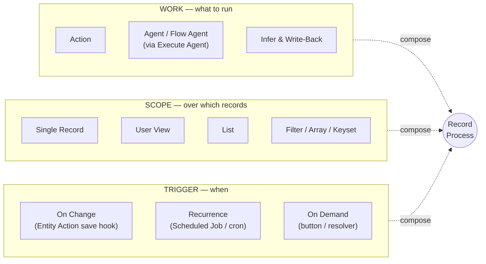
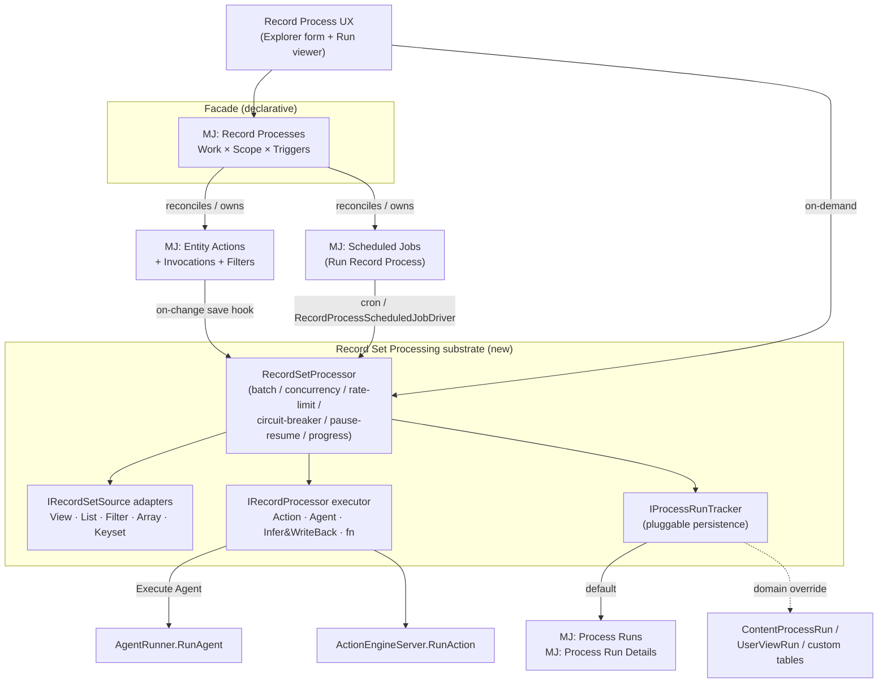
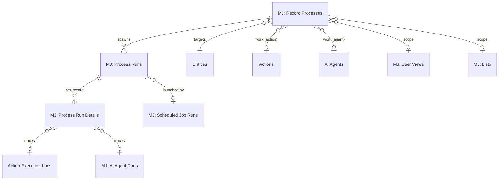
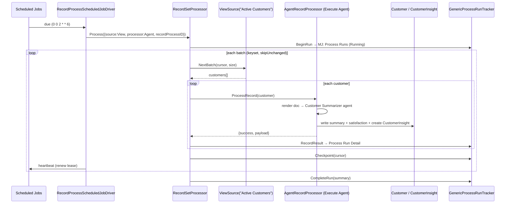

# Record Set Processing & Record Processes — Unified Design

**Status:** Proposed
**Author:** MJ Architecture
**Date:** 2026-06-18
**Branch:** `claude/hopeful-brown-crp09w`

---

## 1. Why this exists

MemberJunction can already do almost everything needed to express a business process like:

> *"Summarize this customer record once a week — or on demand — or when certain things change — and write structured insights (satisfaction, sentiment, personality style) back onto the record (or into a child table)."*

…but today that requires **custom plumbing** every time, because the capability is spread across five subsystems that don't compose into a single, declarative, auditable thing.

Every business process is really a choice along **three independent axes**:



MJ has a mature subsystem for **each axis** — but nothing binds them into one composable object, and two key seams are stubbed. This plan delivers that binding plus the missing seams, on top of a new reusable **Record Set Processing** substrate.

---

## 2. Current-state inventory

| Capability | Subsystem | State | Key reference |
|---|---|---|---|
| Per-record auto-invocation on Create/Update/Delete/Validate | Entity Actions | ✅ **Wired & firing** (SQL Server + PostgreSQL) | `GenericDatabaseProvider.HandleEntityActions` `packages/GenericDatabaseProvider/src/GenericDatabaseProvider.ts:446-480` |
| Cron recurrence + timezone + locking + heartbeat + notifications | Scheduled Jobs | ✅ **Production** (opt-in `scheduledJobs.enabled`) | `SchedulingEngine` `packages/Scheduling/engine/src/ScheduledJobEngine.ts` |
| Run an Action or Agent on a schedule | Scheduled Jobs drivers | ✅ Real | `AgentScheduledJobDriver`, `ActionScheduledJobDriver` |
| Action → Agent bridge (gated on `ExposeAsAction` + non-sub-agent) | Actions / Agents | ✅ Mature | `ExecuteAgentAction` `packages/Actions/CoreActions/src/custom/ai/execute-agent.action.ts:74-100` |
| Agent → Action invocation | Agents | ✅ Mature | `BaseAgent.ExecuteSingleAction` → `ActionEngineServer.RunAction` |
| Deterministic visual pipeline (Action/Sub-Agent/Prompt/ForEach/While + branching) | Flow agents | ✅ Mature | `FlowAgentType` `packages/AI/Agents/src/agent-types/flow-agent-type.ts` |
| User View as a first-class filtered set (+ LLM Smart Filter) | User Views | ✅ Mature | `MJUserViewEntityServer` Smart Filter; `RunView({ViewID})` |
| Resolve a View → record IDs | Lists | ✅ Real | `ListOperations.MaterializeFromView` `packages/Lists/server/src/ListOperations.ts:286` |
| Generic "record → text → LLM → merged JSON → write back" core | Knowledge Hub classifier | ✅ ~65% generic, production-hardened | `AutotagBaseEngine` `packages/ContentAutotagging/src/Engine/generic/AutotagBaseEngine.ts` |
| **Run an action/agent across every record in a View/List** | Entity Actions | ❌ **STUB** (`GetRecordList()` returns `[]`) | `EntityActionInvocationTypes.ts:229` |
| **Conditional invocation (fire only when X changed)** | Actions | ❌ **STUB** (`RunSingleFilter()` is `return true`) | `ActionEngine.ts:252` |
| **One object binding Work × Scope × Trigger** | — | ❌ **Does not exist** | — |
| Standardized set-iteration (resume / audit / progress / hardening) | — | ❌ Reinvented ad-hoc in ≥5 places | see §8 |

The architecture was designed for this years ago (Entity Actions already declare `SingleRecord`, `View`, `List`, `Validate`, `Before/After Create/Update/Delete` invocation types). We are **finishing the vision**, not inventing a new one.

---

## 3. Target architecture

Three new entities, one new engine, two stub fixes, one scheduled-job driver, one generic action, and a world-class authoring UX — all reusing existing plumbing.



**Design tenets**

1. **The Entity Action stays the convergence point.** Work + entity + invocation-type semantics live there. The facade *owns and reconciles* Entity Action + Scheduled Job rows; it does not replace them.
2. **The `RecordSetProcessor` is the substrate** every set-iterating path routes through. The stubbed `GetRecordList()` is fixed *by routing through it*, not by a one-off loop.
3. **Persistence is pluggable.** Default to the new generic `MJ: Process Runs` / `MJ: Process Run Details`. Domain consumers (classifier, vector sync) keep their existing tables via a custom `IProcessRunTracker`.
4. **Everything reduces to "run an Action."** Agents/Flows run through `Execute Agent`, so the executor has one uniform shape.

---

## 4. New entities



### 4.1 `MJ: Record Processes` — the facade (definition)

The single declarative object a user creates. Owns the underlying Entity Action + Scheduled Job rows.

| Column | Type | Notes |
|---|---|---|
| `ID` | uniqueidentifier | PK |
| `Name` | nvarchar(255) | |
| `Description` | nvarchar(MAX) null | |
| `EntityID` | uniqueidentifier | FK → Entities; the target entity |
| `Status` | nvarchar(20) | `Draft` / `Active` / `Disabled` (default `Draft`) |
| `WorkType` | nvarchar(20) | `Action` / `Agent` |
| `ActionID` | uniqueidentifier null | FK → Actions (when WorkType=Action) |
| `AgentID` | uniqueidentifier null | FK → AI Agents (when WorkType=Agent; dispatched via Execute Agent, must be `ExposeAsAction`) |
| `ScopeType` | nvarchar(20) | `SingleRecord` / `View` / `List` / `Filter` |
| `ScopeViewID` | uniqueidentifier null | FK → MJ: User Views |
| `ScopeListID` | uniqueidentifier null | FK → MJ: Lists |
| `ScopeFilter` | nvarchar(MAX) null | ad-hoc WHERE used when ScopeType=Filter |
| `OnChangeEnabled` | bit | default 0 |
| `OnChangeInvocationType` | nvarchar(30) null | `AfterCreate` / `AfterUpdate` / `AfterDelete` / `Validate` |
| `OnChangeFilter` | nvarchar(MAX) null | gating expression (drives the EntityActionFilter; see §6) |
| `ScheduleEnabled` | bit | default 0 |
| `CronExpression` | nvarchar(120) null | |
| `Timezone` | nvarchar(100) null | IANA, default `UTC` |
| `OnDemandEnabled` | bit | default 1 |
| `InputMapping` | nvarchar(MAX) null | JSON: how record → work inputs; optional `EntityDocumentID` for render-to-text |
| `OutputMapping` | nvarchar(MAX) null | JSON: how structured payload writes back (fields / child record / tags) |
| `SkipUnchanged` | bit | default 1 |
| `WatermarkStrategy` | nvarchar(20) null | `Checksum` / `UpdatedAt` / `None` |
| `BatchSize` | int null | default 100 |
| `MaxConcurrency` | int null | default 1 |

### 4.2 `MJ: Process Runs` — generic run header

Source-agnostic. Modeled on `MJContentProcessRun` (which already has resume/cancel/error fields). One row per execution of *any* set-processing job — whether launched by a Record Process, a Scheduled Job, or a direct engine consumer (geocoding, vector sync).

| Column | Type | Notes |
|---|---|---|
| `ID` | uniqueidentifier | PK |
| `RecordProcessID` | uniqueidentifier null | FK → MJ: Record Processes (NULL for ad-hoc/engine-driven runs) |
| `EntityID` | uniqueidentifier null | FK → Entities |
| `TriggeredBy` | nvarchar(20) | `OnChange` / `Schedule` / `OnDemand` / `Manual` |
| `SourceType` | nvarchar(20) | `View` / `List` / `Filter` / `Array` / `Keyset` / `SingleRecord` |
| `SourceID` | uniqueidentifier null | ViewID or ListID |
| `SourceFilter` | nvarchar(MAX) null | resolved filter snapshot |
| `ScheduledJobRunID` | uniqueidentifier null | FK → MJ: Scheduled Job Runs (when scheduler-launched) |
| `Status` | nvarchar(20) | `Pending` / `Running` / `Paused` / `Completed` / `Failed` / `Cancelled` |
| `StartTime` / `EndTime` | datetimeoffset null | |
| `TotalItemCount` | int null | |
| `ProcessedItems` / `SuccessCount` / `ErrorCount` / `SkippedCount` | int null | |
| `LastProcessedOffset` | int null | StartRow resume (offset mode) |
| `LastProcessedKey` | nvarchar(450) null | keyset resume cursor |
| `BatchSize` | int null | |
| `CancellationRequested` | bit | pause/cancel handshake (as in ContentProcessRun) |
| `Configuration` | nvarchar(MAX) null | JSON snapshot of effective config |
| `ErrorMessage` | nvarchar(MAX) null | |
| `StartedByUserID` | uniqueidentifier null | FK → MJ: Users |

### 4.3 `MJ: Process Run Details` — generic per-record detail

Your "custom detail tracking table," standardized. One row per processed record → powers audit, resume (skip done), and the run-viewer UX. Modeled on `MJUserViewRunDetail` (polymorphic EntityID + RecordID) plus status/result/trace columns.

| Column | Type | Notes |
|---|---|---|
| `ID` | uniqueidentifier | PK |
| `ProcessRunID` | uniqueidentifier | FK → MJ: Process Runs |
| `EntityID` | uniqueidentifier | FK → Entities |
| `RecordID` | nvarchar(450) | the processed record's PK (composite-safe) |
| `Status` | nvarchar(20) | `Pending` / `Succeeded` / `Failed` / `Skipped` |
| `StartedAt` / `CompletedAt` | datetimeoffset null | |
| `DurationMs` | int null | |
| `AttemptCount` | int | default 0 (retry support) |
| `ResultPayload` | nvarchar(MAX) null | structured output JSON |
| `ErrorMessage` | nvarchar(MAX) null | |
| `ActionExecutionLogID` | uniqueidentifier null | FK → Action Execution Logs (deep trace) |
| `AIAgentRunID` | uniqueidentifier null | FK → MJ: AI Agent Runs (deep trace) |

> **Migration rules honored** (see `migrations/CLAUDE.md`): no `__mj_CreatedAt`/`__mj_UpdatedAt` (CodeGen adds them), no FK indexes (CodeGen adds `IDX_AUTO_MJ_FKEY_*`), hardcoded UUID defaults via `NEWSEQUENTIALID()`, `${flyway:defaultSchema}` placeholder, single consolidated `ALTER`/`CREATE`, and `sp_addextendedproperty` for every business column. Seed lookup-ish values (e.g. the new Scheduled Job Type) via metadata files, not SQL INSERT (see §7). DDL sketch in §11.

---

## 5. The `RecordSetProcessor` engine (substrate)

A new framework-agnostic-on-server engine that standardizes the set-iteration lifecycle every consumer reinvents today. **Pluggable on three seams**: source, executor, persistence.


**Engine owns (extracted from `AutotagBaseEngine`'s hardened core):** batching, max-concurrency cap, rate limiting, circuit breaker (error-rate threshold), per-run budget gate, progress events, pause/cancel handshake (`CancellationRequested`), resume-from-checkpoint, per-record error isolation + retry, completion summary.

**Pluggable persistence (the flexibility you asked for):** `IProcessRunTracker` defaults to `GenericProcessRunTracker` (writes `MJ: Process Runs` / `Process Run Details`). Domain consumers supply their own:
- `ContentProcessRunTracker` → keeps the classifier's `MJ: Content Process Runs` + `Content Item Tags`.
- A subclass could write to `UserViewRun` / a bespoke domain table.
- `NoOpTracker` for fire-and-forget single-record on-change work where a full run record is overkill.

**Package layout** (mirrors the Scheduling package split):

```
packages/RecordSetProcessor/
  base/        @memberjunction/record-set-processor-base   # interfaces, types, source adapters (client-safe)
  engine/      @memberjunction/record-set-processor         # server engine, default tracker, executors
```

Entry point:

```typescript
const result = await RecordSetProcessor.Instance.Process({
  source: { type: 'View', viewID },              // or List / Filter / Array / Keyset
  processor: new AgentRecordProcessor(agentID),  // or Action / InferAndWriteBack / fn
  tracker: new GenericProcessRunTracker(),       // default; swap for domain persistence
  recordProcessID,                               // optional facade linkage
  batchSize, maxConcurrency, skipUnchanged,
  contextUser,
  onProgress
});
```

---

## 6. Layer 1 — close the two stubs (via the engine)

**6a. `GetRecordList()` fan-out.** Reimplement `EntityActionInvocationMultipleRecords` so the `View`/`List` invocation types resolve their record set through `RecordSetProcessor` (`ViewSource` / `ListSource`), keyset-paginated for large sets (reuse the `ScheduledGeocodingAction` pattern). The per-record loop + result consolidation already above it stays; only the source resolution and run-tracking change.
- File: `packages/Actions/Engine/src/entity-actions/EntityActionInvocationTypes.ts:173-231`.
- Net: "run an action/agent over every record in a View/List" works — the single highest-leverage fix.

**6b. `RunSingleFilter()` conditional gating.** Implement filter evaluation using `SafeExpressionEvaluator` (already used by Flow agents) against a context of `{ record, changedFields, payload, context }`. Inject a **changed-fields** set so a filter can express *"only when `LifecycleStage` changed"* — this is what makes the on-change trigger fire selectively instead of on every save.
- File: `packages/Actions/Engine/src/generic/ActionEngine.ts:236-255`.
- The facade's `OnChangeFilter` compiles into an `MJ: Entity Action Filter` row consumed here.

---

## 7. Layer 2 — recurrence binding

New Scheduled Job type **`Run Record Process`** with driver `RecordProcessScheduledJobDriver` (sibling to `AgentScheduledJobDriver` / `ActionScheduledJobDriver`).

- Config JSON: `{ RecordProcessID }` (preferred) or the lower-level `{ EntityActionID, ScopeType, ScopeID|Filter }`.
- Driver loads the Record Process / Entity Action, builds the `RecordSetProcessor` call, links `ProcessRun.ScheduledJobRunID` back to the scheduler's run, and uses the scheduler's `context.heartbeat` to renew the lease per batch.
- Seed the job type via **metadata file** (`metadata/scheduled-job-types/.run-record-process-type.json`), not SQL INSERT — consistent with `.integration-sync-type.json` / `.agent-run-sweep-type.json`.
- File targets: `packages/Scheduling/engine/src/drivers/RecordProcessScheduledJobDriver.ts`.

This makes the full chain compose:

```
ScheduledJob(cron) → RecordProcessScheduledJobDriver → RecordSetProcessor
   → ViewSource(viewID) → per-record → ExecuteAgent/Action → write back → ProcessRunDetail
```

---

## 8. Layer 3 — generic "Infer & Write-Back" action

Generalize the classifier's inference core into a reusable executor + action so the most common LLM use case ("read a record, infer a structured payload, write it back") is **configured, not coded**.

- `InferAndWriteBackProcessor` (`IRecordProcessor`): render record → text (reuse `EntityDocument` templates, as `AutotagEntity.ProcessSingleRecord` already does) → run a configured prompt with a JSON output schema → bind the structured payload back via `OutputMapping` (update fields / create child record / write tags).
- Thin `Infer And Write Back` Action wraps it for catalog/agent/low-code use.
- This is your customer-summary case: input = customer + rolled-up activities document; output = `{ satisfaction, sentiment, personalityStyle, summary }` → written to fields and/or a `CustomerInsight` child row.

---

## 9. Layer 4 — Record Processes facade + reconciliation + UX

**Reconciliation.** A server entity subclass `MJRecordProcessEntityServer` (in `MJCoreEntitiesServer`, following `guides/BASE_ENTITY_SERVER_PATTERNS.md`) reconciles owned rows on `Save()`:
- `OnChangeEnabled` → ensure `MJ: Entity Actions` + `Entity Action Invocation` (matching `OnChangeInvocationType`) + `Entity Action Filter` (from `OnChangeFilter`) exist/active; remove when disabled.
- `ScheduleEnabled` → ensure a `MJ: Scheduled Jobs` row of type `Run Record Process` with the cron; pause/disable when off.
- Validation via `ValidateAsync`: exactly one of ActionID/AgentID per WorkType; Agent must be top-level + `ExposeAsAction`; scope columns consistent with `ScopeType`.

**UX (the killer surface).** Explorer custom form for `MJ: Record Processes`:
- One screen, three trigger toggles (On Change + field filter · Schedule + cron builder · On Demand).
- Work picker (Action or Agent — agent list filtered to `ExposeAsAction` top-level agents).
- Scope picker (View / List / Filter), reusing the Smart Filter UI for ad-hoc filters.
- Input/Output mapping editor (field bindings / child-record / tags).
- **Run history viewer** reading `MJ: Process Runs` + `Process Run Details` — status, progress %, per-record results, errors, drill into the underlying Action Execution Log / AI Agent Run. Pause/Resume/Cancel buttons wired to `CancellationRequested`.
- "Run now" (on-demand) button → `RecordSetProcessor` directly.

---

## 10. Refactor the five existing set operations onto the substrate

All five rebase onto `RecordSetProcessor`, choosing the appropriate source adapter + tracker. Domain ones keep their persistence via a custom tracker (per your flexibility requirement).

| # | Current code | Source adapter | Tracker | Notes |
|---|---|---|---|---|
| 1 | `EntityActionInvocationMultipleRecords` (`EntityActionInvocationTypes.ts:173`) | View / List | `GenericProcessRunTracker` | Replaces the `[]` stub; per-record loop preserved |
| 2 | `AutotagBaseEngine` (`AutotagBaseEngine.ts`) | ContentItem source | **`ContentProcessRunTracker`** (keeps `MJ: Content Process Runs` + tag write-back) | Engine donates its hardening to the substrate, then consumes it |
| 3 | `ScheduledGeocodingAction` (`scheduled-geocoding.action.ts:180-313`) | Keyset | `GenericProcessRunTracker` | Drops bespoke keyset loop; gains audit + resume rows |
| 4 | `VectorBase` / `EntityVectorSyncer` | Keyset | `GenericProcessRunTracker` (or custom) | Unifies partial resume logic |
| 5 | `ListOperations.MaterializeFromView` (`ListOperations.ts:286-450`) | View | `NoOpTracker` (pure resolution) | Shares the `ViewSource` adapter; List remains the output sink |

**Sequencing note:** the substrate must *first* absorb the classifier's hardening (so #2 is a faithful rebase, not a regression), then #1/#3/#4/#5 follow. Each refactor ships behind its own PR with the package's unit tests updated (per the CLAUDE.md testing rule).

---

## 11. Worked example — "Summarize customers weekly / on-demand / on-change"



The **same Record Process** also:
- **On change** — its owned Entity Action (`AfterUpdate` + `OnChangeFilter` = "satisfaction-relevant fields changed") fires per-record, fire-and-forget, through a `NoOpTracker` (or a single Process Run Detail).
- **On demand** — the form's "Run now" / a record-level button calls the same `RecordSetProcessor` with `SingleRecord`.

One Work definition, one facade record, three triggers — zero bespoke plumbing.

---

## 12. Cross-cutting concerns

- **Cost guardrails.** LLM work over large views is expensive. The run header carries a budget gate (from the classifier); the facade exposes max-records/max-cost caps; `SkipUnchanged` (Checksum/UpdatedAt watermark) avoids re-billing untouched records.
- **Idempotency & resume.** `Process Run Details` status + the run cursor make re-runs skip completed records and resume after a crash.
- **Observability.** Every run is a first-class auditable record with drill-down into the underlying Action Execution Log / AI Agent Run. Drives the UX viewer.
- **Security / multi-tenant.** All execution passes `contextUser`; source resolution respects view/list/RLS permissions; agent dispatch keeps the `ExposeAsAction` + sub-agent gates.
- **Multi-provider correctness.** Engine and trackers take an explicit `IMetadataProvider` (never `new Metadata()` in per-provider paths), per the root CLAUDE.md rule.
- **On-change is async.** After-save invocations stay fire-and-forget so a slow LLM never blocks a user's save; `Validate` invocations remain synchronous and can abort.

---

## 13. Phasing & PR breakdown

| Phase | Deliverable | Gateable PR |
|---|---|---|
| **P0** | Migration: 3 new entities + Scheduled Job Type metadata; run CodeGen | PR 1 |
| **P1** | `RecordSetProcessor` base + engine; source adapters; `GenericProcessRunTracker`; `NoOpTracker`; unit tests | PR 2 |
| **P2** | Stub fixes: `GetRecordList` (via engine) + `RunSingleFilter` (changed-fields gating) | PR 3 |
| **P3** | `RecordProcessScheduledJobDriver` + job-type metadata | PR 4 |
| **P4** | `InferAndWriteBackProcessor` + `Infer And Write Back` action | PR 5 |
| **P5** | `MJRecordProcessEntityServer` reconciliation + facade resolver/client | PR 6 |
| **P6** | Explorer UX: Record Process form + Run viewer | PR 7 |
| **P7** | Refactor classifier onto substrate (`ContentProcessRunTracker`) | PR 8 |
| **P8** | Refactor geocoding / vector-sync / ListOperations | PR 9 |

Each PR builds the affected package(s) and runs their Vitest suites before merge.

---

## 14. Open questions / future

- **Composite-PK entities** — keyset source falls back to offset; `Process Run Detail.RecordID` is nvarchar(450) to stay composite-safe.
- **Cross-entity processes** — v1 is entity-scoped (matches Entity Action). A future "pipeline" facade could chain Record Processes; deferred.
- **Event-driven (non-cron) triggers beyond save hooks** — out of scope; the BaseEntity event layer + on-change covers the near-term need.
- **Auto-registration of agents into the action catalog** — referenced in `execute-agent.action.ts:90`; complementary, tracked separately.

---

## 15. Illustrative DDL (P0, abbreviated)

```sql
-- migrations/v5/V<ts>__v5.x__Record_Set_Processing.sql
CREATE TABLE ${flyway:defaultSchema}.ProcessRun (
    ID UNIQUEIDENTIFIER NOT NULL DEFAULT NEWSEQUENTIALID(),
    RecordProcessID UNIQUEIDENTIFIER NULL,
    EntityID UNIQUEIDENTIFIER NULL,
    TriggeredBy NVARCHAR(20) NOT NULL,
    SourceType NVARCHAR(20) NOT NULL,
    SourceID UNIQUEIDENTIFIER NULL,
    SourceFilter NVARCHAR(MAX) NULL,
    ScheduledJobRunID UNIQUEIDENTIFIER NULL,
    Status NVARCHAR(20) NOT NULL DEFAULT 'Pending',
    StartTime DATETIMEOFFSET NULL,
    EndTime DATETIMEOFFSET NULL,
    TotalItemCount INT NULL,
    ProcessedItems INT NOT NULL DEFAULT 0,
    SuccessCount INT NOT NULL DEFAULT 0,
    ErrorCount INT NOT NULL DEFAULT 0,
    SkippedCount INT NOT NULL DEFAULT 0,
    LastProcessedOffset INT NULL,
    LastProcessedKey NVARCHAR(450) NULL,
    BatchSize INT NULL,
    CancellationRequested BIT NOT NULL DEFAULT 0,
    Configuration NVARCHAR(MAX) NULL,
    ErrorMessage NVARCHAR(MAX) NULL,
    StartedByUserID UNIQUEIDENTIFIER NULL,
    CONSTRAINT PK_ProcessRun PRIMARY KEY (ID),
    CONSTRAINT FK_ProcessRun_RecordProcess FOREIGN KEY (RecordProcessID) REFERENCES ${flyway:defaultSchema}.RecordProcess(ID),
    CONSTRAINT FK_ProcessRun_ScheduledJobRun FOREIGN KEY (ScheduledJobRunID) REFERENCES ${flyway:defaultSchema}.ScheduledJobRun(ID)
);
-- RecordProcess and ProcessRunDetail tables follow the same conventions.
-- sp_addextendedproperty for every business column (omitted here for brevity).
-- NO __mj_* columns and NO FK indexes — CodeGen generates both.
```

---

*End of plan. Build proceeds per the phased PR breakdown after review.*
