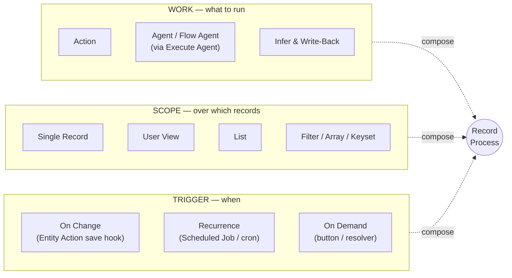
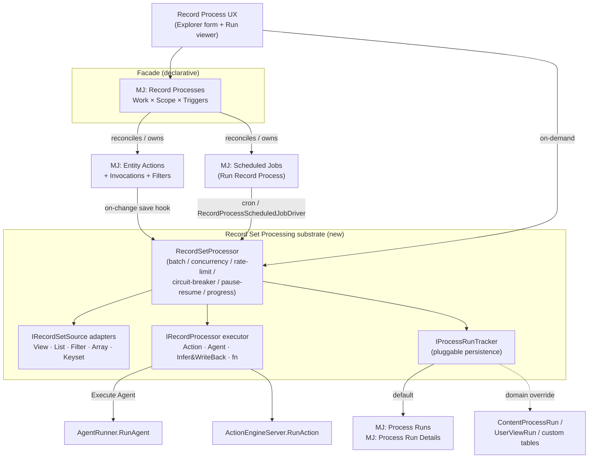
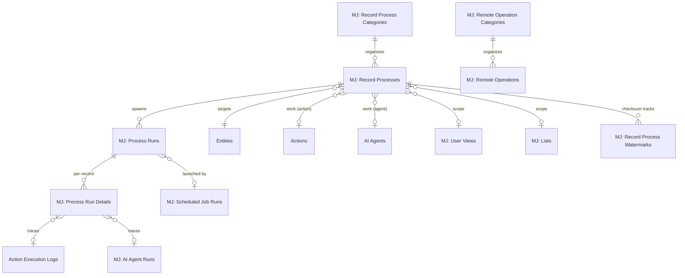
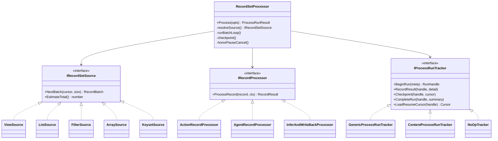
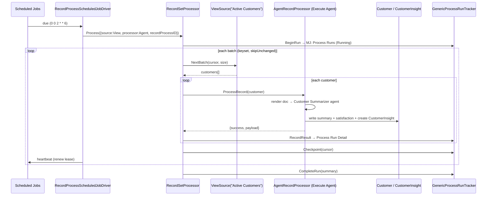

# Record Set Processing & Record Processes — Unified Design

**Status:** Proposed
**Author:** MJ Architecture
**Date:** 2026-06-18
**Revised:** 2026-06-19 — incorporated code-verification review (cursor-strategy ownership, on-change-vs-scope semantics, stored `ProcessRunDetail.EntityID`, honest characterization of the §10 refactor targets)
**Revised:** 2026-06-19 (b) — added the **Remote Operations** substrate (§16) + end-to-end WBS (§17): a typed, provider-routed, metadata-defined, optionally-AI-authored operation layer that the Record Process facade's on-demand / status / control calls are built on (the prime consumer), with a showcase refactor + guide
**Revised:** 2026-06-19 (c) — incorporated @rkihm-BC review: `RouteOperation` moves off `IMetadataProvider` to a dedicated `IRemoteOperationProvider` implemented in `ProviderBase`; honest "why not type Actions" + "shared plumbing, not a parallel stack" framing (§16.1); I/O-contract freshness via the metadata engine + additive-only defense-in-depth (§16.12); progress channel called out as a real RO-3 deliverable; on-change concurrency + self-trigger guard and checksum-watermark storage answered (§12); UX surfaces folded into §9. **The record-set work in this PR runs *only* via RO — no pre-RO bespoke resolvers.**
**Branch:** `claude/hopeful-brown-crp09w`

---

## 1. Why this exists

MemberJunction can already do almost everything needed to express a business process like:

> *"Summarize this customer record once a week — or on demand — or when certain things change — and write structured insights (satisfaction, sentiment, personality style) back onto the record (or into a child table)."*

…but today that requires **custom plumbing** every time, because the capability is spread across five subsystems that don't compose into a single, declarative, auditable thing.

Every business process is really a choice along **three independent axes**:



MJ has a mature subsystem for **each axis** — but nothing binds them into one composable object, and two key seams are stubbed. This plan delivers that binding plus the missing seams, on top of a new reusable **Record Set Processing** substrate.

---

## 2. Current-state inventory

| Capability | Subsystem | State | Key reference |
|---|---|---|---|
| Per-record auto-invocation on Create/Update/Delete/Validate | Entity Actions | ✅ **Wired & firing** (SQL Server + PostgreSQL) | `GenericDatabaseProvider.HandleEntityActions` `packages/GenericDatabaseProvider/src/GenericDatabaseProvider.ts:446-480` |
| Cron recurrence + timezone + locking + heartbeat + notifications | Scheduled Jobs | ✅ **Production** (opt-in `scheduledJobs.enabled`) | `SchedulingEngine` `packages/Scheduling/engine/src/ScheduledJobEngine.ts` |
| Run an Action or Agent on a schedule | Scheduled Jobs drivers | ✅ Real | `AgentScheduledJobDriver`, `ActionScheduledJobDriver` |
| Action → Agent bridge (gated on `ExposeAsAction` + non-sub-agent) | Actions / Agents | ✅ Mature | `ExecuteAgentAction` `packages/Actions/CoreActions/src/custom/ai/execute-agent.action.ts:74-100` |
| Agent → Action invocation | Agents | ✅ Mature | `BaseAgent.ExecuteSingleAction` → `ActionEngineServer.RunAction` |
| Deterministic visual pipeline (Action/Sub-Agent/Prompt/ForEach/While + branching) | Flow agents | ✅ Mature | `FlowAgentType` `packages/AI/Agents/src/agent-types/flow-agent-type.ts` |
| User View as a first-class filtered set (+ LLM Smart Filter) | User Views | ✅ Mature | `MJUserViewEntityServer` Smart Filter; `RunView({ViewID})` |
| Resolve a View → record IDs | Lists | ✅ Real | `ListOperations.MaterializeFromView` `packages/Lists/server/src/ListOperations.ts:286` |
| Generic "record → text → LLM → merged JSON → write back" core | Knowledge Hub classifier | ✅ ~65% generic, production-hardened | `AutotagBaseEngine` `packages/ContentAutotagging/src/Engine/generic/AutotagBaseEngine.ts` |
| **Run an action/agent across every record in a View/List** | Entity Actions | ❌ **STUB** (`GetRecordList()` returns `[]`) | `EntityActionInvocationTypes.ts:229` |
| **Conditional invocation (fire only when X changed)** | Actions | ❌ **STUB** (`RunSingleFilter()` is `return true`) | `ActionEngine.ts:252` |
| **One object binding Work × Scope × Trigger** | — | ❌ **Does not exist** | — |
| Standardized set-iteration (resume / audit / progress / hardening) | — | ❌ Reinvented ad-hoc in ≥5 places | see §8 |

The architecture was designed for this years ago (Entity Actions already declare `SingleRecord`, `View`, `List`, `Validate`, `Before/After Create/Update/Delete` invocation types). We are **finishing the vision**, not inventing a new one.

---

## 3. Target architecture

Three new entities, one new engine, two stub fixes, one scheduled-job driver, one generic action, and a world-class authoring UX — all reusing existing plumbing.



**Design tenets**

1. **The Entity Action stays the convergence point.** Work + entity + invocation-type semantics live there. The facade *owns and reconciles* Entity Action + Scheduled Job rows; it does not replace them.
2. **The `RecordSetProcessor` is the substrate** every set-iterating path routes through. The stubbed `GetRecordList()` is fixed *by routing through it*, not by a one-off loop.
3. **Persistence is pluggable.** Default to the new generic `MJ: Process Runs` / `MJ: Process Run Details`. Domain consumers (classifier, vector sync) keep their existing tables via a custom `IProcessRunTracker`.
4. **Everything reduces to "run an Action."** Agents/Flows run through `Execute Agent`, so the executor has one uniform shape.

---

## 4. New entities



> **Full schema is front-loaded into one migration.** All DDL for the entire PR ships in `migrations/v5/V202606191338__v5.43.x__Record_Set_Processing.sql` — **7 tables** — so it runs once and CodeGen runs once: `RecordProcess` (§4.1), `ProcessRun` (§4.2), `ProcessRunDetail` (§4.3), **`RecordProcessCategory`** (recursive `ParentID`, organizes processes), **`RecordProcessWatermark`** (§12, Checksum mode), and the Remote Operations pair **`RemoteOperation`** + **`RemoteOperationCategory`** (§16.4). A `RecordProcessType` was considered and **deferred** — the Action/Agent work axis already supplies the flexible behavior dimension. Lookup *rows* (categories, scheduled-job type, API scopes, operation rows) are seeded later via `mj sync`, not the migration.

### 4.1 `MJ: Record Processes` — the facade (definition)

The single declarative object a user creates. Owns the underlying Entity Action + Scheduled Job rows.

| Column | Type | Notes |
|---|---|---|
| `ID` | uniqueidentifier | PK |
| `Name` | nvarchar(255) | |
| `Description` | nvarchar(MAX) null | |
| `CategoryID` | uniqueidentifier null | FK → MJ: Record Process Categories; optional UI organization |
| `EntityID` | uniqueidentifier | FK → Entities; the target entity |
| `Status` | nvarchar(20) | `Draft` / `Active` / `Disabled` (default `Draft`) |
| `WorkType` | nvarchar(20) | `Action` / `Agent` |
| `ActionID` | uniqueidentifier null | FK → Actions (when WorkType=Action) |
| `AgentID` | uniqueidentifier null | FK → AI Agents (when WorkType=Agent; dispatched via Execute Agent, must be `ExposeAsAction`) |
| `ScopeType` | nvarchar(20) | `SingleRecord` / `View` / `List` / `Filter` |
| `ScopeViewID` | uniqueidentifier null | FK → MJ: User Views |
| `ScopeListID` | uniqueidentifier null | FK → MJ: Lists |
| `ScopeFilter` | nvarchar(MAX) null | ad-hoc WHERE used when ScopeType=Filter |
| `OnChangeEnabled` | bit | default 0 |
| `OnChangeInvocationType` | nvarchar(30) null | `AfterCreate` / `AfterUpdate` / `AfterDelete` / `Validate` |
| `OnChangeFilter` | nvarchar(MAX) null | gating expression (drives the EntityActionFilter; see §6) |
| `ScheduleEnabled` | bit | default 0 |
| `CronExpression` | nvarchar(120) null | |
| `Timezone` | nvarchar(100) null | IANA, default `UTC` |
| `OnDemandEnabled` | bit | default 1 |
| `InputMapping` | nvarchar(MAX) null | JSON: how record → work inputs; optional `EntityDocumentID` for render-to-text |
| `OutputMapping` | nvarchar(MAX) null | JSON: how structured payload writes back (fields / child record / tags) |
| `SkipUnchanged` | bit | default 1 |
| `WatermarkStrategy` | nvarchar(20) null | `Checksum` / `UpdatedAt` / `None` |
| `BatchSize` | int null | default 100 |
| `MaxConcurrency` | int null | default 1 |

> **On-change vs. Scope (semantic rule).** `ScopeType`/`ScopeViewID`/`ScopeListID`/`ScopeFilter` describe the record **set** that the **Schedule** and **On-Demand** triggers iterate. The **On-Change** trigger is *always* single-record — it operates on the one record whose save fired the Entity Action and **ignores `Scope`**. A save must never re-run the whole view. `ValidateAsync` (see §9) enforces this: when `OnChangeEnabled=1`, `Scope` is interpreted only for the batch triggers, never for the on-change path.

### 4.2 `MJ: Process Runs` — generic run header

Source-agnostic. Modeled on `MJContentProcessRun` (which already has resume/cancel/error fields). One row per execution of *any* set-processing job — whether launched by a Record Process, a Scheduled Job, or a direct engine consumer (geocoding, vector sync).

| Column | Type | Notes |
|---|---|---|
| `ID` | uniqueidentifier | PK |
| `RecordProcessID` | uniqueidentifier null | FK → MJ: Record Processes (NULL for ad-hoc/engine-driven runs) |
| `EntityID` | uniqueidentifier null | FK → Entities |
| `TriggeredBy` | nvarchar(20) | `OnChange` / `Schedule` / `OnDemand` / `Manual` |
| `SourceType` | nvarchar(20) | `View` / `List` / `Filter` / `Array` / `Keyset` / `SingleRecord` |
| `SourceID` | uniqueidentifier null | ViewID or ListID |
| `SourceFilter` | nvarchar(MAX) null | resolved filter snapshot |
| `ScheduledJobRunID` | uniqueidentifier null | FK → MJ: Scheduled Job Runs (when scheduler-launched) |
| `Status` | nvarchar(20) | `Pending` / `Running` / `Paused` / `Completed` / `Failed` / `Cancelled` |
| `StartTime` / `EndTime` | datetimeoffset null | |
| `TotalItemCount` | int null | |
| `ProcessedItems` / `SuccessCount` / `ErrorCount` / `SkippedCount` | int null | |
| `LastProcessedOffset` | int null | StartRow resume (offset mode) |
| `LastProcessedKey` | nvarchar(450) null | keyset resume cursor |
| `BatchSize` | int null | |
| `CancellationRequested` | bit | pause/cancel handshake (as in ContentProcessRun) |
| `Configuration` | nvarchar(MAX) null | JSON snapshot of effective config |
| `ErrorMessage` | nvarchar(MAX) null | |
| `StartedByUserID` | uniqueidentifier null | FK → MJ: Users |

### 4.3 `MJ: Process Run Details` — generic per-record detail

Your "custom detail tracking table," standardized. One row per processed record → powers audit, resume (skip done), and the run-viewer UX. Modeled on `MJUserViewRunDetail` (polymorphic EntityID + RecordID) plus status/result/trace columns.

| Column | Type | Notes |
|---|---|---|
| `ID` | uniqueidentifier | PK |
| `ProcessRunID` | uniqueidentifier | FK → MJ: Process Runs |
| `EntityID` | uniqueidentifier | **stored** FK → Entities (NOT computed — a single Process Run may span entities for ad-hoc/engine-driven runs, so the detail row carries its own entity context rather than inheriting it from the parent) |
| `RecordID` | nvarchar(450) | the processed record's PK (composite-safe) |
| `Status` | nvarchar(20) | `Pending` / `Succeeded` / `Failed` / `Skipped` |
| `StartedAt` / `CompletedAt` | datetimeoffset null | |
| `DurationMs` | int null | |
| `AttemptCount` | int | default 0 (retry support) |
| `ResultPayload` | nvarchar(MAX) null | structured output JSON |
| `ErrorMessage` | nvarchar(MAX) null | |
| `ActionExecutionLogID` | uniqueidentifier null | FK → Action Execution Logs (deep trace) |
| `AIAgentRunID` | uniqueidentifier null | FK → MJ: AI Agent Runs (deep trace) |

> **Migration rules honored** (see `migrations/CLAUDE.md`): no `__mj_CreatedAt`/`__mj_UpdatedAt` (CodeGen adds them), no FK indexes (CodeGen adds `IDX_AUTO_MJ_FKEY_*`), hardcoded UUID defaults via `NEWSEQUENTIALID()`, `${flyway:defaultSchema}` placeholder, single consolidated `ALTER`/`CREATE`, and `sp_addextendedproperty` for every business column. Seed lookup-ish values (e.g. the new Scheduled Job Type) via metadata files, not SQL INSERT (see §7). DDL sketch in §11.

---

## 5. The `RecordSetProcessor` engine (substrate)

A new framework-agnostic-on-server engine that standardizes the set-iteration lifecycle every consumer reinvents today. **Pluggable on three seams**: source, executor, persistence.



**Engine owns (extracted from `AutotagBaseEngine`'s hardened core):** batching, max-concurrency cap, rate limiting, circuit breaker (error-rate threshold), per-run budget gate, progress events, pause/cancel handshake (`CancellationRequested`), resume-from-checkpoint, per-record error isolation + retry, completion summary.

**Pluggable persistence (the flexibility you asked for):** `IProcessRunTracker` defaults to `GenericProcessRunTracker` (writes `MJ: Process Runs` / `Process Run Details`). Domain consumers supply their own:
- `ContentProcessRunTracker` → keeps the classifier's `MJ: Content Process Runs` + `Content Item Tags`.
- A subclass could write to `UserViewRun` / a bespoke domain table.
- `NoOpTracker` for fire-and-forget single-record on-change work where a full run record is overkill.

> **Cursor strategy is owned by the source adapter, not the engine.** The two donor patterns resume differently: the classifier resumes by **offset** (`ProcessRun.LastProcessedOffset`), while geocoding/vector-sync resume by **keyset** (`ProcessRun.LastProcessedKey`, via `RunViewParams.AfterKey`). The run header carries *both* columns; the active `IRecordSetSource` decides which it populates. Rule: `KeysetSource` and `FilterSource` use keyset **only when the entity has a single orderable PK** (mirror `VectorBase.CanUseKeysetPagination` / `ScheduledGeocodingAction`'s composite-PK fallback to offset); `ViewSource`/`ListSource` — which may carry arbitrary `OrderBy`/filters that defeat seek pagination — default to offset. The engine treats the cursor opaquely and just round-trips it through `Checkpoint`/`LoadResumeCursor`.

**Package layout** (mirrors the Scheduling package split):

```
packages/RecordSetProcessor/
  base/        @memberjunction/record-set-processor-base   # interfaces, types, source adapters (client-safe)
  engine/      @memberjunction/record-set-processor         # server engine, default tracker, executors
```

Entry point:

```typescript
const result = await RecordSetProcessor.Instance.Process({
  source: { type: 'View', viewID },              // or List / Filter / Array / Keyset
  processor: new AgentRecordProcessor(agentID),  // or Action / InferAndWriteBack / fn
  tracker: new GenericProcessRunTracker(),       // default; swap for domain persistence
  recordProcessID,                               // optional facade linkage
  batchSize, maxConcurrency, skipUnchanged,
  contextUser,
  onProgress
});
```

---

## 6. Layer 1 — close the two stubs (via the engine)

**6a. `GetRecordList()` fan-out.** Reimplement `EntityActionInvocationMultipleRecords` so the `View`/`List` invocation types resolve their record set through `RecordSetProcessor` (`ViewSource` / `ListSource`), keyset-paginated for large sets (reuse the `ScheduledGeocodingAction` pattern). The per-record loop + result consolidation already above it stays; only the source resolution and run-tracking change.
- File: `packages/Actions/Engine/src/entity-actions/EntityActionInvocationTypes.ts:173-231`.
- Net: "run an action/agent over every record in a View/List" works — the single highest-leverage fix.

**6b. `RunSingleFilter()` conditional gating.** Implement filter evaluation using `SafeExpressionEvaluator` (already used by Flow agents) against a context of `{ record, changedFields, payload, context }`. Inject a **changed-fields** set so a filter can express *"only when `LifecycleStage` changed"* — this is what makes the on-change trigger fire selectively instead of on every save.
- File: `packages/Actions/Engine/src/generic/ActionEngine.ts:236-255`.
- The facade's `OnChangeFilter` compiles into an `MJ: Entity Action Filter` row consumed here.

---

## 7. Layer 2 — recurrence binding

New Scheduled Job type **`Run Record Process`** with driver `RecordProcessScheduledJobDriver` (sibling to `AgentScheduledJobDriver` / `ActionScheduledJobDriver`).

- Config JSON: `{ RecordProcessID }` (preferred) or the lower-level `{ EntityActionID, ScopeType, ScopeID|Filter }`.
- Driver loads the Record Process / Entity Action, builds the `RecordSetProcessor` call, links `ProcessRun.ScheduledJobRunID` back to the scheduler's run, and uses the scheduler's `context.heartbeat` to renew the lease per batch.
- Seed the job type via **metadata file** (`metadata/scheduled-job-types/.run-record-process-type.json`), not SQL INSERT — consistent with `.integration-sync-type.json` / `.agent-run-sweep-type.json`.
- File targets: `packages/Scheduling/engine/src/drivers/RecordProcessScheduledJobDriver.ts`.

This makes the full chain compose:

```
ScheduledJob(cron) → RecordProcessScheduledJobDriver → RecordSetProcessor
   → ViewSource(viewID) → per-record → ExecuteAgent/Action → write back → ProcessRunDetail
```

---

## 8. Layer 3 — generic "Infer & Write-Back" action

Generalize the classifier's inference core into a reusable executor + action so the most common LLM use case ("read a record, infer a structured payload, write it back") is **configured, not coded**.

- `InferAndWriteBackProcessor` (`IRecordProcessor`): render record → text (reuse `EntityDocument` templates, as `AutotagEntity.ProcessSingleRecord` already does) → run a configured prompt with a JSON output schema → bind the structured payload back via `OutputMapping` (update fields / create child record / write tags).
- Thin `Infer And Write Back` Action wraps it for catalog/agent/low-code use.
- This is your customer-summary case: input = customer + rolled-up activities document; output = `{ satisfaction, sentiment, personalityStyle, summary }` → written to fields and/or a `CustomerInsight` child row.

---

## 9. Layer 4 — Record Processes facade + reconciliation + UX

**Reconciliation.** A server entity subclass `MJRecordProcessEntityServer` (in `MJCoreEntitiesServer`, following `guides/BASE_ENTITY_SERVER_PATTERNS.md`) reconciles owned rows on `Save()`:
- `OnChangeEnabled` → ensure `MJ: Entity Actions` + `Entity Action Invocation` (matching `OnChangeInvocationType`) + `Entity Action Filter` (from `OnChangeFilter`) exist/active; remove when disabled.
- `ScheduleEnabled` → ensure a `MJ: Scheduled Jobs` row of type `Run Record Process` with the cron; pause/disable when off.
- Validation via `ValidateAsync`: exactly one of ActionID/AgentID per WorkType; Agent must be top-level + `ExposeAsAction`; scope columns consistent with `ScopeType`.

**UX (the killer surface).** Explorer custom form for `MJ: Record Processes`:
- One screen, three trigger toggles (On Change + field filter · Schedule + cron builder · On Demand).
- Work picker (Action or Agent — agent list filtered to `ExposeAsAction` top-level agents).
- Scope picker (View / List / Filter), reusing the Smart Filter UI for ad-hoc filters.
- Input/Output mapping editor (field bindings / child-record / tags).
- **Run history viewer** reading `MJ: Process Runs` + `Process Run Details` — status, progress %, per-record results, errors, drill into the underlying Action Execution Log / AI Agent Run. Pause/Resume/Cancel buttons wired to `CancellationRequested`.
- "Run now" (on-demand), Pause/Resume/Cancel, and run-status polling are **not bespoke resolvers** — they are **Remote Operations** (§16), the prime consumer of that substrate: `RecordProcess.RunNow` (long-running, returns a `ProcessRunID`), `RecordProcess.GetRunStatus` (sync), `RecordProcess.PauseRun` / `ResumeRun` / `CancelRun` (sync, toggle `CancellationRequested`). The form calls them through the typed client with zero hand-written GraphQL.
- **UX surfaces the long-running model exposes (per review — accessibility matters):** (1) **Run-now affordance** defaults to **detached** for batch scopes (View/List) — fire + toast + the run appears in the viewer — and **attached** inline progress for `SingleRecord`/on-demand; (2) **completion notifications** for detached runs surface via the standard notification bell/toast, deep-linking back into the run viewer; (3) an **AI-code approval screen** for any `GenerationType='AI'` operation whose `CodeApprovalStatus` is pending, where an admin diffs and approves the generated body before it can execute. Guiding goal: the easier this is for non-technical users, the more accessible the whole capability becomes.

---

## 10. Refactor the five existing set operations onto the substrate

All five rebase onto `RecordSetProcessor`, choosing the appropriate source adapter + tracker. Domain ones keep their persistence via a custom tracker (per your flexibility requirement).

| # | Current code | Source adapter | Tracker | Notes |
|---|---|---|---|---|
| 1 | `EntityActionInvocationMultipleRecords` (`EntityActionInvocationTypes.ts:173`) | View / List | `GenericProcessRunTracker` | Replaces the `[]` stub; per-record loop preserved |
| 2 | `AutotagBaseEngine` (`AutotagBaseEngine.ts`) | ContentItem source | **`ContentProcessRunTracker`** (keeps `MJ: Content Process Runs` + tag write-back) | Engine donates its hardening to the substrate, then consumes it |
| 3 | `ScheduledGeocodingAction` (`scheduled-geocoding.action.ts:180-313`) | Keyset | `GenericProcessRunTracker` | Drops bespoke keyset loop; gains audit + resume rows |
| 4 | `VectorBase` / `EntityVectorSyncer` | Keyset | `GenericProcessRunTracker` (or custom) | Unifies partial resume logic |
| 5 | `ListOperations.MaterializeFromView` (`ListOperations.ts:286-450`) | View | `NoOpTracker` (pure resolution) | **Source-resolver reuse only.** This path is *single-shot* — it loads all PKs via one `RunView` into memory and bulk-inserts List Details; it does **not** iterate a per-record loop. It should share the `ViewSource`'s view→record-ID **resolution helper**, not rebase onto the batch loop. Lowest priority; arguably leave as-is. |

> **Honest heterogeneity caveat.** These targets are *not* five instances of one pattern — code verification (2026-06-19) showed only **#2 (classifier), #3 (geocoding), and #4 (vector-sync)** are genuine paginated set-processors that benefit from the full substrate. **#1** is the stub fix (it gains a real loop where today there is none). **#5** is single-shot and only shares the source-resolution helper. (For the record, two capabilities cited in §2 — the User-View *Smart Filter*, which returns a single WHERE clause, and *Execute Agent*, which dispatches one agent — are **not** set-processors at all and are intentionally **not** refactor targets.) The value of the substrate is the new capability (P0–P6) plus the three genuine rebases; do not overstate the rest.

**Sequencing note:** the substrate must *first* absorb the classifier's hardening (so #2 is a faithful rebase, not a regression), then #1/#3/#4 follow. Each refactor ships behind its own PR with the package's unit tests updated (per the CLAUDE.md testing rule). Budget the classifier extraction realistically: its loop is ~68% generic, but the remaining ~32% (text rendering, prompt orchestration, tag-graph write-back) is entangled — treat #2 as a careful, test-guarded rebase, not a mechanical lift.

---

## 11. Worked example — "Summarize customers weekly / on-demand / on-change"



The **same Record Process** also:
- **On change** — its owned Entity Action (`AfterUpdate` + `OnChangeFilter` = "satisfaction-relevant fields changed") fires per-record, fire-and-forget, through a `NoOpTracker` (or a single Process Run Detail).
- **On demand** — the form's "Run now" / a record-level button calls the same `RecordSetProcessor` with `SingleRecord`.

One Work definition, one facade record, three triggers — zero bespoke plumbing.

---

## 12. Cross-cutting concerns

- **Cost guardrails.** LLM work over large views is expensive. The run header carries a budget gate (from the classifier); the facade exposes max-records/max-cost caps; `SkipUnchanged` (Checksum/UpdatedAt watermark) avoids re-billing untouched records.
- **Idempotency & resume.** `Process Run Details` status + the run cursor make re-runs skip completed records and resume after a crash.
- **Change detection / watermark storage (per review).** `WatermarkStrategy='UpdatedAt'` (default) stores **nothing** — it compares each row's `__mj_UpdatedAt` against the prior run's start, covering the common case. `'Checksum'` mode (for entities lacking a reliable update timestamp, or to detect *meaningful* vs. incidental change) stores a per-record content hash in the **`RecordProcessWatermark`** table keyed `(RecordProcessID, EntityID, RecordID) → Hash + LastProcessedAt` (unique on those three) — **not** a field on the target entity, keeping the mechanism generic with no per-entity schema. `'None'` always reprocesses.
- **Observability.** Every run is a first-class auditable record with drill-down into the underlying Action Execution Log / AI Agent Run. Drives the UX viewer.
- **Security / multi-tenant.** All execution passes `contextUser`; source resolution respects view/list/RLS permissions; agent dispatch keeps the `ExposeAsAction` + sub-agent gates.
- **Multi-provider correctness.** Engine and trackers take an explicit `IMetadataProvider` (never `new Metadata()` in per-provider paths), per the root CLAUDE.md rule.
- **On-change is async — with concurrency control and a self-trigger guard (per review).** After-save invocations stay fire-and-forget so a slow LLM never blocks a user's save (`Validate` invocations remain synchronous and can abort). Two hazards are handled explicitly: **(1) Overlapping saves** — a record re-saved before its prior after-run finishes uses **per-record coalescing** (skip-if-in-flight, latest-wins) keyed by `(RecordProcessID, EntityID, RecordID)`, so a burst of saves collapses to one pending run per record instead of stacking. **(2) Self-trigger loops** — when a process writes back to the *same* entity, its own write-back would re-fire the `AfterUpdate` hook. The write-back save carries an **originating-process marker** on the save context; the on-change dispatcher suppresses re-entry for that marker (and the `OnChangeFilter` can additionally exclude the written-back fields). Without this, every infer-and-write-back process on its own entity is an infinite loop.

---

## 13. Phasing & PR breakdown

| Phase | Deliverable | Gateable PR |
|---|---|---|
| **P0** | **Single migration — all 7 tables for the PR** (RecordProcess + RecordProcessCategory, ProcessRun, ProcessRunDetail, RecordProcessWatermark, RemoteOperation + RemoteOperationCategory); run CodeGen once. Scheduled-Job-Type / API-Scope / operation rows seeded later via mj-sync | PR 1 |
| **P1** | `RecordSetProcessor` base + engine; source adapters; `GenericProcessRunTracker`; `NoOpTracker`; unit tests | PR 2 |
| **P2** | Stub fixes: `GetRecordList` (via engine) + `RunSingleFilter` (changed-fields gating) | PR 3 |
| **P3** | `RecordProcessScheduledJobDriver` + job-type metadata | PR 4 |
| **P4** | `InferAndWriteBackProcessor` + `Infer And Write Back` action | PR 5 |
| **P5** | `MJRecordProcessEntityServer` reconciliation + facade resolver/client | PR 6 |
| **P6** | Explorer UX: Record Process form + Run viewer | PR 7 |
| **P7** | Refactor classifier onto substrate (`ContentProcessRunTracker`) | PR 8 |
| **P8** | Refactor geocoding / vector-sync / ListOperations | PR 9 |

Each PR builds the affected package(s) and runs their Vitest suites before merge.

> **Hard dependency on the Remote Operations substrate (§16/§17) — no fallback.** The facade's on-demand/control surface (`RunNow` / `GetRunStatus` / `Pause` / `Resume` / `Cancel`) exists **only** as Remote Operations; there is deliberately no pre-RO bespoke resolver/client. So the foundational RO phases land **with** the facade: RO-0…RO-2 before P5, and RO-3 (long-running) before the Run-now/viewer in P5/P6. RO-4 (AI-from-Description), RO-5 (showcase refactor) and RO-6 (guide) follow independently. Interleave: `P0–P4 ∥ RO-0–RO-3 → P5 → P6 → (P7–P8 ∥ RO-4 ∥ RO-5 ∥ RO-6)`. Keeping RO and its first consumer in one effort is intentional — the abstraction is validated by a real consumer and the whole thing is tested end-to-end.

---

## 14. Open questions / future

- **Composite-PK entities** — keyset source falls back to offset; `Process Run Detail.RecordID` is nvarchar(450) to stay composite-safe.
- **Cross-entity processes** — v1 is entity-scoped (matches Entity Action). A future "pipeline" facade could chain Record Processes; deferred.
- **Event-driven (non-cron) triggers beyond save hooks** — out of scope; the BaseEntity event layer + on-change covers the near-term need.
- **Auto-registration of agents into the action catalog** — referenced in `execute-agent.action.ts:90`; complementary, tracked separately.

---

## 15. Illustrative DDL (P0, abbreviated)

> **Authoritative DDL = the committed migration** `migrations/v5/V202606191338__v5.43.x__Record_Set_Processing.sql` (the full 7-table set with categories, watermark, and Remote Operations). The sketch below predates those additions and is kept only as a shape reference.

```sql
-- migrations/v5/V<ts>__v5.x__Record_Set_Processing.sql
CREATE TABLE ${flyway:defaultSchema}.ProcessRun (
    ID UNIQUEIDENTIFIER NOT NULL DEFAULT NEWSEQUENTIALID(),
    RecordProcessID UNIQUEIDENTIFIER NULL,
    EntityID UNIQUEIDENTIFIER NULL,
    TriggeredBy NVARCHAR(20) NOT NULL,
    SourceType NVARCHAR(20) NOT NULL,
    SourceID UNIQUEIDENTIFIER NULL,
    SourceFilter NVARCHAR(MAX) NULL,
    ScheduledJobRunID UNIQUEIDENTIFIER NULL,
    Status NVARCHAR(20) NOT NULL DEFAULT 'Pending',
    StartTime DATETIMEOFFSET NULL,
    EndTime DATETIMEOFFSET NULL,
    TotalItemCount INT NULL,
    ProcessedItems INT NOT NULL DEFAULT 0,
    SuccessCount INT NOT NULL DEFAULT 0,
    ErrorCount INT NOT NULL DEFAULT 0,
    SkippedCount INT NOT NULL DEFAULT 0,
    LastProcessedOffset INT NULL,
    LastProcessedKey NVARCHAR(450) NULL,
    BatchSize INT NULL,
    CancellationRequested BIT NOT NULL DEFAULT 0,
    Configuration NVARCHAR(MAX) NULL,
    ErrorMessage NVARCHAR(MAX) NULL,
    StartedByUserID UNIQUEIDENTIFIER NULL,
    CONSTRAINT PK_ProcessRun PRIMARY KEY (ID),
    CONSTRAINT FK_ProcessRun_RecordProcess FOREIGN KEY (RecordProcessID) REFERENCES ${flyway:defaultSchema}.RecordProcess(ID),
    CONSTRAINT FK_ProcessRun_ScheduledJobRun FOREIGN KEY (ScheduledJobRunID) REFERENCES ${flyway:defaultSchema}.ScheduledJobRun(ID)
);
-- RecordProcess and ProcessRunDetail tables follow the same conventions.
-- sp_addextendedproperty for every business column (omitted here for brevity).
-- NO __mj_* columns and NO FK indexes — CodeGen generates both.
```

---

## 16. Remote Operations — typed, provider-routed, metadata-defined operations

> **What this is.** A server-side capability defined **once** as a typed object that a developer invokes through **one surface regardless of where their code runs** — `Operation.Execute(input)`, marshalled over GraphQL from the browser or dispatched in-process on the server. This is the same unified-developer-surface principle as `RunView`/`BaseEntity` (which also route through a provider layer server-side): the win is that devs never hand-write or branch on transport. Its input/output types are declared in metadata; its plumbing can be **AI-authored from a description** or hand-written; and its authorization plugs into MJ's **existing** unified auth framework. (See §16.1 for the honest accounting of what it does — and does not — differentiate from Actions.)

### 16.1 Why — the transport gap, and where it fits

Today, exposing any non-CRUD server capability to the browser (cluster, classify, "run this pipeline", search) means hand-writing a TypeGraphQL resolver **and** a typed GraphQL client **and** duplicating the input/output types on both sides — the exact ceremony the Transport-Layer guide documents. The types drift; there is no single object that "is" the operation. Remote Operations collapses that into one declarative object.

| Need | Tool |
|---|---|
| Typed, code-to-code capability the browser *and* server invoke, one type system | **`BaseRemotableOperation`** (this section — new default) |
| Metadata/string-discoverable boundary for **agents / low-code / workflow** | **Action** (unchanged) |
| First-class public GraphQL API surface, or a genuinely unusual transport | **bespoke typed resolver** (unchanged) |
| Table-backed record CRUD | **`BaseEntity`** (already generated) |

#### Why not just type the existing Action layer?

This is the first question a reviewer asks, because Actions already share ~80% of this mechanism: a metadata row, dynamic dispatch by key, a CodeGen'd per-row subclass, a generic JSON-envelope transport (`RunAction`), the `CodeApprovalStatus` gate, and the ClassFactory generated-base/hand-subclass override. The answer is **not** the root `CLAUDE.md` "never use Actions for code-to-code" rule — that rule governs *server-side, same-process* calls (its rationale is serialization overhead, stack traces, and refactor-tool fidelity, all in-process concerns) and does **not** speak to a client→server transport, where serialization is mandatory and no shared stack exists. The justification is narrower and concrete:

1. **The Action I/O model is structurally untyped.** An Action's input is a flat `ActionParam[]` bag whose `Value` is declared `any`, and the Action entity carries no input/output *type* metadata (no `JSONType*`-style columns). There is nothing for CodeGen to emit typed `TInput`/`TOutput` from. "Typed Actions" is therefore not a thin wrapper over `RunAction`: it would mean adding typed-I/O metadata to Actions, building the emitter, generating a typed base, then deserializing a structured object back out of an `any`-valued name/value bag — i.e. rebuilding the core of Remote Operations on a data model that fights it. For nested inputs the param bag collapses to a single `inputJSON` param: Remote Operations with extra steps and a worse model.
2. **The Action catalog is the agent surface, by design.** Actions exist to be discovered and invoked by agents, workflows, and low-code builders. Folding framework control operations (`RecordProcess.PauseRun`, `CancelRun`, `GetRunStatus`) into Actions drops control-plane plumbing into the set of tools agents enumerate and call. Remote Operations keeps a separate, code-oriented registry so the agent catalog stays clean — and avoids overloading "Action" to mean both *agentic boundary* and *typed code-to-code RPC*, the one distinction `CLAUDE.md` works to preserve.

**What Remote Operations adds over Actions, stated honestly:** (a) compile-time typed structured I/O declared once and shared by both sides — the central differentiator Actions structurally cannot offer; (b) a structured-object input model instead of an `any`-valued param bag; (c) a code-oriented registry distinct from the agent catalog; and (d) **a unified developer surface** — `Operation.Execute(input)` is the same call whether the dev's code runs in the browser or on the server, exactly as `RunView`/`BaseEntity` give one surface regardless of tier. That DX value is real and is a primary reason to build this (a dev never branches on transport), even though — see §16.2 — the server path is a thin in-process indirection, not a network round-trip. What is **not** a differentiator: **long-running / detached-attached / progress is a capability of the `RecordSetProcessor` + `ProcessRun` substrate (§4.2, §5), not of Remote Operations** — the `ProcessRunID` handle is identical whether the entry point is an Action or an RO. And the "missing peer of `BaseEntity`/`RunView`" line is conceptual motivation, not a mechanical capability; it does not by itself carry the decision.

#### Shared plumbing, not a parallel stack (binding constraint)

Because the machinery overlaps ~80% with Actions, the build **must reuse, not fork**: the same `JSONType` emit path (`entity_subclasses_codegen.ts`), the same `CodeApprovalStatus` / auto-reset-on-change logic (`MJActionEntityServer`), and the same ClassFactory registration-order override convention serve both. The deliverable is a thin Remote Operations *profile* over shared dispatch / codegen / approval / transport code — differing from the Action profile only in **input model** (typed object vs. param bag) and **consumer orientation** (code-facing vs. agent-facing). Two near-identical metadata+codegen+approval+dispatch systems drifting apart in maintenance is the explicit anti-goal: the RO-2 emitter and the Action emitter **share a common base**. *(Cost owned: extracting that shared base means refactoring the existing, working Action codegen — added RO-2 scope and a regression surface on Actions; see §17.)*

> **DECISION (2026-06-23) — NOT shared; this "common base" goal is CLOSED.** RO-2 shipped a *separate* `RemoteOperationGeneratorBase` (`@memberjunction/codegen-lib`) and `MJRemoteOperationEntityServer`, which **mirror** (not fork) the Action approval-reset / library-context / `@RegisterClass` patterns — so we got the pattern reuse and the genuinely-shared runtime pieces (`AIPromptRunner`, `DocumentationEngine` library context) without the risky base-class surgery. Extracting a true shared emitter/approval base would mean refactoring the working, load-bearing Action codegen — a real regression surface on Actions — purely to de-duplicate two ~150-line generators that rarely change. Judged not worth it; revisit only if the two emitters begin changing in lockstep frequently.

Every piece below **reuses an existing, shipping mechanism** — nothing here is novel infrastructure:
- typed I/O interfaces from metadata → the **`EntityField.JSONType*`** AST-prefix-and-emit path (`entity_subclasses_codegen.ts:199-296`);
- per-row generated class → the **Action subclass generator** (`action_subclasses_codegen.ts:102-136`);
- generated-base ← hand subclass priority → **ClassFactory** registration order (`ClassFactory.ts:186-196,337-354`);
- AI body from a description → the **CHECK-constraint → AI validator** pipeline (`advanced_generation.ts:591`, `manage-metadata.ts:3762`), cache-by-source + human approval gate;
- authorization → **`ResolverBase.CheckAPIKeyScopeAuthorization`** + **`EntityInfo.GetUserPermisions`** (`ResolverBase.ts:624`, `entityInfo.ts:2138`).

### 16.2 Layer A — `BaseRemotableOperation<TInput, TOutput>` (the typed object)

Lives in **`@memberjunction/core`**, client-safe (no server imports) — exactly like `BaseEntity`. The same `Execute()` call site works on both tiers: the provider dispatches in-process on the server or marshals over GraphQL on the client. **Honest note (per review):** server-side this is a thin indirection around what could be a direct engine call — but the same is already true of `RunView` server-side, and the payoff is identical: one transport-agnostic surface so a dev's code moves between tiers unchanged. We keep the unified surface as a deliberate feature, not as a claim that the server avoids a layer.

```typescript
export type RemoteOpExecMode = 'Sync' | 'LongRunning';
export type RemoteOpInvokeMode = 'attached' | 'detached';   // caller's choice for LongRunning

export interface RemoteOpInvokeOptions {
  mode?: RemoteOpInvokeMode;                                  // default 'attached'
  onProgress?: (p: RemoteOpProgress) => void;                // streaming updates (attached)
  provider?: IMetadataProvider;
  user?: UserInfo;                                            // server-side only
}

export abstract class BaseRemotableOperation<TInput, TOutput> {
  abstract readonly OperationKey: string;                    // stable registry key + wire token
  readonly RequiredScope?: string;                           // optional API-key scope gate (§16.5)
  readonly RequiresSystemUser?: boolean;
  readonly ExecutionMode: RemoteOpExecMode = 'Sync';

  /** Universal entry point — identical on client and server. */
  async Execute(input: TInput, opts: RemoteOpInvokeOptions = {}): Promise<RemoteOpResult<TOutput>> {
    const provider = (opts.provider ?? Metadata.Provider) as IRemoteOperationProvider;
    return provider.RouteOperation(this.OperationKey, input, opts);   // §16.3 — IRemoteOperationProvider, impl in ProviderBase
  }

  /** SERVER-side plumbing. Default throws (clear runtime error) — but the class is
   *  NOT abstract: CodeGen may emit a functional body here (AI-authored or default
   *  plumbing), so for many ops NO subclass is required. Override to customize. */
  protected InternalExecute(_i: TInput, _p: IMetadataProvider, _u: UserInfo,
                            _ctx: RemoteOpServerContext): Promise<TOutput> {
    throw new Error(`${this.OperationKey}: no server implementation (provide AI plumbing, a default body, or a subclass)`);
  }

  /** Per-op authorization hook, composed with the framework gates (§16.5). */
  protected async Authorize(_i: TInput, _u: UserInfo): Promise<boolean> { return true; }
}
```

> **`InternalExecute` is concrete, never abstract** (your correction). The generated class (§16.4) is itself concrete and registered, so a row with AI-plumbing or a default body is fully executable with **no hand-written subclass**. Subclassing is *available* (override `InternalExecute`/`Authorize`) but never *forced*. The throwing default is only a runtime safety net for a row that declares neither AI code nor a subclass.

### 16.3 Layer B — `RouteOperation` on `IRemoteOperationProvider` (the documented power tool)

**Not on `IMetadataProvider`** (per review): that interface is exclusively data-retrieval / bounded mutation (`RunView`, `GetEntityObject`, `MergeRecords`), and a generic code-execution entry point doesn't belong there. Instead a dedicated **`IRemoteOperationProvider`** declares `RouteOperation`, and it is **implemented once in `ProviderBase`** so every provider inherits it for free — the client provider supplies the marshalling half, the server provider the execution half. **Public, but README/JSDoc'd as an escape hatch:** *"Prefer the typed `Operation.Execute()`. `RouteOperation` is the stringly-typed seam for edge cases (dynamic dispatch, generic tooling) — not for building significant systems. Only registered + Active + Approved operations are routable, and every call is authorized (§16.5)."*

```typescript
// SQLServerDataProvider — in-process
async RouteOperation<I,O>(key, input, opts): Promise<RemoteOpResult<O>> {
  const op = ClassFactory.CreateInstance<BaseRemotableOperation<I,O>>(BaseRemotableOperation, key);
  if (!op) throw new Error(`Unknown remote operation '${key}'`);
  return executeServerSide(op, input, this, opts);   // authz + InternalExecute + progress wiring
}
// GraphQLDataProvider — one generic mutation + the existing push channel for progress
async RouteOperation<I,O>(key, input, opts): Promise<RemoteOpResult<O>> {
  // detached → returns handle; attached → subscribes to progress over the existing WS, resolves on completion
}
```

The allow-list **is** the ClassFactory registry: a client can only name operations the server has registered, that are `Active`, and (if AI-authored) `Approved`. That is the security boundary, hardened in §16.5.

### 16.4 Layer C — `MJ: Remote Operations` metadata + CodeGen

One row per operation. Columns deliberately mirror existing tables so there is nothing new to learn:

| Column | Mirrors | Purpose |
|---|---|---|
| `Name`, `OperationKey` (unique) | Action `Name` | display + stable registry key / wire token |
| `CategoryID` (nullable) | **`RemoteOperationCategory`** (recursive `ParentID`) | optional UI organization (e.g. "Record Processes › Control") |
| `Description` | — | human doc **and** the AI-codegen seed (§16.4.2) |
| `InputTypeName` / `InputTypeDefinition` / `InputTypeIsArray` | **`EntityField.JSONType*`** | raw TS interface source → typed `TInput` |
| `OutputTypeName` / `OutputTypeDefinition` / `OutputTypeIsArray` | same | typed `TOutput` |
| `ExecutionMode` | — | `Sync` / `LongRunning` (§16.6) |
| `RequiredScope` (nullable) | `601-mcp-oauth` scopes | optional `<family>:<verb>` API-key gate (§16.5) |
| `RequiresSystemUser` | `@RequireSystemUser` | system-only flag |
| `GenerationType` | **Action `Type`** | `Manual` (hand) / `AI` (from `Description`) / `Default` (emit standard plumbing) |
| `Code` / `CodeApprovalStatus` / `CodeApprovedByUserID` / `CodeApprovedAt` | **Action `Code`/`CodeApprovalStatus`** | AI body + human approval gate |
| `ContractFingerprint` | — | I/O-contract fingerprint for stale-client rejection (§16.12) |
| `Status` | — | `Active` / `Disabled` / `Pending` (only `Active` routable) |
| `CacheTTLSeconds`, `TimeoutMS`, `MaxConcurrency` | job fields | execution knobs |

#### 16.4.1 Generated output (concrete, registered, subclassable — not abstract)

```typescript
// GENERATED CODE - DO NOT MODIFY
export interface RecordProcessRunNow_Input  { recordProcessID: string; scopeOverride?: string; }
export interface RecordProcessRunNow_Result { processRunID: string; }

@RegisterClass(BaseRemotableOperation, 'RecordProcess.RunNow')
export class RecordProcessRunNowOperation
    extends BaseRemotableOperation<RecordProcessRunNow_Input, RecordProcessRunNow_Result> {
  readonly OperationKey = 'RecordProcess.RunNow';
  readonly RequiredScope = 'recordprocess:execute';   // optional — null ⇒ user-permission only
  readonly ExecutionMode = 'LongRunning';
  // GenerationType='AI' + Approved → AI Code body emitted here (functional, no subclass needed)
  // GenerationType='Default'       → standard plumbing emitted here
  // GenerationType='Manual'        → inherits the throwing default; a subclass supplies InternalExecute
}
```

Improvement over the Action generator (which *skips* `Type='Custom'` rows): we emit a **typed base for every row, including `Manual`**, so hand-coded ops still inherit the generated `TInput`/`TOutput`/`OperationKey`/scope and only add their `InternalExecute`. The optional hand subclass wins by import order:

```typescript
@RegisterClass(BaseRemotableOperation, 'RecordProcess.RunNow')
export class RecordProcessRunNowOperationExtended extends RecordProcessRunNowOperation {
  protected async InternalExecute(i, provider, user, ctx) {
    const run = await RecordSetProcessor.Instance.Process({ recordProcessID: i.recordProcessID,
      contextUser: user, onProgress: ctx.emitProgress });   // long-running ⇒ ProcessRun
    return { processRunID: run.ProcessRunID };
  }
}
```

#### 16.4.2 Optional AI body from `Description` (clone of the CHECK→validator pipeline)

A new **`CodeGen: Remote Operation Body Parser`** AI Prompt (metadata, not hardcoded) takes `{ description, inputTypeDefinition, outputTypeDefinition, operationKey }` and returns `{ Code, Description }`, run via `AIPromptRunner`. It is:
- **gated** by `advancedGeneration.features['GenerateRemoteOperations'].enabled` (opt-in, like `ParseCheckConstraints`);
- **cached by verbatim `Description`** and re-run **only when the description changes** (same source-equality gate as validators);
- **approval-gated**: an `AI` op with `CodeApprovalStatus != 'Approved'` is **neither emitted nor routable** — the same human-in-the-loop control Actions use for AI-written server code. This is the safety valve for letting a description become executing server code.

### 16.5 Authorization — both API-key *and* normal-user linkage (no parallel mechanism)

The generic resolver (§16.7) composes the **two existing** evaluators — an op **never requires an API key**; it supports both caller models at once:

1. **Resolve the acting user** — `const user = this.GetUserFromPayload(ctx.userPayload)`. Works identically for **interactive OAuth/JWT sessions** (browser users) and **API-key/MCP sessions**.
2. **API-key scope gate (only when present)** — `await this.CheckAPIKeyScopeAuthorization(row.RequiredScope, key, ctx.userPayload)` (`ResolverBase.ts:624`). This is a **no-op for OAuth/JWT users** and only enforces scopes for API-key callers; `RequiredScope` is itself optional (null ⇒ no scope gate at all).
3. **Per-user ceiling** — `RequiresSystemUser` check, and/or `EntityInfo.GetUserPermisions(user).CanX` (`entityInfo.ts:2138`) for anything touching entities. User permissions are the ultimate ceiling that scopes can only narrow.
4. **Per-op hook** — `await op.Authorize(input, user)`.

So a **logged-in Explorer user** invoking `RecordProcess.RunNow` is authorized purely by their user/role/entity permissions + `Authorize()` — no key involved. An **MCP/API-key** caller of the same op additionally clears the `recordprocess:execute` scope. `RequiredScope` strings are seeded as `MJ: API Scopes` metadata via mj-sync, mirroring the existing `action:execute` / `agent:execute` scopes. **Reference to copy verbatim:** `ActionResolver.RunAction` (`ActionResolver.ts:182-198`).

### 16.6 Long-running — two caller-selected modes

A `LongRunning` op runs **one** server execution backed by a `ProcessRun` (§4.2); the client chooses how to consume it:

- **Detached (fire-and-forget + status + auto-notify):** `Execute(input, { mode:'detached' })` returns the handle (`ProcessRunID`) immediately. Status is pollable via a sibling `…GetRunStatus` op; **completion auto-notifies** over the existing push channel (the agent-run / cache-invalidation WebSocket) and, optionally, a persisted user notification. No socket needs to stay open.
- **Attached (await + stream):** `Execute(input, { mode:'attached', onProgress })` keeps the promise pending until completion **and** streams `onProgress` updates over the same channel in the meantime — the same shape AI agent runs already use.

Both modes reuse `RecordSetProcessor`'s `onProgress` events and the `CancellationRequested` pause/cancel handshake; the long-running op's handle *is* a `ProcessRunID`, so the Run viewer (§9) and the op layer share one observable surface. `Sync` ops are plain request/response and ignore these modes.

> **Progress transport is a build deliverable, not free reuse (per review).** Today there is only a *per-feature* typed subscription (`PipelineProgressResolver.ts`) and an over-generic `PushStatusNotification` (message + date + sessionId) — neither is a structured, generic op-progress channel. RO-3 **builds** that channel: a typed `RemoteOpProgress` envelope delivered over the existing push transport, consumed identically by detached (notify) and attached (`onProgress`) callers. The plan does not assume it already exists.

### 16.7 The single generic resolver + allow-list

One server resolver, `ExecuteRemoteOperation(operationKey, inputJSON, invokeMode)`, backed by a `@RegisterForStartup` **`RemoteOperationEngineBase`** that caches the `MJ: Remote Operations` rows (scope / approval / status / exec-mode) so no per-call DB hit is needed. It: resolves the registered op + its row → rejects if not `Active` or (AI) not `Approved` → runs the §16.5 authorization chain → invokes `InternalExecute`, wiring progress to the push channel for `LongRunning`/attached. Because only registered + Active + Approved ops are reachable and every call is authorized, the public `RouteOperation` power tool is **safe by construction**.

### 16.8 Packages & placement

- `BaseRemotableOperation`, the **`IRemoteOperationProvider`** interface, invoke/result/progress types → **`@memberjunction/core`** (first-class beside `RunView`/`BaseEntity`); `RouteOperation` is implemented in **`ProviderBase`** so all providers inherit it.
- `RemoteOperationEngineBase` (metadata cache, client+server) → **`@memberjunction/core-entities`** (BaseEngine pattern, `@RegisterForStartup`).
- `ExecuteRemoteOperation` resolver → **`@memberjunction/server`**.
- `RouteOperation` impls → **`@memberjunction/sqlserver-dataprovider`** (in-process) + **`@memberjunction/graphql-dataprovider`** (marshalled).
- CodeGen emitter + `CodeGen: Remote Operation Body Parser` prompt → **`@memberjunction/codegen-lib`**.

### 16.9 Record Set Processing — the prime consumer

The Record Process facade ships its on-demand/control surface entirely as Remote Operations (the showcase of the pattern in the new architecture):

| Operation | Mode | I/O |
|---|---|---|
| `RecordProcess.RunNow` | LongRunning | `{recordProcessID, scopeOverride?}` → `{processRunID}` |
| `RecordProcess.GetRunStatus` | Sync | `{processRunID}` → `{status, processed, total, success, error, skipped}` |
| `RecordProcess.PauseRun` / `ResumeRun` / `CancelRun` | Sync | `{processRunID}` → `{status}` (toggles `CancellationRequested`) |

These are the facade's **only** on-demand/control path — there is deliberately **no pre-RO bespoke resolver/client** for Record Processes. The new record-set work in this PR is wired to RO from the start, so the abstraction is built **and** exercised by a real consumer in the same effort, and the two are tested together. One typed object per operation, types declared once, zero inline `gql`.

### 16.10 Showcase refactor (prove "much less code")

After the substrate lands, refactor **one** existing custom request/response system off its bespoke resolver+client+duplicated-types onto Remote Operations, as a documented before/after. **Recommended target: the clustering stack** (`GraphQLClusterClient` + its resolver — the Transport-Layer guide's own reference implementation), because converting the canonical example is the most persuasive demonstration of the code reduction. Final target chosen at RO-showcase time; the PR includes a line-count before/after in its description.

### 16.11 Guide + root-CLAUDE.md pointer

A new **`guides/REMOTE_OPERATIONS_GUIDE.md`** documents: the decision table (§16.1), authoring an op three ways (Manual subclass / Default plumbing / AI-from-Description + approval), the two long-running modes, the auth model (API-key ∥ user), and the power-tool caveat on `RouteOperation`. A bullet is added to the root **`CLAUDE.md`** "Development Guides" list pointing to it, so AI coding systems reach for Remote Operations instead of hand-rolling resolvers. (Both are WBS deliverables — RO-6.)

### 16.12 I/O-contract freshness & versioning (per review)

A changed `InputTypeDefinition` must never let a stale client silently send the old shape. The **primary guarantee is metadata freshness**: op definitions are served from `RemoteOperationEngineBase`, a standard MJ caching engine, so the same `BaseEngine` save / remote-invalidation flow that keeps every other metadata cache current keeps op contracts current on the client — a deployed contract change propagates like any other metadata change, not as a silently-cached stale type. As **defense-in-depth** for the deploy window: (a) published op I/O is **additive-only**, mirroring the [Publish-Then-No-Breaking-Changes policy](packages/OpenApp/PUBLISH_NO_BREAK_POLICY.md) — no removing / renaming / narrowing fields or adding required inputs within a version; and (b) the wire envelope carries a cheap **contract fingerprint** so the server can reject a mismatched client **loudly** rather than mis-deserialize. A genuinely breaking I/O change takes a new `OperationKey` (versioned), never an in-place redefinition.

---

## 17. Remote Operations — end-to-end WBS

Phased, each phase a gateable PR that builds the affected package(s) and runs their Vitest suites (per the CLAUDE.md testing rule). RO-0…RO-2 are foundational and land **before** facade P5 (§13).

| Phase | Deliverable | Key files / packages | Depends on |
|---|---|---|---|
| **RO-0** | `BaseRemotableOperation<I,O>` + invoke/result/progress types; the **`IRemoteOperationProvider`** interface (NOT on `IMetadataProvider`) with its `RouteOperation` base wired in **`ProviderBase`**; `ClassFactory` registration convention; unit tests for the typed-object contract | `@memberjunction/core`, `ProviderBase` | — |
| **RO-1** | `RouteOperation` impls on both providers; the single `ExecuteRemoteOperation` resolver; the §16.5 authorization chain (reuse `CheckAPIKeyScopeAuthorization` + `GetUserPermisions`); allow-list enforcement; **POC: hand-written `RecordProcess.GetRunStatus`** (Sync, no metadata/codegen yet) proving the typed round-trip on both sides | `sqlserver-dataprovider`, `graphql-dataprovider`, `@memberjunction/server` | RO-0 |
| **RO-2** | (`RemoteOperation` + `RemoteOperationCategory` tables already created in P0) seed `MJ: API Scopes` + operation rows via mj-sync; `RemoteOperationEngineBase` (`@RegisterForStartup` cache); CodeGen emitter for the concrete typed base (JSONType reuse) incl. `Manual`/`Default` modes; **extract a shared emitter/approval base from the Action codegen** (binding constraint §16.1 — one base serves both; carries Action-codegen regression risk); convert the POC to a metadata row | `codegen-lib`, `core-entities` | RO-1 |
| **RO-3** | **Build the generic typed `RemoteOpProgress` channel** (existing `PushStatusNotification` + `PipelineProgressResolver` are insufficient); long-running plumbing: detached (handle + status + auto-notify over push channel) **and** attached (await + `onProgress` stream); `ProcessRun`-backed handles; `RecordProcess.RunNow` + Pause/Resume/Cancel ops | `core`, `graphql-dataprovider`, `@memberjunction/server` | RO-2, P1 (`RecordSetProcessor`) |
| **RO-4** | AI-from-`Description`: `CodeGen: Remote Operation Body Parser` prompt; `advancedGeneration.features['GenerateRemoteOperations']` gate; cache-by-source; `CodeApprovalStatus` emission/route gate | `codegen-lib`, metadata (prompt) | RO-2 |
| **RO-5** | Showcase refactor of one existing custom system (rec. clustering) onto Remote Operations; before/after line-count in PR; delete the superseded resolver/client | target package | RO-2 (+ RO-3 if long-running) |
| **RO-6** | `guides/REMOTE_OPERATIONS_GUIDE.md` + root `CLAUDE.md` "Development Guides" pointer | docs | RO-2 |

**Interleave with the facade phases (§13):** `P0–P4 ∥ RO-0–RO-3 → P5 (uses RO ops) → P6 (Run viewer) → (P7–P8 ∥ RO-4 ∥ RO-5 ∥ RO-6)`. RO-0…RO-3 are hard prerequisites for P5/P6 — the facade has **no non-RO path**.

**Open RO decisions (carry into build):** whether `Default`-plumbing generation is worth shipping in RO-2 or deferred; the final showcase-refactor target; the persisted-notification entity for detached completion (reuse existing notifications vs. new); the **contract-fingerprint** format for stale-client rejection (§16.12); and how aggressively to share the **Action emitter base** in RO-2 vs. accept documented short-term duplication **(RESOLVED 2026-06-23 — accept the duplication: separate `RemoteOperationGeneratorBase` + `MJRemoteOperationEntityServer` that mirror the Action patterns; no shared base extraction. See the DECISION note in §16.1.)**.

---

## 18. Implementation status — this PR (as of 2026-06-19)

The substrate + transport + execution/control **backbone is built, building clean, and unit-tested**.
The remainder below is the **interactive-session worklist for the rest of this same PR** — each item is
gated on the DB / CodeGen / running app / Angular, so it wants attended work with the stack live, not a
blind autonomous pass.

### 18.1 Done — committed
- **P0** — migration for the 7 entities (Record Process + generic run tables + Remote Operation tables), run + CodeGen'd.
- **RO-0** — `BaseRemotableOperation<TInput,TOutput>`; `IRemoteOperationProvider` (separate from `IMetadataProvider`) + `RouteOperation` in `ProviderBase`; in-process dispatch (`dispatchRemoteOperationInProcess`, `GetRegistration`-first to avoid ClassFactory base-fallback); `DatabaseProviderBase` + `GraphQLDataProvider` `InternalRouteOperation`.
- **RO-1** — `ExecuteRemoteOperationResolver` (`@memberjunction/server`) with the §16.5 auth chain; **POC `RecordProcess.GetRunStatus`** typed round-trip.
- **P1** — `@memberjunction/record-set-processor-base` (sources: Array/View/List/Filter/Keyset, `sourceUtil`) + `…/engine` (hardened `RecordSetProcessor` loop, `RateLimiter`, `GenericProcessRunTracker`, `NoOpTracker`, `FunctionRecordProcessor`).
- **P2** — Entity Action **`GetRecordList`** View/List fan-out. *(RunSingleFilter intentionally deferred — see 18.3.)*
- **Mapping util** — `@memberjunction/global` `valueMapping` (`getValueAtPath`/`resolveMappingRef`/`resolveValueMapping`), genericized from the Flow Agent input-mapping pattern.
- **Executors** — `ActionRecordProcessor` + `AgentRecordProcessor` (engine), mapping each record into action params / agent data via the resolver.

### 18.2 Done — staged, not yet committed (this push)
- **Facade core (execution half of P5)** — `writeBack.ts` (`applyOutputMapping`: fields + child record, single-PK, via the shared resolver) · `WriteBackProcessor` decorator · **`RecordProcessExecutor`** (Scope→source, Work→processor, OutputMapping→write-back wrap, runs `RecordSetProcessor`) · control ops **`RecordProcess.RunNow` / `PauseRun` / `ResumeRun` / `CancelRun`**.
- **P3** — `RecordProcessScheduledJobDriver` (sibling to Action/Agent drivers; heartbeat-per-batch lease renewal). *Driver code only — job-type metadata seed pending (18.3).*
- **RO-6** — `guides/REMOTE_OPERATIONS_GUIDE.md` + root `CLAUDE.md` "Development Guides" pointer.
- Tests green: engine 32 · base 11 · global `valueMapping` 15 · Actions/Engine 152 · MJCore RO 15.

### 18.3 Remaining for this PR — the interactive worklist
Tackle attended, roughly in this order (each ends with its package build + Vitest run):

1. **Metadata seeds + runtime wiring** — ✅ **DONE / verified 2026-06-20.** Runtime wiring was already in place (`@memberjunction/record-set-processor` is a ServerBootstrap dep; all 5 ops **and** `RecordProcessScheduledJobDriver` are in the regenerated server-bootstrap manifest). Seeds pushed + DB-verified: the **"Run Record Process"** scheduled-job type (`metadata/scheduled-job-types/.run-record-process-type.json`) and the **`recordprocess` → `recordprocess:execute`** API Scope pair (`metadata/api-scopes/.recordprocess-scopes.json`, parent/child `ParentID` resolved correctly). *(POC→metadata Remote Operation rows still deferred to RO-2 — the ops work today via the ClassFactory instance's `RequiredScope`.)*
2. **P5a recurrence reconciliation** — ✅ **DONE 2026-06-20.** `MJRecordProcessEntityServer.server.ts` (`MJCoreEntitiesServer`): on `Save()`, fast-pathed/best-effort reconcile of the owned **Scheduled Job** — creates/updates it when `Active` + `ScheduleEnabled` + `CronExpression`, disables it otherwise; finds its job by `Configuration.RecordProcessID`. Pure decision/field-mapping extracted (`decideScheduleAction`, `buildScheduledJobFields`) + 7 unit tests.
3. **§18.4 threading** — ✅ **DONE 2026-06-20.** `ScheduledJobRunID` now flows driver (`context.Run`) → `RunRecordProcessOptions` → `RecordSetProcessOptions` → `ProcessRunMeta` → `BeginRun` stamps `ProcessRun.ScheduledJobRunID`, so the scheduling UI's domain-run join populates.
4. **P4 InferAndWriteBack processor** — ✅ **processor DONE 2026-06-20.** `InferAndWriteBackProcessor` (runs an AI Prompt per record via `AIPromptRunner`, reuses `applyOutputMapping`, deep-traces `AIPromptRunID`). **Selectability is BLOCKED on a schema decision** (see 18.5): `RecordProcess.WorkType` is only `Action|Agent` and there's no `PromptID` column, so a RecordProcess can't yet pick "Infer". Needs `WorkType += 'Infer'` + a `PromptID` FK column (migration + CodeGen), then `buildProcessor` wiring — and a decision on whether the processor self-writes-back or the `WriteBackProcessor` wrapper does (avoid double write-back).
5. **RO-2** *(needs CodeGen + seed)* — `RemoteOperationEngineBase` (`@RegisterForStartup` cache); CodeGen emitter for the concrete typed base (`Manual`/`Default` modes); **extract a shared emitter/approval base from the Action codegen**; convert the POC to a metadata row. *Deferred: the engine cache is unconsumed until the emitter + metadata rows exist, and the emitter is a CodeGen change best done attended.*
6. **RO-3** *(needs GraphQL subscription wiring)* — generic typed `RemoteOpProgress` channel; detached/attached long-running. `RunNow` currently awaits to completion (acceptable for moderate runs; flagged inline).
7. **P6 — Explorer UX** *(Angular, needs live iteration)* — RecordProcess form + generic Process Run viewer.
8. **RO-4 / RO-5** — AI-from-`Description` body generation; showcase-refactor one existing custom system onto Remote Operations.
9. **P7 / P8 — substrate refactors** *(regression-risky — own commit each)* — migrate the five existing set operations onto the substrate.

### 18.4 Done this push (2026-06-20)
- **P5a recurrence reconciliation** (item 2), **`ScheduledJobRunID` threading** (item 3), **InferAndWriteBack processor** (item 4). Builds clean; base 11 + engine 32 + server-entity 7 tests green.

### 18.5 Blocked / needs a decision (flag at PR end)
- **P5b on-change reconciliation — BLOCKED on a missing framework mechanism.** The save pipeline does **not** auto-invoke Entity Actions: `ResolverBase.AfterCreate`/`AfterUpdate` are empty stubs and `RunEntityAction` is only ever called *manually* (resolver/client). So reconciling an Entity Action on-change binding would create rows that **never fire**. On-change Record Processes need the framework to first wire entity-action invocation into `BaseEntity`/resolver save hooks (a broad, separate change) — *plus* the re-entrancy/self-trigger guard once it exists. Do not build the binding until the firing mechanism exists.
- **P4 Infer — ✅ FULLY DONE (2026-06-20).** Migration (`WorkType IN ('Action','Agent','Infer')` + `PromptID` FK → `AIPrompt`, folded into the original def, re-timestamped `V202606201145`) + CodeGen (typed union + `PromptID` property) committed; `InferProcessor` (option A, infer-only) + `RecordProcessExecutor.buildProcessor` `WorkType==='Infer'` branch wired type-safe (no casting); 35 engine tests green. All three work types now symmetric with uniform `WriteBackProcessor`-wrapper write-back.
- **Entity Action `RunSingleFilter`** — `MJActionFilter.Code` is generated TS, not an expression field; needs a schema/mechanism decision.
- **Flow Agent refactor** — adopt the now-generic `@memberjunction/global` `valueMapping` resolver (Option B follow-up; the resolver was extracted from it).

---

*End of plan. §18 is the live remainder for this PR's interactive session.*
