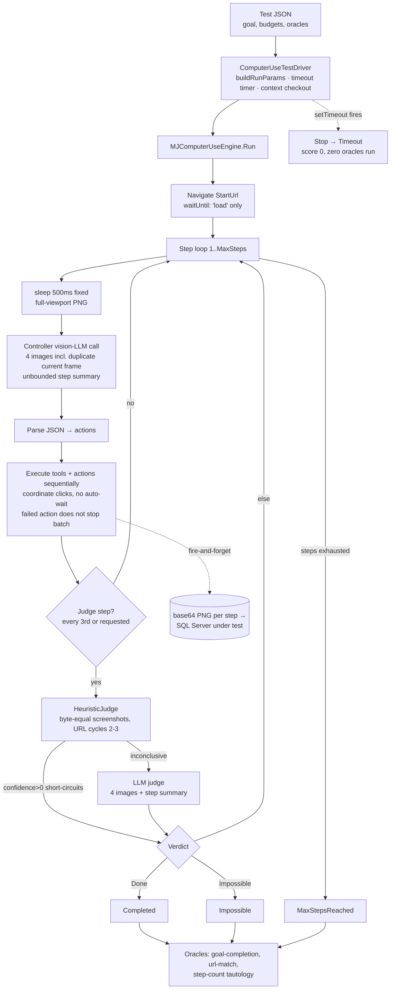

# Computer Use Robustness & Consistency Plan

**Status: PROPOSAL** · 2026-07-20 · Prepared from a 14-agent deep-analysis of the codebase + external research

**Scope**: the PER-TEST agent engine and its MJ integration — perception, action execution, loop control, waiting, prompting, judging/oracles, per-run telemetry, and replay/caching — i.e. `packages/AI/ComputerUse` (Layer 1), `packages/AI/MJComputerUse` (Layer 2 + `ComputerUseTestDriver`), and the oracle layer in `packages/TestingFramework/Engine` as it applies to a single test run. Suite-level scheduling, Docker topology, cross-test retry orchestration, worker sizing, and CLI/reporting belong to the sibling **[Docker Regression Architecture & Reliability Plan](docker-regression-reliability-plan.md)**; where a proposal here produces a signal that plan consumes (e.g. per-test failure classification feeding the retry scheduler), the handoff is noted explicitly rather than duplicated.

---

## 1. Executive Summary

The Computer Use system spends its most expensive resource — a vision-LLM round-trip — on its most deterministic problems: waiting for pages to render, re-deriving action sequences it has already discovered on hundreds of prior runs, and re-judging outcomes that a URL check or a SQL row-count could decide. At the same time it is structurally unable to distinguish "the environment is slow" from "the agent is lost" from "the app is broken": budgets conflate wall-clock with reasoning steps, the judge is evidence-starved, timeouts skip evaluation entirely, and failure classification is keyword-matching on exception strings. Every observed failure cluster — 15 navigation loops, 14 stuck/blank pages, 6 timeouts, retry storms, second-half degradation — traces back to one of these two root causes. This is also the architecture every mature system in the field (Anthropic Teach Mode, OpenAI CUA GA, browser-use/workflow-use, Stagehand, Skyvern, Momentic, QA Wolf, mabl) has independently moved away from: their consensus is **a deterministic substrate does everything deterministic; the LLM is reserved for perception and recovery; every verdict is backed by checkable evidence**.

The highest-leverage changes, in order:

1. **Deterministic trajectory replay with LLM self-heal (Theme C — the flagship).** Record the resolved action trace of every passing run; replay it at Playwright speed with per-step guards and postcondition assertions; fall back to the LLM only at the point of divergence, then re-record. For a suite where ~88% of tests pass identically run over run, this converts most executions to sub-minute, zero-token deterministic runs, collapses the 7.8h wall clock, removes LLM trajectory variance (the main source of the 37 flaky results), and shrinks the load window that produces the genuine failures.
2. **An engine-side settle primitive plus an optional app readiness beacon (Theme A).** Waiting must be free. Today a 30-second render consumes 3–6 vision-LLM round-trips and the same number of budget steps; a bounded settle loop before each perception — built entirely from app-agnostic signals (`networkidle`, perceptual-hash stability, generic ARIA busy markers) — converts that to zero LLM cost and makes a genuine stall a crisp, classifiable infrastructure timeout. Apps that can declare their own readiness opt into a beacon through the same config surface; MJExplorer ships a 5-line `data-mj-ready` implementation, but the engine never knows MJ exists (see the layering contract at the top of §4).
3. **Element-grounded perception (Theme A).** Replace raw 1000×1000 coordinate guessing over PNGs with an indexed interactive-element representation (a11y-tree refs, optionally set-of-marks overlays). Clicks resolve to Playwright locators with real actionability auto-wait, tokens per step drop ~10×, mid-render layout shifts stop causing misclicks, and — critically — action traces become replayable and self-healable, which is the precondition for item 1 at production quality.
4. **Loop control that acts (Theme B).** Loop detection today is byte-equality screenshots and period-2/3 URL cycles, evaluated every third step, advisory-only; 33 of 44 hard failures burned their entire budget after the loop was already labeled. Replace with per-step state signatures (normalized URL + perceptual hash), an escalation ladder (structured warning → banned actions → forced recovery → truthful early `Failed:LoopDetected` termination), and agent-time budgets that stop charging the agent for environment latency.
5. **Deterministic-first judging (Theme D).** Resurrect the 380 tests' dead `judgeValidationCriteria` as a rubric the judge must answer per-criterion; add DOM/DB/console oracles that decide pass/fail when they can; demote the LLM judge to tiebreaker and diagnostician. The step-count oracle is a tautology today (it passed on all 38 Failed tests) and should stop gating anything.
6. **Split-phase telemetry and structured failure classification (Theme F).** One `DurationMs` per step cannot answer the suite's central question ("app slow, LLM slow, or agent lost?"). Record per-phase timings, per-step perceptual hashes, prompt-run linkage, and a machine-readable `failureClass` on every result — produced per-test here, consumed by the sibling plan's scheduler for reason-gated retries. The recheck run proved the cost of not having this: deterministic whole-feature failures were retried 3× each, turning ~1h of signal into 4.7h of spend.
7. **Resource hygiene (Theme G).** Stop writing every step's base64 PNG into the SQL Server that backs the app under test; release screenshots from RAM after persistence; skip the teardown app-boot that scrubs a context about to be destroyed; warm-seed the Angular metadata cache so 380 cold boots stop hammering MJAPI. These are direct mechanisms behind the second-half degradation and the 4-worker OOM.

The architectural thesis: **convert the agent from a per-run explorer into a compiler.** Exploration (LLM-driven) happens once per test per UI change and produces a deterministic, version-controlled artifact — a trace with guards and postconditions. Execution replays that artifact. Judging asserts recorded postconditions. The LLM re-enters only at divergence points, with focused context, and its work product is immediately re-compiled into the artifact. Everything else in this plan either enables that conversion (perception, telemetry), hardens the explorer for the runs that still need it (settle, loop control, prompting, judging), or removes self-inflicted load (hygiene).

---

## 2. Current Architecture

### 2.1 The two layers and the driver

- **Layer 1 — `@memberjunction/computer-use`** (`packages/AI/ComputerUse/src/`): `ComputerUseEngine` owns the perceive→decide→act loop; `PlaywrightBrowserAdapter` (PBA) and `SharedContextBrowserAdapter` (SCBA — the adapter the regression suite actually runs on) execute browser actions; `ResponseParser` maps controller JSON to typed actions; `HeuristicJudge`/`LLMJudge`/`HybridJudge` evaluate progress; `NavigationGuard` allow/blocks hostnames; `AuthHandler` applies auth bindings; `HeadlessBrowserEngine` (a `BaseSingleton`) owns the shared Chromium and hands out contexts.
- **Layer 2 — `@memberjunction/mj-computer-use`**: `MJComputerUseEngine` overrides controller/judge execution to route through `AIPromptRunner` with the stored metadata prompts ("Computer Use - Controller"/"Computer Use - Judge", model chain Gemini Flash → Haiku → GPT), sends screenshot history + current frame as image messages (`MJComputerUseEngine.ts:508-553`), and fire-and-forget persists every step screenshot into `MJ: AI Prompt Run Medias` (`:893-925`).
- **Driver — `ComputerUseTestDriver`** (`@RegisterClass(BaseTestDriver, 'ComputerUseTestDriver')`, ComputerUseTestDriver.ts:102): parses the test's `Configuration`/`InputDefinition`/`ExpectedOutcomes` JSON, substitutes `{{variables}}`, builds `RunComputerUseParams` (:344-435), enforces `maxExecutionTime` via `setTimeout → engine.Stop()` (:444-506), checks out a fresh browser context per test seeded with per-worker/suite-wide auth `storageState` (:581-646), then runs oracles (`goal-completion`, `url-match`, `step-count`) over `actualOutput` (:954-1027). Retries live one layer up in `TestEngine.runWithRetries` (retry.ts:32) and are out of scope here.

### 2.2 The step loop, mechanically

Per step (`executeSingleStep`, ComputerUseEngine.ts:515-569): sleep a fixed `ScreenshotDelayMs` (500ms, params.ts:94) → full-viewport PNG at 1280×720, pushed into a ring buffer (depth 3 in suite config) → build the controller request with goal, current URL, action catalog, previous judge feedback (last one only), FormLogin creds, and an **unbounded** text summary of every prior step (`RunContext.BuildStepSummary`, RunContext.ts:103-141) → one vision-LLM call (Layer 2 sends **all** ring-buffer screenshots *plus* the current frame again — the current frame is transmitted twice every step) → parse JSON (unknown action types silently dropped, ResponseParser.ts:189-191) → execute tool calls then browser actions sequentially, with a failed action **not** aborting the rest of the batch (:828-840) → every 3rd step (suite config `EveryNSteps:3`) or on controller request, run the judge: heuristics first, and any heuristic verdict with confidence > 0 short-circuits the LLM judge (HybridJudge.ts:51).

Grounding is raw-coordinate vision: the LLM emits clicks in a normalized 1000×1000 space, scaled to viewport and executed via `page.mouse.click(x,y)` — no actionability checks, no auto-wait, no element resolution (SCBA:224, PBA:962). The selector/modifier/wait-for-selector machinery in the adapters is unreachable from the LLM: the prompt never advertises it, the parser never emits it, and `scaleActionsToViewport` (ComputerUseEngine.ts:671-697) would drop it anyway. The structured-perception surface (`GetAccessibilitySnapshot`, `GetVisibleText`, `QueryElement`, `WaitForLoadState`) is fully implemented on PBA (:435-557) but **never called by the loop, and no-ops on SCBA** — the suite's adapter returns `''`/`null`/`Exists:false` for all of them (BaseBrowserAdapter.ts:87-166).

Stop conditions: judge `Done` → `Completed`; judge `Impossible` → `Impossible`; 3 consecutive zero-action steps → `Error` (this counter also counts legitimate `requestJudgement:true` responses); `MaxSteps` → `MaxStepsReached`; `Stop()` observed only at step top. `maxExecutionTime` is not an engine concept — the driver's timer fires, the engine finishes its current step (potentially 30–90s), and the result is `Timeout` with **score 0 and zero oracles run** (driver:800-826). `Cancelled` is mapped to `Timeout` (:841). The `'Failed'` status defined in results.ts:26 is never produced. The recovery strategies documented in errors.ts:5-16 (LLM backoff, parse re-prompt, browser restart, nav-timeout retry) are aspirational — none is implemented, and `executeControllerWithRetry` (:778-797) returns the same response in every branch.



### 2.3 What this costs

A judged step ≈ 2 vision-LLM calls (controller + judge, each carrying up to 4 full PNG payloads and the growing step summary) + 2+ DB writes + 500ms fixed sleep + action time. 35 steps × 12–25s/step under load lands at or over the 420s budget. Nothing is reused across runs: every test re-derives login navigation, app-switcher traversal, and layout comprehension from pixels, every run, forever. The full-run economics: ~5,700 controller vision calls + ~2,000 judge vision calls per 380-test run before retries, `totalCost: 0` recorded on every result because prompt runs are never linked to steps.

---

## 3. Evidence

### 3.1 Full 380-test run (run-20260718T160625Z, 3 workers, 7.79h)

- 379 executed: **335 Passed** (298 clean + 37 flaky/pass-on-retry), **38 Failed**, **6 Timeout**. 515 total attempts (36% re-run overhead). Average score 0.846.
- **Durations are bimodal**: clean passes p50 59s / p90 148s at a stable ~7.5s/step in every hour of the run; failures p50 241s; timeouts 424–437s. Degradation is not gradual slowdown — a page either renders or catastrophically stalls.
- **33 of 44 hard failures ran to exactly their 35-step cap**; only 5 ended early via an `Impossible` verdict. The heuristic judge *labels* loops ("Navigation loop detected") but the run still burns to the cap.
- Failure taxonomy (hand-mined from judge messages — no structured field exists): 15 navigation loops, 12 stuck (3 identical screenshots), 3 blank/"Loading workspace…" stalls, 5 judged Impossible (2 genuine lazy-load bundling bugs in Feature Pipelines, 1 missing API keys, 1 data gap, 1 automation limitation), 6 timeouts (zero oracle output), 3 other.
- **13/44 failures bounced through an Auth0 consent page mid-test** (T322–T350 block): the trail is "page won't render → wait/click/refresh → dumped to `/` → login → consent → back at Home → re-navigate → repeat to cap". Each recovery costs ~10+ steps. This explains most of the navigation-loop bucket in that block.
- **The app-switcher-hunt archetype**: T331 burned 25/35 steps scrolling the app-switcher for "Bulk Operations"; every test starts at bare `http://localhost:4200` (no deep links), so switcher navigation is re-derived in every single test.
- Retry economics: attempt 1 passes 78.6%; attempt 2 32%; attempt 3 20%. The 44 never-passing tests consumed 132 attempts ≈ 40–65% of total 3-worker capacity, mostly late in the run when the host was most degraded. Deterministic `Impossible` verdicts were retried 3× each.
- Scoring is effectively binary: failures cluster at 0.20–0.30 (the step-count oracle's dead-weight floor), passes at 0.76–1.0, the 0.30–0.75 band is empty. Judge confidence on passes: 323/335 at exactly 1.0 — uncalibrated. The step-count oracle passed on all 38 Failed tests and can never fail by construction (engine caps steps at the same limit the oracle checks).
- Host telemetry: system free memory fell monotonically 21.7GB → 2.6GB over 7.8h while MJAPI probe latency stayed flat (p50 1–5ms, 0 failed probes) — the leak is unattributed because there is no per-container stats collection (sibling plan's territory; the per-test contribution — screenshot retention ×3 copies, DB write amplification — is Theme G here).

### 3.2 Recheck run (run-20260720T034359Z) — NEW, postdates the analysis files

The 44 hard failures were re-run on a **dedicated host** at 2 workers (4h44m total):

- **17 passed — but 8 of those only on retry** (still flaky even at low load on dedicated hardware).
- **25 Failed on all 3 attempts; 2 Timeout on all attempts.** Average score 0.464.
- The consistent failures cluster by **entire feature area**: Routines T322–T327 (all 6), Bulk Operations T333–T338 (all 6), Feature Pipelines T259/T260 (the known lazy-load bundling gap), Credentials T228/T229 (+T230 flaky), Database Designer T198/T201, plus singletons T098, T156, T245, T249, T256, T315, T331, T368, T377.

**What this proves**: cross-run-consistent, whole-feature-cluster failures are almost certainly genuine app/bundling/test-spec defects, **not** environment noise — the environment excuse was eliminated by design. And the current system retried these deterministic failures 3× each anyway: the retry-classification gap made roughly one hour of signal cost 4.7 hours of wall-clock. It also proves a diagnosis gap this plan must close: **the suite cannot distinguish "feature module never loads" from "agent got lost"** — both surface as MaxSteps/loop failures with a free-text judge message, when a single console-error capture (`ChunkLoadError`, failed lazy-route request) would have separated them in one step.

### 3.3 OOM run (run-20260718T032012Z, 4 workers)

Preflight healthy at 24GB free; free memory crashed to 617MB at t+80min; runner OOM-killed (exit 137); the orphaned health monitor kept probing for 10+ hours. **Zero test results were preserved from the entire run** — `results.json` is written once at the very end. Screenshot retention economics per §2.3 (every step's PNG held in RAM for the whole run, then duplicated into outputs, plus a third copy inline in the DB) make the exit-137 unsurprising at 4 workers.

### 3.4 Telemetry gaps that prevent proof

These are findings in themselves — each blocks a diagnosis the team needed this month: (1) no per-attempt records (retry.ts:43 overwrites; flakiness — the #1 signal — is undiagnosable); (2) no per-step timestamps or phase timings (cannot split LLM vs page-wait vs action time); (3) no LLM telemetry (`totalCost: 0`, no tokens, no serving model — silent mid-suite vendor failover is invisible); (4) no browser console/network capture per test (the Auth0/401 hypothesis and the ChunkLoadError class were both inferable in one run with a HAR); (5) no structured failure category (taxonomies are regex-mined from prose); (6) no incremental results (two runs lost everything); (7) no linkage from test results to `AIPromptRun` rows.

---

## 4. Improvement Catalog

Item IDs are stable references (`CU-<theme><n>`). Every proposal is scoped to the per-test engine/driver; where it emits a signal for the suite scheduler, the sibling plan is referenced.

**Layering contract (binding on every item).** `@memberjunction/computer-use` (Layer 1) is and must remain application-agnostic: no MJ selector, route, text string, or behavior may be hardcoded in it. The codebase already encodes this intent — Layer 1's only dependencies are `@memberjunction/global|core|ai` (generic infrastructure, no entities), and its only extension seams are four protected virtuals (`executeControllerPrompt`, `executeJudgePrompt`, `onStepComplete`, `onRunComplete`; ComputerUseEngine.ts:179-211) plus `RunComputerUseParams`. Since Layer 2 cannot override the private step loop, every new capability in this plan (settle, loop detection, replay) must land in Layer 1 as a **config-driven mechanism**. Every app-specific signal this plan uses — loading-marker selectors, readiness beacons, volatile URL params, identity-provider patterns, error-pattern lists, context seeds — enters Layer 1 only as opaque configuration on a new **`AppProfile`** type on `RunComputerUseParams`, the structured sibling of the existing `ApplicationContext` field (params.ts:131-139), populated the same way: by the driver from `TestSuite.Configuration` + per-test overrides. Engine defaults stay app-neutral and work on any web app (`networkidle`, perceptual-hash stability, `[aria-busy="true"]`). This is the same split Playwright uses for `storageState`/`waitForFunction`: generic mechanism, caller-supplied condition. Items below that mention MJ specifics (`data-mj-ready`, `.mj-loading`, Auth0 patterns, metadata warm-seeds) are describing the MJ *profile contents*, never Layer-1 behavior. **Note that this contract is already violated in shipped code** — the default judge prompt hardcodes MJExplorer loading-screen text (see CU-E7); remediation is part of this plan, not just prevention.

---

### Theme A — Deterministic Waiting & Perception

#### CU-A1. Engine-side settle primitive: wait-until-stable before every perception

**Problem.** There is no wait-for-idle fast path. Navigation waits end at `load` (PBA:416, 864-877), which for an Angular SPA fires long before "Loading workspace…" finishes; the only engine-side render wait is the fixed 500ms `ScreenshotDelayMs` (params.ts:94, ComputerUseEngine.ts:649-652); `WaitForLoadState` exists on the adapter (PBA:469-476) but the loop never calls it — and it no-ops on SCBA anyway. Every spinner observation costs 500ms + screenshot + a multi-second vision call + (every 3rd step) a judge call, all charged against `maxSteps` and `maxExecutionTime`. This is the direct mechanism behind the 14 stuck/blank failures, much of the step-budget exhaustion, and the screenshot-misread → oscillation chain (click nav → 500ms later screenshot shows the old/blank page → controller concludes the click failed → clicks elsewhere → loop).

**Proposal.** After executing each step's action batch (and after the initial StartUrl navigation), run a settle loop before capturing the screenshot:

1. `WaitForLoadState('networkidle')` capped at 3–5s (fast path — usually returns immediately on an idle page).
2. Poll at 500ms–1s: (a) loading-marker probe — `QueryElement` against the `AppProfile`'s busy-marker list; engine defaults are app-neutral (`[aria-busy="true"]`, `role="progressbar"`), and the MJ profile adds `.mj-loading`/`mj-loading` and the text "Loading workspace"; (b) perceptual-hash comparison of downscaled screenshots — stable when two consecutive polls hash-equal; (c) optionally a pending-request count via `page.evaluate` over the performance API (browser-use's probe, capped at 2s because it can hang on heavy pages).
3. Exit when stable, or when a settle budget expires (default 30s, configurable per test via a `settle: { maxWaitMs, pollMs }` block, with marker lists coming from the `AppProfile` — driver plumbs both through `RunComputerUseParams`).
4. Record `SettleMs` and the exit reason (`stable | budget | marker-cleared`) on the `StepRecord`; render "waited 22.4s for page to settle" into the step summary so controller and judge see waiting as progress, not absence of progress.

`ScreenshotDelayMs` becomes an adaptive floor rather than the entire wait strategy. Sub-options where designs diverge:
- **(i) Playwright-native**: `networkidle` + marker probe only. Simplest; blind to CPU-bound rendering after network settles.
- **(ii) Hash-stability**: add the perceptual-hash poll. Robust to any rendering pattern; costs one extra downscaled screenshot per poll (~10–30ms).
- **(iii) MutationObserver counter**: inject via `addInitScript`, read a mutation counter, stable when unchanged across two polls. Most precise DOM-quiescence signal; adds injected state to the app under test.
Recommend (ii) as default with (i) as the fast path, and (iii) held in reserve; combine with CU-A2's beacon when available (beacon wins over all heuristics).

**Expected impact.** Converts 3–6 wasted LLM round-trips per slow load into free engine polling; directly attacks the 14 stuck/blank failures and the loop-seeding misreads; makes a genuine stall a crisp `settle-budget-exceeded` event for CU-F5 classification. Prerequisite: CU-A3 (the probes must actually work on SCBA).

**Risks / open questions.** `networkidle` can be defeated by long-polling/websocket traffic (MJExplorer uses GraphQL subscriptions) — the marker/hash paths must not depend on it. Settle time must be excluded from agent-time budgets (CU-B4) or the fix trades step exhaustion for wall-clock exhaustion. App-specific marker selectors enter only via the `AppProfile` (layering contract) — engine defaults stay app-neutral.

**Wave 1 status — Layer-1 primitive LANDED (default (ii)+(i)).** New app-neutral `AppProfile`/`SettleConfig` seam (`types/app-profile.ts`) + `RunComputerUseParams.AppProfile`. The engine's `settleBeforePerception` replaces the fixed `ScreenshotDelayMs`: `networkidle` fast path (capped, never sole signal), then a poll loop over the readiness beacon (A2), busy markers (app-neutral defaults `[aria-busy="true"]`/`[role="progressbar"]` merged with profile markers), and perceptual-hash stability — now that CU-A3 makes `QueryElement`/`WaitForLoadState` real on SCBA. Exit reason (`beacon-ready`/`marker-cleared`/`stable`/`networkidle`/`budget`) + `SettleMs` recorded per step; a `budget` exit is the crisp candidate-stall signal for CU-F5. The per-poll decision is the pure, unit-tested `resolveSettleExit`. Floor preserves legacy `ScreenshotDelayMs` when no profile is supplied (zero behavior change for profile-less callers). MutationObserver variant (iii) held in reserve. **Remaining:** settle exclusion from agent-time budgets lands with CU-B4; the MJ driver plumbing + MJExplorer beacon are CU-A2's Layer-2 half (next).

#### CU-A2. Generic readiness-beacon contract; MJExplorer implements it

**Problem.** All readiness detection in CU-A1 is inference. Some apps under test can simply *declare* readiness — MJExplorer's shell already knows exactly when a route is ready (`NotifyLoadComplete` / `LoadCompleteEvent` clears the loading screen — see the BaseResourceComponent contract in the Angular guide). Guessing readiness from pixels when the app can declare it is self-inflicted ambiguity — and it is why the suite cannot distinguish "feature module never loads" (Routines/Bulk Ops clusters, §3.2) from "agent lost".

**Proposal.** Two halves, split per the layering contract:
1. **Layer 1 (generic):** the `AppProfile` gains an optional `readinessBeacon` declaration — a DOM attribute name, selector, or predicate the settle loop polls *first*, before falling back to the CU-A1 heuristics (which remain the zero-config default for apps with no beacon). When a declared beacon never arrives within the settle budget, the engine records a first-class `AppStalled` observation on the step — with the pending-request list and any console errors (CU-A7) — and the classifier (CU-F5) tags the run `env-stall` or `app-error` depending on accompanying diagnostics. The engine knows only "poll what the profile names"; it contains no MJ identifiers.
2. **MJ profile + app (Layer 2 / MJExplorer):** MJExplorer sets `document.documentElement.dataset.mjReady = 'true'` (and/or `window.__mjRouteReady = { route, ts }`) when the active route's `NotifyLoadComplete` fires, clearing it on navigation start; the MJ suite profile declares that attribute as its beacon. Any other application gets the same benefit by implementing its own beacon and naming it in its profile.

**Expected impact.** Deterministic, zero-cost readiness for every MJExplorer test; the Routines/Bulk-Ops "module never loads" class becomes detectable in one settle cycle instead of 35 steps; non-MJ consumers keep working with zero config and can opt into the same contract.

**Risks / open questions.** A ~5-line app change shipped with MJExplorer — needs a home that doesn't leak test instrumentation into production semantics (a `data-*` attribute is inert; acceptable). Lazy-loaded sub-panels that render after `NotifyLoadComplete` may still be settling — a beacon marks route readiness, not total quiescence; keep the hash-stability check as a second gate.

**Wave 1 status — LANDED (both halves).** *Layer 2 / driver:* `ComputerUseTestConfig.appProfile` (optional) + `buildAppProfile` set `MJRunComputerUseParams.AppProfile` with MJ-Explorer defaults — beacon `[data-mj-ready="true"]`, busy markers `mj-loading`/`.mj-loading` — config-overridable for non-MJ targets. MJ specifics live here, never in Layer 1. *App:* MJExplorer's shell `loading` flag became a getter/setter that sets `data-mj-ready="true"` on `<html>` when loading clears (route resource ready) and removes it when loading is re-raised — centralized on the one state the shell already maintains across all ~7 transition sites, rather than a fragile per-site hook. The attribute is inert (no production semantics). Hash-stability remains the second gate for post-beacon sub-panel settling, per the risk note. ngc-clean; the beacon is present in compiled `dist`.

#### CU-A3. SCBA/PBA parity via a shared PageActionExecutor

**Problem.** `SharedContextBrowserAdapter` — the adapter the regression suite actually runs on — does not override the perception surface, so `GetVisibleText` returns `''`, `GetAccessibilitySnapshot` returns `null`, `QueryElement` returns `Exists:false`, and `WaitForLoadState` resolves immediately (BaseBrowserAdapter.ts:87-166). Any engine improvement that uses structured perception silently gets nothing in suite mode. Action-execution logic is also duplicated between PBA and SCBA and has already drifted (perception, screencast, audio missing on SCBA).

**Proposal.** Extract a shared `PageActionExecutor` operating on a Playwright `Page` — action dispatch, header interception, click/drag mechanics, and the full perception surface — consumed by both adapters. SCBA and PBA become thin lifecycle wrappers (context ownership vs page ownership). Add a parity unit test that reflects over `BaseBrowserAdapter`'s abstract surface and asserts both adapters override every method (no silent base no-op).

**Expected impact.** Unblocks CU-A1/A2/A4/A7 in the suite; ends the drift class permanently.

**Risks / open questions.** Pure refactor risk; mitigate with the existing action-level unit tests plus a smoke run of the T001 login test on both adapters.

**Wave 1 status — perception parity LANDED; ExecuteAction dedup deferred.** The functional gap was perception: SCBA overrode only Navigate/CaptureScreenshot/ExecuteAction and inherited BaseBrowserAdapter's no-op perception. Extracted the Page-based perception surface (`GetVisibleText`, `GetSelectionText`, `GetTitle`, `WaitForLoadState`, `GetAccessibilitySnapshot`, `QueryElement`) into a shared `page-perception.ts`; **both** adapters now delegate to it, so SCBA has real perception and the two can't drift. New `adapter-perception-parity.test.ts` reflects over the surface and fails if either adapter stops overriding a method. **Scoped down from the full "PageActionExecutor" extraction:** `ExecuteAction` is *duplicated* between PBA/SCBA but not *broken* on SCBA (both already override it), so it's not a functional blocker for A1/A2/A4/A7 — its dedup is deferred to a focused follow-up. Screencast/audio stay PBA-only by design (live-view features SCBA doesn't need), so the parity test scopes to the perception surface, not literally every base method.

#### CU-A4. Element-grounded perception: indexed interactive elements + locator-resolved actions

**Problem.** The controller is a pure coordinate/vision agent: it estimates 0–1000 bbox coordinates from a PNG, and the engine fires `page.mouse.click(x,y)` with zero actionability semantics (SCBA:224; PBA:962) — clicks land on whatever occupies that pixel, including nothing, and a layout shift mid-render silently retargets them. The literature is unambiguous that this is the weakest grounding option: SoM exists because VLMs ground poorly on unannotated screenshots (arXiv:2310.11441); WebVoyager attributes 24.8% of failures to visual grounding (arXiv:2401.13919); Playwright MCP's a11y-ref approach costs ~200–400 tokens/step vs ~3,000–5,000 for a screenshot (playwright.dev/mcp/snapshots). Meanwhile MJ's adapters already implement `GetAccessibilitySnapshot` (PBA:483-509) — unused.

**Proposal.** Add a perception mode (per-test/suite flag, default ON for the regression suite after bake-in) where each step's controller request contains:

1. A **serialized interactive-element list**: walk the a11y snapshot + a `page.evaluate` interactivity probe (buttons/links/inputs/ARIA roles/elements with click listeners), assign stable per-snapshot indices, emit `[12] button "Save Record"`, `[13] textbox "Name" (empty)`, with `*` markers on elements new since the previous step (browser-use's diff convention) and `|SCROLL|` markers on scrollable containers. Budget the serialization (interactive + landmark nodes only, attribute whitelist, cap ~8–15K chars) — formatting alone is worth 51–79% token reduction (dev.to/kuroko1t study).
2. A **`ClickElement { Index }` / `TypeIntoElement { Index, Text }` action family**: the engine resolves index → element handle → locator-based `element.click()` / `fill()` with Playwright's native actionability auto-wait and bounded retry. Coordinate actions remain as fallback for canvas/custom-rendered surfaces.
3. The screenshot stays in the request (dense grids, visual disambiguation) but becomes auxiliary — see CU-A5 for its diet.

Sub-options:
- **(i) Text-list only** (Playwright-MCP style): cheapest tokens, no image dependency for grounding; risk on visually-dense grids.
- **(ii) Set-of-marks overlay**: composite numbered badges onto the screenshot copy in the harness (PIL/sharp — browser-use composits post-capture so the app DOM is never mutated) and let the model correlate visual + index. Better for dense Explorer grids; keeps image cost.
- **(iii) Hybrid** (recommended): text list always; SoM overlay only when the element count is high or a prior grounding failure occurred this run.

Record, for every executed element action, the resolved element's role/name/selector/bbox into the `StepRecord` — this is the raw material that makes CU-C1 traces replayable and self-healable.

**Expected impact.** Eliminates the misclick → wander → loop chain at its source; ~10× token reduction per step where the image can be dropped/downscaled; actions gain auto-wait for free (a click on a still-rendering button waits instead of missing); traces become semantic (`click role=link name="Data Explorer"`) instead of brittle coordinates. Single biggest quality lever for the LLM tier.

**Risks / open questions.** The extractor itself stays generic (a11y tree + interactivity probe — no MJ-conditional code); widget-toolkit handling (Kendo/AG-Grid virtualized rows expose partial a11y trees) should land as generic handling for those toolkits or as `AppProfile`-supplied extraction hints — test on T-grid-heavy cases early. Off-viewport bloat (playwright issue #39955) — filter to viewport + near-viewport with scroll hints. a11y snapshots are blind to purely visual regressions — keep screenshots for the judge and for explicitly visual assertions (Magnitude's lesson).

**Wave 2 status — LANDED (text-list mode, opt-in); SoM overlay + hybrid escalation deferred.** Shipped in two commits. **pt.1 (Layer-1 foundation):** `InteractiveElement` (index/role/name/selector/bbox/value/scrollable/disabled) + `ClickElementAction{Index,ClickCount,Button,Modifiers}` + `TypeIntoElementAction{Index,Text,PressEnter}` on the `BrowserAction` union; a pure, unit-tested `serializeInteractiveElements` (`[12] button "Save"` / `[13] textbox "Name" (empty)`, `*` = new-since-last-step, `|SCROLL|`/`(disabled)` markers, char budget with an explicit truncation note); a shared, app-agnostic `element-extraction.ts` (an in-page interactivity probe over standard interactive tags + ARIA roles + click affordances, viewport-near only, xpath per element + `clickInteractiveElement`/`typeIntoInteractiveElement` locator helpers) used by BOTH adapters; parser cases; `BaseBrowserAdapter.ExtractInteractiveElements()` no-op default with PBA + SCBA overriding it (cache the list, resolve `ClickElement`/`TypeIntoElement` by index). pt.1 also closed a found A6 SCBA-parity gap (SCBA — the suite adapter — had ignored `Selector` on Click/Type/Scroll/Wait, silently making A6's selector clicks + the *preferred* semantic wait PBA-only in the suite; SCBA now honors all four). **pt.2 (engine + prompt + Layer-2):** opt-in `RunComputerUseParams.ElementGrounding` (default OFF — coordinate/vision mode until baked in); each step the engine extracts elements (`perceiveInteractiveElements`), records them on `StepRecord.InteractiveElements` (the raw material for CU-C1 replay), serializes with the prev-step diff (`RunContext.LastInteractiveElements`), and renders the indexed list into the controller prompt — Layer-1 `renderInteractiveElementsSection` AND, avoiding the A7/B1 "named-field mapping" trap, the Layer-2 `controller.template.md` `` block fed by the new `interactiveElements` data mapping. The shared `controller-actions.md` teaches ClickElement/TypeIntoElement (generic examples — E7 gate green) as **preferred** when a list is present, coordinates as the canvas/custom fallback. MJ driver exposes `config.elementGrounding` (default off). **Deferred:** sub-options (ii) Set-of-Marks screenshot overlay and (iii) hybrid escalation (SoM only on high element count / prior grounding failure); per-widget virtualized-grid extractor cases (land generically or as AppProfile hints when a grid-heavy test needs them). Tests: ComputerUse 291 (+8 serializer); MJComputerUse 144. This is the single biggest LLM-tier quality lever — misclick→wander→loop removed at the source, actions gain auto-wait, traces become semantic.

#### CU-A5. Screenshot hygiene: dedupe, downscale, diff

**Problem.** (1) Layer 2 transmits the current frame twice per controller call — `captureScreenshot` pushes it into the ring buffer *before* the request is built, and `buildScreenshotMessages` (MJComputerUseEngine.ts:508-553) sends the whole buffer plus the current frame again: 25% of image payload is a byte-identical duplicate at depth 3. The judge path duplicates identically (ComputerUseEngine.ts:942-944). (2) Screenshots are full-viewport PNGs, never downscaled or JPEG-compressed (PBA:421-425) — 100–400KB uploads per image, ~1.2K vision tokens each, though JPEG plumbing already exists for screencast (PBA:646). (3) No screenshot diffing anywhere — an unchanged frame is re-encoded, re-uploaded, re-tokenized every step; the only change detector is HeuristicJudge's exact base64 equality.

**Proposal.**
1. Slice the ring buffer to exclude the current frame from the history message (one-line fix), both controller and judge paths.
2. History frames: downscale to ~512px wide, JPEG q70 — history conveys *progression*, not pixel precision; keep the current frame full-res (1280×720 already matches Anthropic's recommended training resolution; verify declared dims == sent dims per their click-accuracy guidance).
3. Compute a 64-bit dHash per captured frame (a few ms in Node; stored on the StepRecord — shared infrastructure with CU-B1/CU-F6). When the new frame hash-equals the previous step's, replace the image in the prompt with the text `"[screen unchanged from previous step]"` — cheaper *and* a strong loop signal for the model.

**Expected impact.** 25–60% image-payload reduction per call; faster round-trips exactly when the host is loaded; the hash is reused by loop detection, judge gating, and failure classification.

**Risks / open questions.** JPEG artifacts on downscaled history are irrelevant (history is context, not grounding); confirm the current-frame resolution/quality is untouched to avoid regressing click accuracy in coordinate-fallback mode.

#### CU-A6. Unlock the full action vocabulary (selectors, modifiers, semantic waits, double/right-click)

**Problem.** Three vocabularies disagree: the type system supports `Selector` on Click/Type/Scroll/Wait and `Modifiers` on Click/Keypress (browser.ts:56-173); the prompt (`CONTROLLER_ACTIONS`, prompt-parts.generated.ts:9) advertises none of that — no Selector, no Modifiers, no double/right-click (parser accepts `Button`/`ClickCount` but the model is never told); the parser drops `Selector`/`Modifiers` entirely, and `scaleActionsToViewport` (ComputerUseEngine.ts:679-685) constructs new actions copying only X/Y/Button/ClickCount/BoundingBox. The selector-based `waitForSelector` wait (PBA:853-857) is unreachable — the LLM's only wait is a blind fixed sleep. Grid-heavy Explorer tests that need double-click-to-open rely on the model guessing an undocumented capability.

**Proposal.** Teach the prompt the existing fields (`Selector` on Click/Type/Wait/Scroll; `Modifiers`; `ClickCount`; `Button`); add parser cases; fix `scaleActionsToViewport` to pass them through. Highlight `{"Type":"Wait","Selector":".record-form"}` in the prompt as the preferred wait ("wait for the thing you expect, not a duration"). This is the cheap subset of CU-A4 and worth doing even if A4 lands later — with A4, `Selector` becomes the fallback channel and `Index` the primary.

**Expected impact.** Bounded semantic waits replace blind sleeps; double-click unlocks grid rows; a ~200-line change (prompt partial + parser cases + passthrough).

**Risks / open questions.** LLM-synthesized selectors are less reliable than harness-resolved indices — prompt guidance should prefer text/role-anchored selectors and A4 supersedes this for grounding.

**Wave 2 status — LANDED.** The three vocabularies now agree. The type system + adapters already supported `Selector` (Click/Type/Scroll/Wait), `Modifiers` (Click/Keypress), and `ClickCount`/`Button` (Click) — the gap was that the parser dropped them and the prompt never advertised them. Fixed all three legs: (1) `ResponseParser` now reads `Selector` (via a new `toSelector` — trims, drops empty) and `Modifiers` (via `toKeyModifiers` — accepts an array or single value, normalizes aliases `ctrl→Control`/`cmd|command→Meta`/`option→Alt`, dedupes, drops unrecognized) across the Click/Type/Keypress/Scroll/Wait cases, both PascalCase and camelCase keys; (2) `scaleActionsToViewport` (which reconstructs Click/Scroll) now copies `Selector`/`Modifiers` through instead of dropping them — Type/Keypress/Wait already passed through untouched; (3) the shared `controller-actions.md` partial (regenerated into `prompt-parts.generated.ts`, so Layer-1 default + Layer-2 `{@include}` both get it; release-sync pushes the template) teaches double-click (`ClickCount:2`), right-click (`Button:"right"`), selector targeting (with **generic** text/role-anchored examples — `button:has-text("Save")`, `.record-form` — so the CU-E7 gate stays green and no app specifics leak), click/keypress modifiers, and — highlighted as **preferred** — the semantic `{"Type":"Wait","Selector":"…"}` ("wait for the thing you expect, not a duration") over blind `DurationMs` sleeps. Pure additive to Layer 1 (no type-signature change Layer 2 depends on). Tests: ComputerUse 283 (+3 parser cases for Selector/Modifiers/alias-normalization/empty-guard). This is the cheap subset of CU-A4; when A4 lands, `Selector` becomes the fallback channel and `Index` the primary.

#### CU-A7. Feed browser diagnostics to the controller and judge; wire the dead 401/403 recovery

**Problem.** SCBA buffers console errors, page errors, failed requests, and crashes (SCBA:427-468), but the driver reads them once, after the run (driver:481-490), un-timestamped. The agent stares at a blank page whose console says `ChunkLoadError` or whose network log shows `POST /graphql → 500` and cannot see either; the judge guesses at the same blank pixels. `AuthHandler.ResetDomain` exists for 401/403 re-auth (AuthHandler.ts:147-149) but nothing ever calls it — the documented flow (AH:13) is dead.

**Proposal.** (1) Flush diagnostics each step; append a compact digest to the step summary (`console.error: ChunkLoadError …; requestfailed: POST /graphql net::ERR_ABORTED`) and to the judge's evidence (CU-D5). Timestamp events at capture and bucket them per step; export the diagnostic type from `@memberjunction/computer-use` to kill the `unknown` cast (driver:484). (2) Sniff responses for 401/403 on the app origin → call `AuthHandler.ResetDomain` and re-apply bindings, recording an `AuthReset` event on the step. (3) A run-level `pageerror`/`requestfailed` pattern list (config) that immediately marks the run's `failureClass` candidate (`app-error`) for CU-F5.

**Expected impact.** Blank pages become explainable in one step instead of five; the Feature-Pipelines/Routines bundling class (§3.2) becomes machine-identifiable (`ChunkLoadError` on a lazy route) instead of costing 3 × 35-step attempts; judges stop hallucinating explanations for infrastructure states.

**Risks / open questions.** Console noise (benign warnings) needs filtering — start with `error`-severity + failed requests on the app origin only. Digest size must be capped (~500 chars/step).

**Wave 1 status — diagnostics flush LANDED (both layers, controller + judge); 401/403 recovery + run-level pattern deferred.** (1) is in: `GetDiagnostics()` already drains, so the engine calls it per step into `StepRecord.Diagnostics`; a pure, unit-tested `formatDiagnosticsDigest` (console-*errors* + page errors + failed requests + crashes; warnings dropped as noise; capped ~500 chars) is rendered into **both** prompts on **both** paths: the controller (Layer-1 `renderControllerPrompt` section + Layer-2 `controller.template.md` `` block, fed by the new `ControllerPromptRequest.Diagnostics` → `data.diagnostics` mapping) and the judge (Layer-1 `renderJudgePrompt` append + Layer-2 `judge.template.md` block, fed by `JudgeContext.CurrentDiagnosticsDigest` → `JudgePromptRequest.Diagnostics` → `data.diagnostics`; the forced-final judge passes it too). `BrowserDiagnosticEvent` moved to `types/browser.ts` (re-exported from the adapter) so `StepRecord` carries it — which let the **driver drop its `unknown` cast** and aggregate diagnostics from `result.Steps` instead of a post-run `GetDiagnostics()` (now empty, since the engine drains per step). **Layering caveat found & fixed:** Layer-2 maps *named* request fields into the template `data`, so Layer-1 request fields are invisible to the MJ suite unless explicitly mapped — this pass added the `diagnostics` mapping+template on both prompts **and** retroactively the `loopEvidence` mapping+template that CU-B1 needed (see B1 note). **Deferred:** (2) the 401/403 → `AuthHandler.ResetDomain` recovery needs response-*status* capture (adapters today capture `requestfailed`/network failures, not HTTP 401/403 responses) plus a new `page.on('response')` sniffer — a separable capability; and (3) the run-level error-pattern → `failureClass` candidate feeds CU-F5 (not yet landed). The headline win — blank/broken pages become explainable to the actor and judge in one step — lands now.

#### CU-A8. Record `step.Url` after actions (and both before/after)

**Problem.** `step.Url` is recorded at step *start* (ComputerUseEngine.ts:522) — before that step's actions run — so URL history lags one step behind reality for loop detection, and the judge can evaluate a "current URL" that predates the navigation it is judging.

**Proposal.** Record `UrlBefore` and `UrlAfter` on every `StepRecord`; loop detection, step summaries, and judge context use `UrlAfter`.

**Expected impact.** One-line-class fix; removes a systematic off-by-one from every URL-based signal in the system.

**Risks / open questions.** None material.

---

### Theme B — Loop Control & Recovery

#### CU-B1. Loop detection that acts: state signatures, every step, with an escalation ladder

**Problem.** Loop detection exists only inside `HeuristicJudge`, runs only on judge steps (every 3rd under suite config), uses byte-identical base64 screenshot equality (defeated by any animated spinner — i.e. by MJ's actual loading screen) and exact-string URL cycles of period 2–3 only (HeuristicJudge.ts:69-139), and when it fires, the run *continues* — the only intervention is one canned feedback sentence, overwritten by the next verdict. 15/44 hard failures were navigation loops; 33/44 burned to the full step cap after the loop was already labeled. WebArena's harness simply terminates when the same action repeats >3× on identical observations (arXiv:2307.13854); browser-use ships a 100-line `ActionLoopDetector` with escalating nudges (views.py:157-248).

**Proposal.** Move detection into the engine, run it **every step** (it is free), acting on:

- **State signature** = normalized URL (strip volatile query params, hashes, and record UUIDs per the UUID normalization rules) + the per-step dHash from CU-A5/F6. Robust to spinner animation.
- **Action signature** = SHA of (action type + target: element role/name under CU-A4, or quantized bbox otherwise).
- Detect: (a) same state signature visited ≥N times (default 3); (b) same action signature repeated ≥2× with unchanged state signature; (c) signature-sequence cycles of arbitrary period (suffix-matching over the signature list).

Escalation ladder (config block `abortOn: { navLoop, stagnantSteps, ... }`):
1. **First trip** — inject a structured evidence section into the next controller prompt: "You have visited `/app/routines` 3 times (steps 4, 7, 10) with no page change. You have clicked `button "Routines"` twice with no effect. Do NOT repeat these actions." (Complements CU-E1's rule; this is the engine-computed evidence the rule needs.)
2. **Second trip** — force a recovery action engine-side: hard `Refresh`, then `Navigate(StartUrl)` on the next trip; ban the repeated action signature for K steps (parser drops it with an explanatory tool-result message).
3. **Third trip** — run one forced reflection call (CU-B6), then either continue with the revised plan or **terminate with a first-class `Failed` status, `FailureReason: 'LoopDetected'`** — a truthful early verdict beats 20 more wasted steps, and it reclaims ~60–70% of the wall-clock the 33 cap-burning failures spent (§3.1). Loop-suppression exception: while a loading marker/beacon indicates the page is booting (CU-A1/A2), stagnation signals are suppressed — waiting on a boot screen is *correct* behavior (this is the CU-B2 contradiction fix applied here too).

**Expected impact.** The single biggest failure-cost reducer for the LLM tier: loops die at step ~10–12 instead of 35, with a machine-readable class the sibling plan's retry policy can decline to retry.

**Risks / open questions.** URL normalization rules need care (which query params are volatile is app-specific — config). False-positive termination on legitimately repetitive tests (pagination sweeps) — the action-ban step (2) gives the agent an escape before termination, and per-test `abortOn` overrides exist. Threshold defaults need tuning against the 380-test corpus replayed offline (CU-F6's hashes make that analysis possible from artifacts alone).

**Wave 1 status — detection + evidence + early-terminate LANDED; Trip-2 recovery/action-ban and action-signatures deferred.** Detection moved into the engine, runs **every step** (free) on a state signature = normalized URL (hash + app-declared volatile params stripped, params sorted) + the per-step dHash — robust to spinner animation. Pure, unit-tested `loop-detection.ts` (`normalizeUrlForLoop` / `computeStateSignature` / `detectLoop` — repeat-state ≥ threshold and period-2..4 cycles). Escalation: earlier trips inject engine-computed evidence into the next controller prompt (new `LoopEvidence` request field + prompt section, mirroring judge feedback); at `TerminateAfterTrips` (default 3) the run ends with a first-class **`Failed` + `FailureReason: 'LoopDetected'`** (new `ComputerUseFailureReason`) after a forced final judge — the machine-readable class the retry policy can decline. **Loading-suppression** honors the CU-B2 fix: detection is skipped whenever settle exited `'budget'` (page still booting). Config via `AppProfile.Loop` (app-neutral defaults; volatile params are the app-specific part). **Deferred:** (2) engine-forced recovery (`Refresh`/`Navigate(StartUrl)`) + action-ban (needs parser/action-injection surgery, grouped with CU-B6 reflection); the **action signature** leg (needs CU-A4 element grounding — bbox-only signatures would be brittle, so it waits for A4). State-repeat + cycle detection is the dominant nav-loop signal and lands now. **Follow-up (landed with CU-A7):** when B1 shipped, the `LoopEvidence` request field rendered only on the Layer-1 default controller path — the Layer-2 MJ suite maps *named* request fields into its `controller.template.md` data, and `loopEvidence` wasn't mapped, so the evidence was invisible to the actual suite. CU-A7's commit added the `loopEvidence` data mapping + template block (alongside `diagnostics`), so loop evidence now reaches the suite controller.

#### CU-B2. Fix the HeuristicJudge: contradiction, dead config, cadence

**Problem.** (1) The stuck-detector's canned feedback ("Try a different action — click somewhere else… navigate to a different URL", HeuristicJudge.ts:86-88) directly contradicts the judge template's carefully written doctrine that waiting/reloading on a loading screen is correct behavior (JUDGE_CORE, prompt-parts.generated.ts:13) — and because heuristic confidence > 0 short-circuits the LLM judge (HybridJudge.ts:51), during a detected stall the controller only ever receives the contradictory canned sentence. An agent parked correctly on a slow boot screen gets nudged into navigation churn — a plausible generator of the loop/stall co-occurrence. (2) `OnStagnation:N`'s parsed threshold is never passed to the `HeuristicJudge` constructor (`initializeJudge`, ComputerUseEngine.ts:258-265) — dead config. (3) Under `EveryNSteps`, on non-scheduled steps *nothing* runs, not even the free heuristics.

**Proposal.** (1) Before emitting a stuck verdict, probe for loading markers/beacon (CU-A1/A2): marker present → feedback becomes "page is still loading — keep waiting or reload; do not navigate away", or suppress the verdict entirely and let the settle loop own it. (2) Split `shouldEvaluateJudge` into `shouldRunHeuristics` (every step) and `shouldRunLLM` (frequency-gated); heuristic *verdicts* no longer short-circuit a scheduled LLM evaluation when the state suggests goal-completion is plausible (at minimum: a heuristic loop verdict must not suppress a `Done` assessment — run the LLM judge and merge). (3) Wire `frequency.StagnationThreshold` into the constructor. (4) Replace byte-equality with the CU-A5 dHash at a small threshold. Note CU-B1 supersedes the heuristic loop detectors long-term; this item is the surgical fix that is safe to ship first.

**Expected impact.** Removes an active failure *generator* (~20-line core change with outsized effect on the nav-loop class); makes stagnation detection actually fire on animated stalls.

**Risks / open questions.** None material; behavior change is strictly toward the documented intent.

#### CU-B3. Implement the documented error recovery; fix the empty-step/judge-request collision

**Problem.** `executeControllerWithRetry` (ComputerUseEngine.ts:778-797) is dead code — every branch returns the same response, no second call is made. The recovery strategies documented in errors.ts:5-16 (LLM backoff ×3, parse re-prompt ×2, browser restart, nav-timeout retry) are all unimplemented; `categorizeError` (:1326-1355) computes categories nothing routes on. A transient LLM 429 during a load spike becomes an empty step; three in a row kill the run as `'Error'` — precisely when the host is most loaded. Separately, a well-behaved `{actions: [], requestJudgement: true}` response counts as an empty step (:437-443): three "I think I'm done"/judge-disagrees rounds terminate as infrastructure `Error` ("Ensure ControllerModel is set…") instead of a truthful outcome — and prompt Rule 1 ("do NOT continue taking actions after you believe the goal is done") actively steers models into this valve.

**Proposal.** (1) Real retries: on parse failure, re-prompt once appending the raw response + "respond with ONLY valid JSON matching the schema"; on transport/rate-limit failure, retry 2–3× with exponential backoff + jitter (bounded by the CU-B4 time budget). (2) Exempt `requestJudgement`-only steps from the empty-step counter; a judge "not done" verdict resets it; three consecutive judge-disagreement rounds terminate as `Failed` with `FailureReason: 'JudgeDisagreement'`, not `Error`. Allow `Wait` + `requestJudgement` in the same response. (3) On `BrowserCrash` category: one adapter relaunch + navigate to last known URL before failing the run. (4) Route `categorizeError` output into the CU-F5 classifier.

**Expected impact.** Transient failures stop masquerading as agent failures; the failure taxonomy stops being polluted by mislabeled `Error` statuses; runs survive single LLM hiccups under load.

**Risks / open questions.** Retry budgets must be visible to CU-B4's accounting (a retried LLM call is agent-time). Backoff caps must respect the remaining run budget.

#### CU-B4. Bring budgets inside the engine: agent-time vs app-time accounting, graceful expiry

**Problem.** `maxExecutionTime` is not an engine concept — enforcement is the driver's `setTimeout → Stop()` (driver:444-506), cancellation is cooperative at step boundaries (:427), so a timeout at 419s can take another minute to actually stop, and the result is `Timeout` with score 0 and zero oracles run. The engine has no wall-clock awareness, no remaining-budget signal in the prompt, and charges time spent waiting for the app identically to time spent reasoning. `maxSteps` likewise charges pure-wait steps. OpenAI's published test-time-scaling data says step budgets are success-rate dials; Anthropic's Task Budgets exist so the model "paces itself and finishes gracefully instead of being cut off".

**Proposal.**
1. Add `MaxExecutionTimeMs` to `RunComputerUseParams`; check at step top *and* between actions; produce a first-class **`TimeBudgetExceeded`** status.
2. **Split accounting**: per-step segments `SettleMs / LLMMs / ActionMs / JudgeMs / ScreenshotMs` (shared with CU-F1). Budgets compare against **agent-time** = elapsed − ΣSettleMs (equivalently: the driver extends its hard deadline by engine-reported settle time via a progress callback — keep the driver's timer as a generous outer failsafe at, say, 2× the agent budget). Steps whose only outcome was settling/waiting do not decrement `maxSteps`.
3. **Graceful expiry**: on either budget expiring, run one forced final judge evaluation (current frame + compact summary) so `FinalJudgeVerdict` reflects real end-state, then return — `MaxStepsReached`/`TimeBudgetExceeded` runs get scored on evidence, not zeroed (pairs with CU-D4).
4. Render remaining budget into the controller prompt: "~90s / 6 decision-steps remaining — prioritize completing the goal or requesting judgement."

**Expected impact.** "Slow but correct" stops being killed and retried; timeouts become diagnosable; the prompt-visible countdown produces the wrap-up behavior vendors designed Task Budgets for. Under host saturation this is the difference between the observed timeout class and passes.

**Risks / open questions.** Settle-time exclusion caps: an infinitely-stalling app must still expire — settle exclusion is bounded by the per-step settle budget (CU-A1), after which the stall is a classified failure, not free time. Interaction with the sibling plan's suite-level timeout policy needs a single owner for the "effective deadline" computation (proposal: engine owns it; driver failsafe only).

**Wave 1 status — (1)+(2)+(3) LANDED; (4) deferred.** `RunComputerUseParams.MaxExecutionTimeMs` + a first-class `TimeBudgetExceeded` status (Layer-1 `ComputerUseStatus`). The main loop tracks cumulative `SettleMs` and checks **agent-time = elapsed − ΣSettleMs** at each step boundary, so a slow app never burns the agent's reasoning budget (the settle exclusion CU-A1 required). Graceful expiry runs a `forceFinalJudge` (also applied to `MaxStepsReached`) so budget-expiry runs are scored on a fresh end-state verdict, not zeroed — this delivers CU-D4's forced-final-verdict too; it reuses the last step's verdict when that step already judged the final frame (no redundant re-judge). The driver now owns the deadline as the engine's `MaxExecutionTimeMs` and keeps its own `Stop()` timer only as a **2× outer failsafe** for a genuinely hung engine (single owner = engine, per the open question). **Deferred:** (4) rendering the remaining-budget countdown into the controller prompt (a Layer-1 default-prompt + request-builder change) — grouped with the CU-E1 prompt work.

#### CU-B5. Multi-action batching with stop-on-failure and page-change guards

**Problem.** Prompt Rule 8 says "do one logical step at a time", so in practice one action per vision round-trip — the architecture both vendors moved away from (OpenAI GA batched `actions[]`; Anthropic `computer_batch` + "chain multiple calls" system prompt). Worse, when the model *does* emit multiple actions, a failed action does not stop the batch (ComputerUseEngine.ts:834-839) — after a failed Click, the queued Type executes into whatever has focus.

**Proposal.** Flip Rule 8: encourage coherent sequences when confident (click field → type → tab → type → Enter), with prompt guidance to batch only visually-independent sub-actions (form fills, keyboard chains) and never during exploration/recovery. Engine-side guards, per browser-use's `multi_act` (service.py:2720-2838): abort remaining actions on (a) any action failure — also fixing the single-action-batch damage; (b) URL/route change mid-batch; (c) statically page-changing action types (Navigate/GoBack/Refresh terminate the sequence); (d) max N actions (default 4). Preserve partial results and report "executed 3/5, stopped because URL changed" in the step summary so the model knows exactly what did not run.

**Expected impact.** 2–5× fewer LLM round-trips on form/filter/edit flows; fixes the compounding-damage bug for free.

**Risks / open questions.** Batching amplifies grounding errors when perception is stale — pair with CU-A4 (locator auto-wait absorbs most of the risk) and keep batch size conservative until element grounding lands.

**Wave 2 status — LANDED.** Pure, unit-tested `batch-control.ts` (`isPageChangingAction` + `evaluateBatchStop`) decides, after each executed action, whether the rest of the batch runs — ordered precedence **action-failed → url-changed → page-changing-action → max-actions** (a failed navigation reports as `action-failed`, the compounding-damage bug it fixes). `executeBrowserActions` now reads the URL before/after each action, applies the guard, and on an early stop records `StepRecord.BatchStopReason` (e.g. "executed 3/5 actions, stopped: url-changed"), which `formatStepSummary` surfaces to the next step as `[BATCH: …]` so the controller knows exactly what did NOT run and can re-issue it. Cap is `RunComputerUseParams.MaxActionsPerStep` (default 4, `DEFAULT_MAX_ACTIONS_PER_BATCH`). Prompt Rule 9 flipped from "do one logical step at a time" to encourage a coherent sequence when confident (fill → Tab → fill → Enter) while forbidding batching during exploration/recovery and documenting the engine's stop-and-report behavior (put navigations last) — regenerated into `prompt-parts.generated.ts` (Layer-1 default + Layer-2 `{@include}`), E7 gate green. Safe now that A4's locator auto-wait absorbs the stale-grounding risk. Tests: ComputerUse 300 (+9 batch-control); MJComputerUse 144.

#### CU-B6. Run memory and reflection: failed-approach ledger, plan persistence, reflexive retries

**Problem.** `LastJudgeFeedback` is a single sentence, overwritten by each verdict (ComputerUseEngine.ts:448); the model has no persistent record of what it tried, what failed, or what the plan was — it re-derives intent every step from a growing but structureless transcript. Anthropic's compaction prompt has a dedicated "ERRORS AND FIXES: approaches that failed (so they aren't retried)" section for exactly this; Reflexion (arXiv:2303.11366) shows verbal self-critique fed into the next attempt materially improves retry success — MJ's retries re-run blind with an identical prompt.

**Proposal.**
1. **`RunMemory` on `RunContext`**: a small structured store — attempted approaches (action signatures + outcome), banned actions (from CU-B1), a ring buffer of the last N judge feedbacks *with step numbers* (contradictory feedback becomes visible to the model itself), and a current plan.
2. **Reflection call**: after K failed/looped steps (triggered by CU-B1's ladder), one text-only cheap-model call — "summarize what was tried, hypothesize the cause, emit a revised plan (≤5 bullets)" — pinned into every subsequent controller prompt.
3. **Failure memo for retries**: on any non-passing terminal status, the engine emits a ≤500-char structured memo (`FailureReason`, last URLs, banned actions, judge feedback digest, reflection output if any) into `DriverExecutionResult`. The driver accepts an optional `previousAttemptSummary` in `RunComputerUseParams` and injects it into the controller prompt ("previous attempt failed because X; avoid Y"). *Production and consumption of the memo are per-test scope (this plan); when a retry is scheduled and with what memo is the sibling plan's retry policy.*

**Expected impact.** Attacks the oscillation pattern where the controller re-derives the same wrong idea from the same four screenshots; makes attempt 2 meaningfully different from attempt 1 (today: 32% attempt-2 pass rate on blind re-runs).

**Risks / open questions.** Memory must stay compact (prompt budget); the plan-pinning interacts with CU-E2's structured output — design them as one contract.

#### CU-B7. Auth-detour watchdog: recognize and recover the Auth0 consent bounce as an infrastructure event

**Problem.** 13/44 failures bounced through `https://dev-…auth0.com/u/consent?...` mid-run (§3.1): session invalidation dumps the agent to `/`, it re-logs-in through consent (~10+ steps), lands at Home, and repeats — labeled "navigation loop" by the heuristics. The agent is being graded on recovering from an infrastructure event the harness caused (single-login storageState not surviving whatever invalidates the session).

**Proposal.** Engine-side watchdog: when the current URL matches an identity-provider pattern from the `AppProfile` (e.g. auth0.com, login.microsoftonline.com), pause the loop, (1) re-inject the auth `storageState` via the adapter, (2) `Navigate(StartUrl)`, (3) do **not** charge steps or agent-time for the detour, (4) stamp an `AuthDetour` event on the run (CU-F5 class) — after 2 detours in one run, terminate as `Failed:AuthDetour` (infrastructure, not agent). The root cause (why sessions invalidate; consent pre-authorization via Auth0 first-party skip-consent) is environment configuration belonging to the sibling plan; the per-test detection/recovery/labeling is here.

**Expected impact.** Directly addresses ~13 of 44 failures' step-burn and mislabeling; converts an invisible harness defect into a counted, alarmed metric.

**Risks / open questions.** storageState re-injection into a live context needs adapter support (cookies via CDP are straightforward; localStorage requires page-context injection). If the session invalidation is a genuine app bug (the repo name says "MJ-401-error"…), this watchdog will *measure* it precisely rather than mask it — the AuthDetour count per run is the signal.

**Wave 1 status — LANDED (detect + recover + measure); deeper storageState re-injection deferred.** Pure, unit-tested `auth-detour.ts` (`isAuthDetourUrl` + `evaluateAuthDetour`) decides "is this an identity-provider bounce?" and "recover or terminate?" from an `AppProfile.Auth` (`AuthDetourConfig`: `IdentityProviderPatterns` + `MaxDetours`; empty patterns → watchdog off, so Layer 1 stays app-agnostic — no provider list ships in the engine). The engine's `handleAuthDetour` runs at the **top of each step, before perception**, so a recovered step perceives the app, not the login page — no step and no agent-time is charged for the detour (recovery time folds into cumulative settle, excluded from the CU-B4 budget). Recovery (`recoverFromAuthDetour`) reuses the existing generic primitives — `AuthHandler.ResetDomain` (clears the applied-guard so header/cookie auth genuinely re-applies) → `runGlobalAuthCallback` → `navigateToStartUrl` — rather than a new storageState adapter surface. Past `MaxDetours` (default 2) the run terminates `Failed` with `FailureReason='AuthDetour'` and a per-run `AuthDetourCount` on the result. **Layer 2**: `MJComputerUseEngine`'s driver defaults the watchdog **on** for the MJ suite with MJ's providers (`auth0.com`, `login.microsoftonline.com` — Auth0 + Entra/MSAL), overridable/disable-able via `config.appProfile.auth`; surfaces `authDetourCount` + `failureReason` in `actualOutput`; and completes **CU-F5's deferred `auth-detour` class** (new branch keyed on `FailureReason='AuthDetour'`, ranked **infra → auth-detour → app-error** so the detour outranks the 401/403 app-errors it causes). **Deferred:** re-injecting invalidated localStorage tokens into the live context (needs page-context injection adapter support) — today recovery re-applies header/cookie auth + re-navigates and relies on surviving client-side tokens; if the session is truly dead, the watchdog *measures* it (the AuthDetour terminate) rather than masking it, which is the stated intent. The root-cause investigation (why sessions invalidate) remains the sibling plan's, now fed by the `AuthDetourCount` signal.

#### CU-B8. Finer-grained cancellation

**Problem.** `Stop()` is observed only at the top of each step (ComputerUseEngine.ts:427) — not between actions, not inside LLM calls or navigations. A timeout fired at 419s can hold a worker slot for another minute-plus while retries queue behind it.

**Proposal.** Thread an `AbortSignal` from `Stop()` into LLM calls (AIPromptRunner/SDKs accept one) and Playwright waits/navigations; check `cancelled` between actions, before the judge, and inside the settle loop. `Cancelled` becomes its own terminal status (never mapped to `Timeout` — see CU-D4).

**Expected impact.** Timeouts release worker slots in seconds; de-amplifies retry storms at the source the sibling plan's scheduler can't reach.

**Risks / open questions.** Abort mid-action can leave the page mid-interaction — acceptable for a run that is being discarded; the context is torn down after.

**Wave 1 status — LANDED.** Pure, unit-tested `cancellation.ts` (`CancellationError` + `abortableDelay`). The engine holds an `AbortController` recreated per `Run()`; `Stop()` now both sets the cooperative `cancelled` flag AND aborts the signal. The signal threads into the LLM tier — `ControllerPromptRequest.Signal` / `JudgeContext.Signal` → `JudgePromptRequest.Signal` → Layer 2's `executePromptViaRunner(…, signal)` → `AIPromptParams.cancellationToken` (which `AIPromptRunner` already honors) — so an in-flight controller/judge call returns promptly instead of holding the slot for a 30s+ call. `delay()` routes through `abortableDelay`, so the settle poll and retry backoff resolve early on abort. `ensureNotCancelled()` checkpoints (throwing `CancellationError`) sit after each long await — inside the settle loop (also prevents the now-instant delay from busy-spinning to MaxWaitMs), after the controller call before executing its actions, between browser actions, at the top of each controller retry, and before the judge. The throw unwinds through `executeSingleStep` (its catch re-throws `CancellationError` rather than recording a spurious step error) to `executeMainLoop`, which maps it to one clean `Cancelled` status. **Deferred:** aborting a long single `Wait` browser action mid-sleep and Playwright navigation/`waitFor*` mid-flight — both need adapter-level `AbortSignal` support (the engine-level between-actions checkpoint already bounds the gap between actions; an in-flight nav is bounded by the adapter's own `NavigationTimeoutMs`). `Cancelled` is already its own terminal `ComputerUseStatus`; mapping it distinctly through the driver (never to `Timeout`) is the shared-`DriverExecutionResult`-union follow-on noted under CU-D4.

#### CU-B9. Planner/actor split for the LLM tier

**Problem.** A single monolithic loop re-derives strategy every step from the full transcript; mid-flight replanning is a documented oscillation source (Skyvern built Planner→Agent→Validator specifically for this; Plan-and-Act lifts a base executor from 9.85%→29.63% on WebArena-Lite, arXiv:2503.09572). MJ's per-test goal text is already a plan seed, and per-step prompts carry the whole world every time.

**Proposal.** On first (or cache-invalidated — CU-C4) run: one up-front planning call (goal + ApplicationContext + hints) → ordered sub-goals with expected landmarks ("open Data Explorer → search 'Members' → open first record → assert form title"). The per-step actor prompt then carries only: current sub-goal, current perception, last 2–3 steps, RunMemory digest — executed by a cheaper/faster model. Re-plan only on judge feedback or CU-B1 loop trip. Store the plan in the trace (CU-C1) — a recorded trace is a fully-resolved plan, so replay-tier runs skip planning entirely. Sub-goal completion doubles as partial-credit telemetry ("failed at sub-goal 3/5").

Alternative sub-option: browser-use's folded design — no second model, but a `plan_update`/`current_plan_item` checklist in the actor's structured output with exploration/replan nudges. Cheaper, cache-friendlier; less separation. Recommend starting with the folded design (pairs with CU-E2) and promoting to a true two-model split only if oscillation persists.

**Expected impact.** Smaller per-step prompts, more directed behavior, partial-credit reporting; enables the two-model economics of CU-E6.

**Risks / open questions.** Plans can be wrong — the re-plan triggers must be reliable (CU-B1/B6 provide them). Deferred until Waves 2–3 have landed; measure whether loop control alone suffices first.

---

### Theme C — Deterministic Replay & Trajectory Caching (Flagship)

The strategic frame: **first run = compile; subsequent runs = execute.** Every system surveyed that operates repeated browser workflows at scale converged on record-and-replay with AI fallback (Stagehand auto-cache, Skyvern codegen replay, browser-use workflow-use, Momentic step cache, Anthropic Teach Mode, QA Wolf "AI authors, code executes", mabl element models). Published economics: 10–100× faster on cache hit at ~0 tokens (Stagehand deterministic-agent docs: 25s/~50K tokens → 2.5s/0 tokens); cached steps ~52ms overhead vs raw Playwright (Momentic). MJ's regression suite — the same 380 goals, run repeatedly, against an app it controls — is the *ideal* case, and today has zero reuse — the single biggest cost/latency/robustness lever left on the table.

#### CU-C1. Trace recording on passing runs

**Problem.** `StepRecord` already contains everything a replay needs in embryo (actions with bboxes, per-step URLs, reasoning) but nothing persists or reuses it; `steps.json` in the run artifacts *is* a replayable trace nobody replays.

**Proposal.** On a **passing, judge-approved** run, serialize the resolved trace to `metadata/tests/regression/traces/T{NNN}.trace.json` (git-committed — reviewed, diffed, shared; a trace diff IS a UI-change report):

```jsonc
{
  "testId": "T042", "appBuildHash": "…", "mjVersion": "5.48.0",
  "recordedAt": "…", "viewport": {"w":1280,"h":720},
  "variables": ["recordName"],                       // names only — Stagehand discipline
  "steps": [{
    "instruction": "Click the Data Explorer nav item",   // from controller reasoning
    "urlBefore": "http://localhost:4200/app/home",       // normalized (UUIDs parameterized)
    "action": { "method": "click",
      "target": { "role": "link", "name": "Data Explorer",
                  "selector": "…", "bboxHint": [120,340,80,24] } },
    "precondition":  { "waitForTarget": true, "urlPattern": "…", "readyBeacon": true },
    "postcondition": { "urlPattern": "/app/data", "expectVisible": {"role":"heading","name":"Data Explorer"} }
  }],
  "goalPostconditions": [ /* CU-C5: final assertions distilled from the passing judge verdict */ ]
}
```

Target descriptors come from CU-A4's resolved-element records (role/name/selector + bbox hint — Momentic's multi-signal locator set); coordinate-only steps (pre-A4 recordings) store bbox + a screenshot crop hash as a weaker guard. Variables: test metadata declares `variables`, instructions/args store `%placeholders%`, replay substitutes fresh values (Stagehand `ActCache.prepareContext` discipline) — without this, any "create record named X-{timestamp}" test never replays.

**Expected impact.** The recording side is nearly free (piggybacks on existing StepRecords); it creates the asset class everything else in this theme consumes.

**Risks / open questions.** Trace quality is bounded by grounding quality — coordinate-era traces will heal often; A4-era traces are the real product. Which run "counts" as recordable: require clean pass (no heals, no loop trips) + judge Done + all oracles green.

**Wave 3 status — LANDED (Layer-1 data model + normalizer + recorder, all pure); driver record-to-disk deferred.** Two commits. **pt.1:** the app-agnostic trace asset — `ComputerUseTrace{TestId, AppBuildHash, AppVersion, GoalHash, RecordedAt, Viewport, Variables, Steps, GoalPostconditions}` (version identity is a GENERIC `AppVersion`, not "MjVersion" — Layer 2 stamps its own; E7 gate stays green), `TraceStep{Instruction, UrlBefore, Action, Precondition, Postcondition}` with a multi-signal `TraceTarget` (Selector primary, Role+Name heal-fallback, bbox weakest guard), fail-fast `StepPrecondition`, and the `GoalPostcondition{url|visible|absent}` skeleton; plus `engine/trace-url.ts` — `normalizeTraceUrl` (UUIDs→`{uuid}` token, hash dropped, caller's `volatileParams` dropped, params sorted) + `traceUrlMatches`, defeating the per-record-UUID cache-key problem (13 tests). **pt.2:** `engine/trace-recorder.ts` (pure, clock-free) — `isRecordableRun` (the clean-pass gate: Completed + Done + no FailureReason + no step errors + every action replayable; Wait/Scroll dropped, drag/mouse/tool-call → non-recordable) + `recordTrace` (flattens each step's SUCCESSFUL actions into per-action TraceSteps, resolves ClickElement/TypeIntoElement Index → the step's CU-A4 InteractiveElement so resolved elements become replay targets, URL precondition on first-action-only + navigation postcondition on URL change, normalizes URLs + tokenizes Text/Url back to `%name%` from `variableValues`) + `hashGoal` (djb2, whitespace-collapsed — reused by CU-C4). 17 tests. **Deferred (Layer 2):** the driver's write-trace-on-recordable-pass path (distill goal postconditions → `recordTrace` → write to `metadata/tests/regression/traces/T{NNN}.trace.json`) — gated on the trace storage/review + git-commit **workflow (Open Question #1)** and the driver's oracle-green AND; and `appBuildHash` population (**Open Question #2**, sibling build pipeline; empty string is the graceful default C4 already handles). The Layer-1 API is complete and ready for that wiring.

#### CU-C2. The replay engine: tiered execution with per-step guards

**Problem.** Without a replay tier, all 380 tests pay full LLM cost on every run; retries re-pay it under saturation (the recheck storm). Replay must be fail-fast and verified — Stagehand's `waitForCachedSelector` *proceeds anyway* on timeout (cache/utils.ts:58-66), a known wart that fails late with worse errors.

**Proposal.** Per test: if a compatible trace exists (CU-C4) → **replay tier**; else → **LLM tier** (today's engine, hardened by Themes A/B), recording on pass. Replay executes each step through the same adapter: settle (CU-A1) → precondition (wait for target attached/visible, bounded 10–15s, **fail the step on timeout** — no proceed-anyway) → locator-based action with Playwright auto-wait → postcondition assert. Replay steps consume no LLM budget and run at Playwright speed; the whole replay is bounded by wall-clock only. Instrument every step with `cacheOutcome: hit | healed | diverged` (Momentic's Cache pane — doubles as UI-drift telemetry).

**Expected impact.** The single largest cost/wall-clock/flakiness lever in the system: at the observed ~88% stable-pass rate, most executions become sub-minute, zero-token, near-deterministic; suite duration decouples from LLM latency (the dominant term today); load on the host drops, which *also* reduces genuine failures in the remaining LLM-tier runs; retries become cheap (sibling plan: "retry as replay first" policy).

**Risks / open questions.** Replay removes LLM cost, not render cost — a saturated host still renders slowly (settle handles it; budgets are wall-clock). Determinism assumes test-data stability — pairs with the sibling plan's data-isolation work (teardown-before-setup, run-scoped UUIDs); traces for mutation tests must be variable-disciplined (CU-C1).

**Wave 3 status — LANDED (`engine.Replay` + pure guard logic); driver tier-dispatch deferred.** New public `ComputerUseEngine.Replay(trace, params)` sibling to `Run()`: same browser lifecycle, each step driven by the recorded trajectory — settle → precondition (bounded wait for the target, bound = `BrowserConfig.ActionTimeoutMs` ≈ 10–15s, **FAIL on timeout, never proceed-anyway**) → locator action w/ Playwright auto-wait → postcondition. Fail-fast: first unrecovered divergence → `Failed`; all-hit → `Completed`; never throws. Each replay step still emits a StepRecord + screenshot so the storyboard/telemetry match an LLM-tier run. Pure `engine/replay-step.ts` (`planReplayActions` — rehydrate a step into concrete actions, substitute `%placeholder%` values, `[]` when a click/type has no selector → divergence; `evaluatePrecondition`/`evaluatePostcondition`). Telemetry: `ReplayInfo{Tier, Steps[hit|healed|diverged], Healed, Diverged, AllStepsSucceeded}` on `ComputerUseResult.Replay` (Momentic Cache-pane vocabulary — a merge-time healed/diverged spike is the free "this PR changed the UI" signal). `RunComputerUseParams.VariableValues` added for mutation-test replay. 22 tests (15 pure + 5 engine w/ a scriptable fake adapter + 2 gate). **Deferred (Layer 2):** the driver's per-test tier dispatch (C4 decision → `Replay` vs `Run`) + the retry-as-replay-first policy — gated on the on-disk trace store (C1's deferred half) + the sibling plan's data-isolation for deterministic mutation replay.

#### CU-C3. Self-heal ladder with cache rewrite

**Problem.** UIs drift; a replay tier without healing decays into a maintenance burden (the pre-LLM Selenium lesson). Stagehand's proven contract: replay → selector-heal via one focused LLM call (fresh a11y snapshot + original instruction → new selector, same method/args; `actHandler.ts:334`) → cache rewritten in place with the healed selector (enforced by their `agent-cache-self-heal.spec.ts`); flow drift (a new confirm modal, changed nav) exceeds selector healing and needs full re-derivation.

**Proposal.** On replay-step failure:
1. **Heal**: one focused LLM call — current element list (CU-A4) + the step's stored `instruction` → new target; retry same method/args. On success, rewrite that step in the trace, tag the run `healed`, continue replay.
2. **Re-derive**: if heal fails, abandon replay and fall back to the full LLM controller *from the current state*, seeded with the trace so far and the failure point ("record–replay–repair"); on eventual pass, re-record the whole trace.
3. **Report**: emit healed/diverged step counts per run — a suite-wide spike after a merge is an automatic "this PR changed the UI" flag (consumed by the sibling plan's reporting).

mabl's confidence gate applies: a low-confidence heal (ambiguous target) should fail the step rather than guess — "a wrong cached click is worse than a slow click" (Browserbase).

**Expected impact.** The cache converges on the current UI without human curation; healing cost is one cheap call per drifted step instead of 35 vision calls per test.

**Risks / open questions.** Heal-time LLM availability (Stagehand's `"auto"` sessions can't self-heal without a local client — MJ always has AIPromptRunner, fine). Mid-flow divergence leaves the page mid-state — the re-derive path must treat current state as ground truth, not assume the trace prefix completed semantically (postconditions on each prior step give that assurance).

**Wave 3 status — LANDED (leg 1 deterministic heal + cache rewrite + confidence gate); LLM-disambiguation seam + leg-2 re-derive deferred.** Key insight: the most common drift — an element that MOVED but kept its accessible role+name — heals with ZERO LLM via pure re-resolution. `engine/heal-decision.ts` (pure) — `reresolveTarget` (role+name against a fresh CU-A4 element list: 0.9 unique exact / 0.6 unique name-substring / 0.3 ambiguous / 0 none), `shouldAcceptHeal` (mabl's gate, 0.6 — below fails rather than guesses), `isSelectorHealable` (flow drift ≠ selector drift). `engine.healReplayStep` (fills the C2 seam): divergence → (selector-drift only) extract fresh elements → deterministic re-resolve → [ambiguous → LLM seam] → gate → execute the CORRECTED action → verify the postcondition still holds → **rewrite the trace step's selector in place** → `healed`. A failed postcondition (flow drift) is left un-healed → diverges → falls to the LLM tier. `healed` increments `ReplayInfo.Healed` (the merge-time drift flag). 13 tests. **Deferred:** `healTargetViaLLM` — the leg-1b focused-LLM disambiguation seam is present but base returns confidence 0 (Layer-1 heals deterministically-only); the MJ override needs a new heal prompt template + the A7/B1 named-field mapping, and the deterministic path already covers the 90% case. **Leg 2 (full re-derivation** from mid-state, seeded with the trace prefix) is owned by the driver's retry policy (re-run `Run()` from current state) — lands with the C2 driver dispatch.

#### CU-C4. Cache keying, invalidation, and freezing the instruction surface

**Problem.** Stagehand's field lessons: URL-keyed caches are defeated by per-record UUIDs in URLs (MJ Explorer URLs are full of them); wall-clock TTLs (Browserbase 48h) are scraping-oriented, not CI; instruction strings are load-bearing — rewording a goal invalidates everything; DOM-hash keys over-invalidate on noisy pages.

**Proposal.** Key traces by `testId`; validate by `{appBuildHash, mjVersion}` stamped at record time. Invalidation policy: exact build match → replay; build changed → replay-with-heal-expected (the default — most builds don't change most screens), demote to LLM tier only after the heal-rate for that test crosses a threshold or postconditions fail. URL normalization: strip/parameterize UUIDs (normalize case per the UUID guide), sort query params, drop volatile params (config list). Treat test `goal` text as frozen fixture data — goal edits are reviewed as cache-invalidating changes (CI check: goal hash stored in trace; mismatch demotes to LLM tier and re-records).

**Expected impact.** Cache hit-rates survive routine builds; invalidation becomes intentional; a whole-suite miss spike after a merge is a free "this PR changed the UI everywhere" signal.

**Risks / open questions.** What is `appBuildHash` for a dev stack? (Proposal: hash of the MJExplorer dist manifest + MJ package versions; sibling plan's build pipeline exposes it.) Scoped invalidation (nav traces survive a dashboard-only change) is a refinement — defer.

**Wave 3 status — LANDED (pure keying policy); build-hash source deferred.** `engine/trace-keying.ts` — `decideReplayTier` precedence: no-trace → `llm`; goal reworded (hashGoal mismatch — goal is frozen fixture data) → `llm`; heal-rate ≥ threshold (default 50%, persistent drift) → `llm`; exact build-hash match → `replay`; else → `replay-with-heal` (the default). Crucially needs NO real build hash to be useful: when build identity is absent on either side it can't prove an exact match, so it returns `replay-with-heal` — the correct safe default; wiring a real `appBuildHash` later only UPGRADES matching tests to the zero-heal `replay` tier, this module unchanged. `hashGoal` reused from the recorder (single source of truth). 9 tests. **Deferred:** the `appBuildHash` source itself (**Open Question #2** — dist-manifest hash from the sibling build pipeline); scoped invalidation (refinement, Wave 4).

#### CU-C5. Postcondition assertions and judge caching: verification without an LLM on the replay tier

**Problem.** The LLM judge re-scores unchanged behavior every run; on the replay tier that is pure waste and pure variance. Within a run, scheduled judge calls fire during waits concluding "still loading" at full vision price (~30–50% of LLM volume is judge calls).

**Proposal.**
1. **Distill the oracle at record time**: when a run passes the LLM judge, snapshot the goal evidence — final URL pattern, key visible elements (role/name), row-count/text probes, absence of error toasts — into `goalPostconditions` (CU-C1). Replay tier scores by executing them: deterministic, free, and *more* trustworthy than a judge float. The LLM judge runs only on LLM-tier runs or when postconditions are ambiguous/fail (then as diagnostician).
2. **Within-run judge gating** (LLM tier): skip a scheduled LLM judge call when the state hash (CU-A5) is unchanged since the last verdict — "nothing changed; previous verdict stands." Keep controller-requested judgement unconditional.
3. **Judge result caching across attempts**: key `(goal hash, normalized URL, state hash) → verdict`; a cached `Impossible` on an identical state short-circuits straight to a deterministic re-check on retry.

**Expected impact.** Judge LLM volume drops to near zero on the replay tier and substantially on the LLM tier; verdict variance (a top flakiness source) disappears where behavior is unchanged.

**Risks / open questions.** Postconditions distilled by an LLM need one-time human-or-rubric review (CU-D1's rubric gives the skeleton); over-specific postconditions cause false invalidations — prefer role/name presence over text equality where data varies.

**Wave 3 status — LANDED (distill + execute + cross-attempt judge cache); within-run gating already shipped (CU-G5).** `engine/postcondition.ts` (pure) — `distillGoalPostconditions` (conservative first draft: the final normalized URL + up to 3 landmark-heading presence checks — role/name PRESENCE over text equality, so it doesn't over-invalidate) + `executeGoalPostconditions` (score url/visible/absent). The replay loop now gates `Completed` on goal postconditions when present (all-steps-hit is necessary, not sufficient); a probe failure yields an empty element list so presence checks fail HONESTLY. `engine/judge-cache.ts` (pure) — `makeJudgeCacheKey(goalHash, normalized-url, stateHash)` + `JudgeVerdictCache`, consulted in `evaluateJudge` via an injectable `SetJudgeCache` (the cross-ATTEMPT generalization of CU-G5's within-run gating; a cached Impossible short-circuits a retry). 19 tests. **Deferred (Layer 2):** distillation AT RECORD time in the driver (feeds C1's `goalPostconditions`) + the driver-owned shared judge cache across attempts + the one-time human/rubric review bar before a distilled postcondition GATES vs. advises (**Open Question #3**). Within-run judge gating (C5.2) already shipped as **CU-G5**.

#### CU-C6. Deterministic preludes and deep links: never LLM-derive the permanently-known flows

**Problem.** Login, app-switching, and "get to the feature under test" are stable, specified flows re-derived via vision every test, every run; `startUrl` is always bare `http://localhost:4200`, forcing app-switcher traversal in every single test — the T331/T251 switcher-scroll death spirals, and 3–8 wasted steps in *every* test (§3.1).

**Proposal.** (1) Per-test `startUrl` deep links (`/app/routines`, `/app/bulk-operations/...`) — a metadata edit across the 380 tests, paired with seeding `UserApplication` rows for all apps under test (the seeding script change is sibling-plan/db-setup territory; the metadata convention is here). (2) A driver-level deterministic prelude: `initial_actions`-style scripted navigation (plain Playwright through the adapter, zero LLM) declared in test config for anything the goal doesn't intend to exercise. Tests whose *subject* is navigation (switcher tests) keep the agentic path deliberately.

**Expected impact.** Removes several LLM steps × 380 tests × every run; removes the most load-sensitive page ("Loading workspace…" during app boot) from the agent's responsibility; eliminates the switcher-hunt archetype outright.

**Risks / open questions.** Deep links must be stable routes (they are — Explorer routing is deterministic); tests must still *verify* they landed where intended (a one-line precondition).

**Wave 3 status — LANDED (scripted prelude + landing verification, Layer 1); per-test metadata + UserApplication seeding deferred.** Deep-link entry already works via `params.StartUrl`. New: `RunPrelude{Actions, ExpectSelector?, ExpectUrlPattern?}` on params + `engine.runPrelude` — runs the scripted deterministic actions straight through the adapter (nav guard + auth honored) BEFORE the agentic loop, ZERO LLM, then verifies the declared landing (pure `evaluatePreludeLanding` — the "one-line precondition" the plan asks for). Best-effort: a landing miss is logged (the agentic loop can still recover; the driver reads the log for policy), never throws, no cost when unset. Runs in `Run()` only (the replay trace already records the full trajectory). App-agnostic: actions + landing checks are opaque data from test metadata; navigation-subject tests keep the agentic path. 8 tests. **Deferred (Layer 2 / sibling):** the per-test `startUrl`/prelude metadata authoring pass across the 380 tests + `UserApplication` row seeding for all apps under test (db-setup, sibling plan).

#### CU-C7. Always-explore canary set

**Problem.** Full determinism would blind the suite to the bug class an LLM agent uniquely finds — the Feature-Pipelines lazy-load bundling gap was found by exploration. Production teams pair deterministic caching with agentic sweeps (field-guide consensus).

**Proposal.** A rotating N% of tests (e.g. 10%, seeded per run) execute LLM-tier even with valid traces; divergences between the fresh derivation and the trace are reported as UI-drift findings, and the fresh pass re-records. Per-commit/PR runs are replay-only; nightly runs include the canary slice. (Scheduling of which runs get which mix is the sibling plan; the per-test "force LLM tier" flag and drift-diff report are here.)

**Expected impact.** Preserves exploration value at ~10% of its former cost; drift findings become a scheduled deliverable instead of an accident.

**Risks / open questions.** Canary flake noise must not gate CI — canary results report separately (pairs with the sibling plan's quarantine lane).

---

### Theme D — Judging, Oracles & Scoring Correctness

#### CU-D1. Resurrect `judgeValidationCriteria` as rubric-based judging

**Problem.** Every one of the 380 tests carries a hand-authored 3–5 item `judgeValidationCriteria` array — and it is dead config: no test configures the `llm-judge` oracle that reads it (LLMJudgeOracle.ts:94), and the in-run judge template has no variable for it (`executeJudgePrompt` never passes it, MJComputerUseEngine.ts:291-299). The judge free-associates against a one-line goal while the most structured per-test pass criteria in the system are never consulted. Meanwhile the judge emits an uncalibrated confidence float that gates pass/fail at a cliff (`Done, confidence 0.65` fails at `minConfidence 0.7`), and 323/335 passing confidences are exactly 1.0.

**Proposal.** Pass the criteria array into the judge template; require a per-criterion verdict `{criterion, met: boolean, evidence: string}`; derive `done = all(met)` and score = criteria coverage. Binary per-criterion decisions are far more stable than a scalar float (browser-use's calibration finding: "absolute True/False verdicts work best; complex rubrics lead to indecisive judging" — so keep each criterion atomic and the output shape flat). Retire `minConfidence` gating where the rubric is present; where it must remain, treat `Done ∧ confidence ∈ [0.5, threshold)` as "needs second opinion" (one extra sample), not hard-fail.

**Expected impact.** 380 tests' worth of authored intent becomes load-bearing; verdicts become auditable (per-criterion evidence strings feed triage and CU-C5 postcondition distillation); the confidence cliff disappears.

**Risks / open questions.** Some existing criteria are vague ("page loads correctly") — a one-time authoring pass to atomize them is real work; the rubric output also grows judge tokens modestly.

**Wave 2 status — LANDED (in-run rubric judging).** Pure, unit-tested `judge/rubric.ts` (`CriterionVerdict` + `evaluateRubric`): `done = all(met)`, `coverage = metCount/total`, plus the unmet-criteria list; an empty rubric returns `total:0` so callers fall back to scalar. Threaded end-to-end: `RunComputerUseParams.ValidationCriteria` → engine `evaluateJudge` → `JudgeContext.ValidationCriteria` → `LLMJudge.buildPromptRequest` → `JudgePromptRequest.ValidationCriteria`. The judge prompt now renders the rubric and asks for a `"criteria":[{criterion,met,evidence}]` array — Layer-1 `renderJudgePrompt` (appended section) AND the Layer-2 `judge.template.md` `` block fed by the new `validationCriteria` data mapping (the A7/B1 named-field trap avoided again). Parsing lives once in **`LLMJudge.parseVerdict`** (the single parse point — MJ's judge override only sets `RawResponse`): a new `applyRubric` reads the `criteria` array, and when present overrides the scalar verdict with the binary derivation — `Done = all-met` (Impossible left to the model), `Confidence = coverage` (the cliff disappears — a partial rubric can't be Done-at-0.65), `Reason` lists unmet criteria — and stamps `JudgeVerdict.CriteriaVerdicts` (evidence strings that feed triage + CU-C5 distillation). MJ driver sets `runParams.ValidationCriteria` from the test's `expected.judgeValidationCriteria` — so the 380 tests' authored intent is now load-bearing. **Deferred:** the one-time authoring pass to atomize vague criteria (real work across 380 tests); retiring the driver's `minConfidence` gating is moot where the rubric is present (Done is binary and coverage-consistent). Tests: ComputerUse 311 (+4 rubric); MJComputerUse 144.

#### CU-D2. Deterministic oracles first; LLM judge as tiebreaker

**Problem.** Pass/fail's center of gravity is the LLM judge (goal-completion keys entirely off `FinalJudgeVerdict`, GoalCompletionOracle.ts:36-80), with a known ~85% agreement ceiling for trajectory judges (WebVoyager κ=0.70; Online-Mind2Web) — dozens of mislabeled results per 380-test run before infra noise. WebArena/OSWorld verify functionally (DB/API/DOM state); MJ *owns the SQL Server under test* and has no DB-state oracle. Additionally `LLMJudgeOracle` stringifies the whole `actualOutput` into its prompt — including the base64 `finalScreenshot` (LLMJudgeOracle.ts:130,197) — a token bomb whenever anyone configures it.

**Proposal.** New oracle types in the TestingFramework registry: `dom-assert` (visible element by role/name, text probe, row count — executed via the adapter post-run or from recorded postconditions), `db-state` (SQL assertion — row exists / column equals; the stack already has an mssql helper), `graphql-probe`, `no-console-errors` (browserDiagnostics are already collected). Authoring policy: tier the suite — P0 smoke = url-match + dom-assert only (LLM-free); CRUD tests = db-state 0.5 + rubric judge 0.3 + rest; exploratory = rubric judge primary. Run the LLM judge only when deterministic oracles are inconclusive or disagree. Fix `LLMJudgeOracle` to strip `finalScreenshot` from the JSON and pass it as an image block.

**Expected impact.** The pass/fail backbone becomes deterministic; judge-vs-oracle disagreement becomes a measurable judge-error estimate (CU-D7); judge volume and variance drop.

**Risks / open questions.** Oracle authoring across 380 tests is the cost — CU-C5's postcondition distillation automates the first draft for every passing test. DB assertions need run-scoped data discipline (sibling plan's data isolation).

**Wave 2 status — LANDED (2 deterministic oracles); db-state/graphql-probe + judge-gating + LLMJudgeOracle fix deferred.** Two new registry oracles (`ComputerUseTestDriver.builtInOracles`), both pure over `actualOutput` (no live browser at eval time), both unit-tested: **`no-console-errors`** — fails when the run recorded any signal-bearing browser diagnostic (console error / pageerror / requestfailed / crash — the CU-A7 data already on `actualOutput.browserDiagnostics`), with an optional `ignore: string[]` for known-benign requests; this turns the ChunkLoadError / `POST /graphql 500` class into a **deterministic** fail instead of a judge guess. **`dom-assert`** — asserts a recorded postcondition over the final step's CU-A4 interactive elements (now exposed on `actualOutput.interactiveElements`): `{ role, name, minCount }` confirms e.g. a Save button or ≥N grid rows are present; returns a clear "enable elementGrounding" failure (not a false pass) when no elements were recorded. Tests configure them via `config.oracles: [{type:'no-console-errors'}, {type:'dom-assert', role:'row', minCount:5}]`; both gate pass/fail (not advisory). **Deferred:** `db-state` (SQL assertion — needs the sibling plan's run-scoped data isolation) and `graphql-probe`; the "run the LLM judge only when deterministic oracles are inconclusive" gating (a scoring-pipeline change); and the `LLMJudgeOracle` finalScreenshot-strip fix (a separate existing oracle). The deterministic backbone is seeded — CU-C5's postcondition distillation can auto-draft `dom-assert`s per passing test later. Tests: MJComputerUse 156 (+8 deterministic-oracles).

#### CU-D3. Fix the step-count oracle; introduce advisory oracles and a "degraded" outcome

**Problem.** The step-count oracle is a tautology: engine caps steps at the same limit the oracle checks, so `totalSteps <= maxSteps` is true by construction — it passed on all 38 Failed tests, contributes the entire 0.2 score floor of failures, and dilutes the informational score. Conversely, if any author ever sets oracle `maxSteps` below engine `maxSteps`, the conjunctive combiner (`determineStatus` — ALL oracles must pass, BaseTestDriver.ts:253-259) would hard-fail a *successful* slow run on efficiency alone. And zero-oracle tests auto-pass on engine success (driver:217-219) — self-grading, since `Done` comes from the same LLM family being tested.

**Proposal.** (1) Add `advisory: true` to oracle config; `determineStatus` skips advisory oracles; `calculateScore` may include them labeled. (2) Recast step-count as advisory efficiency: score against historical p75 of passing runs (needs CU-F telemetry), never gating. (3) Add a **`Degraded`** outcome (Checkly's degraded-state pattern): goal completed but wall-clock/render budgets exceeded → pass-with-degradation, reported on its own channel, not counted as failure. (4) Zero-oracle tests: hard validation warning escalated to error for the regression suite (every test must have at least one non-LLM oracle or an explicit `selfGraded: true` acknowledgment).

**Expected impact.** Scores become meaningful; "slow" and "broken" separate (the suite's core conflation); the flake pipeline (22 passes at ≥85% budget) gets a named early-warning channel.

**Risks / open questions.** Historical baselines need a few runs of CU-F1 data; bootstrap with static advisory thresholds.

**Wave 0 status — (1)+(2) LANDED; (3)+(4) deferred.** Advisory oracles are in: `OracleResult.advisory` (shared, additive), `ComputerUseOracleConfig.advisory`, and the pure `oracle-scoring.ts` policy (`isOracleAdvisory` defaults `step-count` advisory; `partitionGatingOracles`). The driver now determines status from gating oracles only (falling back to engine success when all oracles are advisory), so `step-count` no longer floors failure scores or risks hard-failing a slow-but-successful run. Historical-p75 scoring (2) is bootstrapped as the existing static efficiency curve until CU-F1 telemetry accrues. **Deferred:** (3) the `Degraded` outcome and (4) zero-oracle→error escalation both need a new terminal state / regression-profile concept threaded through the shared cross-driver pipeline — grouped with CU-D4's Cancelled work below.

#### CU-D4. Score what actually happened: oracles on timeout partials, distinct Cancelled, forced final verdict

**Problem.** `buildTimeoutResult` (driver:800-826) runs zero oracles and scores 0 — a run that completed the goal at step 30 and got stopped mid-judge scores identically to one that never logged in (6 timeouts = total scoring blackout). `Cancelled` masquerades as `Timeout` (:841), polluting the metric. `MaxStepsReached` runs may carry a `FinalJudgeVerdict` up to 2 steps stale (or none).

**Proposal.** (1) On timeout, still run all oracles against the partial `actualOutput` (finalUrl/finalScreenshot/stepHistory exist); report `Timeout` status with the diagnostic score attached. (2) Give `Cancelled` its own terminal status end-to-end. (3) CU-B4's forced final judge evaluation guarantees a fresh verdict on every budget-expiry path. (4) `buildTimeoutResult`'s partial steps get the same failure-classification pass as any run (CU-F5).

**Expected impact.** The most expensive failure class becomes diagnosable; "timeout-progressing" vs "timeout-stuck" (different retry policies in the sibling plan) becomes computable.

**Risks / open questions.** None material — this is strictly additive evidence.

**Wave 0 status — (1) LANDED; (2) deferred.** `buildTimeoutResult` now runs all oracles against the partial `actualOutput` and attaches the diagnostic score (status stays `Timeout`), so the most expensive failure class is no longer a scoring blackout — "timeout-progressing" vs "timeout-stuck" becomes computable. **Deferred:** (2) giving `Cancelled` its own terminal status is more than a driver change — `DriverExecutionResult.status` is a shared union (`'Passed' | 'Failed' | 'Skipped' | 'Error' | 'Timeout'`, no `Cancelled`) consumed by every driver and mapped downstream to the persisted TestRun status. That cross-driver surgery (plus the (3) forced-final-verdict which depends on CU-B4, and (4) which depends on CU-F5) is grouped into a focused follow-up rather than widening this wave. Today `buildCancelledResult` continues to report as `Timeout` (unchanged), so nothing regresses.

#### CU-D5. Feed the judge real evidence; right-size its cost

**Problem.** The judge is evidence-starved: its step summary has reasoning + action *types* only — no per-step URLs, no per-action OK/FAIL, no console/network diagnostics (collected but withheld), no DOM text (LLMJudge.buildStepSummary, :122-134). It judges "is the goal met" from ≤4 compressed screenshots and paraphrased reasoning — a half-rendered page and a broken page are indistinguishable. Meanwhile each judge call re-uploads the full image history for a question ("is the goal visibly done?") that usually needs the current frame.

**Proposal.** Evidence in: per-step URLs (After — CU-A8), per-action success/failure, the CU-A7 diagnostics digest, `pageState` (booting/ready from A1/A2), and the rubric (D1). Cost out: current-frame-only by default (history images only when the verdict is `Impossible`-leaning or the controller requested judgement with a history rationale); `JudgeModel` defaults to a cheaper vision model (the param exists; auto-select currently picks highest PowerRank); change-gated scheduling per CU-C5.2.

**Expected impact.** The judge stops guessing about blank pages ("3 failed GraphQL requests + ChunkLoadError" is strong `app-error` evidence); judge cost drops ~50–70%; the Impossible-on-a-slow-page hazard shrinks.

**Risks / open questions.** Evidence text must be capped; the judge template change touches shared metadata prompts (versioned prompt rollout — pin per suite, CU-E6).

**Wave 2 status — LANDED (evidence in + current-frame-only); cheaper-judge-model default deferred.** Evidence in: `LLMJudge.buildStepSummary` now includes per-step **post-action URL** (CU-A8), **per-action OK/FAIL** results, and **page-state** (`[page still loading]` when settle exited `'budget'`) — so a half-rendered page is distinguishable from a broken one; the CU-A7 diagnostics digest and the CU-D1 rubric already flow into the judge prompt. Cost out: the judge request is now **current-frame-only** (`ScreenshotHistory = []`) — re-uploading the full image history every judge call was the dominant judge cost, and "is the goal visibly done?" needs the current frame; the enriched textual summary carries the progression the history images used to. All in `LLMJudge` (Layer 1); the MJ judge mapping already reads the now-empty `ScreenshotHistory`, so no Layer-2 change. **Deferred:** conditionally re-adding history images for Impossible-leaning verdicts, and defaulting `JudgeModel` to a cheaper vision model (touches the vision-model auto-select) — grouped with the change-gated judge scheduling (CU-C5.2). Tests: ComputerUse 313; MJComputerUse 148.

#### CU-D6. Guard terminal verdicts: confirm-Done, Impossible quorum

**Problem.** `Done`/`Impossible` end the run and decide pass/fail on a single sample from a temp-0-but-not-deterministic model, possibly a different failover model than the last verdict. WebArena documented GPT-4 wrongly declaring 54.9% of feasible tasks impossible under an unachievability hint; MJ's judge can end a run `Impossible` from one low-information screenshot (ComputerUseEngine.ts:458-463).

**Proposal.** Terminal verdicts only: `Done` requires either a deterministic postcondition/oracle confirmation (preferred — free) or a confirming second judge evaluation on the next step; `Impossible` requires two concurring evaluations across ≥2 steps, or one at rubric-complete evidence (e.g., explicit app-error diagnostics), and is *never* accepted while a loading marker/beacon is active. Optional k=3 majority vote reserved for tests with a history of verdict flapping.

**Expected impact.** Bounded extra cost (only at run end) aimed exactly where non-determinism decides outcomes; kills the false-Impossible class.

**Risks / open questions.** Adds up to one step of latency to completion detection — acceptable.

**Wave 2 status — Impossible guards LANDED; confirm-Done deferred.** Pure, unit-tested `terminal-verdict.ts` (`gateImpossibleVerdict`) enforces the two high-value Impossible guards: (1) **never accept Impossible while the page is loading** (settle exited `'budget'`) — a boot screen is not evidence of impossibility, the count is *held* (neither built nor cleared) during loading; and (2) a **quorum of concurring Impossible verdicts across ≥2 steps** (`DEFAULT_IMPOSSIBLE_QUORUM = 2`) before ending the run — a non-Impossible verdict resets the count. The engine carries the running count in the main loop and only returns the `Impossible` status when the gate accepts; this composes correctly with the CU-G5 judge-skip gate (which already never skips when the prior verdict was Impossible, so a pending Impossible is always re-judged next step). Directly targets the documented false-Impossible hazard (WebArena: GPT-4 wrongly called 54.9% of feasible tasks impossible). **Deferred:** the **confirm-Done** leg — its preferred "free" form is a deterministic postcondition/oracle confirmation (CU-D2 / CU-C5, driver-side, not yet landed), and the engine-only fallback (a confirming second judge on the next step) collides with CU-G5's skip-on-unchanged-state gate for `Done` verdicts; it lands with D2/C5. Also deferred: per-test k=3 majority vote for verdict-flapping tests (quorum is a constant today). Layer-1 only — no Layer-2 change. Tests: ComputerUse 307 (+7 terminal-verdict).

#### CU-D7. Track self-report vs judge vs oracle divergence

**Problem.** The field's replication crisis (browser-use 89%→60% on re-run; 20–50% self-report inflation) was caught by keeping self-report and judge verdicts as separate columns and watching the divergence. MJ merges everything into one status and cannot compute any such health metric.

**Proposal.** Persist three independent signals per run: controller self-assessment (did it request judgement believing done), judge verdict (rubric), deterministic oracle outcomes. Report the pairwise disagreement rates per suite run; alert on trend shifts (a judge-prompt or model change that inflates agreement with self-report is a regression even if pass rates "improve").

**Expected impact.** A live estimate of judge error against the ~15% literature baseline; the guardrail that keeps Themes C/D honest as they shift verdicts from LLM to assertions.

**Risks / open questions.** None material; pure telemetry.

**Wave 2 status — LANDED (per-run signals + pairwise agreement).** Pure, unit-tested `divergence.ts` (`computeDivergence`) keeps the three "did the goal succeed?" signals SEPARATE — controller **self-report** (a step that requested judgement with no further actions = "I'm done, check me"), **judge** verdict (`FinalJudgeVerdict.Done`, now rubric-derived via CU-D1), and deterministic **oracle** outcome (all gating oracles passed, else engine success) — and computes their pairwise agreement (`selfVsJudge`, `judgeVsOracle`, `selfVsOracle`, `unanimous`). The driver stamps the report on `actualOutput.divergence` every run (and logs when not unanimous), so a suite run can aggregate the pairwise **disagreement rates** and alarm on trend shifts (a judge-prompt/model change that inflates judge↔self-report agreement is a regression even if pass rates "improve" — the guardrail that keeps Themes C/D honest as they shift verdicts from LLM to assertions). Layer-2 only. **Deferred:** the suite-level aggregation + trend alerting is the sibling plan's reporting surface (this lands the per-run raw material it needs). Tests: MJComputerUse 148 (+4 divergence).

---

### Theme E — Prompting

#### CU-E1. Promote the wait/stall and anti-loop protocols into the numbered Rules, backed by evidence

**Problem.** The slow-page playbook lives 80 lines into the suite `applicationContext` (mjexplorer-context.md:76-85) — a navigation manual with the survival protocol appended — while the shared Rules say only "use Wait with an appropriate duration". Small models at EffortLevel 1 follow numbered top-level rules far more reliably than buried context; some tests duplicate the guidance in goal text, most don't — inconsistent behavior follows. The only loop instruction is inside the `requestJudgement` contract; there is no proactive anti-oscillation rule. And the controller *cannot see URL history*: `formatStepSummary` (RunContext.ts:114-141) drops `step.Url`, so "you have been on /app/x 4 times" is not derivable from the context — the most direct prompt-side cause of the 15 nav loops.

**Proposal.** (1) Add per-step URLs to the step summary (one-line change) — `Step 7 [/app/ai/agents]: …`. (2) New numbered rules in the shared Rules block (regenerate `prompt-parts.generated.ts`): "If the screenshot shows a spinner/boot screen or the harness reports the page is settling, your ONLY action is Wait — never Navigate/GoBack while a page is loading" and "Before navigating, check Previous Actions: if you have visited the target URL 2+ times without progress, do NOT repeat it — try a different path or set requestJudgement". App-specific timings stay in applicationContext; the *behavioral rules* move to where rules live. (3) Note: CU-A1 makes much of the wait rule moot (the harness waits); the rule covers the residue.

**Expected impact.** Cheap, high leverage on the loop/stall classes for the LLM tier; turns loop avoidance from model self-awareness into a lookup over in-context evidence.

**Risks / open questions.** Prompt changes shift behavior distribution suite-wide — roll out pinned (CU-E6) with an A/B slice.

**Wave 1 status — LANDED.** (1) `formatStepSummary` now prefixes each line with the step's URL — `Step 7 [/app/ai/agents]: …` (path+query via a `compactUrl` helper, `UrlAfter` preferred) — so navigation history is in-context; this flows to the suite through the already-mapped `previousStepSummary`. (2) Two app-neutral rules added to the shared `controller-response-format.md` Rules block (regenerated into `prompt-parts.generated.ts`, so both the Layer-1 default prompt and the Layer-2 `{@include}`d template get them, and the CU-E7 gate confirms no app specifics leaked): a hardened wait-while-loading rule ("ONLY action is Wait; never Navigate/GoBack while loading") and an anti-loop rule ("check Previous Actions; don't re-navigate a URL visited 2+ times — try a different path or requestJudgement"). The drift guard stays green. App-specific timings remain in `applicationContext`; only the behavioral rules moved to where rules live. Turns loop/stall avoidance into a lookup over in-context evidence (the URL history + engine loop evidence from CU-B1).

#### CU-E2. Structured output state: evaluation, memory, plan

**Problem.** The controller's output is `{reasoning, actions, toolCalls, requestJudgement}` — no persistent self-tracked state; history is paraphrased reasoning the model must re-interpret. browser-use's contract (`evaluation_previous_goal`, `memory`, `next_goal`, plus a plan checklist) makes history self-describing and gives heuristics a machine-checkable progress signal (`next_goal` unchanged for 5 steps = stagnation).

**Proposal.** Extend the response schema (optional fields, parser-tolerant): `evaluation` (did the last action achieve its intent — pairs with Anthropic's self-verification doctrine), `memory` (≤200 chars durable notes), `plan` (checklist with a current-item pointer — the folded planner of CU-B9). Echo the last plan/memory back in the next prompt (this is the prompt-side of CU-B6's RunMemory — one contract). Stagnant `plan.current` across N steps feeds CU-B1 as an additional loop signal.

**Expected impact.** The model stops re-deriving intent every step; loop/stagnation detection gains a semantic channel; judge summaries improve for free.

**Risks / open questions.** Output-token growth (~50–100 tokens/step) — offset many times over by A5/E4 savings. Schema changes need `attemptJSONRepair` tolerance verified.

**Wave 2 status — LANDED (emit + echo); plan-stagnation→B1 signal deferred.** `ControllerPromptResponse` gains three optional, parser-tolerant fields — `Evaluation` (did the previous action work — self-verification, pairs with CU-E3 Rule 11), `Memory` (≤200-char durable notes), `Plan` (checklist with a current-item marker). `ResponseParser` reads them via a tolerant `toStateString` (string as-is / array joined by newlines / object JSON-stringified; blank → undefined). The engine records all three on `StepRecord` and carries `Memory`/`Plan` forward (`RunContext.LastMemory`/`LastPlan`), echoing them into the next prompt as a `## Your Tracked State` section — Layer-1 `renderAgentStateSection` AND the Layer-2 `controller.template.md` `` block fed by the new `memory`/`plan` mappings (A7/B1 trap avoided). The shared `controller-response-format.md` documents the fields as optional-but-recommended with a worked example (regenerated; E7 green). **Deferred:** feeding a stagnant `plan.current` across N steps into CU-B1 as an extra loop signal (B1's state-signature detection already covers the dominant case; this is an additive semantic channel for later). Tests: ComputerUse 313 (+2 parser); MJComputerUse 148.

#### CU-E3. Vendor-proven micro-practices: self-verification, keyboard-first, capability documentation

**Problem.** Anthropic's docs list the exact failure modes observed here with prescribed prompt fixes: models "assume outcomes of actions without explicitly checking" (fix: the verbatim evaluate-after-each-step instruction); dropdowns/scrollbars are unreliable via mouse (fix: keyboard shortcuts; scroll via PageDown); capabilities the model isn't told about don't get used (double/right-click, batching).

**Proposal.** Controller system prompt additions: the Anthropic self-verification instruction (verbatim, adapted to the `evaluation` field of E2); keyboard-first guidance for known-tricky widgets (Kendo/AG-Grid dropdowns via arrows+Enter; PageDown scrolling; tab-navigation for small toggles); explicit documentation of `ClickCount`/`Button`/`Modifiers` (CU-A6) and batching semantics (CU-B5); text-before-image content ordering in every turn (Anthropic click-accuracy guidance); current date injection.

**Expected impact.** A grab-bag of small reliability wins that vendors measured individually; near-zero cost.

**Risks / open questions.** Prompt length creep — audit total prefix size against E4's caching so growth is cache-amortized.

**Wave 2 status — LANDED (generic subset).** Two app-neutral Rules added to the shared `controller-response-format.md` (regenerated into `prompt-parts.generated.ts`, E7 gate green): Rule 11 **verify-don't-assume** (Anthropic self-verification — check the next screenshot confirmed the action's effect before continuing; the `evaluation` structured field is CU-E2's addition when it lands), Rule 12 **keyboard-first for finicky widgets** (arrows+Enter for dropdowns/comboboxes, `PageDown`/`PageUp`/`End`/`Home` keypress scrolling, `Tab` between fields — worded generically, no toolkit names). **Current-date injection**: `ControllerPromptRequest.CurrentDate` (engine sets `new Date().toISOString().slice(0,10)`) rendered as a `## Current Date` section (Layer-1 `renderCurrentDateSection`) + the Layer-2 `controller.template.md` `Today's date` line fed by the new `currentDate` mapping. The `ClickCount`/`Button`/`Modifiers` + batching capability documentation this item calls for already landed with CU-A6 + CU-B5. **Deferred / covered elsewhere:** app-specific keyboard hints for named widgets (Kendo/AG-Grid) stay in Layer-2 `applicationContext` (suite-author owned, not Layer 1); text-before-image content ordering is already satisfied (MJ sends the system-prompt text, then screenshots as separate conversation messages); the `evaluation` self-verification field is CU-E2. Tests: ComputerUse 311; MJComputerUse 148.

#### CU-E4. Prompt-cache-friendly layout and step-summary compaction

**Problem.** The full prompt is rebuilt and re-sent every step with images interleaved and the volatile step summary embedded mid-prompt — no stable prefix, so provider-side prompt caching gets nothing; the step summary grows linearly and unboundedly (35 steps × reasoning + ≤1KB tool results each, RunContext.ts:103-141). Anthropic: context management "has more impact on long-running-agent cost and latency than almost any other optimization"; browser-use orders history-before-fresh-state for KV-cache hits.

**Proposal.** (1) Restructure: static sections first (system role, action catalog, ApplicationContext, rules — identical every step of every test), volatile sections last (step summary, budgets, current perception), images at the end; set cache breakpoints on the stable prefix + rolling breakpoints on recent turns where the provider supports it (Anthropic 1+3 recipe). (2) Compact the summary: last ~8 steps verbatim; older steps collapsed into a programmatic digest (per-page action counts, errors, key events) — LLM compaction only for the rare >40-step tests. (3) Verify `cache_read_input_tokens > 0` in telemetry (CU-F2) as a CI-visible metric.

**Expected impact.** Per-step input cost and latency drop substantially (cached reads at ~10% price); the second-half latency growth from prompt bloat disappears; bounded context regardless of run length.

**Risks / open questions.** The AIPromptRunner path must support cache-control passthrough per provider — verify; Gemini/OpenAI caching semantics differ (design for Anthropic-style explicit breakpoints, degrade gracefully elsewhere).

**Wave 2 status — step-summary compaction LANDED; cache-layout + breakpoints deferred.** Pure, unit-tested `step-digest.ts` (`summarizeOlderSteps`) collapses older steps into a one-line digest — step-number range + per-path visit counts (paths seen `×N` marked, preserving the loop signal after a step scrolls out of the window) + error count. `RunContext.BuildStepSummary` now keeps the most recent `DEFAULT_MAX_VERBATIM_STEPS` (8) verbatim and prepends the digest of everything older, so the controller summary stays bounded regardless of run length (the second-half latency growth from prompt bloat disappears). Flows to the suite through the already-mapped `previousStepSummary`. Layer-1 only. **Deferred (part 1 + 3):** the prompt-cache-friendly *layout* restructure (static sections first / volatile + images last) + provider cache breakpoints, and verifying `cache_read_input_tokens > 0` — these need AIPromptRunner cache-control passthrough verification per provider (Anthropic explicit-breakpoint vs Gemini/OpenAI implicit) and a prompt-template reorder that risks behavior shifts; grouped as a follow-on once the cache-control seam is confirmed. Tests: ComputerUse 318 (+5 step-digest); MJComputerUse 148.

#### CU-E5. Per-test UI hints in metadata

**Problem.** OpenAI's own trials: the same task jumps 3/10 → 8/10 success when the prompt includes hints about which UI controls to use. MJ's failure triage repeatedly discovers such hints ("the filter panel opens via the funnel icon"; "search commits on Enter") and has nowhere durable to put them.

**Proposal.** Optional `hints: string[]` in `InputDefinition`, injected after the goal; harvested from failure triage and canary drift findings. Hints are documentation of the UI contract — when a hint goes stale, that is itself a finding.

**Expected impact.** Cheap per-test success-rate lever for the residual LLM tier; institutionalizes triage knowledge.

**Risks / open questions.** Hints can mask real usability bugs — pair each hint with a linked issue where the hint compensates for a defect.

**Wave 2 status — LANDED.** Optional `hints?: string[]` on `ComputerUseTestInput`, threaded `RunComputerUseParams.Hints` → `ControllerPromptRequest.Hints` → rendered as a `## Hints` section right after the goal, in BOTH the Layer-1 default prompt (`renderHintsSection`) and the Layer-2 `controller.template.md` `` block fed by the new `hints` data mapping (A7/B1 named-field trap avoided). Driver sets `runParams.Hints` from `input.hints`. Trivial glue — no new pure logic to unit-test; E7 leak-gate green. Tests: ComputerUse 311; MJComputerUse 148.

#### CU-E6. Determinism and model pinning: per-test generation knobs, one vendor per run, record what ran

**Problem.** Both prompts carry a 5-entry failover chain spanning Gemini → Anthropic → OpenAI; under rate limits one run can mix model families across steps — different action policies *and* judge verdict distributions between an attempt and its retry, invisibly (`executionConfig` records intent, not the serving model). There is no per-test temperature/effort/model knob at all — `ModelConfig` is `{Vendor, Model, DriverClass}` (params.ts:28-43); tuning requires editing the shared metadata prompt for every consumer. Prompt resolution is case-sensitive exact-match (`p.Name === ref.PromptName`, MJComputerUseEngine.ts:369,394) contra the repo's own EntityByName convention.

**Proposal.** (1) Per-test `controllerPromptOverrides: { temperature, effort, model }` threaded into `AIPromptParams` (AIPromptRunner supports overrides). (2) Suite-level policy: pin one model (or vendor) per run for controller and judge; demote failover to retry-after-backoff on the same model first, cross-vendor only as availability emergency — and when failover fires, stamp it on the step (CU-F2). (3) Case-insensitive, trimmed prompt lookup. (4) Regression default: temp ≈ 0, pinned model; exploratory suites keep the chain.

**Expected impact.** Removes the largest cross-run action/verdict distribution shift; failover becomes a measured covariate instead of silent nondeterminism.

**Risks / open questions.** Pinning trades availability for consistency — the backoff-then-failover ladder bounds the downside.

**Wave 2 status — LANDED (case-insensitive lookup + per-test generation knobs); model-pinning/failover-demotion deferred.** (3) `resolvePromptRef`'s `p.Name === ref.PromptName` is now a **case-insensitive, trimmed** match (mirrors the repo's EntityByName convention — a stray case/whitespace difference in a test's `PromptName` still resolves). (1) Per-test **controller generation overrides**: `ComputerUseTestConfig.generation { temperature?, effortLevel? }` → `MJRunComputerUseParams.ControllerGeneration` → applied in `executePromptViaRunner` for the **controller path only** (`temperature` rides `AIPromptParams.additionalParameters`; `effortLevel` is the first-class field) — the determinism knobs for pinned regression runs (`temperature: 0`). Layer-2 only. **Deferred:** (2) suite-level single-model/vendor pinning + demoting the 5-entry failover chain to retry-on-same-model-first + stamping failover on the step, and (4) the regression-default profile — these need model-name→ID resolution and touch the prompt-metadata model-selection/failover config (a suite-policy + metadata concern), grouped as a follow-on with CU-F2's serving-model stamping. Tests: MJComputerUse 148.

#### CU-E7. Purge MJ-specific text from the shared prompt partials (existing Layer-1 contamination)

**Problem.** The layering contract is already violated in shipped code: the shared partial that generates `JUDGE_CORE` (prompt-parts.generated.ts:13, sourced from `metadata/prompts/templates/computer-use/_includes/` via `scripts/generate-prompt-parts.mjs`) hardcodes MJExplorer loading-screen text — `Loading workspace...`, `Loading configurations...`, `Spinning up resources...`, a `Reset` prompt — plus a deployment assumption ("This app runs in a resource-constrained environment where these screens can persist for 60+ seconds"). Because the single-source mechanism feeds BOTH the Layer 2 metadata templates and Layer 1's default prompts, this MJ- and environment-specific doctrine ships in the generic package's defaults to every non-MJ consumer.

**Proposal.** Keep the single-source mechanism; make the partials app-neutral. (1) Rewrite the loading-screen doctrine generically ("a loading indicator or boot screen is a transient condition, never impossibility") and move the MJ marker text and timing tolerances into an app-supplied section — the judge template gains a profile-rendered `appLoadingBehavior` slot that Layer 2 populates from the `AppProfile`, the same channel `ApplicationContext` already uses in the controller prompt (params.ts:131-139). (2) Add a CI grep gate — no MJ identifiers (`mj-`, `MJExplorer`, MJ route/text strings) in `packages/AI/ComputerUse/src` outside comments — enforced alongside the existing `prompt-single-source.test.ts` drift-guard. (3) Once CU-A1/A2 land, most of this doctrine becomes moot anyway (the engine settles before the judge ever sees a loading screen) — shrink it to the residue.

**Expected impact.** Restores Layer 1 genericity where it is measurably broken today; per-app loading tolerances become configuration instead of package edits; the drift-guard prevents recurrence.

**Risks / open questions.** The judge prompt is shared metadata — version the rollout with CU-E6's pinning; verify any non-MJ default-prompt consumers see no behavior regression.

---

### Theme F — Telemetry, Artifacts & Failure Classification

#### CU-F1. Split-phase step timing and page metrics

**Problem.** `step.DurationMs` is one number blending LLM latency + action execution + screenshot + judge + app render (ComputerUseEngine.ts:566). The suite's central diagnostic question — app slow, LLM slow, or agent lost? — is unanswerable from artifacts; `steps.json` has no timestamps at all (§3.4).

**Proposal.** Extend `StepRecord` with `StartedAt` (epoch), `SettleMs`, `ScreenshotMs`, `LlmMs`, `JudgeMs`, `ActionExecMs[]` (per action — `ToolCallRecord` already has per-call durations; browser actions don't). At screenshot time, one `page.evaluate` captures `{navMs, pendingRequests, domStable, route}`. Surface everything in `stepHistory` and roll up `totalLlmMs / totalBrowserMs / totalSettleMs` in `actualOutput` for a per-test stacked bar in the HTML report. This is the substrate for CU-B4's accounting and CU-D3's baselines.

**Expected impact.** "Failures skew late" becomes "app render p95 doubled after hour 4" — a measurable, attributable claim; every other theme's success metrics become computable.

**Risks / open questions.** None material — the engine already brackets each phase; it just doesn't record the brackets.

#### CU-F2. Link prompt runs to steps; record the serving model; fix cost accounting

**Problem.** `AIPromptRun` rows carry latency/tokens/cost/model but nothing links them to steps or TestRuns; `totalCost: 0` on every result; the FLIP leaves `executionConfig.controllerPrompt` undefined even though "Computer Use - Controller" ran; which failover model served each step is unrecorded.

**Proposal.** `executePromptViaRunner` already receives `result.promptRun?.ID` (MJComputerUseEngine.ts:258-260) — stamp `controllerPromptRunId`/`judgePromptRunId` onto the current StepRecord and into `stepHistory`; after resolution, write the resolved prompt name/ID and per-call serving model into `executionConfig`/steps. Tokens/cost/cache-hit-rate then come free from `AIPromptRun` joins, rolled up per test and per suite. (Archive-before-`down -v` linkage is the sibling plan.)

**Expected impact.** Real cost accounting; silent mid-suite failover becomes a flakiness covariate; CU-E4's cache-hit metric becomes observable.

**Risks / open questions.** Needs a small hook to thread step context into the prompt-execution path — localized.

#### CU-F3. Per-test incremental results and per-attempt preservation (per-test scope)

**Problem.** The OOM run preserved zero outcomes, and the recheck run had zero on-disk outcomes for its entire 4.7h flight, because results serialize once at the very end; `retry.ts:43` overwrites the previous attempt's result, so for 37 flaky tests the *reason attempt 1 failed* is gone — flakiness, the suite's #1 signal, is undiagnosable (§3.4).

**Proposal (per-test slice).** The driver emits one self-contained NDJSON record (status, score, failureClass, phase totals, artifact paths, prompt-run IDs) the moment its test completes, to a well-known append file; each *attempt* produces its own record and its own artifact directory (screenshots/steps.json per attempt, not final-only). The suite-level aggregation, heartbeat file, and report-generator changes are the sibling plan's; the contract here is: **every attempt of every test leaves a complete, immediately-written record**.

**Expected impact.** No more all-or-nothing runs; flake diagnosis becomes possible from artifacts alone.

**Risks / open questions.** Disk growth from per-attempt screenshots — bounded by CU-G1's file-based, retain-policy storage.

**Wave 0 status — retry-harness slice LANDED; NDJSON/artifact-dir wiring deferred.** `runWithRetries` no longer discards superseded attempts: each failed attempt is captured as a lightweight, payload-free `PriorAttemptSummary` (attempt #, status, score, durationMs, errorMessage) and attached to the final `TestRunResult.priorAttempts`. So "the reason attempt 1 failed" survives — the suite's #1 signal is now present in the result object rather than overwritten. The summary is intentionally screenshot-free so retaining flake history doesn't reintroduce the CU-G2 memory ramp. **Deferred (sibling-plan-coupled):** the incremental per-test NDJSON append file, per-*attempt* artifact directories, and the heartbeat/report-generator consumers — those live with the Docker-plan aggregation surface and are wired there; this wave makes the underlying data non-lossy.

#### CU-F4. First-class failure artifacts: Playwright trace, HAR/video, console log

**Problem.** Failed runs ship final-attempt screenshots and prose. The "stuck/blank page" mysteries and the Auth0 hypothesis each needed hours of human mining that a `trace.zip` (full DOM snapshots + network + console, viewable in trace.playwright.dev) would have resolved directly; vendors treat run debuggability as an artifact produced *during* the run (Browserbase records every session by default).

**Proposal.** `context.tracing.start({screenshots, snapshots, sources})` at adapter acquisition; on test end, `stop({path})`, retained only when status ≠ Passed (config `trace: 'off' | 'retain-on-failure' | 'on'`). Same policy for `recordVideo` and `recordHar` (HAR separates "GraphQL took 25s" from "Angular never rendered" — the exact stuck-page ambiguity). Console/pageerror/requestfailed stream to a timestamped per-test log file as a `TestRunOutputItem` file reference, always on (subsumes the flat diagnostics array).

**Expected impact.** A failed test ships a self-contained forensics bundle; the 4-hour recheck-run class of investigation becomes a 5-minute trace-viewer session.

**Risks / open questions.** Tracing overhead (~5–15% per run) — retain-on-failure keeps storage bounded; measure overhead on the T001 smoke before defaulting on.

**Wave 1 status — LANDED (Playwright trace, retain-on-failure); video/HAR + always-on console-log-file deferred.** Pure, unit-tested `artifact-retention.ts` (`ArtifactRetentionPolicy` = `'off' | 'retain-on-failure' | 'on'` + `shouldCaptureArtifact` + `shouldRetainArtifact`). **Layer 1** stays generic: `BaseBrowserAdapter.StartTracing()` / `StopTracing(path)` (no-op defaults returning `false`), implemented by `PlaywrightBrowserAdapter` and `SharedContextBrowserAdapter` via `context.tracing.start({screenshots,snapshots})` / `stop({path})` (per-run start→stop works on the pooled shared context too). A `RunComputerUseParams.TracePath` opts a run into tracing (unset → zero overhead); the engine starts the trace after launch and, in its `finally` (before the context closes, so it covers *every* terminal path incl. TimeBudgetExceeded/Cancelled/Error), writes it and echoes the path on `ComputerUseResult.TracePath`. **Layer 2** owns the policy: the driver resolves `config.trace` (**default `'off'`** — honoring the risk note's "measure overhead before defaulting on"), sets a temp `TracePath` when `shouldCaptureArtifact`, and post-run (`appendTraceArtifact`, wired into the main, timeout, AND cancelled paths) either inlines the trace zip as a `File` `TestRunOutput` (openable at trace.playwright.dev — uses the already-seeded `File` output type, **no metadata migration**) when `shouldRetainArtifact(policy, passed)`, or deletes the temp file; the temp is always cleaned up. **Deferred:** (a) `recordVideo`/`recordHar` — both are context-*creation* options, so per-test capture doesn't fit the pooled shared-context path without pool surgery (the trace already carries network + console + DOM snapshots, covering most of the stuck-page/GraphQL-timing forensic need); (b) the always-on per-test console-log *file* — the trace carries console, and the aggregated diagnostics already ride on `actualOutput.browserDiagnostics` (CU-A7). **Next step before enabling suite-wide:** flip a smoke test (T001) to `'retain-on-failure'` and measure the per-run overhead, then set the suite default.

#### CU-F5. Structured failure classification emitted by the driver

**Problem.** The only classification is keyword matching on exception strings (`determineFailureStage`, driver:927-941), and only on the exception path — the dominant real failure shapes (nav-loop, stuck-page, judge-not-done, step-exhaustion) come back as generic oracle failures. The 44-failure taxonomy was assembled by a human reading step histories; the recheck run then retried deterministic failures 3× each because nothing could tell the retry layer not to (§3.2 — the ~1h-signal-for-4.7h-cost lesson).

**Proposal.** Post-run classifier in the driver computing `failureClass` from signals the other themes now provide: `nav-loop` (CU-B1 trip), `stuck-page` (settle-budget exhaustion + hash stability), `env-stall` (beacon never fired, no app errors), `app-error` (console error / 5xx / ChunkLoadError on app origin — CU-A7), `auth-detour` (CU-B7), `timeout-progressing` vs `timeout-stuck` (hash trajectory), `assertion` (run clean, oracles failed), `judge-disagreement` (CU-B3), `infra` (browser crash, preflight), `loop-detected`, `impossible-<subclass>`. Stamp it on `DriverExecutionResult` and the TestRun; include the CU-B6 failure memo. An optional LLM classify pass covers only the residue (Momentic's pattern; browser-use's category-induction lesson — don't cluster embeddings, induce categories from `failure_reason` text). **Consumption contract**: the sibling plan's retry scheduler keys policy on this field (e.g. never retry `assertion`/`app-error`; retry `env-stall` after health gate; retry `stuck-page` once as replay).

**Expected impact.** The hand-built taxonomy becomes a `GROUP BY`; deterministic failures stop being retried; recheck suites can be auto-generated from classes.

**Risks / open questions.** Classifier precedence rules when multiple signals fire (e.g. app-error during a loop) — define an ordered decision list, app-error first.

**Wave 1 status — LANDED (deterministic classifier); LLM residue pass deferred.** Pure, unit-tested `classify-failure.ts` (`ComputerUseFailureClass` + `classifyFailure`) computes the class from the signals the other Wave-1 items now emit — `loop-detected` (CU-B1 `FailureReason`), `stuck-page` (settle-`budget` + hash-stable tail), `env-stall` (beacon configured, never fired), `app-error`/`infra` (CU-A7 diagnostics: console-error/failed-request vs crash), `timeout-stuck` vs `timeout-progressing` (CU-B4 status × hash trajectory), `impossible`, `cancelled`, `judge-disagreement` (engine `Failed`), `assertion` (clean run, gating oracles failed), `unknown`. Ordered decision list with **infra → app-error first** (an app fault that also looks like a loop reports as the fault, per the risk note). The driver extracts signals from `ComputerUseResult` + gating oracles and stamps `failureClass` on `actualOutput` **and** the new additive `DriverExecutionResult.failureClass` (free-form, so each driver owns its taxonomy) — across all terminal paths (main, hard-timeout with a `TimeBudgetExceeded` override, cancelled). **Deferred:** (a) persisting `failureClass` to a TestRun **column** (needs a TestingFramework schema/write change — it's in `actualOutput` + the result today); (b) the optional LLM classify pass over the `unknown` residue; (c) `auth-detour` (depends on CU-B7). The **consumption contract** is satisfied: the sibling plan's retry scheduler can now key policy on `failureClass`.

#### CU-F6. Per-step perceptual hashes as shared infrastructure

**Problem.** Three independent proposals (loop detection B1, screenshot diet A5, judge gating C5/D5, classifier F5) need a cheap "did the screen change" primitive; today the only one is byte-equality.

**Proposal.** One implementation: 64-bit dHash of each downscaled frame computed at capture (a few ms, no new deps beyond the PNG decode already performed), stored on `StepRecord` and in `stepHistory`. All consumers share it; thresholds are consumer-specific.

**Expected impact.** Enables four themes with one ~50-line utility; also makes offline analysis of historical runs possible (hash trails distinguish "progressing" from "frozen" without re-running anything).

**Risks / open questions.** dHash is insensitive to small-but-meaningful changes (a toast appearing) — consumers that care (judge gating) combine it with the diagnostics digest.

#### CU-F7. Validation and configuration hardening

**Problem.** Silent failure shapes confirmed in code: unresolved `{{vars}}` flow verbatim into `startUrl` and fail later as navigation errors (variable-substitution.ts:130-132); `judgeValidationCriteria` present without an `llm-judge` oracle is a silent no-op authors plausibly believe works (driver:1054 warns on other things, not this); prompt lookup is case-sensitive (CU-E6.3); the health-probe URL is hardcoded `http://mjapi:4000/healthcheck` (driver:536) and its result gates nothing (gating is sibling-plan; configurability is here); the preflight `wsUpgrade` check fails every run yet reports healthy.

**Proposal.** `Validate()` fails fast on unresolved variables in `startUrl`/`goal` (listing missing keys); warns (error in regression profile) on dead `judgeValidationCriteria` until CU-D1 makes it live; probe URL from suite variable `{{apiHealthUrl}}`; probe measures latency, not just reachability, and is published into the run record for the sibling plan's gate.

**Expected impact.** Config mistakes surface at validation time with root causes, not mid-run as mysterious navigation failures.

**Risks / open questions.** None material.

**Wave 0 status — unresolved-variable fail-fast LANDED; rest deferred/N-A.** After `{{var}}` substitution, the driver now scans `startUrl` and `goal` for residual placeholders (new pure `findUnresolvedPlaceholders`) and fails fast naming the missing keys — so a never-provided suite variable surfaces up front instead of as a mysterious navigation error 30s in. **Not applicable in this code state:** `judgeValidationCriteria` / an `llm-judge` oracle don't exist here (the oracles are goal-completion / url-match / step-count), so there's no dead-criteria no-op to warn about — folded away rather than invented. **Deferred:** parameterizing the health-probe URL via `{{apiHealthUrl}}` and publishing probe latency belong with the sibling plan's health-gate work (the probe gates nothing today); case-insensitive prompt lookup is tracked under CU-E6.3.

---

### Theme G — Resource Hygiene

#### CU-G1. Stop the DB write amplification: file-backed screenshots, opt-in media persistence

**Problem.** Each step on the default path writes 1–2 `AIPromptRun` rows plus a fire-and-forget `AIPromptRunMedia` INSERT of the full base64 PNG (MJComputerUseEngine.ts:327-333, 893-925) into the same SQL Server serving MJAPI; at run end every screenshot is duplicated again into `TestRunOutputItem` inline data, plus `finalScreenshot` a third time inside `actualOutput`. At 380 tests × ≤35 steps × workers that is tens of GB of base64 through the SUT's database, unthrottled and unawaited — a plausible direct mechanism for the second-half degradation and the 10–30s renders.

**Proposal.** (1) `persistStepMedia` becomes opt-in (`false` default for regression) and file-backed when on: PNGs to the run's artifact directory (or MJ Blob storage), `AIPromptRunMedia`/`TestRunOutputItem` store file references. (2) Outputs built from references, never a second base64 copy; keep inline only a final-screenshot thumbnail. (3) Strip `finalScreenshot` from any JSON that gets stringified into prompts (see CU-D2's LLMJudgeOracle fix). (4) If any inline persistence remains, back it with a bounded queue that `await`s when full (backpressure) instead of stacking unawaited saves.

**Expected impact.** Removes steady write pressure from the database under test exactly during runs; shrinks `actualOutput`; directly attacks second-half degradation.

**Risks / open questions.** Consumers of `AIPromptRunMedia` inline data (debug tooling) need the file-reference path supported first.

#### CU-G2. Release screenshots from RAM as the run progresses

**Problem.** `StepRecord.Screenshot` keeps every step's full base64 PNG in RAM for the whole run; `buildOutputs` (driver:727-797) duplicates every one into `TestRunOutputItem.inlineData`; ≈35 × 2 × (0.2–1MB) per test held until run end, times workers — the OOM-137 mechanism and a GC-pressure contributor to late-run degradation.

**Proposal.** After a step's screenshot is persisted (G1) and hashed (F6), null `StepRecord.Screenshot` beyond the configured history depth (the ring buffer is the only thing the loop still needs); `buildOutputs` emits references. Peak RSS becomes flat in step count.

**Expected impact.** Removes the per-test memory ramp; likely unlocks higher worker counts (sizing decisions are the sibling plan's — this removes the per-test obstacle).

**Risks / open questions.** Anything late-reading `Steps[i].Screenshot` (judge history, outputs) must be audited to read the ring buffer or files.

**Wave 0 status — DEFERRED to Wave 3.** Audit result: the Layer-1 loop is already safe (controller/judge read the bounded ring buffer `RunContext.ScreenshotHistory` and per-step `ScreenshotHash`, never old `StepHistory[i].Screenshot`). The blocker is the *output* path: the driver's `buildOutputs` emits one storyboard `TestRunOutputItem` per `step.Screenshot` across **all** steps at run end, so nulling old screenshots would silently drop every step beyond the ring-buffer depth from the storyboard. Doing G2 safely therefore requires `buildOutputs` to emit **references** to the G1-persisted media instead of inline base64 — which in turn needs G1 persistence reliably on plus a reference-carrying output schema. That is the same persistence-reference surface as the Wave-3 replay/caching work, so G2 moves there rather than shipping a speculative always-off flag (Simplicity-First) or risking an observability regression in Wave 0.

#### CU-G3. Skip the teardown app-boot for doomed contexts

**Problem.** In the suite's isolated mode, `closeBrowser` runs `ResetStatePreservingAuth(origin)` (SCBA:81-171) — navigating the page to the app origin *again* (starting another Angular boot + GraphQL metadata burst) to scrub storage in a context that `ReleaseIsolated` destroys moments later; in single-login mode even the storageState capture is skipped, making the cleanup 100% waste. ~380 extra partial app boots per run, hammering MJAPI exactly when saturated.

**Proposal.** Plumb an `ephemeralContext` flag from the driver; `closeBrowser` skips `ResetStatePreservingAuth` when set, keeping it only for the legacy `shared:*` recycled modes it was designed for.

**Expected impact.** ~380 aborted app boots per run eliminated; one flag plus one conditional.

**Risks / open questions.** None — the context is destroyed regardless.

**Wave 0 status — LANDED.** `RunComputerUseParams.EphemeralContext` (Layer 1) gates the `ResetStatePreservingAuth` scrub in `ComputerUseEngine.closeBrowser`; the driver sets it `true` for the isolated/fresh strategies (`"new"` → `GetIsolated`, `"new-clean"` → engine-owned), `false` for recycled `shared:*`/literal-key modes.

#### CU-G4. Warm-seed the app metadata cache: kill the per-test cold-boot refetch

**Problem.** Fresh context per test = empty IndexedDB = MJExplorer re-downloads its heavy entity metadata from MJAPI for every one of 380 tests × workers — the largest self-inflicted load multiplier, a direct contributor to 10–30s renders, and retries are cold boots too.

**Proposal (options, per-test scope).**
- **(i) Browser-storage snapshot seeding (generic)**: extend the adapter's context seeding beyond `storageState` to a full `contextSeed` (IndexedDB/localStorage snapshot restore) — an app-agnostic Layer-1 capability, exactly analogous to Playwright's `storageState`; the MJ driver captures the metadata cache once post-login (CDP snapshot or an app-level export/import hook) and supplies it as the seed. `GetIsolated` restores it per context.
- **(ii) App test-mode hydration**: an MJExplorer flag to hydrate metadata from a bundled JSON snapshot (cleanest; small app change — lives in MJExplorer, not the CU package).
- **(iii) Caching reverse-proxy** in front of the metadata GraphQL queries in the test stack (no app change; sits in sibling-plan infra territory — coordinate).
Recommend (i) first (pure harness), (ii) as the durable fix.

**Expected impact.** 380 cold metadata fetches → ~1; disproportionate reduction in second-half degradation and retry cost; replays (Theme C) get faster still.

**Risks / open questions.** IndexedDB seeding must match the app's cache-versioning (a stale seed must fall back to refetch, not corrupt state); snapshot invalidation ties to the same `appBuildHash` as CU-C4.

**Wave 3 status — LANDED (option (i) generic seam + PBA capture/restore, cold-boot-safe); driver capture-once + option (ii) deferred.** App-agnostic `ContextSeed{Origin, LocalStorage?, IndexedDB?}` (+ serializable IndexedDB snapshot types) on `BrowserConfig`/`RunComputerUseParams`, exactly analogous to Playwright's `storageState` extended to IndexedDB. `BaseBrowserAdapter.CaptureContextSeed`/`SeedContext` seam (no-op defaults); `engine.applyContextSeed` restores it right after launch, before navigation, in BOTH `Run()` and `Replay()` (a seed failure logs → cold boot, never aborts). `PlaywrightBrowserAdapter` implements both: capture = read-only `page.evaluate` snapshotting localStorage + every IndexedDB database (closing over each `IDBRequest` so DOM types stay precise — no `any`); restore = `addInitScript` before app scripts, **cold-boot-SAFE** — any per-DB failure DELETES that DB so the app cold-boots clean, never a half-populated cache (directly answering the cache-versioning risk). 6 tests (seam defaults + engine plumbing); live PBA storage behavior is integration-tier. **Deferred:** the driver's capture-once-post-login + pool `GetIsolated` per-context restore; and option (ii) — the MJExplorer test-mode hydration flag (the durable fix, lives in the app not this package). Snapshot invalidation ties to the same `appBuildHash` as CU-C4 (Open Question #2).

#### CU-G5. Fix judge-frequency economics under stall (stopgap until C5)

**Problem.** For the 33 cap-burning failures, the every-3rd-step judge produced ~12 vision calls each concluding "still stuck" — passive re-judging at full price (§3.1).

**Proposal.** After a first stuck/loop verdict, the judge does not re-run at full evidence until the state hash changes (F6); the escalation mandate belongs to CU-B1's ladder, not to more judging. This is subsumed by CU-C5.2 but is a 10-line early win.

**Expected impact.** Cuts wasted judge calls on the failure paths that are already the most expensive.

**Risks / open questions.** None material.

---

## 5. How Others Solve This

| System | What it validates here | Key sources |
|---|---|---|
| **Anthropic Computer Use + Teach Mode** | The settle/verify prompting doctrine (self-verification after each step — E3); screenshot hygiene as the #1 click-accuracy lever, 1280×720, text-before-image (A5); prompt caching 1+3 breakpoints & cache-aware history pruning (E4); batch tools & advisor/executor tiering (B5, E6); Task Budgets as prompt-visible countdowns (B4); compaction with an "approaches that failed" section (B6); **Teach Mode** — record `WorkflowStep`s (selector+coords+screenshot) from a successful execution, replay as Strict/Adaptive/Goal-oriented context (C1–C3); trajectory viewer + click-overlay debugging (F4) | https://platform.claude.com/docs/en/agents-and-tools/tool-use/computer-use-tool · https://claude.com/blog/best-practices-for-computer-and-browser-use-with-claude · https://github.com/anthropics/anthropic-quickstarts/tree/main/computer-use-demo |
| **OpenAI CUA / Operator** | Batched `actions[]` as the GA default — one-action-per-round-trip is the deprecated preview design (B5); test-time scaling: step budgets are success-rate dials (B4, D3); hint-rich prompts moving success 3/10→8/10 (E5); code-execution harness & "you don't need to rebuild your Playwright harness" (C-theme framing); deterministic scenario verification + replay bundles in the sample app (C5, F3/F4); a separate monitor model watching the loop (F5's classifier as the cheap deterministic analog) | https://developers.openai.com/api/docs/guides/tools-computer-use · https://openai.com/index/computer-using-agent/ · https://openai.com/index/operator-system-card/ · https://github.com/openai/openai-cua-sample-app |
| **browser-use** | Indexed DOM/AX perception with `*`-new markers instead of pixels (A4); multi-act with page-change guards and partial-result preservation (B5); pending-request visibility to the model + graceful nav timeouts (A1); `ActionLoopDetector` (action-hash + page-fingerprint, escalating nudges) (B1); structured output state `evaluation/memory/next_goal` + folded plan (E2, B9); KV-cache prompt layout, current-screenshot-only, compaction (E4, A5); calibrated boolean judge, self-report vs judge kept separate, category induction over failure text (D1, D7, F5); workflow-use = deterministic replay w/ agentic fallback (C1–C3) | https://github.com/browser-use/browser-use · https://browser-use.com/posts/speed-matters · https://browser-use.com/posts/our-browser-agent-evaluation-system · https://github.com/browser-use/workflow-use |
| **Stagehand / Browserbase** | The whole C-theme mechanism: Action objects as serializable replay units; `ActCache`/`AgentCache` keys (instruction + normalized URL + variable *keys*); self-heal at `actHandler.ts:334` with enforced cache-rewrite; "a wrong cached click is worse than a slow click" (C3's confidence gate); build-identity-not-TTL invalidation lesson (C4); observability-by-default sessions (F4) | https://docs.stagehand.dev/v3/best-practices/caching · https://www.browserbase.com/blog/stagehand-caching · https://docs.stagehand.dev/v3/best-practices/deterministic-agent · https://docs.browserbase.com/platform/browser/observability/observability |
| **Skyvern** | Planner→Agent→Validator split against mid-flight replanning (B9); the most aggressive replay variant — generate a Playwright script from the first run, replay directly, agent fallback + re-record on drift (C2/C3) | https://www.skyvern.com/blog/how-skyvern-agents-think-and-plan-tasks/ · https://anakin.io/blog/wire-vs-skyvern |
| **QA Wolf** | "AI authors, code executes" (C-theme thesis); failure signatures + 4-bucket taxonomy with owners (F5); retry caps on same commit/env (sibling plan, fed by F5); data isolation & teardown-before-setup as parallelism preconditions (C2 dependency note) | https://www.qawolf.com/how-it-works · https://www.qawolf.com/blog/what-your-system-should-do-with-a-flaky-test |
| **Momentic** | Step cache with multi-signal locators, zero-LLM cache hits (~52ms overhead), auto-heal updates cache (C1–C3); `ai classify` failure buckets incl. "performance regression" as its own class (F5, D3); per-step cache-provenance pane (C2's `cacheOutcome`) | https://momentic.ai/docs/reliability/step-cache · https://momentic.ai/blog/how-agentic-testing-works |
| **Meticulous** | The far end of determinism: recorded network replay makes tests backend-independent and side-effect-free (a candidate network-replay tier for read-only tests — noted as an open question, §8) | https://www.meticulous.ai/how-it-works |
| **Checkly** | Degraded ≠ failed as a first-class outcome (D3); retry triggers that encode failure classification (network-only retries) (F5→sibling); storing every attempt, not just the final one (F3) | https://www.checklyhq.com/docs/detect/synthetic-monitoring/multistep-checks/degraded-states/ · https://www.checklyhq.com/blog/using-retry-insights-to-identify-flaky-checks/ |
| **mabl** | Learned per-step latency baselines replacing static timeouts (A1's adaptive settle, D3's baselines); confidence-gated auto-heal — low-confidence heals fail rather than guess; heals accepted only after the healed test passes (C3) | https://help.mabl.com/hc/en-us/articles/19078583792404-How-auto-heal-works |
| **Playwright (+ MCP)** | Actionability auto-wait as the flake-avoidance substrate coordinate clicks bypass (A4/A6); trace viewer as the forensics gold standard (F4); a11y-snapshot control at ~200–400 tokens/step with deterministic refs (A4); snapshot formatting worth 51–79% token reduction (A4) | https://playwright.dev/docs/actionability · https://playwright.dev/docs/trace-viewer · https://playwright.dev/mcp/snapshots · https://dev.to/kuroko1t/how-accessibility-tree-formatting-affects-token-cost-in-browser-mcps-n2a |
| **WebArena / WebVoyager / OSWorld / AWM literature** | Terminate on repeated identical actions (B1); "Navigation Stuck" = 44.4% of failures field-wide, grounding = 24.8% (A4, B1); functional/program-based evaluation over LLM judging, ~85% judge-agreement ceiling, false-Impossible hazard 54.9% (D2, D6); Agent Workflow Memory +24.6%/+51.1% with fewer steps, SkillWeaver +31.8% (C-theme, B6); Reflexion for retry memos (B6); Plan-and-Act (B9); SoM (A4) | https://arxiv.org/abs/2307.13854 · https://arxiv.org/abs/2401.13919 · https://arxiv.org/abs/2404.07972 · https://arxiv.org/abs/2504.01382 · https://arxiv.org/abs/2409.07429 · https://arxiv.org/abs/2504.07079 · https://arxiv.org/abs/2303.11366 · https://arxiv.org/abs/2503.09572 · https://arxiv.org/abs/2310.11441 |

The convergence is total: every mature system puts a deterministic substrate under the model, batches round-trips, grounds on elements rather than coordinates, records what worked, and treats the LLM as the exception handler. MJ's current design — vision-only, one action per call, no reuse, LLM-judged — is each of these systems' documented starting point, not their destination.

---

## 6. Recommended Sequencing

Waves are impact-ordered with dependencies noted; items within a wave are parallelizable. (Sibling-plan coordination points marked ⇄.)

**Wave 0 — See clearly + stop active harm (small, independent, immediate).**
CU-F1 (phase timings), CU-F2 (prompt-run linkage/cost), CU-F3 (per-attempt NDJSON ⇄ suite aggregation), CU-F6 (dHash utility), CU-A5 (screenshot dedupe/diet), CU-A8 (URL after), CU-B2 (HeuristicJudge fixes), CU-B3 (error recovery + empty-step fix), CU-D3/D4 (advisory step-count, oracles-on-timeout, Cancelled split), CU-E7 (de-MJ the shared prompt partials + CI grep gate), CU-G1/G2/G3 (DB/RAM/teardown hygiene), CU-G5 (judge-stall stopgap), CU-F7 (validation hardening). *Nothing here changes agent strategy; everything makes the next waves measurable and removes self-inflicted load.*

**Wave 1 — Waiting becomes free; loops die early.**
CU-A3 (SCBA parity — **hard prerequisite** for A1/A2/A4 working in the suite) → CU-A1 (settle primitive) + CU-A2 (readiness beacon, small MJExplorer change) → CU-B4 (in-engine budgets, agent-time accounting; consumes F1) → CU-B1 (loop detection + escalation; consumes F6, A8) → CU-B7 (auth-detour watchdog) → CU-B8 (AbortSignal cancellation) → CU-E1 (rules + URL-bearing summaries) → CU-A7 (diagnostics to controller/judge) → CU-F5 (failure classifier — consumes B1/B7/A7 signals; ⇄ retry policy consumes the class) → CU-F4 (trace/HAR artifacts). *Expected: stuck/blank and nav-loop classes collapse; timeouts become classified; the remaining failures are predominantly real defects.*

**Wave 2 — Ground the agent; right-size the judge.**
CU-A4 (element-grounded perception — the quality pivot; consumes A3) + CU-A6 (vocabulary unlock, can precede A4) → CU-B5 (batching — safe once A4's auto-wait lands) → CU-E2/E3/E4 (structured output, micro-practices, cache layout) → CU-D1 (rubric judging) + CU-D2 (deterministic oracles) + CU-D5 (judge evidence/cost) + CU-D6 (terminal-verdict guards) + CU-D7 (divergence tracking) → CU-E5/E6 (hints; pinning/knobs). *Expected: LLM-tier success rate and cost improve enough that trace quality (next wave) is high on first recording.*

**Wave 3 — The flagship: compile the suite.**
CU-C1 (recording — consumes A4's resolved elements) → CU-C2 (replay tier) → CU-C3 (self-heal ladder) → CU-C4 (keying/invalidation ⇄ build-hash exposure from the build pipeline) → CU-C5 (postconditions + judge caching; consumes D1's rubric evidence) → CU-C6 (deep links + preludes ⇄ UserApplication seeding) → CU-G4 (metadata warm-seed — multiplies replay speed). *Expected: suite wall-clock and token spend drop by an order of magnitude for the stable majority; retries become cheap replays (⇄ retry-as-replay policy).*

**Wave 3 status — the Layer-1 spine is LANDED and fully tested; Layer-2 driver integration is the deferred follow-up.** All seven items shipped their app-agnostic Layer-1 core (per-item status blocks above): the trace model + recorder (C1), `engine.Replay` + guards (C2), the deterministic self-heal + cache rewrite (C3), the keying/tier policy (C4), postcondition distill/execute + the cross-attempt judge cache (C5), the scripted prelude (C6), and the generic `contextSeed` capture/restore (G4) — ~90 new unit tests, E7 genericity gate green throughout. What remains is the **Layer-2 driver integration**, deliberately deferred as one cohesive unit because it is test-lifecycle-coupled and gated on decisions this plan flags as OPEN: the trace storage + git-commit/review **workflow (OQ#1)**, the `appBuildHash` source (**OQ#2**, sibling build pipeline), and the sibling plan's **data-isolation + `UserApplication` seeding** (deterministic mutation replay + deep-link preludes). Concretely the driver must: record traces to disk on a recordable+oracle-green pass; decide the tier (C4) and dispatch `Replay` vs `Run` (+ retry-as-replay-first + leg-2 re-derive); override `healTargetViaLLM` (needs a heal prompt template); share a `JudgeVerdictCache` across attempts; and capture the `contextSeed` once post-login. The Layer-1 API is complete and stable for that wiring; none of it requires further Layer-1 change.

**Wave 4 — Refinements gated on measurement.**
CU-B9 (planner/actor — only if Wave 1–2 loop metrics say oscillation persists), CU-B6 full reflection (the memo/ledger parts land earlier with B1/F5), CU-C7 (canary set ⇄ run-profile scheduling), advanced D6 ensembles, scoped cache invalidation (C4 refinement).

Dependency spine: **A3 → A1/A2/A4 → C1–C5**, with **F1/F6** feeding B1/B4/D3/F5 and **D1 → C5**. Everything in Wave 0 is dependency-free.

---

## 7. Success Metrics

Each theme has a falsifiable target, computable from the telemetry this plan adds (baselines from run-20260718T160625Z unless noted):

- **Theme A**: steps whose only outcome was observing a loading state → **< 2% of all steps** (baseline: unmeasured, estimated 15–25%; measurable via F1's `SettleMs` + hash trails). Stuck/blank failure class (14 baseline) → **< 3 per full run**, all carrying `env-stall`/`app-error` classes with diagnostics attached. Mean image payload per controller call → **−40%**.
- **Theme B**: hard failures that burn to the step cap (33/44 baseline) → **< 5** — loops terminate early with `LoopDetected` at median step ≤ 12. `Error`-status runs caused by transient LLM/parse issues → **≈ 0** (B3 retries absorb them). Auth-detour: 100% of consent bounces detected/labeled, **0** graded as agent navigation loops. Timeout runs with zero oracle output → **0** (B4+D4).
- **Theme C**: replay-tier share of executions ≥ **80%** within 3 runs of enablement; replay-tier per-test p50 ≤ **20s** (baseline pass p50 59s); suite LLM token spend → **−85%**; heal rate < 5% of replay steps in steady state, with spikes correlating to real UI-changing merges (verified against git history); flaky (pass-on-retry) count 37 → **< 8**, since LLM trajectory variance leaves the passing path.
- **Theme D**: judge-vs-deterministic-oracle disagreement measured every run and **< 10%**; scores populate the 0.3–0.75 band (baseline: empty); step-count oracle gates nothing; `Impossible` false-positive rate (Impossible verdicts later shown feasible) → **0** observed per month; timeout/MaxSteps runs all carry fresh final verdicts.
- **Theme E**: prompt cache read-token share ≥ **60%** of controller input tokens (F2 makes it visible); cross-vendor mid-run failovers → **0** in pinned regression runs (any occurrence stamped and alarmed); LLM-tier attempt-1 pass rate ≥ **90%** (baseline 78.6%); **zero MJ-specific identifiers in `packages/AI/ComputerUse/src`** (CI grep gate, CU-E7 — baseline: the JUDGE_CORE contamination).
- **Theme F**: 100% of failures carry a machine `failureClass`; a recheck of consistent failures (the §3.2 scenario) costs **≤ 1 attempt per test** because deterministic classes are never retried (⇄ sibling policy); any interrupted run preserves every completed attempt's record (baseline: two runs preserved zero); per-test cost/token figures nonzero and reconciled against `AIPromptRun` sums.
- **Theme G**: zero inline base64 rows written to the SUT database during regression runs; runner peak RSS flat with respect to run length (baseline: ~19GB decline over 7.8h, unattributed); per-test app-boot metadata fetches → **≤ 1 per suite run** (baseline: ~380 × workers).
- **Global** (shared with the sibling plan): full-suite wall clock 7.8h → **< 2h** at equal or better coverage; whole-feature failure clusters (Routines/Bulk-Ops class) surfaced as `app-error` with a ChunkLoadError-grade diagnostic in the report on the **first** run they appear.

---

## 8. Open Questions

1. **Trace storage and review workflow.** Git-committed traces (proposed) make UI drift reviewable but add churn to PRs that change the UI legitimately. Do trace rewrites land as auto-commits from the nightly run, or as artifacts a human promotes? Who owns a trace-diff review?
2. **`appBuildHash` definition.** Replay invalidation (CU-C4) and metadata-seed invalidation (CU-G4) need a stable build identity for the MJExplorer bundle in the dev/regression stack. Dist-manifest hash is proposed — needs the build pipeline (sibling plan) to expose it.
3. **How far to trust postconditions distilled by an LLM (CU-C5).** One-time human review per test is safest but is a 380-test authoring pass; sampling-based review plus D7's divergence monitor may suffice. What review bar do we set before a postcondition can *gate* pass/fail rather than advise?
4. **Element extractor coverage on Kendo/AG-Grid virtualized widgets (CU-A4).** Virtualized rows and canvas-adjacent surfaces may expose degenerate a11y trees. Do we accept coordinate fallback there, add per-widget extractor cases, or push `data-testid`/ARIA fixes into the components (MJ owns them — plausibly the right long-term answer)?
5. **The Auth0 session invalidation root cause (CU-B7).** The watchdog measures and contains the consent bounce; it does not explain why sessions invalidate mid-test. Is this the same 401 regression the repo is named for, an Auth0 rotation/refresh setting, or storageState staleness? Needs a dedicated investigation once F4's HAR captures land.
6. **Network-replay tier for read-only tests (Meticulous pattern).** Recording GraphQL responses and replaying them would make browse-only tests backend-independent and massively parallel — but diverges from "test the real stack". Is a third tier (replay-with-mocked-network) worth its cache-staleness maintenance for MJ's purposes?
7. **Judge model economics after D2/C5.** Once deterministic oracles carry pass/fail, does the in-run judge shrink to a cheap model everywhere, or disappear entirely on scheduled steps (kept only for controller-requested and terminal evaluations)? Measure D7 divergence before deciding.
8. **Where the `AppProfile` lives in metadata.** The layering is settled — app-specific signals (loading markers, readiness beacon, volatile URL params, IdP patterns, error patterns, context seeds) enter Layer 1 only as an opaque `AppProfile` object on `RunComputerUseParams`, following the `ApplicationContext` precedent. What remains open is the metadata home for the MJ profile's *contents*: suite `Configuration` (alongside `applicationContext`, where the driver already reads suite context), a new per-suite `environmentProfile` block, or a shared profile document referenced by multiple suites? One home, referenced by A1/A2/B7/E7/F5/G4.
9. **Per-attempt artifact retention budget.** Retain-on-failure traces + HAR + video + per-attempt screenshots across 380 tests × attempts needs a size policy (age-out, failure-only video, downscaled screenshot archives) — coordinate with the sibling plan's artifact storage decisions.
10. **Backfill vs clean-slate for the 380 tests' oracle/hint/deep-link authoring passes** (D1 atomization, D2 oracle mixes, C6 deep links, E5 hints). One big authoring sweep, or opportunistic per-test upgrades driven by failure triage? The former front-loads cost; the latter leaves the suite heterogeneous for months.
