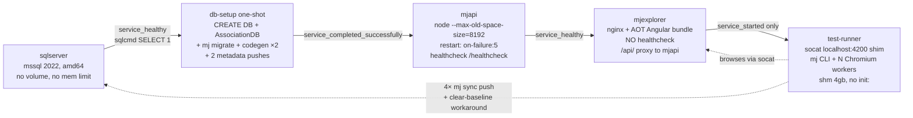

# Docker Regression Suite — Architecture Simplification & Reliability Improvement Plan

**Status:** PROPOSAL · 2026-07-20 · Prepared from a 14-agent deep-analysis of the codebase + external research

**Scope:** the stack and suite level — container architecture, DB lifecycle, image builds, env/config integrity, the TestingFramework suite runner (scheduling / retries / persistence / watchdogs), preflight and health gating, the MJCLI `mj test regression` command surface, and reporting/triage. Per-test agent engine internals (deterministic waiting, perception, judging, loop detection, replay caching) belong to the sibling **[Computer Use Robustness & Consistency Plan](computer-use-robustness-plan.md)** (referenced as CU-\*). Where the two plans meet — the scheduler consuming the failure classes the CU plan produces, replay-first execution changing this plan's capacity math — the seam is called out explicitly.

---

## 1. Executive Summary

The regression stack works — a 380-test full run completes and finds genuine product bugs — but it works the way a system works when every layer assumes the layer below it is healthy and none of them verify it. The evidence from three real runs (the 7.8 h 380-test run, the exit-137 OOM run, and the just-completed dedicated-host recheck) supports a single architectural thesis: **the suite's unreliability is mostly self-inflicted load and self-inflicted blindness, not test flakiness.** An unbounded SQL Server, an 8 GB-heap Node API, nginx, and N Chromium instances share one cgroup-less host; when the inevitable saturation arrives, an unclassified, immediate, in-place retry policy triples the load at exactly the wrong moment; and because the only machine-readable artifact (`results.json`) is written once at the very end, a crashed or thrashing run leaves nothing. Meanwhile the recheck run proves the complementary point: run the same 44 failures on a **dedicated** host and 27 of them still fail on every attempt, clustered by entire feature area — these are real app/bundling/spec defects that the system nevertheless retried three times each, converting roughly one hour of signal into 4.7 hours of spend.

The highest-leverage changes, in order:

1. **Snapshot the database instead of rebuilding it** (DR-B1/B2). The DB is a pure function of migrations + AssociationDB + codegen version, yet every `up` pays ~4–6 min of migrate + codegen×2 and re-triggers the baseline suite-member collision. A hash-keyed snapshot (native `BACKUP/RESTORE` or a prebuilt DB image) turns cold start into seconds and gives every run pristine data.
2. **Resource-govern every container and move the browser fleet off the app host** (DR-A1/A2). Cap SQL Server internally and externally, budget ~1–1.5 GB per Chromium worker, add `init:` for zombie reaping, and run browsers as separately-cgrouped `playwright run-server` containers the runner connects to over WebSocket — the attach plumbing already exists in `connect-endpoint.ts`. This converts whole-runner OOM into single-browser recycles and decouples browser concurrency from app-host capacity.
3. **Replace the static worker partition with a shared work queue, and make retries classified, deferred, and budgeted** (DR-D1/D2). The recheck run is the smoking gun: retrying deterministic failures under the same conditions that produced them is the single largest waste in the system. Retries move to an end-of-run pass at reduced concurrency, gated by failure class (from CU-plan taxonomy) and by host health.
4. **Make results incremental and runs resumable** (DR-D5/D6). One JSONL line per attempt, an atomic partial `results.json`, signal handlers that finalize the DB row — so an OOM at hour 7 loses one test, not the run.
5. **Give preflight teeth and kill silent-empty configuration** (DR-E1/E2). Preflight currently always exits 0 and is never read; every env var interpolates to a silent empty default; `MAX_RETRIES` is a documented knob that physically cannot reach the container. Validation moves to two hard gates (host-side before compose, container-side before LLM spend) that check the things that actually fail: AI keys, DB suite membership, auth material, memory-vs-workers arithmetic.
6. **Collapse four monorepo image builds into one shared builder with a `.dockerignore`** (DR-C1/C2). Today any one-line source change invalidates npm install + a full monorepo compile in up to four images, with a multi-GB context (no `.dockerignore` exists) that leaks host `dist/` into "clean" images.
7. **Give the CLI ownership of the run** (DR-F1/F2/F3/F4): host-minted run IDs, propagated exit codes, teed stdout, `status`/`logs`/`stop`/`rerun-failures`. The seven hand-authored `.regression-*-check-suite.json` files in the current git status are the measured cost of `rerun-failures` not existing.

The through-line: **make the environment deterministic and observable first, then make the scheduler intelligent about the failures that remain.** The external research (§5) shows every mature system in this space — QA Wolf, Momentic, Checkly, mabl, Browserbase, Playwright itself — converged on the same discipline: isolate resources per browser, classify before retrying, record every attempt, quarantine chronic flakes, and stop the run early when the environment (not the app) is what's failing.

---

## 2. Current Architecture

Five services in the `full` compose profile form one linear dependency chain (`docker/regression/docker-compose.test.yml:39-257`):

Mechanics that matter for this plan:

- **db-setup is one-shot and re-runs on every `up`.** `db-setup-entrypoint.sh:91-151`: bootstrap (CREATE DATABASE + AssociationDB), `mj migrate`, **`mj codegen` twice** (pass 2 reconciles special-date EntityField metadata — without it every write to demo entities fails, documented at lines 103-118), then two `mj sync push` calls from the **baked** metadata copy. The DB lives in the sqlserver container's writable layer — **no named volume exists** — so a plain `docker compose down` destroys it, and every `up` re-pays the ~4–6 min setup plus the baseline suite-member UQ collision that `clear-baseline-suite-members.cjs` must DELETE around (`test-runner-entrypoint.sh:81-88`).
- **Bake vs. mount is inconsistent.** Metadata is baked into db-setup (prompts pushed from the baked copy — editing a prompt silently does nothing until an image rebuild) but bind-mounted **RW** into the runner (tests take effect immediately; `mj sync push` write-back stamps ephemeral-DB PKs into the repo as root — the perpetual git dirt visible in the working tree). `applications` is pushed twice from two different copies. The runner's entrypoints are bind-mounted; db-setup's is baked (`Dockerfile.db-setup:67`).
- **Four independent monorepo builds, no `.dockerignore`.** All four Dockerfiles use `context: ../..` (2.8 GB `node_modules` + 1.7 GB `.git` + 1.6 GB `packages/` on this checkout), `COPY packages/` **before** `npm install` (any source edit invalidates install + build layers), and each runs its own full compile — the test-runner even builds every Angular library it never executes (`Dockerfile.test-runner:29`). `.docker-generated/` codegen overlays are produced by a container run and consumed by image builds — a build-depends-on-run inversion (`Dockerfile.api:26-27`).
- **No resource limits anywhere.** Zero `mem_limit`/`cpus` keys in any compose file; SQL Server on Linux defaults to grabbing ~80% of host RAM; the only knob is the runner's `shm_size: '4gb'`. No `init:` for zombie reaping despite hundreds of Chromium launches per run.
- **The runner entrypoint marches through failures.** Every `mj sync push`, `setup-test-user.cjs`, and `preflight-checks.cjs` (which always exits 0 by design, and whose result JSON no caller reads — `test-runner-entrypoint.sh:122`) is warn-and-continue. The health monitor (`health-monitor.cjs`) probes four endpoints every 10 s into an ever-rewritten `diagnostics.json` and **acts on nothing**.
- **The suite runner is a static partition, not a queue.** `TestEngine.runTestsParallel` (`packages/TestingFramework/Engine/src/engine/TestEngine.ts:454-502`) deals tests round-robin into N fixed groups; each worker runs its share sequentially; retries (`engine/retry.ts:32-57`) execute **immediately, in-place, with zero backoff**, retry every non-passing status including judged-Impossible, and overwrite the prior attempt's result. `results.json` is written once at the end (`TestingFramework/CLI/src/commands/suite.ts:127-129`); a crash leaves nothing and the `TestSuiteRun` row stays `'Running'` forever. `failFast` and `--delay` are dead knobs in parallel mode.
- **The CLI is a thin compose wrapper with no run ownership.** Nine commands (`packages/MJCLI/src/commands/test/regression/`), `stdio: 'inherit'` throughout; monorepo `up` omits `--exit-code-from`, so the suite's verdict never reaches the shell and attached `up` blocks forever; `RUN_DIR` is minted inside the container, so the host cannot address an in-flight run; `MAX_RETRIES` is read by the entrypoint but **absent from every compose `environment:` block** — the knob physically cannot be turned; only two AI vendor keys are forwardable at all (`docker-compose.test.yml:193-194`).

Reference docs drift is itself a finding: ARCHITECTURE.md claims one codegen pass, a 4-worker default, a "25 canonical tests" sizing basis, and an `.env.test.example` that does not exist anywhere in the repo (referenced by QUICKSTART.md:43, REGRESSION_TESTING.md:52, and the compose header).

---

## 3. Evidence

### 3.1 The full run — run-20260718T160625Z (380 tests, 3 workers, 7.79 h)

- **335 Passed** (298 clean + 37 flaky/pass-on-retry), **38 Failed**, **6 Timeout**; 515 total attempts for 379 executed tests (36% re-run overhead). `totalCost: 0` on every record — LLM spend is unmeasured.
- **Durations are bimodal:** clean pass p50 59 s; Failed p50 241 s; Timeout p50 427 s. Passing tests hold a stable ~7.5 s/step in every hour of the run — degradation is not gradual slowdown, it is pages either rendering or catastrophically stalling.
- **33 of 44 hard failures burned to exactly the 35-step cap**; the heuristic judge *labels* loops ("Navigation loop detected") but nothing terminates the attempt.
- **Failure taxonomy (hand-mined from judge prose):** 15 navigation loops, 12 stuck (3 identical screenshots), 3 blank/"Loading workspace…" stalls, 5 judged Impossible (2× Feature Pipelines missing-lazy-bundle — a genuine app bug; 1× missing API keys — an env gap; 1× empty Database Designer data; 1× automation limitation), 6 timeouts (with **zero oracle output**), 3 other.
- **13 of 44 failures bounced through an Auth0 consent page mid-test** (URL trails in `steps.json`): the seeded storageState does not survive whatever invalidates the session; each recovery costs ~10+ steps. This is the auth-expiry/401 class, not agent confusion.
- **Retry economics:** attempt 1 passes 78.6%; attempt 2 salvages 32% of its entrants; attempt 3 only 20%. The 44 never-passing tests consumed 132 attempts ≈ 40–65% of total 3-worker capacity for zero passes, mostly late in the run when the host was most degraded. Apparent concurrency: 1.47 of 3 workers — half the capacity is invisible retry work.
- **Host telemetry:** system free memory declined monotonically 21.7 GB → 2.6 GB over 7.8 h while MJAPI probe latency stayed flat (p50 1–5 ms, zero failed probes) — the leak is in something unprobed (Chromium/renderers/SQL buffer pool); the monitor has no per-container attribution. Hourly pass rate: 98→95→89→82→91→**33**→**54**→91% — confounded with feature order (hours 5–6 are exactly the T320–T350 Routines/Bulk-Ops block), but flaky count rises with run age across diverse features and throughput collapses 118 starts/hour → 15.

### 3.2 The OOM run — run-20260718T032012Z (4 workers)

Preflight healthy at 24 GB free; free memory crashed to 617 MB at t+80 min; the runner was OOM-killed (exit 137). **Zero test outcomes were preserved** — `results.json` had never been written. The orphaned health monitor kept probing a test-less stack for 10+ more hours (4,366 probes, `stoppedAt: null`).

### 3.3 The recheck run — run-20260720T034359Z (NEW; postdates the analysis files)

The 44 hard failures from the full run were re-run on a **dedicated host** at 2 workers. Total wall clock: **4 h 44 m**. Results:

- **17 passed** — but 8 of those only on retry: still flaky even at low load on dedicated hardware.
- **25 Failed on all 3 attempts; 2 Timeout on all attempts** — 27 of 44 (61%) are cross-run-consistent failures.
- The consistent failures cluster by **entire feature area**: Routines T322–T327 (all 6), Bulk Operations T333–T338 (all 6), Feature Pipelines T259/T260 (the known lazy-load bundling gap), Credentials T228/T229 (+T230 flaky), Database Designer T198/T201, plus singles T098, T156, T245, T249, T256, T315, T331, T368, T377.
- Average score of the recheck: **0.464**.

**What this proves:** whole-feature-cluster, cross-run-consistent failures are almost certainly genuine app/bundling/test-spec defects — **not environment noise**. And the current system retried each of these deterministic failures 3× anyway: 27 consistent failures × 3 attempts ≈ 81 attempts where 27 would have sufficed. **The retry-classification gap made roughly one hour of signal cost ~4.7 hours.** It also exposes a diagnostic gap: the suite cannot distinguish "the feature module never loads" (a 5-second deterministic check) from "the agent got lost" (a 420-second LLM exploration) — both surface as the same MaxSteps/goal-failure verdict.

### 3.4 What the telemetry cannot prove (gaps that are findings)

1. **No per-attempt records** — `retry.ts:43` overwrites prior results; screenshots/steps.json are final-attempt-only. The reason attempt 1 of a flaky test failed is unrecoverable.
2. **No worker ID** on results — "poisoned worker/context" hypotheses are untestable.
3. **No per-step timestamps** — cannot split 420 s into LLM latency vs page wait vs action execution.
4. **No LLM cost/token telemetry** (`totalCost: 0`), no model ID, no cache-hit rate.
5. **No per-container memory/CPU** — the 19 GB decline cannot be attributed.
6. **No incremental results** — OOM run and recheck both had zero on-disk outcomes for hours.
7. **No browser console/network capture** — one HAR would have confirmed the 401→consent hypothesis directly.
8. **Preflight's `wsUpgrade` check fails in every run** yet `healthy: true` — a broken check that trains operators to ignore preflight.
9. **No structured failure-category field** — the taxonomy above was regex-mined from judge prose; recheck suites are hand-curated from it.

---

## 4. Improvement Catalog

Item IDs use the `DR-` prefix (Docker Regression). Themes: **A** resource isolation & sizing · **B** DB lifecycle · **C** image/build · **D** suite runner reliability · **E** config & env integrity · **F** CLI & operator UX · **G** reporting & triage.

---

### Theme A — Resource Isolation & Sizing

#### DR-A1 — Memory/CPU limits on every service, with SQL Server capped internally

**Problem.** No `mem_limit`/`cpus`/`deploy.resources` key exists in any compose file (verified by grep). SQL Server on Linux defaults to consuming ~80% of *host* RAM; it competes freely with an 8 GB-heap Node API and N Chromium instances. This is the substrate of the exit-137 OOM at 4 workers, the 10–30 s page renders, and the 21.7 GB → 2.6 GB memory decline (`docker-compose.test.yml:40-257`; QUICKSTART even claims a 4 GB SQL reservation that does not exist).

**Proposal.** Add explicit limits to `docker-compose.test.yml`:
- `sqlserver`: `mem_limit: 4g` **and** `MSSQL_MEMORY_LIMIT_MB=3584` (SQL must be told internally or it will allocate to 80% and be OOM-killed by the cgroup), plus `MSSQL_PID=Developer`, tempdb-on-tmpfs, telemetry off.
- `mjapi`: `mem_limit: 10g` (8 GB heap + overhead).
- `mjexplorer`: `mem_limit: 512m` (static nginx).
- `test-runner`: sized as `workers × 1.5g (Chromium) + 2g (node CLI + mj sync)`; keep `shm_size: 4g`.
- Optional: `cpuset` pinning — SQL + API on one core set, browsers on another — so browser CPU spikes cannot starve the API event loop.

**Expected impact.** Converts unbounded contention into predictable per-service ceilings; the OOM failure mode becomes a single-service restart rather than host collapse; page-render tail latency under load shrinks because the API and SQL keep guaranteed headroom.

**Risks / open questions.** Limits must be sized against real hosts (CI runners vary); too-tight SQL memory slows the codegen phase — mitigate by making limits `.env.test`-interpolated with sane defaults, and by DR-B1 removing most SQL-heavy work from the hot path.

**Wave 0 status — LANDED.** All six services in `docker-compose.test.yml` now carry an `.env.test`-tunable `mem_limit`: sqlserver 4g + the internal `MSSQL_MEMORY_LIMIT_MB=3584` (+ `MSSQL_PID=Developer`), mjapi 10g, mjexplorer 512m, test-runner 7g (3 workers × ~1.5g + 2g), db-setup + form-generator 6g. Ceilings not reservations. **Deferred:** tempdb-on-tmpfs + telemetry-off (no supported mssql image env for either) and cpuset pinning (optional per plan). Verified via `docker compose config`.

#### DR-A2 — Browser fleet off the app host (browser grid)

**Problem.** N Chromium instances (~700 MB–1 GB peak each per Browserbase's published sizing) run inside the same container — and the same host — as the app under test. Browser memory growth is the leading suspect for the unattributed 19 GB decline; a browser leak takes the whole runner (and run) down with it. The observed model of every mature vendor is per-browser isolation (QA Wolf: one container per test; Browserless: "add more containers behind a load balancer rather than increasing CONCURRENT").

**Proposal.** Run Chromium in separate containers and connect remotely:
- **Sub-option A2a (incremental):** one `playwright run-server` container per worker in the same compose project, each with its own `mem_limit: 1.5g`, `shm_size: 1g`, `init: true`, and `restart: unless-stopped`. The runner connects via `browserType.connect(ws://browser-N:PORT)` — the dispatch plumbing **already exists** in `packages/AI/MJComputerUse/.../browser/connect-endpoint.ts:14-31` (`ClassifyConnectEndpoint` branches into `chromium.connect` for `ws://` URLs); only configuration wiring is missing.
- **Sub-option A2b (scale-out):** a browserless/Moon-style pool service with session admission, enabling workers on *other hosts* to drive browsers near the app — the precondition for DR-D10 sharding without per-shard stacks.
- Either way: a crashed/leaking browser recycles individually (compose restart policy) instead of killing the run; the app host runs only SQL + API + nginx.

**Expected impact.** Eliminates the whole-runner exit-137 class; browser concurrency becomes horizontally scalable and independently governable; per-browser cgroup stats make the memory-attribution question (Evidence §3.1) answerable for free.

**Risks / open questions.** WebSocket connect adds a session-establishment cost (~1–5 s, amortizable via keep-alive); socat/secure-origin interplay must be re-validated (see DR-A6); the single-login `storageState` seeding path must work over remote connects (Playwright supports `storageState` on remote contexts — verify with the auth bootstrap).

#### DR-A3 — `init:` zombie reaping, IPC, and Chromium container hygiene

**Problem.** No compose service sets `init:`. Playwright's own Docker guidance calls missing init "a common reason for zombie processes" and recommends `--ipc=host` for Chromium ("without it, Chromium can run out of memory and crash"). Over a 7.8 h run with hundreds of browser launches, zombie accumulation plausibly contributes to the second-half degradation. socat additionally `fork`s a process per connection, unreaped.

**Proposal.** `init: true` on test-runner (and on each browser container under DR-A2); `ipc: host` (or a shared IPC namespace between runner and browser containers) where Chromium runs; verify `shm_size` on every container that hosts Chromium, not just the runner.

**Expected impact.** Cheap, near-zero-risk removal of a documented degradation mechanism.

**Risks / open questions.** `ipc: host` widens the isolation boundary — acceptable for a test stack; document it.

**Wave 0 status — LANDED.** test-runner (the only Chromium-hosting service until DR-A2) gains `init: true` + `ipc: host`; `shm_size: 4g` kept as defense if ipc is ever removed. The cross-server compose hosts no Chromium — unchanged. Verified via `docker compose config`.

#### DR-A4 — Worker-count auto-derivation from real memory budgets

**Problem.** `MAX_PARALLEL_WORKERS` is a blind integer with three different defaults across modes (3 in full compose/entrypoint, 4 in remote/standalone/ARCHITECTURE.md). Nothing sanity-checks workers × per-browser memory against available RAM; 4 workers OOM'd the host. Preflight reads `os.freemem()`, which inside a container reports the VM, not cgroup limits.

**Proposal.** At runner start (inside the container-side preflight, DR-E1): read `/sys/fs/cgroup/memory.max` and `memory.current`; compute `maxSafeWorkers = floor((available − fixedOverhead) / perWorkerBudget)` with `perWorkerBudget ≈ 1.5 GB`; **clamp** the requested worker count down to it, loudly. Reconcile the default to one constant shared by compose, both entrypoints, and the CLI (DR-E2). Under DR-A2 the budget check moves to the browser-pool admission instead.

**Expected impact.** Makes the OOM class structurally impossible to configure into; ends the defaults drift.

**Risks / open questions.** cgroup v1 vs v2 path differences; on hosts without limits the cgroup max reads "max" — fall back to `os.freemem()` with a conservative haircut.

#### DR-A5 — MJAPI longevity across multi-hour runs

**Problem.** `restart: on-failure:5` exists explicitly because MJAPI OOM under regression load is *expected* (`docker-compose.test.yml:132-134`). A 7.8 h single-process lifetime with an 8 GB heap invites fragmentation/leak accumulation; a mid-run crash-restart window currently manifests as unexplained test failures.

**Proposal.** Pick one:
- **A5a:** scheduled mid-suite recycle — the runner (which owns the queue after DR-D1) drains dispatch at the halfway point, restarts mjapi via the Docker socket or a compose exec hook, waits for healthy, resumes.
- **A5b:** two mjapi replicas behind the nginx upstream with `proxy_next_upstream` — capacity, rolling restarts, and halved per-process heap pressure.
- **Cheap floor:** raise restart policy to `unless-stopped` + nginx retry so a crash is a blip, and stamp the restart window into diagnostics so overlapping test failures are attributable (DR-G2).

**Expected impact.** Removes the "API silently degraded at hour 6" ambiguity; with A5b, also removes the API as a single point of failure.

**Risks / open questions.** A5a requires the runner to have Docker-control privileges (mount the socket read-carefully or use a sidecar); GraphQL WebSocket subscriptions must survive upstream failover in A5b.

#### DR-A6 — Remove socat (or make it supervised)

**Problem.** socat exists solely because auth0-spa-js requires a secure origin and only `localhost` qualifies, so Chromium in the runner browses `http://localhost:4200` proxied to `mjexplorer:4200` (`test-runner-entrypoint.sh:27-38`). It is an unsupervised single point of failure — probed at startup and by the monitor, restarted by nothing.

**Proposal.** Launch Chromium with `--unsafely-treat-insecure-origin-as-secure=http://mjexplorer:4200` (Playwright `args`) and point tests at `http://mjexplorer:4200` directly, deleting socat, its probes, and the localhost indirection. Under DR-A2 the flag travels in the browser containers' launch config. **Fallback** (if any auth flow hard-requires the literal string `localhost`): keep socat but supervise it — monitor restarts it on TCP-probe failure (one line in the health supervisor, DR-G5).

**Expected impact.** One fewer process, one fewer failure mode, two fewer probes.

**Risks / open questions.** Validate that Auth0's origin checks accept the flag-treated origin end-to-end (the bootstrap login flow is the test).

---

### Theme B — DB Lifecycle Simplification

#### DR-B1 — Hash-keyed DB snapshot/restore instead of per-up rebuild

**Problem.** The DB is a deterministic function of (migrations, AssociationDB SQL, codegen version), yet every stack lifecycle re-pays CREATE + AssociationDB (10k+ rows) + `mj migrate` + `mj codegen` ×2 ≈ 4–6 min — and because db-setup is a one-shot service, **every** `docker compose up` re-runs it even when the DB survived (`docker-compose.test.yml:120-122`). ARCHITECTURE.md's timeline still budgets one codegen pass.

**Proposal.** Key a snapshot by `sha256(migrations/** + Demos/AssociationDB/** + codegen package version)`:
- **B1a — native backup/restore (recommended first):** after the first successful setup, `BACKUP DATABASE MemberJunction_Test TO DISK` into a named volume (or exported artifact). db-setup's entrypoint becomes: hash match → `RESTORE` (seconds); mismatch → full rebuild → re-backup. Per-run RESTORE also gives **pristine data every run** — no cross-run contamination from prior test writes.
- **B1b — prebuilt DB image:** CI runs sqlserver + db-setup once, copies `/var/opt/mssql` into a `FROM mcr…mssql` image tagged `mj-regression-db:<hash>`; `up` starts it directly and db-setup reduces to a version assertion. Best for distributing to other machines/CI; heavier to produce.
- In both: metadata pushes (apps/prompts/tests/suites) stay a **runtime** step from the live mount (DR-B5) so snapshots never stale on metadata edits.

**Expected impact.** Cold start ~6 min → ~30 s; the inner iteration loop (`down`/`up` cycles during development) stops being the dominant cost; the baseline-collision workaround loses its trigger (every restore is pre-collision state — though DR-B4 still fixes the root).

**Risks / open questions.** SQL Server RESTORE requires the files to be version-compatible (pin the mssql image tag into the hash); backup artifact size (~1–3 GB) needs a storage location for CI; bacpac mode keeps its own path.

**Wave 3 status — B1a (native backup/restore) LANDED + live-verified; B1b (prebuilt image) deferred.** `scripts/db-snapshot.cjs` keys a `BACKUP … WITH COMPRESSION, COPY_ONLY` by `sha256(migrations + Demos/AssociationDB + MJ build version)`; the server ProductVersion rides in the meta sidecar and gates restore (the version-compatibility risk). db-setup's entrypoint does restore-or-rebuild and snapshots the schema-only state BEFORE the runtime metadata pushes (so snapshots stay metadata-independent, per DR-B5). A shared `snapshot-data` volume (sqlserver ⇄ db-setup) holds the `.bak` + meta; db-setup's entrypoint + scripts are now bind-mounted (like the runner) so the logic deploys without a full image rebuild. **Verified END-TO-END by cycling the live stack:** run 1 (empty volume) → "No snapshot for hash 33427d50… — full rebuild" → saved `mj-33427d50….bak` (44 MB compressed) + meta; run 2 → "Restored (pristine) — skipped bootstrap/migrate/codegen" in seconds; restored DB intact (437 `__mj.Entity` + 2000 `AssociationDemo.Member`). Raw BACKUP/RESTORE pre-proven via sqlcmd. Cold start ~6 min → ~30 s on a warm snapshot volume. **Deferred:** B1b (prebuilt `mj-regression-db:<hash>` image — the CI-distribution variant; B1a covers local iteration). **Build-time dependency surfaced:** the entrypoint metadata pushes use `--no-write-back` (DR-B4/B5), so db-setup + test-runner images must be rebuilt (`mj test regression build`) to bake the current CLI — normal, but the flag is absent from stale images (non-fatal "Nonexistent flag" warning until rebuilt).

#### DR-B2 — Named volume + lifecycle honesty

**Problem.** The DB lives in the container's writable layer; plain `down` (not just `down -v`) wipes it — ARCHITECTURE.md §5 documents the opposite. There is no "stop but keep everything" workflow; pausing a saturated host destroys DB-resident artifacts (screenshots are only extracted from the DB at run end, so a killed run loses them).

**Proposal.** Declare a named volume for `/var/opt/mssql`; make `mj test regression down` default to **keeping** it (`--volumes` to wipe); add `stop`/`start` semantics at the CLI (DR-F3). With DR-B1a the volume also hosts the backup file. Fix ARCHITECTURE.md §5.

**Expected impact.** Interrupted runs become inspectable and resumable; accidental data loss ends.

**Risks / open questions.** A kept volume across migration changes must be invalidated by the DR-B1 hash check (it is, by construction).

**Wave 3 status — LANDED.** Named volume `mssql-data` (explicitly `mj-regression-mssql-data`) mounted at `/var/opt/mssql`; the DB no longer lives in the container writable layer. CLI `down` FLIPPED to keep-by-default: `--volumes`/`-v` wipes, `--keep-volumes` kept as a hidden no-op for compat, and an in-progress guard reads the DR-D5 partial and refuses (exit 1) to tear down a `Running` run unless `--force`/`-f`. Verified: `docker compose config` shows the volume declared + mounted (`read`/`target: /var/opt/mssql`); `down --help` shows the flipped flags; MJCLI 426 tests green. Takes effect on the next stack lifecycle (the running stack was left untouched). ARCHITECTURE.md §5 reconciliation rides with DR-G7.

#### DR-B3 — Kill the double-codegen at the root

**Problem.** `mj codegen` must run twice: pass 1 registers entities and adds `__mj_*` columns but does not populate their special-date EntityField metadata in-pass; without pass 2, every write to demo entities fails at runtime (`db-setup-entrypoint.sh:103-125`). The form-generator has the same two-pass ritual (`form-gen-entrypoint.sh:44-58`). REGRESSION_TESTING.md:747 claims this is already fixed — it is not.

**Proposal.** Fix CodeGen to order the special-date EntityField sync after entity registration within a single run (or internally loop that sub-step when new entities were registered). Delete the second invocation from both entrypoints and correct the doc. With DR-B1 this cost only recurs at snapshot-build time, but the fix also halves form-gen and every non-snapshot cold start.

**Expected impact.** Halves db-setup runtime; removes a "you must know the ritual" trap for anyone running codegen outside these scripts.

**Risks / open questions.** The fix lives in CodeGenLib, outside this stack — coordinate with owners; the entrypoint comment documents the exact failure signature to regression-test against.

#### DR-B4 — Resolve baseline-vs-metadata ownership of suite membership

**Problem.** A Flyway baseline seeds `TestSuiteTest` rows; the runner then pushes authoritative membership from metadata; mj-sync blind-INSERTs (no natural-key upsert), the first `(SuiteID,TestID)` collision violates `UQ_TestSuiteTest_Suite_Test`, and mj-sync's single transaction rolls back **all** members — the DB silently keeps the stale baseline subset. `clear-baseline-suite-members.cjs` DELETEs around it for exactly one hardcoded suite name, warn-and-continue (`test-runner-entrypoint.sh:81-93`). Write-back then stamps ephemeral-DB PKs into version-controlled JSON — the perpetual git dirt in the current working tree.

**Proposal.** Layered; do 1 and 4 at minimum:
1. **Stop seeding `TestSuiteTest` in the baseline migration** — membership is pushed every run; the baseline rows are pure liability.
2. **Natural-key upsert in mj-sync** (`lookupFields: ["SuiteID","TestID"]` honoring the UQ constraint) — fixes the class generally for any seeded-vs-pushed child table.
3. **Per-record savepoints** in mj-sync so one collision produces a partial, *reported* failure instead of a silent total rollback.
4. **Stop write-back into the repo** for container pushes (`--no-write-back` flag or copy-to-tmpdir before push, see DR-B5) — the stamped PKs are meaningless on the next fresh DB.
Then delete `clear-baseline-suite-members.cjs`.

**Expected impact.** Removes an entire silent-failure class, one workaround script, and the recurring git pollution; the DB suite-membership assertion in DR-E1 becomes a tripwire for any future regression here.

**Risks / open questions.** mj-sync changes have blast radius beyond this stack — items 2/3 should land as general MetadataSync features with their own tests.

**Wave 3 status — item 4 (no-write-back) LANDED; items 1/2/3 deferred (product-wide).** New `mj sync push --no-write-back` (additive, default off) suppresses primaryKey/sync file stamping at BOTH write sites in `PushService` (inline + deferred deletion-flush); wired into all six runner-entrypoint pushes + db-setup's three. Verified END-TO-END against the live regression DB (localhost:11433): a forced record diff pushed with vs without the flag produced the same DB `Updated 1` but rewrote the source file only WITHOUT it — the "perpetual git dirt" is gone; metadata-sync 261 tests green. **Deferred (product-wide, exactly per this risk note):** item 1 (the `TestSuiteTest` seed is baked into a 162k-line release baseline — a regeneratable release artifact, fragile to hand-edit), item 2 (natural-key upsert in mj-sync core — the existing `lookupFields` is pull-time FK→`@lookup` resolution, NOT push-time matching, so this is a genuine core feature needing its own tests), item 3 (per-record savepoints). `clear-baseline-suite-members.cjs` therefore stays until 1/2 land.

#### DR-B5 — All metadata pushes from the live mount; db-setup becomes schema-only

**Problem.** db-setup pushes `applications` + `prompts` from its **baked** metadata copy; the runner pushes `applications` (again), `tests`, `test-suites` from the **live** host mount (`db-setup-entrypoint.sh:127-143`, `test-runner-entrypoint.sh:49-93`). Editing a test JSON takes effect on next `up`; editing a prompt silently does nothing until a db-setup image rebuild — same tree, opposite behaviors, no warning. The RW mount lets root-owned sync stamps pollute the repo.

**Proposal.** db-setup keeps only CREATE + AssociationDB + migrate + codegen (exactly the snapshot-able content for DR-B1). The runner pushes applications + prompts + tests + suites from the live mount, mounted **`:ro`**, with the entrypoint `cp -R` to a container tmpdir before `mj sync push` (or DR-B4's `--no-write-back`). The double `applications` push disappears; "what's in the DB" becomes a pure function of the working tree at run start.

**Expected impact.** Ends the prompt-staleness trap and the repo pollution; makes DR-B1 snapshots metadata-independent by construction.

**Risks / open questions.** Push ordering (prompts before suite start) adds ~tens of seconds to runner startup — trivial next to what DR-B1 saves.

**Wave 3 status — :ro mount + live prompt freshness LANDED; schema-only push-removal deferred to DR-B1.** Host metadata now mounted `:ro` (safe post-DR-B4 since every runner push is `--no-write-back`; a stray write now fails loudly instead of polluting). The runner pushes `prompts` from the LIVE mount every run — editing a prompt takes effect on the next `up` instead of needing a db-setup image rebuild (the staleness trap, killed). Verified against the live DB: the runner prompts push upserts 446 records with ZERO repo churn; `docker compose config` shows `/app/metadata` `read_only: true`; both entrypoints pass `bash -n`. **Deferred to DR-B1:** removing db-setup's now-redundant applications + prompts pushes (truly schema-only) — needs a db-setup rerun to verify and only matters for snapshot metadata-independence; meanwhile the runner's live pushes run after db-setup and win, so db-setup's baked pushes are harmless redundancy.

---

### Theme C — Image / Build Simplification

#### DR-C1 — `.dockerignore` + cache-friendly layer order

**Problem.** No `.dockerignore` exists at the repo root or under `docker/` (verified). Every build of all four images transfers a multi-GB context (2.8 GB `node_modules`, 1.7 GB `.git`) and `COPY packages/` imports host `dist/` and nested `node_modules` into the image — host build state leaks into "clean" images. Every Dockerfile copies sources **before** `npm install`, so any one-line edit invalidates the install layer (`Dockerfile.db-setup:44/49`, `Dockerfile.api:16/29`, `Dockerfile.explorer:17/32`, `Dockerfile.test-runner:21/25`).

**Proposal.** Add `.dockerignore` excluding `.git`, `node_modules`, `**/node_modules`, `**/dist`, `docker/regression/test-results`, `.docker-generated` (except where explicitly COPY'd). Reorder every Dockerfile: manifests → `npm ci` with `RUN --mount=type=cache,target=/root/.npm` → sources → build.

**Expected impact.** Cuts context transfer by ~4+ GB per build ×4 images; makes builds reproducible; source edits stop invalidating dependency installs. The single highest ratio of benefit to effort in the whole plan.

**Risks / open questions.** Verify nothing currently depends on a host `dist/` being copied in (it shouldn't — images run their own builds).

**Wave 0 status — LANDED.** Root `.dockerignore` created (excludes `.git`, `node_modules`, `**/dist`, `**/.turbo`, `**/.angular`, `test-results`, workbench workspace, `.env*`, logs; keeps `.docker-generated`). All four regression Dockerfiles reordered: a manifests-only stage derives a pure `package.json` skeleton (303 manifests) so `npm ci` (BuildKit cache-mounted on `/root/.npm`) is keyed only on manifest content; sources land after install, data (`metadata/`/`migrations/`/`Demos/`) after compile. Verified: `buildx --check` clean ×4; manifests stage built + inspected (303 package.json, 0 stray files); context probe shows exactly 10,489 source files reach the image (matches host). No workspace package has install-time lifecycle scripts (verified), so manifest-only install is safe. `docker/MJAPI` (same context root) already manifest-first — compatible.

#### DR-C2 — One shared builder, thin per-service images

**Problem.** Four independent `npm install` + full-monorepo compile passes: db-setup and api both run `build:api`; explorer runs the Angular AOT build with a 16 GB heap; **the test-runner builds every MJ Angular library it never executes** (`Dockerfile.test-runner:29`). The api "multi-stage" runtime copies the entire builder tree, dev deps included (`Dockerfile.api:41`).

**Proposal.** A single multi-stage Dockerfile (or an `mj-builder` base image): one `npm ci`, **one** turbo build with a BuildKit-cached (or remote) turbo cache, then `--target api|db-setup|test-runner|explorer` stages copying only what each needs (api runtime: `dist/` + prod deps; runner: CLI + TestingFramework + ComputerUse dists). For local dev loops, extend the proven `scripts/` bind-mount pattern to TestingFramework/ComputerUse `dist/` outputs so inner-loop edits skip image rebuilds entirely.

**Expected impact.** ~4× install/compile → 1×; incremental image rebuilds recompile only changed packages; runtime images shrink dramatically.

**Risks / open questions.** One Dockerfile serving four services concentrates change risk — mitigate with per-target CI smoke builds; the explorer's build-arg needs (until DR-C3) constrain full unification.

#### DR-C3 — Runtime-configurable Explorer

**Problem.** Auth0 domain/client-id are baked at image build via ARG → `environment.ts` (`Dockerfile.explorer:8-9,37-38`) — changing the tenant means rebuilding the most expensive image in the stack (16 GB-heap Angular AOT). This also blocks the published `memberjunction/explorer` image that `docker-compose.bacpac-standalone.yml` is explicitly waiting on.

**Proposal.** Explorer reads a `config.json` fetched at bootstrap; an nginx-entrypoint script env-substitutes it at container start. Auth0 changes become a restart. Publish the resulting generic image and un-dormant the bacpac-standalone flow.

**Expected impact.** The most expensive rebuild trigger disappears; external-consumer distribution unblocks.

**Risks / open questions.** The ephemeral-workspace flag currently `sed`-injected into `index.html` at build (`Dockerfile.explorer:54`) should migrate into the same runtime config.

#### DR-C4 — One bake-vs-mount policy, applied uniformly

**Problem.** The runner's entrypoints are bind-mounted (edit → re-`up`); db-setup's is baked (edit → full rebuild) even though the form-generator proves the bind-mount pattern works on the *same image* (`docker-compose.test.yml:90-92`). `mj.config.cjs` is patched three different ways (sed in db-setup, a patch script at api build, plain bake in the runner).

**Proposal.** Policy: **code is baked; orchestration scripts, entrypoints, and metadata are mounted (`:ro`)**. Bind-mount `db-setup-entrypoint.sh`; add compose `develop.watch` for `scripts/`; document the policy in ARCHITECTURE.md so future additions don't re-diverge.

**Expected impact.** Entrypoint iteration stops costing image rebuilds; the "which copy is authoritative" confusion ends.

**Risks / open questions.** None material; standalone/published variants keep baked copies by necessity (document the difference).

#### DR-C5 — Break the `.docker-generated/` build-depends-on-run inversion

**Problem.** The form-generator (a container run) produces Angular forms/entity classes/resolvers onto the host, which the api and explorer **image builds** then COPY (`Dockerfile.api:26-27`, `Dockerfile.explorer:26-27`). A correct build requires a prior successful container run; stale output silently drops demo-entity types from the GraphQL schema — plausibly related to the missing-lazy-bundle app bug class the suite keeps finding. The guard exists only in `mj test regression build`, not `up` (LIMITATIONS §5.4).

**Proposal.** Two layers: (1) **staleness by content-hash** — fingerprint `(migrations, AssociationDB, codegen version)` (the same hash as DR-B1) into `.docker-generated/.fingerprint`; both `build` and `up` verify it and auto-run gen-forms (or hard-fail with instructions) on mismatch. (2) **Longer term** — fold form-gen into the shared builder (DR-C2) as a build stage that runs against a DR-B1 snapshot container via a BuildKit network build (or generate at CI and publish the overlay as an artifact), so images never depend on developer-machine run state.

**Expected impact.** Fresh-clone `up` stops failing at the explorer build; the stale-forms → runtime-404-chunk failure class gets a deterministic tripwire.

**Risks / open questions.** BuildKit builds with service dependencies are awkward — the CI-artifact variant is simpler and may be the right permanent answer.

**Wave 4 status — Layer 1 (content-hash staleness tripwire) LANDED; Layer 2 (fold into shared builder / CI artifact) deferred to DR-C2.** A host-side fingerprint over the SAME three inputs DR-B1 hashes — `migrations` + `Demos/AssociationDB` + MJ build version (`computeFormsFingerprint` in `docker-helpers.ts`, mirroring `db-snapshot.cjs computeHash`) — is stamped to `.docker-generated/.fingerprint` when gen-forms runs. `build` now regenerates the forms when they're **missing OR stale** (fingerprint absent/mismatch), replacing the old `existsSync`-only guard that silently baked stale forms after any migration/demo/version change; it stamps the fingerprint on success so an unchanged-schema rebuild skips gen-forms. `up` (self-contained, non-bacpac path) gains a **hard-fail tripwire**: it refuses to start a stack whose baked forms are missing/stale and points at `build` (`--skip-forms-check` overrides), because `up` can't re-bake already-built images. Verified: 10 unit tests (`regression-forms-fingerprint.test.ts` — determinism, migration/demo/version sensitivity, extension filtering, creation-order independence, all four status branches, write/read round-trip); real-repo smoke check correctly flags the current (May-29, unstamped) forms as stale so the tripwire fires; both new flags load; full MJCLI suite 436 passed. **Note:** the branch's `.docker-generated/` forms are unstamped, so the next `up` will (correctly) require a `build` first. **Follow-up (gen-forms hygiene, not C5):** `gen-forms.sh` ends with `docker compose … down -v` on the shared `mj-regression` project — so a `build` that triggers regeneration tears down a running stack and wipes the `mssql-data`/`snapshot-data` volumes. Pre-existing, but DR-C5 hits it more often; harden by running gen-forms under a throwaway project name (or without `-v` on the shared volume).

#### DR-C6 — Adopt the published `agentic-test-runner` base image (Phase 8)

**Problem.** The test-runner image self-builds the entire monorepo; ARCHITECTURE.md §3 already designates it "a thin overlay on the published image" as pending work. `dispatcher.sh` in `docker/agentic-test-runner/` is a third drifting copy of the run-suite/report block.

**Proposal.** Publish the runner base (Playwright + mj CLI + TestingFramework dists) per release; the regression Dockerfile becomes a thin overlay (metadata defaults + entrypoint). Consolidating entrypoints (DR-E5) makes the dispatcher a shim over the same script.

**Expected impact.** Removes the biggest single build for consumers and most of it for the monorepo; version-pins the runner against a known-good toolchain.

**Risks / open questions.** Release cadence coupling — the overlay must be able to override the framework dists for pre-release testing (bind-mount, per DR-C4).

---

### Theme D — Suite Runner Reliability

#### DR-D1 — Shared work queue with work stealing (replace the static partition)

**Problem.** `runTestsParallel` deals tests round-robin into fixed per-worker groups at second zero (`TestEngine.ts:454-502`); no work stealing means makespan is set by the unluckiest worker, and retries inflate a single worker's tail by up to 3×420 s each while other workers idle. Round-robin over the feature-ordered suite also **temporally clusters similar heavy tests** — all three workers hit the dashboard-heavy region simultaneously, the worst load shape for one host.

**Proposal.** One shared queue drained by N worker loops (`while (queue.length) { … }`), preserving the 2.5 s staggered start and the `workerIndex` contract with drivers. Add `seedOrder: 'longest-first'` using mean `TestRun.DurationSeconds` from prior runs (LPT scheduling; the data already exists in the DB and becomes accessible via DR-G6). Optionally interleave by feature prefix so no two workers run the same feature area concurrently. This queue is the choke point that makes DR-D2/D3/D7/D11 all trivial to attach.

**Expected impact.** Eliminates idle-tail waste (10–25% makespan for skewed distributions per LPT literature); de-clusters heavy load spikes; provides the dispatch point every other Theme-D item needs.

**Risks / open questions.** ~30-line change but in the hottest path of the engine — needs unit tests for ordering, worker exit, and the merge/sort of results (existing `sequence` re-sort logic carries over).

**Wave 2 status — LANDED.** `work-queue.ts`: `seedWorkItems` (suite | longest-first LPT ordering, pure) + `drainQueue` (N worker loops draining ONE shared queue via `shift()` — work stealing; preserved 2.5 s stagger; backstops a stray `runItem` rejection so one bad item can't strand the queue). `runTestsParallel` seeds + drains, folding the old per-item logic into `runQueuedItem` (DR-D5 finalize/synthesize preserved); `sequence` stays the suite position so results re-sort unchanged. `SeedOrder`/`seedOrder` added to EngineBase. This queue is the single dispatch choke point D2/D3/D4/D7/D9 attach to. Verified: 12 work-queue tests (ordering, work-stealing, clamp, empty, stray-rejection, stagger) + 59 engine + 31 CLI green. **Deferred:** `longest-first` degrades to suite order until duration history (DR-G6) feeds it.

#### DR-D2 — Classified, deferred, budgeted retries

**Problem.** `runWithRetries` retries every non-passing status — including judged-Impossible — immediately, in-place, with zero backoff (`engine/retry.ts:18-57`). The recheck run (§3.3) quantifies the waste: 27 cross-run-deterministic failures were retried 3× each on a dedicated host; ~1 h of signal cost ~4.7 h. In the full run, retries consumed ~40–65% of worker capacity for the 44 never-passing tests, precisely while the host was most degraded. Mode drift compounds it: full mode forces 2 retries, remote mode forces 0, neither is user-controllable (DR-E2).

**Proposal.** Rebuild retry as a policy over the DR-D1 queue:
1. **Defer:** a failed test's retry is enqueued at the tail (or into a dedicated end-of-run retry phase at reduced concurrency), never run inline. Backoff + jitter between attempts.
2. **Classify before retrying:** consume the structured `failureCategory` the CU plan's driver emits (`timeout | nav-loop | blank-page | app-error | auth-detour | assertion | impossible | infra`). Policy: `impossible`/`app-error` (missing bundle, missing keys, empty dataset) → **0 retries**, flag for triage; `timeout`/`blank-page`/`infra` → retry only when health state (DR-D3) is green; `nav-loop` → 1 retry max; unknown → 1 retry. Until the CU taxonomy lands, a stopgap regex classifier over judge messages (the same patterns used in the manual autopsy) is acceptable.
3. **Suite retry budget:** total extra attempts ≤ `ceil(0.15 × suiteSize)`; when exhausted, remaining failures are accepted first-shot and the report says so — 34 retries in a 44-test run is a diagnosis, not a strategy.
4. **Persist every attempt** (DR-D8) instead of overwriting (`retry.ts:43`).

**Expected impact.** The recheck-storm class disappears; deterministic app bugs surface in one attempt each (the recheck would have been ~1.5 h, not 4.7); retry results become meaningful because they run under drained load.

**Risks / open questions.** Deferred retries lose the "same conditions" property — for genuine flake diagnosis that's a *feature* (QA Wolf retries on same commit/env, which deferral preserves; only load differs). Classification precision gates policy aggressiveness — start conservative (only `impossible` gets 0 retries).

**Wave 2 status — classify + budget + backoff LANDED; separate end-of-run phase deferred.** `failure-classifier.ts` normalizes the driver's own `failureClass` (CU-F5, authoritative) into the canonical `FailureCategory`, else regex-classifies the judge/error message (the plan's stopgap). `retry-policy.ts`: per-category caps (impossible/app-error → 0; nav-loop/assertion/unknown → 1; env/transient → the operator ceiling), a suite-wide `RetryBudget` = ceil(0.15 × suiteSize) shared across all workers, exponential backoff + jitter. `runWithRetries` is now policy-driven (was a fixed count); the suite path builds the classified policy, standalone/repeat paths unaffected. `result.failureCategory` is stamped once at result-build time (feeds the sink + compare + breaker). Verified: 30 tests (classifier 15 + policy 15). **Deferred:** moving retries to a separate end-of-run REDUCED-CONCURRENCY phase — the one-result-per-test sink contract makes per-attempt supersession hazardous, so retries currently run deferred-inline with backoff, budgeted + classified. Health-gating of the env classes is DR-D3 (landed).

#### DR-D3 — Load-aware admission control at the dispatch point

**Problem.** Nothing observes host health during the run. The health monitor detects the exact degradation seen (probe latency, memory decline) but has no channel to influence dispatch; worker count is fixed for 7.8 h; the second-half collapse (hourly pass rate dropping to 33%) had no countermeasure.

**Proposal.** Before each queue dispatch (single choke point after DR-D1), consult a health state: cgroup memory usage, `/proc/pressure/{cpu,memory}` PSI `some avg10`, load-average per core, and optionally a timed app probe (HEAD to Explorer + trivial GraphQL). Policy: `degraded` → delay dispatch / shrink effective concurrency by letting a worker loop exit; `critical` → pause dispatch entirely until green, with a hard cap on pause time before aborting (DR-D7). The health supervisor (DR-G5) writes `$RUN_DIR/health-state.json` (`{state, recommendedWorkers, reasons}`); the engine polls it — file-based, so no in-process coupling to the monitor. Precedent: GNU make `--max-load`; PSI is purpose-built for "act before collapse".

**Expected impact.** The retry storm and second-half failure skew get an active countermeasure; `MAX_PARALLEL_WORKERS` becomes a ceiling, not a promise.

**Risks / open questions.** PSI requires kernel ≥4.20 and is per-host, not per-cgroup, unless cgroup2 PSI files are used — read the cgroup-scoped files where available. Threshold tuning needs a couple of instrumented runs (DR-G5's per-container stats provide the data).

**Wave 2 status — LANDED.** `admission.ts`: pure `admissionDecision(state, workerIndex)` (healthy → proceed; degraded → shed workers at/above `recommendedWorkers`, worker 0 NEVER sheds so a non-empty queue can't stall; critical → pause); tolerant `readHealthState` (fails OPEN on missing/malformed/unknown-state — a down or not-running monitor never blocks the run); `AdmissionController.admit()` blocks while critical, re-polling until recovery or a pause cap (then proceeds; the real abort is DR-D7). `drainQueue` gains an `admit` gate consulted BEFORE each item (a shed worker never abandons pulled work). The engine builds the controller when `options.healthStatePath` is set; the CLI derives that path from the `--output` run dir (where DR-G4 writes `health-state.json`). Verified: 13 admission tests + a drainQueue shed test. **Deferred:** PSI (`/proc/pressure`) inputs — the supervisor (DR-G4) currently feeds cgroup memory + probe state.

#### DR-D4 — Engine-level watchdog + suite wall-clock budget

**Problem.** The engine awaits `driver.Execute()` with no timeout of its own (`TestEngine.ts:1157`); a never-settling driver promise wedges a worker forever, undetectably. Non-cancellable drivers leave background zombies consuming resources while the next test starts (`TestEngine.ts:1116-1181`). There is no suite-level wall-clock budget.

**Proposal.** Wrap execution in `Promise.race([exec, watchdog(effectiveTimeout + grace)])` in `runSingleTestIteration` — the engine can compute the same effective timeout the driver uses. On fire: synthesize `status:'Error', failureCategory:'infra'` ("driver did not settle"), request context teardown via the driver's release path, recycle that worker's browser (cheap under DR-A2), continue. Add a per-worker heartbeat (last-dispatch timestamp) into the progress stream (DR-D5) so a wedged worker is visible in minutes. Add `--max-suite-duration` that stops dispatching and finalizes gracefully with partial results.

**Expected impact.** Converts the undetectable-hang class into a bounded, classified, reported event; guarantees every run terminates.

**Risks / open questions.** A watchdog-fired test may leave a poisoned browser context — always recycle the context on fire (never reuse).

**Wave 2 status — LANDED (browser recycle deferred).** `watchdog.ts`: `resolveWatchdogMs` (effective timeout + grace = max(30 s, 25 %)) + `withWatchdog` (races `driver.Execute` against the timer; re-throws a real rejection; FULLY handles the abandoned promise so a late zombie settlement can't become an unhandled rejection). The engine computes the SAME effective timeout the driver uses (config.maxExecutionTime → `MaxExecutionTimeMS` → `DEFAULT_TEST_TIMEOUT_MS`) and on fire synthesizes an `infra`-class Error and moves on. Suite wall-clock budget (`--max-suite-duration` s → ms; resolves flag → `TestSuite.MaxExecutionTimeMS` → unbounded) stops NEW dispatch past the deadline (parallel + sequential); the in-flight test finishes, the rest are left un-run. Heartbeat: `onTestStart` at dispatch → the sink records `inFlight` in the partial, so `status` shows what each worker runs and where it's wedged. Both timeout columns already exist in the schema — no migration. Verified: 11 tests (watchdog 9 + deadline 2 + inFlight sink). **Deferred:** recycling the wedged worker's browser (needs DR-A2's grid + a per-test driver release hook that doesn't exist yet); the abandoned zombie is left to finish/die.

#### DR-D5 — Incremental JSONL results, crash-safe partials, signal handlers

**Problem.** `results.json` is written once after `RunSuite` fully returns (`CLI/suite.ts:127-129`). The OOM run preserved **zero** outcomes; the `TestSuiteRun` row stays `'Running'` forever on crash (the catch at `TestEngine.ts:379` rethrows without finalizing); tests whose execution *throws* are silently dropped from totals (`TestEngine.ts:530-532`), so `compare` misreads them as "removed".

**Proposal.**
1. `options.onTestComplete?(result)` hook at the point `runTestWithSuiteVariables` resolves; the CLI appends one JSONL line per **attempt** (`{testId, name, attempt, status, failureCategory, score, durationMs, workerIndex, startedAt, endedAt, error}`) to `$RUN_DIR/results.jsonl`, flushed synchronously.
2. Rewrite `results.partial.json` (same schema, `status:'Running'`) after every completion via tmp-file + atomic rename; final `results.json` becomes a rename.
3. SIGTERM/SIGINT/uncaughtException handlers in `SuiteCommand`: finalize `TestSuiteRun` (`Status='Cancelled'`, counts-so-far), flush partials, exit.
4. Worker-loop `catch` synthesizes an `Error` result instead of dropping the test.

**Expected impact.** A crash at hour 7 loses at most the in-flight tests; `status` (DR-F3), live dashboards, `rerun-failures` (DR-F4), and mid-run report regeneration all become possible; the DB stops accumulating phantom `'Running'` suite runs.

**Risks / open questions.** None material — this is the single most enabling change in Theme D and has no behavioral downside.

**Wave 1 status — LANDED.** Engine: `SuiteRunOptions.onTestComplete` hook + `TestRunResult.workerIndex`; `finalizeTestResult` fires the hook for every result (incl. repeated iterations + synthesized errors) and a thrown Execute now becomes a counted `Error` result in both loops (was logged-and-dropped → `compare` misread as "removed"). CLI: `IncrementalResultsSink` writes `results.jsonl` (one line per attempt, synchronous append) + atomic `results.partial.json` (Running→Completed/Cancelled/Crashed) next to `--output`; SIGTERM/SIGINT/uncaughtException handlers flush a terminal partial before exit. No-op without `--output`. Verified: 8 sink unit tests + 59 engine tests + 31 CLI tests green. **Deferred:** the engine-side DB `TestSuiteRun` finalize on signal (a signal handler can't reliably await async DB work — the file partial is the reliable artifact).

#### DR-D6 — Resumable runs

**Problem.** `RunSuite` always creates a fresh `TestSuiteRun` and runs the full filtered list; re-running after a crash repeats all 380 tests even though per-test DB rows exist incrementally.

**Proposal.** `mj test suite --resume <suiteRunId>`: query `MJ: Test Runs` for the run, take the latest attempt per TestID (needs DR-D8's final-attempt marker), skip terminal `Passed` (flag to also skip `Failed`), run the remainder into the **same** suite-run row, recompute totals. File-based alternative for ephemeral-DB/remote modes: seed the skip-set from `results.jsonl`. Surface as `mj test regression up --resume <run-id>` (DR-F4).

**Expected impact.** An interrupted 7.8 h run resumes at the interruption point; combined with DR-B2 (kept volume) the whole run state survives host restarts.

**Risks / open questions.** Suite-level aggregates (duration, cost) need a "resumed" annotation so trend data isn't polluted.

#### DR-D7 — Suite circuit breaker

**Problem.** A doomed run has no early exit: the OOM run burned 80 minutes to total loss; a hypothetical broken-deploy run (e.g., Explorer serving a blank shell) would burn the full 7.8 h and ~10k LLM calls producing 380 identical failures. Playwright ships `maxFailures` for exactly this ("avoid wasting resources on broken test suites").

**Proposal.** Sliding-window breaker at the dispatch point: if ≥60% of the last 10 attempts failed **with environment-class categories** (`timeout`/`blank-page`/`infra`), pause dispatch, run deep health probes (DR-D3), and if still failing after a bounded cool-down, abort with `Status='Aborted—EnvironmentDegraded'`, finalize partials (DR-D5), and exit with a distinct code (DR-F2). A separate plain `maxFailures` cap (any category) guards the broken-deploy case. Both configurable, both default-on for CI mode (DR-F6).

**Expected impact.** Doomed runs become 20–40 min diagnoses instead of multi-hour losses.

**Risks / open questions.** Category-blind aborts could mask a genuinely catastrophic app regression (380 real failures) — hence the two-tier design: environment-class breaker aborts early; any-category cap is set high (e.g. 25%) and reports "suite aborted: assume app-level event".

**Wave 2 status — LANDED (opt-in).** `circuit-breaker.ts` (pure, latched): ENVIRONMENT tier (sliding window, default 10, trips at ≥60 % env-class finals — timeout/blank-page/infra/auth-detour) + MAX-FAILURES tier (any-category cap, default max(10, 25 % of suite)). `drainQueue.shouldAbort` stops EVERY worker (unlike the admission floor, which always keeps worker 0); the sequential loop checks it too. The engine arms it per-run when opted in; `finalizeTestResult` feeds it every final outcome; the verdict is captured pre-teardown and surfaced as `TestSuiteRunResult.aborted`/`abortReason` (status → Cancelled). CLI `--circuit-breaker`/`--max-failures`; prints the reason; finalizes the partial Cancelled so `status`/`rerun-failures` see the early stop. Default OFF (won't change existing suite behavior); recommended on for CI (DR-F6). Verified: 10 breaker tests + a drainQueue abort test. **Deferred:** the explicit deep-probe cool-down before an env-abort (DR-D3's pause already gives the host recovery chances); a distinct process exit code per outcome rides with DR-F2.

#### DR-D8 — Persist attempt lineage; make `compare` retry-aware

**Problem.** Every attempt creates its own `TestRun` row with the same `TestSuiteRunID` and `Sequence`, no final-attempt marker, no persisted `flaky`/`attempts` (`updateTestRun` never writes them). DB-mode `compare` can nondeterministically pick a *failed attempt of a passing test* → phantom regressions. A flaky pass and a clean pass are indistinguishable in gating — 37 flaky passes look identical to green.

**Proposal.** Add `Attempt INT`, `IsFinalAttempt BIT`, `Flaky BIT`, `FailureCategory NVARCHAR(50)` to `MJ: Test Runs` (migration + CodeGen). `updateTestRun` stamps them; `compare` filters `IsFinalAttempt=1` and reports `stable-pass → flaky-pass` as its own change category (early-warning, not "unchanged"); emit `Tags` into results.json so `--from-json --tag` works.

**Expected impact.** Compare stops lying; flakiness becomes a trackable per-test statistic (feeding DR-G3 quarantine); the recheck-style forensics (which attempt failed, why) become possible from the DB alone.

**Risks / open questions.** Schema change → migration + CodeGen + entity regeneration; short-term the fields can ride in `ResultDetails` JSON.

**Wave 2 status — file-based lineage + retry-aware compare LANDED; DB columns deferred.** `compare` extracts a pure, exported `classifyChange` and adds the `flaky` change category — a stable-pass → flaky-pass transition surfaces as an early warning (distinct from `unchanged`, ranked right after regressions, but NOT counted as a regression so it doesn't flip the exit code); it reads `flaky`/`failureCategory` from results.json and reports the newly-flaky set in markdown + console. The sink persists `failureCategory` into the JSONL attempt lines + the partial, so the durable file lineage a Docker run leaves carries the classification (feeds DR-G3 quarantine). Verified: 10 CLI tests (classifyChange 9 + lineage 1). **Deferred (needs a CodeGen cycle — rule 2b forbids typed code against ungenerated columns, and CodeGen can't run in this environment):** the DB schema columns (Attempt/IsFinalAttempt/Flaky/FailureCategory on `MJ: Test Runs`) + typed `updateTestRun` stamping + DB-mode `IsFinalAttempt` filtering, and the results.json `Tags` emission for `--from-json --tag`. The JSONL is the authoritative forensic record for ephemeral-DB Docker runs and needs no schema.

#### DR-D9 — Dead-knob and correctness cleanup in the runner

**Problem.** `failFast` is declared but never read; `delayBetweenTests` is silently ignored in parallel mode (the only mode Docker uses); CLI `--sequence` flags are declared but never forwarded; a single shared driver instance serves all workers (latent race if any driver gains per-run state); `GetTestsForSuite` is O(n²); `LLMJudgeOracle` fuzzy-matches its prompt by name.

**Proposal.** Implement `failFast` on the queue (drain on first hard failure) or delete it from types/flags; honor `delayBetweenTests` between queue dispatches; forward the sequence/test-selection flags; key `_driverCache` by `${testType.ID}:${workerIndex}` (or enforce/document driver statelessness); Map-index EngineBase lookups; exact-name prompt lookup.

**Expected impact.** Operators' mental model matches reality; latent races closed.

**Risks / open questions.** None — surgical fixes.

**Wave 2 status — LANDED.** `failFast` (declared on options + set by config-loader, but never read AND never forwarded from the CLI) now drains the run on the first hard non-flaky failure via the shared abort gate — forwarded through testing-cli + a new MJCLI `--fail-fast`. `delayBetweenTests` is honored in parallel too (drainQueue inter-dispatch delay; was sequential-only). `--sequence` ("1,3,5" → positions) is parsed + forwarded to the engine's existing sequence filter, with a new MJCLI flag (was declared-but-dead). `GetTestsForSuite` O(n²·log n) → O(n) (index by `NormalizeUUID`'d ID once, killing the in-loop `GetTestByID` scan + the double `find()` per sort comparison). Driver-cache statelessness contract documented (one shared instance per TypeID is required for SetupSuite; per-run state comes from the per-`Execute` context — keying by workerIndex would break the shared suite instance). `LLMJudgeOracle` uses an exact-name lookup ('Test LLM Judge'; dropped the fuzzy `.includes('llm judge')` that could bind an unrelated prompt). Verified: 2 new tests (GetTestsForSuite ordering, interDispatchDelay) + all suites green.

#### DR-D10 — Sharding across stacks/hosts

**Problem.** 380 tests × one host is the scaling wall; the memory-decline exposure window is the full 7.8 h; feature-vs-degradation effects are confounded because everything shares one host-age timeline.

**Proposal.** `--shard i/N`: deterministic partition by suite sequence before the queue is seeded. Deployment shapes: (a) N full stacks on N hosts (DR-B1 makes per-stack DB setup cheap); (b) one app stack + N runner/browser hosts (requires DR-A2b); (c) sequential shards on one host with a stack recycle between shards (bounds the degradation window with zero new hardware). Merge via `compare --from-json --merge dir1 dir2 …` (TestIDs are globally unique) and the existing archive-MJ push as the durable aggregation point.

**Expected impact.** 7.8 h → ~2 h at 4 shards; degradation exposure bounded per shard; cross-shard comparison deconfounds feature order from host age.

**Risks / open questions.** Suite-run identity across shards (one logical run = N `TestSuiteRun` rows) needs a shared tag/parent-run field; CI cost multiplies with shape (a).

#### DR-D11 — Per-test concurrency classes

**Problem.** Feature-ordered suites put N similar heavy tests (dashboard renders, bulk-op grids) on N workers simultaneously (see DR-D1); no weight metadata exists even though duration history does.

**Proposal.** A `weight:heavy` tag (tags already exist) or `Test.ConcurrencyClass`; heavy tests acquire a semaphore of 1–2 before dispatch; the queue skips ineligible items and takes the next eligible one. Auto-assign "heavy" from duration history p90 (DR-G6) so no manual curation is needed.

**Expected impact.** Flattens load spikes without reducing average concurrency; light tests fill the gaps.

**Risks / open questions.** Interaction with longest-first seeding (DR-D1) — heavy tests should still start early, just not simultaneously.

---

### Theme E — Config & Env Integrity

#### DR-E1 — Two-layer preflight that actually gates

**Problem.** `preflight-checks.cjs` exits 0 unconditionally and the entrypoint never reads its JSON (`preflight-checks.cjs:16-17,71`; `test-runner-entrypoint.sh:122`). It checks connectivity plumbing only — of the observed failure classes (empty AI keys, memory exhaustion, stale suite membership, auth material), it would catch **none**. The Auth0 probe has a real bug (`AUTH0_DOMAIN || AUTH0_CLIENT_ID` uses the client ID as a hostname, `:36`); `treat4xxAsOk=true` means a 403-serving nginx "passes"; the `wsUpgrade` check fails every run yet `healthy: true`; remote mode runs zero preflight; subset runs (`docker compose run` with the stack down) march through 15 warn-and-continue steps and then burn full step budgets against a dead URL.

**Proposal.** Two hard gates:
- **Host-side (`mj test regression preflight`, auto-run by `up`):** docker daemon up; images exist; `.env.test` present (error, not silent omission — `docker-helpers.ts:166-168`); AI keys non-empty **with an optional 1-token live probe per configured vendor**; Auth0 vars set; `TEST_UID/PWD` non-empty; suite name resolvable against metadata files; host ports 11433/14000/4200 free; disk/memory headroom; leftover `mj-regression` project detection with an offer to `down`. Seconds cheap; converts "discover at hour 2" into "discover at second 5".
- **Container-side (rewired `preflight-checks.cjs`, non-zero exit honored by the entrypoint: `node preflight-checks.cjs || exit 78`):** existing connectivity probes with `treat4xxAsOk=false` and expected-status assertions; **DB + suite integrity** — connect via `lib/db.cjs`, assert the target suite exists and `COUNT(TestSuiteTest)` equals the metadata member count (single-handedly converts the baseline-collision class into an immediate precise abort); cgroup memory vs. worker arithmetic (DR-A4); auth material; disk space in `test-results/`; a first-page Playwright smoke (load `4200`, wait for the workspace shell) before a single LLM token is spent. Fix the Auth0-domain bug; fix or delete `wsUpgrade`; run a target-flavored variant in remote mode. `PREFLIGHT_SOFT=1` restores advisory behavior for debugging. Entrypoint gains an early "stack reachable?" guard that exits with "run `mj test regression up`" instead of 15 warnings.

**Expected impact.** Every observed configuration-failure class becomes a fast, precise abort. The archive path already proves the gating pattern in this codebase (`ARCHIVE_PREFLIGHT_OK`); this applies it to the main path.

**Risks / open questions.** Live key probes cost fractions of a cent and can false-negative on provider blips — make them warn-by-default, fail with `--strict`/CI mode.

**Wave 0 status — container-side gate LANDED; host-side gate deferred to Wave 1.** `preflight-checks.cjs` now exits 78 (EX_CONFIG) on any gating failure and the entrypoint aborts on it (was ignored). Gating set: MJAPI health (strict 2xx) + GraphQL-via-nginx (lenient, 401 proves routing) + socat + nginx static (strict) + **DB suite-membership assertion** (resolves the suite, asserts `COUNT(__mj.TestSuiteTest active)` ≥ the metadata member count parsed from the matching `test-suites/*.json` — the baseline-collision tripwire; falls back to non-empty when no metadata file, skipped in bacpac mode) + auth material (TEST_UID/PWD) + ≥1 AI key. Auth0-domain bug fixed (`AUTH0_DOMAIN` only, no client-id-as-hostname) and demoted to advisory. `PREFLIGHT_SOFT=1` restores advisory mode. Pure helpers exported + `require.main` guard → 10/10 unit assertions; integration exits 78/0 as designed. **Deferred to Wave 1:** the host-side gate (`mj test regression preflight` before compose — ports free, images exist, `.env.test` present, live key probe), the cgroup memory-vs-workers arithmetic (**DR-A4**), and the first-page Playwright smoke.

#### DR-E2 — A single env contract; kill silent-empties and dead knobs

**Problem.** Every sensitive var interpolates via `${VAR:-}` to a silent empty (`docker-compose.test.yml:125-127,188-194`); a missing `.env.test` silently drops `--env-file`; **`MAX_RETRIES` is absent from every compose `environment:` block** — the documented knob physically cannot reach the container, so Mode A is hardcoded to 2 retries and remote mode to 0 (`test-runner-entrypoint.sh:196`, `test-runner-remote-entrypoint.sh:128-133`); only two AI vendor keys are forwardable at all; `AUTH0_CLIENTID`/`AUTH0_CLIENT_ID`/build-arg spelling skew; worker defaults differ 3-vs-4 across five files; `DB_TRUST_SERVER_CERTIFICATE` is set but ignored by `lib/db.cjs`.

**Proposal.** One table-driven env contract (name, required?, default, validator, which services see it) as a checked-in module consumed by: the CLI (validation + masked echo of effective config at `up`), a generated compose override (so adding a var is a table edit, not a four-file hunt), and the entrypoint (banner printing the effective values — workers, retries, suite, vendors-with-keys). Specifics: declare `MAX_RETRIES` in compose and add `--retries` to the CLI; forward AI keys generically (CLI enumerates `AI_VENDOR_API_KEY__*` from its env into the generated override — removes the two-vendor ceiling); one constants module for worker/retry defaults across full/remote/standalone; auto-inherit AI keys from repo-root `.env` when `.env.test` leaves them blank (documented fallback, `.env.test` wins); fix the AUTH0 naming to one spelling.

**Expected impact.** The "keys must be exported into the shell" ritual dies; behavior stops depending on which of three files you read; the retry knob becomes real (prerequisite for DR-D2 experimentation).

**Risks / open questions.** Generated override files must land in the scratch/run dir, not the repo; keep the raw compose usable by hand with documented `--env-file`.

**Wave 0 status — MAX_RETRIES unblock LANDED; full env-contract deferred to Wave 1.** `MAX_RETRIES` declared in the test-runner compose `environment:` block (was read by the entrypoint but absent everywhere — the knob physically couldn't reach the container); CLI `up` gains `--retries` (min 0 — `0` valid + the point) and `--workers` (min 1), forwarded as env for compose interpolation, guarded `!== undefined` so `--retries 0` isn't dropped. Verified: `MAX_RETRIES=5` renders "5", default "2"; both flags in the oclif manifest; MJCLI builds. **Deferred to Wave 1:** the single table-driven env contract, generic `AI_VENDOR_API_KEY__*` forwarding (removing the two-vendor ceiling), the one worker/retry constants module across modes, AUTH0 spelling unification, and the effective-config banner. Remote mode still hardcodes 0 retries until DR-E5 (Wave 3).

#### DR-E3 — Secrets hygiene

**Problem.** `.env.test` contains live-looking Gemini/Anthropic keys and the test password in plaintext (gitignored, but its own header calls it a "template" — one `git add -f` from leaking); keys duplicate root `.env` and drift; `.env.test.example` is referenced by three docs and **does not exist**; `auth-bootstrap.cjs:27-28` contains hardcoded fallback credentials, one of which is *wrong* vs `.env.test` (`computerpassword2!` vs `computerusepassword2!`) — a missing env var silently attempts a wrong password 3× instead of failing fast.

**Proposal.** Restore `.env.test.example` (placeholders only); support `env:VAR` indirection in `.env.test` values (the loader pattern already exists for target profiles — `load-target-profile.cjs` `resolveEnvRef`); delete the hardcoded credential fallbacks (fail fast on missing env); rotate the currently-sitting keys; fix the `.env.test` header's false claim that compose auto-reads it.

**Expected impact.** Real keys stop living in files; wrong-password loops become config errors at second 5.

**Risks / open questions.** None material.

**Wave 0 status — LANDED (example + fallback deletion); key rotation + mandatory-`env:` deferred.** `.env.test.example` restored (placeholders only, git-negation added so `.env.*` doesn't swallow it; documents `env:VAR` indirection; corrects the false "compose auto-reads .env.test" header — it's the CLI's `--env-file`). `auth-bootstrap.cjs`'s hardcoded credential fallbacks deleted (the password fallback was even WRONG vs `.env.test`), replaced by a fail-fast guard that exits 1 before launching Chromium when creds are absent. Verified: guard exits 1 w/o a browser; no credential literals in code; example committable + secret-free. **Deferred:** rotating the live keys in the gitignored `.env.test`, and making `env:` indirection mandatory (preflight-fail on literal keys).

#### DR-E4 — Auth bootstrap hardening (infra side)

**Problem.** The single-login bootstrap uses fixed `waitForTimeout` sleeps sized for an unloaded host; under the very saturation the suite creates it can time out and silently flip the whole suite into per-worker login mode — multiplying Auth0 load exactly when things are worst. There is no token-TTL awareness: a ~1 h token vs a 7.8 h run means the seeded state goes stale, and Evidence §3.1 shows 13/44 failures detoured through an Auth0 consent page mid-test. (The *in-test detection and recovery* of an auth detour is the CU plan's item; the token lifecycle and consent pre-authorization are this plan's.)

**Proposal.** Replace fixed sleeps with bounded `waitForSelector`/`waitForLoadState`; decode the captured token's `exp` and, if suite ETA exceeds it, schedule a background re-bootstrap that atomically rewrites the state file (drivers re-read per context seed); pre-authorize consent at the Auth0 tenant (first-party app "skip consent") so mid-run re-auth never lands on a consent screen; stamp bootstrap mode + token expiry into the run banner and diagnostics so auth-window overlaps are attributable in the report (DR-G2).

**Expected impact.** Removes the largest single identified failure cluster's infrastructure component (~13/44 in the full run) and the silent per-worker-login degradation.

**Risks / open questions.** Auth0 tenant settings are environment-owned — coordinate; TTL-aware re-bootstrap must not race in-flight tests (atomic rename + per-context re-read handles it).

#### DR-E5 — Consolidate the three entrypoints

**Problem.** `test-runner-entrypoint.sh`, `test-runner-remote-entrypoint.sh`, and `docker/agentic-test-runner/dispatcher.sh` share ~60% with three independently drifting copies: preflight/monitor/auth-bootstrap/retries exist only in full mode; worker defaults differ; dispatcher has report guards the others lack.

**Proposal.** One entrypoint with `MODE={full,remote,dispatcher}` and shared functions (`push_metadata_dirs`, `preflight`, `run_suite`, `generate_reports`, `archive_if_configured`); mode selection stays the existing compose-interpolated filename mechanism (now selecting args, not files). Remote mode inherits preflight/monitor/retry support for free. `archive-preflight.cjs` reuses `lib/probes.cjs` instead of its private TCP probe.

**Expected impact.** Drift class eliminated; every fix lands in all modes at once.

**Risks / open questions.** The published-image dispatcher must vendor the consolidated script — tie to DR-C6.

#### DR-E6 — Healthcheck-gate Explorer and warm the app before test #1

**Problem.** mjexplorer has no healthcheck in the main compose; the runner gates on `service_started` — nginx's *process* existing (`docker-compose.test.yml:177-178`). Nothing verifies the SPA boots, GraphQL flows through the proxy, or MJAPI caches are warm; the first tests pay cold-start out of their step budgets. The bacpac-standalone variant already defines the healthcheck (`docker-compose.bacpac-standalone.yml:81-86`).

**Proposal.** Copy the healthcheck to the main compose; flip the runner's dependency to `service_healthy`; add an explicit warm-up step in the entrypoint (one scripted Playwright page load through nginx→GraphQL that both proves end-to-end readiness and primes metadata caches) as the final container-side preflight gate (DR-E1).

**Expected impact.** Test #1 stops being the de-facto smoke test; cold-start "Loading workspace…" stalls exit the failure statistics.

**Risks / open questions.** None — the healthcheck already exists in a sibling file.

**Wave 0 status — LANDED.** mjexplorer gains the standalone compose's healthcheck (`curl -fsS http://localhost:4200/`; nginx:alpine ships curl — verified) and the runner's dependency flips from `service_started` to `service_healthy` (`required: false` preserved for remote mode). The explicit warm-up's other two goals need no redundant Playwright launch (Simplicity-First): end-to-end readiness is already gated by the DR-E1 preflight's `graphqlProxy`/`nginxStatic` checks, and MJAPI server-cache priming happens in the existing single-login auth bootstrap's page load — both before test #1. Making the auth bootstrap a hard gate is DR-E4 (Wave 1). Verified via `docker compose config`.

---

### Theme F — CLI & Operator UX

#### DR-F1 — Host-minted `RUN_ID` (foundation)

**Problem.** `RUN_DIR` is minted inside the container at entrypoint step 5 (`test-runner-entrypoint.sh:148-151`); the host CLI never learns the run identity, so status/logs/export/rerun tooling must reverse-engineer it from the `latest` symlink after the fact.

**Proposal.** The CLI generates `RUN_ID=run-<utc-timestamp>` before compose, passes it via a declared compose env var; the entrypoint uses it verbatim. ~10 lines across `up.ts`/compose/entrypoint; every other Theme-F item keys off it.

**Expected impact.** The host can address an in-flight run from second zero.

**Risks / open questions.** None.

**Wave 1 status — LANDED.** `mintRunId()` (docker-helpers) produces `run-<utc>` byte-identical to the entrypoint's `date -u` form; `up` (both paths) mints/honors RUN_ID, threads it as compose env, prints run id + output dir. Compose declares `RUN_ID`; both entrypoints prefer it (`RUN_ID="${RUN_ID:-run-${TIMESTAMP}}"`) and the `latest` symlink now targets `$RUN_ID` (was a hardcoded `run-${TIMESTAMP}`, which F1 would have broken). Verified: format parity host↔container; compose passthrough.

#### DR-F2 — Exit-code propagation + CLI-owned stdout

**Problem.** Monorepo `up` runs plain `docker compose up`: the suite's exit code never reaches the shell and attached `up` blocks forever after the runner finishes (`up.ts` vs the external path at `up.ts:118-121`, which does it right). `stdio: 'inherit'` means the CLI can't tee anything; `-d` produces nothing on disk; entrypoint stdout is never written into the run dir.

**Proposal.** Restructure Mode A as: `docker compose up -d` infra services (waiting on health), then `docker compose run --rm test-runner` with piped stdio — the CLI tees runner stdout to (a) the invoking terminal and (b) `$RUN_ID/console.log`, and propagates the exit code verbatim. Belt-and-suspenders: the consolidated entrypoint (DR-E5) also does `exec > >(tee -a "$RUN_DIR/runner.log") 2>&1` right after RUN_DIR creation, so logs land on the bind mount regardless of invocation path. Define distinct exit codes: pass / test-failures / environment-aborted (DR-D7) / preflight-failed / crashed.

**Expected impact.** Mode A becomes CI-usable; detached and attached runs both leave a complete console record; "docker logs is the only monitor" ends.

**Risks / open questions.** `compose run` bypasses `depends_on` gating — the CLI must sequence the up-then-run itself (it now can, and gains per-phase timing as a bonus — the first step toward DR-F7's phase inversion).

**Wave 1 status — up-then-run + exit-code propagation LANDED (completing the F2 slice).** Attached non-bacpac Mode A now `up -d --wait <infra>` then `run --rm test-runner` in the foreground, so the runner's exit code (the suite verdict via the entrypoint's `exit $EXIT_CODE`) reaches the shell — plain `up` swallowed it and blocked forever, and plain `--abort-on-container-exit` was unsafe with the one-shot db-setup. New `spawnTee` mirrors runner stdout+stderr to the terminal AND `<RUN_DIR>/console.log`. Detach/bacpac keep the classic `up`; stack is left running (enables status/stop/resume). Verified: `spawnTee` propagates exit code, tees both streams, auto-creates the dir, resolves 1 on spawn error. **Deferred:** distinct exit codes per outcome class (with DR-D7) + full phase inversion (DR-F7).

**Wave 0 status — entrypoint `tee` slice LANDED; up-then-run + exit-code propagation deferred to Wave 1.** Both entrypoints `exec > >(tee -a "$RUN_DIR/runner.log") 2>&1` right after RUN_DIR creation, so a detached (`up -d`) or crashed/OOM-killed run leaves a console record on the bind mount (not only in `docker logs`). Output before RUN_DIR (socat/metadata/preflight) stays in docker logs. Verified: `bash -n` + the tee idiom captures stdout+stderr while still echoing. **Deferred to Wave 1:** the host-side half — restructuring Mode A as `up -d` infra + `compose run --rm test-runner` with piped stdio, CLI tee to `$RUN_ID/console.log`, and verbatim exit-code propagation with distinct codes (needs DR-F1 host-minted RUN_ID first).

#### DR-F3 — `status`, `logs`, `stop`

**Problem.** No status/logs/stop surface exists (nine command files, verified). Monitoring a 7.8 h run means raw `docker logs -f`; `down` is the only lifecycle exit and defaults to volume-wiping.

**Proposal.**
- `mj test regression status [--watch] [--run ID]`: compose ps + `diagnostics` tail + the DR-D5 `results.jsonl` → phase, tests done/total, pass/fail/flaky, retry count, ETA from rolling mean, health state, memory snapshot.
- `mj test regression logs [service|--run ID] [-f] [--since]`: wrapper over compose logs + `$RUN_ID/console.log` tail, container names pre-wired.
- `mj test regression stop` = `compose stop` (everything preserved, inspectable, resumable per DR-D6/B2); `down` gains an "a run appears in progress — really tear down?" guard and keeps volumes by default (DR-B2).

**Expected impact.** Operating a run becomes three commands instead of Docker archaeology.

**Risks / open questions.** None; v1 needs zero container changes beyond DR-D5.

**Wave 1 status — LANDED.** `status [--run] [--watch]` (reads the D5 partial → progress/counts/pace/health-state + `compose ps`), `logs [service] [-f] [--since] [--tail]` (compose-logs wrapper), `stop` (`compose stop`, preserves DB). New docker-helpers `latestRunDir`/`resolveRunDir`/`readRunSnapshot` (never throw; normalize partial|final|none). Verified: all three in the oclif manifest; snapshot reader handles partial/final/none + surfaces flaky; 426 MJCLI tests green. `down`'s in-progress guard + keep-volumes-by-default ride with DR-B2 (Wave 3).

#### DR-F4 — `rerun-failures` and ad-hoc test selection

**Problem.** "Rerun the failures" has no command: seven hand-authored one-off suite JSONs (`.regression-recheck-suite.json`, `.regression-fixes-check-suite.json`, …) exist in the working tree solely as workarounds. There is no `--tests` filter and no way to list suites.

**Proposal.** `mj test regression rerun-failures [--run ID] [--workers N] [--no-retries] [--category X]`: parse the run's `results.jsonl`/`results.json`, extract failed test names (optionally filtered by failure category — rerun only `timeout`s, skip `impossible`s), pass as `TEST_NAME_FILTER` env honored by `mj test suite --tests …` (small testing-cli addition; the engine's `selectedTestIds` support already exists). Defaults: lower parallelism, 0 retries — the recheck-storm lesson codified. Plus `mj test regression suites` (list from metadata, no DB) and `up --tests "T01,T05-T09"`; validate `--suite` against metadata before compose.

**Expected impact.** Kills the hand-authored-suite cottage industry; the §3.3-style recheck becomes a one-liner producing classified results in ~1.5 h instead of 4.7.

**Risks / open questions.** None material.

**Wave 1 status — LANDED.** Name-based selection: testing-cli `SuiteFlags.tests` → `GetTestByName` → `selectedTestIds`; MJCLI `test suite --tests`; compose `TEST_NAME_FILTER` → entrypoint `--tests`. `rerun-failures [--run] [--workers 2] [--retries 0] [--status]` reads the prior run's snapshot, dedupes failing names, and runs a one-off `compose run --rm test-runner` against the ALREADY-RUNNING stack with a fresh RUN_ID (defaults codify the recheck-storm lesson). Comma-in-name guarded. Verified: failure-extraction (dedup/status-filter/comma-guard) + `--tests`/`rerun-failures` registration; testing-cli + MJCLI tests green. **Deferred:** category-filtered rerun (`--category`) waits on DR-D8's persisted `FailureCategory`; `suites` list + `up --tests` range syntax not built (names-only).

#### DR-F5 — Resource-sizing and behavior flags

**Problem.** No CLI flag exists for workers, retries, or memory; the only control is env vars, one of which (`MAX_RETRIES`) is unreachable (DR-E2).

**Proposal.** `up --workers N --retries N [--runner-memory 8g --db-memory 4g --shm 4g]`: the CLI writes a transient compose override (limits + env) into the scratch dir and adds it as `-f`. Auto-suggest workers from `docker system info` memory using the DR-A4 formula; echo the effective configuration banner.

**Expected impact.** Sizing experiments become flags, not compose surgery.

**Risks / open questions.** Keep the override file out of the repo tree.

#### DR-F6 — `ci` one-shot mode

**Problem.** CI would today need to reimplement the entrypoint's orchestration knowledge, and Mode A can't even propagate an exit code.

**Proposal.** `mj test regression ci [--suite S] [--workers N] [--baseline <run-id>] [--junit out.xml]`: build-if-needed → host preflight (strict) → up with DR-F2 semantics → export standalone HTML → `compare` vs baseline → JUnit emission → exit non-zero on regressions or environment-abort. Circuit breakers (DR-D7) default-on.

**Expected impact.** The suite becomes a release gate instead of a manually-driven event.

**Risks / open questions.** Depends on DR-F2 + DR-D5 + DR-E1; baseline storage for `compare` needs the archive flow or a results-artifact convention.

#### DR-F7 — Path hardening and orchestration inversion (longer-term)

**Problem.** Two monorepo-detection functions disagree (`requireMonorepoRoot` checks cwd-relative; `isInsideMonorepo` walks up — `docker-helpers.ts:60-94`): `up` from `packages/MJAPI/` passes detection then fails on paths, with the env-file omission being *silent*. `compare` re-invokes itself via `process.argv[1]` (fragile under shims). The entrypoints own retries, run naming, metadata pushes, and archiving — none observable by the CLI.

**Proposal.** Resolve monorepo root once (walk-up) and make all paths root-relative; call testing-cli's `CompareCommand` directly. Then progressively invert orchestration: the CLI drives discrete phases (`compose run db-setup` → `metadata-sync` → `suite` → `reports`), gaining per-phase timing, logs, and restartability — enabling warm-stack iteration (`up --keep-stack` + `run` as a separate command) so re-running a suite doesn't re-push metadata. DR-F2's up-then-run split is the first step of this inversion.

**Expected impact.** Subdirectory invocations work; the bash programs shrink to thin phase bodies the CLI sequences and observes.

**Risks / open questions.** Inversion is a multi-PR arc — keep the consolidated entrypoint (DR-E5) working throughout as the compatibility path.

---

### Theme G — Reporting & Triage

#### DR-G1 — Failure-signature clustering in reports

**Problem.** The 44-failure taxonomy was produced by a human regex-mining judge prose; the recheck's decisive insight — failures cluster by **entire feature area** — required manual cross-referencing of test IDs. QA Wolf (failure signatures), Trunk (fingerprinting), and Momentic (`ai classify`) all automate exactly this.

**Proposal.** Group failures by signature: `failureCategory` (CU-plan taxonomy, or the stopgap regex classifier) + normalized last-URL pattern + feature prefix (T-number block / app route) + perceptual hash of final screenshot. Report renders "6 tests failed with signature `routines:blank-page`" with one expandable cluster instead of six entries; clusters persisting across runs get a stable signature ID tracked in the archive DB (unresolved-signature dashboard, QA Wolf model). A whole-feature cluster (≥ N tests sharing an app route, all failing all attempts) is auto-flagged **"suspected app defect — do not retry, file bug"** — precisely the §3.3 pattern, mechanized.

**Expected impact.** Triage of a 44-failure run collapses from hours to minutes; the retry policy (DR-D2) and rerun-failures filters (DR-F4) get their key input.

**Risks / open questions.** Signature stability across cosmetic changes needs tuning; start coarse (category + route).

#### DR-G2 — Per-attempt artifacts, run timeline, and health overlay

**Problem.** Artifacts cover the final attempt only (retry.ts overwrites; screenshots/steps.json final-only) — the reason attempt 1 of 37 flaky tests failed is gone. The HTML report ignores `flaky`/`attempts` (the md report uses them), has no worker/timeline view, and nothing correlates diagnostics failure windows with the tests running in them — the second-half-degradation finding required manual jq work.

**Proposal.** Keep per-attempt artifact directories (`screenshots/<test>/attempt-N/`); extend results with per-attempt records (DR-D5 JSONL already carries them). HTML report adds: per-worker swimlane timeline from start/end timestamps (makes tail-skew visible at a glance), health-monitor degradation windows overlaid as bands, per-test attempt history with flaky badges, and the environment-quality stamp ("% unhealthy probes during this test"). Null-safe generation (`o.score?.toFixed`) with per-section try/catch so one bad record no longer erases the entire report (current single try/catch behavior in `generate-md-report.cjs`). Emit machine-readable `summary.json` (counts, category tallies, env-quality) for CI gates.

**Expected impact.** "Failed while environment degraded" becomes visually separable from genuine regressions; flakiness becomes diagnosable from artifacts alone.

**Risks / open questions.** Per-attempt screenshots multiply disk usage — retain full artifacts for failures, final-attempt-only for passes.

**Wave 1 status — summary.json + null-safe reports LANDED; timeline/overlay/per-attempt dirs deferred.** New `generate-summary.cjs` emits `summary.json` (totals, passRate, avgScore, failure `categories` — prefers CU-F5 `failureClass` else status, envQuality from `diagnostics.ndjson`); falls back to the D5 partial when a run crashed pre-finalize. `generate-md-report.cjs`: the single outer try/catch replaced by per-section + per-row guards + safe formatters, so one malformed record drops only its row, never the whole report. Verified: md report survives a null-score record; summary build (counts/categories/envQuality/partial-fallback/null) correct. **Deferred (need real multi-worker artifacts to build+verify):** the per-worker swimlane timeline, health-window overlay, and per-attempt screenshot directories — the data they consume (workerIndex+timestamps from D5, diagnostics.ndjson from G4) now exists.

#### DR-G3 — Flaky tracking, SLO, and quarantine lane

**Problem.** 37 flaky passes in the full run are invisible in gating; 8 of 17 recheck passes were retry-only *on a dedicated host* — chronic instability with no tracking or containment. Trunk/Buildkite/QA Wolf all run quarantine lanes with flake-rate history.

**Proposal.** Rolling per-test flake statistics from DR-D8 lineage (archive DB for durability). Auto-quarantine tests exceeding a threshold (e.g., flaky/failed-then-passed in ≥2 of the last 3 runs): they still execute — in a low-priority end-of-queue lane, 1 worker, 0 retries — but are excluded from the gate exit code and listed separately with their signatures. `compare` reports quarantine entries/exits. Suite-level flake SLO (e.g., <2% pass-on-retry) tracked run-over-run in `summary.json`.

**Expected impact.** The gate signal stays clean without deleting coverage; the flake pipeline (22 passes at ≥85% budget = tomorrow's flakes) gets a leading indicator.

**Risks / open questions.** Quarantine requires cross-run state — the archive MJ instance is the natural home; a repo-committed `quarantine.json` is the low-tech fallback.

#### DR-G4 — Health monitor → health supervisor

**Problem.** `health-monitor.cjs` rewrites an ever-growing `diagnostics.json` wholesale every 10 s (O(n²) bytes over 7.8 h), measures its **own** process memory instead of system pressure, isn't cgroup-aware, doesn't run in remote mode, is killed before report generation, orphans itself for 10+ hours post-OOM (Evidence §3.2), and **acts on nothing**.

**Proposal.** Rewrite as a supervisor: append NDJSON (`diagnostics.ndjson`); sample per-container stats via the Docker socket or cgroup files (sqlserver/mjapi/mjexplorer/runner/browser containers + Chromium process count/RSS) — directly answering the 19 GB attribution question; add a SQL Server probe; write `$RUN_DIR/health-state.json` for DR-D3 admission control; restart socat if kept (DR-A6); PID-watch the suite process so it can't orphan (on suite death, write `run-aborted.json` with last-known progress); run in all modes; stay alive through report generation.

**Expected impact.** The monitor becomes the sensory system for admission control, circuit breaking, and report overlays instead of a write-only log.

**Risks / open questions.** Docker-socket access from the runner container is a privilege decision — a host-side supervisor process (owned by the CLI, DR-F2) is the cleaner placement.

**Wave 1 status — LANDED (in-container scope).** health-monitor.cjs rewritten: appends `diagnostics.ndjson` + bounded `diagnostics.json` summary; samples the runner's own cgroup memory (v2/v1) + Chromium proc-count/RSS via `/proc`; adds a SQL Server TCP probe; writes `health-state.json` ({state, recommendedWorkers, reasons}) consumed by `status`; PARENT-WATCHES (exits on reparent-to-init) so it can't orphan (the §3.2 10-hour failure). Stays alive through report generation, then stopped at the end. Verified: 10/10 pure-helper assertions. **Deferred:** per-SIBLING-container stats need the Docker socket / host-side supervisor (Open Question 2); running in REMOTE mode needs a memory-only variant (its probes assume the local stack).

#### DR-G5 — Screenshot/artifact pipeline efficiency

**Problem.** Every step screenshot is fire-and-forget base64-INSERTed into SQL Server **mid-run** (`MJComputerUseEngine.ts:893-925`) — steady write amplification on the same instance serving the app under test — then `extract-screenshots.cjs` re-pulls them all sequentially at run end (double storage, single-threaded bulk BLOB read for hundreds of tests). A killed run loses everything DB-resident.

**Proposal.** Write screenshots to the run directory (bind mount) as the primary store during the run; bulk-import into the DB post-run only for failures (or only when archiving); extract incrementally per test as it completes (a `progress-watcher` sidecar or the DR-D5 completion hook), amortizing the end-of-run pull to zero. Downscale/JPEG for storage (the vision-token side is the CU plan's concern).

**Expected impact.** Removes steady mid-run write pressure from SQL; killed runs keep their artifacts; end-of-run report latency drops.

**Risks / open questions.** The archive flow consumes DB-resident outputs — keep the failure-only DB import path so `mj sync pull` archiving still works.

#### DR-G6 — Implement `history`/`report`; expose duration and cost trends

**Problem.** `mj test history` and `mj test report` are stubs ("not yet implemented") despite all data being persisted (status/score/duration/cost/machine context via `RunContextDetails`). The scheduler has no duration model *because* this data is inaccessible; `totalCost: 0` everywhere means LLM spend is invisible.

**Proposal.** Implement both from the DB/archive: per-test duration history (feeding DR-D1 longest-first and DR-D11 auto-weighting), per-run cost and token aggregates (once the CU plan wires cost capture through `AIPromptRun` linkage — persist the linkage into the run folder before teardown so it survives the ephemeral DB), flake-rate trends (DR-G3). A trend view across archive-tagged runs makes "did reliability improve after change X" a query instead of a spreadsheet.

**Expected impact.** Every scheduling/quarantine heuristic in this plan gets its data source; the suite's own cost becomes managed.

**Risks / open questions.** Cost capture depends on a CU-plan telemetry item — sequence accordingly.

#### DR-G7 — Documentation reconciliation

**Problem.** ARCHITECTURE.md/REGRESSION_TESTING.md/QUICKSTART.md contradict the code on: codegen pass count, worker defaults, the 25-test sizing basis (~15× stale), the nonexistent `.env.test.example`, the false "compose auto-reads .env.test" claim, the phantom 4 GB SQL reservation, the wrong `docker/.env.test` path, dead `regression:build` comments in two Dockerfiles, and a file inventory missing eight scripts.

**Proposal.** One reconciliation pass alongside the Wave-1 changes (many discrepancies dissolve because the code changes to match the better documented intent); add a CI docs-drift check for the enumerable claims (defaults, file existence).

**Expected impact.** Operators can trust the docs again; drift stops silently re-accumulating.

**Risks / open questions.** None.

**Wave 1 status — partial (operator-facing surfaces LANDED).** The `mj test regression` help (index.ts) + docker/CLAUDE.md now document the new commands (status/logs/stop/rerun-failures), host-minted RUN_ID, up-then-run/exit-code behavior, the sizing/retry knobs, and the new run-dir artifacts (results.jsonl/partial, summary.json, diagnostics.ndjson, health-state.json, console.log). DR-E3 already fixed the biggest live breakage (the referenced-but-missing `.env.test.example`). **Deferred:** the full ARCHITECTURE.md/REGRESSION_TESTING.md/QUICKSTART.md prose reconciliation (codegen pass count, worker-default drift, phantom 4GB SQL reservation, file inventory) + the CI docs-drift check — a larger deliberate pass.

---

## 5. How Others Solve This

The external research (three files, all claims cited there) maps onto this plan's themes as follows:

| System | What it does | Validates |
|---|---|---|
| **QA Wolf** | AI authors Playwright; runs are deterministic code, one isolated container per test, retries capped at 2–3 on same commit/env, failures grouped by **failure signatures** on a live unresolved-signature dashboard, four-bucket classification (product/test/infra/won't-fix) with owners, human-verified triage. (https://www.qawolf.com/how-it-works, https://www.qawolf.com/blog/what-your-system-should-do-with-a-flaky-test, https://www.qawolf.com/blog/what-is-parallel-software-testing) | A2 (per-browser isolation), D2 (retry caps), G1 (signatures), G3 (flake ownership) |
| **Momentic** | Planner drafts the flow, **step cache** replays without LLM (cached steps ≈52 ms over plain Playwright), self-heal on miss, `ai classify` buckets failures (app bug / unrelated change / test issue / infra / perf regression), per-step cache-provenance pane in results. (https://momentic.ai/docs/reliability/step-cache, https://momentic.ai/blog/how-agentic-testing-works) | D2/G1 (classification), G2 (per-step provenance); the replay tier itself is CU-plan territory but changes this plan's capacity math (see D10 note below) |
| **Meticulous** | Mocks all network calls and replays recorded responses; built a deterministic scheduling engine "from the Chromium level up"; scales to 10,000 parallel browsers because replay is side-effect-free. (https://www.meticulous.ai/how-it-works) | A2/D10 (isolation enables massive parallelism), B1 (determinism of the substrate as the precondition for scale) |
| **Checkly** | Retry strategies with explicit backoff types and caps on count *and* total duration; **network-only retries** (retry trigger encodes failure classification); **degraded ≠ failed** state that doesn't hit the success ratio; stores **every attempt** with full assets (Retry Insights). (https://www.checklyhq.com/docs/communicate/alerts/retries/, https://www.checklyhq.com/docs/detect/synthetic-monitoring/multistep-checks/degraded-states/) | D2 (classified retries), D8/G2 (attempt lineage), G2 (degraded-environment stamping) |
| **mabl** | Learned element models per **environment**; GenAI auto-heal gated behind 5 successful runs; low-confidence heals fail rather than guess; Intelligent Wait uses learned per-step latency baselines instead of static timeouts. (https://help.mabl.com/hc/en-us/articles/19078583792404-How-auto-heal-works) | G6 (history-driven baselines), D3 (adaptive rather than fixed budgets) |
| **Stagehand / Browserbase** | Action objects are serializable and replayable; local filesystem cache with self-heal-and-rewrite; per-task browser provisioning (~700 MB–1 GB peak per Chromium — *the* sizing number); observability default-on per session (video, CDP timeline, HAR, console, live debug URL). (https://docs.stagehand.dev/v3/best-practices/caching, https://browserbase.com/blog/what-are-serverless-browsers/, https://docs.browserbase.com/platform/browser/observability/observability) | A1/A4 (per-browser memory budgets), A2 (session isolation), G2/G5 (artifacts produced during the run, not reconstructed after) |
| **Skyvern** | Planner→Agent→Validator decomposition; code caching generates a Playwright script from the first successful run, replays it LLM-free, falls back to the live agent on divergence. (https://www.skyvern.com/blog/how-skyvern-agents-think-and-plan-tasks/, https://anakin.io/blog/wire-vs-skyvern) | CU-plan replay tier; for this plan: D2 (replay makes retries ~free, changing retry economics) |
| **Playwright** | Worker isolation; `--shard=n/m`; `maxFailures` "to avoid wasting resources on broken test suites"; CI guidance of ~1 worker per core; Docker guidance: `--init` and `--ipc=host` for Chromium. (https://playwright.dev/docs/test-parallel, https://playwright.dev/docs/test-sharding, https://playwright.dev/docs/ci, https://playwright.dev/docs/docker) | A3 (init/ipc), A4 (worker sizing), D7 (maxFailures = circuit breaker), D10 (sharding) |
| **browser-use** | The baseline open agent loop; Notte's published comparison (113 s/task, 83.3% vs Notte's 47 s, 96.6%) quantifies how much a perception/caching layer above the raw loop buys. (https://github.com/nottelabs/open-operator-evals) | Motivates the CU plan; for this plan, the cost baseline that D10/G6 capacity math should assume improves |
| **Anthropic Computer Use / Teach Mode; OpenAI CUA; Project Mariner** | Vision-driven agent loops with (in Teach Mode / Mariner's case) record-and-replay variants of demonstrated flows — the field-guide observation is that "record-and-replay" is now the consensus architecture and pure re-derivation the outlier. (Field guide: https://theairuntime.com/p/the-complete-field-guide-to-browser; no primary URLs in the research files) | CU plan primarily; validates keeping this plan's scheduler agnostic to execution tier (replay vs LLM), since the tier mix will shift |
| **WebArena / WebVoyager / AWM literature** | WebArena terminates on repeated-action loops and uses functional (DB/API/DOM) evaluators; WebVoyager's top failure class is "Navigation Stuck" (44.4%); AWM/SkillWeaver show reusing past successful trajectories raises success while cutting steps; PSI/load-gated admission has decades of precedent (GNU make `--max-load`). (https://arxiv.org/html/2307.13854v4, https://arxiv.org/abs/2401.13919, https://arxiv.org/abs/2409.07429, https://docs.kernel.org/accounting/psi.html) | D3 (admission control precedent), D7 (terminate-on-detected-futility at suite scale), G1 (taxonomy as first-class data); loop detection itself is CU-plan |

Cross-plan note for capacity math: once the CU plan's replay-first tier lands, ~80–90% of tests become sub-minute deterministic replays with near-zero LLM cost (Stagehand: 10–100× on hits; Skyvern/Momentic equivalents). This plan's scheduler must therefore treat concurrency limits **per tier** (replay-tier tests can run wide; LLM-tier tests carry the CPU/token budget — DR-D2's cap on concurrent LLM-tier work), and DR-D10's shard sizing should be recomputed after the tier mix shifts.

---

## 6. Recommended Sequencing

**Wave 0 — stop the bleeding (independent, small, immediate): ✅ LANDED (2026-07-21).**
DR-C1 (`.dockerignore` + layer order) · DR-A1 (resource limits + SQL cap) · DR-A3 (`init:`/ipc) · DR-E2's `MAX_RETRIES` compose fix + `--retries` flag · DR-E1's container-side gate teeth (exit-nonzero + entrypoint abort + Auth0-probe fix + DB suite-member assertion) · DR-E6 (Explorer healthcheck + warm-up) · DR-F2's entrypoint `tee` · DR-E3 (credential-fallback deletion, `.env.test.example`). Nothing here depends on anything else; together they eliminate the OOM configuration class, the silent-stale-suite class, and the unturnable-retry knob. All eight shipped as one commit each (see per-item "Wave 0 status" blocks in §4 for what landed vs. deferred to Wave 1). Not yet done from this wave's spirit: DR-E1's host-side gate + DR-A4 arithmetic and DR-F2's up-then-run/exit-code propagation both moved to Wave 1 (they need the host-minted RUN_ID / cgroup reads that are Wave-1 foundations).

**Wave 1 — run ownership & incremental truth: ✅ LANDED (2026-07-21).**
DR-F1 (RUN_ID) → DR-F2 (up-then-run + exit codes) → DR-D5 (JSONL + partials + signal handlers) → DR-F3 (status/logs/stop) → DR-F4 (rerun-failures) → DR-G4 (supervisor rewrite) → DR-G2 (per-attempt artifacts + timeline). D5 unblocks F3/F4 and all of Theme G; F1/F2 unblock everything host-side. DR-G7 docs pass rides along. All eight shipped (one commit each; see per-item "Wave 1 status" blocks for what landed vs. deferred). Carried into later waves: G2's swimlane/timeline HTML viz + per-attempt screenshot dirs (need real multi-worker artifacts), G4's sibling-container stats + remote-mode variant, F2's distinct exit codes (with DR-D7), and G7's full ARCHITECTURE/REGRESSION_TESTING/QUICKSTART prose reconciliation + CI docs-drift check.

**Wave 2 — scheduler intelligence (depends on Wave 1's data): ✅ LANDED (2026-07-21).**
DR-D1 (work queue) → DR-D2 (classified deferred retries; stopgap regex classifier until CU taxonomy lands) → DR-D3 (admission control, fed by G4) → DR-D4 (watchdog) → DR-D7 (circuit breakers) → DR-D8 (attempt lineage + retry-aware compare) → DR-D9 (dead knobs). D1 is the keystone; everything else in the wave attaches to its dispatch point. All seven shipped as one commit each — the whole of Theme D now composes on one seam: `drainQueue` (D1) is drained by N workers, gated per-dispatch by admission (D3) + circuit breaker (D7) + wall-clock deadline (D4) + failFast (D9), with each attempt watchdog-bounded (D4) and each failure classified → budgeted-retried (D2) and persisted into the file lineage that `compare` now reads retry-aware (D8). See the per-item "Wave 2 status" blocks in §4 (Theme D) for what landed vs. deferred. Carried forward: DR-D2's separate reduced-concurrency retry PHASE (the one-result-per-test sink contract), DR-D8's DB schema columns + typed stamping + DB-mode `IsFinalAttempt` filter + results.json `Tags` (all need a CodeGen cycle — blocked here by rule 2b), DR-D4's watchdog-fired browser recycle (needs DR-A2), and DR-D7's distinct per-outcome exit code (with DR-F2). DR-D6 (resumable runs), DR-D10 (sharding), DR-D11 (concurrency classes) remain in Wave 3+ (they depend on DR-D8's DB marker / DR-A2 / DR-G6).

**Wave 3 — lifecycle simplification: 🟡 PARTIAL (4 of 8 landed + live-verified, 2026-07-21).**
DR-B4 (baseline root fix — can start anytime, lands here for the mj-sync work) → DR-B5 (push consolidation + `:ro` mount) → DR-B1/B2 (snapshot/restore + named volume; B5 is a precondition so snapshots are metadata-independent) → DR-B3 (single-pass codegen) → DR-E5 (entrypoint consolidation) → DR-C4 (bake/mount policy) → DR-C5 (`.docker-generated` fingerprint).

**Landed + verified against the live `mj-regression` SQL Server (one commit each; see per-item "Wave 3 status" blocks):** DR-B4 (item 4 — `mj sync push --no-write-back`, kills the repo git-pollution), DR-B2 (named DB volume + `down` keep-by-default + in-progress guard), DR-B5 (`:ro` metadata mount + live prompt freshness), **DR-B1a (hash-keyed snapshot/restore — cold start ~6 min → ~30 s, proven by cycling the stack: rebuild+backup then restore-skips-rebuild)**. These eliminate the working-tree pollution class, the ephemeral-DB-loss-on-`down` class, the prompt-staleness trap, and the per-lifecycle rebuild cost — the DB-lifecycle core of Theme B.

**Deferred, with rationale (each is heavier than the config/TypeScript wins above):**
- **DR-B4 items 1/2/3** — product-wide MetadataSync / release-baseline changes needing their own tests + owner coordination (the item's own risk note says so). The `--no-write-back` half stands alone; the workaround script stays until the natural-key-upsert / baseline-seed root fix lands.
- **DR-B1b (prebuilt DB image)** — the CI-distribution variant; B1a (native backup/restore, landed) covers the local iteration win.
- **DR-B3 (single-pass codegen)** — the fix lives in CodeGenLib, outside this stack (product-wide; coordinate with owners).
- **DR-E5 (entrypoint consolidation)** — a high-risk merge of three load-bearing entrypoints; needs a full-run verification and is the compatibility path DR-F7 depends on staying intact.
- **DR-C5 (`.docker-generated` fingerprint tripwire)** — LANDED (Layer 1; see the DR-C5 "Wave 4 status" block). **DR-C4 (bake-vs-mount policy)** — remaining; a build/image-orchestration change whose verification needs slow image rebuilds.

**Rebuilding db-setup to bake the DR-B4 CLI exposed a CASCADE of latent build breakages** — the regression images were very stale vs. the branch (they predate DR-C1's manifests-skeleton, the CU build-time-metadata dependency, and codegen changes), so a fresh `mj test regression build` could not produce a working image. **All three are now FIXED + committed, and the rebuilt db-setup image runs cleanly END-TO-END (see finding 3 for the E2E proof) — this build remediation is COMPLETE, unblocking the remaining Theme-C/E wave items (E5/C4/C5).** The findings, for the record:
1. **FIXED (committed) — Dockerfile COPY order.** `@memberjunction/computer-use`'s build reads `metadata/prompts/templates/computer-use/_includes/` at build time (since 3080b58da6), but `Dockerfile.db-setup` + `Dockerfile.api` ran `build:api` BEFORE `COPY metadata/` → `ENOENT … controller-actions.md`. `Dockerfile.test-runner` already had the right order. Moved `COPY metadata/` ahead of the compile in both.
2. **FIXED (committed) + VERIFIED — `npx mj` → registry `mj@1.0.5`.** DR-C1's manifests-skeleton (`find … ! -name package.json -delete`) also deleted each workspace package's `bin/` launcher, so `npm ci` never linked `node_modules/.bin/mj`; the entrypoints' `npx mj` then fetched a bogus registry `mj@1.0.5` (→ `spawn git ENOENT`), breaking `mj migrate`/`codegen`. Fixed by preserving `bin/` in the skeleton (`! -path '*/bin/*'`) across all four Dockerfiles; verified on a rebuilt image (`.bin/mj → @memberjunction/cli/bin/run.js`, `mj --version` = 5.48.0, `mj migrate` = "6 applied").
3. **FIXED (committed `48805a1a41`) + VERIFIED E2E — codegen AFTER-command false-fail on benign stderr "error" text.** `mj codegen` exited 1 in the rebuilt image, killing db-setup via `set -e`. Root cause was NOT what the first pass assumed (ClassFactory registrations / AI key) — both of those are red herrings: the `GraphQLServerGeneratorBase`/`EntitySubClassGeneratorBase`/`ActionSubClassGeneratorBase` "no registration → fall back to base class" lines are **benign by design** (those bases have no subclasses anywhere; they ARE the implementations, `RequiresSubclass=false`), and the AdvancedGeneration `ParseCheckConstraints` AI-key failure is **non-fatal** (logged, returns null, codegen continues — proven: `✔ Advanced generation completed`). The actual bug: codegen's command runner (`CodeGenLib/src/Misc/runCommand.ts`) marked any BEFORE/AFTER command failed whenever a stderr line contained the substring "ERROR", overriding a clean exit 0. MJAPI's AFTER `npm run build` runs a `prebuild` (`mj codegen manifest`) that prints a benign `ClassFactory … "so this becomes a hard error."` diagnostic to stderr → false failure → `process.exit(1)`. The regenerated code compiled fine (tsc exit 0). Fix: success is decided solely by the process exit code (non-zero rejects; spawn errors reject; timeout = success). This also would have broken **production MJAPI boot** (`docker/MJAPI/entrypoint.sh` runs `mj codegen` under the same config + `set -e`). Unit-tested (CodeGenLib 611 passed, 60 skipped; new regression test for exit-0-with-stderr-"error"). **E2E-verified** on the rebuilt db-setup image against a scratch DB: all 5 steps exit 0 — bootstrap (AssociationDB 2000 members) → migrate (6 applied) → codegen pass 1 (437 entities, ✔ AFTER commands completed) → codegen pass 2 (437 entities, ✔ AFTER commands completed) → snapshot saved → app metadata (45 records) → prompts metadata (4 updated, 442 unchanged) → "Database setup complete!". The `No suitable model found for prompt CodeGen: Check Constraint Parser` lines that remain in the log are that same non-fatal AI-key diagnostic (cosmetic; db-setup is intentionally not given an AI key — an optional future cleanup is to pass one or disable `ParseCheckConstraints` for the regression env to quiet the noise).

**Wave 4 — build & distribution:**
DR-C2 (shared builder; benefits from C1 and the B-wave's clarified image responsibilities) → DR-C3 (runtime Explorer) → DR-C6 (published runner base) → DR-F7 (path hardening + phase inversion).

**Wave 5 — scale-out & steady state:**
DR-A2 (browser grid; A2a first, A2b when D10 wants cross-host) → DR-A5 (API longevity) → DR-A6 (socat removal) → DR-D6 (resume) → DR-D10 (sharding) → DR-D11 (concurrency classes, needs G6 duration data) → DR-G1 (signature clustering, best after CU taxonomy) → DR-G3 (quarantine, needs D8 history) → DR-G5 (artifact pipeline) → DR-G6 (history/report) → DR-F5/F6 (sizing flags, ci mode — F6 gates on F2+D5+E1, all done by now).

Dependency summary: **D5 and F1/F2 are the enabling spine**; **D1 is the scheduler keystone**; **B5→B1 ordering matters**; **G4 feeds D3/D7**; **D8 feeds G3 and compare**; **A2 unlocks D10's cheapest shape**; CU-plan taxonomy upgrades D2/G1 from regex-stopgap to structured.

---

## 7. Success Metrics

Measured per theme against the baselines in §3 (full run 20260718T160625Z, OOM run, recheck 20260720T034359Z):

- **A (isolation/sizing):** zero exit-137 events across 10 consecutive full runs; free-memory decline attributed per-container in diagnostics (the "19 GB unattributed" question answerable from one run's data); a deliberate 1-worker browser kill mid-run costs ≤1 test, not the run.
- **B (DB lifecycle):** stack cold-start (up → runner dispatching test #1) ≤ 3 min with a valid snapshot (baseline ~10+ min); `clear-baseline-suite-members.cjs` deleted; zero mj-sync write-back diffs in `git status` after a run; `down`+`up` preserves the DB unless the content hash changed.
- **C (build):** one-line source edit → runnable stack in ≤ 10 min (baseline: ~4× full monorepo builds); clean-checkout build context ≤ 200 MB per image; Auth0 tenant change requires zero image rebuilds.
- **D (runner reliability):** total attempts ≤ 1.10 × tests on a healthy run (baseline 1.36); a §3.3-style recheck of ~44 deterministic failures completes in ≤ 1.5 h (baseline 4.7 h); a kill -9 at any point leaves `results.jsonl` complete to the last finished attempt and a finalized `TestSuiteRun`; a deliberately-hung driver is detected and classified within `timeout + grace`; worker idle-tail ≤ 5% of makespan.
- **E (config integrity):** every seeded misconfiguration (empty AI key, wrong password, missing suite, stale membership, stack down) aborts with a precise message in ≤ 60 s, before any LLM spend; zero warn-and-continue paths remain between entrypoint start and suite dispatch; effective-config banner present in every run log.
- **F (operator UX):** `mj test regression up` exit code equals suite verdict (CI-provable); `status` answers "how far along / how healthy" in ≤ 2 s at any point mid-run; zero hand-authored recheck suite files created after `rerun-failures` ships (the current count is seven).
- **G (triage):** failure triage of a 40+-failure run to categorized clusters ≤ 15 min using the report alone (baseline: hours of manual mining); whole-feature clusters auto-flagged as suspected app defects; flake rate (pass-on-retry %) tracked run-over-run with an SLO line; report generation never fails wholesale on a single malformed record.

---

## 8. Open Questions

1. **Snapshot distribution:** where do DR-B1 backup artifacts / DB images live for CI and teammates — GH Actions cache, a registry, or the archive MJ host? Size (~1–3 GB) makes registry the likely answer; needs an owner.
2. **Docker-control privileges:** DR-A5a (mid-run API recycle) and DR-G4's per-container stats want Docker-socket access. From inside the runner (privilege escalation in a test container) or from a host-side supervisor owned by the CLI (cleaner, but requires the CLI to stay resident)? Recommendation is host-side; confirm against detached-run requirements.
3. **Secure-origin fallback:** does any part of the Auth0 flow hard-require the literal `localhost` origin, or does `--unsafely-treat-insecure-origin-as-secure` fully satisfy auth0-spa-js (DR-A6)? One spike run answers it.
4. **mj-sync feature ownership:** DR-B4's natural-key upsert and per-record savepoints are general MetadataSync features with blast radius beyond this stack — who owns them, and do they land before or after the baseline stops seeding members (which alone removes the collision)?
5. **Failure-taxonomy contract:** the exact `failureCategory` enum and where it's authoritatively assigned (driver vs engine vs post-hoc classifier) is a seam between the CU plan and this plan — agree the enum before DR-D2/D8/G1 encode it in schema and policy.
6. **Consistent-failure disposition:** the 27 cross-run-consistent recheck failures (Routines, Bulk Ops, Feature Pipelines, Credentials, Database Designer + singles) need product-bug triage *now*, independent of this plan — do they become GitHub issues gated by DR-G1's auto-flagging, and does the suite mark them expected-fail (quarantine-style) until fixed so the gate signal is clean?
7. **Auth0 tenant control:** is "skip consent" configurable on the dev tenant used by the suite (DR-E4), and can token TTL be raised for test clients — or must the TTL-aware re-bootstrap carry the whole burden?
8. **Shard identity model:** for DR-D10, is one logical run = N `TestSuiteRun` rows joined by a tag sufficient, or does the schema want a parent-run FK? Affects compare, archive, and the report merger.
9. **Capacity re-planning after replay lands:** once the CU plan's replay tier ships, per-tier concurrency limits (DR-D2) and shard counts (DR-D10) should be re-derived from measured tier mix — schedule a re-benchmark run as the trigger.
10. **`.env.test` key rotation:** the live-looking keys currently in the gitignored file predate this plan — rotate on what schedule, and does the org want `env:VAR` indirection made mandatory (fail preflight on literal keys in the file)?
