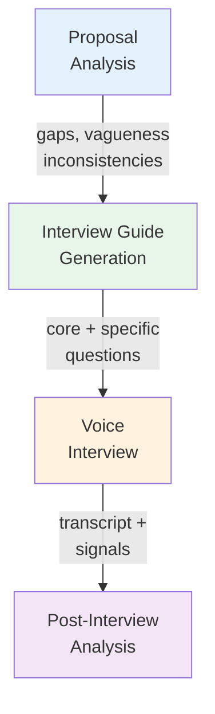

# MJ RFP & Procurement Management OpenApp — Research & Design

## Executive Summary

Nonprofit procurement is a massive, underserved problem space. ~2 million U.S. nonprofits spend ~$3.5 trillion annually, with 32% flowing through government-regulated procurement channels subject to strict compliance rules (2 CFR 200, IRS requirements, state regulations). Yet these organizations manage RFPs with Word documents, email, and Excel spreadsheets. No purpose-built nonprofit RFP lifecycle platform exists.

An MJ OpenApp for RFP/Procurement management, built on MJ Commons primitives, could be the first open-core platform to combine:
1. Full RFP lifecycle management (drafting, distribution, Q&A, evaluation, award)
2. AI-assisted proposal analysis and scoring
3. **AI voice interviews with vendors** (complete market whitespace)
4. Committee-first evaluation with governance, conflict-of-interest management, and audit trails
5. Nonprofit compliance awareness (federal grants, funder requirements)

---

## The Problem Space

### Scale

| Metric | Value |
|--------|-------|
| U.S. registered nonprofits | ~2 million |
| 501(c)(3) tax-exempt organizations | ~1.48 million |
| Aggregate annual spending | ~$3.5 trillion |
| Government-funded (subject to procurement rules) | ~32% of revenue |
| Technology spending alone | $59.6B (2024), projected $78.8B by 2030 |
| Employees (3rd-largest U.S. employer) | 12.5 million |

### The Typical RFP Lifecycle

| Phase | Duration | Key Activity |
|-------|----------|-------------|
| 1. Need Identification & Internal Approval | 1-3 weeks | Budget validation, threshold determination |
| 2. Requirements Definition & RFP Drafting | 1-3 weeks | 23.8 hours average, 7 people involved |
| 3. Committee Formation & Governance Setup | 1-2 weeks | 3-5 evaluators, conflict-of-interest disclosures |
| 4. Distribution & Solicitation | 1-2 weeks | Public notice, vendor outreach |
| 5. Q&A Period & Vendor Response | 3-6 weeks | Longest phase; vendors submit proposals |
| 6. Evaluation & Scoring | 1-3 weeks | Independent scoring → consensus discussion |
| 7. Selection & Contract Negotiation | 1-4 weeks | Award, feedback to non-selected vendors |
| 8. Post-Award Management | Ongoing | Performance monitoring, audit documentation |
| **Total** | **6 weeks - 8 months** | Average: ~57 days posting-to-award |

### Pain Points by Stakeholder

#### Nonprofits Issuing RFPs
- **Writing the RFP is hard** — most lack procurement expertise; 23.8 hours average per RFP
- **Committee logistics are a nightmare** — coordinating 3-5 evaluators for independent scoring + consensus
- **Scoring inconsistency and bias** — 37% of evaluations lack consensus; documented biases include lowest-cost, incumbent favoritism, presentation polish, name recognition
- **Conflict-of-interest management** — documentation-heavy, must be archived for IRS review
- **Audit trail requirements** — 2 CFR 200 requires records of all bids, criteria, quotes, and final prices
- **Multiple funders impose different rules** — must follow the most restrictive of federal/state/organizational requirements
- **Institutional knowledge loss** — procurement expertise leaves when staff turns over

#### Vendors Responding
- **Lack of context and clarity** in RFP requirements
- **Feature-centric rather than outcome-centric** requirements confuse vendors
- **No opportunity to demonstrate fit** — closed processes treat strategic services like commodities
- **Intellectual property concerns** — some orgs claim ownership of submitted proposal content
- **Lowest-cost bias dominates** despite stated best-value criteria
- **No feedback on losses** — vendors invest significant resources with zero learning
- **Repetitive formatting** — every RFP has different format requirements

#### Board & Governance
- **Fiduciary duty creates personal liability** for procurement decisions
- **Conflict-of-interest enforcement** is procedurally complex (annual reviews, signed questionnaires, recusal documentation)
- **Financial literacy gaps** — many board members can't evaluate fair market value
- **Retrospective accountability** — boards review decisions after the fact, not in real-time

### Compliance & Regulatory Context

#### Federal (2 CFR 200 — Uniform Guidance)

| Threshold | Method Required |
|-----------|----------------|
| Under ~$10,000 (micro-purchase) | No competition; price must be "reasonable" |
| $10,000 - $250,000 (simplified acquisition) | 3+ quotes; document price reasonableness |
| Over $250,000 | Full competitive proposals or sealed bids |
| Over $25,000 (any) | Suspension & debarment check required |

Additional requirements: written procurement procedures, written conflict-of-interest standards, specific contract provisions (Appendix II), preference for small/minority/women-owned businesses, full documentation for audit.

**Non-compliance consequences**: disallowed costs, repayment of funds, loss of future funding eligibility, potential legal action.

#### IRS Requirements
- Form 990 publicly discloses financial information
- 3 consecutive years of non-filing → automatic revocation of tax-exempt status
- Excise taxes for private inurement or excess-benefit transactions

#### State-Level
- Varies significantly; California threshold $100,000, New York mandates MWBE participation goals
- **Most restrictive rule applies** — organizations follow whichever standard (federal/state/organizational) is strictest

### Current State: Word + Excel + Email

The vast majority of nonprofits manage procurement manually:
- **Microsoft Word**: Drafting the RFP
- **Email**: Distribution, Q&A, receiving proposals
- **Excel/Google Sheets**: Scoring rubrics and cost comparisons
- **Shared drives**: Distributing proposals to committee members
- **Paper/PDF forms**: Conflict-of-interest disclosures
- **Manual meeting minutes**: Board approvals and committee decisions

Per Whole Whale's best practice guide: *"Create an Excel doc to track the bids and give grades across desired criteria."* That is the state of the art.

---

## Competitive Landscape

### Key Finding: No Purpose-Built Nonprofit RFP Lifecycle Platform Exists

| Category | Platforms | Nonprofit-Specific? | AI? | Serves RFP Lifecycle? |
|----------|-----------|---------------------|-----|-----------------------|
| Nonprofit procurement (spend/PO) | Fraxion, ControlHub, Tradogram, Procurify, ProcureDesk | Yes (spend only) | Minimal | No — purchase orders, not RFP evaluation |
| Government procurement | Bonfire/Euna, OpenGov, BidNet/SOVRA | No (government) | Emerging (OpenGov) | Yes — but priced/designed for government |
| Vendor-side RFP tools | Loopio, Responsive, Qvidian, Inventive AI, AutoRFP.ai | No | Strong | No — help vendors respond, not evaluate |
| Issuer-side RFP tools | Responsive (full), RFP360.AI, Prokuria | No | Emerging | Partially — no nonprofit compliance |
| Enterprise S2P suites | SAP Ariba, JAGGAER, Ivalua, Coupa, Zip, Fairmarkit | No | Strong | Yes — but enterprise pricing ($100K+) |
| Open source | OpenProcurement/ProZorro, Procuman, ProposalForce | No | No | Partially — national-scale government focus |
| **Voice AI for procurement** | **None** | **N/A** | **N/A** | **N/A — complete whitespace** |
| **Nonprofit RFP lifecycle** | **None** | **N/A** | **N/A** | **N/A — complete whitespace** |

### Closest Analogs

**Bonfire Interactive (Euna Procurement)** — $1,000/year, 600+ public procurement teams
- Excellent: online bidding, browser-based evaluation scorecards, automatic tabulation, full audit trails
- Missing: nonprofit compliance, grant tracking, AI evaluation, voice interviews

**OpenGov Procurement** — Enterprise pricing, 2,000+ communities
- Excellent: AI vendor search, AI scope assistant, collaborative evaluation, cross-agency benchmarking
- Missing: nonprofit focus, affordable pricing, voice interviews

**Responsive** — Custom pricing (starts $6K/year)
- Excellent: both issuer AND responder, AI evaluation engine with automated scoring/outlier detection
- Missing: nonprofit compliance, affordable pricing, voice interviews, committee governance

### AI-Powered Procurement (Document Analysis Only)

- **Sopact** — "Intelligent Cell" scores proposals against rubrics; cut pre-review time by 80% (1,000→100 shortlist in hours) for an accelerator
- **Iris AI** — Automated scoring, data extraction, inconsistency flagging, bias reduction
- **OpenGov** — AI Vendor Search, AI Scope Assistant
- **Responsive** — AI evaluation engine with outlier detection and compliance checking

All are document-analysis only. None add conversational/voice interactions.

---

## The AI Voice Interview Opportunity

### Complete Market Whitespace

No platform applies voice/audio AI to procurement. The technology exists in three adjacent markets but has never been combined:

| Market | Proven Capability | Key Platforms |
|--------|-------------------|---------------|
| AI hiring interviews | Structured AI-conducted interviews with scoring | HireVue, Mercor, Talview (Ivy AI) |
| AI qualitative research | Adaptive AI-moderated interviews with probing | Outset AI, Strella, Agent Interviews |
| Procurement AI | Automated proposal analysis and scoring | Sopact, Iris AI, OpenGov, Responsive |

### Technology Stack (Production-Ready)

| Component | Technology | Latency | Cost |
|-----------|------------|---------|------|
| Real-time voice AI | OpenAI Realtime API, ElevenLabs Agents | Sub-300ms | ~$0.05-0.08/min |
| Voice agent platform | Vapi, Retell AI, Bland AI | 500-800ms | $0.05-0.09/min |
| Document-aware RAG | LangGraph, LlamaIndex + vector DB | N/A (preprocessing) | $0.50-2.00/proposal |
| Sentiment/confidence | Hume AI (48+ emotional dimensions) | <300ms | ~$0.03/min |
| Transcription | Deepgram, AssemblyAI | Real-time | ~$0.01/min |

**Total cost per 30-minute vendor interview: $4-12** vs $500-2,000 for human equivalent.

### How It Would Work

```
Phase 1: Proposal Ingestion
  Vendor submits response → AI parses, indexes, embeds in vector DB
  → Identifies gaps, vagueness, inconsistencies vs requirements
  → Generates structured interview guide with adaptive branches

Phase 2: AI Voice Interview (20-30 min)
  AI agent conducts real-time conversation:
  - Identifies itself as AI, obtains consent
  - Works through core questions (same for all vendors, for fairness)
  - Asks vendor-specific probes targeting proposal weak spots
  - References specific proposal sections ("On page 14, you mention...")
  - Adapts follow-ups based on responses
  - Records audio + real-time transcript + confidence signals

Phase 3: Analysis & Reporting
  AI generates:
  - Full transcript with timestamps
  - Structured summary by evaluation category
  - Confidence/sentiment overlay
  - Proposal-vs-verbal-claims consistency check
  - Cross-vendor comparative scoring
  - Recommended areas for human follow-up
```

### Question Categories the AI Would Explore

- **Clarifying ambiguities**: "Your proposal mentions 'enterprise-grade security' but doesn't specify certifications..."
- **Probing claims**: "You state 99.97% uptime. Over the past 24 months, what was your actual measured uptime?"
- **Checking experience**: "For the [specific client] project listed in your proposal, what was original scope vs delivered scope?"
- **Edge cases**: "What happens if our data volume triples in year two? How does your pricing accommodate that?"
- **Technical verification**: "You describe your platform as 'AI-native.' Can you explain the actual technology stack?"

### Ethical Considerations

- **Transparency**: Vendors must know it's AI. Non-negotiable.
- **Fairness advantage**: Identical core questions, consistent scoring, no interviewer fatigue/mood/bias
- **Fairness risks**: Non-native speakers, cultural communication styles, presentation polish bias
- **Vendor acceptance**: Position as "preliminary evaluation" with human interviews for finalists. Offer written Q&A alternative.
- **Recording consent**: Standard procurement practice. Provide vendors their own transcripts.
- **Bias mitigation**: Independent audits, diverse vendor testing, sentiment scoring as supplementary (not primary) signal

---

## How This Maps to MJ Commons

### The Core Insight: An RFP IS a Submission-Review Workflow (Inverted)

In abstract management: Person submits content → Committee reviews
In RFP management: Organization issues solicitation → Vendors submit proposals → Committee reviews

The review workflow is nearly identical. The difference is WHO submits and the governance overlay.

### MJ Commons Primitives That Apply Directly

| Commons Primitive | RFP Equivalent | How It's Used |
|-------------------|----------------|---------------|
| **Submission** | VendorProposal | A vendor's response to a solicitation |
| **SubmissionReview** | ProposalEvaluation | A committee member's scored review of a proposal |
| **ReviewCriteria** | EvaluationCriteria | The scoring rubric (technical, cost, experience, etc.) |
| **Program** | Solicitation | The RFP itself as a managed lifecycle |
| **ProgramPhase** | SolicitationPhase | Drafting → Open → Q&A → Closed → Evaluation → Award |
| **ProgramRole** | CommitteeMember | Evaluator, Chair, Subject Matter Expert, Observer |
| **Person** | Vendor contact, evaluator | Anyone involved in the process |
| **Organization** | Vendor org | The company submitting a proposal |
| **PersonOrganizationRole** | Vendor's role at their org | Primary contact, technical lead, executive sponsor |
| **Group** | Evaluation Committee | Governed group with conflict-of-interest rules |
| **GroupMembership** | Committee membership | Who's on the evaluation committee and their role |
| **PersonSkill** | Evaluator expertise | Helps match evaluators to solicitation domains |

### RFP-Specific IS-A Subtypes

These would be the thin layer the RFP OpenApp adds on top of Commons:

```sql
-- Solicitation extends Program
CREATE TABLE [mj_procurement].[Solicitation] (
    ID UNIQUEIDENTIFIER NOT NULL,
    SolicitationType NVARCHAR(50),           -- 'RFP' | 'RFQ' | 'RFI' | 'IFB' | 'Sole Source'
    ComplianceFramework NVARCHAR(100),       -- '2 CFR 200' | 'State' | 'Internal Only'
    DollarThreshold DECIMAL(18,2),           -- Estimated contract value
    ThresholdCategory NVARCHAR(50),          -- 'Micro-purchase' | 'Simplified' | 'Formal'
    FundingSources NVARCHAR(MAX),            -- JSON: which grants/funds this procurement charges to
    BoardApprovalRequired BIT,
    BoardApprovalDate DATETIMEOFFSET,
    PublicNoticeURL NVARCHAR(500),
    CONSTRAINT PK_Solicitation PRIMARY KEY (ID),
    CONSTRAINT FK_Solicitation_Program FOREIGN KEY (ID) REFERENCES ${flyway:defaultSchema}.Program(ID)
);

-- SolicitationRequirement — individual requirements within the RFP
CREATE TABLE [mj_procurement].[SolicitationRequirement] (
    ID UNIQUEIDENTIFIER NOT NULL DEFAULT NEWSEQUENTIALID(),
    SolicitationID UNIQUEIDENTIFIER NOT NULL,
    Category NVARCHAR(100),                  -- 'Technical' | 'Organizational' | 'Financial' | 'Compliance'
    RequirementText NVARCHAR(MAX) NOT NULL,
    IsMandatory BIT NOT NULL DEFAULT 1,
    Weight DECIMAL(5,2),                     -- Scoring weight (0-100)
    SortOrder INT NOT NULL DEFAULT 0,
    CONSTRAINT PK_SolicitationRequirement PRIMARY KEY (ID),
    CONSTRAINT FK_SolicitationRequirement_Solicitation FOREIGN KEY (SolicitationID)
        REFERENCES [mj_procurement].[Solicitation](ID)
);

-- VendorProposal extends Submission
CREATE TABLE [mj_procurement].[VendorProposal] (
    ID UNIQUEIDENTIFIER NOT NULL,
    OrganizationID UNIQUEIDENTIFIER NOT NULL, -- The vendor org
    PrimaryContactPersonID UNIQUEIDENTIFIER NOT NULL,
    ProposedCost DECIMAL(18,2),
    ProposedTimeline NVARCHAR(255),
    ExecutiveSummary NVARCHAR(MAX),
    TechnicalApproach NVARCHAR(MAX),
    AIAnalysisJSON NVARCHAR(MAX),             -- AI-generated gap analysis, vagueness scoring, etc.
    CONSTRAINT PK_VendorProposal PRIMARY KEY (ID),
    CONSTRAINT FK_VendorProposal_Submission FOREIGN KEY (ID) REFERENCES ${flyway:defaultSchema}.Submission(ID),
    CONSTRAINT FK_VendorProposal_Organization FOREIGN KEY (OrganizationID)
        REFERENCES ${flyway:defaultSchema}.Organization(ID),
    CONSTRAINT FK_VendorProposal_PrimaryContact FOREIGN KEY (PrimaryContactPersonID)
        REFERENCES ${flyway:defaultSchema}.Person(ID)
);

-- ProposalRequirementResponse — maps vendor response to each requirement
CREATE TABLE [mj_procurement].[ProposalRequirementResponse] (
    ID UNIQUEIDENTIFIER NOT NULL DEFAULT NEWSEQUENTIALID(),
    VendorProposalID UNIQUEIDENTIFIER NOT NULL,
    SolicitationRequirementID UNIQUEIDENTIFIER NOT NULL,
    ResponseText NVARCHAR(MAX),
    AIComplianceScore DECIMAL(5,2),           -- AI-assessed compliance with requirement (0-100)
    AIConfidenceLevel DECIMAL(5,2),           -- AI confidence in its own scoring (0-100)
    AIGapNotes NVARCHAR(MAX),                 -- AI-identified gaps or vagueness
    CONSTRAINT PK_ProposalRequirementResponse PRIMARY KEY (ID),
    CONSTRAINT FK_PRR_Proposal FOREIGN KEY (VendorProposalID)
        REFERENCES [mj_procurement].[VendorProposal](ID),
    CONSTRAINT FK_PRR_Requirement FOREIGN KEY (SolicitationRequirementID)
        REFERENCES [mj_procurement].[SolicitationRequirement](ID)
);

-- ConflictOfInterest — committee member disclosures
CREATE TABLE [mj_procurement].[ConflictOfInterest] (
    ID UNIQUEIDENTIFIER NOT NULL DEFAULT NEWSEQUENTIALID(),
    SolicitationID UNIQUEIDENTIFIER NOT NULL,
    PersonID UNIQUEIDENTIFIER NOT NULL,        -- The evaluator
    VendorOrganizationID UNIQUEIDENTIFIER,     -- Specific vendor (null = general disclosure)
    DisclosureType NVARCHAR(50) NOT NULL,      -- 'None' | 'Financial' | 'Personal' | 'Employment' | 'Other'
    DisclosureText NVARCHAR(MAX),
    RecusalRequired BIT NOT NULL DEFAULT 0,
    ReviewedByPersonID UNIQUEIDENTIFIER,       -- Who reviewed the disclosure
    ReviewedAt DATETIMEOFFSET,
    Status NVARCHAR(50) NOT NULL DEFAULT 'Pending', -- 'Pending' | 'Cleared' | 'Recused' | 'Under Review'
    CONSTRAINT PK_ConflictOfInterest PRIMARY KEY (ID),
    CONSTRAINT FK_COI_Solicitation FOREIGN KEY (SolicitationID)
        REFERENCES [mj_procurement].[Solicitation](ID),
    CONSTRAINT FK_COI_Person FOREIGN KEY (PersonID) REFERENCES ${flyway:defaultSchema}.Person(ID),
    CONSTRAINT FK_COI_Vendor FOREIGN KEY (VendorOrganizationID)
        REFERENCES ${flyway:defaultSchema}.Organization(ID)
);

-- VendorQuestion — Q&A period management
CREATE TABLE [mj_procurement].[VendorQuestion] (
    ID UNIQUEIDENTIFIER NOT NULL DEFAULT NEWSEQUENTIALID(),
    SolicitationID UNIQUEIDENTIFIER NOT NULL,
    AskedByOrganizationID UNIQUEIDENTIFIER,    -- Which vendor asked (null if anonymous)
    QuestionText NVARCHAR(MAX) NOT NULL,
    AnswerText NVARCHAR(MAX),
    AnsweredByPersonID UNIQUEIDENTIFIER,
    AskedAt DATETIMEOFFSET NOT NULL DEFAULT GETUTCDATE(),
    AnsweredAt DATETIMEOFFSET,
    IsPublished BIT NOT NULL DEFAULT 0,        -- Published to all vendors?
    CONSTRAINT PK_VendorQuestion PRIMARY KEY (ID),
    CONSTRAINT FK_VQ_Solicitation FOREIGN KEY (SolicitationID)
        REFERENCES [mj_procurement].[Solicitation](ID)
);

-- AIVendorInterview — the AI voice interview record
CREATE TABLE [mj_procurement].[AIVendorInterview] (
    ID UNIQUEIDENTIFIER NOT NULL DEFAULT NEWSEQUENTIALID(),
    VendorProposalID UNIQUEIDENTIFIER NOT NULL,
    InterviewedPersonID UNIQUEIDENTIFIER NOT NULL,  -- Vendor representative
    ScheduledAt DATETIMEOFFSET,
    StartedAt DATETIMEOFFSET,
    CompletedAt DATETIMEOFFSET,
    DurationSeconds INT,
    Status NVARCHAR(50) NOT NULL DEFAULT 'Scheduled', -- 'Scheduled'|'In Progress'|'Completed'|'Declined'|'Cancelled'
    ConsentObtained BIT NOT NULL DEFAULT 0,
    RecordingURL NVARCHAR(500),
    TranscriptText NVARCHAR(MAX),
    AIInterviewGuideJSON NVARCHAR(MAX),          -- The question plan the AI used
    AISummaryJSON NVARCHAR(MAX),                 -- Structured summary by category
    AIScoreJSON NVARCHAR(MAX),                   -- AI-generated scores per evaluation criterion
    AIConfidenceAnalysisJSON NVARCHAR(MAX),      -- Sentiment/confidence signals
    AIInconsistenciesJSON NVARCHAR(MAX),         -- Proposal vs verbal claims discrepancies
    CONSTRAINT PK_AIVendorInterview PRIMARY KEY (ID),
    CONSTRAINT FK_AVI_Proposal FOREIGN KEY (VendorProposalID)
        REFERENCES [mj_procurement].[VendorProposal](ID),
    CONSTRAINT FK_AVI_Person FOREIGN KEY (InterviewedPersonID)
        REFERENCES ${flyway:defaultSchema}.Person(ID)
);

-- EvaluationRound — multi-round evaluation support
CREATE TABLE [mj_procurement].[EvaluationRound] (
    ID UNIQUEIDENTIFIER NOT NULL DEFAULT NEWSEQUENTIALID(),
    SolicitationID UNIQUEIDENTIFIER NOT NULL,
    RoundNumber INT NOT NULL,
    RoundName NVARCHAR(100),                    -- 'Initial Screening' | 'Technical Review' | 'Cost Review' | 'Finalist Interview'
    EvaluationType NVARCHAR(50),                -- 'Independent' | 'Consensus' | 'AI-Assisted' | 'Interview'
    Status NVARCHAR(50) NOT NULL DEFAULT 'Pending',
    StartDate DATETIMEOFFSET,
    EndDate DATETIMEOFFSET,
    CONSTRAINT PK_EvaluationRound PRIMARY KEY (ID),
    CONSTRAINT FK_ER_Solicitation FOREIGN KEY (SolicitationID)
        REFERENCES [mj_procurement].[Solicitation](ID)
);

-- ComplianceChecklistItem — regulatory compliance tracking
CREATE TABLE [mj_procurement].[ComplianceChecklistItem] (
    ID UNIQUEIDENTIFIER NOT NULL DEFAULT NEWSEQUENTIALID(),
    SolicitationID UNIQUEIDENTIFIER NOT NULL,
    ComplianceFramework NVARCHAR(100),          -- '2 CFR 200' | 'IRS' | 'State' | 'Organizational'
    RequirementDescription NVARCHAR(MAX) NOT NULL,
    IsMet BIT,
    Evidence NVARCHAR(MAX),                     -- Documentation reference
    VerifiedByPersonID UNIQUEIDENTIFIER,
    VerifiedAt DATETIMEOFFSET,
    CONSTRAINT PK_ComplianceChecklistItem PRIMARY KEY (ID),
    CONSTRAINT FK_CCI_Solicitation FOREIGN KEY (SolicitationID)
        REFERENCES [mj_procurement].[Solicitation](ID)
);
```

### Agent Mapping to MJ Commons Agents

The three Commons agents map naturally, plus one new one:

#### 1. Proposal Evaluation Agent (extends Submission Review Agent)

The Submission Review Agent's flow — intake → analysis → assignment → review → decision — maps directly:

| Commons Step | RFP Equivalent |
|-------------|----------------|
| Submission Intake | Vendor proposal receipt, completeness check |
| Content Analysis | AI reads proposal, scores against requirements, identifies gaps and vagueness |
| Reviewer Assignment | Match evaluators to proposals based on expertise, check conflicts |
| Review Coordination | Independent scoring → outlier detection → consensus discussion |
| Decision Synthesis | AI summarizes committee input → recommendation → board approval |

**RFP-specific configuration:**
- Scoring algorithm includes compliance weighting (mandatory vs. desirable requirements)
- Bias detection: flag scoring patterns (always-lowest-cost, incumbent favoritism)
- Multi-round support: initial screening → technical deep-dive → cost review → finalist interview
- Debarment checking: automated lookup against SAM.gov exclusion database

#### 2. Procurement Lifecycle Agent (extends Program Lifecycle Agent)

Manages the solicitation timeline with RFP-specific awareness:

| Commons Step | RFP Equivalent |
|-------------|----------------|
| Program Setup | RFP drafting assistance, requirement decomposition, compliance checklist generation |
| Participant Matching | Vendor outreach, vendor qualification screening |
| Engagement Monitoring | Q&A period management, proposal receipt tracking, deadline reminders |
| Health Check | Timeline slippage alerts, committee activity monitoring, missing scores |

**RFP-specific configuration:**
- Threshold-aware: automatically determines procurement method based on estimated value
- Compliance-aware: generates appropriate documentation requirements based on funding sources
- Template library: reusable RFP templates by category (technology, consulting, construction, etc.)
- Vendor portal: self-service Q&A submission, proposal upload, status checking

#### 3. Committee Governance Agent (extends Governance Agent)

Manages the evaluation committee with procurement-specific governance:

| Commons Step | RFP Equivalent |
|-------------|----------------|
| Election/Nomination | Committee formation, role assignment, expertise matching |
| Meeting Lifecycle | Consensus scoring meetings, agenda with proposals to discuss, action items |
| Compliance Monitor | Conflict-of-interest collection/tracking, recusal enforcement, audit trail completeness |
| Succession Planning | N/A for single procurement — but committee capacity planning across concurrent RFPs |

**RFP-specific configuration:**
- Conflict-of-interest workflow: disclosure collection → review → clearance/recusal → documentation
- Scoring calibration: before independent scoring, AI guides a calibration exercise
- Enhanced consensus: automated outlier detection, structured discussion protocol, real-time convergence tracking
- Audit package generation: compile all documentation into board-ready and auditor-ready packages

#### 4. AI Interview Agent (NEW — unique to RFP OpenApp)

This is the novel capability. A purpose-built MJ agent that:

1. **Reads the vendor's proposal** via RAG pipeline
2. **Cross-references evaluation criteria** to identify areas needing clarification
3. **Generates a structured interview guide** with core questions (fairness) + vendor-specific probes (depth)
4. **Conducts a 20-30 minute voice interview** via real-time voice AI
5. **Captures transcript + confidence/sentiment signals**
6. **Produces a structured evaluation report** for the human committee



| Step | Type | Description |
|------|------|-------------|
| Proposal Analysis | Sub-Agent (Prompt) | RAG-ingest proposal, score against requirements, identify vagueness/gaps/inconsistencies, flag areas for probing |
| Interview Guide Generation | Sub-Agent (Prompt) | Generate core questions (same for all vendors) + vendor-specific probes + follow-up decision trees |
| Voice Interview | Sub-Agent (External Tool) | Conduct real-time voice conversation via Vapi/Retell + ElevenLabs/OpenAI. Reference proposal sections. Adapt follow-ups. Capture transcript + Hume AI confidence signals |
| Post-Interview Analysis | Sub-Agent (Prompt) | Structure transcript by category, score against rubric, overlay confidence signals, check proposal-vs-verbal consistency, generate comparative report |

**Cost per vendor interview: $4-12** (voice AI + LLM + sentiment analysis + transcription)
**vs $500-2,000** for human equivalent (2-4 hours prep + 1 hour interview per committee member)

---

## Multi-Phase Evaluation Flow

The AI capabilities layer into a natural multi-phase evaluation that nonprofits can configure to match their compliance requirements:

```
Phase 1: Automated Screening (AI)
  └── Completeness check (all required sections present?)
  └── Debarment/exclusion check (SAM.gov lookup)
  └── Mandatory requirement compliance (pass/fail)
  └── Result: Qualified vendor list

Phase 2: AI Proposal Analysis (AI)
  └── Score each proposal against evaluation criteria
  └── Generate gap analysis and comparison matrix
  └── Identify areas needing clarification per vendor
  └── Result: AI evaluation summary + interview guides

Phase 3: AI Voice Interviews (AI + Vendor)
  └── Conduct structured interviews with each vendor
  └── Produce transcripts, summaries, confidence analysis
  └── Flag inconsistencies between proposal and verbal claims
  └── Result: Interview reports for committee review

Phase 4: Independent Committee Scoring (Human)
  └── Evaluators review proposals + AI analysis + interview reports
  └── Score independently against rubric
  └── AI detects scoring outliers and bias patterns
  └── Result: Individual scorecards

Phase 5: Consensus Discussion (Human + AI)
  └── AI facilitates structured consensus protocol
  └── Lowest scorer speaks first, then highest (evidence-based)
  └── Real-time score convergence tracking
  └── Result: Consensus scores + documented rationale

Phase 6: Selection & Award (Human + Governance)
  └── Committee recommendation to board
  └── Board review with full audit package
  └── Award notification + vendor feedback
  └── Result: Contract award + complete audit trail
```

---

## OpenApp Package Structure

```
mj-procurement/
  openapp.json                    # OpenApp manifest
  metadata/
    agents/
      .proposal-evaluation-agent.json
      .procurement-lifecycle-agent.json
      .committee-governance-agent.json
      .ai-interview-agent.json
    prompts/
      templates/
        proposal-analysis/
          gap-analysis.template.md
          vagueness-detection.template.md
          requirement-mapping.template.md
        interview/
          interview-guide-generation.template.md
          post-interview-analysis.template.md
          vendor-comparison.template.md
        evaluation/
          scoring-calibration.template.md
          consensus-facilitation.template.md
          bias-detection.template.md
          audit-package.template.md
        compliance/
          2cfr200-checklist.template.md
          rfp-template-generator.template.md
    actions/
      .procurement-actions.json
    applications/
      .mj-procurement-application.json
  packages/
    server/
      @mj/procurement-server-bootstrap/
      @mj/procurement-actions/
      @mj/procurement-ai-interview/      # Voice interview integration
    client/
      @mj/procurement-ng-bootstrap/
      @mj/procurement-ng-components/
    shared/
      @mj/procurement-types/
  migrations/
    V001__procurement_schema.sql
```

---

## Differentiation Summary

| Capability | Bonfire (Gov) | OpenGov (Gov) | Responsive (Enterprise) | **MJ Procurement** |
|------------|---------------|---------------|-------------------------|---------------------|
| RFP lifecycle management | Yes | Yes | Partial | **Yes** |
| Committee-based evaluation | Yes | Yes | Limited | **Yes** |
| AI proposal analysis | No | Emerging | Yes | **Yes** |
| AI voice vendor interviews | No | No | No | **Yes (unique)** |
| Conflict-of-interest management | Basic | Basic | No | **Yes (comprehensive)** |
| Nonprofit compliance (2 CFR 200) | No | No | No | **Yes** |
| Grant/funder awareness | No | No | No | **Yes** |
| Consensus scoring with AI | No | No | No | **Yes** |
| Bias detection in scoring | No | No | Basic | **Yes** |
| Audit package generation | Yes | Yes | No | **Yes** |
| Open core | No | No | No | **Yes** |
| Built on shared Commons primitives | No | No | No | **Yes** |
| Affordable for nonprofits | ~$1K/yr | Enterprise | ~$6K+/yr | **Open core + tiers** |

---

## Open Questions for Discussion

1. **Should the AI Interview Agent be Commons-level or RFP-specific?** AI-moderated structured interviews could apply broadly (membership interviews, committee candidate evaluations, volunteer screening). Making it a Commons primitive would benefit multiple OpenApps.

2. **Vendor portal scope**: Should vendors get their own portal/login to submit proposals, ask questions, and check status? Or is email-based submission sufficient for v1?

3. **Integration with existing vendor management**: Many nonprofits already have vendor relationships in their CRM (Salesforce NPSP, Bloomerang). How deeply should v1 integrate?

4. **RFP template marketplace**: Should there be a shared library of RFP templates that organizations can browse and customize? This is a significant value-add but also a content creation effort.

5. **Sealed bid support**: Some procurement requires sealed bids (prices hidden until a specific date). This adds significant complexity to the submission workflow. Include in v1?

6. **Contract management**: Post-award contract management (milestones, deliverables, performance tracking) is a natural extension but may be a separate OpenApp. Where to draw the line?

---

## Sources

### Problem Space & Best Practices
- TNPA RFP Best Practices 2025
- PNC — Nonprofit RFP Guide
- Whole Whale — Nonprofit RFP Guide
- TechSoup — RFP Process for Nonprofits
- Fairmarkit — 4 RFP Pain Points
- Vendorful — 4 Biggest Challenges in RFP Process
- Planergy — Common Problems in Non-Profit Procurement
- The Giving Institute — Why Closed RFPs Fail Nonprofits
- Cost Analysts — Pitfalls of RFPs
- Merak Systems — Responding to RFPs: A Vendor's Perspective

### Compliance & Governance
- eCFR — 2 CFR Part 200 (Uniform Guidance)
- JFW Accounting — Understanding 2 CFR 200 for Nonprofits
- National Council of Nonprofits — Good Governance Policies
- Weil — 2024 Guide to Not-for-Profit Governance
- Cameron Hawkins Law — Nonprofit Board Conflicts of Interest

### Market & Competitive Landscape
- Bonfire eProcurement (gobonfire.com)
- OpenGov Procurement (opengov.com)
- BidNet Direct / SOVRA
- Responsive / RFP360
- Loopio, Inventive AI, AutoRFP.ai
- SAP Ariba, JAGGAER, Ivalua, Coupa, Zip, Fairmarkit
- OpenProcurement / ProZorro (open source)

### AI & Voice Technology
- OpenAI Realtime API
- ElevenLabs Conversational AI
- Vapi, Retell AI, Bland AI (voice agent platforms)
- Hume AI (emotion/confidence analysis)
- Deepgram, AssemblyAI (transcription)
- Sopact, Iris AI (AI procurement analysis)
- HireVue, Mercor, Talview (AI interviews)
- Outset AI, Strella (AI qualitative research)

### Market Size
- USAFacts — ~2M nonprofits
- Candid — $3.5T aggregate spending
- Grand View Research — $59.6B nonprofit tech spending (2024)
- NTEN — 2024 Nonprofit Digital Investments Report
