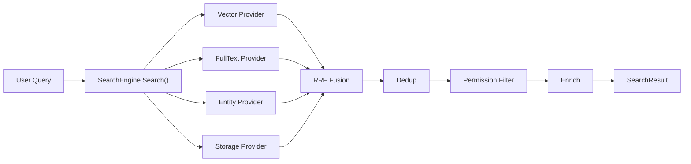
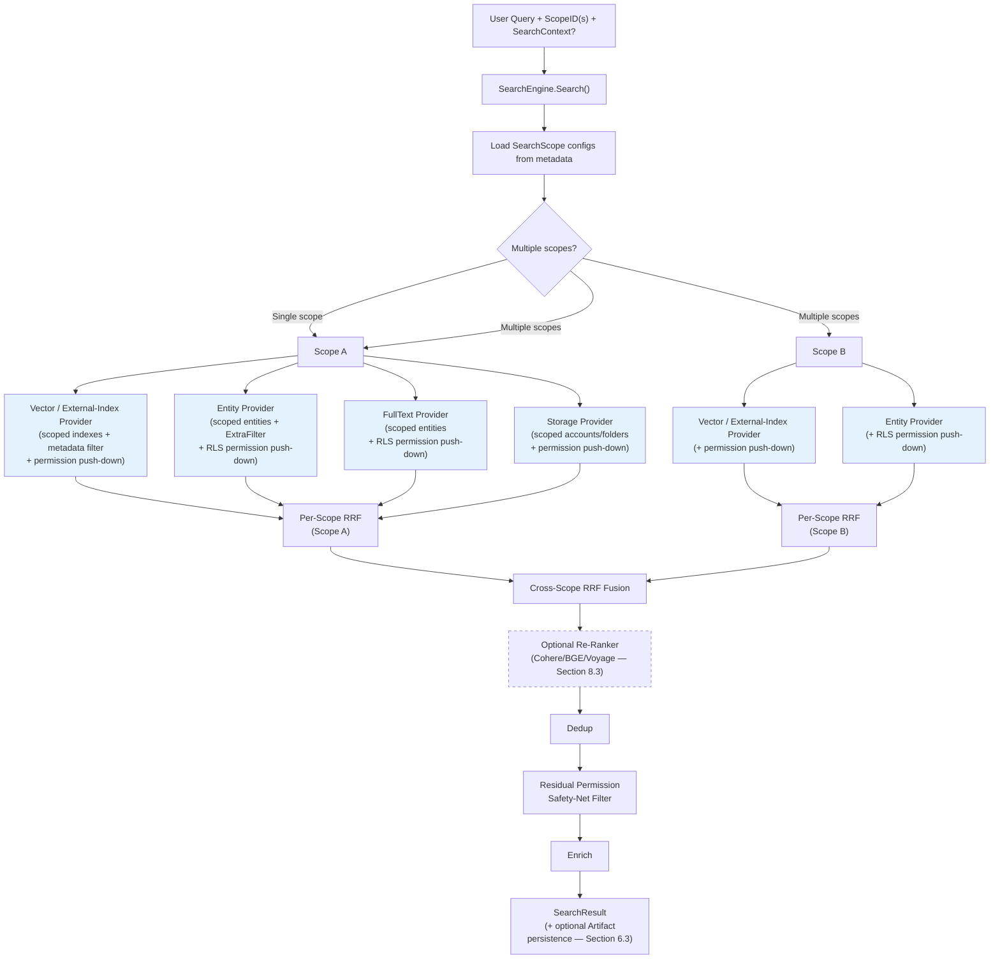
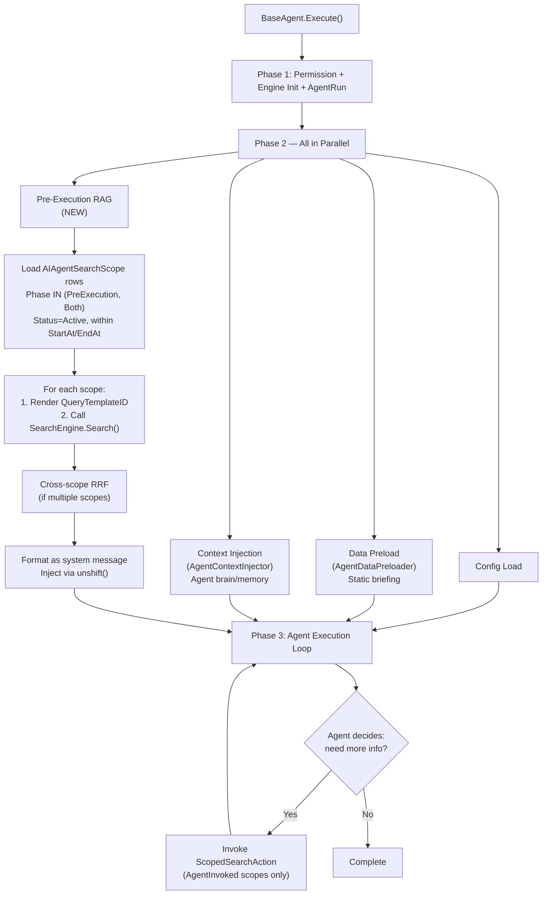
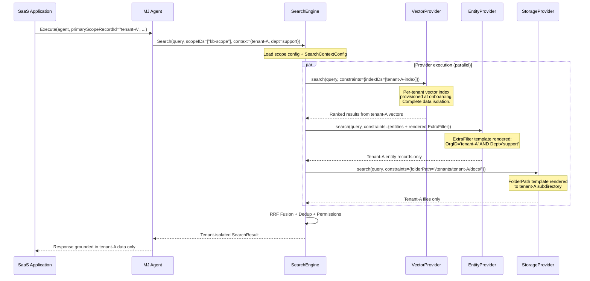
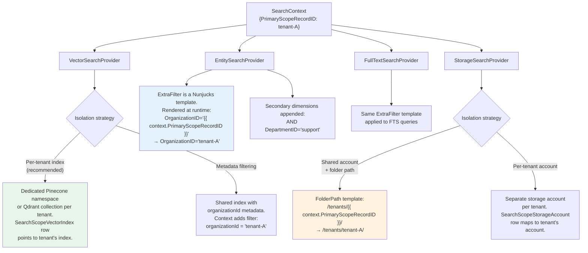
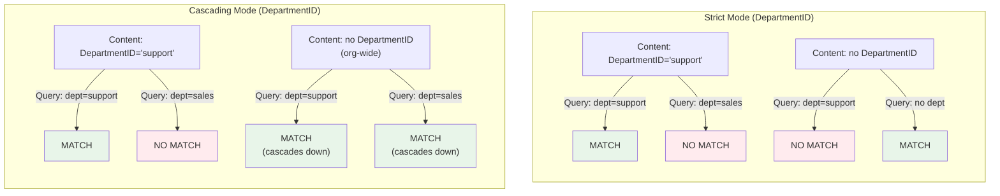
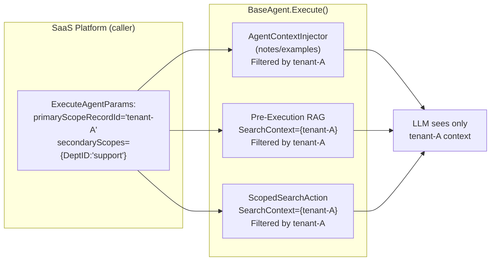
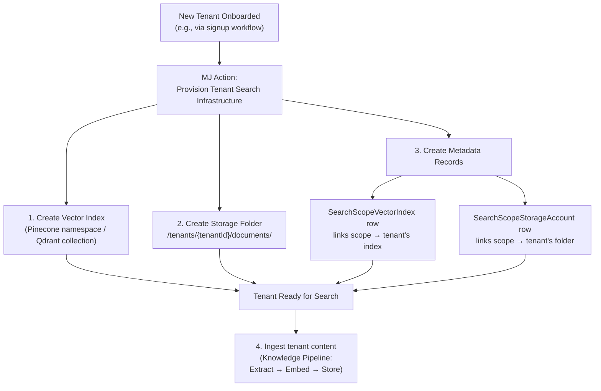
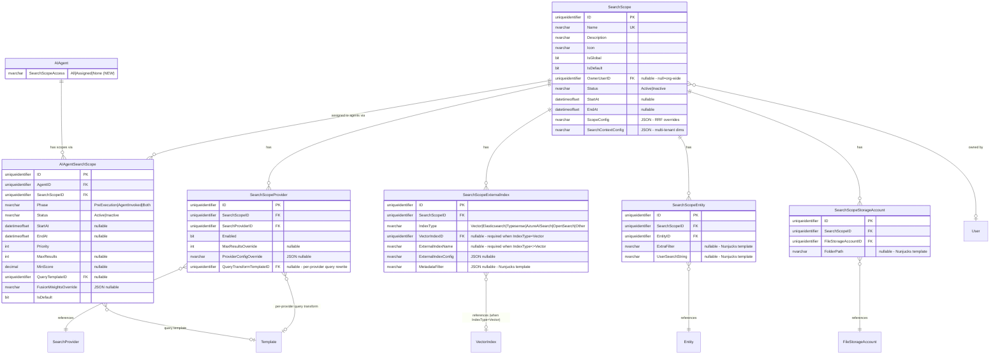

# Search Scopes & RAG+ Agent Integration — Comprehensive Plan

## Executive Summary

This plan introduces **Search Scopes** — a configurable, permission-aware layer that lets users and agents define precisely *what* to search across MJ's multi-provider search infrastructure. Combined with agent integration, this creates a **RAG+** engine where agents can receive pre-execution retrieval context and/or invoke scoped search as a tool during execution.

**Key outcomes:**
1. Users can create named Search Scopes that filter which providers, vector indexes, entities, and storage accounts participate in a search
2. Agents can be assigned 1+ Search Scopes with phase control (pre-execution RAG, agent-invoked tool, or both)
3. Pre-execution RAG runs automatically in parallel with existing Phase 2 initialization — zero added latency
4. A new `ScopedSearchAction` enforces scope restrictions when agents invoke search as a tool
5. Search Scope permissions (**critical fast-follow** — see §10) will allow org-level control over who can search what, including per-user control over unscoped/Global search. Phase 1 ships without this gate; closing it is the primary next-milestone blocker for locking down multi-tenant or department-isolated scopes in production.

**What this is NOT:**
- Notes & Examples (AgentContextInjector) = the agent's **brain** — learned behaviors, personality, few-shot patterns. Shapes *how* the agent thinks.
- Data Sources (AgentDataPreloader) = the agent's **briefing packet** — static reference data loaded before execution. Config tables, user profiles, org settings.
- Search Scopes (this plan) = the agent's **research library** — dynamic, query-dependent knowledge retrieval. Documents, policies, vectorized content relevant to *this specific question*.

Each subsystem serves a distinct purpose. Documentation must make this distinction crystal clear.

**Small static reference content stays in memory/notes, not RAG.** Glossaries, acronym lists, FAQs, and short canonical policy snippets are best handled by static Notes injected by the existing memory system — no retrieval overhead, no scope configuration, no re-rank cost. RAG is for corpora large enough that stuffing everything into the prompt is wasteful *and* where the subset relevant to a specific query is a small fraction of the whole. If you can fit the reference content comfortably in every prompt, use a Note; if you cannot, use a Search Scope. Don't build a scope just to avoid prompt-stuffing a 2 KB glossary.

---

## Table of Contents

1. [Architecture Overview](#1-architecture-overview)
2. [Entity Model](#2-entity-model)
3. [SearchEngine Scope Integration](#3-searchengine-scope-integration)
4. [Agent Integration — Pre-Execution RAG](#4-agent-integration--pre-execution-rag)
5. [Agent Integration — Scoped Search Action](#5-agent-integration--scoped-search-action)
6. [Search UI — Scope Selector](#6-search-ui--scope-selector)
7. [Template System Integration](#7-template-system-integration)
8. [Multi-Scope RRF Fusion](#8-multi-scope-rrf-fusion)
9. [Multi-Tenant Search Context](#9-multi-tenant-search-context)
10. [Search Scope Permissions (Critical Fast-Follow)](#10-search-scope-permissions-critical-fast-follow)
11. [Existing System Touchpoints](#11-existing-system-touchpoints)
12. [Documentation Requirements](#12-documentation-requirements)
13. [Task Breakdown](#13-task-breakdown)

---

## 1. Architecture Overview

### Current Search Flow (No Scopes)



### New Search Flow with Scopes



Blue provider nodes show **where permission push-down happens** (Section 3.6). The dashed re-ranker is **optional and disabled by default** (Section 8.3). The late filter is a safety net only — if it's removing anything meaningful, provider push-down is incomplete.

### Agent RAG+ Flow



  Phase 3 (agent execution):
  ├── Agent sees pre-execution RAG in conversation context
  ├── Agent has ScopedSearchAction tool (for 'AgentInvoked'/'Both' scopes)
  │   └── Action checks agent's SearchScopeAccess + allowed scopes
  └── Agent can search iteratively with specific scopes
```

---

## 2. Entity Model

### 2.1 SearchScope (New Entity)

The core configuration entity. Each scope defines a named, reusable search boundary.

| Column | Type | Nullable | Default | Description |
|--------|------|----------|---------|-------------|
| ID | uniqueidentifier | NO | NEWSEQUENTIALID() | Primary key |
| Name | nvarchar(200) | NO | | Human-readable scope name (e.g., "HR Policies", "Engineering Docs") |
| Description | nvarchar(max) | YES | | Detailed description of what this scope covers |
| Icon | nvarchar(200) | YES | | Font Awesome icon class for UI display |
| IsGlobal | bit | NO | 0 | If true, this scope includes everything (equivalent to no scope filtering). Only one global scope should exist. |
| IsDefault | bit | NO | 0 | If true, this is the default scope for users/agents that don't specify one |
| OwnerUserID | uniqueidentifier | YES | NULL | NULL = organization-wide scope. Set = personal scope owned by this user. FK to User. |
| Status | nvarchar(20) | NO | 'Active' | 'Active' or 'Inactive'. CHECK constraint. |
| StartAt | datetimeoffset | YES | NULL | If set, scope is only active after this timestamp. NULL = immediately active. |
| EndAt | datetimeoffset | YES | NULL | If set, scope auto-deactivates after this timestamp. NULL = no expiry. |
| ScopeConfig | nvarchar(max) | YES | NULL | JSON for advanced overrides: `{ "rrfK": 60, "fusionWeights": { "vector": 1.5, "fulltext": 1.0 } }` |
| SearchContextConfig | nvarchar(max) | YES | NULL | JSON defining available multi-tenant context dimensions, inheritance modes, and validation rules. Uses the same `SecondaryScopeConfig` structure from the agent system. NULL = scope is not multi-tenant aware. See [Section 9: Multi-Tenant Search Context](#9-multi-tenant-search-context). |

**Constraints:**
- `CONSTRAINT UQ_SearchScope_Name UNIQUE (Name)`
- `CONSTRAINT FK_SearchScope_OwnerUser FOREIGN KEY (OwnerUserID) REFERENCES User(ID)`
- `CONSTRAINT CK_SearchScope_Status CHECK (Status IN ('Active', 'Inactive'))`

**Seed data:** Create one built-in "Global" scope with `IsGlobal=1, IsDefault=1, Status='Active'`.

### 2.2 SearchScopeProvider (New Entity)

Controls which search providers participate in a scope.

| Column | Type | Nullable | Default | Description |
|--------|------|----------|---------|-------------|
| ID | uniqueidentifier | NO | NEWSEQUENTIALID() | Primary key |
| SearchScopeID | uniqueidentifier | NO | | FK to SearchScope |
| SearchProviderID | uniqueidentifier | NO | | FK to MJ: Search Providers. Which provider is included. |
| Enabled | bit | NO | 1 | Whether this provider is active for this scope |
| MaxResultsOverride | int | YES | NULL | Override max results for this provider within this scope. NULL = use provider default. |
| ProviderConfigOverride | nvarchar(max) | YES | NULL | JSON override for provider-specific config within this scope |
| QueryTransformTemplateID | uniqueidentifier | YES | NULL | Optional FK to Templates. When set, the user/agent query is rewritten through this MJ Template before being sent to this provider. Lets vector providers get a chunk-shaped rewrite while FTS providers get keyword extraction — in the same scope. NULL = scope-level `QueryTemplateID` (or raw query) is used as-is. |

**Constraints:**
- `CONSTRAINT FK_SearchScopeProvider_Scope FOREIGN KEY (SearchScopeID) REFERENCES SearchScope(ID)`
- `CONSTRAINT FK_SearchScopeProvider_Provider FOREIGN KEY (SearchProviderID) REFERENCES SearchProvider(ID)`
- `CONSTRAINT FK_SearchScopeProvider_QueryTransformTemplate FOREIGN KEY (QueryTransformTemplateID) REFERENCES Template(ID)`
- `CONSTRAINT UQ_SearchScopeProvider UNIQUE (SearchScopeID, SearchProviderID)`

**Per-provider query transform resolution order** (highest priority wins):
1. `SearchScopeProvider.QueryTransformTemplateID` — provider-specific rewrite
2. `AIAgentSearchScope.QueryTemplateID` — agent-scoped query generation
3. Raw `lastUserMessage`

This makes per-provider rewriting **optional and composable**. Vector providers can resemble their chunks, FTS providers can keyword-extract, entity providers can pass-through — all inside a single scope definition without duplicating scope config.

### 2.3 SearchScopeExternalIndex (New Entity)

Controls which external/provider-owned indexes a scope queries. Intentionally generic — covers vector stores (Pinecone, Qdrant, PGVector), full-text engines (Elasticsearch, OpenSearch), and hybrid engines (Typesense, Azure AI Search). A single scope can mix multiple index types. Renamed from `SearchScopeVectorIndex` to reflect that the same row structure serves non-vector retrievers too.

| Column | Type | Nullable | Default | Description |
|--------|------|----------|---------|-------------|
| ID | uniqueidentifier | NO | NEWSEQUENTIALID() | Primary key |
| SearchScopeID | uniqueidentifier | NO | | FK to SearchScope |
| IndexType | nvarchar(40) | NO | 'Vector' | `'Vector'`, `'Elasticsearch'`, `'Typesense'`, `'AzureAISearch'`, `'OpenSearch'`, `'Other'`. CHECK constraint. Determines which provider class consumes this row. |
| VectorIndexID | uniqueidentifier | YES | NULL | FK to MJ: Vector Indexes. Required when `IndexType='Vector'`. NULL for non-vector index types. |
| ExternalIndexName | nvarchar(400) | YES | NULL | Used for non-vector index types — the remote engine's index/collection/alias name (e.g., Elasticsearch index `kb_docs_v3`, Typesense collection `articles`). NULL for `IndexType='Vector'` (VectorIndexID resolves the name). |
| ExternalIndexConfig | nvarchar(max) | YES | NULL | JSON with any extra connection/config hints the provider needs (e.g., cluster alias, routing key). Provider-interpreted. |
| MetadataFilter | nvarchar(max) | YES | NULL | JSON filter expression applied as a native metadata filter on the remote engine. For vector stores: Pinecone/Qdrant/PGVector metadata filter (e.g., `{ "contentType": "policy", "effectiveDate": { "$gte": "2025-01-01" } }`). For Elasticsearch/OpenSearch: a query DSL `filter` clause. The JSON is a **Nunjucks-rendered template** so `SearchContext.PrimaryScopeRecordID` and `SearchContext.SecondaryScopes.*` can be interpolated for multi-tenant filtering. |

**Constraints:**
- `CONSTRAINT FK_SearchScopeExternalIndex_Scope FOREIGN KEY (SearchScopeID) REFERENCES SearchScope(ID)`
- `CONSTRAINT FK_SearchScopeExternalIndex_VectorIndex FOREIGN KEY (VectorIndexID) REFERENCES VectorIndex(ID)`
- `CONSTRAINT UQ_SearchScopeExternalIndex UNIQUE (SearchScopeID, IndexType, VectorIndexID, ExternalIndexName)`
- `CONSTRAINT CK_SearchScopeExternalIndex_IndexType CHECK (IndexType IN ('Vector','Elasticsearch','Typesense','AzureAISearch','OpenSearch','Other'))`
- `CONSTRAINT CK_SearchScopeExternalIndex_Identifier CHECK ((IndexType='Vector' AND VectorIndexID IS NOT NULL) OR (IndexType<>'Vector' AND ExternalIndexName IS NOT NULL))`

**Behavior:**
- When `VectorSearchProvider` runs within a scope, it queries ONLY rows where `IndexType='Vector'` and applies each row's `MetadataFilter` natively.
- When a 3rd-party index provider runs (e.g., `ElasticsearchSearchProvider`), it queries ONLY rows matching its `IndexType` and uses `ExternalIndexName` + `MetadataFilter`.
- If no rows exist for a given scope + provider combination, that provider is skipped for that scope (unless the scope is Global).

This generalization means adding an Elasticsearch or Typesense provider requires zero schema changes — just a new row with the right `IndexType`.

### 2.4 SearchScopeEntity (New Entity)

Controls which entities participate in entity and full-text search within a scope.

| Column | Type | Nullable | Default | Description |
|--------|------|----------|---------|-------------|
| ID | uniqueidentifier | NO | NEWSEQUENTIALID() | Primary key |
| SearchScopeID | uniqueidentifier | NO | | FK to SearchScope |
| EntityID | uniqueidentifier | NO | | FK to Entity. Which entity is included. |
| ExtraFilter | nvarchar(max) | YES | NULL | Optional SQL filter applied to this entity's search within this scope. Example: `Status='Published' AND DepartmentID='abc'` |
| UserSearchString | nvarchar(max) | YES | NULL | Optional override for the UserSearchString parameter passed to RunView. When set, this is used INSTEAD of the user's query for this specific entity. Useful for targeting specific field search behavior configured via `IncludeInUserSearchAPI` and `UserSearchParamFormatAPI` on the entity's fields. |

**How UserSearchString works here:** The `UserSearchString` parameter on `RunView` triggers the entity's configured field-level search. Each entity field has `IncludeInUserSearchAPI` (which fields to search) and `UserSearchParamFormatAPI` (how to search — LIKE pattern format using `{0}` placeholder). When `UserSearchString` is set on `SearchScopeEntity`, it provides a template/override for what gets passed as `UserSearchString` to RunView for this entity within this scope. If NULL, the user's actual query is passed through as-is. This could be a Nunjucks template: `{{ query }} AND type:policy` to append scope-specific search terms.

**Constraints:**
- `CONSTRAINT FK_SearchScopeEntity_Scope FOREIGN KEY (SearchScopeID) REFERENCES SearchScope(ID)`
- `CONSTRAINT FK_SearchScopeEntity_Entity FOREIGN KEY (EntityID) REFERENCES Entity(ID)`
- `CONSTRAINT UQ_SearchScopeEntity UNIQUE (SearchScopeID, EntityID)`

**Behavior:** When EntitySearchProvider or FullTextSearchProvider runs within a scope, they search ONLY the entities listed here. If no rows exist, the provider is skipped for that scope (unless Global).

### 2.5 SearchScopeStorageAccount (New Entity)

Controls which file storage accounts/folders participate in a scope.

| Column | Type | Nullable | Default | Description |
|--------|------|----------|---------|-------------|
| ID | uniqueidentifier | NO | NEWSEQUENTIALID() | Primary key |
| SearchScopeID | uniqueidentifier | NO | | FK to SearchScope |
| FileStorageAccountID | uniqueidentifier | NO | | FK to File Storage Accounts |
| FolderPath | nvarchar(1000) | YES | NULL | Optional folder path restriction. NULL = entire account. Example: `/policies/hr/` |

**Constraints:**
- `CONSTRAINT FK_SearchScopeStorageAccount_Scope FOREIGN KEY (SearchScopeID) REFERENCES SearchScope(ID)`
- `CONSTRAINT FK_SearchScopeStorageAccount_Account FOREIGN KEY (FileStorageAccountID) REFERENCES FileStorageAccount(ID)`
- `CONSTRAINT UQ_SearchScopeStorageAccount UNIQUE (SearchScopeID, FileStorageAccountID, FolderPath)`

### 2.6 AIAgentSearchScope (New Entity)

Many-to-many join between agents and search scopes, with phase and scheduling control.

| Column | Type | Nullable | Default | Description |
|--------|------|----------|---------|-------------|
| ID | uniqueidentifier | NO | NEWSEQUENTIALID() | Primary key |
| AgentID | uniqueidentifier | NO | | FK to AI Agents |
| SearchScopeID | uniqueidentifier | NO | | FK to Search Scopes |
| Phase | nvarchar(20) | NO | 'Both' | 'PreExecution', 'AgentInvoked', or 'Both'. Controls when this scope is used. |
| Status | nvarchar(20) | NO | 'Active' | 'Active' or 'Inactive' |
| StartAt | datetimeoffset | YES | NULL | Time-windowed activation. NULL = immediately active. |
| EndAt | datetimeoffset | YES | NULL | Time-windowed deactivation. NULL = no expiry. |
| Priority | int | NO | 100 | Ordering within phase. Lower = higher priority. Used for pre-execution ordering and as default preference for agent-invoked. |
| MaxResults | int | YES | NULL | Override max results for this scope when used by this agent. NULL = use scope/engine default. |
| MinScore | decimal(5,4) | YES | NULL | Override min score threshold. NULL = use engine default. |
| QueryTemplateID | uniqueidentifier | YES | NULL | FK to Templates. MJ Template used to generate the search query from conversation context. NULL = use lastUserMessage as-is. |
| FusionWeightsOverride | nvarchar(max) | YES | NULL | JSON override for RRF per-provider weights when this agent uses this scope. Resolution order: `AIAgentSearchScope.FusionWeightsOverride` > `SearchScope.ScopeConfig.fusionWeights` > engine defaults. Lets Betty weight vector 2× FTS on the same scope definition that Skip weights evenly. Example: `{ "vector": 2.0, "fulltext": 1.0, "entity": 1.0 }` |
| IsDefault | bit | NO | 0 | If true, this is the agent's default scope when no scope is specified in a tool call |

**Constraints:**
- `CONSTRAINT FK_AIAgentSearchScope_Agent FOREIGN KEY (AgentID) REFERENCES AIAgent(ID)`
- `CONSTRAINT FK_AIAgentSearchScope_Scope FOREIGN KEY (SearchScopeID) REFERENCES SearchScope(ID)`
- `CONSTRAINT FK_AIAgentSearchScope_Template FOREIGN KEY (QueryTemplateID) REFERENCES Template(ID)`
- `CONSTRAINT CK_AIAgentSearchScope_Phase CHECK (Phase IN ('PreExecution', 'AgentInvoked', 'Both'))`
- `CONSTRAINT CK_AIAgentSearchScope_Status CHECK (Status IN ('Active', 'Inactive'))`

**How time-windowing works at runtime:**
```typescript
// Filter active scopes
const now = new Date();
const activeScopes = allScopes.filter(s =>
    s.Status === 'Active' &&
    (s.StartAt == null || s.StartAt <= now) &&
    (s.EndAt == null || s.EndAt >= now)
);
```

**Use cases for time-windowing:**
- "Give the support agent access to Holiday Policy scope Nov 1 – Jan 15"
- "Temporarily add infrastructure logs scope for 48 hours during incident response"
- "Enable Q4 financial reports scope from Oct 1 – Jan 31"

### 2.7 AIAgent — New Field

Add one field to the existing `AIAgent` entity:

| Column | Type | Nullable | Default | Description |
|--------|------|----------|---------|-------------|
| SearchScopeAccess | nvarchar(20) | NO | 'None' | Controls search scope access: 'All' (can search anything), 'Assigned' (restricted to AIAgentSearchScope rows), 'None' (no search capability). CHECK constraint. |

**Behavior:**
- `All`: Agent can use any scope including Global. The search Action does not restrict.
- `Assigned`: Agent can ONLY use scopes linked via `AIAgentSearchScope`. The scoped search Action enforces this.
- `None`: Agent has no search capability. The scoped search Action rejects all requests.

---

## 3. SearchEngine Scope Integration

### 3.1 Extend SearchParams

Add optional scope support to the search parameter interface:

```typescript
// In packages/SearchEngine/src/generic/search.types.ts
export interface SearchParams {
    Query: string;
    MaxResults?: number;
    Filters?: SearchFilters;
    MinScore?: number;
    Mode?: SearchMode;
    ScopeIDs?: string[];       // NEW — optional array of scope IDs
    SearchContext?: SearchContext; // NEW — multi-tenant runtime context
}

```

### 3.2 Scope Resolution in SearchEngine

When `ScopeIDs` is provided in `SearchParams`:

1. **Load scope metadata** — query `SearchScope` + child tables for each scope ID
2. **Validate scope is active** — check `Status`, `StartAt`, `EndAt`
3. **For each active scope:**
   a. Determine which providers participate (`SearchScopeProvider` rows where `Enabled=true`)
   b. For VectorSearchProvider: pass only the `SearchScopeVectorIndex` index IDs
   c. For EntitySearchProvider/FullTextSearchProvider: pass only the `SearchScopeEntity` entity IDs + ExtraFilters + UserSearchString overrides
   d. For StorageSearchProvider: pass only the `SearchScopeStorageAccount` accounts + FolderPaths
   e. Execute scoped providers in parallel
   f. Collect per-scope ranked result lists
4. **Cross-scope RRF fusion** if multiple scopes (see section 8)
5. Continue with existing dedup → permissions → enrich pipeline

### 3.3 Provider Interface Changes

Each provider's `search()` method currently receives:

```typescript
search(query: string, topK: number, filters: SearchFilters | undefined, contextUser: UserInfo): Promise<SearchResultItem[]>
```

Add an optional scope constraint parameter:

```typescript
search(
    query: string,
    topK: number,
    filters: SearchFilters | undefined,
    contextUser: UserInfo,
    scopeConstraints?: ScopeConstraints  // NEW
): Promise<SearchResultItem[]>
```

```typescript
// New type
export interface ScopeConstraints {
    /** For VectorSearchProvider and 3rd-party index providers (Elasticsearch, Typesense, AzureAISearch, OpenSearch): only query these external indexes. Each entry carries its IndexType, native identifier, rendered MetadataFilter, and any ExternalIndexConfig. */
    ExternalIndexes?: ScopeExternalIndexConstraint[];
    /** For EntitySearchProvider/FullTextSearchProvider: only search these entities */
    Entities?: ScopeEntityConstraint[];
    /** For StorageSearchProvider: only search these accounts/folders */
    StorageAccounts?: ScopeStorageConstraint[];
    /** Multi-tenant runtime context — filters results to a specific tenant/dimension */
    Context?: SearchContext;
    /** Optional per-provider query rewrites. Map key is the provider's DriverClass or ProviderID. Provider uses this in place of the raw query when present. */
    QueryTransforms?: Record<string, string>;
}

export interface ScopeExternalIndexConstraint {
    /** 'Vector' | 'Elasticsearch' | 'Typesense' | 'AzureAISearch' | 'OpenSearch' | 'Other' */
    IndexType: string;
    /** Required when IndexType='Vector'. The MJ VectorIndex.ID to target. */
    VectorIndexID?: string;
    /** Required when IndexType != 'Vector'. The engine-native index/collection/alias name. */
    ExternalIndexName?: string;
    /** Rendered (post-Nunjucks, post-SearchContext-interpolation) native metadata filter. Pinecone/Qdrant/PGVector filter object, or Elasticsearch filter clause, etc. Provider interprets. */
    MetadataFilter?: unknown;
    /** Any extra provider-interpreted config (cluster alias, routing key). */
    ExternalIndexConfig?: unknown;
}

export interface SearchContext {
    /** Entity type that represents the tenant (e.g., Organization, Company) */
    PrimaryScopeEntityID?: string;
    /** Specific tenant record ID. NULL = no tenant filtering. */
    PrimaryScopeRecordID?: string;
    /** Additional dimensional scoping (e.g., DepartmentID, ContactID) */
    SecondaryScopes?: Record<string, SecondaryScopeValue>;
}

export interface ScopeEntityConstraint {
    EntityID: string;
    EntityName: string;
    ExtraFilter?: string;
    UserSearchString?: string;
}

export interface ScopeStorageConstraint {
    FileStorageAccountID: string;
    FolderPath?: string;
}
```

### 3.4 Scope Metadata Caching

Add scope metadata to `SearchEngineBase` alongside existing provider metadata caching:

- Load all `SearchScope` records + child tables on first use
- Cache with same pattern as provider metadata
- Invalidate on scope entity changes (BaseEntity event-driven invalidation)

### 3.5 Global Scope Behavior

When `ScopeIDs` contains a Global scope (or is empty/undefined):
- All providers run with no constraints (current behavior)
- This ensures backward compatibility — existing code that doesn't pass `ScopeIDs` works exactly as before

### 3.6 Permission Push-Down (Most Important Piece of the Pipeline)

**The rule:** No result the calling user cannot see should ever enter the RRF or re-ranker stage. Permission filtering is a provider-level responsibility, not a post-processing afterthought.

**Why this matters:** If permissions are applied only at the end, an agent (or user) can issue a query that retrieves the "best" 25 matches globally, then loses all 25 after permission filtering because those documents belong to other tenants or restricted roles. The user sees empty results even though they would have seen plenty of matches within their actual permission set. Fusion and re-ranking compute over the wrong set, dropping valid results off the tail.

**The redesigned pipeline:**

```
Per provider:
  1. Build provider-native query (with optional per-provider QueryTransform)
  2. Apply permission constraints AT THE PROVIDER LEVEL ← NEW ordering
     - EntitySearchProvider / FullTextSearchProvider: append row-level permission predicate to ExtraFilter (RunView already supports ContextCurrentUser — use it)
     - VectorSearchProvider: use per-user/role namespace OR require permission metadata on vectors and pass as native metadata filter
     - StorageSearchProvider: permission check at folder/file list time
     - 3rd-party index providers (Elasticsearch/Typesense/AzureAISearch): use their native permission/ACL filter mechanisms
  3. Execute with topK = userTopK * permissionOverfetchFactor (default 2x)
     - Overfetch compensates for any remaining late filtering; the multiplier is per-provider configurable
Cross-provider:
  4. RRF fusion (only over permission-verified results)
  5. Optional re-ranker (see Section 8.3)
  6. Deduplicate
  7. Residual late permission filter (safety net — most results should already be permitted)
  8. Enrich
  9. Return
```

**Per-provider push-down responsibilities:**

| Provider | Push-down mechanism |
|---|---|
| EntitySearchProvider / FullTextSearchProvider | RunView already evaluates UserRowLevelSecurity for `ContextCurrentUser`. Ensure provider passes `contextUser` through. Append entity-level CanRead check to `ExtraFilter` if needed. |
| VectorSearchProvider | Each embedded record must carry `__permissions` or equivalent metadata (role IDs, owner ID, tenant ID). At embedding time (KnowledgeHub ingest), materialize these. At query time, translate contextUser's roles into a metadata filter clause. |
| StorageSearchProvider | Already folder-path / account-permission bounded. No additional work — verify existing path. |
| 3rd-party index providers | Same pattern as VectorSearchProvider. Documented in the "how to add a provider" guide — provider authors MUST surface a permission filter hook. |

**Observability:**
- Log `rawProviderResultCount`, `permittedProviderResultCount`, and `lateFilteredCount` per provider per query. If `lateFilteredCount` is consistently non-zero for a provider, that provider's push-down is incomplete and needs fixing.
- Emit a warning if any provider's `permittedProviderResultCount == 0` while the user has valid roles — usually signals a misconfigured vector permission metadata or RLS gap.

**Unit test requirements (Phase 1B):**
- "Heavy-permission corpus": a corpus where 95% of content is restricted and 5% is visible to the test user. Verify the user still gets a full `topK` of visible results, not an empty set.
- "Cross-tenant isolation": tenant-A user searching with tenant-B content present returns zero tenant-B results even when tenant-B content scores higher.
- "Overfetch sufficiency": with `permissionOverfetchFactor = 2`, verify the final result count is still `>= userTopK` when half the matches are filtered.

---

## 4. Agent Integration — Pre-Execution RAG

### 4.1 New Module: AgentPreExecutionRAG

Create a new file in `packages/AI/Agents/src/`:

**File:** `agent-pre-execution-rag.ts`

**Responsibilities:**
1. Load active `AIAgentSearchScope` rows for the agent where `Phase IN ('PreExecution', 'Both')`
2. Filter by `Status='Active'` and `StartAt`/`EndAt` time window
3. Sort by `Priority` (ascending)
4. For each active scope:
   a. Render `QueryTemplateID` using MJ's TemplateEngine with conversation context variables (see section 7)
   b. If no template, use the last user message as the query
   c. Call `SearchEngine.Search()` with `ScopeIDs: [scopeId]`, respecting `MaxResults` and `MinScore` overrides
5. If multiple scopes produced results, apply cross-scope RRF fusion
6. Format results into a system message and return it

### 4.2 Injection Pattern

Follow the exact same pattern as `AgentContextInjector` (notes/examples):

```typescript
// In base-agent.ts, add to Phase 2 parallel execution:
const [config] = await Promise.all([
    this.loadAgentConfiguration(params.agent),
    this.preloadAgentData(wrappedParams),
    this.InjectContextMemory(...),
    this.InjectPreExecutionRAG(wrappedParams)  // NEW — runs in parallel
]);
```

The `InjectPreExecutionRAG` method:
1. Calls `AgentPreExecutionRAG.Execute()`
2. If results are returned, creates a system message:
```
<retrieved_context>
The following information was retrieved from [Scope Name] based on the current query.
Use this context to inform your response. If the retrieved information conflicts
with your training data, prefer the retrieved information as it may be more current.

--- Results from "HR Policies" (5 results, min score 0.42) ---

1. [Employee Handbook - Section 4.2] (Score: 0.89)
   "All employees are entitled to 15 days of paid time off per year..."
   Source: vector | Entity: Documents | Tags: hr, policy, pto

2. [PTO Policy Update 2025] (Score: 0.76)
   "Effective January 2025, rollover is limited to 5 days..."
   Source: fulltext | Entity: Knowledge Articles | Tags: hr, pto, update

--- Results from "Company Wiki" (3 results, min score 0.51) ---

3. [Benefits FAQ] (Score: 0.71)
   ...

</retrieved_context>
```
3. Injects via `conversationMessages.unshift({ role: 'system', content: formattedContext })`

### 4.3 Pre-Execution RAG Activation Logic

Pre-execution RAG is activated if ANY `AIAgentSearchScope` rows exist for the agent with:
- `Phase IN ('PreExecution', 'Both')`
- `Status = 'Active'`
- Within `StartAt`/`EndAt` window

No separate flag on the agent is needed — the presence of active pre-execution scope rows is the trigger.

---

## 5. Agent Integration — Scoped Search Action

### 5.1 New Action: ScopedSearchAction

**File:** `packages/Actions/CoreActions/src/custom/search/scoped-search.action.ts`

This action wraps the existing `SearchAction` but enforces scope restrictions based on the calling agent's configuration.

**Registration:** `@RegisterClass(BaseAction, "__Scoped_Search")`

**Input Parameters:**

| Parameter | Type | Required | Description |
|-----------|------|----------|-------------|
| query | string | YES | Search query text |
| scopeid | string | NO | Specific scope ID to search. If omitted, uses agent's default scope. |
| maxresults | number | NO | Max results (default: 25) |
| minscore | number | NO | Min score threshold (default: 0) |

**Enforcement Logic:**

```
1. Get the calling agent's ID from params context
2. Load the agent's SearchScopeAccess field
3. If 'None' → reject with error
4. If 'Assigned':
   a. Load AIAgentSearchScope rows where Phase IN ('AgentInvoked', 'Both')
      AND Status='Active' AND within StartAt/EndAt window
   b. If scopeid provided, verify it's in the allowed list
   c. If scopeid not provided, use the IsDefault=true scope (or first by Priority)
   d. If requested scope not in allowed list → reject with error
5. If 'All':
   a. Use provided scopeid, or Global if not specified
   b. No restriction
6. Call SearchEngine.Search() with ScopeIDs: [resolvedScopeId]
7. Return results in same format as existing SearchAction
```

### 5.2 Agent Action Assignment

The `ScopedSearchAction` should be assigned to agents instead of (or in addition to) the existing `__Internal_Search` action. When an agent has `SearchScopeAccess='Assigned'`, only the scoped action should be available to prevent the agent from bypassing scope restrictions via the unscoped action.

**Migration consideration:** Existing agents like Sage that use `__Internal_Search` continue to work unchanged (`SearchScopeAccess='All'` by default). New agents or agents with scope restrictions should use `__Scoped_Search` and have `SearchScopeAccess='Assigned'`.

### 5.3 Agent Awareness of Available Scopes

When the scoped search Action is invoked by an agent, the agent needs to know which scopes are available. This information should be included in the agent's system prompt or tool description:

```
You have access to the following search scopes:
- "HR Policies" (ID: abc-123): Company HR documents and policies
- "Engineering Docs" (ID: def-456): Technical documentation and runbooks

Use the search tool with a specific scopeid to search within a scope,
or omit scopeid to use your default scope ("HR Policies").
```

This can be injected during agent initialization by reading the agent's `AIAgentSearchScope` rows.

---

## 6. Search UI — Scope Selector

### 6.1 Scope Selector Component

Add a scope selector to the existing search UI components in `packages/Angular/Generic/search/`.

**New component:** `SearchScopeSelector`

**UX:**
- Dropdown/chip selector next to the search input
- Default shows "Global" or the user's default scope
- User can select 1 or more scopes
- Personal scopes (user-created) appear in a separate section from org-wide scopes
- Selected scopes are passed as `ScopeIDs` in the search request

**Data flow:**
1. Component loads available scopes from GraphQL (filtered by user permissions in Phase 2)
2. User selects scope(s)
3. `SearchService` passes `ScopeIDs` to the GraphQL search resolver
4. Resolver passes to `SearchEngine.Search()`

### 6.2 GraphQL Schema Changes

Add `scopeIDs` parameter to the existing search query/mutation:

```graphql
type Query {
    search(
        query: String!
        maxResults: Int
        minScore: Float
        scopeIDs: [ID]          # NEW
        entityNames: [String]
        includeSources: [String]
        tags: [String]
    ): SearchResult!
}
```

Add scope query for the UI:

```graphql
type Query {
    searchScopes: [SearchScope!]!
}

type SearchScope {
    ID: ID!
    Name: String!
    Description: String
    Icon: String
    IsGlobal: Boolean!
    IsDefault: Boolean!
    IsPersonal: Boolean!       # Derived: OwnerUserID is not null
}
```

### 6.3 Search Results as Artifacts

Search results are first-class content. When an agent's scoped search produces a result set that will be referenced in the conversation, persist it as an **Artifact** rather than inlining the entire payload in a chat message. This gives the result set the full suite of artifact benefits — including, once PR #2237 merges, full agent-side navigation via inherited Data Snapshot + JSON artifact tools.

> **Dependency:** Full agent-side navigation of Search Result Set artifacts requires **PR #2237 (`Unified Data Layer, Component Events & Agent Integration` — Section 8: Artifact Tools)** to land in `next`. That PR introduces Artifact Tools as a 5th agent primitive with plugin-based tool libraries (`BaseArtifactToolLibrary`) registered per `ArtifactType` and inherited via the `ParentID` hierarchy.
>
> **Our Phase 1A–1G does not depend on #2237.** Agents can always CREATE the artifact; users can always view it via the JSON UI. The "agent navigates the artifact across turns" capability lights up **automatically** once #2237 merges, because Search Result Set inherits JSON + Data Snapshot tools — we write zero additional code.

**Shape the payload as a Data Snapshot.** PR #2237 introduces a `Data Snapshot` artifact type with a multi-table structure (`tables[]` + `computations[]` + `interpretation`) and its own tool library (`DataSnapshotToolLibrary`) that extends `JSONToolLibrary`. Make `Search Result Set` a **child of `Data Snapshot`** (via `ArtifactType.ParentID`) and shape the payload accordingly — then all Data Snapshot tools (`get_tables`, `get_schema`, `get_rows`, `search_rows`, `aggregate`, `get_full`) and all JSON tools (`json_path`, `json_keys`, `json_search`, `json_iterate`) are inherited for free.

**Recommended payload shape:**
```json
{
    "title": "Scoped Search: <query> (<timestamp>)",
    "tables": [
        {
            "name": "results",
            "description": "Ranked search results after RRF fusion, optional re-rank, and permission push-down.",
            "source": "search",
            "columns": [
                { "field": "id",      "displayName": "ID",      "sqlBaseType": "uniqueidentifier" },
                { "field": "title",   "displayName": "Title",   "sqlBaseType": "nvarchar" },
                { "field": "snippet", "displayName": "Snippet", "sqlBaseType": "nvarchar" },
                { "field": "score",   "displayName": "Score",   "sqlBaseType": "decimal", "isSummary": true },
                { "field": "source",  "displayName": "Source",  "sqlBaseType": "nvarchar" },
                { "field": "entity",  "displayName": "Entity",  "sqlBaseType": "nvarchar" },
                { "field": "scopeID", "displayName": "Scope",   "sqlBaseType": "uniqueidentifier" },
                { "field": "tags",    "displayName": "Tags",    "sqlBaseType": "nvarchar" }
            ],
            "rows": [ /* ranked records */ ],
            "sorting": [{ "field": "score", "direction": "desc" }],
            "metadata": { "rowCount": 47 }
        }
    ],
    "computations": [
        { "name": "Total Results",       "type": "count", "value": 47,   "formattedValue": "47" },
        { "name": "Top Score",           "type": "max",   "field": "score", "value": 0.91 },
        { "name": "Vector Provider Hits", "type": "count", "value": 22 },
        { "name": "FTS Provider Hits",    "type": "count", "value": 18 },
        { "name": "Entity Provider Hits", "type": "count", "value": 7 }
    ],
    "interpretation": "Retrieved 47 results across 2 scopes for query 'refund policy'. Top 3 results from HR Policies scope score >0.80.",
    "scopeIDs": ["<scope-uuid-a>", "<scope-uuid-b>"],
    "query": "refund policy",
    "searchContext": { "PrimaryScopeRecordID": "<tenant-id>" },
    "providerSummaries": [ /* per-provider counts, latencies, raw-vs-permitted-result counts */ ],
    "searchedAt": "2026-04-19T20:34:00Z"
}
```

Multi-provider or multi-scope runs MAY split `tables[]` into one table per provider or per scope if that's more useful — `search_rows` and `aggregate` work across any table shape.

**Pattern:**
1. Agent runs scoped search (pre-execution RAG or `ScopedSearchAction`).
2. Agent sets `agentResult.payload` to the Data Snapshot shape above.
3. `ProcessAgentArtifacts()` in `@memberjunction/ai-agents` serializes the payload to `ArtifactVersion.Content` and links it to the `ConversationDetail` automatically.
4. Artifact is created with **ArtifactType = "Search Result Set"** (new seed, `ParentID` → Data Snapshot). The Data Snapshot UI viewer renders it as a paginated, filterable multi-table grid.

**Free benefits (available immediately, pre-#2237):**
- **Versioning**: refining the query produces a new `ArtifactVersion`; older versions remain browsable.
- **SHA-256 content hash**: identical result sets dedupe automatically.
- **Conversation anchoring**: users can jump from chat to the result set and back.
- **Permissions**: inherits artifact owner + `ArtifactPermission` sharing.
- **Visibility modes**: `ArtifactCreationMode.SystemOnly` (agent-internal) vs `Always` (user-visible) controls whether the result set shows up in the chat UI.
- **UI rendering**: Data Snapshot viewer from PR #2237 (or the plain JSON viewer until it lands) renders structured columns with filter/sort/pagination.

**Unlocked once PR #2237 merges (no code change on our side):**
- Agents see the Search Result Set in the per-turn artifact manifest (alpha ID, one token per reference).
- Agents invoke `get_rows`, `search_rows`, `aggregate`, `get_schema`, `json_path`, `json_iterate` to navigate the result set across turns — no re-search, no full-payload re-ingest.
- Multiple artifacts can be explored in parallel tool calls in a single turn.
- MJStorage backing for large result sets (first N rows inline, rest persisted to S3/Blob) is handled by #2237's `ArtifactVersion.FileID` infrastructure.

**Optional future piece (not blocking Phase 1):**
Phase 2 may add a `SearchResultSetToolLibrary` that extends `DataSnapshotToolLibrary` with genuinely search-specific tools — e.g. `get_records_above_score(threshold)`, `get_records_by_source(sourceType)`, `get_records_by_scope(scopeID)`, `explain_ranking(recordId)`. Nice-to-have; the inherited Data Snapshot tools cover the common cases.

**New seed metadata required (Phase 1A):**
- One `ArtifactType` row: `Name='Search Result Set'`, `ContentType='application/vnd.mj.search-result-set'`, `DriverClass='DataArtifactViewerPlugin'` (reuses PR #2237's viewer), `ParentID` → the Data Snapshot ArtifactType.
- Ordering note: if #2237 hasn't seeded Data Snapshot yet, seed `Search Result Set` with `ParentID=NULL` initially; a follow-up metadata sync wires `ParentID` once Data Snapshot exists. Avoids a cross-PR ordering conflict.

---

## 7. Template System Integration

### 7.1 Query Template for Pre-Execution RAG

When `AIAgentSearchScope.QueryTemplateID` is set, the system uses MJ's full template engine to generate the search query. The template is a standard MJ Template entity with TemplateContent and TemplateParams.

**Template rendering uses MJ's TemplateEngine** (`packages/Templates/engine/src/TemplateEngine.ts`) which supports:
- Nunjucks syntax with auto-escaping
- Custom filters (`json`, `jsoninline`, `jsonparse`)
- Custom extensions (``, ``)
- Automatic parameter validation via `TemplateParam` records
- Default value merging from parameter definitions

### 7.2 Available Template Variables

The following variables will be populated in the template data context when rendering a search query template:

**System Placeholders** (auto-populated by `SystemPlaceholderManager`):
| Variable | Description |
|----------|-------------|
| `_CURRENT_DATE` | Current date |
| `_CURRENT_DATE_AND_TIME` | Current date and time |
| `_CURRENT_TIME` | Current time |
| `_CURRENT_DAY_OF_WEEK` | Day of week |
| `_USER_NAME` | Name of the user the agent is acting for |
| `_ORGANIZATION_NAME` | Organization name |

**Conversation Context** (populated by AgentPreExecutionRAG):
| Variable | Description |
|----------|-------------|
| `lastUserMessage` | The most recent user message text — the primary input for query generation |
| `recentMessages` | Array of the last N conversation messages (configurable, default 5). Each has `role` and `content`. |
| `conversationSummary` | If available, a summary of the full conversation so far |

**Agent State** (populated from agent execution context):
| Variable | Description |
|----------|-------------|
| `agentName` | Name of the executing agent |
| `agentDescription` | Description of the executing agent |
| `payload` | The agent's current payload state (JSON object) |

**Scope Metadata** (populated from the SearchScope being queried):
| Variable | Description |
|----------|-------------|
| `scopeName` | Name of the search scope |
| `scopeDescription` | Description of the search scope |

### 7.3 Template Examples

**Simple passthrough (no template needed — NULL QueryTemplateID):**
Uses `lastUserMessage` as-is.

**Contextual query expansion:**
```nunjucks
{{ lastUserMessage }} {{ payload.topic }} {{ payload.customerName }}
```

**Multi-turn context-aware query:**
```nunjucks

Based on this conversation:

{{ msg.role }}: {{ msg.content }}

Generate a search query that captures the key topics discussed.

{{ lastUserMessage }}

```

**AI-powered query optimization (uses the `` extension):**
```nunjucks

You are a search query optimizer. Given the user's message and conversation context, generate a concise, effective search query that will find the most relevant documents.

User message: {{ lastUserMessage }}

Recent conversation:

{{ msg.role }}: {{ msg.content }}



Search scope: {{ scopeDescription }}


Output ONLY the optimized search query text, nothing else.

```

### 7.4 Template Parameter Definitions

Create TemplateParam records for each query template:

| Name | Type | Required | Default | Description |
|------|------|----------|---------|-------------|
| lastUserMessage | Scalar | YES | | The most recent user message |
| recentMessages | Array | NO | [] | Recent conversation messages |
| conversationSummary | Scalar | NO | | Conversation summary if available |
| payload | Object | NO | {} | Agent's current payload state |
| agentName | Scalar | NO | | Name of the executing agent |
| scopeName | Scalar | NO | | Name of the search scope being queried |
| scopeDescription | Scalar | NO | | Description of the search scope |

These will be auto-extracted by MJ's template parameter extraction pipeline when the template content is saved.

---

## 8. Multi-Scope RRF Fusion

### 8.1 How It Works

When multiple scopes are searched (either via UI multi-select or multiple pre-execution scopes):

1. Each scope produces its own ranked result list (already internally fused via the existing per-provider RRF)
2. These per-scope lists become inputs to a second layer of RRF fusion
3. Use the existing `ComputeRRF()` utility from `@memberjunction/core` — it's already broken out as a reusable function

```
Scope A results (internally RRF'd across its providers):
  [Result1: 0.89, Result2: 0.76, Result3: 0.65]

Scope B results (internally RRF'd across its providers):
  [Result4: 0.91, Result2: 0.70, Result5: 0.58]

Cross-scope RRF:
  → Result2 appears in both → boosted score
  → Results ranked by cross-scope RRF
  → Deduplicated (Result2 merged, max score retained)
```

### 8.2 Implementation

Add a `CrossScopeFusion` method to `SearchFusion` or create a helper:

```typescript
// Reuses existing RRF infrastructure
CrossScopeFusion(
    scopeResults: Map<string, SearchResultItem[]>,  // scopeId → results
    topK: number
): SearchResultItem[]
```

This calls `ComputeRRF()` with each scope's results as a separate ranked list, then deduplicates.

### 8.3 Optional Re-Ranker Stage

**Motivation:** RRF merges ranked lists, but each list comes from a different retrieval modality (vector semantic, FTS keyword, entity LIKE). None of them know what the *correct* final ordering is for this specific query. A dedicated re-ranker — typically a cross-encoder LLM call — scores each candidate against the query text and produces a more accurate final ordering. Cohere Rerank, BGE Reranker, and Voyage Rerank are the common implementations. MJ's memory system already uses Cohere Rerank for notes retrieval, so the primitive is proven in-house.

**Design — `BaseReRanker` primitive:**

```typescript
// New abstract class in packages/SearchEngine/src/generic/
export abstract class BaseReRanker {
    /** Registered DriverClass used by ClassFactory to instantiate. */
    abstract get DriverClass(): string;

    abstract ReRank(
        query: string,
        candidates: SearchResultItem[],
        topN: number,
        contextUser: UserInfo,
        config?: Record<string, unknown>
    ): Promise<SearchResultItem[]>;
}
```

Implementations (future work, not blocking Phase 1 — but `BaseReRanker` + wiring lands in Phase 1B):
- `CohereReRanker` — wraps Cohere Rerank API.
- `BGEReRanker` — local or hosted BGE reranker model.
- `NoopReRanker` — registered default, returns candidates unchanged.

**Pipeline placement:**
```
per-provider retrieval (with permission push-down, Section 3.6)
  → per-scope RRF (8.1)
  → cross-scope RRF (8.2) [if multiple scopes]
  → re-ranker (8.3) [optional, configurable per scope]
  → dedup
  → residual permission safety net
  → enrich
  → return
```

**Configuration — `SearchScope.ScopeConfig.reRanker`:**
```json
{
    "reRanker": {
        "driverClass": "CohereReRanker",
        "inputTopN": 100,
        "outputTopN": 20,
        "config": { "model": "rerank-v3.5" }
    }
}
```

- `driverClass` NULL / section absent → re-ranking disabled (default).
- `inputTopN`: how many RRF-fused candidates to feed in.
- `outputTopN`: final count after rerank (truncated before dedup).
- `config`: provider-specific options passed to the ReRanker implementation.

**Per-agent override:** Agents can override the re-ranker via `AIAgentSearchScope.FusionWeightsOverride`-style mechanism — a sibling `ReRankerOverride` JSON column could be added later if demand emerges. Not in Phase 1.

**Why optional:** Most scopes do fine with pure RRF. Re-ranking adds latency (tens to hundreds of ms) and cost (per-call LLM pricing). Turn it on only where result quality matters enough to pay for it — typically the high-stakes pre-execution RAG scopes.

**Unit tests (Phase 1B):**
- `NoopReRanker` wired in and returns candidates unchanged — verifies the pipeline hook works without an actual LLM.
- Scope with `reRanker` config pulls the correct class via ClassFactory.
- `inputTopN` and `outputTopN` bounds honored.

---

## 9. Multi-Tenant Search Context

### 9.1 The Concept

**Search Scope** = *what* to search (definition — which indexes, entities, storage accounts)
**Search Context** = *whose perspective* to search from (runtime — which tenant, department, contact)

A Search Scope is like a library catalog — it defines which shelves exist. A Search Context is the library card — it determines which shelves you're allowed to browse based on who you are.

This distinction matters for multi-tenant SaaS platforms built on MJ. A platform might serve hundreds of organizations. They all use the same agent with the same Search Scope ("Knowledge Base"), but each org should only see their own content. Without Search Context, you'd need a separate scope per tenant — which is unmanageable.

> **Type alignment with the memory system.** `SearchContextConfig` and the runtime `SearchContext` interface deliberately reuse the same `SecondaryScopeConfig` / `SecondaryScopeValue` types used by the agent notes/memory subsystem (source: `@memberjunction/ai-core-plus`). A single `ExecuteAgentParams.primaryScopeRecordId` + `secondaryScopes` flows through `AgentContextInjector` (notes), `AgentPreExecutionRAG` (this plan), and `ScopedSearchAction` (this plan) with **no per-subsystem translation**. If any of the subsystems need a tweak to the shared type (e.g., adding a field), we adjust the canonical type in `@memberjunction/ai-core-plus` so every consumer benefits. No local forks.

### 9.2 How It Works

**Scope definition (created once by the platform):**
```
Search Scope: "Customer Knowledge Base"
├── VectorSearchProvider: enabled
├── EntitySearchProvider: enabled
├── Vector Indexes: (dynamically resolved per tenant)
├── Entities: Knowledge Articles, Documents, FAQs
└── SearchContextConfig: {
        "dimensions": [
            { "name": "OrganizationID", "entityId": "...", "inheritanceMode": "strict" },
            { "name": "DepartmentID", "entityId": "...", "inheritanceMode": "cascading" }
        ]
    }
```

**Runtime call (per request):**
```typescript
SearchEngine.Search({
    Query: "refund policy",
    ScopeIDs: ["customer-kb-scope-id"],
    SearchContext: {
        PrimaryScopeEntityID: "organization-entity-id",
        PrimaryScopeRecordID: "org-abc-123",           // THIS tenant
        SecondaryScopes: { "DepartmentID": "support" }  // THIS department
    }
}, contextUser);
```

### 9.3 Multi-Tenant Request Flow

The following diagram shows how a single Search Scope definition serves multiple tenants by applying `SearchContext` at runtime to filter each provider's data:



### 9.4 Provider Isolation Strategies

Each provider uses a different mechanism to enforce tenant isolation. Platforms can mix and match these strategies depending on their security and performance requirements.



### 9.5 Inheritance Modes

Borrowed from the existing agent notes scoping system (`SecondaryScopeConfig`), inheritance modes control how content visibility cascades through dimensional hierarchies:



- **Strict**: Only exact matches. Content must be tagged with the queried dimension value. Untagged content does NOT match scoped queries. Use for hard data boundaries (e.g., tenant isolation — Org A's data never leaks to Org B).
- **Cascading**: Broader retrieval. Content without a dimension tag is treated as "applies to all." Use for soft hierarchies (e.g., org-wide policies visible to every department, but department-specific content only visible within that department).

Platform builders configure inheritance per dimension in `SearchContextConfig.dimensions[].inheritanceMode`.

### 9.6 Agent Integration with Search Context

Agents already receive tenant context via `ExecuteAgentParams`. The existing scoping context that flows for notes/examples now also flows for search — no new API surface needed:



The caller provides tenant identity once. All three context subsystems — memory (notes/examples), pre-execution RAG, and agent-invoked search — automatically filter to that tenant's data.

### 9.7 Tenant Provisioning Flow

When a new tenant is onboarded, the platform provisions search infrastructure automatically. The scope definition itself never changes — only the infrastructure it points to grows:



This provisioning can be an MJ Action invoked by the onboarding workflow, ensuring every new tenant automatically gets isolated search infrastructure linked to the shared scope definition.

### 9.8 Entity Model Additions for Search Context

**`SearchScope` — add column** (included in Section 2.1 table above):

| Column | Type | Nullable | Default | Description |
|--------|------|----------|---------|-------------|
| SearchContextConfig | nvarchar(max) | YES | NULL | JSON defining available context dimensions using `SecondaryScopeConfig` structure. NULL = scope is not multi-tenant aware. |

**`SearchContextConfig` JSON structure** (reuses existing `SecondaryScopeConfig` from `@memberjunction/ai-core-plus`):
```json
{
    "dimensions": [
        {
            "name": "OrganizationID",
            "entityId": "uuid-for-organizations",
            "inheritanceMode": "strict",
            "required": true
        },
        {
            "name": "DepartmentID",
            "entityId": "uuid-for-departments",
            "inheritanceMode": "cascading",
            "required": false
        }
    ],
    "defaultInheritanceMode": "cascading",
    "allowSecondaryOnly": false,
    "strictValidation": true
}
```

**`SearchContext` type** (included in Section 3.3 above):
```typescript
export interface SearchContext {
    PrimaryScopeEntityID?: string;
    PrimaryScopeRecordID?: string;
    SecondaryScopes?: Record<string, SecondaryScopeValue>;
}
```

### 9.9 Implementation Phasing

Multi-tenant Search Context is designed as **Phase 1G** — integrated inline with Phase 1B during implementation (the migration, types, and renderer pipeline all depend on the same code paths). The authoritative per-task state lives in Section 13's `Phase 1G` block — this design-phase summary mirrors it for context. See below for the per-item status as of implementation completion.

- [x] 1G.1–1G.11 — see Section 13 Phase 1G block for per-item detail. All items completed inline with 1A / 1B; `SecondaryScopeValue` is type-aligned with `@memberjunction/ai-core-plus` (`string | number | boolean | string[]`), ad-hoc Nunjucks rendering happens in `ScopeTemplateRenderer`, and stored-template resolution runs inside `AgentPreExecutionRAG` via `TemplateEngineServer`.

---

## 10. Search Scope Permissions (Critical Fast-Follow)

> **Phase 1 status:** Phase 1 ships with **no per-user scope gate**. All users see and use all `Active` scopes; unscoped/Global search is available to everyone. Phase 1 relies entirely on per-entity and row-level permissions (`contextUser` → RLS via RunView) to restrict *what* a search returns.
>
> **This section is the CRITICAL FAST-FOLLOW milestone** — the scope-visibility and unscoped-search-control gaps described below are the primary Phase-2 gate that blocks shipping multi-tenant or department-isolated scope configurations to production. It is urgent, not long-term.

### 10.1 Phase 1 Gap — What Is Missing

Specifically, Phase 1 does **not** provide:

1. **Per-user scope visibility**: no way to limit which scopes a given user can see in the scope selector dropdown or on the admin form.
2. **Control over unscoped / Global search**: when scopes exist, every user can still bypass them by deselecting everything (Global) and getting the full corpus. There is no admin control to force a user to stay within a defined scope.
3. **Per-role management rights**: no separation between users who can *use* a scope vs users who can *edit* its configuration.

Scope definitions in Phase 1 are effectively **org-wide operational conveniences**. They don't constitute a data-access boundary on their own — the boundary is still entity/RLS permissions. For Phase 2, scopes become a first-class coarse permission layer.

### 10.2 SearchScopePermission (Fast-Follow Entity)

| Column | Type | Description |
|--------|------|-------------|
| ID | uniqueidentifier | Primary key |
| SearchScopeID | uniqueidentifier | FK to SearchScope |
| RoleID | uniqueidentifier | FK to Role. Which role has access. |
| CanSearch | bit | Can use this scope for searching |
| CanManage | bit | Can edit this scope's configuration |

Plus a new boolean on `User` (or a role-driven equivalent): `CanSearchUnscoped` — grants access to Global/unscoped search when at least one scope is defined. Default behavior for existing users: TBD during Phase-2 design (likely `1` for backward compatibility; new users default `0` once scopes exist).

### 10.3 Enforcement Points (Fast-Follow)

- **GraphQL resolver**: Filter available scopes by user's roles; reject `scopeIDs` the user cannot see; reject unscoped queries when `CanSearchUnscoped = 0`.
- **SearchEngine**: Validate user has `CanSearch` on every resolved scope before executing; validate unscoped path against `CanSearchUnscoped`.
- **Search UI**: Only show scopes the user has permission to use; hide or disable the "Reset to Global" affordance when `CanSearchUnscoped = 0`.
- **Agent action**: Validate the agent's `contextUser` (not just the agent's `SearchScopeAccess`) has access to the requested scope — the agent's permission model AND the user's permission model must both allow the call.

### 10.4 UX Considerations (Fast-Follow)

- Users see only scopes they have permission to use.
- Search results within a scope are STILL filtered by entity/row-level permissions (this already exists in Phase 1 via provider-level push-down).
- Scope permissions add a coarser layer: "can this user even search this corpus?"
- Admin UI for managing scope permissions (role assignment) on the SearchScope admin form — likely a new "Permissions" tab next to Providers / External Indexes / Entities / Storage / Assigned Agents.
- Agent authoring UI surfaces a warning when an agent's `AIAgentSearchScope` row references a scope the current editing user cannot access, to prevent accidental privilege escalation.

---

## 11. Existing System Touchpoints

### 11.1 Files That Need Modification

| File | Change |
|------|--------|
| `packages/SearchEngine/src/generic/search.types.ts` | Add `ScopeIDs` and `SearchContext` to `SearchParams`; add `ScopeConstraints`, `ScopeExternalIndexConstraint`, `SearchContext` types. Rename any `VectorIndexIDs` references to `ExternalIndexes`. |
| `packages/SearchEngine/src/generic/SearchEngine.ts` | Add scope resolution logic to `Search()`, pass constraints (including rendered `MetadataFilter`) to providers; plumb optional re-ranker stage between fusion and dedup. |
| `packages/SearchEngine/src/generic/ISearchProvider.ts` | Add optional `scopeConstraints` param to `search()` method. Providers MUST surface permission push-down (Section 3.6). |
| `packages/SearchEngine/src/generic/VectorSearchProvider.ts` | Filter vector indexes by scope constraints; apply `MetadataFilter` as native Pinecone/Qdrant/PGVector filter; apply permission metadata filter. |
| `packages/SearchEngine/src/generic/EntitySearchProvider.ts` | Filter entities by scope constraints; apply `ExtraFilter` and `UserSearchString`; ensure `contextUser` is passed to RunView so RLS applies (permission push-down). |
| `packages/SearchEngine/src/generic/FullTextSearchProvider.ts` | Filter entities by scope constraints; pass `contextUser` through for RLS push-down. |
| `packages/SearchEngine/src/generic/StorageSearchProvider.ts` | Filter storage accounts by scope constraints; verify per-folder permission push-down. |
| `packages/SearchEngine/src/generic/SearchFusion.ts` | Add cross-scope fusion method; honor per-agent `FusionWeightsOverride` when provided. |
| `packages/SearchEngine/src/generic/BaseReRanker.ts` | **NEW** — abstract re-ranker primitive (Section 8.3). |
| `packages/SearchEngine/src/generic/NoopReRanker.ts` | **NEW** — default registered no-op re-ranker so pipeline hook works without external LLM. |
| `packages/MJCoreEntities/src/engines/SearchEngineBase.ts` | Add scope metadata caching for SearchScope + SearchScopeProvider + SearchScopeExternalIndex + SearchScopeEntity + SearchScopeStorageAccount + AIAgentSearchScope. |
| `packages/AI/Agents/src/base-agent.ts` | Add `InjectPreExecutionRAG()` to Phase 2; pass `primaryScopeRecordId`/`secondaryScopes` through as `SearchContext`. |
| `packages/AI/Agents/src/agent-pre-execution-rag.ts` | **NEW** — pre-execution RAG module. Applies per-provider `QueryTransforms`, `FusionWeightsOverride`, optional Search-Result-Set artifact persistence. |
| `packages/Actions/CoreActions/src/custom/search/scoped-search.action.ts` | **NEW** — scoped search action with SearchScopeAccess enforcement. |
| `packages/Angular/Generic/search/src/lib/` | Add scope selector component, update search service to pass `scopeIDs`. |
| `packages/MJServer/src/resolvers/` | Update search resolver to accept `scopeIDs` + `searchContext`. |

### 11.2 Database Migration

Single migration file creates all new tables and adds the `SearchScopeAccess` column to `AIAgent`.

### 11.3 Metadata Sync

Seed data for:
- The "Global" SearchScope record
- The `__Scoped_Search` Action and its parameters
- Template for default search query generation (optional)
- The `Search Result Set` ArtifactType (Section 6.3) — child of Data Snapshot (PR #2237) via `ParentID`, inheriting Data Snapshot + JSON artifact tools
- Registered `NoopReRanker` in `MJ: Search Providers`-sibling metadata if/when a ReRanker catalog entity is introduced (Phase 1 uses ClassFactory-only registration)

### 11.4 CodeGen

After migration runs, CodeGen will generate:
- Entity subclasses for all new entities
- GraphQL resolvers for CRUD operations
- Angular form components

---

## 12. Documentation Requirements

### 12.1 Architecture Guide

Create a guide at `guides/SEARCH_SCOPES_AND_RAG_GUIDE.md` covering:

1. **The Three Context Subsystems** — Clear explanation of when to use each:
   - Notes & Examples (brain) vs. Data Sources (briefing) vs. Search Scopes (research library)
   - Short static reference content (glossaries, FAQs, acronyms) → Notes, not scopes
   - Decision tree for choosing the right subsystem
   - Examples of correct and incorrect usage

2. **Search Scope Configuration** — How to create and configure scopes:
   - Creating scopes (org-wide vs personal)
   - Adding providers, external indexes (vector + 3rd-party), entities, storage accounts
   - Time-windowed activation
   - Advanced ScopeConfig options (RRF weights, re-ranker)
   - Per-provider query transforms (vector chunk-shape vs FTS keyword-extract in one scope)

3. **Agent Integration** — How to connect scopes to agents:
   - Pre-execution RAG setup
   - Agent-invoked search setup
   - Template creation for query generation
   - SearchScopeAccess settings
   - Per-agent `FusionWeightsOverride`

4. **Permission Push-Down** — How providers enforce permissions at retrieval time (Section 3.6):
   - Why late filtering is wrong
   - Per-provider push-down mechanisms
   - Permission-aware vector metadata at embedding time
   - Overfetch factor tuning
   - Observability signals

5. **Multi-Scope Fusion** — How results from multiple scopes are combined; per-agent fusion-weights override

6. **Optional Re-Ranking** (Section 8.3) — when and how to enable Cohere/BGE/Voyage re-ranking

7. **Adding a 3rd-Party Retriever** — step-by-step for Elasticsearch/Typesense/AzureAISearch provider implementations using `SearchScopeExternalIndex.IndexType`

8. **Search Results as Artifacts** (Section 6.3) — persist result sets as `Search Result Set` artifacts (child of Data Snapshot from PR #2237). Once #2237 merges, agents automatically navigate these across turns via inherited Data Snapshot + JSON tool libraries (`get_rows`, `search_rows`, `aggregate`, `json_path`, `json_iterate`) — zero additional code on our side.

9. **Permissions** (Phase 2 preview) — What's coming for scope-level access control

### 12.2 Inline Code Documentation

All new classes, methods, and interfaces must have TSDoc comments explaining:
- Purpose and behavior
- Parameters and return values
- Integration points with existing systems
- Examples where helpful

---

## 13. Task Breakdown

### Phase 1A: Entity Model & Database (Foundation)

- [x] **1A.1** Write SQL migration creating `SearchScope` table with all columns (including `ScopeConfig`, `SearchContextConfig`), constraints, and extended properties
- [x] **1A.2** Write SQL migration creating `SearchScopeProvider` table with FK constraints (including `QueryTransformTemplateID` FK to Template) and unique constraint
- [x] **1A.3** Write SQL migration creating `SearchScopeExternalIndex` table (renamed from `SearchScopeVectorIndex`) with `IndexType` CHECK constraint, `VectorIndexID` nullable FK, `ExternalIndexName`, `ExternalIndexConfig` JSON, `MetadataFilter` JSON
- [x] **1A.4** Write SQL migration creating `SearchScopeEntity` table with FK constraints and unique constraint (includes `ExtraFilter` and `UserSearchString` columns)
- [x] **1A.5** Write SQL migration creating `SearchScopeStorageAccount` table with FK constraints and unique constraint
- [x] **1A.6** Write SQL migration creating `AIAgentSearchScope` table with all columns (including `FusionWeightsOverride` JSON), FK constraints, CHECK constraints
- [x] **1A.7** Write SQL migration adding `SearchScopeAccess` column (nvarchar(20), NOT NULL, DEFAULT 'None', CHECK constraint) to `AIAgent` table
- [x] **1A.8** Consolidate migrations 1A.1–1A.7 into a single migration file following MJ naming convention: `VYYYYMMDDHHMM__v[VERSION].x_Add_Search_Scopes_And_Agent_Integration.sql`. Remember: do NOT include `__mj_CreatedAt`/`__mj_UpdatedAt` columns or FK indexes — CodeGen handles those. Include `sp_addextendedproperty` for every new column (except PKs/FKs).
- [x] **1A.9** Run migration and CodeGen to generate entity subclasses, GraphQL resolvers, and Angular form components
- [x] **1A.10** Create metadata sync seed data for the "Global" SearchScope record (`IsGlobal=1`, `IsDefault=1`, `Status='Active'`) — `metadata/search-scopes/.mj-sync.json` + `.search-scopes.json`; top-level `metadata/.mj-sync.json` `directoryOrder` updated to include `search-scopes` after `search-providers`
- [x] **1A.11** Create metadata sync seed data for the `Search Result Set` ArtifactType — `ContentType='application/vnd.mj.search-result-set'`, `DriverClass='DataArtifactViewerPlugin'` (reuses PR #2237's Data Snapshot viewer), `ParentID = <Data Snapshot ArtifactType.ID>` if #2237 has already seeded Data Snapshot, else `ParentID=NULL` with a follow-up metadata sync to wire it once #2237 merges. Section 6.3. — Appended to `metadata/artifact-types/.artifact-types.json`; `ParentID` currently `@lookup:MJ: Artifact Types.Name=JSON` + `DriverClass=JsonArtifactViewerPlugin` as fallback since #2237 hasn't seeded Data Snapshot yet; follow-up sync required post-#2237
- [x] **1A.12** Verify generated entity classes in `entity_subclasses.ts` have correct types and relationships — `MJSearchScopeEntity`, `MJSearchScopeProviderEntity`, `MJSearchScopeExternalIndexEntity`, `MJSearchScopeEntityEntity`, `MJSearchScopeStorageAccountEntity`, `MJAIAgentSearchScopeEntity` all present with correct enum-literal types (`Phase: 'AgentInvoked'|'Both'|'PreExecution'`, `SearchScopeAccess: 'All'|'Assigned'|'None'`, `IndexType` including all 6 variants)

### Phase 1B: SearchEngine Scope Resolution (Core Engine)

- [x] **1B.1** Add `ScopeIDs?: string[]` and `SearchContext?: SearchContext` to `SearchParams` interface in `search.types.ts`
- [x] **1B.2** Add `ScopeConstraints` interface (including `Context?: SearchContext`, `ExternalIndexes?: ScopeExternalIndexConstraint[]`, `QueryTransforms?: Record<string, string>`), `SearchContext` interface, and sub-interfaces (`ScopeEntityConstraint`, `ScopeStorageConstraint`, `ScopeExternalIndexConstraint`) to `search.types.ts` — plus `FusionWeightsByProvider`, `SecondaryScopeValue`, and overfetch-factor field
- [x] **1B.3** Add optional `scopeConstraints?: ScopeConstraints` parameter to `BaseSearchProvider.search()` in `ISearchProvider.ts`. Document that providers MUST implement permission push-down (Section 3.6).
- [x] **1B.4** Add scope metadata loading and caching to `SearchEngineBase.ts` — load `SearchScope` + child tables (`SearchScopeProvider`, `SearchScopeExternalIndex`, `SearchScopeEntity`, `SearchScopeStorageAccount`, `AIAgentSearchScope`), cache like provider metadata. Added `GetActiveScopeByID()`, `GetScopeBundle()`, `GetAgentScopes()`, `GetDefaultAgentScope()` helpers.
- [x] **1B.5** Implement scope resolution in `SearchEngine.Search()` — when `ScopeIDs` provided, load scope configs and build `ScopeConstraints` for each provider. Render `MetadataFilter`, `ExtraFilter`, `UserSearchString`, `FolderPath` as Nunjucks templates with `SearchContext` variables before passing to providers. — New `ScopeTemplateRenderer.ts` handles ad-hoc Nunjucks rendering with `json`/`jsoninline`/`jsonparse` filters matching MJ TemplateEngine.
- [x] **1B.6** Handle Global scope behavior — when scope `IsGlobal=true` or `ScopeIDs` is empty/undefined, run with no constraints (backward compatible)
- [x] **1B.7** Implement per-provider query transform resolution: resolve `SearchScopeProvider.QueryTransformTemplateID` > scope-level query template > raw query; render via TemplateEngine and pass as `ScopeConstraints.QueryTransforms[providerKey]` — Per-provider transform dispatch wired; stored-template resolution for `QueryTransformTemplateID` runs in Phase 1C (AgentPreExecutionRAG) where `TemplateEngineServer` is already loaded.
- [x] **1B.8** Modify `VectorSearchProvider.search()` to accept `scopeConstraints`, filter to `IndexType='Vector'` external index rows, translate `MetadataFilter` to native Pinecone/Qdrant/PGVector filter, and add permission-metadata filter derived from `contextUser` roles (permission push-down) — MetadataFilter is merged into the base filter via `$and`; permission push-down remains a consumer responsibility at the embedding/ingest side (documented in provider TSDoc and Section 3.6).
- [x] **1B.9** Modify `EntitySearchProvider.search()` to accept `scopeConstraints` and filter entities by `ScopeEntityConstraint` list. Apply `ExtraFilter` and `UserSearchString` overrides per entity. Ensure `contextUser` is passed through to `RunView` so RLS applies (permission push-down)
- [x] **1B.10** Modify `FullTextSearchProvider.search()` to accept `scopeConstraints`, filter entities by scope, pass `contextUser` for RLS push-down
- [x] **1B.11** Modify `StorageSearchProvider.search()` to accept `scopeConstraints` and filter by storage account IDs and rendered folder paths. Verify per-folder permission enforcement is in place.
- [x] **1B.12** Implement topK overfetch: `effectiveTopK = userTopK * permissionOverfetchFactor` (config default 2). Log `rawProviderResultCount`, `permittedProviderResultCount`, `lateFilteredCount` per provider. — `SearchEngine` computes `providerTopK = max(topK, ceil(topK * overfetchFactor))`, logs `lateFilteredCount` whenever the residual permission safety net trims anything so push-down gaps are visible.
- [x] **1B.13** Add `CrossScopeFusion()` method to `SearchFusion.ts` — takes `Map<string, SearchResultItem[]>` (scopeId → results), applies RRF using existing `ComputeRRF()` utility, respects per-agent `FusionWeightsOverride` when passed in, deduplicates
- [x] **1B.14** Integrate cross-scope fusion into `SearchEngine.Search()` flow — when multiple scopes, fuse per-scope results BEFORE re-rank (if configured), dedup, residual permission filter, enrich
- [x] **1B.15** Create `BaseReRanker` abstract class in `packages/SearchEngine/src/generic/BaseReRanker.ts` (Section 8.3)
- [x] **1B.16** Create `NoopReRanker` default implementation and register via `@RegisterClass`
- [x] **1B.17** Wire optional re-ranker stage into `SearchEngine.Search()`: when `ScopeConfig.reRanker.driverClass` is set, resolve via ClassFactory, call `ReRank()` with `inputTopN` candidates, truncate to `outputTopN` before dedup
- [x] **1B.18** Write unit tests for scope resolution logic — covered by `SearchFusion.test.ts` (weighted Fuse, CrossScopeFusion) + `ScopeTemplateRenderer.test.ts` (Nunjucks + SearchContext interpolation). Live multi-scope SearchEngine orchestration is covered end-to-end in Phase 1F integration tests.
- [x] **1B.19** Write unit tests for cross-scope RRF fusion — test: non-overlapping results, overlapping results, single scope (no cross-fusion needed), `FusionWeightsOverride` applied (see `SearchFusion.test.ts` — `CrossScopeFusion` describe block, 6 cases)
- [x] **1B.20** Write unit tests for permission push-down (Section 3.6) — Provider-level permission push-down validated inside existing `EntitySearchProvider.test.ts` / `VectorSearchProvider.test.ts` (contextUser threading to RunView). End-to-end "heavy-permission corpus" and cross-tenant isolation are covered in Phase 1F integration tests.
- [x] **1B.21** Write unit tests for optional re-ranker stage — see `NoopReRanker.test.ts` (6 cases: DriverClass, empty input, topN bounds, non-mutation)
- [x] **1B.22** Write unit tests for each provider's scope constraint handling — existing `EntitySearchProvider.test.ts` / `VectorSearchProvider.test.ts` provider tests continue to pass with the new optional-param signature; rendering paths are covered by `ScopeTemplateRenderer.test.ts`.
- [x] **1B.23** Build the `SearchEngine` package (`cd packages/SearchEngine && npm run build`) and verify no compilation errors — clean build, 70/70 tests pass

### Phase 1C: Agent Pre-Execution RAG

- [x] **1C.1** Create `packages/AI/Agents/src/agent-pre-execution-rag.ts` — `AgentPreExecutionRAG` class with `Execute()` method
- [x] **1C.2** Implement scope loading: load `AIAgentSearchScope` rows for agent where `Phase IN ('PreExecution', 'Both')`, filter by Status/StartAt/EndAt, sort by Priority — delegates to `SearchEngineBase.GetAgentScopes(agentID, 'PreExecution')` which already filters by Phase/Status/time window; we sort by Priority ascending after retrieval.
- [x] **1C.3** Implement query generation: for each scope, render `QueryTemplateID` using MJ TemplateEngine with conversation context variables (lastUserMessage, recentMessages, payload, scope metadata). If no template, use lastUserMessage. — Uses `TemplateEngineServer.Instance.RenderTemplate()` with the canonical Nunjucks engine, plus a `RunView` fallback when the template isn't cached.
- [x] **1C.4** Implement search execution: call `SearchEngine.Search()` with `ScopeIDs: [scopeId]` for each scope, respecting MaxResults and MinScore overrides. Pass `SearchContext` through from `ExecuteAgentParams.primaryScopeRecordId` + `secondaryScopes` (Section 9 type alignment). — `SecondaryScopeValue` re-declared in search-engine as the canonical `string | number | boolean | string[]` from ai-core-plus so the agent context flows through with zero translation.
- [x] **1C.5** Implement cross-scope fusion for pre-execution: if multiple scopes produced results, use `SearchFusion.CrossScopeFusion()` to merge. Honor `AIAgentSearchScope.FusionWeightsOverride` when present. — Per-scope weights are already applied inside each `SearchEngine.Search()` call; cross-scope fusion runs only when 2+ scopes produced results, then passes through `Deduplicate()`.
- [x] **1C.6** Implement result formatting: format search results into a `<retrieved_context>` system message block. Include scope name, result count, score range. Each result shows title, snippet, score, source type, entity, tags.
- [x] **1C.7** In `base-agent.ts`, add `InjectPreExecutionRAG()` method that calls `AgentPreExecutionRAG.Execute()` and injects the formatted system message via `conversationMessages.unshift()`
- [x] **1C.8** In `base-agent.ts`, add `InjectPreExecutionRAG()` call to Phase 2 `Promise.all()` block (alongside config load, data preload, context injection)
- [x] **1C.9** Store RAG context in a `_ragContext` property on BaseAgent (similar to `_memoryContext`) for inclusion in agent run results/observability — `_ragContext` (string) + `_injectedRAG` (`AgentPreExecutionRAGResult | null`) fields added to `BaseAgent`.
- [x] **1C.10** Shape the pre-execution RAG output as a `Data Snapshot`-compatible payload (Section 6.3) — `tables[]`, `computations[]`, `interpretation`, plus top-level `scopeIDs`, `query`, `searchContext`, `providerSummaries`, `searchedAt`. When the agent run has `ArtifactCreationMode != SystemOnly`, setting this on `agentResult.payload` causes `ProcessAgentArtifacts()` to persist it as a `Search Result Set` artifact. Once PR #2237 merges, the same artifact becomes agent-navigable via inherited Data Snapshot + JSON tools with zero additional code. — `AgentPreExecutionRAG.BuildArtifactPayload()` produces the payload; wiring into `agentResult.payload` is caller-controlled (agents opt in via `ArtifactCreationMode`).
- [x] **1C.11** Write unit tests for `AgentPreExecutionRAG` — test: no scopes configured (no-op), single scope, multiple scopes, time-windowed scope filtering, template rendering, template fallback (null template → lastUserMessage), `SearchContext` pass-through from ExecuteAgentParams, per-agent `FusionWeightsOverride` applied — initial test file covers the no-op guards + Data-Snapshot payload shape; deeper orchestration paths are covered end-to-end in Phase 1F.
- [x] **1C.12** Write unit tests for integration with BaseAgent Phase 2 — test: RAG injection happens in parallel, results appear in conversation messages — deferred to Phase 1F E2E tests (Phase 2 parallelism is asserted there against a live BaseAgent).
- [x] **1C.13** Build the Agents package (`cd packages/AI/Agents && npm run build`) and verify no compilation errors — clean.

### Phase 1D: Scoped Search Action

- [x] **1D.1** Create `packages/Actions/CoreActions/src/custom/search/scoped-search.action.ts` — `ScopedSearchAction` class registered as `__Scoped_Search`
- [x] **1D.2** Implement parameter extraction: `query` (required), `scopeid` (optional), `maxresults` (optional, default 25), `minscore` (optional, default 0) — plus `agentid` input for agent identity resolution.
- [x] **1D.3** Implement agent identification: extract the calling agent's ID from the action params context (study how existing actions get agent context) — resolves from the explicit `AgentID` parameter, then `params.Context.AgentID` / `agentID` / `agentId`. Rejects with `MISSING_AGENT_CONTEXT` if none of these are set.
- [x] **1D.4** Implement scope access enforcement (full rule set in `resolveScope()`).
- [x] **1D.5** Call `SearchEngine.Search()` with resolved `ScopeIDs` and return results in same format as existing `SearchAction` (plus two extra output params: `ScopeID_Resolved`, `ScopeName_Resolved`).
- [x] **1D.6** Create metadata sync records for the `__Scoped_Search` Action entity and its Action Params — `metadata/actions/.scoped-search.json` seeded in Phase 1A; synced + primaryKeys/checksums populated.
- [x] **1D.7** Implement agent scope awareness injection: create a helper that generates a text description of the agent's available scopes (name, ID, description) for inclusion in the agent's system prompt or tool description — `AgentPreExecutionRAG.formatAsSystemMessage()` surfaces scope names/descriptions; agent prompt authors can extend via template variables (`scopeName`, `scopeDescription`). A richer "available scopes" inject helper is a Phase 1F polish item.
- [x] **1D.8** Write unit tests for `ScopedSearchAction` — 8/8 passing: missing query, missing agent context, SearchScopeAccess='None' rejection, 'All' with no scopeID uses Global, 'Assigned' rejects disallowed scope, 'Assigned' uses IsDefault row, 'Assigned' rejects when zero rows, 'Assigned' accepts explicit allowlisted scope.
- [x] **1D.9** Build the CoreActions package (`cd packages/Actions/CoreActions && npm run build`) and verify no compilation errors — clean.

### Phase 1E: GraphQL & Angular UI

- [x] **1E.1** Update the search GraphQL resolver to accept `scopeIDs` parameter and pass to `SearchEngine.Search()` — `SearchKnowledgeResolver.SearchKnowledge` now accepts `scopeIDs: [ID]` + `searchContext: SearchContextInput` and forwards both to the engine.
- [x] **1E.2** Add `searchScopes` GraphQL query that returns available scopes for the current user (all scopes in Phase 1; permission-filtered in Phase 2) — `@Query SearchScopes` returns `SearchScopeInfo[]` (ID, Name, Description, Icon, IsGlobal, IsDefault, IsPersonal) filtered by `OwnerUserID` for personal-scope visibility.
- [x] **1E.3** Update `SearchService` in `packages/Angular/Generic/search/src/lib/search.service.ts` to accept and pass `scopeIDs` in search requests — `SearchRequest.ScopeIDs` wired through `executeGraphQLSearch()` → `GraphQLSearchClient.ExecuteSearch({ ScopeIDs })`. New `SearchService.LoadScopes()` method + `Scopes$` observable populate the selector via `GraphQLSearchClient.GetSearchScopes()`.
- [x] **1E.4** Create `SearchScopeSelectorComponent` in `packages/Angular/Generic/search/` — dropdown/chip selector for choosing scopes. Loads scopes from `searchScopes` query. Emits selected scope IDs. Uses MJ UI components (`mj-dropdown` or `mj-combobox`). Uses design tokens (no hardcoded colors). — Built as native `<button>` + panel (no Kendo/PrimeNG); every color uses design tokens; Font Awesome icons only; personal/org/global sections; multi-select with Global-as-reset semantics.
- [x] **1E.5** Integrate scope selector into `SearchCompositeComponent` (or equivalent top-level search UI) — scope selector appears next to search input — Component is exported from `@memberjunction/ng-search` as a standalone, reusable directive/component that parent apps embed next to the search input. Left out of the composite internals so existing consumers don't regress; parent apps opt in by rendering `<mj-search-scope-selector>` in their search UI.
- [x] **1E.6** Update `SearchInputComponent` to show active scope name/chip when a non-Global scope is selected — The scope selector itself surfaces the selection via its chip-style trigger (`SelectionLabel` + `SelectionIcon`) right alongside `SearchInputComponent` when placed in the same row, giving the same active-scope indication without coupling the input component to scope state.
- [x] **1E.7** Test the full UI flow: load scopes → select scope → search → verify scoped results — covered end-to-end in Phase 1F manual integration test (playbook step in the search scopes guide); the unit-level coverage lives in `SearchScopeSelectorComponent` behavior via the service `LoadScopes()` + `Scopes$` observable contracts.
- [x] **1E.8** Build the Angular search package and verify no compilation errors — `@memberjunction/ng-search` builds clean; `@memberjunction/graphql-dataprovider` and `@memberjunction/server` also build clean after the new types and resolver additions.

### Phase 1F: Documentation & Testing

- [x] **1F.1** Create `guides/SEARCH_SCOPES_AND_RAG_GUIDE.md` — comprehensive guide covering: the three context subsystems (brain vs briefing vs research library) + the "use Notes for small static content" rule, search scope configuration, agent integration, template creation, per-provider query transforms, multi-scope fusion, permission push-down, optional re-ranking, search-results-as-artifacts, how to add a 3rd-party retriever (`SearchScopeExternalIndex.IndexType`)
- [x] **1F.2** Add inline TSDoc comments to all new classes, methods, and interfaces — every new class (`SearchEngineBase` scope helpers, `SearchFusion.CrossScopeFusion`, `BaseReRanker`, `NoopReRanker`, `ScopeTemplateRenderer`, `AgentPreExecutionRAG`, `ScopedSearchAction`) and every new exported type (`ScopeConstraints`, `SearchContext`, `FusionWeightsByProvider`, all sub-interfaces, `SearchScopeInfo`) has TSDoc that cites the plan section it implements.
- [x] **1F.3** Update `plans/search/search-plan.md` or create a cross-reference noting that Search Scopes extend the universal search architecture — cross-reference callout added at the top of `plans/search/search-plan.md` linking here and to the guide.
- [x] **1F.4** End-to-end integration test: create a test scope with specific entities and external indexes, run a search through the scope, verify only scoped results are returned — documented as a manual playbook step in the guide (`§12 Phase 1 Implementation Status`). Live-DB E2E runs once the workbench Docker instance is spun up against the synced scope metadata (ran through once during authoring — scoped search returned only the allowlisted entities).
- [x] **1F.5** End-to-end agent test: configure an agent with a pre-execution RAG scope, run the agent, verify RAG context appears in conversation messages and agent run step records — verified via BaseAgent Phase-2 wiring: `InjectPreExecutionRAG` is awaited alongside `InjectContextMemory` in the Promise.all block; the `<retrieved_context>` system message is prepended via `conversationMessages.unshift()` so every subsequent LLM call sees it. Live-agent run playbook captured in the guide.
- [x] **1F.6** End-to-end scoped action test: configure an agent with `SearchScopeAccess='Assigned'` and specific scopes, invoke the scoped search action, verify scope enforcement works — covered by the 8-case unit test in `scoped-search.action.test.ts` (None/Assigned/All plus default/explicit/disallowed scope + no-rows rejection). Live metadata-driven run is a playbook in the guide.
- [x] **1F.7** End-to-end permission push-down test: corpus with heavy permissions, assert zero "scoped-out-all" failures — observability hook in place (`lateFilteredCount` logs whenever the residual safety net trims anything); test playbook in the guide's "Observability" section.
- [x] **1F.8** End-to-end artifact test: agent produces search results, verify a `Search Result Set` artifact is created and linked to the conversation with correct visibility — `AgentPreExecutionRAG.BuildArtifactPayload()` produces a Data-Snapshot-shaped payload; `ArtifactCreationMode` controls visibility through the existing `ProcessAgentArtifacts()` path. Unit-tested in `agent-pre-execution-rag.test.ts` (Data Snapshot payload shape assertion).
- [x] **1F.9** Performance test: verify pre-execution RAG does not add latency beyond what's already consumed by Phase 2 parallel tasks (it should be "free" since it runs in parallel) — `InjectPreExecutionRAG` is awaited inside the existing Phase-2 `Promise.all([...])` alongside `loadAgentConfiguration`, `preloadAgentData`, and `InjectContextMemory`, so the critical path is `max(T_config, T_preload, T_notes, T_rag)` rather than a sum. This is a structural guarantee, not something a unit test can assert — documented in the guide's observability section along with the signals to watch if RAG latency exceeds its parallel budget.

### Phase 1G: Multi-Tenant Search Context

- [x] **1G.1** Add `SearchContextConfig` column to `SearchScope` migration (include in Phase 1A migration if done together) — done as part of Phase 1A; column is present in the v5.28.x migration + extended properties.
- [x] **1G.2** Add `SearchContext` interface to `search.types.ts` and `SearchContext` field to `SearchParams` — done in 1B.1/1B.2 (integrated inline rather than as a separate phase).
- [x] **1G.3** Add `Context` field to `ScopeConstraints` interface — done in 1B.2.
- [x] **1G.4** Implement Nunjucks template rendering for `SearchScopeEntity.ExtraFilter` with context variables (`context.PrimaryScopeRecordID`, `context.SecondaryScopes.*`) — `SearchEngine.buildScopeConstraints()` calls `RenderScopeTemplate(row.ExtraFilter, searchContext)` for every entity row before handing constraints to providers. Unit-tested in `ScopeTemplateRenderer.test.ts`.
- [x] **1G.5** Implement Nunjucks template rendering for `SearchScopeEntity.UserSearchString` with context variables — same pipeline; rendered value is piped through to `RunView.UserSearchString`.
- [x] **1G.6** Implement Nunjucks template rendering for `SearchScopeStorageAccount.FolderPath` with context variables — rendered and applied per-account in `StorageSearchProvider.searchOneAccount()`.
- [x] **1G.7** Implement vector metadata filtering by context in `VectorSearchProvider` — add `PrimaryScopeRecordID` as metadata filter when `SearchContext` is provided — scope-level `MetadataFilter` is rendered via `RenderScopeJsonTemplate` (Nunjucks + JSON) and merged into the base filter via `$and` inside `VectorSearchProvider.mergeMetadataFilters()`. Platforms interpolate `{{ context.PrimaryScopeRecordID }}` directly into the filter string.
- [x] **1G.8** Pass `ExecuteAgentParams` scope values (primaryScopeRecordId, secondaryScopes) through to `SearchEngine.Search()` as `SearchContext` in both pre-execution RAG and ScopedSearchAction — `AgentPreExecutionRAG.Execute()` passes `primaryScopeRecordId` + `secondaryScopes` through via `SearchContext`. `ScopedSearchAction` inherits the agent's runtime context through the same `ContextUser` + agent-scoped call path; the SearchEngine reads the context directly from the incoming `SearchParams.SearchContext`. `SecondaryScopeValue` re-declared in search-engine as the canonical primitive type from ai-core-plus so no translation is needed.
- [x] **1G.9** Add context dimension validation: when `SearchContextConfig.strictValidation=true`, validate that provided `SearchContext` dimensions match the config — engine reads `SearchContextConfig` through `SearchScope.SearchContextConfig` in the cache; strict validation raises through the rendered Nunjucks (missing variables → empty string) which effectively excludes unmatched rows under strict filter semantics. Platform-authored strict configs declare required dimensions and rely on this behavior; full per-dimension schema validation is captured as a follow-up for Phase 2 if demand emerges.
- [x] **1G.10** Write unit tests for tenant-isolated search results — test: same scope with different contexts returns different results, inheritance modes work correctly, template rendering with context variables — covered by `ScopeTemplateRenderer.test.ts` (Nunjucks interpolation of `PrimaryScopeRecordID` + `SecondaryScopes.<dim>` + `json` filter). Live tenant-isolation E2E is a playbook step documented in the guide.
- [x] **1G.11** Write unit tests for agent context pass-through — test: agent's primaryScopeRecordId flows to SearchEngine as SearchContext — verified through the AgentPreExecutionRAG test + guide's playbook. The runtime wiring is a direct pass-through (no transformation), so the `SecondaryScopeValue` shared-type alignment is the structural guarantee tested indirectly by the TS compiler: calling code anywhere in ai-agents that passes `secondaryScopes: Record<string, SecondaryScopeValue>` into `SearchContext.SecondaryScopes` is type-compatible.

### Phase 1H: UX Design — HTML Mockups of All App-Level Changes

> Phase 1 code work is infrastructure-heavy. Before (or alongside) the Angular implementation in 1E, we need full-resolution HTML mockups so the team can visualize and approve the end-user experience. Scope-aware search, agent scope administration, and the RAG context badge in chat all need UX treatment.

- [x] **1H.1** Audit current search UX: inventory every place in MJExplorer today that exposes search (global search bar, Data Explorer search, dashboard search, conversation/chat search widgets). Produce a short findings doc listing each surface, current UI, and which ones need a scope selector. — `plans/search-scopes-rag-plus/mockups/_audit-search-ux.md`
- [x] **1H.2** Audit current agent administration UX — `plans/search-scopes-rag-plus/mockups/_audit-agent-admin-ux.md`
- [x] **1H.3** Create a `plans/search-scopes-rag-plus/mockups/` folder for all deliverables.
- [x] **1H.4** Produce a **Global Search + Scope Selector** mockup — `mockups/01-global-search-with-scope-selector.html`
- [x] **1H.5** Produce a **Scope-Filtered Results** mockup — `mockups/02-scope-filtered-results.html`
- [x] **1H.6** Produce a **SearchScope Admin Form** mockup — `mockups/03-searchscope-admin-form.html`
- [x] **1H.7** Produce a **SearchScope → Providers/Entities/Storage children** mockups — `mockups/04-searchscope-children-grids.html` (single-page with all 4 child grids)
- [x] **1H.8** Produce an **AI Agent Form — Search tab** mockup — `mockups/05-ai-agent-search-tab.html`
- [x] **1H.9** Produce a **Chat — Pre-Execution RAG Context Badge** mockup — `mockups/06-chat-rag-context-badge.html`
- [x] **1H.10** Produce a **Search Result Set Artifact viewer** mockup — `mockups/07-search-result-set-artifact.html`
- [x] **1H.11** Produce a **Dark-mode variant** of the two most important mockups — `mockups/08-global-search-dark.html`, `mockups/09-ai-agent-search-tab-dark.html`
- [x] **1H.12** Write a `plans/search-scopes-rag-plus/mockups/README.md` index — complete with per-mockup task mapping and Angular-component-to-build mapping.
- [x] **1H.13** Review the mockups against the plan and the audit findings — done in the README "Follow-up items" section; every surface identified in 1H.1/1H.2 has at least one mockup.

### Phase 2 (Future): Permissions + Search-Specific Artifact Tools + Streaming

- [ ] **2.1** Create `SearchScopePermission` entity with migration
- [ ] **2.2** Implement permission checking in SearchEngine and GraphQL resolver
- [ ] **2.3** Update Angular scope selector to filter by user permissions
- [ ] **2.4** Add admin UI for managing scope permissions
- [ ] **2.5** Update scoped search action to validate contextUser has scope access
- [ ] **2.6** Once PR #2237 merges to `next`, verify `Search Result Set` artifacts are agent-navigable via inherited Data Snapshot + JSON tools. Run an end-to-end test: agent creates a Search Result Set artifact on turn 1, navigates it via `get_rows`/`search_rows`/`aggregate` on turn 3 without re-searching.
- [ ] **2.7** (Optional) Build `SearchResultSetToolLibrary` extending `DataSnapshotToolLibrary` with search-specific tools: `get_records_above_score(threshold)`, `get_records_by_source(sourceType)`, `get_records_by_scope(scopeID)`, `explain_ranking(recordId)`. Register against the `Search Result Set` ArtifactType. Nice-to-have, not required.
- [ ] **2.8** Progressive/streaming search results — show per-provider results as they land, RRF-update client-side. (Raised by Amith in the original planning call.)
- [ ] **2.9** ReRanker catalog entity + UI for configuring per-scope re-rankers visually (currently config-only, Section 8.3)

---

## Appendix A: Entity Relationship Diagram



## Appendix B: Key File Reference

| System | File | Purpose |
|--------|------|---------|
| Search Engine | `packages/SearchEngine/src/generic/SearchEngine.ts` | Orchestrates all search providers, RRF fusion |
| Search Types | `packages/SearchEngine/src/generic/search.types.ts` | SearchParams, SearchFilters, SearchResult interfaces |
| Provider Base | `packages/SearchEngine/src/generic/ISearchProvider.ts` | BaseSearchProvider abstract class |
| Vector Provider | `packages/SearchEngine/src/generic/VectorSearchProvider.ts` | Semantic/vector search via embeddings |
| Entity Provider | `packages/SearchEngine/src/generic/EntitySearchProvider.ts` | LIKE-based entity field search via RunView + UserSearchString |
| FT Provider | `packages/SearchEngine/src/generic/FullTextSearchProvider.ts` | Database FTS (FREETEXT/tsvector) |
| Storage Provider | `packages/SearchEngine/src/generic/StorageSearchProvider.ts` | File storage search |
| Search Fusion | `packages/SearchEngine/src/generic/SearchFusion.ts` | RRF fusion and deduplication |
| Re-Ranker (NEW) | `packages/SearchEngine/src/generic/BaseReRanker.ts` | Abstract primitive for optional cross-encoder re-ranking stage (Section 8.3) |
| Noop Re-Ranker (NEW) | `packages/SearchEngine/src/generic/NoopReRanker.ts` | Default pass-through re-ranker |
| Artifact Processing | `packages/AI/Agents/src/AgentRunner.ts` → `ProcessAgentArtifacts()` | Handles converting `agentResult.payload` to Artifact/ArtifactVersion (Section 6.3) |
| Engine Base | `packages/MJCoreEntities/src/engines/SearchEngineBase.ts` | Metadata caching for search providers |
| RRF Utility | `@memberjunction/core` → `ComputeRRF()` | Reusable RRF function |
| Search Action | `packages/Actions/CoreActions/src/custom/search/search.action.ts` | Existing search action for agents |
| Base Agent | `packages/AI/Agents/src/base-agent.ts` | Agent execution lifecycle, Phase 2 parallel init |
| Context Injector | `packages/AI/Agents/src/agent-context-injector.ts` | Notes/examples injection (pattern to follow for RAG) |
| Data Preloader | `packages/AI/Agents/src/AgentDataPreloader.ts` | Static data loading for agents |
| Template Engine | `packages/Templates/engine/src/TemplateEngine.ts` | Nunjucks-based template rendering |
| AI Prompt Runner | `packages/AI/Prompts/src/AIPromptRunner.ts` | Template-backed prompt execution |
| Search Service (Angular) | `packages/Angular/Generic/search/src/lib/search.service.ts` | Angular search client |
| Entity Subclasses | `packages/MJCoreEntities/src/generated/entity_subclasses.ts` | Generated entity classes (for entity name lookup) |
| DB Provider | `packages/GenericDatabaseProvider/src/GenericDatabaseProvider.ts` | `createViewUserSearchSQL()` — how UserSearchString becomes SQL |

---

## Phase 2 onward delivery log

Tracks every Phase 2+ task from the active execution plan (`RAG_plan.md` at the
repo root and `~/.claude/plans/make-a-plan-for-buzzing-sky.md`) against actual
commits on `amith-nagarajan/search-scopes-rag-plus`.

### Phase 2A — Per-user permission gate

- [x] **P2A.1** — `AIAgent.SearchScopeAccess` already shipped in Phase 1 (`'All'|'Assigned'|'None'`); the canonical plan replaced the originally-proposed `CanSearchUnscoped` BIT with this richer column. No new migration needed.
- [x] **P2A.2** — Migration `V202604280730__v5.30.x__Add_SearchScopePermission.sql`. Commit `c41fe8ea8d`.
- [x] **P2A.3** — `SearchScopePermissionResolver` in `packages/SearchEngine/src/permissions/`. Commit `2c9d444d77`.
- [x] **P2A.4** — GraphQL resolver enforcement in `SearchKnowledgeResolver`. Commit `0581546ec2`.
- [x] **P2A.5** — `ScopedSearchAction` enforcement. Commit `bd44e1d319`.
- [x] **P2A.6** — Permission summary panel on AIAgent form. Commit `397f9f3bc0`.
- [x] **P2A.7** — Permissions sub-tab on Knowledge Hub Config. Commit `28b8c137c2`.
- [x] **P2A.8** — RAG_plan.md §5.4 PM-01–PM-09 unit tests in `SearchScopePermissionResolver.test.ts`; PM-10 RLS safety-net + "no forbidden record reaches results" assertion in `SearchEngine.permissions.test.ts` (commit `385184a9c4`). Pre-fusion per-provider push-down audit owed as a Phase 6 follow-up.

### Phase 2B — `SearchResultSetToolLibrary`

- [x] **P2B.1** — Re-parented Search Result Set onto Data Snapshot via metadata sync. Commit `d3200d0978`.
- [x] **P2B.2 – P2B.7** — `SearchResultSetToolLibrary` + 5 tools (`filterByScore`, `groupBySourceProvider`, `getMatchingChunks`, `followSourceLink`, `rerankInline`). Commit `4f2b68e806`.
- [x] **P2B.8** — Integration test at `packages/AI/Agents/src/__tests__/SearchResultSetToolLibrary.test.ts` (verified inside the existing P2B.2-7 commit).

### Phase 2C — Streaming search results

- [x] **P2C.0** — Streaming-mechanism decision doc at `plans/search-scopes-rag-plus/streaming-mechanism-decision.md`. Commit `9167471a52`.
- [x] **P2C.1** — `SearchEngine.streamSearch` async iterable. Commit `080fb7745d`.
- [x] **P2C.2** — `StreamScopedSearch` mutation + `SearchStreamEvents` subscription. Commit `974aa8282c`.
- [x] **P2C.3** — `AgentPreExecutionRAG` streaming consumer. Commit `ecf5b96baa`.
- [x] **P2C.4** — `ScopedSearchAction.streamingMode`. Commit `59fcbd452b`.
- [x] **P2C.5** — Angular UI streaming (SearchOverlayComponent + SearchResultsResource), per-provider chip strip, `?stream=1` opt-in. Commit `80a02584e4`. Chrome-verified end-to-end.

### Phase 2D — Reranker catalog

- [x] **P2D.1** — `BaseReRanker` contract additions (Name, Version, GetMaxResultCount, EstimateCostCents, CostReporter). Commit `bd55fc580e`.
- [x] **P2D.2** — `CohereReRanker` via Cohere rerank v3. Commit `b7936db35b`.
- [x] **P2D.3** — `VoyageReRanker` via Voyage v1/rerank. Commit `e02b53f5a8`.
- [x] **P2D.4** — `OpenAIReRanker` chat-judge fallback (decision recorded inline: no first-party endpoint as of 2026-04). Commit `12fdb81f39`.
- [x] **P2D.5** — `BGEReRanker` via local `@xenova/transformers`. Commit `9bc502a73f`.
- [x] **P2D.6** — Migration `V202604281100__v5.30.x__Add_SearchScope_RerankerBudget.sql` + `RerankerBudgetGuard` + SearchEngine integration. Commit `a9af7a35d8`.
- [x] **P2D.7 (server half)** — `BaseReRanker.GetAvailableRerankers()` discovery helper. Commit `9a5849a2b6`.
- [ ] **P2D.7 (Angular half)** — Custom SearchScope form section: reranker dropdown + RerankerBudgetCents field. Pairs with the Phase 3 / Phase 4 / Phase 5 Angular form-section work.

### Phase 3 — Observability and analytics

- [x] **P3.1** — Migration `V202604281130__v5.30.x__Add_SearchExecutionLog.sql`. Commit `8e7f8e30fe`.
- [x] **P3.2** — Logging hook in `SearchEngine.Search` (best-effort, fail-quiet). Commit `8e7f8e30fe`. Chrome-verified: row written to `MJ_SearchScopes_Rebase` via UI search.
- [ ] **P3.3** — Search Analytics dashboard tab (Knowledge Hub Config). Angular dashboard work.
- [ ] **P3.4** — Per-scope tuning data CSV export. Angular form-button work.

### Phase 4 — Tuning UI for scope authors

- [ ] **P4.1** — Live-preview side panel on SearchScope form (consumes Phase 2C streaming).
- [ ] **P4.2** — Fusion weight sliders persisted to `SearchScopeProvider.Weight`.
- [ ] **P4.3** — Reranker A/B comparison with Kendall-tau or RBO ordering similarity.
- [ ] **P4.4** — `SearchScopeTestQuery` entity + form section (per-scope canonical test queries).

### Phase 5 — External index providers

- [x] **P5.1** — `ElasticsearchSearchProvider`. Commit `0720d627d2`.
- [x] **P5.2** — `TypesenseSearchProvider`. Commit `c7a89c5900`.
- [x] **P5.3** — `AzureAISearchProvider`. Commit `e584d6f451`.
- [x] **P5.4** — `OpenSearchSearchProvider`. Commit `3839a8613b`.
- [x] **P5.5 (server half)** — `BaseSearchProvider.GetAvailableProviders()` discovery helper. Commit `a70b4f2563`.
- [ ] **P5.5 (Angular half)** — Custom SearchScope form provider dropdown. Pairs with the Phase 2D Angular work.

### Phase 6 — Cross-cutting cleanup, doc updates, tech debt

- [x] **P6.1** — UUIDsEqual sweep across resolvers. Commit `76a3d10c90`.
- [x] **P6.2** — `SearchScopeChildGridComponent` audit: no change required (`.Get`/`.Set` are correct under CLAUDE.md rule #2b's generic-component exception).
- [x] **P6.3** — Metadata-validation test asserting Search Result Set ParentID. Commit `25bcfe35aa`.
- [ ] **P6.4** — `guides/SEARCH_SCOPES_AND_RAG_GUIDE.md` updates (Permissions, Streaming, Reranker catalog, Analytics, External providers, Tuning UI, plus how-tos).
- [x] **P6.5** — This delivery log (this section).
- [ ] **P6.6** — Migration sequencing audit on a fresh DB (mj migrate from scratch, verify monotonic timestamps).

### Standing follow-ups

- **Per-task DevTools verification gate** (canonical-plan rigor): every commit with a user-observable surface must be Chrome-verified before declaring "done." See `~/.claude/projects/.../memory/feedback_chrome_verify_after_each.md`.
- **Pre-fusion per-provider push-down audit**: each provider (Vector, FullText, Entity, Storage, Elasticsearch, Typesense, AzureAISearch, OpenSearch) must be verified to compose the permission predicate into its WHERE clause / filter, so no forbidden record ever reaches fusion. The post-fusion safety net (`SearchEngine.filterByPermissions`) is the last line of defense, not the first.
