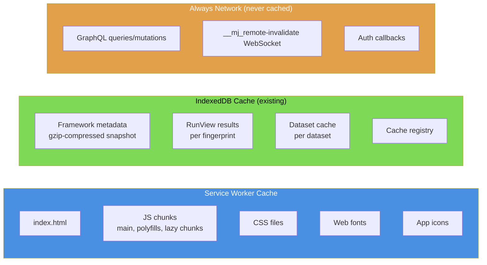
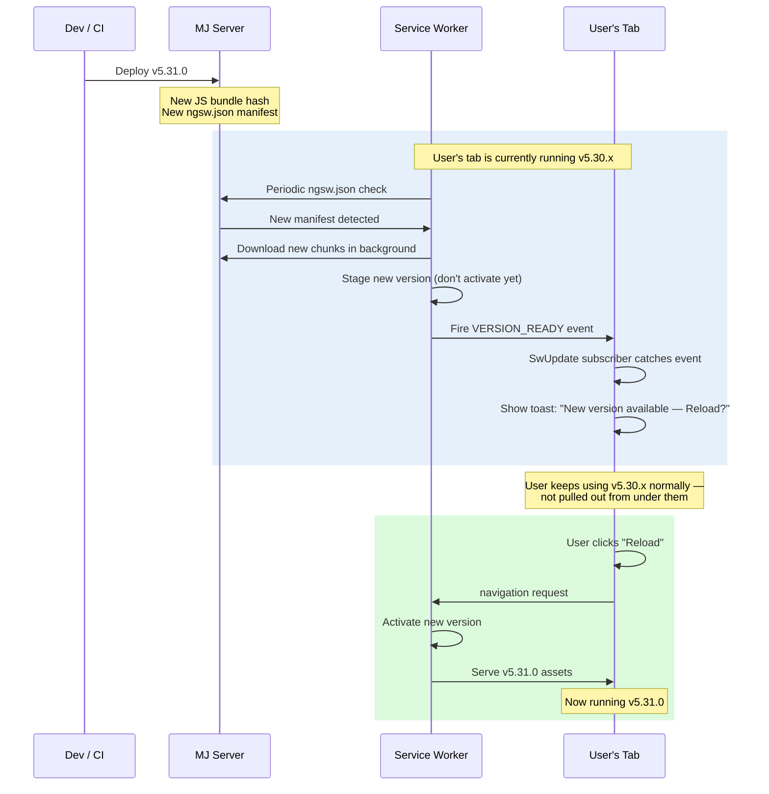
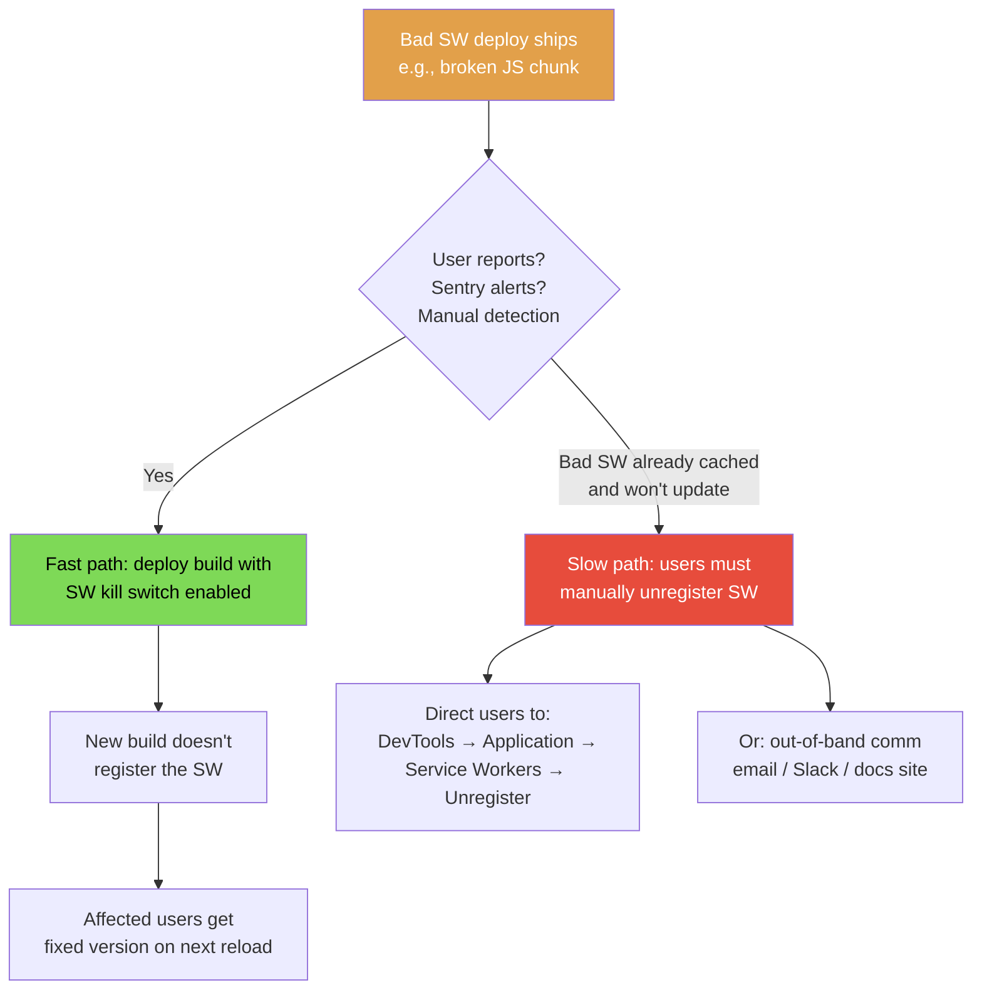

# MemberJunction Explorer — Service Worker App-Shell Pre-Cache

**Status**: ✅ **Approved — shipping** (PR #2512)
**Author**: Amith Nagarajan
**Target**: MJExplorer (browser-side perceived-performance optimization)
**Last updated**: 2026-05-02

> **Decision**: Shipping in PR #2512. The kill switch (`enableServiceWorker: false` in `environment.ts` + remove the `serviceWorker` line from `angular.json`) lets us turn this fully off in a single redeploy if anything misbehaves. Blast radius bounded; perf upside meaningful. See [Honest Risk Assessment](#honest-risk-assessment) below.

---

## Implementation Status

### ✅ Completed in PR #2512

- **`@memberjunction/ng-explorer-service-worker`** (new shipped npm package)
  - `MJServiceWorkerModule.forRoot({ enabled, pollIntervalMs })` — wraps `ServiceWorkerModule.register` with `registerWhenStable:30000`
  - `UpdateNotificationService` — RxJS wrapper around `SwUpdate.versionUpdates`; auto-poll on a 15-minute default cadence; suspends polling while tab is hidden; fires immediate check when tab regains visibility; window debug hook (`__mjUpdateNotificationService__`) for ops/QA console use
  - `<mj-update-notification>` standalone toast — slide-up entrance, pulsing brand-tinted icon, two-line title/subtitle layout, "Reload now" + "Later" + dedicated × close, all MJ design tokens, `prefers-reduced-motion` aware
  - `ngsw-config.json` shipped at package root — pre-tuned (app-shell prefetch, lazy assets, GraphQL/auth/MSAL exclusions); cache strategy updates flow to consumers via `npm update`
  - 11 unit tests, all passing
- **Wired into `@memberjunction/ng-explorer-app`** — `MJExplorerAppModule.forRoot(environment)` now internally calls `MJServiceWorkerModule.forRoot({ enabled: production && enableServiceWorker })` and renders `<mj-update-notification />` in the shell. Consumers get SW + UI transparently — no `app.module.ts` / `app.component.ts` edits needed.
- **`enableServiceWorker?: boolean`** documented on `MJEnvironmentConfig` in `@memberjunction/ng-bootstrap` with JSDoc.
- **MJExplorer net change: ONE LINE in `angular.json`** pointing the build's `serviceWorker` config at the shipped `node_modules/@memberjunction/ng-explorer-service-worker/ngsw-config.json`. Zero TypeScript / template / module changes in MJExplorer.
- **End-to-end verification**: confirmed in local prod build that registration, asset caching, manifest detection on tab refocus, manual `checkForUpdate()` from console, downloaded-version waiting state, and reload-to-activate all work as designed across multiple successive build cycles.

### Remaining work for the assignee (sub-phases 1.3–1.5)

- **1.3** — `docs/operations/SERVICE_WORKER_RUNBOOK.md` (kill-switch procedure, cache wipe, rollback playbook, how to recognize stuck-cache support tickets)
- **1.4** — Cross-browser smoke (Safari iOS/macOS, Firefox, Edge — Chrome already verified)
- **1.5** — Production rollout (staging soak, internal canary, gradual prod enable, monitoring)
- Strip the `(test build #N)` markers left in the toast copy from the verification cycles (one-line cleanup before merge to main)
- Cross-link the runbook from `guides/CACHING_AND_PUBSUB_GUIDE.md`

---

## Executive Summary

After landing the Q2 2026 cache/startup optimization series — lazy field hydration in `BaseEntity`, native object storage in IndexedDB, batched `GetItems` cache reads — the warm-load engine bundle reached **~500ms**. The remaining time-to-interactive is dominated by *browser-level* work that happens **before MJ code starts executing**: TCP/TLS, downloading the HTML shell, downloading hundreds of KB of JS chunks, parse + execute. That's roughly 700–900ms on a normal connection that no JavaScript-level optimization can touch.

A **service worker pre-cache** is the standard browser mechanism for collapsing that pre-execution gap. On the second and subsequent page loads, the shell HTML and all JS chunks are served from a local cache (no network), and MJ code starts running ~700ms sooner. The user sees the app skeleton paint within ~250ms instead of staring at a blank page for ~1 second.

This is the next significant **perceived-performance** improvement available to us. It is *not* an optimization to MJ's data flow (GraphQL, IDB cache) — those are already excellent and the SW intentionally won't touch them. It only addresses the static-asset cold path.

### Why now

1. **The data path is fast already** — recent work brought the engine warm-load to ~500ms (down from ~14s). The remaining bottleneck is no longer in our code.
2. **Power-user use case fits perfectly** — admins and devs who reload MJ many times a day pay the static-asset download cost on every browser restart today. They get the biggest benefit.
3. **Update cadence is favorable** — MJ ships LTS monthly (eventually quarterly). The "users get the new version on next reload" tradeoff that complicates SWs at high deploy cadence is largely irrelevant to MJ's release model.
4. **Angular has first-class support** — `@angular/service-worker` + `@angular/pwa` are mature, well-tested, used in production by tens of thousands of Angular apps. We're not building from scratch.

### Why we're being deliberate

Service workers introduce **operational responsibility** that doesn't exist for normal browser apps:

- A bad SW deploy can leave users stuck on a broken cached version
- "Stale cache" becomes a debugging vector that didn't exist before
- iOS Safari has historically had quirks (better now, but still real)
- Someone needs to own the runbook for the lifetime of the project

We've done our diligence (see [Decision-Making Background](#decision-making-background) below) and concluded the tradeoffs are favorable for MJ's specific situation. But this needs an owner before it ships.

### What we get (estimated)

| Metric | Today | With SW |
|---|---|---|
| First paint (warm) | ~1000ms | ~250ms |
| Time-to-interactive (warm) | ~1500ms | ~750ms |
| Behavior on flaky network | Spinner / failure | Shell loads anyway |
| Behavior offline (static parts) | Doesn't load | Shell loads, data ops fail gracefully |
| First-ever visit (cold) | Same as today | Same as today |
| Bundle size (added) | — | ~10–20KB (Angular SW runtime) |

### What it does NOT change

- First-ever visit speed (SW isn't installed yet)
- Any GraphQL response timing (we explicitly exclude GraphQL from SW caching — MJ's IDB cache + smart-cache-check is smarter than what an SW could do)
- Any data-correctness behavior (SW caches static assets only)
- Any IDB or RunView cache behavior (SW doesn't touch IDB)

---

## Goals & Non-Goals

### Goals

- ✅ Make warm-load page paint feel instant (~250ms perceived) for repeat visitors
- ✅ Reduce bandwidth for users on metered/mobile connections (no re-download of static assets on revisits)
- ✅ Improve resilience to flaky networks (shell loads from cache even if server is slow/unreachable for the static request)
- ✅ Preserve current data-correctness guarantees (no SW interception of GraphQL or IDB)
- ✅ Provide a kill switch so the team can disable SW behavior remotely if a bad deploy ships
- ✅ Build a runbook the team can follow for debugging and recovery

### Non-Goals

- ❌ **Caching GraphQL responses in the SW** — MJ's existing IDB + smart-cache-check + cross-server invalidation is smarter than what an SW can easily do for data. Out of scope, period.
- ❌ **Offline data operations** — saves, queries, mutations all still require the network. Only the static shell works offline.
- ❌ **Push notifications** — separate feature, separate decision.
- ❌ **"Add to Home Screen" / installable PWA experience** — possible follow-up, but not in this initial scope.
- ❌ **First-visit speedup** — not achievable with SW; would require server-side rendering or a different architecture entirely.
- ❌ **Background sync** — Safari support too inconsistent; not worth it for our use case.

---

## Decision-Making Background

This section captures the analysis and tradeoffs we discussed before deciding to plan this out. Useful context for anyone reviewing the plan or socializing it with the team.

### Where the ~1 second pre-MJ gap comes from

```mermaid
gantt
    title Today — Cold/Warm Browser Load Sequence (no SW)
    dateFormat X
    axisFormat %s ms

    section Browser
    TCP + TLS handshake          :0, 100
    HTTP GET /                   :100, 250
    Receive index.html           :250, 260
    Discover script tags         :260, 270
    Fetch JS chunks (parallel)   :270, 500
    Parse + execute JS           :500, 700
    Angular bootstrap            :700, 900

    section MJ
    main.ts runs                 :900, 1000
    StartupManager + engines     :1000, 1500
    Shell paints                 :1500, 1500
```



Approximately **900ms passes before MJ code starts executing**. This is browser work that no in-app optimization can touch.

### What changes with a service worker

```mermaid
gantt
    title With Service Worker — Subsequent Loads
    dateFormat X
    axisFormat %s ms

    section Browser
    SW intercepts /              :0, 5
    SW serves index.html cached  :5, 10
    Discover script tags         :10, 15
    SW serves chunks cached      :15, 20
    Parse + execute JS           :20, 200
    Angular bootstrap            :200, 250

    section MJ
    main.ts runs                 :250, 300
    StartupManager + engines     :300, 800
    Shell paints                 :800, 800
```



MJ code starts **~600ms sooner**. The total is still bound by data fetches happening in parallel, but the user sees the shell paint and a loading state much earlier — the perceived experience is dramatically different.

### Tradeoff analysis (summary of our decision)

| Concern | MJ situation | Our take |
|---|---|---|
| Update lag (users run old code until reload) | Acceptable — power users reload often anyway, and we'll add an "update available" notification | ✅ Not a blocker |
| Bad-deploy recovery (users stuck on broken cached version) | Real risk; mitigated with a build-time kill switch + monthly cadence soaks any issues out in staging | ✅ Manageable |
| Debugging stale cache | Real cost; mitigated with a clear runbook + `Update on reload` workflow for devs | ✅ Manageable with documentation |
| iOS Safari quirks | Substantially improved since 2018; iOS 16+ generally solid for the in-tab use case (not "Add to Home Screen") | ✅ Test thoroughly but not a blocker |
| GraphQL caching complexity | We're explicitly NOT using SW for this; MJ's IDB layer is better | ✅ Sidestepped entirely |
| Operational ownership | Requires an owner for the lifetime of the project | ⚠️ **Must be assigned before going live** |
| First-visit speed | Same as today; SW only helps repeat visitors | Acceptable — power users dominate the use case |

### Why service worker over alternatives

We considered a few other approaches:

| Alternative | Win | Why we didn't pick it |
|---|---|---|
| More aggressive lazy-loading of dashboards | ~100–300ms cold-load improvement | Smaller win; doesn't address the perceived-paint gap |
| Server-side rendering (Angular Universal) | ~200–500ms first-paint improvement | Massive architectural change; overkill for our use case |
| HTTP/2 server push for critical chunks | ~50–100ms saved | Server-side complexity; modest win; HTTP/2 push is being deprecated |
| HTTP/3 (QUIC) | ~50–100ms saved on lossy networks | Infrastructure-level; not in our control for self-hosted deployments |
| Service worker app-shell | ~700ms perceived paint improvement | Right tool for the gap we're trying to close |

---

## Architecture Overview

### How the service worker fits into MJ

```mermaid
graph TB
    subgraph Browser["Browser (User's Tab)"]
        Page[Page / Angular App]
        SW[Service Worker]
        IDB[(IndexedDB<br/>MJ_Metadata DB)]
        Memory[In-Memory<br/>Engine State]
    end

    subgraph SWCache["Service Worker Cache (separate from IDB)"]
        ShellCache[App Shell Assets<br/>HTML, JS chunks, CSS, fonts]
    end

    subgraph Network["Network"]
        Origin[MJ Server / CDN]
        GQL[MJ GraphQL Endpoint]
    end

    Page -->|HTTP request<br/>HTML/JS/CSS/etc| SW
    SW -->|cache hit| ShellCache
    SW -.->|cache miss<br/>or network-first policy| Origin
    Origin -.-> SW
    SW --> Page

    Page -->|GraphQL queries/mutations| GQL
    GQL -.->|SW DOES NOT intercept<br/>(explicit exclusion)| Page

    Page -->|Cache reads/writes| IDB
    Page -->|RunView results,<br/>metadata snapshot| Memory

    style SW fill:#4a90e2,color:#fff
    style ShellCache fill:#4a90e2,color:#fff
    style GQL fill:#e2a04a,color:#fff
    style IDB fill:#7ed957,color:#000
```

**Key separation**: the service worker handles **static asset caching only**. MJ's existing data caching (IndexedDB + smart-cache-check + cross-server invalidation via the GraphQL `__mj_remote-invalidate` channel) is completely untouched.

### What gets cached where



### Update lifecycle (the part most people get wrong)



### Recovery from a bad deploy



---

## Phase 1: Service Worker App-Shell Pre-Cache

This is a single phase with five sub-phases. Each sub-phase is independently testable; gates are explicit so we can pause and reassess between them.

### Sub-phase 1.1 — Foundation + Dev Environment Setup

**Estimated effort**: 1 day
**Goal**: Get the SW infrastructure in place locally, working in dev, with no production exposure yet.
**Gate before next sub-phase**: All tasks complete + lead has run a local build, observed cached behavior in DevTools, and verified the kill switch works.

#### Tasks

- [ ] **T1.1.1** — Run `ng add @angular/pwa` against `packages/MJExplorer/`. Review the diff carefully — it adds:
  - `@angular/service-worker` dependency
  - `ngsw-config.json` at the root
  - `manifest.webmanifest`
  - App icons (placeholders; decide whether to swap with MJ-branded icons later)
  - `ServiceWorkerModule.register('ngsw-worker.js', {...})` in `app.module.ts`
- [ ] **T1.1.2** — Replace placeholder icons with MJ-branded ones at standard sizes (72, 96, 128, 144, 152, 192, 384, 512). Coordinate with design.
- [ ] **T1.1.3** — Configure `ngsw-config.json`:
  ```json
  {
    "$schema": "./node_modules/@angular/service-worker/config/schema.json",
    "index": "/index.html",
    "assetGroups": [
      {
        "name": "app-shell",
        "installMode": "prefetch",
        "updateMode": "prefetch",
        "resources": {
          "files": [
            "/index.html",
            "/manifest.webmanifest",
            "/*.css",
            "/*.js"
          ]
        }
      },
      {
        "name": "lazy-assets",
        "installMode": "lazy",
        "updateMode": "prefetch",
        "resources": {
          "files": [
            "/assets/**",
            "/*.(svg|cur|jpg|jpeg|png|apng|webp|avif|gif|otf|ttf|woff|woff2|ico)"
          ]
        }
      }
    ]
  }
  ```
  Note: explicitly NO `dataGroups` (no GraphQL caching).
- [ ] **T1.1.4** — Add a build-time kill switch via `environment.ts`:
  ```ts
  export const environment = {
    production: true,
    enableServiceWorker: true,  // ← can be flipped to false in a hotfix build
    // ... other config
  };
  ```
  And in `app.module.ts`:
  ```ts
  ServiceWorkerModule.register('ngsw-worker.js', {
    enabled: environment.production && environment.enableServiceWorker,
    registrationStrategy: 'registerWhenStable:30000',
  })
  ```
  Verify: build with `enableServiceWorker: false` → no SW registers in browser.
- [ ] **T1.1.5** — Verify `navigationUrls` exclusion: explicitly exclude the GraphQL endpoint and the WebSocket upgrade URL from SW interception. Add to `ngsw-config.json`:
  ```json
  "navigationUrls": [
    "/**",
    "!/**/graphql",
    "!/**/graphql-ws",
    "!/api/**"
  ]
  ```
  Tune to match the actual endpoint paths in MJ.
- [ ] **T1.1.6** — Local build verification:
  - `npm run build:explorer:prod` (or whatever the production build command is)
  - Serve the dist/ directory locally with `http-server` or similar
  - Open in Chrome, DevTools → Application → Service Workers → confirm registration
  - Reload → confirm assets served from "ServiceWorker" in the Network tab (not "disk cache")
  - Disable network → confirm shell still loads
- [ ] **T1.1.7** — Document the dev workflow in a new section of [packages/MJExplorer/README.md](../packages/MJExplorer/README.md) — specifically the "Update on reload" toggle in DevTools, and how to fully unregister + clear caches when needed.

#### Risks
- Angular's PWA scaffolder may conflict with existing build configuration. Review the diff carefully before committing.
- Lazy-loaded chunks need to be detected automatically by the build. Verify the production build's `dist/` includes hashed filenames that match `ngsw-config.json` patterns.

---

### Sub-phase 1.2 — Update UX

**Estimated effort**: 0.5 day
**Goal**: When a new version is available, prompt the user to reload — non-modal, non-destructive, dismissable.
**Gate before next sub-phase**: Update prompt appears in dev when a new version is detected, "Reload" reloads to the new version, "Later" dismisses for the session.

#### Tasks

- [ ] **T1.2.1** — Inject `SwUpdate` into the shell component (or a dedicated `UpdateNotificationService`). Subscribe to `versionUpdates`:
  ```ts
  this.swUpdate.versionUpdates
    .pipe(filter(e => e.type === 'VERSION_READY'))
    .subscribe(() => this.notifyUpdateAvailable());
  ```
- [ ] **T1.2.2** — Build a non-modal toast / banner notification (use the existing notification system if one exists, or `mj-loading` patterns):
  - "A newer version of MemberJunction is available."
  - Two buttons: **Reload now** and **Later**
  - Sticks until acted on, but doesn't block UI
- [ ] **T1.2.3** — Reload action: `document.location.reload()` (the SW activates the new version on the next navigation).
- [ ] **T1.2.4** — "Later" action: dismisses the notification for the session. Re-shows on next page load if the version is still pending.
- [ ] **T1.2.5** — Optional polish: include a "What's new" link if MJ publishes release notes anywhere accessible.
- [ ] **T1.2.6** — Test by deploying two builds back-to-back to localhost; verify the prompt appears.

#### Risks
- The SW's `versionUpdates` event fires on the page that's currently running. If a user has many tabs open, each tab gets its own prompt — by design, but may be noisy. Acceptable for v1; revisit if user feedback is bad.

---

### Sub-phase 1.3 — Operations Runbook

**Estimated effort**: 0.5 day
**Goal**: Document everything the team needs to know to debug, recover, and maintain the SW. **This is non-optional — without this doc, the first weird production issue is going to be a debugging nightmare.**
**Gate before next sub-phase**: Doc exists, has been reviewed by at least one person who didn't write it, and is linked from the on-call rotation docs (if any).

#### Tasks

- [ ] **T1.3.1** — Create `docs/operations/SERVICE_WORKER_RUNBOOK.md` covering:
  - **What the SW does** (1-paragraph summary)
  - **How to verify SW is working** (DevTools steps for Chrome, Firefox, Safari)
  - **How to force a single user to reload** (bump SW version, push update, they get prompt)
  - **How to debug "user says it's broken but I can't reproduce"** — almost always stale SW; have them open DevTools → Application → Service Workers → Unregister
  - **How to recover from a bad SW deploy** — flip the `enableServiceWorker` env var, deploy hotfix, affected users self-heal on next reload
  - **How to fully nuke the SW for a user** — DevTools → Application → Storage → "Clear site data"
  - **How the version number is determined** — auto-derived from package version, same pattern as IDB version
  - **Dev workflow** — "Update on reload" toggle, which suppresses the SW during local dev so changes appear immediately
- [ ] **T1.3.2** — Decision tree for "user reports caching issue" — flowchart from "user says X" to "do Y." Mermaid diagram with decision points.
- [ ] **T1.3.3** — Add a section to the runbook on **how to diagnose** which version of the SW a user is running (DevTools → Application → Cache Storage → look at the version-stamped cache name).
- [ ] **T1.3.4** — Cross-link from `guides/CACHING_AND_PUBSUB_GUIDE.md` so anyone reading about MJ's caching system can find the SW context too.

#### Risks
- Runbook becomes outdated as the SW behavior evolves. Add a "last verified" date and assign quarterly review responsibility.

---

### Sub-phase 1.4 — Cross-Browser Test Plan

**Estimated effort**: 1–2 days
**Goal**: Verify the SW works correctly across the browsers our users actually use, including edge cases.
**Gate before next sub-phase**: All test cases pass on Chrome + Firefox + Safari + iOS Safari (real device, recent + 1-back iOS version).

#### Tasks

- [ ] **T1.4.1** — Define the target browser matrix:
  - Chrome (latest, latest -1)
  - Firefox (latest)
  - Safari desktop (latest)
  - iOS Safari (iOS 17, iOS 18 — borrow real devices if needed)
  - iPadOS Safari (subtly different from iPhone)
  - Edge (latest — uses Chromium so should match Chrome behavior)
- [ ] **T1.4.2** — Test cases to run on each browser:
  - **Cold load (first visit)**: SW installs in background; page loads at normal speed; reload triggers warm path
  - **Warm load**: shell paints from SW cache within ~250ms; data fetches happen in parallel
  - **Offline shell**: turn off network, reload — shell loads but data ops show error states (verify they don't crash)
  - **Update flow**: deploy a new version; verify the "Update available" prompt appears; verify "Reload" picks up the new version
  - **Multi-tab**: open MJ in two tabs; deploy; verify both tabs get the prompt; verify reloading one doesn't break the other
  - **Storage pressure (iOS especially)**: load lots of data; verify SW doesn't get evicted prematurely
  - **Private/incognito mode**: SW may or may not register depending on browser; verify graceful degradation
- [ ] **T1.4.3** — Network conditions to simulate:
  - Slow 3G (Chrome DevTools throttling)
  - Offline
  - Lossy connection (use `tc` on Linux or Network Link Conditioner on macOS)
- [ ] **T1.4.4** — Document each test result in a checklist; capture screenshots / video for the iOS tests since those can't be re-run easily.

#### Risks
- iOS Safari behavior may surprise us. Budget extra time for iOS-specific debugging if anything goes wrong.
- Real device testing requires physical hardware. If unavailable, BrowserStack or similar can be a backup but is less reliable than real devices for SW behavior.

---

### Sub-phase 1.5 — Production Rollout

**Estimated effort**: 1 day work + 1–2 weeks soak
**Goal**: Ship to production safely with monitoring and a rollback plan in place.
**Gate before "shipped"**: One full week in staging with no SW-related issues + production rollout to a low-traffic environment first if available.

#### Tasks

- [ ] **T1.5.1** — Deploy to staging with `enableServiceWorker: true`
- [ ] **T1.5.2** — Coordinate with QA / internal users to use staging for at least one week
- [ ] **T1.5.3** — Monitor Sentry / error reporting for any SW-related issues:
  - Look for errors mentioning `ServiceWorker`, `cache`, `registration`, `ngsw`
  - Look for unexpected error rates on previously-stable code paths (could indicate stale cache serving old broken JS)
- [ ] **T1.5.4** — Verify the update flow end-to-end on staging by deploying a change and confirming the prompt
- [ ] **T1.5.5** — Production deploy with `enableServiceWorker: true`
- [ ] **T1.5.6** — Watch the first week post-deploy carefully. Have the kill switch deploy ready to go on standby.
- [ ] **T1.5.7** — After two weeks of clean production, declare it shipped and add to the standard build/deploy doc.

#### Risks
- Bad deploy could affect many users. Mitigations: kill switch is built in, staging soak catches most issues, runbook covers recovery.

---

## Success Metrics

After production rollout, we should be able to measure:

- **Lighthouse PWA score**: today ~50–60 (no SW); target 90+ post-rollout
- **Time to First Paint (warm load)**: today ~1000ms; target ~250–350ms
- **Time to Interactive (warm load)**: today ~1500ms; target ~750–900ms
- **Bundle bytes transferred per warm visit**: today ~hundreds of KB; target near-zero (cached)
- **No regression in error rates** — the SW should be invisible to error budgets

If we have real-user metrics (RUM) infrastructure, we can validate empirically. Without it, anecdotal user feedback ("MJ feels faster") is the proxy.

---

## Risks & Open Questions

### Risks

| Risk | Likelihood | Impact | Mitigation |
|---|---|---|---|
| Bad SW deploy ships, affects many users | Low | High | Build-time kill switch + staging soak; runbook for recovery |
| iOS Safari edge cases we didn't catch | Medium | Medium | Real-device testing in 1.4; SW falls back gracefully if registration fails |
| Stale cache reports become support burden | Medium | Low | Runbook section on diagnosis; "Update on reload" doc for users |
| Hosting setup blocks the SW | Low | High | Verify `Service-Worker-Allowed` header; verify HTTPS in production |
| Lazy-loaded chunks don't get cached automatically | Medium | Medium | Test thoroughly in 1.4; verify hashed filenames match SW config |

### Open questions (to resolve before sub-phase 1.1 starts)

1. **Who is the lead?** — TBD. This needs to be assigned before any code lands.
2. **What's the deploy cadence we're optimizing for?** — Confirmed monthly LTS today. If that changes, revisit the update prompt UX (more frequent deploys = noisier prompts).
3. **Does our hosting setup serve the right headers?** — Need to verify `Service-Worker-Allowed: /` is sent for `ngsw-worker.js` in all our deploy environments (self-hosted vs. hosted, etc.).
4. **Are we OK with the placeholder MJ icons during sub-phase 1.1, or should design ship branded icons first?** — Probably OK to ship placeholders to staging; need branded for production.
5. **Do we want SW for self-hosted deployments by default, or opt-in?** — Recommend: ON by default for the hosted SaaS; OFF by default for self-hosted (since we can't guarantee their hosting setup), with a clear way to opt in.

---

## Honest Risk Assessment

After the implementation in PR #2512, here is a candid pros/cons review for reviewers. Nothing on the cons list is catastrophic given the safety hatches; this is shared so the team has full visibility before approving the merge.

### Real downsides (none catastrophic, all manageable)

**Operational**
- **Recovery from a bad SW deploy isn't instant.** Kill switch (`enableServiceWorker: false` → rebuild → deploy) requires affected users to reload at least once for their browser to fetch the new manifest and unregister the SW. A really stuck user might need to manually "Clear site data." The runbook (sub-phase 1.3) needs to spell this out clearly so on-call doesn't fumble it during a real incident.
- **Debugging gets harder.** "Is it the SW serving stale code?" becomes a question on every bug report. New triage step for support.
- **Staging persistence.** A bad staging deploy can stick in QA browsers longer than expected. Not a prod risk, but a workflow paper-cut.

**Browser-specific**
- **iOS Safari** is the wild card. Apple aggressively evicts SW caches under storage pressure or even just disuse — users on iPad might not see the speedup as reliably as Chrome users. Worth measuring before claiming the perf win in mobile contexts (sub-phase 1.4).
- **Incognito/private mode** disables SW persistence between sessions. No bug, just zero benefit there.

**Configuration footguns** (for whoever maintains `ngsw-config.json`)
- **GraphQL/auth exclusions are path-based.** We exclude `/graphql`, `/auth/**`, `/**/?msal*`, `/**/*__*`. If MJAPI ever moves the GraphQL endpoint or auth providers change their URL conventions, the SW would start intercepting them. Anyone editing API routes or auth config needs to remember to check `ngsw-config.json` lives in `@memberjunction/ng-explorer-service-worker`.
- **Adding a new "always go to network" pattern** requires editing `ngsw-config.json` and waiting for a new MJ npm release. Workaround documented in the package README: consumer copies `ngsw-config.json` locally and points `angular.json` at the local copy.

**Code coupling to avoid**
- **No future feature should *depend on* the SW being on.** If someone later adds push notifications or background sync that assumes SW availability, the kill switch becomes a feature-killer instead of a safety hatch. Worth a team guideline: **SW is a perf optimization, never a feature dependency.**

**Minor**
- **Bundle size**: `@angular/service-worker` adds ~12KB gzipped at runtime. Negligible.
- **First-visit cost**: SW prefetches the full app-shell on first install, so a user who visits exactly once pays bandwidth for assets they never use again. Trivial unless we have lots of single-visit users (we don't).

### Why we're shipping anyway

- **Single-line kill switch** in `environment.ts` (`enableServiceWorker: true → false`) plus removing one line from `angular.json` fully disables the system. Worst-case incident response is "ship a build with the flag flipped" — same blast radius as any other config change.
- **The SW is opt-in for downstream consumers.** Anyone building on MJ who doesn't want it gets the no-op fallback automatically — they simply skip the `angular.json` edit.
- **Failure mode is bounded**: even with a bad SW deploy, users see the *previous* working version until they reload. That's a much better failure mode than most caching layers.
- **The implementation has comprehensive observability hooks** — `UpdateNotificationService` exposes state via observables and a window debug handle (`__mjUpdateNotificationService__`) that ops/QA can use without code changes.
- **End-to-end verified** locally across multiple update cycles. The auto-detect, tab-refocus check, manual check, and graceful update flow all work as designed.

### What we'll watch in production (sub-phase 1.5)

1. Any uptick in "cleared site data fixed it" support tickets after first deploy
2. Whether the perceived warm-load improvement materializes on iOS as much as on desktop Chrome
3. Whether ops finds the kill switch + runbook recovery path acceptable in a real incident drill (we should run one before claiming GA)

---

## Estimated Total Effort

| Sub-phase | Effort |
|---|---|
| 1.1 — Foundation + dev | 1 day |
| 1.2 — Update UX | 0.5 day |
| 1.3 — Runbook | 0.5 day |
| 1.4 — Cross-browser test | 1–2 days |
| 1.5 — Production rollout (work) | 1 day |
| **Subtotal: focused work** | **~4–5 days** |
| 1.5 — Staging soak | 1 week |
| 1.5 — Production observation | 1–2 weeks |
| **Subtotal: calendar time** | **~3–4 weeks end-to-end** |

---

## Out-of-Scope Follow-Ups

Things that could be done after this lands, in priority order:

1. **MJ-branded PWA "installable" experience** — let users add MJ to their home screen / dock as a standalone app. Mostly cosmetic but marketable.
2. **Selective `dataGroups` for very stable reference data** — e.g., the role list if it almost never changes. Tricky to get right; defer until we have user feedback.
3. **Push notifications** — separate decision, separate user-permission flow. Probably not until we have a clear product use case.
4. **Background sync for offline-queued writes** — power user feature; only worth it if users actually go offline often.

---

## References

- [Angular Service Worker getting started](https://angular.dev/ecosystem/service-workers)
- [Angular Service Worker config schema](https://github.com/angular/angular/blob/main/packages/service-worker/config/schema.json)
- [MDN Service Worker API](https://developer.mozilla.org/en-US/docs/Web/API/Service_Worker_API)
- [Workbox (Google's SW library, useful reference)](https://developer.chrome.com/docs/workbox/)
- [MJ caching architecture — guides/CACHING_AND_PUBSUB_GUIDE.md](../guides/CACHING_AND_PUBSUB_GUIDE.md)
- [MJ recent perf work — PR #2504, #2510, #2511](https://github.com/MemberJunction/MJ/pulls)
