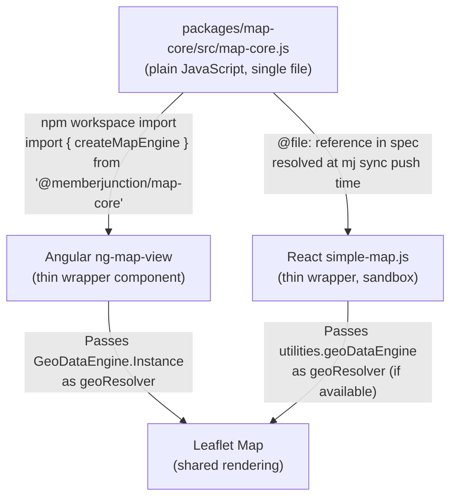

# Shared Map Core Library — Framework-Agnostic Leaflet Engine

## Status
- **Status**: Draft
- **Created**: 2026-04-11
- **Author**: Amith Nagarajan + Claude
- **Branch**: amith-nagarajan/shared-map-core

## Overview

MemberJunction currently has two independent map implementations: an Angular component (`@memberjunction/ng-map-view`) and a runtime React component (`metadata/components/code/generic/simple-map.js`). Both implement the same Leaflet-based map functionality — point markers with clustering, heatmap density circles, choropleth region shading — but share zero code. Bug fixes, feature additions (like the recent point-in-polygon choropleth), and UX improvements must be duplicated across both.

This plan extracts the shared map logic into a single plain JavaScript file (`map-core.js`) that both the Angular component and the runtime React component consume. The Angular wrapper imports it as an npm package with TypeScript type declarations. The React runtime component references it via `@file:` in its component spec, which embeds the code at `mj sync push` time into the sandbox.

The result: one source of truth for all map rendering logic, two thin framework-specific wrappers (~50-80 lines each), and automatic synchronization via the existing metadata sync workflow.

## Goals & Non-Goals

### Goals
- Single source of truth for all Leaflet map rendering logic (point, heatmap, choropleth)
- Angular and React components share identical rendering behavior
- GeoDataEngine point-in-polygon integration for coordinate-based choropleth (replacing brittle text-field matching)
- Plain JavaScript — no TypeScript compilation required, no bundler/UMD wrapper
- React runtime sandbox compatibility (no ES module imports, no global namespace pollution)
- Angular compatibility via npm package with hand-written `.d.ts` type declarations
- Automatic React component update via `@file:` reference pointing to the package's source file

### Non-Goals
- Rewriting the Angular or React component from scratch — this is an extraction/refactor
- Adding new map features (3D, vector tiles, etc.) — future work
- Server-side rendering of maps
- Replacing Leaflet with a different mapping library

## Background & Context

### Current State

**Angular component** (`packages/Angular/Generic/ng-map-view/src/lib/map-view.component.ts`):
- Uses `GeoDataEngine.ResolvePointToLocation()` for coordinate-based choropleth grouping
- Supports point, heatmap, and choropleth (country + state level) render modes
- Handles truncation indicator when records exceed the 10,000 cap
- Receives data via `@Input() Records` from the entity viewer

**React component** (`metadata/components/code/generic/simple-map.js`):
- Uses text-field matching (`countryField` prop) for choropleth grouping — brittle, fails on naming mismatches
- Only supports country-level choropleth, no state drill-down
- Loads country data via `utilities.rv.RunView('MJ: Countries')` on every render
- Receives data via `data` prop from the Skip component runtime

**Shared logic between them** (~90% overlap):
- Leaflet map initialization (tiles, attribution, zoom, IntersectionObserver)
- Point marker rendering with optional `L.markerClusterGroup`
- Spatial clustering algorithm (grid-based nearby grouping)
- Heatmap density circle rendering
- GeoJSON boundary polygon rendering with color cycling
- Popup HTML construction with record drill-through links
- Bounds fitting with padding
- Render mode switching (point/heatmap/choropleth)

**Framework-specific code** (~10%):
- Angular: `@Component` decorator, `@Input`/`@Output`, `ChangeDetectorRef`, lifecycle hooks
- React: `useState`, `useEffect`, `useRef`, `React.createElement` for toolbar/chrome

### Runtime React Component Architecture

Runtime React components run inside a sandboxed environment:
- No ES module `import` — libraries are injected into the component's closure scope
- No direct npm package access — code is embedded in the DB via `@file:` references
- Libraries declared in the component spec are loaded from CDN and made available as local variables
- The component receives `utilities` (RunView, Metadata), `callbacks` (OpenEntityRecord), `components` (sub-component registry), and `styles`/`savedUserSettings`

## Architecture / Design

### File Layout

```
packages/map-core/                          ← New npm package
├── package.json                            ← Minimal, no build step
├── src/
│   └── map-core.js                         ← THE source file (plain JS)
└── types/
    └── index.d.ts                          ← Hand-written TS type declarations

metadata/components/
├── code/generic/
│   └── simple-map.js                       ← React wrapper (thin, calls MapCore)
└── spec/
    └── simple-map.spec.json                ← References map-core.js via @file:
```

### How Each Consumer Accesses map-core.js



### MapCore API Surface

The `map-core.js` file exposes a single factory function and supporting utilities. Everything lives under a `MapCore` namespace object returned from an IIFE:

```javascript
/**
 * @file map-core.js — Framework-agnostic Leaflet map engine for MemberJunction.
 * 
 * Provides point markers, heatmap, and choropleth rendering with optional
 * GeoDataEngine integration for coordinate-based region resolution.
 *
 * Consumed by:
 * - Angular ng-map-view (via npm import)
 * - React simple-map.js (via @file: embedding in component spec)
 */
var MapCore = (function () {
    'use strict';

    // ================================================================
    // Public API
    // ================================================================

    /**
     * Create a new map engine attached to a DOM container.
     * @param {Object} config
     * @param {HTMLDivElement} config.container - DOM element to render into
     * @param {Object} [config.center] - Initial center {lat, lng}
     * @param {number} [config.zoom] - Initial zoom level
     * @param {Object} [config.geoResolver] - GeoDataEngine-compatible resolver
     * @param {Function} [config.onMarkerClick] - Callback when a marker/record is clicked
     * @param {Function} [config.onRegionClick] - Callback when a choropleth region is clicked
     * @returns {MapEngine} Engine instance with render/destroy methods
     */
    function createEngine(config) { /* ... */ }

    /**
     * Spatial clustering algorithm — groups nearby points within a radius.
     * Pure math, no Leaflet dependency.
     */
    function spatialCluster(items, radiusDegrees) { /* ... */ }

    /**
     * Ray-casting point-in-polygon test.
     * Pure math, no dependencies.
     */
    function pointInPolygon(lat, lng, rings) { /* ... */ }

    return {
        createEngine: createEngine,
        spatialCluster: spatialCluster,
        pointInPolygon: pointInPolygon,
        VERSION: '1.0.0'
    };
})();
```

### MapEngine Instance Methods

```javascript
/**
 * @typedef {Object} MapEngine
 * @property {function(Record[], string)} render - Render records in given mode
 * @property {function(string)} setRenderMode - Switch between point/heatmap/choropleth
 * @property {function()} invalidateSize - Fix tile rendering after visibility change
 * @property {function()} destroy - Clean up Leaflet instance and observers
 * @property {function(): {markerCount: number, isTruncated: boolean}} getStats - Current render stats
 */
```

### GeoResolver Interface

```javascript
/**
 * @typedef {Object} GeoResolver
 * @property {function(number, number): GeoPointResolution} ResolvePointToLocation
 * @property {function(number, number): Object|undefined} ResolvePointToCountry
 * @property {function(number, number, string=): Object|undefined} ResolvePointToState
 *
 * @typedef {Object} GeoPointResolution
 * @property {Object|undefined} Country - {ID, Name, BoundaryGeoJSON}
 * @property {Object|undefined} State - {ID, Name, BoundaryGeoJSON}
 */
```

When a `geoResolver` is provided, the choropleth uses coordinate-based point-in-polygon grouping. When not provided (legacy fallback), it uses text-field matching against a `countryField` prop.

### GeoDataEngine in React Runtime

To make `GeoDataEngine` available to the React sandbox, the `utilities` object passed to runtime components needs to be extended:

**File**: `packages/Angular/Generic/ng-react/src/lib/react-bridge.service.ts` (or wherever utilities are assembled)

```javascript
utilities: {
    rv: runViewInstance,
    md: metadataInstance,
    geoDataEngine: GeoDataEngine.Instance  // NEW — expose for map-core choropleth
}
```

The React `simple-map.js` wrapper then passes it through:

```javascript
var engine = MapCore.createEngine({
    container: containerRef.current,
    geoResolver: utilities.geoDataEngine || null,
    // ...
});
```

## Implementation Plan

### Phase 1: Extract map-core.js from Angular component

1. **Create `packages/map-core/` package** — `package.json` with `"main": "src/map-core.js"`, no build script, workspace entry in root `package.json`
2. **Write `src/map-core.js`** — Extract from `ng-map-view/map-view.component.ts`:
   - `createEngine(config)` — Leaflet init, IntersectionObserver, tile layer, attribution
   - `renderPointMarkers(map, layer, records, config)` — markers + clustering
   - `renderHeatmap(map, layer, records, config)` — density circles
   - `renderChoropleth(map, layer, records, config)` — coordinate-based with geoResolver, text-field fallback
   - `renderBoundaryRegion(layer, name, geoJSON, records, color, groupBy)` — shared GeoJSON polygon rendering
   - `renderCircleFallback(layer, name, records, color, latField, lngField)` — circle fallback
   - `spatialCluster(items, radiusDegrees)` — grid-based grouping
   - `buildPopupHtml(records, title, config)` — popup construction
   - `setupPopupClickHandler(map, config)` — drill-through wiring
   - `fitBounds(map, bounds)` — bounds fitting
   - `pointInPolygon(lat, lng, rings)` — ray-casting (from GeoDataEngine, simplified)
   - `pointInCachedGeometry(lat, lng, geom)` — bbox + polygon test
   - `parseGeoJSON(boundaryGeoJSON)` — parse Feature/Polygon/MultiPolygon with bbox
3. **Write `types/index.d.ts`** — Type declarations for `createEngine`, `MapEngine`, `MapConfig`, `GeoResolver`

### Phase 2: Refactor Angular ng-map-view to use map-core

1. **Add dependency** — `@memberjunction/map-core` in `ng-map-view/package.json`
2. **Thin out `map-view.component.ts`** — Remove all rendering logic, keep only:
   - Angular lifecycle (`ngOnInit`, `ngAfterViewInit`, `ngOnDestroy`, `ngOnChanges`)
   - `@Input`/`@Output` property management
   - Creating/destroying `MapCore.createEngine()` instance
   - Forwarding `Records` changes to `engine.render()`
   - Wiring `onMarkerClick`/`onRegionClick` callbacks to `@Output` emitters
3. **Keep template and CSS** — toolbar, loading indicator, truncation warning stay in Angular
4. **Verify** — build `ng-map-view`, run in browser, test all three render modes

### Phase 3: Update React simple-map.js to use map-core

1. **Update `simple-map.spec.json`** — Add map-core as an inline library dependency:
   ```json
   {
       "libraries": [
           { "name": "leaflet", "version": "1.9.4", "globalVariable": "L" }
       ],
       "dependencies": [
           "@include:map-core-lib.spec.json"
       ]
   }
   ```
   Or, if inline library embedding is supported, reference the file directly.
2. **Rewrite `simple-map.js`** — Thin wrapper that:
   - Creates `MapCore.createEngine()` with container ref
   - Passes `utilities.geoDataEngine` as `geoResolver` (if available)
   - Handles `React.useState`/`useEffect` for lifecycle
   - Renders toolbar/chrome via `React.createElement`
3. **Expose `GeoDataEngine` on utilities** — Update `react-bridge.service.ts` to include `geoDataEngine: GeoDataEngine.Instance`
4. **Run `mj sync push`** to update the DB component record
5. **Verify** — test in Skip component viewer with entity data

### Phase 4: Remove duplicated code

1. **Delete** rendering functions from `map-view.component.ts` that now live in map-core
2. **Delete** rendering functions from old `simple-map.js` that are replaced
3. **Final build** and integration test of both Angular and React paths

## Testing Strategy

- **Angular**: Load entity viewer with geo-enabled entity, switch to map view, test all three render modes. Verify choropleth uses point-in-polygon (check console for `[MapView]` diagnostics). Test with US data (state-level), international data (country-level), and mixed.
- **React**: Load a Skip component that uses SimpleMap, verify it renders identically to Angular. Test with and without `geoDataEngine` on utilities (fallback to text matching).
- **Cross-browser**: Verify Leaflet tile rendering and IntersectionObserver in Chrome, Firefox, Safari.
- **Edge cases**: Empty data, single record, 10,000+ records (truncation indicator), records with no lat/lng, entities with no geo fields.

## Risks & Open Questions

1. **React sandbox library loading** — Need to verify that the `@file:` reference to `map-core.js` from the spec makes the `MapCore` object available in the component's scope. If not, the code may need to be inlined directly into `simple-map.js` as a fallback.

2. **GeoDataEngine availability in React runtime** — Need to verify that `GeoDataEngine.Instance` has completed `Config()` and loaded its geometry caches by the time a React component renders. If not, the choropleth falls back to text matching gracefully.

3. **Leaflet version alignment** — Both Angular (loaded via `angular.json` scripts) and React (loaded via CDN in spec) must use the same Leaflet version (1.9.4) to avoid API incompatibilities.

4. **Plain JS maintenance** — Without TypeScript, we lose compile-time checking on map-core.js. The `.d.ts` file provides type safety for Angular consumers but not for the source itself. Mitigation: thorough JSDoc annotations and the Angular build acts as an implicit type check.

## Files to Modify

| File | Change |
|------|--------|
| `packages/map-core/package.json` | NEW — minimal package definition |
| `packages/map-core/src/map-core.js` | NEW — shared map rendering engine |
| `packages/map-core/types/index.d.ts` | NEW — TypeScript type declarations |
| `package.json` (root) | Add `packages/map-core` to workspaces |
| `packages/Angular/Generic/ng-map-view/package.json` | Add `@memberjunction/map-core` dependency |
| `packages/Angular/Generic/ng-map-view/src/lib/map-view.component.ts` | Thin out to wrapper calling MapCore |
| `metadata/components/code/generic/simple-map.js` | Rewrite as thin wrapper calling MapCore |
| `metadata/components/spec/simple-map.spec.json` | Add map-core library reference |
| `packages/Angular/Generic/ng-react/src/lib/react-bridge.service.ts` | Expose GeoDataEngine on utilities |

## References

- Current Angular map view: `packages/Angular/Generic/ng-map-view/src/lib/map-view.component.ts`
- Current React map component: `metadata/components/code/generic/simple-map.js`
- GeoDataEngine with point-in-polygon: `packages/MJCoreEntities/src/engines/GeoDataEngine.ts`
- Component spec architecture: `metadata/components/CLAUDE.md`
- React runtime bridge: `packages/Angular/Generic/ng-react/`
- PR with point-in-polygon choropleth: search-geo-phase-3 branch
