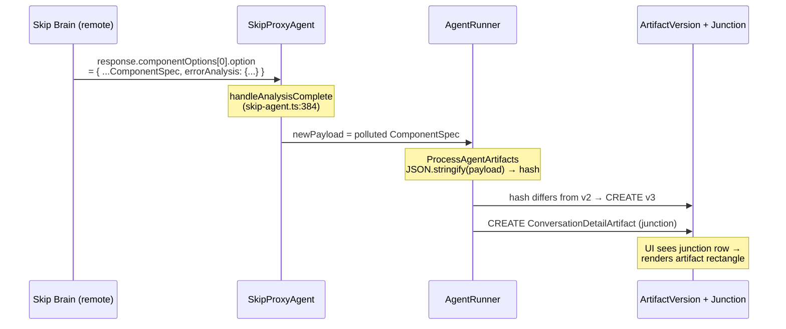
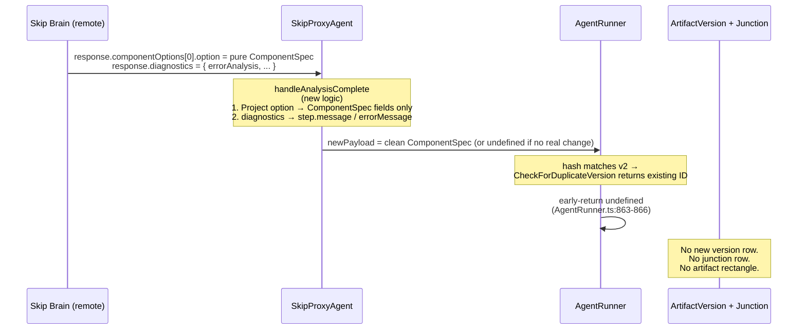

# Skip API Diagnostics Separation & Artifact Version Dedup

## Status
- **Status**: Draft
- **Created**: 2026-05-15
- **Author**: Amith Nagarajan + Claude
- **Branch**: `amith-nagarajan/skip-api-diagnostics-separation`

## Overview

Skip Brain (the remote analytics service, separate repo) currently returns its response payload by stuffing **run-outcome diagnostic data** (errors, suggested actions, technical details, pipeline role, source) directly into the `ComponentSpec` JSON it returns under `componentOptions[*].option`. The Skip proxy in MJServer forwards that object verbatim as the agent's `newPayload`, which then becomes the persisted `ArtifactVersion.Content`.

This causes two compounding problems:

1. **Type-contract violation** — `ComponentSpec` (defined in `packages/InteractiveComponents/src/component-spec.ts`) has no `errorAnalysis`, `pipelineRole`, `userExplanation`, or `source` fields. Skip Brain's wire format silently rides extra fields through structural deserialization, and those polluted blobs get persisted forever.
2. **Broken artifact-version dedup** — `AgentRunner.CheckForDuplicateVersion` (already implemented, SHA-256 over `JSON.stringify(payload, null, 2)`) cannot match identical artifacts because the LLM regenerates `errorAnalysis.suggestedActions` and `technicalDetails` text on every retry. A failing turn followed by another failing turn produces v2 and v3 with byte-identical `functionalRequirements` but slightly rephrased error strings — hash differs, new version created, "Contract Intelligence Hub v3" rectangle appears under a message that did **nothing new**.

The fix has two halves: (1) refactor the Skip API contract to carry diagnostics on a separate sibling field so they never enter the artifact payload, and (2) tighten the chat UX rule that an artifact rectangle should only render when *this specific message* produced a new `ConversationArtifactVersion` (the framework already enforces this correctly via the junction table — once payloads dedup properly, the rectangle naturally disappears).

Other agents (Research Agent, Query Builder, Database Research Agent, Web Research Agent, etc.) are unaffected — they construct their own `newPayload` in-process and don't suffer this contamination. The fix is Skip-specific.

## Goals & Non-Goals

### Goals
- Add a `diagnostics` sibling field to the relevant Skip API response types in this repo, separate from `componentOptions[*].option`.
- Update the Skip proxy (`packages/MJServer/src/agents/skip-agent.ts`) to consume diagnostics from the new field, route them to `step.message` / `step.errorMessage` / agent-run metadata, and never copy them into `newPayload`.
- Add a defensive **ComponentSpec projection helper** (`pickComponentSpecFields()` or `ComponentSpec.fromUnknown()`) that drops non-schema fields. Apply it in the Skip proxy as a backstop so non-conformant responses from Skip Brain (during rollout, or future regressions) cannot pollute artifacts again.
- Result: when Skip retries a failing turn with no actual artifact change, `CheckForDuplicateVersion` matches, no new `ArtifactVersion` row is created, no `ConversationDetailArtifact` junction row is created, and no rectangle renders under that message.
- Update Skip Brain (different repo, follow-up coordination) to populate the new `diagnostics` field instead of polluting `componentOptions[*].option`.

### Non-Goals
- **NOT** changing `AgentRunner.CheckForDuplicateVersion` or `ProcessAgentArtifacts` — the dedup logic is already correct.
- **NOT** changing the artifact-rectangle render condition in `message-item.component.ts` — `hasArtifact = !!this.artifactVersion` is the right rule once the junction row stops being created spuriously.
- **NOT** introducing a per-artifact-type "content fingerprint projection" mechanism. The simpler ComponentSpec projection covers this case; we can revisit if a similar pattern appears with another agent.
- **NOT** migrating already-persisted polluted `ArtifactVersion.Content` rows in production. Listed as an open question — decide separately.
- **NOT** changing how Research Agent / Query Builder / other in-process agents build payloads — they're already clean.

## Background & Context

### Relevant files

| Path | Role |
|------|------|
| [packages/InteractiveComponents/src/component-spec.ts](packages/InteractiveComponents/src/component-spec.ts) | Canonical `ComponentSpec` class (line 84). Defines `functionalRequirements` etc. **No** `errorAnalysis` / `pipelineRole` / `userExplanation` / `source`. |
| [packages/MJServer/src/agents/skip-agent.ts](packages/MJServer/src/agents/skip-agent.ts) | `SkipProxyAgent`. `mapSkipResponseToNextStep` (line 295), `handleAnalysisComplete` (line 354), `handleClarifyingQuestion` (line 397), `handleStatusUpdate` and other phase handlers. Line 384 grabs `response.componentOptions![0].option` verbatim → `newPayload`. |
| [packages/MJServer/src/agents/skip-sdk.ts](packages/MJServer/src/agents/skip-sdk.ts) | Skip SDK request/response types. Defines `SkipAPIAnalysisCompleteResponse`, `SkipAPIClarifyingQuestionResponse`, etc. New `diagnostics` field is added here. |
| [packages/AI/Agents/src/AgentRunner.ts](packages/AI/Agents/src/AgentRunner.ts) | `ProcessAgentArtifacts` (line 764), `CheckForDuplicateVersion` (line 607), `LinkArtifactToConversationDetail` (line 647). Already correct — do not modify. |
| [packages/Angular/Generic/conversations/src/lib/components/message/message-item.component.ts](packages/Angular/Generic/conversations/src/lib/components/message/message-item.component.ts) | `@Input() artifactVersion` (line 71), `hasArtifact` getter (line 669). Already correct — do not modify. |
| [packages/Angular/Generic/conversations/src/lib/components/message/message-list.component.ts](packages/Angular/Generic/conversations/src/lib/components/message/message-list.component.ts) | Lines 226 / 283 — populates `instance.artifactVersion` from junction lookups. Already correct — do not modify. |

### Evidence of the bug

Saved production samples in conversation (v1/v2/v3 of "Contract Intelligence Hub"):

- **v1 → v2**: All ComponentSpec fields byte-identical. v2 adds an `errorAnalysis` block (system_error, suggestedActions, technicalDetails) and nothing else.
- **v2 → v3**: All ComponentSpec fields byte-identical. **Both** have `errorAnalysis`. Differences are pure LLM-rephrasing of the error strings:
  - v2: `"Try the request again"` → v3: `"Try your request again"`
  - v2: `"Skip: Data Expert failed at Step 3..."` → v3: `"Data Expert failed at Final Step..."`

This proves the framework's hash-based dedup works correctly — it's the wire format that's broken.

### Why other agents are unaffected

Research Agent ([packages/AI/Agents/src](packages/AI/Agents/src) — referenced from `base-agent.ts:303`), Query Builder ([packages/AI/Agents/src/query-builder-agent.ts](packages/AI/Agents/src/query-builder-agent.ts)), Database Research Agent, Web Research Agent — all subclass `BaseAgent` directly and construct `newPayload` in-process from local logic. There's no remote HTTP boundary inserting non-schema fields. Hash dedup works for them as designed.

## Architecture / Design

### Current (broken) flow



### Target flow



### Data Model Changes

**None.** This is a wire-format and proxy-logic change only. No new tables, no new columns, no migrations.

### API / Type Changes

New field on Skip API response types in [packages/MJServer/src/agents/skip-sdk.ts](packages/MJServer/src/agents/skip-sdk.ts):

```typescript
/** Run-outcome diagnostics, separate from the artifact payload. */
export interface SkipDiagnostics {
    errorType?: 'system_error' | 'data_error' | 'validation_error' | 'rate_limit' | 'unknown_error';
    canRecover?: boolean;
    suggestedActions?: string[];
    technicalDetails?: string;
    /** Skip pipeline stage that produced this response, for telemetry. */
    pipelineRole?: string;
    /** Provenance label — Generated, Cached, Reused, etc. Not part of artifact identity. */
    source?: string;
    /** Free-form extra telemetry; opaque to MJ. */
    extra?: Record<string, unknown>;
}

export interface SkipAPIAnalysisCompleteResponse extends SkipAPIResponseBase {
    componentOptions?: ComponentOption[];
    analysis?: string;
    messages?: SkipMessage[];
    diagnostics?: SkipDiagnostics;   // NEW
    // ... existing fields
}

// Apply diagnostics to other phase responses too:
//   SkipAPIClarifyingQuestionResponse
//   SkipAPIStatusUpdateResponse
//   SkipAPIDataRequestResponse (if applicable)
```

New helper alongside the `ComponentSpec` class definition in [packages/InteractiveComponents/src/component-spec.ts](packages/InteractiveComponents/src/component-spec.ts):

```typescript
/**
 * Project an arbitrary object down to known ComponentSpec fields, dropping
 * unknown fields. Used at trust boundaries (e.g., Skip proxy ingestion) to
 * enforce the type contract and prevent foreign metadata from polluting
 * persisted artifact payloads.
 *
 * Returns a new plain object; does not mutate input. Unknown fields are
 * logged via LogStatus (with a sample) so leaks are observable.
 */
export function pickComponentSpecFields(input: unknown, contextLabel?: string): ComponentSpec | null {
    if (!input || typeof input !== 'object') return null;
    const obj = input as Record<string, unknown>;
    const known: Set<keyof ComponentSpec> = new Set([
        'title', 'type', 'name', 'functionalRequirements',
        // ... full list from ComponentSpec class
    ]);
    const projected: Record<string, unknown> = {};
    const dropped: string[] = [];
    for (const key of Object.keys(obj)) {
        if (known.has(key as keyof ComponentSpec)) {
            projected[key] = obj[key];
        } else {
            dropped.push(key);
        }
    }
    if (dropped.length > 0 && contextLabel) {
        LogStatus(`[pickComponentSpecFields] ${contextLabel}: dropped non-schema fields: ${dropped.join(', ')}`);
    }
    return projected as ComponentSpec;
}
```

**Note**: The exact list of "known" fields must be derived from the actual `ComponentSpec` class. A test (see Testing Strategy) should assert that the helper's allowed-key set stays in sync with the class definition via runtime reflection or a code-generated manifest.

## Implementation Plan

### Phase 1: Type contract — define `diagnostics` and projection helper

1. **Add `SkipDiagnostics` interface** to [packages/MJServer/src/agents/skip-sdk.ts](packages/MJServer/src/agents/skip-sdk.ts). Place near the existing response type definitions.
2. **Add `diagnostics?: SkipDiagnostics`** to `SkipAPIAnalysisCompleteResponse`, `SkipAPIClarifyingQuestionResponse`, `SkipAPIStatusUpdateResponse`, and any other phase response that could carry run-outcome data. Audit `skip-sdk.ts` for all response types.
3. **Add `pickComponentSpecFields()` helper** in [packages/InteractiveComponents/src/component-spec.ts](packages/InteractiveComponents/src/component-spec.ts), next to the `ComponentSpec` class. Export from the package's public API (`src/index.ts` or equivalent).
4. **Add a unit test** that verifies the helper's allowed-key set matches `ComponentSpec` class member names — if `ComponentSpec` gains a new field, the test fails until the helper is updated. This is the guardrail against the helper going stale.

### Phase 2: Skip proxy — consume diagnostics, project payload

1. **Update `handleAnalysisComplete`** in [packages/MJServer/src/agents/skip-agent.ts](packages/MJServer/src/agents/skip-agent.ts) (line 354–392):
   - Pass `response.componentOptions![0].option` through `pickComponentSpecFields(..., 'SkipProxyAgent.handleAnalysisComplete')` before assigning to `newPayload`.
   - Read `response.diagnostics` and route into `step.message` / `step.errorMessage`. Suggested mapping:
     - `diagnostics.technicalDetails` → `step.errorMessage` if `step` is `'Failed'`, otherwise appended to `step.message`.
     - `diagnostics.suggestedActions` → joined into `step.message` for user display.
     - `diagnostics.pipelineRole` / `diagnostics.source` → preserved on the agent run via existing metadata mechanism (or dropped if no consumer exists).
2. **Apply same pattern to other phase handlers** that emit a `newPayload`:
   - `handleClarifyingQuestion` (line 397) — projects payload if applicable.
   - Any other phase handler that touches `componentOptions[*].option`. Audit the file for all such call sites.
3. **Decide on the "no real change" case**: If Skip Brain sends a response that semantically means "no artifact change this turn, just talking" (e.g., a fail-and-retry with no spec mutation), should the proxy emit `newPayload: undefined`? Two viable approaches:
   - **A**: Always project and pass the spec through. Trust `CheckForDuplicateVersion` to dedup. **Recommended** — keeps the proxy stateless and simple. Works correctly once the polluting fields are gone.
   - **B**: Have the proxy detect "Skip says this is a non-change response" (e.g., `diagnostics.errorType` is set AND `componentOptions` is unchanged-marker) and emit `undefined`. More efficient but adds proxy-side state/comparison logic. **Defer** unless A proves insufficient.

### Phase 3: Skip Brain coordination (different repo)

1. **File a Skip Brain ticket** with the contract diff: stop putting `errorAnalysis`, `pipelineRole`, `source`, `userExplanation` into `componentOptions[*].option`. Move to `response.diagnostics`.
2. **Skip Brain side**: implement and ship. The MJ proxy already handles both shapes (new responses cleanly, old responses get fields dropped by the projection helper with logging), so there's no flag-day requirement.
3. **Telemetry check**: monitor the `[pickComponentSpecFields] ... dropped non-schema fields` log line in production. Once it stops firing for any non-trivial volume of traffic, Skip Brain is fully migrated.

### Phase 4: Cleanup (post-Skip-Brain migration)

1. **Optional**: tighten the projection helper to `throw` instead of silently dropping, after Skip Brain is confirmed clean. Or downgrade the log to debug. Decide based on operational comfort.
2. **Optional**: revisit whether other agents (e.g., custom agents in adopter repos) would benefit from a similar typed projection at the `BaseAgent.ProcessAgentArtifacts` boundary. Not required for this PR.

## Migration & Data

### Schema migrations
**None required.**

### Existing polluted artifact versions
Production currently contains `ArtifactVersion.Content` rows with `errorAnalysis` / `pipelineRole` / `userExplanation` / `source` fields embedded. These will remain unless explicitly migrated.

**Recommended**: leave existing rows alone. They are historical artifact snapshots, immutable by design, and the polluted fields are harmless to render (they just sit unused). If/when someone wants to clean them up, a separate one-shot migration can JSON-parse each row, project it, and re-serialize. **Open question** — see below.

### CodeGen implications
None. No entity schema changes, no new fields, no metadata changes.

## Testing Strategy

### Unit tests

1. **`pickComponentSpecFields` helper** — `packages/InteractiveComponents/src/__tests__/component-spec.test.ts` (create if not present):
   - Drops known polluting fields (`errorAnalysis`, `pipelineRole`, `userExplanation`, `source`).
   - Preserves all `ComponentSpec` schema fields.
   - Returns `null` for `null` / non-object inputs.
   - Logs dropped fields when `contextLabel` provided.
   - **Drift guard**: enumerate `ComponentSpec` class members at test time, assert the helper's allowed set equals them. Fails if ComponentSpec gains a field the helper doesn't know about.

2. **`SkipProxyAgent.handleAnalysisComplete`** — `packages/MJServer/src/agents/__tests__/skip-agent.test.ts` (create if not present):
   - Given a Skip response with polluted `option` and no `diagnostics` field → `newPayload` is the projected spec, `step.message` reflects fallback behavior.
   - Given a Skip response with clean `option` and a `diagnostics` field → `newPayload` is the spec, `step.message` / `step.errorMessage` carry diagnostic info.
   - Given a response with both → both work, projection still strips legacy fields from `option`.
   - Given a non-component (analysis-only) response → unchanged behavior (no payload).

### Integration tests

3. **Artifact-version dedup end-to-end** — exercise the full chat path with a Skip response simulator:
   - Turn 1: Skip returns spec A with error rephrasing 1 → `ArtifactVersion` v2 created.
   - Turn 2: Skip returns spec A with error rephrasing 2 (same semantic content, different LLM text) → `ProcessAgentArtifacts` returns `undefined`, no v3 created, no `ConversationDetailArtifact` junction created.
   - Assert via DB query that only one version exists for the artifact.

### Manual / UI verification

4. **Playwright check against the production-issue reproduction**: drive a Skip conversation that hits the error-retry path, verify the artifact rectangle does NOT render under the retry message in `message-item.component`.

### Regression coverage

5. **Existing AgentRunner / CheckForDuplicateVersion tests** must still pass — we are not modifying that code.
6. **Research Agent / Query Builder tests** in `packages/AI/Agents/src/__tests__/` must still pass — we are not modifying their paths.

## Risks & Open Questions

### Risks
- **R1 — Field list drift**. If a new field is added to `ComponentSpec` but not to `pickComponentSpecFields`, that field will be silently dropped at the Skip boundary. **Mitigation**: the drift-guard unit test described in Testing Strategy. Make it impossible to add a field to `ComponentSpec` without updating the projection helper.
- **R2 — Skip Brain delays its half**. The proxy must continue to work against the current (polluted) wire format until Skip Brain ships. The projection helper handles this — it strips unknown fields and logs. Verify the log volume is acceptable in production.
- **R3 — Diagnostics consumer not yet defined**. We're adding a `SkipDiagnostics` type without a confirmed UI consumer for `suggestedActions` / `pipelineRole`. Decision: surface `technicalDetails` via `step.message`/`step.errorMessage` (already wired through MJ), and store the rest as opaque agent-run metadata for now. Build UI consumption later only if needed.
- **R4 — Other phase responses might also carry diagnostics**. Audit needed: `handleClarifyingQuestion`, `handleStatusUpdate`, `handleDataRequest` (if exists), and any other Skip response phase. Apply projection uniformly.

### Open questions
- **Q1 — Migrate existing polluted versions?** Recommend NO (leave as historical). Decide before merge.
- **Q2 — Should `pickComponentSpecFields` log a `LogWarning` instead of `LogStatus` for dropped fields?** Argument for warning: makes it noisier and more likely to be noticed by operators. Argument against: during the Skip Brain migration window it will fire constantly. Suggest: `LogStatus` during rollout, switch to `LogWarning` (or drop the field set + tighten to schema) once Skip Brain is clean.
- **Q3 — Where does `diagnostics.suggestedActions` actually surface in chat UI?** Currently `step.message` is the agent's user-facing text. Joining `suggestedActions` into the message string is one option; another is exposing them as structured "next step" chips. Defer to a UX decision — for this PR, concatenate into `step.message` as a baseline.
- **Q4 — Should the projection helper live in `@memberjunction/interactive-components` or somewhere more general?** Co-locating with the `ComponentSpec` class is the simplest and most discoverable choice. Stay there unless a non-IC consumer needs it.

## Files to Modify

| File | Change |
|------|--------|
| `packages/InteractiveComponents/src/component-spec.ts` | Add `pickComponentSpecFields()` helper. Export from package public API. |
| `packages/InteractiveComponents/src/index.ts` (or equivalent) | Export the new helper. |
| `packages/InteractiveComponents/src/__tests__/component-spec.test.ts` (new) | Unit tests for `pickComponentSpecFields` including drift guard. |
| `packages/MJServer/src/agents/skip-sdk.ts` | Add `SkipDiagnostics` interface. Add `diagnostics?: SkipDiagnostics` to `SkipAPIAnalysisCompleteResponse` and other phase response types. |
| `packages/MJServer/src/agents/skip-agent.ts` | Update `handleAnalysisComplete` (line 354), `handleClarifyingQuestion` (line 397), and any other phase handler that emits `newPayload` from a Skip response. Project payload through `pickComponentSpecFields`. Route `diagnostics` into `step.message`/`step.errorMessage` / run metadata. |
| `packages/MJServer/src/agents/__tests__/skip-agent.test.ts` (new) | Unit tests for the proxy mapping with both legacy (polluted) and new (clean + diagnostics) wire formats. |

**No changes to**:
- `packages/AI/Agents/src/AgentRunner.ts` (dedup logic already correct)
- `packages/Angular/Generic/conversations/**` (UI rule already correct: `hasArtifact = !!artifactVersion`, junction-driven)
- Any other agent class

## References

- Production samples saved in conversation: `/Users/amith/Dropbox/develop/M5/MJ/v1`, `/Users/amith/Dropbox/develop/M5/MJ/v2`, `/Users/amith/Dropbox/develop/M5/MJ/v3` — diff shows the `errorAnalysis` contamination clearly. Move to `plans/skip-api-diagnostics-separation-samples/` if you want them in the repo for posterity (currently they are gitignored noise at the repo root and should be deleted or relocated before merge).
- [packages/AI/Agents/src/AgentRunner.ts:607-630](packages/AI/Agents/src/AgentRunner.ts#L607-L630) — `CheckForDuplicateVersion` (already correct, do not modify)
- [packages/AI/Agents/src/AgentRunner.ts:855-867](packages/AI/Agents/src/AgentRunner.ts#L855-L867) — dedup early-return (already correct)
- [packages/MJServer/src/agents/skip-agent.ts:384-391](packages/MJServer/src/agents/skip-agent.ts#L384-L391) — the line that needs to project + read diagnostics
- [packages/InteractiveComponents/src/component-spec.ts:84](packages/InteractiveComponents/src/component-spec.ts#L84) — canonical `ComponentSpec` definition
- Original conversation thread covered: artifact rectangle render rule, dedup hash mechanics, Skip proxy vs Skip Brain responsibility split, and the v1/v2/v3 diff evidence. Anyone implementing should re-read the discussion for tone and tradeoffs already considered.
