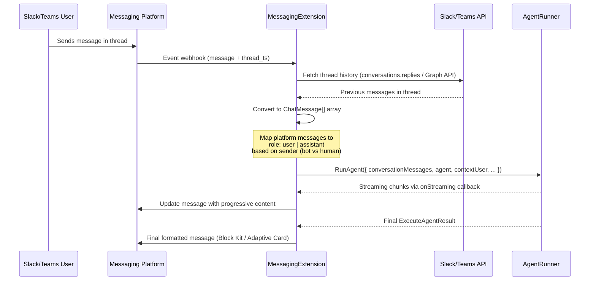

# Slack & Teams ↔ MJ AI Agent Integration

## PRD — Product Requirements Document

### Overview

Enable MJ AI agents to be invoked from Slack and Microsoft Teams as interactive chatbots. Users send messages in a Slack/Teams channel or DM; a lightweight adapter translates the incoming event into an `AgentRunner.RunAgent()` call, streams the response back to the platform, and posts the final reply. Conversation history is maintained **entirely within the messaging platform** — MJ treats each request as stateless, reconstructing context from the platform's thread history on every invocation.

This integration is built on a new **Server Extension** framework — a plugin architecture for MJServer that allows any package to register Express routes and lifecycle hooks on the running server. The messaging adapters are the **first implementation** of this framework, validating the pattern before MCP and A2A servers are migrated to it.

### Problem Statement

MJ already has powerful AI agent infrastructure (`AgentRunner`, `BaseAgent`, prompt templates, actions, memory, streaming) and outbound Slack/Teams webhook actions. What's missing is the **inbound** path: receiving messages from these platforms and routing them through the agent execution pipeline so that users can converse with MJ agents directly from their team collaboration tools without opening the MJ Explorer UI.

Additionally, MJServer currently has no plugin system for adding custom Express routes. Any new HTTP endpoint requires modifying MJServer source code directly. A Server Extension framework solves this for messaging adapters and all future protocol integrations.

### Goals

1. **Server Extension framework** — a plugin architecture in MJServer that auto-discovers and loads extension classes via `@RegisterClass` + `mj.config.cjs`
2. **Two-way conversational agents** in Slack and Teams channels/DMs
3. **Streaming responses** — show typing indicator / progressive message updates so users aren't staring at a blank screen
4. **Thread-based context** — each Slack thread or Teams reply chain is one logical conversation; the adapter fetches thread history and passes it as `conversationMessages`
5. **Agent selection** — configurable default agent per channel/workspace, with the ability to mention specific agents
6. **Zero MJ-side conversation persistence** — the messaging platform is the system of record for conversation history
7. **Rich formatting** — translate agent Markdown output to Slack Block Kit / Teams Adaptive Cards
8. **Extensible architecture** — a shared base adapter with platform-specific subclasses, ready for Discord, WhatsApp, etc. in the future

### Non-Goals (Explicitly Out of Scope)

- Persisting conversation history in MJ's Conversation entities (possible future phase)
- Creating MJ Artifacts from Slack/Teams interactions
- File/image upload handling from platform → agent (text-only for v1)
- OAuth-based per-user identity mapping (v1 uses a single service account `contextUser`)
- Slash command registration in Slack/Teams (v1 uses @-mention or DM only)
- Admin UI in MJ Explorer for managing bot configurations
- Migrating MCP or A2A servers to extensions (separate effort, after this validates the pattern)

### User Stories

| # | As a… | I want to… | So that… |
|---|-------|-----------|----------|
| US-1 | Slack user | @mention the MJ bot in a channel and ask a question | I get an AI-powered answer without leaving Slack |
| US-2 | Teams user | DM the MJ bot and have a multi-turn conversation | I can iterate on complex questions in a threaded reply chain |
| US-3 | Slack user | See the bot "typing" while the agent thinks | I know the bot is working and haven't been ignored |
| US-4 | Admin | Configure which MJ agent backs the bot in a specific workspace/channel | Different teams get domain-specific agents |
| US-5 | Slack/Teams user | Continue a conversation in an existing thread | The bot remembers what we discussed earlier in the thread |
| US-6 | Developer | Add a new messaging platform adapter | I follow a clear base class pattern without reimplementing common logic |
| US-7 | Developer | Add a new server extension to MJServer | I create a class extending `BaseServerExtension`, register it, add config, and MJServer loads it automatically |

### Success Metrics

- Bot responds to a Slack/Teams message within 2 seconds (initial typing indicator)
- Full response delivered within the agent's normal execution time + < 500ms overhead
- Thread context correctly reconstructed for conversations up to 50 messages deep
- Zero MJ database writes for conversation storage (platform is the record)
- Server Extension framework loads/initializes extensions without any MJServer source modifications

---

## TDD — Technical Design Document

### Architecture Overview

```
┌─────────────────┐     ┌──────────────────────────────────────────────────┐
│  Slack / Teams   │     │                  MJAPI Server                    │
│  (Event API /    │     │                                                  │
│   Bot Framework) │     │  ┌──────────────────────────────────────────┐    │
│                  │────▶│  │  Server Extension Loader (MJServer)     │    │
│                  │     │  │  Discovers @RegisterClass extensions    │    │
│                  │     │  │  Calls Initialize(app, config) on each  │    │
│                  │     │  └────────────┬─────────────────────────────┘    │
│                  │     │               │                                  │
│                  │     │  ┌────────────▼─────────────────────────────┐    │
│                  │     │  │  SlackMessagingExtension                 │    │
│                  │     │  │  POST /webhook/slack → HandleMessage()  │    │
│                  │◀────│  │  → AgentRunner.RunAgent()               │    │
│                  │     │  │  → Format + send reply                  │    │
│                  │     │  └──────────────────────────────────────────┘    │
│                  │     │  ┌──────────────────────────────────────────┐    │
│                  │     │  │  TeamsMessagingExtension                 │    │
│                  │     │  │  POST /webhook/teams → HandleMessage()  │    │
│                  │◀────│  │  → AgentRunner.RunAgent()               │    │
│                  │     │  │  → Format + send reply                  │    │
│                  │     │  └──────────────────────────────────────────┘    │
│                  │     │                                                  │
│                  │     │  ┌──────────────────────────────────────────┐    │
│                  │     │  │  Future: MCPServerExtension             │    │
│                  │     │  │  Future: A2AServerExtension             │    │
│                  │     │  └──────────────────────────────────────────┘    │
└─────────────────┘     └──────────────────────────────────────────────────┘
```

### Key Design Decisions

#### 1. `RunAgent` (not `RunAgentInConversation`)

We use `AgentRunner.RunAgent()` rather than `RunAgentInConversation()` because:

1. **No MJ conversation persistence needed** — the messaging platform owns the conversation record
2. **No artifact creation** — Slack/Teams messages are the output, not MJ artifacts
3. **Simpler execution path** — `RunAgent` is a thin wrapper that delegates directly to `BaseAgent.Execute()`
4. **Thread history → `conversationMessages`** — we reconstruct the `ChatMessage[]` array from the platform's thread history on each invocation, giving the agent full context without MJ needing to store anything

#### 2. Server Extension Discovery via `@RegisterClass` + Config

Extensions are auto-discovered using MJ's standard pattern:
- Extension classes use `@RegisterClass(BaseServerExtension, 'DriverClassName')`
- `mj.config.cjs` lists which extensions to enable and their configuration
- MJServer's `serve()` function finds all registered extensions, matches them to config entries, and calls `Initialize()`

This follows the same pattern as auth providers (`@RegisterClass(BaseAuthProvider, 'msal')`) and actions (`@RegisterClass(BaseAction, 'Slack Webhook')`).

#### 3. Two Separate Packages

| Package | Purpose |
|---------|---------|
| `@memberjunction/server-extensions-core` | `BaseServerExtension` abstract class, types, and the loader that MJServer uses to discover/initialize extensions |
| `@memberjunction/messaging-adapters` | `BaseMessagingAdapter` + `SlackMessagingExtension` + `TeamsMessagingExtension` — the actual Slack/Teams implementations |

Why separated:
- `server-extensions-core` is a dependency of MJServer itself — it provides the framework
- `messaging-adapters` is a consumer of that framework — it registers extensions
- Future extensions (MCP, A2A, custom) depend only on `server-extensions-core`, not on messaging code
- Clean dependency graph: `MJServer → server-extensions-core ← messaging-adapters`

### Conversation History Flow



### Package Structure

```
packages/
├── ServerExtensionsCore/                    # @memberjunction/server-extensions-core
│   ├── package.json
│   ├── tsconfig.json
│   └── src/
│       ├── index.ts                         # Public API exports
│       ├── BaseServerExtension.ts           # Abstract base class
│       ├── ServerExtensionLoader.ts         # Discovery + initialization logic
│       └── types.ts                         # ServerExtensionConfig, InitResult, etc.
│
└── MessagingAdapters/                       # @memberjunction/messaging-adapters
    ├── package.json
    ├── tsconfig.json
    └── src/
        ├── index.ts                         # Public API + tree-shaking prevention
        ├── base/
        │   ├── BaseMessagingAdapter.ts       # Shared messaging logic
        │   ├── types.ts                     # IncomingMessage, FormattedResponse, etc.
        │   └── message-formatter.ts         # Shared Markdown utilities
        ├── slack/
        │   ├── SlackMessagingExtension.ts   # @RegisterClass(BaseServerExtension, 'SlackMessagingExtension')
        │   ├── SlackAdapter.ts              # Slack-specific adapter logic
        │   ├── slack-formatter.ts           # Markdown → Block Kit
        │   └── slack-routes.ts              # Express route handlers + signature verification
        └── teams/
            ├── TeamsMessagingExtension.ts    # @RegisterClass(BaseServerExtension, 'TeamsMessagingExtension')
            ├── TeamsAdapter.ts              # Teams-specific adapter logic
            ├── teams-formatter.ts           # Markdown → Adaptive Card
            └── teams-routes.ts              # Express route handlers + Bot Framework auth
```

---

### Package 1: `@memberjunction/server-extensions-core`

#### BaseServerExtension

```typescript
// packages/ServerExtensionsCore/src/BaseServerExtension.ts

import { Application } from 'express';

/**
 * Configuration passed to a server extension during initialization.
 * Each extension receives its own config section from mj.config.cjs.
 */
export interface ServerExtensionConfig {
    /** Whether this extension is enabled */
    Enabled: boolean;

    /** URL path prefix for this extension's routes (e.g., '/webhook/slack') */
    RootPath: string;

    /** Extension-specific configuration (varies by extension type) */
    Settings: Record<string, unknown>;
}

/**
 * Result returned from extension initialization.
 */
export interface ExtensionInitResult {
    /** Whether initialization succeeded */
    Success: boolean;

    /** Human-readable status message */
    Message: string;

    /** Routes registered by this extension (for logging/health) */
    RegisteredRoutes?: string[];
}

/**
 * Health check result for an extension.
 */
export interface ExtensionHealthResult {
    /** Whether the extension is healthy */
    Healthy: boolean;

    /** Extension name */
    Name: string;

    /** Optional details about health status */
    Details?: Record<string, unknown>;
}

/**
 * Abstract base class for MJServer extensions.
 *
 * Extensions are discovered via @RegisterClass(BaseServerExtension, 'DriverClassName')
 * and matched to config entries in mj.config.cjs by their DriverClass name.
 *
 * MJServer calls Initialize() during startup, passing the Express app so the
 * extension can register its own routes and middleware.
 *
 * Lifecycle:
 *   1. MJServer reads serverExtensions[] from config
 *   2. For each enabled entry, looks up @RegisterClass(BaseServerExtension, driverClass)
 *   3. Creates instance via ClassFactory
 *   4. Calls Initialize(app, config) — extension registers routes
 *   5. On shutdown, calls Shutdown() for cleanup
 *
 * @example
 * ```typescript
 * @RegisterClass(BaseServerExtension, 'SlackMessagingExtension')
 * export class SlackMessagingExtension extends BaseServerExtension {
 *     async Initialize(app: Application, config: ServerExtensionConfig): Promise<ExtensionInitResult> {
 *         app.post(config.RootPath, (req, res) => { ... });
 *         return { Success: true, Message: 'Slack extension loaded' };
 *     }
 * }
 * ```
 */
export abstract class BaseServerExtension {
    /**
     * Initialize the extension. Called once during MJServer startup.
     * Use this to register Express routes, set up WebSocket handlers, etc.
     *
     * @param app - The Express application instance to register routes on
     * @param config - Extension-specific configuration from mj.config.cjs
     */
    abstract Initialize(app: Application, config: ServerExtensionConfig): Promise<ExtensionInitResult>;

    /**
     * Graceful shutdown. Called when MJServer is shutting down.
     * Clean up connections, drain in-flight requests, etc.
     */
    abstract Shutdown(): Promise<void>;

    /**
     * Health check. Called by MJServer's aggregate /health endpoint.
     */
    abstract HealthCheck(): Promise<ExtensionHealthResult>;

    /**
     * Optional: Called when configuration changes at runtime.
     * Not all extensions need to support this.
     */
    OnConfigurationChange?(newConfig: ServerExtensionConfig): Promise<void>;
}
```

#### ServerExtensionLoader

```typescript
// packages/ServerExtensionsCore/src/ServerExtensionLoader.ts

import { Application } from 'express';
import { MJGlobal } from '@memberjunction/global';
import { LogError, LogStatus } from '@memberjunction/core';
import {
    BaseServerExtension,
    ServerExtensionConfig,
    ExtensionHealthResult
} from './BaseServerExtension';

/**
 * Discovers, initializes, and manages server extensions.
 * Called by MJServer's serve() function during startup.
 *
 * Discovery flow:
 *   1. Reads serverExtensions[] array from mj.config.cjs
 *   2. For each enabled entry, uses ClassFactory to find the registered class
 *   3. Creates an instance and calls Initialize(app, config)
 *   4. Tracks all loaded extensions for health checks and shutdown
 */
export class ServerExtensionLoader {
    private LoadedExtensions: Array<{
        Instance: BaseServerExtension;
        Config: ServerExtensionConfig;
        DriverClass: string;
    }> = [];

    /**
     * Load and initialize all enabled extensions from config.
     *
     * @param app - Express application for route registration
     * @param extensionConfigs - Array of extension configs from mj.config.cjs
     */
    public async LoadExtensions(
        app: Application,
        extensionConfigs: ServerExtensionConfig[]
    ): Promise<void> {
        if (!extensionConfigs || extensionConfigs.length === 0) {
            LogStatus('No server extensions configured');
            return;
        }

        for (const config of extensionConfigs) {
            if (!config.Enabled) {
                LogStatus(`Server extension '${config.DriverClass}' is disabled, skipping`);
                continue;
            }

            await this.loadSingleExtension(app, config);
        }

        LogStatus(`Loaded ${this.LoadedExtensions.length} server extension(s)`);
    }

    /**
     * Run health checks on all loaded extensions.
     */
    public async HealthCheckAll(): Promise<ExtensionHealthResult[]> {
        const results: ExtensionHealthResult[] = [];

        for (const ext of this.LoadedExtensions) {
            try {
                const health = await ext.Instance.HealthCheck();
                results.push(health);
            } catch (error) {
                results.push({
                    Healthy: false,
                    Name: ext.DriverClass,
                    Details: { error: error instanceof Error ? error.message : String(error) }
                });
            }
        }

        return results;
    }

    /**
     * Shut down all loaded extensions gracefully.
     */
    public async ShutdownAll(): Promise<void> {
        for (const ext of this.LoadedExtensions) {
            try {
                await ext.Instance.Shutdown();
                LogStatus(`Server extension '${ext.DriverClass}' shut down`);
            } catch (error) {
                LogError(`Error shutting down extension '${ext.DriverClass}':`, undefined, error);
            }
        }
        this.LoadedExtensions = [];
    }

    /**
     * Get all loaded extension instances (for testing/debugging).
     */
    public get Extensions(): ReadonlyArray<{ Instance: BaseServerExtension; DriverClass: string }> {
        return this.LoadedExtensions;
    }

    private async loadSingleExtension(
        app: Application,
        config: ServerExtensionConfig
    ): Promise<void> {
        const driverClass = (config as ServerExtensionConfigWithDriver).DriverClass;
        try {
            // Use MJ's ClassFactory to find the registered extension class
            const instance = MJGlobal.Instance.ClassFactory.CreateInstance<BaseServerExtension>(
                BaseServerExtension,
                driverClass
            );

            if (!instance) {
                LogError(`Server extension '${driverClass}' not found in ClassFactory. ` +
                    `Ensure the package is imported and the class uses ` +
                    `@RegisterClass(BaseServerExtension, '${driverClass}')`);
                return;
            }

            const result = await instance.Initialize(app, config);

            if (result.Success) {
                this.LoadedExtensions.push({ Instance: instance, Config: config, DriverClass: driverClass });
                LogStatus(`Server extension '${driverClass}' initialized: ${result.Message}`);
                if (result.RegisteredRoutes) {
                    LogStatus(`  Routes: ${result.RegisteredRoutes.join(', ')}`);
                }
            } else {
                LogError(`Server extension '${driverClass}' failed to initialize: ${result.Message}`);
            }
        } catch (error) {
            LogError(`Error loading server extension '${driverClass}':`, undefined, error);
        }
    }
}

/**
 * Extended config type that includes the DriverClass field used for ClassFactory lookup.
 * The DriverClass is part of the config array in mj.config.cjs, not the base interface,
 * because it's used for lookup before the extension instance exists.
 */
export interface ServerExtensionConfigWithDriver extends ServerExtensionConfig {
    /** The @RegisterClass key used to look up this extension in ClassFactory */
    DriverClass: string;
}
```

---

### Package 2: `@memberjunction/messaging-adapters`

#### Messaging-Specific Types

```typescript
// packages/MessagingAdapters/src/base/types.ts

import { ChatMessage } from '@memberjunction/ai';

/**
 * Configuration for a messaging adapter.
 * Passed via the ServerExtensionConfig.Settings object.
 */
export interface MessagingAdapterSettings {
    /** MJ Agent ID to use for this adapter */
    AgentID: string;

    /** MJ User email to run the agent as (service account) */
    ContextUserEmail: string;

    /** Platform-specific bot token */
    BotToken: string;

    /** Optional signing secret for webhook verification */
    SigningSecret?: string;

    /** Optional app-level token (Slack Socket Mode) */
    AppToken?: string;

    /** Maximum thread messages to fetch for context (default: 50) */
    MaxThreadMessages?: number;

    /** Whether to show typing indicators (default: true) */
    ShowTypingIndicator?: boolean;

    /** Streaming update interval in ms (default: 1000) */
    StreamingUpdateIntervalMs?: number;
}

/**
 * Normalized representation of an incoming message from any platform.
 */
export interface IncomingMessage {
    /** Platform-specific message ID */
    MessageID: string;

    /** The text content of the message */
    Text: string;

    /** Platform-specific user ID of the sender */
    SenderID: string;

    /** Display name of the sender */
    SenderName: string;

    /** Channel/conversation ID where the message was sent */
    ChannelID: string;

    /** Thread ID for threaded conversations (null for top-level) */
    ThreadID: string | null;

    /** Whether this is a direct message to the bot */
    IsDirectMessage: boolean;

    /** Whether the bot was explicitly @mentioned */
    IsBotMention: boolean;

    /** Timestamp of the message */
    Timestamp: Date;

    /** Raw platform-specific event payload for adapter-specific logic */
    RawEvent: Record<string, unknown>;
}

/**
 * Result of converting thread history to ChatMessage array.
 */
export interface ThreadHistoryResult {
    /** The converted messages ready for AgentRunner */
    Messages: ChatMessage[];

    /** Number of messages that were truncated due to MaxThreadMessages */
    TruncatedCount: number;
}

/**
 * Represents a formatted response ready to send to the platform.
 */
export interface FormattedResponse {
    /** Plain text fallback */
    PlainText: string;

    /** Platform-specific rich format payload (Block Kit / Adaptive Card) */
    RichPayload: Record<string, unknown>;
}
```

#### BaseMessagingAdapter

```typescript
// packages/MessagingAdapters/src/base/BaseMessagingAdapter.ts

import { AgentRunner } from '@memberjunction/ai-agents';
import { ChatMessage, ChatMessageRole } from '@memberjunction/ai';
import { Metadata, RunView, UserInfo, LogError, LogStatus } from '@memberjunction/core';
import { AIAgentEntity } from '@memberjunction/core-entities';
import {
    MessagingAdapterSettings,
    IncomingMessage,
    FormattedResponse
} from './types';

/**
 * Abstract base class for messaging platform adapters.
 * Handles the common flow: receive message → fetch thread → run agent → send reply.
 * Platform subclasses (Slack, Teams) implement the abstract methods for platform-specific operations.
 *
 * This is NOT a ServerExtension itself — the platform-specific Extension classes
 * (SlackMessagingExtension, TeamsMessagingExtension) own the route registration
 * and delegate message handling to their adapter instance.
 */
export abstract class BaseMessagingAdapter {
    protected Settings: MessagingAdapterSettings;
    protected ContextUser: UserInfo | null = null;
    protected Agent: AIAgentEntity | null = null;

    constructor(settings: MessagingAdapterSettings) {
        this.Settings = settings;
    }

    /**
     * Initialize the adapter: load the MJ agent entity and resolve the context user.
     * Must be called before handling any messages.
     */
    public async Initialize(): Promise<void> {
        await this.loadAgent();
        await this.loadContextUser();
        await this.onInitialize();
    }

    /**
     * Main entry point: handle an incoming message from the platform.
     * Orchestrates the full flow from message receipt to response delivery.
     */
    public async HandleMessage(message: IncomingMessage): Promise<void> {
        // 1. Should we respond to this message?
        if (!this.shouldRespond(message)) {
            return;
        }

        // 2. Show typing indicator
        if (this.Settings.ShowTypingIndicator !== false) {
            await this.showTypingIndicator(message);
        }

        // 3. Fetch thread history and convert to ChatMessage[]
        const threadHistory = await this.getThreadHistory(message);
        const conversationMessages = this.buildConversationMessages(threadHistory, message);

        // 4. Run the agent with streaming
        const runner = new AgentRunner();
        let streamBuffer = '';
        let lastUpdateTime = 0;
        const updateInterval = this.Settings.StreamingUpdateIntervalMs ?? 1000;
        let progressMessageId: string | null = null;

        try {
            const result = await runner.RunAgent({
                agent: this.Agent!,
                conversationMessages,
                contextUser: this.ContextUser!,
                onStreaming: async (chunk: { content: string; isComplete: boolean }) => {
                    streamBuffer += chunk.content;
                    const now = Date.now();
                    if (now - lastUpdateTime >= updateInterval && !chunk.isComplete) {
                        lastUpdateTime = now;
                        progressMessageId = await this.sendOrUpdateStreamingMessage(
                            message, streamBuffer, progressMessageId
                        );
                    }
                }
            });

            // 5. Format and send final response
            const responseText = this.extractResponseText(result);
            const formatted = await this.formatResponse(responseText);

            if (progressMessageId) {
                await this.updateFinalMessage(message, progressMessageId, formatted);
            } else {
                await this.sendFinalMessage(message, formatted);
            }
        } catch (error) {
            LogError('Error running agent for messaging adapter:', undefined, error);
            const errorFormatted = await this.formatResponse(
                "I'm sorry, I encountered an error processing your request. Please try again."
            );
            await this.sendFinalMessage(message, errorFormatted);
        }
    }

    // ─── Abstract methods (platform-specific) ─────────────────────────

    /** Platform-specific initialization (e.g., fetch bot user ID) */
    protected abstract onInitialize(): Promise<void>;

    /** Show a typing/thinking indicator in the channel */
    protected abstract showTypingIndicator(message: IncomingMessage): Promise<void>;

    /** Fetch the thread history for the given message from the platform API */
    protected abstract fetchThreadHistory(channelId: string, threadId: string): Promise<IncomingMessage[]>;

    /** Send or update a streaming progress message; returns the message ID */
    protected abstract sendOrUpdateStreamingMessage(
        originalMessage: IncomingMessage,
        currentContent: string,
        existingMessageId: string | null
    ): Promise<string>;

    /** Send the final formatted response as a new message */
    protected abstract sendFinalMessage(originalMessage: IncomingMessage, response: FormattedResponse): Promise<void>;

    /** Update an existing streaming message with the final formatted response */
    protected abstract updateFinalMessage(
        originalMessage: IncomingMessage,
        messageId: string,
        response: FormattedResponse
    ): Promise<void>;

    /** Convert Markdown text to platform-specific rich format */
    protected abstract formatResponse(markdownText: string): Promise<FormattedResponse>;

    /** Get the bot's own user ID on this platform (to identify bot messages in thread) */
    protected abstract getBotUserId(): string;

    /** Strip the bot @mention from the message text so the agent sees clean input */
    protected abstract stripBotMention(text: string): string;

    // ─── Protected helper methods ─────────────────────────────────────

    /**
     * Determine whether the bot should respond to this message.
     * Default: respond to DMs and explicit @mentions. Subclasses can override.
     */
    protected shouldRespond(message: IncomingMessage): boolean {
        return message.IsDirectMessage || message.IsBotMention;
    }

    /**
     * Fetch thread history and convert platform messages to IncomingMessage[].
     */
    private async getThreadHistory(message: IncomingMessage): Promise<IncomingMessage[]> {
        if (!message.ThreadID) {
            return []; // Top-level message, no prior history
        }
        try {
            const maxMessages = this.Settings.MaxThreadMessages ?? 50;
            const history = await this.fetchThreadHistory(message.ChannelID, message.ThreadID);
            return history
                .filter(m => m.MessageID !== message.MessageID)
                .slice(-maxMessages);
        } catch (error) {
            LogError('Failed to fetch thread history, proceeding without context:', undefined, error);
            return [];
        }
    }

    /**
     * Convert thread history + current message into ChatMessage[] for AgentRunner.
     */
    private buildConversationMessages(
        history: IncomingMessage[],
        currentMessage: IncomingMessage
    ): ChatMessage[] {
        const botUserId = this.getBotUserId();
        const messages: ChatMessage[] = [];

        for (const msg of history) {
            const role: ChatMessageRole = msg.SenderID === botUserId ? 'assistant' : 'user';
            messages.push({
                role,
                content: role === 'user' ? this.stripBotMention(msg.Text) : msg.Text
            });
        }

        // Add the current message
        messages.push({
            role: 'user',
            content: this.stripBotMention(currentMessage.Text)
        });

        return messages;
    }

    /**
     * Extract the response text from an ExecuteAgentResult.
     */
    private extractResponseText(result: {
        success: boolean;
        agentRun: { Steps?: Array<{ Output?: string }> };
        payload?: unknown
    }): string {
        if (!result.success) {
            return "I'm sorry, I encountered an error processing your request. Please try again.";
        }

        const steps = result.agentRun.Steps ?? [];
        for (let i = steps.length - 1; i >= 0; i--) {
            if (steps[i].Output) {
                return steps[i].Output!;
            }
        }

        if (typeof result.payload === 'string') {
            return result.payload;
        }

        return "I processed your request but have no response to show.";
    }

    /**
     * Load the MJ agent entity from database.
     */
    private async loadAgent(): Promise<void> {
        const rv = new RunView();
        const result = await rv.RunView<AIAgentEntity>({
            EntityName: 'AI Agents',
            ExtraFilter: `ID='${this.Settings.AgentID}'`,
            ResultType: 'entity_object'
        });
        if (!result.Success || result.Results.length === 0) {
            throw new Error(`Agent not found: ${this.Settings.AgentID}`);
        }
        this.Agent = result.Results[0];
    }

    /**
     * Resolve the context user from the configured email.
     */
    private async loadContextUser(): Promise<void> {
        const rv = new RunView();
        const result = await rv.RunView({
            EntityName: 'Users',
            ExtraFilter: `Email='${this.Settings.ContextUserEmail}'`,
            ResultType: 'entity_object'
        });
        if (!result.Success || result.Results.length === 0) {
            throw new Error(`Context user not found: ${this.Settings.ContextUserEmail}`);
        }
        this.ContextUser = result.Results[0] as unknown as UserInfo;
    }
}
```

#### SlackMessagingExtension (ServerExtension + Adapter)

```typescript
// packages/MessagingAdapters/src/slack/SlackMessagingExtension.ts

import { Application, Request, Response, Router } from 'express';
import { RegisterClass } from '@memberjunction/global';
import {
    BaseServerExtension,
    ServerExtensionConfig,
    ExtensionInitResult,
    ExtensionHealthResult
} from '@memberjunction/server-extensions-core';
import { SlackAdapter } from './SlackAdapter';
import { MessagingAdapterSettings } from '../base/types';
import { verifySlackSignature } from './slack-routes';

/**
 * Server Extension that registers Slack webhook routes and delegates
 * message handling to the SlackAdapter.
 */
@RegisterClass(BaseServerExtension, 'SlackMessagingExtension')
export class SlackMessagingExtension extends BaseServerExtension {
    private Adapter: SlackAdapter | null = null;
    private SigningSecret: string = '';

    async Initialize(app: Application, config: ServerExtensionConfig): Promise<ExtensionInitResult> {
        const settings = config.Settings as MessagingAdapterSettings;
        this.SigningSecret = settings.SigningSecret ?? '';

        // Create and initialize the Slack adapter
        this.Adapter = new SlackAdapter(settings);
        await this.Adapter.Initialize();

        // Register Express routes
        const router = Router();
        router.post('/', this.handleWebhook.bind(this));
        app.use(config.RootPath, router);

        return {
            Success: true,
            Message: `Slack messaging extension loaded for agent ${settings.AgentID}`,
            RegisteredRoutes: [`POST ${config.RootPath}`]
        };
    }

    async Shutdown(): Promise<void> {
        this.Adapter = null;
    }

    async HealthCheck(): Promise<ExtensionHealthResult> {
        return {
            Healthy: this.Adapter !== null,
            Name: 'SlackMessagingExtension',
            Details: { agentLoaded: this.Adapter !== null }
        };
    }

    private async handleWebhook(req: Request, res: Response): Promise<void> {
        // 1. Verify signature
        if (this.SigningSecret && !verifySlackSignature(req, this.SigningSecret)) {
            res.status(401).send('Invalid signature');
            return;
        }

        // 2. Handle URL verification challenge
        if (req.body?.type === 'url_verification') {
            res.json({ challenge: req.body.challenge });
            return;
        }

        // 3. Acknowledge immediately (Slack requires < 3s)
        res.status(200).send();

        // 4. Process asynchronously
        const event = req.body?.event;
        if (event && (event.type === 'message' || event.type === 'app_mention')) {
            if (event.bot_id || event.subtype) return; // Skip bot messages and edits

            const incomingMessage = this.Adapter!.MapSlackEvent(event);
            this.Adapter!.HandleMessage(incomingMessage).catch(err => {
                console.error('Error handling Slack message:', err);
            });
        }
    }
}
```

#### SlackAdapter (extends BaseMessagingAdapter)

```typescript
// packages/MessagingAdapters/src/slack/SlackAdapter.ts

import { WebClient } from '@slack/web-api';
import { BaseMessagingAdapter } from '../base/BaseMessagingAdapter';
import { IncomingMessage, FormattedResponse, MessagingAdapterSettings } from '../base/types';
import { markdownToBlocks } from './slack-formatter';

export class SlackAdapter extends BaseMessagingAdapter {
    private Client: WebClient;
    private BotUserID: string = '';

    constructor(settings: MessagingAdapterSettings) {
        super(settings);
        this.Client = new WebClient(settings.BotToken);
    }

    /**
     * Convert a raw Slack event into a normalized IncomingMessage.
     */
    public MapSlackEvent(event: Record<string, unknown>): IncomingMessage {
        return {
            MessageID: event.ts as string,
            Text: (event.text as string) ?? '',
            SenderID: (event.user as string) ?? (event.bot_id as string) ?? '',
            SenderName: (event.username as string) ?? '',
            ChannelID: event.channel as string,
            ThreadID: (event.thread_ts as string) ?? null,
            IsDirectMessage: event.channel_type === 'im',
            IsBotMention: event.type === 'app_mention',
            Timestamp: new Date(parseFloat(event.ts as string) * 1000),
            RawEvent: event
        };
    }

    protected async onInitialize(): Promise<void> {
        const authResult = await this.Client.auth.test();
        this.BotUserID = authResult.user_id as string;
    }

    protected getBotUserId(): string {
        return this.BotUserID;
    }

    protected async showTypingIndicator(_message: IncomingMessage): Promise<void> {
        // Slack doesn't have a persistent typing API for bots.
        // The first streaming update serves as the "thinking" indicator.
    }

    protected async fetchThreadHistory(channelId: string, threadId: string): Promise<IncomingMessage[]> {
        const result = await this.Client.conversations.replies({
            channel: channelId,
            ts: threadId,
            limit: this.Settings.MaxThreadMessages ?? 50
        });

        return (result.messages ?? []).map(msg => ({
            MessageID: msg.ts!,
            Text: msg.text ?? '',
            SenderID: msg.user ?? msg.bot_id ?? '',
            SenderName: msg.username ?? '',
            ChannelID: channelId,
            ThreadID: threadId,
            IsDirectMessage: false,
            IsBotMention: false,
            Timestamp: new Date(parseFloat(msg.ts!) * 1000),
            RawEvent: msg as Record<string, unknown>
        }));
    }

    protected async sendOrUpdateStreamingMessage(
        originalMessage: IncomingMessage,
        currentContent: string,
        existingMessageId: string | null
    ): Promise<string> {
        const threadTs = originalMessage.ThreadID ?? originalMessage.MessageID;

        if (existingMessageId) {
            await this.Client.chat.update({
                channel: originalMessage.ChannelID,
                ts: existingMessageId,
                text: currentContent + ' ...'
            });
            return existingMessageId;
        } else {
            const result = await this.Client.chat.postMessage({
                channel: originalMessage.ChannelID,
                thread_ts: threadTs,
                text: currentContent + ' ...'
            });
            return result.ts!;
        }
    }

    protected async sendFinalMessage(originalMessage: IncomingMessage, response: FormattedResponse): Promise<void> {
        const threadTs = originalMessage.ThreadID ?? originalMessage.MessageID;
        await this.Client.chat.postMessage({
            channel: originalMessage.ChannelID,
            thread_ts: threadTs,
            text: response.PlainText,
            blocks: response.RichPayload.blocks as []
        });
    }

    protected async updateFinalMessage(
        originalMessage: IncomingMessage,
        messageId: string,
        response: FormattedResponse
    ): Promise<void> {
        await this.Client.chat.update({
            channel: originalMessage.ChannelID,
            ts: messageId,
            text: response.PlainText,
            blocks: response.RichPayload.blocks as []
        });
    }

    protected async formatResponse(markdownText: string): Promise<FormattedResponse> {
        return {
            PlainText: markdownText,
            RichPayload: { blocks: markdownToBlocks(markdownText) }
        };
    }

    protected stripBotMention(text: string): string {
        return text.replace(new RegExp(`<@${this.BotUserID}>`, 'g'), '').trim();
    }
}
```

#### TeamsMessagingExtension (ServerExtension + Adapter)

```typescript
// packages/MessagingAdapters/src/teams/TeamsMessagingExtension.ts

import { Application } from 'express';
import { RegisterClass } from '@memberjunction/global';
import {
    CloudAdapter,
    ConfigurationBotFrameworkAuthentication,
    TurnContext,
    ActivityTypes
} from 'botbuilder';
import {
    BaseServerExtension,
    ServerExtensionConfig,
    ExtensionInitResult,
    ExtensionHealthResult
} from '@memberjunction/server-extensions-core';
import { TeamsAdapter } from './TeamsAdapter';
import { MessagingAdapterSettings, IncomingMessage } from '../base/types';

/**
 * Server Extension that registers Teams Bot Framework webhook route
 * and delegates message handling to the TeamsAdapter.
 */
@RegisterClass(BaseServerExtension, 'TeamsMessagingExtension')
export class TeamsMessagingExtension extends BaseServerExtension {
    private Adapter: TeamsAdapter | null = null;
    private CloudAdapterInstance: CloudAdapter | null = null;

    async Initialize(app: Application, config: ServerExtensionConfig): Promise<ExtensionInitResult> {
        const settings = config.Settings as MessagingAdapterSettings & {
            MicrosoftAppId?: string;
            MicrosoftAppPassword?: string;
        };

        // Create Bot Framework authentication
        const botFrameworkAuth = new ConfigurationBotFrameworkAuthentication({
            MicrosoftAppId: settings.MicrosoftAppId ?? process.env.MICROSOFT_APP_ID ?? '',
            MicrosoftAppPassword: settings.MicrosoftAppPassword ?? process.env.MICROSOFT_APP_PASSWORD ?? ''
        });

        this.CloudAdapterInstance = new CloudAdapter(botFrameworkAuth);

        // Create and initialize the Teams adapter
        this.Adapter = new TeamsAdapter(settings);
        await this.Adapter.Initialize();

        // Register the Bot Framework webhook route
        const adapter = this.Adapter;
        const cloudAdapter = this.CloudAdapterInstance;

        app.post(config.RootPath, async (req, res) => {
            await cloudAdapter.process(req, res, async (turnContext: TurnContext) => {
                if (turnContext.activity.type === ActivityTypes.Message) {
                    const incomingMessage = adapter.MapTeamsActivity(turnContext);
                    await adapter.HandleMessage(incomingMessage);
                }
            });
        });

        return {
            Success: true,
            Message: `Teams messaging extension loaded for agent ${settings.AgentID}`,
            RegisteredRoutes: [`POST ${config.RootPath}`]
        };
    }

    async Shutdown(): Promise<void> {
        this.Adapter = null;
        this.CloudAdapterInstance = null;
    }

    async HealthCheck(): Promise<ExtensionHealthResult> {
        return {
            Healthy: this.Adapter !== null,
            Name: 'TeamsMessagingExtension',
            Details: { agentLoaded: this.Adapter !== null }
        };
    }
}
```

#### TeamsAdapter (extends BaseMessagingAdapter)

```typescript
// packages/MessagingAdapters/src/teams/TeamsAdapter.ts

import { TurnContext, ActivityTypes, Activity } from 'botbuilder';
import { BaseMessagingAdapter } from '../base/BaseMessagingAdapter';
import { IncomingMessage, FormattedResponse, MessagingAdapterSettings } from '../base/types';
import { markdownToAdaptiveCard } from './teams-formatter';

export class TeamsAdapter extends BaseMessagingAdapter {
    private BotID: string = '';

    constructor(settings: MessagingAdapterSettings) {
        super(settings);
    }

    /**
     * Convert a Bot Framework TurnContext into a normalized IncomingMessage.
     */
    public MapTeamsActivity(turnContext: TurnContext): IncomingMessage {
        const activity = turnContext.activity;
        return {
            MessageID: activity.id ?? '',
            Text: activity.text ?? '',
            SenderID: activity.from?.id ?? '',
            SenderName: activity.from?.name ?? '',
            ChannelID: activity.channelId ?? '',
            ThreadID: activity.conversation?.id ?? null,
            IsDirectMessage: activity.conversation?.conversationType === 'personal',
            IsBotMention: (activity.entities ?? []).some(
                e => e.type === 'mention' && e.mentioned?.id === this.BotID
            ),
            Timestamp: new Date(activity.timestamp ?? Date.now()),
            RawEvent: { ...activity, turnContext } as Record<string, unknown>
        };
    }

    protected async onInitialize(): Promise<void> {
        this.BotID = process.env.MICROSOFT_APP_ID ?? '';
    }

    protected getBotUserId(): string {
        return this.BotID;
    }

    protected async showTypingIndicator(message: IncomingMessage): Promise<void> {
        const turnContext = message.RawEvent['turnContext'] as TurnContext;
        if (turnContext) {
            await turnContext.sendActivity({ type: ActivityTypes.Typing });
        }
    }

    protected async fetchThreadHistory(
        _channelId: string,
        _threadId: string
    ): Promise<IncomingMessage[]> {
        // Teams thread history fetched via Microsoft Graph API:
        // GET /teams/{id}/channels/{id}/messages/{id}/replies
        // Implementation requires Graph API client setup
        return [];
    }

    protected async sendOrUpdateStreamingMessage(
        originalMessage: IncomingMessage,
        currentContent: string,
        existingMessageId: string | null
    ): Promise<string> {
        const turnContext = originalMessage.RawEvent['turnContext'] as TurnContext;
        if (existingMessageId) {
            await turnContext.updateActivity({
                id: existingMessageId,
                type: ActivityTypes.Message,
                text: currentContent + ' ...'
            });
            return existingMessageId;
        } else {
            const response = await turnContext.sendActivity(currentContent + ' ...');
            return response?.id ?? '';
        }
    }

    protected async sendFinalMessage(originalMessage: IncomingMessage, response: FormattedResponse): Promise<void> {
        const turnContext = originalMessage.RawEvent['turnContext'] as TurnContext;
        await turnContext.sendActivity({
            type: ActivityTypes.Message,
            text: response.PlainText,
            attachments: [{
                contentType: 'application/vnd.microsoft.card.adaptive',
                content: response.RichPayload
            }]
        } as Partial<Activity>);
    }

    protected async updateFinalMessage(
        originalMessage: IncomingMessage,
        messageId: string,
        response: FormattedResponse
    ): Promise<void> {
        const turnContext = originalMessage.RawEvent['turnContext'] as TurnContext;
        await turnContext.updateActivity({
            id: messageId,
            type: ActivityTypes.Message,
            text: response.PlainText,
            attachments: [{
                contentType: 'application/vnd.microsoft.card.adaptive',
                content: response.RichPayload
            }]
        } as Activity);
    }

    protected async formatResponse(markdownText: string): Promise<FormattedResponse> {
        return {
            PlainText: markdownText,
            RichPayload: markdownToAdaptiveCard(markdownText)
        };
    }

    protected stripBotMention(text: string): string {
        return text.replace(/<at>[^<]+<\/at>/g, '').trim();
    }
}
```

---

### MJServer Integration

The key change to MJServer is minimal — add the extension loader call in `serve()`.

```typescript
// In packages/MJServer/src/index.ts — additions to serve()

import { ServerExtensionLoader, ServerExtensionConfigWithDriver } from '@memberjunction/server-extensions-core';

// Inside serve(), after REST routes are set up but before GraphQL middleware:

// Load server extensions from config
const extensionLoader = new ServerExtensionLoader();
const extensionConfigs = configInfo.serverExtensions ?? [];
if (extensionConfigs.length > 0) {
    await extensionLoader.LoadExtensions(app, extensionConfigs);
}

// Register aggregate health endpoint
app.get('/health/extensions', async (_req, res) => {
    const results = await extensionLoader.HealthCheckAll();
    const allHealthy = results.every(r => r.Healthy);
    res.status(allHealthy ? 200 : 503).json({ extensions: results });
});

// On process shutdown
process.on('SIGTERM', async () => {
    await extensionLoader.ShutdownAll();
});
```

### MJServer Config Schema Addition

```typescript
// In packages/MJServer/src/config.ts — add to the Zod schema

const serverExtensionSchema = z.object({
    Enabled: z.boolean().default(true),
    DriverClass: z.string(),
    RootPath: z.string(),
    Settings: z.record(z.unknown()).default({})
}).passthrough();

// Add to configInfoSchema:
const configInfoSchema = z.object({
    // ... existing fields ...
    serverExtensions: z.array(serverExtensionSchema).optional().default([]),
});
```

### Configuration Example

```javascript
// mj.config.cjs — serverExtensions section
module.exports = {
    // ... existing config ...

    serverExtensions: [
        {
            Enabled: true,
            DriverClass: 'SlackMessagingExtension',
            RootPath: '/webhook/slack',
            Settings: {
                AgentID: 'XXXXXXXX-XXXX-XXXX-XXXX-XXXXXXXXXXXX',
                ContextUserEmail: 'bot-service@company.com',
                BotToken: process.env.SLACK_BOT_TOKEN,
                SigningSecret: process.env.SLACK_SIGNING_SECRET,
                MaxThreadMessages: 50,
                ShowTypingIndicator: true,
                StreamingUpdateIntervalMs: 1500
            }
        },
        {
            Enabled: true,
            DriverClass: 'TeamsMessagingExtension',
            RootPath: '/webhook/teams',
            Settings: {
                AgentID: 'XXXXXXXX-XXXX-XXXX-XXXX-XXXXXXXXXXXX',
                ContextUserEmail: 'bot-service@company.com',
                MicrosoftAppId: process.env.MICROSOFT_APP_ID,
                MicrosoftAppPassword: process.env.MICROSOFT_APP_PASSWORD,
                MaxThreadMessages: 50,
                ShowTypingIndicator: true,
                StreamingUpdateIntervalMs: 2000
            }
        }
    ]
};
```

### How Auto-Discovery Works

```
┌─────────────────────────────────────────────────────────────────────────┐
│                     Extension Auto-Discovery Flow                       │
├─────────────────────────────────────────────────────────────────────────┤
│                                                                         │
│  1. MJAPI starts → imports class manifest                               │
│     └─ Manifest includes: import { SlackMessagingExtension }            │
│        from '@memberjunction/messaging-adapters'                        │
│     └─ Side effect: @RegisterClass(BaseServerExtension,                 │
│        'SlackMessagingExtension') fires → registered in ClassFactory    │
│                                                                         │
│  2. MJServer reads mj.config.cjs                                       │
│     └─ serverExtensions: [{ DriverClass: 'SlackMessagingExtension' }]   │
│                                                                         │
│  3. ServerExtensionLoader iterates enabled configs                      │
│     └─ ClassFactory.CreateInstance(BaseServerExtension,                  │
│        'SlackMessagingExtension')                                       │
│     └─ Returns new SlackMessagingExtension()                            │
│                                                                         │
│  4. Loader calls extension.Initialize(app, config)                      │
│     └─ Extension registers POST /webhook/slack on Express app           │
│     └─ Extension creates SlackAdapter and initializes it                │
│                                                                         │
│  5. Server starts listening                                             │
│     └─ Slack events hit POST /webhook/slack → handled by extension      │
│                                                                         │
│  Result: ZERO changes to MJServer source code per extension!            │
│  Just add config + ensure package is in the manifest.                   │
└─────────────────────────────────────────────────────────────────────────┘
```

For the manifest, the `@memberjunction/messaging-adapters` package would be added to the server bootstrap manifest (`npm run mj:manifest:server-bootstrap`), which scans all `@memberjunction/*` dependencies and generates static imports. Alternatively, for custom deployments, the package is listed in `mj.config.cjs` under `dynamicPackages.server` and loaded by `loadDynamicOpenAppPackages()` at startup.

### Markdown → Platform Format Conversion

#### Slack (Markdown → Block Kit)

```typescript
// packages/MessagingAdapters/src/slack/slack-formatter.ts

/**
 * Convert Markdown text from an agent response to Slack Block Kit blocks.
 * Handles: headers, bold, italic, code blocks, bullet lists, links.
 */
export function markdownToBlocks(markdown: string): Record<string, unknown>[] {
    const blocks: Record<string, unknown>[] = [];
    const sections = splitIntoSections(markdown);

    for (const section of sections) {
        if (section.type === 'code') {
            blocks.push({
                type: 'section',
                text: { type: 'mrkdwn', text: '```' + section.content + '```' }
            });
        } else if (section.type === 'header') {
            blocks.push({
                type: 'header',
                text: { type: 'plain_text', text: section.content }
            });
        } else {
            const mrkdwn = convertToSlackMrkdwn(section.content);
            blocks.push({
                type: 'section',
                text: { type: 'mrkdwn', text: mrkdwn }
            });
        }
    }

    return blocks;
}

function splitIntoSections(markdown: string): Array<{ type: string; content: string }> {
    const sections: Array<{ type: string; content: string }> = [];
    const lines = markdown.split('\n');
    let currentSection: { type: string; content: string } | null = null;
    let inCodeBlock = false;
    let codeContent = '';

    for (const line of lines) {
        if (line.startsWith('```')) {
            if (inCodeBlock) {
                sections.push({ type: 'code', content: codeContent.trim() });
                codeContent = '';
                inCodeBlock = false;
            } else {
                if (currentSection) {
                    sections.push(currentSection);
                    currentSection = null;
                }
                inCodeBlock = true;
            }
            continue;
        }

        if (inCodeBlock) {
            codeContent += line + '\n';
            continue;
        }

        if (line.startsWith('# ') || line.startsWith('## ') || line.startsWith('### ')) {
            if (currentSection) {
                sections.push(currentSection);
            }
            const headerText = line.replace(/^#+\s+/, '');
            sections.push({ type: 'header', content: headerText });
            currentSection = null;
        } else if (line.trim() === '') {
            if (currentSection) {
                sections.push(currentSection);
                currentSection = null;
            }
        } else {
            if (!currentSection) {
                currentSection = { type: 'text', content: '' };
            }
            currentSection.content += (currentSection.content ? '\n' : '') + line;
        }
    }

    if (inCodeBlock && codeContent) {
        sections.push({ type: 'code', content: codeContent.trim() });
    }
    if (currentSection) {
        sections.push(currentSection);
    }

    return sections;
}

function convertToSlackMrkdwn(text: string): string {
    return text
        .replace(/\*\*(.+?)\*\*/g, '*$1*')                     // Bold
        .replace(/\[([^\]]+)\]\(([^)]+)\)/g, '<$2|$1>');        // Links
}
```

#### Teams (Markdown → Adaptive Card)

```typescript
// packages/MessagingAdapters/src/teams/teams-formatter.ts

/**
 * Convert Markdown text from an agent response to a Teams Adaptive Card.
 * Teams TextBlock elements support a subset of Markdown natively.
 */
export function markdownToAdaptiveCard(markdown: string): Record<string, unknown> {
    const bodyElements: Record<string, unknown>[] = [];
    const sections = splitIntoSections(markdown);

    for (const section of sections) {
        if (section.type === 'header') {
            bodyElements.push({
                type: 'TextBlock',
                text: section.content,
                size: 'Large',
                weight: 'Bolder',
                wrap: true
            });
        } else if (section.type === 'code') {
            bodyElements.push({
                type: 'TextBlock',
                text: '```\n' + section.content + '\n```',
                fontType: 'Monospace',
                wrap: true
            });
        } else {
            bodyElements.push({
                type: 'TextBlock',
                text: section.content,
                wrap: true
            });
        }
    }

    return {
        type: 'AdaptiveCard',
        version: '1.4',
        body: bodyElements
    };
}

function splitIntoSections(markdown: string): Array<{ type: string; content: string }> {
    const sections: Array<{ type: string; content: string }> = [];
    const lines = markdown.split('\n');
    let currentSection: { type: string; content: string } | null = null;
    let inCodeBlock = false;
    let codeContent = '';

    for (const line of lines) {
        if (line.startsWith('```')) {
            if (inCodeBlock) {
                sections.push({ type: 'code', content: codeContent.trim() });
                codeContent = '';
                inCodeBlock = false;
            } else {
                if (currentSection) {
                    sections.push(currentSection);
                    currentSection = null;
                }
                inCodeBlock = true;
            }
            continue;
        }

        if (inCodeBlock) {
            codeContent += line + '\n';
            continue;
        }

        if (line.startsWith('# ') || line.startsWith('## ') || line.startsWith('### ')) {
            if (currentSection) sections.push(currentSection);
            sections.push({ type: 'header', content: line.replace(/^#+\s+/, '') });
            currentSection = null;
        } else if (line.trim() === '') {
            if (currentSection) { sections.push(currentSection); currentSection = null; }
        } else {
            if (!currentSection) currentSection = { type: 'text', content: '' };
            currentSection.content += (currentSection.content ? '\n' : '') + line;
        }
    }

    if (inCodeBlock && codeContent) sections.push({ type: 'code', content: codeContent.trim() });
    if (currentSection) sections.push(currentSection);
    return sections;
}
```

### Webhook Signature Verification

```typescript
// packages/MessagingAdapters/src/slack/slack-routes.ts

import { Request } from 'express';
import crypto from 'crypto';

/**
 * Verify that a Slack webhook request is authentic using HMAC-SHA256.
 * Includes replay attack protection (rejects requests > 5 minutes old).
 */
export function verifySlackSignature(req: Request, signingSecret: string): boolean {
    const timestamp = req.headers['x-slack-request-timestamp'] as string;
    const signature = req.headers['x-slack-signature'] as string;

    if (!timestamp || !signature) return false;

    // Prevent replay attacks (> 5 min old)
    const fiveMinutesAgo = Math.floor(Date.now() / 1000) - 300;
    if (parseInt(timestamp, 10) < fiveMinutesAgo) return false;

    const rawBody = JSON.stringify(req.body);
    const sigBasestring = `v0:${timestamp}:${rawBody}`;
    const mySignature = 'v0=' + crypto
        .createHmac('sha256', signingSecret)
        .update(sigBasestring)
        .digest('hex');

    return crypto.timingSafeEqual(
        Buffer.from(mySignature),
        Buffer.from(signature)
    );
}
```

---

### Error Handling Strategy

```
┌──────────────────────────────────────────────────────────────────────┐
│                        Error Handling Flow                          │
├────────────────────────┬─────────────────────────────────────────────┤
│ Error Type             │ Behavior                                   │
├────────────────────────┼─────────────────────────────────────────────┤
│ Agent execution fails  │ Send friendly error message to user in     │
│                        │ thread. Log full error server-side.         │
├────────────────────────┼─────────────────────────────────────────────┤
│ Thread history fetch   │ Proceed without history (single-turn).     │
│ fails                  │ Log warning.                                │
├────────────────────────┼─────────────────────────────────────────────┤
│ Streaming update fails │ Silently skip update, continue execution.  │
│ (rate limit, etc.)     │ Final message still sent.                   │
├────────────────────────┼─────────────────────────────────────────────┤
│ Webhook signature      │ Return 401, do not process. Log attempt.   │
│ verification fails     │                                             │
├────────────────────────┼─────────────────────────────────────────────┤
│ Agent not found        │ Fail at extension startup, not at message  │
│                        │ time. Extension refuses to initialize.      │
├────────────────────────┼─────────────────────────────────────────────┤
│ Context user not found │ Fail at extension startup, same as above.  │
├────────────────────────┼─────────────────────────────────────────────┤
│ Extension class not    │ ServerExtensionLoader logs error, skips    │
│ found in ClassFactory  │ extension, other extensions still load.     │
└────────────────────────┴─────────────────────────────────────────────┘
```

### Security Considerations

1. **Webhook Signature Verification** — Every incoming Slack request is verified against the signing secret using HMAC-SHA256 with timestamp replay protection. Teams uses Bot Framework's built-in JWT token validation.

2. **Service Account Isolation** — All agent executions run under a dedicated MJ service account, not individual Slack/Teams user identities. Agent permissions are scoped to what the service account can access.

3. **No Secret Exposure** — Bot tokens, signing secrets, and app credentials are stored in environment variables referenced from `mj.config.cjs`, never hardcoded.

4. **Input Sanitization** — User messages are passed as-is to the agent (which handles its own prompt injection defenses), but @-mention tags and platform formatting are stripped.

5. **Rate Limiting** — The adapter respects platform rate limits for API calls. Streaming updates are throttled by `StreamingUpdateIntervalMs`.

6. **Extension Isolation** — Each extension initializes independently. A failure in one extension doesn't prevent others from loading.

### Dependencies

| Package | Version | Purpose |
|---------|---------|---------|
| `@slack/web-api` | ^7.x | Slack API client (posting messages, fetching threads) |
| `botbuilder` | ^4.x | Microsoft Bot Framework SDK for Teams |
| `botframework-connector` | ^4.x | Bot Framework authentication & connector |
| `@memberjunction/server-extensions-core` | workspace | BaseServerExtension |
| `@memberjunction/ai-agents` | workspace | AgentRunner |
| `@memberjunction/ai` | workspace | ChatMessage types |
| `@memberjunction/core` | workspace | Metadata, RunView, UserInfo |
| `@memberjunction/core-entities` | workspace | Entity types |
| `@memberjunction/global` | workspace | RegisterClass, ClassFactory |
| `express` | existing | Route registration (already in MJAPI) |

### Testing Strategy

1. **Unit Tests** (Vitest) for `server-extensions-core`:
   - `ServerExtensionLoader`: mock ClassFactory, verify discovery/init/shutdown lifecycle
   - Config parsing: verify Zod schema handles all extension shapes

2. **Unit Tests** (Vitest) for `messaging-adapters`:
   - `BaseMessagingAdapter.buildConversationMessages`: thread history → ChatMessage[] mapping
   - `BaseMessagingAdapter.shouldRespond`: DM vs mention vs ignored
   - `BaseMessagingAdapter.extractResponseText`: various agent result shapes
   - `markdownToBlocks`: Slack Block Kit formatting
   - `markdownToAdaptiveCard`: Teams Adaptive Card formatting
   - `verifySlackSignature`: valid/invalid/expired signatures

3. **Integration Tests** — Mock Slack/Teams APIs and test `HandleMessage` end-to-end with a stubbed `AgentRunner`.

4. **Manual Testing** — Use Slack's Socket Mode (no public URL needed) and Bot Framework Emulator for local development.

---

## Implementation Phase

### Single Phase: Server Extensions Core + Messaging Adapters

All items delivered together. Tasks are ordered by dependency.

| # | Task | Package | Description |
|---|------|---------|-------------|
| 1 | **BaseServerExtension class** | `server-extensions-core` | Abstract class, types, interfaces |
| 2 | **ServerExtensionLoader** | `server-extensions-core` | Discovery via ClassFactory, init/shutdown/health lifecycle |
| 3 | **Package setup** | `server-extensions-core` | package.json, tsconfig.json, public API exports |
| 4 | **MJServer config schema** | `MJServer` | Add `serverExtensions` Zod schema to config.ts |
| 5 | **MJServer serve() integration** | `MJServer` | Call ServerExtensionLoader in serve(), add /health/extensions, SIGTERM handler |
| 6 | **BaseMessagingAdapter** | `messaging-adapters` | Abstract class with shared messaging logic |
| 7 | **Messaging types** | `messaging-adapters` | IncomingMessage, FormattedResponse, MessagingAdapterSettings |
| 8 | **SlackAdapter** | `messaging-adapters` | Slack API client, thread history, streaming, formatting |
| 9 | **SlackMessagingExtension** | `messaging-adapters` | @RegisterClass, route registration, signature verification |
| 10 | **Slack formatter** | `messaging-adapters` | Markdown → Block Kit conversion |
| 11 | **TeamsAdapter** | `messaging-adapters` | Bot Framework integration, thread history, streaming, formatting |
| 12 | **TeamsMessagingExtension** | `messaging-adapters` | @RegisterClass, Bot Framework route registration |
| 13 | **Teams formatter** | `messaging-adapters` | Markdown → Adaptive Card conversion |
| 14 | **Package setup** | `messaging-adapters` | package.json, tsconfig.json, public API + tree-shaking prevention |
| 15 | **Manifest update** | `server-bootstrap` | Add both packages to server bootstrap manifest |
| 16 | **Unit tests** | both packages | Tests for loader, adapters, formatters, signature verification |
| 17 | **Documentation** | both packages | README for each package, config examples |

### Possible Future Phase: MJ Conversation Persistence

> **Status: Under consideration — not committed**

If there's a future need to persist Slack/Teams conversations in MJ's Conversation entities (for analytics, cross-platform history, or artifact creation), the adapter could optionally call `RunAgentInConversation()` instead of `RunAgent()`. This would be a configuration toggle (`PersistConversations: true`) on the adapter settings, switching the internal call. The adapter architecture supports this cleanly because the conversation message construction is identical — only the runner method changes.

### Future: MCP and A2A Migration

Once the Server Extension framework is validated by the messaging adapters, the existing standalone MCP Server and A2A Server can be migrated to extensions:

```javascript
// Future mj.config.cjs
serverExtensions: [
    { DriverClass: 'SlackMessagingExtension', RootPath: '/webhook/slack', ... },
    { DriverClass: 'TeamsMessagingExtension', RootPath: '/webhook/teams', ... },
    { DriverClass: 'MCPServerExtension', RootPath: '/mcp', ... },
    { DriverClass: 'A2AServerExtension', RootPath: '/a2a', ... },
]
```

This would eliminate the current 3-server architecture (MJAPI + MCP + A2A) and consolidate everything into a single process sharing one connection pool, one metadata cache, and one authentication stack.

---

## Files to Create / Modify

| File | Action | Description |
|------|--------|-------------|
| `packages/ServerExtensionsCore/package.json` | **Create** | Core extension framework package |
| `packages/ServerExtensionsCore/tsconfig.json` | **Create** | TypeScript config |
| `packages/ServerExtensionsCore/src/index.ts` | **Create** | Public API exports |
| `packages/ServerExtensionsCore/src/BaseServerExtension.ts` | **Create** | Abstract base class |
| `packages/ServerExtensionsCore/src/ServerExtensionLoader.ts` | **Create** | Discovery + lifecycle management |
| `packages/ServerExtensionsCore/src/types.ts` | **Create** | Config, init result, health types |
| `packages/MessagingAdapters/package.json` | **Create** | Messaging adapters package |
| `packages/MessagingAdapters/tsconfig.json` | **Create** | TypeScript config |
| `packages/MessagingAdapters/src/index.ts` | **Create** | Public API + tree-shaking prevention |
| `packages/MessagingAdapters/src/base/BaseMessagingAdapter.ts` | **Create** | Shared messaging logic |
| `packages/MessagingAdapters/src/base/types.ts` | **Create** | Messaging-specific types |
| `packages/MessagingAdapters/src/base/message-formatter.ts` | **Create** | Shared Markdown utilities |
| `packages/MessagingAdapters/src/slack/SlackMessagingExtension.ts` | **Create** | Slack server extension |
| `packages/MessagingAdapters/src/slack/SlackAdapter.ts` | **Create** | Slack adapter implementation |
| `packages/MessagingAdapters/src/slack/slack-formatter.ts` | **Create** | Markdown → Block Kit |
| `packages/MessagingAdapters/src/slack/slack-routes.ts` | **Create** | Signature verification |
| `packages/MessagingAdapters/src/teams/TeamsMessagingExtension.ts` | **Create** | Teams server extension |
| `packages/MessagingAdapters/src/teams/TeamsAdapter.ts` | **Create** | Teams adapter implementation |
| `packages/MessagingAdapters/src/teams/teams-formatter.ts` | **Create** | Markdown → Adaptive Card |
| `packages/MJServer/src/config.ts` | **Modify** | Add `serverExtensions` Zod schema |
| `packages/MJServer/src/index.ts` | **Modify** | Call ServerExtensionLoader in serve() |
| `packages/MJServer/package.json` | **Modify** | Add dependency on server-extensions-core |
| `package.json` (root) | **Modify** | Add workspace entries for new packages |

---

## Open Design Questions

1. **Agent-per-channel vs. global agent** — Should we support mapping different agents to different Slack channels, or is a single agent per extension config sufficient for v1?

2. **User identity mapping** — v1 uses a single service account. Should we provide a hook for resolving the Slack/Teams user to an MJ user for proper permission scoping?

3. **Message length limits** — Slack blocks have a 3000-char limit per text element, and messages have a total limit. Should the formatter auto-split long responses into multiple messages?

4. **Socket Mode vs. HTTP** — Slack supports Socket Mode (WebSocket, no public URL needed) which is great for development. Should we support both connection modes?

5. **Extension auth middleware** — Should extensions be able to opt into MJServer's existing auth middleware for their routes, or always handle auth themselves?
