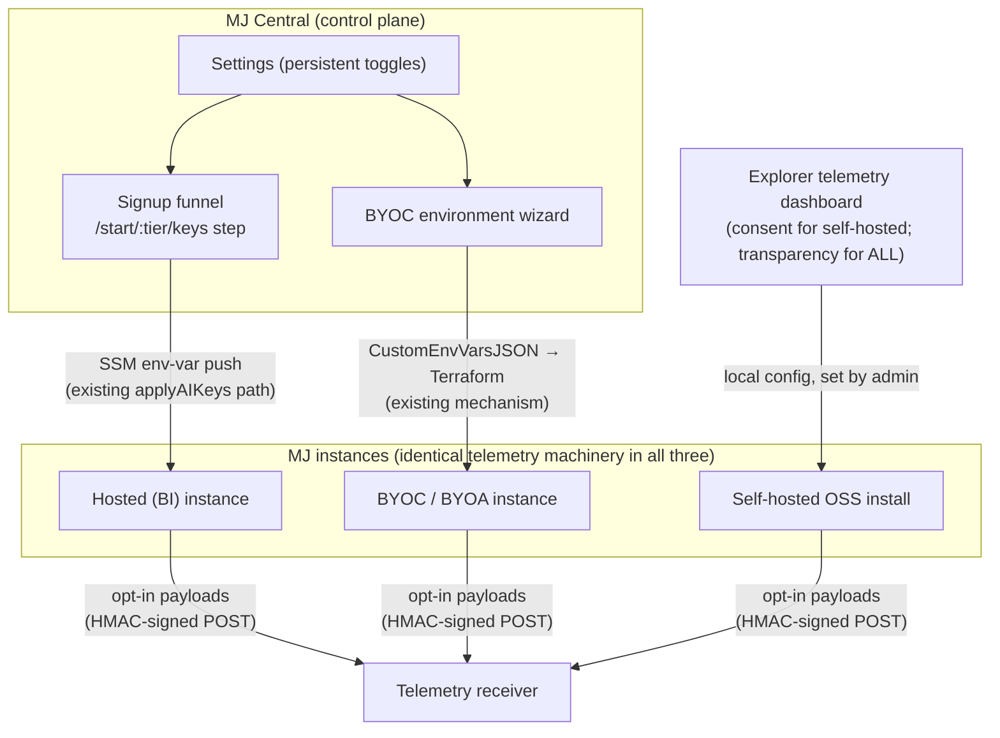

# Telemetry Sharing System — Preliminary Findings & Open Design Questions

**Date**: July 2026
**Author**: Matt Chriest (with Claude Code research assistance)
**Relates to**: [Issue #2970](https://github.com/MemberJunction/MJ/issues/2970) · [plans/telemetry-sharing-system.md](telemetry-sharing-system.md) (the original architecture proposal, converted from PR #2484)
**Status**: Discussion input — findings from an initial review, before scoping v1

---

## 1. Purpose of this document

Amith asked me to pick up the deprioritized telemetry ("phone home") proposal and run with it. This document captures what I found while getting oriented: how the motivating video maps (and doesn't map) onto the proposal, whether the scope should extend beyond AI agents, where the UI work actually lives, and — most significantly — how MJ Central changes the consent and transport picture in ways the original plan doesn't yet address.

Nothing here contradicts the original architecture. The schema DSL, the CI gate, the provider framework, and the privacy guarantees all hold up. These findings are about **scope, consent placement, and deployment topology**.

---

## 2. Recap: what the proposal is

One sentence: MJ installs can, **only if the admin opts in**, send anonymous operational statistics back to the MJ project so we can improve models, agents, performance, and roadmap priorities.

The defining design choice: **privacy is enforced by architecture, not policy**. The telemetry schema DSL has no free-text type, no raw timestamp type, and no generic UUID type. Conversation content, user IDs, and record IDs have nowhere to live in a payload. A CI gate validates every registered provider at build time; a runtime validator and the cloud receiver re-check every payload. Four independent layers.

Two opt-in modes, both bound by the same metadata-only allowlist:

- **Aggregated** (primary): daily rollups — run counts, latency percentiles, token totals per agent/prompt/model
- **Raw events** (secondary, separate toggle): the same fields, un-rolled, minute-granularity time buckets

Current state: **design doc only, zero implementation.** The branch `claude/telemetry-sharing-system-egbjx` contains the proposal document and nothing else.

---

## 3. The motivating video, and an important wrinkle

The video Amith circulated is [David Lieb's YC talk on dot plots](https://www.youtube.com/watch?v=e5-6rEwzxLs): a grid where each **row is an individual user**, each column is a day, and a dot marks each day that user performed the core valuable action. The point is that aggregate metrics (DAU/MAU) hide who is actually getting value; the dot plot shows every user's engagement history on one screen, exposing churn, engagement segments, and which users the product truly works for.

**The wrinkle: the telemetry design deliberately cannot produce a Lieb-style dot plot.** Per-user rows require user identifiers, and the schema's `SafeEntityType` allowlist excludes `User` by design. That exclusion *is* the privacy guarantee.

So "insights like the video" splits into two different deliverables:

| | Data source | Rows in the dot plot | Feasible? |
|---|---|---|---|
| **Cross-install insight** | Phoned-home telemetry | Installs (or agents/models within installs) | ✅ Fully, with aggregated mode |
| **Per-user insight** | The install's own local data (never leaves the box) | Individual users | ✅ But as a *local* Explorer analytics feature, not telemetry |

Both are valuable. The first tells the MJ project which installs are engaged, drifting, or struggling. The second delivers the literal video insight to install admins — and it requires **no telemetry system at all**, since MJ already has complete run/conversation history locally. The per-user dot plot could ship as a standalone Explorer dashboard feature on its own (faster) timeline.

**Recommendation**: treat these as two separate line items so nobody expects the telemetry pipeline to deliver per-user analytics it is architecturally incapable of.

---

## 4. Scope: beyond agents

The original plan's v1 providers are `AIAgents` and `AIPrompts`, with `Actions`, `MJServer`, and `Skip` sketched for v2. The provider framework is generic by design, so expansion is cheap. The question is which categories carry the most value:

| Category | Example data | Sensitivity | Value |
|---|---|---|---|
| **Install profile** | MJ version, DB platform (SQL Server vs PG), deployment shape | Very low | High — we currently don't know basic distribution facts that should drive engineering priorities (e.g. PG parity effort) |
| **AI usage** (v1) | Per-agent/model run counts, latency, tokens, error classes | Low (metadata IDs only) | High — model selection, perf tuning, memory heuristics |
| **Server health** (v2) | Request rates, GraphQL latency, error classes | Low | High — reliability at scale |
| **Explorer feature adoption** | Daily open counts per dashboard/resource type ("Lists opened 40× yesterday") | Low if per-install, **high if ever per-user** | High — turns UI investment decisions (list-page standardization, feature retirement debates) from instinct into data |
| **Scale shape** | Entity/user/app counts, row-count buckets | Low (counts only, never names) | Medium — defines what "big install" means in the wild |

Two hard lines when expanding toward whole-app telemetry:

1. **Never per-user.** Feature adoption stays at install-level counts. The DSL already enforces this; new providers inherit the guardrails for free.
2. **Never customer schema names.** Entity names, app names, and custom agent names describe the customer's business. Counts yes, names no. (Note: MJ-shipped agents/models have known hardcoded UUIDs, so we can distinguish "Sage usage" from "some custom agent usage" without ever learning what the custom agent is.)

**Recommendation**: keep v1 at agents + prompts to prove the pipeline (the pipeline is the hard part and is identical regardless of payload). But add **install profile** to v1 (trivially cheap, least sensitive, immediately useful) and name **feature adoption** as a headline v2 candidate. This reframes the feature from "AI telemetry" to "MJ product telemetry," which matches the video's product-insight framing.

---

## 5. The UI surfaces (clarified)

The design work is **not** one interface — and only one side of it is in scope now.

### Side 1: the install's consent + transparency UI (in scope)

Four pieces, all serving trust:

1. **Opt-in moment** — "help improve MJ?"; everything defaults to off (see §6 for *where* this lives)
2. **Telemetry settings dashboard** — per-category toggles, raw-mode toggle with stronger copy, endpoint config, global kill switch
3. **Schema viewer** — auto-generated from the DSL declarations; the definitive "everything that could ever be sent" page a customer's security team reviews before opting in. Generated, so it cannot drift from what providers actually emit.
4. **"Preview next payload" + audit log** — runs the real collection pipeline and renders the exact JSON before anything ships; history of what has shipped

Pieces 3 and 4 are what make this trustworthy rather than creepy. They are pure information-design problems and represent the core of the design work.

### Side 2: MJ's analytics UI (explicitly deferred)

The dashboards where the MJ team analyzes cross-install data (and where the install-level dot plots would live). The original plan defers this to a separate effort against the cloud receiver. For v1 the receiver is a stub, so there is nothing to visualize yet.

### Side 3 (future ideas worth remembering)

- **v3 give-back**: "how your install compares to the median" — analytics UI shipped *inside* the product, for admins, as the reward for participating
- **Local per-user dot plot** (§3): analytics UI with zero telemetry involved

---

## 6. The MJ Central finding (the big one)

The original plan was written from a pure self-hosted worldview: an independent install deciding whether to send anonymous stats to a distant MJ project. **That is not how most paying customers will get MJ.**

The MJ Central platform repo (`repos/platform`) shows MJC is a **multi-tenant deployment platform** that provisions and manages complete MJ instances across three hosting models — Batteries-Included (hosted on MJC's AWS account pools), BYOC (customer's Azure), and BYOA (customer's AWS) — with a Stripe-backed signup funnel. This reshapes the consent and transport design:

### 6a. Three install populations, three consent surfaces, one mechanism

| Population | Where consent happens | How the flag reaches the instance |
|---|---|---|
| Hosted (BI) | MJC signup funnel (`/start/:tier/keys` is already a consent-shaped step) + BI settings pages | SSM env-var push at provision (same path that seeds AI keys today) |
| BYOC / BYOA | MJC environment wizard + MJC settings | `CustomEnvVarsJSON` → Terraform `custom_env_vars` (existing mechanism) |
| Self-hosted OSS | Explorer telemetry dashboard (the original plan's design) | Local config, set by the admin |

The instance-side machinery (DSL, providers, transport, watermarks, queue) stays exactly as designed and **identical across all three**. What varies is who flips the switch and where. The Explorer dashboard remains necessary regardless: it is the self-hosted consent surface *and* the transparency layer (schema viewer, payload preview, audit log) that every instance should carry no matter who manages it.

### 6b. MJC already collects instance data — keep the promises separate

Two existing data flows in MJC surprised us:

- **`InstanceUsageService`** uses the instance's API key to query its activity tables over GraphQL: interactions by day, active users, top entities, agent runs, tokens. This powers MJC's per-instance Usage tab.
- **OpenRouter AI-credit metering** settles per-tenant AI spend into MJC's central database (`BC: Usage Records` + credit ledger).

So for managed instances, a form of "phone home" already happens — and it is **richer** than anything issue #2970 would permit (it sees active users and top entities, which the telemetry schema deliberately forbids from leaving the box).

This is not a contradiction, but it is two different trust relationships that must never be conflated in the UI:

1. **"Your host can see your usage"** — a hosting-operations relationship, like a cloud provider seeing your server metrics. Already exists, scoped to MJC-managed instances.
2. **"Anonymous stats go to the MJ project"** — product telemetry to the open-source project. New, opt-in, anonymized by architecture.

The consent copy for managed customers must name both explicitly. A customer who later discovers the hosting-side visibility after opting into "anonymous telemetry" will feel misled, and the whole feature's credibility rests on there being no surprises.

### 6c. Should the cloud receiver just be MJ Central?

The original plan calls for the receiver in a **separate new repo** ("different security boundary, different deployment cadence"). MJC's existence reopens this question:

**Case for MJC as the receiver**: MJC already has ingest infrastructure, HMAC-style credential handling, a warehouse-shaped data layer (`BC: Usage Records`), operational dashboards, and a deployment pipeline. Standing up a new service means duplicating all of that. v1 scope shrinks significantly.

**Case against**: self-hosted OSS users who opted in would be sending data to Blue Cypress's commercial platform rather than a neutral "MJ project" endpoint, which is a worse optic for the open-source story. And MJC's security boundary now contains a new public ingest surface.

**Middle path worth evaluating**: a thin, stateless ingest endpoint (validate + sign-check + drop into the warehouse) deployed *from* the MJC repo but on its own subdomain/branding (e.g. `telemetry.memberjunction.org`), keeping the neutral identity without a whole new repo. Needs Amith's read on the security-boundary tradeoff.

---

## 7. Consolidated recommendations

1. **v1 scope**: agents + prompts providers (per the original plan) **plus** a trivially cheap install-profile provider. Aggregated mode only. Noop/stub transport.
2. **Split the video's insight into two line items**: install-level dot plots (telemetry, later, cloud-side) vs. per-user dot plots (local Explorer analytics feature, no telemetry required, could ship independently).
3. **Add an "MJC-managed instances" section to the architecture doc**: three populations, consent surface per population, env-var injection paths, and the two-promises separation (§6b).
4. **Consent placement**: MJC funnel + settings for managed customers; Explorer dashboard for self-hosted. The `mj install` CLI should only *mention* telemetry and default to off — the person running the CLI is often not the owner of the data (consultants, IT contractors, `--yes` non-interactive runs).
5. **Decide the receiver question (§6c) before v1 transport work** — it determines what the endpoint contract needs to be and how much of the "separate repo" plan survives.
6. **Design the Explorer settings dashboard with the full category list in mind** (server health, feature adoption, install profile as future toggles) so it doesn't need a redesign per provider.
7. **Name feature adoption as the headline v2 provider** — it converts recurring "is anyone using X" UI debates into data and broadens the feature from AI telemetry to product telemetry.

## 8. Open questions for Amith / team

Beyond the ten in the original doc (most of which have stated leans that still look right):

1. Receiver location given MJC's existence (§6c) — separate repo, MJC-hosted with neutral branding, or fully inside MJC?
2. For MJC-managed instances, does telemetry still ship **from the instance** (uniform push, MJC just sets the flag — my lean), or does MJC's existing pull channel relay it? Uniform push keeps one mechanism and keeps the schema guarantees enforced at the instance boundary.
3. Does the hosting-side data collection (`InstanceUsageService`) need its own disclosure pass as part of this work, so both promises are documented in one place?
4. Is the local per-user dot plot (§3) worth greenlighting as an independent, earlier deliverable?
5. Default state confirmation: everything off for all three populations, including hosted BI customers? (Assumed yes — "opt-in" was Amith's explicit requirement — but the funnel makes it tempting to pre-check. Recommend never pre-checking.)
