# Flexible Database Support Plan (v3.0)

## Executive Summary

MemberJunction currently assumes well-designed databases with primary keys on all tables and foreign key constraints defining relationships. This excludes significant real-world scenarios: legacy databases, read replicas, ETL outputs, vendor databases, and imported data.

This plan introduces **first-class support for soft relationships and tables without primary keys**, enabling MJ to function as an AI data platform where users can bring in *any* data.

**Key Changes:**
- Auto-generate `__mj_ID` column for tables without primary keys
- Support "Soft" relationships (metadata-defined, no DB constraint)
- Integrate with DBAutoDoc for AI-powered relationship discovery
- Full support across all layers: GraphQL, BaseEntity, and UI

---

## Problem Statement

### Current Limitations

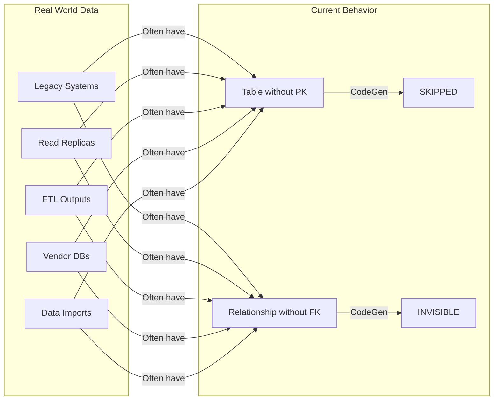

### Impact

| Scenario | Current Outcome | Desired Outcome |
|----------|----------------|-----------------|
| Table with no PK | Skipped entirely | Full entity with generated `__mj_ID` |
| Relationship without FK | Invisible to MJ | Discoverable soft relationship |
| Dirty data with orphans | N/A | Tracked with quality metrics |
| AI relationship discovery | Not integrated | DBAutoDoc → MJ metadata |

---

## Core Concepts

### Concept 1: Primary Key Source

How did the entity's primary key come to exist?

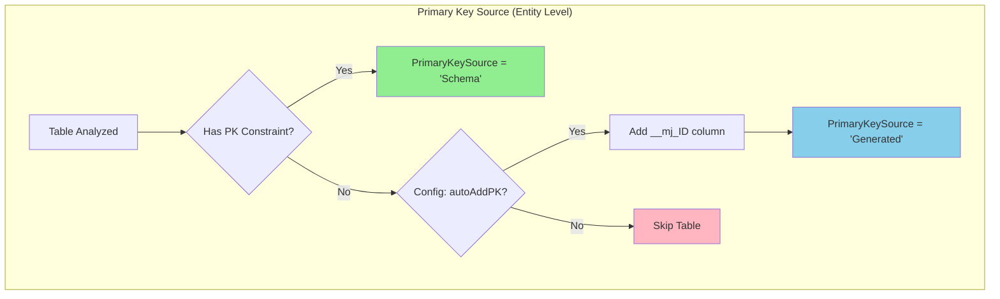

| Value | Description |
|-------|-------------|
| **Schema** | Primary key defined in database (normal case) |
| **Generated** | MJ added `__mj_ID` column because table lacked PK |

### Concept 2: Relationship Type

How is a field related to another entity?

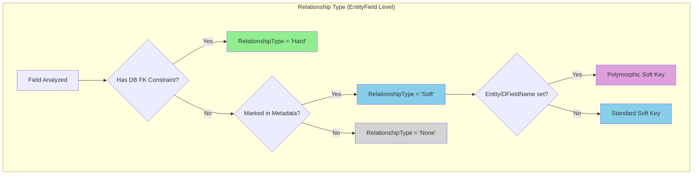

| Value | DB Constraint | Description |
|-------|---------------|-------------|
| **None** | N/A | No relationship |
| **Hard** | Yes | Database FK constraint exists and enforces integrity |
| **Soft** | No | Relationship known via metadata, not enforced by DB |

### Concept 3: Polymorphic Relationships

When a single field can point to records in different entities based on a discriminator column:

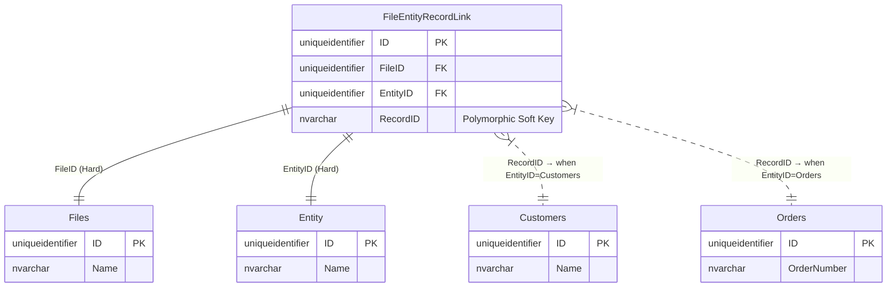

The `RecordID` field has `EntityIDFieldName = "EntityID"`, telling MJ to look at the EntityID column to determine which entity RecordID references.

---

## Relationship Types Comparison

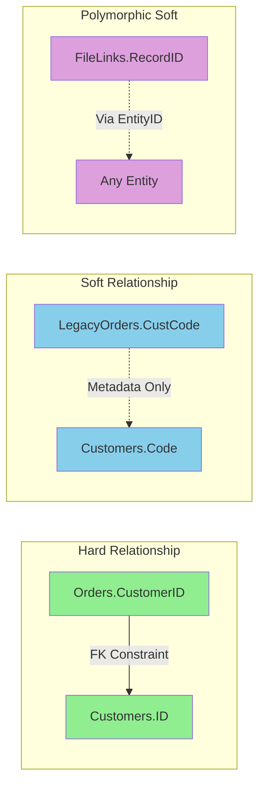

### Behavior Differences

| Aspect | Hard | Soft |
|--------|------|------|
| **DB Constraint** | FK exists | None |
| **Orphan Prevention** | Database enforces | Application warns |
| **Cascade Delete** | DB can cascade | App awareness only |
| **Save Validation** | Error if target missing | Warning, allows save |
| **GraphQL Resolution** | Always resolves or errors | May return null (orphan) |
| **UI Display** | Solid lines/icons | Dashed lines + confidence badge |
| **Discovery** | Automatic from schema | Manual or AI-discovered |

---

## Auto-Generated Primary Key Flow

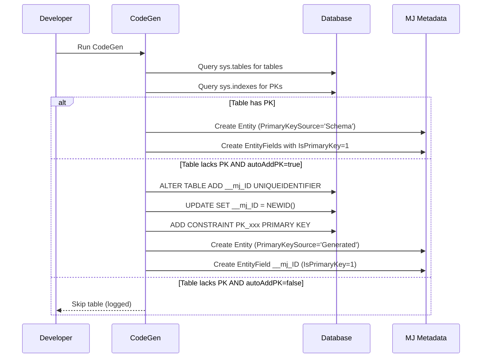

### Generated Migration Example

```sql
-- Auto-generated by MJ CodeGen
-- Adding primary key to PK-less table: [imported].[LegacyOrders]

ALTER TABLE [imported].[LegacyOrders]
ADD [__mj_ID] UNIQUEIDENTIFIER NOT NULL
    CONSTRAINT [DF_imported_LegacyOrders___mj_ID] DEFAULT NEWID();
GO

-- Populate existing rows
UPDATE [imported].[LegacyOrders]
SET [__mj_ID] = NEWID()
WHERE [__mj_ID] = '00000000-0000-0000-0000-000000000000';
GO

-- Add primary key constraint
ALTER TABLE [imported].[LegacyOrders]
ADD CONSTRAINT [PK_imported_LegacyOrders___mj_ID] PRIMARY KEY ([__mj_ID]);
GO
```

---

## Schema Changes

### Entity Table

```sql
ALTER TABLE __mj.Entity ADD
    PrimaryKeySource VARCHAR(20) NOT NULL
        CONSTRAINT DF_Entity_PrimaryKeySource DEFAULT 'Schema'
        CONSTRAINT CK_Entity_PrimaryKeySource
            CHECK (PrimaryKeySource IN ('Schema', 'Generated'));
```

### EntityField Table

```sql
ALTER TABLE __mj.EntityField ADD
    -- Relationship classification
    RelationshipType VARCHAR(20) NOT NULL
        CONSTRAINT DF_EntityField_RelationshipType DEFAULT 'None'
        CONSTRAINT CK_EntityField_RelationshipType
            CHECK (RelationshipType IN ('None', 'Hard', 'Soft')),

    -- Discovery metadata
    RelationshipDiscoverySource VARCHAR(20) NULL
        CONSTRAINT CK_EntityField_RelationshipDiscoverySource
            CHECK (RelationshipDiscoverySource IN ('Schema', 'Manual', 'AIDiscovered')),

    RelationshipConfidence DECIMAL(5,4) NULL,  -- 0.0000 to 1.0000

    -- LLM/Human reasoning for why relationship exists
    RelationshipDiscoveryNotes NVARCHAR(MAX) NULL,

    -- Data quality tracking
    LastIntegrityCheckAt DATETIME NULL,
    OrphanCount INT NULL;  -- Records with no match in target entity
```

### Entity Relationship Diagram

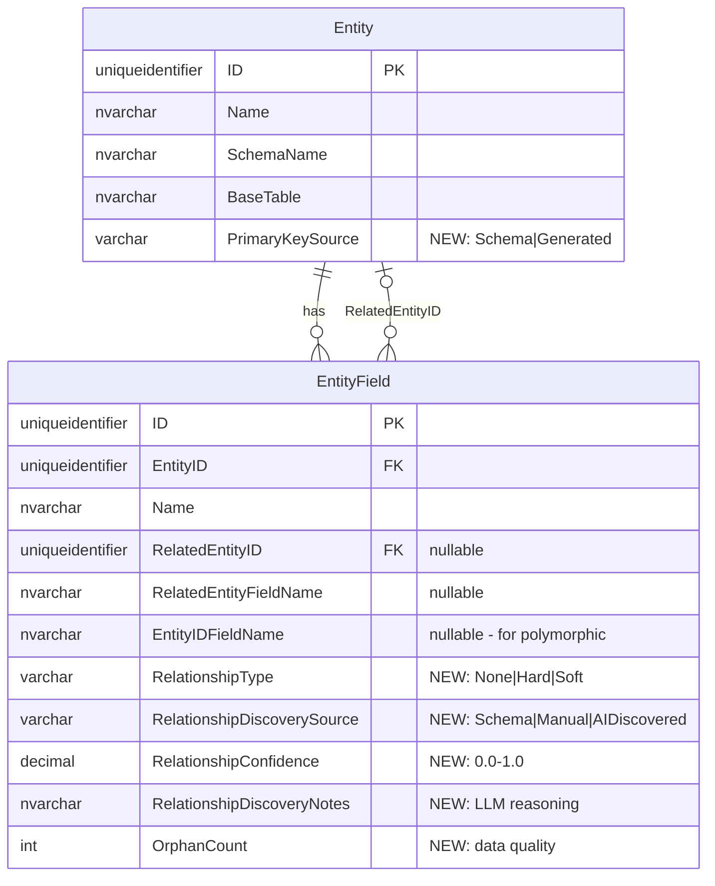

---

## Layer-by-Layer Implementation

### Layer 1: Database / Metadata

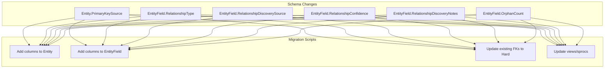

### Layer 2: CodeGen

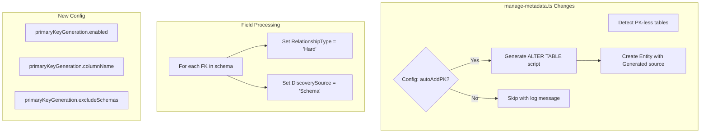

### Layer 3: MJCore / BaseEntity

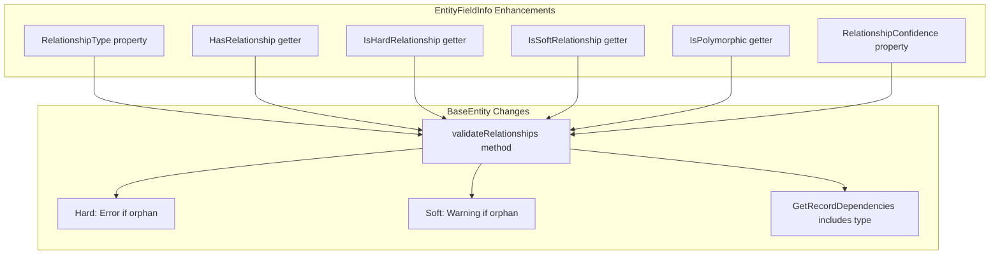

### Layer 4: GraphQL / MJServer

```mermaid
flowchart TD
    subgraph "Schema Generation"
        A[Field resolver generated]
        B{RelationshipType?}
        B -->|Hard| C[Standard resolution]
        B -->|Soft| D[Null-tolerant resolution]
    end

    subgraph "Introspection"
        E[FieldRelationshipInfo type]
        F[type: NONE|HARD|SOFT]
        G[confidence: Float]
        H[isPolymorphic: Boolean]
    end

    subgraph "Runtime"
        I[Soft relationship returns null if orphan]
        J[No error, graceful degradation]
    end
```

### Layer 5: Angular UI

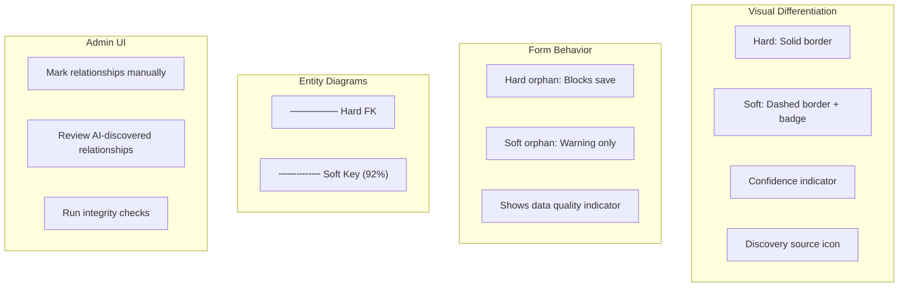

---

## DBAutoDoc Integration

### Current State

DBAutoDoc already discovers:
- Missing primary keys (statistical uniqueness analysis)
- Missing foreign keys (value overlap, naming patterns)
- Confidence scores with evidence

### Enhancement: MJ Metadata Export

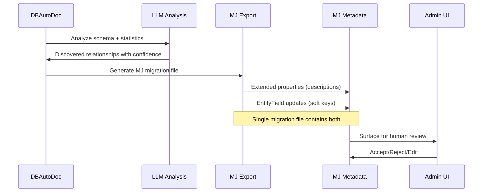

### DBAutoDoc Output Format

```sql
-- =====================================================
-- MJ Metadata Migration - Generated by DBAutoDoc
-- Database: LegacySystem
-- Generated: 2024-12-02T10:30:00Z
-- =====================================================

-- SECTION 1: Extended Properties (Descriptions)
EXEC sp_addextendedproperty
    @name = N'MS_Description',
    @value = N'Legacy customer orders imported from AS400 system',
    @level0type = N'SCHEMA', @level0name = N'imported',
    @level1type = N'TABLE',  @level1name = N'LegacyOrders';

EXEC sp_addextendedproperty
    @name = N'MS_Description',
    @value = N'Customer code linking to Customers.Code',
    @level0type = N'SCHEMA', @level0name = N'imported',
    @level1type = N'TABLE',  @level1name = N'LegacyOrders',
    @level2type = N'COLUMN', @level2name = N'CustCode';

-- SECTION 2: Soft Relationship Metadata
-- Discovered: LegacyOrders.CustCode → Customers.Code (confidence: 0.92)

UPDATE ef SET
    RelationshipType = 'Soft',
    RelatedEntityID = re.ID,
    RelatedEntityFieldName = 'Code',
    RelationshipDiscoverySource = 'AIDiscovered',
    RelationshipConfidence = 0.9200,
    RelationshipDiscoveryNotes = N'DBAutoDoc Discovery (2024-12-02)
Evidence:
- Value overlap: 97.3% of CustCode values exist in Customers.Code
- Naming similarity: 0.85 (CustCode → Customer + Code)
- Orphan rate: 2.7% (acceptable for legacy data)
- Cardinality: Many-to-one confirmed

LLM Reasoning:
Column naming pattern "CustCode" strongly suggests customer reference.
The 97% value overlap confirms the relationship despite lack of FK.
Orphan records likely represent deleted customers in source system.'
FROM __mj.EntityField ef
INNER JOIN __mj.Entity e ON ef.EntityID = e.ID
INNER JOIN __mj.Entity re ON re.Name = 'Customers'
WHERE e.SchemaName = 'imported'
  AND e.BaseTable = 'LegacyOrders'
  AND ef.Name = 'CustCode';
```

### DBAutoDoc Configuration

```javascript
// dbautodoc.config.js
module.exports = {
  export: {
    mjMetadata: {
      enabled: true,
      outputPath: './migrations/dbautodoc/',
      fileNamePattern: 'DBAutoDoc__{database}__{timestamp}.sql',

      includeExtendedProperties: true,
      includeSoftRelationships: true,

      // Confidence thresholds
      autoAcceptThreshold: 0.95,    // Auto-mark as accepted
      includeThreshold: 0.70,       // Include in migration

      // What to include in discovery notes
      includeEvidence: true,
      includeLLMReasoning: true,
    }
  }
};
```

---

## Configuration

### CodeGen Configuration

```javascript
// mj.config.cjs
module.exports = {
  codeGenSettings: {
    // Auto-add __mj_ID to tables without primary keys
    primaryKeyGeneration: {
      enabled: true,
      columnName: '__mj_ID',
      columnType: 'uniqueidentifier',
      defaultValue: 'NEWID()',

      // Exclusions
      excludeSchemas: ['sys', 'INFORMATION_SCHEMA', '__mj'],
      excludeTables: ['sysdiagrams', 'dtproperties'],
      excludePatterns: ['*_log', '*_audit', '*_history'],  // Wildcards
    },

    // Relationship handling
    relationships: {
      // Populate RelationshipType='Hard' for existing FKs
      populateRelationshipType: true,

      // Mark existing EntityIDFieldName relationships as Soft
      markPolymorphicAsSoft: true,
    }
  }
};
```

---

## Packages to Modify

### Core Framework

| Package | Files | Changes |
|---------|-------|---------|
| **MJCore** | `src/generic/entityInfo.ts` | Add RelationshipType, confidence, helpers |
| **MJCore** | `src/generic/baseEntity.ts` | Relationship validation (warn vs error) |
| **MJCoreEntities** | `src/generated/entity_subclasses.ts` | Regenerate with new fields |

### CodeGen

| Package | Files | Changes |
|---------|-------|---------|
| **CodeGenLib** | `src/Database/manage-metadata.ts` | PK generation, populate RelationshipType |
| **CodeGenLib** | `src/Database/sql_codegen.ts` | Generate __mj_ID migration scripts |
| **CodeGenLib** | `src/Config/config.ts` | New configuration options |

### Server

| Package | Files | Changes |
|---------|-------|---------|
| **MJServer** | `src/generated/generated.ts` | Relationship type in resolvers |
| **MJServer** | `src/resolvers/` | Null-tolerant soft relationship resolution |

### Angular UI

| Package | Files | Changes |
|---------|-------|---------|
| **ng-shared-generic** | `src/lib/components/` | Relationship type visual indicators |
| **Explorer** | `core-entity-forms/` | Soft key display, confidence badges |
| **Explorer** | `entity-browser/` | Relationship diagrams (solid vs dashed) |
| **Explorer** | `admin/` | Manual soft key marking UI |

### DBAutoDoc

| Package | Files | Changes |
|---------|-------|---------|
| **DBAutoDoc** | `src/export/` | New MJ metadata export format |
| **DBAutoDoc** | `src/discovery/` | Include discovery notes in output |
| **DBAutoDoc** | `src/types/` | MJ export types |

---

## Implementation Phases

### Phase 1: Schema Foundation

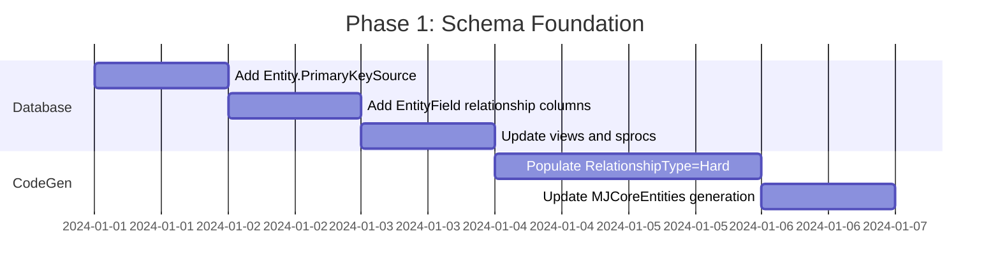

**Deliverables:**
- Migration script adding new columns
- CodeGen populates `RelationshipType='Hard'` for existing FKs
- All existing behavior unchanged

### Phase 2: Auto-Generate Primary Keys

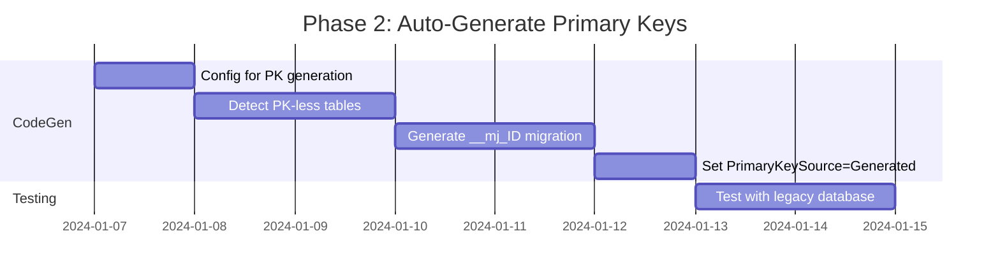

**Deliverables:**
- Tables without PKs get `__mj_ID` automatically
- Full entity support for previously-skipped tables
- Configuration to enable/disable per-schema

### Phase 3: Soft Relationship Support

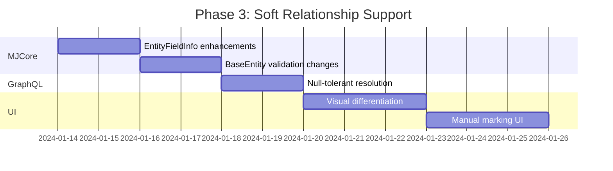

**Deliverables:**
- Soft relationships functional across all layers
- UI shows relationship type visually
- Admin can manually mark soft relationships

### Phase 4: DBAutoDoc Integration

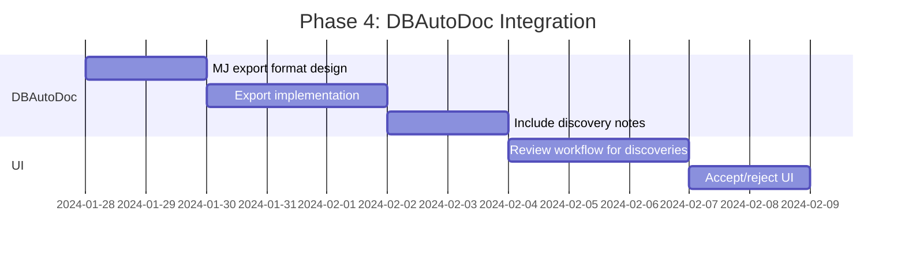

**Deliverables:**
- DBAutoDoc generates MJ migration files
- Single file contains descriptions AND soft key metadata
- Admin UI for reviewing AI-discovered relationships

### Phase 5: Data Quality

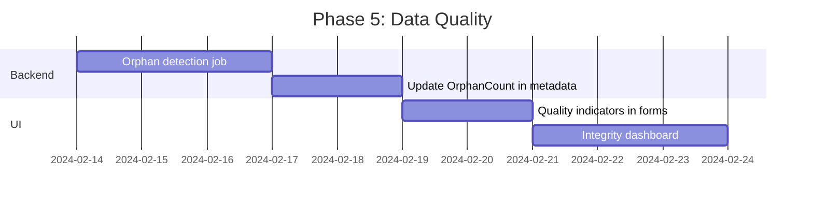

**Deliverables:**
- Scheduled job checks soft relationship integrity
- UI shows orphan counts and quality indicators
- Dashboard for overall data quality

---

## End-to-End User Flow

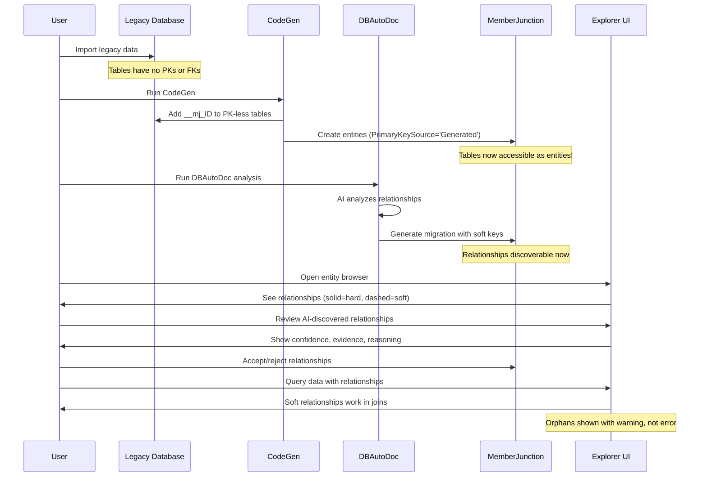

---

## Success Criteria

| Metric | Target |
|--------|--------|
| PK-less tables supported | 100% (with `__mj_ID`) |
| Soft relationships functional | All layers |
| DBAutoDoc integration | Single migration file output |
| AI discovery accuracy | >90% precision with notes |
| User can mark relationships | Admin UI complete |
| Orphan visibility | Count + percentage in UI |

---

## Risks and Mitigations

| Risk | Mitigation |
|------|------------|
| Schema modification rejected | Make `__mj_ID` generation opt-in per schema |
| Soft relationship confusion | Clear visual differentiation + tooltips |
| Orphan data quality issues | Proactive tracking + warnings, not errors |
| DBAutoDoc false positives | Human review workflow, confidence thresholds |
| Performance with large tables | Batch orphan checks, background jobs |

---

## Open Questions

1. **Orphan Handling Strategy**: When saving a record with a soft FK pointing to non-existent target:
   - Option A: Warn and allow save (current proposal)
   - Option B: Configurable per-relationship
   - Option C: Block like hard FK (defeats purpose?)

2. **DBAutoDoc Triggering**: Should DBAutoDoc run automatically on new tables or always manual?

3. **Confidence Thresholds**: What confidence level should auto-accept vs. require review?
   - Proposed: >0.95 auto-accept, >0.70 include for review, <0.70 skip

4. **UI for Polymorphic**: How to visualize polymorphic soft keys in relationship diagrams?

---

## Appendix: Terminology

| Term | Definition |
|------|------------|
| **Hard Key** | Foreign key with database constraint enforcing referential integrity |
| **Soft Key** | Relationship defined in metadata only, no database constraint |
| **Polymorphic Key** | Soft key where target entity is determined by another column (EntityIDFieldName) |
| **Orphan** | Record with FK/soft key value that doesn't exist in target entity |
| **Generated PK** | Primary key column (`__mj_ID`) added by MJ to tables that lacked one |
| **Discovery Notes** | LLM reasoning and evidence for why a soft relationship is believed to exist |
