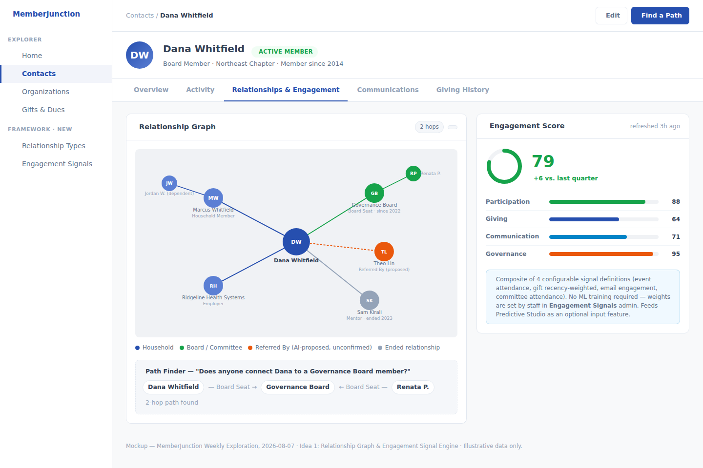
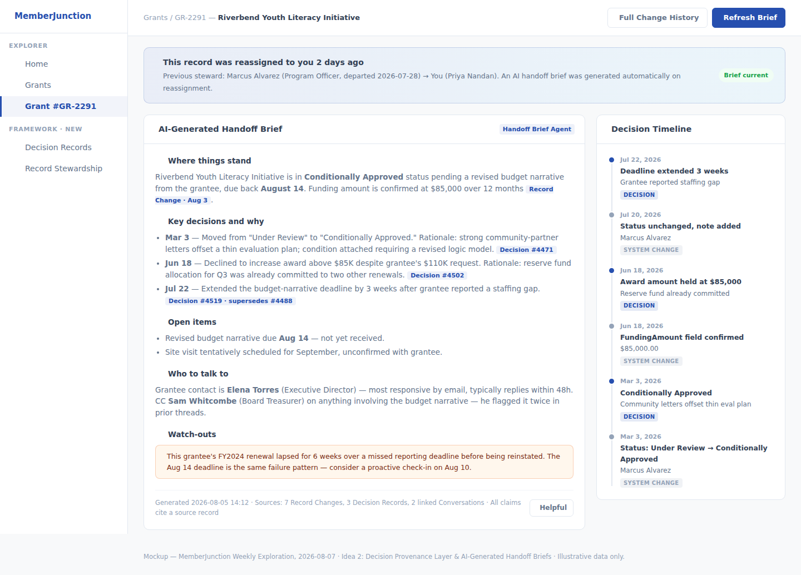
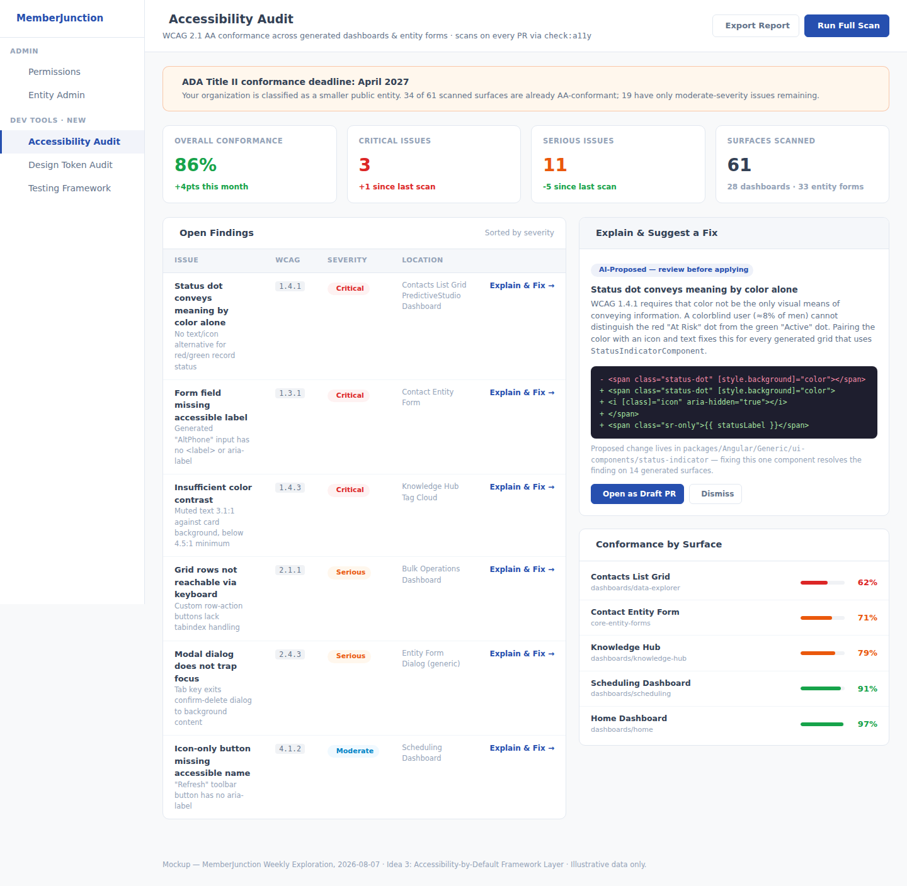

# Weekly Creative Exploration — 2026-08-07

Three framework-level ideas for MemberJunction, researched from the codebase, in-flight PRs/plans,
and external research on association-management systems, nonprofit CRMs, low-code platforms, and
AI agent frameworks. This is the first week of this recurring exercise — see the parent
[`plans/weekly-exploration/README.md`](../README.md) for the ongoing log.

## Methodology

1. Surveyed all 50+ open PRs and skimmed the ~150-file `/plans` directory to map what's already in
   flight (unified permissions, query/entity materialization, record-set processing & the
   unified workflow program, entity-action workflow extensions, agent tool pipelines, Predictive
   Studio, Knowledge Hub, search-scopes RAG+). All three ideas below were checked against this list
   and deliberately avoid duplicating or conflicting with any of it.
2. Ran a codebase reconnaissance pass across the Agent framework, dashboards, Communication engine,
   dedup/vector engine, Actions framework, Permissions subsystems, Search, and the Testing
   framework to map current capability maturity and concrete gaps.
3. Ran external research across association management systems (iMIS, Fonteva, MemberClicks,
   GrowthZone), nonprofit/donor CRMs (Bloomerang, Neon CRM, Virtuous, DonorPerfect), low-code/data
   platforms (Retool, Appsmith, Budibase, Supabase, n8n, Temporal), and AI agent frameworks
   (LangChain/LangGraph, CrewAI, AutoGen), plus current reporting on nonprofit-sector tech pain
   points (staff turnover, accessibility deadlines, compliance burden, data silos).
4. Selected 3 ideas that are (a) genuinely generic, core-framework capabilities — never a specific
   vertical app, (b) non-duplicative of the in-flight work above, and (c) each solve a real,
   researched pain point that matters well beyond associations and nonprofits, even though that
   domain motivated the search.

## The three ideas

### 1. [Relationship Graph & Engagement Signal Engine](./idea-1-relationship-engagement-engine.md)

A generic, typed entity-relationship graph (any two records, any entities, typed/directional
edges) plus a configurable, no-ML-required composite engagement score — the deterministic "80%
case" that complements, not competes with, the in-flight Predictive Studio ML platform. Lets any
app built on MJ answer "how connected/engaged is this person?" without hand-rolling either a graph
schema or a scoring pipeline.

### 2. [Decision Provenance Layer & AI-Generated Handoff Briefs](./idea-2-decision-provenance-handoff.md)

An annotation layer on top of the existing Record Changes/Version History system that captures
*why* a decision was made, not just *what* changed — plus an agent (built entirely from existing
Agent-framework primitives) that synthesizes a cited, structured "handoff brief" whenever a
record's steward changes, directly targeting the ~19%-a-year nonprofit staff turnover problem and
the institutional-knowledge loss that comes with it.

### 3. [Accessibility-by-Default Framework Layer](./idea-3-accessibility-by-default.md)

Fixes accessibility at its single highest-leverage point — the CodeGen templates that stamp out
every generated form and grid — and adds an `AccessibilityOracle`/`check:a11y` CI gate mirroring
the existing design-token gate, plus an Accessibility Audit dashboard. Directly relevant to the
April 2026/2027 ADA Title II conformance deadlines that already apply to many public-facing
nonprofit and association sites, and the only idea this week that benefits literally every person
who will ever use an app built on MJ, not just staff-side users.

## What we deliberately did not propose

Per the standing brief for this exercise, none of the above is a specific business application —
no "donor management app," no "volunteer scheduling app." Each is a generic primitive (a graph
+ scoring engine, an annotation + summarization layer, a code-generation + testing-framework fix)
that any app built on MJ, in any domain, can use. The association/nonprofit framing is the
motivating research lens, not the deliverable's scope.
