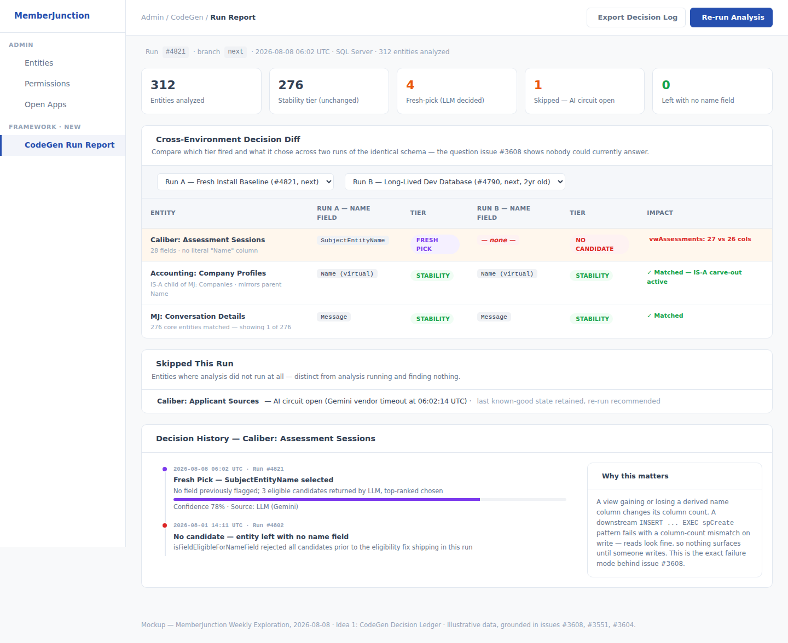
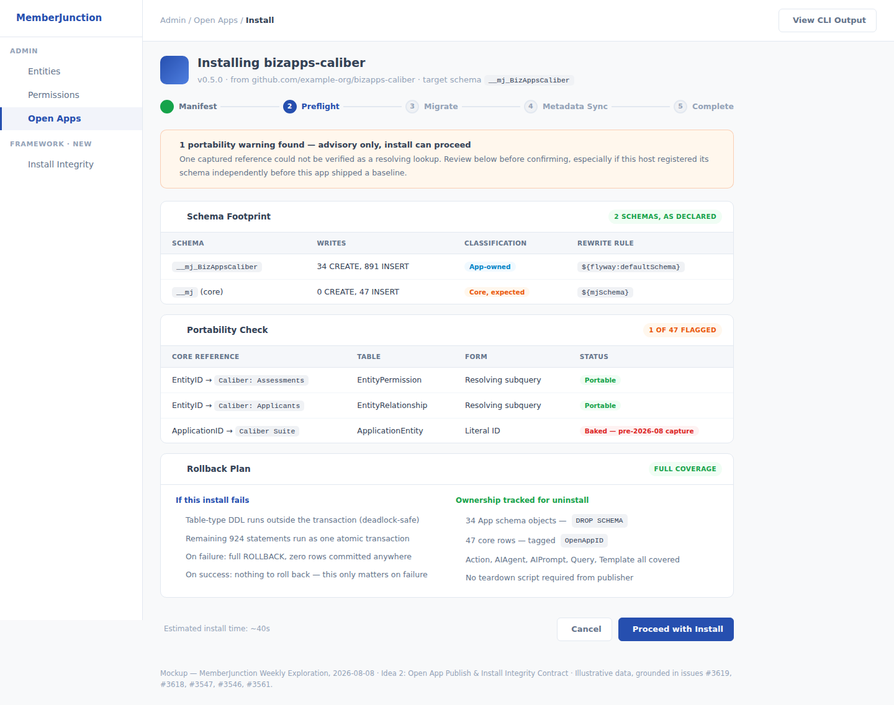
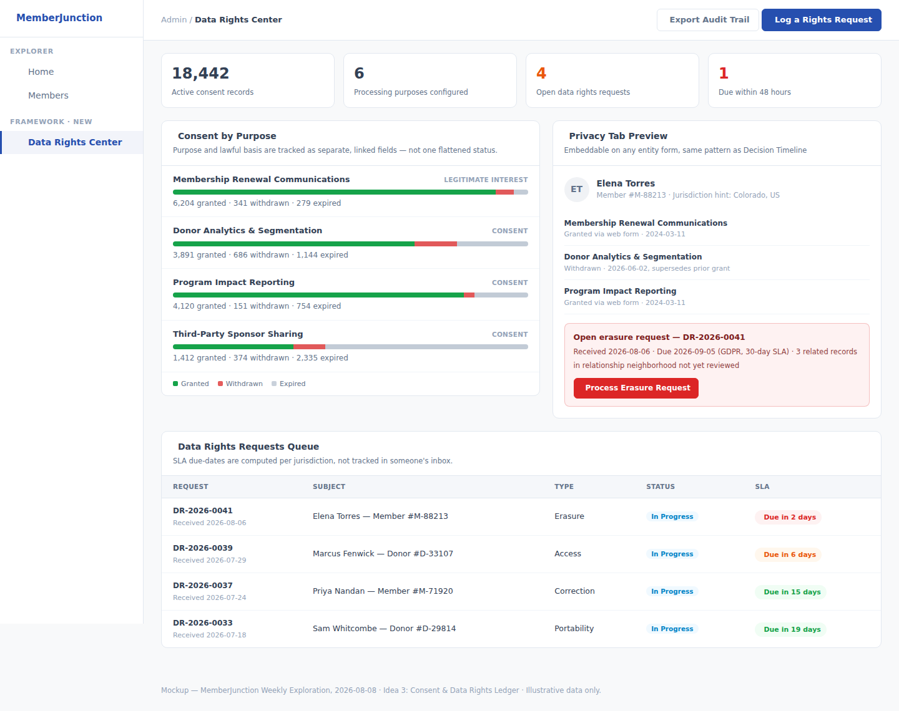

# Weekly Creative Exploration — 2026-08-08

Three framework-level ideas for MemberJunction, this week grounded primarily in the repo's own
open GitHub issues rather than starting from external analogy first — see the parent
[`plans/weekly-exploration/README.md`](../README.md) for the ongoing log and
[`2026-08-07`](../2026-08-07/) for last week's exploration.

## Methodology

1. Read last week's log in full, including its decision record: **Idea 3 (Accessibility-by-Default)
   was selected and is now in flight as PR #3609**; Ideas 1 (Relationship Graph & Engagement) and 2
   (Decision Provenance & Handoff Briefs) remain open candidates for a future cycle, not duplicated
   here.
2. Surveyed the ~60 open PRs and the most recent ~50 open issues on `MemberJunction/mj`. Two clear,
   unclaimed clusters stood out: (a) five separate, currently-open issues (#3608, #3551, #3604,
   #3546, #3561) plus one in-flight design doc (PR #3499) all converging on the same root problem —
   CodeGen and the Open App publish/install loop make silent, sometimes-non-deterministic decisions
   that only surface as production incidents; and (b) no coverage anywhere of data privacy/consent
   as a generic capability.
3. Ran a codebase reconnaissance pass specifically into `packages/CodeGenLib`'s name-field selection
   logic and `packages/OpenApp`'s install/teardown engine, to ground the first two ideas in what the
   code actually does today rather than paraphrasing the issue text — this surfaced an important
   correction (CodeGen already has a deterministic three-tier winner-selection algorithm, with one
   specific, narrow, still-open gap around IS-A virtual fields) and a useful precedent
   (`RunFkGraphTeardown`'s FK-graph walk already solves, elsewhere, the exact problem
   `spDeleteEntityWithCoreDependencies`'s hand-maintained list has).
4. Ran external research on 2025–2026 state privacy law coverage of nonprofits, GDPR erasure
   enforcement trends, the Blackbaud breach settlements, and how comparable platforms (Salesforce
   Data Cloud, OneTrust) and low-code peers (Supabase, Directus, Strapi, n8n) do or don't build
   consent/data-rights tracking in natively.
5. Selected 3 ideas that are (a) genuinely generic, core-framework capabilities, (b) non-duplicative
   of anything in flight or proposed in prior weeks, and (c) each grounded in either a concrete,
   currently-open issue cluster or verifiable external research — not speculation.

## The three ideas

### 1. [CodeGen Decision Ledger — and Closing the IS-A Name-Field Gap](./idea-1-codegen-decision-ledger.md)

A narrow, targeted fix to the one specific gap in CodeGen's existing deterministic name-field
selection logic (its eligibility filter unconditionally excludes virtual fields, which breaks IS-A
mirrored `Name` fields exactly as issue #3551 describes), plus a permanent, queryable decision log
so the next time two "identical" databases disagree about generated metadata, it's a five-minute
diff instead of the live debugging session that produced issue #3608.

### 2. [Open App Publish & Install Integrity Contract](./idea-2-open-app-install-integrity.md)

Closes a cluster of five open issues (#3619, #3618, #3547, #3546, #3561) spanning the entire
publish → install → rollback loop: portable references that collapse to baked IDs at capture time,
three divergent schema-placeholder implementations where only one is correct for a real Open App, a
failed install with no real rollback, and entity deletion that silently half-fails on ~55 of ~73 FK
references. Explicitly proposed as a *revision*, backed by fresh production evidence, of a
documented non-goal in `open-app-spec.md` — not a silent gap being filled.

### 3. [Consent & Data Rights Ledger](./idea-3-consent-data-rights-ledger.md)

A generic, metadata-driven primitive for tracking processing purpose, lawful basis, consent, and
data-rights requests (access/erasure/portability/correction) against any entity's records, with
erasure executed via declarative per-field strategy (anonymize/redact/delete/exempt) rather than a
blind cascade-delete. Grounded in the uneven, jurisdiction-by-jurisdiction reality of 2026 state
privacy law coverage of nonprofits and the Blackbaud breach settlements — confirmed, via a direct
codebase check, to be genuinely uncovered by Unified Permissions or anything else in the framework
today.

## What we deliberately did not propose

None of the above is a specific business application — no "donor CRM," no "grants portal." Idea 1
is a fix to a shared code-generation choke point every app inherits identically. Idea 2 is a fix to
the shared publish/install machinery every Open App goes through once. Idea 3 is a generic
attach-to-any-entity primitive whose only domain-specific surface is configuration (which purposes
exist, which fields get an erasure strategy) left to the app builder — the same pattern the
framework already uses everywhere else.

## Outcome

Pending review.
