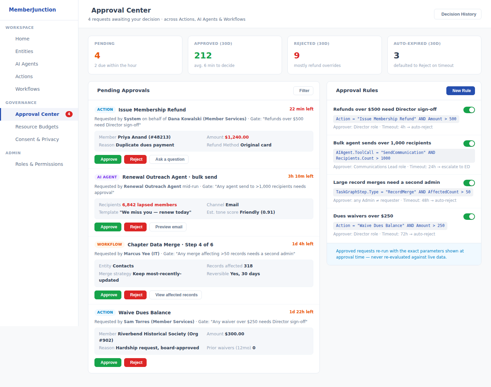
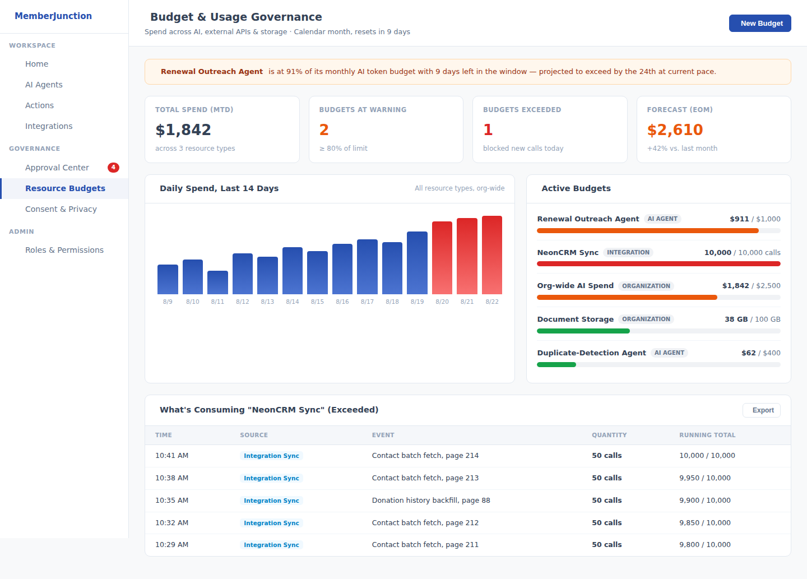
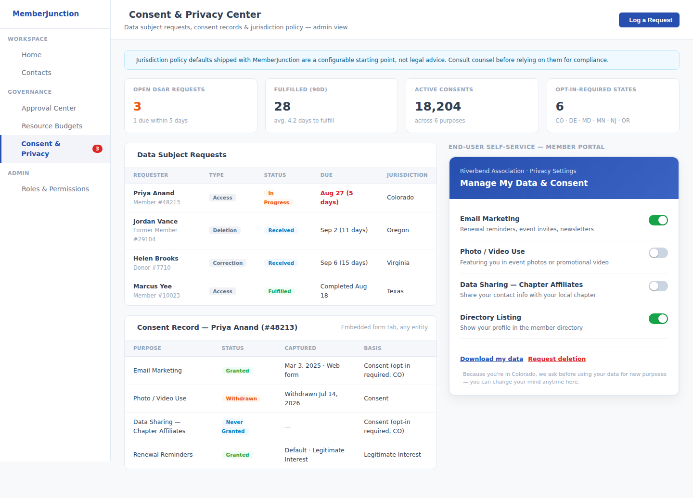

# Weekly Creative Exploration — 2026-08-14

Three framework-level ideas for MemberJunction, researched from the codebase, the ~97 open PRs
and ~257 open issues, prior exploration weeks, and external research on AI agent frameworks,
low-code/data platforms, association-management systems, and nonprofit/donor CRMs. See the parent
[`plans/weekly-exploration/README.md`](../README.md) for the ongoing log.

## Methodology

1. Read every prior week's plan docs in full (2026-08-07: Relationship Graph & Engagement Signal
   Engine, Decision Provenance Layer & AI Handoff Briefs, Accessibility-by-Default Framework
   Layer) to avoid re-proposing them. Idea 3 from that week was selected for implementation; its
   PR (**#3609**) is open but has had zero review activity in two weeks — worth a nudge, not a
   reason to re-propose the same idea.
2. Surveyed the GitHub repo directly: ~97 open PRs (themes: realtime/voice agents, PostgreSQL
   parity, integration/connector sync, CodeGen correctness, Explorer UI robustness, CI reliability)
   and ~257 open issues, most individually filed but with clear recurring meta-patterns — most
   notably "silent failures" (actions/CodeGen/sync reporting success while doing nothing or
   dropping data) and PostgreSQL/SQL-Server divergence. Confirmed neither of last week's unshipped
   ideas 1 or 2 (relationship graph, decision provenance) has any conflicting or duplicating
   in-flight work — both remain open runway for a future cycle.
3. Ran a codebase reconnaissance pass across Actions, TaskGraph, the AI Agent framework,
   Permissions, Communication/Notifications, Integration, and half a dozen `/plans` docs, looking
   for capability gaps and for patterns proven in one place but not yet extracted into a shared
   primitive. Found, among others: six independent rate-limiter implementations with no shared
   interface, AI-only cost tracking with no generalized resource-budget concept, an
   approval-status field scoped narrowly to AI-generated Action code with no generic run-time
   approval gate, and a complete absence of consent/privacy/DSAR entities anywhere in core
   metadata.
4. Ran external research across AI agent framework trends (LangGraph, CrewAI, AutoGen/Microsoft
   Agent Framework, Gartner's 2026 agent Hype Cycle), low-code/data platforms (n8n, Budibase,
   Supabase), association/nonprofit tech investment (Nimble AMS, Fonteva, Bloomerang, Virtuous),
   and current nonprofit-sector pain points (CCS Fundraising's 2026 Philanthropy Pulse, the
   post-2026 fragmented state privacy-law landscape).
5. Selected 3 ideas that are (a) genuinely generic, core-framework capabilities, (b)
   non-duplicative of anything shipped, in flight, or proposed in a prior week, and (c) each
   independently corroborated by *both* a concrete internal architectural gap and an external,
   sourced market/research signal — not just one or the other.

## The three ideas

### 1. [Universal Approval Gates for Actions, Agents & Workflows](./idea-1-universal-approval-gates.md)

A generic "pause and require sign-off" primitive — new `Approval Gate Definitions` +
`Approval Requests` entities and an `ApprovalGateEngine` — that any Action, AI Agent tool call, or
TaskGraph step can be configured to require human approval for, based on its runtime parameters
(e.g. "refunds over $500," "agent sends to more than 1,000 recipients"). Directly answers the
"tokenmaxxing"/runaway-agent-action failure mode that 2026 industry research (Gartner, n8n,
LangGraph) identifies as the dominant real-world problem in production AI agent deployments, and
closes a gap MJ's own `Action.CodeApprovalStatus` only partially covers (it gates whether AI-authored
code exists at all, not whether a specific run of already-approved code should proceed).

### 2. [Unified Resource Governance Engine](./idea-2-resource-governance-engine.md)

Generalizes MJ's AI-only cost-rollup pattern (`AIPromptRun.TotalCost`, `AIAgentRun.TotalCostRollup`)
into a framework-wide `Resource Budgets` / `Resource Usage Events` model and a
`ResourceGovernanceEngine`, so AI spend, external API calls, and storage all get one shared
budget/quota/alert mechanism instead of the six independent, undocumented rate-limiter
implementations the codebase currently carries. Directly targets the "surprise bill" and
runaway-cost failure mode that's now a named, benchmarked comparison axis across AI agent
frameworks in 2026 — and gives a resource-constrained nonprofit or association the same
cost-predictability tooling a well-funded engineering org would build for itself.

### 3. [Consent & Data Rights Primitive](./idea-3-consent-and-data-rights.md)

A jurisdiction-aware `Consent Records` / `Data Subject Requests` entity pair and a `ConsentEngine`
that lets any app built on MJ capture what a person consented to, resolve the applicable
jurisdiction's default rule (opt-in vs. opt-out), and fulfill access/deletion requests within a
tracked deadline — plus an end-user-facing self-service widget, not just an admin tool. Directly
responsive to the fact that, as of March 2026, six U.S. states (Colorado, Delaware, Maryland,
Minnesota, New Jersey, Oregon) offer little to no nonprofit exemption from comprehensive privacy
law, and that data/CRM fragmentation is now the single most-cited challenge in nonprofit tech
research (CCS Fundraising, 2026) — a gap the codebase confirms is currently unaddressed anywhere
in core MJ metadata.

## What we deliberately did not propose

Per the standing brief, none of the above is a specific business application — no "donor
compliance app," no "grants approval app." Each is a generic primitive (a runtime approval gate,
a metered-usage budget engine, a consent/data-rights layer) that any app built on MJ, in any
domain — healthcare, education, B2B SaaS, government-adjacent services — can configure and use.
The association/nonprofit framing is the motivating research lens, not the deliverable's scope.

We also did not re-propose last week's unshipped ideas 1 (Relationship Graph & Engagement Signal
Engine) or 2 (Decision Provenance Layer & AI Handoff Briefs) — both were confirmed this week to
have no conflicting or superseding in-flight work, so they remain live candidates for a future
cycle rather than something we need to re-pitch now.

## A note on idea interplay

These three ideas compose cleanly with each other and with prior weeks' proposals without
requiring one another to ship first:

- An Approval Gate's `TriggerCondition` can consult a Resource Budget's remaining headroom (e.g.
  "require approval once 80% of the monthly AI budget is consumed") — governance-on-governance,
  not a dependency.
- A resolved Approval Request or a granted/withdrawn Consent Record is exactly the kind of
  structured event last week's (unshipped) Decision Provenance layer would want to cite in a
  Handoff Brief — complementary future integration, not a blocker for either.
- All three new engines follow the same `BaseEngine`/metadata-driven-primitive shape already
  proven by VersionHistory, the Dupe engine, and Row-Level Security — no new architectural
  pattern is being introduced, only the pattern being applied to three under-served problems.

## Outstanding item from last week

PR **#3609** (Accessibility-by-Default, Phases 1–2) has been open since 2026-08-07 with no review
activity from its assigned reviewers. Flagging here so it isn't lost — not re-litigating the idea
itself, which was already decided.
