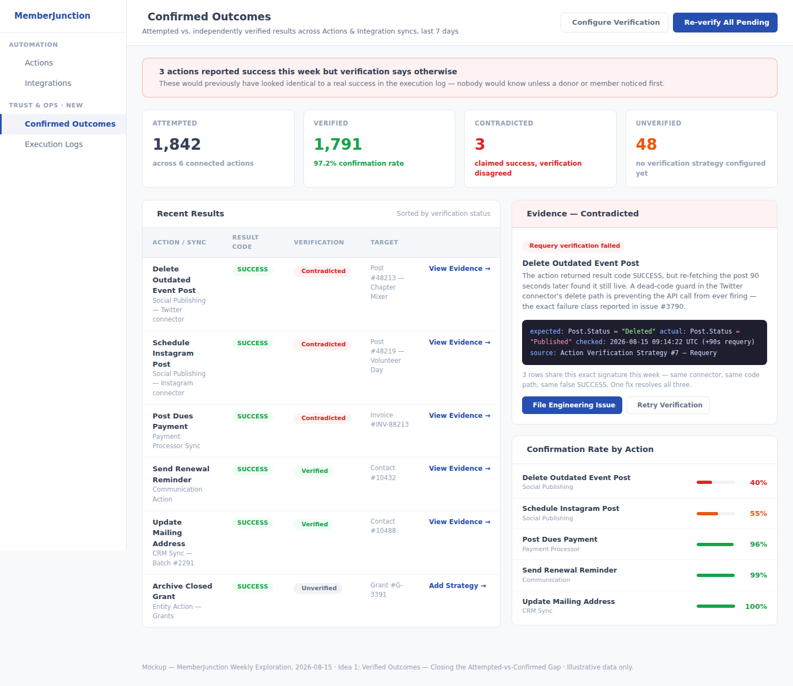
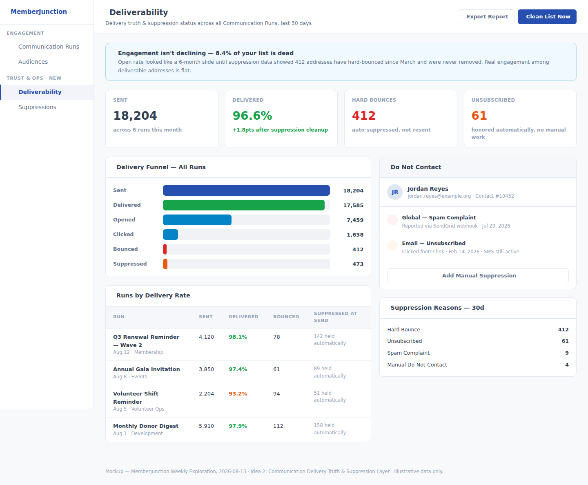
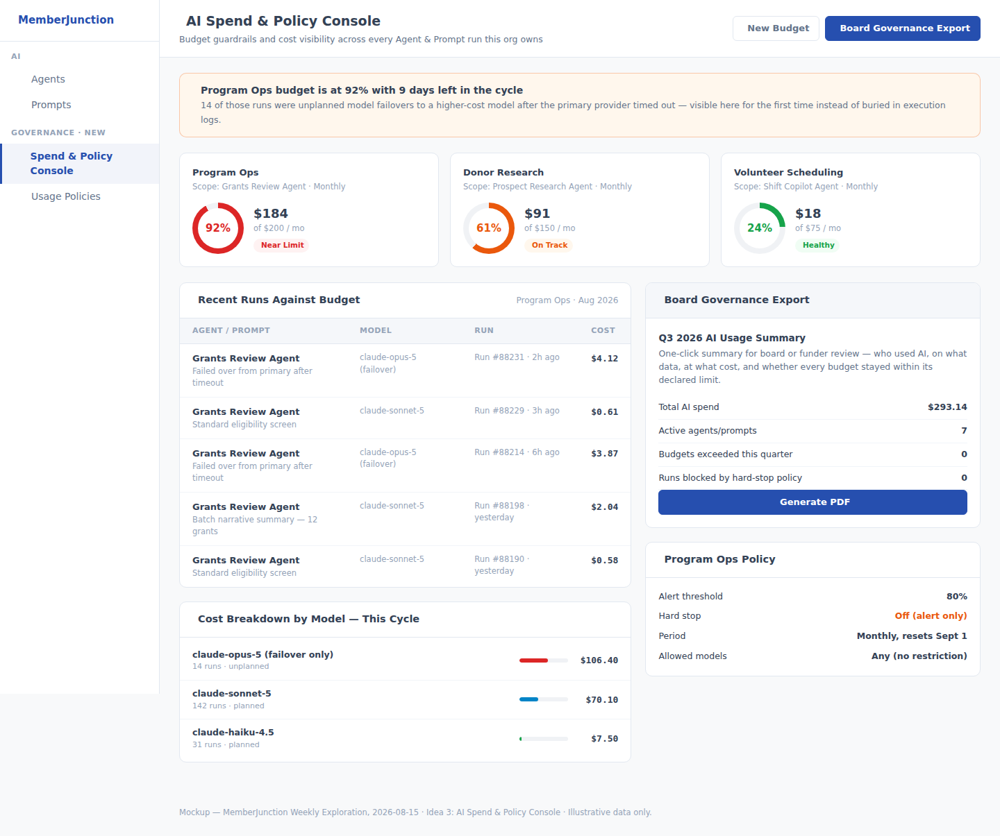

# Weekly Creative Exploration — 2026-08-15

Third installment of the recurring weekly ritual. See the parent
[`plans/weekly-exploration/README.md`](../README.md) for the ongoing log, and
[`2026-08-07`](../2026-08-07/) / [`2026-08-08`](https://github.com/MemberJunction/MJ/pull/3630) for the
first two weeks' ideas.

## Methodology

1. Read both prior weeks' logs in full, including PR #3630 (2026-08-08's ideas, still open at time of
   writing) directly from its branch, since it hadn't merged to `next` yet and wouldn't otherwise show
   up locally. Confirmed six ideas already claimed across the two prior weeks — Relationship Graph &
   Engagement Signal Engine, Decision Provenance & Handoff Briefs, Accessibility-by-Default (now in
   flight as PR #3609), CodeGen Decision Ledger, Open App Publish & Install Integrity, and Consent &
   Data Rights Ledger — and excluded all six from this week's candidates.
2. Ran three parallel research passes: (a) a full read of all 203 currently-open GitHub issues,
   clustered by root cause rather than by package; (b) a survey of all ~50 open PRs, with full reads of
   the 19 that are design-doc/plan-shaped rather than routine fixes, to map everything already in
   flight; (c) external research into 2025–2026 association/nonprofit sector trends, comparable
   platforms, and macro/regulatory pressure on the sector.
3. Cross-referenced candidate ideas against both the issue-cluster survey and the in-flight-PR survey
   to rule out anything already claimed — notably excluding PostgreSQL dialect parity (16 open issues,
   the single largest cluster) because `CLAUDE.md` explicitly designates PostgreSQL conversion as
   toolchain territory, not something a feature PR should hand-build tooling for.
4. Ran a targeted codebase grounding pass into the exact entities and fields already involved in AI
   cost tracking (`MJAIPromptRunEntity`, `MJAIAgentRunEntity`, `MJAIModelCostEntity`), communication
   sending (`MJCommunicationRunEntity`, `MJCommunicationLogEntity`, `BaseCommunicationProvider`), and
   action/integration execution results (`MJActionExecutionLogEntity`, `MJActionResultCodeEntity`,
   `MJCompanyIntegrationRunEntity`), so each proposal's architecture section states precisely what
   already exists versus what's a genuine gap, rather than guessing.
5. Selected 3 ideas that are each grounded in a concrete, currently-open issue cluster **and** a
   specific, cited external research finding — not one or the other — and are all genuinely generic
   core-framework capabilities rather than vertical business logic.

## The three ideas

### 1. [Verified Outcomes — Closing the Attempted-vs-Confirmed Gap in Actions & Integrations](./idea-1-verified-outcomes.md)

Every Action Execution Log and Integration Run already records a structured result — but it's entirely
self-reported by the code that ran. Issue #3790, filed this week, shows exactly how that fails in
production: a Twitter delete action and an Instagram schedule action both report `SUCCESS` while a
dead-code guard silently prevents anything from actually happening. This proposal adds an optional,
additive verification layer — `Verified` vs. `Contradicted` as first-class states — so that failure
mode is caught by the platform automatically instead of by an angry donor.

### 2. [Communication Delivery Truth & Suppression Layer](./idea-2-communication-delivery-truth.md)

49.5% of association professionals cite "communicating member benefits" as a top challenge, and
first-year renewal has fallen to 72% against an 82% overall rate (2026 sector benchmarking reports) —
numbers that get misread as an engagement crisis when the real problem is often a dead mailing list
nobody ever pruned. The codebase itself names this gap: a comment in `SendToAudience.ts` explicitly
says granular bounce/suppression handling "belongs in the underlying provider" — a gap that's never
been closed. This proposal closes it with delivery-event tracking and automatic, legally-necessary
suppression handling.

### 3. [AI Spend & Policy Console — Budget Guardrails and Governance Visibility](./idea-3-ai-spend-governance.md)

Organizations with budgets under $1M adopt AI at roughly half the rate of larger organizations — not
mainly because of tool cost, but because of a governance and visibility gap: only 24% have a formal AI
strategy, and only 10–24% have any written AI policy at all, right as nonprofit boards start standing
up AI risk committees. MJ already computes accurate per-run AI cost (`TotalCost`/`TotalCostRollup` on
existing entities) — what's missing is budgets, alerts, and a board-ready governance report built on
top of data the framework already has.

## What we deliberately did not propose

No "donor CRM," no "grants portal," and — per this week's specific finding — no PostgreSQL parity
tooling, since that's explicitly toolchain territory owned by the release-time converter, not a
feature PR. Idea 1 is a fix to the shared Action/Integration execution contract every app inherits
identically. Idea 2 is a fix to the shared Communication engine every app that sends anything goes
through. Idea 3 is a generic budget/governance layer over AI execution data every AI-powered app
already produces. Only the specific verification strategies, suppression policies, and budget amounts
an org configures are domain-specific — exactly the same "framework provides the primitive, app
builder supplies the metadata" pattern used everywhere else in MJ.

## Outcome

Pending review.
