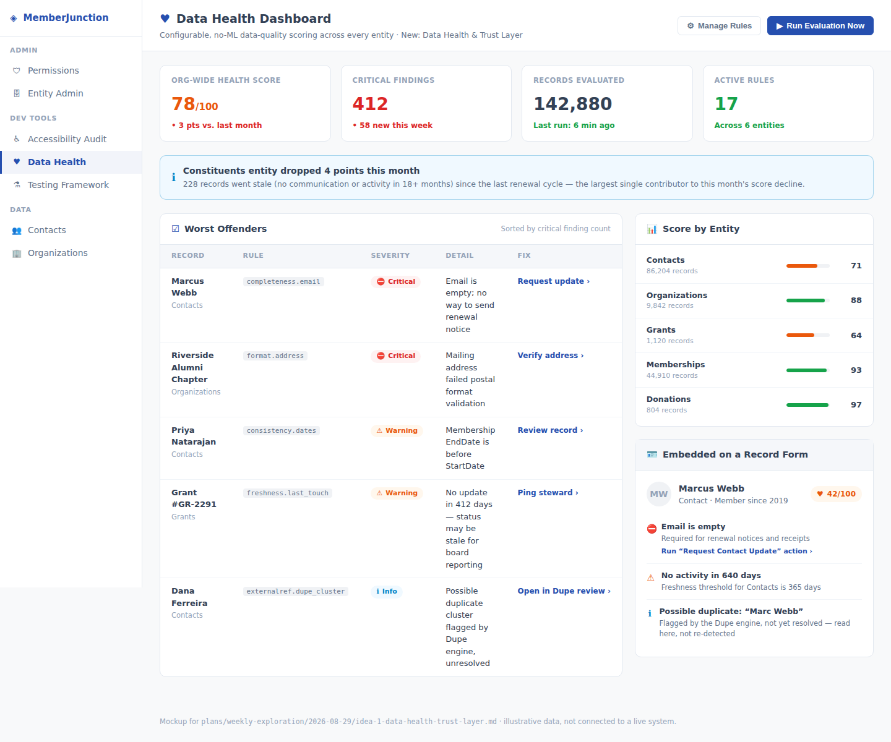
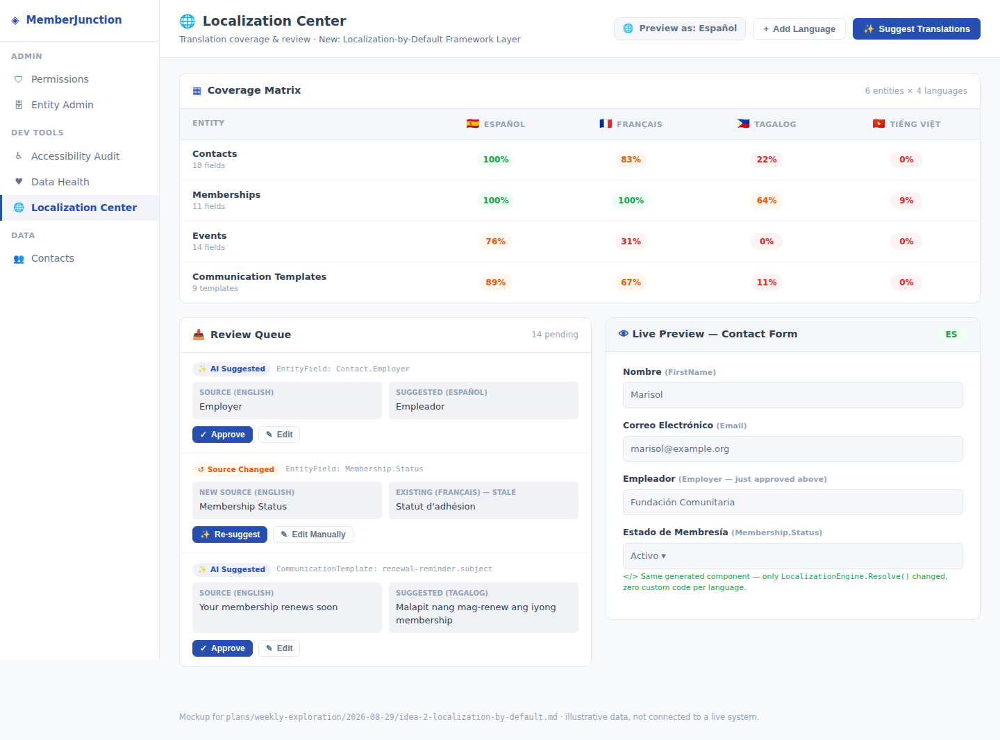
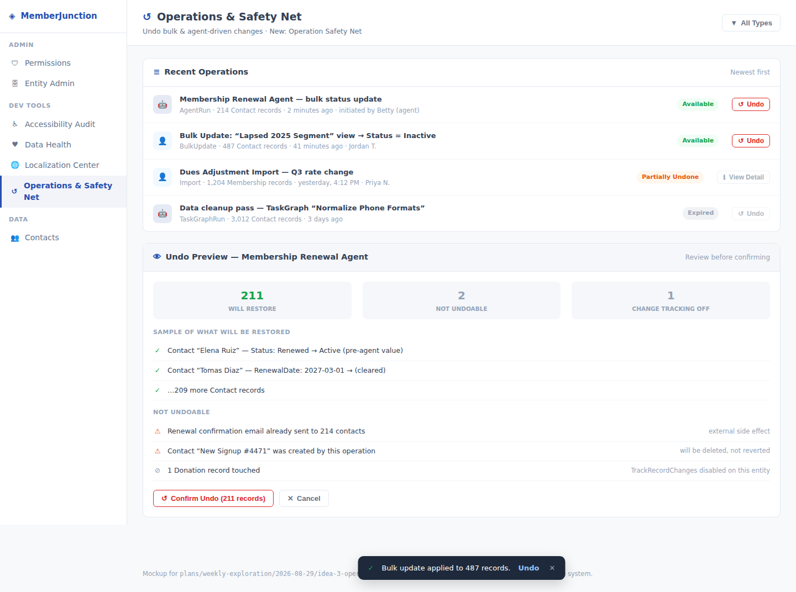

# Weekly Creative Exploration — 2026-08-29

Three framework-level ideas for MemberJunction, researched from the codebase, in-flight PRs/plans,
open issues, and external research on nonprofit/association data practices, association-management
software, and 2026 AI-agent-safety literature. This is the third installment of this recurring
exercise — see the parent [`plans/weekly-exploration/README.md`](../README.md) for the ongoing log.

## Methodology

1. Read both prior weeks in full before proposing anything new: the 2026-08-07 ideas (merged into
   `/plans`; idea 3, Accessibility-by-Default, is now in progress as **PR #3609**, which has stalled
   with no review activity since it opened) and the 2026-08-14 ideas (**PR #4009**, still open and
   unmerged — Universal Approval Gates, Unified Resource Governance Engine, Consent & Data Rights
   Primitive). None of this week's three ideas duplicates or depends on landing any of those six.
2. Surveyed the ~100 currently open PRs and the most recent ~100 of the ~262 open issues for themes
   and recurring gaps — in particular the very large volume of realtime/voice-agent hardening, CodeGen
   robustness fixes, and PostgreSQL-parity work already in flight (all left alone; PostgreSQL tooling
   is explicitly build-engineer territory per this repo's own `CLAUDE.md`, not something a feature
   idea should touch).
3. Ran a codebase reconnaissance pass across `packages/AI/Vectors/Dupe` (duplicate detection, to make
   sure Idea 1 doesn't re-solve it), `packages/CodeGenLib/src/Angular` (the CodeGen template layer
   the accessibility work already proved is the right leverage point), `packages/Scheduling/engine/
   src/drivers` (the scheduled-job driver pattern, reused by two of this week's three ideas rather
   than inventing new scheduling infrastructure), `plans/record-changes-restore/plan.md` (the
   just-shipped single-record restore capability Idea 3 generalizes), `plans/transaction-group-
   migration.md`, and `packages/Actions/CLAUDE.md` (the Actions-as-boundary philosophy every idea's
   Action-based extensibility points follow).
4. Ran external research on nonprofit data-quality trends going into 2026, multilingual support in
   association-management software, and 2026 enterprise AI-agent rollback/undo safety practice —
   summarized with sources at the bottom of each idea doc's problem framing.
5. Selected 3 ideas that are (a) genuinely generic, core-framework capabilities — never a specific
   vertical app, (b) non-duplicative of all six ideas proposed in the prior two weeks and of every
   in-flight PR/plan surveyed, and (c) each grounded in both a concrete internal architectural gap
   and a sourced external signal.

## The three ideas

### 1. [Data Health & Trust Layer](./idea-1-data-health-trust-layer.md)

A generic, no-ML-required data-quality scoring engine — configurable Completeness/Format/Freshness/
Consistency rules evaluated against any entity, a per-record health badge, and an org-wide Data
Health dashboard — deliberately distinct from the Dupe engine's duplicate-*identity* detection.
Answers a problem nonprofit data-management research shows getting sharply worse (data/CRM quality
complaints more than doubled between 2024 and 2026), by giving every app built on MJ an ambient
signal for which records need attention before a mailing goes out or a board report gets pulled.

### 2. [Localization-by-Default Framework Layer](./idea-2-localization-by-default.md)

Applies the exact playbook the accessibility-by-default work (2026-08-07 idea 3) established — fix
it once at the CodeGen template layer, every app inherits it — to language access instead of
disability access: a generic `Languages`/`Localized Strings` substrate with staleness detection, an
AI-assisted (human-approved) translation suggestion action, and a Localization Center dashboard.
Targets a gap current association-management platforms treat as a bolt-on rather than a default,
and a real compliance dimension (Title VI/LEP guidance) for federally-funded nonprofits and public
institutions serving multilingual communities.

### 3. [Operation Safety Net — Undo for Bulk & Agent-Driven Changes](./idea-3-operation-safety-net.md)

Generalizes the just-shipped single-record "restore prior version" capability to compound
operations — a bulk edit, an AI agent's tool-call sequence, a TaskGraph run — via a lightweight
`Operations` ledger that groups existing `RecordChange` rows and reuses the existing restore
machinery, with honest partial-failure reporting rather than a false "undo succeeded." Directly
responds to 2026 enterprise AI-safety consensus that every consequential agent action should be
undoable, and is the explicit *recovery* complement to 2026-08-14's still-unmerged *preventive*
Approval Gates idea (PR #4009) — neither idea substitutes for the other.

## What we deliberately did not propose

No specific business application — no "donor data-hygiene app," no "translation management app," no
"undo button app." Each idea is a generic primitive (a rules-based scoring engine, a key→language→
text resolution layer, an operation-grouping ledger over existing change-tracking data) that any app
built on MJ, in any domain, can configure and use. The association/nonprofit framing is the
motivating research lens, not the deliverable's scope — as with every prior week.

We also deliberately did not re-propose any of the six ideas from the prior two weeks. Ideas 1 and 2
from 2026-08-07 (Relationship Graph & Engagement Signal Engine; Decision Provenance Layer & AI
Handoff Briefs) remain live, unshipped candidates with no new conflicting work found this week. All
three ideas from 2026-08-14 (PR #4009) remain open and unreviewed; we did not duplicate any of them,
and Idea 3 this week explicitly cross-references Idea 1 of that set (Approval Gates) as a
complementary-but-independent capability rather than overlapping territory.

## A process note

**PR #3609** (the 2026-08-07 idea selected for implementation, Accessibility-by-Default) and
**PR #4009** (the full 2026-08-14 exploration) are both still open with no recent review/decision
activity. This is worth a maintainer's attention independent of this week's new ideas — a backlog of
unreviewed exploration output undermines the value of continuing to generate more of it. Flagged
here, not re-litigated further, per the same pattern 2026-08-14 used when it flagged PR #3609.
