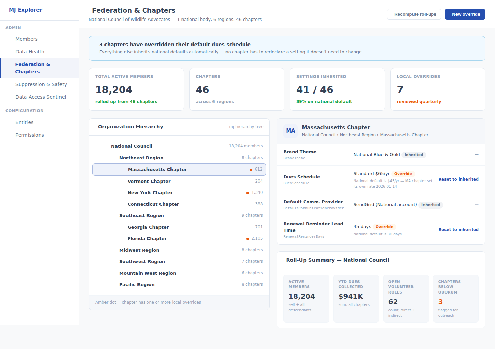
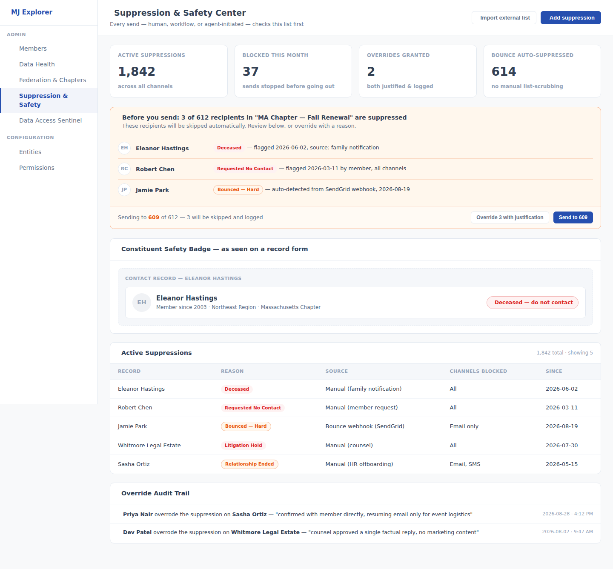
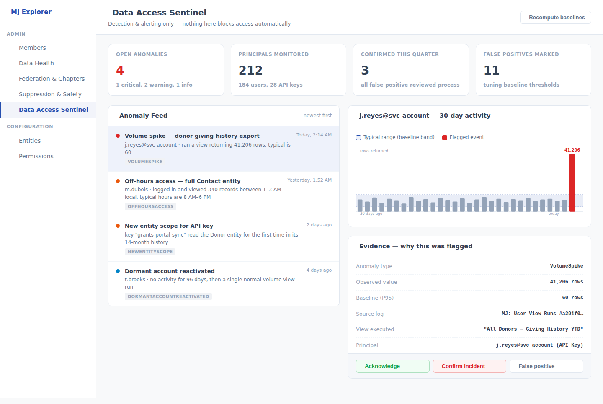

# Weekly Creative Exploration — 2026-09-05

Three framework-level ideas for MemberJunction, researched from the codebase, in-flight PRs/issues,
all four prior exploration weeks, and external research on federated association structures,
nonprofit donor-data trust failures, and 2026 small-organization cybersecurity trends. This is the
fourth installment of this recurring exercise — see the parent
[`plans/weekly-exploration/README.md`](../README.md) for the ongoing log.

## Methodology

1. Read all nine prior ideas in full before proposing anything new: 2026-08-07 (Relationship Graph
   & Engagement Signal Engine; Decision Provenance Layer & AI Handoff Briefs; Accessibility-by-
   Default, now **PR #3609**), 2026-08-14 (Universal Approval Gates; Unified Resource Governance
   Engine; Consent & Data Rights Primitive, all three in **PR #4009**), and 2026-08-29 (Data Health
   & Trust Layer; Localization-by-Default; Operation Safety Net). None of this week's three ideas
   duplicates, competes with, or depends on any of those nine.
2. Surveyed the ~100 open PRs and the most recent ~100 of the ~269 open issues for recurring themes
   — in particular native tool calling, Field-Level Security (PR #3367), Predictive Studio's typed
   ML component work, a long tail of realtime/voice-agent hardening, and a cluster of principal/
   context-user resolution bugs (#4231, #4233, #4234, #4236, #4237, #4247) — all left alone; none
   of this week's ideas touches agent tool-calling internals, ML modeling, realtime infrastructure,
   or user/principal resolution.
3. Checked three specific open PRs for overlap risk before finalizing: **#3044** (Agent Trust, By
   Default — pre-action consent for irreversible agent tool calls: a different problem from this
   week's Idea 3, which is post-hoc behavioral pattern detection over already-authorized activity,
   not another pre-action gate), **#3367** (Field-Level Security — static, declarative column-level
   permission: complementary to, not overlapping with, Idea 3's behavioral-anomaly detection over
   already-permitted access), and **#2580** (Legacy Backup POC pathway — unrelated).
4. Ran a codebase reconnaissance pass confirming three specific leverage points before designing
   around them: `BaseEntity`'s existing generic self-referencing hierarchy primitive
   (`GetDescendants()`/`GetAncestors()`, `packages/MJCore/src/__tests__/baseEntity.hierarchy.test.ts`)
   for Idea 1; `SendToAudience`'s existing `SkippedRecords` reporting shape
   (`packages/Actions/CoreActions/src/custom/communication/send-to-audience.action.ts`) as the one
   real send choke point for Idea 2; and the four access/execution logs MJ already ships —
   `MJ: Audit Logs`, `MJ: User View Runs`, `MJ: User Record Logs`, `MJ: API Key Usage Log` — as the
   raw signal source for Idea 3, so none of the three ideas invents infrastructure that already
   exists.
5. Ran external research on federated/multi-chapter association data-infrastructure gaps,
   nonprofit donor-data trust failures (deceased-donor mailings, unrespected do-not-contact
   requests), and 2026 small-organization cybersecurity/ransomware statistics — summarized with
   sources at the bottom of each idea doc's problem framing.
6. Selected 3 ideas that are (a) genuinely generic, core-framework capabilities — never a specific
   vertical app, (b) non-duplicative of all nine ideas proposed in the prior three weeks and of
   every in-flight PR/plan surveyed, and (c) each grounded in both a concrete internal
   architectural leverage point and a sourced external signal.

## The three ideas

### 1. [Federated Hierarchy & Roll-Up Governance Layer](./idea-1-federated-hierarchy-governance.md)

A governance layer — setting inheritance with per-node override, configurable roll-up aggregates,
and a permission-cascade provider for the in-flight Unified Permissions engine — built entirely on
top of `BaseEntity`'s existing generic hierarchy primitive, rather than inventing a new tree
structure. Answers the data-infrastructure gap 2026 research names directly for federated
organizations: "most federated organisations don't have the data infrastructure to support
data-driven governance, with data scattered across chapter spreadsheets and national office filing
cabinets."

### 2. [Communication Suppression & Sensitive-Context Safety Engine](./idea-2-communication-suppression-safety-engine.md)

An always-on, reason-coded suppression check — deceased, requested-no-contact, litigation hold,
bounced, relationship-ended — wired into the one real send choke point every human, workflow, and
AI-agent-initiated message already passes through, with a justification-required override audit
trail. Targets one of the most human-costly, most-cited CRM failures in the sector: mailing a
renewal notice to someone who has died, or contacting someone who explicitly asked to be left
alone.

### 3. [Data Access Sentinel — Anomalous Access & Bulk Export Detection](./idea-3-data-access-sentinel.md)

A behavioral-baseline scoring and alerting layer that reads MJ's existing audit/access logs — no
new logging infrastructure — to flag when an already-authorized account's activity diverges
sharply from its own history (a bulk export at 2 a.m., a service account touching an entity it's
never read before). A detection-only complement to Field-Level Security and RLS, responding
directly to 2026 data showing small organizations are now the most-targeted, least-defended segment
for ransomware and breaches.

## What we deliberately did not propose

No specific business application — no "chapter management app," no "do-not-mail app," no "security
monitoring app." Each idea is a generic primitive (a governance layer over an existing hierarchy
primitive, a reason-coded suppression check over an existing send path, a behavioral-baseline
scoring engine over existing audit logs) that any app built on MJ, in any domain, can configure and
use. The association/nonprofit framing is the motivating research lens, not the deliverable's
scope — as with every prior week.

We also deliberately did not re-propose any of the nine ideas from the prior three weeks, and
checked each of this week's three against the specific open PRs closest to their territory (#3044,
#3367, #2580) to confirm complementary rather than overlapping scope, as detailed in Methodology
above.

## A process note

**PR #3609** (2026-08-07's Accessibility-by-Default, Phases 1–2 shipped and ready for final review)
and **PR #4009** (the full 2026-08-14 exploration) both remain open with no review activity since
2026-08-23/24 — now **two full weeks** of silence on both. This was already flagged in the
2026-08-14 and 2026-08-29 logs; repeating it a third time because a growing backlog of unreviewed,
ready-to-decide exploration output undermines the value of this exercise more than any individual
week's new ideas can offset. Flagged here again, not re-litigated further.
