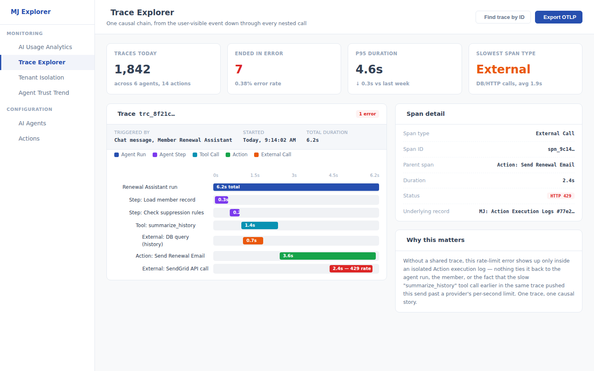
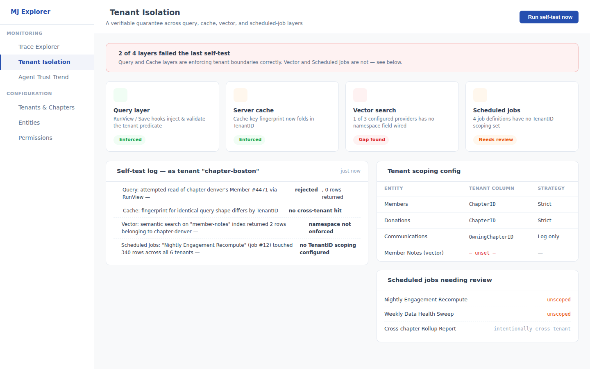
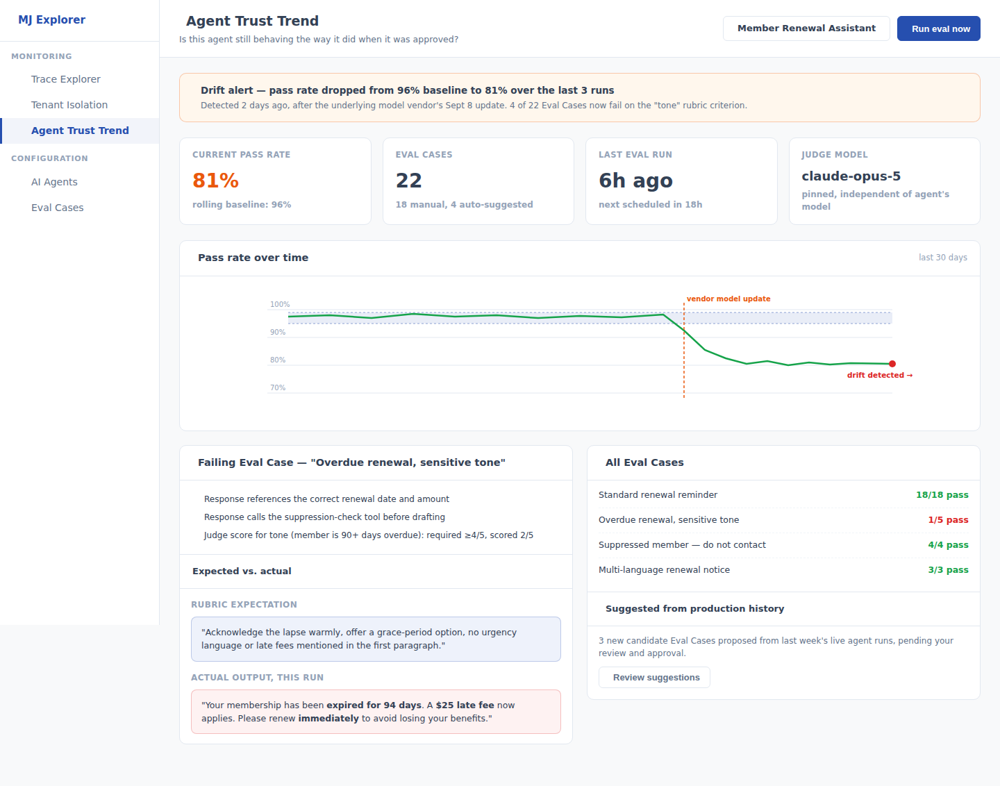

# Weekly Creative Exploration — 2026-09-12

Three framework-level ideas for MemberJunction, researched from the codebase, in-flight PRs/issues,
all five prior exploration weeks, and external research on AI-agent observability, multi-tenant SaaS
risk, and 2026 agentic-AI trust/drift literature. This is the fifth installment of this recurring
exercise — see the parent [`plans/weekly-exploration/README.md`](../README.md) for the ongoing log.

## Methodology

1. Read all twelve prior ideas in full before proposing anything new: 2026-08-07 (Relationship Graph
   & Engagement Signal Engine; Decision Provenance Layer & AI Handoff Briefs; Accessibility-by-
   Default, **PR #3609**), 2026-08-14 (Universal Approval Gates; Unified Resource Governance Engine;
   Consent & Data Rights Primitive — all three documented in the now-**merged (plan-only) PR #4009**,
   none implemented), 2026-08-29 (Data Health & Trust Layer; Localization-by-Default; Operation
   Safety Net), and 2026-09-05 (Federated Hierarchy & Roll-Up Governance Layer; Communication
   Suppression & Sensitive-Context Safety Engine; Data Access Sentinel). None of this week's three
   ideas duplicates, competes with, or depends on any of those twelve.
2. Surveyed the ~60 open PRs and ~317 open issues for current themes and checked the status of every
   PR this log has previously flagged: **#3609** (Accessibility) is still open and stalled, now with
   a "dirty" (conflicting) mergeable state; **#4009** merged 2026-09-06 as a plan-only PR — none of
   its three ideas has a follow-up implementation PR; **#3044** (Agent Trust) is still open and stale
   since 2026-07-04; **"Field-Level Security" #3367 merged 2026-09-11** (just landed, with an
   immediate cluster of follow-up bug issues, #4297/#4298/#4347–4350/#4400 — left entirely alone,
   this is FLS's own bug-fix churn, not new-idea territory); **#2580** (Legacy Backup) is still open
   and stale.
3. Scanned specifically for candidate white space across multi-tenancy, billing, marketplace/plugin
   ecosystem, observability/tracing, GDPR/consent, search/RAG, notifications, mobile/offline, AI
   cost governance, and i18n. Found AI cost/usage analytics and permissions (entity/field/row-level)
   already saturated with fresh in-flight work (**PR #4402**, the **#3367** aftermath) — avoided.
   Found observability/tracing (a two-year-stale **#2281**), multi-tenancy (a two-year-stale
   **#1963**), and post-hoc agent-quality monitoring effectively unaddressed — pursued.
4. Ran a codebase reconnaissance pass confirming three specific gaps with file-level evidence before
   designing around them: zero `TraceID`/`SpanID`/`OpenTelemetry` anywhere in the repo despite rich
   *per-subsystem* run logging (`MJAIAgentRunEntity`, Action execution logs) for Idea 1; a
   well-built, fail-closed tenant boundary at the query layer
   (`packages/MJServer/src/multiTenancy/index.ts`) that simply never reaches the cache fingerprint,
   the vector-namespace config, or `ScheduledJobEngine` for Idea 2; and the deterministic
   `integration-golden-diff.mjs` regression tier (build-time, exact-match) confirmed structurally
   distinct from — and not a substitute for — sampling live, non-deterministic agent output for
   quality drift over time, for Idea 3.
5. Ran external research on 2026 AI-agent-observability platform conventions (nested trace
   waterfalls, framework-agnostic trace-schema convergence), multi-tenant SaaS data-leakage risk, and
   2026 agentic-AI trust/drift literature (91% of ML models measurably drift; Gartner's 40%+
   agentic-AI-project-cancellation-by-2027 projection) — summarized with sources at the bottom of
   each idea doc's problem framing.
6. Selected 3 ideas that are (a) genuinely generic, core-framework capabilities — never a specific
   vertical app, (b) non-duplicative of all twelve ideas proposed in the prior four weeks and of
   every in-flight PR/plan surveyed, and (c) each grounded in both a concrete internal architectural
   gap and a sourced external signal.

## The three ideas

### 1. [Execution Trace & Observability Layer](./idea-1-execution-trace-observability.md)

Additive `TraceID`/`SpanID`/`ParentSpanID` correlation threaded through the execution-tracking
entities MJ already has (`AI Agent Runs`, `AI Agent Run Steps`, Action execution logs) — never a
duplicate logging pipeline — plus a `TraceExplorer` waterfall dashboard and an optional OpenTelemetry
(OTLP) exporter for orgs that already run Honeycomb/Datadog/Jaeger. Answers a gap MJ's own backlog
has asked for since **#2281** and that 2026's AI-agent-tooling industry converged on as standard
practice: a single causal chain from a user-visible event through every nested agent step, tool call,
and action, so debugging a slow or failed automation doesn't mean manually cross-referencing four
separate logs by timestamp.

### 2. [Tenant Isolation Guarantee Layer](./idea-2-tenant-isolation-guarantee.md)

Closes three specific gaps around MJ's already well-built, fail-closed tenant boundary at the query
layer — a cache-key fingerprint that never folds in `TenantID`, vector-search namespacing that's a
per-provider opt-in only Pinecone actually exercises, and a `ScheduledJobEngine` with no tenant
concept at all — plus a `TenantIsolationAuditor` static scan and runtime self-test that turns "we
believe isolation holds" into something an operator can verify on demand. Directly targets the
highest-stakes failure mode for any MJ deployment hosting multiple chapters, client orgs, or
customers on one shared instance: a solid guarantee at one layer creating false confidence that the
whole system is tenant-safe when three other layers the same request's data flows through aren't
covered at all.

### 3. [Agent Behavioral Drift & Regression Detection Engine](./idea-3-agent-behavioral-drift-detection.md)

Rubric-based `Agent Eval Cases`, scheduled re-evaluation of an Agent's *current* live configuration
against a rolling baseline pass rate, and `Drift Alert`s through the existing `NotificationEngine`
when quality measurably degrades — answering the question MJ's existing deterministic
`integration-golden-diff` tier and every pre-action gate (Approval Gates, Agent Trust) structurally
cannot: is the agent that earned trust in March still behaving the same way in September, after a
silent vendor model update or an unreviewed prompt edit. Directly responsive to 2026 findings that
91% of ML models measurably drift over time and Gartner's projection that 40%+ of agentic AI
projects will be canceled by 2027 over governance failures — the exact failure mode a lean,
resource-constrained organization has the least capacity to catch on its own.

## What we deliberately did not propose

No specific business application — no "chapter hosting app," no "renewal-email quality app," no
"observability dashboard product." Each idea is a generic primitive (a correlation-ID layer over
execution logs MJ already writes, a hardening pass closing gaps around an existing tenant-boundary
mechanism, a rubric-based evaluation engine reusing the existing scheduled-job and notification
infrastructure) that any application built on MJ, in any domain, can configure and use. The
association/nonprofit framing is the motivating research lens for problem selection, not the
deliverable's scope — as with every prior week.

We also deliberately did not re-propose any of the twelve ideas from the prior four weeks, did not
touch AI cost/usage analytics (actively in flight, **PR #4402**) or entity/field/row-level
permissions (just merged, actively in bug-fix churn from **#3367**'s aftermath), and did not treat
observability or agent-quality monitoring as competing with **Universal Approval Gates** or **Agent
Trust** (**#4009**/**#3044**) — both of those remain pre-action permission gates; this week's ideas
are entirely post-hoc/detection-layer, the same "prevent vs. observe/detect" split this log has used
consistently since 2026-08-29.

## A process note

**PR #3609** (Accessibility-by-Default) has now been open for **five weeks** with no review activity
and has developed merge conflicts ("dirty" mergeable state) since last week's check — the backlog
this log has flagged three times running is now actively rotting, not just waiting. **PR #4009**
(2026-08-14's full exploration) merged as a plan-only PR on 2026-09-06, which resolves the "unreviewed
PR" concern for that specific artifact, but means all three of its ideas (Approval Gates, Resource
Governance, Consent & Data Rights) remain **completely unimplemented** with no follow-up PR yet —
worth noting since "merged" and "shipped" are not the same thing here. Flagging both again, briefly,
not re-litigating further.

## Sources consulted this week

See the "Sources" section at the bottom of each idea doc for full citations. Headline external
findings: [Braintrust's 2026 agent observability guide](https://www.braintrust.dev/articles/agent-observability-complete-guide-2026)
on nested-trace-waterfall UX becoming standard; [IBM's research on agentic drift](https://www.ibm.com/think/insights/agentic-drift-hidden-risk-degrades-ai-agent-performance)
(91% of ML models measurably drift); and the [AddWeb Solution 2026 nonprofit-AI-agent guidance](https://www.addwebsolution.com/blog/agentic-ai-for-nonprofits)
citing Gartner's 40%+ agentic-AI-project-cancellation-by-2027 projection.
