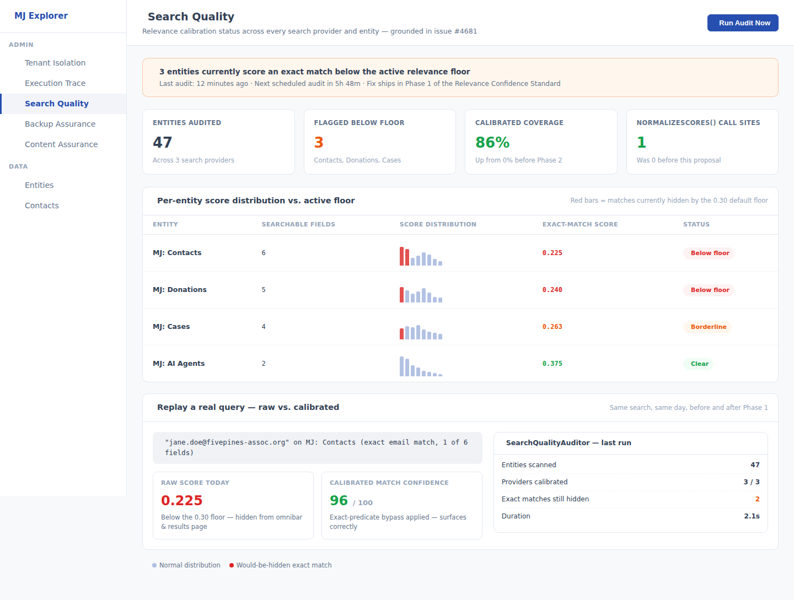
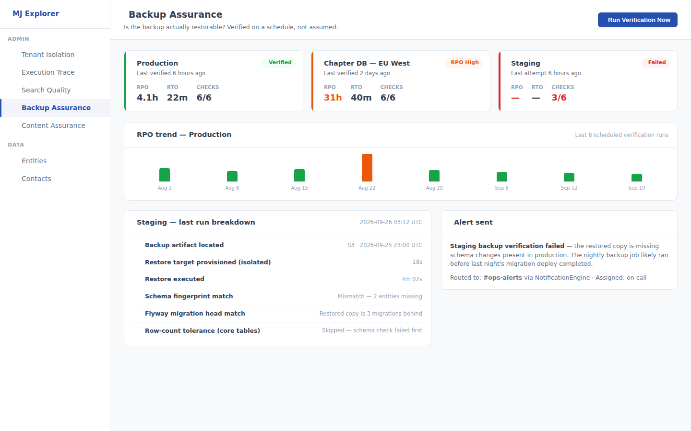
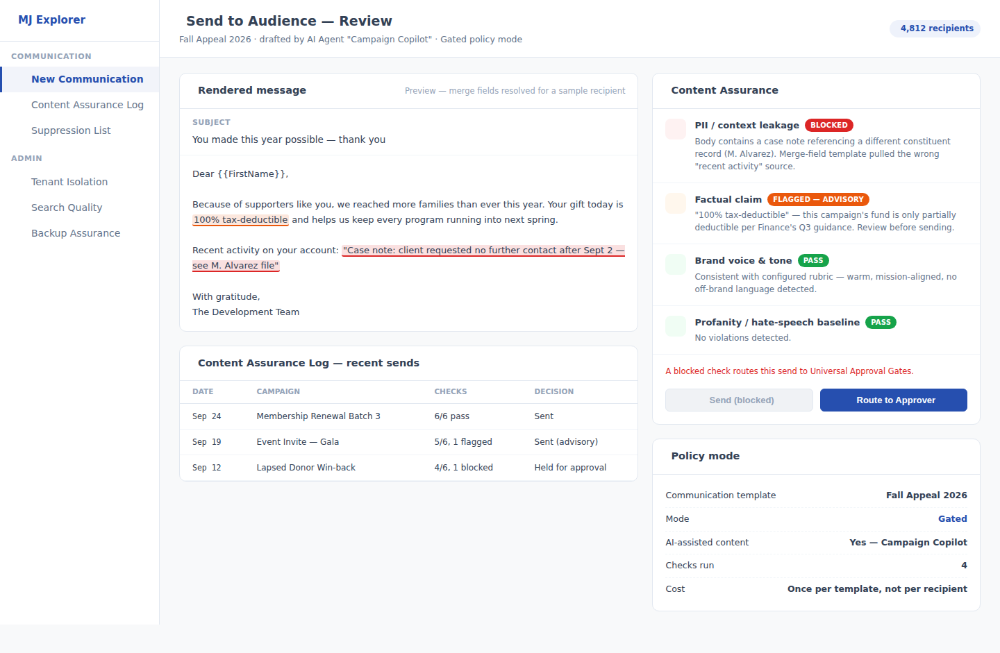

# Week of 2026-09-26

Three framework-level improvement ideas, grounded in this week's open GitHub issues, the active PR
backlog, and 2026 industry/regulatory research — continuing the recurring exploration started in
[`../README.md`](../README.md).

## Method this week

- Read all six prior weeks' idea docs (`2026-08-07` through `2026-09-19`) end to end before proposing
  anything, to avoid re-proposing Relationship Graphs, Decision Provenance, Accessibility, Approval
  Gates, Resource Governance, Consent & Data Rights, Data Health, Localization, Operation Safety Net,
  Federated Hierarchy Governance, Communication Suppression, Data Access Sentinel, Execution Trace
  Observability, Tenant Isolation, Agent Drift Detection, Execution Blast-Radius Containment,
  Encryption Key Lifecycle Governance, or AI Confidence Disclosure — all sixteen already proposed
  (fifteen from 2026-08-07 through 2026-09-12, plus three more from 2026-09-19's not-yet-merged
  **PR #4612**, read directly off that branch since it hadn't landed on `next` yet).
- Noted that 2026-09-19's three ideas were reviewed by AN-BC this week and marked **approved for
  implementation, now in progress** — the first time this log's proposals have moved past "interesting
  but not a current priority" into active work. Treated as a signal to keep grounding ideas in
  concrete, filed evidence rather than speculative framing, which is also why all three ideas below
  cite a specific open issue or PR as their anchor.
- Pulled the current open PR list (~40 most recently updated, of ~369 open) and the 50 most recently
  filed/updated open issues (of 399 open) directly from GitHub, and read two issues and one PR in full
  that looked like undocumented framework gaps rather than routine bug fixes: **#4681** (search
  relevance scoring), **#2580** (legacy backup POC pathway — read specifically to confirm a backup-
  restore-assurance idea would *not* duplicate it), and **#4568** (`compose:email`, read for its
  human-in-the-loop design principle).
- Verified each idea against the actual codebase (not just issue text) before writing it up:
  `EntitySearchProvider.ts`/`providerBase.ts`/`SearchFusion.ts` for Idea 1's scoring-arithmetic gap; a
  repo-wide search confirming **zero** backup/restore-verification code exists anywhere in the
  codebase for Idea 2; `SendToAudience.ts` and the repo's own unwired
  `content-moderation.prompt.md` demo file for Idea 3.
- Ran targeted 2026 web research for external grounding: enterprise RAG/retrieval-trust literature,
  nonprofit disaster-recovery and backup-testing statistics, and nonprofit AI-governance/brand-safety
  guidance — summarized with sources at the bottom of each idea doc.

## This week's three ideas

### 1. [Search & Retrieval Relevance Confidence Standard](./idea-1-search-relevance-confidence-standard.md)

A filed, open bug (**#4681**) shows MJ's search scoring is arithmetically broken in a way that hides
real matches: an exact email match can score lower than a loose partial match purely because of how
many fields an entity declares searchable, and full-text vs. entity search return scores on different
scales with no normalization actually wired in. Proposes fixing the arithmetic (the bug fix itself),
then a shared `RelevanceCalibrator` so every search provider's score becomes a comparable 0–100 Match
Confidence, plus a `SearchQualityAuditor` that keeps checking this stays true as new entities and
providers are added — closing a gap the in-flight Search Scopes & RAG+ agent-integration plan
implicitly depends on but doesn't itself address.

### 2. [Backup & Restore Assurance Layer](./idea-2-backup-restore-assurance-layer.md)

MJ has an opinion about nearly everything that touches its own data — except whether the backups
protecting that data actually restore. Grounded in 2026 disaster-recovery research (62% of
organizations don't regularly test restores; the average organization hasn't verified one in 18+
months; a documented nonprofit case lost four days and $22,000 to a backup that turned out to be
corrupt only when disaster struck), proposes a `BackupAssuranceEngine` that periodically restores a
real backup to a disposable, isolated target, runs an integrity-check suite, and reports a real RPO —
turning "we believe our backups work" into something an operator can see evidence for. Explicitly
distinct from #2580 (legacy-system-backup-to-POC onboarding, a different problem entirely).

### 3. [Outbound AI Content Assurance Gate](./idea-3-outbound-content-assurance-gate.md)

`compose:email` (**#4568**) got the human-in-the-loop instinct right for one AI-drafted email a user
reviews before sending — but `SendToAudience`, the bulk-fan-out path every mass communication and
agent-triggered campaign goes through, has no equivalent moment of pause before content reaches an
entire audience at once. Proposes a pluggable, off-by-default `ContentAssurance` pass at that single
choke point — PII/context-leakage scanning first, then advisory factual-claim flagging and brand-voice
checks — with a `Gated` mode that routes flagged sends to Universal Approval Gates (#4009) once that
mechanism exists. Grounded in 2026 findings that 92% of nonprofits already use AI tools while 76% have
no governance policy for it, and the sector's own guidance that AI-assisted external content needs
human review before every send.

## What we deliberately did not propose

No specific business application — no "donor-appeal-writer app," no "backup-monitoring product," no
"search-tuning consultancy." Each idea is a generic primitive (a scoring-arithmetic fix and calibration
layer under the search engine every app already calls, a restore-and-verify pipeline any deployment can
schedule, a pluggable pre-send check at one existing communication choke point) that any application
built on MJ, in any domain, can configure and use. The nonprofit/association framing is the motivating
research lens for problem selection, not the deliverable's scope — as with every prior week.

We also deliberately did not re-propose any of the sixteen ideas from the prior six weeks (including
the three from 2026-09-19's not-yet-merged PR #4612), did not touch AI Confidence Disclosure's own
subsystem (approved, in progress — this week's Idea 1 and Idea 3 each explicitly reuse its planned
`AIConfidenceBadge` visual language rather than inventing a competing one), and did not treat Idea 3 as
overlapping Communication Suppression (2026-09-05) — that engine governs *who* receives a send; this
one governs *what* is being sent — an explicit "who vs. what" split the idea doc states directly.

## A process note

**2026-09-19's three ideas were approved and are now in progress** — worth flagging as a genuinely
good sign for this recurring exercise, and as the reason this week leaned even harder on citing a
specific open issue or PR per idea rather than a purely speculative framing. Separately, **PR #3609**
(Accessibility-by-Default, 2026-08-07) remains open, unreviewed, and — as of last week's check — in a
conflicting ("dirty") mergeable state; this is now the **seventh week** this log has flagged it. **PR
#4009** (2026-08-14's Approval Gates/Resource Governance/Consent & Data Rights) remains merged as a
plan only, with no follow-up implementation PR for any of its three ideas. Flagging both again,
briefly, not re-litigating further.

## Sources consulted this week

See the "Sources" section at the bottom of each idea doc for full citations. Headline external
findings: [PremAI's 2026 RAG evaluation guide](https://www.premai.io/blog/rag-evaluation-metrics-frameworks-testing-2026/)
on retrieval (not generation) being enterprise RAG's hardest problem in 2026; [Mindcore's nonprofit
backup/DR gap analysis](https://mind-core.com/blogs/5-backup-and-disaster-recovery-gaps-nonprofits-miss/)
documenting a real nonprofit's corrupt-backup-discovered-during-a-ransomware-event case; and the
[American Bar Association's 2026 nonprofit AI usage policy guidance](https://www.americanbar.org/groups/business_law/resources/business-law-today/2026-june/top-ten-ai-usage-policy-considerations-nonprofits/)
on mandatory human review of AI-assisted external content.
