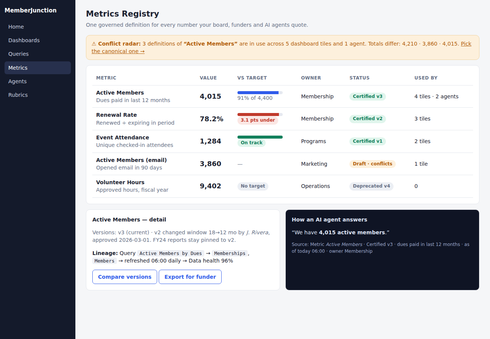

# Idea 1: Governed Metrics & Goals Layer — "One Definition of *Active Member*"

**Week of 2026-10-03 · Creative exploration · Framework-level (core, not a vertical app)**

## The problem, framed for the world

Every board meeting has the same moment. The membership chair says "we have 4,210 active members."
The finance director says 3,860. The executive director's dashboard says 4,015. All three are
*right* — each used a different, undocumented definition of "active" (paid dues in 12 months? opened
an email in 90 days? has an unexpired record?). Nobody lied; nobody can prove which number is
canonical; the meeting turns into an argument about spreadsheets instead of a decision about
members. Small organizations feel this hardest: no data team, high staff turnover, and every
funder report needs a number that must match last year's number *by the same definition*.

2026's analytics industry converged on the fix — a **semantic layer**: define a metric once, govern
it, and let every consumer (dashboard, report, spreadsheet export, AI assistant) read the same
definition. The 2026 Semantic Layer Summit takeaway was blunt: tolerance for semantic drift "ran
out the moment AI agents started consuming that data," because an agent asked "how many active
members?" silently picks a definition. MJ now has AI agents, dashboards, queries and rubrics all
answering numeric questions — and no shared place where "what do we mean by that number" lives.

## What already exists (so we don't duplicate it)

- **Queries / composable queries / materialization** (`plans/composable-queries-next-steps.md`,
  `plans/query-entity-materialization*.md`) answer *how to compute* a result. They have no notion of
  a *named business concept* with an owner, a definition-of-record, a target, or a version history.
- **Dashboards** (PR #4982 "first-class dashboards") render numbers but each tile embeds its own
  query; two tiles can define "active" differently with nothing to reveal the conflict.
- **Rubrics** (just merged) govern *judgement* criteria for agents, not business measures.
- **Data Health & Trust Layer** (2026-08-29) scores *record* quality; this idea governs *aggregate
  meaning*. They compose: a metric can show its data-health confidence.
- No `Metric`, `KPI`, `Goal` or `Target` entity exists in core metadata (verified by repo grep).

## Proposal

A thin governance layer that **sits on top of existing Queries** — never a second query engine.

### Core entities (additive)
| Entity | Purpose |
|---|---|
| `MJ: Metric Definitions` | Name, plain-language definition, owner, unit, grain (per member / per month), `QueryID` (the computation), allowed dimensions, status (Draft/Certified/Deprecated) |
| `MJ: Metric Versions` | Immutable snapshots when the definition changes (so "active members FY24" stays reproducible); diff + reason + approver |
| `MJ: Metric Targets` | Goal value, period, direction (higher-is-better), thresholds for on-track/at-risk/off-track |
| `MJ: Metric Snapshots` | Scheduled point-in-time values (via the existing Scheduling engine) enabling trend, sparkline, and year-over-year at near-zero query cost |

### Behaviours
1. **Certify once, reuse everywhere.** Dashboard tiles, report widgets, and agents reference a
   `MetricDefinitionID`, not raw SQL. A tile shows a "Certified · v3 · Owner: Membership" badge.
2. **Conflict radar.** When two Queries/tiles are named or tagged similarly but compute different
   results, surface "2 definitions of *Active Members* are in use — pick the canonical one."
3. **Agent grounding.** A `GetMetric` action (an Action, per `packages/Actions/CLAUDE.md`
   boundary rule) returns value + definition + version + caveats. Agents cite the definition in
   answers: "4,015 active members (Certified v3: dues paid in last 12 months)."
4. **Goals with narrative.** A scheduled job compares snapshot vs target and creates a plain-language
   status via the existing `NotificationEngine`: "Renewal rate is 3 pts under target, driven by
   the 'Student' tier" (dimension breakdown from the allowed-dimension list).
5. **Funder-ready lineage.** "Show your work" panel: definition text → query → source entities →
   last refresh → who changed it and when (Record Changes already provides the audit trail).

### Package shape
`@memberjunction/metrics` (engine, `BaseEngine` subclass with cached definitions) +
`@memberjunction/ng-metrics` (L1 widget: `<mj-metric-card>`, L2: registry editor) + one
Explorer dashboard resource under L3. Honors `UI_LAYERING_GUIDE.md`: no Router imports below L3.

## UX
See [`mockups/idea-1-metrics-registry.html`](./mockups/idea-1-metrics-registry.html): registry list
with certification state, a definition-conflict banner, a metric detail page with versions/targets/
lineage, and an "as an agent would cite it" preview.

## Phased rollout
1. **P0** — entities + `MetricEngine` + `GetMetric` action; no UI beyond CodeGen forms.
2. **P1** — `<mj-metric-card>` widget; dashboards can bind a tile to a metric.
3. **P2** — registry dashboard, versioning workflow, conflict radar.
4. **P3** — targets, snapshots, narrative notifications, funder lineage export (MJExportEngine).

## Success measures
Number of dashboard tiles bound to certified metrics; conflicting-definition count trending to zero;
percentage of agent numeric answers carrying a definition citation.

## Open questions
- Should snapshots reuse `Materialization` or be their own light table? (Lean: own table, tiny rows.)
- Certification approver: reuse Approval Gates (2026-08-14 idea) if/when it lands; otherwise a
  simple role check.
- Dimension safety: allowed dimensions must respect Field-Level Security (#3367) at read time.

## Sources
- [10 Things We Learned at the 2026 Semantic Layer Summit — AtScale](https://www.atscale.com/blog/semantic-layer-summit-2026-takeaways/)
- [What Is a Semantic Layer? — Atlan](https://atlan.com/know/semantic-layer/)
- [The Role of the Semantic Layer in Data Governance — DEV](https://dev.to/alexmercedcoder/the-role-of-the-semantic-layer-in-data-governance-575i)
