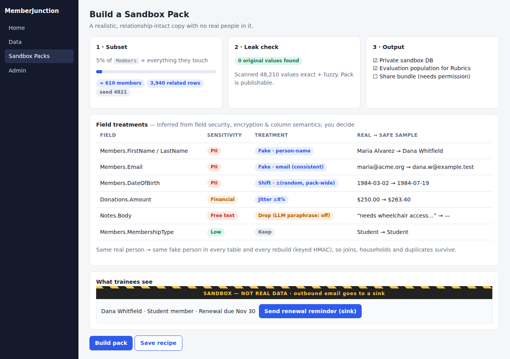

# Idea 2: Safe Sandbox Data — Masked & Synthetic Data Packs for Training, Demos, Vendors and AI Evals

**Week of 2026-10-03 · Creative exploration · Framework-level (core, not a vertical app)**

## The problem, framed for the world

A small association hires a consultant to build a new report. A new staffer needs to practice
renewal runs before touching real members. A board member wants a demo for a regional chapter. A
volunteer developer wants to test an integration. Every one of those needs a *realistic* copy of the
system — and today the only realistic copy is a restored production backup full of real names,
home addresses, donation amounts and health-accommodation notes. Organizations answer in one of two
bad ways: they hand over real PII (a breach waiting to happen, and often a violation of their own
privacy policy), or they refuse and people learn on production — which is how a first-ever bulk
email goes to 12,000 real members.

The 2026 test-data landscape is explicit: production data must be *transformed before it leaves the
production boundary* — names become plausible but fictional, relationships and distributions stay
intact — and AI-agent teams now need synthetic "person objects" to evaluate privacy and tool-use
behavior safely. MJ's own agents and rubrics (just merged) need exactly that: a population of
believable-but-fake people to evaluate against, with no PII risk.

## What already exists

- **Metadata knows the shape**: entity relationships, field types, value lists, and (with #3367)
  field-level security classifications tell us which fields are sensitive.
- **Encryption package** marks encrypted fields — another sensitivity signal.
- **DBAutoDoc** documents column semantics (it can infer "this is an email / a postal code").
- **Record cloning/graph** (`packages/RecordGraph`) can walk entity relationships for referentially
  intact subsets.
- **Gap**: nothing assembles these into "give me a safe, realistic, relationally-intact copy."
  Repo grep for masking/synthetic/anonymize finds nothing outside unrelated packages.
- Complements **Consent & Data Rights** (2026-08-14) — same sensitivity classification can feed it;
  and **Tenant Isolation** (2026-09-12) — sandbox export must never cross tenants.

## Proposal

### A `SandboxPack` is a declarative recipe, built from metadata
1. **Sensitivity map** — each field resolves to a *treatment*: `Keep`, `Mask` (format-preserving
   hash), `Fake` (generator by semantic type: person-name, email, phone, address, org-name, free
   text → LLM-paraphrase), `Shift` (dates by a per-pack random offset, preserving intervals),
   `Jitter` (numbers ±N% preserving totals within tolerance), `Drop`.
   Defaults inferred from FLS/Encryption/DBAutoDoc; humans review and override in a UI.
2. **Subset selector** — "5% of members plus everything they touch," walked via RecordGraph so
   foreign keys never dangle. Deterministic seed → reproducible packs.
3. **Consistency guarantee** — the same real person maps to the same fake person across every
   entity and every run (keyed HMAC), so joins, duplicates and household structures survive.
4. **Leak check** — a post-build scanner searches the pack for any original value of a `Fake`/`Mask`
   field (exact + fuzzy). Pack cannot be published unless it reports zero leaks.
5. **Outputs** — (a) an MJ `metadata/`-style JSON/CSV bundle loadable via `mj sync push`, (b) a
   target-database load for a private sandbox DB (reuses the `bootstrap-clean-db` flow), (c) an
   evaluation population registered for Rubrics/Test suites.
6. **Provenance stamp** — every sandbox record gets `__mj_IsSynthetic`-style marker through a pack
   manifest, and sandbox environments display a persistent "SANDBOX — not real data" chrome band so
   a trainee can never confuse them with production. Outbound communication providers are forced to
   a dry-run/sink in sandbox mode.

### Package shape
`@memberjunction/sandbox-data` (pack model, treatments, generators, leak scanner, CLI
`mj sandbox build|verify|load`), pluggable `FieldTreatment` classes via ClassFactory so apps can add
domain generators without forking. No new vertical entities.

## UX
See [`mockups/idea-2-sandbox-pack-builder.html`](./mockups/idea-2-sandbox-pack-builder.html): the
treatment review grid (field → inferred sensitivity → treatment → before/after sample), subset
slider, leak-check result, and the sandbox chrome band.

## Phased rollout
1. **P0** — treatment engine + deterministic fake generators for the ~10 common semantic types; CLI.
2. **P1** — RecordGraph subset walker + keyed-consistency mapping.
3. **P2** — leak scanner gate; review UI.
4. **P3** — sandbox chrome band + comms sink enforcement; Rubrics evaluation-population export.

## Success measures
Zero production backups shared externally; time to stand up a trainee environment (target: minutes);
zero leak-scan failures at publish.

## Open questions
- Is statistical fidelity (distribution preservation) a goal or is plausibility enough? (Lean:
  plausibility + totals/intervals; avoid claiming differential privacy.)
- Free-text fields: LLM-paraphrase cost vs. drop default.
- Who may build a pack — requires an explicit permission, audited.

## Sources
- [Data Masking Best Practices: In-Place vs In-Flight — Synthesized](https://www.synthesized.io/post/data-masking)
- [Data Masking for Regulated Test Environments — TotalShiftLeft](https://totalshiftleft.ai/blog/data-masking-testing-environments)
- [ProfileFoundry: synthetic person-object substrate for LLM-agent privacy evaluation (arXiv)](https://arxiv.org/pdf/2606.26403)
