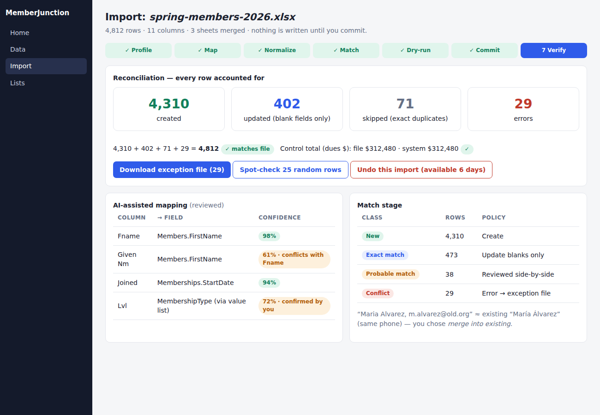

# Idea 3: Import Copilot — Guided, Reversible, Verify-Before-Go-Live Data Import

**Week of 2026-10-03 · Creative exploration · Framework-level (core, not a vertical app)**

## The problem, framed for the world

The most nerve-wracking week in a small organization's life is the week they move their members,
donors or volunteers into a new system. The data lives in three spreadsheets, an old database export
and someone's email. Headers say "Fname", "First", "Given Nm". Dates are in four formats. The same
person appears under two emails. Sector guides agree on the real risk: the import itself is easy —
**going live before you have verified the data on the other side** is what hurts. And the person
doing it is usually a part-time admin, not a data engineer.

MJ is very good at *connector-based* integration (the Integration package, with a mapping workspace
for live systems) and at developer-oriented `mj sync`. What a non-technical user lacks is the
equivalent for **a file in hand**: drop in a CSV/XLSX, be guided to a trustworthy result, and be able
to take it all back.

## What already exists

- **Integration engine + mapping workspace** (`packages/Integration`, mockup-mapping-workspace.html):
  connector-to-entity field mapping for *live systems* — the mapping UX is a strong reference we
  should reuse as a component, not rebuild.
- **Duplicate detection** (`packages/AI/Vectors/Dupe`) — match engine we can call for "is this row
  probably someone already in the system?"
- **FieldRulesTransforms** — transform primitives for normalization.
- **Operation Safety Net** (2026-08-29) — grouped undo via Record Changes; this idea would *emit*
  an operation group per import so "undo this import" is one click. If that idea is not built, falls
  back to a staging-table discard before commit.
- **Data Health & Trust** (2026-08-29) — post-import scoring can run over just-imported rows.
- **Bulk Operations / Lists dashboards** act on existing records; none ingests external files
  (repo grep for import wizard/column mapping confirms no file-import flow in Explorer).

## Proposal — a staged import pipeline with a human-readable gate at every stage

1. **Profile** — upload file; detect delimiter/encoding/header row; per-column profile (fill rate,
   distinct count, sample values, inferred type/format).
2. **Map (AI-assisted)** — propose column → entity.field mappings from header + sample values
   (LLM with metadata context), each with confidence and "why". Low-confidence columns are
   highlighted, never auto-accepted. Mapping templates are saved for repeat imports.
3. **Normalize** — suggested transforms (date format, phone E.164, case, trim, value-list
   reconciliation like "Yes/Y/TRUE"), shown as before → after samples with row counts affected.
4. **Match** — each row classified **New / Exact match / Probable match / Conflict** against
   existing records via keys + Dupe engine; user sets policy per class (skip, update-blank-only,
   update-all, create new) and reviews the probable-match queue side by side.
5. **Dry-run** — everything is staged in a transaction-scoped `Import Run` with per-row outcomes:
   would-create / would-update (with field diff) / would-skip / error + reason. Nothing touches
   target tables.
6. **Commit** — runs through BaseEntity Save (validators, FLS, row-level security, workflows all
   still fire), in batches via TransactionGroup, resumable, with a live progress panel.
7. **Verify** — reconciliation report ("file had 4,812 rows → 4,310 created, 402 updated, 71
   skipped, 29 errors; every row accounted for"), row-count and control-total checks, downloadable
   exception file, and a sampled spot-check view. One-click **Undo import** while the window is open.

### Entities (additive)
`MJ: Import Runs`, `MJ: Import Mapping Templates`, `MJ: Import Run Rows` (staged outcomes, retention
configurable, PII-minimized by design).

### Agent surface
An `ImportCopilot` agent can walk a user through the steps conversationally and is limited to
the same Actions the UI uses — no direct writes, so Approval Gates (if present) apply.

## UX
See [`mockups/idea-3-import-copilot.html`](./mockups/idea-3-import-copilot.html): the 7-step rail,
AI mapping with confidence chips, match-classification buckets, and the final reconciliation
"every row accounted for" screen.

## Phased rollout
1. **P0** — profiler + mapping proposer + dry-run engine (headless, CLI `mj import dry-run`).
2. **P1** — commit + reconciliation + mapping templates.
3. **P2** — match stage using Dupe; probable-match review queue.
4. **P3** — Explorer wizard UI; agent walkthrough; undo via Safety Net group.

## Success measures
Median time from "file received" to "verified live"; percentage of imports finishing with zero
unreconciled rows; repeat-import reuse of saved templates.

## Open questions
- Max file size/streaming strategy for the profiler (server-side streaming, chunked staging).
- Where to stage rows: scratch table vs. in-memory with spill to MJStorage.
- LLM mapping sends sample *values* to a model — needs the data-handling opt-in/redaction setting
  (can reuse Sandbox Data's treatments to mask samples before prompting).

## Sources
- [Nonprofit Data Migration: Step-by-Step Guide — Charity Engine](https://charityengine.net/blog/nonprofit-crm-migration-guide/)
- [How to Migrate Member Data Without Losing Records — Communa](https://www.communa.app/blog/how-to-migrate-member-data-without-losing-records-a-step-by-step-playbook-for-associations/)
- [The Top Nonprofit CRM Migration Mistakes — Giveffect](https://www.giveffect.com/nonprofit-resource-center/the-top-nonprofit-crm-migration-mistakes-and-how-to-avoid-them/)
