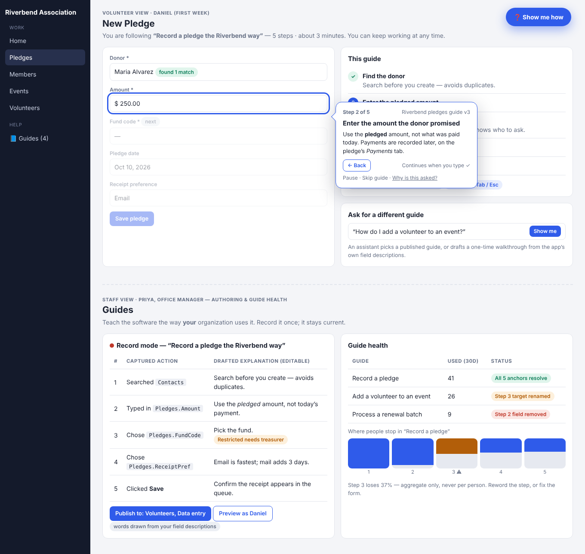
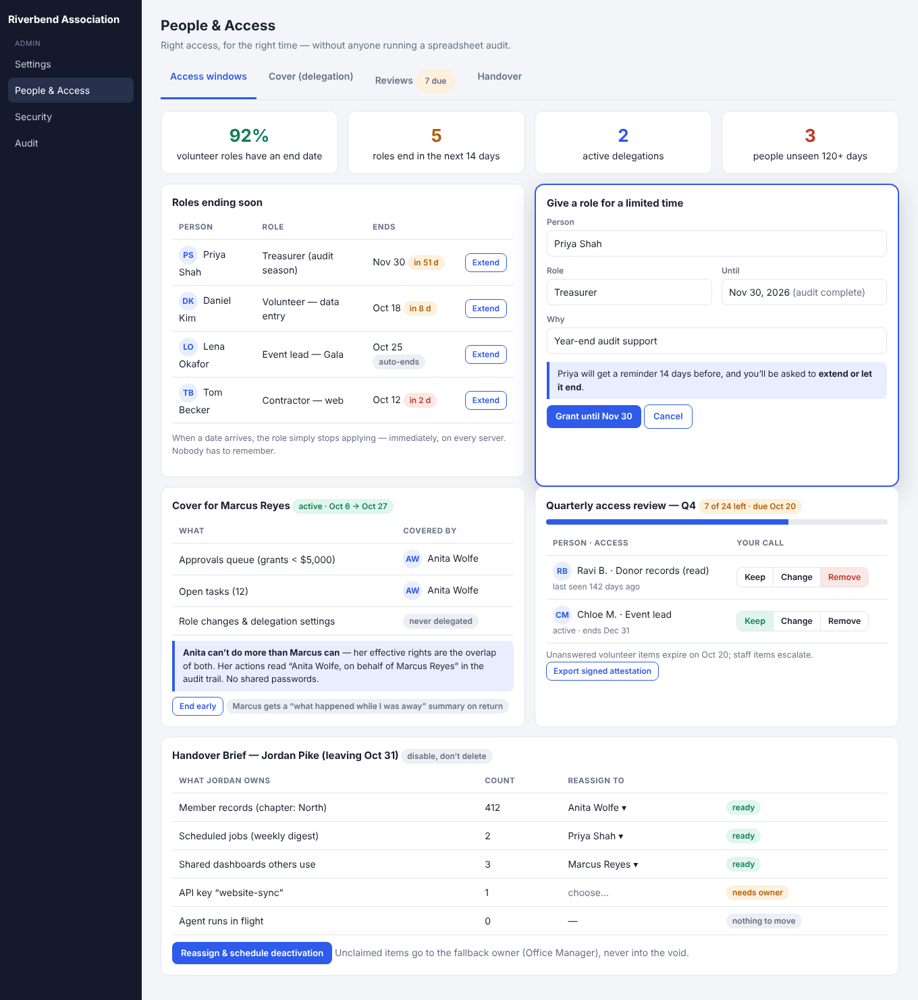
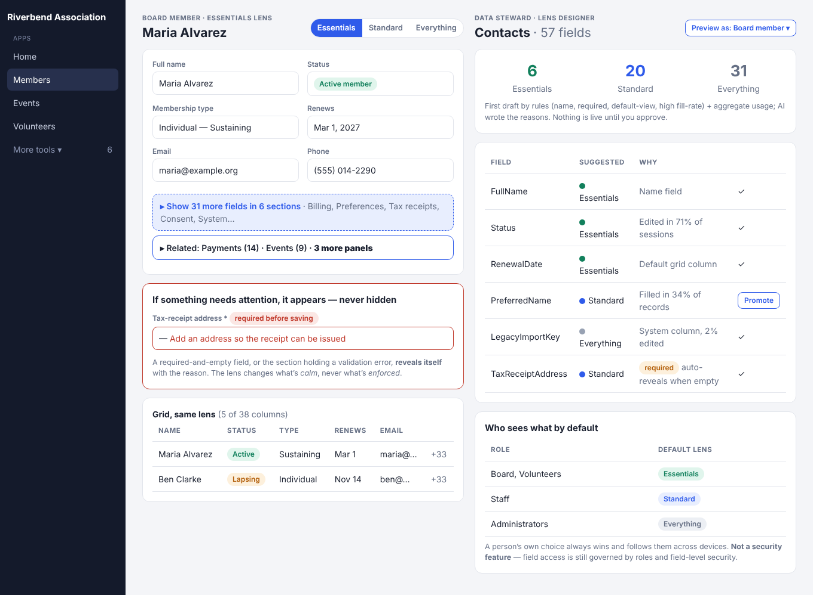

# Weekly Creative Exploration — 2026-10-10

Three framework-level ideas for MemberJunction, grounded in the codebase, the 40 most recently
updated open PRs, the newest open issues (551 open), all 21 prior ideas, and external research on
nonprofit staff/volunteer turnover, access hygiene, and digital-adoption tooling. Seventh installment
— see the parent [`README.md`](../README.md).

## Methodology

1. Re-read the log. Of 21 prior ideas, only the 2026-09-19 trio was approved; 09-26 was rejected, 09-12
   was deprioritized and 10-03 (metrics, sandbox data, import) was not approved. Detection, assurance,
   observability and data-pipeline themes have now landed flat three times, so this week turns to
   **the people who use the system every day** — occasional, non-technical, frequently changing —
   rather than to more platform-side assurance machinery.
2. Open PR/issue themes (all left alone): a large realtime/video/avatar stack (#5079 + a dozen
   fixes), a security-hardening series (C1–C10, #5264–#5273), conversation forks / per-person
   views (#5179, #5299), chart widgets (#5368), DBAutoDoc Index Advisor (#5258), user routines,
   metadata-sync dry-run, FLS follow-ups.
3. File-level recon (each a verified gap): no tour/walkthrough infrastructure in `packages/Angular`;
   `MJUserRoleEntity` has only `ID/UserID/RoleID` (a role can't expire) and no delegation or
   access-review entity exists; nothing expresses field/section "essentialness" although
   `EntityField.Configuration`, form variants and `UserInfoEngine` persistence are ready homes.
   **Dropped candidate:** an end-user "report a problem" flow — the Feedback package already ships it.
4. Research (vendor-heavy, flagged as directional in each doc): nonprofit turnover and training cost,
   ATO / practitioner guidance on forgotten volunteer access, Pendo/WalkMe/Appcues AI guide builders.
5. All three are generic primitives; none needs a new business app.

## The three ideas

### 1. [Show Me How — Guided Walkthroughs](./idea-1-show-me-how-walkthroughs.md)
Metadata-defined, recorded-by-doing, role-targeted walkthroughs that run on the real screen, advance
on real input, respect permissions, and are checked for "tour rot" after every deploy — so the
treasurer's tacit procedure survives the treasurer.

### 2. [Cover & Handover — Time-Boxed Access, Delegation, Clean Departures](./idea-2-cover-and-handover.md)
Roles that end on a date, "cover while I'm away" delegation that can never exceed the delegator and
is audited as *on behalf of*, quarterly access reviews with signed attestation, and a Handover Brief
that reassigns everything a departing person owned.

### 3. [The Essentials Lens](./idea-3-essentials-lens.md)
A presentation-only Essentials / Standard / Everything lens over every form, grid and nav — drafted
by heuristics and usage, approved in a Lens Designer, never hiding what is required or wrong, and
never pretending to be security.

## Not proposed
No vertical apps. No evals/observability/assurance gates (three weeks of feedback). Nothing touching
realtime/video, the security-hardening series, FLS, or PostgreSQL tooling (build-engineer territory).

## Process note
Plan-only PRs remain mostly unshipped. If a decision is made on this week, record it here, as with prior weeks.
