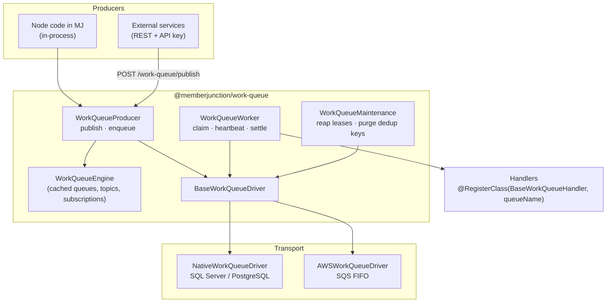
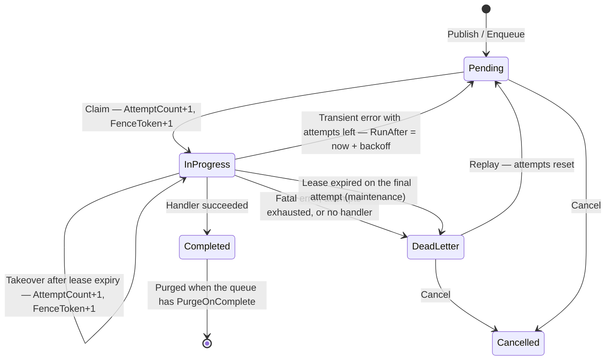
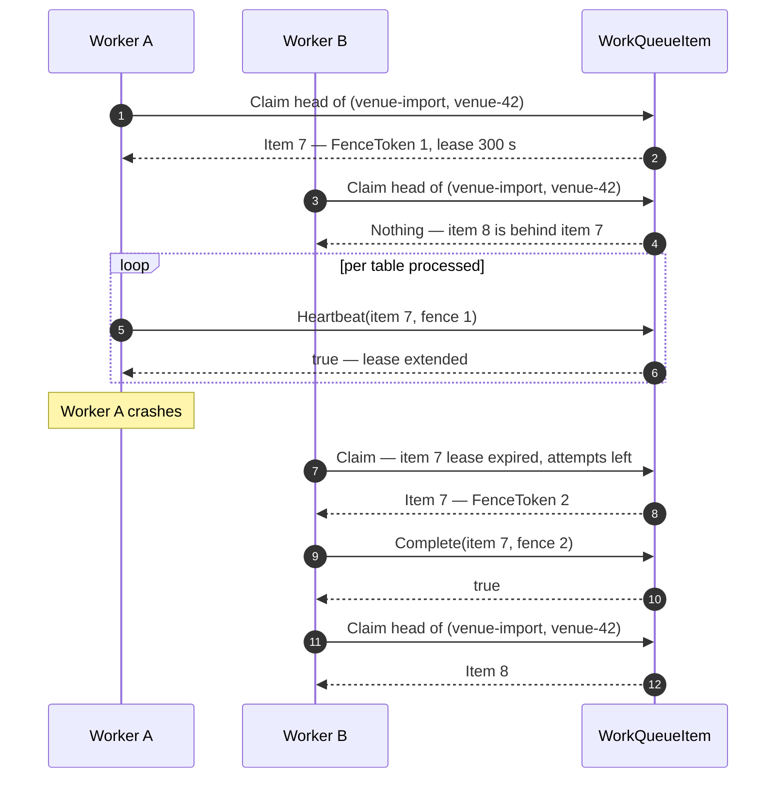
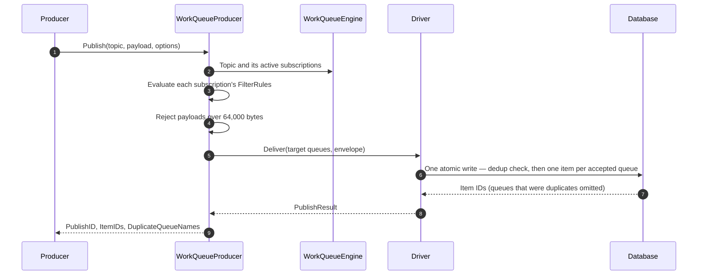
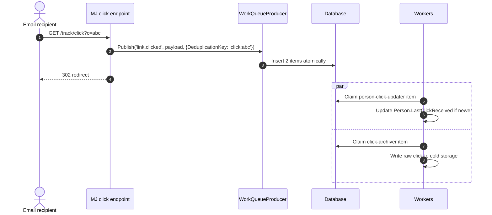

# Work Queue — Design (Phase 1)

**Status:** Proposed — design for review. Nothing is implemented.
**Date:** 2026-09-15
**Supersedes:** `memberjunction/implementation_plan.md` (the 14 September 2026 draft, which used an outbox relay)
**Plan set:** see [README](README.md). Contracts and schema are in [02](02-interfaces-and-schema.md).

---

## 1. Summary

MemberJunction gains a durable work queue — `@memberjunction/work-queue`.

A producer publishes a small message to a topic. The topic fans out one item per subscribed queue. Workers
on any number of MJ server instances claim items under a lease, run the handler registered for that queue,
and settle the item. Delivery is at-least-once. Items sharing a partition key run strictly in order, one at
a time. Failures retry with backoff and end in a dead-letter state an operator can replay or cancel.

Transport sits behind a driver contract. Phase 1 ships a database-native driver (SQL Server and PostgreSQL)
and an AWS driver (SQS FIFO). Producers and handlers do not change when the driver does.

Three later paths build on this without changing it (§15): other cloud drivers, batched delivery, and
staged batch ingestion.

## 2. Goals and non-goals

**Goals**

- Survive process restarts and crashes without losing accepted work.
- Run safely on many server instances against one database.
- Guarantee FIFO, one-at-a-time processing per partition key.
- Renew leases only on verified handler progress, so hung handlers are detected.
- Fan one publish out to independent pipelines that fail and retry independently.
- Suppress duplicate publishes by key, within a configurable window.
- Keep messages small; large data is referenced, not embedded.
- Let services outside Node publish over authenticated REST.
- Give operators visibility and control: stats, blocked partitions, replay, cancel.
- Keep the transport swappable, with AWS delivered in Phase 1.

**Non-goals for Phase 1**

- **Exactly-once delivery.** Lease-based delivery cannot provide it. Handlers must be idempotent.
- **Application logic.** Deciding when an application's data is ready, how to normalise it, or how to speak
  a vendor protocol belongs to applications.
- **GCP and Azure drivers** — Path A.
- **Batched delivery** into data lakes or warehouses (Kinesis Firehose and similar) — Path B.
- **Staged batch ingestion** (open, register parts, seal) — Path C, parked for a later sketch.
- **Replacing** the Scheduling engine or the TaskGraph dispatcher. They solve different problems.

## 3. Concepts

| Term | Meaning |
| --- | --- |
| **Topic** | A named event stream (`link.clicked`, `import.ready`). Publishing targets a topic. |
| **Queue** | A named consumer pipeline with its own retry, lease and dead-letter settings. One handler class serves each queue. |
| **Subscription** | Connects a topic to a queue, with an optional filter on the payload. |
| **Publish** | Deliver one message to every active, matching subscription of a topic in one write. Each queue receives its own **item**. All items from one publish share a **Publish ID**. |
| **Enqueue** | Deliver one message straight to one queue, bypassing topics. |
| **Item** | One unit of work in one queue: payload, status, attempts, lease. |
| **Partition key** | Optional string. Items in the same queue with the same key run one at a time, in publish order. Items without a key run in parallel. |
| **Head of line** | The oldest unfinished item in a (queue, partition). Only the head is claimable. |
| **Lease** | Time-bounded ownership of an item by one worker, measured on the database clock. |
| **Fence token** | A counter incremented on every claim. Every settling write must present the current token, so a worker whose lease was taken over cannot overwrite the newer owner's outcome. |
| **Heartbeat** | Handler-driven lease extension, called at progress boundaries. Returns `false` once the lease is lost; the handler must then stop. |
| **Attempt** | Each claim is one attempt, including takeover after an expired lease. |
| **Dead letter** | Terminal failure state: fatal error, attempts exhausted, lease exhausted, or no handler. |
| **Dead-letter policy** | Per queue. **Block Partition** — a dead-lettered head halts its partition until replayed or cancelled. **Skip Partition** — later items continue. |
| **Deduplication key** | Optional publish key. A second publish with the same key to the same queue within the window is dropped. |
| **Payload cap** | 64,000 bytes of UTF-8 JSON. Anything larger is a claim check: the payload carries a reference. |
| **Driver** | The transport implementation: Native (database) and AWS in Phase 1. |

## 4. Architecture



Three rules follow from the diagram:

- **Everything publishes through `WorkQueueProducer`.** REST callers and in-process code share one path.
  There is no outbox table and no relay.
- **Metadata lives in MJ entities, cached by `WorkQueueEngine`.** Subscription resolution and filter
  evaluation happen in TypeScript. The driver receives an explicit list of target queues.
- **The deduplication ledger always lives in the MJ database**, whichever driver carries messages. Only item
  delivery and claiming move to the cloud.

## 5. Guarantees

| Guaranteed | Not guaranteed |
| --- | --- |
| An accepted publish is durable before `Publish()` resolves. | Exactly-once execution. A handler can run again after a crash between its work and its settle. |
| All items of one publish are written together, or none are (native driver; cloud drivers without transactional sends converge on caller retry — [06](06-path-a-gcp-azure.md) §1). | Ordering across different partition keys, or across queues. |
| Within one (queue, partition key), items run one at a time, in publish order, including across retries. | Ordering for items with no partition key. |
| A settle from a worker that lost its lease is rejected. | That a worker which lost its lease stops *writing elsewhere* — handlers must check `Heartbeat()` and should make writes idempotent. |
| A duplicate publish with the same key to the same queue inside the window creates no item. | Deduplication after the window expires. |
| An item whose lease expires is retried by another worker, counted as an attempt. | Progress under a Block Partition policy without operator action. |

## 6. Item lifecycle

Stored status values contain spaces (`In Progress`, `Dead Letter`); the diagram omits them.



## 7. Claiming

An item is claimable only when **all** of these hold:

1. Its queue is active.
2. Either it is `Pending` and its `RunAfter` has passed, or it is `In Progress`, its lease has expired, and
   it has attempts left (takeover).
3. If it has a partition key, no older item in the same queue and partition is `Pending` or `In Progress` —
   nor `Dead Letter` when the queue's policy is Block Partition.

Among claimable items the worker takes the highest `Priority`, then the lowest `Sequence`.

A unique index on (queue, partition key) for `In Progress` rows makes the one-at-a-time rule hold even when
two workers race: the second claim fails at the constraint and the worker treats it as "nothing to claim".
The index cannot contain a time condition — neither SQL Server filtered indexes nor PostgreSQL partial
indexes allow a clock function — so a takeover updates the expired row *in place* rather than creating a
second `In Progress` row.

Consequences worth stating plainly:

- **Backoff pauses the partition.** A failing head in backoff holds everything behind it.
- **Block Partition halts a partition** until an operator replays or cancels the head.
- **A crashed worker never freezes a partition**: its item becomes claimable when the lease expires.
- **A crash-looping item cannot retry forever.** Every takeover counts as an attempt, and maintenance
  dead-letters an expired lease on the final attempt.



## 8. Publishing and fan-out



A topic with no matching subscription accepts the publish and creates nothing. That is not an error:
subscriptions are configuration, and producers must not depend on who is listening.

**Filter rules** are deliberately small: a JSON object of top-level payload property names to required
values, all of which must match (`{ "eventType": "email" }`). Anything more expressive belongs in the
handler. Every driver evaluates filters in TypeScript before delivery and sends to explicit target queues,
so no cloud filter translation exists anywhere.

## 9. Use case 1 — Link click tracking

**Scenario.** An email link hits an MJ HTTP endpoint. The endpoint must redirect immediately, and the click
must update CRM activity and be archived for audit — independently.

| Element | Configuration |
| --- | --- |
| Topic | `link.clicked` — published in-process; `AllowExternalPublish = false` |
| Queues | `person-click-updater` (MaxAttempts 5, Skip Partition), `click-archiver` (MaxAttempts 10, Skip Partition) |
| Partition key | none — order is irrelevant; the updater writes "newer click wins" |
| Payload | inline, about 300 bytes: `{ clickId, personId, url, clickedAt }` |
| Deduplication | key `click:{clickId}`, window 1 day — a double-submitted click is one item per queue |



A deadlock in the updater retries only the updater's item. The archiver's item is a separate row with its
own attempts.

```typescript
@RegisterClass(BaseWorkQueueHandler, 'person-click-updater')
export class PersonClickUpdaterHandler extends BaseWorkQueueHandler<LinkClickedPayload> {
    public async Handle(context: WorkQueueContext<LinkClickedPayload>): Promise<void> {
        if (!context.Payload.personId) {
            throw new FatalQueueError('personId missing from link.clicked payload');
        }
        // One guarded UPDATE: "set LastClickReceived where it is older than this click".
        // Idempotent and newer-wins, so a redelivery or an out-of-order click is harmless.
        await UpdateLastClickIfNewer(context.Provider, context.Payload, context.ContextUser);
    }
}
```

## 10. Use case 2 — Ordered, long-running work per partition

**Scenario.** An application imports box-office data per venue. It lands each import in its own storage
however it likes, and decides for itself when an import is ready. It then needs the import processed:
set-based, possibly for many minutes, and never concurrently with — or out of order relative to — another
import for the same venue.

| Element | Configuration |
| --- | --- |
| Topic | `import.ready` — published in-process by the importing application |
| Queue | `venue-import` — LeaseSeconds 300, MaxAttempts 3, backoff 60–1800 s, **Block Partition** |
| Partition key | `venue-{venueId}` |
| Payload | a reference: `{ importId, venueId, sourceSystem }` — the data stays in the application's storage |
| Deduplication | key `import:{importId}`, window 7 days — re-announcing an import is harmless |

```mermaid
sequenceDiagram
    autonumber
    participant APP as Importing application
    participant WP as WorkQueueProducer
    participant W as Worker
    participant H as venue-import handler
    participant DATA as Application storage

    APP->>APP: Land import 1001 for venue 42; decide it is ready
    APP->>WP: Publish('import.ready', {importId: 1001}, {PartitionKey: 'venue-42'})
    APP->>WP: Publish('import.ready', {importId: 1002}, {PartitionKey: 'venue-42'})
    W->>H: Claim item for import 1001 (1002 waits behind it)
    loop each table in import 1001
        H->>DATA: Read and normalise set-based
        H->>W: context.Heartbeat()
    end
    H-->>W: Completed
    W->>H: Claim item for import 1002
```

What the queue provides here, and why each piece matters:

- **Partition FIFO** — import 1002 can never start before 1001 finishes, so an older window never
  overwrites a newer one.
- **Progress heartbeats** — a long import keeps its lease while it advances; a hung one loses its lease and
  is taken over.
- **Block Partition** — if import 1001 dead-letters, 1002 waits until an operator replays or cancels 1001,
  instead of applying a newer import on top of a failed one.
- **Claim check** — the payload is a reference, so import size never touches the queue.

What the queue deliberately does **not** provide: deciding when an import is ready, or tracking its parts.
That stays in the application in Phase 1. Whether a framework layer for it is worthwhile is Path C.

## 11. Security

- **Scopes.** REST callers authenticate with MJ API keys. `workqueue:publish` covers
  `/work-queue/publish`; `workqueue:manage` covers the management operations. Scope checks use
  `CheckAPIKeyScope`.
- **Topic exposure.** External callers may publish only to topics with `AllowExternalPublish = true`.
  In-process code may publish to any active topic.
- **Tenant ID is routing metadata in Phase 1, not an authorization boundary.** Binding a caller's tenant to
  the `TenantID` it supplies is an open question (§16).
- **Payloads are untrusted input** to handlers. Handlers validate shape and throw `FatalQueueError` on
  malformed payloads rather than retrying them.

## 12. Operations

| Need | Mechanism |
| --- | --- |
| Queue depth, age of oldest pending item | Remote operation `WorkQueue.GetQueueStats` |
| Partitions halted by a dead-lettered head | Remote operation `WorkQueue.ListBlockedPartitions` |
| Retry a dead-lettered item | Remote operation `WorkQueue.ReplayDeadLetter` |
| Skip a blocked head, or withdraw pending work | Remote operation `WorkQueue.CancelItem` |
| Crash recovery | In-line lease takeover; maintenance dead-letters leases expired on the final attempt |
| Table growth | `PurgeOnComplete` deletes completed items; maintenance deletes expired deduplication keys |
| Driver cannot honour a queue's settings | `ValidateQueues` results logged at startup; the worker skips that queue |
| Graceful shutdown | The worker registers with `ShutdownRegistry` and stops claiming |

Dead-lettered and cancelled items are kept until an operator acts. Retention for them is an open question.

## 13. Drivers and portability

| Capability | Native | AWS (Phase 1) | GCP (Path A) | Azure (Path A) |
| --- | --- | --- | --- | --- |
| FIFO one-at-a-time per partition | yes | yes (FIFO message groups) | yes (ordering keys) | yes (sessions) |
| Atomic fan-out | yes | no — converges on retry | no — converges on retry | yes (transactional send) |
| Block Partition dead-letter policy | yes | no — Skip only | no — Skip only | emulated (session state) |
| Per-item retry delay | yes | yes (visibility timeout, max 12 h) | bounded (ack deadline) | bounded (lock renewal) |
| Lease renewal | yes | yes | yes | yes |
| Publish deduplication | MJ ledger | MJ ledger | MJ ledger | MJ ledger (native available) |
| Payload filter rules | evaluated before delivery | evaluated before delivery | evaluated before delivery | evaluated before delivery |
| Peek items / list blocked partitions | yes | no | no | peek yes |
| Replay a single dead-lettered item | yes | no | no | yes |
| Serverless consumer | — | Lambda | Cloud Run / Functions | Functions |

A driver declares its capabilities. The worker refuses to run a queue whose configuration needs a capability
the driver lacks, and management operations report "not supported" rather than guessing. Use case 2 relies
on Block Partition, so on AWS it would run with Skip Partition and the application would need its own
guard against applying a newer import over a failed one.

## 14. Decisions and alternatives rejected

**Decisions**

| Decision | Why |
| --- | --- |
| No outbox table, no relay | A relay existed only for producers writing SQL directly. Every producer now goes through `WorkQueueProducer`, in-process or over REST. Removing the relay removed its ordering bugs. |
| Fan-out is one atomic database write (native) | Replaces the relay's crash-recovery role without a second process. |
| Subscription filters evaluated in TypeScript, delivery to explicit queues | Keeps SQL portable, keeps deduplication per queue, and removes cloud filter translation for every driver. |
| Retry settings live on the queue, not the handler | One source of truth that operators can change without a deploy. |
| Takeover updates the expired row in place | The in-flight unique index cannot contain a clock condition. |
| Each claim is an attempt | A crash-looping item reaches dead letter instead of retrying forever. |
| Deduplication ledger stays in the MJ database for every driver | Cloud deduplication windows are short (SQS FIFO: 5 minutes) or absent. |
| Staged batch ingestion removed from Phase 1 | It is additive on the queue, and the use case behind it is not yet settled. Parked as Path C. |

**Alternatives rejected**

- **Outbox relay for SQL-writing producers** — a moving part and an ordering hazard for one producer type
  that can use REST instead.
- **Carrying bulk data in payloads** — bloats the claim table and exceeds cloud limits.
- **A time predicate in the in-flight unique index** — invalid on both databases, and wrong even if allowed,
  because index membership is evaluated at write time.

## 15. Phasing and future paths

**Phase 1**

| Plan | Scope |
| --- | --- |
| [03](03-native-implementation-plan.md) | Schema; native driver; producer; worker; maintenance; management operations; REST publish; MJServer wiring; integration tests |
| [04](04-legacy-queue-port-plan.md) | Port `@memberjunction/queue` onto the work queue; fix Entity AI Action payloads |
| [05](05-aws-implementation-plan.md) | AWS SQS FIFO driver and Lambda adapter |

**Future paths — each additive, none required by Phase 1**

| Path | What it adds | Why it is additive |
| --- | --- | --- |
| **A — GCP and Azure drivers** ([06](06-path-a-gcp-azure.md)) | Pub/Sub and Service Bus transports | Implements `BaseWorkQueueDriver`; producers, handlers and metadata unchanged |
| **B — Batched delivery** (to be sketched) | A consumer that receives many items at once and flushes them in bulk (buffer by count or time) to storage or a warehouse, with Kinesis Firehose as the AWS analogue | A new handler base that claims several items per call; single-item handlers and the item lifecycle unchanged |
| **C — Staged batch ingestion** ([08](08-path-c-staged-batches-parked.md), parked) | Open a batch, register staged parts, seal with a manifest, publish once on seal | Consumes only `WorkQueueProducer.Publish`; owns its own tables, endpoints and maintenance |

## 16. Open questions

1. **Tenant binding for external publishers.** Should `/work-queue/publish` reject a `tenantId` that does
   not match the caller's tenant under MJ multi-tenancy? Needs the multi-tenancy middleware's request
   contract.
2. **Retention for dead-lettered and cancelled items** — keep until operator action, or expire after a
   configurable period?
3. **Per-queue concurrency caps** beyond the worker-wide limit — needed once one queue's handlers are
   expensive enough to starve others.
4. **Priority starvation** — can a steady stream of high-priority items starve low-priority ones
   indefinitely, and does that need ageing?
