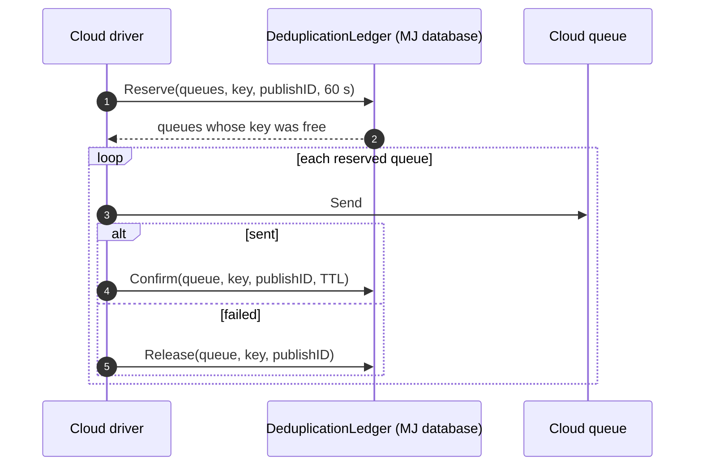

# AWS Work Queue Driver Implementation Plan

> **For agentic workers:** REQUIRED SUB-SKILL: Use superpowers:subagent-driven-development (recommended) or superpowers:executing-plans to implement this plan task-by-task. Steps use checkbox (`- [ ]`) syntax for tracking.

**Goal:** Carry work queue items on Amazon SQS FIFO queues, consumed by MJServer workers or AWS Lambda, without changing producers, handlers or queue metadata.

**Architecture:** A new package, `@memberjunction/work-queue-aws`, registers `AWSWorkQueueDriver` under the key `'AWS'`. Fan-out stays producer-side: the producer resolves subscriptions and filters, and the driver sends one message per target queue, straight to that queue's SQS FIFO queue (no SNS). `MessageGroupId` is the partition key, or the publish ID when there is none, so FIFO groups provide one-at-a-time ordering. The receive count is the attempt counter and fence token; visibility timeouts provide leases and retry delays. Deduplication keys stay in the MJ database through a two-phase reservation — reserve, send, confirm, or release on failure — added to the core ledger in Task 1. A Lambda adapter runs the same item runner inside an SQS event source mapping.

**Tech Stack:** TypeScript, `@aws-sdk/client-sqs` `^3.984.0`, `@memberjunction/work-queue` (plan 03), Vitest.

**Spec:** [01-design.md](01-design.md) §13, [02-interfaces-and-schema.md](02-interfaces-and-schema.md) §4.6 and §8. Plan [03](03-native-implementation-plan.md) must be complete. [06](06-path-a-gcp-azure.md) reuses the patterns this plan establishes.

## Global Constraints

- Package manager `pnpm`; `cd packages/<Package> && pnpm test` for unit tests. No test calls AWS: every SQS call goes through the `SqsGateway` interface, faked in tests.
- `@aws-sdk/client-sqs` is pinned at `^3.984.0`, matching the other AWS SDK clients in the repository.
- Public members PascalCase; message envelope JSON camelCase; no `any`; static imports only.
- Capabilities exactly as spec 02 §4.6 for AWS: `BlockPartitionDeadLetter: false`, `PerItemRetryDelayMaxSeconds: 43200`, `DelayedPublish: false`, `Priority: false`, `AtomicFanOut: false`, `PeekItems: false`, `ListBlockedPartitions: false`, `ReplaySingleDeadLetter: false`.
- SQS limits the driver must respect: FIFO queue names end in `.fifo`, at most 80 characters of `[A-Za-z0-9_-]` plus the suffix; visibility timeout at most 43,200 seconds; a message group is blocked while any of its messages is in flight.
- Queues are provisioned outside MJ (AWS CLI, CloudFormation or Terraform). The driver never creates or deletes SQS queues; `ValidateQueues` reports what is missing.

---

## How the work queue maps onto SQS FIFO

| Work queue concept | SQS FIFO |
| --- | --- |
| Queue `venue-import` | FIFO queue `<resourcePrefix>-venue-import.fifo`, plus dead-letter queue `<resourcePrefix>-venue-import-dlq.fifo` |
| Publish to N subscribed queues | N `SendMessage` calls, one per queue, sharing the publish ID |
| Item ID | Generated by the driver (UUID) and carried in the envelope; also the `MessageDeduplicationId` |
| Partition key | `MessageGroupId`; items without one use the publish ID, which is unique per queue per publish |
| Claim | `ReceiveMessage` of one message with `VisibilityTimeout = LeaseSeconds` |
| Attempt count and fence token | `ApproximateReceiveCount` |
| Heartbeat | `ChangeMessageVisibility(LeaseSeconds)` with the receipt handle; a stale handle fails, which reports `false` |
| Complete | `DeleteMessage` |
| Retry after N seconds | `ChangeMessageVisibility(N)` and leave the message; its group stays blocked, exactly as a native partition in backoff |
| Dead letter | `SendMessage` to the queue's dead-letter queue with the reason, then `DeleteMessage` |
| Lease exhausted | Detected at claim: a message received more than `MaxAttempts` times goes to the dead-letter queue as `'Lease Exhausted'` |
| Deduplication key | MJ ledger reservation (Task 1); SQS's own 5-minute window only covers SDK retries of one send |

What AWS cannot do, and what that means:

- **No Block Partition.** Dead-lettering the head deletes it, which releases its group. Queues with
  `DeadLetterPolicy = 'Block Partition'` are reported by `ValidateQueues` and skipped by workers.
- **No atomic fan-out.** If the third of three sends fails, the first two stand. With a deduplication key,
  the caller's retry converges (confirmed queues report duplicates); without one, a retry duplicates the
  first two. Producers that need exactly-once fan-out should always pass a deduplication key.
- **No per-item inspection.** Stats, blocked partitions, replay and cancel answer `supported: false`. Use
  the SQS console or CloudWatch metrics (`ApproximateNumberOfMessagesVisible`,
  `ApproximateAgeOfOldestMessage`), and redrive from the dead-letter queue with SQS's redrive tooling.

## Task overview

| # | Task | Deliverable |
| --- | --- | --- |
| 1 | Deduplication reservations in the core ledger | `Reserve`, `Confirm`, `Release` on `DeduplicationLedger` for SQL Server and PostgreSQL |
| 2 | `@memberjunction/work-queue-aws` scaffold, configuration, resource names, envelope | Package builds; pure helpers tested |
| 3 | SQS gateway | `SqsGateway` contract and the AWS SDK implementation with error mapping |
| 4 | `AWSWorkQueueDriver` | Deliver, claim, settle and validate, tested against a fake gateway |
| 5 | Lambda adapter | `CreateSqsLambdaHandler` with partial batch failures, tested |
| 6 | Server wiring, manifest and README with provisioning | MJAPI can run `driver: 'AWS'`; operators can provision queues |

## File structure

```
packages/WorkQueue/                                  (plan 03 package)
  src/sql/DeduplicationSqlBuilder.ts                 Task 1
  src/sql/SqlServerDeduplicationSql.ts               Task 1
  src/sql/PostgreSQLDeduplicationSql.ts              Task 1
  src/ledger/DeduplicationLedger.ts                  Task 1
  src/__tests__/DeduplicationLedger.test.ts          Task 1

packages/WorkQueueAWS/
  package.json · tsconfig.json · vitest.config.ts    Task 2
  README.md                                          Task 6
  src/index.ts                                       Task 2, extended by later tasks
  src/config.ts                                      Task 2
  src/names.ts                                       Task 2
  src/envelope.ts                                    Task 2
  src/gateway/SqsGateway.ts                          Task 3
  src/gateway/SdkSqsGateway.ts                       Task 3
  src/AWSWorkQueueDriver.ts                          Task 4
  src/lambda/lambdaTypes.ts                          Task 5
  src/lambda/CreateSqsLambdaHandler.ts               Task 5
  src/__tests__/fakes.ts                             Task 3, extended in Task 4
  src/__tests__/*.test.ts                            every code task

packages/ServerBootstrap/package.json                Task 6
packages/ServerBootstrap/src/generated/mj-class-registrations.ts   Task 6
```

## Pre-flight

- [ ] Plan 03 is merged and `cd packages/WorkQueue && pnpm test` passes.
- [ ] You do **not** need AWS credentials for Tasks 1–5. Task 6's optional smoke test needs an AWS account or
  LocalStack.

---

### Task 1: Deduplication reservations in the core ledger

**Files:**
- Modify: `packages/WorkQueue/src/sql/DeduplicationSqlBuilder.ts`, `src/sql/SqlServerDeduplicationSql.ts`, `src/sql/PostgreSQLDeduplicationSql.ts`, `src/ledger/DeduplicationLedger.ts`
- Test: `packages/WorkQueue/src/__tests__/DeduplicationLedger.test.ts`

**Interfaces:**
- Consumes: `SqlParamList`, `QualifiedTable`, `ExecuteRows`, `ExecuteWrite`, `SqlStatement`, `WorkQueueSqlExecutor` (plan 03 Task 5); `RecordingExecutor`, `TEST_USER` (plan 03 fakes).
- Produces:
  - `DeduplicationSqlBuilder.Reserve(queueIDs: string[], key: string, publishID: string, reservationSeconds: number): SqlStatement` — returns one row `{ QueueID }` per queue reserved
  - `DeduplicationSqlBuilder.Confirm(queueID: string, key: string, publishID: string, ttlSeconds: number): SqlStatement` — guarded write
  - `DeduplicationSqlBuilder.Release(queueID: string, key: string, publishID: string): SqlStatement` — guarded write
  - `DeduplicationLedger.Reserve(queueIDs, key, publishID, reservationSeconds, contextUser): Promise<string[]>`
  - `DeduplicationLedger.Confirm(queueID, key, publishID, ttlSeconds, contextUser): Promise<boolean>`
  - `DeduplicationLedger.Release(queueID, key, publishID, contextUser): Promise<boolean>`

A reservation is an ordinary `WorkQueueDeduplication` row with a short expiry. It uses the same rules as the
native driver's delivery statement: an expired row for the key is replaced, and a live row blocks the queue.



A process that dies between reserve and confirm leaves a reservation that expires after 60 seconds, so a
retry after that window is accepted. `Confirm` and `Release` only touch a row whose `PublishID` matches, so a
stale confirm can never extend another publish's key.

- [ ] **Step 1: Write the failing tests**

Append to `packages/WorkQueue/src/__tests__/DeduplicationLedger.test.ts`:

```typescript
const QUEUE_A = 'AAAAAAAA-0000-0000-0000-000000000001';
const QUEUE_B = 'AAAAAAAA-0000-0000-0000-000000000002';
const PUBLISH = 'EEEEEEEE-0000-0000-0000-000000000001';

describe('DeduplicationLedger reservations on SQL Server', () => {
    it('reserves free keys in one transaction and returns the reserved queue IDs', async () => {
        const executor = new RecordingExecutor().QueueResponse([{ QueueID: QUEUE_A }]);
        const reserved = await new DeduplicationLedger(executor).Reserve([QUEUE_A, QUEUE_B], 'click:abc', PUBLISH, 60, TEST_USER);
        expect(reserved).toEqual([QUEUE_A]);
        const call = executor.Calls[0];
        expect(call.SQL).toContain('BEGIN TRANSACTION');
        expect(call.SQL).toContain('[ExpiresAt] <= SYSDATETIMEOFFSET()');
        expect(call.SQL).toContain('WITH (UPDLOCK, HOLDLOCK)');
        expect(call.SQL).toContain('OUTPUT inserted.[QueueID] INTO @Reserved');
        expect(call.Params).toEqual([QUEUE_A, QUEUE_B, 'click:abc', PUBLISH, 60]);
    });

    it('issues no SQL when there are no queues to reserve', async () => {
        const executor = new RecordingExecutor();
        expect(await new DeduplicationLedger(executor).Reserve([], 'k', PUBLISH, 60, TEST_USER)).toEqual([]);
        expect(executor.Calls).toHaveLength(0);
    });

    it('confirms only the reservation this publish holds', async () => {
        const executor = new RecordingExecutor().QueueResponse([{ AffectedRows: 1 }]).QueueResponse([{ AffectedRows: 0 }]);
        const ledger = new DeduplicationLedger(executor);
        expect(await ledger.Confirm(QUEUE_A, 'click:abc', PUBLISH, 86400, TEST_USER)).toBe(true);
        expect(await ledger.Confirm(QUEUE_A, 'click:abc', PUBLISH, 86400, TEST_USER)).toBe(false);
        expect(executor.Calls[0].SQL).toContain('SET [ExpiresAt] = DATEADD(SECOND, @p0, SYSDATETIMEOFFSET())');
        expect(executor.Calls[0].SQL).toContain('[QueueID] = @p1 AND [DeduplicationKey] = @p2 AND [PublishID] = @p3');
        expect(executor.Calls[0].Params).toEqual([86400, QUEUE_A, 'click:abc', PUBLISH]);
    });

    it('releases only the reservation this publish holds', async () => {
        const executor = new RecordingExecutor().QueueResponse([{ AffectedRows: 1 }]);
        expect(await new DeduplicationLedger(executor).Release(QUEUE_A, 'click:abc', PUBLISH, TEST_USER)).toBe(true);
        expect(executor.Calls[0].SQL).toContain('DELETE FROM [__mj].[WorkQueueDeduplication] WHERE [QueueID] = @p0 AND [DeduplicationKey] = @p1 AND [PublishID] = @p2');
    });
});

describe('DeduplicationLedger reservations on PostgreSQL', () => {
    it('reserves with an upsert that only replaces expired keys', async () => {
        const executor = new RecordingExecutor('postgresql').QueueResponse([{ QueueID: QUEUE_B.toLowerCase() }]);
        const reserved = await new DeduplicationLedger(executor).Reserve([QUEUE_A, QUEUE_B], 'click:abc', PUBLISH, 60, TEST_USER);
        expect(reserved).toEqual([QUEUE_B.toLowerCase()]);
        const sql = executor.Calls[0].SQL;
        expect(sql).toContain('VALUES ($1::uuid), ($2::uuid)');
        expect(sql).toContain('ON CONFLICT ("QueueID", "DeduplicationKey") DO UPDATE');
        expect(sql).toContain('WHERE d."ExpiresAt" <= now()');
        expect(sql).toContain('RETURNING d."QueueID"');
    });

    it('confirms and releases with UUID casts and the database clock', async () => {
        const executor = new RecordingExecutor('postgresql').QueueResponse([{ AffectedRows: 1 }]).QueueResponse([{ AffectedRows: 1 }]);
        const ledger = new DeduplicationLedger(executor);
        await ledger.Confirm(QUEUE_A, 'k', PUBLISH, 600, TEST_USER);
        await ledger.Release(QUEUE_A, 'k', PUBLISH, TEST_USER);
        expect(executor.Calls[0].SQL).toContain('"ExpiresAt" = now() + make_interval(secs => $1::double precision)');
        expect(executor.Calls[0].SQL).toContain('"QueueID" = $2::uuid AND "DeduplicationKey" = $3 AND "PublishID" = $4::uuid');
        expect(executor.Calls[1].SQL).toContain('DELETE FROM "__mj"."WorkQueueDeduplication" WHERE "QueueID" = $1::uuid');
    });
});
```

- [ ] **Step 2: Run the tests to verify they fail**

Run: `cd packages/WorkQueue && pnpm test DeduplicationLedger`
Expected: FAIL — `Reserve is not a function` (and likewise `Confirm`, `Release`).

- [ ] **Step 3: Extend the builder contract**

Replace `packages/WorkQueue/src/sql/DeduplicationSqlBuilder.ts` with:

```typescript
import type { SqlStatement } from './sqlExecution';

/** Statements over WorkQueueDeduplication that are independent of item delivery. */
export interface DeduplicationSqlBuilder {
    PurgeExpired(): SqlStatement;
    /**
     * Claims the key for each queue whose row is missing or expired, expiring after reservationSeconds.
     * Ends in one result set with a QueueID row per queue reserved.
     */
    Reserve(queueIDs: string[], key: string, publishID: string, reservationSeconds: number): SqlStatement;
    /** Extends the reservation this publish holds to ttlSeconds from now. Guarded write. */
    Confirm(queueID: string, key: string, publishID: string, ttlSeconds: number): SqlStatement;
    /** Deletes the reservation this publish holds. Guarded write. */
    Release(queueID: string, key: string, publishID: string): SqlStatement;
}
```

- [ ] **Step 4: Implement the SQL Server statements**

Replace `packages/WorkQueue/src/sql/SqlServerDeduplicationSql.ts` with:

```typescript
import type { DeduplicationSqlBuilder } from './DeduplicationSqlBuilder';
import { QualifiedTable, type SqlBuilderExecutor, type SqlStatement } from './sqlExecution';
import { SqlParamList } from './SqlParamList';

const NOW = 'SYSDATETIMEOFFSET()';

export class SqlServerDeduplicationSql implements DeduplicationSqlBuilder {
    constructor(protected readonly executor: SqlBuilderExecutor) {}

    protected get table(): string {
        return QualifiedTable(this.executor, 'WorkQueueDeduplication');
    }

    public PurgeExpired(): SqlStatement {
        return { SQL: `DELETE FROM ${this.table} WHERE [ExpiresAt] < ${NOW}`, Params: [] };
    }

    public Reserve(queueIDs: string[], key: string, publishID: string, reservationSeconds: number): SqlStatement {
        const p = new SqlParamList(this.executor);
        const rows = queueIDs.map(id => `(${p.Add(id)})`).join(', ');
        const keyParam = p.Add(key);
        const publish = p.Add(publishID);
        const seconds = p.Add(reservationSeconds);
        const SQL = `SET XACT_ABORT ON;
BEGIN TRANSACTION;
DECLARE @Targets TABLE ([QueueID] UNIQUEIDENTIFIER NOT NULL);
DECLARE @Reserved TABLE ([QueueID] UNIQUEIDENTIFIER NOT NULL);
INSERT INTO @Targets ([QueueID]) VALUES ${rows};
DELETE d FROM ${this.table} d INNER JOIN @Targets t ON d.[QueueID] = t.[QueueID]
WHERE d.[DeduplicationKey] = ${keyParam} AND d.[ExpiresAt] <= ${NOW};
INSERT INTO ${this.table} ([QueueID], [DeduplicationKey], [PublishID], [ExpiresAt])
OUTPUT inserted.[QueueID] INTO @Reserved ([QueueID])
SELECT t.[QueueID], ${keyParam}, ${publish}, DATEADD(SECOND, ${seconds}, ${NOW})
FROM @Targets t
WHERE NOT EXISTS (SELECT 1 FROM ${this.table} d WITH (UPDLOCK, HOLDLOCK) WHERE d.[QueueID] = t.[QueueID] AND d.[DeduplicationKey] = ${keyParam});
COMMIT TRANSACTION;
SELECT [QueueID] FROM @Reserved;`;
        return { SQL, Params: p.Values };
    }

    public Confirm(queueID: string, key: string, publishID: string, ttlSeconds: number): SqlStatement {
        const p = new SqlParamList(this.executor);
        const ttl = p.Add(ttlSeconds);
        const SQL = `UPDATE ${this.table} SET [ExpiresAt] = DATEADD(SECOND, ${ttl}, ${NOW}) WHERE ${this.ownedBy(p, queueID, key, publishID)}`;
        return { SQL, Params: p.Values };
    }

    public Release(queueID: string, key: string, publishID: string): SqlStatement {
        const p = new SqlParamList(this.executor);
        const SQL = `DELETE FROM ${this.table} WHERE ${this.ownedBy(p, queueID, key, publishID)}`;
        return { SQL, Params: p.Values };
    }

    private ownedBy(p: SqlParamList, queueID: string, key: string, publishID: string): string {
        return `[QueueID] = ${p.Add(queueID)} AND [DeduplicationKey] = ${p.Add(key)} AND [PublishID] = ${p.Add(publishID)}`;
    }
}
```

- [ ] **Step 5: Implement the PostgreSQL statements**

Replace `packages/WorkQueue/src/sql/PostgreSQLDeduplicationSql.ts` with:

```typescript
import type { DeduplicationSqlBuilder } from './DeduplicationSqlBuilder';
import { QualifiedTable, type SqlBuilderExecutor, type SqlStatement } from './sqlExecution';
import { SqlParamList } from './SqlParamList';

export class PostgreSQLDeduplicationSql implements DeduplicationSqlBuilder {
    constructor(protected readonly executor: SqlBuilderExecutor) {}

    protected get table(): string {
        return QualifiedTable(this.executor, 'WorkQueueDeduplication');
    }

    public PurgeExpired(): SqlStatement {
        return { SQL: `DELETE FROM ${this.table} WHERE "ExpiresAt" < now()`, Params: [] };
    }

    public Reserve(queueIDs: string[], key: string, publishID: string, reservationSeconds: number): SqlStatement {
        const p = new SqlParamList(this.executor);
        const rows = queueIDs.map(id => `(${p.Add(id)}::uuid)`).join(', ');
        const keyParam = p.Add(key);
        const publish = p.Add(publishID);
        const seconds = p.Add(reservationSeconds);
        const SQL = `WITH targets ("QueueID") AS (VALUES ${rows})
INSERT INTO ${this.table} AS d ("QueueID", "DeduplicationKey", "PublishID", "ExpiresAt")
SELECT t."QueueID", ${keyParam}, ${publish}::uuid, now() + make_interval(secs => ${seconds}::double precision) FROM targets t
ON CONFLICT ("QueueID", "DeduplicationKey") DO UPDATE SET "PublishID" = EXCLUDED."PublishID", "ExpiresAt" = EXCLUDED."ExpiresAt"
WHERE d."ExpiresAt" <= now()
RETURNING d."QueueID"`;
        return { SQL, Params: p.Values };
    }

    public Confirm(queueID: string, key: string, publishID: string, ttlSeconds: number): SqlStatement {
        const p = new SqlParamList(this.executor);
        const ttl = p.Add(ttlSeconds);
        const SQL = `UPDATE ${this.table} SET "ExpiresAt" = now() + make_interval(secs => ${ttl}::double precision) WHERE ${this.ownedBy(p, queueID, key, publishID)}`;
        return { SQL, Params: p.Values };
    }

    public Release(queueID: string, key: string, publishID: string): SqlStatement {
        const p = new SqlParamList(this.executor);
        const SQL = `DELETE FROM ${this.table} WHERE ${this.ownedBy(p, queueID, key, publishID)}`;
        return { SQL, Params: p.Values };
    }

    private ownedBy(p: SqlParamList, queueID: string, key: string, publishID: string): string {
        return `"QueueID" = ${p.Add(queueID)}::uuid AND "DeduplicationKey" = ${p.Add(key)} AND "PublishID" = ${p.Add(publishID)}::uuid`;
    }
}
```

- [ ] **Step 6: Add the ledger methods**

Replace `packages/WorkQueue/src/ledger/DeduplicationLedger.ts` with:

```typescript
import type { UserInfo } from '@memberjunction/core';
import { CreateSqlBuilders } from '../sql/CreateSqlBuilders';
import type { DeduplicationSqlBuilder } from '../sql/DeduplicationSqlBuilder';
import { ExecuteRows, ExecuteWrite, type WorkQueueSqlExecutor } from '../sql/sqlExecution';

/**
 * The deduplication ledger lives in the MJ database for every driver. The native driver writes keys inside
 * its delivery statement; cloud drivers use the two-phase reservation here — Reserve, send, then Confirm, or
 * Release when the send fails.
 */
export class DeduplicationLedger {
    private readonly sql: DeduplicationSqlBuilder;

    constructor(private readonly executor: WorkQueueSqlExecutor) {
        this.sql = CreateSqlBuilders(executor).Deduplication;
    }

    /** Deletes keys whose window has passed. Returns the number removed. */
    public async PurgeExpired(contextUser: UserInfo): Promise<number> {
        return ExecuteWrite(this.executor, this.sql.PurgeExpired(), contextUser);
    }

    /** Reserves the key on each queue where it is free. Returns the IDs of the queues reserved. */
    public async Reserve(queueIDs: string[], key: string, publishID: string, reservationSeconds: number, contextUser: UserInfo): Promise<string[]> {
        if (queueIDs.length === 0) {
            return [];
        }
        const statement = this.sql.Reserve(queueIDs, key, publishID, reservationSeconds);
        const rows = await ExecuteRows<{ QueueID: string }>(this.executor, statement, contextUser);
        return rows.map(row => row.QueueID);
    }

    /** Extends this publish's reservation to the full window. False when the reservation no longer exists. */
    public async Confirm(queueID: string, key: string, publishID: string, ttlSeconds: number, contextUser: UserInfo): Promise<boolean> {
        return (await ExecuteWrite(this.executor, this.sql.Confirm(queueID, key, publishID, ttlSeconds), contextUser)) === 1;
    }

    /** Deletes this publish's reservation. False when it no longer exists. */
    public async Release(queueID: string, key: string, publishID: string, contextUser: UserInfo): Promise<boolean> {
        return (await ExecuteWrite(this.executor, this.sql.Release(queueID, key, publishID), contextUser)) === 1;
    }
}
```

- [ ] **Step 7: Run the tests and build**

Run: `cd packages/WorkQueue && pnpm test`
Expected: PASS — every suite; DeduplicationLedger now has 8 tests.

Run: `cd packages/WorkQueue && pnpm run build`
Expected: builds.

- [ ] **Step 8: Commit**

```bash
git add packages/WorkQueue/src
git commit -m "feat(work-queue): two-phase deduplication reservations for cloud drivers"
```

---

### Task 2: Package scaffold, configuration, resource names and envelope

**Files:**
- Create: `packages/WorkQueueAWS/package.json`, `tsconfig.json`, `vitest.config.ts`
- Create: `packages/WorkQueueAWS/src/index.ts`, `src/config.ts`, `src/names.ts`, `src/envelope.ts`
- Test: `packages/WorkQueueAWS/src/__tests__/config.test.ts`, `names.test.ts`, `envelope.test.ts`

**Interfaces:**
- Consumes: `WorkQueueConfigurationError`, `DeliveryTarget`, `DeliveryEnvelope`, `ClaimedWorkItem` (`@memberjunction/work-queue`).
- Produces:
  - `interface AWSWorkQueueConfig { Region: string; AccountID: string | null; ResourcePrefix: string; DeadLetterSuffix: string; WaitTimeSeconds: number }`, `ParseAWSWorkQueueConfig(settings: Record<string, unknown>, env?: NodeJS.ProcessEnv): AWSWorkQueueConfig`
  - `SQS_MAX_QUEUE_NAME_LENGTH`, `ToAwsBaseName(queueName)`, `QueueResourceName(config, queueName)`, `DeadLetterQueueResourceName(config, queueName)`
  - `interface AwsMessageEnvelope`, `ToAwsEnvelope(itemID, target, envelope)`, `ParseAwsEnvelope(body): AwsMessageEnvelope | null`, `MessageGroupID(envelope)`, `ToClaimedWorkItem(message, receiptHandle, receiveCount)`

Configuration (`mj.config.cjs`, inside `workQueue`):

| Key | Default | Rule |
| --- | --- | --- |
| `aws.region` | `AWS_REGION`, then `AWS_DEFAULT_REGION` | required |
| `aws.accountId` | none | 12 digits; when set, queue URLs are built without a `GetQueueUrl` call |
| `aws.resourcePrefix` | `mj-wq` | 1–40 of `[A-Za-z0-9_-]` |
| `aws.deadLetterSuffix` | `-dlq` | 1–20 of `[A-Za-z0-9_-]` |
| `aws.waitTimeSeconds` | `1` | integer 0–20 (SQS long-poll limit) |

Credentials come from the AWS SDK's default provider chain (environment, shared config, container or
instance role). The configuration never holds keys.

Queue `Venue Import` with the defaults becomes `mj-wq-venue-import.fifo`, with dead-letter queue
`mj-wq-venue-import-dlq.fifo`. A name that would exceed 80 characters is shortened, and ends with an 8-character
hash of the original queue name so it stays unique and stable.

A message group ID must be 1–128 printable ASCII characters. A partition key that does not fit is replaced
by `pk-<sha256 hex>`; the key itself still travels in the envelope.

- [ ] **Step 1: Create the package files**

`packages/WorkQueueAWS/package.json`:

```json
{
  "name": "@memberjunction/work-queue-aws",
  "type": "module",
  "version": "6.1.0-edge.4",
  "description": "MemberJunction: Amazon SQS FIFO driver for the durable work queue",
  "main": "dist/index.js",
  "types": "dist/index.d.ts",
  "files": ["/dist"],
  "scripts": {
    "build": "tsc && tsc-alias -f",
    "watch": "tsc --watch",
    "test": "vitest run",
    "test:watch": "vitest"
  },
  "author": "MemberJunction.com",
  "license": "BUSL-1.1",
  "dependencies": {
    "@aws-sdk/client-sqs": "^3.984.0",
    "@memberjunction/core": "6.1.0-edge.4",
    "@memberjunction/global": "6.1.0-edge.4",
    "@memberjunction/work-queue": "6.1.0-edge.4"
  },
  "devDependencies": {
    "@types/node": "24.10.11",
    "typescript": "^5.9.3",
    "vitest": "^3.1.1"
  },
  "repository": {
    "type": "git",
    "url": "https://github.com/MemberJunction/MJ"
  }
}
```

`packages/WorkQueueAWS/tsconfig.json`:

```json
{
  "extends": "../../tsconfig.server.json",
  "compilerOptions": {
    "outDir": "dist",
    "rootDir": "src"
  },
  "include": ["src/**/*"],
  "exclude": ["node_modules", "src/__tests__/**", "src/**/*.test.ts", "vitest.config.ts"]
}
```

`packages/WorkQueueAWS/vitest.config.ts`:

```typescript
import { defineProject, mergeConfig } from 'vitest/config';
import sharedConfig from '../../vitest.shared';

export default mergeConfig(sharedConfig, defineProject({
    test: {
        environment: 'node',
    },
}));
```

Run: `pnpm install` (repository root)
Expected: installs `@aws-sdk/client-sqs`; `@memberjunction/work-queue-aws` appears as a workspace package.

- [ ] **Step 2: Write the failing tests**

`packages/WorkQueueAWS/src/__tests__/config.test.ts`:

```typescript
import { describe, it, expect } from 'vitest';
import { WorkQueueConfigurationError } from '@memberjunction/work-queue';
import { ParseAWSWorkQueueConfig } from '../config';

describe('ParseAWSWorkQueueConfig', () => {
    it('applies defaults around a configured region', () => {
        expect(ParseAWSWorkQueueConfig({ aws: { region: 'eu-west-2' } }, {})).toEqual({
            Region: 'eu-west-2', AccountID: null, ResourcePrefix: 'mj-wq', DeadLetterSuffix: '-dlq', WaitTimeSeconds: 1,
        });
    });

    it('falls back to AWS_REGION, then AWS_DEFAULT_REGION', () => {
        expect(ParseAWSWorkQueueConfig({}, { AWS_REGION: 'us-east-1', AWS_DEFAULT_REGION: 'us-west-2' }).Region).toBe('us-east-1');
        expect(ParseAWSWorkQueueConfig({}, { AWS_DEFAULT_REGION: 'us-west-2' }).Region).toBe('us-west-2');
    });

    it('requires a region', () => {
        expect(() => ParseAWSWorkQueueConfig({ aws: {} }, {})).toThrow(WorkQueueConfigurationError);
    });

    it('reads every setting', () => {
        const config = ParseAWSWorkQueueConfig({
            aws: { region: 'eu-west-2', accountId: '123456789012', resourcePrefix: 'acme_prod', deadLetterSuffix: '-dead', waitTimeSeconds: 20 },
        }, {});
        expect(config).toEqual({ Region: 'eu-west-2', AccountID: '123456789012', ResourcePrefix: 'acme_prod', DeadLetterSuffix: '-dead', WaitTimeSeconds: 20 });
    });

    it('rejects a resource prefix or suffix SQS would not accept', () => {
        expect(() => ParseAWSWorkQueueConfig({ aws: { region: 'r', resourcePrefix: 'bad prefix' } }, {})).toThrow('resourcePrefix');
        expect(() => ParseAWSWorkQueueConfig({ aws: { region: 'r', deadLetterSuffix: '.dlq' } }, {})).toThrow('deadLetterSuffix');
    });

    it('rejects a wait time outside the SQS long-poll range', () => {
        expect(() => ParseAWSWorkQueueConfig({ aws: { region: 'r', waitTimeSeconds: 21 } }, {})).toThrow('waitTimeSeconds');
        expect(() => ParseAWSWorkQueueConfig({ aws: { region: 'r', waitTimeSeconds: 1.5 } }, {})).toThrow('waitTimeSeconds');
    });

    it('rejects a malformed account ID and wrongly typed settings', () => {
        expect(() => ParseAWSWorkQueueConfig({ aws: { region: 'r', accountId: '1234' } }, {})).toThrow('accountId');
        expect(() => ParseAWSWorkQueueConfig({ aws: { region: 42 } }, {})).toThrow('workQueue.aws.region must be a string');
    });
});
```

`packages/WorkQueueAWS/src/__tests__/names.test.ts`:

```typescript
import { describe, it, expect } from 'vitest';
import { DeadLetterQueueResourceName, QueueResourceName, SQS_MAX_QUEUE_NAME_LENGTH, ToAwsBaseName } from '../names';

const CONFIG = { ResourcePrefix: 'mj-wq', DeadLetterSuffix: '-dlq' };

describe('SQS resource names', () => {
    it('reduces a queue name to lowercase letters, digits, hyphens and underscores', () => {
        expect(ToAwsBaseName('  Venue Import / Nightly  ')).toBe('venue-import-nightly');
        expect(ToAwsBaseName('person_click.updater')).toBe('person_click-updater');
        expect(ToAwsBaseName('***')).toBe('queue');
    });

    it('builds the FIFO queue and dead-letter queue names', () => {
        expect(QueueResourceName(CONFIG, 'Venue Import')).toBe('mj-wq-venue-import.fifo');
        expect(DeadLetterQueueResourceName(CONFIG, 'Venue Import')).toBe('mj-wq-venue-import-dlq.fifo');
    });

    it('shortens a long name to the SQS limit with a stable hash', () => {
        const long = 'x'.repeat(100);
        const name = QueueResourceName(CONFIG, long);
        const deadLetter = DeadLetterQueueResourceName(CONFIG, long);
        expect(name.length).toBeLessThanOrEqual(SQS_MAX_QUEUE_NAME_LENGTH);
        expect(deadLetter.length).toBeLessThanOrEqual(SQS_MAX_QUEUE_NAME_LENGTH);
        expect(name).toMatch(/^mj-wq-x+-[0-9a-f]{8}\.fifo$/);
        expect(deadLetter).toMatch(/^mj-wq-x+-[0-9a-f]{8}-dlq\.fifo$/);
        expect(QueueResourceName(CONFIG, long)).toBe(name);
    });

    it('keeps long names that differ only at the end distinct', () => {
        const base = 'y'.repeat(90);
        expect(QueueResourceName(CONFIG, `${base}-a`)).not.toBe(QueueResourceName(CONFIG, `${base}-b`));
    });
});
```

`packages/WorkQueueAWS/src/__tests__/envelope.test.ts`:

```typescript
import { describe, it, expect } from 'vitest';
import type { DeliveryEnvelope, DeliveryTarget } from '@memberjunction/work-queue';
import { MessageGroupID, ParseAwsEnvelope, ToAwsEnvelope, ToClaimedWorkItem } from '../envelope';

const TARGET: DeliveryTarget = { QueueID: 'AAAAAAAA-0000-0000-0000-000000000001', QueueName: 'venue-import', MaxAttempts: 3 };
const DELIVERY: DeliveryEnvelope = {
    PublishID: 'EEEEEEEE-0000-0000-0000-000000000001', TopicID: 'BBBBBBBB-0000-0000-0000-000000000001', TopicName: 'import.ready',
    PartitionKey: 'venue-42', TenantID: 't-1', CorrelationID: 'c-1', PayloadJSON: '{"importId":7}', Priority: 0, RunAfter: null,
    DeduplicationKey: null, DeduplicationTTLSeconds: 86400,
};
const ITEM_ID = 'FFFFFFFF-0000-0000-0000-000000000001';

describe('AWS message envelope', () => {
    it('carries everything a worker needs, with the payload as the producer wrote it', () => {
        expect(ToAwsEnvelope(ITEM_ID, TARGET, DELIVERY)).toEqual({
            v: 1, itemId: ITEM_ID, publishId: DELIVERY.PublishID, queueId: TARGET.QueueID, queueName: 'venue-import',
            topicId: DELIVERY.TopicID, topicName: 'import.ready', partitionKey: 'venue-42', tenantId: 't-1',
            correlationId: 'c-1', maxAttempts: 3, payloadJson: '{"importId":7}',
        });
    });

    it('round-trips through the message body', () => {
        const envelope = ToAwsEnvelope(ITEM_ID, TARGET, DELIVERY);
        expect(ParseAwsEnvelope(JSON.stringify(envelope))).toEqual(envelope);
    });

    it('rejects bodies that are not a version 1 envelope', () => {
        const valid = ToAwsEnvelope(ITEM_ID, TARGET, DELIVERY);
        expect(ParseAwsEnvelope('not json')).toBeNull();
        expect(ParseAwsEnvelope(JSON.stringify({ ...valid, v: 2 }))).toBeNull();
        expect(ParseAwsEnvelope(JSON.stringify({ ...valid, itemId: undefined }))).toBeNull();
        expect(ParseAwsEnvelope(JSON.stringify({ ...valid, maxAttempts: 0 }))).toBeNull();
        expect(ParseAwsEnvelope(JSON.stringify({ ...valid, partitionKey: 42 }))).toBeNull();
    });

    it('groups by partition key, or by publish ID when there is none', () => {
        expect(MessageGroupID(DELIVERY)).toBe('venue-42');
        expect(MessageGroupID({ ...DELIVERY, PartitionKey: null })).toBe(DELIVERY.PublishID);
    });

    it('hashes a partition key SQS would not accept as a group ID', () => {
        expect(MessageGroupID({ ...DELIVERY, PartitionKey: 'venue 42' })).toMatch(/^pk-[0-9a-f]{64}$/);
        expect(MessageGroupID({ ...DELIVERY, PartitionKey: 'z'.repeat(129) })).toMatch(/^pk-[0-9a-f]{64}$/);
        expect(MessageGroupID({ ...DELIVERY, PartitionKey: 'venue 42' })).toBe(MessageGroupID({ ...DELIVERY, PartitionKey: 'venue 42' }));
    });

    it('maps a received message to a claimed item, using the receive count as attempt and fence token', () => {
        const item = ToClaimedWorkItem(ToAwsEnvelope(ITEM_ID, TARGET, DELIVERY), 'receipt-1', 2);
        expect(item).toEqual({
            ItemID: ITEM_ID, PublishID: DELIVERY.PublishID, QueueID: TARGET.QueueID, QueueName: 'venue-import',
            TopicID: DELIVERY.TopicID, TopicName: 'import.ready', PartitionKey: 'venue-42', TenantID: 't-1', CorrelationID: 'c-1',
            PayloadJSON: '{"importId":7}', AttemptCount: 2, MaxAttempts: 3, FenceToken: 2, DriverReceipt: 'receipt-1',
        });
    });
});
```

- [ ] **Step 3: Run the tests to verify they fail**

Run: `cd packages/WorkQueueAWS && pnpm test`
Expected: FAIL — unresolved imports `../config`, `../names`, `../envelope`.

- [ ] **Step 4: Write `src/config.ts`**

```typescript
import { WorkQueueConfigurationError } from '@memberjunction/work-queue';

export interface AWSWorkQueueConfig {
    Region: string;
    /** When set, queue URLs are built directly instead of calling GetQueueUrl. */
    AccountID: string | null;
    ResourcePrefix: string;
    DeadLetterSuffix: string;
    /** Long-poll wait per claim, 0–20 seconds. */
    WaitTimeSeconds: number;
}

const RESOURCE_TOKEN = /^[A-Za-z0-9_-]+$/;

/** Reads `aws` from the workQueue configuration block. Credentials come from the SDK's default provider chain. */
export function ParseAWSWorkQueueConfig(settings: Record<string, unknown>, env: NodeJS.ProcessEnv = process.env): AWSWorkQueueConfig {
    const raw = settings['aws'];
    const block: Record<string, unknown> = typeof raw === 'object' && raw !== null && !Array.isArray(raw) ? { ...raw } : {};
    const region = readString(block, 'region') ?? env.AWS_REGION ?? env.AWS_DEFAULT_REGION;
    if (!region) {
        throw new WorkQueueConfigurationError('workQueue.aws.region (or AWS_REGION) is required for the AWS work queue driver');
    }
    return {
        Region: region,
        AccountID: readAccountID(block),
        ResourcePrefix: readToken(block, 'resourcePrefix', 'mj-wq', 40),
        DeadLetterSuffix: readToken(block, 'deadLetterSuffix', '-dlq', 20),
        WaitTimeSeconds: readWaitTime(block),
    };
}

function readString(block: Record<string, unknown>, key: string): string | undefined {
    const value = block[key];
    if (value === undefined || value === null) {
        return undefined;
    }
    if (typeof value !== 'string') {
        throw new WorkQueueConfigurationError(`workQueue.aws.${key} must be a string`);
    }
    return value.trim();
}

function readToken(block: Record<string, unknown>, key: string, fallback: string, maxLength: number): string {
    const value = readString(block, key) ?? fallback;
    if (value.length === 0 || value.length > maxLength || !RESOURCE_TOKEN.test(value)) {
        throw new WorkQueueConfigurationError(`workQueue.aws.${key} must be 1–${maxLength} letters, digits, hyphens or underscores`);
    }
    return value;
}

function readAccountID(block: Record<string, unknown>): string | null {
    const value = readString(block, 'accountId');
    if (value === undefined) {
        return null;
    }
    if (!/^\d{12}$/.test(value)) {
        throw new WorkQueueConfigurationError('workQueue.aws.accountId must be a 12-digit AWS account ID');
    }
    return value;
}

function readWaitTime(block: Record<string, unknown>): number {
    const value = block['waitTimeSeconds'] ?? 1;
    if (typeof value !== 'number' || !Number.isInteger(value) || value < 0 || value > 20) {
        throw new WorkQueueConfigurationError('workQueue.aws.waitTimeSeconds must be a whole number from 0 to 20');
    }
    return value;
}
```

- [ ] **Step 5: Write `src/names.ts`**

```typescript
import { createHash } from 'node:crypto';
import type { AWSWorkQueueConfig } from './config';

/** SQS allows 80 characters for a queue name, including the '.fifo' suffix. */
export const SQS_MAX_QUEUE_NAME_LENGTH = 80;

const FIFO_SUFFIX = '.fifo';
const HASH_LENGTH = 8;

/** Lowercase, with anything outside [a-z0-9_-] replaced by single hyphens and edge hyphens trimmed. */
export function ToAwsBaseName(queueName: string): string {
    const base = queueName.trim().toLowerCase()
        .replace(/[^a-z0-9_-]+/g, '-')
        .replace(/-{2,}/g, '-')
        .replace(/^-+|-+$/g, '');
    return base.length > 0 ? base : 'queue';
}

export function QueueResourceName(config: Pick<AWSWorkQueueConfig, 'ResourcePrefix'>, queueName: string): string {
    return fitName(`${config.ResourcePrefix}-${ToAwsBaseName(queueName)}`, '', queueName);
}

export function DeadLetterQueueResourceName(config: Pick<AWSWorkQueueConfig, 'ResourcePrefix' | 'DeadLetterSuffix'>, queueName: string): string {
    return fitName(`${config.ResourcePrefix}-${ToAwsBaseName(queueName)}`, config.DeadLetterSuffix, queueName);
}

/** `<stem><suffix>.fifo`; a stem that does not fit is cut and ends with a hash of the original queue name. */
function fitName(stem: string, suffix: string, queueName: string): string {
    const room = SQS_MAX_QUEUE_NAME_LENGTH - FIFO_SUFFIX.length - suffix.length;
    if (stem.length <= room) {
        return `${stem}${suffix}${FIFO_SUFFIX}`;
    }
    const hash = createHash('sha256').update(queueName).digest('hex').slice(0, HASH_LENGTH);
    return `${stem.slice(0, room - HASH_LENGTH - 1)}-${hash}${suffix}${FIFO_SUFFIX}`;
}
```

- [ ] **Step 6: Write `src/envelope.ts`**

```typescript
import { createHash } from 'node:crypto';
import type { ClaimedWorkItem, DeliveryEnvelope, DeliveryTarget } from '@memberjunction/work-queue';

/** The SQS message body. `payloadJson` is the producer's JSON text, byte for byte. */
export interface AwsMessageEnvelope {
    v: 1;
    itemId: string;
    publishId: string;
    queueId: string;
    queueName: string;
    topicId: string | null;
    topicName: string | null;
    partitionKey: string | null;
    tenantId: string | null;
    correlationId: string | null;
    maxAttempts: number;
    payloadJson: string;
}

/** SQS message group IDs: 1–128 printable ASCII characters. */
const VALID_GROUP_ID = /^[\x21-\x7E]{1,128}$/;

export function ToAwsEnvelope(itemID: string, target: DeliveryTarget, envelope: DeliveryEnvelope): AwsMessageEnvelope {
    return {
        v: 1,
        itemId: itemID,
        publishId: envelope.PublishID,
        queueId: target.QueueID,
        queueName: target.QueueName,
        topicId: envelope.TopicID,
        topicName: envelope.TopicName,
        partitionKey: envelope.PartitionKey,
        tenantId: envelope.TenantID,
        correlationId: envelope.CorrelationID,
        maxAttempts: target.MaxAttempts,
        payloadJson: envelope.PayloadJSON,
    };
}

/** The envelope in a message body, or null when the body is not a version 1 envelope. */
export function ParseAwsEnvelope(body: string): AwsMessageEnvelope | null {
    let parsed: unknown;
    try {
        parsed = JSON.parse(body);
    } catch {
        return null;
    }
    return isEnvelope(parsed) ? parsed : null;
}

/** The partition key when SQS accepts it as a group ID, a hash of it when not, or the publish ID. */
export function MessageGroupID(envelope: Pick<DeliveryEnvelope, 'PartitionKey' | 'PublishID'>): string {
    if (envelope.PartitionKey === null) {
        return envelope.PublishID;
    }
    return VALID_GROUP_ID.test(envelope.PartitionKey)
        ? envelope.PartitionKey
        : `pk-${createHash('sha256').update(envelope.PartitionKey).digest('hex')}`;
}

export function ToClaimedWorkItem(message: AwsMessageEnvelope, receiptHandle: string, receiveCount: number): ClaimedWorkItem {
    return {
        ItemID: message.itemId,
        PublishID: message.publishId,
        QueueID: message.queueId,
        QueueName: message.queueName,
        TopicID: message.topicId,
        TopicName: message.topicName,
        PartitionKey: message.partitionKey,
        TenantID: message.tenantId,
        CorrelationID: message.correlationId,
        PayloadJSON: message.payloadJson,
        AttemptCount: receiveCount,
        MaxAttempts: message.maxAttempts,
        FenceToken: receiveCount,
        DriverReceipt: receiptHandle,
    };
}

function isEnvelope(value: unknown): value is AwsMessageEnvelope {
    if (typeof value !== 'object' || value === null) {
        return false;
    }
    const record: Record<string, unknown> = { ...value };
    const required = ['itemId', 'publishId', 'queueId', 'queueName', 'payloadJson'];
    const nullable = ['topicId', 'topicName', 'partitionKey', 'tenantId', 'correlationId'];
    return record['v'] === 1
        && required.every(key => typeof record[key] === 'string')
        && nullable.every(key => record[key] === null || typeof record[key] === 'string')
        && Number.isInteger(record['maxAttempts']) && Number(record['maxAttempts']) >= 1;
}
```

- [ ] **Step 7: Write `src/index.ts`**

```typescript
export * from './config';
export * from './names';
export * from './envelope';
```

- [ ] **Step 8: Run the tests and build**

Run: `cd packages/WorkQueueAWS && pnpm test`
Expected: PASS — config (7), names (4), envelope (6).

Run: `cd packages/WorkQueueAWS && pnpm run build`
Expected: builds.

- [ ] **Step 9: Commit**

```bash
git add packages/WorkQueueAWS pnpm-lock.yaml
git commit -m "feat(work-queue-aws): package scaffold, configuration, SQS names and message envelope"
```

---

### Task 3: SQS gateway

**Files:**
- Create: `packages/WorkQueueAWS/src/gateway/SqsGateway.ts`, `src/gateway/SdkSqsGateway.ts`
- Create: `packages/WorkQueueAWS/src/__tests__/fakes.ts`
- Modify: `packages/WorkQueueAWS/src/index.ts`
- Test: `packages/WorkQueueAWS/src/__tests__/SdkSqsGateway.test.ts`

**Interfaces:**
- Consumes: `AWSWorkQueueConfig` (Task 2); `SQSClient` and the `SendMessageCommand`, `ReceiveMessageCommand`, `ChangeMessageVisibilityCommand`, `DeleteMessageCommand`, `GetQueueUrlCommand`, `GetQueueAttributesCommand` commands from `@aws-sdk/client-sqs`.
- Produces:
  - `interface SqsGateway` with `QueueUrl`, `Send`, `ReceiveOne`, `ChangeVisibility`, `Delete`, `Attributes`; `interface ReceivedSqsMessage`, `SqsSendRequest`, `SqsQueueAttributes`
  - `class SdkSqsGateway implements SqsGateway` — `constructor(config: AWSWorkQueueConfig, client?: SQSClient)`
  - Test fake `FakeSqsGateway` (FIFO semantics in memory) used by Tasks 4 and 5

The gateway is the only code that talks to AWS. It turns SQS's error vocabulary into the answers the driver
needs: a queue that does not exist is `null`; a receipt handle that no longer owns its message is `false`.

- [ ] **Step 1: Write `src/gateway/SqsGateway.ts`**

```typescript
/** One received message: its body, receipt handle, and how many times SQS has delivered it. */
export interface ReceivedSqsMessage {
    Body: string;
    ReceiptHandle: string;
    ReceiveCount: number;
}

export interface SqsSendRequest {
    QueueUrl: string;
    Body: string;
    MessageGroupId: string;
    MessageDeduplicationId: string;
    /** String message attributes. SQS keeps them through dead-letter redrive. */
    Attributes?: Record<string, string>;
}

export interface SqsQueueAttributes {
    FifoQueue: boolean;
    VisibilityTimeout: number;
}

/**
 * The SQS operations the AWS driver uses. ChangeVisibility and Delete return false — never throw — when the
 * receipt handle no longer owns the message, which is how SQS reports that the message was received again.
 */
export interface SqsGateway {
    /** The queue's URL, or null when it does not exist. */
    QueueUrl(queueName: string): Promise<string | null>;
    Send(request: SqsSendRequest): Promise<void>;
    /** Receives at most one message, hiding it for visibilityTimeoutSeconds. Null when none arrives within the wait. */
    ReceiveOne(queueUrl: string, visibilityTimeoutSeconds: number, waitTimeSeconds: number): Promise<ReceivedSqsMessage | null>;
    ChangeVisibility(queueUrl: string, receiptHandle: string, visibilityTimeoutSeconds: number): Promise<boolean>;
    Delete(queueUrl: string, receiptHandle: string): Promise<boolean>;
    /** Null when the queue does not exist. */
    Attributes(queueUrl: string): Promise<SqsQueueAttributes | null>;
}
```

- [ ] **Step 2: Write the failing gateway test**

`packages/WorkQueueAWS/src/__tests__/SdkSqsGateway.test.ts`:

```typescript
import { describe, it, expect, vi } from 'vitest';
import {
    ChangeMessageVisibilityCommand, DeleteMessageCommand, GetQueueAttributesCommand, GetQueueUrlCommand,
    ReceiveMessageCommand, SendMessageCommand, SQSClient,
} from '@aws-sdk/client-sqs';
import { SdkSqsGateway } from '../gateway/SdkSqsGateway';
import type { AWSWorkQueueConfig } from '../config';

const CONFIG: AWSWorkQueueConfig = { Region: 'eu-west-2', AccountID: null, ResourcePrefix: 'mj-wq', DeadLetterSuffix: '-dlq', WaitTimeSeconds: 1 };
const URL = 'https://sqs.eu-west-2.amazonaws.com/123456789012/mj-wq-venue-import.fifo';

interface Harness {
    Gateway: SdkSqsGateway;
    Commands: object[];
}

/** An SQSClient whose send is scripted; no network. */
function harness(respond: (command: object) => unknown, config: AWSWorkQueueConfig = CONFIG): Harness {
    const commands: object[] = [];
    const client = new SQSClient({ region: config.Region });
    const send = vi.fn(async (command: object) => {
        commands.push(command);
        return respond(command);
    });
    client.send = send as unknown as SQSClient['send'];
    return { Gateway: new SdkSqsGateway(config, client), Commands: commands };
}

function awsError(name: string, message: string = name): Error {
    const error = new Error(message);
    error.name = name;
    return error;
}

describe('SdkSqsGateway queue lookup', () => {
    it('builds the queue URL from the account ID without calling AWS', async () => {
        const { Gateway, Commands } = harness(() => ({}), { ...CONFIG, AccountID: '123456789012' });
        expect(await Gateway.QueueUrl('mj-wq-venue-import.fifo')).toBe(URL);
        expect(Commands).toHaveLength(0);
    });

    it('looks the URL up once and caches it', async () => {
        const { Gateway, Commands } = harness(() => ({ QueueUrl: URL }));
        expect(await Gateway.QueueUrl('mj-wq-venue-import.fifo')).toBe(URL);
        expect(await Gateway.QueueUrl('mj-wq-venue-import.fifo')).toBe(URL);
        expect(Commands).toHaveLength(1);
        expect(Commands[0]).toBeInstanceOf(GetQueueUrlCommand);
        expect((Commands[0] as GetQueueUrlCommand).input).toEqual({ QueueName: 'mj-wq-venue-import.fifo' });
    });

    it('answers null for a queue that does not exist', async () => {
        const { Gateway } = harness(() => { throw awsError('QueueDoesNotExist'); });
        expect(await Gateway.QueueUrl('missing.fifo')).toBeNull();
    });
});

describe('SdkSqsGateway messages', () => {
    it('sends a FIFO message with its group and deduplication IDs', async () => {
        const { Gateway, Commands } = harness(() => ({ MessageId: 'm-1' }));
        await Gateway.Send({ QueueUrl: URL, Body: '{"v":1}', MessageGroupId: 'venue-42', MessageDeduplicationId: 'item-1' });
        expect(Commands[0]).toBeInstanceOf(SendMessageCommand);
        expect((Commands[0] as SendMessageCommand).input).toEqual({
            QueueUrl: URL, MessageBody: '{"v":1}', MessageGroupId: 'venue-42', MessageDeduplicationId: 'item-1',
        });
    });

    it('sends string message attributes when given', async () => {
        const { Gateway, Commands } = harness(() => ({ MessageId: 'm-2' }));
        await Gateway.Send({ QueueUrl: URL, Body: '{}', MessageGroupId: 'g', MessageDeduplicationId: 'd', Attributes: { 'mj-dead-letter-reason': 'Fatal Error' } });
        expect((Commands[0] as SendMessageCommand).input.MessageAttributes).toEqual({ 'mj-dead-letter-reason': { DataType: 'String', StringValue: 'Fatal Error' } });
    });

    it('receives one message with its receive count, or null when none arrives', async () => {
        let calls = 0;
        const { Gateway, Commands } = harness(() => (calls++ === 0
            ? { Messages: [{ Body: '{"v":1}', ReceiptHandle: 'r-1', Attributes: { ApproximateReceiveCount: '3' } }] }
            : {}));
        expect(await Gateway.ReceiveOne(URL, 300, 1)).toEqual({ Body: '{"v":1}', ReceiptHandle: 'r-1', ReceiveCount: 3 });
        expect(await Gateway.ReceiveOne(URL, 300, 1)).toBeNull();
        expect(Commands[0]).toBeInstanceOf(ReceiveMessageCommand);
        expect((Commands[0] as ReceiveMessageCommand).input).toEqual({
            QueueUrl: URL, MaxNumberOfMessages: 1, VisibilityTimeout: 300, WaitTimeSeconds: 1, MessageSystemAttributeNames: ['ApproximateReceiveCount'],
        });
    });

    it('reports a receipt handle that no longer owns its message as false', async () => {
        const stale = harness(() => { throw awsError('ReceiptHandleIsInvalid'); });
        expect(await stale.Gateway.ChangeVisibility(URL, 'r-1', 300)).toBe(false);
        expect(await stale.Gateway.Delete(URL, 'r-1')).toBe(false);
        const expired = harness(() => { throw awsError('InvalidParameterValue', 'Value r-1 for parameter ReceiptHandle is invalid. Reason: The receipt handle has expired.'); });
        expect(await expired.Gateway.Delete(URL, 'r-1')).toBe(false);
    });

    it('rethrows every other failure', async () => {
        const invalid = harness(() => { throw awsError('InvalidParameterValue', 'VisibilityTimeout is out of range'); });
        await expect(invalid.Gateway.ChangeVisibility(URL, 'r-1', 99999)).rejects.toThrow('VisibilityTimeout');
        const throttled = harness(() => { throw awsError('ThrottlingException'); });
        await expect(throttled.Gateway.Delete(URL, 'r-1')).rejects.toThrow('ThrottlingException');
    });

    it('changes visibility and deletes with the receipt handle', async () => {
        const { Gateway, Commands } = harness(() => ({}));
        expect(await Gateway.ChangeVisibility(URL, 'r-1', 60)).toBe(true);
        expect(await Gateway.Delete(URL, 'r-1')).toBe(true);
        expect(Commands[0]).toBeInstanceOf(ChangeMessageVisibilityCommand);
        expect((Commands[0] as ChangeMessageVisibilityCommand).input).toEqual({ QueueUrl: URL, ReceiptHandle: 'r-1', VisibilityTimeout: 60 });
        expect(Commands[1]).toBeInstanceOf(DeleteMessageCommand);
    });
});

describe('SdkSqsGateway attributes', () => {
    it('reads whether the queue is FIFO and its visibility timeout', async () => {
        const { Gateway, Commands } = harness(() => ({ Attributes: { FifoQueue: 'true', VisibilityTimeout: '45' } }));
        expect(await Gateway.Attributes(URL)).toEqual({ FifoQueue: true, VisibilityTimeout: 45 });
        expect(Commands[0]).toBeInstanceOf(GetQueueAttributesCommand);
    });

    it('answers null for a queue that does not exist', async () => {
        const { Gateway } = harness(() => { throw awsError('QueueDoesNotExist'); });
        expect(await Gateway.Attributes(URL)).toBeNull();
    });
});
```

- [ ] **Step 3: Run the test to verify it fails**

Run: `cd packages/WorkQueueAWS && pnpm test SdkSqsGateway`
Expected: FAIL — unresolved import `../gateway/SdkSqsGateway`.

- [ ] **Step 4: Write `src/gateway/SdkSqsGateway.ts`**

```typescript
import {
    ChangeMessageVisibilityCommand, DeleteMessageCommand, GetQueueAttributesCommand, GetQueueUrlCommand,
    ReceiveMessageCommand, SendMessageCommand, SQSClient,
} from '@aws-sdk/client-sqs';
import type { AWSWorkQueueConfig } from '../config';
import type { ReceivedSqsMessage, SqsGateway, SqsQueueAttributes, SqsSendRequest } from './SqsGateway';

const MISSING_QUEUE_ERRORS = new Set(['QueueDoesNotExist', 'AWS.SimpleQueueService.NonExistentQueue']);
const STALE_RECEIPT_ERRORS = new Set(['ReceiptHandleIsInvalid', 'MessageNotInflight']);

/**
 * SqsGateway over the AWS SDK. With AccountID configured, queue URLs are built directly; otherwise they are
 * looked up once and cached. Queues in partitions whose endpoints are not `sqs.<region>.amazonaws.com`
 * (for example China regions) must leave AccountID unset.
 *
 * SQS may accept an outdated receipt handle on DeleteMessage without deleting the message. The item is then
 * delivered again, which at-least-once delivery already allows.
 */
export class SdkSqsGateway implements SqsGateway {
    private readonly urls = new Map<string, string>();

    constructor(
        private readonly config: AWSWorkQueueConfig,
        private readonly client: SQSClient = new SQSClient({ region: config.Region }),
    ) {}

    public async QueueUrl(queueName: string): Promise<string | null> {
        const cached = this.urls.get(queueName);
        if (cached) {
            return cached;
        }
        const url = this.config.AccountID
            ? `https://sqs.${this.config.Region}.amazonaws.com/${this.config.AccountID}/${queueName}`
            : await this.lookUpUrl(queueName);
        if (url) {
            this.urls.set(queueName, url);
        }
        return url;
    }

    public async Send(request: SqsSendRequest): Promise<void> {
        await this.client.send(new SendMessageCommand({
            QueueUrl: request.QueueUrl,
            MessageBody: request.Body,
            MessageGroupId: request.MessageGroupId,
            MessageDeduplicationId: request.MessageDeduplicationId,
            ...(request.Attributes ? { MessageAttributes: toMessageAttributes(request.Attributes) } : {}),
        }));
    }

    public async ReceiveOne(queueUrl: string, visibilityTimeoutSeconds: number, waitTimeSeconds: number): Promise<ReceivedSqsMessage | null> {
        const result = await this.client.send(new ReceiveMessageCommand({
            QueueUrl: queueUrl,
            MaxNumberOfMessages: 1,
            VisibilityTimeout: visibilityTimeoutSeconds,
            WaitTimeSeconds: waitTimeSeconds,
            MessageSystemAttributeNames: ['ApproximateReceiveCount'],
        }));
        const message = result.Messages?.[0];
        if (!message?.Body || !message.ReceiptHandle) {
            return null;
        }
        return { Body: message.Body, ReceiptHandle: message.ReceiptHandle, ReceiveCount: Number(message.Attributes?.ApproximateReceiveCount ?? '1') };
    }

    public ChangeVisibility(queueUrl: string, receiptHandle: string, visibilityTimeoutSeconds: number): Promise<boolean> {
        return this.whileOwned(() => this.client.send(new ChangeMessageVisibilityCommand({
            QueueUrl: queueUrl, ReceiptHandle: receiptHandle, VisibilityTimeout: visibilityTimeoutSeconds,
        })));
    }

    public Delete(queueUrl: string, receiptHandle: string): Promise<boolean> {
        return this.whileOwned(() => this.client.send(new DeleteMessageCommand({ QueueUrl: queueUrl, ReceiptHandle: receiptHandle })));
    }

    public async Attributes(queueUrl: string): Promise<SqsQueueAttributes | null> {
        try {
            const result = await this.client.send(new GetQueueAttributesCommand({ QueueUrl: queueUrl, AttributeNames: ['FifoQueue', 'VisibilityTimeout'] }));
            return { FifoQueue: result.Attributes?.FifoQueue === 'true', VisibilityTimeout: Number(result.Attributes?.VisibilityTimeout ?? '30') };
        } catch (error) {
            if (isNamed(error, MISSING_QUEUE_ERRORS)) {
                return null;
            }
            throw error;
        }
    }

    private async lookUpUrl(queueName: string): Promise<string | null> {
        try {
            const result = await this.client.send(new GetQueueUrlCommand({ QueueName: queueName }));
            return result.QueueUrl ?? null;
        } catch (error) {
            if (isNamed(error, MISSING_QUEUE_ERRORS)) {
                return null;
            }
            throw error;
        }
    }

    private async whileOwned(call: () => Promise<unknown>): Promise<boolean> {
        try {
            await call();
            return true;
        } catch (error) {
            if (isStaleReceipt(error)) {
                return false;
            }
            throw error;
        }
    }
}

function toMessageAttributes(attributes: Record<string, string>): Record<string, { DataType: string; StringValue: string }> {
    return Object.fromEntries(Object.entries(attributes).map(([name, value]) => [name, { DataType: 'String', StringValue: value }]));
}

function isNamed(error: unknown, names: Set<string>): boolean {
    return error instanceof Error && names.has(error.name);
}

/** InvalidParameterValue is also used for unrelated input errors, so it counts only when it names the receipt handle. */
function isStaleReceipt(error: unknown): boolean {
    if (!(error instanceof Error)) {
        return false;
    }
    return STALE_RECEIPT_ERRORS.has(error.name) || (error.name === 'InvalidParameterValue' && /receipt ?handle/i.test(error.message));
}
```

If the build reports that `MessageSystemAttributeNames` is not a `ReceiveMessageCommand` input, the installed
SDK predates it; replace it with `AttributeNames: ['ApproximateReceiveCount']` in both the gateway and its test.

- [ ] **Step 5: Write the in-memory fake for later tasks**

`packages/WorkQueueAWS/src/__tests__/fakes.ts`:

```typescript
import type { ReceivedSqsMessage, SqsGateway, SqsQueueAttributes, SqsSendRequest } from '../gateway/SqsGateway';

export const FAKE_URL_PREFIX = 'https://sqs.fake/';

export interface StoredMessage {
    Body: string;
    GroupID: string;
    DeduplicationID: string;
    Attributes: Record<string, string>;
    ReceiveCount: number;
    /** Fake clock second at which the message becomes visible again. */
    VisibleAt: number;
    Receipt: string | null;
}

/**
 * SQS FIFO in memory: messages keep send order, a group is blocked while any of its messages is in flight,
 * and a receipt handle stops working once its visibility lapses or the message is received again.
 * Time only moves when a test sets Now.
 */
export class FakeSqsGateway implements SqsGateway {
    public Now = 0;
    public readonly Sent: SqsSendRequest[] = [];
    public readonly FailSendTo = new Set<string>();
    public readonly NotFifo = new Set<string>();
    private readonly queues = new Map<string, StoredMessage[]>();
    private receiptCount = 0;

    constructor(queueNames: string[] = []) {
        for (const name of queueNames) {
            this.queues.set(name, []);
        }
    }

    public Messages(queueName: string): StoredMessage[] {
        return this.queues.get(queueName) ?? [];
    }

    public async QueueUrl(queueName: string): Promise<string | null> {
        return this.queues.has(queueName) ? `${FAKE_URL_PREFIX}${queueName}` : null;
    }

    public async Send(request: SqsSendRequest): Promise<void> {
        const name = nameOf(request.QueueUrl);
        if (this.FailSendTo.has(name)) {
            throw new Error(`send to ${name} failed`);
        }
        this.Sent.push(request);
        this.queue(request.QueueUrl).push({
            Body: request.Body, GroupID: request.MessageGroupId, DeduplicationID: request.MessageDeduplicationId, Attributes: request.Attributes ?? {},
            ReceiveCount: 0, VisibleAt: 0, Receipt: null,
        });
    }

    public async ReceiveOne(queueUrl: string, visibilityTimeoutSeconds: number): Promise<ReceivedSqsMessage | null> {
        const messages = this.queue(queueUrl);
        const busyGroups = new Set(messages.filter(m => m.VisibleAt > this.Now).map(m => m.GroupID));
        const next = messages.find(m => m.VisibleAt <= this.Now && !busyGroups.has(m.GroupID));
        if (!next) {
            return null;
        }
        next.ReceiveCount++;
        next.VisibleAt = this.Now + visibilityTimeoutSeconds;
        next.Receipt = `receipt-${++this.receiptCount}`;
        return { Body: next.Body, ReceiptHandle: next.Receipt, ReceiveCount: next.ReceiveCount };
    }

    public async ChangeVisibility(queueUrl: string, receiptHandle: string, visibilityTimeoutSeconds: number): Promise<boolean> {
        const message = this.inFlight(queueUrl, receiptHandle);
        if (!message) {
            return false;
        }
        message.VisibleAt = this.Now + visibilityTimeoutSeconds;
        return true;
    }

    public async Delete(queueUrl: string, receiptHandle: string): Promise<boolean> {
        const messages = this.queue(queueUrl);
        const message = this.inFlight(queueUrl, receiptHandle);
        if (!message) {
            return false;
        }
        messages.splice(messages.indexOf(message), 1);
        return true;
    }

    public async Attributes(queueUrl: string): Promise<SqsQueueAttributes | null> {
        const name = nameOf(queueUrl);
        return this.queues.has(name) ? { FifoQueue: !this.NotFifo.has(name), VisibilityTimeout: 30 } : null;
    }

    private queue(queueUrl: string): StoredMessage[] {
        const messages = this.queues.get(nameOf(queueUrl));
        if (!messages) {
            throw new Error(`fake queue ${nameOf(queueUrl)} does not exist`);
        }
        return messages;
    }

    private inFlight(queueUrl: string, receiptHandle: string): StoredMessage | undefined {
        return this.queue(queueUrl).find(m => m.Receipt === receiptHandle && m.VisibleAt > this.Now);
    }
}

function nameOf(queueUrl: string): string {
    return queueUrl.slice(queueUrl.lastIndexOf('/') + 1);
}
```

- [ ] **Step 6: Export the gateway**

Append to `packages/WorkQueueAWS/src/index.ts`:

```typescript
export * from './gateway/SqsGateway';
export * from './gateway/SdkSqsGateway';
```

- [ ] **Step 7: Run the tests and build**

Run: `cd packages/WorkQueueAWS && pnpm test`
Expected: PASS — config (7), names (4), envelope (6), SdkSqsGateway (11).

Run: `cd packages/WorkQueueAWS && pnpm run build`
Expected: builds against the installed `@aws-sdk/client-sqs` types.

- [ ] **Step 8: Commit**

```bash
git add packages/WorkQueueAWS/src
git commit -m "feat(work-queue-aws): SQS gateway with receipt and missing-queue error mapping"
```

---

### Task 4: `AWSWorkQueueDriver`

**Files:**
- Create: `packages/WorkQueueAWS/src/AWSWorkQueueDriver.ts`
- Modify: `packages/WorkQueueAWS/src/__tests__/fakes.ts`, `packages/WorkQueueAWS/src/index.ts`
- Test: `packages/WorkQueueAWS/src/__tests__/AWSWorkQueueDriver.test.ts`

**Interfaces:**
- Consumes: `BaseWorkQueueDriver`, `DeduplicationLedger` (with Task 1's reservations), `QueueUnsupportedReason`, `WorkQueueConfigurationError`, `WorkQueueSqlExecutor` and the item types (`@memberjunction/work-queue`); `ParseAWSWorkQueueConfig`, `QueueResourceName`, `DeadLetterQueueResourceName`, `ToAwsEnvelope`, `ParseAwsEnvelope`, `MessageGroupID`, `ToClaimedWorkItem` (Task 2); `SqsGateway`, `SdkSqsGateway`, `FakeSqsGateway` (Task 3).
- Produces:
  - `AWS_DRIVER_CAPABILITIES`, `DEDUPLICATION_RESERVATION_SECONDS = 60`, `SQS_MAX_VISIBILITY_SECONDS = 43200`
  - `interface ReservationLedger` (the three reservation methods; `DeduplicationLedger` satisfies it)
  - `interface AWSWorkQueueDriverDependencies { Gateway?: SqsGateway; Ledger?: ReservationLedger; NewID?: () => string }`
  - `DEAD_LETTER_ATTRIBUTES` — the message attribute names on a dead-lettered message
  - `class AWSWorkQueueDriver extends BaseWorkQueueDriver`, registered as `'AWS'`, `constructor(executor: WorkQueueSqlExecutor, settings?: Record<string, unknown>, dependencies?: AWSWorkQueueDriverDependencies)`; public `Config: AWSWorkQueueConfig`
  - Test fake `FakeReservationLedger`

Behaviour, method by method:

| Method | SQS calls | Notes |
| --- | --- | --- |
| `Deliver` | `Reserve` (when keyed) → for each accepted queue: `Send`, then `Confirm` | Sequential. A failed send releases that queue's reservation and rethrows; earlier sends stand |
| `Claim` | `ReceiveMessage` (visibility = `LeaseSeconds`, capped at 43,200) | A body that is not an envelope goes to the dead-letter queue as `'Fatal Error'`; a message received more than `maxAttempts` times goes as `'Lease Exhausted'`. Either way the claim returns `null` |
| `Heartbeat` | `ChangeMessageVisibility(leaseSeconds)` | `false` once the receipt is stale |
| `Complete` | `DeleteMessage` | `purge` is irrelevant: SQS keeps nothing |
| `Retry` | `ChangeMessageVisibility(delaySeconds)` | The error text is not stored anywhere on SQS |
| `DeadLetter` | `ChangeMessageVisibility(60)` to prove ownership → `Send` to the dead-letter queue → `DeleteMessage` | A stale worker gets `false` before it can copy anything |
| `ReapLeaseExhausted` | none | Always 0; exhaustion is detected at claim |
| `ValidateQueues` | `GetQueueUrl`, `GetQueueAttributes` per active queue | Adds missing or non-FIFO queues, dead-letter queues, name collisions and leases above 43,200 s to the capability gaps |

Every settle needs the SQS receipt handle, carried in `ClaimedWorkItem.DriverReceipt`. An item without one was
not claimed by this driver and is a configuration error.

A dead-lettered message keeps its original body — the envelope, or the raw body when it was not one — and
carries the reason, error text (first 1,000 characters) and time as the string message attributes
`mj-dead-letter-reason`, `mj-dead-letter-error` and `mj-dead-lettered-at`. SQS's own dead-letter redrive
therefore returns it to its queue as an ordinary message with fresh attempts; that is how operators replay.

- [ ] **Step 1: Extend the fakes**

Append to `packages/WorkQueueAWS/src/__tests__/fakes.ts`, moving the import to the top of the file:

```typescript
import type { UserInfo } from '@memberjunction/core';
import type { ReservationLedger } from '../AWSWorkQueueDriver';

interface Reservation {
    PublishID: string;
    Confirmed: boolean;
}

/** In-memory reservations keyed by `<queueID>|<key>`; expiry is not modelled. */
export class FakeReservationLedger implements ReservationLedger {
    public readonly Keys = new Map<string, Reservation>();
    public readonly Calls: string[] = [];

    public async Reserve(queueIDs: string[], key: string, publishID: string, _seconds: number, _user: UserInfo): Promise<string[]> {
        this.Calls.push('Reserve');
        return queueIDs.filter(queueID => {
            const slot = `${queueID}|${key}`;
            if (this.Keys.has(slot)) {
                return false;
            }
            this.Keys.set(slot, { PublishID: publishID, Confirmed: false });
            return true;
        });
    }

    public async Confirm(queueID: string, key: string, publishID: string, _ttl: number, _user: UserInfo): Promise<boolean> {
        this.Calls.push(`Confirm:${queueID}`);
        const reservation = this.Keys.get(`${queueID}|${key}`);
        if (!reservation || reservation.PublishID !== publishID) {
            return false;
        }
        reservation.Confirmed = true;
        return true;
    }

    public async Release(queueID: string, key: string, publishID: string, _user: UserInfo): Promise<boolean> {
        this.Calls.push(`Release:${queueID}`);
        const slot = `${queueID}|${key}`;
        if (this.Keys.get(slot)?.PublishID !== publishID) {
            return false;
        }
        this.Keys.delete(slot);
        return true;
    }
}
```

- [ ] **Step 2: Write the failing test**

`packages/WorkQueueAWS/src/__tests__/AWSWorkQueueDriver.test.ts`:

```typescript
import { describe, it, expect, beforeEach } from 'vitest';
import type { UserInfo } from '@memberjunction/core';
import { MJGlobal } from '@memberjunction/global';
import {
    BaseWorkQueueDriver, WorkQueueConfigurationError,
    type ClaimedWorkItem, type DeliveryEnvelope, type DeliveryTarget, type WorkQueueDefinition, type WorkQueueSqlExecutor,
} from '@memberjunction/work-queue';
import { AWS_DRIVER_CAPABILITIES, AWSWorkQueueDriver, DEAD_LETTER_ATTRIBUTES } from '../AWSWorkQueueDriver';
import { FAKE_URL_PREFIX, FakeReservationLedger, FakeSqsGateway } from './fakes';

const USER = {} as UserInfo;
/** Unused: every test injects the ledger. */
const EXECUTOR = {} as WorkQueueSqlExecutor;
const SETTINGS = { aws: { region: 'eu-west-2' } };
const IMPORT_QUEUE: WorkQueueDefinition = {
    ID: 'AAAAAAAA-0000-0000-0000-000000000001', Name: 'venue-import', LeaseSeconds: 300, MaxAttempts: 3,
    InitialBackoffSeconds: 60, MaxBackoffSeconds: 1800, DeadLetterPolicy: 'Skip Partition', PurgeOnComplete: true, IsActive: true,
};
const ARCHIVE_QUEUE: WorkQueueDefinition = { ...IMPORT_QUEUE, ID: 'AAAAAAAA-0000-0000-0000-000000000002', Name: 'click-archiver' };
const ALL_RESOURCES = ['mj-wq-venue-import.fifo', 'mj-wq-venue-import-dlq.fifo', 'mj-wq-click-archiver.fifo', 'mj-wq-click-archiver-dlq.fifo'];
const MAIN = 'mj-wq-venue-import.fifo';
const DEAD_LETTER = 'mj-wq-venue-import-dlq.fifo';

let gateway: FakeSqsGateway;
let ledger: FakeReservationLedger;
let nextID: number;

function makeDriver(): AWSWorkQueueDriver {
    return new AWSWorkQueueDriver(EXECUTOR, SETTINGS, { Gateway: gateway, Ledger: ledger, NewID: () => `item-${++nextID}` });
}

function target(queue: WorkQueueDefinition, maxAttempts: number = queue.MaxAttempts): DeliveryTarget {
    return { QueueID: queue.ID, QueueName: queue.Name, MaxAttempts: maxAttempts };
}

function delivery(overrides: Partial<DeliveryEnvelope> = {}): DeliveryEnvelope {
    return {
        PublishID: 'EEEEEEEE-0000-0000-0000-000000000001', TopicID: null, TopicName: null, PartitionKey: 'venue-42', TenantID: null,
        CorrelationID: null, PayloadJSON: '{"importId":7}', Priority: 0, RunAfter: null, DeduplicationKey: null, DeduplicationTTLSeconds: 86400,
        ...overrides,
    };
}

async function claimOrFail(driver: AWSWorkQueueDriver, queue: WorkQueueDefinition = IMPORT_QUEUE): Promise<ClaimedWorkItem> {
    const item = await driver.Claim(queue, 'worker-1', USER);
    if (!item) {
        throw new Error('expected a message to claim');
    }
    return item;
}

function deadLetterReasons(): string[] {
    return gateway.Messages(DEAD_LETTER).map(message => message.Attributes[DEAD_LETTER_ATTRIBUTES.Reason]);
}

beforeEach(() => {
    gateway = new FakeSqsGateway(ALL_RESOURCES);
    ledger = new FakeReservationLedger();
    nextID = 0;
});

describe('AWSWorkQueueDriver delivery', () => {
    it('declares the AWS capabilities and registers under the AWS key', () => {
        const driver = makeDriver();
        expect(driver.DriverKey).toBe('AWS');
        expect(driver.Capabilities).toEqual(AWS_DRIVER_CAPABILITIES);
        expect(MJGlobal.Instance.ClassFactory.GetRegistration(BaseWorkQueueDriver, 'AWS')?.SubClass).toBe(AWSWorkQueueDriver);
    });

    it('sends one message per target, grouped by partition key and deduplicated by item ID', async () => {
        const delivered = await makeDriver().Deliver([target(IMPORT_QUEUE), target(ARCHIVE_QUEUE)], delivery(), USER);
        expect(delivered).toEqual([{ ItemID: 'item-1', QueueID: IMPORT_QUEUE.ID }, { ItemID: 'item-2', QueueID: ARCHIVE_QUEUE.ID }]);
        expect(gateway.Sent[0]).toMatchObject({ QueueUrl: `${FAKE_URL_PREFIX}${MAIN}`, MessageGroupId: 'venue-42', MessageDeduplicationId: 'item-1' });
        expect(JSON.parse(gateway.Sent[1].Body)).toMatchObject({ v: 1, itemId: 'item-2', queueName: 'click-archiver', payloadJson: '{"importId":7}' });
    });

    it('reserves and confirms deduplication keys, skipping queues whose key is still live', async () => {
        ledger.Keys.set(`${ARCHIVE_QUEUE.ID}|click:abc`, { PublishID: 'an-earlier-publish', Confirmed: true });
        const delivered = await makeDriver().Deliver([target(IMPORT_QUEUE), target(ARCHIVE_QUEUE)], delivery({ DeduplicationKey: 'click:abc' }), USER);
        expect(delivered.map(item => item.QueueID)).toEqual([IMPORT_QUEUE.ID]);
        expect(ledger.Calls).toEqual(['Reserve', `Confirm:${IMPORT_QUEUE.ID}`]);
        expect(ledger.Keys.get(`${IMPORT_QUEUE.ID}|click:abc`)?.Confirmed).toBe(true);
    });

    it('releases the reservation and rethrows when a send fails, keeping earlier sends', async () => {
        gateway.FailSendTo.add('mj-wq-click-archiver.fifo');
        const delivering = makeDriver().Deliver([target(IMPORT_QUEUE), target(ARCHIVE_QUEUE)], delivery({ DeduplicationKey: 'click:abc' }), USER);
        await expect(delivering).rejects.toThrow('send to mj-wq-click-archiver.fifo failed');
        expect(gateway.Sent).toHaveLength(1);
        expect(ledger.Keys.get(`${IMPORT_QUEUE.ID}|click:abc`)?.Confirmed).toBe(true);
        expect(ledger.Keys.has(`${ARCHIVE_QUEUE.ID}|click:abc`)).toBe(false);
    });

    it('reports a missing SQS queue as a configuration error', async () => {
        gateway = new FakeSqsGateway([MAIN, DEAD_LETTER]);
        const delivering = makeDriver().Deliver([target(ARCHIVE_QUEUE)], delivery(), USER);
        await expect(delivering).rejects.toThrow(WorkQueueConfigurationError);
    });
});

describe('AWSWorkQueueDriver claiming and settling', () => {
    it('claims with the queue lease and maps attempt, fence token and receipt', async () => {
        const driver = makeDriver();
        await driver.Deliver([target(IMPORT_QUEUE)], delivery(), USER);
        const item = await claimOrFail(driver);
        expect(item).toMatchObject({ ItemID: 'item-1', QueueName: 'venue-import', AttemptCount: 1, FenceToken: 1, DriverReceipt: 'receipt-1' });
        expect(gateway.Messages(MAIN)[0].VisibleAt).toBe(300);
    });

    it('keeps a partition in order: the next message waits while the head is in flight', async () => {
        const driver = makeDriver();
        await driver.Deliver([target(IMPORT_QUEUE)], delivery(), USER);
        await driver.Deliver([target(IMPORT_QUEUE)], delivery({ PublishID: 'EEEEEEEE-0000-0000-0000-000000000002' }), USER);
        const head = await claimOrFail(driver);
        expect(await driver.Claim(IMPORT_QUEUE, 'worker-2', USER)).toBeNull();
        expect(await driver.Complete(head, 'worker-1', true, USER)).toBe(true);
        expect((await claimOrFail(driver)).ItemID).toBe('item-2');
    });

    it('extends the lease on heartbeat, and rejects the displaced worker after a takeover', async () => {
        const driver = makeDriver();
        await driver.Deliver([target(IMPORT_QUEUE)], delivery(), USER);
        const stale = await claimOrFail(driver);
        gateway.Now = 100;
        expect(await driver.Heartbeat(stale, 'worker-1', 300, USER)).toBe(true);
        expect(gateway.Messages(MAIN)[0].VisibleAt).toBe(400);
        gateway.Now = 401;
        const current = await claimOrFail(driver);
        expect(current).toMatchObject({ AttemptCount: 2, FenceToken: 2 });
        expect(await driver.Heartbeat(stale, 'worker-1', 300, USER)).toBe(false);
        expect(await driver.Complete(stale, 'worker-1', true, USER)).toBe(false);
        expect(await driver.Complete(current, 'worker-2', true, USER)).toBe(true);
    });

    it('hides a retried message for the backoff and keeps its group blocked meanwhile', async () => {
        const driver = makeDriver();
        await driver.Deliver([target(IMPORT_QUEUE)], delivery(), USER);
        const item = await claimOrFail(driver);
        expect(await driver.Retry(item, 'worker-1', 60, 'deadlock victim', USER)).toBe(true);
        expect(await driver.Claim(IMPORT_QUEUE, 'worker-1', USER)).toBeNull();
        gateway.Now = 60;
        expect((await claimOrFail(driver)).AttemptCount).toBe(2);
    });

    it('moves a dead-lettered item to the dead-letter queue with its reason, then deletes it', async () => {
        const driver = makeDriver();
        await driver.Deliver([target(IMPORT_QUEUE)], delivery(), USER);
        const item = await claimOrFail(driver);
        expect(await driver.DeadLetter(item, 'worker-1', 'Fatal Error', 'bad file', USER)).toBe(true);
        expect(gateway.Messages(MAIN)).toHaveLength(0);
        const [deadLettered] = gateway.Messages(DEAD_LETTER);
        expect(JSON.parse(deadLettered.Body)).toMatchObject({ v: 1, itemId: 'item-1', queueName: 'venue-import', payloadJson: '{"importId":7}' });
        expect(deadLettered.Attributes).toMatchObject({ [DEAD_LETTER_ATTRIBUTES.Reason]: 'Fatal Error', [DEAD_LETTER_ATTRIBUTES.Error]: 'bad file' });
        expect(deadLettered.GroupID).toBe('venue-42');
    });

    it('dead-letters a message received more than its maximum attempts as Lease Exhausted', async () => {
        const driver = makeDriver();
        await driver.Deliver([target(IMPORT_QUEUE, 1)], delivery(), USER);
        await claimOrFail(driver);
        gateway.Now = 301;
        expect(await driver.Claim(IMPORT_QUEUE, 'worker-2', USER)).toBeNull();
        expect(gateway.Messages(MAIN)).toHaveLength(0);
        expect(deadLetterReasons()).toEqual(['Lease Exhausted']);
    });

    it('dead-letters a message whose body is not an envelope', async () => {
        await gateway.Send({ QueueUrl: `${FAKE_URL_PREFIX}${MAIN}`, Body: 'not an envelope', MessageGroupId: 'g', MessageDeduplicationId: 'd' });
        expect(await makeDriver().Claim(IMPORT_QUEUE, 'worker-1', USER)).toBeNull();
        expect(gateway.Messages(MAIN)).toHaveLength(0);
        expect(deadLetterReasons()).toEqual(['Fatal Error']);
        expect(gateway.Messages(DEAD_LETTER)[0].Body).toBe('not an envelope');
    });

    it('reaps nothing, because exhausted leases are handled at claim', async () => {
        expect(await makeDriver().ReapLeaseExhausted(USER)).toBe(0);
    });

    it('refuses to settle an item that has no SQS receipt handle', async () => {
        const driver = makeDriver();
        await driver.Deliver([target(IMPORT_QUEUE)], delivery(), USER);
        const item = await claimOrFail(driver);
        await expect(driver.Complete({ ...item, DriverReceipt: undefined }, 'worker-1', true, USER)).rejects.toThrow(WorkQueueConfigurationError);
    });
});

describe('AWSWorkQueueDriver.ValidateQueues', () => {
    it('accepts correctly provisioned queues', async () => {
        expect(await makeDriver().ValidateQueues([IMPORT_QUEUE, ARCHIVE_QUEUE], USER)).toEqual([]);
    });

    it('reports capability gaps, missing and non-FIFO queues, and name collisions for active queues only', async () => {
        gateway = new FakeSqsGateway(['mj-wq-venue-import.fifo', 'mj-wq-venue-import-dlq.fifo', 'mj-wq-click-archiver.fifo']);
        gateway.NotFifo.add('mj-wq-click-archiver.fifo');
        const queues: WorkQueueDefinition[] = [
            { ...IMPORT_QUEUE, DeadLetterPolicy: 'Block Partition' },
            ARCHIVE_QUEUE,
            { ...IMPORT_QUEUE, ID: 'AAAAAAAA-0000-0000-0000-000000000003', Name: 'Venue Import' },
            { ...ARCHIVE_QUEUE, ID: 'AAAAAAAA-0000-0000-0000-000000000004', Name: 'retired', IsActive: false },
        ];
        const problems = await makeDriver().ValidateQueues(queues, USER);
        expect(problems).toEqual(expect.arrayContaining([
            expect.stringContaining("'venue-import' uses the Block Partition dead-letter policy"),
            expect.stringContaining("SQS queue 'mj-wq-click-archiver.fifo' for 'click-archiver' is not a FIFO queue"),
            expect.stringContaining("needs SQS queue 'mj-wq-click-archiver-dlq.fifo', which does not exist"),
            expect.stringContaining("all map to SQS queue 'mj-wq-venue-import.fifo'"),
        ]));
        expect(problems.some(problem => problem.includes('retired'))).toBe(false);
    });
});
```

- [ ] **Step 3: Run the test to verify it fails**

Run: `cd packages/WorkQueue && pnpm run build` (the AWS package consumes the built core package)
Run: `cd packages/WorkQueueAWS && pnpm test AWSWorkQueueDriver`
Expected: FAIL — unresolved import `../AWSWorkQueueDriver`.

- [ ] **Step 4: Write `src/AWSWorkQueueDriver.ts`**

```typescript
import { randomUUID } from 'node:crypto';
import { LogError, type UserInfo } from '@memberjunction/core';
import { NormalizeUUID, RegisterClass } from '@memberjunction/global';
import {
    BaseWorkQueueDriver, DeduplicationLedger, WorkQueueConfigurationError,
    type ClaimedWorkItem, type DeadLetterReason, type DeliveredItem, type DeliveryEnvelope, type DeliveryTarget,
    type WorkQueueDefinition, type WorkQueueDriverCapabilities, type WorkQueueSqlExecutor,
} from '@memberjunction/work-queue';
import { ParseAWSWorkQueueConfig, type AWSWorkQueueConfig } from './config';
import { MessageGroupID, ParseAwsEnvelope, ToAwsEnvelope, ToClaimedWorkItem, type AwsMessageEnvelope } from './envelope';
import { SdkSqsGateway } from './gateway/SdkSqsGateway';
import type { ReceivedSqsMessage, SqsGateway } from './gateway/SqsGateway';
import { DeadLetterQueueResourceName, QueueResourceName } from './names';

export const AWS_DRIVER_CAPABILITIES: WorkQueueDriverCapabilities = {
    BlockPartitionDeadLetter: false,
    PerItemRetryDelayMaxSeconds: 43200,
    DelayedPublish: false,
    Priority: false,
    AtomicFanOut: false,
    PeekItems: false,
    ListBlockedPartitions: false,
    ReplaySingleDeadLetter: false,
};

/** How long a deduplication key is held for a send before it must be confirmed. */
export const DEDUPLICATION_RESERVATION_SECONDS = 60;

export const SQS_MAX_VISIBILITY_SECONDS = 43200;

/** Visibility held while a dead-lettered message is copied to its dead-letter queue. */
const DEAD_LETTER_COPY_SECONDS = 60;

/** The reservation half of the ledger. DeduplicationLedger satisfies it. */
export interface ReservationLedger {
    Reserve(queueIDs: string[], key: string, publishID: string, reservationSeconds: number, contextUser: UserInfo): Promise<string[]>;
    Confirm(queueID: string, key: string, publishID: string, ttlSeconds: number, contextUser: UserInfo): Promise<boolean>;
    Release(queueID: string, key: string, publishID: string, contextUser: UserInfo): Promise<boolean>;
}

export interface AWSWorkQueueDriverDependencies {
    Gateway?: SqsGateway;
    Ledger?: ReservationLedger;
    NewID?: () => string;
}

/**
 * Message attributes on a dead-lettered message. The body stays the original, so SQS dead-letter redrive
 * returns the message to its queue unchanged, with fresh attempts.
 */
export const DEAD_LETTER_ATTRIBUTES = {
    Reason: 'mj-dead-letter-reason',
    Error: 'mj-dead-letter-error',
    At: 'mj-dead-lettered-at',
} as const;

/** Longest error text kept in a message attribute. */
const MAX_ATTRIBUTE_ERROR_LENGTH = 1000;

/**
 * Work queue transport on Amazon SQS FIFO. One FIFO queue and one FIFO dead-letter queue per work queue,
 * provisioned outside MJ. Fan-out is producer-side; deduplication keys use the MJ ledger's reservations.
 */
@RegisterClass(BaseWorkQueueDriver, 'AWS')
export class AWSWorkQueueDriver extends BaseWorkQueueDriver {
    public readonly DriverKey: string = 'AWS';
    public readonly Capabilities = AWS_DRIVER_CAPABILITIES;
    public readonly Config: AWSWorkQueueConfig;
    private readonly gateway: SqsGateway;
    private readonly ledger: ReservationLedger;
    private readonly newID: () => string;

    constructor(executor: WorkQueueSqlExecutor, settings: Record<string, unknown> = {}, dependencies: AWSWorkQueueDriverDependencies = {}) {
        super();
        this.Config = ParseAWSWorkQueueConfig(settings);
        this.gateway = dependencies.Gateway ?? new SdkSqsGateway(this.Config);
        this.ledger = dependencies.Ledger ?? new DeduplicationLedger(executor);
        this.newID = dependencies.NewID ?? randomUUID;
    }

    public async Deliver(targets: DeliveryTarget[], envelope: DeliveryEnvelope, contextUser: UserInfo): Promise<DeliveredItem[]> {
        const accepted = await this.reserve(targets, envelope, contextUser);
        const delivered: DeliveredItem[] = [];
        for (const target of accepted) {
            delivered.push(await this.sendOne(target, envelope, contextUser));
        }
        return delivered;
    }

    public async Claim(queue: WorkQueueDefinition, workerID: string, contextUser: UserInfo): Promise<ClaimedWorkItem | null> {
        const queueUrl = await this.requireUrl(QueueResourceName(this.Config, queue.Name));
        const message = await this.gateway.ReceiveOne(queueUrl, visibility(queue.LeaseSeconds), this.Config.WaitTimeSeconds);
        if (!message) {
            return null;
        }
        const envelope = ParseAwsEnvelope(message.Body);
        if (!envelope) {
            await this.deadLetterMalformed(queue.Name, queueUrl, message);
            return null;
        }
        const item = ToClaimedWorkItem(envelope, message.ReceiptHandle, message.ReceiveCount);
        if (message.ReceiveCount > envelope.maxAttempts) {
            await this.DeadLetter(item, workerID, 'Lease Exhausted', 'Lease expired on the final attempt', contextUser);
            return null;
        }
        return item;
    }

    public async Heartbeat(item: ClaimedWorkItem, _workerID: string, leaseSeconds: number, _contextUser: UserInfo): Promise<boolean> {
        return this.gateway.ChangeVisibility(await this.urlFor(item), receiptOf(item), visibility(leaseSeconds));
    }

    public async Complete(item: ClaimedWorkItem, _workerID: string, _purge: boolean, _contextUser: UserInfo): Promise<boolean> {
        return this.gateway.Delete(await this.urlFor(item), receiptOf(item));
    }

    public async Retry(item: ClaimedWorkItem, _workerID: string, delaySeconds: number, _errorMessage: string, _contextUser: UserInfo): Promise<boolean> {
        return this.gateway.ChangeVisibility(await this.urlFor(item), receiptOf(item), visibility(delaySeconds));
    }

    public async DeadLetter(item: ClaimedWorkItem, _workerID: string, reason: DeadLetterReason, errorMessage: string, _contextUser: UserInfo): Promise<boolean> {
        const queueUrl = await this.urlFor(item);
        const receipt = receiptOf(item);
        if (!(await this.gateway.ChangeVisibility(queueUrl, receipt, DEAD_LETTER_COPY_SECONDS))) {
            return false;
        }
        const body = JSON.stringify(toEnvelope(item));
        await this.sendDeadLetter(item.QueueName, body, reason, errorMessage, MessageGroupID(item), `${item.ItemID}-${item.FenceToken}`);
        return this.gateway.Delete(queueUrl, receipt);
    }

    /** Exhausted leases are dead-lettered when the message is next received. */
    public async ReapLeaseExhausted(_contextUser: UserInfo): Promise<number> {
        return 0;
    }

    public async ValidateQueues(queues: WorkQueueDefinition[], contextUser: UserInfo): Promise<string[]> {
        const problems = await super.ValidateQueues(queues, contextUser);
        const active = queues.filter(queue => queue.IsActive);
        problems.push(...collidingNames(this.Config, active));
        for (const queue of active) {
            problems.push(...(await this.resourceProblems(queue)));
        }
        return problems;
    }

    private async reserve(targets: DeliveryTarget[], envelope: DeliveryEnvelope, contextUser: UserInfo): Promise<DeliveryTarget[]> {
        const key = envelope.DeduplicationKey;
        if (!key || targets.length === 0) {
            return targets;
        }
        const queueIDs = targets.map(target => target.QueueID);
        const reserved = await this.ledger.Reserve(queueIDs, key, envelope.PublishID, DEDUPLICATION_RESERVATION_SECONDS, contextUser);
        const accepted = new Set(reserved.map(queueID => NormalizeUUID(queueID)));
        return targets.filter(target => accepted.has(NormalizeUUID(target.QueueID)));
    }

    private async sendOne(target: DeliveryTarget, envelope: DeliveryEnvelope, contextUser: UserInfo): Promise<DeliveredItem> {
        const itemID = this.newID();
        try {
            const queueUrl = await this.requireUrl(QueueResourceName(this.Config, target.QueueName));
            const body = JSON.stringify(ToAwsEnvelope(itemID, target, envelope));
            await this.gateway.Send({ QueueUrl: queueUrl, Body: body, MessageGroupId: MessageGroupID(envelope), MessageDeduplicationId: itemID });
        } catch (error) {
            await this.releaseReservation(target, envelope, contextUser);
            throw error;
        }
        await this.confirmReservation(target, envelope, contextUser);
        return { ItemID: itemID, QueueID: target.QueueID };
    }

    private async confirmReservation(target: DeliveryTarget, envelope: DeliveryEnvelope, contextUser: UserInfo): Promise<void> {
        if (!envelope.DeduplicationKey) {
            return;
        }
        const confirmed = await this.ledger.Confirm(target.QueueID, envelope.DeduplicationKey, envelope.PublishID, envelope.DeduplicationTTLSeconds, contextUser);
        if (!confirmed) {
            LogError(`[WorkQueue AWS] The reservation for key '${envelope.DeduplicationKey}' on '${target.QueueName}' lapsed before the send was confirmed; a later publish with that key may be accepted`);
        }
    }

    private async releaseReservation(target: DeliveryTarget, envelope: DeliveryEnvelope, contextUser: UserInfo): Promise<void> {
        if (!envelope.DeduplicationKey) {
            return;
        }
        try {
            await this.ledger.Release(target.QueueID, envelope.DeduplicationKey, envelope.PublishID, contextUser);
        } catch (error) {
            LogError(`[WorkQueue AWS] Could not release key '${envelope.DeduplicationKey}' on '${target.QueueName}'; it lapses in ${DEDUPLICATION_RESERVATION_SECONDS} s`, undefined, error);
        }
    }

    private async deadLetterMalformed(queueName: string, queueUrl: string, message: ReceivedSqsMessage): Promise<void> {
        await this.sendDeadLetter(queueName, message.Body, 'Fatal Error', 'Message body is not a work queue envelope', 'malformed', this.newID());
        await this.gateway.Delete(queueUrl, message.ReceiptHandle);
    }

    private async sendDeadLetter(
        queueName: string, body: string, reason: DeadLetterReason, errorMessage: string, groupID: string, deduplicationID: string,
    ): Promise<void> {
        const deadLetterUrl = await this.requireUrl(DeadLetterQueueResourceName(this.Config, queueName));
        const attributes = {
            [DEAD_LETTER_ATTRIBUTES.Reason]: reason,
            [DEAD_LETTER_ATTRIBUTES.Error]: errorMessage.slice(0, MAX_ATTRIBUTE_ERROR_LENGTH) || '(none)',
            [DEAD_LETTER_ATTRIBUTES.At]: new Date().toISOString(),
        };
        await this.gateway.Send({ QueueUrl: deadLetterUrl, Body: body, MessageGroupId: groupID, MessageDeduplicationId: deduplicationID, Attributes: attributes });
    }

    private async resourceProblems(queue: WorkQueueDefinition): Promise<string[]> {
        const problems: string[] = [];
        for (const resourceName of [QueueResourceName(this.Config, queue.Name), DeadLetterQueueResourceName(this.Config, queue.Name)]) {
            const problem = await this.resourceProblem(queue, resourceName);
            if (problem) {
                problems.push(problem);
            }
        }
        if (queue.LeaseSeconds > SQS_MAX_VISIBILITY_SECONDS) {
            problems.push(`Queue '${queue.Name}' has LeaseSeconds ${queue.LeaseSeconds}; SQS caps leases at ${SQS_MAX_VISIBILITY_SECONDS}`);
        }
        return problems;
    }

    private async resourceProblem(queue: WorkQueueDefinition, resourceName: string): Promise<string | null> {
        const url = await this.gateway.QueueUrl(resourceName);
        const attributes = url ? await this.gateway.Attributes(url) : null;
        if (!attributes) {
            return `Queue '${queue.Name}' needs SQS queue '${resourceName}', which does not exist`;
        }
        return attributes.FifoQueue ? null : `SQS queue '${resourceName}' for '${queue.Name}' is not a FIFO queue`;
    }

    private urlFor(item: ClaimedWorkItem): Promise<string> {
        return this.requireUrl(QueueResourceName(this.Config, item.QueueName));
    }

    private async requireUrl(resourceName: string): Promise<string> {
        const url = await this.gateway.QueueUrl(resourceName);
        if (!url) {
            throw new WorkQueueConfigurationError(`SQS queue '${resourceName}' does not exist`);
        }
        return url;
    }
}

function visibility(seconds: number): number {
    return Math.min(Math.max(Math.ceil(seconds), 0), SQS_MAX_VISIBILITY_SECONDS);
}

function receiptOf(item: ClaimedWorkItem): string {
    if (!item.DriverReceipt) {
        throw new WorkQueueConfigurationError(`Item ${item.ItemID} has no SQS receipt handle; it was not claimed by the AWS driver`);
    }
    return item.DriverReceipt;
}

function toEnvelope(item: ClaimedWorkItem): AwsMessageEnvelope {
    return {
        v: 1, itemId: item.ItemID, publishId: item.PublishID, queueId: item.QueueID, queueName: item.QueueName,
        topicId: item.TopicID, topicName: item.TopicName, partitionKey: item.PartitionKey, tenantId: item.TenantID,
        correlationId: item.CorrelationID, maxAttempts: item.MaxAttempts, payloadJson: item.PayloadJSON,
    };
}

function collidingNames(config: AWSWorkQueueConfig, queues: WorkQueueDefinition[]): string[] {
    const byResource = new Map<string, string[]>();
    for (const queue of queues) {
        const resource = QueueResourceName(config, queue.Name);
        byResource.set(resource, [...(byResource.get(resource) ?? []), queue.Name]);
    }
    return [...byResource]
        .filter(([, names]) => names.length > 1)
        .map(([resource, names]) => `Queues ${names.map(name => `'${name}'`).join(', ')} all map to SQS queue '${resource}'; rename all but one`);
}
```

- [ ] **Step 5: Export the driver**

Append to `packages/WorkQueueAWS/src/index.ts`:

```typescript
export * from './AWSWorkQueueDriver';
```

- [ ] **Step 6: Run the tests and build**

Run: `cd packages/WorkQueueAWS && pnpm test`
Expected: PASS — every suite, including AWSWorkQueueDriver (16).

Run: `cd packages/WorkQueueAWS && pnpm run build`
Expected: builds.

- [ ] **Step 7: Commit**

```bash
git add packages/WorkQueueAWS/src
git commit -m "feat(work-queue-aws): SQS FIFO driver with ledger reservations, lease takeover and dead-lettering"
```

---

### Task 5: Lambda adapter

**Files:**
- Create: `packages/WorkQueueAWS/src/lambda/lambdaTypes.ts`, `src/lambda/CreateSqsLambdaHandler.ts`
- Modify: `packages/WorkQueueAWS/src/index.ts`
- Test: `packages/WorkQueueAWS/src/__tests__/CreateSqsLambdaHandler.test.ts`

**Interfaces:**
- Consumes: `WorkQueueItemRunner`, `ItemOutcome`, `ResolveWorkQueueHandler`, `WorkQueueHandlerResolver`, `WorkQueueMetadataSource`, `BaseWorkQueueDriver` (`@memberjunction/work-queue`); `ParseAwsEnvelope`, `ToClaimedWorkItem` (Task 2); `AWSWorkQueueDriver` (Task 4); fakes `FakeSqsGateway`, `FakeReservationLedger`, `FAKE_URL_PREFIX`.
- Produces:
  - `interface SqsLambdaRecord`, `SqsLambdaEvent`, `SqsBatchResponse`
  - `interface SqsLambdaRuntime { Driver: BaseWorkQueueDriver; Metadata: WorkQueueMetadataSource; ContextUser: UserInfo; Provider: IMetadataProvider }`
  - `interface SqsLambdaHandlerOptions { Initialize(): Promise<SqsLambdaRuntime>; ResolveHandler?; HeartbeatMinIntervalMs?; WorkerID? }`
  - `CreateSqsLambdaHandler(options): (event: SqsLambdaEvent) => Promise<SqsBatchResponse>`

With an SQS event source mapping, Lambda receives the messages and passes their receipt handles in the
event. The adapter runs each record through the same `WorkQueueItemRunner` the MJServer worker uses, with the
AWS driver for heartbeats and settles, and returns a **partial batch response**. The event source mapping must
have `ReportBatchItemFailures` enabled.

| Record outcome | Reported as failed? | Why |
| --- | --- | --- |
| Completed | no | The driver already deleted the message |
| Dead-lettered (fatal error, attempts exhausted, no handler) | no | The driver copied it to the dead-letter queue and deleted it |
| Retried | **yes** | The driver set its visibility to the backoff; Lambda must not delete it |
| Lease lost, or any exception | **yes** | Another receive owns it, or its state is unknown |
| Body not an envelope, or queue unknown or inactive | **yes**, logged | Left for the queue's redrive policy (Task 6 provisions one) |

**FIFO rule.** Lambda requires a FIFO consumer to stop at the first failure and report every remaining record in
the batch as failed, unprocessed, so later messages in a group never overtake an earlier one. The adapter
processes records in order and does exactly that.

MJ is booted by `Initialize`, once per cold start. A failed initialization throws (Lambda retries the whole
batch) and is attempted again on the next invocation.

- [ ] **Step 1: Write `src/lambda/lambdaTypes.ts`**

```typescript
/** The fields of an SQS record in a Lambda event that the adapter reads. */
export interface SqsLambdaRecord {
    messageId: string;
    receiptHandle: string;
    body: string;
    attributes: { ApproximateReceiveCount: string };
    eventSourceARN: string;
}

export interface SqsLambdaEvent {
    Records: SqsLambdaRecord[];
}

/** Partial batch response. Requires ReportBatchItemFailures on the event source mapping. */
export interface SqsBatchResponse {
    batchItemFailures: { itemIdentifier: string }[];
}
```

- [ ] **Step 2: Write the failing test**

`packages/WorkQueueAWS/src/__tests__/CreateSqsLambdaHandler.test.ts`:

```typescript
import { describe, it, expect, beforeEach, vi } from 'vitest';
import type { IMetadataProvider, UserInfo } from '@memberjunction/core';
import {
    BaseWorkQueueHandler, FatalQueueError, WorkQueueMetadataIndex,
    type DeliveryEnvelope, type WorkQueueContext, type WorkQueueDefinition, type WorkQueueSqlExecutor,
} from '@memberjunction/work-queue';
import { AWSWorkQueueDriver } from '../AWSWorkQueueDriver';
import { CreateSqsLambdaHandler, type SqsLambdaRuntime } from '../lambda/CreateSqsLambdaHandler';
import type { SqsLambdaEvent, SqsLambdaRecord } from '../lambda/lambdaTypes';
import { FAKE_URL_PREFIX, FakeReservationLedger, FakeSqsGateway } from './fakes';

const USER = {} as UserInfo;
const PROVIDER = {} as IMetadataProvider;
const EXECUTOR = {} as WorkQueueSqlExecutor;
const MAIN = 'mj-wq-venue-import.fifo';
const DEAD_LETTER = 'mj-wq-venue-import-dlq.fifo';
const ARN = `arn:aws:sqs:eu-west-2:123456789012:${MAIN}`;
const IMPORT_QUEUE: WorkQueueDefinition = {
    ID: 'AAAAAAAA-0000-0000-0000-000000000001', Name: 'venue-import', LeaseSeconds: 300, MaxAttempts: 3,
    InitialBackoffSeconds: 60, MaxBackoffSeconds: 1800, DeadLetterPolicy: 'Skip Partition', PurgeOnComplete: true, IsActive: true,
};

class ScriptedHandler extends BaseWorkQueueHandler {
    constructor(private readonly script: (context: WorkQueueContext) => Promise<void>) {
        super();
    }

    public Handle(context: WorkQueueContext): Promise<void> {
        return this.script(context);
    }
}

let gateway: FakeSqsGateway;
let driver: AWSWorkQueueDriver;
let nextID: number;

function runtime(queues: WorkQueueDefinition[] = [IMPORT_QUEUE]): SqsLambdaRuntime {
    return { Driver: driver, Metadata: { GetIndex: async () => new WorkQueueMetadataIndex(queues, [], []) }, ContextUser: USER, Provider: PROVIDER };
}

function delivery(partitionKey: string, maxAttempts: number = IMPORT_QUEUE.MaxAttempts): Promise<unknown> {
    const envelope: DeliveryEnvelope = {
        PublishID: `EEEEEEEE-0000-0000-0000-00000000000${nextID}`, TopicID: null, TopicName: null, PartitionKey: partitionKey,
        TenantID: null, CorrelationID: null, PayloadJSON: '{"importId":7}', Priority: 0, RunAfter: null, DeduplicationKey: null,
        DeduplicationTTLSeconds: 86400,
    };
    return driver.Deliver([{ QueueID: IMPORT_QUEUE.ID, QueueName: IMPORT_QUEUE.Name, MaxAttempts: maxAttempts }], envelope, USER);
}

/** Receives the next message the way the Lambda poller does and shapes it as an event record. */
async function receiveRecord(messageId: string): Promise<SqsLambdaRecord> {
    const message = await gateway.ReceiveOne(`${FAKE_URL_PREFIX}${MAIN}`, IMPORT_QUEUE.LeaseSeconds, 0);
    if (!message) {
        throw new Error('nothing to receive');
    }
    return { messageId, receiptHandle: message.ReceiptHandle, body: message.Body, attributes: { ApproximateReceiveCount: String(message.ReceiveCount) }, eventSourceARN: ARN };
}

function event(...records: SqsLambdaRecord[]): SqsLambdaEvent {
    return { Records: records };
}

beforeEach(() => {
    gateway = new FakeSqsGateway([MAIN, DEAD_LETTER]);
    nextID = 0;
    driver = new AWSWorkQueueDriver(EXECUTOR, { aws: { region: 'eu-west-2' } }, {
        Gateway: gateway, Ledger: new FakeReservationLedger(), NewID: () => `item-${++nextID}`,
    });
});

describe('CreateSqsLambdaHandler', () => {
    it('completes a record: the handler runs, the message is deleted, and nothing is reported failed', async () => {
        const seen: unknown[] = [];
        const handle = CreateSqsLambdaHandler({ Initialize: async () => runtime(), ResolveHandler: () => new ScriptedHandler(async context => { seen.push(context.Payload); }) });
        await delivery('venue-42');
        expect(await handle(event(await receiveRecord('m-1')))).toEqual({ batchItemFailures: [] });
        expect(seen).toEqual([{ importId: 7 }]);
        expect(gateway.Messages(MAIN)).toHaveLength(0);
    });

    it('reports a retried record as failed so Lambda leaves it on the queue', async () => {
        const handle = CreateSqsLambdaHandler({ Initialize: async () => runtime(), ResolveHandler: () => new ScriptedHandler(async () => { throw new Error('deadlock victim'); }) });
        await delivery('venue-42');
        expect(await handle(event(await receiveRecord('m-1')))).toEqual({ batchItemFailures: [{ itemIdentifier: 'm-1' }] });
        expect(gateway.Messages(MAIN)[0].VisibleAt).toBe(60);
    });

    it('dead-letters on a fatal error without reporting the record failed', async () => {
        const handle = CreateSqsLambdaHandler({ Initialize: async () => runtime(), ResolveHandler: () => new ScriptedHandler(async () => { throw new FatalQueueError('bad file'); }) });
        await delivery('venue-42');
        expect(await handle(event(await receiveRecord('m-1')))).toEqual({ batchItemFailures: [] });
        expect(gateway.Messages(MAIN)).toHaveLength(0);
        expect(gateway.Messages(DEAD_LETTER)).toHaveLength(1);
    });

    it('stops at the first failure and reports the rest of the batch unprocessed', async () => {
        const handled = vi.fn(async () => { throw new Error('deadlock victim'); });
        const handle = CreateSqsLambdaHandler({ Initialize: async () => runtime(), ResolveHandler: () => new ScriptedHandler(handled) });
        await delivery('venue-1');
        await delivery('venue-2');
        const first = await receiveRecord('m-1');
        const second = await receiveRecord('m-2');
        expect(await handle(event(first, second))).toEqual({ batchItemFailures: [{ itemIdentifier: 'm-1' }, { itemIdentifier: 'm-2' }] });
        expect(handled).toHaveBeenCalledTimes(1);
    });

    it('dead-letters a record received more than its maximum attempts without running the handler', async () => {
        const handled = vi.fn(async () => {});
        const handle = CreateSqsLambdaHandler({ Initialize: async () => runtime(), ResolveHandler: () => new ScriptedHandler(handled) });
        await delivery('venue-42', 1);
        await receiveRecord('m-0');
        gateway.Now = 301;
        expect(await handle(event(await receiveRecord('m-1')))).toEqual({ batchItemFailures: [] });
        expect(handled).not.toHaveBeenCalled();
        expect(gateway.Messages(DEAD_LETTER)[0].Attributes).toMatchObject({ 'mj-dead-letter-reason': 'Lease Exhausted' });
    });

    it('leaves a malformed message, or one for an unknown queue, on the queue', async () => {
        await gateway.Send({ QueueUrl: `${FAKE_URL_PREFIX}${MAIN}`, Body: 'junk', MessageGroupId: 'g-1', MessageDeduplicationId: 'd-1' });
        const malformed = CreateSqsLambdaHandler({ Initialize: async () => runtime() });
        expect(await malformed(event(await receiveRecord('m-1')))).toEqual({ batchItemFailures: [{ itemIdentifier: 'm-1' }] });

        await delivery('venue-42');
        const unknownQueue = CreateSqsLambdaHandler({ Initialize: async () => runtime([]) });
        expect(await unknownQueue(event(await receiveRecord('m-2')))).toEqual({ batchItemFailures: [{ itemIdentifier: 'm-2' }] });
    });

    it('initializes once, and tries again after a failed initialization', async () => {
        const initialize = vi.fn()
            .mockRejectedValueOnce(new Error('database unavailable'))
            .mockResolvedValue(runtime());
        const handle = CreateSqsLambdaHandler({ Initialize: initialize });
        await expect(handle(event())).rejects.toThrow('database unavailable');
        expect(await handle(event())).toEqual({ batchItemFailures: [] });
        expect(await handle(event())).toEqual({ batchItemFailures: [] });
        expect(initialize).toHaveBeenCalledTimes(2);
    });
});
```

- [ ] **Step 3: Run the test to verify it fails**

Run: `cd packages/WorkQueueAWS && pnpm test CreateSqsLambdaHandler`
Expected: FAIL — unresolved import `../lambda/CreateSqsLambdaHandler`.

- [ ] **Step 4: Write `src/lambda/CreateSqsLambdaHandler.ts`**

```typescript
import { LogError, type IMetadataProvider, type UserInfo } from '@memberjunction/core';
import {
    ResolveWorkQueueHandler, WorkQueueItemRunner,
    type BaseWorkQueueDriver, type BaseWorkQueueHandler, type ItemOutcome, type WorkQueueHandlerResolver, type WorkQueueMetadataSource,
} from '@memberjunction/work-queue';
import { ParseAwsEnvelope, ToClaimedWorkItem } from '../envelope';
import type { SqsBatchResponse, SqsLambdaEvent, SqsLambdaRecord } from './lambdaTypes';

/** Everything the adapter needs, built once per Lambda cold start. */
export interface SqsLambdaRuntime {
    Driver: BaseWorkQueueDriver;
    Metadata: WorkQueueMetadataSource;
    ContextUser: UserInfo;
    Provider: IMetadataProvider;
}

export interface SqsLambdaHandlerOptions {
    /** Boots MJ and returns the runtime. Called on the first invocation, and again after a failure. */
    Initialize(): Promise<SqsLambdaRuntime>;
    /** Defaults to ResolveWorkQueueHandler. */
    ResolveHandler?: WorkQueueHandlerResolver;
    /** Defaults to 5000 ms. */
    HeartbeatMinIntervalMs?: number;
    /** Defaults to the Lambda function name. */
    WorkerID?: string;
}

/**
 * An SQS event handler for Lambda. Records run in order through WorkQueueItemRunner; the first failure stops
 * the batch and every remaining record is reported failed, as FIFO event sources require.
 */
export function CreateSqsLambdaHandler(options: SqsLambdaHandlerOptions): (event: SqsLambdaEvent) => Promise<SqsBatchResponse> {
    let booting: Promise<SqsLambdaRuntime> | null = null;
    const boot = (): Promise<SqsLambdaRuntime> => {
        booting ??= options.Initialize().catch((error: unknown) => {
            booting = null;
            throw error;
        });
        return booting;
    };
    return async (event: SqsLambdaEvent): Promise<SqsBatchResponse> => {
        const processor = new RecordProcessor(await boot(), options);
        const failures: string[] = [];
        for (const record of event.Records) {
            if (failures.length > 0 || !(await processor.Process(record))) {
                failures.push(record.messageId);
            }
        }
        return { batchItemFailures: failures.map(itemIdentifier => ({ itemIdentifier })) };
    };
}

class RecordProcessor {
    private readonly runner: WorkQueueItemRunner;
    private readonly workerID: string;
    private readonly resolveHandler: WorkQueueHandlerResolver;

    constructor(private readonly runtime: SqsLambdaRuntime, options: SqsLambdaHandlerOptions) {
        this.workerID = options.WorkerID ?? process.env.AWS_LAMBDA_FUNCTION_NAME ?? 'lambda';
        this.runner = new WorkQueueItemRunner(runtime.Driver, this.workerID, options.HeartbeatMinIntervalMs ?? 5000);
        this.resolveHandler = options.ResolveHandler ?? ResolveWorkQueueHandler;
    }

    /** True when the message is finished with (completed or dead-lettered); false to leave it on the queue. */
    public async Process(record: SqsLambdaRecord): Promise<boolean> {
        try {
            return await this.process(record);
        } catch (error) {
            LogError(`[WorkQueue AWS] Lambda could not process message ${record.messageId}`, undefined, error);
            return false;
        }
    }

    private async process(record: SqsLambdaRecord): Promise<boolean> {
        const envelope = ParseAwsEnvelope(record.body);
        if (!envelope) {
            LogError(`[WorkQueue AWS] Message ${record.messageId} is not a work queue envelope; leaving it for the queue's redrive policy`);
            return false;
        }
        const queue = (await this.runtime.Metadata.GetIndex(this.runtime.ContextUser)).QueueByName(envelope.queueName);
        if (!queue?.IsActive) {
            LogError(`[WorkQueue AWS] Message ${record.messageId} is for unknown or inactive queue '${envelope.queueName}'; leaving it on the queue`);
            return false;
        }
        const receiveCount = Number(record.attributes.ApproximateReceiveCount);
        const item = ToClaimedWorkItem(envelope, record.receiptHandle, receiveCount);
        if (receiveCount > envelope.maxAttempts) {
            return this.runtime.Driver.DeadLetter(item, this.workerID, 'Lease Exhausted', 'Lease expired on the final attempt', this.runtime.ContextUser);
        }
        const outcome = await this.runner.Run(item, queue, this.handlerFor(queue.Name), this.runtime.ContextUser, this.runtime.Provider);
        return isFinished(outcome);
    }

    private handlerFor(queueName: string): BaseWorkQueueHandler | null {
        try {
            return this.resolveHandler(queueName);
        } catch (error) {
            LogError(`[WorkQueue AWS] Could not create the handler for queue '${queueName}'`, undefined, error);
            return null;
        }
    }
}

/** Completed and dead-lettered messages are already deleted; retried and lease-lost messages must stay. */
function isFinished(outcome: ItemOutcome): boolean {
    return outcome.Kind === 'Completed' || outcome.Kind === 'DeadLettered';
}
```

- [ ] **Step 5: Export the adapter**

Append to `packages/WorkQueueAWS/src/index.ts`:

```typescript
export * from './lambda/lambdaTypes';
export * from './lambda/CreateSqsLambdaHandler';
```

- [ ] **Step 6: Run the tests and build**

Run: `cd packages/WorkQueueAWS && pnpm test`
Expected: PASS — every suite, including CreateSqsLambdaHandler (7). The malformed-message and unknown-queue
test logs two `[WorkQueue AWS]` lines; that is expected.

Run: `cd packages/WorkQueueAWS && pnpm run build`
Expected: builds.

- [ ] **Step 7: Commit**

```bash
git add packages/WorkQueueAWS/src
git commit -m "feat(work-queue-aws): Lambda adapter with FIFO-safe partial batch failures"
```

---

### Task 6: Server wiring, manifest and README with provisioning

**Files:**
- Create: `packages/WorkQueueAWS/src/__tests__/registration.test.ts`
- Modify: `packages/ServerBootstrap/package.json`
- Regenerate: `packages/ServerBootstrap/src/generated/mj-class-registrations.ts`
- Create: `packages/WorkQueueAWS/README.md`

**Interfaces:**
- Consumes: `CreateWorkQueueRuntimeParts` (plan 03 Task 11), which MJServer's `WorkQueueHost` already calls with the whole `workQueue` block; `AWSWorkQueueDriver` (Task 4); `CreateSqsLambdaHandler` (Task 5).
- Produces: MJAPI can run `workQueue.driver: 'AWS'` with no MJServer code change; operators have provisioning, IAM and Lambda instructions.

MJServer needs no code change: its configuration schema passes `workQueue.aws` through (plan 03 Task 13), and
the host resolves drivers by key. The only wiring is the server manifest, so the `'AWS'` registration survives
bundling.

- [ ] **Step 1: Pin the registration path**

`packages/WorkQueueAWS/src/__tests__/registration.test.ts`:

```typescript
import { describe, it, expect } from 'vitest';
import {
    CreateWorkQueueRuntimeParts, WorkQueueMetadataIndex, type WorkQueueMetadataSource, type WorkQueueSqlExecutor,
} from '@memberjunction/work-queue';
import { AWSWorkQueueDriver } from '../AWSWorkQueueDriver';

/** Enough of an executor for DeduplicationLedger to choose its statement builders; nothing runs. */
const EXECUTOR = {
    PlatformKey: 'sqlserver',
    MJCoreSchemaName: '__mj',
    QuoteIdentifier: (name: string) => `[${name}]`,
    BuildParameterPlaceholder: (index: number) => `@p${index}`,
} as unknown as WorkQueueSqlExecutor;
const METADATA: WorkQueueMetadataSource = { GetIndex: async () => new WorkQueueMetadataIndex([], [], []) };

describe('AWS driver registration', () => {
    it('resolves through the work queue runtime under the AWS key, with the workQueue block as its settings', () => {
        const parts = CreateWorkQueueRuntimeParts({
            DriverKey: 'AWS', Executor: EXECUTOR, Metadata: METADATA, Settings: { aws: { region: 'eu-west-2', resourcePrefix: 'acme' } },
        });
        if (!(parts.Driver instanceof AWSWorkQueueDriver)) {
            throw new Error(`expected AWSWorkQueueDriver, got ${parts.Driver.constructor.name}`);
        }
        expect(parts.Driver.Config).toMatchObject({ Region: 'eu-west-2', ResourcePrefix: 'acme' });
    });
});
```

Run: `cd packages/WorkQueueAWS && pnpm test registration`
Expected: PASS — 1 test. (The driver registered itself in Task 4; this pins the path MJServer uses.)

- [ ] **Step 2: Add the dependency to the server bootstrap**

In `packages/ServerBootstrap/package.json` `dependencies`, add (alphabetical order):

```json
"@memberjunction/work-queue-aws": "6.1.0-edge.4",
```

Run: `pnpm install` (repository root)

- [ ] **Step 3: Build and regenerate the manifest**

Run: `pnpm exec turbo run build --filter=@memberjunction/work-queue-aws`
Expected: builds `@memberjunction/work-queue` and `@memberjunction/work-queue-aws`.

Run: `pnpm run mj:manifest:server-bootstrap`

Run: `grep -c "AWSWorkQueueDriver" packages/ServerBootstrap/src/generated/mj-class-registrations.ts`
Expected: at least 1.

- [ ] **Step 4: Write `packages/WorkQueueAWS/README.md`**

````markdown
# @memberjunction/work-queue-aws

Runs the MemberJunction work queue on Amazon SQS FIFO queues. Producers, handlers and queue metadata do not
change — only the transport. Consume with MJServer workers, with AWS Lambda, or both.

## What changes on AWS

| Native driver | AWS driver |
| --- | --- |
| Block Partition dead-letter policy | **Not supported.** Such queues are reported at startup and skipped. Use Skip Partition, and guard ordering in the handler if a failed item must stop later ones |
| Atomic fan-out | Sends are sequential. With a deduplication key a retried publish converges; without one it can duplicate |
| Stats, blocked partitions, replay, cancel | Remote operations answer `supported: false`. Use CloudWatch and SQS dead-letter redrive (below) |
| Retry error text stored on the item | Not stored; the error text of the final failure is kept on the dead-lettered message |
| Deduplication keys | Unchanged: still in the MJ database, so producers need database access |

## Configure MJServer

```javascript
workQueue: {
  driver: 'AWS',
  workerEnabled: true,        // false on instances where Lambda consumes instead
  systemUserEmail: 'system@example.com',
  aws: {
    region: 'eu-west-2',      // or AWS_REGION
    accountId: '123456789012',// optional: skips GetQueueUrl; leave unset outside the standard AWS partition
    resourcePrefix: 'mj-wq',
    deadLetterSuffix: '-dlq',
    waitTimeSeconds: 1,       // long-poll wait per claim, 0–20
  },
}
```

Credentials come from the AWS SDK default provider chain: environment variables, shared config, or the
container or instance role. Never put keys in `mj.config.cjs`.

## Provision the queues

Each active work queue needs two FIFO queues. For work queue `venue-import` with the defaults:

| Queue | Name |
| --- | --- |
| Main | `mj-wq-venue-import.fifo` |
| Dead letter | `mj-wq-venue-import-dlq.fifo` |

Names are the prefix, the work queue name lowercased with anything outside `a-z 0-9 _ -` turned into
hyphens, the suffix, and `.fifo`; names over 80 characters are shortened with a hash. At startup a worker
instance logs every queue that is missing, is not FIFO, or collides with another — use those messages as your
checklist.

With the AWS CLI:

```bash
REGION=eu-west-2
PREFIX=mj-wq
QUEUE=venue-import
LEASE_SECONDS=300     # the work queue's LeaseSeconds
MAX_RECEIVES=6        # the work queue's MaxAttempts + 3

DLQ_URL=$(aws sqs create-queue --region "$REGION" --queue-name "$PREFIX-$QUEUE-dlq.fifo" \
  --attributes FifoQueue=true,MessageRetentionPeriod=1209600 --query QueueUrl --output text)
DLQ_ARN=$(aws sqs get-queue-attributes --region "$REGION" --queue-url "$DLQ_URL" \
  --attribute-names QueueArn --query Attributes.QueueArn --output text)

cat > main-queue.json <<JSON
{
  "FifoQueue": "true",
  "VisibilityTimeout": "$LEASE_SECONDS",
  "MessageRetentionPeriod": "1209600",
  "RedrivePolicy": "{\"deadLetterTargetArn\":\"$DLQ_ARN\",\"maxReceiveCount\":\"$MAX_RECEIVES\"}"
}
JSON
aws sqs create-queue --region "$REGION" --queue-name "$PREFIX-$QUEUE.fifo" --attributes file://main-queue.json
```

With CloudFormation:

```yaml
Resources:
  VenueImportDeadLetterQueue:
    Type: AWS::SQS::Queue
    Properties:
      QueueName: mj-wq-venue-import-dlq.fifo
      FifoQueue: true
      MessageRetentionPeriod: 1209600
  VenueImportQueue:
    Type: AWS::SQS::Queue
    Properties:
      QueueName: mj-wq-venue-import.fifo
      FifoQueue: true
      VisibilityTimeout: 300
      MessageRetentionPeriod: 1209600
      RedrivePolicy:
        deadLetterTargetArn: !GetAtt VenueImportDeadLetterQueue.Arn
        maxReceiveCount: 6
```

Why these settings:

- **Content-based deduplication stays off.** The driver sets `MessageDeduplicationId` to the item ID.
- **`maxReceiveCount` is `MaxAttempts + 3`.** The driver dead-letters an item itself on receive
  `MaxAttempts + 1`, with a reason. SQS's redrive only catches what the driver cannot handle, such as a body
  that is not an envelope left on the queue by Lambda.
- **`VisibilityTimeout` equals `LeaseSeconds`.** MJServer workers set visibility on every receive; Lambda uses
  the queue's value.

## IAM

Consumers (MJServer workers, Lambda) need:

```json
{
  "Version": "2012-10-17",
  "Statement": [
    {
      "Effect": "Allow",
      "Action": [
        "sqs:SendMessage", "sqs:ReceiveMessage", "sqs:DeleteMessage", "sqs:ChangeMessageVisibility",
        "sqs:GetQueueUrl", "sqs:GetQueueAttributes"
      ],
      "Resource": "arn:aws:sqs:eu-west-2:123456789012:mj-wq-*"
    }
  ]
}
```

Publish-only instances need `sqs:SendMessage`, `sqs:GetQueueUrl` and `sqs:GetQueueAttributes`. Consumers need
`sqs:SendMessage` too, to write to dead-letter queues.

## Consume with Lambda

Configure the SQS event source mapping on the **main** queue with `FunctionResponseTypes: ["ReportBatchItemFailures"]`,
a batch size of 10 or less, and a function timeout no longer than the queue's `VisibilityTimeout`.

```typescript
import { WorkQueueEngine } from '@memberjunction/work-queue';
import { AWSWorkQueueDriver, CreateSqsLambdaHandler } from '@memberjunction/work-queue-aws';
import './handlers';                      // registers your @RegisterClass(BaseWorkQueueHandler, …) classes
import { startMemberJunction } from './bootstrap';

export const handler = CreateSqsLambdaHandler({
    Initialize: async () => {
        // startMemberJunction is your cold-start bootstrap: it configures the database provider and the
        // user cache the way MJAPI does, and returns the provider, the system user and the workQueue block.
        const { provider, systemUser, workQueueSettings } = await startMemberJunction();
        return {
            Driver: new AWSWorkQueueDriver(provider, workQueueSettings),
            Metadata: WorkQueueEngine.Instance,
            ContextUser: systemUser,
            Provider: provider,
        };
    },
});
```

The adapter stops at the first failed record in a batch and reports it and every later record as failed, so
FIFO order holds. Retried items stay on the queue with their backoff as visibility.

## Operate

- **Watch** `ApproximateNumberOfMessagesVisible`, `ApproximateNumberOfMessagesNotVisible` and
  `ApproximateAgeOfOldestMessage` on each main queue, and alarm on any message in a dead-letter queue.
- **Inspect** a dead-lettered message in the SQS console. Its body is the original envelope; its message
  attributes `mj-dead-letter-reason`, `mj-dead-letter-error` and `mj-dead-lettered-at` say why and when.
- **Replay** with SQS dead-letter redrive (console "Start DLQ redrive", or `aws sqs start-message-move-task`).
  The messages return to the main queue with fresh attempts, behind anything already queued in their group.
````

- [ ] **Step 5: Full build and tests**

Run: `pnpm run build`
Expected: succeeds, including the `postbuild` manifest pass.

Run: `cd packages/WorkQueueAWS && pnpm test`
Expected: PASS — config (7), names (4), envelope (6), SdkSqsGateway (11), AWSWorkQueueDriver (16),
CreateSqsLambdaHandler (7), registration (1).

- [ ] **Step 6: Optional smoke test against a real AWS account**

Use a sandbox account and a development MJ database.

1. In MJ Explorer, create work queue `smoke-test` (Skip Partition, `MaxAttempts` 1, `LeaseSeconds` 60), topic
   `smoke.test` with `AllowExternalPublish` checked, and a subscription from the topic to the queue. Register
   no handler for it.
2. Provision `mj-wq-smoke-test.fifo` and `mj-wq-smoke-test-dlq.fifo` with the AWS CLI commands above
   (`QUEUE=smoke-test`, `LEASE_SECONDS=60`, `MAX_RECEIVES=4`).
3. Set `workQueue: { driver: 'AWS', workerEnabled: true, systemUserEmail: '<an existing user>', aws: { region: '<region>' } }`
   and start MJAPI. Expected: no `⚠️ Work Queue:` line for `smoke-test`.
4. Publish with an API key that holds `workqueue:publish`:
   `curl -X POST http://localhost:4000/work-queue/publish -H "x-api-key: <key>" -H "Content-Type: application/json" -d '{"topic":"smoke.test","payload":{"hello":"aws"}}'`
   Expected: `202` with one item ID.
5. `aws sqs receive-message --queue-url <dead-letter queue URL> --message-attribute-names All`
   Expected: within a few seconds, one message whose body contains `"hello":"aws"` and whose
   `mj-dead-letter-reason` attribute is `Handler Not Found` (or `Fatal Error` with "No handler is registered for
   queue 'smoke-test'" when plan 04's fallback handler is installed).
6. Delete both SQS queues and the MJ records.

- [ ] **Step 7: Commit**

```bash
git add packages/WorkQueueAWS packages/ServerBootstrap/package.json packages/ServerBootstrap/src/generated/mj-class-registrations.ts pnpm-lock.yaml
git commit -m "build(work-queue-aws): register the AWS driver in the server manifest; document provisioning and Lambda"
```
